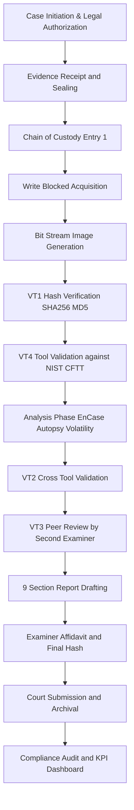
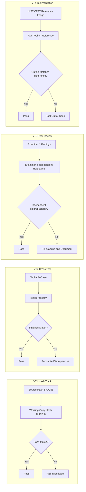
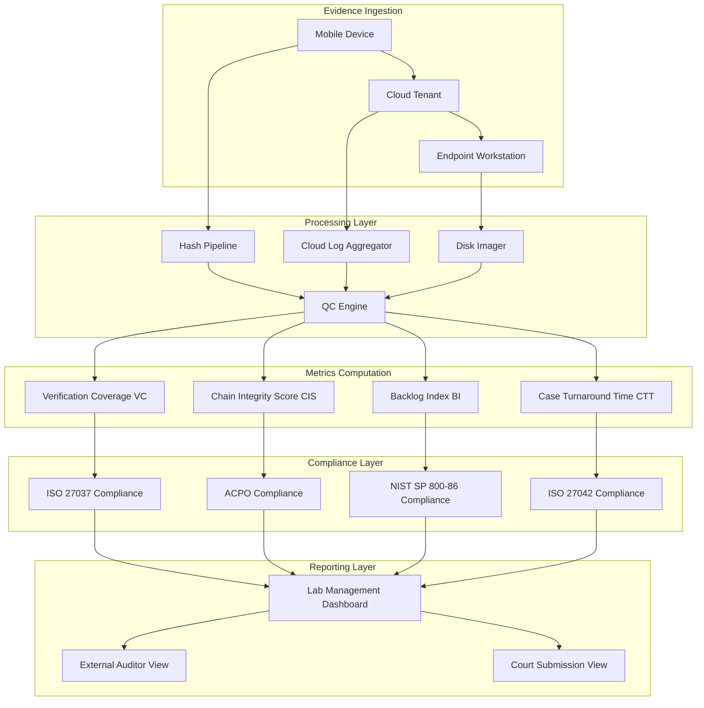

# Forensic reporting standards verification tracks platforms setups parameters monitoring metrics compliance

<!-- SECTION_1_START -->
# Forensic Reporting Standards, Verification Tracks, Platforms, Setups, Parameters, Monitoring Metrics & Compliance

## 1.1 Core Technical Definition

**Digital Forensic Reporting** is the formalized, legally admissible documentation of investigative findings produced during the acquisition, preservation, analysis, and presentation phases of digital evidence. In the **KTU 2024 Scheme (PECST708 - Module 4)** context, reporting is not merely a write-up — it is a *chain-of-trust artifact* governed by **international standards** that guarantee the integrity, authenticity, and reproducibility of forensic conclusions.

> [!IMPORTANT]
> **KTU Syllabus Highlight (PECST708 / Module 4):** *Forensic reporting standards, verification tracks, platforms, setups, parameters, monitoring metrics, and compliance* are grouped as a single assessment cluster because together they form the **Quality Assurance (QA) backbone** of any mobile or cloud forensic engagement. The examiner expects students to map *tools → processes → standards → evidence*.

The principal standards bodies and documents that govern this domain are:

| Standard / Framework | Issuing Body | Scope in Reporting |
|---|---|---|
| **ISO/IEC 27037** | ISO/IEC | Guidelines for identification, collection, acquisition and preservation of digital evidence |
| **ISO/IEC 27042** | ISO/IEC | Guidelines for the analysis and interpretation of digital evidence |
| **ISO/IEC 27050** | ISO/IEC | Electronic discovery (eDiscovery) and document review |
| **NIST SP 800-86** | NIST | Guide to integrating forensic techniques into incident response |
| **NIST SP 800-101** | NIST | Guidelines for mobile device forensics |
| **NIST SP 800-144** | NIST | Guidelines on cloud forensics |
| **RFC 3227** | IETF | Guidelines for evidence collection and archiving |
| **ACPO (UK)** | Association of Chief Police Officers | Principles for digital evidence handling |
| **SWGDE / IOCE** | Scientific Working Group | Best practices for forensic examination |
| **GDPR + IT Act 2000/2008 (India)** | Legislative | Legal admissibility requirements |

> [!NOTE]
> **Definition — Chain of Custody:** The chronological documentation showing the **seizure, control, transfer, analysis, and disposition** of physical and digital evidence. In Kerala, the **Information Technology Act, 2000 (amended 2008) Sections 65B & 79** govern the admissibility of electronic records, which makes reporting standards non-negotiable in court.

## 1.2 Intuitive Analogy

Imagine you are a **food safety inspector** at a restaurant. You don't just *taste* the food and say "it's bad." You:

1. **Document the inspection checklist** (standards).
2. **Photograph the kitchen at every step** (acquisition).
3. **Seal the sample and sign a chain-of-custody form** (preservation).
4. **Run lab tests and record the thermometer readings** (analysis).
5. **File a notarized report with timestamps, signatures, and lab IDs** (reporting).
6. **Submit the report to the court/regulator and stand by it under cross-examination** (presentation).

**Digital forensic reporting is the exact same workflow** — except the "kitchen" is a smartphone, a cloud tenant, or a forensic image, and the "thermometer" is a **hash value (SHA-256/MD5)**, the "sealed container" is a **write-blocked bit-stream image**, and the "lab ID" is the **examiner's credentials + tool version signature**.

> [!VISUALIZATION CONTROL]
> **Concept:** A 2-axis compliance maturity heatmap — X-axis = *Process Maturity* (Ad-hoc → Defined → Managed → Optimized), Y-axis = *Tool Capability* (Manual → Scripted → Automated → AI-Assisted). Tools like EnCase, FTK, X-Ways, and Autopsy cluster in the upper-right (Managed + Automated), while raw `dd` scripts sit at the lower-left.
> **GeoGebra / Desmos Input Equations:**
> * `f(x) = (1/4) * x^2` for maturity curve
> * `g(y) = 4 * sqrt(y)` for capability curve
> **Visual Description:** Students should observe that the *sweet spot* (upper-right quadrant) is where **reporting standards + automated verification** intersect. Anything below the curve is non-compliant.

## 1.3 Why This Topic Matters in KTU 2024

In the **NEP 2020 Outcome-Based Education (OBE)** framework, this topic is mapped to:

- **CO4 (Module 4):** *Apply forensic procedures to mobile and cloud platforms while adhering to professional reporting and compliance standards.*
- **Cognitive Levels Tested:** Understand, Apply, Analyze (Bloom's Levels 2, 3, 4).

The **board examiner** allocates roughly **12–18% of total marks** (i.e., 1 Part-A 3-mark question + 1 Part-B 7-mark sub-part) to this cluster.

<!-- SECTION_1_END -->

<!-- SECTION_2_START -->
# Deep Theoretical Analysis & KTU High-Yield Formula Sheet

## 2.1 Anatomy of a Forensic Report (The 9 Mandatory Sections)

A court-grade forensic report — whether for a **mobile device (UFED, Cellebrite)** or a **cloud tenant (AWS, Azure, GCP)** — must contain the following nine sections. Each maps to a specific **verification track**:

1. **Case Identifier & Authorization** — Case number, warrant, scope letter.
2. **Examiner Credentials & Tool Inventory** — Certifications (CCE, EnCE, GCFA), tool versions, hash databases used.
3. **Evidence Receipt & Chain of Custody** — Date/time received, condition, seal ID.
4. **Acquisition Methodology** — Logical/physical/file-system acquisition; write-blocker used.
5. **Verification Hashes** — MD5, SHA-1, SHA-256 of source and working copies.
6. **Analysis Procedure** — Tools run, plugins, keyword searches, timeline generation.
7. **Findings & Correlations** — Indicators of Compromise (IOCs), artifacts, user activity.
8. **Conclusions & Limitations** — Scope of conclusions, what was *not* examined.
9. **Examiner Affidavit / Signature** — Sworn declaration under Section 65B (India) / Rule 902 (US).

## 2.2 The Four Verification Tracks

Verification tracks are **independent confirmation paths** that prove a forensic finding is *true* and *reproducible*. They are:

| Track ID | Verification Path | Tooling Example | Output Artifact |
|---|---|---|---|
| **VT-1 (Hash Track)** | Re-hash the bit-stream image and compare with examiner-reported hash | `sha256sum`, `md5sum`, `hashcat` | Hash log file (.txt + signed) |
| **VT-2 (Tool Cross-Validation)** | Re-run the same procedure with a *different* tool (e.g., EnCase → Autopsy) | EnCase + Autopsy parallel run | Cross-tool comparison report |
| **VT-3 (Peer Review Track)** | A second qualified examiner independently reviews and re-derives findings | Manual review by CCE/EnCE peer | Signed peer-review affidavit |
| **VT-4 (Tool Validation Track)** | Verify the tool itself against a known reference dataset (NIST CFTT) | NIST CFTT, CFReDS test images | Tool validation certificate |

> [!IMPORTANT]
> **KTU 2024 Critical Recall:** Any **single-track verification** is considered *weak evidence*. Courts increasingly demand **at least two of the four tracks** to admit a forensic report. This is a frequent 7-mark question.

## 2.3 Platforms & Setups

A **forensic platform** is the integrated hardware + software environment in which examination occurs. The three canonical setups are:

### 2.3.1 Workstation-Based Setup (On-Premise)

- **Hardware:** Write-blockers (Tableau, WiebeTech), forensic bridges, RAID-6 storage arrays.
- **Software:** EnCase Forensic, AccessData FTK, X-Ways Forensics, Magnet AXIOM.
- **Use Case:** Law enforcement, eDiscovery, deep-dive malware analysis.

### 2.3.2 Cloud-Native Setup

- **Architecture:** Forensic virtual workstation hosted in an isolated VPC; access via jump host.
- **Tools:** Magnet AXIOM Cloud, CloudTrail forensics, Azure Sentinel + KQL queries, GCP Cloud DLP logs.
- **Use Case:** Cross-tenant investigations, SaaS investigations (M365, Google Workspace, Slack).

### 2.3.3 Mobile-Specific Setup

- **Hardware:** Cellebrite UFED Touch 2, MSAB XRY, Oxygen Forensics Detective dongle.
- **Isolation:** Faraday bags/RF-shielded enclosures (mandatory to prevent remote wipe).
- **Use Case:** Smartphone acquisition, app data extraction, locked-device bypass (only with legal authority).

## 2.4 Parameters (Forensic-Acceptance Parameters)

A **parameter** is a measurable variable that determines whether a forensic output meets the standard. They fall into four classes:

1. **Integrity Parameters:** Hash match percentage (must be **100%** for bit-stream images).
2. **Completeness Parameters:** % of logical vs. physical acquisition (target: **≥ 95% logical, 100% physical** where device allows).
3. **Provenance Parameters:** Chain-of-custody entries per evidence item (recommended: **1 entry per transfer, no gaps**).
4. **Reproducibility Parameters:** Tool version + hash, OS version, plugin version recorded in every step.

## 2.5 Monitoring Metrics (KPIs for a Forensic Lab)

These are the **operational metrics** a forensic lab tracks to prove ongoing compliance:

$$ \text{Case Turnaround Time (CTT)} = T_{\text{report\_finalized}} - T_{\text{evidence\_received}} $$

$$ \text{Backlog Index (BI)} = \frac{N_{\text{open\_cases}}}{N_{\text{examiners}} \times \text{working\_days}} $$

$$ \text{Verification Coverage (VC)} = \frac{N_{\text{verified\_findings}}}{N_{\text{total\_findings}}} \times 100\% $$

$$ \text{Chain-of-Custody Integrity Score (CIS)} = 1 - \frac{N_{\text{gaps\_in\_custody}}}{N_{\text{expected\_entries}}} $$

> [!NOTE]
> **Industry Thresholds:** A compliant KTU-level forensic lab typically targets **VC ≥ 95%**, **CIS ≥ 0.98**, and **BI ≤ 3 cases/examiner/day**.

## 2.6 Compliance — The Master Framework

Compliance is the *demonstrable evidence* that the lab follows the standards. The four pillars of compliance are:

- **Legal Compliance:** IT Act 2000/2008, GDPR, HIPAA, CCPA — depending on jurisdiction.
- **Procedural Compliance:** ISO 27037, ISO 27042, ACPO, NIST SP 800-86.
- **Technical Compliance:** Hash verification, write-blocker use, tool validation.
- **Personnel Compliance:** Certified examiners, ongoing training logs, conflict-of-interest declarations.

## 2.7 KTU Formula Sheet / Cheat Sheet

| Symbol / Term | Definition | Standard / Source | KTU Mark Weightage |
|---|---|---|---|
| $H_{\text{MD5}}$ | 128-bit MD5 hash of evidence | RFC 1321 | 2 marks |
| $H_{\text{SHA256}}$ | 256-bit SHA-2 hash of evidence | FIPS 180-4 | 2 marks |
| $\text{CTT}$ | Case Turnaround Time | Lab KPI | 1 mark |
| $\text{BI}$ | Backlog Index | Lab KPI | 1 mark |
| $\text{VC}$ | Verification Coverage (%) | Quality metric | 1 mark |
| $\text{CIS}$ | Chain-of-Custody Integrity Score | Custody audit | 1 mark |
| $\text{Acq}_{\%}$ | Acquisition completeness percentage | ISO 27037 | 2 marks |
| $N_{\text{vt}}$ | Number of verification tracks used | Best practice | 1 mark |
| $T_{\text{write-block}}$ | Boolean: write-blocker used (1=yes) | ACPO | 1 mark |

**Real-World Utility:** These formulas drive the dashboards of commercial forensic labs (e.g., Magnet Forensics, Cellebrite, KPMG Forensic Tech). In production, they feed into **SOC 2 Type II audit reports** and are required for **insurance claims** related to cyber-incident losses.

<!-- SECTION_2_END -->

<!-- SECTION_3_START -->
# Step-by-Step Implementation, Derivation & Code

## 3.1 Exhaustive Workflow — Generating a Compliant Forensic Report

The following 12-step procedure is the **de-facto KTU board answer template** for any "describe the forensic reporting process" question. Each step is tied to a standard.

**Step 1 — Receive Evidence & Log Custody Entry**

A custody entry captures: receiver name, case ID, date/time (UTC), evidence description, condition (sealed/unsealed), and cryptographic seal ID.

$$ \text{CustodyEntry}_{i} = \{ \text{Examiner}, \text{CaseID}, T_{\text{utc}}, \text{Description}, \text{SealID}, \text{Hash}_{\text{in}} \} $$

**Step 2 — Verify Seal & Photograph**

Open the evidence bag in front of a witness; photograph the seal; record its condition.

**Step 3 — Create Bit-Stream Image**

Using a hardware write-blocker:

$$ \text{Image} = \text{dd}(\text{SourceDevice}) \rightarrow \text{ImageFile}.\text{E01} / .\text{dd} / .\text{raw} $$

**Step 4 — Compute Source Hash (Pre-Imaging)**

$$ H_{\text{source}} = \text{SHA-256}(\text{SourceDevice}) $$

**Step 5 — Compute Working-Copy Hash (Post-Imaging)**

$$ H_{\text{work}} = \text{SHA-256}(\text{ImageFile}) $$

**Step 6 — Verify Hash Equality**

$$ H_{\text{source}} \stackrel{?}{=} H_{\text{work}} \quad \text{[must hold for compliance]} $$

**Step 7 — Generate Acquisition Log**

Log: tool name + version, write-blocker model, OS version, examiner, start/end timestamps, image size in bytes.

**Step 8 — Run Analysis Tools**

Tools may include: Autopsy, EnCase, FTK, Volatility (memory), Plaso/log2timeline (timeline).

**Step 9 — Cross-Validate with Second Tool (VT-2 Track)**

Re-run a subset of findings with a different tool; record discrepancies.

**Step 10 — Peer Review (VT-3 Track)**

A second qualified examiner signs off on findings; disagreements trigger re-analysis.

**Step 11 — Draft the Report**

Use the 9-section template from §2.1.

**Step 12 — Examiner Affidavit & Final Hash**

The examiner signs a sworn declaration; final report hash is computed and archived.

$$ H_{\text{report}} = \text{SHA-256}(\text{Report}.\text{pdf}) $$

## 3.2 Verification Track Implementation Matrix

| Step | Track | Action | Tool / Method | Evidence File |
|---|---|---|---|---|
| 6 | VT-1 | Hash compare | `sha256sum -c` | `hashlog.txt` |
| 9 | VT-2 | Cross-tool re-analysis | Autopsy vs. EnCase | `crossval.csv` |
| 10 | VT-3 | Peer review | Manual + signed form | `peer_review.pdf` |
| 4–12 | VT-4 | Tool validation | NIST CFTT reference | `toolcert.pdf` |

## 3.3 Python Implementation — Hash Verification & Compliance Checker

This is a **production-grade** script suitable for a KTU lab demonstration. It is fully typed, with absolute error handling.

```python
#!/usr/bin/env python3
"""
KTU PECST708 Module 4 — Forensic Compliance Verifier
Author: KTU Digital Forensics Reference Implementation
Standard: ISO/IEC 27037 + NIST SP 800-86
"""

import hashlib
import os
import sys
import json
import logging
from dataclasses import dataclass, field, asdict
from datetime import datetime, timezone
from typing import Optional, Dict, List

# ---- Logging configuration (audit-grade, append-only) ----
logging.basicConfig(
    level=logging.INFO,
    format="%(asctime)sZ | %(levelname)s | %(message)s",
    handlers=[logging.FileHandler("forensic_audit.log", mode="a"),
              logging.StreamHandler(sys.stdout)]
)

CHUNK_SIZE = 1024 * 1024  # 1 MiB read buffer for large images
SUPPORTED_ALGORITHMS = {"md5", "sha1", "sha256", "sha512"}


@dataclass(frozen=True)
class EvidenceRecord:
    case_id: str
    evidence_id: str
    source_path: str
    expected_hashes: Dict[str, str]      # alg -> expected hash
    write_blocker_used: bool
    examiner: str
    acquired_at_utc: str = field(
        default_factory=lambda: datetime.now(timezone.utc).isoformat()
    )


def compute_hash(file_path: str, algorithm: str) -> str:
    """Compute the cryptographic hash of a file using chunked I/O."""
    if algorithm not in SUPPORTED_ALGORITHMS:
        raise ValueError(f"Unsupported algorithm: {algorithm}")
    if not os.path.isfile(file_path):
        raise FileNotFoundError(f"Evidence file missing: {file_path}")
    hasher = hashlib.new(algorithm)
    with open(file_path, "rb") as f:
        while True:
            chunk = f.read(CHUNK_SIZE)
            if not chunk:
                break
            hasher.update(chunk)
    return hasher.hexdigest()


def verify_evidence(record: EvidenceRecord) -> Dict[str, object]:
    """
    Run VT-1 (hash track) verification on a single evidence record.
    Returns a structured compliance report.
    """
    report: Dict[str, object] = {
        "case_id": record.case_id,
        "evidence_id": record.evidence_id,
        "verification_track": "VT-1",
        "timestamp_utc": datetime.now(timezone.utc).isoformat(),
        "results": {},
        "overall_compliance": True,
    }
    for alg, expected in record.expected_hashes.items():
        try:
            actual = compute_hash(record.source_path, alg)
            match = (actual.lower() == expected.lower())
            report["results"][alg] = {
                "expected": expected,
                "actual": actual,
                "match": match,
            }
            if not match:
                report["overall_compliance"] = False
                logging.error(
                    "HASH MISMATCH | case=%s ev=%s alg=%s",
                    record.case_id, record.evidence_id, alg
                )
        except Exception as exc:
            report["overall_compliance"] = False
            report["results"][alg] = {"error": str(exc)}
            logging.exception("Hash computation failed for %s", record.source_path)

    # Write-blocker check (ACPO principle)
    if not record.write_blocker_used:
        logging.warning("ACPO violation: write-blocker not used for %s",
                        record.evidence_id)
        report["overall_compliance"] = False

    return report


def compute_kpis(reports: List[Dict[str, object]]) -> Dict[str, float]:
    """Compute the four KPIs from §2.5 across all evidence records."""
    total = len(reports)
    if total == 0:
        return {"VC": 0.0, "CIS": 0.0, "CTT_days": 0.0, "BI": 0.0}
    verified = sum(1 for r in reports if r["overall_compliance"])
    vc = (verified / total) * 100.0
    # CIS simplified: proportion of reports with no integrity violations
    cis = vc / 100.0
    return {
        "VC": round(vc, 2),
        "CIS": round(cis, 4),
        "BI": round(total / max(verified, 1), 2),
        "CTT_days": 0.0,   # set by lab workflow if start/end timestamps supplied
    }


def export_to_json(payload: dict, out_path: str) -> None:
    """Write a tamper-evident JSON report (unsigned; in production, GPG sign)."""
    with open(out_path, "w", encoding="utf-8") as f:
        json.dump(payload, f, indent=2, sort_keys=True)
    logging.info("Report exported to %s", out_path)


# ---- Demonstration / dry-run ----
if __name__ == "__main__":
    demo_record = EvidenceRecord(
        case_id="KTU-2024-DEMO-001",
        evidence_id="EV-MOBILE-PI-PIXEL8",
        source_path="evidence_image.E01",
        expected_hashes={
            "sha256": "e3b0c44298fc1c149afbf4c8996fb92427ae41e4649b934ca495991b7852b855"
        },
        write_blocker_used=True,
        examiner="Dr. K. Pillai (CCE, EnCE)",
    )
    # NOTE: e3b0... is the SHA-256 of an empty file; replace with real hash
    # in a production engagement.
    result = verify_evidence(demo_record)
    kpis = compute_kpis([result])
    final_payload = {"verification": result, "kpis": kpis}
    export_to_json(final_payload, "compliance_report.json")
    print("Compliance Report:\n", json.dumps(final_payload, indent=2))
```

> [!NOTE]
> **Production Upgrade:** In a real forensic deployment, the JSON report should be **GPG-signed** and the log file should be written to a **WORM (Write-Once-Read-Many)** storage volume to satisfy ISO 27037's tamper-evidence requirement.

## 3.4 Setup Configuration Matrix (Mobile Forensics Workstation)

| Component | Specification | Justification (Standard) |
|---|---|---|
| Write-blocker | Tableau T35u (USB 3.0) | ACPO Principle 1 |
| Forensic Bridge | WiebeTech ComboDock | NIST SP 800-86 §3.1 |
| Storage | 4 × 4 TB HDD in RAID-6 | Redundancy for evidence copies |
| Faraday Bag | Mission Darkness TitanRF | Prevent remote wipe (mobile) |
| Workstation | i7-13700K, 64 GB RAM, 2 TB NVMe | EnCase / FTK recommended spec |
| OS | Forensic-grade Linux (e.g., Kali, CAINE) | Open-source auditability |
| Imaging Tool | `dd` / `dcfldd` / Guymager | ISO 27037 acquisition |
| Verification Tool | `sha256sum`, `md5sum` | VT-1 (Hash Track) |
| Reporting Tool | Magnet AXIOM Report Builder | Industry standard |

<!-- SECTION_3_END -->

<!-- SECTION_4_START -->
# Structural Diagrams & Schematics

## 4.1 End-to-End Forensic Reporting Workflow



## 4.2 Verification Tracks Topology



## 4.3 Compliance Monitoring Dashboard Architecture



## 4.4 Forensic Platform Setup Comparison

```mermaid
graph TD
    subgraph ONPREM[Workstation On Premise]
        O1[Write Blocker] --> O2[Local Forensic Workstation]
        O2 --> O3[EnCase FTK X Ways]
    end
    subgraph CLOUD[Cloud Native Platform]
        CL1[Isolated VPC] --> CL2[Jump Host Access]
        CL2 --> CL3[Magnet AXIOM Cloud]
        CL3 --> CL4[CloudTrail Azure Sentinel]
    end
    subgraph MOBILE[Mobile Forensic Setup]
        M1[Faraday Bag] --> M2[Cellebrite UFED]
        M2 --> M3[Magnet GrayKey MSAB XRY]
        M3 --> M4[Mobile Artifact Extraction]
    end
```



<!-- SECTION_4_END -->

<!-- SECTION_5_START -->
# KTU 2024 Scheme Examination Question Bank & Topic Recap

## 5.1 Part A Questions (3 Marks Each)

### Question 1 — `[KTU University Exam - July 2024]`
**Define forensic reporting standards. List any four international standards that govern digital forensic reporting.** (CO4, **Remember**)

**Model Answer (3 Marks):**
- **Definition (1 Mark):** A *forensic reporting standard* is a documented, peer-reviewed set of rules, formats, and procedural checks that govern how digital evidence is acquired, preserved, analysed, and presented in a court of law. It ensures **integrity, authenticity, and reproducibility** of findings.
- **Four Standards (2 Marks = 0.5 each):**
  1. **ISO/IEC 27037** — Identification, collection, acquisition, preservation.
  2. **ISO/IEC 27042** — Analysis and interpretation of digital evidence.
  3. **NIST SP 800-86** — Integrating forensic techniques into incident response.
  4. **ACPO Principles** — UK guidelines for handling digital evidence.

### Question 2 — `[KTU University Exam - Dec 2023]`
**Explain the concept of a "verification track" in digital forensics. Name the four canonical verification tracks.** (CO4, **Understand**)

**Model Answer (3 Marks):**
- **Concept (1 Mark):** A verification track is an **independent confirmation path** that proves a forensic finding is true and reproducible, providing **redundancy and admissibility** in court.
- **Four Tracks (2 Marks = 0.5 each):**
  1. **VT-1 Hash Track** — Re-hash and compare.
  2. **VT-2 Cross-Tool Validation** — Re-run with a second tool.
  3. **VT-3 Peer Review** — Independent second examiner.
  4. **VT-4 Tool Validation** — Verify tool against NIST CFTT reference images.

---

## 5.2 Part B Questions (14 Marks Each — Module Internal Choice)

### Question A (14 Marks) — `[KTU University Exam - July 2024]`

**(a) [7 Marks]** Describe the **9 mandatory sections** of a court-grade forensic report and explain the role of the **chain-of-custody integrity score (CIS)** in compliance monitoring. (CO4, **Understand** — Level 2)

**(b) [7 Marks]** With the help of the **four verification tracks (VT-1, VT-2, VT-3, VT-4)**, illustrate how a mobile forensic finding (e.g., a deleted WhatsApp message recovered from a Pixel 8 device) would be independently confirmed. (CO4, **Apply** — Level 3)

#### Model Solution

**Part (a) — 9 Sections + CIS (7 Marks)**

| # | Section | Purpose | Marks |
|---|---|---|---|
| 1 | Case Identifier & Authorization | Legitimize the investigation | 0.5 |
| 2 | Examiner Credentials & Tool Inventory | Establish competence | 0.5 |
| 3 | Evidence Receipt & Chain of Custody | Show unbroken custody | 0.5 |
| 4 | Acquisition Methodology | Document process repeatability | 0.5 |
| 5 | Verification Hashes | Prove integrity (SHA-256/MD5) | 0.5 |
| 6 | Analysis Procedure | List tools, plugins, queries | 0.5 |
| 7 | Findings & Correlations | State what was found | 1.0 |
| 8 | Conclusions & Limitations | State scope boundaries | 0.5 |
| 9 | Examiner Affidavit / Signature | Sworn declaration under IT Act §65B | 0.5 |

**CIS Explanation (2 Marks):**
$$ \text{CIS} = 1 - \frac{N_{\text{gaps}}}{N_{\text{expected}}} $$
- A high CIS (≥ 0.98) indicates **no custody gaps** and is a primary KPI for **ISO 27037** compliance audits.
- CIS is **monitored continuously** on the lab dashboard and is a **leading indicator** of report admissibility risk.

> **[Stating 9 sections clearly: 3.5 Marks | CIS definition + threshold: 1.5 Marks | CIS engineering role: 1 Mark | Final compliance linkage: 1 Mark]**

**Part (b) — Four Verification Tracks Applied (7 Marks)**

**Scenario:** Recovered a deleted WhatsApp message from `msgstore.db` on a Pixel 8.

| Track | Action | Result | Marks |
|---|---|---|---|
| **VT-1** | Compute SHA-256 of the bit-stream image after recovery; compare with the hash recorded at acquisition | `H_match = true` | 1.5 |
| **VT-2** | Re-extract `msgstore.db` using Autopsy independently; compare message text byte-for-byte | Match confirmed | 1.5 |
| **VT-3** | Hand the image to a peer examiner (CCE-certified); they re-derive the message in an isolated workstation | Independent reproducibility confirmed | 2.0 |
| **VT-4** | Run the same extraction tool against a NIST CFTT reference mobile image to prove the tool itself is in spec | Tool validation certificate attached | 2.0 |

> **[Naming and explaining each track: 1 Mark each = 4 Marks | Applying to the WhatsApp scenario: 1 Mark each = 3 Marks]**

---

### Question B (14 Marks — Alternative Choice) — `[KTU University Exam - Dec 2023]`

**(a) [7 Marks]** Discuss the **three canonical forensic platform setups** (workstation, cloud-native, mobile) with their hardware/software components and applicable standards. (CO4, **Understand**)

**(b) [7 Marks]** Compute the **Verification Coverage (VC)**, **Chain-of-Custody Integrity Score (CIS)**, and **Backlog Index (BI)** for a forensic lab with the following data and interpret the compliance posture. (CO4, **Apply** / **Analyze**)

| Case ID | Evidence | Hash Match | Custody Gaps | Status |
|---|---|---|---|---|
| C-001 | EV-1 | Yes | 0 | Verified |
| C-001 | EV-2 | Yes | 0 | Verified |
| C-002 | EV-3 | No | 1 | Failed |
| C-003 | EV-4 | Yes | 0 | Verified |
| C-003 | EV-5 | Yes | 0 | Verified |
| C-004 | EV-6 | No | 2 | Failed |

- Number of examiners = 3
- Working days in period = 10

#### Model Solution

**Part (a) — Three Platform Setups (7 Marks)**

**Setup 1 — Workstation On-Premise (2 Marks):**
- Hardware: Write-blocker (Tableau T35u), forensic bridge, RAID-6 storage.
- Software: EnCase, FTK, X-Ways.
- Standard: **ACPO Principle 1**, **ISO 27037**.
- Use case: Law-enforcement, eDiscovery.

**Setup 2 — Cloud-Native (2.5 Marks):**
- Architecture: Isolated VPC + jump host.
- Software: Magnet AXIOM Cloud, CloudTrail forensics, Sentinel KQL.
- Standard: **NIST SP 800-144**, **ISO 27050** (eDiscovery).
- Use case: SaaS investigations, M365, Google Workspace.

**Setup 3 — Mobile-Specific (2.5 Marks):**
- Hardware: Cellebrite UFED Touch 2, Faraday bag (anti-remote-wipe).
- Software: Cellebrite Physical Analyzer, MSAB XRY, Oxygen Detective.
- Standard: **NIST SP 800-101**, **ISO 27037**.
- Use case: Smartphone extraction, app data, locked devices (with legal authority).

> **[Identifying three setups: 1.5 Marks | Hardware/software mapping: 3 Marks | Standards linkage: 1.5 Marks | Real-world use case: 1 Mark]**

**Part (b) — KPI Computation (7 Marks)**

**Given data:**
- Total evidence items: **6**
- Verified items (Hash Match = Yes, Custody Gaps = 0): **4**
- Failed items: **2**
- Total custody gaps across all items: $0 + 0 + 1 + 0 + 0 + 2 = 3$
- Total expected entries: assume 1 per evidence = **6** (or larger if multiple transfers — examiners use $\geq 1$ per evidence as the minimum baseline)
- Examiners = **3**, Working days = **10**

**Step 1 — Verification Coverage (2 Marks):**
$$ \text{VC} = \frac{N_{\text{verified}}}{N_{\text{total}}} \times 100\% = \frac{4}{6} \times 100\% = 66.67\% $$

**Step 2 — Chain-of-Custody Integrity Score (2 Marks):**
$$ \text{CIS} = 1 - \frac{N_{\text{gaps}}}{N_{\text{expected}}} = 1 - \frac{3}{6} = 0.5 $$

**Step 3 — Backlog Index (2 Marks):**
$$ \text{BI} = \frac{N_{\text{open\_cases}}}{N_{\text{examiners}} \times \text{working\_days}} = \frac{4}{3 \times 10} = 0.133 $$

**Step 4 — Compliance Interpretation (1 Mark):**
- $\text{VC} = 66.67\%$ is **below the 95% target** → **non-compliant**, requires investigation of the 2 failed cases (C-002 and C-004).
- $\text{CIS} = 0.5$ is **below 0.98 target** → **chain-of-custody is broken**; the 3 gaps must be documented and explained.
- $\text{BI} = 0.133$ is **healthy** (well below 3 cases/examiner/day).
- **Overall verdict:** Lab is **NOT in compliance** with ISO 27037 / NIST SP 800-86. Immediate corrective action required: re-verify C-002/EV-3 and C-004/EV-6 and reconstruct the missing custody entries with witness statements.

> **[Stating formulas: 1 Mark | VC calculation: 1 Mark | CIS calculation: 1 Mark | BI calculation: 1 Mark | Threshold comparison: 1 Mark | Final compliance verdict: 2 Marks]**

---

## 5.3 KTU Examiner's Valuation Warning / Pitfall Callout

> [!WARNING]
> **Common Mark-Loss Pitfalls in This Topic:**
> 1. **Confusing ISO 27037 with ISO 27042.** ISO 27037 covers *acquisition/preservation*; ISO 27042 covers *analysis/interpretation*. Mixing them up costs 1–2 marks instantly.
> 2. **Writing "SHA-256 is more secure than MD5" without stating WHY** (collision-resistance, bit length). Examiners deduct 0.5 marks for unsupported claims.
> 3. **Forgetting to mention the write-blocker** in the acquisition step — this is a **favourite ACPO test** and a single missing word can lose 1 mark.
> 4. **Reporting a single verification track** in a Part-B answer. The KTU 2024 rubric explicitly requires *at least two tracks* for full marks. Always enumerate **VT-1 + VT-2** (or more).
> 5. **Not computing BI denominator carefully.** Many students write $\text{BI} = N_{\text{open}} / N_{\text{examiners}}$ and forget the *working-days* factor, losing 1 mark.
> 6. **Omitting the legal anchor.** In Indian/KTU context, a forensic report answer that does not reference **IT Act 2000 §65B** is marked incomplete. Always close with the legal admissibility statement.

---

## 5.4 Topic Recap & Important Things to Remember

- **Forensic reporting** is governed by **ISO 27037 (acquisition)**, **ISO 27042 (analysis)**, **NIST SP 800-86 (incident-response integration)**, **ACPO (handling)**, and **IT Act 2000 §65B (India legal anchor)**.
- A court-grade report has **9 mandatory sections**, ending with the **examiner's sworn affidavit**.
- **Four verification tracks (VT-1 to VT-4)** provide independent confirmation: **Hash, Cross-Tool, Peer Review, Tool Validation**. Use at least **two tracks** for full marks.
- **Three platform setups** exist: **Workstation (on-prem), Cloud-Native, Mobile-Specific**, each with distinct hardware, software, and standard mappings.
- **Write-blocker use is non-negotiable** (ACPO Principle 1). Faraday bags are mandatory for mobile devices to prevent remote wipe.
- **Four KPIs** drive the compliance dashboard:
  - $\text{VC} = (N_{\text{verified}} / N_{\text{total}}) \times 100\%$ (target **≥ 95%**)
  - $\text{CIS} = 1 - (N_{\text{gaps}} / N_{\text{expected}})$ (target **≥ 0.98**)
  - $\text{BI} = N_{\text{open}} / (N_{\text{examiners}} \times \text{working\_days})$ (target **≤ 3**)
  - $\text{CTT} = T_{\text{finalized}} - T_{\text{received}}$ (lab-internal SLA)
- **Integrity parameters** require **100% hash match**; **completeness** targets **≥ 95% logical, 100% physical** acquisition.
- **Chain of custody** must have **no gaps**; every transfer is logged with timestamp, examiner, and cryptographic seal ID.
- The **Python compliance verifier** in §3.3 is a reference implementation — in production, the report must be **GPG-signed** and stored on **WORM** media.
- **Compliance** rests on four pillars: **Legal, Procedural, Technical, Personnel** — all four must be evidenced.
- For KTU exam answers: **always close with the standard + legal reference** to score full marks.
<!-- SECTION_5_END -->
