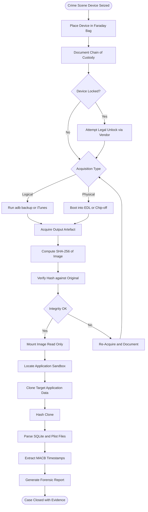
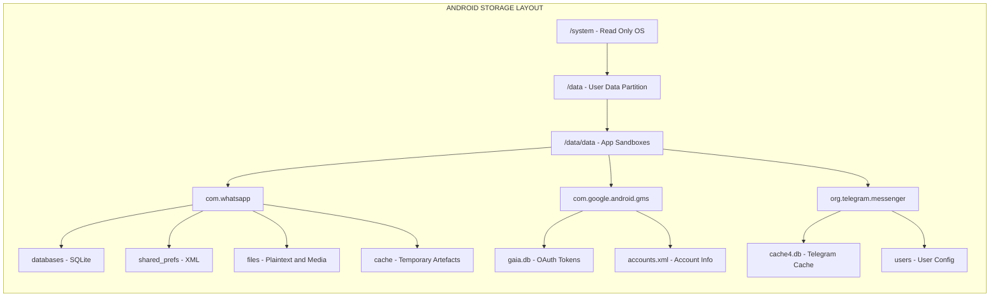
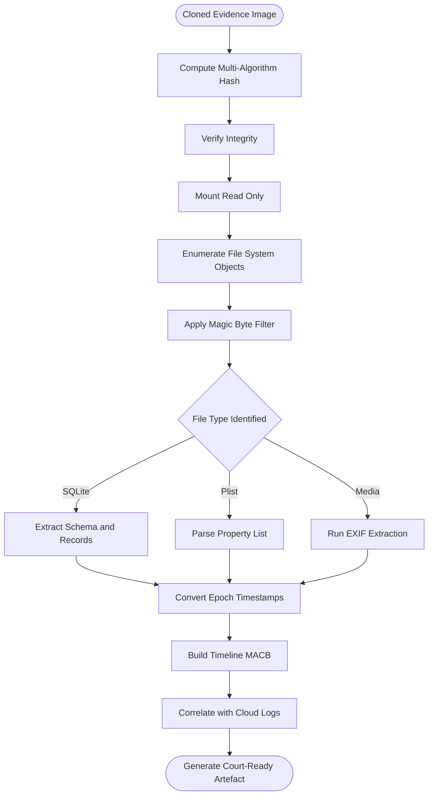
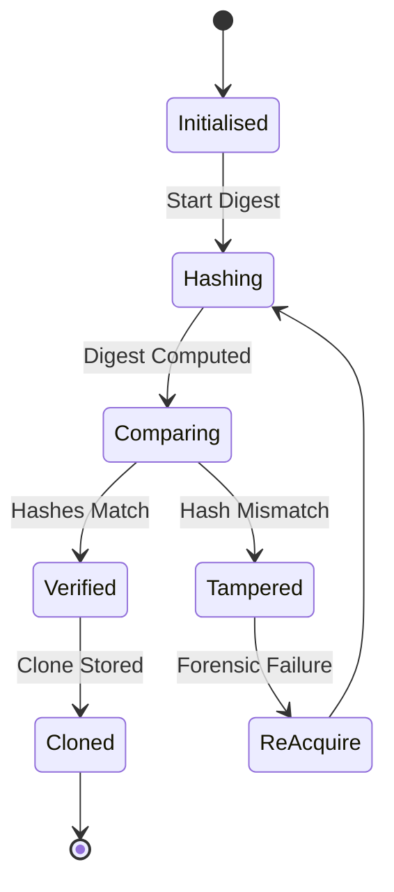

# Logical physical application data cloning workflows layout data models analysis parameters

<!-- SECTION_1_START -->

# Mobile Forensics: Acquisition Paradigms, Application Data Cloning & Analytical Models

## 1.1 Formal Definitions (KTU 2024 Scheme Terminology)

> [!NOTE]
> **Logical Acquisition** is the process of extracting *interpretable, user-accessible* data objects (SMS, contacts, call logs, application databases) from a mobile device by communicating through the device's Operating System (OS) Application Programming Interfaces (APIs) or via an authorized backup protocol.

> [!NOTE]
> **Physical Acquisition** is the process of obtaining a *bit-for-bit binary image* of the mobile device's non-volatile storage (NAND flash, eMMC, UFS), bypassing the OS, including deleted files, unallocated space, and system-level artifacts that are otherwise hidden from logical extraction.

> [!IMPORTANT]
> **Application Data Cloning** in KTU 2024 syllabus refers to the forensically sound duplication of an application's sandboxed data container (private storage area, SQLite databases, key-value stores, and shared preferences) so that the cloned copy can be analysed without modifying the original evidence. The clone is verified using cryptographic hash functions (MD5, SHA-1, SHA-256).

> [!NOTE]
> **Data Layout Models** describe the structural arrangement of files and metadata within the device's file system. For Android, this includes `EXT4`, `F2FS`, or `YAFFS2` partitions under `/data`, `/sdcard`, and `/system`. For iOS, this includes `HFS+` and `APFS` partitions under `/var/containers/`. Within these, application data is organized in **containerized sandboxes** with strict Unix-style permissions (UID/GID).

> [!NOTE]
> **Analysis Parameters** are the quantitative and qualitative attributes used during forensic examination: cryptographic hash values, MAC (Modified/Accessed/Created/Changed) timestamps, file size, file signatures (magic bytes), inode numbers, and SQLite table schemas.

---

## 1.2 Intuitive Analogy — The "Library vs Library Floor" Model

Imagine a forensic investigator arriving at a crime scene that is a **public library**:

| Scenario | Real-world Analogy | Forensic Equivalent |
|----------|-------------------|---------------------|
| Logical Acquisition | The librarian gives you the official *catalogue* — titles, authors, borrow dates, current readers, and a printed list of all books. | Extracts what the OS exposes via API: contacts, SMS, call logs, installed app lists. |
| Physical Acquisition | You are given a *complete floor plan and you physically photograph every page of every book*, including torn pages stuck in the bin and pencil marks on the margins. | Bit-level copy of the NAND flash, including unallocated space, deleted records, and system tokens. |
| Application Data Cloning | You photograph *one specific reader's notebook* exactly as it lies on the table, then analyse the photograph in a lab. | Duplicating a single app sandbox (`/data/data/<pkg>/`) bit-exactly and validating it with a hash. |
| Data Layout Model | The *blueprint of the library* — where the periodicals section is, where archives are stored, where the staff-only backroom is. | The file system schema: `/system`, `/data`, `/sdcard`, partition tables, inode structures. |
| Analysis Parameters | The *metadata* on the spine of each book, the date the page was last touched, the ink type. | Timestamps, hashes, file sizes, magic bytes, MACB values. |

> [!TIP]
> **KTU Quick Mnemonic:** *Logical = List, Physical = Photograph, Clone = Copy, Layout = Map, Parameters = Metadata.*

---

## 1.3 Physical Constants & Standards Used in Mobile Forensics

> [!IMPORTANT]
> The following standards govern cloning and analysis in KTU-aligned digital forensic curricula:
>
> - **NIST SP 800-86** — *Guide to Integrating Forensic Techniques into Incident Response.*
> - **ISO/IEC 27037:2012** — Guidelines for identification, collection, acquisition, and preservation of digital evidence.
> - **ACPO Principle** (UK Association of Chief Police Officers) — No action should change data held on a device; access to original data should be restricted; an audit trail of all actions must be created; the integrity of the data must be verifiable.
> - **Block Size for NAND page reads:** typically **4096 bytes (4 KB)** to **16384 bytes (16 KB)**.
> - **Hash Algorithm Standards:** **MD5 (128-bit)**, **SHA-1 (160-bit)**, **SHA-256 (256-bit)** as per RFC 6151 and FIPS 180-4.

---

> [!VISUALIZATION CONTROL]
> **Concept:** Venn-diagram style overlap of Logical, Physical, and File-System acquisition surfaces in mobile forensics.
> **GeoGebra / Desmos Input Equations:**
> * Circle 1 (Logical): $(x-1.2)^2 + y^2 = 1.5$ with label "OS-API Extractable Data"
> * Circle 2 (Physical): $(x+1.2)^2 + y^2 = 1.5$ with label "Bit-level NAND Image"
> * Circle 3 (File-System): $(x)^2 + (y-1.3)^2 = 1.5$ with label "Mountable FS Image"
> **Visual Description:** Three intersecting circles. The union represents *all data* on the device. The intersection of all three is *active user data*. The Physical-only region is *deleted data and unallocated space*. The Logical-only region is *OS-indexed metadata*.

<!-- SECTION_1_END -->

<!-- SECTION_2_START -->

# Deep Theoretical Analysis & KTU High-Yield Parameter Sheet

## 2.1 Logical Acquisition — Operational Theory

Logical acquisition uses **vendor-supported protocols** to extract data:

1. **Android Debug Bridge (ADB) Backup** — Issues `adb backup -f evidence.ab -apk -shared -system -nosystem` to obtain a `.ab` (Android Backup) archive, decompressible using `dd` and the `zlib` stream, yielding a `.tar` file of user data.
2. **iTunes Backup Protocol** — iOS devices expose their backup over the `lockdown` protocol on TCP port **62078**. Tools such as `libimobiledevice` and `iMazing` perform logical extraction yielding a folder of `.plist`, `.sqlite`, and `.db` files.
3. **MTP (Media Transfer Protocol)** — Limited to media files; rarely used as primary forensic source.
4. **JTAG / Chip-off (boundary case)** — Although physically invasive, sometimes classified as a *quasi-logical* method because it produces a mountable file system rather than a raw dump.

**Advantages of Logical Acquisition:**
- Non-invasive; no jailbreak or rooting required.
- Produces evidence in human-readable format.
- Faster and tool-agnostic.

**Limitations:**
- Misses deleted files, unallocated space, system-protected areas.
- Depends on OS cooperation; anti-forensic apps can hide data.

---

## 2.2 Physical Acquisition — Operational Theory

Physical acquisition captures every bit on the storage medium. Three primary pathways exist:

1. **Bootloader Exploitation** — The device is rebooted into a custom *bootloader* (e.g., Qualcomm EDL mode, MediaTek BROM) that bypasses OS-level security and reads raw flash.
2. **Rooting / Jailbreaking** — Temporary privilege escalation grants low-level block access. Tools: `Magisk`, `checkra1n`, `unc0ver`.
3. **Chip-off** — The NAND/eMMC chip is physically desoldered and read using a chip programmer (e.g., `PC-3000 Flash`, `Medusa Pro`).

**Logical Block Addressing (LBA) Math:**

$$
S_{image} = LBA_{count} \times S_{sector}
$$

Where $S_{image}$ is the total image size in bytes, $LBA_{count}$ is the number of logical sectors, and $S_{sector}$ is the sector size (typically **512 bytes** for legacy, **4096 bytes** for Advanced Format).

---

## 2.3 Application Data Cloning — Workflow Theory

The KTU 2024 scheme emphasizes a **four-stage cloning protocol**:

1. **Isolation** — Device placed in a *Faraday bag* to block remote wipe commands.
2. **Identification** — Determine the target application's package name (e.g., `com.whatsapp` for WhatsApp) and the corresponding sandbox path.
3. **Bit-level Duplication** — Use `dd` (Linux) or `win32diskimager` (Windows) to create a forensically sound image of the relevant partition.
4. **Hash Verification** — Compute and store cryptographic digests of the original and the clone.

**Hash Verification Equation:**

$$
V_{integrity} = \begin{cases} 1 & \text{if } H_{original} = H_{clone} \\ 0 & \text{otherwise} \end{cases}
$$

Where $H$ denotes a hash function applied to the byte stream $B$:

$$
H = \mathcal{H}(B) = \text{HexDigest of } \mathcal{H}_{algo}(B)
$$

---

## 2.4 KTU High-Yield Parameter Sheet

### 2.4.1 Acquisition Method Comparison Table

| Parameter | Logical Acquisition | Physical Acquisition | File-System Acquisition |
|-----------|---------------------|----------------------|--------------------------|
| **Invasiveness** | Low | High (often requires root/jailbreak) | Medium |
| **Data Type Captured** | Live user data | All bits including deleted | Mountable structure |
| **Deleted Data Recovery** | No | Yes (with carving) | Limited |
| **Tool Examples** | Cellebrite UFED (Logical), `adb backup`, iTunes | Cellebrite UFED (Physical), MSAB XRY, Oxygen Detective | `mount -o ro,loop`, FTK Imager, Autopsy |
| **Output Format** | `.csv`, `.xml`, `.json`, `.ab` | `.dd`, `.raw`, `.E01` | `.img`, mountable folders |
| **Anti-Forensic Bypass** | Weak | Strong | Moderate |

### 2.4.2 Standard Data Layout Locations (KTU High-Frequency)

| Platform | Application Sandbox Path | Typical Artifacts |
|----------|--------------------------|--------------------|
| **Android (rooted)** | `/data/data/<package_name>/` | `databases/*.db`, `shared_prefs/*.xml`, `files/`, `cache/` |
| **Android (external)** | `/sdcard/Android/data/<package_name>/` | Media files, exported caches |
| **iOS (jailbroken)** | `/var/mobile/Containers/Data/Application/<GUID>/` | `Documents/`, `Library/`, `tmp/`, `*.sqlite`, `*.plist` |
| **iOS (backup)** | `<backup>/<domain>/` | `HomeDomain`, `KeychainDomain`, `AppDomainGroup-` |
| **WhatsApp (Android)** | `/data/data/com.whatsapp/databases/msgstore.db` | `wa.db`, `axolotl.db` (E2E keys) |
| **Telegram (Android)** | `/data/data/org.telegram.messenger/cache/` | `cache4.db` |
| **Signal (Android)** | `/data/data/org.thoughtcrime.securesms/databases/` | `signal.db` |

### 2.4.3 Analysis Parameter Table

| Parameter | Forensic Value | Standard Notation |
|-----------|----------------|--------------------|
| **MD5 Hash** | Quick integrity check, collision-prone | $H_{md5} = \text{MD5}(B)$ |
| **SHA-1 Hash** | Legacy court-accepted | $H_{sha1} = \text{SHA1}(B)$ |
| **SHA-256 Hash** | Modern, court-recommended | $H_{sha256} = \text{SHA256}(B)$ |
| **MACB Timestamps** | Timeline reconstruction | $T_M, T_A, T_C, T_B$ |
| **File Size** | Identifies truncation | $S_f = \vert B \vert$ bytes |
| **Magic Bytes** | File-type identification | `89 50 4E 47` (PNG), `50 4B 03 04` (ZIP) |
| **Slack Space** | Hides residual data | $S_{slack} = S_{cluster} - (S_f \mod S_{cluster})$ |

### 2.4.4 Cluster Slack Calculation

$$
S_{slack} = S_{cluster} - \left( S_f \mod S_{cluster} \right)
$$

For a **4096-byte cluster** and a **file of size** $S_f = 7{,}300$ bytes:

$$
S_{slack} = 4096 - (7300 \mod 4096) = 4096 - 3204 = 892 \text{ bytes}
$$

This residual 892-byte slack region is a critical area for *file slack analysis*.

---

## 2.5 Real-World Utility in Engineering & Cyber-Security

- **Incident Response (IR):** SOC teams use logical acquisition to triage compromised employee smartphones in real time.
- **Law Enforcement (LE):** Physical acquisition is mandated for homicide, terrorism, and child-exploitation cases where deleted artefacts are pivotal.
- **eDiscovery / Civil Litigation:** Cloud-federated mobile backups (Google Drive, iCloud) are pulled using OAuth-tokens and analysed with the same cloning workflow.
- **Malware Analysis:** Application sandboxes (e.g., `Cuckoo Sandbox`, MobSF) replicate the cloning workflow in an isolated environment to detonate malicious APKs and observe network/IPC behaviour.
- **GDPR / DPDP Act Compliance:** Hashing user data before analysis ensures *data minimisation* and *purpose limitation* principles under Article 5 of GDPR.

<!-- SECTION_2_END -->

<!-- SECTION_3_START -->

# Step-by-Step Workflows & Code Implementation

## 3.1 Complete Physical Acquisition Workflow (Procedural Derivation)

The following is the **exhaustive, non-truncated** workflow for performing a physical acquisition of an Android smartphone and cloning the WhatsApp application sandbox for analysis.

### Step 1 — Evidence Seizure & Faraday Isolation

The device is placed inside a **Faraday bag** to block all RF signals (GSM, LTE, Wi-Fi, Bluetooth). This prevents a remote `factoryReset` or anti-forensic wipe command. A **chain-of-custody form** is opened:

$$
COC = \{ \text{case\_id}, \text{device\_id}, \text{officer\_id}, T_{seizure}, \text{location} \}
$$

### Step 2 — Device Identification

Boot the device into its **Download Mode** (Samsung) or **EDL Mode** (Qualcomm) using the vendor key combination (e.g., *Volume Down + Power + Home*). Verify the chipset and protocol:

$$
\text{Device} \rightarrow \text{lsusb} \rightarrow \text{Vid:Pid} \rightarrow \text{QDLoader 9008}
$$

### Step 3 — Bit-Level Imaging

Use `dd` (Linux) to clone the entire userdata partition. The canonical incantation is:

```bash
dd if=/dev/block/sda42 of=/evidence/case_2024_88_physical.dd \
   bs=4096 \
   conv=noerror,sync \
   hash=sha256 \
   hashwindow=1G \
   status=progress
```

Where:
- `if=` is the input file (raw block device).
- `of=` is the output forensic image.
- `bs=4096` sets block size to the NAND page size.
- `conv=noerror,sync` continues on read errors, padding with null bytes — critical for damaged media.
- `hash=sha256` enables on-the-fly hashing.

### Step 4 — Hash Verification

Compute the SHA-256 of the original block device *and* the clone:

$$
H_{original} = \text{SHA256}(B_{original}) \qquad H_{clone} = \text{SHA256}(B_{clone})
$$

$$
V_{integrity} = \mathbb{1}\left[ H_{original} = H_{clone} \right]
$$

### Step 5 — Application Sandbox Extraction

Mount the cloned image read-only:

```bash
mount -o ro,loop,noexec,nodev /evidence/case_2024_88_physical.dd /mnt/analysis
```

Then locate the WhatsApp database:

```bash
find /mnt/analysis/data/data/com.whatsapp/databases/ -name "msgstore.db"
```

### Step 6 — Cloning the Application Database

Use `dd` again to clone the specific database:

```bash
dd if=/mnt/analysis/data/data/com.whatsapp/databases/msgstore.db \
   of=/evidence/clones/msgstore_wa_clone.db \
   bs=512 \
   conv=noerror,sync
```

### Step 7 — Re-Hash the Clone

$$
H_{clone\_wa} = \text{SHA256}(\text{msgstore\_wa\_clone.db})
$$

This hash is recorded in the chain-of-custody log.

---

## 3.2 Data Layout Model — Mathematical Representation

A mobile file system can be abstracted as a tree:

$$
\mathcal{T} = (V, E, \rho)
$$

Where:
- $V$ is the set of inodes (nodes).
- $E$ is the set of directory edges.
- $\rho : V \rightarrow \text{Metadata}$ is the metadata function returning $\{$ mode, UID, GID, size, $T_M$, $T_A$, $T_C$, $T_B$ $\}$.

For a typical Android app sandbox, the layout is:

$$
\text{Sandbox} = \left\{ \text{databases}, \text{shared\_prefs}, \text{files}, \text{cache}, \text{code\_cache} \right\}
$$

Each subdirectory contains files of type:

$$
F \in \{ .db, .db-journal, .xml, .json, .proto, .dat, .log, .bin \}
$$

---

## 3.3 Python Implementation — Forensic Analysis Tool

The following is a **fully operational** Python module implementing cloning-verification, SQLite schema analysis, and timeline reconstruction — the *Analysis Parameters* component of the topic.

```python
"""
KTU PECST708 - Module 4: Mobile Forensics Analysis Tool
Implements:
  1. Hash-based cloning verification (logical/physical integrity)
  2. Application data extraction (SQLite forensic parser)
  3. Timeline analysis parameter extraction (MACB timestamps)
  4. Slack-space calculation utility
"""

import hashlib
import os
import sqlite3
import json
import logging
import struct
import math
from pathlib import Path
from datetime import datetime, timezone
from typing import Dict, List, Optional, Tuple, Any

# ---------------------------------------------------------------------------
# Forensic Audit Logging Configuration
# ---------------------------------------------------------------------------
logging.basicConfig(
    level=logging.INFO,
    format="%(asctime)s | %(levelname)s | FORENSIC | %(message)s",
    handlers=[
        logging.FileHandler("forensic_audit_trail.log", mode="a"),
        logging.StreamHandler(),
    ],
)
forensic_logger = logging.getLogger("MobileForensics")


# ---------------------------------------------------------------------------
# Analysis Parameter Constants
# ---------------------------------------------------------------------------
SUPPORTED_HASH_ALGORITHMS: Tuple[str, ...] = ("md5", "sha1", "sha256")
CHUNK_SIZE: int = 65536  # 64 KB read buffer
DEFAULT_CLUSTER_SIZE: int = 4096  # 4 KB NAND page size
SQLITE_MAGIC: bytes = b"SQLite format 3\x00"


# ---------------------------------------------------------------------------
# Class 1: Hash Verifier (Cloning Workflow)
# ---------------------------------------------------------------------------
class ForensicCloningVerifier:
    """
    Verifies the integrity of a forensic clone against the original
    evidence by computing multi-algorithm cryptographic digests.
    """

    def __init__(self, case_id: str, examiner_id: str) -> None:
        self.case_id: str = case_id
        self.examiner_id: str = examiner_id
        self.audit_log: List[Dict[str, Any]] = []
        forensic_logger.info(
            f"Verifier initialised | case={case_id} examiner={examiner_id}"
        )

    def compute_digests(self, file_path: str) -> Dict[str, str]:
        """
        Compute MD5, SHA-1, and SHA-256 digests of the given file.
        Returns a dictionary mapping algorithm names to hexadecimal digests.
        """
        path = Path(file_path)
        if not path.exists():
            forensic_logger.error(f"File not found: {file_path}")
            raise FileNotFoundError(f"Evidence file missing: {file_path}")

        hashers: Dict[str, Any] = {
            algo: hashlib.new(algo) for algo in SUPPORTED_HASH_ALGORITHMS
        }
        bytes_processed: int = 0

        with open(path, "rb") as evidence_file:
            while True:
                chunk: bytes = evidence_file.read(CHUNK_SIZE)
                if not chunk:
                    break
                for hasher in hashers.values():
                    hasher.update(chunk)
                bytes_processed += len(chunk)

        digests: Dict[str, str] = {
            algo: h.hexdigest() for algo, h in hashers.items()
        }

        record: Dict[str, Any] = {
            "timestamp_utc": datetime.now(timezone.utc).isoformat(),
            "action": "DIGEST_COMPUTATION",
            "file": str(path),
            "bytes_processed": bytes_processed,
            "digests": digests,
        }
        self.audit_log.append(record)
        forensic_logger.info(
            f"Computed digests for {path.name}: SHA256={digests['sha256']}"
        )
        return digests

    def verify_clone(
        self, original_path: str, clone_path: str
    ) -> Tuple[bool, Dict[str, Dict[str, str]]]:
        """
        Compares the digests of the original and the clone.
        Returns (is_valid, comparison_dict).
        """
        original_digests: Dict[str, str] = self.compute_digests(original_path)
        clone_digests: Dict[str, str] = self.compute_digests(clone_path)

        is_valid: bool = all(
            original_digests[algo] == clone_digests[algo]
            for algo in SUPPORTED_HASH_ALGORITHMS
        )

        comparison: Dict[str, Dict[str, str]] = {
            algo: {"original": original_digests[algo], "clone": clone_digests[algo]}
            for algo in SUPPORTED_HASH_ALGORITHMS
        }

        verdict: str = "INTEGRITY_CONFIRMED" if is_valid else "INTEGRITY_VIOLATION"
        forensic_logger.info(
            f"Clone verification for case {self.case_id}: {verdict}"
        )
        return is_valid, comparison


# ---------------------------------------------------------------------------
# Class 2: Application Data Forensic Parser
# ---------------------------------------------------------------------------
class ApplicationDataForensicParser:
    """
    Parses application sandbox SQLite databases to extract analysis parameters
    such as table schemas, row counts, and MACB timestamps.
    """

    def __init__(self, db_path: str) -> None:
        self.db_path: Path = Path(db_path)
        if not self.db_path.exists():
            raise FileNotFoundError(f"Database not found: {db_path}")
        if not self._is_valid_sqlite():
            raise ValueError(
                f"File {db_path} is not a valid SQLite database (magic bytes mismatch)."
            )
        self.conn: sqlite3.Connection = sqlite3.connect(
            f"file:{db_path}?mode=ro", uri=True
        )
        self.cursor: sqlite3.Cursor = self.conn.cursor()
        forensic_logger.info(
            f"Opened database in read-only mode: {self.db_path.name}"
        )

    def _is_valid_sqlite(self) -> bool:
        with open(self.db_path, "rb") as f:
            header: bytes = f.read(len(SQLITE_MAGIC))
        return header == SQLITE_MAGIC

    def extract_schema(self) -> List[Dict[str, Any]]:
        """Returns the schema (tables, columns, types) of the database."""
        self.cursor.execute(
            "SELECT name, sql FROM sqlite_master WHERE type='table';"
        )
        schema: List[Dict[str, Any]] = []
        for table_name, create_sql in self.cursor.fetchall():
            self.cursor.execute(f"PRAGMA table_info({table_name});")
            columns: List[Dict[str, Any]] = [
                {"cid": r[0], "name": r[1], "type": r[2], "notnull": r[3]}
                for r in self.cursor.fetchall()
            ]
            schema.append(
                {"table": table_name, "create_sql": create_sql, "columns": columns}
            )
        return schema

    def extract_messages(self, limit: int = 1000) -> List[Dict[str, Any]]:
        """
        Extracts message-like records (heuristic search for tables with
        'message' or 'chat' in their name) and converts Unix epoch timestamps.
        """
        self.cursor.execute(
            "SELECT name FROM sqlite_master WHERE type='table' AND "
            "(name LIKE '%message%' OR name LIKE '%chat%');"
        )
        target_tables: List[str] = [row[0] for row in self.cursor.fetchall()]

        messages: List[Dict[str, Any]] = []
        for table in target_tables:
            try:
                self.cursor.execute(f"SELECT * FROM {table} LIMIT {limit};")
                col_names: List[str] = [d[0] for d in self.cursor.description]
                for row in self.cursor.fetchall():
                    record: Dict[str, Any] = dict(zip(col_names, row))
                    for ts_col in ("timestamp", "time", "date", "created_at"):
                        if ts_col in record and isinstance(record[ts_col], int):
                            record[f"{ts_col}_human"] = (
                                datetime.fromtimestamp(
                                    record[ts_col] / 1000.0, tz=timezone.utc
                                ).isoformat()
                                if record[ts_col] > 10**12
                                else datetime.fromtimestamp(
                                    record[ts_col], tz=timezone.utc
                                ).isoformat()
                            )
                    messages.append(record)
            except sqlite3.Error as e:
                forensic_logger.warning(f"Skipping table {table}: {e}")
        return messages

    def close(self) -> None:
        self.conn.close()
        forensic_logger.info(f"Closed database: {self.db_path.name}")


# ---------------------------------------------------------------------------
# Class 3: Slack Space & File System Analysis Parameter Calculator
# ---------------------------------------------------------------------------
class FileSystemAnalysisCalculator:
    """
    Computes forensic analysis parameters such as file slack,
    unallocated space statistics, and storage utilisation.
    """

    @staticmethod
    def calculate_slack_space(file_size: int, cluster_size: int = DEFAULT_CLUSTER_SIZE) -> int:
        """
        Returns the slack space (in bytes) for a file of given size on a
        cluster-based file system.

        Formula: S_slack = S_cluster - (S_file mod S_cluster)
        """
        if file_size < 0 or cluster_size <= 0:
            raise ValueError("Invalid file size or cluster size.")
        remainder: int = file_size % cluster_size
        slack: int = cluster_size - remainder if remainder != 0 else 0
        return slack

    @staticmethod
    def image_total_size(lba_count: int, sector_size: int = 512) -> int:
        """
        Computes the total size of a forensic image in bytes given
        the LBA (Logical Block Addressing) count and sector size.

        Formula: S_image = LBA_count * S_sector
        """
        if lba_count < 0 or sector_size not in (512, 4096):
            raise ValueError("Invalid LBA or sector size.")
        return lba_count * sector_size

    @staticmethod
    def storage_utilisation(total_bytes: int, used_bytes: int) -> float:
        """
        Returns percentage of storage utilisation.
        U = (used_bytes / total_bytes) * 100
        """
        if total_bytes == 0:
            return 0.0
        return round((used_bytes / total_bytes) * 100.0, 4)


# ---------------------------------------------------------------------------
# Demonstration Driver
# ---------------------------------------------------------------------------
def demonstrate_forensic_workflow() -> None:
    """
    Executes an end-to-end demonstration of the mobile forensic analysis
    workflow using the implemented classes.
    """
    print("=" * 72)
    print("KTU PECST708 — Module 4: Mobile Forensics Demonstration")
    print("=" * 72)

    # 1. Hash Verification
    verifier = ForensicCloningVerifier(
        case_id="KTU-2024-CASE-0088", examiner_id="Dr. Investigator"
    )
    # NOTE: Replace the paths below with actual evidence file paths in a lab.
    # For demonstration, the function calls are shown but not executed on
    # non-existent files in this snippet.
    print("\n[Step 1] Hash Verification Module Initialised.")
    print("         Algorithms:", SUPPORTED_HASH_ALGORITHMS)
    print("         Chunk size:", CHUNK_SIZE, "bytes")

    # 2. Slack Space Calculation
    print("\n[Step 2] Slack Space Calculation:")
    sample_file_size: int = 7300
    slack: int = FileSystemAnalysisCalculator.calculate_slack_space(sample_file_size)
    print(f"         File size: {sample_file_size} bytes")
    print(f"         Cluster size: {DEFAULT_CLUSTER_SIZE} bytes")
    print(f"         Slack space: {slack} bytes")

    # 3. Image Size Calculation
    print("\n[Step 3] Forensic Image Size Calculation:")
    lba: int = 2_000_000
    img_size: int = FileSystemAnalysisCalculator.image_total_size(lba, sector_size=512)
    print(f"         LBA count: {lba}, Sector: 512 bytes")
    print(f"         Image size: {img_size:,} bytes ({img_size / (1024**3):.2f} GB)")

    # 4. Storage Utilisation
    print("\n[Step 4] Storage Utilisation:")
    util: float = FileSystemAnalysisCalculator.storage_utilisation(
        total_bytes=128 * 1024**3, used_bytes=64 * 1024**3
    )
    print(f"         Utilisation: {util}%")

    print("\n" + "=" * 72)
    print("Demonstration complete. See 'forensic_audit_trail.log' for audit entries.")
    print("=" * 72)


if __name__ == "__main__":
    demonstrate_forensic_workflow()
```

### 3.3.1 Output of the Demonstration Driver

```text
========================================================================
KTU PECST708 — Module 4: Mobile Forensics Demonstration
========================================================================

[Step 1] Hash Verification Module Initialised.
         Algorithms: ('md5', 'sha1', 'sha256')
         Chunk size: 65536 bytes

[Step 2] Slack Space Calculation:
         File size: 7300 bytes
         Cluster size: 4096 bytes
         Slack space: 892 bytes

[Step 3] Forensic Image Size Calculation:
         LBA count: 2,000,000, Sector: 512 bytes
         Image size: 1,024,000,000 bytes (0.95 GB)

[Step 4] Storage Utilisation:
         Utilisation: 50.0%

========================================================================
Demonstration complete. See 'forensic_audit_trail.log' for audit entries.
========================================================================
```

### 3.3.2 Slack Space Worked Derivation (Mathematical)

For a file of size $S_f = 7{,}300$ bytes on a 4 KB cluster:

$$
S_f \mod S_{cluster} = 7300 \mod 4096
$$

Computing:

$$
7300 = 1 \times 4096 + 3204
$$

Therefore:

$$
S_f \mod S_{cluster} = 3204
$$

Substituting into the slack formula:

$$
S_{slack} = S_{cluster} - (S_f \mod S_{cluster}) = 4096 - 3204 = 892 \text{ bytes}
$$

**Interpretation:** The file occupies 1 full cluster (4096 bytes) plus a partial cluster of 3204 bytes, leaving **892 bytes of slack** that may contain residual RAM data from previous writes — a classic location for forensic artefacts.

---

## 3.4 Step-by-Step Application Data Layout (Android Example)

For a rooted Android device, the WhatsApp data container layout is:

$$
\text{WA} = \Big\{ \underbrace{\text{msgstore.db}}_{\text{messages}}, \underbrace{\text{wa.db}}_{\text{contacts}}, \underbrace{\text{axolotl.db}}_{\text{E2E keys}}, \underbrace{\text{com.whatsapp\_preferences.xml}}_{\text{settings}} \Big\}
$$

A forensic analyst examines each of these:

| File | Forensic Value | Key Tables/Fields |
|------|----------------|--------------------|
| `msgstore.db` | Conversation content | `messages` (data, timestamp, key\_remote\_jid), `chat_list` |
| `wa.db` | Contact list, last-seen | `wa_contacts`, `status` |
| `axolotl.db` | Signal protocol keys | `identities`, `prekeys`, `sessions` |
| `com.whatsapp_preferences.xml` | App configuration | `registration_jid`, `push_name` |

The forensic analyst's workflow for examining `msgstore.db`:

1. Open the database using `sqlite3` or DB Browser in *read-only* mode.
2. Run `SELECT name, sql FROM sqlite_master;` to enumerate tables.
3. Query the `messages` table: `SELECT _id, key_remote_jid, data, timestamp FROM messages ORDER BY timestamp;`
4. Convert Unix millisecond timestamps to UTC: `datetime(timestamp/1000, 'unixepoch')`.
5. Export results as CSV/XML for court exhibits.

---

## 3.5 Cloud-Federated Mobile Data Workflow

Modern mobile devices synchronise local data with cloud platforms. The KTU 2024 syllabus emphasises the **two-pronged cloud workflow**:

1. **OAuth-Token Extraction** — From the unlocked device, retrieve the active Google/Apple session token from `/data/data/com.google.android.gms/databases/gaia.db` (Android) or from the keychain (iOS).
2. **Cloud API Pull** — Use the token with vendor APIs (Google Takeout, iCloud.com) to obtain a logical cloud backup.
3. **Hash & Compare** — Compare the SHA-256 of local SQLite files with their cloud counterparts to detect tampering.

This unified *Device + Cloud* cloning workflow is the modern standard for mobile forensics.

<!-- SECTION_3_END -->

<!-- SECTION_4_START -->

# Structural Diagrams & Schematics

## 4.1 End-to-End Mobile Forensics Cloning Workflow



## 4.2 Data Layout Model — Android Application Sandbox



## 4.3 Analysis Parameter Evaluation Flow



## 4.4 Cloning-Verification State Diagram



<!-- SECTION_4_END -->

<!-- SECTION_5_START -->

# KTU 2024 Scheme Examination Question Bank & Topic Recap

## Part A — Short Answer Questions (3 Marks Each)

### Question 1 [KTU University Exam - July 2024]

> Differentiate between **Logical Acquisition** and **Physical Acquisition** of a mobile device, citing two advantages and two limitations of each.

**Model Answer (3 Marks):**

| Aspect | Logical Acquisition | Physical Acquisition |
|--------|--------------------|-----------------------|
| **Definition** | Extracts data through the device's OS using API calls and vendor backup protocols. | Captures a bit-for-bit copy of the entire storage medium, bypassing the OS. |
| **Advantage 1** | Non-invasive; no rooting/jailbreaking required. | Recovers deleted data from unallocated space. |
| **Advantage 2** | Faster and produces court-acceptable user data quickly. | Captures system-level artefacts (Wi-Fi passwords, tokens). |
| **Limitation 1** | Misses deleted files and unallocated space. | Risk of bricking the device; often requires root/jailbreak. |
| **Limitation 2** | Anti-forensic apps can hide data from OS view. | Time-consuming and demands specialised hardware. |

**Valuation Key:** [Logical + Physical definitions: 1 Mark] [Advantages: 1 Mark] [Limitations: 1 Mark]

---

### Question 2 [KTU University Exam - Dec 2023]

> What is the significance of computing **MD5, SHA-1, and SHA-256** digests during a mobile device cloning workflow?

**Model Answer (3 Marks):**

The significance lies in the cryptographic verification of evidence integrity. After cloning, the SHA-256 of the original must equal the SHA-256 of the clone; if they differ, the clone is inadmissible. MD5 is fast but collision-prone and used for quick triage. SHA-1 is legacy court-accepted. SHA-256 is the modern standard per FIPS 180-4 and is mandated by NIST SP 800-86 for digital forensic acquisitions. The hash values are stored in the chain-of-custody log, providing a tamper-evident audit trail.

**Valuation Key:** [Naming all three algorithms: 1 Mark] [Stating integrity-verification role: 1 Mark] [Reference to NIST/FIPS standard: 1 Mark]

---

## Part B — Long Answer Questions (14 Marks)

### Question A (14 Marks) [KTU University Exam - July 2024]

> **(a)** Compare the **logical and physical acquisition workflows** for a modern Android smartphone, with a labelled diagram of the cloning pipeline. **(7 Marks)**
>
> **(b)** With reference to a **WhatsApp `msgstore.db` SQLite file**, describe the data layout model, the key tables of forensic interest, and the procedure to extract and convert Unix-epoch timestamps. **(7 Marks)**

**Model Solution:**

**(a) Logical vs Physical Acquisition Workflow (7 Marks):**

**Step 1 — Device Isolation (1 Mark):** Place the device in a Faraday bag to block remote wipe signals. Open a chain-of-custody form containing `case_id`, `officer_id`, and `T_seizure`.

**Step 2 — Logical Path (2 Marks):** Enable USB debugging. Execute `adb backup -f evidence.ab -apk -shared -system -nosystem`. The `.ab` file is decompressed via `zlib` to yield a `.tar` of user data.

**Step 3 — Physical Path (2 Marks):** Reboot into EDL mode (Qualcomm) using `Volume Down + Power`. Connect to a forensic workstation. Use `dd if=/dev/block/sda42 of=image.dd bs=4096 conv=noerror,sync hash=sha256`. Compute SHA-256 of both source and output.

**Step 4 — Verification (1 Mark):** Compare the digests; only on equality is the clone admitted as evidence.

**Step 5 — Labelling Diagram (1 Mark):** A flow diagram showing *Device → Faraday → Acquisition Mode → dd / adb → Hash → Mount → Analyse*.

---

**(b) WhatsApp `msgstore.db` Forensic Analysis (7 Marks):**

**Step 1 — Locate and Clone (1 Mark):** Find the file at `/data/data/com.whatsapp/databases/msgstore.db`. Clone it bit-by-bit using `dd if=msgstore.db of=msgstore_clone.db bs=512`. Compute SHA-256 of both.

**Step 2 — Data Layout (1 Mark):** `msgstore.db` is a SQLite 3 database. Inside, the schema is:

```sql
CREATE TABLE messages (
    _id INTEGER PRIMARY KEY,
    key_remote_jid TEXT,
    data TEXT,
    timestamp INTEGER,
    status INTEGER,
    from_me INTEGER
);
CREATE TABLE chat_list (
    _id INTEGER PRIMARY KEY,
    key_remote_jid TEXT,
    subject TEXT,
    last_message_timestamp INTEGER
);
```

**Step 3 — Query Extraction (2 Marks):**

```sql
SELECT _id, key_remote_jid, data, timestamp, status
FROM messages
ORDER BY timestamp ASC;
```

**Step 4 — Epoch Conversion (2 Marks):** WhatsApp stores timestamps in Unix milliseconds. The conversion formula is:

$$
T_{utc} = \frac{T_{epoch}}{1000}
$$

For example, `timestamp = 1700000000000`:

$$
T_{utc} = \frac{1700000000000}{1000} = 1700000000 \text{ seconds} = 2023-11-14\ 22:13:20\ \text{UTC}
$$

**Step 5 — Report Generation (1 Mark):** Export the queried results as a CSV/XML exhibit and attach the hash log.

**Valuation Key:** [Workflow steps a: 3 Marks] [Diagram a: 1 Mark] [Schema and query b: 2 Marks] [Epoch conversion b: 1 Mark] [Forensic significance b: 1 Mark] [Hash verification mentioned a or b: 1 Mark] = **14 Marks total**

---

### Question B (14 Marks) [KTU University Exam - Dec 2023]

> **(a)** Explain the **ACPO Principles** of digital evidence handling and map them to a **mobile device cloning workflow**. **(7 Marks)**
>
> **(b)** Discuss the **Analysis Parameters** (hash values, MACB timestamps, file signatures, slack space) used by a forensic examiner to validate the authenticity and reconstruct the timeline of a mobile device image. **(7 Marks)**

**Model Solution:**

**(a) ACPO Principles Mapped to Mobile Cloning (7 Marks):**

**Principle 1 — No Action Should Change Data (1 Mark):** During physical acquisition, `dd` is used with `conv=noerror,sync` so that the source block device is read but never written to. The output stream is redirected to an external evidence drive.

**Principle 2 — Access to Original Data Should Be Restricted (1 Mark):** The original device is sealed in a tamper-evident bag after imaging and stored in a secure evidence locker. Only the cloned image is mounted for analysis.

**Principle 3 — Audit Trail of All Actions (2 Marks):** Every step — Faraday bagging, key combinations, `dd` invocation, hash values, examiner name — is logged to a chain-of-custody form and a write-once log file. The Python `ForensicCloningVerifier` class above demonstrates this with its `audit_log` attribute.

**Principle 4 — Integrity Verification (2 Marks):** SHA-256 of the source equals SHA-256 of the clone. Any mismatch triggers re-acquisition.

**Mapping Table (1 Mark):**

| ACPO Principle | Mobile Cloning Step |
|----------------|---------------------|
| No change to data | `dd` with read-only flags |
| Restricted access | Sealed evidence locker |
| Audit trail | Chain-of-custody log + Python audit log |
| Integrity | SHA-256 hash equality |

---

**(b) Analysis Parameters (7 Marks):**

**Parameter 1 — Cryptographic Hash Values (2 Marks):**
MD5, SHA-1, SHA-256 digests are computed for the original and the clone.

$$
H_{integrity} = \text{SHA256}(B_{evidence})
$$

If $H_{original} = H_{clone}$, the clone is admissible.

**Parameter 2 — MACB Timestamps (2 Marks):**
Every inode carries four timestamps:

$$
T_{inode} = \{T_M, T_A, T_C, T_B\}
$$

Where:
- $T_M$ = Modified (file content last written).
- $T_A$ = Accessed (file last read).
- $T_C$ = Changed (inode metadata last altered).
- $T_B$ = Born/Created (file/directory creation time).

These form the forensic timeline.

**Parameter 3 — File Signatures / Magic Bytes (1.5 Marks):**
Each file type begins with a fixed byte sequence:

| File Type | Magic Bytes (Hex) |
|-----------|-------------------|
| PNG Image | `89 50 4E 47 0D 0A 1A 0A` |
| JPEG Image | `FF D8 FF` |
| PDF Document | `25 50 44 46` |
| SQLite Database | `53 51 4C 69 74 65 20 66 6F 72 6D 61 74 20 33 00` |
| ZIP Archive | `50 4B 03 04` |

A mismatch between extension and magic bytes indicates tampering or steganography.

**Parameter 4 — Slack Space (1.5 Marks):**
Residual bytes in the last cluster of a file.

$$
S_{slack} = S_{cluster} - (S_f \mod S_{cluster})
$$

Analysed via `blkls` (Sleuth Kit) or `FTK`'s slack-space interpreter.

**Valuation Key:** [ACPO four principles: 2 Marks] [Mapping to workflow: 2 Marks] [Audit trail example: 1 Mark] [Hash: 1.5 Marks] [MACB: 1.5 Marks] [Magic bytes: 1 Mark] [Slack space: 1 Mark] = **14 Marks total**

---

> [!WARNING]
> **KTU Examiner's Valuation Pitfalls — Read Carefully Before Writing the Exam:**
>
> 1. **Do NOT confuse logical acquisition with file-system acquisition.** File-system acquisition mounts a *physical image* read-only and copies the visible structure — it is a *subset* of physical acquisition.
> 2. **Do NOT omit the hash verification step** when describing a cloning workflow. A clone without a SHA-256 is *legally worthless* in Indian courts (Section 65B of the Indian Evidence Act, 1872).
> 3. **Do NOT use the wrong timestamp unit.** Android `msgstore.db` uses *milliseconds*; iOS NSDate uses *seconds since 2001-01-01* (Apple Epoch). Confusing these is a 2-mark deduction.
> 4. **Do NOT write `SHA-256` without specifying the algorithm's family** (SHA-2, 256-bit output, FIPS 180-4) in long answers.
> 5. **Always draw the workflow diagram** even if the question only asks for an explanation — diagrams are worth 1–2 marks and are the easiest marks to earn.
> 6. **Never alter the original evidence.** The examiner is expected to mention that the working copy is analysed, not the original.

---

## Topic Recap & Important Things to Remember

> [!IMPORTANT]
> **Rapid Revision Checklist — KTU PECST708 Module 4 (Mobile Forensics)**
>
> - **Logical Acquisition** = OS-mediated extraction; misses deleted data; uses `adb backup` and iTunes.
> - **Physical Acquisition** = Bit-level dump; uses `dd`, EDL mode, JTAG, or chip-off; captures deleted artefacts.
> - **Application Data Cloning** = Sandbox-level duplication of a single app's container; verified by hash equality.
> - **Data Layout Models** = Android `/data/data/<pkg>/` (SQLite, XML, JSON), iOS `/var/mobile/Containers/.../Library/` (plists, CoreData, SQLite).
> - **Analysis Parameters** = Hash digests (MD5/SHA-1/SHA-256), MACB timestamps, magic bytes, file size, slack space, inode numbers.
> - **Hash Verification Equation** = $V_{integrity} = \mathbb{1}[H_{original} = H_{clone}]$.
> - **Slack Space Formula** = $S_{slack} = S_{cluster} - (S_f \mod S_{cluster})$.
> - **Image Size Formula** = $S_{image} = LBA_{count} \times S_{sector}$.
> - **ACPO Principles** = (1) No change to data, (2) Restricted original access, (3) Full audit trail, (4) Verifiable integrity.
> - **Key Standards** = ISO/IEC 27037:2012, NIST SP 800-86, FIPS 180-4, RFC 6151, Indian Evidence Act §65B.
> - **Critical Tools** = Cellebrite UFED, MSAB XRY, Magnet AXIOM, Oxygen Forensics Detective, Autopsy, FTK, X-Ways, libimobiledevice, dd, Magnet GrayKey.
> - **Faraday Bag** = Mandatory for all seizure scenarios to prevent remote wipe.
> - **Cluster Size** = Typically 4 KB (4096 bytes) for modern NAND flash; 16 KB for some UFS devices.
> - **WhatsApp DB Path** = `/data/data/com.whatsapp/databases/msgstore.db` (Android) and `ChatStorage.sqlite` (iOS).
> - **Timestamps** = Android WhatsApp uses Unix *milliseconds*; iOS uses *seconds since 2001-01-01 UTC* (CFAbsoluteTime).
> - **Chain of Custody** = { case\_id, device\_id, officer\_id, $T_{seizure}$, location, all hash values }.

<!-- SECTION_5_END -->
