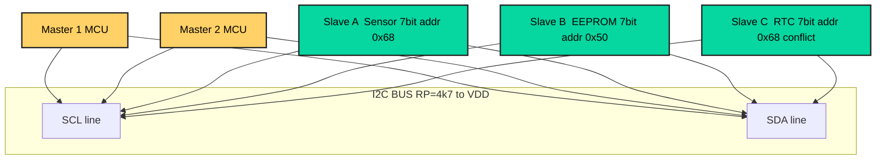
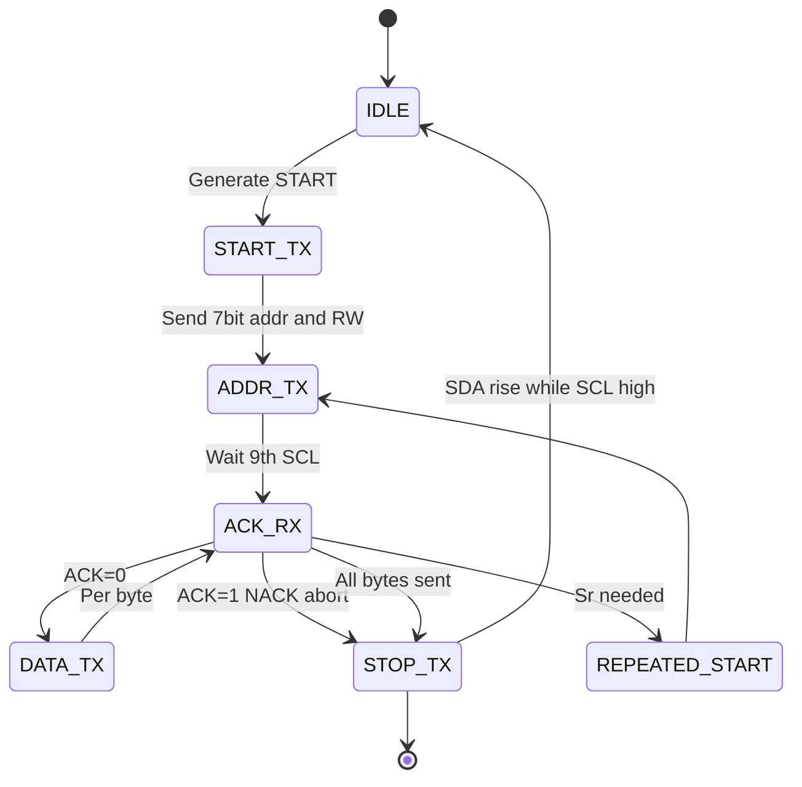
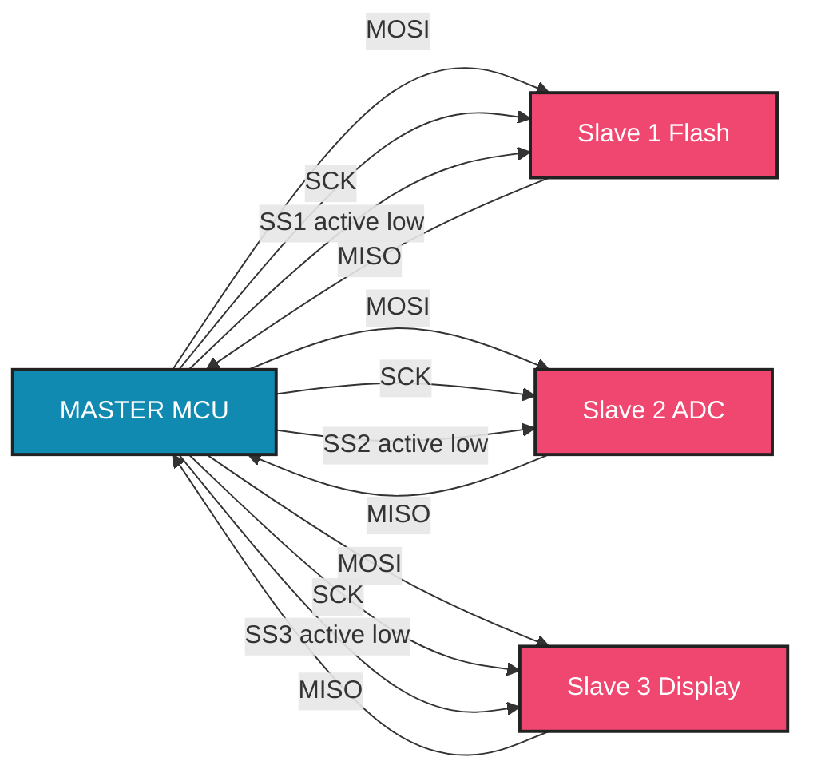
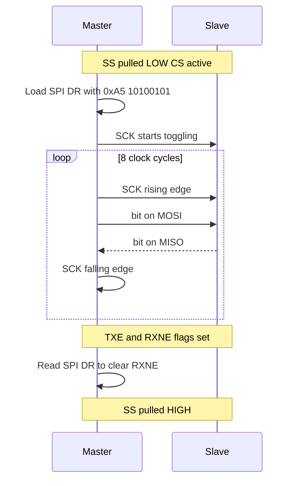
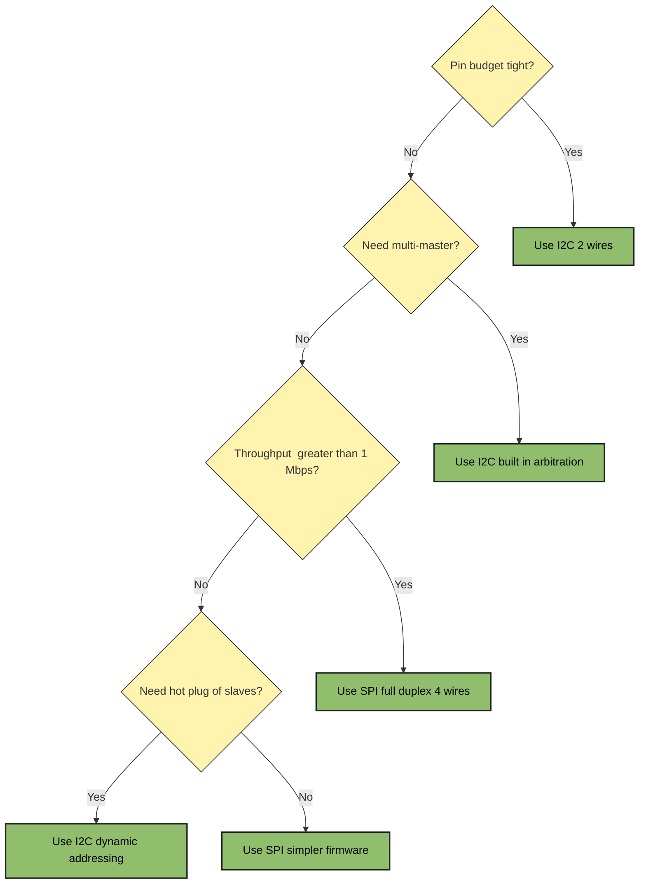

# Bus communication protocols blueprints profiles execution loops parameters: I2C, SPI hardware interfaces

<!-- SECTION_1_START -->
# Bus Communication Protocols: I²C & SPI Hardware Interfaces

> [!IMPORTANT]
> **KTU 2024 Scheme Focus (Module 1 – Hardware Software Co-Design):** This topic maps to understanding **on-board serial bus architectures** that govern how an embedded *master* controller negotiates with peripheral *slaves*. It is a foundational pre-requisite for the System-on-Chip (SoC) bus matrices covered later in the syllabus.

## 1.1 Formal KTU Definition

In embedded systems, **bus communication protocols** are the standardized electrical and logical rule-sets that allow heterogeneous hardware blocks (MCUs, sensors, memories, RF chips) to exchange data over a shared physical medium. Two dominant **synchronous serial** protocols used in Hardware-Software Co-Design are:

- **I²C (Inter-Integrated Circuit):** A multi-master, multi-slave, **half-duplex**, two-wire (SDA + SCL) bus developed by Philips Semiconductors (1982). It uses an **open-drain** topology with external pull-up resistors.
- **SPI (Serial Peripheral Interface):** A single-master, multi-slave, **full-duplex**, four-wire (MOSI, MISO, SCK, SS) bus defined by Motorola (now Freescale/NXP). It uses a **push-pull** driver topology.

> [!NOTE]
> **Hardware-Software Co-Design Implication:** A designer must co-optimize the **electrical layer** (drive strength, pull-up sizing, trace impedance) *simultaneously* with the **firmware layer** (clock prescaler, ISR latency, DMA chaining). The protocol is the contract binding both worlds.

## 1.2 Intuitive Real-World Analogies

### The I²C "Conference Call" Analogy
Imagine a **single telephone line** shared by a manager and 10 employees. To speak, you must first press a "request-to-talk" button (**START condition**), state the recipient's extension number (**address byte**), and wait for the recipient to say "Go ahead" (**ACK bit**). Only one person can talk at a time (**half-duplex**). When the call ends, a "hang-up" signal is sent (**STOP condition**).

### The SPI "Walkie-Talkie with a Referee" Analogy
Picture a **coach** (master) and several **players** (slaves) on a field. The coach has a **whistle** (SCK) that beats a steady rhythm. The coach speaks into one channel (MOSI) while listening on another (MISO) — *simultaneously* (**full-duplex**). Each player wears a unique jersey number, but only the one whose name the coach **explicitly calls** (SS/CS line pulled LOW) is allowed to respond.

## 1.3 Physical Layer Constants (Highlighted)

| Constant | Value | Meaning |
| :--- | :--- | :--- |
| **V_IL (I²C)** | $\le 0.3 \cdot V_{DD}$ | Maximum input LOW voltage |
| **V_IH (I²C)** | $\ge 0.7 \cdot V_{DD}$ | Minimum input HIGH voltage |
| **I²C Standard Mode $f_{SCL}$** | **100 kHz** | Nominal SCL clock |
| **I²C Fast Mode $f_{SCL}$** | **400 kHz** | |
| **I²C Fast-Plus Mode** | **1 MHz** | |
| **I²C High-Speed Mode** | **3.4 MHz** | Requires active pull-up |
| **SPI Max Practical $f_{SCK}$** | $\le f_{APB}/2$ | E.g., 10–50 MHz for most MCUs |
| **Standard Pull-up $R_P$** | **4.7 kΩ** (for 100 kHz) | $R_P$ must be sized vs bus capacitance |

> [!VISUALIZATION CONTROL]
> **Concept:** I²C Open-Drain Wired-AND Behaviour
> **Desmos Input Equations:** Two pull-up resistors $R_P = 4.7$ kΩ tied to $V_{DD} = 3.3$ V, with two NMOS transistors pulling SDA/SCL to GND.
> **Visual Description:** The SDA line is HIGH only when *all* devices release it (output HIGH = MOSFET OFF). Any device can force the line LOW, creating a logical AND across all drivers. Plot the SDA voltage: it snaps LOW (0 V) on any pull-down and exponentially rises to 3.3 V with time constant $\tau = R_P \cdot C_{bus}$ when released.

<!-- SECTION_1_END -->

<!-- SECTION_2_START -->
# Deep Theoretical Analysis & KTU Formula Sheet

## 2.1 I²C — Operational Blueprint

### 2.1.1 Hardware Wiring Profile
- **Two bidirectional lines:** `SCL` (Serial Clock, driven by master) and `SDA` (Serial Data, open-drain from both master and slaves).
- **Pull-up resistors ($R_P$):** Mandatory on *both* lines, connected to $V_{DD}$.
- **Slave addressing:** **7-bit** (the most common, 128 theoretical addresses, 112 practical) or **10-bit** (extended).

### 2.1.2 Logical Bit-Frame Profile
A standard I²C transaction for an 8-bit data byte follows this 9-bit sequence on the SDA line:

$$\text{Frame} = \underbrace{S}_{\text{Start}} + \underbrace{[A6 \dots A0]}_{7\text{-bit Address}} + \underbrace{R/\overline{W}}_{\text{Read/Write}} + \underbrace{A}_{\text{ACK}} + \underbrace{[D7 \dots D0]}_{8\text{-bit Data}} + \underbrace{A}_{\text{ACK}} + \underbrace{P}_{\text{Stop}}$$

> [!IMPORTANT]
> **Key Bit Definitions:**
> - **S (Start):** SDA transitions from HIGH → LOW while SCL is HIGH.
> - **P (Stop):** SDA transitions from LOW → HIGH while SCL is HIGH.
> - **ACK:** Receiver pulls SDA LOW during the 9th SCL clock pulse. NACK leaves SDA HIGH.
> - **Sr (Repeated Start):** A second Start issued *before* a Stop, used in read-then-write transactions.

### 2.1.3 I²C Execution Loop (Master-Transmitter)
1. Wait for bus free (detect SDA = SCL = HIGH for $\ge t_{BUF}$).
2. Issue `START` condition.
3. Transmit 7-bit slave address + R/W bit.
4. Sample `ACK` from slave (SDA sampled on 9th SCL rising edge).
5. If NACK, abort and generate `STOP`.
6. Transmit/Receive 8 data bits; sample ACK each byte.
7. Issue `STOP` (or `Sr` if more data follows).

## 2.2 SPI — Operational Blueprint

### 2.2.1 Hardware Wiring Profile
- **Four logic lines:** `MOSI` (Master-Out-Slave-In), `MISO` (Master-In-Slave-Out), `SCK` (Serial Clock), `SS`/`CS` (Slave Select, active LOW).
- **Push-pull drivers** (no external pull-ups required).
- **One master, multiple slaves** selected by independent `SS` lines.

### 2.2.2 The Four SPI Modes (Critical for KTU)
Modes are defined by the pair **(CPOL, CPHA):**

| Mode | CPOL | CPHA | Clock Idle | Sampling Edge |
| :--- | :---: | :---: | :--- | :--- |
| **Mode 0** | **0** | **0** | LOW | Rising (leading) |
| **Mode 1** | **0** | **1** | LOW | Falling (trailing) |
| **Mode 2** | **1** | **0** | HIGH | Falling (leading) |
| **Mode 3** | **1** | **1** | HIGH | Rising (trailing) |

> [!NOTE]
> **e.g., SD Cards use SPI Mode 0; many ADCs use Mode 1.** Master and slave *must* match modes; otherwise, sampled bits are shifted by half a clock period, causing garbled data.

### 2.2.3 SPI Execution Loop (Master-Transmitter)
1. Pull target `SS_n` line LOW.
2. Configure `SCK` frequency via baud-rate prescaler.
3. **Load TX buffer** (write to `SPI->DR`).
4. **Wait for `TXE` flag** (Transmit Buffer Empty).
5. **Wait for `RXNE` flag** (Read Buffer Not Empty — dummy read).
6. **Read RX buffer** to clear RXNE.
7. Pull `SS_n` HIGH.
8. Loop if multi-byte frame.

## 2.3 KTU High-Yield Formula Sheet

| Parameter | Formula | Variables & Notes |
| :--- | :--- | :--- |
| **I²C Bus Pull-up $R_P$ (max)** | $R_{P,max} = \dfrac{t_r}{0.8473 \cdot C_{bus}}$ | $t_r$ = max allowed rise time, $C_{bus}$ = total bus capacitance |
| **I²C Bus Pull-up $R_P$ (min)** | $R_{P,min} = \dfrac{V_{DD} - V_{OL}}{I_{OL}}$ | $V_{OL} \le 0.4$ V, $I_{OL} = 3$ mA (standard) |
| **Bit Period $T_{bit}$** | $T_{bit} = \dfrac{1}{f_{SCL}}$ | e.g., for 400 kHz: $T_{bit} = 2.5\ \mu s$ |
| **SPI Baud-Rate Divisor** | $f_{SCK} = \dfrac{f_{APB}}{BR} = \dfrac{f_{APB}}{2^{(N+1)}}$ | $N \in \{0,1,2,\dots,7\}$ for STM32 |
| **I²C Throughput (N bytes)** | $T_{frame} = (9N + 2) \cdot T_{bit}$ | +2 for START + STOP |
| **SPI Throughput (N bytes)** | $T_{frame} = N \cdot 8 \cdot T_{SCK}$ | Pure, no ACK overhead |
| **UART/SCI comparison** | N/A | Asynchronous, both sides need baud-rate matching |
| **Master-Slave Latency** | $t_{latency} \approx t_{ISR} + t_{prop}$ | Affects real-time guarantee |

## 2.4 Real-World Engineering Utility

- **I²C:** Used for **low-speed, low-pin-count** peripherals — RTCs (DS1307), EEPROMs (24C02), environmental sensors (BME280, MPU-6050), GPIO expanders (PCF8574), and on-board SoC inter-module buses.
- **SPI:** Used for **high-speed, deterministic** peripherals — TFT/OLED displays (ILI9341), SD cards, Flash memory (W25Q), high-speed ADCs (ADS1256), and DACs.
- In modern SoCs (e.g., STM32, ESP32, NXP i.MX RT), the **co-design decision** of I²C vs SPI is driven by: pin budget, throughput requirement, board complexity (pull-ups cost PCB area), and the interrupt/DMA strategy of the firmware.

<!-- SECTION_2_END -->

<!-- SECTION_3_START -->
# Step-by-Step Derivations & Code Implementation

## 3.1 Worked Derivations (Board-Exam Standard)

### Derivation 1: Sizing an I²C Pull-up Resistor for Fast-Mode

**Given:** $V_{DD} = 3.3$ V, $C_{bus} = 100$ pF (3 slaves + traces), Fast-Mode $f_{SCL} = 400$ kHz, $t_{r,max} = 300$ ns (from Philips UM10204 spec).

**Step 1: Compute maximum allowable $R_P$**
$$R_{P,max} = \dfrac{t_r}{0.8473 \cdot C_{bus}}$$

Substitute the values:
$$R_{P,max} = \dfrac{300 \times 10^{-9}}{0.8473 \cdot 100 \times 10^{-12}}$$

$$R_{P,max} = \dfrac{300 \times 10^{-9}}{84.73 \times 10^{-12}} = 3540.7\ \Omega \approx 3.54\ \text{k}\Omega$$

**Step 2: Compute minimum allowable $R_P$**
$$R_{P,min} = \dfrac{V_{DD} - V_{OL}}{I_{OL}} = \dfrac{3.3 - 0.4}{3 \times 10^{-3}} = \dfrac{2.9}{0.003} = 966.7\ \Omega$$

**Step 3: Choose a standard value within the range**
$$966.7\ \Omega \le R_P \le 3540.7\ \Omega$$
We select the **nearest E12 standard value** closer to the lower bound for better noise margin: $R_P = 2.2\ \text{k}\Omega$.

> [!IMPORTANT]
> **Conclusion:** A **2.2 kΩ** pull-up is safe and provides ~50% margin on both rise time and sink current.

---

### Derivation 2: SPI Baud-Rate Prescaler Calculation

**Given:** STM32 with $f_{APB1} = 42$ MHz. Target $f_{SCK} = 5.25$ MHz.

**Step 1: Rearrange the baud-rate formula**
$$BR = \dfrac{f_{APB1}}{f_{SCK}} = \dfrac{42 \times 10^{6}}{5.25 \times 10^{6}} = 8$$

**Step 2: Solve for the prescaler bit-field $N$**
$$2^{(N+1)} = 8 \implies N+1 = 3 \implies N = 2$$

**Step 3: Program the SPI_CR1.BR field**
```c
SPI1->CR1 &= ~SPI_CR1_BR;       // Clear baud-rate bits
SPI1->CR1 |= (2U << 3);         // Set BR = 010 (divide by 8)
```

> [!NOTE]
> **Resulting SCLK Period:** $T_{SCK} = 1 / 5.25\ \text{MHz} \approx 190.5$ ns.

---

### Derivation 3: I²C 1-Byte Frame Time

**Given:** $f_{SCL} = 400$ kHz Fast-Mode, 1 byte of data with ACK.

**Step 1: Total SCL clocks required**
$$N_{clocks} = 8\ (\text{data}) + 1\ (\text{ACK}) = 9$$

**Step 2: Bit period**
$$T_{bit} = \dfrac{1}{400 \times 10^{3}} = 2.5\ \mu\text{s}$$

**Step 3: Frame time**
$$T_{byte} = 9 \times 2.5\ \mu\text{s} = 22.5\ \mu\text{s}$$

**Step 4: Add START + STOP setup time** ($t_{SU,STA} = t_{SU,STO} = 0.6\ \mu s$ each in Fast-Mode)
$$T_{frame,1B} = 22.5 + 0.6 + 0.6 = 23.7\ \mu\text{s}$$

**Step 5: Effective throughput**
$$R_{eff} = \dfrac{8\ \text{bits}}{23.7\ \mu\text{s}} \approx 337.6\ \text{kbps}$$

> [!WARNING]
> **Common Mistake:** Students forget the ACK bit and the START/STOP overheads. I²C is *never* 400 kbps for payload; the real throughput ceiling is ~370 kbps for single bytes.

---

## 3.2 Algorithmic Implementation: Bit-Banged I²C Master (STM32-style HAL Skeleton)

```c
#include "stm32f4xx_hal.h"
#include <stdint.h>
#include <stdbool.h>
#include <stdarg.h>
#include <string.h>

/* ---------- Hardware pin definitions (board.h abstraction) ---------- */
#define I2C_SCL_PORT   GPIOB
#define I2C_SDA_PORT   GPIOB
#define I2C_SCL_PIN    GPIO_PIN_6
#define I2C_SDA_PIN    GPIO_PIN_7
#define I2C_SCL_H()    HAL_GPIO_WritePin(I2C_SCL_PORT, I2C_SCL_PIN, GPIO_PIN_SET)
#define I2C_SCL_L()    HAL_GPIO_WritePin(I2C_SCL_PORT, I2C_SCL_PIN, GPIO_PIN_RESET)
#define I2C_SDA_H()    HAL_GPIO_WritePin(I2C_SDA_PORT, I2C_SDA_PIN, GPIO_PIN_SET)
#define I2C_SDA_L()    HAL_GPIO_WritePin(I2C_SDA_PORT, I2C_SDA_PIN, GPIO_PIN_RESET)
#define I2C_SDA_READ() HAL_GPIO_ReadPin(I2C_SDA_PORT, I2C_SDA_PIN)

/* ---------- Software delays (tuned for 400 kHz) ---------- */
static inline void i2c_delay(void) {
    /* 1.25 µs half-period @ 400 kHz. Adjust to match f_SCL. */
    for (volatile uint32_t i = 0; i < 30U; ++i) { __NOP(); }
}

/* ---------- Helper: drive SDA as input (release line) ---------- */
static void i2c_sda_release(void) {
    GPIO_InitTypeDef cfg = {0};
    cfg.Pin = I2C_SDA_PIN;
    cfg.Mode = GPIO_MODE_INPUT;
    cfg.Pull = GPIO_NOPULL;
    HAL_GPIO_Init(I2C_SDA_PORT, &cfg);
}

/* ---------- Helper: drive SDA as output (open-drain) ---------- */
static void i2c_sda_drive(void) {
    GPIO_InitTypeDef cfg = {0};
    cfg.Pin = I2C_SDA_PIN;
    cfg.Mode = GPIO_MODE_OUTPUT_OD;
    cfg.Pull = GPIO_NOPULL;
    cfg.Speed = GPIO_SPEED_FREQ_HIGH;
    HAL_GPIO_Init(I2C_SDA_PORT, &cfg);
}

/* ---------- Start condition ---------- */
static void i2c_start(void) {
    i2c_sda_drive();
    I2C_SDA_H(); I2C_SCL_H(); i2c_delay();
    I2C_SDA_L(); i2c_delay();   /* SDA falls while SCL is HIGH */
    I2C_SCL_L(); i2c_delay();
}

/* ---------- Stop condition ---------- */
static void i2c_stop(void) {
    i2c_sda_drive();
    I2C_SDA_L(); I2C_SCL_L(); i2c_delay();
    I2C_SCL_H(); i2c_delay();
    I2C_SDA_H(); i2c_delay();   /* SDA rises while SCL is HIGH */
}

/* ---------- Write one bit ---------- */
static void i2c_write_bit(uint8_t bit) {
    i2c_sda_drive();
    if (bit) I2C_SDA_H(); else I2C_SDA_L();
    i2c_delay();
    I2C_SCL_H(); i2c_delay();
    I2C_SCL_L(); i2c_delay();
}

/* ---------- Read one bit ---------- */
static uint8_t i2c_read_bit(void) {
    uint8_t b;
    i2c_sda_release();          /* release so slave can drive */
    i2c_delay();
    I2C_SCL_H(); i2c_delay();
    b = (I2C_SDA_READ() != 0U) ? 1U : 0U;
    I2C_SCL_L(); i2c_delay();
    return b;
}

/* ---------- Write byte, return ACK status ---------- */
static HAL_StatusTypeDef i2c_write_byte(uint8_t byte) {
    for (uint8_t i = 0; i < 8; ++i) {
        i2c_write_bit((byte & 0x80U) ? 1U : 0U);
        byte <<= 1;
    }
    /* ACK slot: master releases, slave pulls SDA LOW if ACK */
    return (i2c_read_bit() == 0U) ? HAL_OK : HAL_ERROR;
}

/* ---------- Read byte, send ACK=0 (more data coming) or ACK=1 (last byte) ---------- */
static uint8_t i2c_read_byte(uint8_t ack) {
    uint8_t byte = 0U;
    for (uint8_t i = 0; i < 8; ++i) {
        byte = (uint8_t)((byte << 1) | i2c_read_bit());
    }
    i2c_write_bit(ack ? 1U : 0U);   /* NACK if last, ACK if more */
    return byte;
}

/* ---------- Public: write N bytes to slave @ addr ---------- */
HAL_StatusTypeDef i2c_master_write(uint8_t slave_addr,
                                    const uint8_t *buf, uint16_t len) {
    if (buf == NULL || len == 0U) return HAL_ERROR;
    i2c_start();
    if (i2c_write_byte((uint8_t)((slave_addr << 1) | 0U)) != HAL_OK) {
        i2c_stop();
        return HAL_ERROR;            /* NACK: slave not present */
    }
    while (len--) {
        if (i2c_write_byte(*buf++) != HAL_OK) {
            i2c_stop();
            return HAL_ERROR;
        }
    }
    i2c_stop();
    return HAL_OK;
}

/* ---------- Public: read N bytes from slave @ addr ---------- */
HAL_StatusTypeDef i2c_master_read(uint8_t slave_addr,
                                   uint8_t *buf, uint16_t len) {
    if (buf == NULL || len == 0U) return HAL_ERROR;
    i2c_start();
    if (i2c_write_byte((uint8_t)((slave_addr << 1) | 1U)) != HAL_OK) {
        i2c_stop();
        return HAL_ERROR;
    }
    for (uint16_t i = 0; i < len; ++i) {
        buf[i] = i2c_read_byte((i == (len - 1U)) ? 1U : 0U);
    }
    i2c_stop();
    return HAL_OK;
}
```

> [!NOTE]
> **Explanation of Key Lines:**
> - `i2c_sda_release()` reconfigures the SDA pin as input so an external pull-up pulls the line HIGH — this is the **open-drain** behaviour.
> - `i2c_write_bit()` only drives the line LOW (`I2C_SDA_L()`) or releases it (`I2C_SDA_H()`), never actively drives HIGH — critical because **two devices can never fight each other**.
> - The ACK slot is generated by the *receiver*; the master merely releases the line and samples.

---

## 3.3 Algorithmic Implementation: SPI Master DMA (STM32 HAL Style)

```python
# Pseudo-code for SPI Master Transmit/Receive with DMA
# (Higher-level HAL-style Python wrap for documentation)

class SPI_Master:
    def __init__(self, instance, baud_div, cpol, cpha, msb_first=True):
        self.instance = instance
        self.baud_div = baud_div
        self.cpol = cpol
        self.cpha = cpha
        self.msb_first = msb_first
        self.configured = False

    def configure(self):
        # 1. Enable peripheral clock in RCC
        # 2. Set GPIO alternate function for MOSI/MISO/SCK
        # 3. Program SPI_CR1: BR, CPOL, CPHA, MSTR, DFF, LSBFIRST
        # 4. Enable SPI peripheral
        self.configured = True

    def transfer(self, tx_buffer, rx_buffer=None, length=0):
        if not self.configured:
            raise RuntimeError("SPI not configured")
        # Pull SS LOW
        self._cs_low()
        # If using DMA: program DMA stream, set TXDMAEN/RXDMAEN
        # If polling: while (TXE) SPI->DR = tx[i];
        # Synchronization: wait for BSY=0
        if rx_buffer and length > 0:
            # Full-duplex: simultaneous TX and RX
            for i in range(length):
                while not self._tx_buffer_empty(): pass
                self._write_dr(tx_buffer[i] if tx_buffer else 0xFF)
                while not self._rx_buffer_not_empty(): pass
                rx_buffer[i] = self._read_dr()
        # Pull SS HIGH
        self._cs_high()

    def _cs_low(self):  pass  # GPIO write
    def _cs_high(self): pass
```

```c
/* Real STM32 HAL C-callable driver */
HAL_StatusTypeDef spi_master_transfer(SPI_HandleTypeDef *hspi,
                                      const uint8_t *tx, uint8_t *rx,
                                      uint16_t len) {
    HAL_StatusTypeDef ret;
    /* 1. Assert CS */
    HAL_GPIO_WritePin(GPIOA, GPIO_PIN_4, GPIO_PIN_RESET);

    /* 2. Blocking full-duplex transfer (DMA variant uses HAL_SPI_TransmitReceive_DMA) */
    ret = HAL_SPI_TransmitReceive(hspi, (uint8_t *)tx, rx, len, HAL_MAX_DELAY);
    if (ret != HAL_OK) { HAL_GPIO_WritePin(GPIOA, GPIO_PIN_4, GPIO_PIN_SET); return ret; }

    /* 3. De-assert CS after a small tCSH hold delay */
    for (volatile int d = 0; d < 50; ++d) { __NOP(); }
    HAL_GPIO_WritePin(GPIOA, GPIO_PIN_4, GPIO_PIN_SET);
    return HAL_OK;
}
```

<!-- SECTION_3_END -->

<!-- SECTION_4_START -->
# Structural Diagrams & Schematics

## 4.1 I²C Multi-Master Bus Topology



> [!NOTE]
> **Reading the diagram:** Both masters and all slaves are wired to the *same* SCL and SDA lines. Note that S1 and S3 both claim address 0x68 — this is a **bus conflict** that the firmware must resolve via address remapping or chip variant selection.

## 4.2 I²C Transaction State Machine



## 4.3 SPI Single-Master / Multi-Slave Topology



## 4.4 SPI Byte Transfer Sequence (Mode 0)



## 4.5 I²C vs SPI Decision Matrix (Block-Level)



<!-- SECTION_4_END -->

<!-- SECTION_5_START -->
# KTU 2024 Scheme Examination Question Bank & Topic Recap

> [!IMPORTANT]
> **Mark Distribution (KTU 2024 PECST709):** Part A = 3 marks each (short answer). Part B = 14 marks each with internal choice. Total module weightage = 20% of ESE.

---

## 5.1 Part A — Short-Answer Questions (3 Marks Each)

### Q1. [KTU University Exam – Dec 2023] — CO1, Remember
**Differentiate between I²C and SPI bus protocols with respect to wiring, speed, and duplex mode.**

**Model Answer (Valuation Key):**
- **Wiring:** I²C uses **2 wires** (SDA, SCL); SPI uses **4 wires** (MOSI, MISO, SCK, SS). **[1 Mark]**
- **Duplex:** I²C is **half-duplex** (single data line); SPI is **full-duplex** (separate MOSI/MISO). **[1 Mark]**
- **Speed:** Standard I²C up to **100 kHz**, Fast Mode **400 kHz**; SPI is generally faster, often **> 10 MHz** limited by MCU clock. **[1 Mark]**

### Q2. [KTU University Exam – July 2024] — CO1, Understand
**What is the role of pull-up resistors in an I²C bus? Why can't SPI use the same topology?**

**Model Answer (Valuation Key):**
- In I²C, drivers are **open-drain**; a pull-up is required to pull the line HIGH when no device is actively driving it. This enables the **wired-AND** behaviour that allows multiple masters to arbitrate safely. **[2 Marks]**
- SPI drivers are **push-pull**; the master actively drives both HIGH and LOW. Therefore, pull-ups are not required (and would cause contention / current shoot-through). **[1 Mark]**

---

## 5.2 Part B — Long-Answer Questions (14 Marks Each, Internal Choice)

### Question A — [KTU University Exam – July 2024] — CO1, CO2, Apply

**(a)** Draw the timing diagram of a complete I²C byte transfer including START, address byte, ACK, data byte, and STOP. Explain the START and STOP conditions. **[7 Marks]**

**(b)** An I²C bus operating at **400 kHz** in Fast-Mode has a total bus capacitance of **150 pF**. Compute the maximum allowable pull-up resistor value, given $t_{r,max} = 300$ ns. Recommend a standard value. **[7 Marks]**

#### Model Solution

**(a) Timing Diagram (Textual Representation)**

```
SDA:  ___      ______________________      ____________      ___
        |    |                      |    |            |    |
        |____|                      |____|            |____|

SCL:  ________      ____________      ____________      ________
              |    |            |    |            |    |
              |____|            |____|            |____|

             START  [6:0]=0x50 R/W=0  ACK    [7:0]=DATA    ACK   STOP
```

- **START:** SDA transitions from **HIGH to LOW while SCL is HIGH**. This marks the beginning of a transaction and wakes all slaves. **[1 Mark]**
- **STOP:** SDA transitions from **LOW to HIGH while SCL is HIGH**. This releases the bus. **[1 Mark]**
- The 7-bit address (e.g., 0x50) is clocked out MSB first, followed by the R/W bit. The slave acknowledges by pulling SDA LOW during the 9th clock. **[2 Marks]**
- Data byte is then clocked out, with the receiver issuing an ACK each byte. **[2 Marks]**
- Proper diagram with both lines visible — **1 Mark for diagram quality**.

**(b) Pull-up Resistor Calculation**

**Step 1: Maximum $R_P$ formula** — [Stating formula: 1 Mark]
$$R_{P,max} = \dfrac{t_{r}}{0.8473 \cdot C_{bus}}$$

**Step 2: Substitute values** — [Substitution step: 1 Mark]
$$R_{P,max} = \dfrac{300 \times 10^{-9}}{0.8473 \cdot 150 \times 10^{-12}} = \dfrac{300 \times 10^{-9}}{127.095 \times 10^{-12}}$$

**Step 3: Compute** — [Arithmetic: 1 Mark]
$$R_{P,max} = 2360.5\ \Omega \approx 2.36\ \text{k}\Omega$$

**Step 4: Apply $R_{P,min}$ check** — [Sanity check: 1 Mark]
$$R_{P,min} = \dfrac{V_{DD} - V_{OL}}{I_{OL}} = \dfrac{3.3 - 0.4}{3 \times 10^{-3}} \approx 967\ \Omega$$

**Step 5: Choose standard value** — [Recommendation: 1 Mark]
A **2.2 kΩ** E12 standard resistor is recommended for a 50% safety margin and good noise immunity.

**Step 6: State the engineering conclusion** — [Conclusion: 1 Mark]
The selected $R_P = 2.2\ \text{k}\Omega$ lies within the safe range $[966.7,\ 2360.5]\ \Omega$ and ensures the SDA/SCL rise time stays within the 300 ns Fast-Mode budget.

---

### Question B — [KTU University Exam – Dec 2023] — CO1, CO2, Apply (Alternate Choice)

**(a)** Explain the four SPI modes (Mode 0, 1, 2, 3) with reference to CPOL and CPHA. Why must the master and slave agree on the mode? **[7 Marks]**

**(b)** A peripheral ADC is connected to a STM32F4 over SPI. The APB1 clock is **42 MHz** and the desired SCLK is **5.25 MHz**. Determine the baud-rate prescaler value to be programmed into the BR field of SPI_CR1. Show all derivation steps. **[7 Marks]**

#### Model Solution

**(a) SPI Modes Explanation**

- **CPOL (Clock Polarity):** Defines the **idle state of SCK** when no data is being transferred.
  - CPOL = **0** → SCK idle is **LOW**.
  - CPOL = **1** → SCK idle is **HIGH**. **[1 Mark]**
- **CPHA (Clock Phase):** Defines **which SCK edge samples the data**.
  - CPHA = **0** → sample on the **leading (first) edge**.
  - CPHA = **1** → sample on the **trailing (second) edge**. **[1 Mark]**
- **Mode summary table** — [Table: 3 Marks]

| Mode | CPOL | CPHA | Idle SCK | Sample Edge |
| :--- | :---: | :---: | :--- | :--- |
| 0 | 0 | 0 | LOW | Rising |
| 1 | 0 | 1 | LOW | Falling |
| 2 | 1 | 0 | HIGH | Falling |
| 3 | 1 | 1 | HIGH | Rising |

- **Why agreement is mandatory:** A mismatch shifts the sample point by half a clock period, causing the slave to latch the **wrong bit**, resulting in garbled frames. E.g., a Mode-0 master sampling on the rising edge would corrupt data for a Mode-1 slave that expects the falling edge. **[2 Marks]**

**(b) Baud-Rate Prescaler Derivation**

**Step 1: State STM32 formula** — [Formula: 1 Mark]
$$f_{SCK} = \dfrac{f_{APB1}}{2^{(N+1)}}$$

**Step 2: Rearrange for $2^{(N+1)}$** — [Rearrangement: 1 Mark]
$$2^{(N+1)} = \dfrac{f_{APB1}}{f_{SCK}} = \dfrac{42 \times 10^{6}}{5.25 \times 10^{6}} = 8$$

**Step 3: Take log-base-2** — [Log: 1 Mark]
$$N + 1 = \log_2(8) = 3 \implies N = 2$$

**Step 4: Convert to BR field bits** — [Binary representation: 1 Mark]
$$N = 2 = \text{binary } 010$$

**Step 5: Program SPI_CR1** — [Code snippet: 1 Mark]
```c
SPI1->CR1 &= ~SPI_CR1_BR_Msk;       // Clear BR[2:0]
SPI1->CR1 |= (2U << SPI_CR1_BR_Pos); // BR = 010
```

**Step 6: Verify and conclude** — [Verification: 1 Mark]
Final $f_{SCK} = 42\ \text{MHz} / 8 = 5.25\ \text{MHz}$. ✓
Program the SPI peripheral with **BR = 0b010** (divide by 8).

---

## 5.3 KTU Examiner's Valuation Warning / Pitfall Callout

> [!WARNING]
> **Top 5 ways KTU students LOSE marks on bus-protocol questions:**
> 1. **Forgetting the ACK bit in I²C** — every data byte is 9 SCL clocks, not 8. Forgetting this in timing calculations costs full marks.
> 2. **Confusing CPOL/CPHA for SPI** — students write "Mode 0 = CPOL=1, CPHA=0" (it is actually CPOL=0, CPHA=0). Memorize the table verbatim.
> 3. **Not mentioning pull-ups for I²C** — any I²C diagram without $R_P$ to $V_{DD}$ is marked incomplete.
> 4. **Writing push-pull for I²C** — I²C *must* be open-drain. Using push-pull destroys multi-master arbitration.
> 5. **Skipping units in numeric answers** — write $f_{SCK} = 5.25\ \text{MHz}$ and $R_P = 2.2\ \text{k}\Omega$, not bare numbers.

---

## 5.4 Topic Recap & Important Things to Remember

- **I²C** is a **2-wire, half-duplex, open-drain, multi-master** bus with **7-bit or 10-bit addressing**; **ACK bit is mandatory** after every byte.
- **SPI** is a **4-wire, full-duplex, push-pull, single-master** bus with **per-slave SS lines**; **no ACK mechanism** (slave is selected by SS, not by ACK).
- **I²C speeds:** Standard 100 kHz, Fast 400 kHz, Fast-Plus 1 MHz, High-Speed 3.4 MHz.
- **SPI modes** are defined by **(CPOL, CPHA)** in 4 combinations; master and slave *must* match.
- **START condition:** SDA falls while SCL is HIGH. **STOP condition:** SDA rises while SCL is HIGH.
- **Pull-up sizing:** $R_{P,max} = t_r / (0.8473 \cdot C_{bus})$ and $R_{P,min} = (V_{DD} - V_{OL}) / I_{OL}$.
- **Bit period** $T_{bit} = 1 / f_{SCL}$ (e.g., 2.5 µs at 400 kHz).
- **I²C frame time** for N bytes: $T_{frame} = (9N + 2) \cdot T_{bit}$ (including START + STOP).
- **SPI baud-rate** on STM32: $f_{SCK} = f_{APB} / 2^{(N+1)}$ where $N \in \{0, 1, 2, \dots, 7\}$.
- **Co-design decision rule:** Choose **I²C** for low-pin-count, multi-master, low-speed peripherals. Choose **SPI** for high-throughput, deterministic, full-duplex peripherals.
- **Hardware-software contract:** The protocol *is* the contract — electrical layer (pull-ups, drive strength, $C_{bus}$) must be co-optimized with the firmware layer (prescaler, ISR latency, DMA).
- **Always include the ACKnowledge bit** in I²C frame calculations.
- **Open-drain ≠ Push-pull** — never substitute one for the other in a schematic.
- **Repeated Start (Sr)** allows back-to-back transactions without releasing the bus — used in register-read protocols of most I²C sensors.

<!-- SECTION_5_END -->
