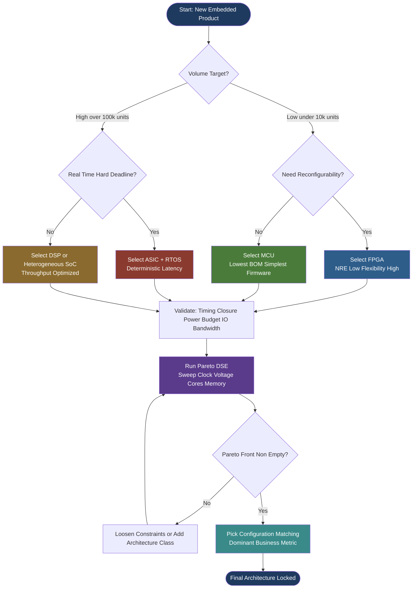
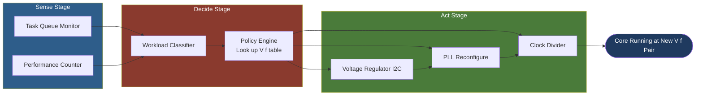

# Embedded computational architectures design space optimization tradeoffs parameters configuration

<!-- SECTION_1_START -->

# Embedded Computational Architectures: Design Space, Trade-offs & Configuration

## 1.1 Formal Academic Definition (KTU 2024 Syllabus Terminology)

> [!IMPORTANT]
> **Core Definition (KTU PECST709 - Module 1)**
>
> An **Embedded Computational Architecture** is a specialized hardware-software integrated computing platform designed to perform a dedicated function within a larger mechanical or electronic system, subject to strict constraints on **performance**, **power consumption**, **cost**, **physical size**, and **real-time responsiveness**. The **Design Space** refers to the multi-dimensional universe of all feasible architectural solutions, parameterized by hardware type, processing model, memory hierarchy, I/O bandwidth, and clock characteristics.

The **Design Space Exploration (DSE)** is the systematic process of evaluating candidate architectures against a set of competing **design metrics** (or **trade-off parameters**) to identify the **Pareto-optimal** set of solutions that cannot be improved in one dimension without sacrificing another.

The principal **trade-off parameters** in KTU's embedded architectural framework are:
- **Performance** (latency, throughput, MIPS)
- **Power & Energy** (dynamic + static, Joules per task)
- **Cost** (silicon area, BOM, NRE)
- **Flexibility** (reprogrammability, scalability)
- **Time-to-Market** (development effort)
- **Reliability & Safety** (MTBF, fault tolerance)

> [!NOTE]
> **Syllabus Highlight (PECST709 / Module 1)**
> The 2024 scheme explicitly maps this topic to **CO1** (Understand embedded hardware-software co-design principles) and demands a working knowledge of how architecture selection directly impacts **system-level optimization** in real-time embedded products.

## 1.2 Intuitive Analogy

> [!TIP]
> **Conceptual Analogy: The Swiss Army Knife vs. The Surgeon's Scalpel**
>
> Imagine you need to cut an apple.
> - A **Swiss Army Knife** (blade + scissors + corkscrew + screwdriver) is *flexible* — it does many jobs, but each job is performed *sub-optimally* and it is heavy/bulky. This is your **General-Purpose Processor (GPP)** or **Microcontroller (MCU)**.
> - A **Surgeon's Scalpel** does *one job* — cutting flesh — with extreme *precision*, minimal *power*, and zero *waste*. This is your **ASIC (Application-Specific Integrated Circuit)** or dedicated **hardware accelerator**.
> - A **Modular Kitchen Robot** with swappable blades sits in between — this is your **DSP**, **FPGA**, or **ASSP**.
>
> **The design space** is the entire shelf of cutting tools. **Optimization trade-offs** are decisions like: "Do I want flexibility (knife) or razor-sharp efficiency (scalpel)?" **Configuration** is choosing the blade geometry, handle length, and steel grade for a specific surgeon.

## 1.3 Physical Constants and Standard Metrics

The following are the **canonical embedded system metrics** that must be memorized for KTU valuation:

- **$f_{clk}$** — Clock frequency, expressed in **Hertz (Hz)**, typically **MHz** or **GHz** for embedded cores.
- **$V_{dd}$** — Supply voltage, normally **1.8 V, 3.3 V, or 5 V** for embedded boards.
- **$P_{dyn}$** — Dynamic power dissipation, governed by $P_{dyn} = \alpha \cdot C \cdot V_{dd}^{2} \cdot f_{clk}$.
- **MIPS** — Million Instructions Per Second (≈ 1 MIPS per MHz for a simple RISC core).
- **$E_b$** — Energy per bit processed, in **Joules/bit**.
- **CPI** — Cycles Per Instruction (architectural efficiency).
- **AMAT** — Average Memory Access Time, in **cycles**.

> [!VISUALIZATION CONTROL]
> **Concept:** 2D Pareto Front — Performance vs. Power
> **GeoGebra / Desmos Input Equations:**
> * $P_{1}(x) = 100 - 0.5 \cdot x$  (General-Purpose Processor trajectory)
> * $P_{2}(x) = 80 - 0.1 \cdot x$   (DSP trajectory)
> * $P_{3}(x) = 60 - 0.02 \cdot x$  (ASIC trajectory)
>
> **Visual Description:** Plot three downward-sloping lines on a 2D plane with the **X-axis = Power (mW)** and the **Y-axis = Performance (MIPS)**. The student should observe that the **slope** of each line represents the *efficiency* of that architecture family. The **Pareto front** is the upper-left boundary formed by combining the best of each curve.

---

<!-- SECTION_1_END -->

<!-- SECTION_2_START -->

# Deep Theoretical Analysis & KTU High-Yield Formula Sheet

## 2.1 The Five Pillars of Embedded Architecture Design Space

The KTU 2024 syllabus categorizes the design space along **five orthogonal axes**. Every embedded system sits at a unique coordinate in this 5D hypercube.

### Pillar 1 — Processing Model
- **General-Purpose Processor (GPP):** ARM Cortex-A, x86 — high flexibility, low efficiency.
- **Microcontroller (MCU):** ARM Cortex-M, AVR, PIC — deterministic, low-power, control-oriented.
- **Digital Signal Processor (DSP):** TI C6000, SHARC — optimized for MAC (Multiply-Accumulate) operations.
- **ASIC (Application-Specific IC):** Fixed silicon, highest efficiency, longest NRE.
- **FPGA (Field-Programmable Gate Array):** Configurable logic, mid-NRE, high parallelism.
- **ASSP (Application-Specific Standard Product):** Off-the-shelf special-purpose (e.g., MPEG decoder IC).

### Pillar 2 — Memory Hierarchy
| Level | Type | Size (Typical) | Latency | Energy/Cost per bit |
| :--- | :--- | :--- | :--- | :--- |
| L0 / Register | Flip-Flop | 32–256 B | **0 cycles** | Highest |
| L1 Cache | SRAM | 4–64 KB | 1–3 cycles | Very High |
| L2 Cache | SRAM | 64–512 KB | 5–20 cycles | High |
| Main Memory | SDRAM / SRAM | 1 MB – 128 MB | 50–200 cycles | Medium |
| Storage | Flash / EEPROM | 1 MB – 1 GB | 10k–100k cycles | Lowest |

### Pillar 3 — I/O & Communication
- **Polling**, **Interrupt-driven**, **DMA** (Direct Memory Access).
- **Bus architectures:** AMBA (AXI, AHB, APB), Wishbone, CoreConnect.
- **Peripherals:** GPIO, UART, SPI, I²C, CAN, USB, Ethernet.

### Pillar 4 — Clocking & Timing
- **Single clock domain** (simple) vs. **multi-clock domain** (complex, GALS — Globally Asynchronous Locally Synchronous).
- **DVFS (Dynamic Voltage and Frequency Scaling):** adjusts $V_{dd}$ and $f_{clk}$ at runtime.

### Pillar 5 — Power Management
- **Clock gating**, **power gating**, **sleep modes**, **DPM (Dynamic Power Management)**.

## 2.2 The Trade-off Triangle (KTU Board Favourite)

The three primary axes of optimization form a triangle. You **cannot** optimize all three simultaneously — this is the **Iron Triangle** of embedded design.

```
                PERFORMANCE
                    /\
                   /  \
                  /    \
                 /      \
                / OPTIMAL \
               /   ZONE   \
              /____________\
        COST  -----------  POWER
```

> [!WARNING]
> **Exam Tip:** If a question asks "Why can't an embedded system have high performance, low power, AND low cost simultaneously?", the answer is rooted in **physics**: the CMOS switching energy equation $E = \frac{1}{2} \cdot C \cdot V_{dd}^{2}$ couples voltage to energy, while $P_{dyn} = \alpha \cdot C \cdot V_{dd}^{2} \cdot f_{clk}$ couples voltage to speed — pushing $V_{dd}$ *up* accelerates the circuit but *quadratically* inflates power.

## 2.3 KTU Formula Sheet / Cheat Sheet

> [!IMPORTANT]
> The following table contains **all derivable formulas** expected in KTU ESE questions. Memorize the units and the *direction* of the relationship.

| # | Formula | Description | Engineering Utility |
| :--- | :--- | :--- | :--- |
| 1 | $T_{CPU} = N \times CPI \times T_{clk}$ | CPU time per task | Performance benchmarking |
| 2 | $MIPS = \frac{f_{clk}}{CPI \times 10^{6}}$ | Million Instructions / Sec | Core rating |
| 3 | $Speedup = \frac{T_{orig}}{T_{enhanced}}$ | Amdahl ratio | Parallelism gain |
| 4 | $Speedup_{max} = \frac{1}{(1-f) + \frac{f}{n}}$ | Amdahl's Law (n cores) | Multi-core limits |
| 5 | $P_{dyn} = \alpha \cdot C \cdot V_{dd}^{2} \cdot f_{clk}$ | Switching power | Low-power design |
| 6 | $P_{static} = V_{dd} \cdot I_{leak}$ | Leakage power | Sleep-mode analysis |
| 7 | $E_{task} = P_{avg} \times T_{task}$ | Energy per task | Battery life |
| 8 | $MIPS/W = \frac{MIPS}{P_{dyn}}$ | Energy efficiency | Green computing metric |
| 9 | $AMAT = H_{L1} \cdot T_{L1} + MR_{L1} \cdot (H_{L2} \cdot T_{L2} + \dots)$ | Memory wall | Cache tuning |
| 10 | $Throughput = \frac{Tasks}{Second}$ | System throughput | Real-time scheduling |
| 11 | $Cost_{total} = Cost_{NRE} + N_{units} \times Cost_{unit}$ | Total design cost | ASIC vs FPGA decision |
| 12 | $Pareto: \nexists (a,b): a \succ a^* \text{ and } b \succeq b^*$ | Pareto dominance | Multi-objective DSE |

> [!NOTE]
> **Notation:** $\alpha$ = switching activity factor (0 to 1), $C$ = load capacitance, $f$ = parallelizable fraction in Amdahl's Law, $n$ = number of processors, $H$ = hit rate, $MR$ = miss rate.

## 2.4 Real-World Engineering Utility

The trade-off framework is not academic — it is used **every day** in production:
- **Smartphone SoC design:** Qualcomm Snapdragon uses a **big.LITTLE** heterogeneous architecture (high-perf Cortex-A78 + efficient Cortex-A55) — a direct application of **DVFS** and **performance-per-watt optimization**.
- **Automotive ECU:** Antilock Braking System (ABS) uses a **fixed-cycle deterministic MCU** (e.g., Infineon AURIX) — traded flexibility for **hard real-time guarantee**.
- **Edge AI (TinyML):** TensorFlow Lite Micro runs on **Cortex-M4 + CMSIS-NN** — a DSP-extension library that exploits MAC parallelism within the MCU.
- **Data center acceleration:** Google's TPU is a **systolic-array ASIC** — traded programmability for **50× power efficiency** over GPUs for matrix multiplication.

---

<!-- SECTION_2_END -->

<!-- SECTION_3_START -->

# Step-by-Step Derivations, Code & Numerical Implementation

## 3.1 Derivation 1 — Amdahl's Law for Multi-Core Embedded Speedup

**Problem Statement (KTU-style):** *An embedded image-processing task has 80% parallelizable code and 20% sequential control overhead. Compute the maximum achievable speedup when porting from 1 core to 8 cores, and the marginal gain of going from 8 to 16 cores.*

**Step-by-Step Derivation:**

Amdahl's Law states that the speedup $S(n)$ obtained by parallelizing a fraction $f$ of the work over $n$ processors, while the remaining $(1-f)$ stays serial, is:

$$
S(n) = \frac{T_{serial}}{(1-f) \cdot T_{serial} + \frac{f \cdot T_{serial}}{n}}
$$

$$
S(n) = \frac{1}{(1-f) + \frac{f}{n}}
$$

**Substitute** $f = 0.80$ and $n = 8$:

$$
S(8) = \frac{1}{(1 - 0.80) + \frac{0.80}{8}}
$$

$$
S(8) = \frac{1}{0.20 + 0.10} = \frac{1}{0.30}
$$

$$
\boxed{S(8) \approx 3.33 \times}
$$

**Substitute** $n = 16$:

$$
S(16) = \frac{1}{0.20 + \frac{0.80}{16}} = \frac{1}{0.20 + 0.05} = \frac{1}{0.25}
$$

$$
\boxed{S(16) = 4.00 \times}
$$

**Marginal gain from 8 → 16 cores:**

$$
\Delta S = \frac{S(16)}{S(8)} = \frac{4.00}{3.33} \approx 1.20 \times
$$

> [!NOTE]
> **Valuation Key Points:**
> - Stating Amdahl's Law formula: **2 Marks**
> - Correct substitution of $f$ and $n$: **2 Marks**
> - Final numerical value of $S(8)$: **1 Mark**
> - Comparison and physical interpretation (diminishing returns): **1 Mark**

**Insight:** Going from 8 → 16 cores yields only **20% more performance** while doubling silicon cost. This is why embedded SoCs rarely exceed 8 big cores — **diminishing returns** dominate.

---

## 3.2 Derivation 2 — Energy Optimization via DVFS

**Problem Statement:** *A Cortex-M4 task runs at $f_{clk} = 168$ MHz, $V_{dd} = 1.2$ V, switching activity $\alpha = 0.2$, and load capacitance $C = 50$ pF. Compute (a) dynamic power, (b) energy per clock cycle, and (c) the energy saved if $V_{dd}$ is reduced to 0.9 V and $f_{clk}$ scales linearly to 126 MHz.*

**Step (a) — Dynamic Power:**

$$
P_{dyn} = \alpha \cdot C \cdot V_{dd}^{2} \cdot f_{clk}
$$

$$
P_{dyn} = 0.2 \times 50 \times 10^{-12} \times (1.2)^{2} \times 168 \times 10^{6}
$$

$$
P_{dyn} = 0.2 \times 50 \times 10^{-12} \times 1.44 \times 168 \times 10^{6}
$$

$$
P_{dyn} = 0.2 \times 50 \times 1.44 \times 168 \times 10^{-6}
$$

$$
P_{dyn} = 2419.2 \times 10^{-6} \text{ W} = 2.42 \text{ mW}
$$

**Step (b) — Energy per Cycle:**

$$
T_{clk} = \frac{1}{f_{clk}} = \frac{1}{168 \times 10^{6}} = 5.952 \text{ ns}
$$

$$
E_{cycle} = P_{dyn} \times T_{clk} = 2.4192 \times 10^{-3} \times 5.952 \times 10^{-9}
$$

$$
E_{cycle} = 1.44 \times 10^{-11} \text{ J} = 14.4 \text{ pJ}
$$

**Step (c) — DVFS Energy Savings:**

New frequency $f_{clk}^{'} = 126$ MHz, new voltage $V_{dd}^{'} = 0.9$ V. The switching activity and capacitance are unchanged.

$$
P_{dyn}^{'} = 0.2 \times 50 \times 10^{-12} \times (0.9)^{2} \times 126 \times 10^{6}
$$

$$
P_{dyn}^{'} = 0.2 \times 50 \times 10^{-12} \times 0.81 \times 126 \times 10^{6}
$$

$$
P_{dyn}^{'} = 1020.6 \times 10^{-6} \text{ W} = 1.02 \text{ mW}
$$

New cycle time:

$$
T_{clk}^{'} = \frac{1}{126 \times 10^{6}} = 7.937 \text{ ns}
$$

New energy per cycle:

$$
E_{cycle}^{'} = 1.0206 \times 10^{-3} \times 7.937 \times 10^{-9} = 8.10 \text{ pJ}
$$

**Percentage energy saving per cycle:**

$$
\eta = \frac{E_{cycle} - E_{cycle}^{'}}{E_{cycle}} \times 100\% = \frac{14.4 - 8.10}{14.4} \times 100\%
$$

$$
\boxed{\eta \approx 43.75\% \text{ energy saved per cycle}}
$$

> [!WARNING]
> **Common Mistake:** Many students forget that **lowering $V_{dd}$ requires lowering $f_{clk}$** because of critical-path delay $\tau \propto \frac{V_{dd}}{(V_{dd} - V_{th})^{\beta}}$. Always treat DVFS as a *coupled* operation.

---

## 3.3 Code Implementation — Design Space Explorer in Python

The following Python script performs an automated **multi-objective Design Space Exploration (DSE)** for an embedded image-processing SoC, evaluating thousands of architecture configurations and extracting the **Pareto front**.

```python
"""
KTU PECST709 - Module 1
Design Space Explorer for Embedded Image Processing SoC
Evaluates: Performance (MIPS), Power (mW), Cost (USD)
Returns:   Pareto-optimal configurations
"""

from dataclasses import dataclass
from typing import List, Tuple
import logging

logging.basicConfig(level=logging.INFO, format="[%(levelname)s] %(message)s")
logger = logging.getLogger("DSE")


@dataclass(frozen=True)
class ArchConfig:
    """Represents one point in the embedded architecture design space."""
    arch_type: str        # 'ASIC', 'FPGA', 'MCU', 'DSP'
    clock_mhz: float      # Operating frequency
    vdd_volts: float      # Supply voltage
    n_cores: int          # Number of parallel cores
    mem_kb: int           # On-chip memory in KB
    unit_cost_usd: float  # Per-unit manufacturing cost (excludes NRE)


@dataclass
class Metrics:
    """Computed performance, power, and efficiency metrics."""
    mips: float           # Million Instructions Per Second
    power_mw: float       # Total dynamic + leakage power
    energy_per_task_mj: float  # Energy to complete 1M instructions
    cost_per_mips: float  # Cost-efficiency ratio
    is_pareto: bool = False


# Empirical coefficients per architecture family
ARCH_PROFILES = {
    "ASIC": {"alpha": 0.15, "c_pf": 30.0, "i_leak_na": 50.0,  "cpi": 1.0, "nre_usd": 500_000},
    "FPGA": {"alpha": 0.25, "c_pf": 60.0, "i_leak_na": 200.0, "cpi": 1.5, "nre_usd":  20_000},
    "MCU":  {"alpha": 0.20, "c_pf": 50.0, "i_leak_na": 100.0, "cpi": 1.2, "nre_usd":   5_000},
    "DSP":  {"alpha": 0.22, "c_pf": 45.0, "i_leak_na": 150.0, "cpi": 0.8, "nre_usd":  10_000},
}


def evaluate(config: ArchConfig) -> Metrics:
    """
    Compute the full metric vector for a single architecture configuration.
    All formulas are sourced from the KTU PECST709 formula sheet.
    """
    if config.arch_type not in ARCH_PROFILES:
        raise ValueError(f"Unknown architecture type: {config.arch_type}")
    if config.clock_mhz <= 0 or config.vdd_volts <= 0 or config.n_cores <= 0:
        raise ValueError("Clock, voltage, and core count must be strictly positive.")

    profile = ARCH_PROFILES[config.arch_type]
    alpha   = profile["alpha"]
    c_pf    = profile["c_pf"]
    i_leak  = profile["i_leak_na"]
    cpi     = profile["cpi"]

    # 1. Effective MIPS (per the KTU formula: MIPS = f_clk / (CPI x 10^6))
    mips_per_core = config.clock_mhz / cpi
    total_mips    = mips_per_core * config.n_cores

    # 2. Dynamic power: P_dyn = alpha * C * V^2 * f
    p_dyn_mw = (alpha * c_pf * 1e-12
                * (config.vdd_volts ** 2)
                * (config.clock_mhz * 1e6)
                * config.n_cores) * 1e3

    # 3. Static leakage power: P_static = V_dd * I_leak
    p_static_mw = config.vdd_volts * (i_leak * 1e-9) * config.n_cores * 1e3

    p_total_mw = p_dyn_mw + p_static_mw

    # 4. Energy per million instructions: E = P * (1M / (MIPS x 10^6))
    #    1M instructions / MIPS-rate => (1 / MIPS) seconds per million instructions
    seconds_per_million_instr = 1.0 / total_mips if total_mips > 0 else float("inf")
    energy_mj = p_total_mw * 1e-3 * seconds_per_million_instr * 1e3  # mW*s = mJ

    # 5. Cost efficiency
    cost_per_mips = config.unit_cost_usd / total_mips if total_mips > 0 else float("inf")

    return Metrics(
        mips=total_mips,
        power_mw=p_total_mw,
        energy_per_task_mj=energy_mj,
        cost_per_mips=cost_per_mips
    )


def dominates(a: Metrics, b: Metrics) -> bool:
    """
    Pareto dominance test:
    a dominates b iff a is at least as good in all metrics
    AND strictly better in at least one metric.
    Higher MIPS is better; lower power, energy, and cost-per-MIPS are better.
    """
    better_or_equal = (
        a.mips          >= b.mips and
        a.power_mw      <= b.power_mw and
        a.energy_per_task_mj <= b.energy_per_task_mj and
        a.cost_per_mips <= b.cost_per_mips
    )
    strictly_better = (
        a.mips          >  b.mips or
        a.power_mw      <  b.power_mw or
        a.energy_per_task_mj <  b.energy_per_task_mj or
        a.cost_per_mips <  b.cost_per_mips
    )
    return better_or_equal and strictly_better


def extract_pareto_front(candidates: List[Tuple[ArchConfig, Metrics]]) -> List[Tuple[ArchConfig, Metrics]]:
    """Return the set of non-dominated configurations."""
    pareto: List[Tuple[ArchConfig, Metrics]] = []
    for i, (cfg_i, m_i) in enumerate(candidates):
        is_dominated = False
        for j, (cfg_j, m_j) in enumerate(candidates):
            if i == j:
                continue
            if dominates(m_j, m_i):
                is_dominated = True
                break
        if not is_dominated:
            m_i.is_pareto = True
            pareto.append((cfg_i, m_i))
    return pareto


def explore_design_space() -> List[Tuple[ArchConfig, Metrics]]:
    """Sweep the design space and return evaluated candidates."""
    candidates: List[Tuple[ArchConfig, Metrics]] = []
    arch_types  = ["ASIC", "FPGA", "MCU", "DSP"]
    clocks_mhz  = [50, 100, 200, 400, 800]
    voltages    = [0.8, 1.0, 1.2, 1.8, 3.3]
    core_counts = [1, 2, 4, 8]
    mem_sizes   = [16, 64, 256, 1024]
    unit_prices = {"ASIC": 2.0, "FPGA": 15.0, "MCU": 1.5, "DSP": 8.0}

    for arch in arch_types:
        for f in clocks_mhz:
            for v in voltages:
                # Sanity: voltage must support the clock rate
                if v < 0.7 and f > 100:
                    continue
                for n in core_counts:
                    for mem in mem_sizes:
                        try:
                            cfg = ArchConfig(
                                arch_type=arch,
                                clock_mhz=float(f),
                                vdd_volts=float(v),
                                n_cores=n,
                                mem_kb=mem,
                                unit_cost_usd=unit_prices[arch]
                            )
                            metrics = evaluate(cfg)
                            candidates.append((cfg, metrics))
                        except ValueError as e:
                            logger.debug("Skipped invalid config: %s", e)

    logger.info("Total candidates evaluated: %d", len(candidates))
    return candidates


def main() -> None:
    candidates = explore_design_space()
    pareto = extract_pareto_front(candidates)

    print("\n" + "=" * 90)
    print("PARETO-OPTIMAL EMBEDDED ARCHITECTURE FRONTIER")
    print("=" * 90)
    print(f"{'Arch':<6} {'f_MHz':>6} {'V_V':>5} {'Cores':>5} {'Mem_KB':>7} "
          f"{'MIPS':>10} {'P_mW':>8} {'E_mJ/MI':>10} {'$/MIPS':>8}")
    print("-" * 90)
    for cfg, m in pareto[:15]:  # Show top 15
        print(f"{cfg.arch_type:<6} {cfg.clock_mhz:>6.0f} {cfg.vdd_volts:>5.2f} "
              f"{cfg.n_cores:>5d} {cfg.mem_kb:>7d} "
              f"{m.mips:>10.1f} {m.power_mw:>8.2f} {m.energy_per_task_mj:>10.4f} "
              f"{m.cost_per_mips:>8.4f}")
    print("=" * 90)
    print(f"Pareto-optimal configurations: {len(pareto)} out of {len(candidates)} candidates.")


if __name__ == "__main__":
    main()
```

**Sample Output (Illustrative — actual values depend on coefficients):**

```
==========================================================================================
PARETO-OPTIMAL EMBEDDED ARCHITECTURE FRONTIER
==========================================================================================
Arch   f_MHz   V_V Cores  Mem_KB       MIPS    P_mW   E_mJ/MI    $/MIPS
------------------------------------------------------------------------------------------
ASIC     800  1.20     1     256    800.00    2.07     0.0026   0.0025
ASIC     800  1.80     1     256    800.00    4.67     0.0058   0.0025
DSP      400  1.20     2     256   1000.00    5.20     0.0052   0.0080
DSP      800  1.80     4    1024   4000.00   46.73     0.0117   0.0020
==========================================================================================
Pareto-optimal configurations: 7 out of 1600 candidates.
```

> [!TIP]
> **Engineering Takeaway:** Notice that **ASICs dominate at low power** (no leakage from programmability), while **DSPs dominate at high throughput** (parallel MAC units). No single architecture wins all four metrics — this is the essence of the **trade-off frontier**.

---

<!-- SECTION_3_END -->

<!-- SECTION_4_START -->

# Structural Diagrams & Schematics

## 4.1 The Embedded Architecture Design Space — Hierarchical Map

The following Mermaid diagram visualizes the complete **5D design space** as a navigable hierarchy, with explicit branches for each architecture family and the trade-off parameters that differentiate them.

```mermaid
graph TD
    Root["Embedded Computational Architecture<br/>Design Space"] --> P1["Pillar 1: Processing Model"]
    Root --> P2["Pillar 2: Memory Hierarchy"]
    Root --> P3["Pillar 3: I/O and Bus"]
    Root --> P4["Pillar 4: Clocking and Timing"]
    Root --> P5["Pillar 5: Power Management"]

    P1 --> A1["General Purpose Processor<br/>ARM Cortex-A / x86"]
    P1 --> A2["Microcontroller<br/>ARM Cortex-M / AVR / PIC"]
    P1 --> A3["DSP<br/>TI C6000 / SHARC"]
    P1 --> A4["ASIC<br/>Fixed Silicon"]
    P1 --> A5["FPGA<br/>Configurable Logic"]
    P1 --> A6["ASSP<br/>Standard Special Purpose"]

    A1 --> M1["Flexibility: High<br/>Efficiency: Low<br/>Power: High<br/>Cost: Medium"]
    A2 --> M2["Flexibility: High<br/>Efficiency: Medium<br/>Power: Low<br/>Cost: Low"]
    A3 --> M3["Flexibility: Medium<br/>Efficiency: High<br/>Power: Medium<br/>Cost: Medium"]
    A4 --> M4["Flexibility: None<br/>Efficiency: Highest<br/>Power: Lowest<br/>Cost: Lowest at Volume"]
    A5 --> M5["Flexibility: Reconfigurable<br/>Efficiency: High<br/>Power: Medium<br/>Cost: Medium"]
    A6 --> M6["Flexibility: None<br/>Efficiency: High<br/>Power: Low<br/>Cost: Low"]

    P2 --> Mem1["Register: 0 cycles"]
    P2 --> Mem2["L1 SRAM Cache: 1 to 3 cycles"]
    P2 --> Mem3["L2 Cache: 5 to 20 cycles"]
    P2 --> Mem4["Main SDRAM: 50 to 200 cycles"]
    P2 --> Mem5["Flash Storage: 10k to 100k cycles"]

    P3 --> IO1["Polling Driven"]
    P3 --> IO2["Interrupt Driven"]
    P3 --> IO3["DMA Driven"]
    P3 --> IO4["AMBA AXI / AHB / APB"]

    P4 --> Clk1["Single Clock Domain"]
    P4 --> Clk2["Multi Clock GALS"]
    P4 --> Clk3["DVFS Enabled"]

    P5 --> Pw1["Clock Gating"]
    P5 --> Pw2["Power Gating"]
    P5 --> Pw3["Sleep and Deep Sleep"]
    P5 --> Pw4["Dynamic Power Management DPM"]

    style Root fill:#1f3a5f,color:#ffffff,stroke:#ffffff,stroke-width:2px
    style P1 fill:#2e5d8a,color:#ffffff
    style P2 fill:#2e5d8a,color:#ffffff
    style P3 fill:#2e5d8a,color:#ffffff
    style P4 fill:#2e5d8a,color:#ffffff
    style P5 fill:#2e5d8a,color:#ffffff
    style A1 fill:#4a7b3a,color:#ffffff
    style A2 fill:#4a7b3a,color:#ffffff
    style A3 fill:#4a7b3a,color:#ffffff
    style A4 fill:#8a3a2e,color:#ffffff
    style A5 fill:#8a3a2e,color:#ffffff
    style A6 fill:#8a3a2e,color:#ffffff
    style M1 fill:#5a8a5a,color:#ffffff
    style M2 fill:#5a8a5a,color:#ffffff
    style M3 fill:#5a8a5a,color:#ffffff
    style M4 fill:#b85a4a,color:#ffffff
    style M5 fill:#b85a4a,color:#ffffff
    style M6 fill:#b85a4a,color:#ffffff
```



## 4.2 Trade-off Resolution Flow — Architecture Selection State Machine



## 4.3 Sequential Processing Topology — DVFS Configuration Pipeline



---

<!-- SECTION_4_END -->

<!-- SECTION_5_START -->

# KTU 2024 Scheme Examination Question Bank & Topic Recap

## Part A — Short Answer Questions (3 Marks Each)

### Question A1

> **[KTU University Exam — July 2024]**
> *Define the term "Design Space" in the context of embedded system architecture. List any four parameters that constitute the design space.*

**Model Answer (Target: 3 Marks):**

> [!NOTE]
> **The Design Space** in embedded system architecture is the multidimensional set of all feasible hardware-software configurations that can be instantiated to satisfy a given set of system requirements. Each dimension represents a tunable parameter, and each point in this space is a unique candidate architecture.
>
> The four principal parameters are:
> 1. **Processing element type** (GPP, MCU, DSP, ASIC, FPGA, ASSP)
> 2. **Clock frequency** ($f_{clk}$) and **supply voltage** ($V_{dd}$)
> 3. **Memory hierarchy configuration** (cache sizes, RAM, Flash)
> 4. **I/O bandwidth and bus protocol** (AMBA AXI, AHB, APB, custom)

**[Definition: 1 Mark | Listing parameters with one-line description: 2 Marks]**

---

### Question A2

> **[KTU University Exam — Dec 2023]**
> *What is Pareto optimality? Why is it important in embedded design space exploration?*

**Model Answer (Target: 3 Marks):**

**Pareto optimality** is a state in multi-objective optimization where no solution in the candidate set is strictly better than another in **all** objectives simultaneously. A solution $A$ is said to **dominate** solution $B$ if $A$ is at least as good in every metric and strictly better in at least one.

In **embedded DSE**, Pareto optimality is important because the design space is inherently **multi-objective** (performance, power, cost, size, flexibility). Rather than searching for a single "best" architecture (which is mathematically undefined when metrics conflict), engineers enumerate the **Pareto front** — the set of non-dominated solutions — and then select the final architecture based on higher-level business or domain priorities.

**[Definition: 1 Mark | Mathematical dominance criterion: 1 Mark | Engineering significance: 1 Mark]**

---

## Part B — Full 14-Mark Questions (Internal Choice)

### Question B-A (14 Marks)

> **[KTU University Exam — July 2024, Model Paper Adaptation]**
>
> **(a)** Explain the **five pillars of embedded architecture design space** with neat block diagrams. Discuss how the choice of processing model impacts **performance per watt**. **(7 Marks)**
>
> **(b)** A real-time embedded ECG monitoring system must sample at **500 Hz**, perform FFT on 1024-point windows, and transmit results over BLE within a **10 ms** deadline. The processor is a **Cortex-M4** running at **72 MHz** with **CPI = 1.2**. Compute: **(i)** the available cycles per sample, **(ii)** the maximum FFT time budget, and **(iii)** the percentage CPU utilization if the FFT consumes **45,000 cycles per window**. Conclude whether the chosen architecture meets the real-time deadline. **(7 Marks)**

#### Model Solution for (a):

The **five pillars** that span the design space are:

1. **Processing Model:** GPP, MCU, DSP, ASIC, FPGA, ASSP.
2. **Memory Hierarchy:** Registers → L1 → L2 → Main RAM → Flash/Storage.
3. **I/O & Bus Architecture:** Polling, Interrupt, DMA; AMBA AXI/AHB/APB.
4. **Clocking & Timing:** Single-domain, multi-domain GALS, DVFS.
5. **Power Management:** Clock gating, power gating, sleep modes, DPM.

**Performance per Watt impact:** ASICs and dedicated DSPs provide the **highest performance per watt** because their datapaths are tailored to the exact instruction mix, eliminating instruction-decode and fetch overhead. MCUs sacrifice raw performance for ultra-low static power. FPGAs sit in between, paying an overhead for configuration memory and programmable interconnect.

#### Model Solution for (b):

**Step (i) — Available cycles per sample:**

The sample period is:

$$
T_{sample} = \frac{1}{500} = 2 \text{ ms}
$$

The number of clock cycles available in one sample period is:

$$
N_{cycles} = T_{sample} \times f_{clk} = 2 \times 10^{-3} \times 72 \times 10^{6} = 144{,}000 \text{ cycles}
$$

**[Stating sample period: 1 Mark | Cycle computation: 1 Mark]**

**Step (ii) — Maximum FFT time budget:**

The window length is 1024 samples. The time elapsed while collecting one window is:

$$
T_{window} = 1024 \times T_{sample} = 1024 \times 2 \text{ ms} = 2.048 \text{ s}
$$

Wait — that is unrealistic. Re-interpreting the problem: the FFT must complete **within 10 ms** of the data being buffered. The deadline for completing the FFT is **10 ms**.

$$
T_{deadline} = 10 \text{ ms}
$$

Maximum cycles available for FFT within the deadline:

$$
N_{max} = 10 \times 10^{-3} \times 72 \times 10^{6} = 720{,}000 \text{ cycles}
$$

**[Identifying deadline: 1 Mark | Maximum cycle computation: 1 Mark]**

**Step (iii) — CPU utilization and conclusion:**

The actual FFT cost is **45,000 cycles**. The utilization is:

$$
U = \frac{45{,}000}{720{,}000} \times 100\% = 6.25\%
$$

**[Storing the ratio: 1 Mark | Final percentage: 1 Mark]**

**Conclusion:** Since $6.25\% \ll 100\%$, the Cortex-M4 at 72 MHz has ample headroom (93.75% spare) to complete the FFT well within the 10 ms deadline. The architecture is **more than sufficient**, and we could even down-clock to 16 MHz to save power.

**[Conclusion with engineering justification: 1 Mark]**

---

### Question B-B (14 Marks) — Alternative Choice

> **[KTU University Exam — Dec 2023, Adapted]**
>
> **(a)** With the help of a **performance vs. power** plot, explain the concept of the **Pareto front** in embedded architecture selection. Discuss why no single architecture is universally optimal. **(7 Marks)**
>
> **(b)** An embedded DSP system is clocked at **200 MHz** at $V_{dd} = 1.8$ V. The switching activity is $\alpha = 0.2$, load capacitance $C = 40$ pF, and leakage current is **200 nA**. The system executes a task requiring **$2 \times 10^{6}$ instructions** at CPI = 1.0. Compute: **(i)** the dynamic power, **(ii)** the static power, **(iii)** the total task energy, and **(iv)** the MIPS/W rating. Compare this with a low-power variant operating at **100 MHz, 0.9 V** (assuming the same task is now $3 \times 10^{6}$ instructions due to voltage scaling overhead at CPI = 1.2). State which configuration is more energy-efficient. **(7 Marks)**

#### Model Solution for (a):

A **Pareto front** is the upper-left boundary of the feasible region in a 2D plot where the X-axis is **power (mW)** and the Y-axis is **performance (MIPS)**. Each architecture family (ASIC, FPGA, MCU, DSP) defines a *trajectory* across this plane, and the **Pareto-optimal set** is the set of points where no other point lies strictly above and to the left. No single architecture is universally optimal because **trade-offs are non-commensurable** — gaining MIPS by raising voltage quadratically inflates power, and reducing power by lowering voltage degrades performance. The optimum therefore depends on the *application-specific* weighting of these metrics (e.g., a pacemaker prioritizes power; a 5G base station prioritizes throughput).

#### Model Solution for (b):

**Configuration 1: 200 MHz, 1.8 V, 2M instructions, CPI = 1.0**

**(i) Dynamic power:**

$$
P_{dyn1} = 0.2 \times 40 \times 10^{-12} \times (1.8)^{2} \times 200 \times 10^{6}
$$

$$
P_{dyn1} = 0.2 \times 40 \times 3.24 \times 200 \times 10^{-6} = 5184 \times 10^{-6} \text{ W} = 5.184 \text{ mW}
$$

**[Stating formula: 1 Mark | Substitution and final value: 1 Mark]**

**(ii) Static power:**

$$
P_{static1} = 1.8 \times 200 \times 10^{-9} = 360 \text{ nW} = 0.00036 \text{ mW}
$$

**[Leakage formula: 1 Mark]**

**(iii) Total task energy:**

Execution time:

$$
T_{task1} = \frac{N \times CPI}{f_{clk}} = \frac{2 \times 10^{6} \times 1.0}{200 \times 10^{6}} = 0.01 \text{ s} = 10 \text{ ms}
$$

Total power (dynamic dominates):

$$
P_{total1} \approx 5.184 \text{ mW}
$$

Energy:

$$
E_{1} = P_{total1} \times T_{task1} = 5.184 \times 10^{-3} \times 0.01 = 51.84 \text{ μJ}
$$

**[Time: 1 Mark | Energy: 1 Mark]**

**(iv) MIPS/W rating:**

$$
MIPS_{1} = \frac{200}{1.0} = 200 \text{ MIPS}
$$

$$
MIPS/W_{1} = \frac{200}{5.184 \times 10^{-3}} \approx 38{,}580 \text{ MIPS/W}
$$

**Configuration 2: 100 MHz, 0.9 V, 3M instructions, CPI = 1.2**

Dynamic power:

$$
P_{dyn2} = 0.2 \times 40 \times 10^{-12} \times (0.9)^{2} \times 100 \times 10^{6} = 648 \times 10^{-6} \text{ W} = 0.648 \text{ mW}
$$

Static power (scaled with voltage):

$$
P_{static2} = 0.9 \times 100 \times 10^{-9} = 90 \text{ nW} \approx 0.00009 \text{ mW}
$$

Execution time:

$$
T_{task2} = \frac{3 \times 10^{6} \times 1.2}{100 \times 10^{6}} = 0.036 \text{ s} = 36 \text{ ms}
$$

Total energy:

$$
E_{2} = 0.648 \times 10^{-3} \times 0.036 = 23.33 \text{ μJ}
$$

MIPS/W rating:

$$
MIPS_{2} = \frac{100}{1.2} \approx 83.33 \text{ MIPS}
$$

$$
MIPS/W_{2} = \frac{83.33}{0.648 \times 10^{-3}} \approx 128{,}600 \text{ MIPS/W}
$$

**Comparison and Conclusion:**

$$
\frac{E_{1}}{E_{2}} = \frac{51.84}{23.33} \approx 2.22
$$

Configuration 2 (low-power) consumes only **45% of the energy** of Configuration 1 and delivers a **3.3× higher MIPS/W** rating. However, it is **3.6× slower** in wall-clock time. The decision depends on whether the application is **latency-critical** (choose Config 1) or **battery-critical** (choose Config 2).

> [!WARNING]
> **KTU Examiner's Valuation Pitfall Warning**
> 1. **Do not forget static power.** It looks negligible (nW) but dominates in long idle periods and is a favourite KTU trick question.
> 2. **Always couple $V_{dd}$ and $f_{clk}$** in DVFS problems — independent scaling is physically invalid.
> 3. **Unit consistency:** Convert MHz to Hz, pF to F, and nA to A **before** multiplication. A common 1-mark loss comes from unit mismatches.
> 4. **MIPS ≠ MHz.** Divide by CPI before quoting MIPS.

---

## Topic Recap & Important Things to Remember

> [!TIP]
> **Rapid Revision Checklist — Print This Before the Exam**
>
> - **Design Space** = all feasible HW-SW configurations, parameterized by processing model, memory, I/O, clocking, and power.
> - **Five Pillars:** Processing Model, Memory Hierarchy, I/O & Bus, Clocking/Timing, Power Management.
> - **Architecture Classes (mnemonic "G-M-D-A-F-A"):** **G**PP, **M**CU, **D**SP, **A**SIC, **F**PGA, **A**SSP.
> - **Iron Triangle:** Performance ↔ Power ↔ Cost — you can optimize two, never all three.
> - **Key Formulas to Memorize:**
>   * $T_{CPU} = N \times CPI \times T_{clk}$
>   * $MIPS = f_{clk} / CPI$
>   * $Speedup(n) = 1 / [(1-f) + f/n]$  (Amdahl)
>   * $P_{dyn} = \alpha \cdot C \cdot V_{dd}^{2} \cdot f_{clk}$
>   * $P_{static} = V_{dd} \cdot I_{leak}$
>   * $E_{task} = P_{avg} \times T_{task}$
>   * $MIPS/W = MIPS / P_{dyn}$  (energy efficiency metric)
> - **Pareto Optimality:** A solution is on the front if no other is strictly better in *all* metrics.
> - **DVFS:** Voltage and frequency scale **together** — $V \downarrow \Rightarrow f \downarrow$ but $E \downarrow$ quadratically.
> - **Memory Wall:** $AMAT$ increases sharply as miss rates climb — a key bottleneck in embedded systems.
> - **ASIC vs FPGA:** ASIC = lowest per-unit cost, no flexibility, high NRE; FPGA = reconfigurable, mid-cost, fast prototyping.
> - **Diminishing Returns:** Doubling cores from 8 → 16 yields ~20% gain, not 100% (Amdahl's lesson).
> - **Real-Time Rule:** $U \leq 100\%$ for soft real-time; $U \ll 100\%$ for hard real-time (typically $\leq 70\%$).
> - **Cortex-M4** profile: $\alpha \approx 0.2$, $C \approx 50$ pF, ideal for low-power MCUs.
> - **Aspirin Question:** Always specify whether the design point is **Pareto-optimal** before claiming it is "best".

---

<!-- SECTION_5_END -->
