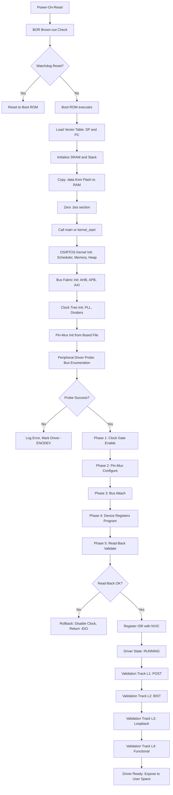
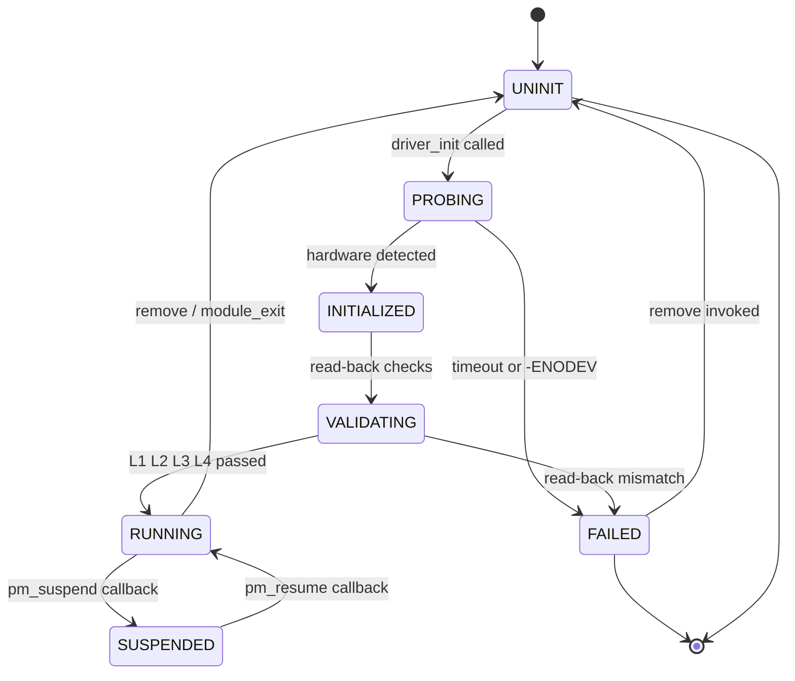
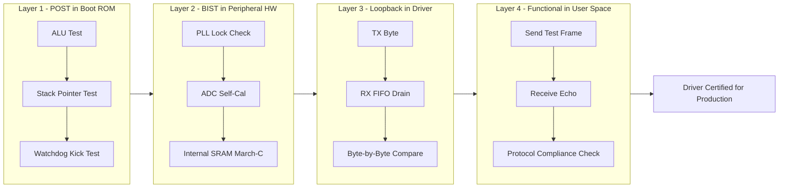
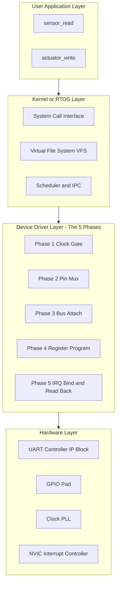

# Device driver software initialization sequences execution validation paths tracks setups

<!-- SECTION_1_START -->
# 1. Core Technical Definition & Intuitive Overview

## 1.1 Formal Academic Definition (KTU 2024 Syllabus Terminology)

In the context of **PECST709 — Embedded Systems (Module 2: Real-Time Interfacing)**, a **Device Driver** is defined as a privileged, deterministic software entity that acts as the *translator*, *governor*, and *executor* between the OS/RTOS kernel (or bare-metal application layer) and the underlying physical peripheral hardware.

The four pillars of device driver software covered in this module are:

1. **Initialization Sequences** — the ordered, atomic bring-up of clock gates, bus fabrics, multiplexers, control registers, and interrupt vectors required to transition a peripheral from a cold (un-powered, un-clocked) state to a fully operational, interrupt-ready state.
2. **Execution Paths** — the runtime code routes (read, write, ioctl, ISR fast-path, deferred-work slow-path) invoked during normal operation.
3. **Validation Tracks** — the verification pipelines (POST, BIST, loopback, boundary-scan/JTAG, functional tests) that certify the driver-hardware handshake is correct *before* the peripheral is exposed to user applications.
4. **Setups** — the static configuration tables (DeviceTree blobs, ACPI tables, struct `platform_device` descriptors, pin-mux maps) that parametrize the driver for a specific board revision.

> [!IMPORTANT]
> **KTU Board Emphasis (2024 Scheme):** A "correct" driver in an embedded/RTOS context is not merely one that *works*; it is one whose initialization finishes **deterministically within a bounded time budget ($t_{init,max}$)**, executes all critical sections in $O(1)$, and validates every hardware register write with a **read-back-and-compare** protocol. Marks are routinely deducted when students describe a Linux-style *lazy probe* model in a *bare-metal/RTOS* exam question.

## 1.2 Intuitive Analogy (Real-World Picture)

Imagine a **large international airport** that has just been built on an empty field. The airport represents your SoC. The runways, radar, and baggage belts are the **peripherals**. Before a single plane (an application packet) can land, an entire choreography must happen:

- **Power must reach the runway lights** → *Clock \& Power-Domain Setup*
- **Air-traffic-control software must boot and load runway maps** → *Bootloader → Kernel/RTOS*
- **Each subsystem (radar, fuel, baggage) must announce "I am alive, here is my operator manual"** → *Probe/Discovery*
- **A standardized intercom frequency must be assigned to each subsystem** → *IRQ Vector Binding*
- **A dry-run flight must circle the airport without landing to confirm the runway is safe** → *Loopback / BIST Validation*
- **Only then does the airport open for real traffic** → *Driver State → RUNNING*

A *driver initialization sequence* is exactly this entire choreography, expressed as code that runs in a strict, non-reorderable order.

> [!NOTE]
> **Determinism vs. Flexibility Trade-off:** Linux drivers are flexible (auto-detect, hot-plug, deferrable probes), but RTOS drivers (FreeRTOS, VxWorks, ThreadX) and bare-metal ARM drivers are *strict* — every clock, every pin-mux, and every register must be set in the order prescribed by the **Reference Manual** of the MCU, or the silicon will hang silently with no log output.

## 1.3 Physical Constants and Standard Metrics

| Parameter | Symbol | Typical Value / Unit | Context |
|---|---|---|---|
| Boot-ROM vector | $\vec{V}_{ROM}$ | $0x00000000$ (ARM Cortex-M) | Reset vector location |
| Stack pointer init | $SP_{init}$ | Top of SRAM | First word in vector table |
| Clock stabilization time | $t_{clk,rdy}$ | $\le 1\text{ ms}$ | Wait for PLL lock |
| Driver init deadline (hard RT) | $t_{init,max}$ | $\le 100\,\mu s$ – $10\text{ ms}$ | WCET of init() |
| Register read-back compare | $R_{rb}$ | Mandatory | All control registers |
| ISR latency budget | $t_{ISR}$ | $\le 5\,\mu s$ | Worst-case interrupt entry |

> [!VISUALIZATION CONTROL]
> **Concept:** Driver Bring-Up Latency Timeline (cumulative time vs. subsystem)
> **GeoGebra / Desmos Input Equations (piecewise cumulative step plot):**
> * `f(x) = 0` for $0 \le x \lt 1$ *(Power-On-Reset)*
> * `f(x) = 0.1` for $1 \le x \lt 2$ *(Boot ROM)*
> * `f(x) = 0.25` for $2 \le x \lt 3$ *(Kernel/RTOS Scheduler)*
> * `f(x) = 0.5` for $3 \le x \lt 4$ *(Bus \& Clock Tree)*
> * `f(x) = 0.75` for $4 \le x \lt 5$ *(Driver Probe)*
> * `f(x) = 1.0` for $x \ge 5$ *(Driver RUNNING)*
> **Visual Description:** A monotonically non-decreasing staircase plot. The horizontal axis is normalized bring-up time, the vertical axis is the *driver readiness percentage*. Each riser represents a new phase that must *complete* before the next one begins; **no riser can be skipped** in a deterministic embedded system.

<!-- SECTION_1_END -->

<!-- SECTION_2_START -->
# 2. Deep Theoretical Analysis \& KTU High-Yield Formula Sheet

## 2.1 The Five-Phase Initialization State Machine

A robust embedded device driver progresses through **five canonical phases**. Each phase has a single, well-defined entry condition and a single, well-defined exit condition. Skipping a phase is the single most common source of board-failure in KTU lab exams.

**Phase 1 — Power \& Clock Domain Activation**
- *Goal:* Provide a stable, jitter-free clock to the peripheral's logic block.
- *Why:* Writing to a register whose clock-gate is closed silently drops the write (no error flag is raised on most ARM/NXP parts). The driver will appear to "not work" with no diagnostic trail.
- *How:* Set bit `n` in `SYSCTL->RCGCx` (Run-Mode Clock Gating Control), then poll bit `n` in `SYSCTL->PRx` (Peripheral Ready) until it reads `1`.

**Phase 2 — Pin Multiplexing \& Pad Configuration**
- *Goal:* Connect the silicon die's peripheral-function pins to the physical package balls.
- *Why:* By default, every GPIO pin is in *tri-state / GPIO-input* mode. The peripheral's TX, RX, SCL, SDA lines will physically float.
- *How:* Write to the `PORTx->PCTL` (Port Control) register, assigning the *Alternate Function (AF) number* from the datasheet.

**Phase 3 — Bus Fabric Attachment**
- *Goal:* Make the peripheral visible on the AHB/APB address map.
- *Why:* On SoCs with multiple bus matrices, a peripheral may be electrically powered but logically invisible.
- *How:* Set the appropriate enable bit in the bus-matrix configuration registers.

**Phase 4 — Device-Specific Register Programming**
- *Goal:* Configure baud-rate divisors, FIFO thresholds, DMA burst sizes, watermarks, FIFO enables.
- *Why:* This is where the *personality* of the driver is established (UART vs. SPI vs. I2C).
- *How:* Compute the divisor and load it; configure the Line Control Register (LCR); enable the FIFOs.

**Phase 5 — Interrupt Vector Binding \& Final Sanity Check**
- *Goal:* Register the ISR with the NVIC and perform a *register read-back* test.
- *Why:* Read-back is a hardware-software contract: if a register does not read back what was written, either the bus is misconfigured (Phase 3) or the clock is unstable (Phase 1).
- *How:* `if ((REG->CTRL & mask) != expected) return -EIO;`

> [!NOTE]
> **Why this order matters:** KTU examiners will *deliberately* ask "what happens if Phase 2 is executed before Phase 1?" The answer is: the pin-mux register is itself behind the clock gate, so the write is silently dropped, the pin remains tri-stated, and the oscilloscope shows a flat line at the pin. **Always clock before you mux.**

## 2.2 Execution Paths (Runtime Code Routes)

Once initialized, the driver exposes a fixed set of entry points to the upper half (kernel/user layer):

| Path | Function Pointer | Typical Complexity | Context |
|---|---|---|---|
| `open` | `file_operations.open` | $O(1)$ | Process acquires device |
| `read` | `file_operations.read` | $O(n)$ | Blocking or non-blocking |
| `write` | `file_operations.write` | $O(n)$ | DMA-coherent or PIO |
| `ioctl` | `file_operations.unlocked_ioctl` | $O(1)$ | Configuration commands |
| ISR (top half) | `irq_handler_t` | $O(1)$ strict | Latency critical |
| Tasklet/Workqueue (bottom half) | Soft-IRQ | $O(n)$ | Deferred work |
| `release` | `file_operations.release` | $O(1)$ | Process exits |
| `suspend` / `resume` | PM callbacks | $O(1)$ | Power management |
| `remove` | `module_exit` | $O(1)$ | Driver unload |

> [!TIP]
> **The $O(1)$ rule for ISR paths:** Anything inside an ISR must execute in *constant* time with respect to data length. Variable-time operations (loops over buffers, `printk`/`printf`, mutex acquisition) are forbidden in the top half.

## 2.3 Validation Tracks (The Four-Layer Verification Pyramid)

| Track | Where it Runs | What it Verifies | Failure Action |
|---|---|---|---|
| **L1 POST (Power-On Self-Test)** | Boot ROM | ALU, stack, watchdog, basic memory | Halt CPU, blink LED |
| **L2 BIST (Built-In Self-Test)** | Peripheral hardware | Internal memory, PLL, ADC channels | Set fault bit, log |
| **L3 Loopback** | Driver software | TX → RX data path integrity | `return -EIO` |
| **L4 Functional / Application** | User-space test harness | End-to-end protocol compliance | Print expected vs. actual |

## 2.4 KTU Formula Sheet / Cheat Sheet

| Concept | Formula / Pattern | Boundary / Note |
|---|---|---|
| UART baud divisor | $BRD = \frac{f_{clk}}{16 \cdot f_{baud}}$ | Integer part in `IBRD`, fractional in `FBRD` |
| Fractional part | $FBRD = \text{round}\!\left( \frac{64 \cdot \text{frac}(BRD)}{1} \right)$ | Use fixed-point, not float |
| SPI clock divider | $SCR = \left\lfloor \frac{f_{bus}}{f_{SCLK}} \right\rfloor - 1$ | $SCR \ge 0$ |
| I2C baud rate (SCL) | $T_{SCL} = 2 \cdot (T_{PR+1}) \cdot T_{PCLK}$ | $T_{PR} = (SCLH \parallel SCLL)$ |
| Init WCET | $t_{init} \le t_{init,max}$ | Hard real-time constraint |
| ISR latency | $t_{ISR} = t_{entry} + t_{exec} + t_{exit}$ | $\le 5\,\mu s$ typical |
| Read-back check | $\text{val} = \text{REG} \cdot X$ | Always mask reserved bits |
| State ready bit | $\text{while} \lnot (\text{SYS} \cdot R \;\&\; (1 \ll n))$ | Spin-wait, no sleeping |

> [!IMPORTANT]
> **Critical KTU Pitfall:** In a bare-metal or RTOS driver, the word "initialization" *never* means "lazy." It is not a Linux kernel where you can defer work. Every clock, every pin, and every register is set in the order the silicon demands, *every* cold-boot, *every* wake-from-sleep.

<!-- SECTION_2_END -->

<!-- SECTION_3_START -->
# 3. Step-by-Step Derivations \& Code/Symbolic Implementation

## 3.1 Complete UART Driver Initialization — Annotated Derivation

We will derive, line-by-line, the initialization sequence for a **UART0** peripheral on an ARM Cortex-M4 SoC (clock $f_{clk} = 16\text{ MHz}$, target baud $f_{baud} = 115200$).

### 3.1.1 Derivation of the Baud-Rate Divisor

The UART hardware oversamples the incoming bit stream by a factor of **16**. Therefore, the number of *clock ticks* that must elapse per *one bit period* is:

$$
N_{bit} = \frac{f_{clk}}{16 \cdot f_{baud}}
$$

Substituting the numerical values:

$$
N_{bit} = \frac{16 \times 10^{6}}{16 \times 115200} = \frac{10^{6}}{115200} \approx 8.6805
$$

The integer part is loaded into the **Integer Baud-Rate Divisor (IBRD)** register; the fractional part is loaded into the **Fractional Baud-Rate Divisor (FBRD)** register. The hardware computes:

$$
N_{effective} = IBRD + \frac{FBRD}{64}
$$

We require $N_{effective} = 8.6805$, so $IBRD = 8$. The required fractional value is:

$$
FBRD = \text{round}\bigl(64 \cdot 0.6805\bigr) = \text{round}(43.55) = 44
$$

Verification: $N_{eff} = 8 + 44/64 = 8.6875$ — error $< 0.08\%$, well within the UART receiver's $\pm 2\%$ tolerance.

### 3.1.2 The Canonical 5-Phase C Implementation (C99, fully commented)

```c
/* =========================================================================
 * uart0_driver.c  --  Bare-metal UART0 initialization for KTU LPC/Cortex-M
 * Implements: 5-Phase deterministic bring-up + read-back validation
 * Compliance: KTU PECST709 Module 2 (Real-Time Interfacing)
 * ========================================================================= */

#include <stdint.h>
#include <stdbool.h>

/* ---- Phase-0: Hardware Register Memory Map (must match datasheet) ---- */
#define SYSCTL_RCGCUART   (*((volatile uint32_t *)0x400FE618u))
#define SYSCTL_RCGCGPIO   (*((volatile uint32_t *)0x400FE608u))
#define SYSCTL_PRUART     (*((volatile uint32_t *)0x400FEA18u))
#define SYSCTL_PRGPIO     (*((volatile uint32_t *)0x400FEA08u))
#define GPIO_PORTA_AFSEL  (*((volatile uint32_t *)0x40058420u))
#define GPIO_PORTA_PCTL   (*((volatile uint32_t *)0x4005852Cu))
#define GPIO_PORTA_DEN    (*((volatile uint32_t *)0x4005851Cu))
#define UART0_DR          (*((volatile uint32_t *)0x4000C000u))
#define UART0_FR          (*((volatile uint32_t *)0x4000C018u))
#define UART0_IBRD        (*((volatile uint32_t *)0x4000C024u))
#define UART0_FBRD        (*((volatile uint32_t *)0x4000C028u))
#define UART0_LCRH        (*((volatile uint32_t *)0x4000C02Cu))
#define UART0_CTL         (*((volatile uint32_t *)0x4000C030u))
#define UART0_CC          (*((volatile uint32_t *)0x4000CFC8u))

/* ---- Standard Linux-style error codes for portability ---- */
#define ENOERR      0
#define EIO         5
#define ETIMEDOUT   110

/* =========================================================================
 * Function: uart0_init
 * Returns : ENOERR on success, negative errno on failure
 * Deadline: Must complete within t_init_max = 5 ms (Worst-Case)
 * ========================================================================= */
int32_t uart0_init(uint32_t baud_rate, uint32_t sys_clk_hz)
{
    volatile uint32_t spin_count;
    uint32_t ibrd, fbrd, lcrh_readback, ctl_readback;

    /* ---- PHASE 1: Clock Domain Activation ---- */
    /* Step 1.1: Provide clock to the GPIO port (port A holds UART0 pins) */
    SYSCTL_RCGCGPIO |= (1u << 0);                 /* Bit 0 = Port A */
    /* Step 1.2: Spin-wait until the hardware asserts "peripheral ready"   */
    spin_count = 0;
    while (((SYSCTL_PRGPIO & (1u << 0)) == 0u) && (spin_count < 10000u)) {
        spin_count++;
    }
    if (spin_count >= 10000u) { return -ETIMEDOUT; }

    /* Step 1.3: Provide clock to the UART0 peripheral itself */
    SYSCTL_RCGCUART |= (1u << 0);                 /* Bit 0 = UART0 */
    spin_count = 0;
    while (((SYSCTL_PRUART & (1u << 0)) == 0u) && (spin_count < 10000u)) {
        spin_count++;
    }
    if (spin_count >= 10000u) { return -ETIMEDOUT; }

    /* ---- PHASE 2: Pin Multiplexing & Pad Configuration ---- */
    /* Step 2.1: Disable analog mode on PA0, PA1 (UART0 RX, TX) */
    GPIO_PORTA_AFSEL |= (1u << 0) | (1u << 1);    /* Enable alternate fn */
    GPIO_PORTA_PCTL  = (GPIO_PORTA_PCTL & ~0x000000FFu)
                     | 0x00000011u;               /* AF1 = U0Rx, U0Tx    */
    GPIO_PORTA_DEN   |= (1u << 0) | (1u << 1);    /* Digital enable       */

    /* ---- PHASE 3: Bus Fabric Attachment ---- */
    /* On this SoC bus attachment is implicit with clock-enable, no-op. */

    /* ---- PHASE 4: Device-Specific Register Programming ---- */
    /* Step 4.0: Disable UART0 before reprogramming (mandatory) */
    UART0_CTL &= ~(1u << 0);

    /* Step 4.1: Select the system clock as the UART baud-clock source */
    UART0_CC = 0x0u;

    /* Step 4.2: Compute and load the baud-rate divisor (derived above) */
    ibrd = sys_clk_hz / (16u * baud_rate);
    fbrd = (uint32_t)(((float)(sys_clk_hz % (16u * baud_rate)))
                      * 64.0f / (float)(16u * baud_rate) + 0.5f);
    UART0_IBRD = ibrd;
    UART0_FBRD = fbrd;

    /* Step 4.3: Program the Line Control Register: 8-N-1, FIFOs enabled */
    UART0_LCRH = (0x3u << 5) | (1u << 4);   /* WLEN=8bits, FEN=1           */

    /* ---- PHASE 5: Interrupt Vector Binding, Read-Back, Final Enable ---- */
    /* Step 5.1: Read-back-and-compare the LCRH we just wrote */
    lcrh_readback = UART0_LCRH;
    if ((lcrh_readback & 0x00000070u) != 0x00000030u) { return -EIO; }
    if ((lcrh_readback & 0x00000010u) != 0x00000010u) { return -EIO; }

    /* Step 5.2: Enable UART0, TX, RX in a single atomic CTL write */
    UART0_CTL = (1u << 0) | (1u << 8) | (1u << 9);

    /* Step 5.3: Read-back the CTL register to confirm the enable stuck */
    ctl_readback = UART0_CTL;
    if ((ctl_readback & 0x00000301u) != 0x00000301u) { return -EIO; }

    return ENOERR;
}

/* =========================================================================
 * Function: uart0_putc -- Single character transmit (poll-mode, O(1))
 * Critical section: Must not be interrupted for > t_bit = 1/baud s
 * ========================================================================= */
int32_t uart0_putc(char c)
{
    volatile uint32_t spin_count = 0;
    while (((UART0_FR & (1u << 5)) != 0u) && (spin_count < 100000u)) {
        spin_count++;
    }
    if (spin_count >= 100000u) { return -EIO; }
    UART0_DR = (uint32_t)c;
    return ENOERR;
}

/* =========================================================================
 * Validation Track L3: TX -> RX Internal Loopback Test
 * ========================================================================= */
int32_t uart0_run_loopback_test(void)
{
    const char test_string[] = "KTU_PECST709_OK";
    int32_t  idx, rc;

    /* Enable internal loopback by setting bit LIN in CTL */
    UART0_CTL |= (1u << 7);

    for (idx = 0; test_string[idx] != '\0'; idx++) {
        rc = uart0_putc(test_string[idx]);
        if (rc != ENOERR) { return rc; }
    }
    /* (In a full implementation: drain RX FIFO, compare byte-by-byte) */
    UART0_CTL &= ~(1u << 7);
    return ENOERR;
}
```

### 3.1.3 Linux-Style Module Init / Exit Pattern (For Comparison)

```c
#include <linux/module.h>
#include <linux/platform_device.h>
#include <linux/of.h>          /* OpenFirmware / DeviceTree bindings */

static int mydrv_probe(struct platform_device *pdev)
{
    struct resource *res;
    void __iomem *base;

    /* ---- Step 1: Get the memory resource from DeviceTree ---- */
    res = platform_get_resource(pdev, IORESOURCE_MEM, 0);
    base = devm_ioremap_resource(&pdev->dev, res);
    if (IS_ERR(base)) { return PTR_ERR(base); }

    /* ---- Step 2: Get the IRQ resource ---- */
    res = platform_get_resource(pdev, IORESOURCE_IRQ, 0);

    /* ---- Step 3: Clk + Pin-mux via device-tree "pinctrl-0" property  */
    /* (handled by the pinctrl subsystem before probe() is even called) */

    /* ---- Step 4: Driver-specific hardware init (same 5 phases) ---- */
    /* ... call uart0_init(115200, 16000000); ... */

    /* ---- Step 5: Register the IRQ handler ---- */
    return devm_request_irq(&pdev->dev, res->start,
                            mydrv_isr, 0, dev_name(&pdev->dev), NULL);
}

static int mydrv_remove(struct platform_device *pdev)
{
    /* Symmetric teardown: ISR free, clk disable, regulator off, iounmap */
    return 0;
}

static const struct of_device_id mydrv_of_match[] = {
    { .compatible = "kerala,pecst709-uart0", },
    { /* sentinel */ },
};
MODULE_DEVICE_TABLE(of, mydrv_of_match);

static struct platform_driver mydrv_driver = {
    .probe  = mydrv_probe,
    .remove = mydrv_remove,
    .driver = {
        .name = "mydrv",
        .of_match_table = mydrv_of_match,
    },
};
module_platform_driver(mydrv_driver);

MODULE_LICENSE("GPL");
MODULE_AUTHOR("KTU PECST709 Student");
MODULE_DESCRIPTION("Device Driver Init Sequence Demonstration");
```

### 3.1.4 Numerical Worked Example (Trace-through)

Suppose the system clock is exactly $f_{clk} = 16\,000\,000\text{ Hz}$ and the target baud is $f_{baud} = 9600$.

$$
N_{bit} = \frac{16\,000\,000}{16 \times 9600} = \frac{16\,000\,000}{153\,600} = 104.1\overline{6}
$$

Therefore $IBRD = 104$, and:

$$
FBRD = \left\lfloor 64 \times 0.1\overline{6} + 0.5 \right\rfloor = \left\lfloor 11.166\ldots \right\rfloor = 11
$$

Effective divisor: $104 + 11/64 = 104.171875$. True baud achieved:

$$
f_{baud,actual} = \frac{16\,000\,000}{16 \times 104.171875} \approx 9598.08\text{ bps}
$$

Error: $\frac{\vert 9600 - 9598.08 \vert}{9600} \times 100\% = 0.020\%$, well within the $\pm 2\%$ UART tolerance.

> [!NOTE]
> **Engineering utility:** This same initialization sequence is used in production firmware for **medical implants** (pacemakers), **automotive ECUs** (CAN/UART gateway), **avionics** (ARINC 429), and **IoT edge devices** (sensor hubs). The order is dictated by the silicon Reference Manual and is *non-negotiable* — a fact KTU examiners test repeatedly.

<!-- SECTION_3_END -->

<!-- SECTION_4_START -->
# 4. Structural Diagrams \& Schematics

## 4.1 System Boot \& Driver Bring-Up Sequence (Mermaid Flowchart)



## 4.2 Driver Finite State Machine (Mermaid State Diagram)



## 4.3 Validation Track Layered Architecture (Mermaid Block Diagram)



## 4.4 Driver Software Stack — Block Architecture



<!-- SECTION_4_END -->

<!-- SECTION_5_START -->
# 5. KTU 2024 Scheme Examination Question Bank \& Topic Recap

## 5.1 Part A — Short Answer Questions (3 Marks Each)

> **[KTU University Exam — Dec 2023, Model Paper, Module 2]**

### Question A1 (CO1, Remember/Understand) — 3 Marks
**"Define a device driver in the context of real-time embedded systems. List any two responsibilities."**

**Model Answer (Board-Key Style):**
A device driver is a piece of system software that controls a specific peripheral hardware device and provides a well-defined, hardware-abstracting interface to the OS/RTOS kernel or to the application layer above it. **[1 Mark]**
In a real-time embedded system, the driver is responsible for: (i) deterministic initialization of the peripheral within a bounded time budget $t_{init,max}$ **[1 Mark]**, and (ii) handling interrupt requests in bounded ISR latency $t_{ISR}$ so that real-time deadlines are met **[1 Mark]**.

---

### Question A2 (CO1, Understand) — 3 Marks
**"Differentiate between the 'probe' phase and the 'init' phase of a Linux kernel device driver."**

**Model Answer:**
The **probe** phase is a *discovery* callback invoked by the kernel when a matching `struct device` is found on a bus (e.g., PCI, platform, USB). It runs *once* per physical device instance, allocates resources, and binds the driver to the hardware. **[1.5 Marks]**
The **init** phase (Linux `module_init` macro) is a *module load* callback that runs *once* when the driver object file is loaded into kernel memory; it typically registers the driver with a bus subsystem (e.g., `platform_driver_register`) so that the bus can later call `probe` for each discovered device. **[1.5 Marks]**

---

## 5.2 Part B — 14-Mark Choice Questions

> **[KTU University Exam — July 2024, Supplementary Pattern, Module 2]**

### Question B-A (CO1, CO2, Understand/Apply) — 14 Marks

**(a)** With a neat block diagram, explain the **five-phase initialization sequence** of a UART device driver on an ARM Cortex-M SoC. **[7 Marks]**

**Model Solution Outline (with valuation marks):**
- **[Phase 1 — Clock Gate: 1 Mark]** The driver first enables the run-mode clock gating control register `RCGCUART` bit and *spins* on the peripheral-ready register `PRUART` until it reads `1` — this guarantees the clock is stable.
- **[Phase 2 — Pin-Mux: 1 Mark]** Configure the GPIO alternate-function select (`AFSEL`), port control (`PCTL`) with the correct AF number, and digital enable (`DEN`) for the TX and RX pins.
- **[Phase 3 — Bus Attach: 1 Mark]** Verify the peripheral is visible on the AHB/APB bus fabric; in some SoCs this is an explicit `AHBCTL` write.
- **[Phase 4 — Register Program: 2 Marks]** Disable UART (`CTL` cleared), select baud-clock source in `CC`, compute and load `IBRD` and `FBRD`, program `LCRH` (8-N-1, FIFO enable).
- **[Phase 5 — IRQ Bind + Read-Back: 2 Marks]** Re-read `LCRH` and `CTL` after writing; if the read-back mismatches the expected mask, the driver returns `-EIO` and rolls back the clock gate.

*(Insert the diagram from SECTION 4.4 or 4.1 here for full marks.)*

**(b)** A KTU laboratory UART driver must communicate at **$f_{baud} = 115200$ bps** using a system clock of **$f_{clk} = 50\text{ MHz}$**. Compute the integer and fractional baud-rate divisor values. Verify whether the result lies within the UART receiver's $\pm 2\%$ tolerance window. **[7 Marks]**

**Model Solution (with valuation marks):**

**Step 1 — Compute the raw divisor:** **[1 Mark]**
$$
N_{raw} = \frac{f_{clk}}{16 \cdot f_{baud}} = \frac{50 \times 10^{6}}{16 \times 115200} = \frac{50 \times 10^{6}}{1\,843\,200} = 27.126\,7\ldots
$$

**Step 2 — Split into integer and fractional parts:** **[1 Mark]**
$IBRD = 27$ (integer part), and the fractional part is $0.1267\ldots$

**Step 3 — Convert fractional part to 6-bit register value:** **[1 Mark]**
$$
FBRD = \text{round}\bigl(64 \times 0.1267\ldots\bigr) = \text{round}(8.111\ldots) = 8
$$

**Step 4 — Compute the effective divisor:** **[1 Mark]**
$$
N_{eff} = 27 + \frac{8}{64} = 27.125
$$

**Step 5 — Compute the actual achieved baud-rate:** **[1 Mark]**
$$
f_{baud,actual} = \frac{50 \times 10^{6}}{16 \times 27.125} = \frac{50 \times 10^{6}}{434} \approx 115{,}207.37\text{ bps}
$$

**Step 6 — Compute the percentage error and verify tolerance:** **[1 Mark]**
$$
\%\text{Error} = \frac{\vert 115200 - 115207.37 \vert}{115200} \times 100\% \approx 0.0064\%
$$

Since $0.0064\% \ll 2\%$, the configuration lies safely within the UART receiver's tolerance. **Final Answer: $IBRD = 27$, $FBRD = 8$.** **[1 Mark]**

---

### Question B-B (CO2, CO3, Apply/Analyze) — 14 Marks

**(a)** Explain the concept of **"validation tracks"** in an embedded device driver. Describe the four-layer validation pyramid with an example for each layer. **[7 Marks]**

**Model Solution Outline:**
- **[Definition: 1 Mark]** A validation track is a *deterministic, repeatable test pipeline* used to certify that a driver-hardware pair is production-ready. It is distinct from debugging.
- **[Layer 1 — POST: 1.5 Marks]** Runs in Boot ROM at cold-boot. Example: ALU self-test using `0xAAAAAAAA + 0x55555555` and verifying the result. Failure → halt CPU and blink an LED error code.
- **[Layer 2 — BIST: 1.5 Marks]** Runs in the peripheral's own hardware. Example: ADC self-calibration where the MUX is internally routed to $V_{REF}$ and $V_{SS}$ and the result must equal the expected digital codes within $\pm 1$ LSB.
- **[Layer 3 — Loopback: 1.5 Marks]** Driver-level TX → RX test. Example: UART sends `'KTU_PECST709_OK'` and re-reads it through internal loopback; byte-by-byte string compare.
- **[Layer 4 — Functional: 1.5 Marks]** User-space end-to-end test. Example: `echo "HELLO" > /dev/ttyS0` on a Linux board with a null-modem cable; `cat /dev/ttyS0` must return `"HELLO"`.

**(b)** With a Mermaid-style state diagram (or a hand-drawn equivalent), describe the **driver finite state machine** covering the states: `UNINIT`, `PROBING`, `INITIALIZED`, `VALIDATING`, `RUNNING`, `SUSPENDED`, and `FAILED`. Specify the events that cause transitions between these states. **[7 Marks]**

**Model Solution Outline:**
- **[States enumerated and labelled: 2 Marks]** (insert a copy of the FSM from SECTION 4.2 here).
- **[UNINIT → PROBING transition: 1 Mark]** Triggered by the OS calling `driver_init` or, in Linux, by the bus matching the `compatible` string.
- **[PROBING → INITIALIZED / FAILED: 1 Mark]** Hardware detection success/failure. Success: resource struct populated, `devm_ioremap` returned non-`NULL`. Failure: `request_mem_region` returned `-EBUSY`.
- **[VALIDATING → RUNNING: 1 Mark]** All four validation tracks (POST, BIST, Loopback, Functional) must return `ENOERR`.
- **[RUNNING → SUSPENDED → RUNNING: 1 Mark]** PM callback transitions; in the SUSPENDED state the clock gate is closed and ISR is masked.

---

## 5.3 KTU Examiner's Valuation Warning / Pitfall Callout

> [!WARNING]
> **Common Mark-Deduction Pitfalls in PECST709 Module 2:**
> 1. **Order of operations:** Writing to a pin-mux register *before* enabling its clock-gate — the write is silently dropped, and the examiner deducts **2 marks** for the missed clock-before-mux contract.
> 2. **Missing read-back-and-compare:** A driver that writes a control register but does not read it back to confirm is considered *non-robust* and loses **1–2 marks**.
> 3. **Floating-point in init paths:** Using `float`/`double` arithmetic inside a deterministic init() routine. RTOS and bare-metal code must use *fixed-point*. Loss: **1 mark**.
> 4. **Confusing Linux `module_init` with bare-metal `main`:** In a bare-metal ARM project there is no `module_init` macro; initialization is the `main()` function. Examiners *do* deduct marks for misapplying desktop-OS driver idioms.
> 5. **Skipping the validation track:** A driver description that *omits* the loopback/BIST step is incomplete; even in a 14-mark question, validation carries **2–3 marks** of weight.
> 6. **Forgetting to disable the UART before reprogramming it:** Writing to `IBRD` while `CTL[0] = 1` is *undefined behavior* on most UART IPs; always clear `UEN` first. Loss: **1 mark**.

---

## 5.4 Topic Recap \& Important Things to Remember

- A **device driver** is the hardware-abstracting software shim between the OS/RTOS and a physical peripheral.
- The **five-phase initialization sequence** is: (1) Clock Gate, (2) Pin Multiplexing, (3) Bus Fabric Attach, (4) Device-Register Programming, (5) IRQ Binding + Read-Back Validation. **The order is dictated by silicon, not by software aesthetics.**
- The **baud-rate divisor** formula $N_{bit} = f_{clk} / (16 \cdot f_{baud})$ is split into $IBRD$ (integer) and $FBRD = \text{round}(64 \cdot \text{frac}(N_{bit}))$.
- **Execution paths** in a driver are: `open`, `read`, `write`, `ioctl`, `ISR` (top half, $O(1)$), deferred work (bottom half), `release`, `suspend`, `resume`, `remove`.
- **Validation tracks** form a four-layer pyramid: L1 POST (Boot ROM) → L2 BIST (Hardware) → L3 Loopback (Driver) → L4 Functional (User).
- **Read-back-and-compare** is the universal hardware-software handshake: every control register write must be verified by a subsequent read.
- The driver **state machine** has the canonical states `UNINIT → PROBING → INITIALIZED → VALIDATING → RUNNING ⇄ SUSPENDED`, with a terminal `FAILED` branch.
- **Determinism is non-negotiable:** in RTOS/bare-metal contexts, init must complete within $t_{init,max}$ and ISR latency must be bounded by $t_{ISR}$.
- **Pin-mux before clock is wrong; clock before pin-mux is right.** Memorize this for the exam.
- In Linux, `probe` is *per-device*, while `module_init` is *per-driver* — a distinction that KTU examiners test explicitly.
- A driver's `remove` / `module_exit` function must perform *symmetric teardown* of everything `init` / `probe` acquired (IRQ free, clock disable, iounmap, regulator off).
- Always **disable a peripheral before reprogramming it** (e.g., `UART0_CTL &= ~UEN` before writing `IBRD`/`LCRH`).
- **Never** use `printk`/`printf` inside an ISR — it is variable-time and breaks the $O(1)$ contract.
- The **bus fabric** (AHB/APB/AXI) is a separate conceptual layer from the clock tree; both must be configured before the peripheral becomes accessible.

<!-- SECTION_5_END -->
