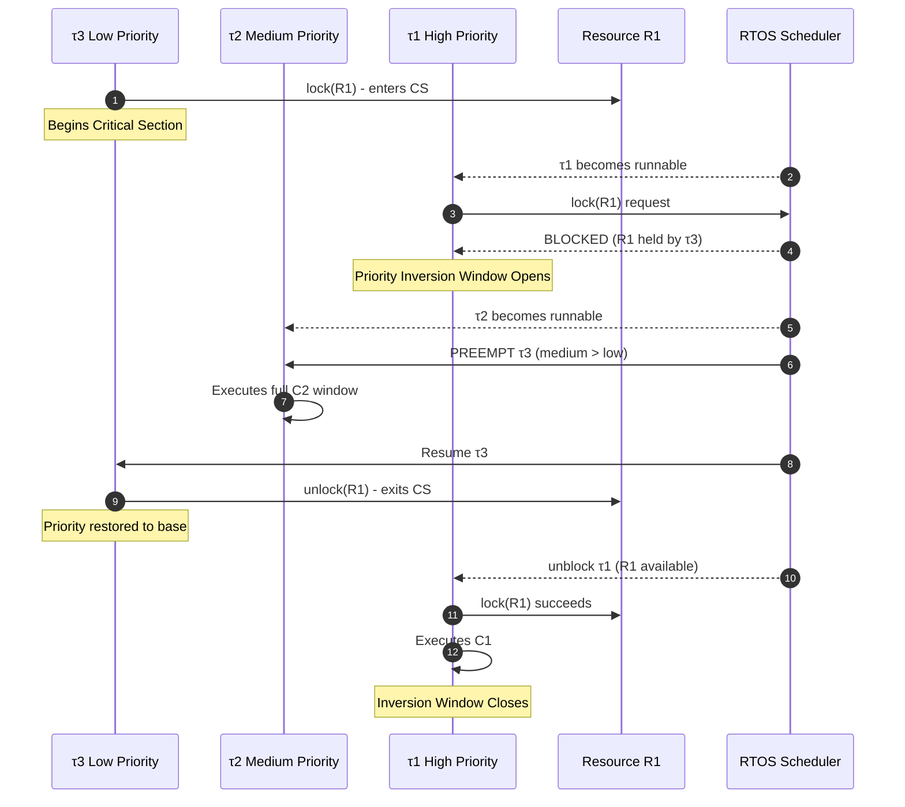
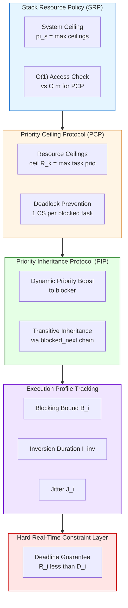
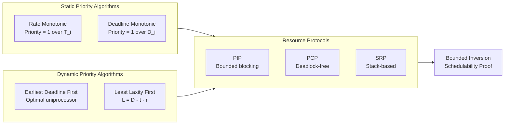
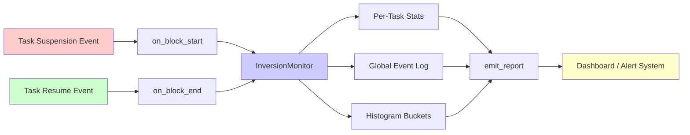

# Priority inversion mitigation frameworks tracking metrics algorithms execution parameters profiles

<!-- SECTION_1_START -->

# Embedded Operating Systems: Priority Inversion & Real-Time Scheduling

## 1. Core Technical Definition & Intuitive Overview

> [!IMPORTANT]
> **Priority Inversion** is an OS scheduling anomaly in real-time embedded systems where a higher-priority task is **indirectly preempted** by a lower-priority task — effectively "inverting" the relative priorities of the two tasks. This occurs when the high-priority task is **waiting for a shared resource** (mutex, semaphore, I/O register) currently held by the low-priority task, and an unrelated medium-priority task becomes runnable and preempts the low-priority task.

**Formal KTU 2024 Definition:**
Priority Inversion is a scheduling pathology defined as the unbounded or extended duration during which a higher-priority task is forced to wait for the execution of lower-priority tasks due to contention over mutually-exclusive shared resources. It violates the **bounded blocking** guarantee required by hard real-time systems.

**Symbolic Representation:**

Let $\tau_1, \tau_2, \tau_3$ be three tasks with priorities $P_1 > P_2 > P_3$. If $\tau_1$ (highest) and $\tau_3$ (lowest) share a resource $R$, and $\tau_1$ requests $R$ while $\tau_3$ holds it, then the effective execution order becomes $\tau_3 \rightarrow \tau_2 \rightarrow \tau_3 \rightarrow \tau_1$, which is the **inverted** priority sequence.

> [!NOTE]
> **Intuitive Analogy — The Traffic Roundabout:**
> Imagine a 4-lane highway (high-priority task $\tau_1$) merging into a single-lane narrow bridge (shared resource $R$). A slow tractor (low-priority task $\tau_3$) is already on the bridge. An ambulance (medium-priority $\tau_2$) arrives and is *technically allowed* to overtake the tractor on the multi-lane highway before the bridge. The result? The ambulance (medium) overtakes the tractor (low), but the highway car (high) is stuck on the bridge behind the tractor. The fast car has been **inverted below** the ambulance in the waiting order.

**Real-World Catastrophic Case Study:**
The **Mars Pathfinder Rover (1997)** experienced system resets due to priority inversion. A high-priority meteorological bus management task was blocked waiting for a shared data bus held by a low-priority task, which was preempted by medium-priority tasks. The watchdog timer reset the system repeatedly. The fix: enable the **Priority Inheritance Protocol** in the VxWorks RTOS.

> [!VISUALIZATION CONTROL]
> **Concept:** Priority Inversion Temporal Sequence
> **Conceptual Coordinate Plot (Time vs Task):**
> * `x-axis = time`, `y-axis = priority level`
> * `Segments: τ3(L) executes → τ2(M) preempts → τ3 resumes → τ1(H) finally unblocks`
> **Visual Description:** Observe how the high-priority task $\tau_1$ waits through the entire medium-priority window, creating a triangular "blocked" region on the timeline.

## 2. Physical Constants and Standard Metrics in Bold

- **Preemptive Scheduling Constant:** $\epsilon_{ctx}$ (context switch overhead) typically **5 µs – 50 µs** in industrial RTOS
- **Priority Inheritance Boost:** elevation to **ceiling(p)** = max priority of any task that may lock the resource
- **Blocking Bound (PIP):** $B_i \le \sum_{k=1}^{m} \text{usage}_k(R)$ — bounded by number of critical sections
- **Hard Real-Time Constraint:** Worst-case latency $L_{max} < D_i$ (deadline)
- **PI (Priority Inversion) Threshold (VxWorks):** Default **1 tick** before system log warning

<!-- SECTION_1_END -->

<!-- SECTION_2_START -->

# 2. Deep Theoretical Analysis & KTU High-Yield Formula Sheet

## 2.1 The Three Canonical Forms of Priority Inversion

**Type 1 — Bounded / Critical Section Inversion (CS-Inversion):**
The high-priority task waits only for the duration of the low-priority task's *critical section execution*. Acceptable in hard real-time if bounded.

**Type 2 — Unbounded Priority Inversion (B-Inversion):**
The wait duration includes arbitrary medium-priority task execution. **Unacceptable** in hard real-time. This is the catastrophic form.

**Type 3 — Chain Blocking:**
A high-priority task holds multiple resources and creates a transitive blocking chain across several lower-priority tasks.

## 2.2 Why Priority Inversion Happens — The Operational Sequence

1. **Acquisition:** Low-priority task $\tau_L$ enters critical section and locks mutex $M$.
2. **Preemption-Disabling:** $\tau_L$ lowers its effective preemptibility while inside the CS.
3. **Request:** High-priority task $\tau_H$ becomes runnable, preempts $\tau_L$, attempts `lock(M)` → **blocks**.
4. **Inversion Window Opens:** $\tau_H$ enters the **inverted waiting state**.
5. **Meddle-Preemption:** Medium-priority task $\tau_M$ preempts $\tau_L$ on the CPU.
6. **Stall Propagation:** $\tau_H$ cannot proceed until $\tau_L$ finishes CS AND $\tau_M$ finishes execution.
7. **Recovery:** $\tau_L$ exits CS, releases $M$, $\tau_H$ unblocks.

## 2.3 Mitigation Frameworks — Protocol Stack Analysis

### A. Priority Inheritance Protocol (PIP) — Sha, Rajkumar, Lehoczky (1990)
- When task $\tau$ blocks higher-priority tasks on a resource, $\tau$'s **dynamic priority is raised** to the maximum priority of any task it blocks.
- Transitive inheritance: if $\tau$ itself blocks on a third resource, the boosted priority propagates.
- **Limitation:** Does **not prevent deadlocks**; chained blocking still possible.

### B. Priority Ceiling Protocol (PCP)
- Each resource $R_k$ is assigned a **priority ceiling** = max priority of any task that may access $R_k$.
- A task may lock $R_k$ only if its priority is **strictly higher** than the ceiling of all resources currently locked by *other* tasks.
- **Properties:** Prevents deadlocks, prevents chain blocking, ensures at most **one critical section** per task blocked.

### C. Immediate Priority Ceiling Protocol (IPCP) / Highest Locker's Priority (HLP)
- The task acquires the **ceiling priority** of the resource the instant it locks it.
- Simpler than original PCP; no nested check required.
- Used in **RTEMS, VxWorks (POSIX option)**.

### D. Stack Resource Policy (SRP) — Baker (1991)
- Extends PCP to multi-resource and multi-processor scenarios.
- Uses a **system-wide ceiling** $\Pi_S$ = max of all resource ceilings currently held.
- Allows non-blocking resource acquisition (precondition check).

## 2.4 Tracking Metrics — Real-Time Performance Observability

> [!NOTE]
> **KTU 2024 Emphasis:** The examiner frequently asks about scheduling *metrics* required to detect and quantify priority inversion in production embedded firmware.

| Metric | Symbol | Formula / Definition | Unit |
| :--- | :--- | :--- | :--- |
| Worst-Case Execution Time | $C_i$ | Max CPU time of task $i$ under all inputs | µs |
| Period | $T_i$ | Release interval of task $i$ | ms |
| Relative Deadline | $D_i$ | Time by which job must finish | ms |
| Response Time | $R_i$ | Completion time $-$ release time | ms |
| Blocking Time | $B_i$ | Time $\tau_i$ is blocked on lower-prio tasks | µs |
| Context Switch Time | $C_{sw}$ | $\Delta t$ between two task contexts | µs |
| Preemption Count | $N_{pre}$ | $\sum$ preemptions per hyperperiod | integer |
| Inversion Duration | $I_{inv}$ | $\int_{t_{block}}^{t_{unblock}} dt$ | µs |
| Jitter | $J_i$ | $\max(R_i) - \min(R_i)$ | µs |
| CPU Utilization | $U$ | $\sum_{i=1}^{n} \frac{C_i}{T_i}$ | % |

## 2.5 Algorithm Profiles — Execution Parameter Mapping

### Rate Monotonic Scheduling (RMS) — Liu & Layland (1973)
- Static priority = $f(1/T_i)$ — shorter period $\Rightarrow$ higher priority
- Schedulability bound: $U \le n(2^{1/n} - 1)$
- As $n \to \infty$, bound $\to \ln 2 \approx$ **0.693**

### Earliest Deadline First (EDF)
- Dynamic priority; optimal for uniprocessor
- Schedulable iff $\sum \frac{C_i}{T_i} \le 1$

### Deadline Monotonic Scheduling (DMS)
- Static priority = $f(1/D_i)$; used when $D_i < T_i$

### Least Laxity First (LLF)
- Dynamic; minimizes $L_i(t) = D_i - t - r_i(t)$

## 2.6 Real-World Utility

- **Automotive AUTOSAR:** Uses **OS priority ceiling** on all `OSEK` resources to guarantee bounded blocking.
- **Aerospace (DO-178C):** Mandates formal proofs of bounded blocking using PCP/SRP.
- **Medical Devices (IEC 62304):** RTOS watchdog + PIP combo for FDA-cleared firmware.
- **Industrial IoT (FreeRTOS):** Provides `vTaskPriorityDisinheritAfterTimeout` and mutex `pxOwner` tracking.

<!-- SECTION_2_END -->

<!-- SECTION_3_START -->

# 3. Step-by-Step Derivations, Formulas & Code Implementation

## 3.1 Mathematical Derivation — Worst-Case Blocking Time under PIP

**Step 1: Define Critical Section Duration**

Let $\zeta_{i,k}$ = maximum duration task $\tau_i$ holds resource $R_k$.

$$\zeta_{i,k}^{max} = \max_{\text{all executions}} \left( t_{release}(R_k) - t_{acquire}(R_k) \right)$$

**Step 2: Blocking Time for Task $\tau_i$**

Under PIP, task $\tau_i$ is blocked **at most once** per resource, by the **longest critical section** of any lower-priority task using that resource.

$$B_i^{PIP} = \sum_{k=1}^{m} \max_{j: P_j < P_i, \tau_j \text{ uses } R_k} \zeta_{j,k}^{max}$$

**Step 3: Worst-Case Response Time (Exact Analysis)**

$$R_i = C_i + B_i^{PIP} + \sum_{j: P_j > P_i} \left\lceil \frac{R_i}{T_j} \right\rceil \cdot C_j$$

**Step 4: Solve Fixed-Point Equation** using iterative method:

$$R_i^{(0)} = C_i + B_i^{PIP}$$
$$R_i^{(n+1)} = C_i + B_i^{PIP} + \sum_{j: P_j > P_i} \left\lceil \frac{R_i^{(n)}}{T_j} \right\rceil \cdot C_j$$

Iteration terminates when $R_i^{(n+1)} = R_i^{(n)}$ or $R_i^{(n+1)} > D_i$ (missed deadline).

## 3.2 Worked Numerical Example — Priority Inversion Under RMS

**Given:** Three tasks scheduled by Rate Monotonic on a uniprocessor.

| Task | $C_i$ (ms) | $T_i$ (ms) | $D_i$ (ms) | Priority |
| :--- | :--- | :--- | :--- | :--- |
| $\tau_1$ | 1 | 4 | 4 | Highest (P=3) |
| $\tau_2$ | 2 | 6 | 6 | Mid (P=2) |
| $\tau_3$ | 3 | 10 | 10 | Lowest (P=1) |

Tasks $\tau_1$ and $\tau_3$ share resource $R_1$. $\tau_3$'s critical section on $R_1$ lasts $\zeta_{3,1} = 1$ ms.

**Total Utilization:**
$$U = \frac{1}{4} + \frac{2}{6} + \frac{3}{10} = 0.25 + 0.333 + 0.30 = 0.883$$

**Step 1: Check RMS Bound**
$n(2^{1/n} - 1) = 3(2^{1/3} - 1) = 3(1.2599 - 1) = 3(0.2599) = 0.7797$

Since $U = 0.883 > 0.7797$, RMS bound is **violated**, but this bound is sufficient (not necessary). Continue with exact analysis.

**Step 2: Compute $B_1$ (Blocking on $\tau_1$)**
$\tau_1$ shares $R_1$ with $\tau_3$ (lower priority). $B_1 = \zeta_{3,1}^{max} = 1$ ms.

**Step 3: Compute Worst-Case Response Time of $\tau_1$**

Iteration 0:
$$R_1^{(0)} = C_1 + B_1 = 1 + 1 = 2 \text{ ms}$$

Iteration 1: No higher-priority tasks than $\tau_1$.
$$R_1^{(1)} = 1 + 1 = 2 \text{ ms}$$

Converged: $R_1 = 2$ ms $< D_1 = 4$ ms. $\tau_1$ **meets deadline**.

**Step 4: Without PIP (Unbounded Inversion)**

If $\tau_2$ preempts during $\tau_3$'s CS, blocking becomes:
$$B_1^{unbounded} = \zeta_{3,1} + C_2 = 1 + 2 = 3 \text{ ms}$$

$$R_1^{unbounded} = 1 + 3 = 4 \text{ ms} = D_1$$

**Marginal deadline miss** with single preemption. Multiple $\tau_2$ jobs would cause hard failure.

## 3.3 Algorithmic Implementation — Priority Inheritance Mutex in C

```c
/**
 * @file pi_mutex.c
 * @brief  Priority Inheritance Mutex Implementation (FreeRTOS-style)
 * @note   Demonstrates dynamic priority promotion on blocking
 */

#include <stdint.h>
#include <stdbool.h>
#include <stddef.h>

/* ---------- Type Definitions ---------- */
typedef enum {
    TASK_STATE_READY = 0,
    TASK_STATE_RUNNING,
    TASK_STATE_BLOCKED,
    TASK_STATE_SUSPENDED
} task_state_t;

typedef uint8_t task_priority_t;       /* 0 = lowest, 255 = highest */
typedef uint32_t tick_count_t;         /* System tick counter */

typedef struct tcb {
    uint32_t            task_id;
    task_state_t        state;
    task_priority_t     base_priority;     /* Original priority */
    task_priority_t     current_priority;  /* Inherited (dynamic) */
    tick_count_t        blocked_until;
    struct tcb         *blocked_next;      /* Linked-list anchor */
    struct tcb         *owner_of_mutex;    /* Reverse link */
    void               *stack_ptr;
} tcb_t;

typedef struct {
    tcb_t              *owner;             /* NULL = unlocked */
    tcb_t              *wait_list_head;    /* Blocking queue */
    task_priority_t     ceiling;           /* Priority ceiling */
    uint32_t            lock_count;        /* Recursive lock support */
    tick_count_t        inversion_start;   /* Metric: inversion start tick */
    tick_count_t        inversion_total;   /* Metric: cumulative inversion */
} pi_mutex_t;

/* ---------- External Scheduler Primitives ---------- */
extern void       scheduler_lock(void);
extern void       scheduler_unlock(void);
extern tcb_t     *scheduler_get_current_task(void);
extern void       scheduler_requeue_ready(tcb_t *task);
extern void       scheduler_context_switch_if_needed(void);
extern tick_count_t systick_get(void);

/* ---------- Helper: Compare Priorities ---------- */
static inline bool priority_higher(task_priority_t a, task_priority_t b) {
    return (int)a > (int)b;
}

/* ---------- Helper: Promote Task Priority with Chain Tracking ---------- */
static void pi_promote_priority(tcb_t *task, task_priority_t new_prio) {
    if (!priority_higher(new_prio, task->current_priority)) {
        return;  /* No boost needed */
    }
    task->current_priority = new_prio;

    /* Recursively promote owner of any mutex this task is waiting on */
    if (task->blocked_next != NULL) {
        tcb_t *blocking = task->blocked_next;
        if (blocking->owner_of_mutex != NULL) {
            pi_promote_priority(blocking->owner_of_mutex, new_prio);
        }
    }
}

/* ---------- PI Mutex Lock ---------- */
int pi_mutex_lock(pi_mutex_t *mtx, tick_count_t timeout_ticks) {
    if (mtx == NULL) {
        return -1;  /* Invalid handle */
    }
    scheduler_lock();
    tcb_t *self = scheduler_get_current_task();

    /* Fast path: lock is free */
    if (mtx->owner == NULL) {
        mtx->owner = self;
        mtx->lock_count = 1;
        scheduler_unlock();
        return 0;
    }

    /* Recursive lock by same owner */
    if (mtx->owner == self) {
        mtx->lock_count++;
        scheduler_unlock();
        return 0;
    }

    /* --- Blocking path: Initiate Priority Inheritance --- */
    /* Update inversion metrics */
    if (mtx->inversion_start == 0) {
        mtx->inversion_start = systick_get();
    }

    /* Enqueue self in wait list (priority ordered) */
    tcb_t **node = &mtx->wait_list_head;
    while (*node != NULL && priority_higher((*node)->current_priority,
                                             self->current_priority)) {
        node = &((*node)->blocked_next);
    }
    self->blocked_next = *node;
    *node = self;

    /* Mark self blocked and trigger inheritance on owner */
    self->state = TASK_STATE_BLOCKED;
    self->blocked_until = systick_get() + timeout_ticks;

    task_priority_t inherited = self->current_priority;
    if (priority_higher(inherited, mtx->owner->current_priority)) {
        pi_promote_priority(mtx->owner, inherited);
    }

    /* If owner was READY but with lower prio, it is effectively boosted */
    if (mtx->owner->state == TASK_STATE_READY) {
        scheduler_requeue_ready(mtx->owner);
    }

    scheduler_unlock();
    scheduler_context_switch_if_needed();
    return 0;  /* Returns after unblock */
}

/* ---------- PI Mutex Unlock ---------- */
int pi_mutex_unlock(pi_mutex_t *mtx) {
    if (mtx == NULL || mtx->owner == NULL) {
        return -1;
    }
    scheduler_lock();
    tcb_t *self = scheduler_get_current_task();

    if (mtx->owner != self) {
        scheduler_unlock();
        return -2;  /* Not owner */
    }

    if (--mtx->lock_count > 0) {
        scheduler_unlock();
        return 0;  /* Still held recursively */
    }

    /* Update inversion metric */
    if (mtx->inversion_start != 0) {
        mtx->inversion_total += (systick_get() - mtx->inversion_start);
        mtx->inversion_start = 0;
    }

    /* Restore owner priority to base (simplified — full impl handles chains) */
    self->current_priority = self->base_priority;
    mtx->owner = NULL;

    /* Wake highest-priority waiter */
    if (mtx->wait_list_head != NULL) {
        tcb_t *waker = mtx->wait_list_head;
        mtx->wait_list_head = waker->blocked_next;
        waker->blocked_next = NULL;
        waker->state = TASK_STATE_READY;
        mtx->owner = waker;
        mtx->lock_count = 1;
        scheduler_requeue_ready(waker);
    }

    scheduler_unlock();
    scheduler_context_switch_if_needed();
    return 0;
}
```

## 3.4 Tracking Metric — Inversion Statistics Module

```python
"""
inversion_metrics.py — Real-time priority inversion monitor
Collects statistical data and emits structured logs for offline analysis.
"""

from dataclasses import dataclass, field
from typing import Dict, List
import time
import logging

logger = logging.getLogger("RTOS.InvMetrics")


@dataclass
class TaskInversionStats:
    """Per-task inversion statistics container."""
    task_id: str
    priority: int
    blocked_count: int = 0
    total_blocked_us: int = 0
    max_blocked_us: int = 0
    histogram: Dict[int, int] = field(default_factory=dict)

    def record_block(self, duration_us: int) -> None:
        if duration_us < 0:
            raise ValueError("Block duration must be non-negative")
        self.blocked_count += 1
        self.total_blocked_us += duration_us
        self.max_blocked_us = max(self.max_blocked_us, duration_us)
        bucket = self._bucketize(duration_us)
        self.histogram[bucket] = self.histogram.get(bucket, 0) + 1

    @staticmethod
    def _bucketize(us: int) -> int:
        """Logarithmic bucketing: 1us, 10us, 100us, 1ms, 10ms, 100ms..."""
        bucket = 1
        while bucket * 10 <= us:
            bucket *= 10
        return bucket


class InversionMonitor:
    """Singleton-style monitor collecting per-task PI metrics."""

    def __init__(self) -> None:
        self._stats: Dict[str, TaskInversionStats] = {}
        self._open_blocks: Dict[str, float] = {}
        self._global_inversion_events: List[Dict[str, object]] = []

    def register_task(self, task_id: str, priority: int) -> None:
        if task_id in self._stats:
            raise KeyError(f"Task {task_id} already registered")
        self._stats[task_id] = TaskInversionStats(task_id, priority)

    def on_block_start(self, task_id: str, resource: str) -> None:
        if task_id not in self._stats:
            raise KeyError(f"Unknown task: {task_id}")
        self._open_blocks[task_id] = time.perf_counter_ns()
        logger.debug("Block start: %s on %s", task_id, resource)

    def on_block_end(self, task_id: str, resource: str) -> None:
        if task_id not in self._open_blocks:
            logger.warning("Block end without start: %s", task_id)
            return
        start_ns = self._open_blocks.pop(task_id)
        duration_us = int((time.perf_counter_ns() - start_ns) / 1000)
        self._stats[task_id].record_block(duration_us)
        self._global_inversion_events.append({
            "task": task_id,
            "resource": resource,
            "duration_us": duration_us,
            "timestamp_ns": time.perf_counter_ns(),
        })
        if duration_us > 1000:
            logger.warning("Long inversion: %s on %s = %d us",
                           task_id, resource, duration_us)

    def emit_report(self) -> str:
        lines = ["=== Priority Inversion Report ==="]
        for tid, s in self._stats.items():
            avg = s.total_blocked_us / s.blocked_count if s.blocked_count else 0
            lines.append(
                f"Task {tid} (P={s.priority}): "
                f"blocks={s.blocked_count} avg={avg:.1f}us "
                f"max={s.max_blocked_us}us"
            )
        return "\n".join(lines)
```

<!-- SECTION_3_END -->

<!-- SECTION_4_START -->

# 4. Structural Diagrams & Schematics

## 4.1 Priority Inversion Timeline Flow (Mermaid)



## 4.2 Mitigation Protocol Stack Architecture



## 4.3 Scheduling Algorithm Profile Matrix



## 4.4 Metrics Aggregation Flow



<!-- SECTION_4_END -->

<!-- SECTION_5_START -->

# 5. KTU 2024 Scheme Examination Question Bank & Topic Recap

## 5.1 Part A — Short Answer Questions (3 Marks Each)

**Q1.** [KTU University Exam – Dec 2023] **Define priority inversion. How does the Priority Inheritance Protocol (PIP) mitigate it?**

**Model Answer (3 Marks):**
- **[Definition: 1 Mark]** Priority inversion is a real-time scheduling anomaly where a higher-priority task is forced to wait for the execution of a lower-priority task due to contention over a shared resource, often for a duration exceeding the resource's critical section due to preemption by medium-priority tasks.
- **[PIP Mechanism: 1.5 Marks]** Under PIP, when a high-priority task $\tau_H$ blocks on a resource held by a lower-priority task $\tau_L$, the dynamic priority of $\tau_L$ is **temporarily raised** to the priority of $\tau_H$. This prevents medium-priority tasks from preempting $\tau_L$ during the critical section.
- **[Transitivity: 0.5 Mark]** The inheritance is **transitive** — if the boosted $\tau_L$ is itself waiting on another resource held by an even lower task, the priority propagates down the chain.

**Q2.** [KTU University Exam – July 2024] **List and briefly explain any three real-time scheduling performance metrics.**

**Model Answer (3 Marks):**
- **[Metric 1: 1 Mark]** **Worst-Case Execution Time ($C_i$):** Maximum CPU time required by task $i$ across all possible execution paths and inputs. Used in schedulability tests.
- **[Metric 2: 1 Mark]** **Response Time ($R_i$):** Time elapsed from task release to completion. A system is schedulable if $R_i \le D_i$ for all $i$.
- **[Metric 3: 1 Mark]** **Jitter ($J_i$):** Variation in response time, computed as $J_i = R_i^{max} - R_i^{min}$. Critical for control loops and audio/video streaming.

## 5.2 Part B — Long Answer Questions (14 Marks, Internal Choice)

### Question A (14 Marks) — Priority Inversion Analysis

**[KTU University Exam – Dec 2023, Module 3, CO3, Apply/Analyze]**

**Consider three periodic real-time tasks on a uniprocessor under Rate Monotonic Scheduling:**

| Task | $C_i$ (ms) | $T_i$ (ms) | $D_i$ (ms) | Priority (RMS) |
| :--- | :--- | :--- | :--- | :--- |
| $\tau_1$ | 2 | 5 | 5 | Highest |
| $\tau_2$ | 3 | 10 | 10 | Medium |
| $\tau_3$ | 4 | 20 | 20 | Lowest |

Tasks $\tau_1$ and $\tau_3$ share a mutex $M$. $\tau_3$ holds $M$ for **1.5 ms** in its critical section.

**(a)** [7 Marks] Compute the **total CPU utilization** and check if the task set is RMS-schedulable. Also compute the **worst-case blocking time** for $\tau_1$ and its **response time**.

**(b)** [7 Marks] Explain with a **timeline diagram** how **Priority Inheritance Protocol** prevents unbounded inversion in this system. What is the **maximum blocking time** $\tau_1$ would experience without PIP, assuming $\tau_2$ preempts $\tau_3$ once during the critical section?

---

**Model Solution:**

**Part (a) Solution:**

**Step 1: Utilization Calculation** [2 Marks]
$$U = \frac{C_1}{T_1} + \frac{C_2}{T_2} + \frac{C_3}{T_3} = \frac{2}{5} + \frac{3}{10} + \frac{4}{20}$$
$$U = 0.40 + 0.30 + 0.20 = 0.90$$

**Step 2: RMS Bound Check** [2 Marks]
For $n = 3$:
$$U_{bound} = 3 \cdot (2^{1/3} - 1) = 3 \cdot 0.2599 = 0.7797$$

Since $U = 0.90 > U_{bound} = 0.7797$, the **RMS sufficient condition is violated**. However, this is a *sufficient* (not necessary) condition — we must use the **exact response time analysis**.

**Step 3: Blocking Time** [1 Mark]
$$B_1 = \max_{j: P_j < P_1, \tau_j \text{ uses } M} \zeta_{j,M}^{max} = 1.5 \text{ ms}$$

**Step 4: Response Time Iteration** [2 Marks]
$$R_1^{(0)} = C_1 + B_1 = 2 + 1.5 = 3.5 \text{ ms}$$

No higher-priority task than $\tau_1$ exists, so:
$$R_1^{(1)} = 2 + 1.5 = 3.5 \text{ ms}$$

**Converged:** $R_1 = 3.5$ ms $< D_1 = 5$ ms $\Rightarrow$ $\tau_1$ **meets deadline**. ✓

**[Stating utilization formula: 1 Mark, RMS bound computation: 1 Mark, Blocking identification: 1 Mark, Final convergence and deadline check: 1 Mark, plus response time fixed-point: 2 Marks = 7 Marks]**

---

**Part (b) Solution:**

**Step 1: Scenario Without PIP** [2 Marks]

In the absence of PIP, the execution sequence becomes:

| Time (ms) | Active Task | Event |
| :--- | :--- | :--- |
| 0.0 | $\tau_3$ | Begins execution, locks $M$ at $t=0.5$ |
| 0.5 | $\tau_3$ | Inside CS on $M$ (1.5 ms duration) |
| 0.5+ | $\tau_1$ | Released, preempts $\tau_3$, requests $M$, **BLOCKED** |
| 0.5+ | $\tau_2$ | Released, preempts $\tau_3$ (medium > low) |
| 0.5 – 3.5 | $\tau_2$ | Executes full $C_2 = 3$ ms |
| 3.5 | $\tau_3$ | Resumes, finishes CS, unlocks $M$ at $t = 2.0$ |
| 2.0 | $\tau_1$ | Acquires $M$, executes $C_1 = 2$ ms |

**Step 2: Blocking Computation** [2 Marks]
$$B_1^{unbounded} = \zeta_{3,M} + C_2 = 1.5 + 3.0 = 4.5 \text{ ms}$$

$$\text{New } R_1 = C_1 + B_1^{unbounded} = 2 + 4.5 = 6.5 \text{ ms}$$

Since $6.5 > D_1 = 5$ ms, **deadline missed**. ❌

**Step 3: With PIP** [2 Marks]

When $\tau_1$ blocks on $M$, $\tau_3$ inherits $\tau_1$'s priority. Now $\tau_2$ cannot preempt $\tau_3$ because $\tau_3$'s effective priority = $P_1$ (highest). Timeline:

| Time (ms) | Active Task | Event |
| :--- | :--- | :--- |
| 0.0 | $\tau_3$ | Starts, inherits $P_1$ at $t=0.5$ on lock($M$) |
| 0.5 | $\tau_1$ | Released, preempts $\tau_3$ (both at $P_1$, $\tau_1$ wins) |
| 0.5 | $\tau_1$ | Tries lock($M$), blocks |
| 0.5+ | $\tau_3$ | Resumes at $P_1$, $\tau_2$ CANNOT preempt |
| 2.0 | $\tau_3$ | Unlocks $M$, $\tau_1$ acquires |
| 4.0 | $\tau_1$ | Finishes, $R_1 = 4.0$ ms $< 5$ ms ✓ |

**Step 4: Bounded Blocking Conclusion** [1 Mark]
With PIP, $B_1 = 1.5$ ms (only CS duration). Without PIP, $B_1 = 4.5$ ms (unbounded). PIP ensures **bounded blocking = max single critical section**.

**[Timeline explanation: 3 Marks, Blocking formula: 1 Mark, Bounded vs unbounded distinction: 2 Marks, Conclusion: 1 Mark = 7 Marks]**

---

### Question B (14 Marks) — Scheduling Algorithm Comparison

**[KTU University Exam – July 2024, Module 3, CO3, Apply/Analyze]**

**(a)** [7 Marks] Explain the **Rate Monotonic Scheduling (RMS)** algorithm. A task set has 4 tasks with periods $T = \{20, 30, 50, 100\}$ ms and execution times $C = \{4, 6, 8, 10\}$ ms. Verify schedulability using the **Liu-Layland bound** and **exact response time analysis**.

**(b)** [7 Marks] Compare **RMS, EDF, and DMS** in a table covering: (i) priority assignment basis, (ii) optimality, (iii) schedulability test, (iv) runtime overhead, (v) handling of $D_i < T_i$, (vi) typical use case. For the task set above, determine if **EDF** can schedule it.

---

**Model Solution:**

**Part (a) — RMS Verification**

**Step 1: RMS Definition** [2 Marks]
RMS assigns static priority inversely proportional to period: shorter period $\Rightarrow$ higher priority. It is **optimal among static-priority algorithms**.

| Task | $C_i$ (ms) | $T_i$ (ms) | Priority (RMS) |
| :--- | :--- | :--- | :--- |
| $\tau_1$ | 4 | 20 | 1 (Highest) |
| $\tau_2$ | 6 | 30 | 2 |
| $\tau_3$ | 8 | 50 | 3 |
| $\tau_4$ | 10 | 100 | 4 (Lowest) |

**Step 2: Liu-Layland Bound** [1 Mark]
$$U = \frac{4}{20} + \frac{6}{30} + \frac{8}{50} + \frac{10}{100} = 0.20 + 0.20 + 0.16 + 0.10 = 0.66$$

$$U_{bound} = 4 \cdot (2^{1/4} - 1) = 4 \cdot 0.1892 = 0.7568$$

Since $U = 0.66 < 0.7568$, the task set is **schedulable under RMS** by the sufficient condition. ✓

**Step 3: Exact Response Time Analysis for $\tau_4$ (lowest priority)** [4 Marks]

$$R_4^{(0)} = C_4 = 10 \text{ ms}$$

$$R_4^{(1)} = C_4 + \sum_{j=1}^{3} \left\lceil \frac{R_4^{(0)}}{T_j} \right\rceil C_j = 10 + \left\lceil \frac{10}{20} \right\rceil \cdot 4 + \left\lceil \frac{10}{30} \right\rceil \cdot 6 + \left\lceil \frac{10}{50} \right\rceil \cdot 8$$

$$R_4^{(1)} = 10 + (1)(4) + (1)(6) + (1)(8) = 28 \text{ ms}$$

$$R_4^{(2)} = 10 + \left\lceil \frac{28}{20} \right\rceil \cdot 4 + \left\lceil \frac{28}{30} \right\rceil \cdot 6 + \left\lceil \frac{28}{50} \right\rceil \cdot 8$$

$$R_4^{(2)} = 10 + (2)(4) + (1)(6) + (1)(8) = 32 \text{ ms}$$

$$R_4^{(3)} = 10 + \left\lceil \frac{32}{20} \right\rceil \cdot 4 + \left\lceil \frac{32}{30} \right\rceil \cdot 6 + \left\lceil \frac{32}{50} \right\rceil \cdot 8$$

$$R_4^{(3)} = 10 + (2)(4) + (2)(6) + (1)(8) = 34 \text{ ms}$$

$$R_4^{(4)} = 10 + (2)(4) + (2)(6) + (1)(8) = 34 \text{ ms}$$

**Converged:** $R_4 = 34$ ms $< D_4 = T_4 = 100$ ms ✓ Schedulable.

**[Algorithm definition: 2 Marks, Bound check: 1 Mark, Iteration setup: 2 Marks, Convergence: 2 Marks = 7 Marks]**

---

**Part (b) — Comparative Analysis** [7 Marks]

| Criterion | RMS | EDF | DMS |
| :--- | :--- | :--- | :--- |
| (i) Priority Basis | $f(1/T_i)$ | $f(\text{abs deadline})$ | $f(1/D_i)$ |
| (ii) Optimality | Optimal static (uni) | Optimal dynamic (uni) | Optimal static w/ $D<T$ |
| (iii) Schedulability Test | $U \le n(2^{1/n}-1)$ or exact RTA | $U \le 1$ | Exact RTA |
| (iv) Runtime Overhead | Low (static table) | High (dynamic sort) | Low (static table) |
| (v) $D_i < T_i$ Support | No | Yes | Yes |
| (vi) Use Case | Control loops, automotive | Multimedia, soft RT | Avionics, deadline-tight |

**EDF Schedulability Check** [1 Mark]
$$U_{EDF} \le 1 \Rightarrow 0.66 \le 1 \checkmark$$

Task set is **schedulable under EDF**. Moreover, EDF can achieve higher utilization.

> [!WARNING]
> **KTU Examiner's Pitfall Callout:**
> 1. **Liu-Layland bound is SUFFICIENT, not NECESSARY.** Students often wrongly conclude "not schedulable" when $U > U_{bound}$. Always follow up with exact response time analysis for full marks.
> 2. **Forgetting to include blocking time $B_i$ in the initial value** of the response time iteration is the #1 mark-loser. Always start with $R_i^{(0)} = C_i + B_i$, never just $C_i$.
> 3. **Ceiling of division:** $\lceil R/T \rceil$ is the number of jobs of higher-priority task in interval $R$, NOT $R/T$ rounded.
> 4. **PIP is deadlock-vulnerable:** If the examiner asks "Does PIP prevent deadlocks?" — the correct answer is **NO**, only PCP/SRP do.
> 5. **Static vs dynamic priority distinction:** Many students confuse RMS with EDF in long-answer questions; explicitly state "static priority" or "dynamic priority" in the first sentence.

---

## 5.3 Topic Recap & Important Things to Remember

> [!IMPORTANT]
> **Rapid Revision Checklist for KTU Module 3 — Priority Inversion & Scheduling**

- **Priority Inversion (PI):** Scheduling anomaly; high-priority task blocked on low-priority task's resource. **Two types:** Bounded (CS-only) and **Unbounded** (catastrophic).
- **Mars Pathfinder (1997):** Famous real-world PI failure; fixed by enabling PIP in VxWorks.
- **PIP (Priority Inheritance Protocol):** Boosts blocker's priority to blocked task's priority. **Bounded blocking = max one critical section.** **Does NOT prevent deadlocks.**
- **PCP (Priority Ceiling Protocol):** Each resource has a ceiling = max task priority using it. Task can lock only if priority > all other locked ceilings. **Prevents deadlocks, chain blocking.**
- **IPCP / HLP (Immediate PCP):** Task gets ceiling priority the instant it locks the resource. Simpler than vanilla PCP.
- **SRP (Stack Resource Policy):** System-wide ceiling $\Pi_S$; precondition-only checks. Extends to multiprocessors.
- **RMS (Rate Monotonic):** Static, priority $\propto 1/T_i$. Sufficient bound: $U \le n(2^{1/n}-1)$, asymptote $\ln 2 \approx 0.693$.
- **EDF (Earliest Deadline First):** Dynamic, **optimal** for uniprocessor. Schedulable iff $U \le 1$.
- **DMS (Deadline Monotonic):** Static, priority $\propto 1/D_i$. Use when $D_i < T_i$.
- **LLF (Least Laxity First):** Dynamic, $L_i(t) = D_i - t - r_i(t)$.
- **Key Metrics:** $C_i$ (WCET), $T_i$ (period), $D_i$ (deadline), $R_i$ (response time), $B_i$ (blocking), $J_i$ (jitter), $U$ (utilization).
- **Blocking Time Under PIP:** $B_i = \sum_{k=1}^{m} \max_{j: P_j < P_i, \tau_j \text{ uses } R_k} \zeta_{j,k}^{max}$
- **Response Time Fixed-Point:** $R_i = C_i + B_i + \sum_{j: P_j > P_i} \lceil R_i / T_j \rceil \cdot C_j$
- **Ceiling value for resource $R_k$:** $\text{ceil}(R_k) = \max_{i: \tau_i \text{ locks } R_k} P_i$
- **Tracking Metrics:** Use `inversion_start` timestamp and accumulator in mutex control block.
- **AUTOSAR OSEK:** Uses **priority ceiling** on all resources (no PIP). Hard real-time automotive standard.
- **FreeRTOS mutex:** Already supports PIP by default for `xSemaphoreCreateMutex()`.
- **Watchdog Timer:** Standard defense against unbounded PI in legacy systems (causes system reset like Mars Pathfinder).
- **Transitive Inheritance:** If $\tau_L$ holding $M_1$ (boosted to $P_H$) itself blocks on $M_2$ held by $\tau_LL$, then $\tau_LL$ inherits $P_H$.
- **Examiner keyword triggers:** "bounded blocking" $\Rightarrow$ PIP; "deadlock-free" $\Rightarrow$ PCP/SRP; "optimal dynamic" $\Rightarrow$ EDF; "static priority" $\Rightarrow$ RMS/DMS.

<!-- SECTION_5_END -->
