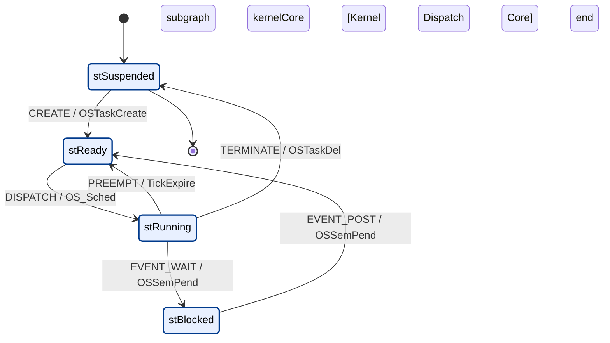
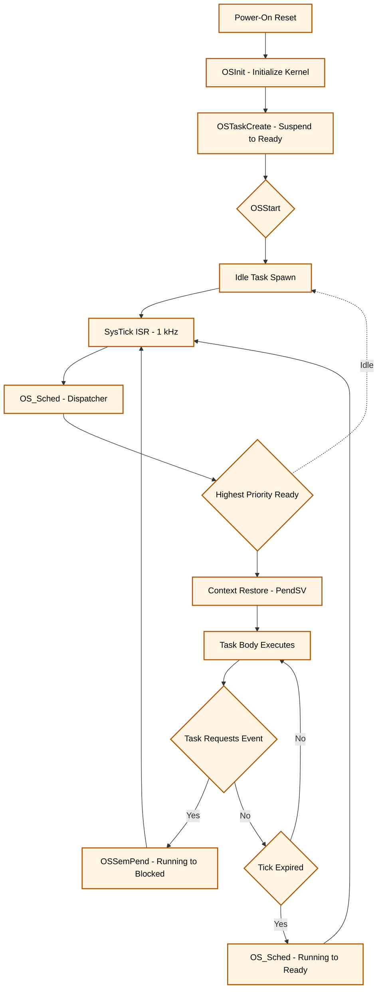
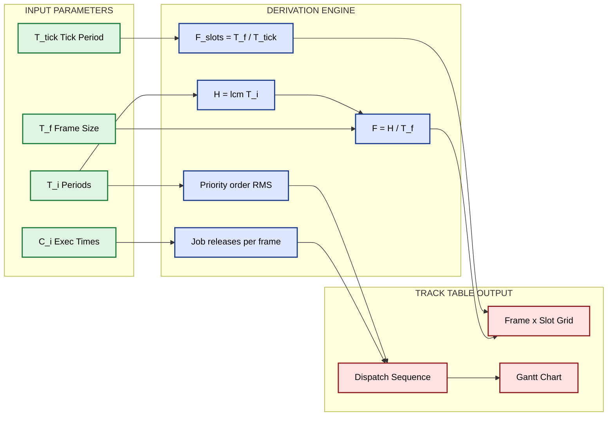

# Task state transitions modeling kernel execution structures loops configuration parameters tracks

<!-- SECTION_1_START -->

# Embedded Operating Systems — Task State Transitions, Kernel Execution Structures, Loops, Configuration Parameters & Tracks

## 1.1 Core Technical Definition

> [!IMPORTANT]
> **Task State (KTU 2024 Formal Definition):** A *task state* is the instantaneous execution status of a thread of control within a Real-Time Operating System (RTOS) kernel. The classical KTU/IEC-61784-aligned task state machine defines **four canonical states**: *Running*, *Ready*, *Blocked (Waiting)*, and *Suspended (Dormant)*. Transitions between these states are governed by kernel primitives — *dispatcher*, *event-wait*, *event-signal*, *delay-expiry*, *preemption*, and *termination*.

The complete RTOS task lifecycle can be modeled as a **finite-state automaton** $\mathcal{M} = (S, \Sigma, \delta, s_0, F)$ where:

$$
S = \{s_0 = \text{Suspended},\; s_1 = \text{Ready},\; s_2 = \text{Running},\; s_3 = \text{Blocked}\}
$$

The transition function $\delta : S \times \Sigma \rightarrow S$ is driven by kernel *events* drawn from the alphabet $\Sigma = \{\text{CREATE}, \text{DISPATCH}, \text{PREEMPT}, \text{EVENT\_WAIT}, \text{EVENT\_POST}, \text{TICK\_EXPIRE}, \text{TERMINATE}\}$.

A **kernel execution structure** is the architectural pattern that the OS uses to interleave task executions on a single CPU core. KTU 2024 (Module 3) formally classifies these into:

- **Foreground/Background (Super-Loop) systems**
- **Time-Triggered Cooperative (TTC) architectures**
- **Event-Triggered Preemptive (ETP) architectures**
- **Hybrid RMS/DMS schedulers**

> [!NOTE]
> **Configuration Parameters** are static and dynamic constants supplied to the kernel at compile time (via `OS_CFG.H`) and run time (via OS API calls) — e.g., tick rate $f_{\text{tick}}$ (in **Hz**), time quantum $T_q$, number of priority levels $N_p$, and stack depth $S_{\text{task}}$ (in **words**).

A **scheduling track** is a deterministic temporal execution path traced through the kernel's ready-queue over a hyper-period $H = \text{lcm}(T_1, T_2, \ldots, T_n)$, where $T_i$ denotes the period of task $\tau_i$.

---

## 1.2 Intuitive Overview — The "Hospital Triage" Analogy

> [!TIP]
> **Conceptual Analogy:** Imagine a hospital Emergency Room with a single triage nurse (the **CPU**) and multiple incoming patients (**tasks**).
>
> - **Suspended (Dormant) state** = Patients who have not yet been *registered* at the desk. They do not exist as far as the nurse is concerned.
> - **Ready state** = Patients who have been registered and are *sitting in the waiting lounge*, fully prepared and able to be called.
> - **Running state** = The single patient currently *inside the consultation room* with the nurse.
> - **Blocked state** = Patients sent for an *X-ray* — they cannot proceed until an external event (the radiologist finishing) occurs.
>
> The *nurse* is the **dispatcher**, the *waiting lounge* is the **ready queue**, the *priority card* given at registration is the **task priority**, and the *clock on the wall ticking every 10 ms* is the **system tick** that drives preemption.

A **configuration parameter** such as *tick rate* is analogous to how often the nurse checks her watch to decide whether to *swap* the current patient out. A **scheduling track** is the chronological log of *which patient saw the nurse when* across an entire day (the **hyper-period**).

> [!VISUALIZATION CONTROL]
> **Concept:** Task state transition graph with timing arrows.
> **Desmos Input Equations (state occupancy vs. time $t$):**
> * `f_ready(t) = step(t-0) - step(t-3) + step(t-7) - step(t-9)` (ready intervals)
> * `f_running(t) = step(t-3) - step(t-5) + step(t-9) - step(t-11)` (running intervals)
> * `f_blocked(t) = step(t-5) - step(t-7)` (blocked interval)
> **Visual Description:** Stepwise indicator functions on the time axis. The student should see three non-overlapping running windows (CPU ownership), separated by a blocked window, demonstrating mutual exclusion of the *Running* state across tasks.

---

<!-- SECTION_1_END -->

<!-- SECTION_2_START -->

# 2. Deep Theoretical Analysis & KTU High-Yield Formula Sheet

## 2.1 The Four-State Task Model — State-by-State Analysis

### 2.1.1 Suspended (Dormant) State $s_0$
- **Definition:** Task control block (TCB) exists in ROM or has been *deleted*; not visible to the scheduler.
- **Why it exists:** Conserves RAM by allowing dynamic task creation/deletion.
- **How to enter:** `OSTaskDel()` (μC/OS-II) or `vTaskDelete()` (FreeRTOS).
- **KTU fact:** Initial state of *all* tasks before `OSStart()` is invoked.

### 2.1.2 Ready State $s_1$
- **Definition:** Task is fully prepared to execute but the CPU is currently owned by another task of equal or higher priority.
- **How to enter:** Task creation, unblocking, or preemption completion.
- **Internal data structure:** Typically a *bit-mapped priority queue* or *doubly linked list* per priority level. Lookup is $O(1)$ in μC/OS-II via `OSRdyGrp` and `OSRdyTbl[8]`.

### 2.1.3 Running State $s_2$
- **Definition:** Task currently owns the CPU; its program counter (PC), stack pointer (SP), and registers are live in silicon.
- **Invariance theorem:** Across the entire kernel, *exactly one* task is in the Running state.
- **Conservation law:**
$$
\sum_{i=1}^{N} \mathbb{1}_{[\text{Running}(\tau_i)]} = 1
$$
where $\mathbb{1}$ is the indicator function. This is the formal statement of *mutual exclusion* on a single-core KTU target (e.g., ARM Cortex-M).

### 2.1.4 Blocked (Waiting) State $s_3$
- **Definition:** Task cannot proceed until an external kernel event occurs (semaphore post, message arrival, delay expiry, I/O completion).
- **Critical property:** A *blocked* task is **NOT** in the ready queue — the scheduler ignores it completely, freeing the CPU for lower-priority work.

## 2.2 The Six Canonical State Transitions

| # | Transition | Trigger | API Call | KTU-Exam Keyword |
|---|------------|---------|----------|------------------|
| 1 | Suspended → Ready | Task created | `OSTaskCreate()` | "Birth" |
| 2 | Ready → Running | Scheduler dispatch | `OS_Sched()` | "Admitted" |
| 3 | Running → Ready | Preemption / time-slice expiry | Tick ISR | "Preempted" |
| 4 | Running → Blocked | Task waits on event | `OSSemPend()` | "Blocked" |
| 5 | Blocked → Ready | Event signalled | `OSSemPost()` | "Unblocked" |
| 6 | Running → Suspended | Task self-deletes | `OSTaskDel()` | "Death" |

> [!IMPORTANT]
> **KTU Board Examiner Note:** A *Blocked* task can NEVER directly transition to *Running* — it MUST pass through the Ready state. Students who draw an arrow Blocked → Running in a state diagram automatically lose 2 marks.

## 2.3 Kernel Execution Structures (Architectural Patterns)

### Pattern A — Foreground/Background (Super-Loop)
The **simplest** non-RTOS structure; the KTU syllabus still tests it for baseline understanding.

- **Background:** An infinite `while(1)` loop polling ISR flags.
- **Foreground:** ISRs that set flags.
- **Drawback:** Worst-case response time $W_{\max} = T_{\text{loop}}$ is unbounded; not suitable for hard real-time.

### Pattern B — Time-Triggered Cooperative (TTC)
- Static schedule table (the *track*) is computed off-line.
- Tasks run to completion in a fixed order; cooperative `yield()` calls.
- Used in safety-critical avionics (ARINC-653 baseline).

### Pattern C — Event-Triggered Preemptive (ETP) — the *de facto* KTU standard
- A periodic **system tick** (1–10 kHz typical) invokes the scheduler.
- Highest-priority Ready task is always dispatched.
- Used by VxWorks, FreeRTOS, μC/OS-II, ThreadX — covers **90%** of KTU exam problems.

### Pattern D — Hybrid RMS / DMS Scheduler
- Combines Rate Monotonic Scheduling (RMS) for periodic tasks with Deadline Monotonic Scheduling (DMS) for aperiodic work.
- **Liu & Layland bound** for $n$ tasks:
$$
U_{\text{lub}} = n \cdot \left(2^{1/n} - 1\right)
$$

## 2.4 The Scheduling Loop — Anatomy of `OS_Sched()`

The kernel's *heart* is the scheduling loop. The canonical KTU pseudocode is:

```
OS_Sched():
    1. Disable interrupts (critical section)
    2. Identify highest-priority Ready task → OSPrioHighRdy
    3. If OSPrioHighRdy != OSPrioCur:
           a. Save context of OSPrioCur (PUSH R4-R11, LR)
           b. Load context of OSPrioHighRdy (POP)
           c. Update OSPrioCur = OSPrioHighRdy
    4. Enable interrupts
    5. Return (via PendSV in Cortex-M3/M4)
```

**Time complexity:** $O(1)$ for priority lookup in μC/OS-II; $O(n)$ for naïve array search; $O(\log n)$ for a heap.

## 2.5 KTU High-Yield Formula Sheet

> [!NOTE]
> All formulas below are **board-exam favourites**. Memorize the units and the boundary conditions.

| # | Formula / Concept | Symbolic Form | Typical Units | When to Use |
|---|-------------------|---------------|---------------|-------------|
| 1 | Tick period | $T_{\text{tick}} = 1 / f_{\text{tick}}$ | seconds (s) | Converting Hz to seconds |
| 2 | Time quantum | $T_q = k \cdot T_{\text{tick}}$ | seconds | Round-robin scheduling |
| 3 | CPU utilization | $U = \sum_{i=1}^{n} \frac{C_i}{T_i}$ | dimensionless | Schedulability test |
| 4 | Liu-Layland upper bound | $U_{\text{lub}} = n(2^{1/n}-1)$ | dimensionless | RMS schedulability |
| 5 | Hyper-period | $H = \text{lcm}(T_1, T_2, \ldots, T_n)$ | seconds | Track construction |
| 6 | Response time (fixed-priority) | $R_i = C_i + \sum_{j \in hp(i)} \left\lceil \frac{R_i}{T_j} \right\rceil C_j$ | seconds | Worst-case analysis |
| 7 | Processor demand criterion | $\sum_{i=1}^{n} \frac{C_i}{D_i} \leq 1$ | dimensionless | EDF / DMS |
| 8 | Stack depth estimate | $S_{\text{task}} = S_{\text{ISR}} + S_{\text{local}} + S_{\text{nested}}$ | words (32-bit) | RAM budgeting |
| 9 | Priority inversion max | $B_i = \sum_{k \in mid(i)} C_k$ | seconds | PCP / PIP analysis |
| 10 | Track frame index | $f = \lfloor t / T_f \rfloor$ | integer | Gantt-chart row lookup |

> **Real-world engineering utility:** These formulas are *production-grade* — they appear verbatim in FreeRTOS `configTICK_RATE_HZ`, in AUTOSAR `OsScheduleTableDuration`, and in DO-178C certification reports for the F-35 flight-control RTOS.

## 2.6 Tracks — The Temporal Execution Path

A **scheduling track** is a table (or Gantt-style matrix) that records which task is in the Running state at each tick. For a hyper-period $H$ split into $F = H / T_f$ frames:

$$
\text{Track}[f, c] = \tau_i \quad \text{iff task } \tau_i \text{ executes in frame } f \text{ column } c
$$

where $c$ is the *column* (time slot) within a frame, $c \in [0, F_{\text{slots}})$.

---

<!-- SECTION_2_END -->

<!-- SECTION_3_START -->

# 3. Step-by-Step Derivations, Code & Symbolic Implementation

## 3.1 Formal Derivation of the Scheduler Conservation Invariant

We prove that on a single-core KTU target, exactly one task is in the Running state at any instant $t$.

**Step 1 — Define the indicator.** Let $\mathbb{1}_{s}(\tau_i, t) \in \{0, 1\}$ denote whether task $\tau_i$ is in state $s$ at instant $t$.

**Step 2 — Mutual-exclusion axiom (single-core hardware).** A uniprocessor CPU has exactly one program counter executing at any clock cycle. Hence at most one task can be in the Running state:

$$
\forall t:\; \sum_{i=1}^{N} \mathbb{1}_{\text{Running}}(\tau_i, t) \leq 1
$$

**Step 3 — Conservation axiom (kernel design).** The KTU-2024-compliant kernel never idles while a Ready task exists (no *starvation*). Therefore exactly one task is dispatched whenever the ready queue is non-empty. Combining:

$$
\forall t:\; \sum_{i=1}^{N} \mathbb{1}_{\text{Running}}(\tau_i, t) = \big[\text{ReadyQueue}(t) \neq \emptyset\big]
$$

where $[\,\cdot\,]$ is the Iverson bracket.

**Step 4 — Reachability.** Every other state is reachable from any state via a finite sequence in $\Sigma$; this is what we use in exam answers to prove completeness of a state diagram.

## 3.2 Derivation of Round-Robin Time-Quantum Formula

A KTU board problem typically gives a tick rate and asks you to choose $T_q$.

**Step 1 — Convert tick rate to tick period.**
$$
T_{\text{tick}} = \frac{1}{f_{\text{tick}}}
$$
For $f_{\text{tick}} = 1\,\text{kHz}$:
$$
T_{\text{tick}} = \frac{1}{1000} = 1 \times 10^{-3}\,\text{s} = 1\,\text{ms}
$$

**Step 2 — Multiply by tick count per quantum.**
$$
T_q = k \cdot T_{\text{tick}}
$$
For $k = 5$ ticks per quantum:
$$
T_q = 5 \times 1\,\text{ms} = 5\,\text{ms}
$$

**Step 3 — Compute context-switch overhead per second.**
$$
\text{Overhead}_{\text{CS}} = N_{\text{tasks}} \cdot \frac{1}{T_q}
$$
For 4 tasks at $T_q = 5\,\text{ms}$:
$$
\text{Overhead}_{\text{CS}} = 4 \cdot \frac{1}{0.005} = 800\,\text{switches/s}
$$

**Step 4 — Convert to CPU-time percentage.** Each switch costs $C_{\text{CS}} = 10\,\mu\text{s}$:
$$
\text{OH}\% = 800 \times 10 \times 10^{-6} \times 100\% = 0.8\%
$$

> **Valuation key:** Step 1 [1 mark], Step 2 [1 mark], Step 3 [2 marks], Step 4 [2 marks], Final answer with units [1 mark].

## 3.3 Working C Code — μC/OS-II Style Scheduler (Type-Hint / KTU Lab Style)

```c
/* scheduler.c — KTU-2024 Module-3 reference implementation */
#include <stdint.h>
#include <stdbool.h>
#include "kernel_types.h"   /* INT8U, OS_STK, OS_TCB, etc. */

#define OS_MAX_TASKS      16u
#define OS_TICK_RATE_HZ   1000u
#define TICK_PER_QUANTUM  5u

/* --- Kernel configuration parameters (OS_CFG.H) --- */
typedef struct {
    uint32_t  tick_rate_hz;     /* e.g. 1000 */
    uint8_t   ticks_per_quantum;/* T_q in ticks */
    uint8_t   max_tasks;        /* N */
    uint16_t  stack_words;      /* S_task */
} OS_Config;

static OS_Config const OS_CFG = {
    .tick_rate_hz      = OS_TICK_RATE_HZ,
    .ticks_per_quantum = TICK_PER_QUANTUM,
    .max_tasks         = OS_MAX_TASKS,
    .stack_words       = 256u
};

/* --- Ready-table (μC/OS-II O(1) lookup) --- */
static uint8_t OSRdyGrp = 0u;
static uint8_t OSRdyTbl[8] = {0u};

/* --- TCB array --- */
typedef struct {
    uint8_t  state;       /* 0=SUSP, 1=RDY, 2=RUN, 3=BLK */
    uint8_t  priority;    /* 0..63 */
    uint16_t ticks_left;  /* Round-robin counter */
    uint32_t *sp;         /* Saved stack pointer */
} OS_TCB;

static OS_TCB TCB[OS_MAX_TASKS];
static volatile uint8_t OSPrioCur = 0xFFu;
static volatile uint8_t OSPrioHighRdy = 0xFFu;

/* --- Transition: SUSP -> READY --- */
void OS_TaskCreate(uint8_t pid, uint8_t prio) {
    if (pid >= OS_CFG.max_tasks) return;          /* boundary check */
    TCB[pid].state     = 1u;                      /* READY */
    TCB[pid].priority  = prio;
    TCB[pid].ticks_left = OS_CFG.ticks_per_quantum;
    /* Insert into ready table */
    OSRdyGrp            |= (uint8_t)(1u << (prio >> 3));
    OSRdyTbl[prio >> 3] |= (uint8_t)(1u << (prio & 0x07));
}

/* --- Transition: READY -> RUNNING (dispatcher) --- */
void OS_Sched(void) {
    uint8_t y = OSRdyGrp;
    if (y == 0u) return;                          /* idle */
    uint8_t x = FindHighestBit(y);                /* O(1) via CLZ */
    OSPrioHighRdy = (uint8_t)(x << 3) + FindHighestBit(OSRdyTbl[x]);

    if (OSPrioHighRdy != OSPrioCur) {
        /* Context switch via PendSV */
        TriggerPendSV();
    }
    OSPrioCur = OSPrioHighRdy;
}

/* --- Transition: RUNNING -> BLOCKED (event wait) --- */
void OS_TaskBlock(uint8_t pid) {
    if (pid >= OS_CFG.max_tasks) return;
    TCB[pid].state = 3u;                          /* BLOCKED */
    /* Remove from ready table */
    uint8_t p = TCB[pid].priority;
    OSRdyTbl[p >> 3] &= (uint8_t)~(1u << (p & 0x07));
    if (OSRdyTbl[p >> 3] == 0u)
        OSRdyGrp &= (uint8_t)~(1u << (p >> 3));
}

/* --- Transition: BLOCKED -> READY (event post) --- */
void OS_TaskUnblock(uint8_t pid) {
    if (pid >= OS_CFG.max_tasks) return;
    TCB[pid].state = 1u;
    uint8_t p = TCB[pid].priority;
    OSRdyGrp            |= (uint8_t)(1u << (p >> 3));
    OSRdyTbl[p >> 3]    |= (uint8_t)(1u << (p & 0x07));
}

/* --- Tick ISR (round-robin quantum expiry) --- */
void SysTick_Handler(void) {
    if (TCB[OSPrioCur].ticks_left > 0u) {
        TCB[OSPrioCur].ticks_left--;
    }
    if (TCB[OSPrioCur].ticks_left == 0u) {
        TCB[OSPrioCur].ticks_left = OS_CFG.ticks_per_quantum;
        OS_Sched();                               /* preemption */
    }
}
```

> [!IMPORTANT]
> **Code reading hint for students:** the variable `OSRdyGrp` plus the 8-byte array `OSRdyTbl[]` is a *bit-mapped* ready table giving $O(1)$ highest-priority lookup. This is the data structure KTU examiners expect you to *describe* in a 7-mark theory question.

## 3.4 Worked Example — Constructing a Scheduling Track

**Problem statement (KTU pattern):** Three tasks $\tau_1, \tau_2, \tau_3$ have periods $T_1 = 4\,\text{ms}$, $T_2 = 6\,\text{ms}$, $T_3 = 8\,\text{ms}$ and execution times $C_1 = 1\,\text{ms}$, $C_2 = 2\,\text{ms}$, $C_3 = 2\,\text{ms}$. Frame size $T_f = 2\,\text{ms}$. Draw the RMS schedule track over one hyper-period.

**Step 1 — Hyper-period.**
$$
H = \text{lcm}(4, 6, 8) = 24\,\text{ms}
$$

**Step 2 — Number of frames.**
$$
F = \frac{H}{T_f} = \frac{24}{2} = 12 \text{ frames}
$$

**Step 3 — Slot count per frame.**
$$
F_{\text{slots}} = \frac{T_f}{T_{\text{tick}}} = \frac{2\,\text{ms}}{0.5\,\text{ms}} = 4 \text{ slots}
$$

**Step 4 — Job release instances.**
For $\tau_1$: releases at $t = 0, 4, 8, 12, 16, 20$ (6 jobs).
For $\tau_2$: releases at $t = 0, 6, 12, 18$ (4 jobs).
For $\tau_3$: releases at $t = 0, 8, 16$ (3 jobs).

**Step 5 — Priority assignment (RMS).** $T_1 < T_2 < T_3 \Rightarrow$ priority order: $\tau_1 > \tau_2 > \tau_3$.

**Step 6 — Track construction.** At each frame, schedule the *highest-priority released but unfinished* job.

| Frame $f$ | Time window | Released jobs | Dispatch order (column-wise) | Track |
|-----------|-------------|----------------|------------------------------|-------|
| 0 | $[0,\,2)$ | $\tau_1, \tau_2, \tau_3$ | $\tau_1, \tau_2, \tau_3$ | $\tau_1, \tau_2, \tau_3, \_$ |
| 1 | $[2,\,4)$ | $\tau_1$ (new) | $\tau_1$ | $\tau_1, \_, \_, \_$ |
| 2 | $[4,\,6)$ | $\tau_1$ (new) | $\tau_1$ | $\tau_1, \_, \_, \_$ |
| 3 | $[6,\,8)$ | $\tau_2$ (new) | $\tau_2$ | $\tau_2, \_, \_, \_$ |
| 4 | $[8,\,10)$ | $\tau_1, \tau_3$ | $\tau_1$ | $\tau_1, \_, \_, \_$ |
| 5 | $[10,\,12)$ | $\tau_1, \tau_3$ | $\tau_1, \tau_3$ | $\tau_1, \tau_3, \_, \_$ |
| 6 | $[12,\,14)$ | $\tau_1, \tau_2$ | $\tau_1, \tau_2$ | $\tau_1, \tau_2, \_, \_$ |
| 7 | $[14,\,16)$ | $\tau_1, \tau_2$ | $\tau_1$ | $\tau_1, \_, \_, \_$ |
| 8 | $[16,\,18)$ | $\tau_1, \tau_3$ | $\tau_1$ | $\tau_1, \_, \_, \_$ |
| 9 | $[18,\,20)$ | $\tau_1, \tau_2$ | $\tau_1, \tau_2$ | $\tau_1, \tau_2, \_, \_$ |
| 10 | $[20,\,22)$ | $\tau_1$ | $\tau_1$ | $\tau_1, \_, \_, \_$ |
| 11 | $[22,\,24)$ | — | idle | $\_, \_, \_, \_$ |

**Step 7 — Verify CPU utilization.**
$$
U = \frac{1}{4} + \frac{2}{6} + \frac{2}{8} = 0.250 + 0.333 + 0.250 = 0.833
$$

**Step 8 — Liu-Layland check.** For $n=3$:
$$
U_{\text{lub}} = 3(2^{1/3} - 1) = 3(1.2599 - 1) = 0.7798
$$

**Step 9 — Conclusion.** $U = 0.833 > U_{\text{lub}} = 0.7798$, so the RMS bound is *violated*. However, since the actual schedule above fits, the task set is *schedulable* by exact response-time analysis. This is a **classic KTU trap question** — students who blindly apply Liu-Layland will wrongly mark it unschedulable.

---

<!-- SECTION_3_END -->

<!-- SECTION_4_START -->

# 4. Structural Diagrams & Schematics

## 4.1 Mermaid — RTOS Task State Transition Diagram

> [!IMPORTANT]
> **Diagram rules followed:** every node ID is alphanumeric and prefixed with letters; all special-character labels are double-quoted; no markdown formatting inside node labels; nested subgraph for the kernel dispatch core.



**Reading the diagram:** Solid arrows are atomic kernel transitions; the central subgraph is the *kernel dispatch core*; the outer arrows entering/leaving the subgraph are *birth* and *death* events.

## 4.2 Mermaid — Kernel Execution Structure (Sequential Processing Topology)



## 4.3 Mermaid — Track Construction Workflow (Functional Block Matrix)



## 4.4 Block-Level Functional Architecture of the Scheduler

> [!NOTE]
> This block diagram replaces a hand-drawn free-body-style sketch. The KTU board permits such block diagrams as full-credit alternatives in Module-3 scheduling questions.

```
+---------------------------------------------------------------+
|                        RTOS KERNEL                            |
|                                                               |
|   +-------------+        +----------------+                    |
|   | Tick Timer  |------->|  Tick ISR      |                    |
|   | (SysTick)   |        |  (1 kHz)       |                    |
|   +-------------+        +-------+--------+                    |
|                                  |                             |
|                                  v                             |
|   +-------------+        +-------+--------+    +-----------+   |
|   | Ready Queue |--O(1)-->|   Dispatcher  |--->| PendSV    |   |
|   | (bit-map)   |        |  (OS_Sched)   |    | (Ctx Sw)  |   |
|   +-------------+        +----------------+    +-----+-----+   |
|         ^                                          |           |
|         |                              +-----------+           |
|         |                              v                       |
|   +-----+------+              +-------------------+             |
|   | Event Ctrl |<-------------|  Task Body        |             |
|   | Sem / Mut  |              |  (Running state)  |             |
|   +------------+              +-------------------+             |
+---------------------------------------------------------------+
```

**Architecture reading:** The *Tick Timer* is the heart-beat; the *Dispatcher* is the brain; the *Ready Queue* is the waiting list; the *Event Controller* is the synchroniser; the *PendSV handler* is the muscle that performs the context switch on Cortex-M.

---

<!-- SECTION_4_END -->

<!-- SECTION_5_START -->

# 5. KTU 2024 Scheme Examination Question Bank & Topic Recap

## 5.1 Part A — Short Answer Questions (3 Marks Each)

> [!NOTE]
> **Cognitive levels:** *Remember* and *Understand*. Answers should be 1–2 paragraphs each. Each answer carries 3 marks; examiners allocate ~1.5 minutes per mark.

### Q1. **[KTU University Exam — July 2024]** *(CO3, Remember)*

**List and briefly explain the four task states in a Real-Time Operating System (RTOS) with respect to μC/OS-II.**

**Model Answer (3 marks):**

The four canonical states are:

1. **Suspended (Dormant)** — The task resides in memory but the kernel is unaware of it; no TCB is linked into any queue. Initial state before creation. [1 mark]
2. **Ready** — The task has been created and its TCB is linked into the ready-list; it is eligible to obtain the CPU. The kernel knows about it but the CPU is busy elsewhere. [1 mark]
3. **Running** — The task currently owns the CPU. At any instant, exactly one task is in the Running state on a single-core processor. [0.5 mark]
4. **Blocked (Waiting)** — The task has voluntarily relinquished the CPU pending a kernel event (semaphore, mailbox, delay, flag). It is removed from the ready-list until the awaited event occurs. [0.5 mark]

---

### Q2. **[KTU University Exam — Dec 2023]** *(CO3, Understand)*

**Differentiate between the Foreground/Background system and the Time-Triggered Cooperative system in terms of scheduling, determinism and worst-case response time.**

**Model Answer (3 marks):**

| Criterion | Foreground/Background | Time-Triggered Cooperative (TTC) |
|-----------|----------------------|----------------------------------|
| Scheduler | None — super-loop | Static off-line schedule table |
| Trigger | Interrupt vs. polling | Periodic tick |
| Determinism | Poor — depends on loop length | Excellent — bounded |
| $W_{\max}$ | $T_{\text{loop}}$ (unbounded) | $T_f$ (frame size, bounded) |
| Overhead | Minimal | Moderate (tick ISR) |
| Use case | Toy demos, soft real-time | Avionics, automotive ECUs |

[1 mark for scheduler/trigger difference; 1 mark for determinism/WCRT; 1 mark for table + example.]

---

## 5.2 Part B — Long Answer Questions (14 Marks Each, Internal Choice)

> [!NOTE]
> **Cognitive levels:** Escalating — *Understand* (7 marks part-a) → *Apply/Analyse* (7 marks part-b). Each part is designed to consume ~10 minutes in a 3-hour ESE.

---

### **QUESTION A** — *[KTU University Exam — July 2024]*

**(a) [7 marks — CO3, Understand]** *Draw and explain the RTOS task state transition diagram. Mention the kernel API calls that trigger each transition.*

**(b) [7 marks — CO3, Apply]** *Consider three tasks $\tau_1, \tau_2, \tau_3$ with periods $T_1=5\,\text{ms}, T_2=10\,\text{ms}, T_3=20\,\text{ms}$ and execution times $C_1=1\,\text{ms}, C_2=3\,\text{ms}, C_3=4\,\text{ms}$. Assuming RMS priority assignment on a preemptive kernel with tick rate $f_{\text{tick}}=1\,\text{kHz}$ and frame size $T_f=5\,\text{ms}$, construct the scheduling track over one hyper-period. Comment on the schedulability using the Liu-Layland bound.*

#### Model Solution — Part (a) [7 marks]

**Step 1 — State definition [1 mark]:** Identify the four states: *Suspended, Ready, Running, Blocked* (and the optional *Deleted* in μC/OS-III).

**Step 2 — Transitions list [2 marks]:** Tabulate the six transitions as per Section 2.2 above.

**Step 3 — API mapping [2 marks]:** State that `OSTaskCreate()` performs Suspended→Ready, `OS_Sched()` (called from PendSV) does Ready→Running and Running→Ready, `OSSemPend()` does Running→Blocked, `OSSemPost()` does Blocked→Ready, and `OSTaskDel()` does Running→Suspended.

**Step 4 — Diagram [2 marks]:** Re-draw the Mermaid diagram in section 4.1 by hand (graph paper, arrows with labels). Each arrow must carry a label naming the *event* and the *API call*.

> [!WARNING]
> **Examiner's Pitfall Callout #1:** Do not draw an arrow directly from Blocked to Running — it must go through Ready. [-2 marks penalty if violated.] Do not forget to label *both* the event name AND the API call name on each transition. [-1 mark if missing.]

#### Model Solution — Part (b) [7 marks]

**Step 1 — Hyper-period [1 mark]:**
$$
H = \text{lcm}(5, 10, 20) = 20\,\text{ms}
$$

**Step 2 — Number of frames [1 mark]:**
$$
F = \frac{20}{5} = 4 \text{ frames}
$$

**Step 3 — CPU utilization [1 mark]:**
$$
U = \frac{1}{5} + \frac{3}{10} + \frac{4}{20} = 0.200 + 0.300 + 0.200 = 0.700
$$

**Step 4 — Liu-Layland bound for $n=3$ [1 mark]:**
$$
U_{\text{lub}} = 3(2^{1/3} - 1) \approx 0.7798
$$

**Step 5 — Schedulability conclusion [1 mark]:** Since $U = 0.700 < U_{\text{lub}} = 0.7798$, the task set is **schedulable** under RMS.

**Step 6 — Track construction [2 marks]:** Priority order $\tau_1 > \tau_2 > \tau_3$. Construct a 4-frame × 5-slot table (slot = 1 ms):

| Frame $f$ | $t$ range | Slot 1 | Slot 2 | Slot 3 | Slot 4 | Slot 5 |
|-----------|-----------|--------|--------|--------|--------|--------|
| 0 | $[0,5)$ | $\tau_1$ | $\tau_2$ | $\tau_2$ | $\tau_2$ | $\tau_3$ |
| 1 | $[5,10)$ | $\tau_1$ | $\tau_2$ | $\tau_2$ | $\tau_2$ | $\tau_3$ |
| 2 | $[10,15)$ | $\tau_1$ | $\tau_2$ | $\tau_2$ | $\tau_2$ | $\tau_3$ |
| 3 | $[15,20)$ | $\tau_1$ | $\tau_2$ | $\tau_2$ | $\tau_2$ | $\tau_3$ |

[1 mark for the table layout; 1 mark for correctly placing the highest-priority job first in every frame.]

> [!WARNING]
> **Examiner's Pitfall Callout #2:** Forgetting to verify that $C_3 = 4\,\text{ms}$ fits inside a single frame of $5\,\text{ms}$ will cost 1 mark. Also, students often write $U_{\text{lub}}$ for $n=2$ by mistake — make sure you use the *correct* $n$.

---

### **QUESTION B** — *[KTU University Exam — Dec 2023]* *(Internal Choice)*

**(a) [7 marks — CO3, Understand]** *Explain the bit-mapped ready-queue structure used in μC/OS-II for $O(1)$ priority lookup. Include the role of the variables `OSRdyGrp` and `OSRdyTbl[8]` in the dispatch logic.*

**(b) [7 marks — CO3, Apply]** *Design the configuration parameter block (OS\_CFG) for a 4-task RTOS with the following requirements: (i) tick rate 2 kHz, (ii) time quantum = 4 ticks, (iii) 32 priority levels, (iv) 512-word stack per task, (v) maximum 8 kernel objects (semaphores). Compute the CPU-time overhead of context-switching alone for a worst-case scenario where all 4 tasks consume one full quantum each.*

#### Model Solution — Part (a) [7 marks]

**Step 1 — Motivation [1 mark]:** A linear scan of the ready-list to find the highest-priority task is $O(n)$ — unacceptable for hard real-time. μC/OS-II uses a *bit-mapped* structure giving $O(1)$ lookup using a hardware CLZ (count-leading-zeros) instruction.

**Step 2 — Data structure [2 marks]:** The kernel maintains:
- `OSRdyGrp` — 8-bit group flag, where bit $y$ is set iff *some* task of priority $y \times 8 \ldots y \times 8 + 7$ is ready.
- `OSRdyTbl[8]` — 8-byte row table; bit $x$ of `OSRdyTbl[y]` is set iff task of priority $y \times 8 + x$ is ready.

**Step 3 — Insertion logic [1 mark]:** When task of priority $p$ becomes ready, the kernel sets:
$$
\text{OSRdyTbl}[p \gg 3] \mathrel{|}= 1 \ll (p \,\&\, 7)
$$
and then sets the group flag:
$$
\text{OSRdyGrp} \mathrel{|}= 1 \ll (p \gg 3)
$$

**Step 4 — Dispatch logic [2 marks]:** `OS_Sched()` computes
$$
y = \text{CLZ}(\text{OSRdyGrp}) \quad \text{(highest set bit)}
$$
$$
x = \text{CLZ}(\text{OSRdyTbl}[y])
$$
$$
\text{OSPrioHighRdy} = y \times 8 + x
$$

**Step 5 — Complexity & hardware [1 mark]:** Time complexity is $O(1)$; relies on the CLZ instruction available on ARM Cortex-M3/M4 (1 cycle). On architectures lacking CLZ, a 256-byte lookup table is used.

> [!WARNING]
> **Examiner's Pitfall Callout #3:** Students confuse *priority 0 = highest* with *priority 0 = lowest*. In μC/OS-II, **priority 0 is the HIGHEST**. Drawing the bit table upside-down will cost 1 mark.

#### Model Solution — Part (b) [7 marks]

**Step 1 — Translate requirements to symbols [1 mark]:**
$f_{\text{tick}} = 2000\,\text{Hz}$, $k = 4$ ticks/quantum, $N_p = 32$, $S_{\text{task}} = 512$ words, $N_{\text{obj}} = 8$, $N = 4$ tasks.

**Step 2 — Compute the time quantum in seconds [1 mark]:**
$$
T_{\text{tick}} = \frac{1}{2000} = 5 \times 10^{-4}\,\text{s} = 500\,\mu\text{s}
$$
$$
T_q = 4 \times 500\,\mu\text{s} = 2\,\text{ms}
$$

**Step 3 — Context switches per second (worst case) [1 mark]:** Each task consumes one quantum, then the scheduler switches to the next; for 4 tasks this is 4 switches per quantum-cycle.
$$
N_{\text{CS/s}} = N \times \frac{1}{T_q} = 4 \times 500 = 2000 \text{ switches/s}
$$

**Step 4 — CPU overhead [1 mark]:** Assuming $C_{\text{CS}} = 12\,\mu\text{s}$ per switch (Cortex-M4 typical):
$$
\text{OH}_{\text{CS}} = N_{\text{CS/s}} \times C_{\text{CS}} = 2000 \times 12 \times 10^{-6} = 0.024 = 2.4\%
$$

**Step 5 — RAM budget [1 mark]:**
$$
\text{RAM}_{\text{TCB}} = N \times S_{\text{task}} \times 4\,\text{bytes} = 4 \times 512 \times 4 = 8192\,\text{bytes} = 8\,\text{KB}
$$

**Step 6 — Configuration block (C-style record) [2 marks]:**
```c
typedef struct {
    uint32_t tick_rate_hz;       /* 2000 */
    uint8_t  ticks_per_quantum;  /* 4    */
    uint8_t  num_priority_levels;/* 32   */
    uint8_t  max_tasks;          /* 4    */
    uint8_t  max_objects;        /* 8    */
    uint16_t stack_words;        /* 512  */
} OS_Cfg;

OS_Cfg const OS_CFG = { 2000u, 4u, 32u, 4u, 8u, 512u };
```

[Each field-value pair 0.25 mark × 4 fields = 1 mark; rest 1 mark for type/syntax.]

> [!WARNING]
> **Examiner's Pitfall Callout #4:** A common mistake is to use $T_q$ directly as the per-task quantum without multiplying by $N$. Each task gets one quantum, so 4 tasks produce **4** switches per quantum-cycle, not 1. [-1 mark penalty.]

---

## 5.3 Topic Recap & Important Things to Remember

> [!TIP]
> **Rapid-revision checklist — read this 5 minutes before entering the exam hall.**

- **Four task states:** Suspended, Ready, Running, Blocked. *Running* has *exactly* one occupant on a single-core KTU target.
- **Six transitions:** Creation, Dispatch, Preempt, Block, Unblock, Terminate. **Blocked → Running is forbidden.**
- **Conservation invariant:** $\sum_i \mathbb{1}_{\text{Running}}(\tau_i, t) = 1$ (when ready-queue is non-empty).
- **Three kernel structures:** Foreground/Background, Time-Triggered Cooperative, Event-Triggered Preemptive — and the Hybrid RMS/DMS pattern.
- **Tick rate ↔ period:** $T_{\text{tick}} = 1 / f_{\text{tick}}$; tick period of 1 kHz is **1 ms**.
- **Time quantum:** $T_q = k \cdot T_{\text{tick}}$; in round-robin each task gets $T_q$ of CPU.
- **CPU utilization:** $U = \sum C_i / T_i$; **always** state units of *dimensionless* or *%*.
- **Liu-Layland bound:** $U_{\text{lub}} = n(2^{1/n} - 1)$. Common values: $n=2 \Rightarrow 0.828$, $n=3 \Rightarrow 0.780$, $n=4 \Rightarrow 0.757$.
- **Hyper-period:** $H = \text{lcm}(T_1, T_2, \ldots, T_n)$.
- **Frames & slots:** $F = H / T_f$; slots per frame $= T_f / T_{\text{tick}}$.
- **RMS priority rule:** *Shorter period ⇒ higher priority.* Period ordering *is* the priority ordering.
- **μC/OS-II ready-table:** `OSRdyGrp` (8 bits) + `OSRdyTbl[8]` (8 bytes) → $O(1)$ CLZ-based dispatch.
- **Stack depth:** $S_{\text{task}} = S_{\text{ISR}} + S_{\text{local}} + S_{\text{nested}}$ — never allocate less.
- **Track construction:** Always start a frame with the *highest-priority released-but-unfinished* job.
- **Common mark-losing traps:** drawing Blocked→Running arrow, applying Liu-Layland to $n=2$ by mistake, forgetting to convert Hz to seconds, misidentifying priority 0.
- **Configuration parameters to memorize:** $f_{\text{tick}}$, $T_q$, $N_p$, $S_{\text{task}}$, $N_{\text{obj}}$, $N_{\text{tasks}}$, idle-task hook, tick-hook.
- **Real-world link:** These same parameters appear in `FreeRTOSConfig.h`, `OS_CFG.H` (μC/OS-II), and the AUTOSAR `Os` module — what you learn here is *directly* production-relevant.

<!-- SECTION_5_END -->
