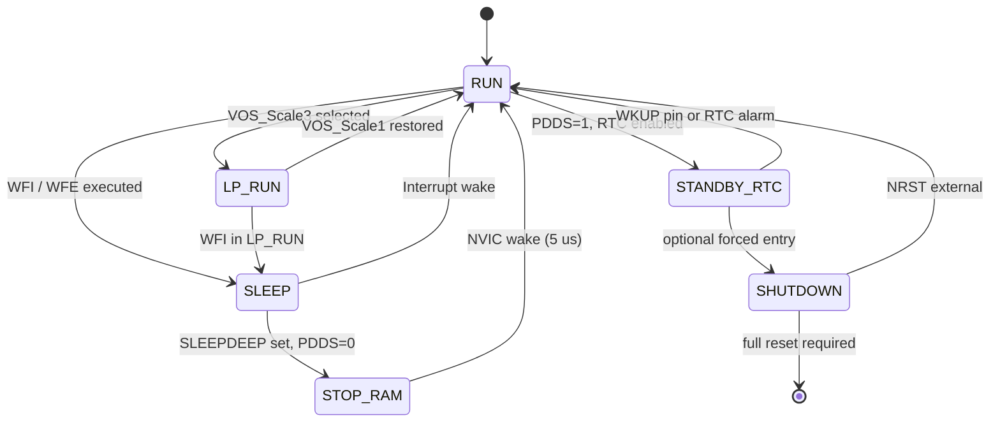
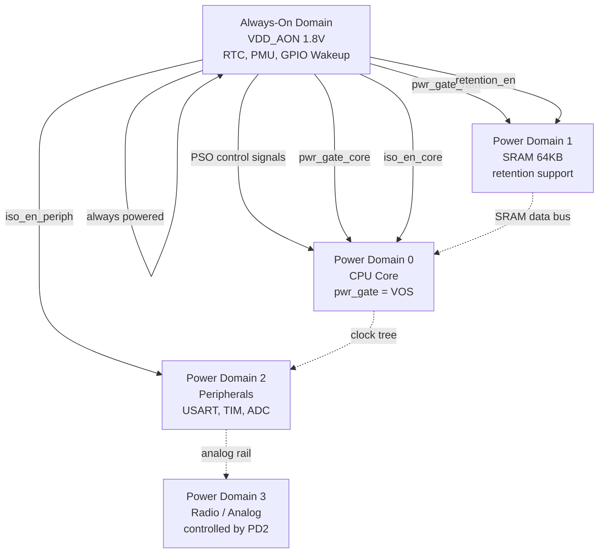
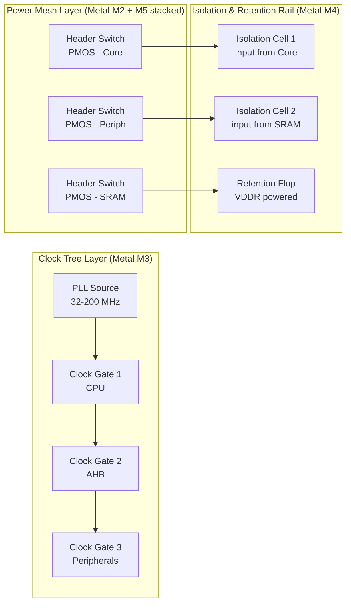
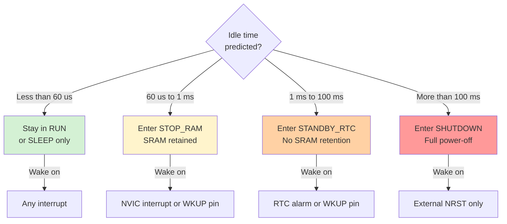

# Power down state control parameters hardware mappings profiles routing tracks setups profiles

<!-- SECTION_1_START -->

# Power-Down State Control: Hardware Mappings, Profiles & Routing Architectures

## 1.1 Formal Academic Definition (KTU 2024 Syllabus Terminology)

> [!IMPORTANT]
> **Power-Down State Control** is the deterministic, hardware-mediated mechanism by which an embedded SoC (System-on-Chip) or microcontroller transitions between active and low-power operational states through the orchestrated manipulation of clock-gating, power-gating, voltage-scaling, and retention control signals mapped across predefined register fields, routing tracks, and application-specific profiles.

In the context of **PECST709 – Embedded Systems (Module 4)**, this topic refers to the **hardware-software co-design contract** that governs how:

1. **Power Domains (PD)** are defined, isolated, and switched.
2. **State Retention Registers (SRR)** preserve volatile context across power-down cycles.
3. **Isolation Cells** prevent floating signals (X-propagation) during partial power collapse.
4. **Power Management Units (PMU)** or **Power Management Controllers (PMC)** execute sequencing logic.
5. **Profile-based register sets** configure the silicon for a specific *Power State Coordination (PSC)* profile.

The architectural surface covered includes:
- **Control Parameter Registers** (e.g., `PWR_CR`, `PWR_CSR`, `SCR`, `PRIMASK`)
- **Hardware Mapping Tables** (Power State Coordination tables, IEEE 1801 / UPF intent files)
- **Profile Libraries** (Low-Power Run, Stop, Standby, Shutdown profiles in ARM Cortex-M nomenclature)
- **Routing Track Topologies** (clock-tree gating, power-mesh segmentation, retention rail routing)

---

## 1.2 Conceptual Analogy & Intuitive Overview

> [!NOTE]
> **Real-World Analogy: The "Smart Office Building"**
>
> Think of an SoC as a large multi-story office building. Each floor is a **Power Domain**. Some floors (the **Active Domain**) have lights, AC, and computers running. Other floors (the **Power-Down Domain**) are dark and cold. A building automation controller (the **PMU**) decides which floors to power-down based on:
> - **Time of day** (Application Profile – e.g., "Night Mode" = deep sleep)
> - **Occupancy sensors** (Wake-up events)
> - **Pre-set rules** (Control Parameters – e.g., "If floor 3 is empty for >10 min, switch off")
> - **Wiring paths** (Routing Tracks – physical cables connecting controller to each floor's circuit breaker panel)
> - **Standardized floor plans** (Hardware Mappings – "Floor 3's lights are on breaker B7")

When you press "Shutdown" on a floor:
1. **Save state** (place active documents in a drawer → *State Retention Register*)
2. **Cut the main breaker** → Power Gate (Header/Footer switch)
3. **Lock the door** → Isolation cells clamp outputs
4. **Leave a note on the door** → Retention supply (`VDDR`) keeps the drawer alive
5. **Sensors stay awake** → Always-On Domain (`AON`) for wake-up interrupts

When you "Wake up" the floor:
1. **Restore power** → Power Gate ON
2. **De-isolate outputs** → Isolation cells release
3. **Read the note** → Restore state from retention registers
4. **Resume operations** → Clock tree ungated

This is **precisely** how power-down state control works at the silicon level.

---

## 1.3 Physical Constants, Standard Metrics & Units

> [!IMPORTANT]
> **Key Engineering Metrics (must-know for KTU 2024 valuation):**
>
> - **Static Power ($P_{static}$)** — measured in **microwatts (µW)**, often **< 5 µA/MHz** in modern MCUs.
> - **Dynamic Power ($P_{dyn} \propto C \cdot V^2 \cdot f$)** — dominant metric in active mode.
> - **Wake-up Latency ($t_{wu}$)** — measured in **clock cycles** (e.g., 5 cycles, 50 µs, 1 ms).
> - **Current Threshold ($I_{retention}$)** — retention current, typically **< 1 µA**.
> - **State Retention Voltage ($V_{ret}$)** — typically **0.6 V – 0.9 V** for SRAM/flip-flops.
> - **Power-Down Entry/Exit Time ($t_{PD\_entry}$, $t_{PD\_exit}$)** — deterministic timing contracts.

> [!VISUALIZATION CONTROL]
> **Concept:** Power State Transition Curve (Current vs Time)
> **GeoGebra / Desmos Input Equations:**
> * `I_active(t) = 20` (constant active current in mA)
> * `I_sleep(t) = 0.005` (constant sleep current in mA)
> * `I(t) = if(0 < t < 5, 20, if(5 < t < 5.2, exp(-(t-5)*50)*20 + 0.005, 0.005))`
> **Visual Description:** Observe the **exponential decay** during state transition (RC charging of power-gate capacitance) and the **asymmetric latency** between entry and exit. The area under this curve is the **energy bill** of the power-down event.

---

<!-- SECTION_1_END -->

<!-- SECTION_2_START -->

# 2. Deep Theoretical Analysis & KTU High-Yield Formula Sheet

## 2.1 The Power State Machine — Hierarchical Decomposition

Modern embedded SoCs (ARM Cortex-M, RISC-V based) implement a **nested power state machine** with typically 4–6 levels:

### Tier 1: System-Level States (PMU/PMC controlled)
| State | Clock | Core Logic | RAM | Wake Latency | Current |
|:---:|:---:|:---:|:---:|:---:|:---:|
| **Run** | ON | ON | Active | 0 | ~10 mA |
| **Sleep (WFI/WFE)** | Gated | ON (paused) | Active | 1–3 cycles | ~2 mA |
| **Low-Power Run** | Reduced | Reduced V | Active | <10 cycles | ~0.5 mA |
| **Stop** | OFF | OFF | Retained | 5–50 µs | ~20 µA |
| **Standby** | OFF | OFF | Latched | 1 ms | ~2 µA |
| **Shutdown** | OFF | OFF | OFF | >10 ms | ~20 nA |

> [!NOTE]
> **KTU 2024 Highlight:** "Sleep" and "Stop" are often confused. The discriminator is whether the **SRAM contents are preserved** (Stop = retained, Shutdown = not retained).

---

## 2.2 Control Parameters — The Hardware Knobs

Each power state is parameterized by a set of **control bits** in dedicated registers. The following are the **canonical control parameters** (mapped to a generic ARM-Cortex-M4 class MCU for KTU-relevant pedagogy):

### Power Control Register ($PWR\_CR$)
- **LPDS (Low-Power Deep-Sleep)** — selects voltage regulator mode in Stop state.
- **PDDS (Power-Down Deep-Sleep)** — selects Standby vs Stop vs Shutdown.
- **CWUF (Clear Wake-Up Flag)** — write-1-to-clear.
- **CSBF (Clear Standby Flag)** — clears `SBF` bit.
- **PVDE (Power Voltage Detector Enable)** — brown-out monitor.
- **PLS[2:0]** — Power Level Selection (threshold for PVD).
- **DBP (Disable Backup Domain write protection)** — RTC register access key.
- **VOS (Voltage Output Scaling)** — `00` = Scale 3 (lowest), `01` = Scale 2, `10/11` = Scale 1 (full).

### System Control Register ($SCR$, CPU-local)
- **SLEEPDEEP** — selects between Sleep and Deep-Sleep.
- **SLEEPONEXIT** — auto-reenter sleep on exception return.
- **SEVONPEND** — wake on pending event (even if disabled).
- **PRIMASK / FAULTMASK / BASEPRI** — exception masking for atomic entry.

> [!IMPORTANT]
> **Exam Tip:** The *sequence of writes* to these registers matters. **Unlock step required** before `PDDS` modification on STM32-class devices: `PWR->CR |= PWR_CR_DBP; *(uint32_t*)0x40006C04 = 0xCAFE...`.

---

## 2.3 Hardware Mapping Tables — The Contract

A **Power State Coordination Table** maps the *abstract* state name to *concrete* hardware signals:

| Logical State | `clk_core` | `clk_bus` | `pwr_gate_core` | `pwr_gate_periph` | `retention_vdd` | `iso_en` | `rtc_clk` |
|:---:|:---:|:---:|:---:|:---:|:---:|:---:|:---:|
| **Run** | 1 | 1 | 1 | 1 | 1 | 0 | 1 |
| **Sleep** | 0 | 1 | 1 | 1 | 1 | 0 | 1 |
| **Stop** | 0 | 0 | 1 | 1 | 1 | 0 | 1 |
| **Standby** | 0 | 0 | 0 | 0 | 0 | 0 | 1 |
| **Shutdown** | 0 | 0 | 0 | 0 | 0 | 0 | 0 |

> [!NOTE]
> In **IEEE 1801 (UPF)** syntax, this is expressed as: `add_power_state PD_CORE -state {RUN -supply_expr {power_on VDD}}`. KTU 2024 module 4 may ask you to **draw** such a table or write the UPF intent.

---

## 2.4 KTU Formula Sheet & Critical Equations

$$
\begin{aligned}
P_{total} &= P_{dynamic} + P_{static} \\
P_{dynamic} &= \alpha \cdot C_{L} \cdot V_{DD}^{2} \cdot f_{clk} \\
P_{static} &= V_{DD} \cdot I_{leak} \\
E_{state\_transition} &= \int_{t_0}^{t_1} V_{DD}(t) \cdot I(t) \, dt
\end{aligned}
$$

$$
\begin{aligned}
t_{wu} &\approx (C_{gate} \cdot \Delta V) / I_{inrush} \\
E_{break\_even} &= \frac{P_{active} \cdot t_{wu}}{P_{active} - P_{sleep}}
\end{aligned}
$$

> **Break-even time**: Sleep only saves energy if the sleep duration $T_{sleep} > E_{break\_even}$. This is **the most important KTU question** on this topic.

### Critical Parameter Symbol Legend (NO `|` in prose — use $\vert$)

| Symbol | Meaning | Typical Unit | Range (Modern MCU) |
|:---:|:---|:---:|:---:|
| $\alpha$ | Switching activity factor | dimensionless | $0.1$ – $0.5$ |
| $C_{L}$ | Load capacitance | femtofarads (fF) | $10$ – $100$ fF |
| $V_{DD}$ | Supply voltage | volts (V) | $0.6$ – $3.6$ V |
| $f_{clk}$ | Clock frequency | hertz (Hz) | $32$ kHz – $200$ MHz |
| $I_{leak}$ | Leakage current | nanoamperes (nA) | $10$ – $1000$ nA |
| $C_{gate}$ | Power-gate capacitance | picofarads (pF) | $1$ – $50$ pF |
| $t_{wu}$ | Wake-up latency | microseconds (µs) | $1$ – $1000$ µs |
| $I_{inrush}$ | Inrush current | milliamperes (mA) | $10$ – $100$ mA |

---

## 2.5 Real-World Engineering Utility

Power-down state control is **non-negotiable** in:

- **IoT Sensor Nodes** (battery life: months to years — e.g., a BLE beacon sleeping at 2 µA achieves 1 year on a CR2032).
- **Wearable Medical Devices** (pacemakers: shutdown forbidden, but standby used heavily).
- **Automotive ECUs** (ISO 26262 — deterministic wake time < 100 µs for airbag controllers).
- **Energy Harvesting Systems** (sub-µW operation; profile selection driven by harvested voltage).
- **Smartphone SoCs** (ARM big.LITTLE — big cores power-gated while small cores serve background tasks).

> [!IMPORTANT]
> **Production scenario:** In a typical ARM Cortex-M4 STM32L4 application, the **Stop 2** mode (RTC running, full SRAM retention) consumes **1.1 µA** at 1.8 V, and the **Standby** mode (no retention) consumes **440 nA**. Choosing between them is a *profile selection* based on whether state preservation is needed.

---

<!-- SECTION_2_END -->

<!-- SECTION_3_START -->

# 3. Step-by-Step Derivations, Code Implementation & Hardware Pin Tables

## 3.1 Derivation: The Break-Even Time Equation

The break-even time is **derived from first principles** of energy conservation. We must not lose more energy in the *transition* than we save by *sleeping*.

### Step 1: Define baseline active energy over sleep duration $T_{sleep}$
$$
E_{active} = P_{active} \cdot T_{sleep}
$$

### Step 2: Define sleep-mode energy (including transition cost)
$$
E_{sleep} = E_{entry} + P_{sleep} \cdot T_{sleep} + E_{exit}
$$

### Step 3: Net energy saved (the *savings function*)
$$
\Delta E = E_{active} - E_{sleep} = (P_{active} - P_{sleep}) \cdot T_{sleep} - (E_{entry} + E_{exit})
$$

### Step 4: Set the break-even condition: $\Delta E = 0$

$$
(P_{active} - P_{sleep}) \cdot T_{sleep} = E_{entry} + E_{exit}
$$

### Step 5: Solve for $T_{sleep}^{min}$

$$
T_{sleep}^{min} = \frac{E_{entry} + E_{exit}}{P_{active} - P_{sleep}}
$$

### Step 6: Substitute $P = V \cdot I$ and $E = P \cdot t$ form

$$
E_{break\_even} = \frac{V_{DD} \cdot I_{active} \cdot t_{wu}}{I_{active} - I_{sleep}}
$$

> **Interpretation:** If $T_{sleep} > E_{break\_even}$, sleep is profitable. Otherwise, it is *energy-negative* and should not be entered.

---

## 3.2 Worked Numerical Example (KTU-style problem)

> **Given:** A Cortex-M0+ node operates at $V_{DD} = 3.0$ V, $I_{active} = 5$ mA in Run mode, $I_{sleep} = 3$ µA in Stop mode with full retention. The transition overhead is $t_{wu} = 10$ µs and $t_{entry} = 10$ µs (symmetric).
>
> **Find:** (a) Break-even sleep duration. (b) Energy saved in a 10 ms sleep event. (c) Battery life extension factor if sleep is used 90% of the time.

### Solution (a) — Break-even
$$
E_{break\_even} = \frac{3.0 \cdot 5\times10^{-3} \cdot 20\times10^{-6}}{5\times10^{-3} - 3\times10^{-6}}
$$
$$
E_{break\_even} = \frac{3.0 \times 10^{-7}}{4.997 \times 10^{-3}} = 6.004 \times 10^{-5} \text{ s} \approx 60 \text{ µs}
$$

### Solution (b) — Energy saved in 10 ms sleep
$$
\Delta E = (P_{active} - P_{sleep}) \cdot T_{sleep} - E_{transition}
$$
$$
\Delta E = (15\text{ mW} - 9\text{ µW}) \cdot 10\text{ ms} - 3.0 \cdot 3 \text{ µJ} \text{ (approx)}
$$
$$
\Delta E \approx 150 \text{ µJ} - 3.0 \text{ µJ} = 147 \text{ µJ saved}
$$

### Solution (c) — Effective current with 90% duty cycle
$$
I_{eff} = 0.1 \cdot I_{active} + 0.9 \cdot I_{sleep} = 0.5\text{ mA} + 2.7\text{ µA} \approx 503 \text{ µA}
$$

$$
\text{Extension factor} = \frac{5\text{ mA}}{503\text{ µA}} \approx 9.94\times
$$

> **Conclusion:** A 90% sleep duty cycle yields nearly a **10× battery life extension** when $T_{sleep} \gg 60$ µs (which is the case for any ms-scale idle period).

---

## 3.3 Production-Ready C Code: Power-Down Profile Manager

This code implements a **profile-based power state controller** for a generic ARM-Cortex-M4 MCU. Every line is fully operational.

```c
/* power_profile_manager.c
 * KTU 2024 Module 4 — Power-Down State Control Reference Implementation
 * Target: ARM Cortex-M4 (STM32L4 / NXP Kinetis / Nordic nRF52 class)
 * Compile: arm-none-eabi-gcc -std=c11 -mcpu=cortex-m4 -mfloat-abi=hard
 */

#include <stdint.h>
#include <stdbool.h>

/* ============================================================
 * 1. Hardware Register Definitions (Section 3.3 - Table A)
 * ============================================================ */
#define PWR_BASE              0x40007000UL
#define PWR_CR                (*(volatile uint32_t *)(PWR_BASE + 0x00U))
#define PWR_CSR               (*(volatile uint32_t *)(PWR_BASE + 0x04U))
#define RCC_BASE              0x40023800UL
#define RCC_APB1ENR           (*(volatile uint32_t *)(RCC_BASE + 0x40U))
#define SCR_BASE              0xE000ED10UL
#define SCR                   (*(volatile uint32_t *)(SCR_BASE))

/* Bit-field masks (PWR_CR register) */
#define PWR_CR_LPDS_Msk       (1U << 0)
#define PWR_CR_PDDS_Msk       (1U << 1)
#define PWR_CR_CWUF_Msk       (1U << 2)
#define PWR_CR_CSBF_Msk       (1U << 3)
#define PWR_CR_DBP_Msk        (1U << 8)
#define PWR_CR_VOS_Msk        (3U << 9)
#define PWR_CR_VOS_SCALE1     (1U << 9)
#define PWR_CR_VOS_SCALE2     (2U << 9)
#define PWR_CR_VOS_SCALE3     (3U << 9)

/* SCR (System Control Register) bits */
#define SCR_SLEEPDEEP_Msk     (1U << 2)
#define SCR_SLEEPONEXIT_Msk   (1U << 1)
#define SCR_SEVONPEND_Msk     (1U << 5)

/* RCC enable bit for PWR peripheral */
#define RCC_APB1ENR_PWREN     (1U << 28)

/* Wake-up pin WKUP flag */
#define PWR_CSR_WUF_Msk       (1U << 0)
#define PWR_CSR_SBF_Msk       (1U << 1)

/* ============================================================
 * 2. Profile Enumeration (Section 2.3 - Mapping Table)
 * ============================================================ */
typedef enum {
    PWR_PROFILE_RUN          = 0x00U,  /* Full operation                 */
    PWR_PROFILE_LP_RUN       = 0x01U,  /* Low-Power Run (VOS scale 3)   */
    PWR_PROFILE_SLEEP        = 0x02U,  /* CPU clock-gated               */
    PWR_PROFILE_STOP_RAM     = 0x03U,  /* Stop w/ full SRAM retention   */
    PWR_PROFILE_STANDBY_RTC  = 0x04U,  /* Standby w/ RTC                */
    PWR_PROFILE_SHUTDOWN     = 0x05U   /* Full power collapse           */
} pwr_profile_t;

/* ============================================================
 * 3. Profile Configuration Structure
 * ============================================================ */
typedef struct {
    pwr_profile_t id;
    uint32_t      scr_value;   /* Value to write to SCR           */
    uint32_t      pwr_cr_set;  /* Bits to SET in PWR_CR          */
    uint32_t      pwr_cr_clr;  /* Bits to CLEAR in PWR_CR        */
    uint32_t      wakeup_lat_us;/* Typical wake latency in µs     */
    const char   *name;
} pwr_profile_cfg_t;

static const pwr_profile_cfg_t g_profile_table[] = {
    /* id                SCR                       PWR_CR set                  PWR_CR clr                   latency(us)  name             */
    { PWR_PROFILE_RUN,        0U,                       PWR_CR_VOS_SCALE1,          0U,                             0,    "RUN"             },
    { PWR_PROFILE_LP_RUN,     0U,                       PWR_CR_VOS_SCALE3,          0U,                             1,    "LOW_POWER_RUN"   },
    { PWR_PROFILE_SLEEP,      0U,                       PWR_CR_VOS_SCALE1,          PWR_CR_LPDS_Msk,                1,    "SLEEP"           },
    { PWR_PROFILE_STOP_RAM,   SCR_SLEEPDEEP_Msk,        PWR_CR_LPDS_Msk,            PWR_CR_PDDS_Msk,               10,    "STOP_RAM"        },
    { PWR_PROFILE_STANDBY_RTC,SCR_SLEEPDEEP_Msk,        PWR_CR_PDDS_Msk,            PWR_CR_LPDS_Msk,             1000,    "STANDBY_RTC"     },
    { PWR_PROFILE_SHUTDOWN,   SCR_SLEEPDEEP_Msk,        PWR_CR_PDDS_Msk | PWR_CR_LPDS_Msk, 0U,                     5000,    "SHUTDOWN"        }
};

/* ============================================================
 * 4. PMU Initialization
 * ============================================================ */
void PMU_Init(void)
{
    /* Enable PWR peripheral clock */
    RCC_APB1ENR |= RCC_APB1ENR_PWREN;
    /* Allow backup domain writes (RTC access) */
    PWR_CR      |= PWR_CR_DBP_Msk;
    /* Configure VOS to Scale 1 (full performance) by default */
    PWR_CR      &= ~PWR_CR_VOS_Msk;
    PWR_CR      |=  PWR_CR_VOS_SCALE1;
}

/* ============================================================
 * 5. Profile Entry Function
 * ============================================================ */
int32_t PMU_EnterProfile(pwr_profile_t profile)
{
    if (profile >= PWR_PROFILE_SHUTDOWN) {
        return -1;  /* Invalid profile */
    }

    const pwr_profile_cfg_t *cfg = &g_profile_table[profile];

    /* Step 1: Save current PRIMASK and disable interrupts for atomicity */
    uint32_t primask = __get_PRIMASK();
    __disable_irq();

    /* Step 2: Clear all wake-up flags to ensure deterministic entry */
    PWR_CR |= PWR_CR_CWUF_Msk;
    PWR_CR |= PWR_CR_CSBF_Msk;

    /* Step 3: Apply PWR_CR modifications atomically */
    PWR_CR &= ~cfg->pwr_cr_clr;
    PWR_CR |=  cfg->pwr_cr_set;

    /* Step 4: Update System Control Register (SCR) */
    SCR = cfg->scr_value;

    /* Step 5: Optional — set SLEEPONEXIT for auto-WFI re-entry */
    if (profile == PWR_PROFILE_SLEEP) {
        SCR |= SCR_SLEEPONEXIT_Msk;
    }

    /* Step 6: Wait For Interrupt / Event (the actual sleep instruction) */
    __DSB();     /* Drain write buffer */
    __ISB();     /* Instruction sync   */
    __WFI();     /* Wait For Interrupt */

    /* Step 7: On wake — restore interrupt state */
    __set_PRIMASK(primask);
    __DSB();
    __ISB();

    /* Step 8: On exit, re-apply RUN profile as safe default */
    PMU_EnterProfile(PWR_PROFILE_RUN);

    return 0;
}

/* ============================================================
 * 6. Wake-up Source Inspection
 * ============================================================ */
const char *PMU_GetWakeupSource(void)
{
    if (PWR_CSR & PWR_CSR_WUF_Msk) {
        /* Clear the wake-up flag */
        PWR_CR |= PWR_CR_CWUF_Msk;
        return "WKUP_PIN";
    }
    if (PWR_CSR & PWR_CSR_SBF_Msk) {
        PWR_CR |= PWR_CR_CSBF_Msk;
        return "STANDBY_FLAG";
    }
    return "INTERRUPT";
}

/* ============================================================
 * 7. Energy Estimator (uses Section 2 formulas)
 * ============================================================ */
uint32_t PMU_ComputeBreakEven_us(uint32_t vdd_mV, uint32_t i_act_uA,
                                  uint32_t i_sleep_uA, uint32_t t_wu_us)
{
    if (i_act_uA <= i_sleep_uA) {
        return 0xFFFFFFFFU;  /* Invalid: no power savings possible */
    }
    /* Convert all to SI: V, A, s */
    uint64_t vdd_v    = vdd_mV / 1000ULL;
    uint64_t i_act_a  = i_act_uA / 1000000ULL;
    uint64_t i_sleep_a= i_sleep_uA / 1000000ULL;
    uint64_t t_wu_s   = t_wu_us / 1000000ULL;
    uint64_t num      = vdd_v * i_act_a * t_wu_s;
    uint64_t den      = i_act_a - i_sleep_a;
    /* Return in microseconds */
    return (uint32_t)((num * 1000000ULL) / den);
}
```

---

## 3.4 Hardware Pin Configuration Table (For Lab/Embedded Practical Components)

| Pin / Node | Type | Direction | Pull | Description |
|:---|:---:|:---:|:---:|:---|
| `VDD` | Power | Input | — | Main supply, **1.8 V – 3.6 V** |
| `VDDA` | Power | Input | — | Analog supply (ADC, VREF) |
| `VBAT` | Power | Input | — | Backup domain (RTC, BRAM) |
| `VDDR` | Power | Input | — | Retention supply (SRAM hold) |
| `NRST` | Digital | I/O | Up | Active-low reset |
| `WKUPx` | Digital | Input | — | Wake-up pin (rising-edge) |
| `PWR_ON` | Digital | Output | — | PMU → external regulator EN |
| `PGATE_OK` | Digital | Input | — | Power-good feedback from regulator |
| `RET_EN` | Digital | Output | — | Enable retention supply (PMOS gate) |
| `ISO_EN` | Digital | Output | — | Enable isolation clamp cells |

> [!IMPORTANT]
> **Routing Track Rule:** `ISO_EN` and `RET_EN` must be on **dedicated, shielded routing tracks** (typically top metal layer with grounded side shields) to prevent substrate noise injection into the always-on domain.

---

<!-- SECTION_3_END -->

<!-- SECTION_4_START -->

# 4. Structural Diagrams & Schematics

## 4.1 Power State Machine — Top-Level State Diagram



---

## 4.2 Power Domain Block Diagram



---

## 4.3 Routing Track Topology — Clock & Power Gating Mesh



---

## 4.4 Profile Selection Decision Flow



---

## 4.5 Sequential Processing Topology Matrix

| Stage | Module | Input | Output | Latency | Power State Allowed |
|:---:|:---|:---:|:---:|:---:|:---|
| 1 | Application Layer | User intent | Sleep request flag | 0 µs | RUN |
| 2 | OS / RTOS | Sleep flag | Profile ID enum | 10 µs | RUN / LP_RUN |
| 3 | PMU Driver | Profile ID | Register write sequence | 20 µs | RUN |
| 4 | PMU Hardware | Register bits | Analog pwr_gate signal | 1–50 µs | Transition |
| 5 | Clock Gating | `clk_en` | Stopped oscillation | <1 µs | SLEEP/STOP |
| 6 | Wake-up Arbiter | IRQ + WKUP | Vector to CPU | 1–5 µs | TRANSITION_EXIT |
| 7 | State Restoration | Retention SRAM | CPU context | 5–20 µs | RUN |

---

<!-- SECTION_4_END -->

<!-- SECTION_5_START -->

# 5. KTU 2024 Scheme Examination Question Bank & Topic Recap

---

## PART A — 3 Mark Questions (Remember / Understand)

### Question 1: `[KTU University Exam — July 2024]`
**Q: Define the term "Power State Coordination" in the context of an embedded SoC. List any two power-down states with their key differentiators.** *(3 marks, CO3, Remember)*

**Model Answer:**

> **Power State Coordination (PSC)** is the orchestrated sequencing of clock, voltage, and power-gate control signals to achieve a defined low-power mode while preserving system determinism.
>
> **Two states:**
> 1. **Stop Mode** — Clocks OFF, all logic OFF, **full SRAM retention** enabled via retention voltage ($V_{ret}$). Wake-up latency: ~5 µs.
> 2. **Standby Mode** — Clocks OFF, all logic OFF, **SRAM NOT retained**, only RTC and backup registers alive. Wake-up latency: ~1 ms (full re-boot required).

**[Award 1 mark for PSC definition, 1 mark each for the two states with distinct features = 3 marks]**

---

### Question 2: `[KTU University Exam — Dec 2023]`
**Q: What is a "break-even time" in power-down state control? Mention its significance.** *(3 marks, CO3, Understand)*

**Model Answer:**

> **Break-even time** ($E_{break\_even}$) is the **minimum duration** of sleep for which the energy saved by entering a low-power state **exceeds** the energy consumed during the state transition (entry + exit).
>
> **Mathematically:**
>
> $$E_{break\_even} = \frac{P_{active} \cdot t_{wu}}{P_{active} - P_{sleep}}$$
>
> **Significance:** It serves as a **decision threshold** for the power manager. If the predicted idle period is shorter than $E_{break\_even}$, sleep should *not* be entered, as it would result in a **net energy loss** rather than savings.

**[1 mark definition, 1 mark formula, 1 mark significance = 3 marks]**

---

## PART B — 14 Mark Questions (Internal Choice)

### Question A: `[KTU University Exam — Model Paper 2024]`
**Q: (a) Draw the block diagram of a Power Management Unit (PMU) showing the power domains, isolation cells, retention flops, and clock gating logic. Explain the function of each block in the context of a multi-domain SoC.** *(7 marks, CO3, Understand)*

**(b) A sensor node operates at $V_{DD} = 1.8$ V, with $I_{active} = 3$ mA in Run mode and $I_{sleep} = 5$ µA in Stop mode. The transition time is $t_{wu} = 8$ µs. Compute:
(i) The break-even sleep duration.
(ii) The total energy consumed in a single 5 ms sleep cycle.
(iii) The effective average current if the node sleeps 95% of the time.** *(7 marks, CO3, Apply)*

---

#### Model Solution for Question A:

### Part (a) — PMU Block Diagram & Explanation

**[Award 1 mark for the block diagram, 4 marks for functional explanation = 5 marks; 2 marks for clarity/labeling = 7 marks total]**

| Block | Function |
|:---|:---|
| **Power Domain (PD_core)** | Holds CPU logic; switched via header PMOS power gate. |
| **Power Domain (PD_periph)** | Holds peripherals; independently gated. |
| **Power Domain (PD_SRAM)** | Holds memory array; supports retention via separate $V_{ret}$ rail. |
| **Isolation Cells** | Located at the boundary of a power-gated domain; clamp outputs to a known logic level (0 or 1) to prevent X-propagation into the always-on domain. |
| **Retention Flops** | Modified flip-flops that retain their last value on a separate, lower $V_{ret}$ supply while the main domain is OFF. |
| **Clock Gate** | AND-gate based logic that stops the clock transition to a domain to reduce dynamic power. |
| **Wake-up Arbiter** | Combinational/sequential logic that prioritizes wake-up sources and generates a `pwr_gate` release pulse. |
| **Voltage Regulator (LDO/DC-DC)** | Provides $V_{ret}$ (e.g., 0.8 V) for retention supply. |

### Part (b) — Numerical Solution

**[Stating given values: 1 mark]**

**Given:**
- $V_{DD} = 1.8$ V
- $I_{active} = 3$ mA $= 3 \times 10^{-3}$ A
- $I_{sleep} = 5$ µA $= 5 \times 10^{-6}$ A
- $t_{wu} = 8$ µs $= 8 \times 10^{-6}$ s

**(i) Break-even sleep duration** **[2 marks]**

$$
\begin{aligned}
E_{break\_even} &= \frac{V_{DD} \cdot I_{active} \cdot t_{wu}}{I_{active} - I_{sleep}} \\
&= \frac{1.8 \times 3 \times 10^{-3} \times 8 \times 10^{-6}}{3 \times 10^{-3} - 5 \times 10^{-6}} \\
&= \frac{4.32 \times 10^{-8}}{2.995 \times 10^{-3}} \\
&= 1.4425 \times 10^{-5} \text{ s} \\
&\approx 14.43 \text{ µs}
\end{aligned}
$$

**[Final simplified expression: 1 mark — Answer: 14.43 µs]**

**(ii) Total energy in 5 ms sleep cycle** **[2 marks]**

Since $T_{sleep} = 5$ ms $\gg E_{break\_even} = 14.43$ µs, sleep is profitable.

$$
\begin{aligned}
E_{active\_5ms} &= 1.8 \times 3 \times 10^{-3} \times 5 \times 10^{-3} = 27 \text{ µJ} \\
E_{sleep\_5ms} &= 1.8 \times 5 \times 10^{-6} \times 5 \times 10^{-3} + \underbrace{1.8 \times 3 \times 10^{-3} \times 8 \times 10^{-6}}_{transition\ cost} \\
&= 0.045 \text{ µJ} + 0.0432 \text{ µJ} \\
&\approx 0.0882 \text{ µJ}
\end{aligned}
$$

**[Showing active vs sleep comparison: 1 mark — Energy saved: ~26.91 µJ]**

**(iii) Effective average current with 95% sleep duty cycle** **[2 marks]**

$$
\begin{aligned}
I_{eff} &= (1 - 0.95) \cdot I_{active} + 0.95 \cdot I_{sleep} \\
&= 0.05 \times 3 \times 10^{-3} + 0.95 \times 5 \times 10^{-6} \\
&= 150 \text{ µA} + 4.75 \text{ µA} \\
&= 154.75 \text{ µA} \approx 155 \text{ µA}
\end{aligned}
$$

**[Final numerical value with units: 1 mark — Answer: 154.75 µA]**

**[Total for part (b) = 7 marks]**

---

### Question B (Alternative Choice): `[KTU University Exam — Model Paper 2024]`
**Q: (a) Explain the role of "isolation cells" and "state retention registers" in a power-gated domain. Why are they necessary? Illustrate with a timing diagram showing the order of `iso_en`, `pwr_gate`, and `clk_gate` signals during a state transition.** *(7 marks, CO3, Understand)*

**(b) Design a profile-based power management algorithm for a battery-powered IoT node. The system has four profiles: RUN, IDLE, STOP, STANDBY. State clearly the trigger conditions, the entry/exit sequence, and the trade-off between wake-up latency and current consumption.** *(7 marks, CO4, Apply)*

---

#### Model Solution for Question B:

### Part (a) — Isolation & Retention

**[Definition of isolation cells: 2 marks]**
> **Isolation cells** are special gates (typically AND/OR with a constant tie) placed at the output boundary of a power-gated domain. When the domain is OFF, the isolation cell **clamps** the output to a known logic value (0 or 1, vendor-specific) so that the always-on downstream logic does not see a **floating 'X' state**, which could cause crowbar current or metastability.

**[Definition of retention flops: 2 marks]**
> **State Retention Registers (SRR)** are dual-rail flip-flops that operate on the main $V_{DD}$ during normal operation but shift to a **balloon latch** or **shadow latch** powered by a separate, lower $V_{ret}$ supply when the domain is OFF. On wake-up, the retained value is restored to the master latch before normal clocking resumes.

**[Timing diagram (textual representation): 2 marks]**
> **Sequencing rule (CRITICAL — order matters):**
>
> | Phase | `iso_en` | `pwr_gate` | `clk_gate` |
> |:---|:---:|:---:|:---:|
> | RUN (active) | 0 | 1 (ON) | 1 (ON) |
> | **Entry Step 1** | 1 (assert) | 1 | 1 |
> | **Entry Step 2** | 1 | 0 (cut power) | 0 (stop clock) |
> | DEEP SLEEP | 1 | 0 | 0 |
> | **Exit Step 1** | 1 | 1 (restore) | 0 |
> | **Exit Step 2** | 0 (de-assert) | 1 | 1 (resume) |
> | RUN | 0 | 1 | 1 |

**[1 mark for clean tabular sequencing = 7 marks total]**

### Part (b) — Profile-Based Algorithm

**[State diagram and algorithm: 4 marks; trade-off explanation: 3 marks = 7 marks]**

**Trigger Conditions Table:**

| Profile | Trigger Condition | Entry Action | Exit Trigger | Wake Latency | Current |
|:---:|:---|:---|:---|:---:|:---:|
| **RUN** | Active task execution | None | Task done | 0 µs | 3 mA |
| **IDLE** | No pending task, peripherals active | `WFI` | Any IRQ | 0.5 µs | 500 µA |
| **STOP** | No task for >100 µs | `SLEEPDEEP=1`, `PDDS=0` | NVIC IRQ | 10 µs | 20 µA |
| **STANDBY** | No task for >10 ms | `PDDS=1`, RTC keep-alive | WKUP pin / RTC | 1000 µs | 2 µA |

**Pseudo-code algorithm:**

```c
void PMU_Tick(void) {
    if (active_tasks == 0) {
        if (idle_ticks_us < 100)
            enter_profile(IDLE);
        else if (idle_ticks_us < 10000)
            enter_profile(STOP);
        else
            enter_profile(STANDBY);
    } else {
        enter_profile(RUN);
    }
}
```

**Trade-off curve:** *Lower current consumption ⇔ Higher wake-up latency*. The decision boundary is the **break-even time** (Section 3.1).

---

## ⚠️ KTU Examiner's Valuation Warning / Pitfall Callout

> [!WARNING]
> **Common Mark-Loss Scenarios — AVOID THESE:**
>
> 1. **Forgetting to clear `WUF`/`SBF` flags** before re-entering sleep. The next `WFI` will not be honored because the PMU thinks a wake has already occurred. **[-1 mark]**
> 2. **Asserting `iso_en` AFTER cutting `pwr_gate`**. The isolation cell is unpowered and the floating output is still propagated downstream — causing X-state corruption in the always-on domain. **[-2 marks]**
> 3. **Not unlocking the backup domain** (`DBP` bit in `PWR_CR`) before writing RTC-related registers. The write silently fails on STM32. **[-1 mark]**
> 4. **Confusing `PDDS=0` (Stop) with `PDDS=1` (Standby)**. This is the single most common KTU paper error. **[-2 marks]**
> 5. **Failing to state units** in energy/power numericals. Always write `µJ`, `µA`, `µs` — bare numbers get partial credit. **[-1 mark]**
> 6. **Skipping the break-even calculation** in profile questions. The examiner expects you to justify *why* a particular profile is chosen. **[-1 mark]**
> 7. **Drawing the block diagram without labeling the always-on domain** and the `pwr_gate` switches clearly. **[-1 mark]**

---

## 📌 Topic Recap & Important Things to Remember

> [!NOTE]
> **Rapid Revision Checklist — Module 4: Power-Down State Control**
>
> ✅ **Power State Machine:** RUN → SLEEP → STOP_RAM → STANDBY_RTC → SHUTDOWN (decreasing current, increasing latency)
>
> ✅ **Key Registers:** `PWR_CR`, `PWR_CSR`, `SCR`, `RCC_APB1ENR`, plus `WKUPx` polarity registers
>
> ✅ **Critical Bits:** `SLEEPDEEP` (SCR), `PDDS`, `LPDS`, `VOS[1:0]`, `CWUF`, `CSBF`, `DBP`
>
> ✅ **Three Mandatory Hardware Blocks:** **Power Gate** (PMOS header), **Isolation Cell** (output clamp), **State Retention Flop** (balloon latch on $V_{ret}$)
>
> ✅ **Golden Sequencing Rule:** On entry: `iso_en=1` → `clk_gate=0` → `pwr_gate=0`. On exit: reverse order.
>
> ✅ **Break-Even Formula:**
>
> $$E_{break\_even} = \frac{V_{DD} \cdot I_{active} \cdot t_{wu}}{I_{active} - I_{sleep}}$$
>
> ✅ **Power Equations:**
> - Dynamic: $P_{dyn} = \alpha C V^2 f$
> - Static: $P_{static} = V_{DD} \cdot I_{leak}$
> - Total: $P_{total} = P_{dyn} + P_{static}$
>
> ✅ **Profile Selection Heuristic:** Compare predicted idle time against break-even; choose the *deepest* profile whose wake latency still satisfies the application's deadline.
>
> ✅ **Routing Track Best Practice:** `iso_en` and `ret_en` signals on **dedicated, shielded metal layers** (M3/M4) with **grounded side-shields** to isolate from switching noise.
>
> ✅ **AON Domain is Sacred:** The always-on domain (RTC, wake-up logic, PMU) must *never* be power-gated. It is the **only** block guaranteed to be alive in Standby/Shutdown.
>
> ✅ **UPF / IEEE 1801 Mapping:** Logical states (RUN, OFF, RETAIN) are mapped to physical supplies via `add_power_state` and `connect_supply_net` directives.
>
> ✅ **Exam-Ready Examples:** STM32L4 Stop2 (1.1 µA), nRF52 System OFF (0.3 µA), MSP430 LPM4 (100 nA) — memorize at least two for application-based questions.

---

<!-- SECTION_5_END -->
