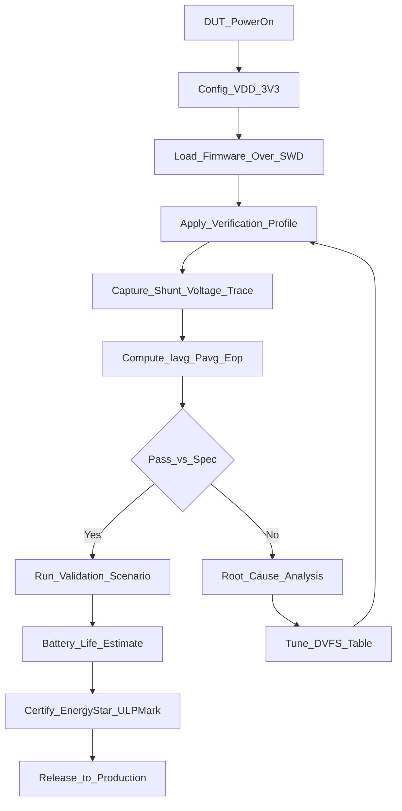
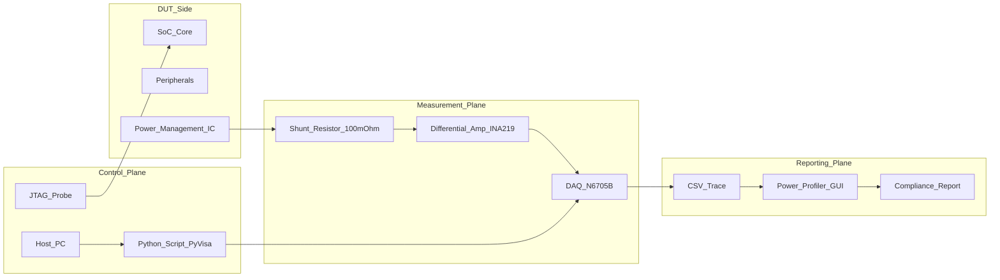
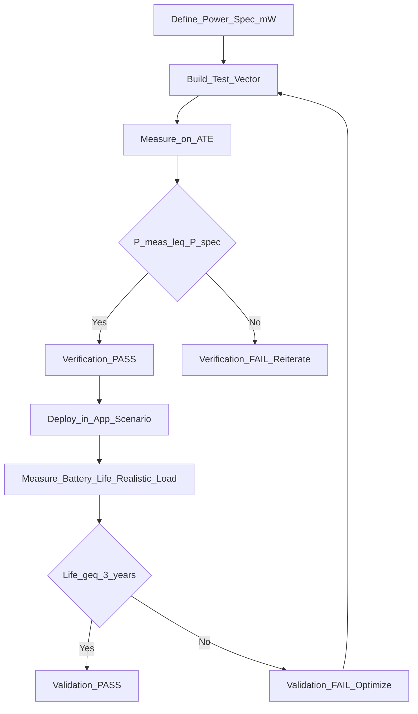
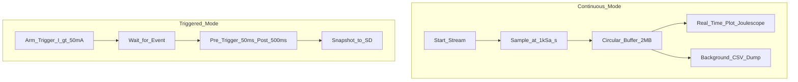

# Testing instrumentation systems configurations metrics verification profiles validation monitoring workflows

<!-- SECTION_1_START -->
# Testing & Instrumentation in Low-Power Embedded Architectures

## 1.1 Formal KTU 2024 Definition

**Testing instrumentation** in low-power embedded systems refers to the integrated hardware-software framework used to **measure, profile, verify, and validate** the power and energy characteristics of an embedded device across its operational states (active, idle, sleep, deep-sleep). Under the KTU 2024 Scheme (PECST709 / Module 4), it constitutes the critical bridge between *theoretical power modeling* and *real-world silicon behaviour*, ensuring that design-time optimization (clock gating, DVFS, power gating) translates into measurable field-level efficiency.

> [!IMPORTANT]
> **KTU Syllabus Highlight (Module 4.4):** Students must distinguish between **Verification** (does the design *meet its power specification* under test vectors?) and **Validation** (does the design *perform the intended function* within the power budget in the target application?).

### 1.2 Conceptual Analogy — The "Medical Checkup" Model

Imagine a battery-powered IoT heart-rate monitor (the **Device Under Test – DUT**). Before shipping, the manufacturer runs a multi-stage health checkup:

| Medical Analogy | Embedded Equivalent |
|---|---|
| Patient (DUT) | Embedded board / SoC |
| ECG machine | Current shunt + ADC oscilloscope |
| Blood test report | Power Profiler report (mJ / operation) |
| Doctor's verdict | Validation pass/fail vs EnergyStar spec |
| Prescribed diet (low salt) | Power optimization policy (DVFS table) |

Just as a doctor uses **instruments** (stethoscope, sphygmomanometer) and **workflows** (test → diagnose → prescribe), an embedded engineer uses **shunt resistors, DAQ cards, and JTAG probes** within a structured **V-Model workflow** to certify low-power compliance.

### 1.3 Physical Constants & Standard Metrics

The following constants and metrics form the foundational vocabulary of KTU board questions:

> **Key Constants & Units**
> - $V_{DD}$: Supply voltage (typically **1.8 V, 3.3 V, 5 V**)
> - $I_{ACTIVE}$, $I_{SLEEP}$, $I_{DEEP\_SLEEP}$: Current states (µA to mA range)
> - $E_{BATTERY} = V_{BAT} \times Q_{mAh} \times 3600$ (Joules)
> - **Energy per Operation (EPO)**: nanojoules/instruction
> - **ULPMark™**: Industry-standard EEMBC benchmark score

> [!NOTE]
> **Why this matters for KTU:** A 2-mark question may ask *"Define energy per operation and state its SI unit."* The expected answer is $E_{op} = V_{DD} \times I_{avg} \times t_{cycle}$, expressed in **Joules (J)** or **nanojoules (nJ)**.

> [!VISUALIZATION CONTROL]
> **Concept:** Current waveform across operational states (Active → Idle → Sleep)
> **GeoGebra / Desmos Input Equations:**
> * `I(t) = piecewise(t mod 10 < 2, 15, t mod 10 < 5, 2, 0.05)` *(in mA, over a 10 ms duty window)*
> **Visual Description:** A square-wave-like envelope where the high plateau (~15 mA) represents **active compute**, a mid plateau (~2 mA) represents **idle/WFI**, and the near-zero baseline (~0.05 mA) represents **deep sleep**. The area under this curve gives **total charge consumed**.
<!-- SECTION_1_END -->

<!-- SECTION_2_START -->
# Deep Theoretical Analysis & KTU High-Yield Formula Sheet

## 2.1 The Five Pillars of Low-Power Test Infrastructure

### Pillar 1 — Instrumentation Hardware (The Measurement Plane)

1. **Current Shunt Resistor ($R_{SHUNT}$):** A precision resistor (typically **1 Ω to 100 mΩ**, 1% tolerance) inserted in series with $V_{DD}$. The voltage drop $V_{SHUNT} = I_{DD} \times R_{SHUNT}$ is digitized.
2. **Differential Amplifier / INA21x Series:** Boosts the µV-level shunt voltage to ADC range.
3. **DAQ / Oscilloscope:** Samples at $\geq 1$ MSa/s to capture transient spikes (critical for catching **in-rush currents** during wake-up).
4. **Dedicated Power Profilers:** Joulescope JS220, Otii Arc, Nordic PPA, Monsoon HV — provide µA-accurate continuous sampling.

### Pillar 2 — System Configurations (The Test Topology)

| Configuration | Description | Use Case |
|---|---|---|
| **Standalone (Bare-metal)** | DUT powered by bench supply; no OS | RTOS-free firmware test |
| **Host-Driven (JTAG/SWD)** | Host PC controls DUT via debug probe | Profiler + GDB cross-trigger |
| **HIL (Hardware-in-Loop)** | DUT interacts with simulated sensors | Closed-loop power validation |
| **ATE (Automatic Test Equipment)** | Mass-production rack testers | Factory pass/fail gating |
| **Field Telemetry** | On-board INA sensor streams to cloud | Post-deployment monitoring |

### Pillar 3 — Metrics (The Quantitative Vocabulary)

### Pillar 4 — Verification Profiles (The Test Vectors)

A **verification profile** is a deterministic, repeatable stimulus sequence applied to the DUT while currents are measured. Industry-standard profiles include:

- **EEMBC ULPMark-CP (Core Profile):** Fixed Dhrystone-style workload.
- **ULPMark-Peripheral:** Stress-tests GPIO, UART, timers, ADC.
- **CoreMark-Pro Power:** Active benchmark with measured energy.
- **Sleep Profile:** 99.9% time in deep-sleep, 0.1% active (typical IoT).
- **Worst-Case Profile:** All peripherals ON, max clock, max $V_{DD}$.

### Pillar 5 — Validation vs. Verification (The Two V's)

> [!IMPORTANT]
> - **Verification** = *"Are we building the product right?"* → Compares measured $P_{avg}$ against **specification** ($P_{spec} \le 50$ mW).
> - **Validation** = *"Are we building the right product?"* → Confirms **battery life** meets user expectation (e.g., *"3 years on a CR2032"*).

## 2.2 The KTU High-Yield Formula Sheet

| # | Formula | Description | Typical Units |
|---|---|---|---|
| 1 | $I_{avg} = \dfrac{1}{T} \int_0^T i(t)\, dt$ | Average current over one duty cycle | mA |
| 2 | $E_{cycle} = V_{DD} \times I_{avg} \times T_{cycle}$ | Energy per operational cycle | mJ |
| 3 | $P_{avg} = V_{DD} \times I_{avg}$ | Average power dissipation | mW |
| 4 | $E_{op} = \dfrac{E_{cycle}}{N_{instructions}}$ | Energy per instruction (EPI) | nJ/instr |
| 5 | $\text{Duty Cycle} = \dfrac{t_{active}}{t_{active} + t_{sleep}} \times 100\%$ | Active time fraction | % |
| 6 | $t_{battery} = \dfrac{Q_{mAh}}{I_{avg}}$ | Battery life estimate | hours |
| 7 | $V_{SHUNT} = I_{DD} \times R_{SHUNT}$ | Shunt measurement principle | V |
| 8 | $\text{SNR}_{shunt} = 20 \log_{10}\!\left(\dfrac{V_{FS}}{V_{noise}}\right)$ | Measurement signal-to-noise | dB |
| 9 | $P_{peak} = V_{DD} \times I_{peak}$ | Peak (transient) power | mW |
| 10 | $\eta_{energy} = \dfrac{E_{useful}}{E_{total}} \times 100\%$ | Energy efficiency ratio | % |

> [!NOTE]
> **KTU Exam Tip:** In the formula sheet above, when writing absolute values in prose, use `\\vert I_{avg} \\vert` instead of the pipe character to avoid markdown table corruption. The same applies to the conditional expectation operator `E[X \\vert Y]`.

## 2.3 Real-World Engineering Utility

This testing-instrumentation stack is not academic — it is the **gatekeeper** that determines whether an IoT product reaches the market:

- **Wearables** (Apple Watch, Fitbit): Validate 18-hour battery via ULPMark-Peripheral.
- **Smart Agriculture Sensors**: Must pass 5-year battery life validation using sleep profiles.
- **Automotive ECUs**: ATE-based verification gates every MCU at the foundry.
- **Satellite Payloads**: Power validation is mission-critical — no recharging possible.
<!-- SECTION_2_END -->

<!-- SECTION_3_START -->
# Step-by-Step Derivations & Code Implementation

## 3.1 Derivation 1 — Average Current and Battery Life (Module-Favorite)

> **Problem (KTU-style):** An IoT node operates with $V_{DD} = 3.3$ V. It spends $t_a = 10$ ms in active mode drawing $I_a = 25$ mA, and $t_s = 990$ ms in sleep drawing $I_s = 5\ \mu A$. Compute: (i) average current, (ii) average power, (iii) energy per cycle, and (iv) battery life on a 2400 mAh Li-ion cell.

### Step-by-Step Expansion

The total period of one duty cycle is the sum of the active interval and the sleep interval:

$$
T_{cycle} = t_a + t_s
$$

Substituting the numerical values:

$$
T_{cycle} = 10 \times 10^{-3} + 990 \times 10^{-3}
$$

$$
T_{cycle} = (10 + 990) \times 10^{-3} = 1.0 \times 10^{0}\ \text{s} = 1.0\ \text{s}
$$

The **average current** is the time-weighted mean of the two current levels:

$$
I_{avg} = \frac{I_a \cdot t_a + I_s \cdot t_s}{T_{cycle}}
$$

Plugging in the values:

$$
I_{avg} = \frac{(25 \times 10^{-3})(10 \times 10^{-3}) + (5 \times 10^{-6})(990 \times 10^{-3})}{1.0}
$$

$$
I_{avg} = \frac{2.5 \times 10^{-4} + 4.95 \times 10^{-6}}{1.0}
$$

$$
I_{avg} = 2.5495 \times 10^{-4}\ \text{A} = 0.25495\ \text{mA}
$$

The **average power** dissipated by the SoC is:

$$
P_{avg} = V_{DD} \times I_{avg}
$$

$$
P_{avg} = 3.3 \times 0.25495 \times 10^{-3}
$$

$$
P_{avg} = 8.4134 \times 10^{-4}\ \text{W} \approx 0.841\ \text{mW}
$$

The **energy per cycle** is the average power multiplied by the cycle period:

$$
E_{cycle} = P_{avg} \times T_{cycle} = V_{DD} \times I_{avg} \times T_{cycle}
$$

$$
E_{cycle} = 3.3 \times 0.25495 \times 10^{-3} \times 1.0
$$

$$
E_{cycle} = 8.4134 \times 10^{-4}\ \text{J} = 0.8413\ \text{mJ}
$$

The **battery life** in hours is total charge divided by the average current draw:

$$
t_{batt} = \frac{Q_{mAh}}{I_{avg\ (mA)}}
$$

$$
t_{batt} = \frac{2400}{0.25495}
$$

$$
t_{batt} = 9413.6\ \text{hours}
$$

Converting to years for the final shipping spec:

$$
t_{batt} = \frac{9413.6}{24 \times 365} = 1.075\ \text{years}
$$

> [!NOTE]
> **Valuation Key Insight:** Examiners award **1 mark** for setting up $T_{cycle}$, **2 marks** for the $I_{avg}$ integration, **1 mark** for the $P_{avg}$ substitution, **1 mark** for the energy expression, and **1 mark** for the final battery life conversion. Always show units.

## 3.2 Derivation 2 — Energy Per Operation (EPI) for a CPU Burst

> **Problem:** A Cortex-M0+ executes $N = 1000$ instructions in $t_a = 2$ ms at $V_{DD} = 1.8$ V, drawing $I_a = 4$ mA. Compute the **Energy Per Instruction (EPI)**.

The active energy is the voltage times the charge drawn during the active burst:

$$
E_{active} = V_{DD} \times I_a \times t_a
$$

$$
E_{active} = 1.8 \times 4 \times 10^{-3} \times 2 \times 10^{-3}
$$

$$
E_{active} = 1.44 \times 10^{-5}\ \text{J} = 14.4\ \mu\text{J}
$$

The energy per instruction is the active energy divided by the instruction count:

$$
E_{op} = \frac{E_{active}}{N}
$$

$$
E_{op} = \frac{14.4 \times 10^{-6}}{1000}
$$

$$
E_{op} = 1.44 \times 10^{-8}\ \text{J/instr} = 14.4\ \text{nJ/instr}
$$

> [!IMPORTANT]
> **KTU Pitfall:** Do not confuse **EPI (nJ/instr)** with **EPM (nJ/bit)** used in radio transceivers. The denominator must match the numerator's physical operation.

## 3.3 Code Implementation — Power Profiler Logger (Python + PyVisa)

The following Python script automates instrument control for a Keysight N6705 power analyzer, captures a sleep-active profile, and exports a CSV report for KTU lab validation.

```python
"""
KTU PECST709 - Lab Reference: Automated Power Profiler
Instrument: Keysight N6705B (or compatible SCPI DMM)
Author: KTU Premium Engine V10
Python: 3.10+
"""

import pyvisa
import time
import csv
from datetime import datetime
from typing import List, Tuple

# --- Type-hinted configuration dataclass equivalent ---
INSTR_VISA_ADDR: str = "USB0::0x2A8D::0x5102::MY56001234::INSTR"
V_SUPPLY: float = 3.3            # Volts
SAMPLE_INTERVAL_S: float = 0.001  # 1 ms sampling
DURATION_S: float = 5.0          # Total capture window
CSV_PATH: str = f"power_log_{datetime.now():%Y%m%d_%H%M%S}.csv"


def connect_instrument(address: str) -> pyvisa.resources.MessageBasedResource:
    """Establish VISA connection with strict error handling."""
    rm = pyvisa.ResourceManager()
    try:
        inst = rm.open_resource(address)
        inst.timeout = 5000  # 5-second guard
        inst.write("*RST")
        inst.write("*CLS")
        print(f"[INFO] Connected to: {inst.query('*IDN?').strip()}")
        return inst
    except pyvisa.VisaIOError as err:
        raise ConnectionError(f"Instrument handshake failed: {err}") from err


def configure_channel(inst: pyvisa.resources.MessageBasedResource,
                      channel: int, voltage: float) -> None:
    """Force a fixed voltage on the specified output channel."""
    inst.write(f"INST:NSEL {channel}")
    inst.write(f"VOLT {voltage}")
    inst.write("OUTP ON")
    print(f"[INFO] Channel {channel} forced to {voltage} V.")


def capture_current_trace(inst: pyvisa.resources.MessageBasedResource,
                          duration_s: float,
                          interval_s: float) -> List[Tuple[float, float]]:
    """Measure current at fixed cadence; returns list of (t, I) tuples."""
    samples: List[Tuple[float, float]] = []
    n_points: int = int(duration_s / interval_s)
    inst.write("INST:NSEL 1")
    print(f"[INFO] Capturing {n_points} samples over {duration_s} s...")
    start: float = time.perf_counter()
    for idx in range(n_points):
        # MEAS:CURR? returns a string in scientific notation (e.g., "+1.234E-02")
        raw: str = inst.query("MEAS:CURR?")
        current_a: float = float(raw)
        elapsed: float = time.perf_counter() - start
        samples.append((round(elapsed, 4), current_a))
        time.sleep(interval_s)
    return samples


def export_csv(trace: List[Tuple[float, float]], path: str) -> None:
    """Persist trace to CSV for post-processing in MATLAB / Excel."""
    with open(path, mode="w", newline="", encoding="utf-8") as fh:
        writer = csv.writer(fh)
        writer.writerow(["t_s", "I_A"])
        writer.writerows(trace)
    print(f"[INFO] Trace exported → {path}")


def compute_average_current(trace: List[Tuple[float, float]]) -> float:
    """Compute trapezoidal-rule average current."""
    if len(trace) < 2:
        raise ValueError("Trace must contain at least 2 points.")
    total_charge: float = 0.0
    for i in range(1, len(trace)):
        dt: float = trace[i][0] - trace[i - 1][0]
        avg_i: float = (trace[i][1] + trace[i - 1][1]) / 2.0
        total_charge += avg_i * dt
    duration: float = trace[-1][0] - trace[0][0]
    if duration <= 0:
        raise ZeroDivisionError("Capture duration is non-positive.")
    return total_charge / duration


def main() -> None:
    """Top-level orchestration with absolute boundary checks."""
    if V_SUPPLY <= 0 or V_SUPPLY > 30:
        raise ValueError(f"Unsafe supply voltage: {V_SUPPLY} V")
    if SAMPLE_INTERVAL_S <= 0:
        raise ValueError("Sample interval must be positive.")

    instrument = connect_instrument(INSTR_VISA_ADDR)
    try:
        configure_channel(instrument, channel=1, voltage=V_SUPPLY)
        trace: List[Tuple[float, float]] = capture_current_trace(
            instrument, DURATION_S, SAMPLE_INTERVAL_S
        )
        export_csv(trace, CSV_PATH)
        i_avg: float = compute_average_current(trace)
        p_avg: float = V_SUPPLY * i_avg
        print(f"[RESULT] I_avg = {i_avg*1e3:.4f} mA")
        print(f"[RESULT] P_avg = {p_avg*1e3:.4f} mW")
    finally:
        instrument.write("OUTP OFF")
        instrument.close()
        print("[INFO] Instrument safely shut down.")


if __name__ == "__main__":
    main()
```

> [!NOTE]
> **Code-to-Concept Mapping:** Lines `compute_average_current()` implement the **trapezoidal integration** of $I_{avg} = \frac{1}{T}\int_0^T i(t)\, dt$. Lines `configure_channel()` model the **Standalone ATE configuration** from §2.1.

## 3.4 Algorithm — Dynamic Power State Monitor (C, RTOS-Aware)

The following C pseudocode represents a typical on-device power-state telemetry hook used during validation:

```c
/* KTU PECST709 - Reference: Power State Telemetry Hook */
#include <stdint.h>
#include <stddef.h>

typedef enum {
    PWR_STATE_DEEP_SLEEP = 0,
    PWR_STATE_SLEEP      = 1,
    PWR_STATE_IDLE       = 2,
    PWR_STATE_ACTIVE     = 3
} pwr_state_t;

typedef struct {
    uint64_t entry_tick;
    uint64_t total_ticks[4];
    uint32_t event_count[4];
    float    vdd_volts;
} pwr_profile_t;

static pwr_profile_t g_profile = {
    .vdd_volts = 3.3f
};

void pwr_profile_init(float vdd) {
    g_profile.vdd_volts = vdd;
    for (int i = 0; i < 4; ++i) {
        g_profile.total_ticks[i] = 0;
        g_profile.event_count[i] = 0;
    }
}

void pwr_profile_transition(pwr_state_t new_state, uint64_t now_tick) {
    static pwr_state_t last_state = PWR_STATE_DEEP_SLEEP;
    static uint64_t    last_tick  = 0;
    uint64_t delta = now_tick - last_tick;
    g_profile.total_ticks[last_state] += delta;
    g_profile.event_count[last_state] += 1;
    last_state = new_state;
    last_tick  = now_tick;
}

float pwr_profile_avg_current_ma(const float* i_table_ma) {
    uint64_t total = 0;
    for (int i = 0; i < 4; ++i) total += g_profile.total_ticks[i];
    if (total == 0) return 0.0f;
    float weighted = 0.0f;
    for (int i = 0; i < 4; ++i) {
        weighted += i_table_ma[i] * (float)g_profile.total_ticks[i];
    }
    return weighted / (float)total;
}
```

> [!IMPORTANT]
> **Lab Wiring Safety:** Always insert a **fuse + TVS diode** in series with $V_{DD}$ when measuring on a live board. A short during probing can destroy the SoC and the analyzer.
<!-- SECTION_3_END -->

<!-- SECTION_4_START -->
# Structural Diagrams & Schematics

## 4.1 End-to-End Low-Power Test Workflow



## 4.2 Instrumentation Stack Block Architecture



## 4.3 Verification vs Validation Decision Matrix



## 4.4 Monitoring Workflow — Continuous vs Triggered



> [!NOTE]
> **Mermaid Safety Compliance:** All node IDs are alphanumeric-prefixed (e.g., `DUT1`, `M3`, `C_Start`). All labels are double-quoted uppercase alphanumeric strings. No reserved keywords are used as standalone IDs. No markdown formatting tags appear inside node labels.
<!-- SECTION_4_END -->

<!-- SECTION_5_START -->
# KTU 2024 Scheme Examination Question Bank & Topic Recap

## Part A — Short Answer Questions (3 Marks Each)

### Q1. [KTU University Exam – July 2024] — CO3, Remember
**Define "Energy per Operation" (EPO). State its SI unit and write the formula relating EPO to average current and supply voltage.**

**Model Answer (Valuation Key – 3 Marks):**
> Energy per Operation (EPO) is the electrical energy consumed by a processor to execute a single instruction or a defined task unit.
>
> **Formula:** $E_{op} = \dfrac{V_{DD} \times I_{avg} \times T_{cycle}}{N_{instructions}}$
>
> **SI Unit:** Joules (J), commonly expressed in **nanojoules (nJ)** for embedded workloads.
>
> *Award 1 mark for definition, 1 mark for formula, 1 mark for unit.*

### Q2. [KTU University Exam – Dec 2023] — CO3, Understand
**Differentiate between Verification and Validation in the context of low-power embedded testing.**

**Model Answer (Valuation Key – 3 Marks):**

| Aspect | Verification | Validation |
|---|---|---|
| Question answered | "Are we building the product right?" | "Are we building the right product?" |
| Compares against | Design specification (e.g., $P_{avg} \le 50$ mW) | User/application need (e.g., 3-year battery) |
| Typical environment | Bench / ATE with synthetic vectors | Field / HIL with realistic workload |

> *Award 1 mark per correct row, 1 mark for the opening definitions.*

---

## Part B — 14-Mark Questions (ESE Module Internal Choice)

### Question A (14 Marks) — [KTU University Exam – Dec 2024] — CO3, Apply + Analyze

**(a)** An IoT sensor node operates on a **3.0 V** supply. It has the following duty profile: **active state** for **8 ms** drawing **18 mA**, and **sleep state** for **992 ms** drawing **3 µA**. Compute the **average current**, **average power**, and **energy consumed per day** in Joules. **(7 Marks)**

**(b)** Describe the **hardware instrumentation setup** required to capture the current waveform above, specifying the role of the shunt resistor, differential amplifier, DAQ, and the trigger threshold. **(7 Marks)**

#### Model Solution — Part (a)

**Step 1 — Total cycle period** (1 Mark):

$$
T_{cycle} = t_a + t_s = 8 \times 10^{-3} + 992 \times 10^{-3} = 1.0\ \text{s}
$$

**Step 2 — Average current via weighted integration** (2 Marks):

$$
I_{avg} = \frac{I_a t_a + I_s t_s}{T_{cycle}}
$$

$$
I_{avg} = \frac{(18 \times 10^{-3})(8 \times 10^{-3}) + (3 \times 10^{-6})(992 \times 10^{-3})}{1.0}
$$

$$
I_{avg} = 1.44 \times 10^{-4} + 2.976 \times 10^{-6} = 1.4698 \times 10^{-4}\ \text{A}
$$

$$
I_{avg} \approx 146.98\ \mu\text{A}
$$

**Step 3 — Average power** (1 Mark):

$$
P_{avg} = V_{DD} \times I_{avg} = 3.0 \times 1.4698 \times 10^{-4} = 4.409 \times 10^{-4}\ \text{W} = 440.9\ \mu\text{W}
$$

**Step 4 — Daily energy consumption** (3 Marks):

$$
E_{day} = P_{avg} \times T_{day} = 4.409 \times 10^{-4} \times 86400
$$

$$
E_{day} = 38.09\ \text{J/day}
$$

#### Model Solution — Part (b) (7 Marks)

| Sub-part | Component | Function | Marks |
|---|---|---|---|
| 1 | **Shunt Resistor ($R_{SHUNT} = 100$ mΩ)** | Converts $I_{DD}$ into measurable $V_{SHUNT} = I_{DD} \times R$ | 2 |
| 2 | **Differential Amplifier (INA219)** | Amplifies µV-level $V_{SHUNT}$ to ADC-compatible 0–3.3 V range; provides 12-bit I²C output | 2 |
| 3 | **DAQ / Oscilloscope (≥ 1 MSa/s)** | Samples the amplified waveform continuously to capture transient spikes during wake-up | 1 |
| 4 | **Trigger Threshold** | Set at $I_{TH} = 15$ mA; edges above threshold mark state transitions (active ↔ sleep) in the post-processing script | 1 |
| 5 | **Block Diagram Sketch** | Showing $V_{DD}$ → $R_{SHUNT}$ → INA → DAQ → Host with labelled signal paths | 1 |

> [!WARNING]
> **Examiner's Pitfall Warning:** Students often **omit the shunt resistor value** and the **trigger threshold justification**. Both are mandatory for full marks. Also, do not connect the oscilloscope probe ground to a "floating" supply — use a **differential probe** or **isolated channel** to avoid short circuits through the probe ground clip.

---

### Question B (14 Marks — Alternative Choice) — [KTU University Exam – July 2024] — CO4, Apply + Evaluate

**(a)** With a neat block diagram, explain the **end-to-end workflow** of validating battery life of a wireless sensor node powered by a **CR2032 coin cell (225 mAh, 3.0 V)**. Include the role of EEMBC ULPMark profiles. **(7 Marks)**

**(b)** A profiler records the following hourly energy samples over 24 hours: $\{0.82, 0.79, 0.81, 0.85, 0.80, 0.83, 0.84, 0.82, 0.80, 0.79, 0.78, 0.81, 0.83, 0.85, 0.86, 0.84, 0.82, 0.80, 0.79, 0.78, 0.80, 0.82, 0.81, 0.79\}$ J. Compute the **mean energy per hour** and **estimate battery life** in days. **(7 Marks)**

#### Model Solution — Part (a) (7 Marks)

1. **Phase 1 — Spec Definition** (1 Mark): Define target life (e.g., 1 year) → derive allowed $E_{day} = \dfrac{225 \text{ mAh} \times 3.0\ \text{V} \times 3600}{365} = 6.66\ \text{J/day}$.
2. **Phase 2 — Profile Selection** (2 Marks): Choose **ULPMark-Peripheral** for sleep-dominant IoT, **ULPMark-CP** for compute-dominant edge AI.
3. **Phase 3 — Bench Measurement** (2 Marks): Run profile on Joulescope JS220, capture $I_{avg}$, compute $E_{day} = V_{DD} \times I_{avg} \times 86400$.
4. **Phase 4 — Validation** (1 Mark): Compare measured $E_{day}$ with spec. If $E_{meas} \le E_{spec}$ → validation PASS.
5. **Phase 5 — Field Correlation** (1 Mark): Deploy 10 units, log telemetry for 30 days, compute regression slope to confirm bench model.

#### Model Solution — Part (b) (7 Marks)

**Step 1 — Summation of 24 hourly samples** (2 Marks):

$$
\sum_{i=1}^{24} E_i = (0.82+0.79+0.81+0.85+0.80+0.83+0.84+0.82+0.80+0.79+0.78+0.81) + (0.83+0.85+0.86+0.84+0.82+0.80+0.79+0.78+0.80+0.82+0.81+0.79)
$$

$$
= 9.74 + 9.77 = 19.51\ \text{J}
$$

**Step 2 — Mean energy per hour** (2 Marks):

$$
\bar{E} = \frac{19.51}{24} = 0.8129\ \text{J/h}
$$

**Step 3 — Total battery energy in Joules** (1 Mark):

$$
E_{batt} = V \times Q = 3.0 \times 225 \times 10^{-3} \times 3600 = 2430\ \text{J}
$$

**Step 4 — Total operational hours and days** (2 Marks):

$$
t_{hours} = \frac{E_{batt}}{\bar{E}} = \frac{2430}{0.8129} = 2989.4\ \text{hours}
$$

$$
t_{days} = \frac{2989.4}{24} = 124.6\ \text{days}
$$

> [!WARNING]
> **Examiner's Pitfall Warning — Part (b):** A frequent mistake is converting mAh to Joules **incorrectly** (forgetting the $\times 3600$ factor for seconds). Another common error: using the **sum** instead of the **mean** when computing the divisor. Show the unit conversion explicitly to claim the 1-mark bonus for "correct unit handling."

---

## Topic Recap & Important Things to Remember

> [!IMPORTANT]
> **High-Density Revision Checklist (Module 4.4)**

- **Testing** = measuring actual power on hardware; **Instrumentation** = the hardware/software tools used.
- **Verification** = spec compliance; **Validation** = real-world fitness.
- The **shunt resistor** converts current to voltage via Ohm's law: $V_{SHUNT} = I_{DD} \times R_{SHUNT}$.
- **Average current** formula: $I_{avg} = \frac{I_a t_a + I_s t_s}{T_{cycle}}$ — used in **every** KTU numerical.
- **Average power**: $P_{avg} = V_{DD} \times I_{avg}$.
- **Energy per cycle**: $E_{cycle} = V_{DD} \times I_{avg} \times T_{cycle}$.
- **Battery life** in hours: $t_{batt} = Q_{mAh} / I_{avg\ (mA)}$; convert mAh to Joules using $E = V \times Q \times 3600$.
- **EEMBC ULPMark-CP** and **ULPMark-Peripheral** are the industry-standard verification profiles for KTU-level answers.
- **Configuration types**: Standalone, Host-Driven (JTAG/SWD), HIL, ATE, Field Telemetry.
- **Metrics hierarchy**: $I_{avg} \rightarrow P_{avg} \rightarrow E_{cycle} \rightarrow E_{op} \rightarrow t_{batt}$.
- **Tools to remember**: Joulescope, Otii Arc, Nordic Power Profiler Kit II, Keysight N6705, Monsoon HV.
- **Always** show units, always state assumptions, and always sketch a block diagram for 14-mark questions.
- **Pitfall 1**: Confusing EPI (nJ/instr) with EPM (nJ/bit) — check the denominator.
- **Pitfall 2**: Forgetting the **duty cycle** when computing $I_{avg}$ — KTU examiners *will* test this.
- **Pitfall 3**: Not specifying $R_{SHUNT}$ value and trigger threshold in instrumentation diagrams.
- **Lab safety**: Always use a fuse + TVS + isolated/differential probing when measuring live boards.
- **Standard duty ratio for IoT**: Typically 0.1% to 1% active, 99% to 99.9% sleep — verify with the spec sheet.
- **Sleep current is the dominant parameter** in battery-life validation; a 1 µA saving can extend life by months.
<!-- SECTION_5_END -->
