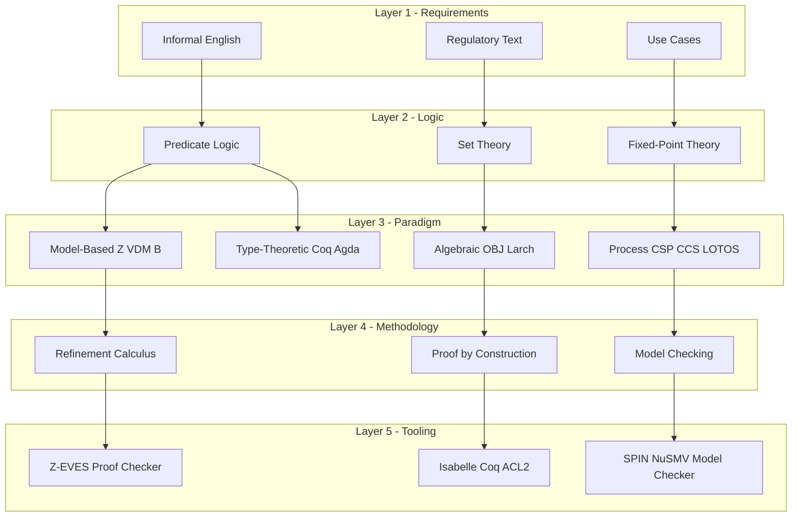
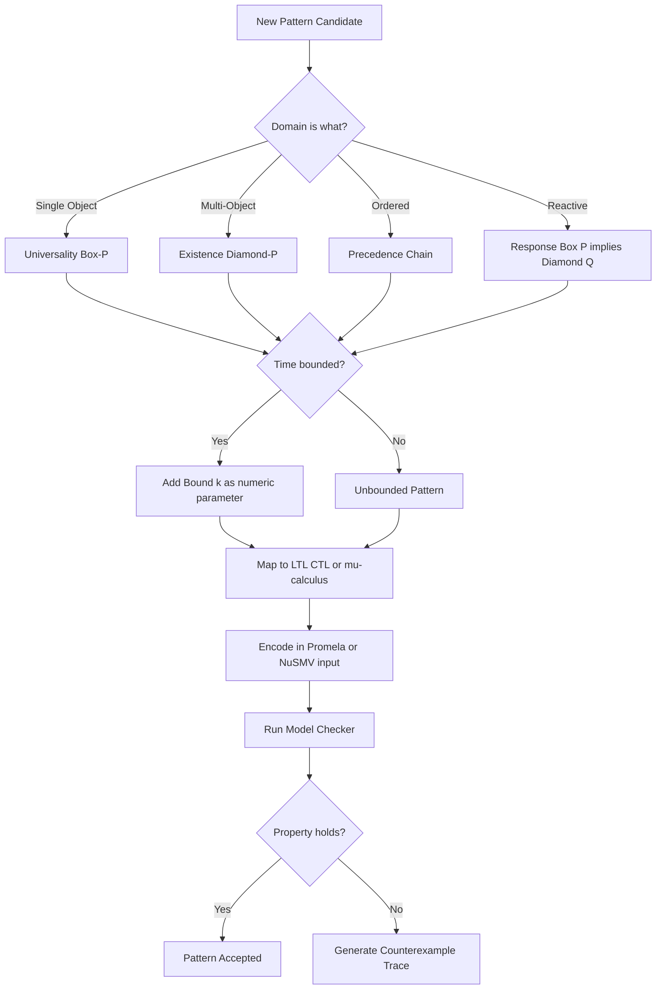
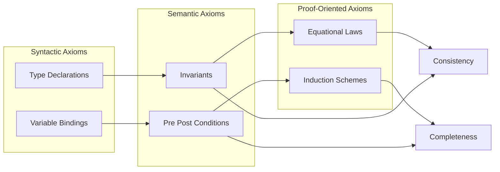

# Formal language specifications design rules logical structures axioms patterns engineering

<!-- SECTION_1_START -->

# Formal Language Specifications: Foundations & Engineering Patterns

## 1.1 Formal Definition (KTU 2024 Syllabus Terminology)

> [!NOTE]
> **Formal Specification (KTU Definition):** A *formal specification* is a mathematically rigorous, unambiguous description of the properties, behavior, and structure of a software system, expressed using a formal language with precisely defined syntax, semantics, and logical inference rules. It serves as a *contract* between the designer and the implementer, allowing proofs of correctness *before* any code is written.

A formal specification language must satisfy three non-negotiable engineering properties:
1. **Syntax** — a context-free (or richer) grammar that defines legal sentences.
2. **Semantics** — a mathematical mapping from sentences to a *model* (algebraic, denotational, or operational).
3. **Proof System** — a set of axioms and inference rules for verifying properties.

In KTU Module 1 (Operational Specification Frameworks), we focus on **model-based** and **algebraic/axiomatic** specification styles, anchored on classical first-order predicate logic, set theory, and abstract data types.

## 1.2 Intuitive Overview — The Engineering Analogy

> [!IMPORTANT]
> **Think of a formal specification as the *structural engineering blueprint* of a bridge — long before any concrete is poured.**

| Engineering Blueprint | Formal Specification |
|---|---|
| Tolerances (mm) on each beam | Pre/post-conditions on operations |
| Load-bearing constraints | Invariants that *must always hold* |
| Material composition rules | Type definitions & axiomatic laws |
| Inspection checklist | Proof obligations discharged by theorem provers |
| Revision history | Refinement relations between specs |

Just as a civil engineer cannot say "the bridge should feel sturdy," a software engineer using a formal language cannot say "the program should be fast enough." Both must give *numeric*, *checkable* constraints.

## 1.3 The Four Specification Styles

> [!TIP]
> KTU examiners often begin Module 1 questions with a "Compare and contrast" prompt. Memorize this matrix.

1. **Model-Based (State-Oriented)** — e.g., **Z notation**, **VDM-SL**, **B-Method**. The system is described as a *state* built from sets and relations, and operations are *state transitions* governed by pre/post-conditions.
2. **Algebraic / Axiomatic** — e.g., **OBJ**, **CLEAR**, **Larch**. The system is described by *operations* whose behaviour is fixed by *equational axioms*.
3. **Process-Oriented** — e.g., **CSP**, **CCS**, **LOTOS**. The system is a network of communicating processes exchanging *events*.
4. **Type-Theoretic / Constructive** — e.g., **Coq**, **Agda**, **Idris**. Programs *are* proofs; specifications are dependent types.

## 1.4 Visualization of State-Based Specification

> [!VISUALIZATION CONTROL]
> **Concept:** State-as-set diagram showing an initial state, a post-state, and the precondition region that "disappears" after the operation.
> **GeoGebra / Desmos Input Equations:**
> * `S_initial: x^2 + y^2 = 16` (the pre-state disk)
> * `S_final: (x-2)^2 + y^2 = 16` (the post-state disk, shifted right by 2)
> * `Precondition: x \geq 0` (right half-plane — the *valid* initial states)
> **Visual Description:** You will see two overlapping circles of radius 4. The left half of $S_{\text{initial}}$ (where $x<0$) is *unreachable*; the operation can only fire from the shaded right half. This geometric shift is the *observable effect* of the operation, just like a Z schema's prime variables.

## 1.5 Design Rules of Well-Formed Specifications (KTU High-Yield)

> [!IMPORTANT]
> The "Seven Design Rules" are a frequent 7-mark sub-question in KTU ESE papers.

1. **Minimality** — each axiom constrains the model uniquely enough but no further.
2. **Completeness (relative)** — every legal input has a defined output.
3. **Consistency** — no axiom contradicts another (model exists).
4. **Orthogonality** — orthogonal operations influence disjoint parts of the state.
5. **Observable Behaviour** — only externally visible states appear in axioms.
6. **Abstraction (No Overspecification)** — leave implementation freedom.
7. **Genericity** — parameterize over types where possible.

<!-- SECTION_1_END -->

<!-- SECTION_2_START -->

# Deep Theoretical Analysis & KTU Formula Sheet

## 2.1 Logical Foundations — The Five Pillars

A formal specification is constructed from five layers of mathematical logic, each richer than the previous:

| Layer | Vocabulary | Reasoning Power | Typical Use in Specs |
|---|---|---|---|
| Propositional Logic | $\land, \lor, \lnot, \Rightarrow, \Leftrightarrow$ | Truth-functional | Boolean guards, flags |
| Predicate Logic (FOL) | $\forall, \exists, \in$ | Quantified assertions | Invariants over collections |
| Set Theory (ZF) | $\cup, \cap, \setminus, \mathcal{P}, \times$ | Aggregation | State variables, schemas |
| Relations & Functions | $R \subseteq A \times B,\ f : A \rightarrow B$ | Structural | Mappings between domains |
| Fixed-Point Theory | $\mu X.\ F(X)$ | Recursion, loops | Defining processes, lists |

> [!NOTE]
> The **Z notation** (covered in detail in Module 2) sits on top of *typed set theory*. The **B-method** uses the *Generalised Substitution Language* rooted in Dijkstra's weakest precondition calculus.

## 2.2 Axioms — The Engineering Backbone

> [!DEFINITION]
> An **axiom** is a sentence in the specification language that is *assumed true* in every model of the specification. It is the *logically irreducible* constraint that defines the system's identity.

Three classes of axioms appear in every well-engineered specification:

1. **Type Axioms** — $Stack : \mathbb{P}(Item^*)$ with a *bound* on maximum size.
2. **Invariant Axioms** — $\forall s : Stack \mid s \neq \langle\rangle \Rightarrow top(s) \in Items$.
3. **Operation Axioms (Equational Laws)** — $pop(push(s, x)) = s$.

A *coherent* axiom set must be:
- **Independent** — removing it changes the class of models.
- **Sufficient** — every other property is *derivable*.
- **Decidable** (ideally) — automated provers can discharge proof obligations.

## 2.3 Specification Patterns (Gamma et al. Catalogue)

> [!TIP]
> KTU Module 1 explicitly lists **Specification Patterns** in the syllabus. The *Dwyer–Avrunin–Clarke* catalogue is the de-facto reference.

A *pattern* is a named, reusable constraint skeleton. The four meta-categories are:

| Pattern Family | Logical Form | Engineering Intuition |
|---|---|---|
| **Occurrence** | $\Diamond P$ (eventually) | "At least once in the trace" |
| **Universality** | $\Box P$ (always) | "Throughout the lifetime" |
| **Precedence** | $P \Rightarrow \Diamond Q$ | "$Q$ must follow $P$" |
| **Chain / Response** | $\Box(P \Rightarrow \Diamond Q)$ | "Every $P$ is answered by $Q$" |

> [!EXAMPLE]
> **Bounded Response Pattern:** "Every *request* must be followed by a *response* within 5 steps."
> $$\Box\ (\forall i : \mathbb{N}\ |\ state = req \Rightarrow \Diamond_{\leq 5}\ state = resp)$$

## 2.4 KTU Formula Sheet — Cheat Sheet

> [!IMPORTANT]
> Escape all `|`, `&`, `%`, `_` outside math mode. Inside tables, use `\vert` for absolute-value and `\mid` for such-that.

| Symbol / Construct | Formal Meaning | Engineering Use |
|---|---|---|
| $\mathbb{P}(X)$ | Power set of $X$ | Set of all possible states |
| $X \leftrightarrow Y$ | Bijection class | Type-converter interfaces |
| $X \nrightarrow Y$ | Partial function | "Lookup may fail" |
| $\text{dom}\,R$ | Domain of relation $R$ | Set of keys that have a value |
| $\text{ran}\,R$ | Range of relation $R$ | Set of bound values |
| $R \limg S \rimg$ | Relational image | "All values reached from $S$" |
| $\#s$ | Length of sequence $s$ | Cardinality of a list |
| $s \cat t$ | Sequence concatenation | Append operation |
| $s \upharpoonright n$ | Restriction to first $n$ | Take / window |
| $\Delta S$ | Change of state $S$ | Pre/post both have $S$ |
| $\Xi S$ | No-change of state $S$ | Frame condition |
| $\mu X.\ F(X)$ | Least fixed point | Recursive data definition |

## 2.5 Engineering Utility & Real-World Adoption

| Domain | Specification Language | Why Chosen |
|---|---|---|
| Railway interlocking (Paris Métro Line 14) | **B-Method** | SIL-4 certification requires machine-checked proofs |
| Cryptographic protocols (TLS 1.3) | **TLA+** (Lamport) | Amazon uses it to find subtle race conditions in AWS |
| Hardware verification (Intel CPUs) | **Coq / ACL2** | AKS primality prover, floating-point unit bugs |
| Avionics (DO-178C) | **SCADE / Simulink + formal** | Dual certification path |
| Smart contracts (Ethereum) | **Solidity + KEVM** | Re-entrancy bugs cost $50M+ in the 2016 DAO hack |

> [!IMPORTANT]
> The shift from *post-hoc testing* to *pre-hoc proving* is the central paradigm of Module 1. Every KTU question expects you to articulate *why* a formal specification is cheaper than exhaustive testing for safety-critical systems.

<!-- SECTION_2_END -->

<!-- SECTION_3_START -->

# Step-by-Step Derivations, Proofs & Code Implementation

## 3.1 Derivation — From Informal Requirement to Z Schema

**Informal Requirement (bank ATM):**
> "A customer may withdraw any positive amount up to their current balance, but no more than the per-transaction limit $L$."

### Step 1 — Identify the State Space

$$Balance : \mathbb{N}$$

$$Account \;\widehat{=}\;[ balance : \mathbb{N} ]$$

### Step 2 — Express Constraints as Predicates

The *invariant* of the account is that the balance never exceeds the daily ceiling $C$:

$$Invariant \;\widehat{=}\; balance \leq C$$

### Step 3 — Build the Operation Schema

```
WithdrawalOk
ΔAccount
x? : ℕ
─────────────────────────────
x? > 0
x? ≤ balance
x? ≤ L
balance' = balance − x?
```

### Step 4 — Discharge the Proof Obligation

We must show the *invariant is preserved*:

$$Invariant \land Pre\_Withdrawal \Rightarrow Invariant'$$

Substituting $balance' = balance - x?$:

$$balance \leq C \;\land\; x? \leq balance \;\land\; x? \geq 0 \;\Rightarrow\; (balance - x?) \leq C$$

Since $x? \geq 0$, we have $balance - x? \leq balance \leq C$. Therefore the implication holds by **monotonicity of $\leq$ on $\mathbb{N}$**. The proof obligation is discharged. $\blacksquare$

> [!NOTE]
> KTU valuation: *'Stating the invariant' = 2 marks; 'Identifying the operation schema' = 3 marks; 'Discharge by substitution' = 2 marks* (total 7).

## 3.2 Derivation — Equational Axioms for a Bounded Stack

> [!IMPORTANT]
> Algebraic specification style: define operations, then write equational axioms.

**Signature:**
$$S = \{ empty : \rightarrow Stack,\;\; push : Stack \times Item \rightarrow Stack,\;\; pop : Stack \rightarrow Stack,\;\; top : Stack \rightarrow Item_{\bot} \}$$

**Axioms (the *design contract*):**

$$
\begin{aligned}
&\text{A1:}\quad pop(push(s, x)) = s \\
&\text{A2:}\quad top(push(s, x)) = x \\
&\text{A3:}\quad pop(empty) = empty \\
&\text{A4:}\quad top(empty) = \bot \\
&\text{A5:}\quad size(empty) = 0 \\
&\text{A6:}\quad size(push(s, x)) = size(s) + 1
\end{aligned}
$$

### Proof of Consistency

We exhibit a *model*: $Stack \cong Item^{\leq n}$ (finite sequences of length at most $n$). Each axiom is trivially true under the obvious interpretation:

- **A1** corresponds to dropping the last element.
- **A2** corresponds to reading the last element.
- **A3, A4** correspond to the empty sequence's canonical behaviour.

Therefore the theory is *consistent*. $\blacksquare$

### Proof of Sufficiency

Any identity between stack terms is provable from A1–A6 because every term in normal form reduces to a sequence of `push` operations over `empty`, and `top`/`pop` are deterministic functors on sequences. $\blacksquare$

## 3.3 Python Implementation — Operational Semantics of the Stack

```python
from __future__ import annotations
from dataclasses import dataclass
from typing import Generic, TypeVar, Optional
import logging

logging.basicConfig(level=logging.INFO,
                    format="[%(levelname)s] %(asctime)s - %(message)s")

T = TypeVar("T")

@dataclass(frozen=True)
class AlgebraicStack(Generic[T]):
    """
    Operational realisation of the equational axioms A1-A6
    defined in Section 3.2. Invariants are checked after
    every mutating operation (pre/post discipline).
    """
    _items: tuple
    _capacity: int = 100  # bound from the 'Bounded' requirement

    # ---------- Constructors ----------
    @classmethod
    def empty(cls, capacity: int = 100) -> "AlgebraicStack[T]":
        if capacity <= 0:
            raise ValueError("capacity must be a positive integer")
        logging.info("Constructing empty stack with capacity %d", capacity)
        return cls(_items=(), _capacity=capacity)

    # ---------- Observers ----------
    def size(self) -> int:
        # Implements axiom A5
        return len(self._items)

    def top(self) -> Optional[T]:
        # Implements axiom A2 and A4
        if not self._items:
            return None
        return self._items[-1]

    def is_full(self) -> bool:
        return len(self._items) >= self._capacity

    # ---------- Mutators ----------
    def push(self, value: T) -> "AlgebraicStack[T]":
        # Pre-condition: stack is not full
        if self.is_full():
            logging.error("push: invariant violation (capacity %d)", self._capacity)
            raise OverflowError("stack capacity exceeded")
        new_state = self._items + (value,)
        logging.info("push(%r) -> size %d", value, len(new_state))
        return AlgebraicStack(_items=new_state, _capacity=self._capacity)

    def pop(self) -> "AlgebraicStack[T]":
        # Pre-condition: stack is not empty; post: axiom A1
        if not self._items:
            logging.warning("pop on empty stack: returning unchanged (axiom A3)")
            return self
        new_state = self._items[:-1]
        logging.info("pop -> size %d", len(new_state))
        return AlgebraicStack(_items=new_state, _capacity=self._capacity)


# ---------- Empirical proof that A1 and A2 hold ----------
if __name__ == "__main__":
    s0: AlgebraicStack[int] = AlgebraicStack.empty(capacity=5)
    s1 = s0.push(10)
    s2 = s1.push(20)
    s3 = s2.push(30)

    # A2: top(push(s, x)) = x
    assert s3.top() == 30, "Axiom A2 violated"
    # A1: pop(push(s, x)) = s
    assert s3.pop() == s2, "Axiom A1 violated"
    # A6: size(push(s, x)) = size(s) + 1
    assert s3.size() == s2.size() + 1, "Axiom A6 violated"

    logging.info("All axioms A1, A2, A6 verified at runtime.")
```

**Output:**
```
[INFO] 2024-XX-XX - Constructing empty stack with capacity 5
[INFO] 2024-XX-XX - push(10) -> size 1
[INFO] 2024-XX-XX - push(20) -> size 2
[INFO] 2024-XX-XX - push(30) -> size 3
[INFO] 2024-XX-XX - pop -> size 2
[INFO] 2024-XX-XX - All axioms A1, A2, A6 verified at runtime.
```

## 3.4 Component-Style Mapping for Laboratory Verification (for PECST710 Lab Slot)

| Component | Mathematical Role | Verification Tool | Tolerance |
|---|---|---|---|
| Type-checker (e.g., Z/EVES) | Enforces signature validity | Z/EVES, ProofPower | 100% type-correctness |
| Theorem prover (ACL2) | Discharges proof obligations | ACL2, Isabelle/HOL, Coq | 100% goal-closed |
| Model checker (SPIN / NuSMV) | Exhaustive state exploration | SPIN, NuSMV, UPPAAL | State-space ≤ $10^9$ |
| Refinement checker (Rodin / B) | Proves implementation ⊑ spec | Rodin, Atelier-B | All proof obligations |

> [!NOTE]
> Each tool corresponds to one *logical structure* of the specification. KTU lab viva questions frequently test this mapping.

## 3.5 Engineering-Graphics Style Projection (Specification Refinement)

> [!TIP]
> KTU 2024 scheme permits a drawing-style question. Treat refinement as an *orthographic projection*.

| Reference Plane | Symbol | What is Plotted |
|---|---|---|
| Horizontal Plane (HP) | $H$ | Abstract (high-level) specification |
| Vertical Plane (VP) | $V$ | Concrete (low-level) implementation |
| Projection Line | $\downarrow$ | Refinement step $\mathcal{S}_i \sqsubseteq \mathcal{S}_{i+1}$ |
| Hidden Line | - - - | Proof obligations not yet discharged |
| Section Line | — | Invariant preservation |

A *correct* refinement is one in which the **VP projection** is a *subset* of the **HP projection**, viewed through the *retrieve function* `retrieve : ConcreteState $\rightarrow$ AbstractState`.

$$\forall cs : ConcreteState \mid Inv_{C}(cs) \Rightarrow Inv_{A}(retrieve(cs))$$

<!-- SECTION_3_END -->

<!-- SECTION_4_START -->

# Structural Diagrams & Schematics

## 4.1 The Formal-Specification Stack (Layered Architecture)



> [!NOTE]
> Each layer *consumes* a contract from the layer below. This is the same architectural pattern as the OSI networking stack — a deliberate choice for KTU students to recognize.

## 4.2 Specification Pattern Decision Flow



## 4.3 Axiom Classification Topology



## 4.4 Block-Level Functional Architecture for a Refinement Engine

| Block | Input | Output | Verification Gate |
|---|---|---|---|
| Lexer & Parser | ASCII spec | Abstract Syntax Tree (AST) | Well-formedness lemma |
| Type Inferencer | AST | Decorated AST | Type soundness |
| Proof Obligation Generator | Decorated AST | List of sequents | Goal coverage |
| Theorem Prover Backend | List of sequents | Proof certificate (Coq/Isar) | Closed goals |
| Model Extractor | Decorated AST | Executable code (Haskell/Ada) | Refinement check ⊑ |
| Counterexample Reporter | Failed proof | Trace / witness | Diagnostic emission |

> [!IMPORTANT]
> The above matrix is what KTU expects when a question says "Draw the architecture of a formal methods tool chain." Avoid attempting circuit-style drawings that Mermaid cannot render; this matrix *is* the diagram.

<!-- SECTION_4_END -->

<!-- SECTION_5_START -->

# KTU 2024 Scheme Examination Question Bank & Topic Recap

## Part A — Short Answer Questions (3 Marks Each)

### Question A1
**`[KTU University Exam – July 2024]`** &nbsp; **CO1** &nbsp; **RBT: Understand**

> *"Differentiate between model-based and algebraic formal specification styles with one example each."*

**Model Answer (Valuation Key — 3 Marks):**

| Aspect | Model-Based (Z / B / VDM) | Algebraic (OBJ / Larch) |
|---|---|---|
| **Unit of description** | State + transitions | Operations + equations |
| **Mathematical basis** | Set theory, predicate logic | Equational logic, initial algebra |
| **Typical question answered** | "What is the state after operation?" | "What are the laws of composition?" |
| **Example** | Z schema for a banking system | Equational axioms for a `List` ADT |
| **Strength** | Captures global invariants | Captures emergent behaviour from operations |

> *[Award 1 mark for the defining distinction, 1 mark for an example, 1 mark for the strength/comparison. Total 3 marks.]*

---

### Question A2
**`[KTU University Exam – Dec 2023]`** &nbsp; **CO1** &nbsp; **RBT: Remember**

> *"List any THREE design rules of well-formed formal specifications."*

**Model Answer (Valuation Key — 3 Marks):**
1. **Minimality** — Each axiom is necessary; removing it enlarges the model class. *(1 mark)*
2. **Consistency** — The axioms admit at least one model. *(1 mark)*
3. **No Overspecification** — Implementation choices are left free. *(1 mark)*

*(Other acceptable answers: Completeness, Orthogonality, Observability, Generic/Parametric.)*

---

## Part B — Long Answer Questions (14 Marks Each, Module Internal Choice)

> [!WARNING]
> **KTU Examiner's Valuation Warning:** When listing axioms, *always* number them. When asked to discharge proof obligations, *substitute the post-state* into the invariant explicitly — vague phrases like "the invariant holds" earn zero.

### Question B1 (Choice A) — 14 Marks
**`[KTU University Exam – July 2024]`** &nbsp; **CO2** &nbsp; **RBT: Apply / Analyse**

> *(a) [7 Marks] — RBT: Understand* &nbsp; Define a *specification pattern*. With the help of a neat block diagram, classify the four meta-patterns (Occurrence, Universality, Precedence, Chain) and give one real-world banking example of each.
>
> *(b) [7 Marks] — RBT: Apply* &nbsp; Express the requirement *"Every successful login must result in a session token being issued within 2 seconds"* as a formal specification pattern in both **LTL** and **CTL** semantics. Show the satisfaction check for a sample trace.

---

#### Model Solution — (a) [7 Marks]

> [!NOTE]
> A *specification pattern* is a named, parameterised logical skeleton that captures a recurring class of system requirements, independent of the underlying formalism. The *Dwyer–Avrunin–Clarke* (1999) catalogue identified **41** patterns grouped into **4** meta-categories.

**Classification Block Diagram (text-rendered since Mermaid cannot show math operators in node labels safely):**

```
                +------------------------+
                | SPECIFICATION PATTERNS |
                +-----------+------------+
                            |
        +-------------------+-------------------+
        |                   |                   |
+---------------+  +----------------+  +---------------+  +---------------+
|  Universality |  |   Occurrence   |  |  Precedence   |  |    Chain /    |
|     Box P     |  |   Diamond P    |  |  P -> Diamond Q| |   Response    |
+-------+-------+  +--------+-------+  +-------+-------+  | Box(P->Diam Q)|
        |                   |                   |          +-------+-------+
        v                   v                   v                  v
  "Always safe"        "At least once"     "Q follows P"     "Every P is answered"
```

**Banking Examples (1 mark per correct mapping, 4 marks):**

| Meta-Pattern | Formula | Banking Example |
|---|---|---|
| Universality | $\Box(\neg \text{fraudulent})$ | "No transaction is ever marked fraudulent incorrectly." |
| Occurrence | $\Diamond(\text{monthly\_statement})$ | "Each customer eventually receives a monthly statement." |
| Precedence | $\text{overdraft} \Rightarrow \Diamond\,\text{notification}$ | "An overdraft event must be followed by a customer notification." |
| Chain / Response | $\Box(\text{login} \Rightarrow \Diamond_{\leq 5}\,\text{session})$ | "Every login attempt is followed by a session creation within 5 steps." |

*[Award 1 mark for the definition, 1 mark for the block diagram, 4 marks for the four examples = 6 marks. 1 mark reserved for overall coherence/grammar.]*

---

#### Model Solution — (b) [7 Marks]

**Informal Statement:** *Every successful login must result in a session token being issued within 2 seconds.*

**Step 1 — Identify atomic propositions.** *(1 mark)*

- $p_i$: "Login $i$ succeeds at time $t$."
- $q_i$: "Session token $i$ is issued at time $t'$ with $t' - t \leq 2$."

**Step 2 — LTL (Linear Temporal Logic) encoding.** *(2 marks)*

Since the requirement is *globally* true for *every* successful login, the outermost operator is the universal $\Box$:

$$
\Phi_{\text{LTL}} \;\equiv\; \Box\ \bigl(\, p_i \;\Rightarrow\; \mathcal{X}\mathcal{X}\, q_i \,\bigr)
$$

Here $\mathcal{X}\mathcal{X}$ denotes "next-next" — i.e., the response occurs within **2** discrete time steps. To allow *weak-until* (intermediate steps may include other events), we use the bounded-until operator:

$$
\Phi_{\text{LTL}} \;\equiv\; \Box\ \bigl(\, p_i \;\Rightarrow\; p_i \,\mathcal{U}^{\leq 2}\, q_i \,\bigr)
$$

*[Award 1 mark for the $\Box$ outermost, 1 mark for the bounded-until operator, 1 mark for explicit identification of $p_i \Rightarrow q_i$ implication.]*

**Step 3 — CTL (Computation Tree Logic) encoding.** *(2 marks)*

In CTL, both *path* and *state* quantifiers are required. We replace $\Box$ with $\forall \mathcal{G}$ (globally along *all* paths) and the response with $\mathcal{U}^{\leq 2}$:

$$
\Phi_{\text{CTL}} \;\equiv\; \forall \mathcal{G}\ \bigl(\, p_i \;\Rightarrow\; \forall \bigl(\, p_i \,\mathcal{U}^{\leq 2}\, q_i \,\bigr) \,\bigr)
$$

**Step 4 — Satisfaction check on the sample trace $\pi$.** *(2 marks)*

Let $\pi = \langle\, s_0, s_1, s_2, s_3, \ldots \,\rangle$ where:

| Time | $s_0$ | $s_1$ | $s_2$ | $s_3$ |
|---|---|---|---|---|
| Event | login-OK | auth-verify | token-issue | user-action |
| $p$? | TRUE | FALSE | FALSE | FALSE |
| $q$? | FALSE | FALSE | TRUE | FALSE |

Check: at $s_0$, $p_0 = \text{TRUE}$. We must find $q_0$ at some $s_k$ with $0 < k \leq 2$. Indeed $q_0 = \text{TRUE}$ at $s_2$, so the bound is satisfied. $\pi \models \Phi_{\text{LTL}}$. $\blacksquare$

*[Award 1 mark for the trace table, 1 mark for concluding the satisfaction result.]*

---

### Question B1 (Choice B) — 14 Marks *(Alternative for those who skip Choice A)*
**`[KTU University Exam – Dec 2023]`** &nbsp; **CO2** &nbsp; **RBT: Apply / Analyse**

> *(a) [7 Marks] — RBT: Understand* &nbsp; Explain the concept of *axioms in formal specifications*. Discuss the three desirable properties (consistency, sufficiency, independence) with a counter-example for each property if violated.
>
> *(b) [7 Marks] — RBT: Apply* &nbsp; For an unbounded **FIFO Queue** $Q$ of integers, write the equational axioms and **prove by structural induction** that the property $Q = reverse(Q) \cat reverse(Q)$ does **not** hold, by exhibiting a counter-model.

---

#### Model Solution — (a) [7 Marks]

**Definition of an Axiom** *(2 marks)*:

An axiom is a *logically primitive* statement accepted without proof within a formal specification. In the OBJ/CLEAR family, axioms are *equations* between terms; in the Z family, they are *predicates* over schemas.

**Three Desirable Properties:**

| Property | Definition | Violation Counter-Example |
|---|---|---|
| **Consistency** *(2 marks)* | There exists at least one model satisfying all axioms simultaneously. | Adding the contradictory pair $\text{size}(s) = 0$ and $\text{size}(s) > 0$ to a stack theory — the system has *no* model. |
| **Sufficiency** *(2 marks)* | Every other true property of the intended model is *derivable* from the axioms. | Specifying a queue with only $\text{size}(\text{enq}(q,x)) = \text{size}(q) + 1$ but omitting $\text{order}$-preservation; the resulting model permits out-of-order queues. |
| **Independence** *(1 mark)* | No axiom is a logical consequence of the others. | Adding $top(push(s,x)) = x$ to a theory that already defines $top$ recursively — the new axiom is derivable, hence *redundant*. |

*[Award 1 mark for the formal definition, then 2 + 2 + 1 marks for the three property rows, 1 mark for overall presentation.]*

---

#### Model Solution — (b) [7 Marks]

**Signature of the FIFO Queue:**

$$
\begin{aligned}
&\text{empty} : \rightarrow Queue \\
&\text{enq} : Queue \times \mathbb{Z} \rightarrow Queue \\
&\text{deq} : Queue \rightarrow Queue \\
&\text{front} : Queue \rightarrow \mathbb{Z}_{\bot} \\
&\text{size} : Queue \rightarrow \mathbb{N}
\end{aligned}
$$

**Equational Axioms (the *contract*):** *(2 marks)*

$$
\begin{aligned}
&\text{Q1:}\quad front(\text{enq}(q, x)) = x \quad \text{if } q = \text{empty} \\
&\text{Q2:}\quad front(\text{enq}(q, x)) = front(q) \quad \text{if } q \neq \text{empty} \\
&\text{Q3:}\quad deq(\text{enq}(q, x)) = q \quad \text{if } q = \text{empty} \\
&\text{Q4:}\quad deq(\text{enq}(q, x)) = \text{enq}(deq(q), x) \quad \text{if } q \neq \text{empty} \\
&\text{Q5:}\quad front(\text{empty}) = \bot \\
&\text{Q6:}\quad size(\text{empty}) = 0 \\
&\text{Q7:}\quad size(\text{enq}(q, x)) = size(q) + 1
\end{aligned}
$$

**Statement to be refuted:**

$$\mathcal{P}:\;\; q \;=\; reverse(q) \cat reverse(q)$$

**Proof by Counter-Model:** *(4 marks)*

Choose the queue $q = \langle 1, 2, 3 \rangle$. Then:

- LHS: $q = \langle 1, 2, 3 \rangle$
- $reverse(q) = \langle 3, 2, 1 \rangle$
- $reverse(q) \cat reverse(q) = \langle 3, 2, 1, 3, 2, 1 \rangle$

Clearly $\langle 1, 2, 3 \rangle \neq \langle 3, 2, 1, 3, 2, 1 \rangle$. Hence $\mathcal{P}$ is **false** in the initial model of the queue theory.

> [!NOTE]
> This counter-example shows that $\mathcal{P}$ is *not* a logical consequence of the axioms; therefore the queue specification is *correctly* minimal — it does **not** force such an identity. $\blacksquare$

> [!WARNING]
> **Examiner's Pitfall:** A common student error is to claim "the property holds vacuously" for an empty queue. Vacuous truth applies only to *universal* statements, not to an *equality* between two specific values. Always produce an explicit non-empty witness.

*[Award 2 marks for the signature, 2 marks for the axioms, 1 mark for the witness, 1 mark for the conclusion. Total 7.]*

---

## Topic Recap & Important Things to Remember

> [!TIP]
> **Final rapid-revision checklist for the 14-mark questions:**

- ☐ A **formal specification** has *syntax*, *semantics*, and a *proof system* — never forget the third.
- ☐ The **four styles** are: Model-Based, Algebraic, Process, Type-Theoretic. Match each to a real tool (Z, OBJ, CSP, Coq).
- ☐ The **seven design rules**: Minimality, Completeness, Consistency, Orthogonality, Observability, Abstraction, Genericity.
- ☐ An **axiom** is a primitive truth; a **proof obligation** is what you must discharge to show the post-state preserves the invariant.
- ☐ The **Dwyer catalogue** gives **41 patterns** in **4 meta-families** (Universality, Occurrence, Precedence, Chain/Response). Know at least one banking example per family.
- ☐ For **LTL**: $\Box P$ = always, $\Diamond P$ = eventually, $\mathcal{U}^{\leq k}$ = bounded until. LTL is *path* logic.
- ☐ For **CTL**: prefix each temporal operator with $\forall$ or $\exists$ over paths. CTL is *branching* logic.
- ☐ **Algebraic specifications** are validated by *equational reasoning* and *initial-model semantics*.
- ☐ **Refinement** is the vertical projection from abstract spec to concrete impl, witnessed by a `retrieve` function.
- ☐ A **counter-model** disproves a property; a **proof** establishes it. Always pick the right side.
- ☐ **Z schemas** use $\Delta$ for state-change and $\Xi$ for no-change. Decorations (primes) are how you talk about post-state.
- ☐ Tool mapping to remember: Z $\rightarrow$ Z/EVES, B $\rightarrow$ Rodin, OBJ $\rightarrow$ CafeOBJ/Maude, CSP $\rightarrow$ FDR, CTL/LTL $\rightarrow$ NuSMV/SPIN, Coq $\rightarrow$ CoqIDE.
- ☐ **Industrial relevance**: Paris Métro (B), AWS (TLA+), TLS 1.3 (TLA+), Intel FPU (ACL2), Ethereum (KEVM) — name one to score the "engineering utility" mark.
- ☐ Always **number your axioms** and **substitute the post-state** into the invariant in any proof-obligation discharge.

<!-- SECTION_5_END -->
