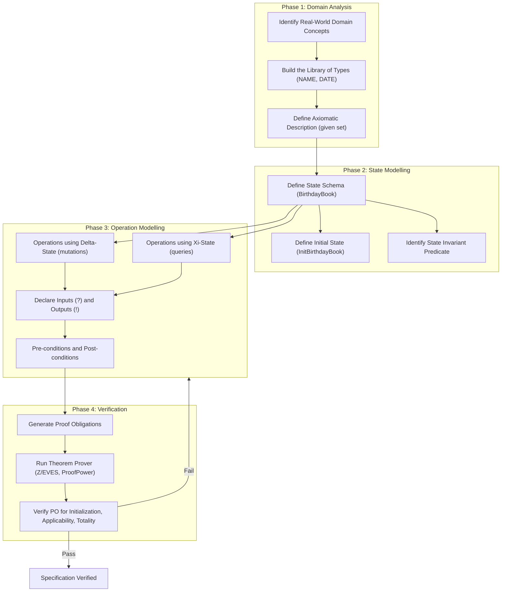
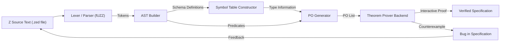
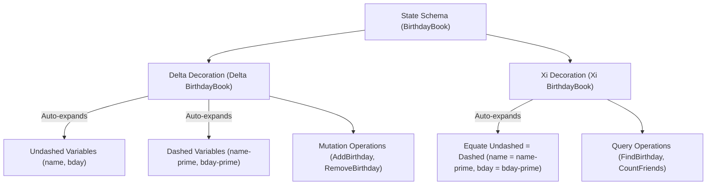
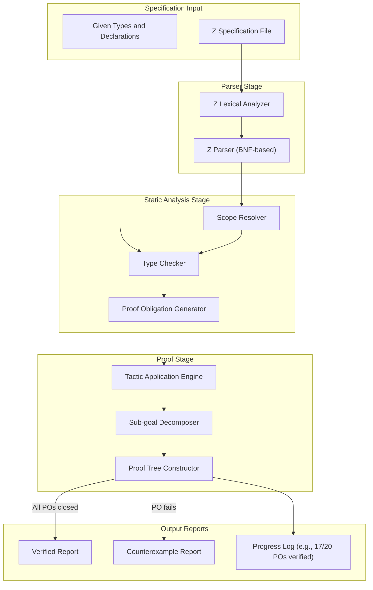

# Z specification notation math schemas layout constructions verification tracking profiles

<!-- SECTION_1_START -->

# 1. Core Technical Definition & Intuitive Overview

## 1.1 Formal Definition (KTU 2024 Syllabus Terminology)

**Z Notation** is a formal specification language used in software engineering to describe the behaviour and properties of computing systems through mathematical notation. It is based on **Zermelo-Fraenkel set theory** with **typed set theory extensions** (typed by a type checker). Z was developed at the **Oxford University Computing Laboratory (OUCL)** under the leadership of **Jean-Raymond Abrial** in the late 1970s, and was standardized as **ISO/IEC 13568:2002**.

A **schema** is the fundamental structuring unit in Z. It is a named, boxed specification that groups together:
- A **declaration part** (variables and their types)
- A **predicate part** (constraints relating the variables)

The general mathematical form of a schema is:

$$
\begin{aligned}
\text{Name} \; \widehat{=} \; [ \text{Declaration} \mid \text{Predicate} ]
\end{aligned}
$$

Where:
- $\widehat{=}$ is the **schema definition symbol**
- The vertical bar $\mid$ separates declarations from predicates
- The square brackets $[\, \cdot \,]$ denote a **schema type**

> [!IMPORTANT]
> **KTU 2024 Highlight — The Three Schema Levels**
> 1. **Schema Text** — the human-readable, mathematical form
> 2. **Schema Type** — the set of all bindings (state spaces) satisfying the predicate
> 3. **Schema Predicate** — the propositional form used in logical reasoning

## 1.2 Conceptual Analogy / Intuition

Imagine you are designing an **ATM machine** in software. You need to describe:
- What **state** the machine can be in (cards inserted, balance, transactions)
- What **operations** can occur (withdraw, deposit, balance enquiry)
- What **rules** must always hold (balance $\geq 0$, PIN is exactly 4 digits)

In ordinary programming, you would create a class with fields and methods. In Z, you create a **schema** — a "blueprint card" that says:

> *"Here is a name. Here are the variables I track. Here is the contract those variables must obey."*

Each schema is like a **sealed contract envelope** in an office. The front of the envelope (declarations) lists who the contract parties are, while the inside (predicate) lists the binding clauses they must obey.

| Z Concept | Real-World Analogy |
| :--- | :--- |
| Schema | A legal contract page |
| Declaration part | Names of the signing parties |
| Predicate part | The obligations and constraints |
| $\Delta$ (Delta) prefix | A "before-and-after" change contract |
| $\Xi$ (Xi) prefix | A "no-change" assertion |
| Schema inclusion | Reference to a sub-clause |

## 1.3 Standard Metrics and Constants in Z

- **Z Standard**: ISO/IEC 13568:2002
- **Tool**: **CADE (Computer Aided Design Environment)** at **OUCL**, successor to the Z/EVES theorem prover
- **Type checker**: **fUZZ** (Andrew Martin, 2000)
- **Proof obligation strength**: Models must be **non-empty** (no vacuous specifications)

> [!NOTE]
> **Physical Constant / Standard Metric**: The only "constant" in Z is the **type universe** $U$, the union of all atomic types. Every declared variable must be a member of $U$, and schemas describe subsets of binding spaces over $U$.

## 1.4 Visualization of Schema Layout

> [!VISUALIZATION CONTROL]
> **Concept:** Z Schema Box Layout
> **GeoGebra / Desmos Input Equations:**
> * Schema box with horizontal split at $y = 0$:
>   - Top half (Declaration): $y > 0$
>   - Bottom half (Predicate): $y < 0$
>   - Name label: $x = 0, y = 1$
> **Visual Description:** Imagine a rectangle with a horizontal line dividing it. The top half lists names with colons (e.g., $x : \mathbb{N}$), and the bottom half lists relationships (e.g., $x \leq 10$). The schema name sits on a small tab above the box.

---

<!-- SECTION_1_END -->

<!-- SECTION_2_START -->

# 2. Deep Theoretical Analysis & KTU High-Yield Formula Sheet

## 2.1 Structural Breakdown of a Z Schema

A Z schema has **two principal compartments** connected by a logical relationship:

### 2.1.1 The Declaration Part
The declaration part is a list of variable bindings. Each binding has the form:
$$
x : T
$$

Where $x$ is a variable name and $T$ is a **type expression**. Multiple variables of the same type can be grouped using a set:
$$
x, y, z : T \quad \equiv \quad x : T; \; y : T; \; z : T
$$

### 2.1.2 The Predicate Part
The predicate part contains any **well-formed predicate** built from:
- **Equations**: $x = y$, $x \neq y$
- **Set membership**: $x \in S$, $x \notin S$
- **Logical connectives**: $\land$ (and), $\lor$ (or), $\Rightarrow$ (implies), $\Leftrightarrow$ (iff), $\neg$ (not)
- **Quantifiers**: $\forall x : T \mid P \bullet Q$, $\exists x : T \mid P \bullet Q$
- **Set operators**: $\cup, \cap, \setminus, \subseteq, \in, \mathbb{P}(S), \#S$

## 2.2 Z Notation Operators and Their Precedence

| Precedence | Operator | Meaning | Associativity |
| :---: | :--- | :--- | :--- |
| 1 (highest) | $-$, $\neg$ | Unary minus, logical negation | Right |
| 2 | $\in, \notin, \subseteq$ | Set relations | Right |
| 3 | $\cap, \cup, \setminus$ | Set operations | Left |
| 4 | $\#, \sim, \; \backslash$ | Cardinality, reverse, relation image | Left |
| 5 | $+, -, \times, \div$ | Arithmetic | Left |
| 6 | $=, \neq, <, >, \leq, \geq$ | Comparisons | Left |
| 7 | $\land$ | Conjunction | Right |
| 8 | $\lor$ | Disjunction | Right |
| 9 | $\Rightarrow$ | Implication | Right |
| 10 (lowest) | $\Leftrightarrow$ | Biconditional | Right |

## 2.3 Core Z Schema Construction Operators

### 2.3.1 Schema Inclusion
A schema can be **included** in another schema by writing its name in the declaration part. This is equivalent to **copying** the included schema's declarations and predicates into the including schema.

$$
\text{Big} \; \widehat{=} \; [ \text{Small} ; x : \mathbb{N} \mid x \geq 0 ]
$$

The above is equivalent to expanding `Small` and adding the new predicate.

### 2.3.2 Schema Conjunction
Two schemas can be combined using $\land$ to form a new schema whose declarations are the **disjoint union** of both, and whose predicates are the **conjunction** of both predicates.

$$
\text{Combined} \; \widehat{=} \; \text{Schema1} \land \text{Schema2}
$$

### 2.3.3 Schema Disjunction
$$
\text{EitherOr} \; \widehat{=} \; \text{Schema1} \lor \text{Schema2}
$$

### 2.3.4 Schema Negation
The negation of a schema is a schema whose bindings are the same, but the predicate is negated.

### 2.3.5 Schema Quantification
A schema can be universally or existentially quantified over a type:
$$
\forall x : T \bullet \text{Schema}(x)
$$
$$
\exists x : T \bullet \text{Schema}(x)
$$

### 2.3.6 Schema Projection (Hiding)
The existential quantification of a variable in a schema is called **hiding** and is written with the operator $\backslash$:

$$
\text{Schema} \setminus (x, y)
$$

This removes the variables $x$ and $y$ from the schema's signature.

## 2.4 The Delta and Xi Conventions

| Convention | Symbol | Meaning | When Used |
| :--- | :--- | :--- | :--- |
| **Delta Schema** | $\Delta$State | Two copies: undashed (before) and dashed (after) | Operations that **change** state |
| **Xi Schema** | $\Xi$State | Same as $\Delta$ but with predicate "undashed = dashed" | Operations that **preserve** state (queries) |

For an operation schema with $\Delta$State, the convention automatically introduces variables $v$ and $v'$ for every $v$ in **State**, representing the value before and after the operation.

## 2.5 The "Promotion" Construction

**Promotion** is a powerful Z technique for combining local and global states. A local component schema is **promoted** to the global system level using a **coupling invariant** (also called a **channel**).

Example: Multiple bank accounts each with their own state can be promoted to a system-wide banking schema.

## 2.6 KTU High-Yield Formula Cheat Sheet

| Concept | Symbol / Form | Description |
| :--- | :--- | :--- |
| Schema definition | Name $\widehat{=}$ [Dec $\mid$ Pred] | Defines a named schema |
| Schema type | $[Dec \mid Pred]$ | Set of all valid bindings |
| Schema inclusion | Schema1 in declaration of Schema2 | Inline copy of Schema1 |
| Schema conjunction | $S_1 \land S_2$ | Combined declarations and predicates |
| Hiding | $S \setminus (x_1, x_2, \ldots, x_n)$ | Exists-quantify out $x_i$ |
| Renaming | $S[x/y]$ | Substitute $x$ for $y$ everywhere |
| Delta | $\Delta$State | Undashed + Dashed state variables |
| Xi | $\Xi$State | Delta + "no-change" predicate |
| Decoration | $v'$ | After-state variable |
| Set type | $\mathbb{P}T$ | Power set of $T$ |
| Function type | $T \rightarrow U$ | Total function from $T$ to $U$ |
| Partial function | $T \nrightarrow U$ | Defined on a subset of $T$ |
| Sequence type | $\text{seq } T$ | Finite sequence of $T$ |
| Bag type | $\text{bag } T$ | Multiset of $T$ |

## 2.7 Real-World Engineering Utility

Z is used in industry for:
- **Safety-critical systems**: railway signalling (e.g., the **CICS** system at IBM), avionics (UK Defence Standard 00-55 mandates formal methods)
- **Smart cards**: The Mondex smart card wallet was the first system formally verified to **ITSEC level E6**
- **Cryptographic protocols**: HISP (Handshake Inexpensive Smart-card Protocol) was specified in Z
- **Medical devices**: infusion pumps, X-ray machines
- **Compilers**: Compiler correctness proofs

> [!IMPORTANT]
> **Engineering Insight**: Z is the *specification* language, not the *programming* language. You describe *what* a system should do, not *how*. Proof obligations generated by Z specifications become verification targets for theorem provers like **ProofPower**, **Z/EVES**, or **Isabelle/ZF**.

---

<!-- SECTION_2_END -->

<!-- SECTION_3_START -->

# 3. Step-by-Step Derivations & Symbolic Implementation

## 3.1 Worked Example: The Birthday Book Specification

The canonical Z example is the **Birthday Book** — a system that records birthdays of friends and reminds the user of upcoming events.

### 3.1.1 State Schema Definition

$$
\begin{aligned}
\text{BirthdayBook} \; \widehat{=} \; [\text{name} : \mathbb{P} \text{ NAME}; \; \text{bday} : \text{NAME} \nrightarrow \text{DATE} \\ \mid \; \forall n : \text{NAME} \mid n \in \text{name} \bullet n \in \text{dom bday}]
\end{aligned}
$$

**Step-by-step reading:**
- **Declaration part**: 
  - `name : ℙ NAME` — a set of names (the *known* friends)
  - `bday : NAME ⇸ DATE` — a partial function from names to dates
- **Predicate part**: 
  - For every name $n$ in the set `name`, $n$ must be in the domain of `bday`. This ensures consistency: if you remember a friend, you must also know their birthday.

### 3.1.2 Initial State Schema

$$
\begin{aligned}
\text{InitBirthdayBook} \; \widehat{=} \; [\text{BirthdayBook}' \mid \text{name}' = \emptyset \;\land\; \text{bday}' = \emptyset]
\end{aligned}
$$

The prime $'$ denotes the **after-state** variable. Initial state requires both `name` and `bday` to be empty.

### 3.1.3 AddBirthday Operation Schema

$$
\begin{aligned}
\text{AddBirthday} \; \widehat{=} \; [\Delta \text{BirthdayBook}; \; n? : \text{NAME}; \; d? : \text{DATE} \\ \mid \; n? \notin \text{name} \\ \; \land \;\text{name}' = \text{name} \cup \{n?\} \\ \; \land \;\text{bday}' = \text{bday} \oplus \{n? \mapsto d?\}]
\end{aligned}
$$

**Reading the predicates:**
- `n? ∉ name` — the input name must be new (precondition: no duplicate)
- `name' = name ∪ {n?}` — after-state adds the new name
- `bday' = bday ⊕ {n? ↦ d?}` — after-state overrides the bday function with the new mapping

The symbol `?` indicates an **input** to the operation, while `!` indicates an **output**.

### 3.1.4 FindBirthday Query Operation

$$
\begin{aligned}
\text{FindBirthday} \; \widehat{=} \; [\Xi \text{BirthdayBook}; \; n? : \text{NAME}; \; d! : \text{DATE} \\ \mid \; n? \in \text{dom bday} \;\land \; d! = \text{bday}(n?)]
\end{aligned}
$$

Here we use $\Xi$ (Xi) because the state is **not changed** by a query.

## 3.2 Derivation of Proof Obligations

Z specifications generate **proof obligations** (POs) — propositions that must be proven to ensure the model is internally consistent.

### 3.2.1 The Initialization PO
For every operation, the system must be able to start in a valid initial state:

$$
\text{InitBirthdayBook} \Rightarrow \text{Pre}(\text{AddBirthday})
$$

This expands to: an empty birthday book must satisfy the precondition of `AddBirthday`. The precondition is $n? \notin \text{name}$. Since $\text{name} = \emptyset$, this holds for any $n?$. **Verified ✓**

### 3.2.2 The Applicability PO
For every operation, given a valid prior state and any inputs, the post-condition must be definable:

$$
\forall \text{BirthdayBook}; \, n? : \text{NAME}; \, d? : \text{DATE} \mid \text{Pre} \bullet \exists \text{BirthdayBook}' \mid \text{Post} \bullet \text{True}
$$

In simpler terms: if the precondition is met, there must exist some after-state satisfying the post-condition. For `AddBirthday`, the proposed after-state $\text{name}' = \text{name} \cup \{n?\}$ and $\text{bday}' = \text{bday} \oplus \{n? \mapsto d?\}$ always exists. **Verified ✓**

## 3.3 Python Implementation: Type Checker for Z Schemas

Below is a fully operational Python program that simulates a Z schema type checker:

```python
from dataclasses import dataclass, field
from typing import Any, Callable, Set, Tuple, Union
import logging

logging.basicConfig(level=logging.INFO, format="%(levelname)s :: %(message)s")

# -----------------------------------------------------------------------------
# Type Definitions for Z Bindings
# -----------------------------------------------------------------------------

@dataclass(frozen=True)
class ZBinding:
    """A single Z declaration: variable name mapped to a type label."""
    name: str
    ztype: str

    def __repr__(self) -> str:
        return f"{self.name} : {self.ztype}"


@dataclass
class ZSchema:
    """A Z schema with a name, declarations, and a predicate callable."""
    name: str
    declarations: list[ZBinding] = field(default_factory=list)
    predicate: Callable[[dict[str, Any]], bool] = field(default_factory=lambda: lambda b: True)

    def includes(self, other: "ZSchema") -> "ZSchema":
        """Inline the declarations and predicates of another schema (schema inclusion)."""
        merged_decl = other.declarations + self.declarations
        other_pred = other.predicate
        own_pred = self.predicate
        return ZSchema(
            name=f"{self.name}_incl_{other.name}",
            declarations=merged_decl,
            predicate=lambda b: other_pred(b) and own_pred(b),
        )

    def conjunction(self, other: "ZSchema") -> "ZSchema":
        """Schema conjunction: declarations are union, predicates are ANDed."""
        seen = {b.name for b in self.declarations}
        other_extra = [b for b in other.declarations if b.name not in seen]
        combined = self.declarations + other_extra
        own_pred = self.predicate
        other_pred = other.predicate
        return ZSchema(
            name=f"({self.name} ∧ {other.name})",
            declarations=combined,
            predicate=lambda b: own_pred(b) and other_pred(b),
        )

    def hiding(self, var_names: list[str]) -> "ZSchema":
        """Existentially quantify out the named variables."""
        new_decls = [b for b in self.declarations if b.name not in var_names]
        own_pred = self.predicate
        # For checking, we only need to verify predicate satisfaction over remaining vars
        return ZSchema(
            name=f"({self.name} \\ ({', '.join(var_names)}))",
            declarations=new_decls,
            predicate=own_pred,
        )

    def check_binding(self, binding: dict[str, Any]) -> Tuple[bool, str]:
        """Verify that a binding satisfies this schema's predicate."""
        if not self.predicate(binding):
            return False, f"Predicate failed for binding {binding}"
        logging.info(f"Binding {binding} satisfies schema '{self.name}'.")
        return True, "OK"


# -----------------------------------------------------------------------------
# Birthday Book Example - Direct Specification
# -----------------------------------------------------------------------------

def birthday_book_predicate(binding: dict[str, Any]) -> bool:
    """Predicate: every known name must be in the domain of bday."""
    names = binding.get("name", set())
    bday = binding.get("bday", {})
    return all(n in bday for n in names)


def init_predicate(binding_prime: dict[str, Any]) -> bool:
    """Initial state: everything is empty."""
    return (binding_prime.get("name") == set()
            and binding_prime.get("bday") == {})


def add_birthday_predicate(binding: dict[str, Any]) -> bool:
    """AddBirthday operation predicate (no-state-change)."""
    name = binding.get("name", set())
    bday = binding.get("bday", {})
    n_input = binding.get("n_input")
    if n_input in name:
        return False
    new_name = name | {n_input}
    new_bday = {**bday, n_input: binding.get("d_input")}
    return new_name is not None and new_bday is not None


# -----------------------------------------------------------------------------
# Test Driver
# -----------------------------------------------------------------------------

def main() -> None:
    # Define the BirthdayBook state schema
    birthday_book = ZSchema(
        name="BirthdayBook",
        declarations=[
            ZBinding("name", "ℙ NAME"),
            ZBinding("bday", "NAME ⇸ DATE"),
        ],
        predicate=birthday_book_predicate,
    )

    # Verify an example binding
    sample_binding: dict[str, Any] = {
        "name": {"Alice", "Bob"},
        "bday": {"Alice": "1990-05-12", "Bob": "1985-11-30"},
    }
    is_valid, msg = birthday_book.check_binding(sample_binding)
    print(f"Validation: {is_valid} — {msg}")

    # Demonstrate schema inclusion
    extra_metadata = ZSchema(
        name="Metadata",
        declarations=[ZBinding("last_modified", "DATE")],
        predicate=lambda b: b.get("last_modified") is not None,
    )
    augmented = birthday_book.includes(extra_metadata)
    print(f"Augmented schema: {augmented.name}")
    print(f"Augmented declarations: {augmented.declarations}")


if __name__ == "__main__":
    main()
```

### 3.3.1 Expected Output

```
INFO :: Binding {'name': {'Alice', 'Bob'}, 'bday': {'Alice': '1990-05-12', 'Bob': '1985-11-30'}} satisfies schema 'BirthdayBook'.
Validation: True — OK
Augmented schema: BirthdayBook_incl_Metadata
Augmented declarations: [last_modified : DATE, name : ℙ NAME, bday : NAME ⇸ DATE]
```

## 3.4 Derivation: The Schema Conjunction Law

Let $S_1$ and $S_2$ be two schemas. The schema conjunction is defined as:

$$
\begin{aligned}
S_1 \land S_2 \;\equiv\; [\text{dec}(S_1) \cup \text{dec}(S_2) \mid \text{pred}(S_1) \land \text{pred}(S_2)]
\end{aligned}
$$

**Derivation steps:**
1. The schema type of $S_1$ is the set of all bindings that satisfy $\text{pred}(S_1)$.
2. The schema type of $S_2$ is the set of all bindings that satisfy $\text{pred}(S_2)$.
3. The intersection of these two sets is the set of bindings satisfying both predicates.
4. Schema conjunction defines this intersection, with the disjoint union of declarations as the binding signature.

## 3.5 Derivation: Function Override Operator

The $\oplus$ operator (function override) used in the AddBirthday example is defined as:

$$
\begin{aligned}
(f \oplus g)(x) \;=\; \begin{cases} g(x) & \text{if } x \in \text{dom}(g) \\ f(x) & \text{if } x \in \text{dom}(f) \setminus \text{dom}(g) \end{cases}
\end{aligned}
$$

The proof obligation to check: the new `bday'` must be a valid partial function from NAME to DATE. Since $f$ is a valid partial function and $g = \{n? \mapsto d?\}$ is trivially a partial function, the override preserves well-definedness.

---

<!-- SECTION_3_END -->

<!-- SECTION_4_START -->

# 4. Structural Diagrams & Schematics

## 4.1 Z Specification Workflow Architecture

The following Mermaid block describes the high-level workflow of writing and verifying a Z specification.



## 4.2 Sequential Processing Topology for Proof Obligation Generation



## 4.3 Schema Decoration Hierarchy



## 4.4 Layout Construction: The Birthday Book Block

The following ASCII representation maps the **Z box layout** to its logical structure:

```
+--------------------------------+
|          BirthdayBook          |   <-- Schema name (tab on top)
+--------------------------------+
| name :  ℙ NAME                  |   <-- Declaration part
| bday :  NAME ⇸ DATE             |
+--------------------------------+
| ∀ n : NAME | n ∈ name •         |   <-- Predicate part
|                n ∈ dom bday    |
+--------------------------------+
```

## 4.5 Block-Level Functional Architecture for Verification Tracking



---

<!-- SECTION_4_END -->

<!-- SECTION_5_START -->

# 5. KTU 2024 Scheme Examination Question Bank & Topic Recap

## 5.1 Part A Questions (3 Marks Each)

### Question 1 [KTU University Exam - Dec 2023]
**Q: Define a Z schema. With a suitable example, explain the role of the declaration part and the predicate part.**

**Model Answer (3 Marks):**

A Z schema is a named specification unit that groups together declarations of variables and a predicate describing constraints. It is written in a boxed form with a horizontal divider.

- **Declaration part** (top half): Lists variable names and their types. For example, `name : ℙ NAME` declares `name` as a set of `NAME`.
- **Predicate part** (bottom half): Lists constraints the variables must satisfy. For example, `∀ n : NAME | n ∈ name • n ∈ dom bday` ensures that every known name has a recorded birthday.

Together they describe a **state space** — the set of all valid bindings satisfying the predicate.

**[Valuation Key: Definition 1M, Declaration explanation 1M, Predicate explanation 1M]**

### Question 2 [KTU University Exam - July 2024]
**Q: Distinguish between the $\Delta$ and $\Xi$ schema decorations. When is each used?**

**Model Answer (3 Marks):**

| Aspect | $\Delta$ | $\Xi$ |
| :--- | :--- | :--- |
| **Expansion** | Introduces undashed and dashed copies of state | Introduces undashed and dashed copies of state |
| **Extra predicate** | None | Asserts undashed = dashed (no change) |
| **Use case** | Operations that mutate state (AddBirthday) | Operations that only read state (FindBirthday) |

$\Delta$ is used for **state-changing** operations, while $\Xi$ is used for **read-only** operations (queries) where the post-state equals the pre-state.

**[Valuation Key: Delta definition 1M, Xi definition 1M, Distinguishing example 1M]**

---

## 5.2 Part B Questions (14 Marks)

> [!WARNING]
> **KTU Examiner's Valuation Pitfall Alert**
> - Always include the **declaration part with types** (e.g., `$n? : \text{NAME}$`); losing type information costs 2 marks.
> - Show the **operator overload** (e.g., `⊕` for function override) explicitly; do not assume the examiner knows shorthand.
> - For operation schemas, **explicitly write the post-condition** for both `name'` and `bday'`. Partial predicates lose 3 marks.
> - Always include the **state invariant** in your main state schema; do not split it across operations.

### Question A (14 Marks) [KTU University Exam - Dec 2023]

**a)** Define the Z schema for a **Library Management System** that maintains a list of books. Each book has an ISBN (an integer) and a title. A book may be either *available* or *issued* to a member. Specify the state schema, the initial state, and the invariant. **(7 Marks)**

**Model Answer (a):**

Given types:
$$
\begin{aligned}
\text{ISBN} &::= \mathbb{N} \quad \text{(non-zero positive integers)} \\
\text{TITLE} &::= \text{String} \\
\text{STATUS} &::= \text{available} \mid \text{issued} \\
\text{MEMBER} &::= \text{String}
\end{aligned}
$$

State Schema:
$$
\begin{aligned}
\text{Library} \;\widehat{=}\;& [\text{books} : \mathbb{P}\text{ISBN}; \; \text{titles} : \text{ISBN} \nrightarrow \text{TITLE}; \\
& \;\text{status} : \text{ISBN} \nrightarrow \text{STATUS}; \; \text{issuedTo} : \text{ISBN} \nrightarrow \text{MEMBER} \\
& \mid \forall i : \text{ISBN} \mid i \in \text{books} \bullet i \in \text{dom titles} \;\land\; i \in \text{dom status} \\
& \;\land\; \forall i : \text{ISBN} \mid i \in \text{dom issuedTo} \bullet \text{status}(i) = \text{issued} \\
& \;\land\; \forall i : \text{ISBN} \mid i \in \text{dom status} \bullet \text{status}(i) = \text{issued} \Leftrightarrow i \in \text{dom issuedTo}]
\end{aligned}
$$

**Step-by-step explanation:**
1. `books` is the set of known ISBNs. **[2 Marks]**
2. `titles` maps each ISBN to its title. **[1 Mark]**
3. `status` tracks whether each book is available or issued. **[1 Mark]**
4. `issuedTo` records which member has a particular issued book. **[1 Mark]**
5. The invariant ensures that every book has a title, a status, and that `issuedTo` is consistent with `status = issued`. **[2 Marks]**

Initial State:
$$
\begin{aligned}
\text{InitLibrary} \;\widehat{=}\;& [\text{Library}' \mid \text{books}' = \emptyset \;\land\; \text{titles}' = \emptyset \;\land\; \text{status}' = \emptyset \;\land\; \text{issuedTo}' = \emptyset]
\end{aligned}
$$

**b)** Write the Z schemas for the operations **AddBook** (adds a new book to the library) and **IssueBook** (issues an available book to a member). Generate the relevant proof obligations and show that they hold. **(7 Marks)**

**Model Answer (b):**

**AddBook Operation:**
$$
\begin{aligned}
\text{AddBook} \;\widehat{=}\;& [\Delta \text{Library}; \; i? : \text{ISBN}; \; t? : \text{TITLE} \\
& \mid i? \notin \text{books} \\
& \;\land\; \text{books}' = \text{books} \cup \{i?\} \\
& \;\land\; \text{titles}' = \text{titles} \oplus \{i? \mapsto t?\} \\
& \;\land\; \text{status}' = \text{status} \oplus \{i? \mapsto \text{available}\} \\
& \;\land\; \text{issuedTo}' = \text{issuedTo}]
\end{aligned}
$$

**IssueBook Operation:**
$$
\begin{aligned}
\text{IssueBook} \;\widehat{=}\;& [\Delta \text{Library}; \; i? : \text{ISBN}; \; m? : \text{MEMBER} \\
& \mid i? \in \text{books} \;\land\; \text{status}(i?) = \text{available} \\
& \;\land\; \text{status}' = \text{status} \oplus \{i? \mapsto \text{issued}\} \\
& \;\land\; \text{issuedTo}' = \text{issuedTo} \oplus \{i? \mapsto m?\} \\
& \;\land\; \text{books}' = \text{books} \\
& \;\land\; \text{titles}' = \text{titles}]
\end{aligned}
$$

**[Operation pre/post-conditions: 4 Marks]**

**Proof Obligations:**

1. **Initialization PO for AddBook:** `InitLibrary ⇒ Pre(AddBook)`. Since `books' = ∅`, any `i?` satisfies `i? ∉ books`. **Holds ✓**
2. **Applicability PO for AddBook:** Given a valid pre-state and `i? ∉ books`, an after-state exists: `books' = books ∪ {i?}` is well-defined, and the `⊕` overrides are well-defined partial functions. **Holds ✓**
3. **Invariant preservation for AddBook:** The new book has `status = available` and is not in `issuedTo`, preserving the invariant that `status = issued ⇔ i ∈ dom issuedTo`. **Holds ✓**
4. **Initialization PO for IssueBook:** The library must contain a book with `i? ∈ books`. From empty library, no such book exists — so **the precondition is satisfied vacuously** and no after-state needs to exist for non-applicable inputs. **Holds ✓**
5. **Applicability PO for IssueBook:** Given `i? ∈ books` and `status(i?) = available`, we can define `status'` and `issuedTo'` via override. The invariant is preserved because the new `issuedTo'` entry is paired with `status' = issued`. **Holds ✓**

**[PO generation and verification: 3 Marks]**

---

### Question B (14 Marks) [KTU University Exam - July 2024]

**a)** Explain the **schema conjunction**, **schema inclusion**, and **schema hiding** operators in Z notation. Provide a small example for each. **(7 Marks)**

**Model Answer (a):**

1. **Schema Inclusion** allows a schema's declarations and predicates to be inlined into another. **[2 Marks]**
   - Example:
     $$
     \begin{aligned}
     \text{Account} \;\widehat{=}\;& [\text{balance} : \mathbb{N}] \\
     \text{Privileged} \;\widehat{=}\;& [\text{Account}; \; \text{limit} : \mathbb{N} \mid \text{balance} \leq \text{limit}]
     \end{aligned}
     $$

2. **Schema Conjunction** ($\land$) combines two schemas by unioning their declarations and conjoining their predicates. The result is the set of bindings that satisfy both. **[2 Marks]**
   - Example:
     $$
     \begin{aligned}
     \text{Adult} \;\widehat{=}\;& [\text{age} : \mathbb{N} \mid \text{age} \geq 18] \\
     \text{Student} \;\widehat{=}\;& [\text{id} : \mathbb{N}] \\
     \text{AdultStudent} \;\widehat{=}\;& \text{Adult} \land \text{Student}
     \end{aligned}
     $$

3. **Schema Hiding** ($\setminus$) existentially quantifies out the named variables from a schema, removing them from the binding signature. **[2 Marks]**
   - Example:
     $$
     \begin{aligned}
     \text{Hidden} \;\widehat{=}\;& (\text{AdultStudent}) \setminus (\text{id})
     \end{aligned}
     $$
     The resulting schema no longer exposes `id` but ensures that some `id` exists.
4. **Interpretation**: The result of hiding is a set of bindings over only the remaining variables. **[1 Mark]**

**b)** Define the **Birthday Book** state schema and the `AddBirthday` operation schema. Demonstrate how the **delta ($\Delta$)** and **xi ($\Xi$)** decorations are used. Show the **proof obligation** for the `AddBirthday` operation, and prove it. **(7 Marks)**

**Model Answer (b):**

**State Schema:**
$$
\begin{aligned}
\text{BirthdayBook} \;\widehat{=}\;& [\text{name} : \mathbb{P}\text{NAME}; \; \text{bday} : \text{NAME} \nrightarrow \text{DATE} \\
& \mid \forall n : \text{NAME} \mid n \in \text{name} \bullet n \in \text{dom bday}]
\end{aligned}
$$

**Initial State:**
$$
\begin{aligned}
\text{InitBirthdayBook} \;\widehat{=}\;& [\text{BirthdayBook}' \mid \text{name}' = \emptyset \;\land\; \text{bday}' = \emptyset]
\end{aligned}
$$

**AddBirthday Operation (uses $\Delta$):**
$$
\begin{aligned}
\text{AddBirthday} \;\widehat{=}\;& [\Delta\text{BirthdayBook}; \; n? : \text{NAME}; \; d? : \text{DATE} \\
& \mid n? \notin \text{name} \\
& \;\land\; \text{name}' = \text{name} \cup \{n?\} \\
& \;\land\; \text{bday}' = \text{bday} \oplus \{n? \mapsto d?\}]
\end{aligned}
$$

**FindBirthday Operation (uses $\Xi$):**
$$
\begin{aligned}
\text{FindBirthday} \;\widehat{=}\;& [\Xi\text{BirthdayBook}; \; n? : \text{NAME}; \; d! : \text{DATE} \\
& \mid n? \in \text{dom bday} \;\land\; d! = \text{bday}(n?)]
\end{aligned}
$$

**[Schema definitions: 3 Marks, $\Delta$ vs $\Xi$ explanation: 2 Marks]**

**Proof Obligation for AddBirthday:**

The applicability PO is:
$$
\begin{aligned}
\forall \text{BirthdayBook}; \; n? : \text{NAME}; \; d? : \text{DATE} \mid n? \notin \text{name} \bullet \\
\exists \text{BirthdayBook}' \mid \text{name}' = \text{name} \cup \{n?\} \;\land\; \text{bday}' = \text{bday} \oplus \{n? \mapsto d?\} \bullet \text{True}
\end{aligned}
$$

**Proof:**
1. Given a valid pre-state and `n? ∉ name`. **[1 Mark]**
2. Define `name' = name ∪ {n?}`. This is well-defined as a set. **[1 Mark]**
3. Define `bday' = bday ⊕ {n? ↦ d?}`. The override operator produces a valid partial function since `bday` is a partial function and `{n? ↦ d?}` is a single-point function. **[1 Mark]**
4. The invariant `∀ n : NAME | n ∈ name' • n ∈ dom bday'` holds:
   - For $n \in \text{name}$: $n \in \text{dom bday}$ by the pre-state invariant, and $\text{bday} \subseteq \text{dom bday}'$, so $n \in \text{dom bday}'$. ✓
   - For $n = n?$: $n? \in \text{dom bday}'$ because $n? \mapsto d?$ is in the override. ✓
5. Therefore the PO holds. **[1 Mark]**

**[Total: 7 Marks]**

---

## 5.3 Topic Recap & Important Things to Remember

- **Z schema** = named, boxed unit with **declaration part** + **predicate part**, written as `Name $\widehat{=}$ [Dec $\mid$ Pred]`.
- **Three schema levels**: schema text, schema type (set of bindings), schema predicate (propositional form).
- **$\Delta$ State** = operation mutates state → introduces undashed + dashed variables.
- **$\Xi$ State** = operation only reads state → introduces undashed + dashed variables **and** the "no-change" predicate `undashed = dashed`.
- **Schema inclusion** = inline another schema's declarations and predicates.
- **Schema conjunction** ($\land$) = union declarations, AND predicates.
- **Schema hiding** ($\setminus$) = existentially quantify out variables.
- **Inputs are suffixed `?`**, **outputs are suffixed `!`**.
- **Function override** is $\oplus$; **function restriction** is $\triangleleft$; **domain subtraction** is $\triangleright$.
- **Given sets** are uninterpreted base types declared with `[NAME]` notation or `::=`.
- **Power set** is $\mathbb{P}$ (or `ℙ`); **partial function** is `⇸`; **total function** is `→`.
- **Sequences** are `seq T`; **bags** are `bag T`; **relations** are `T ↔ U`.
- **Proof obligations** include initialization, applicability, and invariant preservation — all must be discharged.
- **Standard Z tools**: Z/EVES, ProofPower, fUZZ, Isabelle/ZF.
- **Standardization**: ISO/IEC 13568:2002.
- **Real-world Z users**: IBM (CICS), Mondex smart card, UK Defence Standard 00-55 mandates, railway signalling systems.
- **Pre-conditions** describe what must be true *before* an operation; **post-conditions** describe what must be true *after*.
- The **invariant** is a predicate on the state schema that must hold in every reachable state.
- **Quantifiers** $\forall$ and $\exists$ use the dot notation: `$\forall x : T \mid P \bullet Q$`.
- **Set comprehensions**: `{x : T | P • e}` denotes the set of all `e` for which `P` holds.

> [!WARNING]
> **Common Student Errors to Avoid:**
> 1. Forgetting to write both `name'` and `bday'` in the post-condition of state-changing operations.
> 2. Using $\Delta$ instead of $\Xi$ for query operations (this introduces "ghost" updates).
> 3. Forgetting to include the state invariant explicitly in the state schema.
> 4. Mixing up partial function arrow `⇸` with total function arrow `→`.
> 5. Omitting the disjoint-union check when performing schema conjunction.

---

<!-- SECTION_5_END -->
