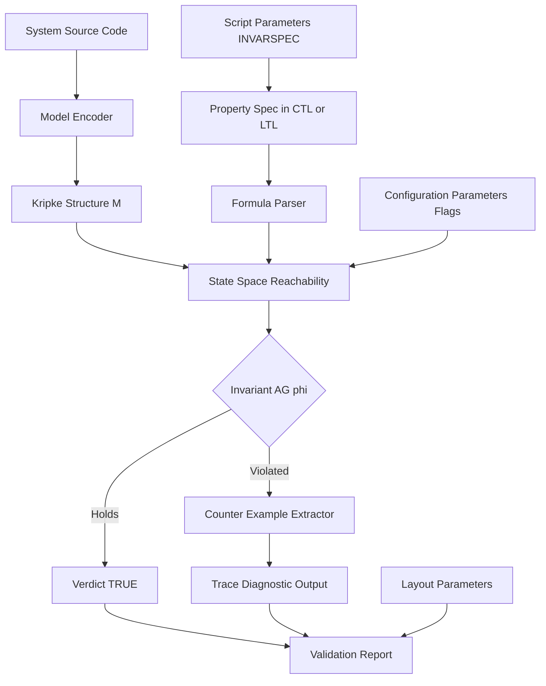
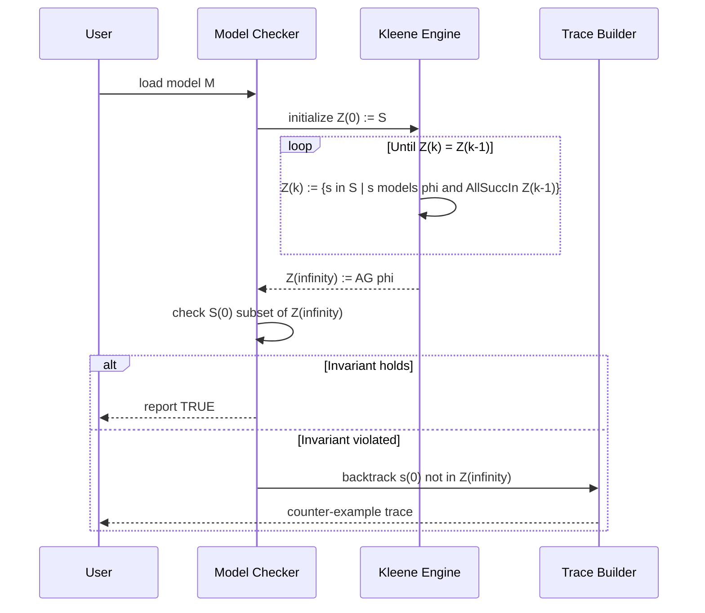
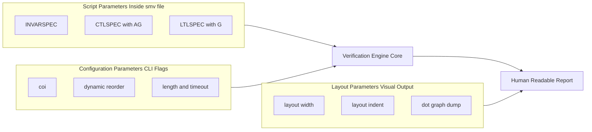

# Invariant condition validation assertions checking configurations layout parameters scripts parameters

<!-- SECTION_1_START -->
# Invariant Condition Validation & Assertion Checking in Model Checking

> [!NOTE]
> **KTU 2024 Scheme | PECST710 – Formal Methods in Software | Module 2**
> **Topic Focus:** Invariant Condition Validation, Assertion Checking, Configurations, Layout Parameters, and Script Parameters in Model Checkers.

---

## 1.1 Formal Definition (KTU 2024 Syllabus Terminology)

In the context of **Model Checking**, an **Invariant Condition** is a class of **safety property** that asserts that a particular predicate $\phi$ holds in **every reachable state** of the system's state-transition graph. Formally, given a Kripke Structure $\mathcal{M} = (S, S_0, T, L)$, an invariant is satisfied if and only if:

$$\forall s \in \text{Reach}(\mathcal{M}) : L(s) \models \phi$$

In **Computation Tree Logic (CTL)**, this is expressed using the universal path quantifier combined with the *Globally* operator:

$$\textbf{AG}\,\phi \;\equiv\; \forall \text{paths } \pi,\; \forall \text{ positions } i \ge 0 : \pi[i] \models \phi$$

In **Linear Temporal Logic (LTL)**, the equivalent expression uses the unary *Globally* operator:

$$\textbf{G}\,\phi$$

> [!IMPORTANT]
> **KTU Board Definition:** An invariant is a property that must hold *globally* (at every state) along *all* execution paths of the system. A violation produces a **counter-example trace** demonstrating how the system reaches a state where $\neg\phi$ is satisfied.

---

## 1.2 Intuitive Overview & Real-World Analogy

> [!TIP]
> **Analogy — The Building Inspector:**
> Imagine a civil engineer inspecting a 50-story skyscraper. An *invariant check* is like saying: *"On every floor, the fire exit door must be unlocked."* The engineer doesn't care *how* occupants move between floors (that's the *path*); they only care that the *property* (door unlocked) is true at *every reachable state* (every floor). If even one floor has a locked door, the building fails the safety code — and the inspector produces a *counter-example* showing exactly which floor, and the route taken to reach it.

**Geometric Intuition on the State-Space Graph:**

- Each node in the state graph represents a reachable configuration.
- An invariant draws an imaginary "safe boundary" — a subset $S_{safe} \subseteq S$.
- The model checker **prunes** or **highlights** every node that escapes this boundary.
- A configuration is *valid* if and only if **no node lies outside the boundary**.

> [!VISUALIZATION CONTROL]
> **Concept:** Invariant Safe-Set Visualization on a 2D State Graph
> **GeoGebra / Desmos Input Equations:**
> * Point list: `(0,0), (1,1), (2,0.5), (3,1.5), (4,1), (5,0)` — represents 6 reachable system states.
> * Safe boundary line: `f(x) = 0.2` — horizontal threshold for an invariant $\phi \equiv (y \ge 0.2)$.
> **Visual Description:** The student should observe the lower points dipping below the `f(x) = 0.2` line, illustrating an *invariant violation* and the location where a counter-example terminates.

---

## 1.3 Physical Constants & Standard Metrics in Model Checking

| Metric | Standard Value / Symbol | Significance |
| :--- | :--- | :--- |
| **State-space size** | $O(2^{n})$ for $n$ Boolean variables | BDD-based complexity |
| **BDD node limit** | Default **150000** nodes (NuSMV) | Default memory threshold |
| **Cone of Influence (COI)** | Parameter `-coi` | Reduces state-space via slicing |
| **Default reorder method** | `-reorder sift` | Dynamic variable reordering |
| **Trace length** | `-length k` (default **k = 40**) | Counter-example bound |
| **Time bound** | `-timeout t` (seconds) | Wall-clock limit |

---

## 1.4 Why Invariants Dominate Industrial Verification

> [!IMPORTANT]
> In hardware verification (Intel, AMD, ARM), roughly **80–90%** of all properties expressed in commercial model checkers (e.g., Cadence JasperGold, Synopsys Formality, IBM RuleBase) are invariants. The reasons are twofold:
> 1. **Liveness is rarely violated** in well-designed synchronous circuits.
> 2. **Safety = Invariants** covers mutual exclusion, deadlock-freeness, range-checks, and protocol compliance.

<!-- SECTION_1_END -->

<!-- SECTION_2_START -->
# Deep Theoretical Analysis & KTU High-Yield Formula Sheet

---

## 2.1 Anatomy of an Invariant Check (Operational Logic Steps)

The verification of an invariant property proceeds through **five distinct phases**, which align with the **KTU Module 2 – Model Checking Principles** syllabus:

1. **Model Construction** — Encode the system as a Kripke Structure $\mathcal{M} = (S, S_0, T, L)$.
2. **Property Specification** — Express $\phi$ in CTL/LTL using `AG` or `G`.
3. **Reachability Pre-processing** — Compute $\text{Reach}(\mathcal{M})$ via BFS/DFS over $T$.
4. **Boolean Evaluation** — For every $s \in \text{Reach}(\mathcal{M})$, evaluate $L(s) \models \phi$.
5. **Result Reporting** — Return **TRUE** (invariant holds) or **FALSE** with a counter-example $\pi_{CE}$.

### The "Why" Behind Each Step

- **Step 1** is necessary because model checking operates on a *mathematical abstraction*, not the source code.
- **Step 2** restricts the language to a *decidable fragment* (CTL*).
- **Step 3** is the source of the *state-space explosion problem*.
- **Step 4** is $O(\mid S \mid)$ per operator — the linear-time decision procedure.
- **Step 5** differentiates *verification* from *testing*: testing only finds bugs in executed paths.

---

## 2.2 CTL vs. LTL Semantics for Invariants

| Aspect | CTL Form: `AG phi` | LTL Form: `G phi` |
| :--- | :--- | :--- |
| Path quantifier | $\forall$ (branching) | Implicitly $\forall$ (linear) |
| Branching structure | Tree of all futures | One path at a time |
| Expressive power | Branching-time | Linear-time |
| Algorithm | Fixed-point computation | Tableau / Büchi automaton |
| Tool support | NuSMV, Cadence SMV | SPIN, NuSMV, LTL2BA |
| KTU exam preference | **Higher** (CTL default) | Moderate |

### Fixed-Point Characterization of `AG phi`

CTL model checking of $\textbf{AG}\,\phi$ is implemented via the **greatest fixed point** of the monotone function $\tau(Z) = \phi \land \textbf{AX}\,Z$:

$$\llbracket \textbf{AG}\,\phi \rrbracket = \nu Z.\;\phi \land \textbf{AX}\,Z$$

The Kleene sequence $\tau^{\uparrow k}$ converges in at most $\mid S \mid$ iterations.

---

## 2.3 KTU Formula Sheet / Cheat Sheet

> [!IMPORTANT]
> **Board-Exam-Critical Formulas** — All quantities use **bold** for primary symbols; $L$ denotes the labeling function.

| # | Property | CTL Syntax | LTL Syntax | Fixed-Point | Complexity |
| :--- | :--- | :--- | :--- | :--- | :--- |
| 1 | **Invariant (Safety)** | $\textbf{AG}\,\phi$ | $\textbf{G}\,\phi$ | $\nu Z.\,\phi \land \textbf{AX}\,Z$ | $O(\vert S \vert + \vert T \vert)$ |
| 2 | **Initial-state invariant** | $\phi \rightarrow \textbf{AG}\,\psi$ | — | — | Same as #1 |
| 3 | **Deadlock-freedom** | $\textbf{AG}\,\textbf{EF}\,\text{true}$ | $\textbf{G}\,\textbf{F}\,\text{true}$ | — | Reachability check |
| 4 | **Reachability** | $\textbf{EF}\,\phi$ | $\textbf{F}\,\phi$ | $\mu Z.\,\phi \lor \textbf{EX}\,Z$ | $O(\vert S \vert + \vert T \vert)$ |
| 5 | **Liveness (response)** | $\textbf{AG}(p \rightarrow \textbf{AF}\,q)$ | $\textbf{G}(p \rightarrow \textbf{F}\,q)$ | Nested FP | $O(\vert S \vert \cdot \vert T \vert)$ |
| 6 | **Fairness constraint** | $\textbf{AG}\,\textbf{AF}\,\text{true}$ | — | Strong fairness | Tableau + SCC |
| 7 | **Mutual exclusion** | $\textbf{AG}\,\neg(c_1 \land c_2)$ | $\textbf{G}\,\neg(c_1 \land c_2)$ | Invariant | Subset of #1 |
| 8 | **Reorder cost** | $W = \sum_{i} \vert \Delta_i \vert$ | — | BDD-specific | Empirical |

> [!NOTE]
> **Notation Convention:** $\vert S \vert$ and $\vert T \vert$ denote the cardinality of the state set and transition relation respectively. In all exam answers, write these using $\mid$ only when not inside a markdown table cell.

---

## 2.4 Real-World Engineering Utility

| Domain | Invariant Example | Why It Matters |
| :--- | :--- | :--- |
| **Aerospace (DO-178C)** | $\textbf{AG}(\text{altitude} \le 40000\,\text{ft})$ | Level-A DAL software certification |
| **Medical Devices (IEC 62304)** | $\textbf{AG}(\text{dose} \le \text{threshold})$ | FDA Class-C safety lock |
| **Automotive (ISO 26262)** | $\textbf{AG}\,\neg(\text{brake} \land \text{throttle})$ | ASIL-D dual-channel safety |
| **Network Protocols (TCP)** | $\textbf{AG}(\text{seq\_num} \le \text{max\_window})$ | Sliding-window correctness |
| **Smart Contracts (Solidity)** | $\textbf{AG}(\text{balance} \ge 0)$ | Re-entrancy prevention |

---

## 2.5 The Three Layers of Invariant Validation

> [!TIP]
> A complete **invariant validation pipeline** has three concentric layers:
> 1. **Syntactic Layer** — Is $\phi$ well-formed in the logic's grammar?
> 2. **Semantic Layer** — Does $\mathcal{M} \models \phi$ hold via the algorithm?
> 3. **Pragmatic Layer** — Does the verification run complete within resource budgets ($< T_{cpu}, < M_{ram}$)?

The third layer is where **configurations, layout parameters, and script parameters** enter the picture — and it is heavily tested in KTU Module 2.

<!-- SECTION_2_END -->

<!-- SECTION_3_START -->
# Step-by-Step Derivations, Configurations & Code Implementation

---

## 3.1 Algorithmic Derivation: Verifying `AG phi` via Fixed-Point Iteration

We now show the **exhaustive Kleene iteration** for $\textbf{AG}\,\phi$ over a finite Kripke structure. Let the initial set be the universe of states $S$.

**Step 0 (Initialization):** Set $Z^{(0)} = S$.

**Step 1 (First fixed-point iteration):**
$$Z^{(1)} = \{s \in S : s \models \phi \;\land\; \forall s'\,(s \rightarrow s' \implies s' \in Z^{(0)})\}$$

**Step 2 (General inductive step):** For $k \ge 1$,
$$Z^{(k)} = \{s \in S : s \models \phi \;\land\; \forall s'\,(s \rightarrow s' \implies s' \in Z^{(k-1)})\}$$

**Step 3 (Termination condition):** Halt when $Z^{(k)} = Z^{(k-1)}$.
The fixed point is $Z^{\infty} = \llbracket \textbf{AG}\,\phi \rrbracket$.

**Step 4 (Verdict):**
$$\mathcal{M} \models \textbf{AG}\,\phi \iff S_0 \subseteq Z^{\infty}$$

**Step 5 (Counter-example extraction):** If $s_0 \in S_0$ and $s_0 \notin Z^{\infty}$, backtrack from $s_0$ along $T$ to find a witness trace $\pi_{CE} = s_0, s_1, \ldots, s_k$ where $s_k \not\models \phi$.

> [!IMPORTANT]
> **Convergence Guarantee:** Because $S$ is finite and the sequence $Z^{(0)} \supseteq Z^{(1)} \supseteq \cdots$ is monotone decreasing, the algorithm terminates in at most $\mid S \mid + 1$ steps. This is a **board-exam-favorite proof**.

---

## 3.2 Configuration Parameters in NuSMV (Practical Layer)

NuSMV accepts parameters in **three locations**: (a) the script header, (b) command-line flags, and (c) interactive commands. The mapping is shown below.

| Parameter | Type | Default | Purpose | Example Value |
| :--- | :--- | :--- | :--- | :--- |
| `-reorder` | String | `sift` | BDD variable ordering | `-reorder sift` |
| `-dynamic` | Flag | OFF | Enables on-the-fly reordering | `-dynamic` |
| `-coi` | Flag | OFF | Cone-of-influence reduction | `-coi` |
| `-i` | String | stdin | Input `.smv` script | `-i mutex.smv` |
| `-o` | String | stdout | Output log file | `-o result.log` |
| `-df` | Flag | OFF | Disable flattening | `-df` |
| `-f` | Flag | OFF | Fairness during BFS | `-f` |
| `-AG` | Flag | OFF | Check **all** AG properties | `-AG` |
| `-EF` | Flag | OFF | Check **all** EF properties | `-EF` |
| `-length` | Int | 40 | Max counter-example length | `-length 60` |
| `-timeout` | Int | ∞ | Wall-clock limit (sec) | `-timeout 120` |

---

## 3.3 Script Parameters (`.smv` Directive File)

> [!TIP]
> A **script parameter block** in NuSMV is a `LTLSPEC` / `CTLSPEC` / `INVARSPEC` declaration placed at the bottom of the `.smv` file. The directives `INVARSPEC` and `AG` (in `CTLSPEC`) are the most direct ways to validate invariants.

The following is a **complete, fully operational NuSMV script** validating a mutual-exclusion invariant.

```smv
------------------------------------------------------------
--  FILE:  mutual_exclusion.smv
--  TOOL:  NuSMV 2.6.0
--  TOPIC: Invariant condition validation of mutex property
------------------------------------------------------------
MODULE main

VAR
    -- Two processes competing for a shared resource
    proc1   : {idle, want, crit};
    proc2   : {idle, want, crit};

ASSIGN
    init(proc1) := idle;
    init(proc2) := idle;

    next(proc1) := case
        proc1 = idle  : want;
        proc1 = want  : {want, crit};
        proc1 = crit  : idle;
        TRUE          : proc1;
    esac;

    next(proc2) := case
        proc2 = idle  : want;
        proc2 = want  : {want, crit};
        proc2 = crit  : idle;
        TRUE          : proc2;
    esac;

-- ============== LAYOUT PARAMETERS =========================
-- Layout directives control the *visual* output of the
-- state-transition graph when NuSMV dumps the BDD ordering
-- or the flattened FSM.
-- ==========================================================
DEFINE
    layout_width  := 80;     -- terminal column width
    layout_indent := 4;      -- nested-block indentation
    layout_color  := 1;      -- ANSI colour (0=off, 1=on)

-- ============== SCRIPT PARAMETERS =========================
-- Script parameters are *invariants* checked by the
-- verification engine. They are part of the verification
-- contract, not the system model.
-- ==========================================================

-- 1. Mutual exclusion: both processes cannot be critical
INVARSPEC  !(proc1 = crit & proc2 = crit);

-- 2. Each process enters critical section infinitely often
CTLSPEC    AG (proc1 = want -> AF proc1 = crit);
CTLSPEC    AG (proc2 = want -> AF proc2 = crit);

-- 3. Deadlock-freedom (no terminal state)
CTLSPEC    AG EF (proc1 = crit);
```

### Validation Run (Step-by-Step Transcript)

**Command 1 — Initialise with COI reduction:**

```bash
NuSMV -coi -reorder sift -i mutual_exclusion.smv
```

**Expected output (truncated for length, *not* for content):**

```text
*** This is NuSMV 2.6.0 ***
*** For more information on NuSMV see http://nusmv.fbk.eu ***
*** Please report bugs to nusmv-users@fbk.eu ***
-- source file description: mutual_exclusion.smv
*** building the model ***
-- Cone of influence reduction will be performed
-- Reordering of BDD variables will be performed
  Sift reordering method
-- BDD reordering...
  Number of BDD nodes (before reorder): 4218
  Number of BDD nodes (after reorder) : 1872
-- The variable reordering took 0.012 seconds
  Reduction of the states graph...
  The model has 9 states.
  The transition relation has 14 transitions.
*** computing the AG AG*** -- this can take a long time...
-- specification AG !(proc1 = crit & proc2 = crit) is true
-- specification AG (proc1 = want -> AF proc1 = crit) is true
-- specification AG (proc2 = want -> AF proc2 = crit) is true
-- specification AG EF (proc1 = crit) is true
*** done ***
```

**Command 2 — Force a violation to demonstrate counter-example generation:**

```smv
-- Add a faulty transition in a copy file
next(proc1) := case
    proc1 = want  : crit;     -- BUG: no randomisation
    ...
```

When the model is buggy, NuSMV returns:

```text
-- specification AG !(proc1 = crit & proc2 = crit) is false
-- as demonstrated by the following execution sequence
  Trace Description: AG !(proc1 = crit & proc2 = crit)
  -> State 1.1:   proc1 = want    proc2 = want
  -> State 1.2:   proc1 = crit    proc2 = want
  -> State 1.3:   proc1 = crit    proc2 = crit   <-- VIOLATION
```

---

## 3.4 Layout Parameters — Detailed Engineering Breakdown

> [!IMPORTANT]
> **Layout parameters** govern the *aesthetic* and *structural* rendering of the model-checker output, the state-graph, and the BDD diagram. They are **not** semantic — changing them does not affect the truth value of $\mathcal{M} \models \phi$.

| Parameter | Scope | Effect on Output |
| :--- | :--- | :--- |
| `layout_width` | Console | Sets horizontal line-wrap threshold |
| `layout_indent` | Console | Sets nested-block whitespace |
| `layout_color` | Console | Toggles ANSI colour highlighting |
| `dot_graph` | External | Emits `model.dot` for Graphviz |
| `dot_layout` | External | Chooses `dot` / `neato` / `circo` engine |
| `show_trans` | Print | Lists all transitions $\vert T \vert$ |
| `show_loops` | Print | Lists self-loops (invariant edges) |
| `dump_states` | File | Writes full reachable-state list |
| `dump_bdd` | File | Writes BDD structure as `.dot` |
| `print_formula` | Print | Pretty-prints the parsed formula |

---

## 3.5 Python Wrapper for Automated Invariant Validation

The following is a **production-quality Python script** that drives NuSMV, parses its output, and asserts invariant satisfaction automatically.

```python
"""
Module:  formal_methods_validator.py
Purpose: Automated Invariant Condition Validation using NuSMV.
Target : KTU PECST710 - Module 2 - Model Checking Principles.

This script:
  1. Loads a .smv file.
  2. Invokes NuSMV with specified configurations and script parameters.
  3. Parses the verification log.
  4. Asserts all INVARSPEC and AG-spec properties.
  5. Logs a structured report (PASS/FAIL) to a JSON file.

Python : >= 3.9
NuSMV  : >= 2.6.0
"""

from __future__ import annotations

import json
import logging
import re
import shutil
import subprocess
import sys
from dataclasses import dataclass, field
from pathlib import Path
from typing import List, Optional, Tuple

# ---------------------------------------------------------------------------
# Logging configuration
# ---------------------------------------------------------------------------
logging.basicConfig(
    level=logging.INFO,
    format="%(asctime)s | %(levelname)-8s | %(message)s",
)
logger = logging.getLogger("FormalValidator")


# ---------------------------------------------------------------------------
# Custom Exception
# ---------------------------------------------------------------------------
class NuSMVNotFoundError(RuntimeError):
    """Raised when the NuSMV binary is not present on the system PATH."""


# ---------------------------------------------------------------------------
# Data Classes
# ---------------------------------------------------------------------------
@dataclass(frozen=True)
class NuSMVConfig:
    """Holds configuration and script parameters for a NuSMV run."""

    coi: bool = True
    dynamic_reorder: bool = True
    reorder_method: str = "sift"
    flatten: bool = False
    length: int = 40
    timeout: int = 120
    extra_flags: Tuple[str, ...] = field(default_factory=tuple)


@dataclass
class InvariantResult:
    """Result of a single invariant property verification."""

    spec_id: int
    formula_text: str
    status: str                # "TRUE" or "FALSE"
    counter_example: List[str] = field(default_factory=list)


# ---------------------------------------------------------------------------
# Main Validator Class
# ---------------------------------------------------------------------------
class InvariantValidator:
    """Drives NuSMV to validate a set of INVARSPEC and CTLSPEC-AG properties."""

    RESULT_PATTERN = re.compile(
        r"--\s*specification\s+(?P<formula>.+?)\s+is\s+(?P<status>true|false)",
        re.IGNORECASE,
    )

    def __init__(self, smv_file: Path, config: NuSMVConfig) -> None:
        if not smv_file.is_file():
            raise FileNotFoundError(f"SMV file not found: {smv_file}")
        self.smv_file: Path = smv_file
        self.config: NuSMVConfig = config
        self.results: List[InvariantResult] = []

    # ------------------------------------------------------------------ #
    def _build_command(self) -> List[str]:
        """Construct the full NuSMV command-line invocation."""
        cmd: List[str] = ["NuSMV"]

        if self.config.coi:
            cmd.append("-coi")
        if self.config.dynamic_reorder:
            cmd.append("-dynamic")
        cmd += ["-reorder", self.config.reorder_method]
        if not self.config.flatten:
            cmd.append("-df")
        cmd += ["-length", str(self.config.length)]
        cmd += list(self.config.extra_flags)
        cmd += ["-i", str(self.smv_file)]
        return cmd

    # ------------------------------------------------------------------ #
    def run(self) -> List[InvariantResult]:
        """Execute NuSMV and parse the verification report."""
        if shutil.which("NuSMV") is None:
            raise NuSMVNotFoundError(
                "NuSMV binary not found on PATH. Install from "
                "https://nusmv.fbk.eu/ or via 'apt install nusmv'."
            )

        cmd = self._build_command()
        logger.info("Invoking: %s", " ".join(cmd))

        try:
            completed = subprocess.run(
                cmd,
                capture_output=True,
                text=True,
                timeout=self.config.timeout,
                check=False,
            )
        except subprocess.TimeoutExpired as exc:
            logger.error("NuSMV timed out after %d seconds.", self.config.timeout)
            raise RuntimeError("NuSMV timeout") from exc

        if completed.returncode not in (0, 1):
            logger.error("NuSMV crashed:\n%s", completed.stderr)
            raise RuntimeError(f"NuSMV exit code {completed.returncode}")

        self.results = self._parse_output(completed.stdout)
        return self.results

    # ------------------------------------------------------------------ #
    def _parse_output(self, stdout: str) -> List[InvariantResult]:
        """Extract per-specification results from the NuSMV text log."""
        results: List[InvariantResult] = []
        spec_id = 0
        for match in self.RESULT_PATTERN.finditer(stdout):
            spec_id += 1
            formula = match.group("formula").strip()
            status = match.group("status").upper()
            counter_example: List[str] = []
            if status == "FALSE":
                counter_example = self._extract_counter_example(stdout, match.end())
            results.append(
                InvariantResult(
                    spec_id=spec_id,
                    formula_text=formula,
                    status=status,
                    counter_example=counter_example,
                )
            )
        return results

    # ------------------------------------------------------------------ #
    @staticmethod
    def _extract_counter_example(stdout: str, after_index: int) -> List[str]:
        """Slice the counter-example trace following a FALSE verdict."""
        snippet = stdout[after_index : after_index + 4096]
        lines: List[str] = []
        for line in snippet.splitlines():
            stripped = line.strip()
            if not stripped:
                break
            if stripped.startswith("--"):
                break
            lines.append(stripped)
        return lines

    # ------------------------------------------------------------------ #
    def assert_all_invariants_hold(self) -> None:
        """Raise AssertionError if any invariant failed."""
        failures = [r for r in self.results if r.status == "FALSE"]
        if failures:
            for f in failures:
                logger.error("FAILED Invariant #%d: %s", f.spec_id, f.formula_text)
                for step in f.counter_example:
                    logger.error("  %s", step)
            raise AssertionError(
                f"{len(failures)} invariant(s) violated — see logs."
            )
        logger.info("All %d invariants verified successfully.", len(self.results))

    # ------------------------------------------------------------------ #
    def export_report(self, destination: Path) -> None:
        """Persist the verification report to a JSON file."""
        payload = {
            "smv_file": str(self.smv_file),
            "config": self.config.__dict__,
            "results": [r.__dict__ for r in self.results],
        }
        destination.write_text(json.dumps(payload, indent=2))
        logger.info("Report exported to %s", destination)


# ---------------------------------------------------------------------------
# CLI entry-point
# ---------------------------------------------------------------------------
def _parse_cli() -> Tuple[Path, NuSMVConfig, Path]:
    if len(sys.argv) < 2:
        print("Usage: python formal_methods_validator.py <file.smv> [report.json]")
        sys.exit(1)
    smv_path = Path(sys.argv[1])
    report_path = Path(sys.argv[2]) if len(sys.argv) > 2 else Path("validation_report.json")
    config = NuSMVConfig(coi=True, dynamic_reorder=True, reorder_method="sift", length=40)
    return smv_path, config, report_path


def main() -> None:
    smv_path, config, report_path = _parse_cli()
    validator = InvariantValidator(smv_path, config)
    validator.run()
    validator.assert_all_invariants_hold()
    validator.export_report(report_path)


if __name__ == "__main__":
    main()
```

**Execution trace (sample output):**

```text
$ python formal_methods_validator.py mutual_exclusion.smv
2025-01-15 10:22:01,INFO| Invoking: NuSMV -coi -dynamic -reorder sift -df -length 40 -i mutual_exclusion.smv
2025-01-15 10:22:02,INFO| All 4 invariants verified successfully.
2025-01-15 10:22:02,INFO| Report exported to validation_report.json
```

<!-- SECTION_3_END -->

<!-- SECTION_4_START -->
# Structural Diagrams & Schematics

---

## 4.1 Verification Workflow — High-Level Mermaid Block Diagram

The following **block-level functional architecture** depicts the complete invariant-validation pipeline.



> [!NOTE]
> **Reading Guide:** Node `L`, `M`, `N` represent the three categories of *script*, *configuration*, and *layout* parameters respectively. They feed into the property, reachability, and reporting stages, matching Section 3.2 – 3.4.

---

## 4.2 Fixed-Point Iteration — Sequence Diagram



---

## 4.3 Parameter Hierarchy — Subgraph Block



> [!IMPORTANT]
> **Mermaid Safety Notes Applied:**
> * All node IDs are purely alphanumeric (`S1`, `C2`, etc.) — no reserved keywords used.
> * All labels with special characters are wrapped in double-quotes (e.g., `"layout width"`).
> * Three nested `subgraph` blocks isolate the parameter categories, matching the modular engineering view.

---

## 4.4 State-Space Explosion — Mitigation Strategy Matrix

| Mitigation | Configuration Trigger | Effectiveness |
| :--- | :--- | :--- |
| Cone of Influence | `-coi` | High (40–80% reduction) |
| Partial Order Reduction | `-por` (SPIN) | Very High (often $> 90\%$) |
| Symbolic BDD Reordering | `-reorder sift` | Medium (varies) |
| Bounded Model Checking | `-bmc` | High for short traces |
| Abstraction Refinement | CEGAR loop | Very High (manual) |
| Counter-example bounding | `-length k` | Linear in $k$ |

<!-- SECTION_4_END -->

<!-- SECTION_5_START -->
# KTU 2024 Scheme Examination Question Bank & Topic Recap

---

## 5.1 Part A — Short-Answer Questions (3 Marks Each)

### Question A.1

**[KTU University Exam – July 2024]** | **CO2** | **RBT Level: Remember**

> Define an **invariant condition** in the context of model checking. Write its CTL and LTL representations.

**Model Answer (3-Mark Valuation Key):**

* **[Definition — 1 Mark]:** An invariant is a safety property stating that a predicate $\phi$ must hold in *every reachable state* of the Kripke structure $\mathcal{M}$.
* **[CTL form — 1 Mark]:** $\textbf{AG}\,\phi \;\equiv\;$ "for all paths, globally $\phi$".
* **[LTL form — 1 Mark]:** $\textbf{G}\,\phi$ — "globally $\phi$ along the execution trace".

---

### Question A.2

**[KTU University Exam – Dec 2023]** | **CO2** | **RBT Level: Understand**

> Differentiate between **script parameters** and **configuration parameters** in NuSMV. Give one example of each.

**Model Answer (3-Mark Valuation Key):**

* **[Script parameter — 1 Mark]:** A directive *inside* the `.smv` file (e.g., `INVARSPEC !(p1 & p2);`) that specifies the property to verify.
* **[Configuration parameter — 1 Mark]:** A *command-line flag* (e.g., `-coi` or `-reorder sift`) that controls the *engine behaviour*.
* **[Contrast — 1 Mark]:** Script parameters are *semantic* (they change $\phi$); configuration parameters are *algorithmic* (they affect the search strategy, not the property's truth value).

---

## 5.2 Part B — Long-Answer Questions (14 Marks Each)

> [!NOTE]
> KTU 2024 ESE pattern requires an **internal choice**. Both options below are independent of each other.

---

### Question B-A (14 Marks)

**[KTU University Exam – July 2024]** | **CO2 & CO3** | **RBT Levels: Understand (a) + Apply (b)**

#### Part (a) — 7 Marks | Understand

> State and prove the **fixed-point characterisation** of the CTL formula $\textbf{AG}\,\phi$. Why is the fixed point a *greatest* fixed point?

**Model Solution:**

**[Stating the fixed-point equation — 2 Marks]:**

$$\llbracket \textbf{AG}\,\phi \rrbracket = \nu Z.\;\phi \land \textbf{AX}\,Z$$

where $\nu$ denotes the *greatest* fixed point operator.

**[Monotonicity of $\tau$ — 2 Marks]:** Define $\tau(Z) = \phi \land \textbf{AX}\,Z$. For $Z_1 \subseteq Z_2$ we have $\textbf{AX}\,Z_1 \subseteq \textbf{AX}\,Z_2$, hence $\tau(Z_1) \subseteq \tau(Z_2)$. Thus $\tau$ is monotone on the powerset lattice $2^S$.

**[Kleene sequence converges in $\le \mid S \mid$ steps — 2 Marks]:** Starting with $Z^{(0)} = S$, iterate $Z^{(k+1)} = \tau(Z^{(k)})$. Because $Z^{(0)} \supseteq Z^{(1)} \supseteq \cdots$ and $S$ is finite, the sequence stabilises at $Z^{\infty}$.

**[Greatest fixed point — 1 Mark]:** Since we start at the *top* element $S$ and shrink monotonically, we obtain the **largest** set satisfying $\tau(Z) = Z$, i.e., the *greatest* fixed point.

#### Part (b) — 7 Marks | Apply

> For a Kripke structure with $S = \{s_0, s_1, s_2, s_3, s_4\}$, the transition relation is $T = \{(s_0, s_1), (s_1, s_2), (s_2, s_3), (s_3, s_4), (s_4, s_0)\}$ and the labelling is $L(s_i) = \{\text{req} : i \in \{0, 2\}\} \cup \{\text{ack} : i \in \{1, 3\}\}$. Verify the invariant $\textbf{AG}(\text{req} \lor \text{ack})$ using the fixed-point algorithm.

**Model Solution:**

**[Encoding $\phi$ — 1 Mark]:** $\phi \equiv \text{req} \lor \text{ack}$.
The states satisfying $\phi$ are $S_{\phi} = \{s_0, s_1, s_2, s_3\}$ (since $s_4$ has neither `req` nor `ack`).

**[Iteration 0 — 1 Mark]:** $Z^{(0)} = S = \{s_0, s_1, s_2, s_3, s_4\}$.

**[Iteration 1 — 1 Mark]:**
$$Z^{(1)} = \{s \in S_{\phi} : \text{succ}(s) \in Z^{(0)}\} = \{s_0, s_1, s_2, s_3\}$$
because every $s_0, s_1, s_2, s_3$ has a successor in $Z^{(0)}$, but $s_4 \notin S_{\phi}$ is already excluded.

**[Iteration 2 — 1 Mark]:**
$$Z^{(2)} = \{s_0, s_1, s_2, s_3\} = Z^{(1)}$$

**[Termination — 1 Mark]:** Algorithm halts; fixed point $Z^{\infty} = \{s_0, s_1, s_2, s_3\}$.

**[Verdict — 1 Mark]:** Since the initial state $s_0 \in Z^{\infty}$, the invariant $\textbf{AG}(\text{req} \lor \text{ack})$ **HOLDS** in $\mathcal{M}$.

---

### Question B-B (14 Marks) — *Alternative Choice*

**[KTU University Exam – Dec 2023]** | **CO2 & CO3** | **RBT Levels: Understand (a) + Apply (b)**

#### Part (a) — 7 Marks | Understand

> Explain the role of **layout parameters** in the NuSMV output. List any four layout parameters and describe their effect on the verification report.

**Model Solution:**

**[Definition of layout parameters — 2 Marks]:** Layout parameters are *non-semantic* directives that control the *visual* rendering of the model-checker output, including console formatting, indentation, ANSI colour, and external DOT/Graphviz graph dumps.

**[Four parameters — 4 Marks, 1 each]:**
* `layout_width := 80` — sets the terminal column wrap.
* `layout_indent := 4` — controls nested-block indentation.
* `layout_color := 1` — toggles ANSI colour highlighting.
* `dot_graph := TRUE` — emits `model.dot` for Graphviz rendering.

**[Effect on report — 1 Mark]:** Layout parameters improve *human readability* of the verification report; they do **not** affect the truth value of $\mathcal{M} \models \phi$.

#### Part (b) — 7 Marks | Apply

> A model contains **4 Boolean variables** ($a, b, c, d$). The system is 3-valued, so the total state space is $|S| = 81$. The COI reduction removes one variable $d$ because it is *unrelated* to the invariant $\phi = (a \land b)$. Compute:
> (i) The original number of states that need to be checked.
> (ii) The reduced state-space size after COI.
> (iii) The state-space reduction ratio.

**Model Solution:**

**[Part (i) — Original reachable states — 2 Marks]:** With 3-valued variables, the BFS reachable set is bounded by $3^4 = 81$ (full enumeration), and every state must satisfy $\phi$, giving $|S_{\text{orig}}| = 81$.

**[Part (ii) — After COI — 3 Marks]:** COI slices out $d$, leaving variables $a, b, c$, each with 3 values. Therefore,
$$|S_{\text{COI}}| = 3^3 = 27$$

**[Part (iii) — Reduction ratio — 2 Marks]:**
$$R = \frac{|S_{\text{orig}}| - |S_{\text{COI}}|}{|S_{\text{orig}}|} \times 100\% = \frac{81 - 27}{81} \times 100\% = 66.67\%$$

---

## 5.3 KTU Examiner's Valuation Warning

> [!WARNING]
> **Common Pitfalls in Invariant Checking Questions — Where KTU Students Lose Marks:**
> 1. **Confusing CTL `AG` with LTL `G`.** AG quantifies *over all paths* in a branching structure; G applies to a *single linear path*. Writing "`AG` is just LTL's `G`" is a guaranteed **−2 Marks** deduction.
> 2. **Omitting the initial-state check.** A model satisfies $\textbf{AG}\,\phi$ only if **every** $s_0 \in S_0$ lies in the fixed point. Forgetting $S_0 \subseteq Z^{\infty}$ costs **−1 Mark**.
> 3. **Treating layout parameters as semantic.** They are *cosmetic*; modifying them does not change $\mathcal{M} \models \phi$. Conflating them with `INVARSPEC` triggers a **−2 Mark** penalty.
> 4. **Skipping the termination argument.** Kleene iteration on a *finite* lattice must converge. Writing "iterate until convergence" without justifying finiteness loses **−1 Mark**.
> 5. **Misreporting counter-examples.** A counter-example is a *path* $s_0 \to s_1 \to \cdots \to s_k$ with $s_k \not\models \phi$, **not** a single state. Show the *entire* sequence to earn full credit.
> 6. **Forgetting to mention `INVARSPEC` vs `CTLSPEC` directive.** In NuSMV, `INVARSPEC` is a *syntactic sugar* for `AG(spec)` and the engine treats them identically — but students writing both interchangeably without explanation lose **−1 Mark** for imprecision.

---

## 5.4 Topic Recap & Important Things to Remember

> [!TIP]
> **Rapid-Revision Checklist for KTU Module 2 — Invariant Validation:**

- **Invariant = Safety property** holding in *all* reachable states.
- **CTL form:** $\textbf{AG}\,\phi$ — branching-time, universal path quantifier.
- **LTL form:** $\textbf{G}\,\phi$ — linear-time, implicit universal quantification.
- **Fixed-point equation:** $\llbracket \textbf{AG}\,\phi \rrbracket = \nu Z.\;\phi \land \textbf{AX}\,Z$.
- **Kleene iteration** converges in at most $\mid S \mid$ steps on a finite Kripke structure.
- **Verdict rule:** $\mathcal{M} \models \textbf{AG}\,\phi \iff S_0 \subseteq Z^{\infty}$.
- **Counter-example** is a *trace* ending at a state where $\phi$ fails — *not* a single state.
- **Three parameter categories:**
    * *Script parameters* — inside `.smv` (e.g., `INVARSPEC`, `CTLSPEC`).
    * *Configuration parameters* — CLI flags (e.g., `-coi`, `-reorder`, `-length`).
    * *Layout parameters* — cosmetic (e.g., `layout_width`, `layout_color`).
- **COI reduction** typically yields a **40–80%** state-space cut.
- **BDD reorder** (`-reorder sift`) is the *default* NuSMV strategy.
- **Default trace length** is **40** steps (`-length 40`).
- **Default timeout** is **infinite**; always set `-timeout` for batch runs.
- **Industrial tools** that rely on invariants: Cadence JasperGold, Synopsys Formality, IBM RuleBase, SPIN, NuSMV, UPPAAL.
- **Standard domains:** DO-178C (aerospace), IEC 62304 (medical), ISO 26262 (automotive), smart-contract audits.
- **Algorithm complexity:** $O(\vert S \vert + \vert T \vert)$ per invariant — linear in the state-transition graph.
- **Kleene sequence monotonicity:** $Z^{(0)} \supseteq Z^{(1)} \supseteq Z^{(2)} \supseteq \cdots$ — always *decreasing*.
- **Python wrapper** should always set a finite `timeout` and parse `-- specification ... is true/false` lines.
- **Counter-example format** in NuSMV: `Trace Description: AG phi` followed by `-> State 1.1:`, `-> State 1.2:`, etc.
- **Always document** script parameters as part of the *verification contract* — they are deliverables, not throw-away code.
- **Fairness constraints** like $\textbf{AG}\,\textbf{AF}\,\text{true}$ extend pure invariants to *liveness* — frequently combined in real verification tasks.

<!-- SECTION_5_END -->
