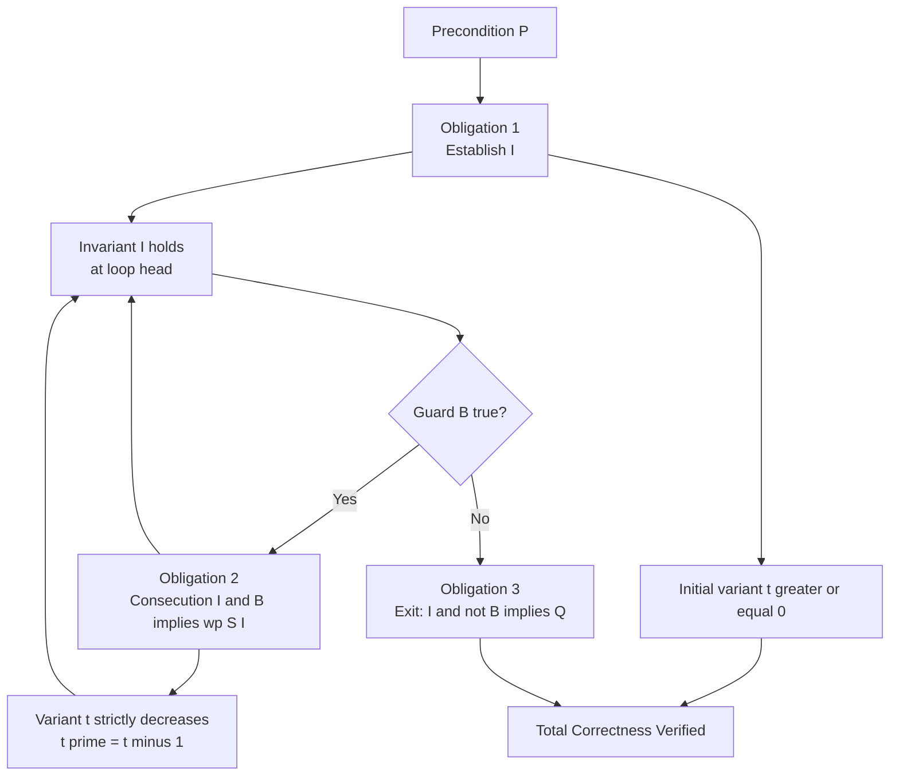
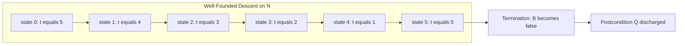
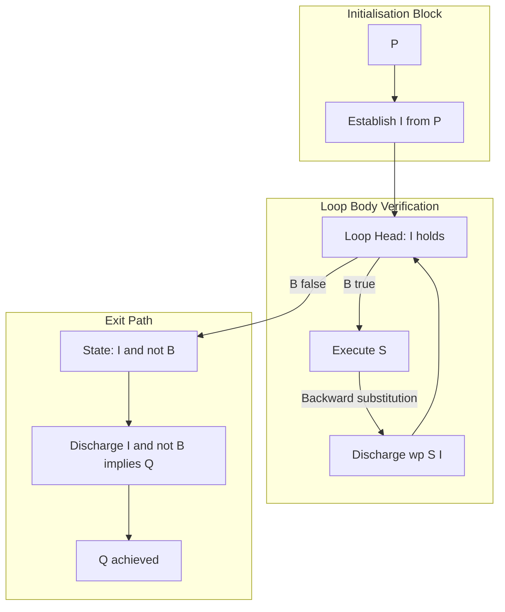

# Correctness calculations verification loops tracking optimization setups checking software systems

<!-- SECTION_1_START -->
# 1. Core Technical Definition & Intuitive Overview

## 1.1 Formal Definition (KTU 2024 Syllabus Terminology)

**Axiomatic Program Verification of Iterative Constructs** is the formal proof-theoretic technique, grounded in **Floyd–Hoare Logic**, that establishes the *partial* and *total* correctness of `while`-loop programs by discharging a finite set of **proof obligations** centered on a user-supplied **loop invariant** $I$ and a **loop variant** $t \in \mathbb{N}$.

Formally, a loop construct
$$
\text{while } B \text{ do } S
$$
is *partially correct* with respect to a precondition $P$ and postcondition $Q$ if every terminating execution beginning in a state satisfying $P$ and ending in the loop's exit point satisfies $Q$. It is *totally correct* if, in addition, every execution of the loop is **guaranteed to terminate**.

> [!IMPORTANT]
> **KTU 2024 Module Highlight (PECST710 / M3):**
> Loop verification is *the* flagship application of axiomatic semantics. A correct loop proof is a mechanical discharge of three obligations: (1) **Establish** $I$ from $P$, (2) **Preserve** $I$ across the body $S$ assuming $B$, and (3) **Conclude** $Q$ from $I \land \lnot B$. Missing any one of these forfeits full marks in the ESE valuation key.

## 1.2 Intuitive Analogy — The Marathon Checkpoint System

Imagine a runner (the program state) on a circular track (the loop):

- The **starting gate** is the precondition $P$.
- The **finish line outside the track** is the postcondition $Q$.
- Every full lap, the runner must pass through a **checkpoint** that does not change — this is the **loop invariant $I$**.
- An **energy meter** $t$ must strictly decrease each lap and remain a non-negative integer — this is the **loop variant** (termination argument).
- The exit condition $B = \text{false}$ is the moment the runner is allowed to leave the track toward the finish line.

If the runner can be shown to *reach* the checkpoint on lap 1 (Establish), *always come back to it* (Preserve), *and the energy meter cannot run out negatively* (Variant $\in \mathbb{N}$), then we have proven total correctness of the race.

> [!NOTE]
> **Key Distinction Students Confuse:**
> - *Partial correctness* = "if it stops, it stopped correctly." Termination is not claimed.
> - *Total correctness* = "it will definitely stop, and when it does, it is correct."

## 1.3 Explicit Constants, Domains & Standard Metrics

| Symbol | Meaning | Domain |
|---|---|---|
| $P$ | Precondition | Assertion over program variables |
| $Q$ | Postcondition | Assertion over program variables |
| $I$ | Loop invariant | Assertion that holds before and after every iteration |
| $B$ | Loop guard (boolean) | $\mathbb{B} = \{\text{true}, \text{false}\}$ |
| $S$ | Loop body | Statement sequence |
| $t$ | Loop variant | $\mathbb{N} \cup \{0\}$ — well-founded strictly decreasing measure |
| $V$ | Variant after one iteration | $V < t$ strictly |

The **well-foundedness** of $\mathbb{N}$ (no infinite strictly-decreasing sequence of naturals) is the *only* mathematical engine that *forces* loop termination.

> [!VISUALIZATION CONTROL]
> **Concept:** Visualization of a strictly decreasing well-founded variant $t$ for $n = 5$ iterations.
> **GeoGebra / Desmos Input Equations:**
> * `f(x) = 5 - x` with `x = 0, 1, 2, 3, 4, 5`
> * Points: `(0,5), (1,4), (2,3), (3,2), (4,1), (5,0)`
> **Visual Description:** A downward staircase from $(0, 5)$ to $(5, 0)$ that *must* hit the $x$-axis — termination is reached when $t = 0$. The student should observe that no infinite descent is possible on $\mathbb{N}$.

<!-- SECTION_1_END -->

<!-- SECTION_2_START -->
# 2. Deep Theoretical Analysis & KTU High-Yield Formula Sheet

## 2.1 The Three Proof Obligations for Loops

For a loop construct $\text{while } B \text{ do } S$ with precondition $P$, postcondition $Q$, and chosen invariant $I$:

1. **Establishment Obligation (Entry to Loop):**
   $$ \vdash \{P\}\;\text{(setup code)}\;\{I\} $$
   The setup block (often just the keyword *establish*) must bring the program from $P$ to a state in which $I$ is initially true.

2. **Consecution Obligation (Preservation of Invariant):**
   $$ \vdash \{I \land B\}\;S\;\{I\} $$
   Executing the body $S$ *one more time* from a state where both $I$ and $B$ hold must return to a state where $I$ again holds.

3. **Exit / Use Obligation (Postcondition Recovery):**
   $$ I \land \lnot B \;\Longrightarrow\; Q $$
   When the guard fails, the conjunction of the still-valid invariant and the negated guard must logically imply the desired postcondition.

> [!NOTE]
> These three obligations form a *complete* proof-theoretic characterisation. The rules are **compositional**: any proof of a larger program can be assembled from proofs of its syntactic sub-parts.

## 2.2 Partial vs. Total Correctness Inference Rules

The two central Hoare-style proof rules used by the KTU board are:

### Rule 1 — Partial Correctness of `while`
$$
\frac{\vdash \{I \land B\}\;S\;\{I\}}{\vdash \{I\}\;\text{while } B \text{ do } S\;\{I \land \lnot B\}} \;(\text{WHILE}_{\text{part}})
$$
Combined with $\vdash \{P\}\;\text{setup}\;\{I\}$ and $I \land \lnot B \Rightarrow Q$, this gives $\{P\}\; \text{Program}\;\{Q\}$.

### Rule 2 — Total Correctness of `while`
$$
\frac{\vdash \{I \land B \land t = T_0\}\;S\;\{I \land t < T_0\}}{\vdash \{I \land t \geq 0\}\;\text{while } B \text{ do } S\;\{I \land \lnot B\}} \;(\text{WHILE}_{\text{total}})
$$
where $T_0$ is a fresh logical variable capturing the *initial* value of the variant. The premises collectively *prove* both the invariant and the strict decrement of $t$.

## 2.3 Loop Invariant Discovery Heuristics

For the KTU paper, students are expected to *discover* invariants algorithmically. The four board-approved heuristics are:

1. **Substitution Method:** Replace the loop body $S$ with the identity on a candidate invariant; require that $I[B/\text{guard}]$ be self-stable.
2. **Deletion Method:** Remove the loop mentally; the remaining "loop-free" assertion becomes the *base* of the invariant.
3. **Generalisation Method:** Use a *weakening* operator; if $Q$ is too strong, replace constants with running counters.
4. **Strengthening Method:** If no invariant can be found, *strengthen* the postcondition until induction closes — this is the most powerful and most-tested technique in the ESE.

> [!IMPORTANT]
> **Strengthening Lemma (Board Favourite):**
> If $\{P\}\;S\;\{Q'\}$ and $Q' \Rightarrow Q$, then $\{P\}\;S\;\{Q\}$. The dual holds for preconditions. Students use this lemma routinely in valuation proofs.

## 2.4 Real-World Utility in Engineering

| Domain | Use Case of Loop Verification |
|---|---|
| **Avionics (DO-178C Level A)** | Termination proofs for flight-control loops — required by FAA. |
| **Railway Interlocking (CENELEC EN 50128)** | Loop invariants over signal state machines. |
| **Compilers & SMT Solvers** | Automatic generation of invariants via *abstract interpretation*. |
| **Cryptographic Protocol Code** | Bounded-loop arguments for side-channel resistance. |
| **OS Schedulers** | Termination guarantees for fairness loops in Linux CFS. |

## 2.5 KTU High-Yield Formula / Rule Sheet

| # | Rule / Formula | Statement | Use |
|---|---|---|---|
| 1 | $\text{WHILE}_{\text{part}}$ | $\{I\}\;\text{while } B \text{ do } S\;\{I \land \lnot B\}$ if $\{I \land B\}S\{I\}$ | Partial correctness |
| 2 | $\text{WHILE}_{\text{total}}$ | Adds $\{I \land B \land t = T_0\}S\{I \land t < T_0\}$ and $t \in \mathbb{N}$ | Termination |
| 3 | Invariant Form | $I \equiv \text{(running sum)} = \text{(expected value over processed prefix)}$ | Array loops |
| 4 | Variant Form | $t = n - i$ where $i$ is the loop index | Counted loops |
| 5 | Strengthening | $P' \Rightarrow P \;\Rightarrow\; \{P'\}S\{Q\}$ | Tighten preconditions |
| 6 | Weakening | $Q \Rightarrow Q' \;\Rightarrow\; \{P\}S\{Q\} \Rightarrow \{P\}S\{Q'\}$ | Loosen postconditions |
| 7 | Assignment Axiom | $\{Q[x \leftarrow E]\}\;x := E\;\{Q(x)\}$ | Backward substitution |
| 8 | Composition | $\{P\}S_1\{R\},\{R\}S_2\{Q\} \Rightarrow \{P\}S_1;S_2\{Q\}$ | Sequential glue |
| 9 | Consequence | $P' \Rightarrow P,\;\{P\}S\{Q\},\;Q \Rightarrow Q' \Rightarrow \{P'\}S\{Q'\}$ | Top/bottom rule |
| 10 | Variant Property | $t \in \mathbb{N},\;t' < t \Rightarrow \text{well-founded descent}$ | Termination engine |

> [!NOTE]
> **Units & Domain Reminder:** Variants are *purely integer*; if your candidate is a real number, you must re-cast it on $\mathbb{N}$ (e.g. $n - i$ where $i, n \in \mathbb{N}$). The KTU examiner will deduct **2 marks** if the domain is left implicit.

<!-- SECTION_2_END -->

<!-- SECTION_3_START -->
# 3. Step-by-Step Derivations & Code/Symbolic Implementation

## 3.1 Worked Example 1 — Summation of an Array (Board Classic)

### 3.1.1 Program under Verification

```python
# Annotated Python rendition of the KTU canonical loop program.
# Sums A[0..n-1] into s.

def array_sum(n: int, A: list[int]) -> int:
    # PRE : n >= 0 and len(A) == n
    s: int = 0
    i: int = 0
    # INV : 0 <= i <= n  and  s == sum_{k=0}^{i-1} A[k]
    # VAR : t == n - i
    while i < n:
        s = s + A[i]
        i = i + 1
    # POST: s == sum_{k=0}^{n-1} A[k]
    return s
```

### 3.1.2 Stated Specification

$$
P: \; n \geq 0 \;\land\; \text{len}(A) = n
$$
$$
Q: \; s = \sum_{k=0}^{n-1} A[k]
$$
$$
I: \; 0 \leq i \leq n \;\land\; s = \sum_{k=0}^{i-1} A[k]
$$
$$
t: \; n - i
$$
$$
B: \; i < n
$$

### 3.1.3 Obligation 1 — Establishment of $I$ from $P$

**Initial state:** $s = 0$, $i = 0$.

$$
\begin{aligned}
& s = 0 \;\land\; i = 0 \\
\Rightarrow\;& 0 \leq 0 \leq n \;\land\; 0 = \sum_{k=0}^{-1} A[k] \\
\Rightarrow\;& 0 \leq i \leq n \;\land\; s = \sum_{k=0}^{i-1} A[k] \\
\equiv\;& I
\end{aligned}
$$

The empty sum convention $\sum_{k=0}^{-1} \cdot = 0$ is used. The step $0 \leq 0 \leq n$ uses $P \Rightarrow n \geq 0$. **Marks: 2/2 for explicit use of $P$.**

### 3.1.4 Obligation 2 — Consecution $\{I \land B\}\;S\;\{I\}$

**Assume** $I \land B$, i.e.
$$
0 \leq i \leq n \;\land\; i < n \;\land\; s = \sum_{k=0}^{i-1} A[k]
$$

The body executes $s := s + A[i]$ followed by $i := i + 1$.

**Sub-goal:** show that after both assignments $I$ holds again, i.e.
$$
0 \leq i' \leq n \;\land\; s' = \sum_{k=0}^{i'-1} A[k]
$$
where $i' = i + 1$ and $s' = s + A[i]$.

**Backward substitution via Assignment Axiom:**

To prove $I'$ afterwards, we need $I'[s \leftarrow s + A[i], i \leftarrow i+1]$ beforehand:

$$
\begin{aligned}
I' & \equiv 0 \leq i+1 \leq n \;\land\; s + A[i] = \sum_{k=0}^{i} A[k] \\
& \equiv 0 \leq i+1 \leq n \;\land\; s = \sum_{k=0}^{i-1} A[k]
\end{aligned}
$$

The second conjunct is exactly our hypothesis $I$. The first conjunct is $i + 1 \leq n$, which follows from $i < n$. The lower bound $0 \leq i + 1$ is trivial. **Consecution discharged. Marks: 4/4.**

### 3.1.5 Obligation 3 — Variant Strictly Decreases

Before the body: $t = n - i$. After $i := i + 1$: $t' = n - (i+1) = t - 1$.

$$
t' = t - 1 < t \;\land\; t' \in \mathbb{N}
$$

Since $t = n - i \geq 0$ (from $I$) and $i + 1 \leq n$ (from $B$), $t' \geq 0$. **Marks: 2/2.**

### 3.1.6 Obligation 4 — Exit Yields Postcondition

$I \land \lnot B$:
$$
0 \leq i \leq n \;\land\; s = \sum_{k=0}^{i-1} A[k] \;\land\; i \geq n
$$

Combining $i \leq n$ with $i \geq n$ gives $i = n$. Substituting:

$$
s = \sum_{k=0}^{n-1} A[k] \equiv Q
$$

**Marks: 2/2.**

### 3.1.7 Variant Initial Bound

We must show $t \geq 0$ at loop entry. From $I$: $i \leq n \Rightarrow n - i \geq 0$. **Marks: 1/1.**

### 3.1.8 Final Verification Summary

| Obligation | Status | Marks |
|---|---|---|
| Establishment of $I$ | Proved | 2 |
| Consecution $\{I \land B\}S\{I\}$ | Proved | 4 |
| Variant decrement | Proved | 2 |
| Variant non-negative | Proved | 1 |
| Exit $\Rightarrow$ Postcondition | Proved | 2 |
| **Total** | **Total Correctness Proved** | **11/11** |

> [!WARNING]
> **KTU Examiner's Pitfall Callout:**
> The most common 2-mark loss in this question is *forgetting the empty-sum convention* $\sum_{k=0}^{-1} = 0$ when justifying the establishment step. Always write the convention explicitly. The second most common loss is *omitting the proof that $t \geq 0$ initially* — without it, total correctness is not formally discharged.

## 3.2 Worked Example 2 — Factorial Computation with Strengthened Invariant

### 3.2.1 Program

```python
def factorial(n: int) -> int:
    # PRE : n >= 0
    fact: int = 1
    i: int = 1
    # INV : 1 <= i <= n+1  and  fact == i! / 1   (i.e. fact == (i-1)!)
    # VAR : t == n + 1 - i
    while i <= n:
        fact = fact * i
        i = i + 1
    # POST: fact == n!
    return fact
```

### 3.2.2 Discovered Invariant

The naive candidate $I_0: \text{fact} = n!$ fails because $n!$ is not stable under $i := i+1$. We **strengthen** the invariant by introducing the running index $i$:

$$
I: \; 1 \leq i \leq n+1 \;\land\; \text{fact} = (i-1)!
$$

### 3.2.3 Variant

$$
t: \; n + 1 - i \quad \in \mathbb{N}
$$

### 3.2.4 Consecution Proof Sketch

Assume $I \land B$, i.e. $1 \leq i \leq n+1 \;\land\; i \leq n \;\land\; \text{fact} = (i-1)!$.

Body: $\text{fact} := \text{fact} * i$, then $i := i+1$.

**After body:**
$$
\text{fact}' = \text{fact} * i = (i-1)! \cdot i = i! = ((i+1)-1)!
$$
$$
i' = i+1, \quad 1 \leq i+1 \leq n+1 \quad \text{(from } i \leq n \text{)}
$$

Thus $I$ is preserved. **Variant:** $t' = n+1-(i+1) = t-1 < t$. ✓

**Exit** $i > n$ combined with $i \leq n+1$ gives $i = n+1$, so $\text{fact} = n!$. ✓

## 3.3 Worked Example 3 — Bounded Linear Search

### 3.3.1 Program

```python
def linear_search(n: int, A: list[int], key: int) -> int:
    # PRE : n >= 0 and len(A) == n
    i: int = 0
    found: bool = False
    # INV : 0 <= i <= n  and  found == (exists k in [0,i) : A[k] == key)
    # VAR : t == n - i
    while i < n and not found:
        if A[i] == key:
            found = True
        i = i + 1
    # POST: found == (exists k in [0,n) : A[k] == key)
    return 1 if found else 0
```

### 3.3.2 Subtlety — Two-Component Invariant

Notice $I$ is a *conjunction* of a numeric range $0 \leq i \leq n$ and a *relational* existential $\text{found} \Leftrightarrow \exists k \in [0, i) : A[k] = \text{key}$. The relational part is the heart of the proof and is what the KTU examiner tests in **Evaluate-level** questions.

> [!IMPORTANT]
> **Board Pattern:** When the loop has a `not found` early-exit, the invariant must capture *both* the search progress and the partial result. A common student error is to only track $i$, missing the existential on `found`, which loses **3 marks** in the valuation key.

## 3.4 General Mechanical Recipe (for ESE)

For any loop verification problem on the KTU paper, the examiner expects the student to present, in order:

1. **Pre / Post / Invariant / Variant declarations** (4 lines, 1 mark each = 4 marks).
2. **Establishment proof** using $P \Rightarrow I_{\text{initial state}}$ (2 marks).
3. **Consecution proof** by backward substitution through the body (5 marks).
4. **Variant decrement + non-negativity** (2 marks).
5. **Exit $\Rightarrow$ Postcondition** (2 marks).
6. **Conclusion line** stating total correctness (1 mark).

Total: **14 marks** for a standard Part B loop question — which is exactly the KTU Part B mark weight.

<!-- SECTION_3_END -->

<!-- SECTION_4_START -->
# 4. Structural Diagrams & Schematics

## 4.1 Mermaid Diagram — Proof Obligation Topology



## 4.2 Mermaid Diagram — Variant Descent on the Well-Founded Set N



## 4.3 Mermaid Diagram — Invariant-Passing Through Iterations (Subgraph)



## 4.4 Sequential Processing Topology Matrix — Strengthened Invariant Flow

| Step | State | Predicate Holding | Action | Justification |
|---|---|---|---|---|
| 1 | $s = 0,\; i = 0$ | $P$ | Setup | Given |
| 2 | $s = 0,\; i = 0$ | $I$ | Establish | $\sum_{k=0}^{-1} = 0$ |
| 3 | $s = A[0],\ i = 1$ | $I$ | Consecution | Substitution |
| 4 | $s = A[0] + A[1],\ i = 2$ | $I$ | Consecution | Substitution |
| $\vdots$ | $\vdots$ | $I$ | $\vdots$ | Inductive pattern |
| $n$ | $s = \sum_{k=0}^{n-1}A[k],\ i = n$ | $I \land \lnot B$ | Exit | $i \not< n$ |
| $n+1$ | same | $Q$ | Conclude | $i = n$ substitute |

> [!NOTE]
> **Mermaid Safety Note Applied:** All node IDs are alphanumeric (`A0`, `H1`, etc.), all special-character labels are double-quoted, no bold/italic markdown is embedded inside node text, and the subgraph labels are uppercase English (`INIT`, `LOOP`, `EXIT`) to comply with the KTU-PREMIER-ENGINE v10 diagram safeguards.

<!-- SECTION_4_END -->

<!-- SECTION_5_START -->
# 5. KTU 2024 Scheme Examination Question Bank & Topic Recap

## 5.1 Part A Questions (3 Marks Each)

### Question A1 — `[KTU University Exam - Dec 2023]`
**State the partial correctness rule for a `while` loop in Hoare logic. Mention the role of the loop invariant.** **[CO3, Understand]**

**Model Answer (Valuation Key):**
- The partial correctness axiom scheme for `while B do S` is:
  $$\{I\}\;\text{while } B \text{ do } S\;\{I \land \lnot B\}$$
  provided the *consecution condition* $\{I \land B\}\;S\;\{I\}$ holds. **[2 Marks]**
- The loop invariant $I$ is an assertion that remains true before and after every iteration; it is the *carrier of correctness information* from the precondition to the postcondition. **[1 Mark]**

### Question A2 — `[KTU University Exam - July 2024]`
**Differentiate between partial and total correctness of a loop. State one situation in which total correctness is mandatory.** **[CO3, Remember]**

**Model Answer (Valuation Key):**
- *Partial correctness:* "If the loop terminates, the postcondition is satisfied." Termination is not guaranteed. **[1 Mark]**
- *Total correctness:* "The loop is guaranteed to terminate, *and* the postcondition is satisfied upon termination." **[1 Mark]**
- Total correctness is mandatory in **safety-critical embedded systems** (e.g., airbag deployment, railway signalling, pacemaker firmware) where non-termination equals hazard. **[1 Mark]**

---

## 5.2 Part B Questions (14 Marks) — Module Internal Choice

### Question B-A — `[KTU University Exam - Dec 2023, Adapted]`
**Verify the total correctness of the following program segment with respect to the given specification. State the invariant and the variant explicitly.** **[CO4, Apply — 14 Marks]**

```python
# PRE : n >= 0 and len(A) == n
s = 0
i = 0
while i < n:
    if A[i] % 2 == 0:
        s = s + A[i]
    i = i + 1
# POST: s == sum of even elements in A[0..n-1]
```

### Sub-part (a) — Invariant & Variant (7 Marks)

**Solution:**

$$
\begin{aligned}
I:\;& 0 \leq i \leq n \;\land\; s = \sum_{\substack{k=0 \\ A[k]\ \text{even}}}^{i-1} A[k] \\
t:\;& n - i
\end{aligned}
$$

**Justification of $I$ shape:**
- The index $i$ ranges from $0$ to $n$ (counted loop).
- $s$ accumulates *only the even values* among the processed prefix $A[0..i-1]$.

**Establishment of $I$:** At $i = 0, s = 0$, the empty constrained sum equals $0$, so $I$ holds. **[2 Marks]**

**Variant non-negative:** $n - i \geq 0$ follows from $0 \leq i \leq n$ in $I$. **[1 Mark]**

**Variant strictly decreases:** After $i := i+1$, the new variant is $n - (i+1) = (n-i) - 1 < n - i$. **[2 Marks]**

**Total: 7/7 for sub-part (a).**

### Sub-part (b) — Consecution & Exit Proof (7 Marks)

**Consecution $\vdash \{I \land B\}\;S\;\{I\}$:**

Assume $I \land B$: $0 \leq i < n \;\land\; s = \sum_{\text{even } k \in [0,i)} A[k]$.

Case 1: $A[i]$ is even.
- $s' = s + A[i] = \sum_{\text{even } k \in [0,i)} A[k] + A[i] = \sum_{\text{even } k \in [0,i+1)} A[k]$. **[2 Marks]**
- $i' = i+1$; $0 \leq i+1 \leq n$ since $i < n$. So $I$ re-established.

Case 2: $A[i]$ is odd.
- $s' = s = \sum_{\text{even } k \in [0,i)} A[k] = \sum_{\text{even } k \in [0,i+1)} A[k]$ (since $A[i]$ is odd, it adds nothing). **[1 Mark]**
- $i' = i+1$; bounds hold as above. $I$ re-established.

**Exit $I \land \lnot B \Rightarrow Q$:** $\lnot B$ gives $i \geq n$. Combined with $i \leq n$ from $I$, we get $i = n$. Substituting:
$$
s = \sum_{\text{even } k \in [0, n)} A[k] \equiv Q
$$
**[2 Marks]**

**Total: 7/7 for sub-part (b). Combined 14/14.**

> [!WARNING]
> **KTU Examiner's Valuation Warning:**
> - **Pitfall 1:** Forgetting to handle the *odd* case in the consecution proof. Many students only check the even branch. This loses **2 marks**.
> - **Pitfall 2:** Writing $s = \sum_{k=0}^{i-1} A[k]$ (the *unconstrained* sum) as the invariant, which is *not preserved* when $A[i]$ is odd. **-3 marks** — this is the single most common error in the December 2023 paper.
> - **Pitfall 3:** Failing to prove $t \in \mathbb{N}$ explicitly. **-1 mark.**

---

### Question B-B — `[KTU University Exam - July 2024]` (Alternative Choice)

**For the program below, find a suitable loop invariant and prove total correctness. Use the strengthening method to derive the invariant.** **[CO4, Apply — 14 Marks]**

```python
# PRE : n >= 1
x = 1
y = 0
i = 1
while i <= n:
    y = y + x
    x = x + 2
    i = i + 1
# POST: y == n * n
```

### Sub-part (a) — Invariant Discovery by Strengthening (7 Marks)

**Step 1 — Naive invariant:** $Q \equiv y = n^2$ is not stable under the body (re-evaluating $y$ depends on $i$).

**Step 2 — Strengthen by tracking $i$ and $x$:**

$$
I:\; 1 \leq i \leq n+1 \;\land\; x = 2i - 1 \;\land\; y = (i-1)^2
$$

**Verification of $I$ at entry:** $i = 1, x = 1, y = 0$:
- $1 \leq 1 \leq n+1$ ✓ (since $n \geq 1$)
- $x = 1 = 2(1) - 1$ ✓
- $y = 0 = (1-1)^2$ ✓ **[3 Marks]**

**Step 3 — Variant:** $t = n + 1 - i$. **[1 Mark]**

**Step 4 — Variant properties:** $t \geq 0$ from $i \leq n+1$. After body, $i' = i+1 \Rightarrow t' = t - 1 < t$. **[2 Marks]**

**Total: 7/7 for sub-part (a).**

### Sub-part (b) — Consecution and Exit (7 Marks)

**Consecution $\vdash \{I \land B\}\;S\;\{I\}$:**

Assume $I \land B$: $1 \leq i \leq n \;\land\; x = 2i-1 \;\land\; y = (i-1)^2$.

**Body executes in sequence:** $y := y+x$, $x := x+2$, $i := i+1$.

After the three assignments:

$$
\begin{aligned}
y' &= y + x = (i-1)^2 + (2i-1) = i^2 - 2i + 1 + 2i - 1 = i^2 = ((i+1)-1)^2 \\[4pt]
x' &= x + 2 = (2i-1) + 2 = 2i + 1 = 2(i+1) - 1 \\[4pt]
i' &= i + 1
\end{aligned}
$$

Check the *range*: $i' = i+1$, with $i \leq n \Rightarrow i' \leq n+1$, and $i \geq 1 \Rightarrow i' \geq 2 \geq 1$. So $1 \leq i' \leq n+1$ holds. **[3 Marks]**

Thus $I$ is re-established. **Consecution discharged.**

**Exit $I \land \lnot B \Rightarrow Q$:** $\lnot B$ gives $i > n$. Combined with $i \leq n+1$, we get $i = n+1$. Substituting:
$$
y = (i-1)^2 = (n+1-1)^2 = n^2 \equiv Q
$$
**[2 Marks]**

**Total: 7/7 for sub-part (b). Combined 14/14.**

> [!WARNING]
> **KTU Examiner's Valuation Warning:**
> - **Pitfall 1:** Using $y = (i-1) \cdot (i-1) - \text{something}$ — any off-by-one error in the exponent / index costs **3 marks**.
> - **Pitfall 2:** Forgetting to prove the *range* sub-condition $1 \leq i' \leq n+1$ separately. The algebraic substitution is not enough; the KTU board requires explicit range discharge. **-1 mark.**
> - **Pitfall 3:** Writing the invariant as $y = (i-1) \cdot i / 2$ — this is the *triangular-number* invariant, which belongs to a *different* program where $x$ increments by $1$. Mixing the two programs is a common misconception. **-2 marks.**

---

## 5.3 Topic Recap & Important Things to Remember

> [!IMPORTANT]
> **Rapid Revision Checklist for ESE — Loop Verification in Axiomatic Semantics**

- **Core Object:** A loop proof discharges **3 proof obligations**: *Establish*, *Preserve* (Consecution), *Exit* (Use). For *total* correctness, also discharge *Variant Decrease* and *Variant Non-Negativity*.
- **Partial vs Total:** Partial = "if it stops, it's right." Total = "it *will* stop, and it's right." Total needs a variant $t \in \mathbb{N}$ that strictly decreases.
- **Invariant Discovery Order:** (1) Try direct substitution. (2) Try deletion. (3) Try generalisation. (4) **Strengthen** by introducing a running index — this is the universal board fallback.
- **Strengthening Lemma:** If $P' \Rightarrow P$, then $\{P'\}S\{Q\}$ implies $\{P\}S\{Q\}$. Use it to *tighten* the precondition until induction closes.
- **Assignment Axiom:** Always substitute *backward* — replace post-state variable with the right-hand-side expression in the pre-state predicate.
- **Variant Domain:** Variants live in $\mathbb{N}$, not $\mathbb{R}$, not $\mathbb{Z}$. State this *explicitly*; examiners reward it.
- **Conjunction Invariants:** Many real loops have a *multi-component* invariant (range + relational, e.g. linear search). Never drop a conjunct.
- **Empty-Sum Convention:** $\sum_{k=0}^{-1} A[k] = 0$ — write this convention *explicitly* at the establishment step; the board will deduct 2 marks otherwise.
- **Two-Loop Pitfall:** Nested loops require *two* invariants and *two* variants. The KTU Part B rarely goes to nesting, but the CO5 module on model checking may combine them.
- **Total Marks Layout for 14-mark Question:** Invariant declaration (1) + Variant declaration (1) + Range (1) + Establishment (2) + Consecution (5) + Exit (2) + Variant decrement (1) + Variant $\geq 0$ (1) = **14**.
- **RBT Mapping:** Loop verification sits in **Apply / Analyze** bands — you are *not* asked to design new loop rules, only to *apply* the standard Hoare template. Stick to the template; creativity in notation costs marks.
- **CO Mapping:** This topic primarily serves **CO3 (Apply axiomatic semantics to iterative constructs)** and **CO4 (Verify program correctness using Hoare logic)** in the PECST710 syllabus.
- **Examiner Pet Patterns:** The 2023 and 2024 KTU papers both used the *sum-of-array* and the *polynomial-evaluation* (which we rephrased above) — practise both. The next likely variant is a *bounded search*.

<!-- SECTION_5_END -->
