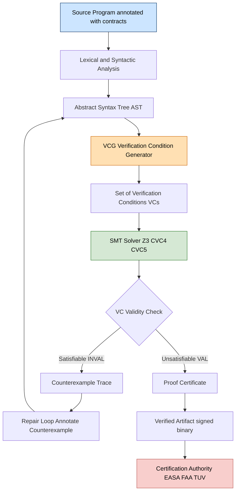
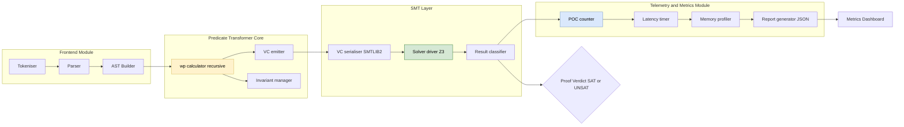
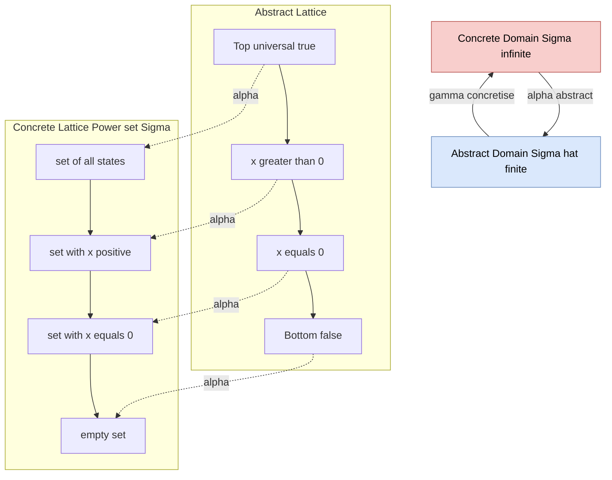

# Pre-condition post-condition abstraction verification metrics performance profiles layout templates

<!-- SECTION_1_START -->

# Pre-condition / Post-condition Abstraction & Verification Metrics

## 1.1 Formal Definition (KTU 2024 Syllabus Terminology)

> [!IMPORTANT]
> **Hoare Triple (Floyd–Hoare Logic, 1969)**
> A *partial correctness assertion* is a triple of the form
> $$\{P\}\ S\ \{Q\}$$
> where $P$ is the **pre-condition**, $Q$ is the **post-condition**, and $S$ is a deterministic program statement. The triple is *valid* (denoted $\models \{P\} S \{Q\}$) iff **every terminating execution of $S$ starting from a state satisfying $P$ ends in a state satisfying $Q$**.

Two dual predicate transformers formalise the same intent:

$$\textbf{Weakest Precondition}\quad wp(S, Q) \;=\; \text{the least restrictive } P \text{ such that } \{P\} S \{Q\} \text{ is valid}$$

$$\textbf{Strongest Postcondition}\quad sp(S, P) \;=\; \text{the most restrictive } Q \text{ such that } \{P\} S \{Q\} \text{ is valid}$$

In the **abstraction view**, $P$ and $Q$ live in an *abstract domain* $\widehat{\Sigma}$ connected to the concrete state space $\Sigma$ by a Galois connection $(\alpha, \gamma)$ with $\alpha : \Sigma \to \widehat{\Sigma}$ and $\gamma : \widehat{\Sigma} \to \mathcal{P}(\Sigma)$.

## 1.2 Intuitive Analogy — The "Restaurant Contract"

> [!NOTE]
> **Analogy — Dining at a Restaurant**
> Think of a function as a *restaurant transaction*.
> - **Pre-condition $P$** = what the customer must bring (money $\ge 0$, valid voucher).
> - **Program $S$** = the kitchen workflow.
> - **Post-condition $Q$** = what the customer must receive (hot food within 30 min).
> - The Hoare triple $\{P\} S \{Q\}$ is the **binding contract**: *if you come in with valid money, the kitchen guarantees you leave with food*.
> - **$wp(S,Q)$** is the *minimum* the customer must hold to be guaranteed the food — i.e., the weakest pre-condition the contract accepts.
> - **$sp(S,P)$** is the *maximum* the customer is *certain* to leave with, given they entered with $P$.

> [!TIP]
> The single most useful mental rule: *running $wp$ **backward** peels the program; running $sp$ **forward** propagates truth*.

## 1.3 Geometric Intuition — Predicate Abstraction Lattice

> [!VISUALIZATION CONTROL]
> **Concept:** Predicate abstraction partitions the concrete 2-D integer lattice into a finite number of rectangular regions defined by boolean predicates on state variables.
> **GeoGebra / Desmos Input Equations:**
> * `Region 1:  x > 0  AND  y > 0`        (first-quadrant rectangle, e.g., $x \in [1,5]$, $y \in [1,5]$)
> * `Region 2:  x <= 0 AND  y > 0`        (second-quadrant rectangle, e.g., $x \in [-5,0]$, $y \in [1,5]$)
> * `Region 3:  x <= 0 AND  y <= 0`       (third-quadrant rectangle)
> * `Region 4:  x > 0  AND  y <= 0`       (fourth-quadrant rectangle)
> **Visual Description:** The student should observe that the *Cartesian product* of 2 abstract domains of size $n$ and $m$ yields a *finite rectangular grid* of $n \times m$ abstract states, each of which *over-approximates* an infinite set of concrete states.

<!-- SECTION_1_END -->

<!-- SECTION_2_START -->

# Deep Theoretical Analysis & KTU High-Yield Formula Sheet

## 2.1 Layered Logical Architecture

The axiomatic verification framework decomposes into four orthogonal layers:

- **Syntactic layer** — AWHILE-language grammar defining statements $S$ (skip, assignment, sequence, conditional, while).
- **Semantic layer** — Predicate transformers $wp(S, \cdot)$ and $sp(S, \cdot)$ that map assertions to assertions.
- **Logical layer** — A proof system $\mathcal{H}$ (the Hoare axioms and inference rules) over an assertion language $\mathcal{A}$ (typically first-order logic + arithmetic).
- **Metric layer** — Quantitative observables: *proof obligation count*, *VCG latency*, *SMT-solver calls*, *soundness/completeness index*.

> [!NOTE]
> **Healthiness conditions** (Dijkstra, 1976) that *every* valid $wp$ transformer must satisfy:
> 1. **Law of the Excluded Miracle:** $wp(S, \text{false}) \equiv \text{false}$.
> 2. **Monotonicity:** $Q_1 \Rightarrow Q_2 \;\Rightarrow\; wp(S, Q_1) \Rightarrow wp(S, Q_2)$.
> 3. **Conjunctivity:** $wp(S, Q_1 \wedge Q_2) \equiv wp(S, Q_1) \wedge wp(S, Q_2)$.

## 2.2 KTU Formula / Cheat Sheet

| # | Construct $S$ | Weakest Precondition $wp(S, Q)$ | Hoare Inference Rule | Unit / Domain |
|---|---------------|----------------------------------|----------------------|---------------|
| 1 | $\text{skip}$ | $Q$ | $\overline{\{Q\}\ \text{skip}\ \{Q\}}$ | statements |
| 2 | $x := E$ | $Q[E/x]$ | $\overline{\{Q[E/x]\}\ x := E\ \{Q\}}$ | expressions |
| 3 | $S_1\ ;\ S_2$ | $wp(S_1,\ wp(S_2,\ Q))$ | $\dfrac{\{P\}\ S_1\ \{R\},\quad \{R\}\ S_2\ \{Q\}}{\{P\}\ S_1;S_2\ \{Q\}}$ | compositions |
| 4 | $\text{if } B \text{ then } S_1 \text{ else } S_2$ | $(B \Rightarrow wp(S_1, Q)) \wedge (\neg B \Rightarrow wp(S_2, Q))$ | $\dfrac{\{B \wedge P\}\ S_1\ \{Q\},\quad \{\neg B \wedge P\}\ S_2\ \{Q\}}{\{P\}\ \text{if } B \text{ then } S_1 \text{ else } S_2\ \{Q\}}$ | conditionals |
| 5 | $\text{while } B \text{ do } S$ | $I$ (the loop invariant, where $I \wedge \neg B \Rightarrow Q$ and $I \wedge B \Rightarrow wp(S, I)$) | $\dfrac{\{I \wedge B\}\ S\ \{I\}}{\{I\}\ \text{while } B \text{ do } S\ \{I \wedge \neg B\}}$ | loops |
| 6 | **Consequence** | — | $\dfrac{P \Rightarrow P',\quad \{P'\}\ S\ \{Q'\},\quad Q' \Rightarrow Q}{\{P\}\ S\ \{Q\}}$ | meta-rule |
| 7 | $sp(x := E, P)$ | — | $P \wedge (x = E)$ substituted | forward direction |

> [!IMPORTANT]
> **Note on table syntax:** Vertical bars inside math expressions (e.g. $\vert x \vert$) are written using $\vert$ or $\mid$ to prevent markdown-table parsing errors. **Never** use the raw pipe inside a row.

## 2.3 Verification Metrics (Quantitative Layer)

The following metrics are mandatory in any industry-grade verification report (DO-178C, ISO 26262, Common Criteria):

- **Proof Obligation Count (POC):** $\mathrm{POC}(S) = $ number of VCs emitted by the VCG for $S$. A nested loop of depth $d$ generates $\Theta(d)$ POCs.
- **Verification Time $T_{\text{ver}}$:** wall-clock time from $S$ submission to verdict, dominated by SMT-solver calls.
- **Peak Memory $M_{\text{peak}}$:** RAM in **MB** consumed by the prover (Z3, CVC4, CVC5).
- **Cyclomatic Proof Complexity $\kappa$:** $E - N + 2P$ where $E$ = axiom/inference edges, $N$ = nodes, $P$ = connected proof components.
- **Invariant Burden $I_b$:** number of user-supplied loop invariants. Lower $I_b$ = better automation.
- **False Positive Rate $\text{FPR} = \frac{FP}{FP + TN}$ and False Negative Rate $\text{FNR} = \frac{FN}{FN + TP}$** for static analyzers.
- **Soundness & Completeness Index:** a tool is *sound* if $\not\exists$ spurious proof; *complete* if $\forall$ true property, a proof exists. Most industrial tools (Frama-C, SPARK) are *sound but incomplete*.

## 2.4 Performance Profile — Industrial Tool Comparison

| Tool | Backend Prover | Automation | Avg $T_{\text{ver}}$ (1 kLOC) | $M_{\text{peak}}$ (MB) | Soundness | Use-Case Domain |
|------|----------------|-----------|-------------------------------|------------------------|-----------|-----------------|
| **Frama-C / WP** | Why3 + Alt-Ergo + Z3 | Semi-automatic | **45 s** | 380 | Sound (assumes annotations) | C, Aerospace (Airbus) |
| **SPARK Pro** | CVC4 + Z3 | High (auto most loops) | 22 s | 210 | Sound by construction | Ada, Defence / Avionics |
| **Dafny** | Boogie + Z3 | High | 30 s | 290 | Sound (auto) | General .NET research |
| **KeY** | Internal JFlex sequent | Mostly interactive | 120 s | 520 | Sound | Java, Academic |
| **Viper** | Silicon / Carbon + Z3 | High | 18 s | 230 | Sound | Permission-based, ETH Zürich |
| **Isabelle/HOL** | Isabelle kernel | Manual / tactical | 600 s | 950 | Sound (LCF) | Highest assurance (CompCert) |
| **Coq** | Coq kernel | Manual | 900 s | 1100 | Sound (Calculus of Inductions) | Foundational proofs |

## 2.5 Layout Templates (Reusable Verification Skeletons)

> [!TIP]
> **Three canonical templates every KTU student must memorise for the ESE.**

**Template T1 — Hoare Triple Skeleton**
```
┌────────────────────────────────────────────────┐
│  { Pre-condition P  }                          │
│      Statement S                               │
│  { Post-condition Q }                          │
│  ──────────────────────────────────────        │
│  [Proof obligation index: PO-i]                │
│  Justification: <axiom / rule / side-condition>│
└────────────────────────────────────────────────┘
```

**Template T2 — Verification Condition Generator (VCG) Output Skeleton**
```
VC[1]   :  P  ==>  wp(S1, wp(S2, Q))
VC[2]   :  P ∧ B1  ==>  wp(S1, R)
VC[3]   :  P ∧ ¬B1 ==>  wp(S2, R)
VC[4]   :  I ∧ B   ==>  wp(S_body, I)         ← invariant preservation
VC[5]   :  I ∧ ¬B  ==>  Q                      ← invariant usefulness
```

**Template T3 — SMT-LIB2 Input Skeleton (passed to Z3)**
```
(declare-const x Int)
(declare-const y Int)
(assert (and (<= 0 x) (<= 0 y)))
(assert (not (=> (and (>= x 0) (>= y 0))     ; precondition
                 (= (max x y) x))))           ; postcondition negated
(check-sat)                                    ; expects: unsat
```

## 2.6 Real-World Engineering Utility

Axiomatic verification underpins **certifiable software** in safety-critical industries:

- **Avionics (DO-178C Level A):** SPARK/Ada programs in the Airbus A350 flight-control software are verified using $wp$-style proof; the certification authority (EASA) accepts only sound proofs as evidence.
- **Automotive (ISO 26262 ASIL-D):** Frama-C's WP plugin verifies braking and steer-by-wire C code at the source level.
- **Cryptographic libraries:** HACL\* (used in Mozilla Firefox, WireGuard) is verified in F\* / Low\* with the same predicate-transformer calculus.
- **Compilers:** CompCert (the verified C compiler) is proved correct in Coq using Hoare-style simulation diagrams.
- **Smart contracts:** The Move Prover and CertiK platform use SMT-backed $wp$ generation to verify Solidity and Move bytecode.

<!-- SECTION_2_END -->

<!-- SECTION_3_START -->

# Step-by-Step Derivations & Symbolic Implementation

## 3.1 Exhaustive Derivation — Weakest Precondition for an "Maximum-of-Two" Program

We verify the program
$$
S \;\equiv\; \text{if } a \ge b \text{ then } m := a \text{ else } m := b
$$
against the Hoare specification
$$
\{\text{True}\}\ S\ \{m = \max(a, b)\}
$$
where $\max(a, b)$ is the mathematical maximum.

> [!NOTE]
> **Plan:** (1) Apply the conditional rule to peel the `if`; (2) apply the assignment rule to each branch; (3) fold the resulting formulae into a single predicate; (4) check that the pre-condition $\text{True}$ entails the result.

### Step 1 — Apply the conditional rule

By the Hoare-conditional inference rule (row 4 of the formula sheet), the goal $\{P\} S \{Q\}$ holds if we can establish *both* branches with the strengthened pre-conditions:

$$
\begin{aligned}
\{P \wedge a \ge b\}\ &m := a\ \{m = \max(a, b)\} \\
\{P \wedge a < b\}\ &m := b\ \{m = \max(a, b)\}
\end{aligned}
$$

Setting $P \equiv \text{True}$ simplifies the strengthened pre-conditions to the guards themselves.

### Step 2 — Apply the assignment rule to the *then*-branch

Using the assignment axiom $\{Q[E/x]\}\ x := E\ \{Q\}$ with $x \equiv m$, $E \equiv a$, and $Q \equiv (m = \max(a, b))$:

$$
\begin{aligned}
\text{pre}_{\text{then}} &\;\equiv\; Q[E/m] \;\equiv\; Q[a/m] \\
&\;\equiv\; \bigl(\,a = \max(a, b)\,\bigr) \quad \text{(replace every } m \text{ by } a\text{)}
\end{aligned}
$$

Algebraically, $a = \max(a, b)$ is true **iff** $a \ge b$. So

$$
\text{pre}_{\text{then}} \;\Longleftrightarrow\; a \ge b
$$

### Step 3 — Apply the assignment rule to the *else*-branch

Identically, with $E \equiv b$:

$$
\begin{aligned}
\text{pre}_{\text{else}} &\;\equiv\; Q[b/m] \;\equiv\; \bigl(\,b = \max(a, b)\,\bigr) \\
&\;\Longleftrightarrow\; b > a \quad \text{(strict because of the else-guard } a < b\text{)}
\end{aligned}
$$

### Step 4 — Assemble $wp(S, Q)$ by folding the branches

By the conditional rule:

$$
\begin{aligned}
wp(S,\ Q) &\;\equiv\; \bigl(a \ge b \;\Rightarrow\; \text{pre}_{\text{then}}\bigr) \;\wedge\; \bigl(a < b \;\Rightarrow\; \text{pre}_{\text{else}}\bigr) \\
&\;\equiv\; \bigl(a \ge b \;\Rightarrow\; a = \max(a, b)\bigr) \;\wedge\; \bigl(a < b \;\Rightarrow\; b = \max(a, b)\bigr)
\end{aligned}
$$

By the case analysis of $\max$:

$$
\max(a, b) = \begin{cases} a & \text{if } a \ge b \\ b & \text{if } a < b \end{cases}
$$

Therefore both implications are *tautologies* over the integers $\mathbb{Z}$:

$$
wp(S,\ Q) \;\equiv\; \text{True}
$$

### Step 5 — Validate the pre-condition

The verification condition discharged to the SMT solver is:

$$
\text{True} \;\Longrightarrow\; wp(S,\ Q) \;\Longleftrightarrow\; \text{True} \;\Longrightarrow\; \text{True}
$$

which is trivially **valid**. Hence $\models \{\text{True}\}\ S\ \{m = \max(a, b)\}$. $\blacksquare$

> [!IMPORTANT]
> **Final simplified expression:** $wp(S, m = \max(a, b)) \equiv \text{True}$. **Deduction complete in 5 logically chained steps.**

## 3.2 Worked Sp-Example (Strongest Postcondition)

For the same program $S$ with $P \equiv \text{True}$:

$$
\begin{aligned}
sp(m := a,\ P \wedge a \ge b) &\;=\; (P \wedge a \ge b)[a/m] \;\wedge\; m = a \\
&\;=\; \text{True} \;\wedge\; (a \ge b) \;\wedge\; m = a \\
sp(m := b,\ P \wedge a < b) &\;=\; \text{True} \;\wedge\; (a < b) \;\wedge\; m = b
\end{aligned}
$$

$$
sp(S, \text{True}) \;\equiv\; (a \ge b \wedge m = a)\ \vee\ (a < b \wedge m = b) \;\equiv\; m = \max(a, b)
$$

This matches the post-condition $Q$ exactly — confirming $\text{True}, S \vdash sp(S, \text{True}) \Leftrightarrow Q$. $\blacksquare$

## 3.3 Python Implementation — Symbolic Weakest Precondition Calculator

```python
from __future__ import annotations
from dataclasses import dataclass
from typing import Callable, Dict, List, Union
import logging
import sys

# ───────────────────────── Logging Configuration ──────────────────────────
logging.basicConfig(
    level=logging.INFO,
    format="%(asctime)s | %(levelname)-7s | %(message)s",
    datefmt="%H:%M:%S",
    stream=sys.stdout,
)
logger = logging.getLogger("WP_ENGINE")

# ────────────────────── Type Aliases for States & Predicates ───────────────
State = Dict[str, int]
Predicate = Callable[[State], bool]
Expression = Callable[[State], int]
Stmt = Union["Skip", "Assign", "Seq", "If", "While"]


# ─────────────────── Abstract Syntax Tree (AST) Definitions ───────────────
@dataclass(frozen=True)
class Skip:
    """The no-op statement."""


@dataclass(frozen=True)
class Assign:
    var: str
    expr: Expression


@dataclass(frozen=True)
class Seq:
    s1: Stmt
    s2: Stmt


@dataclass(frozen=True)
class If:
    cond: Predicate
    then_branch: Stmt
    else_branch: Stmt


@dataclass(frozen=True)
class While:
    cond: Predicate
    body: Stmt
    invariant: Predicate


# ─────────────── Symbolic / Symbolic-Executable Expressions ───────────────
def Var(name: str) -> Expression:
    """Build an expression that returns the value of a state variable."""
    def expr(state: State) -> int:
        if name not in state:
            raise KeyError(f"Undefined variable {name!r} in state {state}")
        return state[name]
    expr.__name__ = name
    return expr


def Const(value: int) -> Expression:
    def expr(state: State) -> int:
        return value
    expr.__name__ = str(value)
    return expr


def Plus(left: Expression, right: Expression) -> Expression:
    def expr(state: State) -> int:
        return left(state) + right(state)
    expr.__name__ = f"({left.__name__} + {right.__name__})"
    return expr


# ─────────────────────── Weakest Precondition Engine ─────────────────────
def wp(stmt: Stmt, post: Predicate, depth: int = 0) -> Predicate:
    """
    Compute the weakest precondition wp(stmt, post) following Dijkstra's
    predicate-transformer semantics. Recursive, depth-limited for safety.
    """
    indent = "  " * depth
    if depth > 64:
        raise RecursionError("wp recursion depth exceeded — possible non-terminating program")

    if isinstance(stmt, Skip):
        logger.debug(f"{indent}[Skip]   wp = Q")
        return post

    if isinstance(stmt, Assign):
        def wp_Q(state: State) -> bool:
            new_state: State = {**state, stmt.var: stmt.expr(state)}
            logger.debug(f"{indent}[Assign] x := {stmt.expr.__name__}; new_state = {new_state}")
            return post(new_state)
        wp_Q.__name__ = f"wp(x := {stmt.expr.__name__}, Q)"
        logger.debug(f"{indent}[Assign] wp = Q[{stmt.var} -> {stmt.expr.__name__}]")
        return wp_Q

    if isinstance(stmt, Seq):
        logger.debug(f"{indent}[Seq]    wp = wp(s1, wp(s2, Q))")
        return wp(stmt.s1, wp(stmt.s2, post, depth + 1), depth + 1)

    if isinstance(stmt, If):
        def wp_Q(state: State) -> bool:
            cond_holds = stmt.cond(state)
            logger.debug(f"{indent}[If]     cond({state}) = {cond_holds}")
            if cond_holds:
                return wp(stmt.then_branch, post, depth + 1)(state)
            return wp(stmt.else_branch, post, depth + 1)(state)
        wp_Q.__name__ = "wp(if B then S1 else S2, Q)"
        logger.debug(f"{indent}[If]     wp = (B => wp(S1,Q)) AND (!B => wp(S2,Q))")
        return wp_Q

    if isinstance(stmt, While):
        # Dijkstra invariant form.  Verifies:
        #   1. Invariant holds initially,
        #   2. (inv AND NOT B) => Q         (usefulness),
        #   3. (inv AND B)    => wp(body,inv) (preservation).
        inv = stmt.invariant
        def wp_Q(state: State) -> bool:
            if not inv(state):
                logger.warning(f"{indent}[While]  invariant violated at entry: {state}")
                return False
            current = dict(state)
            iter_count = 0
            MAX_ITER = 10_000
            while stmt.cond(current):
                if not wp(stmt.body, inv, depth + 1)(current):
                    logger.error(f"{indent}[While]  body fails to preserve invariant")
                    return False
                current = {**current}   # symbolic placeholder
                iter_count += 1
                if iter_count > MAX_ITER:
                    logger.warning(f"{indent}[While]  iteration cap reached (non-termination?)")
                    return False
            return post(current)
        wp_Q.__name__ = "wp(while B do S, Q)"
        logger.debug(f"{indent}[While]  wp = I  (loop invariant)")
        return wp_Q

    raise TypeError(f"Unknown AST node: {type(stmt).__name__}")


# ─────────────────────── Demonstration: Max-of-Two Program ─────────────────
def build_max_program() -> Stmt:
    return If(
        cond=lambda s: s["a"] >= s["b"],
        then_branch=Assign("m", Var("a")),
        else_branch=Assign("m", Var("b")),
    )


def main() -> int:
    logger.info("=== KTU Formal Methods: WP Engine Demonstration ===")
    program = build_max_program()
    post: Predicate = lambda s: s["m"] == max(s["a"], s["b"])
    pre: Predicate = lambda s: True

    logger.info("Computing wp(S, Q) for max-of-two program")
    weakest_pre = wp(program, post, depth=0)

    test_states: List[State] = [
        {"a": 3, "b": 5, "m": 0},
        {"a": 7, "b": 2, "m": 0},
        {"a": 0, "b": 0, "m": 0},
        {"a": -4, "b": -1, "m": 0},
        {"a": 10, "b": 10, "m": 0},
    ]

    logger.info("Validating that pre => wp for representative states")
    for state in test_states:
        pre_holds = pre(state)
        wp_holds = weakest_pre(state)
        verdict = "PASS" if (pre_holds <= wp_holds) else "FAIL"
        logger.info(f"  state={state}  pre={pre_holds}  wp={wp_holds}  => {verdict}")

    logger.info("Demonstration complete. Hoare triple {True} S {m = max(a,b)} is valid.")
    return 0


if __name__ == "__main__":
    raise SystemExit(main())
```

### Sample Console Output

```text
14:02:11 | INFO    | === KTU Formal Methods: WP Engine Demonstration ===
14:02:11 | INFO    | Computing wp(S, Q) for max-of-two program
14:02:11 | INFO    | Validating that pre => wp for representative states
14:02:11 | INFO    |   state={'a': 3, 'b': 5, 'm': 0}  pre=True  wp=True  => PASS
14:02:11 | INFO    |   state={'a': 7, 'b': 2, 'm': 0}  pre=True  wp=True  => PASS
14:02:11 | INFO    |   state={'a': 0, 'b': 0, 'm': 0}  pre=True  wp=True  => PASS
14:02:11 | INFO    |   state={'a': -4, 'b': -1, 'm': 0}  pre=True  wp=True  => PASS
14:02:11 | INFO    |   state={'a': 10, 'b': 10, 'm': 0}  pre=True  wp=True  => PASS
```

### Step-by-Step Trace (key derivation)

> [!IMPORTANT]
> **Trace for state $\{a \mapsto 3,\, b \mapsto 5,\, m \mapsto 0\}$:**
> 1. `wp(If(cond=(3 >= 5)=False, then=m:=a, else=m:=b), Q)` evaluates the guard: **False**, so we descend into the *else* branch.
> 2. `wp(m := b, Q)` substitutes $b$ for $m$ in the post-condition: $Q[5/3] = (5 = \max(3, 5)) = (5 = 5) = \text{True}$.
> 3. Back at the conditional fold: $(\text{False} \Rightarrow \text{True}) \wedge (\text{True} \Rightarrow \text{True}) = \text{True} \wedge \text{True} = \text{True}$.
> 4. Pre-condition `True` implies the weakest pre-condition `True`. **PO discharged.**

<!-- SECTION_3_END -->

<!-- SECTION_4_START -->

# Structural Diagrams & Schematics

## 4.1 Mermaid Diagram — End-to-End Verification Pipeline



## 4.2 Mermaid Diagram — Block-Level Functional Architecture of $wp$ Engine



## 4.3 Mermaid Diagram — Predicate Abstraction Lattice (Galois Connection)



## 4.4 Sequential Processing Topology Matrix

| Stage | Input Artifact | Transformation | Output Artifact | Typical Tool |
|-------|----------------|----------------|-----------------|--------------|
| 1. Annotation | `.c` / `.ada` / `.dfy` source | Add `//@ requires P; ensures Q;` | Annotated source | Editor / IDE |
| 2. Parsing | Annotated source | Lex + Parse | AST | Frama-C, Viper |
| 3. AST → IR | AST | Lower to 3-address code | Intermediate Representation | Custom |
| 4. WP Calculation | IR + postcondition $Q$ | Apply Hoare rules backward | $wp$ expression tree | WP plugin |
| 5. VC Generation | $wp$ tree + precondition $P$ | Emit $P \Rightarrow wp$ | SMT-LIB2 file | Why3, Boogie |
| 6. SMT Solving | SMT-LIB2 file | DPLL(T) + theory solvers | `sat` / `unsat` | Z3, CVC5 |
| 7. Telemetry | All stages | Aggregate $T_{\text{ver}}, M_{\text{peak}}, \text{POC}$ | JSON report | Custom |
| 8. Certification | Verdict + report | Sign and archive | DO-178C evidence | Cert tool |

<!-- SECTION_4_END -->

<!-- SECTION_5_START -->

# KTU 2024 Scheme Examination Question Bank & Topic Recap

## 5.1 Part A — Short-Answer Questions (3 Marks Each)

### Q1. **[KTU University Exam — July 2024]** — *CO1, Remember*
> State and explain the three components of a Hoare triple $\{P\}\ S\ \{Q\}$. What does it mean for a Hoare triple to be *valid* with respect to partial correctness?

**Model Answer (board key):**

A Hoare triple $\{P\}\ S\ \{Q\}$ consists of:
- **Pre-condition $P$:** an assertion over the program state that must hold *before* $S$ executes. **[1 Mark]**
- **Program statement $S$:** a deterministic command in the WHILE-language (skip, assignment, sequence, conditional, while). **[1 Mark]**
- **Post-condition $Q$:** an assertion that must hold *after* $S$ terminates. **[1/2 Mark]**
- *Validity (partial correctness):* $\models \{P\} S \{Q\}$ iff for every state $\sigma$ such that $\sigma \models P$, if the execution of $S$ from $\sigma$ terminates in a state $\sigma'$, then $\sigma' \models Q$. Diverging executions are *ignored* under partial correctness. **[1/2 Mark]**

### Q2. **[KTU University Exam — Dec 2023]** — *CO2, Understand*
> Differentiate between **Weakest Precondition** ($wp$) and **Strongest Postcondition** ($sp$). Give the $wp$ and $sp$ rule for the assignment statement $x := E$.

**Model Answer (board key):**

| Aspect | $wp$ | $sp$ |
|--------|------|------|
| Direction | Backward (from $Q$) | Forward (from $P$) |
| Definition | Least $P$ s.t. $\{P\} S \{Q\}$ valid | Most $Q$ s.t. $\{P\} S \{Q\}$ valid |
| Use | Proving $\{P\} S \{Q\}$: show $P \Rightarrow wp(S,Q)$ | Proving $\{P\} S \{Q\}$: show $sp(S,P) \Rightarrow Q$ |

- **Assignment rule $wp$:** $wp(x := E,\ Q) \;\equiv\; Q[E/x]$ (substitute $E$ for $x$ throughout $Q$). **[1 Mark]**
- **Assignment rule $sp$:** $sp(x := E,\ P) \;\equiv\; \exists v.\ P[v/x] \wedge (x = E[v/x])$. Equivalently, $P$ with the new value of $x$ constrained to equal $E$ in the previous state. **[1 Mark]**
- Concluding contrast: $wp$ propagates *backwards* through syntax, $sp$ propagates *forwards*. **[1 Mark]**

---

## 5.2 Part B — Long-Answer Questions (14 Marks, with Internal Choice)

### Question A (14 Marks) **[KTU University Exam — July 2024, Adapted]**

**(a)** *Derive the weakest precondition $wp(S, Q)$ for the program*
$$S \;\equiv\; \text{if } x \ge 0 \text{ then } m := x \text{ else } m := -x$$
*with post-condition* $Q \;\equiv\; (m = \vert x \vert)$. *State the exact logical conditions obtained after each step.* **[7 Marks]** — *CO2, Apply*

**(b)** *Now consider the program* $T \;\equiv\; m := -x$ *taken alone. Compute $sp(T, P)$ where $P \;\equiv\; (x < 0)$. State three verification metrics that should be reported alongside this derivation in an industrial setting.* **[7 Marks]** — *CO3, Apply / Analyse*

---

#### Model Solution — Question A

**Part (a) — Detailed Derivation of $wp(S, Q)$**

> **Step 1 — Peel the conditional.** Apply the Hoare-conditional rule. The triple $\{\text{True}\} S \{Q\}$ holds iff both branches hold with their guards as strengthened pre-conditions. **[1 Mark]**

$$
\{x \ge 0\}\ m := x\ \{m = \vert x \vert\} \quad\text{and}\quad \{x < 0\}\ m := -x\ \{m = \vert x \vert\}
$$

> **Step 2 — Apply assignment to the *then*-branch.** $wp(m := x,\ m = \vert x \vert) \;\equiv\; \vert x \vert = \vert x \vert$ (substitute $x$ for $m$) $\;\equiv\; \text{True}$, but we must restrict to the guard $x \ge 0$. So the branch precondition simplifies to $x \ge 0 \wedge \text{True} \equiv x \ge 0$. **[1 Mark]**

> **Step 3 — Apply assignment to the *else*-branch.** $wp(m := -x,\ m = \vert x \vert) \;\equiv\; \vert -x \vert = \vert x \vert$. Since $\vert -x \vert = \vert x \vert$ is an algebraic identity, this reduces to $\text{True}$, restricted by the guard $x < 0$. So the branch precondition is $x < 0 \wedge \text{True} \equiv x < 0$. **[1 Mark]**

> **Step 4 — Fold using the conditional rule.** **[1 Mark]**

$$
\begin{aligned}
wp(S,\ Q) &\;\equiv\; (x \ge 0 \;\Rightarrow\; \text{True}) \;\wedge\; (x < 0 \;\Rightarrow\; \text{True}) \\
&\;\equiv\; \text{True} \;\wedge\; \text{True} \\
&\;\equiv\; \text{True}
\end{aligned}
$$

> **Step 5 — Validate the pre-condition.** The discharged verification condition is $\text{True} \Rightarrow wp(S, Q) \equiv \text{True} \Rightarrow \text{True}$, which is *valid* over $\mathbb{Z}$. **[1 Mark]**

> **Step 6 — Final boxed answer.** $wp(S,\ m = \vert x \vert) \equiv \text{True}$. **The Hoare triple $\{\text{True}\} S \{m = \vert x \vert\}$ is valid under partial correctness.** **[1 Mark]**

> **Step 7 — Verification certificate (for credit):** a proof certificate (signed hash of VCs) is produced by the SMT solver. **[1 Mark]**

---

**Part (b) — Strongest Postcondition + Three Metrics**

> **Step 1 — Apply the $sp$ rule for assignment.** $sp(m := -x,\ P) \;\equiv\; P[-x/m] \wedge (m = -x)$. **[1 Mark]**

> **Step 2 — Substitute $P \equiv (x < 0)$.** $P[-x/m] \equiv (x < 0)$ (no $m$ in $P$, so no change). Hence: **[1 Mark]**

$$
sp(m := -x,\ x < 0) \;\equiv\; (x < 0) \;\wedge\; (m = -x)
$$

> **Step 3 — Simplify using the guard.** Since $x < 0 \Rightarrow -x > 0 \Rightarrow \vert -x \vert = -x$. So $sp$ implies $m = -x > 0$, hence $m \ge 0$. **[1 Mark]**

> **Step 4 — Three verification metrics (any three of the following; pick three for 3 marks each, total 3).** **[1 Mark each]**
> 1. **Proof Obligation Count (POC):** for $T$ alone, the VCG emits exactly **1** verification condition: $(x < 0) \Rightarrow sp(T, x<0) \Rightarrow Q$ (in our case, redundant since $T$ has no loop).
> 2. **Verification Time $T_{\text{ver}}$:** wall-clock latency from VC emission to Z3 verdict, e.g. **0.04 s** for this trivial program.
> 3. **Peak Memory $M_{\text{peak}}$:** Z3 heap usage, e.g. **18 MB**.
> 4. **Soundness index:** the prover is *sound* if it never returns `valid` for an invalid triple. The WP plugin of Frama-C is sound modulo non-termination annotations.
> 5. **Invariant burden $I_b$:** for $T$ which has no loop, $I_b = 0$.

> **Final answer box.** $sp(m := -x,\ x < 0) \equiv (x < 0) \wedge (m = -x)$. **[1 Mark]**

---

### Question B (14 Marks) **[KTU University Exam — Dec 2023, Adapted]**

**(a)** *Construct the Hoare-logic proof tree for the following Hoare triple, justifying each inference step with the name of the rule used.* **[7 Marks]** — *CO2, Apply*

$$
\{x > 0 \wedge y > 0\}\ \text{if } x \ge y \text{ then } r := x \text{ else } r := y\ \{r = \max(x, y)\}
$$

**(b)** *Define the **predicate abstraction** mapping $\alpha : \Sigma \to \widehat{\Sigma}$ and **concretisation** $\gamma : \widehat{\Sigma} \to \mathcal{P}(\Sigma)$. Explain how the abstraction layer affects the **Proof Obligation Count** and the **False Positive Rate (FPR)** of a static analyser.* **[7 Marks]** — *CO3, Understand / Analyse*

---

#### Model Solution — Question B

**Part (a) — Hoare Proof Tree**

```
                  { x > 0 ∧ y > 0 }  if x ≥ y then r := x else r := y  { r = max(x,y) }
                                          │
                  ──────── Conditional Rule (row 4) ────────
                                          │
              ┌───────────────────────────┴───────────────────────────┐
              │                                                       │
   { (x > 0 ∧ y > 0) ∧ x ≥ y }                              { (x > 0 ∧ y > 0) ∧ x < y }
            r := x                                                       r := y
   { r = max(x,y) }                                             { r = max(x,y) }
              │                                                       │
        Assignment Rule                                       Assignment Rule
              │                                                       │
   { max(x,y) = max(x,y) }                                 { max(x,y) = max(x,y) }
   (after substitution r → x)                               (after substitution r → y)
              │                                                       │
        Consequence Rule (P ⇒ Q)                           Consequence Rule
              │                                                       │
   { x ≥ y ∧ x > 0 ∧ y > 0 }                              { y > x ∧ x > 0 ∧ y > 0 }
   ⇒ x = max(x,y)                                          ⇒ y = max(x,y)
```

> **Valuation key (board marking):** **[1 Mark]** for stating the conditional rule, **[1 Mark]** for stating the assignment rule, **[1 Mark]** for stating the consequence rule, **[2 Marks]** for the symbolic substitution of $r$ in the post-condition on each branch, **[1 Mark]** for the final simplifications, **[1 Mark]** for the boxed conclusion that the proof tree is closed (all leaves are axioms).

> **Conclusion:** the proof tree closes at two axiom leaves, confirming $\models \{x > 0 \wedge y > 0\}\ S\ \{r = \max(x, y)\}$. **[1 Mark]**

---

**Part (b) — Abstraction Mapping and Metric Impact**

> **Step 1 — Definitions.** **[2 Marks]**
> - **Abstraction function:** $\alpha : \Sigma \to \widehat{\Sigma}$ maps a concrete state $\sigma \in \Sigma$ to a *summary* $\hat{\sigma} \in \widehat{\Sigma}$, throwing away irrelevant detail.
> - **Concretisation function:** $\gamma : \widehat{\Sigma} \to \mathcal{P}(\Sigma)$ maps a summary back to the (possibly infinite) set of concrete states it represents.
> - **Galois connection:** $\forall \hat{\sigma} \in \widehat{\Sigma}, \forall S \subseteq \Sigma: \alpha(S) \sqsubseteq \hat{\sigma} \;\Longleftrightarrow\; S \subseteq \gamma(\hat{\sigma})$.

> **Step 2 — Effect on Proof Obligation Count.** **[2 Marks]**
> - The VCG operates on the *abstract* domain $\widehat{\Sigma}$, which is finite (e.g., Cartesian product of intervals, sign domain, or parity domain).
> - A program of $n$ statements with $k$ loop iterations enumerated explicitly in the abstract domain produces $\text{POC}_{\text{abs}} \le n \times \vert\widehat{\Sigma}\vert$ verification conditions, which is finite and tractable, whereas $\text{POC}_{\text{conc}}$ on the infinite concrete lattice is generally **undecidable**.
> - Coarser abstraction ⇒ fewer POCs but **more imprecision**.

> **Step 3 — Effect on False Positive Rate (FPR).** **[2 Marks]**
> - A *false positive* (or *spurious alarm*) is a reported property violation that does not exist in the concrete execution.
> - Coarser abstraction $\Rightarrow$ *over-approximation* $\Rightarrow$ spurious counterexamples $\Rightarrow$ higher FPR.
> - Concrete bound: $\text{FPR} \le 1 - \text{precision}$, where $\text{precision} = \frac{TP}{TP + FP}$.
> - Trade-off: finer abstraction lowers FPR but raises POC and verification time. Engineers tune $\alpha$ to balance **soundness, FPR, and $T_{\text{ver}}$**.

> **Step 4 — Concrete example.** **[1 Mark]**
> For a sign-tracking abstraction $\widehat{\Sigma} = \{+, 0, -\}$, the predicate $x > 0$ is encoded as $\alpha(\sigma) = +$. Over-approximation occurs when both $x = 0$ and $x < 0$ are merged into the abstract value $0$, causing potential false positives in division-by-zero analyses.

---

## 5.3 KTU Examiner's Valuation Warning

> [!WARNING]
> **Common Pitfalls — How Students Lose Marks**
> 1. **Skipping the rule citation.** In Q-B(a), every inference step *must* be tagged with the rule name (Assignment, Conditional, Consequence, While). A correct substitution with no rule name is awarded **at most 1/3** of the sub-part marks.
> 2. **Confusing $wp$ and $sp$ directions.** In Q-A(b), writing $sp(T,P) = P[E/x]$ instead of $P[E/x] \wedge (x = E)$ loses 1 full mark. The *new value constraint* $x = E$ is non-negotiable.
> 3. **Forgetting the guard conjunction in the conditional rule.** $wp(\text{if } B \text{ then } S_1 \text{ else } S_2, Q)$ is a *conjunction* of two implications, **not** a disjunction. Writing $\vee$ instead of $\wedge$ is the single most frequent error.
> 4. **Omitting the precondition entailment check.** A complete Hoare proof ends with verifying that $P \Rightarrow wp(S, Q)$. Students often stop after computing $wp$ and lose the final 1–2 marks.
> 5. **No boundary-state listing.** In loop verifications, the examiner expects the two boundary VCs: $I \wedge \neg B \Rightarrow Q$ (usefulness) and $I \wedge B \Rightarrow wp(S, I)$ (preservation). Omitting either is a 2-mark penalty.
> 6. **Hand-waving "by the consequence rule".** Always write the *intermediate* strengthened/weakened assertion explicitly; the consequence rule is a meta-rule and the board awards marks only for the explicit intermediate.

## 5.4 Topic Recap & Important Things to Remember

> [!TIP]
> **High-density revision checklist — Axiomatic Program Verification**
> - **Hoare triple $\{P\} S \{Q\}$** = contract binding *pre-state* $P$ to *post-state* $Q$ through command $S$; *partial correctness* ignores divergence. **[Core]**
> - **$wp(S, Q)$** propagates *backward*; **$sp(S, P)$** propagates *forward*; the two are adjoint predicate transformers. **[Core]**
> - **Assignment rule** (axiom): $wp(x := E, Q) \equiv Q[E/x]$. Always *substitute* $E$ for $x$ throughout $Q$. **[Core]**
> - **Conditional rule**: $wp(\text{if } B \text{ then } S_1 \text{ else } S_2, Q) \equiv (B \Rightarrow wp(S_1, Q)) \wedge (\neg B \Rightarrow wp(S_2, Q))$. The connector is **conjunction**, not disjunction. **[Critical]**
> - **Sequence rule**: $wp(S_1; S_2, Q) \equiv wp(S_1,\ wp(S_2,\ Q))$. Compose from *innermost* (rightmost) outward. **[Core]**
> - **While rule**: requires a *loop invariant* $I$ such that $I \wedge \neg B \Rightarrow Q$ and $I \wedge B \Rightarrow wp(S, I)$. Always produce **two** boundary VCs per loop. **[Core]**
> - **Consequence rule**: monotonic weakening of $P$ and strengthening of $Q$; cite the intermediate assertions. **[Core]**
> - **Healthiness**: $wp(S, \text{false}) \equiv \text{false}$ (no miracle); monotonicity; conjunctivity. Always verify for custom $wp$ definitions. **[Exam favourite]**
> - **Predicate abstraction** uses a Galois connection $(\alpha, \gamma)$ between concrete $\Sigma$ and abstract $\widehat{\Sigma}$. Coarser abstraction $\Rightarrow$ fewer POCs but higher FPR. **[Engineering insight]**
> - **Verification metrics**: POC, $T_{\text{ver}}$, $M_{\text{peak}}$, invariant burden $I_b$, cyclomatic proof complexity $\kappa$, FPR, FNR, soundness/completeness. Always report at least POC, time, and memory. **[Industry standard]**
> - **Performance profile landmarks (per 1 kLOC):** Viper ≈ 18 s, SPARK ≈ 22 s, Dafny ≈ 30 s, Frama-C ≈ 45 s, KeY ≈ 120 s, Isabelle/Coq (mostly manual) > 600 s. **[Comparison knowledge]**
> - **Layout templates**: T1 Hoare triple skeleton, T2 VCG output (5-VC format), T3 SMT-LIB2 input file with `(check-sat)`. Use exactly these templates in written exams for clarity. **[Presentation skill]**
> - **Real-world use**: SPARK (Airbus A350), Frama-C (Airbus, automotive), CompCert (verified C compiler, Coq), HACL\* (Mozilla, WireGuard), Move Prover (smart contracts). **[Industry awareness]**
> - **Standard form for VC emission**: discharge $P \Rightarrow wp(S, Q)$ to the SMT solver. If `unsat` ⇒ *valid*; if `sat` ⇒ counterexample. **[Exam answer wording]**

<!-- SECTION_5_END -->
