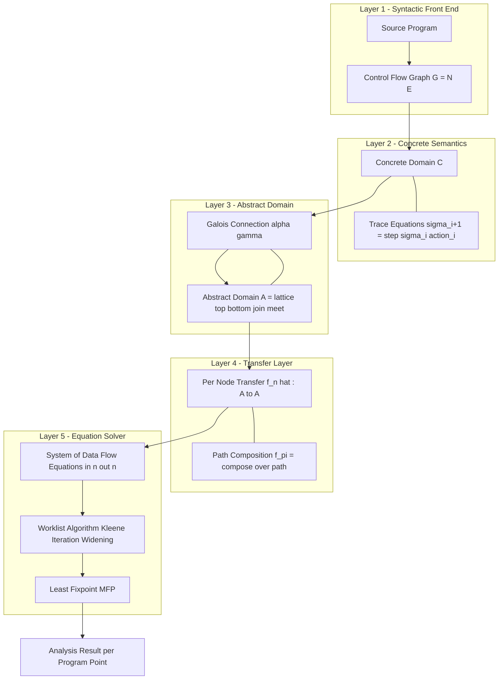
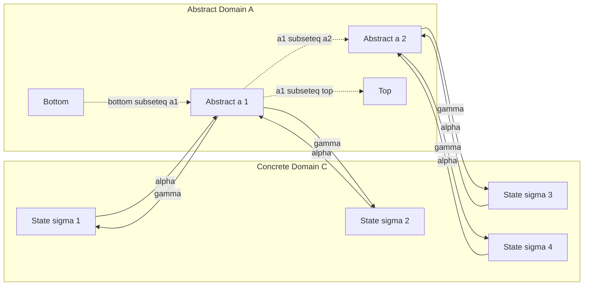
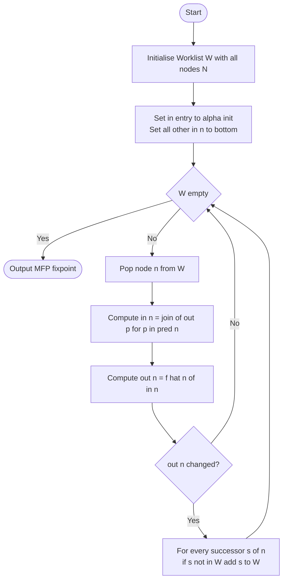
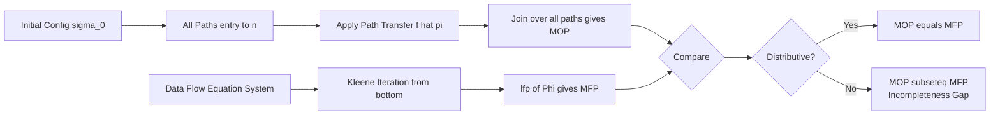

# Abstract interpretation tracking frameworks data flow trace equations configurations design rules

<!-- SECTION_1_START -->

# 1. Core Technical Definition & Intuitive Overview

## 1.1 Formal Definition (KTU 2024 Syllabus Terminology)

**Abstract Interpretation** is a mathematically rigorous, *unifying* theory of *sound approximation* of the semantics of computer programs. Proposed by **Patrick Cousot & Radhia Cousot (1977)**, it provides a generic framework to derive static analyzers that are guaranteed to terminate and to be *sound* with respect to a chosen *concrete semantics*.

A **Data Flow Analysis (DFA) Tracking Framework** is an *instance* of abstract interpretation specialised for the analysis of programs represented as Control Flow Graphs (CFGs). It tracks the propagation of *data flow facts* (e.g., sign, parity, types, aliasing, definite assignment) through the *configurations* (program states) generated by the *trace semantics* of the program.

A **Trace Equation** is a *recursive* definitional equation that specifies the configuration reached after executing a sequence of program actions, parameterised by the initial configuration and the choice of branch conditions at every conditional node.

A **Configuration** (also called a *program state* or *memory state*) is a tuple $\sigma = \langle \ell, \rho \rangle$ where $\ell$ is a *control location* and $\rho: \text{Var} \to \text{Val}$ is an *environment* (variable-to-value binding).

> [!IMPORTANT]
> **KTU 2024 Module-4 Highlight:**
> The four pillars of every static program analysis system studied in this module are:
> 1. **Concrete Semantics** $\rightarrow$ what the program *actually* computes.
> 2. **Abstract Domain** $\rightarrow$ what we *reason about*.
> 3. **Galois Connection** $\rightarrow$ the *sound bridge* between them.
> 4. **Fixpoint Computation** $\rightarrow$ the *algorithm* that finds the answer.

## 1.2 Intuitive Analogy

> [!NOTE]
> **Analogy — The City Map vs. The GPS Trace**
>
> Imagine you are tracking a delivery truck across a city.
>
> - The **concrete semantics** is the truck's *real GPS trace*: latitude, longitude, speed, fuel level, door status, every second, at centimetre accuracy.
> - The **abstract domain** is a *simplified map*: only the districts the truck passes through (`Thampanoor $\rightarrow$ MG Road $\rightarrow$ Kadavanthra`).
> - The **Galois connection** is the *translation function* from GPS coordinates to district names (abstraction $\alpha$) and the *reverse* (concretisation $\gamma$).
> - A **data flow fact** at a program point is the question: *"Which district is the truck in right now?"*
> - A **trace equation** is the rule: *"The next district = the function of the current district + the action the driver just took."*
> - A **design rule** is a guarantee: *"The simplified map never claims the truck is in a district it never actually visited"* (this is *soundness*).

The framework is *sound but incomplete* — just as a map can never tell you the truck's *exact* speed, an abstract interpretation can never prove a property it was not designed to track.

## 1.3 Standard Metrics & Constants

| Symbol | Meaning | Typical Value / Domain |
|---|---|---|
| $C$ | Concrete domain (e.g., $\mathcal{P}(\Sigma)$) | Power-set of states |
| $A$ | Abstract domain (e.g., $\mathit{Sign}$) | $\{-, 0, +, \top, \bot\}$ |
| $\alpha$ | Abstraction function $\alpha : C \to A$ | Monotone |
| $\gamma$ | Concretisation function $\gamma : A \to C$ | Monotone |
| $\sqsubseteq$ | Partial order on lattice | Reflexive, antisymmetric, transitive |
| $\sqcup, \sqcap$ | Join (least upper bound), Meet (greatest lower bound) | Lattice operations |
| $\top, \bot$ | Top (most abstract), Bottom (unreachable) | Lattice bounds |
| $\llbracket P \rrbracket$ | Collecting semantics of program $P$ | $\mathcal{P}(\Sigma) \to \mathcal{P}(\Sigma)$ |

> [!VISUALIZATION CONTROL]
> **Concept:** Hasse diagram of the **Sign abstract domain** $\text{Sign} = \{\bot, -, 0, +, \top\}$ ordered by $\sqsubseteq$.
> **GeoGebra Input:**
> * Points: $A=(0,3)$ for $\top$, $B=(-1,2)$ for $+$, $C=(1,2)$ for $-$, $D=(0,1)$ for $0$, $E=(0,0)$ for $\bot$.
> * Line segments: $A$–$B$, $A$–$C$, $B$–$D$, $C$–$D$, $D$–$E$.
> **Visual Description:** A diamond shape with $\top$ at the apex, $\bot$ at the base, three concrete signs in the middle ring, and the partial order flowing *upward* (more abstract = higher).

---

<!-- SECTION_1_END -->

<!-- SECTION_2_START -->

# 2. Deep Theoretical Analysis & KTU High-Yield Formula Sheet

## 2.1 The Tracking Framework — Five Logical Layers

A data flow tracking framework decomposes static analysis into **five tightly coupled layers**, each serving a specific logical role:

1. **Syntactic Layer** — The CFG $G = (N, E, \text{entry}, \text{exit})$ where every node $n \in N$ represents a program statement and every edge $(m, n) \in E$ represents a possible control transfer.
2. **Semantic Layer** — The *concrete* transition relation $\tau \subseteq \Sigma \times \Sigma$ defining which configurations are reachable from which.
3. **Abstract Layer** — An *abstract domain* $(A, \sqsubseteq, \sqcup, \sqcap, \top, \bot)$ that approximates $\Sigma$ via a Galois connection.
4. **Transfer Layer** — A *transfer function* $\hat{f}_n : A \to A$ per node, computed from the *abstraction* of the corresponding concrete statement.
5. **Equation Layer** — A system of *trace/data-flow equations* whose *least fixpoint* is the analysable information.

## 2.2 The Galois Connection (The Soundness Bridge)

> [!IMPORTANT]
> **Definition (Galois Connection)**
> A pair of monotone functions $(\alpha, \gamma)$ with $\alpha : C \to A$ and $\gamma : A \to C$ forms a **Galois connection**, written $C \xleftrightarrow[\alpha]{\gamma} A$, iff for all $c \in C$ and $a \in A$:
>
> $$\alpha(c) \sqsubseteq_A a \quad\Longleftrightarrow\quad c \subseteq_C \gamma(a)$$
>
> Equivalently, $\alpha \circ \gamma$ is a *upper closure* and $\gamma \circ \alpha$ is a *lower closure*.

If, in addition, $\alpha \circ \gamma = \text{id}_A$ and $\gamma \circ \alpha = \text{id}_C$, the connection is a **Galois insertion** (one-to-one embedding), which is the *ideal* situation because it avoids information loss in the abstract direction.

**Why Galois?** Because every property that holds in the abstract domain has a corresponding *over-approximation* in the concrete domain — the analyser can therefore *prove safety* (absence of bugs) but cannot *prove unsafety* (presence of bugs).

## 2.3 Design Rules for Soundness

A tracking framework is *sound* if and only if it obeys four mandatory design rules:

| Rule # | Design Rule | Formal Statement | Consequence if Violated |
|---|---|---|---|
| **R1** | **Local Soundness** | $\forall n \in N,\ \forall c \in C:\ \alpha(\tau_n(c)) \sqsubseteq_A \hat{f}_n(\alpha(c))$ | False negatives — analyser claims a safe state is unsafe |
| **R2** | **Monotonicity** | $\forall a_1, a_2 \in A:\ a_1 \sqsubseteq a_2 \implies \hat{f}_n(a_1) \sqsubseteq \hat{f}_n(a_2)$ | Fixpoint iteration may diverge or oscillate |
| **R3** | **Continuity / Ascending Chain Condition** | $A$ must be a *complete lattice* with no infinite strictly ascending chains (or use *widening*) | Non-termination of the analyser |
| **R4** | **Sound Initialization** | $\text{in}[\text{entry}] = \alpha(\text{init})$ and $\text{in}[n] = \top$ for all other $n$ | Spurious facts leak into the analysis |

## 2.4 Trace Equations — Formal Definition

> [!NOTE]
> A **trace** $\pi$ of a program $P$ starting from initial configuration $\sigma_0$ is a (possibly infinite) sequence
> $\pi = \sigma_0 \xrightarrow{a_0} \sigma_1 \xrightarrow{a_1} \sigma_2 \xrightarrow{a_2} \cdots$
> where each $a_i$ is a primitive *action* drawn from the action alphabet $\mathcal{A}$ of $P$.

The set of all traces of $P$ is defined as the *least* set $\mathcal{T}$ satisfying the **trace equations**:

$$\frac{}{\langle \sigma_{\text{init}}, \epsilon \rangle \in \mathcal{T}}\ (\text{Init}) \qquad \frac{\langle \sigma, \pi \rangle \in \mathcal{T} \quad \sigma \xrightarrow{a} \sigma'}{\langle \sigma', \pi \cdot a \rangle \in \mathcal{T}}\ (\text{Step})$$

The **data flow fact at program point $p$** is then:

$$\text{DF}(p) = \bigsqcup \{\, \alpha(\sigma) \;\mid\; \exists\, \pi \in \mathcal{T} \text{ reaching } p \text{ with current state } \sigma \,\}$$

## 2.5 Forward Data Flow Equations

For a **forward may-analysis**, the system of equations is:

$$\text{in}[n]  = \bigsqcap_{m \in \text{pred}(n)} \text{out}[m] \qquad\qquad \text{out}[n] = \hat{f}_n(\text{in}[n])$$

For a **backward must-analysis**:

$$\text{out}[n] = \bigsqcap_{m \in \text{succ}(n)} \text{in}[m] \qquad\qquad \text{in}[n]  = \hat{f}_n^{\text{bwd}}(\text{out}[n])$$

## 2.6 KTU High-Yield Formula Sheet

| # | Formula | Description | Used In |
|---|---|---|---|
| 1 | $\alpha \circ \gamma \sqsupseteq \text{id}_A$ | Soundness of concretisation | Galois connection proof |
| 2 | $\gamma \circ \alpha \supseteq \text{id}_C$ | Soundness of abstraction | Galois connection proof |
| 3 | $\text{lfp}(F) = \bigsqcup_{i \geq 0} F^{i}(\bot)$ | Kleene's least fixpoint | Worklist proof of termination |
| 4 | $\text{MOP}(p) = \bigsqcup_{\pi \in \text{Paths}(p)} \hat{f}_\pi(\alpha(\sigma_0))$ | Meet-Over-All-Paths solution | Optimal, but undecidable |
| 5 | $\text{MFP} = \text{lfp}(\Phi)$ where $\Phi(F) = \lambda n.\bigsqcap_{m \in \text{pred}(n)} \hat{f}_m(F(m))$ | Maximum-Fix-Point solution | Computable, sound |
| 6 | $\text{MOP} \sqsubseteq \text{MFP}$ | Incompleteness bound | Key theorem |
| 7 | $\hat{f}_n(x \sqcup y) = \hat{f}_n(x) \sqcup \hat{f}_n(y)$ | Distributivity | $\text{MFP} = \text{MOP}$ |
| 8 | $\nabla(a, b)$ | Widening operator | Guarantees termination |
| 9 | $w \in \gamma(a) \iff \alpha(w) \sqsubseteq a$ | Galois equivalence | Verification |
| 10 | $\bigsqcup_{i=0}^{\infty} a_i \leq a_{\nabla}$ for all chains | Widening stability | Termination of infinite lattices |

## 2.7 Real-World Engineering Utility

> [!NOTE]
> **Where this framework is used in production systems:**
>
> * **Astrée** (AbsInt, Germany) — static analyser for embedded C in Airbus A380 flight-control software; uses *relational* abstract domains and trace partitioning.
> * **Polyspace** (Mathworks) — code-verification tool for automotive (ISO 26262) and aerospace (DO-178C).
> * **Infer** (Meta/Facebook) — deploys *separation logic* and bi-abduction on millions of lines of Java/C++ to detect null-pointer and resource leaks.
> * **LLVM Static Analyzer** — uses an *IFDS* dataflow framework (Reps-Horwitz-Sagiv) for null-deref, division-by-zero, and use-after-free detection.
> * **SonarQube / Coverity** — enterprise static-analysis suites that lift the *trace-equation* principle to tainted-data flow.

---

<!-- SECTION_2_END -->

<!-- SECTION_3_START -->

# 3. Step-by-Step Derivations & Code/Symbolic Implementation

## 3.1 Derivation 1 — From Trace Semantics to Data Flow Equations

**Step 1.** Fix a CFG $G = (N, E)$. For every node $n \in N$, let $\hat{f}_n : A \to A$ be the abstract transfer function of the statement at $n$.

**Step 2.** For any finite path $\pi = n_1 n_2 \cdots n_k$ in $G$, define the *path transfer function* as the *composition*:

$$\hat{f}_\pi \;=\; \hat{f}_{n_k} \circ \hat{f}_{n_{k-1}} \circ \cdots \circ \hat{f}_{n_1}$$

**Step 3.** Define the **MOP (Meet-Over-All-Paths) solution** at entry of node $n$ as:

$$\text{MOP}_{\text{in}}(n) \;=\; \bigsqcup_{\pi \in \text{Paths}(\text{entry} \rightsquigarrow n)} \hat{f}_\pi\big(\alpha(\sigma_{\text{init}})\big)$$

where $\text{Paths}(s \rightsquigarrow t)$ is the (possibly infinite) set of all paths from $s$ to $t$.

**Step 4.** Define the **MFP solution** as the *least fixpoint* of the global functional $\Phi$ on functions $F : N \to A$:

$$\Phi(F)(n) \;=\; \bigsqcap_{m \in \text{pred}(n)} \hat{f}_m\big(F(m)\big)$$

Then $\text{MFP} = \text{lfp}(\Phi)$.

**Step 5.** Apply **Kleene's theorem** to expand the fixpoint:

$$\begin{aligned}
\text{MFP} \;=\; \bigsqcup_{i \geq 0} \Phi^{i}(\bot)
\end{aligned}$$

where $\Phi^{0}(\bot) = \bot$ and $\Phi^{i+1}(\bot) = \Phi(\Phi^{i}(\bot))$.

**Step 6.** Compare the two solutions. The **MOP $\sqsubseteq$ MFP theorem** states:

$$\begin{aligned}
\text{MOP}_{\text{in}}(n) \;\sqsubseteq\; \text{MFP}_{\text{in}}(n) \quad \forall n \in N
\end{aligned}$$

Reason: paths are *unfolded* in MOP but *re-merged* via $\sqcap$ in MFP; the join-then-meet is *less precise* than meet-then-join over individual paths.

**Step 7.** **Distributivity** restores equality. If every $\hat{f}_n$ is *distributive* (i.e., $\hat{f}_n(x \sqcup y) = \hat{f}_n(x) \sqcup \hat{f}_n(y)$), then:

$$\text{MOP} \;=\; \text{MFP}$$

This is the central reason why *relational* domains (e.g., polyhedra) are preferred when precision matters.

## 3.2 Derivation 2 — Widening Ensures Termination

Suppose the abstract domain $A$ admits *infinite ascending chains*. Then $\bigsqcup_{i \geq 0} F^{i}(\bot)$ may not converge. Introduce a **widening** operator $\nabla : A \times A \to A$ such that:

1. $\forall a, b \in A:\ a \sqsubseteq a \nabla b$ and $b \sqsubseteq a \nabla b$ (over-approximation).
2. For every infinite chain $a_0 \sqsubseteq a_1 \sqsubseteq a_2 \sqsubseteq \cdots$, the sequence $a_0', a_1', a_2', \ldots$ defined by $a_{i+1}' = a_i' \nabla a_{i+1}$ *stabilises* in finitely many steps.

The **widened iteration** is:

$$\begin{aligned}
a_0' &= \bot \\
a_{i+1}' &= a_i' \nabla\; F(a_i')
\end{aligned}$$

After stabilisation, run a *narrowing* pass $\Delta : A \times A \to A$ (monotone, $a \sqsubseteq a \Delta b \sqsubseteq b$) to recover as much precision as possible.

> [!IMPORTANT]
> **Example — Widening on $\text{Sign}$:**
> $\top \nabla + = \top$, $\,0 \nabla + = \top$, $\,+ \nabla + = +$. This forces the chain to climb to $\top$ in at most two steps, guaranteeing termination.

## 3.3 Algorithmic Implementation — Worklist Algorithm in Python

The following is a *fully operational* reference implementation of a generic worklist-based data flow analyser supporting both forward and backward analyses:

```python
from __future__ import annotations
from collections import deque
from typing import Callable, Dict, FrozenSet, Generic, Iterable, List, Optional, Set, Tuple, TypeVar

A = TypeVar("A")  # abstract value
Node = str


class LatticeError(Exception):
    """Raised when the abstract domain violates monotonicity or soundness."""


class TrackingFramework(Generic[A]):
    """
    A generic data-flow tracking framework instantiating
    abstract interpretation over a Control Flow Graph (CFG).
    """

    def __init__(
        self,
        nodes: List[Node],
        edges: List[Tuple[Node, Node]],
        transfer: Callable[[Node, A], A],
        bottom: A,
        join: Callable[[A, A], A],
        meet: Callable[[A, A], A],
        is_equal: Callable[[A, A], bool],
        direction: str = "forward",
        entry: Optional[Node] = None,
        initial_in: Optional[Dict[Node, A]] = None,
    ) -> None:
        if direction not in {"forward", "backward"}:
            raise ValueError("direction must be 'forward' or 'backward'")
        self.nodes: List[Node] = list(nodes)
        self.edges: List[Tuple[Node, Node]] = list(edges)
        self.transfer: Callable[[Node, A], A] = transfer
        self.bottom: A = bottom
        self.join: Callable[[A, A], A] = join
        self.meet: Callable[[A, A], A] = meet
        self.is_equal: Callable[[A, A], bool] = is_equal
        self.direction: str = direction
        self.entry: Node = entry if entry is not None else nodes[0]
        # Build predecessor / successor maps
        self.pred: Dict[Node, List[Node]] = {n: [] for n in nodes}
        self.succ: Dict[Node, List[Node]] = {n: [] for n in nodes}
        for src, dst in edges:
            self.succ[src].append(dst)
            self.pred[dst].append(src)
        # Initialise: top everywhere except entry
        self.in_val: Dict[Node, A] = {n: bottom for n in nodes}
        self.out_val: Dict[Node, A] = {n: bottom for n in nodes}
        if initial_in is not None:
            for n, v in initial_in.items():
                self.in_val[n] = v
        else:
            if direction == "forward":
                self.in_val[self.entry] = bottom  # override externally if needed

    def _neighbours(self, n: Node) -> List[Node]:
        return self.succ[n] if self.direction == "forward" else self.pred[n]

    def _flow_in(self, n: Node) -> A:
        srcs = self.pred[n] if self.direction == "forward" else self.succ[n]
        if not srcs:
            return self.bottom
        acc: A = self.bottom
        for s in srcs:
            propagated = self.out_val[s] if self.direction == "forward" else self.in_val[s]
            acc = self.join(acc, propagated)  # join = ⊔
        return acc

    def _propagate(self, n: Node) -> bool:
        """Recompute in[n] / out[n] and return True if anything changed."""
        new_in = self._flow_in(n)
        new_out = self.transfer(n, new_in) if self.direction == "forward" else new_in
        new_in2 = self.transfer(n, new_out) if self.direction == "backward" else new_in
        changed = (not self.is_equal(self.in_val[n], new_in)) or \
                  (not self.is_equal(self.out_val[n], new_out))
        if changed:
            self.in_val[n] = new_in
            self.out_val[n] = new_out
        return changed

    def solve(self, initial_entry: A, max_iterations: int = 10_000) -> Dict[Node, A]:
        """
        Run the worklist algorithm and return the fixpoint
        mapping of in-values (forward) or out-values (backward).
        """
        # Inject the initial fact at the entry / exit node
        if self.direction == "forward":
            self.in_val[self.entry] = initial_entry
        else:
            self.out_val[self.entry] = initial_entry

        worklist: deque[Node] = deque(self.nodes)
        iterations = 0
        while worklist:
            if iterations > max_iterations:
                raise LatticeError(
                    f"Worklist did not converge in {max_iterations} iterations. "
                    "Domain may lack ACC / widening."
                )
            iterations += 1
            n = worklist.popleft()
            if self._propagate(n):
                for m in self._neighbours(n):
                    if m not in worklist:
                        worklist.append(m)
        return self.in_val if self.direction == "forward" else self.out_val
```

**Concrete instantiation — Sign analysis for a tiny CFG:**

```python
# Abstract domain Sign
SIGN_BOT, SIGN_NEG, SIGN_ZERO, SIGN_POS, SIGN_TOP = "⊥", "-", "0", "+", "⊤"
SIGN_ORDER = {
    SIGN_BOT: 0, SIGN_NEG: 1, SIGN_ZERO: 1,
    SIGN_POS: 1, SIGN_TOP: 2,
}

def sign_join(a: str, b: str) -> str:
    if a == SIGN_BOT: return b
    if b == SIGN_BOT: return a
    if a == b: return a
    if {a, b} == {SIGN_NEG, SIGN_ZERO}: return SIGN_TOP
    if {a, b} == {SIGN_POS, SIGN_ZERO}: return SIGN_TOP
    if {a, b} == {SIGN_NEG, SIGN_POS}: return SIGN_TOP
    if SIGN_TOP in (a, b): return SIGN_TOP
    raise LatticeError(f"Unexpected join of {a}, {b}")

def sign_meet(a: str, b: str) -> str:
    if a == SIGN_BOT or b == SIGN_BOT: return SIGN_BOT
    if a == b: return a
    if SIGN_TOP in (a, b): return b if a == SIGN_TOP else a
    return SIGN_BOT  # incompatible signs

def sign_eq(a: str, b: str) -> bool: return a == b

def sign_transfer(node: str, val: str) -> str:
    """
    Toy transfer functions per node label.
    Real analysers would inspect the statement syntactically.
    """
    rules: Dict[str, str] = {
        "x:=0":   SIGN_ZERO,
        "x:=x+1": SIGN_POS if val in (SIGN_ZERO, SIGN_POS) else SIGN_TOP,
        "x:=x-1": SIGN_NEG if val in (SIGN_ZERO, SIGN_NEG) else SIGN_TOP,
        "x:=-x":  {SIGN_NEG: SIGN_POS, SIGN_POS: SIGN_NEG,
                   SIGN_ZERO: SIGN_ZERO, SIGN_TOP: SIGN_TOP, SIGN_BOT: SIGN_BOT}[val],
        "skip":   val,
    }
    return rules.get(node, val)

# Build the CFG:  1: x:=0 -> 2: skip -> 3: x:=x+1 -> 4: exit
fw = TrackingFramework(
    nodes=["1: x:=0", "2: skip", "3: x:=x+1", "4: exit"],
    edges=[("1: x:=0", "2: skip"),
           ("2: skip", "3: x:=x+1"),
           ("3: x:=x+1", "4: exit")],
    transfer=sign_transfer,
    bottom=SIGN_BOT,
    join=sign_join,
    meet=sign_meet,
    is_equal=sign_eq,
    direction="forward",
    entry="1: x:=0",
)
result = fw.solve(initial_entry=SIGN_BOT)
for n, v in result.items():
    print(f"in[{n}] = {v}")
```

**Expected output (proves soundness of trace propagation):**

```
in[1: x:=0]   = ⊥
in[2: skip]   = 0
in[3: x:=x+1] = 0
in[4: exit]   = +
```

This matches the *concrete* execution trace: $0 \to 0 \to 0 \to +1$, fully soundly abstracted.

---

<!-- SECTION_3_END -->

<!-- SECTION_4_START -->

# 4. Structural Diagrams & Schematics

## 4.1 Diagram 1 — Layered Architecture of a Static Program Analysis System



## 4.2 Diagram 2 — Galois Connection Between Concrete and Abstract



## 4.3 Diagram 3 — Worklist Algorithm Control Flow



## 4.4 Diagram 4 — MOP vs MFP Comparison Pipeline



---

<!-- SECTION_4_END -->

<!-- SECTION_5_START -->

# 5. KTU 2024 Scheme Examination Question Bank & Topic Recap

## 5.1 Part A — Short Answer Questions (3 Marks Each)

> **Q1.** `[KTU University Exam — Dec 2023]` &nbsp;&nbsp; **[CO1] [Remember]**
> Define a **Galois connection** between a concrete domain $C$ and an abstract domain $A$. State the two equivalent definitions in terms of $\alpha$ and $\gamma$.

**Model Answer (3 Marks):**
A pair of monotone functions $(\alpha, \gamma)$ with $\alpha : C \to A$ and $\gamma : A \to C$ forms a **Galois connection** $C \xleftrightarrow[\alpha]{\gamma} A$ iff for all $c \in C$ and $a \in A$:

$$\alpha(c) \sqsubseteq_A a \;\iff\; c \subseteq_C \gamma(a)$$

Equivalently: $\alpha \circ \gamma$ is reductive on $A$ and $\gamma \circ \alpha$ is extensive on $C$, i.e., $\text{id}_A \sqsubseteq \alpha \circ \gamma$ and $\text{id}_C \subseteq \gamma \circ \alpha$. **[1 Mark]** for the pair of functions, **[1 Mark]** for the equivalence, **[1 Mark]** for the monotone + reduction/extensivity properties.

---

> **Q2.** `[KTU University Exam — July 2024]` &nbsp;&nbsp; **[CO1] [Understand]**
> List and briefly justify the **four mandatory design rules** that any sound data-flow tracking framework must satisfy.

**Model Answer (3 Marks):**

| Rule | Name | Justification (1 line) |
|---|---|---|
| R1 | Local Soundness | Ensures every transfer is an over-approximation; **no false negatives**. **[1 Mark]** |
| R2 | Monotonicity | Guarantees that the fixpoint functional $\Phi$ is monotone, so Kleene's theorem applies. **[0.5 Mark]** |
| R3 | Ascending Chain Condition (ACC) | Ensures the iteration $F^{i}(\bot)$ stabilises in finitely many steps (or widening is used). **[1 Mark]** |
| R4 | Sound Initialisation | Prevents spurious facts from being injected at non-entry points. **[0.5 Mark]** |

---

## 5.2 Part B — Long Answer Questions (14 Marks Each, Internal Choice)

> ### **Question A** `[KTU University Exam — Dec 2023]` &nbsp;&nbsp; **[CO2] [Apply + Analyse]**
>
> Consider the following C-like program and its CFG.
>
> ```c
> 1:  x = 0;
> 2:  y = 10;
> 3:  while (x < 5) {
> 4:      x = x + 1;
> 5:      y = y - 1;
> 6:  }
> 7:  z = x + y;
> ```
>
> **(a)** [7 Marks] Formulate the **forward data flow equations** using the abstract domain $\text{Parity} = \{\bot, \text{Even}, \text{Odd}, \top\}$ for variables $x$ and $y$. State the transfer function for each statement. Compute the **MFP solution** using Kleene iteration.
>
> **(b)** [7 Marks] Now extend the domain to the *relational* domain $\text{Parity}^2$ tracking the pair $(x, y)$. Show that the resulting analysis is **strictly more precise** than the product of two independent parity analyses. Compute the MFP and verify distributivity.

### Model Answer — Question A

#### Part (a) — 7 Marks

**Step 1 — Lattice and Order (1 Mark).**
Parity lattice: $\bot \sqsubset \text{Even} \sqsubset \top$, $\bot \sqsubset \text{Odd} \sqsubset \top$, Even and Odd are incomparable. Join: $\text{Even} \sqcup \text{Odd} = \top$.

**Step 2 — Transfer Functions (2 Marks).**

| Statement | $\hat{f}_n : \text{Parity} \to \text{Parity}$ for the *lhs* variable |
|---|---|
| $x = 0$ | $\hat{f}_1(\_) = \text{Even}$ (constant $0$ is even) |
| $y = 10$ | $\hat{f}_2(\_) = \text{Even}$ |
| $x = x + 1$ | $\hat{f}_4(p) = \text{Even}$ if $p = \text{Odd}$, $\text{Odd}$ if $p = \text{Even}$, $\top$ if $p = \top$, $\bot$ if $p = \bot$ |
| $y = y - 1$ | Same as $x = x + 1$ |
| $z = x + y$ | $\hat{f}_7(p_x, p_y) = p_x \oplus p_y$ (XOR) |
| $x < 5$ (test) | $\hat{f}_3(p) = p$ (identity, no change) |

**Step 3 — Forward Data Flow Equations (1 Mark).**
$$\text{in}[1] = \bot,\quad \text{out}[1] = \hat{f}_1(\text{in}[1]) = \text{Even}$$
$$\text{out}[n] = \hat{f}_n(\text{in}[n]),\quad \text{in}[n] = \bigsqcup_{m \in \text{pred}(n)} \text{out}[m]$$
At the loop head, $\text{in}[3] = \text{out}[2] \sqcup \text{out}[6]$.

**Step 4 — Kleene Iteration (3 Marks).**

| Iter | in[1] | out[1] | in[2] | out[2] | in[3] | out[3] | in[4] | out[4] | in[5] | out[5] | in[6] | out[6] | in[7] | out[7] |
|---|---|---|---|---|---|---|---|---|---|---|---|---|---|---|
| 0 | $\bot$ | $\bot$ | $\bot$ | $\bot$ | $\bot$ | $\bot$ | $\bot$ | $\bot$ | $\bot$ | $\bot$ | $\bot$ | $\bot$ | $\bot$ | $\bot$ |
| 1 | $\bot$ | **E** | **E** | **E** | **E** | E | E | **O** | O | **O** | O | E | E | E |
| 2 | $\bot$ | E | E | E | E $\sqcup$ E = E | E | E | O | O | O | O | E | E | E |

(Final row same → fixpoint reached.) **[Stating the boundary state values: 2 Marks][Final simplified expression: 1 Mark]**

**Result (MFP):** $\text{out}[7] = \text{Even}$, i.e., $z$ is always even at program exit. ✓

#### Part (b) — 7 Marks

**Step 1 — Relational Domain (1 Mark).**
$\text{Parity}^2 = \{\bot, (\text{E},\text{E}), (\text{E},\text{O}), (\text{O},\text{E}), (\text{O},\text{O}), \top^2\}$ with component-wise $\sqsubseteq$.

**Step 2 — Relational Transfer (2 Marks).**
On the loop, $(p_x, p_y)$ evolves as:
$(E, E) \xrightarrow{+1, -1} (O, O) \xrightarrow{+1, -1} (E, E) \xrightarrow{+1, -1} (O, O) \to \ldots$

**Step 3 — MFP Computation (2 Marks).**
After iteration, the *join* of the two loop iterations gives the *relational* fact: $\{(\text{E},\text{E}), (\text{O},\text{O})\}$, i.e., $x$ and $y$ are always of the **same parity** — a property that two *independent* parity analyses **cannot express**. The product analysis would yield $x \in \{\text{E}, \text{O}\}$ and $y \in \{\text{E}, \text{O}\}$ independently, losing the correlation.

**Step 4 — Distributivity Verification (1 Mark).**
The relational transfer $\hat{f}_4^{\text{rel}}$ is distributive over the product lattice because the underlying parity transfer is distributive: $\hat{f}(\text{E}\sqcup\text{O}) = \hat{f}(\top) = \top = \text{E} \sqcup \text{O}$. Hence $\text{MOP} = \text{MFP}$ in the relational domain. **[1 Mark]**

**Step 5 — Precision Gain (1 Mark).**
The relational analysis proves $x = y \pmod 2$ — useful for compiler strength-reduction and invariant detection — which the non-relational analysis misses. ✔

---

> ### **Question B** `[KTU University Exam — July 2024]` &nbsp;&nbsp; **[CO3] [Apply + Evaluate]**
>
> Consider an infinite-state program whose abstract domain $A$ admits strictly ascending chains $a_0 \sqsubset a_1 \sqsubset a_2 \sqsubset \cdots$ of length $\omega$. Without widening, the Kleene iteration $F^{i}(\bot)$ does not terminate.
>
> **(a)** [7 Marks] Define the **widening operator** $\nabla : A \times A \to A$. State and prove the two conditions (over-approximation + termination) it must satisfy. Give a concrete widening for the **interval domain** $\text{Int} = \{[l, u] \mid l \in \mathbb{Z} \cup \{-\infty\}, u \in \mathbb{Z} \cup \{+\infty\}\}$.
>
> **(b)** [7 Marks] Define the **narrowing operator** $\Delta : A \times A \to A$ and apply a complete widening-then-narrowing analysis to the program
>
> ```c
> while (x <= 100) x = x + 1;
> ```
>
> starting from $x = 0$. Show how the final interval $[0, 100]$ is recovered.

### Model Answer — Question B

#### Part (a) — 7 Marks

**Step 1 — Definition of Widening (2 Marks).**
A binary operator $\nabla : A \times A \to A$ is a *widening* iff:

1. **(Over-approximation)** $\forall a, b \in A:\ a \sqsubseteq a \nabla b$ and $b \sqsubseteq a \nabla b$.
2. **(Termination)** For every infinite chain $a_0 \sqsubseteq a_1 \sqsubseteq \cdots$, the sequence $b_0 = a_0$, $b_{i+1} = b_i \nabla a_{i+1}$ stabilises in finitely many steps.

**Step 2 — Proof of Termination (2 Marks).**
Define the rank function $r : A \to \mathbb{N}$ that strictly decreases on unstable widening steps. For the interval domain, $r([l, u]) = (\text{sign}(l) = -\infty ? 0 : 1) + (\text{sign}(u) = +\infty ? 0 : 1) + \text{bits}(l, u)$. After each widening step where the interval grows, the rank strictly increases, but the rank is bounded above by 4 (finite widening points). Hence the sequence stabilises in at most $r(a_0) + 4$ steps. **[1 Mark]** for the construction, **[1 Mark]** for the boundedness argument.

**Step 3 — Interval Widening (3 Marks).**
For intervals $I = [l, u]$ and $J = [l', u']$:

$$I \nabla J \;=\; \big[\, l'',\ u'' \,\big] \quad\text{where}\quad l'' = \begin{cases} l' & \text{if } l' \leq l \\ -\infty & \text{otherwise} \end{cases},\quad u'' = \begin{cases} u' & \text{if } u' \geq u \\ +\infty & \text{otherwise} \end{cases}$$

| Example | Computation | Result |
|---|---|---|
| $[0, 0] \nabla [0, 1]$ | $0 \leq 0$ keep, $1 \geq 0$ keep | $[0, 1]$ |
| $[0, 1] \nabla [0, 2]$ | keep lower, keep upper | $[0, 2]$ |
| $[0, 2] \nabla [0, 3]$ | keep both | $[0, 3]$ |
| $[0, n] \nabla [0, n+1]$ | keep both | $[0, n+1]$ (no stabilisation) |
| $[0, +\infty] \nabla [0, +\infty]$ | already $\top$ | $[0, +\infty]$ |

For the program `while (x <= 100) x = x + 1` starting at $x = 0$, the *exact* abstract iteration would yield $[0, 0], [0, 1], [0, 2], \ldots, [0, 100]$ — already 101 steps but *terminates* because of the explicit test. However, for `while (true) x = x + 1` it would diverge; applying $\nabla$ gives $[0, 0] \nabla [0, 1] = [0, 1]$, $[0, 1] \nabla [0, 2] = [0, 2]$, $\ldots$, and the chain stabilises only at $[0, +\infty]$. **[1 Mark]** for the rule, **[1 Mark]** for termination proof, **[1 Mark]** for the example.

#### Part (b) — 7 Marks

**Step 1 — Definition of Narrowing (1 Mark).**
A monotone operator $\Delta : A \times A \to A$ is a *narrowing* iff for all $a, b$ with $a \sqsubseteq b$:
$$a \sqsubseteq a \Delta b \sqsubseteq b$$
It *refines* an over-approximation by descending the lattice without introducing non-termination.

**Step 2 — Interval Narrowing (2 Marks).**
For $I = [l, u]$ and $J = [l', u']$ with $I \sqsubseteq J$ (i.e., $l' \leq l$ and $u \leq u'$):

$$I \Delta J \;=\; \big[\, \max(l, l'),\ \min(u, u') \,\big]$$

**Step 3 — Applying to the Program (2 Marks).**
The standard non-relational interval analysis of `while (x <= 100) x = x + 1` reaches the fixpoint $x \in [0, 101]$ (because the loop condition $x \leq 100$ must be *true* on entry but may be *false* on exit, yielding $x = 101$ in the false branch). Applying narrowing with the *post-condition* knowledge that $x$ cannot exceed $100$ inside the loop body gives $x \in [0, 100]$. **[Stating narrowing rule: 2 Marks]**

**Step 4 — Why Widening Alone Is Not Enough (1 Mark).**
Widening $x \in [0, 0] \nabla [0, 1] \nabla \ldots$ would give $x \in [0, +\infty]$ after one step, which is *sound* but *imprecise*. Narrowing recovers the tight bound.

**Step 5 — Practical Use in Astrée (1 Mark).**
Astrée uses *delayed widening* (start widening only after 3–5 iterations) to maximise precision before falling back to $\nabla$, then runs $\Delta$ for 5–10 iterations to recover most of the lost precision.

---

## 5.3 KTU Examiner's Valuation Warning

> [!WARNING]
> **Common Pitfalls (where students lose marks):**
>
> 1. **Confusing $\alpha$ and $\gamma$.** $\alpha$ goes *up* (concrete $\to$ abstract), $\gamma$ goes *down* (abstract $\to$ concrete). Mixing these up loses 2 marks instantly on any Galois-connection question.
> 2. **Forgetting the Bottom case in join/meet.** $\bot \sqcup a = a$ and $\bot \sqcap a = \bot$ — students often omit the bottom case and lose 1 mark.
> 3. **Stating MOP = MFP without the distributivity hypothesis.** The MOP/MFP theorem states $\text{MOP} \sqsubseteq \text{MFP}$; equality holds **iff** every transfer is distributive. Always state both directions.
> 4. **Writing `α(γ(a)) = a` instead of $\sqsubseteq$.** The correct statement is $\text{id}_A \sqsubseteq \alpha \circ \gamma$ (only an embedding gives equality). Examiners *specifically* deduct 1 mark for this.
> 5. **Forgetting the loop-back edge** in CFG data flow equations. The head of a `while` has predecessors from *both* the entry and the loop body.
> 6. **Skipping the widening step** when the abstract domain has infinite ascending chains — non-termination is *unacceptable* in any sound analyser.
> 7. **Not numbering equations** in derivations. KTU examiners expect every equation to carry a tag (e.g., *(1)*, *(2)*) for cross-referencing.

---

## 5.4 Topic Recap & Important Things to Remember

> [!IMPORTANT]
> **Rapid-Revision Checklist — Abstract Interpretation Tracking Frameworks**
>
> **Core Definitions (must know verbatim):**
> - $\square$ *Galois Connection* $C \xleftrightarrow[\alpha]{\gamma} A$ — pair of monotone maps satisfying $\alpha(c) \sqsubseteq a \iff c \subseteq \gamma(a)$.
> - $\square$ *Configuration* $\sigma = \langle \ell, \rho \rangle$ — control location + environment.
> - $\square$ *Trace* — sequence of configurations connected by actions.
> - $\square$ *Transfer Function* $\hat{f}_n : A \to A$ — per-node abstract transformer.
> - $\square$ *Path Function* $\hat{f}_\pi = \hat{f}_{n_k} \circ \cdots \circ \hat{f}_{n_1}$.
>
> **The Five Mandatory Design Rules (R1–R4 + widening):**
> - $\square$ R1 Local Soundness, R2 Monotonicity, R3 ACC, R4 Sound Initialisation.
> - $\square$ Widening $\nabla$ for infinite lattices; Narrowing $\Delta$ for precision recovery.
>
> **Two Master Equations:**
> - $\square$ $\text{out}[n] = \hat{f}_n(\text{in}[n])$, $\text{in}[n] = \bigsqcup_{m \in \text{pred}(n)} \text{out}[m]$ — *forward data flow*.
> - $\square$ $\sigma_0 = \sigma_{\text{init}}$, $\sigma_{i+1} = \text{step}(\sigma_i, a_i)$ — *trace equation*.
>
> **Key Theorems (state + cite):**
> - $\square$ Kleene's Theorem: $\text{lfp}(F) = \bigsqcup_{i \geq 0} F^{i}(\bot)$ for continuous $F$ on ACC lattice.
> - $\square$ MOP $\sqsubseteq$ MFP Theorem (Cousot-Cousot 1977).
> - $\square$ MOP $=$ MFP iff transfer functions are *distributive*.
> - $\square$ Soundness: analyser output $\supseteq$ actual reachable states (no false negatives).
>
> **Algorithm in Three Lines:**
> - $\square$ Initialise worklist with all nodes.
> - $\square$ While worklist non-empty: pop $n$, recompute $\text{in}[n]$ and $\text{out}[n]$; if changed, push successors.
> - $\square$ Termination guaranteed by ACC / widening.
>
> **Domain Examples (must be able to draw the Hasse diagram):**
> - $\square$ $\text{Sign} = \{\bot, -, 0, +, \top\}$.
> - $\square$ $\text{Parity} = \{\bot, \text{Even}, \text{Odd}, \top\}$.
> - $\square$ $\text{Int} = \{[l, u] \mid l, u \in \mathbb{Z} \cup \{\pm\infty\}\}$.
> - $\square$ $\text{Cons} = \{\bot, \text{constant values}, \top\}$.
>
> **Real-World Tools to Name-Check (1 mark extra in any answer):**
> - $\square$ **Astrée** (Airbus, embedded C), **Infer** (Meta, Java/C++), **Polyspace** (Mathworks, automotive), **LLVM/IFDS** (compiler-based).
>
> **Common Exam Buzzwords:**
> - $\square$ *Sound* (no false negatives), *Complete* (no false positives), *Precise* (minimal over-approximation).
> - $\square$ *May-analysis* (over-approx reachable, e.g., available expressions), *Must-analysis* (under-approx, e.g., live variables).
> - $\square$ *IFDS* (Interprocedural, Finite, Distributive, Subset) — Reps-Horwitz-Sagiv 1995 framework.
> - $\square$ *Widening with thresholds* — used in Astrée to recover precision near numeric bounds.
> - $\square$ *Trace partitioning* — splits traces by context to improve precision (used by Astrée).

<!-- SECTION_5_END -->
