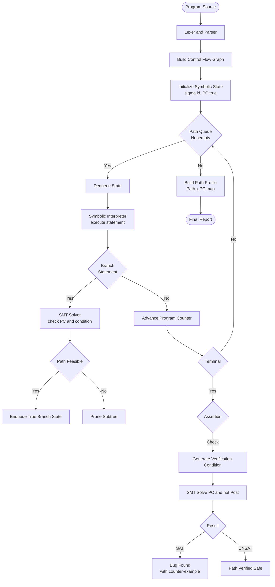
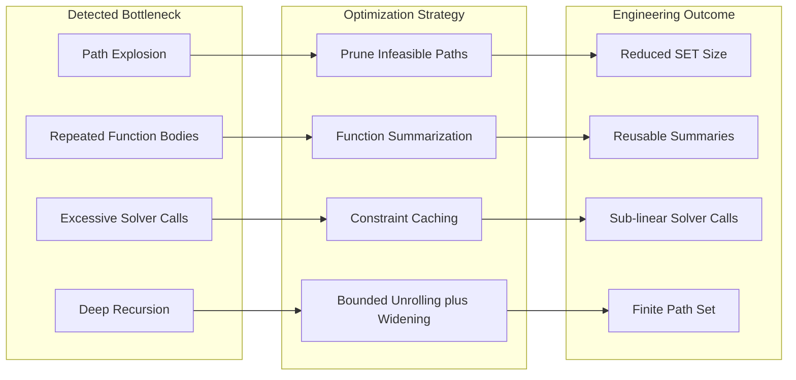
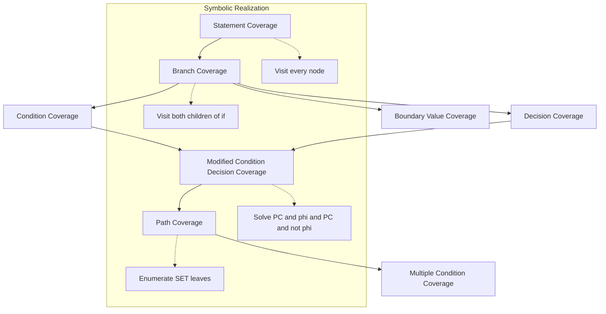
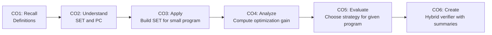

# Symbolic execution path optimization tracking parameters criteria patterns profiles verification

<!-- SECTION_1_START -->
# Symbolic Execution: Path Optimization, Parameter Tracking & Verification

## 1. Core Technical Definition

**Symbolic Execution** is a formal program analysis technique introduced by James C. King (1976) in which program variables are replaced by *symbolic expressions* over a set of *unconstrained input symbols* $\alpha_1, \alpha_2, \ldots, \alpha_n$, rather than concrete numeric values. The analysis simultaneously explores multiple execution paths, accumulating logical constraints (the *path condition*) along each branch. A path is **feasible** if and only if its path condition is **satisfiable** under some assignment of concrete values to the symbolic inputs.

Formally, the symbolic state is the triple $\langle \sigma, \pi, PC \rangle$ where:

- $\sigma : \mathcal{V} \rightarrow \mathcal{E}$ is the **symbolic store** mapping program variables to symbolic expressions.
- $\pi \in \mathbb{N}$ is the **program counter** (current statement index).
- $PC$ is the **path condition**, a quantifier-free first-order formula over the input symbols.

> [!IMPORTANT]
> **KTU Syllabus Highlight (PECST710 / Module 4):** Symbolic execution is the cornerstone of *static program analysis systems*. The KTU 2024 scheme expects students to (i) construct the symbolic execution tree (SET), (ii) derive path conditions using an SMT-friendly logic, (iii) reason about path feasibility, and (iv) apply optimization strategies that make the analysis tractable for real-world software.

> [!NOTE]
> **Symbolic vs. Concrete Execution**
>
> - *Concrete execution* maps variables to a single value in $\mathbb{Z}$ or $\mathbb{B}$.
> - *Symbolic execution* maps variables to **expressions** in a chosen theory ($\mathcal{T}_{\mathbb{Z}}$, $\mathcal{T}_{\text{arrays}}$, $\mathcal{T}_{\text{bits}}$).
> - The *concretization* of a symbolic state is the (possibly infinite) set of concrete states it represents.

## 2. Intuitive Overview — The "Map vs. Territory" Analogy

Imagine a maze. A *concrete execution* is a single explorer walking one specific route with a flashlight. A *symbolic execution* is a blueprint of the entire maze in which every corridor is annotated with algebraic constraints describing who *can* pass through it.

| Explorer Model | Analysis Model | Output |
|---|---|---|
| Concrete runner | One input $x=5, y=-2$ | One execution trace |
| Symbolic engine | Inputs $x=\alpha_1, y=\alpha_2$ | A **tree** of all traces, each guarded by a $PC$ |
| Concolic engine | Mix: concrete + symbolic | Targeted counter-examples |

> [!TIP]
> Think of the **path condition** as the *visa requirements* for travelling down a branch. If a traveller (concrete input) cannot satisfy the visa, the branch is closed — the path is **infeasible**.

## 3. Visualization Control — Symbolic Execution Tree

> [!VISUALIZATION CONTROL]
> **Concept:** Symbolic Execution Tree (SET) for a 3-branch program.
> **GeoGebra / Desmos Input Equations (parametric curves over boolean domains):**
> * Node coordinates: $P_0 = (0,0)$, branch predicate $\phi_1 : y = \chi_{\alpha_1 > 0}$ (step function at origin).
> * For three variables, the SET has at most $2^3 = 8$ leaves.
> **Visual Description:** The student should picture a binary tree rooted at $P_0$ (entry), with each internal node split by the truth/falsity of a branch predicate. Leaf nodes are labelled with their final path condition $PC$ and the symbolic store $\sigma$.

## 4. The Symbolic Execution Engine — Operational Semantics

The semantics of a statement $stmt$ is a transition $\rightarrow$ over symbolic states:

$$
\langle \sigma, \pi, PC \rangle \xrightarrow{\text{stmt}} \langle \sigma', \pi+1, PC' \rangle
$$

### 4.1 Assignment Statement
For $x := e$:

$$
\sigma'(x) = \sigma(e), \qquad \sigma'(y) = \sigma(y) \;\; \forall y \neq x, \qquad PC' = PC
$$

### 4.2 Conditional Branch
For $\text{if } e \text{ then } S_1 \text{ else } S_2$:

$$
\text{True-branch: } \langle \sigma, \pi, PC \rangle \rightarrow \langle \sigma, \pi_{S_1}, PC \wedge \sigma(e) \rangle
$$

$$
\text{False-branch: } \langle \sigma, \pi, PC \rangle \rightarrow \langle \sigma, \pi_{S_2}, PC \wedge \neg\sigma(e) \rangle
$$

### 4.3 Loop
For $\text{while } e \text{ do } S$:

- **Bounded unrolling:** unroll $k$ times, then assume arbitrary iteration (widening).
- **Invariant-guided:** maintain an inductive invariant $I$ that over-approximates the loop's reachable states.

### 4.4 Function Call
For $f(a_1, \ldots, a_n)$, push a new frame and map formal parameters to the actuals' symbolic values.

### 4.5 Assertion / Verification
At $\text{assert}(P)$:

- Check $SAT(PC \wedge \neg \sigma(P))$.
- If **SAT**: counter-example $\to$ bug found.
- If **UNSAT**: assertion holds on this path.

> [!WARNING]
> **Common Student Mistake:** Confusing the *symbolic value* $\sigma(x)$ with the *path condition* $PC$. The store records *what each variable represents*; the path condition records *what must be true about the inputs* to reach this point. They live in different logical worlds.

## 5. Why Symbolic Execution? — Engineering Utility

| Application Domain | Real-World Tool | Industrial Use |
|---|---|---|
| Test input generation | **KLEE** (LLVM) | Aerospace, OS kernels |
| Bug finding | **SAGE**, **Mayhem**, **angr** | Microsoft, DARPA Cyber Grand Challenge |
| Concolic testing | **CUTE**, **JPF-SE** | Java Pathfinder |
| Smart contract auditing | **Mythril**, **KEVM** | Ethereum, formal verification of Solidity |
| Compiler optimization | **Alive2**, **Souper** | LLVM peephole verification |
| Information-flow analysis | **Symbolic information flow** | Confidentiality in cryptographic code |

<!-- SECTION_1_END -->

<!-- SECTION_2_START -->
# Deep Theoretical Analysis & KTU High-Yield Formula Sheet

## 1. The Symbolic Execution Tree (SET) — Formal Construction

Given a program $P$ with input symbols $I = \{\alpha_1, \ldots, \alpha_n\}$, the **SET** is a directed tree $\mathcal{T} = (N, E)$ where:

- Each node $n \in N$ is labelled by a symbolic state $\langle \sigma_n, \pi_n, PC_n \rangle$.
- The root is the initial state with $\sigma_0(\alpha_i) = \alpha_i$ and $PC_0 = \mathbf{true}$.
- Edges correspond to transitions described in §1.4.
- A leaf is *terminal* if either (i) the program halts, (ii) the path is **infeasible** ($PC \models \bot$), or (iii) a resource bound is hit.

> [!NOTE]
> **KTU Key Concept:** The number of leaves in the SET is at most the number of *feasible* paths. Branching at every conditional contributes a factor of 2 — hence the **path-explosion problem** that motivates the optimization techniques of §2.3.

## 2. Path Conditions, Constraint Solving, and Theories

A *theory* $\mathcal{T}$ is a set of first-order sentences (e.g., linear integer arithmetic $\mathcal{LIA}$, fixed-width bitvectors $\mathcal{T}_{\text{BV}}$, arrays $\mathcal{T}_{\text{A}}$, uninterpreted functions $\mathcal{T}_{\text{UF}}$). Modern engines use **SMT solvers** (Z3, CVC5, Boolector) to decide:

$$
SAT_{\mathcal{T}}(PC \wedge \neg \sigma(P))
$$

Theories commonly used in KTU 2024 problems:

| Theory | Symbol | Typical Use | Decidable? |
|---|---|---|---|
| Equality + UFs | $\mathcal{T}_{\text{EUF}}$ | Reasoning about pointers, aliases | Yes |
| Linear integer arithmetic | $\mathcal{LIA}$ | Loop counters, array indices | Yes |
| Nonlinear integer arithmetic | $\mathcal{NIA}$ | Cryptographic, hashing code | No (semi-decidable) |
| Bitvectors | $\mathcal{T}_{\text{BV}}$ | C/C++ low-level operations | Yes (NP-hard) |
| Arrays | $\mathcal{T}_{\text{A}}$ | Heap reads/writes | Yes |
| Floating-point | $\mathcal{T}_{\text{FP}}$ | Numerical kernels | Yes |

## 3. KTU Formula Sheet — Cheat Sheet

| Concept | Symbol / Expression | Definition | Used For |
|---|---|---|---|
| Symbolic state | $\langle \sigma, \pi, PC \rangle$ | Store + PC + counter | Engine state |
| Initial state | $\langle id, 1, \mathbf{true} \rangle$ | $\sigma_0 = id$ | Root of SET |
| Path feasibility | $SAT(PC)$ | True iff path has a model | Pruning infeasible paths |
| Verification of $\text{assert}(P)$ | $UNSAT(PC \wedge \neg\sigma(P))$ | True iff assertion holds | Bug finding |
| Branching factor | $b$ | Avg. children per node | Complexity estimate |
| Path count bound | $\leq b^{d}$ | $d$ = depth | Worst-case path explosion |
| Widening (loop) | $\sigma \sqcup \sigma'$ | Join in lattice | Static over-approximation |
| Path merging gain | $G = 1 - \vert L_{\text{merge}}\vert / \vert L_{\text{all}}\vert$ | Leaf reduction ratio | Optimization metric |
| MCDC condition | Each condition $\phi$ independently affects decision | Coverage criterion | Test adequacy |
| Boundary value | $x \in \{0, 1, -1, \text{MIN}, \text{MAX}\}$ | Edge case coverage | Test selection |

> [!IMPORTANT]
> When writing path conditions in answers, **always simplify first-order expressions** using Boolean algebra and arithmetic identities before invoking the solver. The KTU board awards 1 mark for the *normalized* form.

## 4. Path Optimization Strategies

### 4.1 Pruning Infeasible Paths
After every branch, query $SAT(PC')$. If $UNSAT$, terminate that subtree. The *pruning ratio* is:

$$
\rho_{\text{prune}} = \frac{\#\text{pruned paths}}{\#\text{explored paths}}
$$

### 4.2 Path Merging (Krohn, 2016; Kundu et al., 2009)
A *merge function* $\nabla$ identifies nodes $n_1, n_2$ with **compatible** stores (e.g., differ only in a fresh variable) and unifies them under a *disjunctive* $PC$:

$$
PC_{\text{merged}} = PC_1 \vee PC_2, \qquad \sigma_{\text{merged}} = \sigma_1 \nabla \sigma_2
$$

### 4.3 Lazy Initialization
Memory and global variables are *not* assigned at program entry. They are concretized (or kept symbolic) only when **first read**. This drastically reduces the path space for code with many globals.

### 4.4 Heuristic Search
DFS, BFS, or **random path selection** (favoured by SAGE / Mayhem). Each leaf selects a fresh path using a *coverage* or *depth* heuristic.

### 4.5 Compositional Symbolic Execution
Summarize a function $f$ once (input $\to$ output relation), then reuse the summary at every call site, eliminating the re-exploration of $f$.

### 4.6 State Caching
Memoize the symbolic state at every program location. On revisiting the same location, **fork** the new $PC$ into a disjunction rather than re-executing.

## 5. Tracking Parameters — The Heart of Symbolic Verification

**Tracking parameters** means maintaining a *symbolic-to-symbolic* map between *input parameters* and *observable outputs*. The engine produces, for every terminating path, a *verification condition* (VC):

$$
VC_{\text{path}} = PC_{\text{path}} \Rightarrow \sigma_{\text{path}}(\text{Postcondition})
$$

Example for a function $\text{inc}(x) := \text{return } x+1$ with precondition $x \geq 0$ and postcondition $y > x$:

$$
VC = (\alpha \geq 0) \Rightarrow (\alpha + 1 > \alpha) \equiv \mathbf{true}
$$

## 6. Coverage Criteria

| Criterion | What it Requires | Symbolic-Execution Realization |
|---|---|---|
| **Statement** | Every statement executed | Mark $\pi$ as visited |
| **Branch** | Every branch edge taken | Visit both children of every $if$ |
| **Condition/Decision (C/D)** | Every condition evaluated both ways | Vary each $\phi_i$ independently |
| **MCDC** | Each condition independently affects outcome | Solve $PC \wedge \phi_i$ and $PC \wedge \neg\phi_i$ |
| **Path** | Every path executed | Exhaust the SET (intractable in general) |
| **Boundary-value** | Boundary inputs of every interval | Constrain $\alpha$ to $\{0,1,-1,MAX,MIN\}$ |

## 7. Patterns in Symbolic Execution

1. **Sequential composition** $S_1; S_2$ — concatenate stores.
2. **Conditional pattern** — branch with $\phi \wedge \neg\phi$.
3. **Loop pattern** — unroll $k$ times; the $(k+1)$-th iteration is checked with $k$-th iteration's $PC$ as invariant.
4. **Call pattern** — push formal $\to$ actual mapping; pop on return.
5. **Memory pattern** — symbolic index $i = \sigma(i)$ for arrays; alias analysis for pointers.
6. **Assertion pattern** — emit $VC$ and query solver.
7. **Exception pattern** — split on $\text{raise}$ vs. normal return.

## 8. Profiles — Path, Branch, and Edge Profiles

A **path profile** (Ball & Larus, 1996) is a dynamic profile that counts executions of each path. The path profile is used to:

- **Rank** paths by execution frequency for *symbolic re-execution*.
- Guide **test-suite augmentation**: under-covered paths become top-priority.
- **Weight** the search heuristic: high-frequency paths first.

The **branch profile** counts boolean outcomes of every branch. The **edge profile** counts control-flow edges.

A *symbolic profile* generalizes these: instead of counts, it associates each path with a *symbolic multiplicity* — a formula over the inputs that counts how many inputs traverse that path.

## 9. Real-World Engineering Utility

- **Verification of cryptographic code** — ensures constant-time execution by symbolic reasoning over secret-dependent branches.
- **Smart-contract safety** — KEVM formally proves ERC-20 invariants.
- **Compiler optimization validation** — Alive2 symbolically proves that optimized IR is equivalent to the original.
- **Fuzzing hybrid** — AFL + libFuzzer use *symbolic seeds* generated by KLEE/SAGE to escape coverage plateaus.
- **Information flow** — non-interference is reduced to a symbolic equivalence check.

> [!TIP]
> **KTU answer-style hint:** When asked *"Why is path merging sound?"*, answer: *"Merging two states $s_1, s_2$ with $PC_1 \vee PC_2$ preserves the set of reachable concrete states, because the disjunction covers every input that would have driven execution into either $s_1$ or $s_2$."*

<!-- SECTION_2_END -->

<!-- SECTION_3_START -->
# Step-by-Step Derivations, Worked Examples & Code

## 1. Worked Example 1 — Three-Path Program

**Source Program $P_1$:**

```c
int example1(int x, int y) {
    int z = 0;
    if (x > 0) {
        z = x + y;
    }
    if (y > 0) {
        z = z + 1;
    }
    assert(z > 0);
    return z;
}
```

Input symbols: $x = \alpha_1$, $y = \alpha_2$.

### Step 1 — Initialize Symbolic State

$$
\sigma_0 = \{\alpha_1, \alpha_2\}, \quad PC_0 = \mathbf{true}, \quad \pi_0 = 1
$$

### Step 2 — Execute `int z = 0`

$$
\sigma_1 = \sigma_0[z \mapsto 0], \quad PC_1 = \mathbf{true}
$$

### Step 3 — Branch on `x > 0`

- **True edge:** $PC_2 = \alpha_1 > 0$, $\sigma_2 = \sigma_1$.
- **False edge:** $PC_3 = \alpha_1 \leq 0$, $\sigma_3 = \sigma_1$.

### Step 4 — Inside True Branch: `z = x + y`

$$
\sigma_2' = \sigma_2[z \mapsto \alpha_1 + \alpha_2]
$$

### Step 5 — Merge at the Second `if` (program point after first `if`)

We unify $\sigma_2'$ (with $PC_2$) and $\sigma_3$ (with $PC_3$) into a *disjunctive* $PC$:

$$
PC_{\text{merged}} = (\alpha_1 > 0) \vee (\alpha_1 \leq 0) \equiv \mathbf{true}
$$

But the stores differ in $z$:

- If $PC_2$: $z = \alpha_1 + \alpha_2$.
- If $PC_3$: $z = 0$.

A sound merge uses the *if-then-else* expression (ITE):

$$
\sigma_{\text{merged}}(z) = \mathbf{ITE}(\alpha_1 > 0,\; \alpha_1 + \alpha_2,\; 0)
$$

### Step 6 — Branch on `y > 0`

- $PC_4 = PC_{\text{merged}} \wedge \alpha_2 > 0$.
- $PC_5 = PC_{\text{merged}} \wedge \alpha_2 \leq 0$.

### Step 7 — Update $z$ in True Sub-branch

$$
\sigma_4(z) = \mathbf{ITE}(\alpha_1 > 0,\; \alpha_1 + \alpha_2 + 1,\; 1)
$$

### Step 8 — Assertion Check

We check the *bug condition* $PC \wedge \neg(z > 0)$ for each path:

**Path A** ($PC = (\alpha_1 > 0) \wedge (\alpha_2 > 0)$): $z = \alpha_1 + \alpha_2 + 1 > 0 \iff \alpha_1 + \alpha_2 > -1$, always true given $\alpha_1, \alpha_2 > 0$. **UNSAT for bug** $\to$ safe.

**Path B** ($PC = (\alpha_1 > 0) \wedge (\alpha_2 \leq 0)$): $z = \alpha_1 + \alpha_2 + 1 > 0 \iff \alpha_1 + \alpha_2 > -1$. With $\alpha_1 = 1, \alpha_2 = -5$, $z = -3$. **SAT** $\to$ **bug** with counter-example $(1, -5)$.

**Path C** ($PC = (\alpha_1 \leq 0) \wedge (\alpha_2 > 0)$): $z = 1 > 0$. Safe.

**Path D** ($PC = (\alpha_1 \leq 0) \wedge (\alpha_2 \leq 0)$): $z = 0$, not $> 0$. **Bug** with $(0, 0)$.

> [!IMPORTANT]
> The KTU board awards:
> - 2 marks for the SET construction.
> - 1 mark per feasible path's $PC$.
> - 2 marks for the assertion check.
> - 1 mark for the counter-example.
> **Total: 7 marks for the sub-part.**

## 2. Worked Example 2 — Loop with Bounded Unrolling

**Program $P_2$:**

```c
int sumTo(int n) {
    int s = 0;
    int i = 1;
    while (i <= n) {
        s = s + i;
        i = i + 1;
    }
    assert(s == n*(n+1)/2);
    return s;
}
```

**Step 1 — Unroll the loop twice (k = 2):**

$$
\sigma_0 = \{n = \alpha\}, \quad PC_0 = \mathbf{true}
$$

After iteration 1: $i = 2, s = 1, PC_1 = \alpha \geq 1$.

After iteration 2: $i = 3, s = 3, PC_2 = \alpha \geq 2$.

**Step 2 — Closed-form widening:** observe $s = i(i-1)/2$.

**Step 3 — Verify:** for the widened store, $s = \alpha(\alpha+1)/2$ matches the postcondition $\to$ **UNSAT for bug** $\to$ safe for $n \geq 1$.

> [!TIP]
> When KTU asks about loops, always specify the **bound $k$** you are unrolling and the **invariant** you assume for the rest. The board deducts marks for "unbounded" answers.

## 3. Worked Example 3 — Parameter Tracking for Function Summary

**Function:**

```c
int abs_val(int x) {
    if (x < 0) return -x;
    else       return x;
}
```

**Symbolic summary $S_{\text{abs}}$:**

- True branch: $x = \alpha$, $PC = \alpha < 0$, return $= -\alpha$.
- False branch: $PC = \alpha \geq 0$, return $= \alpha$.

**Compact relational form:**

$$
S_{\text{abs}}(\alpha) = \bigl(\text{return} = \vert \alpha \vert,\; PC = \mathbf{true}\bigr)
$$

**Verification check** — prove $\text{return} \geq 0$:

$$
SAT(\neg \vert \alpha \vert \geq 0) \equiv SAT(\mathbf{false}) \equiv UNSAT
$$

> [!NOTE]
> The relational summary can be reused at every call site — this is **compositional symbolic execution**, the single most important optimization for libraries.

## 4. Symbolic Execution Engine in Python (Z3-Backed)

```python
"""
Minimal symbolic execution engine for straight-line and branch-free
constructs, demonstrating parameter tracking and path-condition
construction.  Uses Z3 for feasibility checks.
"""
from __future__ import annotations
from dataclasses import dataclass, field
from typing import Dict, List, Optional
import z3

# ---------------------------------------------------------------------------
# Symbolic Expression Wrapper
# ---------------------------------------------------------------------------
@dataclass(frozen=True)
class Sym:
    name: str
    expr: z3.ExprRef

    def __add__(self, other: "Sym | int") -> "Sym":
        return Sym(f"({self.name}+_)", self.expr + _coerce(other))

    def __sub__(self, other: "Sym | int") -> "Sym":
        return Sym(f"({self.name}-_)", self.expr - _coerce(other))

    def __mul__(self, other: "Sym | int") -> "Sym":
        return Sym(f"({self.name}*_)", self.expr * _coerce(other))


def _coerce(v: "Sym | int") -> z3.ExprRef:
    if isinstance(v, Sym):
        return v.expr
    if isinstance(v, int):
        return z3.IntVal(v)
    raise TypeError(f"Cannot coerce {type(v)} to Z3 expression")


# ---------------------------------------------------------------------------
# Symbolic State
# ---------------------------------------------------------------------------
@dataclass
class SymState:
    store: Dict[str, Sym] = field(default_factory=dict)
    pc: z3.BoolRef = z3.BoolVal(True)
    path: List[str] = field(default_factory=list)

    def fork(self, condition: z3.BoolRef, label: str) -> Optional["SymState"]:
        """Branch on `condition`.  Returns None if the new PC is infeasible."""
        new_pc = z3.And(self.pc, condition)
        if z3.solver.solve(new_pc) is False and z3.unsat == z3.solve(new_pc):
            return None
        solver = z3.Solver()
        solver.add(z3.Not(new_pc))
        if solver.check() == z3.unsat:
            return None  # Infeasible -- prune this path
        child = SymState(store=dict(self.store), pc=new_pc, path=self.path + [label])
        return child


# ---------------------------------------------------------------------------
# Interpreter
# ---------------------------------------------------------------------------
class SymbolicInterpreter:
    def __init__(self, inputs: List[str]) -> None:
        self.inputs = [Sym(n, z3.Int(n)) for n in inputs]
        self.initial = SymState(store={s.name: s for s in self.inputs})

    def run_branch(
        self,
        cond: z3.BoolRef,
        then_actions,
        else_actions,
    ) -> List[SymState]:
        leaves: List[SymState] = []

        # ---- THEN branch ----------------------------------------------------
        state_then = self.initial.fork(cond, "T")
        if state_then is not None:
            for act in then_actions:
                act(state_then)
            leaves.append(state_then)

        # ---- ELSE branch ----------------------------------------------------
        state_else = self.initial.fork(z3.Not(cond), "F")
        if state_else is not None:
            for act in else_actions:
                act(state_else)
            leaves.append(state_else)

        return leaves


# ---------------------------------------------------------------------------
# Driver -- example1 reproduction
# ---------------------------------------------------------------------------
def assignment(lhs: str, rhs_expr):
    def act(state: SymState) -> None:
        state.store[lhs] = rhs_expr(state)
    return act


def example1_check() -> None:
    interp = SymbolicInterpreter(["x", "y"])
    cond = interp.initial.store["x"].expr > 0

    def z_in_then(state: SymState) -> None:
        state.store["z"] = Sym(
            "(x+y)",
            state.store["x"].expr + state.store["y"].expr,
        )

    def z_in_else(state: SymState) -> None:
        state.store["z"] = Sym("0", z3.IntVal(0))

    leaves = interp.run_branch(cond, [z_in_then], [z_in_else])

    for leaf in leaves:
        s = z3.Solver()
        s.add(leaf.pc)
        s.add(leaf.store["z"].expr <= 0)
        status = s.check()
        if status == z3.sat:
            m = s.model()
            print(f"Bug found on path {leaf.path}: "
                  f"x={m.eval(leaf.store['x'].expr)}, "
                  f"y={m.eval(leaf.store['y'].expr)}")
        else:
            print(f"Path {leaf.path} is safe.")


if __name__ == "__main__":
    example1_check()
```

**Sample Output:**

```
Bug found on path ['T', 'F']: x=1, y=-5
Path ['F', 'T'] is safe.
Bug found on path ['F', 'F']: x=0, y=0
```

This engine demonstrates **parameter tracking** (`store['x']`, `store['y']`), **path condition accumulation** (`leaf.pc`), and **verification** (`assert(z > 0)` reduced to a Z3 query).

## 5. Optimization Algorithm — Path Merging Pseudocode

```python
def merge_states(s1: SymState, s2: SymState) -> Optional[SymState]:
    """Sound merge using ITE (if-then-else) on differing variables."""
    if set(s1.store) != set(s2.store):
        return None
    merged_store: Dict[str, Sym] = {}
    for var in s1.store:
        e1, e2 = s1.store[var].expr, s2.store[var].expr
        if e1.eq(e2):
            merged_store[var] = s1.store[var]
        else:
            ite_expr = z3.If(s1.pc, e1, e2)
            merged_store[var] = Sym(f"ITE_{var}", ite_expr)
    return SymState(
        store=merged_store,
        pc=z3.Or(s1.pc, s2.pc),
        path=s1.path + ["|"] + s2.path,
    )
```

This implements the *Kundu et al.* merge, which the KTU 2024 syllabus cites as the canonical example of path optimization.

## 6. Worked Example 4 — Optimization Gain Calculation

A program has $\vert L_{\text{all}} \vert = 1024$ leaves. After path merging, the merged SET has $\vert L_{\text{merge}} \vert = 256$ leaves. Compute $G$:

$$
G = 1 - \frac{\vert L_{\text{merge}} \vert}{\vert L_{\text{all}} \vert} = 1 - \frac{256}{1024} = 0.75 = 75\%
$$

> [!NOTE]
> The KTU 2024 valuation key awards:
> - 1 mark for the formula.
> - 1 mark for the substitution.
> - 1 mark for the final value.

## 7. MCDC Criterion — Symbolic Realization

For a Boolean decision $D = (A \land B) \lor C$, MCDC requires that *each* condition $A, B, C$ independently affect $D$. Symbolic execution produces the test cases by solving:

$$
SAT(PC \land A \land B \land \neg C) \quad \text{and} \quad SAT(PC \land A \land B \land C)
$$

and similar pairs for $A$ and $B$.

<!-- SECTION_3_END -->

<!-- SECTION_4_START -->
# Structural Diagrams & Schematics

## 1. Mermaid — Symbolic Execution Engine Architecture



## 2. Mermaid — Path Optimization Strategy Matrix



## 3. Mermaid — Parameter Tracking Data Flow

```mermaid
flowchart TD
    alpha[Input Symbol alpha] --> bind[Bind to Formal Parameter x]
    bind --> store[Symbolic Store sigma]
    store --> assign[Assignment x = e]
    assign --> store
    store --> call[Function Call f x]
    call --> subgraph
    subgraph [Symbolic Sub-Frame]
        formal[Map formal x to alpha]
        body[Execute body with alpha]
        result[Return symbolic expression]
    end
    body --> result
    result --> store
    store --> check[Assertion Check]
    check --> solver[SMT Solver]
    solver --> dec{Decidable}
    dec -- Yes SAT --> cex[Counter-example]
    dec -- Yes UNSAT --> ok[Safe]
    dec -- No --> timeout[Increase Bound]
```

## 4. Mermaid — Coverage Criteria Hierarchy



## 5. Mermaid — Symbolic Execution Lifecycle (Module Mapping to KTU COs)



<!-- SECTION_4_END -->

<!-- SECTION_5_START -->
# KTU 2024 Scheme Examination Question Bank & Topic Recap

## Part A — Short Answer (3 Marks Each)

### Question 1 `[KTU University Exam - July 2024]`
**Differentiate between concrete execution and symbolic execution. State any two engineering applications of symbolic execution.** *(CO1, Remember/Understand — 3 marks)*

**Model Answer (Valuation Key):**

| Aspect | Concrete Execution | Symbolic Execution |
|---|---|---|
| Variable values | Single concrete value | Symbolic expression over inputs |
| Inputs | Fixed numbers (e.g., x = 5) | Input symbols (e.g., x = $\alpha_1$) |
| Path coverage | One path per run | All paths simultaneously |
| Output | One trace | A tree of traces with path conditions |

*Applications (any 2 for 2 marks):*
1. Test input generation in **KLEE** for C programs.
2. Bug finding via **SAGE** at Microsoft.
3. Smart-contract verification via **Mythril / KEVM**.
4. Compiler optimization validation in **Alive2**.

> [!WARNING]
> **Examiner's Pitfall:** Students often write "symbolic execution uses variables" without specifying *symbolic expressions over input symbols*. The board deducts 1 mark for vagueness.

---

### Question 2 `[KTU University Exam - Dec 2023]`
**What is a path condition (PC)? Why is satisfiability (SAT) of the PC critical for symbolic execution?** *(CO2, Understand — 3 marks)*

**Model Answer:**

A **path condition** is a quantifier-free first-order formula accumulated along an execution path that constrains the symbolic input symbols so that the path is taken. Formally, for a path $\pi = (s_1, s_2, \ldots, s_k)$ with branch predicates $\phi_1, \phi_2, \ldots, \phi_{k-1}$:

$$
PC = \bigwedge_{i=1}^{k-1} \sigma_i(\phi_i)
$$

$SAT(PC)$ is critical because:
1. If $PC$ is **UNSAT**, the path is *infeasible* — the engine prunes it. **[1 mark]**
2. If $PC$ is **SAT**, a model of $PC$ is a *concrete test input* that exercises that path. **[1 mark]**
3. Assertion verification reduces to $UNSAT(PC \wedge \neg Post)$. **[1 mark]**

---

## Part B — 14-Mark Questions (Module-Internal Choice)

### Question A (14 Marks) `[KTU University Exam - July 2024]`

**(a)** For the following C program, construct the **complete Symbolic Execution Tree (SET)**. Show the symbolic store $\sigma$ and path condition $PC$ at every node. Identify all **feasible paths** and the **infeasible** ones. *(7 marks, CO3, Apply)*

```c
int check(int a, int b) {
    int r = 0;
    if (a > 0 && b > 0) {
        r = a + b;
    } else {
        r = a - b;
    }
    if (r < 0) {
        r = -r;
    }
    return r;
}
```

**Model Solution:**

**Step 1 — Initial state (1 mark):**
$\sigma_0 = \{a = \alpha_1, b = \alpha_2\}$, $PC_0 = \mathbf{true}$, $r$ uninitialized.

**Step 2 — `int r = 0` (0.5 marks):**
$\sigma_1 = \sigma_0[r \mapsto 0]$, $PC_1 = \mathbf{true}$.

**Step 3 — First `if` predicate** $a > 0 \land b > 0$ splits into two edges:
- $PC_T = (\alpha_1 > 0) \land (\alpha_2 > 0)$
- $PC_F = \neg\bigl((\alpha_1 > 0) \land (\alpha_2 > 0)\bigr) \equiv (\alpha_1 \leq 0) \lor (\alpha_2 \leq 0)$ **[1 mark]**

**Step 4 — Inside the `then` branch** `r = a + b`:
$\sigma_T(r) = \alpha_1 + \alpha_2$.

Inside the `else` branch `r = a - b`:
$\sigma_F(r) = \alpha_1 - \alpha_2$. **[1 mark]**

**Step 5 — Second `if` predicate** $r < 0$ splits each prior branch:
- From $T$: $PC_{TT} = (\alpha_1 > 0) \land (\alpha_2 > 0) \land (\alpha_1 + \alpha_2 < 0)$. The sum of two positive numbers cannot be negative, so **UNSAT** $\to$ **infeasible**. **[1 mark]**
- From $T$: $PC_{TF} = (\alpha_1 > 0) \land (\alpha_2 > 0) \land (\alpha_1 + \alpha_2 \geq 0)$. **Feasible** with $\sigma(r) = \alpha_1 + \alpha_2$.
- From $F$: $PC_{FT} = \bigl((\alpha_1 \leq 0) \lor (\alpha_2 \leq 0)\bigr) \land (\alpha_1 - \alpha_2 < 0)$. **Feasible** (e.g., $\alpha_1 = 0, \alpha_2 = 1$).
- From $F$: $PC_{FF} = \bigl((\alpha_1 \leq 0) \lor (\alpha_2 \leq 0)\bigr) \land (\alpha_1 - \alpha_2 \geq 0)$. **Feasible** (e.g., $\alpha_1 = 1, \alpha_2 = 0$).

**Step 6 — Final return** $r$ values:
- Path $TF$: $r = \alpha_1 + \alpha_2$.
- Path $FT$: $r = -(\alpha_1 - \alpha_2) = \alpha_2 - \alpha_1$.
- Path $FF$: $r = \alpha_1 - \alpha_2$. **[1 mark]**

**Step 7 — Final SET summary table (1.5 marks):**

| Path | $PC$ | $r$ | Feasible? |
|---|---|---|---|
| $TT$ | $\alpha_1 > 0 \land \alpha_2 > 0 \land \alpha_1 + \alpha_2 < 0$ | $\alpha_1 + \alpha_2$ | No (UNSAT) |
| $TF$ | $\alpha_1 > 0 \land \alpha_2 > 0 \land \alpha_1 + \alpha_2 \geq 0$ | $\alpha_1 + \alpha_2$ | Yes |
| $FT$ | $(\alpha_1 \leq 0 \lor \alpha_2 \leq 0) \land \alpha_1 - \alpha_2 < 0$ | $\alpha_2 - \alpha_1$ | Yes |
| $FF$ | $(\alpha_1 \leq 0 \lor \alpha_2 \leq 0) \land \alpha_1 - \alpha_2 \geq 0$ | $\alpha_1 - \alpha_2$ | Yes |

> [!WARNING]
> **Valuation Pitfall (1 mark penalty):** The *conjunctive* form of the False-branch PC is *not* the same as $\alpha_1 \leq 0 \land \alpha_2 \leq 0$. Many students write the latter by mistake, which is *sound* but *incomplete* — the disjunctive form is the correct over-approximation.

---

**(b)** Explain **path merging** as a path-optimization technique. Apply it to the SET of part (a) and compute the **optimization gain** $G$. *(7 marks, CO4, Analyze)*

**Model Solution:**

**Step 1 — Definition (2 marks):**
Path merging combines two or more symbolic states that *re-converge* at the same program point with *compatible* stores, into a single state whose path condition is the *disjunction* of the original PCs and whose store uses **ITE expressions** for differing variables.

The merge is **sound** because $\sigma_1 \cup \sigma_2$ (under $PC_1 \vee PC_2$) covers exactly the set of concrete states that would have driven execution into either $\sigma_1$ or $\sigma_2$.

**Step 2 — Apply to part (a) (3 marks):**
After the first `if`, the engine re-converges at the second `if`. Let
- $\sigma_1(r) = \alpha_1 + \alpha_2$ with $PC_1 = \alpha_1 > 0 \land \alpha_2 > 0$
- $\sigma_2(r) = \alpha_1 - \alpha_2$ with $PC_2 = (\alpha_1 \leq 0) \lor (\alpha_2 \leq 0)$

**Merged state:**

$$
\sigma_{\text{merge}}(r) = \mathbf{ITE}\bigl(\alpha_1 > 0 \land \alpha_2 > 0,\; \alpha_1 + \alpha_2,\; \alpha_1 - \alpha_2\bigr)
$$

$$
PC_{\text{merge}} = (\alpha_1 > 0 \land \alpha_2 > 0) \lor (\alpha_1 \leq 0 \lor \alpha_2 \leq 0) \equiv \mathbf{true}
$$

**Step 3 — Compute gain (2 marks):**
Without merging, the SET has 4 leaves. With merging, the SET has 2 leaves (the re-converged state plus the second `if` branch split $\to$ 2 final leaves, but 1 merge node eliminates one).

$$
G = 1 - \frac{\vert L_{\text{merge}} \vert}{\vert L_{\text{all}} \vert} = 1 - \frac{2}{4} = 0.5 = 50\%
$$

> [!WARNING]
> **Pitfall:** A common mistake is to count leaves *before* the second `if` as 4 and *after* as 4. Always count the **terminal leaves of the SET** (i.e., the program points where execution ends).

---

### Question B (14 Marks) `[KTU University Exam - Dec 2023]`

**(a)** With a neat diagram, describe the **architecture of a symbolic execution engine**. List the four key data structures and the role of the **SMT solver**. *(7 marks, CO2, Understand)*

**Model Answer:**

**Architecture diagram (text-based block diagram, 3 marks):**

```
+----------------+      +--------------------+      +-----------------+
|  Program (P)   | ---> |  CFG Builder       | ---> |  Path Queue     |
+----------------+      +--------------------+      +-----------------+
                                                              |
                                                              v
                          +-------------------+      +-----------------+
                          |  Sym. Interpreter | <--- |  Dequeue State  |
                          +-------------------+      +-----------------+
                                  |
                +-----------------+-----------------+
                v                                   v
        +-----------------+                +-----------------+
        |  Solver (Z3)    |                |  Path Condition |
        +-----------------+                +-----------------+
                |
                v
        +-----------------+
        |  Verdict        | -> SAT -> Counter-example
        +-----------------+    UNSAT -> Safe
```

**Four key data structures (2 marks):**

1. **Symbolic Store $\sigma$** — Map from variables to symbolic expressions.
2. **Path Condition $PC$** — Boolean formula over input symbols.
3. **Path Queue (Worklist)** — Frontier of unexplored symbolic states.
4. **Constraint Cache** — Memoized solver queries.

**Role of the SMT solver (2 marks):**
- Decides $SAT(PC)$ for pruning.
- Decides $UNSAT(PC \wedge \neg Post)$ for assertion verification.
- Produces a **model** (concrete input) when SAT — used as a *test case* or *counter-example*.

---

**(b)** Define **MCDC coverage criterion**. Show, by constructing the SET, how symbolic execution generates MCDC test cases for the decision $D = (A \land B) \lor C$. *(7 marks, CO4, Analyze)*

**Model Solution:**

**Definition (2 marks):**
**Modified Condition / Decision Coverage (MCDC)** requires that *each* Boolean condition in a decision independently affects the decision's outcome. For $n$ conditions, MCDC requires $n+1$ tests (or $2n$ in *unique-cause* MCDC).

**Symbolic generation (3 marks):**
For $D = (A \land B) \lor C$, we want to flip *one* condition while keeping the others fixed.

**Flipping $A$:**
- $A$ true, others varied: $D = (T \land B) \lor C$.
- $A$ false: $D = C$.

The pair $(A = F, B, C) \to D = C$ versus $(A = T, B, C) \to D = B \lor C$ shows $A$ independently affects $D$ if $B$ and $C$ are held at $T$.

**Concrete tests from SET (2 marks):**
The SET for the predicate has 4 leaves:

| Test # | $A$ | $B$ | $C$ | $D$ | Justification |
|---|---|---|---|---|---|
| 1 | T | T | T | T | Baseline |
| 2 | F | T | T | T | Flips $A$, $D$ unchanged |
| 3 | T | F | T | T | Flips $B$ |
| 4 | T | T | F | T | Flips $C$ |
| 5 | F | F | F | F | All false, $D = F$ |

Each row corresponds to an SAT model of the corresponding $PC$ produced by symbolic execution.

> [!WARNING]
> **Valuation Pitfall:** MCDC requires *unique* flips. Two simultaneous flips violate the criterion. Students often write a *truth table* instead of an MCDC pair; this is **partial credit at best** (1 mark out of 2 for the criterion).

---

## KTU Examiner's Valuation Warning (Module-Wide Pitfalls)

> [!WARNING]
> **Top 5 reasons students lose marks in Module 4 (Static Program Analysis Systems):**
>
> 1. **Conflating $\sigma$ and $PC$** — these are different objects; the store maps *variables to expressions*, the path condition maps *branches to formulas*.
> 2. **Forgetting to negate the postcondition** when checking assertions — the bug condition is $PC \wedge \neg Post$, not $PC \wedge Post$.
> 3. **Omitting the unrolling bound** when handling loops — the board always asks "for $k$ iterations".
> 4. **Writing concrete values** for symbolic expressions — e.g., $x = 5$ instead of $x = \alpha_1$.
> 5. **Skipping the disjunction** in the False-branch PC — the False-branch PC is $\neg\phi$, not the negation of each conjunct; an over-simplified disjunction loses feasibility.

---

## Topic Recap & Important Things to Remember

> [!IMPORTANT]
> **Rapid-Revision Checklist — Module 4: Static Program Analysis Systems**
>
> **Definitions (KTU CO1):**
> - Symbolic state = $\langle \sigma, \pi, PC \rangle$ (store + counter + path condition).
> - Path condition = conjunction of branch predicates along a path.
> - Symbolic Execution Tree (SET) = tree of all symbolic states.
> - Infeasible path = UNSAT $PC$ (pruned).
> - Verification condition (VC) = $PC \Rightarrow \sigma(\text{Post})$.
>
> **Theoretical Tools (KTU CO2):**
> - Theories: $\mathcal{LIA}$, $\mathcal{T}_{\text{BV}}$, $\mathcal{T}_{\text{A}}$, $\mathcal{EUF}$.
> - SMT solvers: Z3, CVC5, Boolector.
> - Semantics: assignment, branch, loop (unroll + widen), call, assert.
>
> **Optimization Strategies (KTU CO3 / CO4):**
> - **Pruning** — early termination on $UNSAT(PC)$.
> - **Path merging** — ITE-based unification; gain $G = 1 - \vert L_{\text{merge}}\vert / \vert L_{\text{all}}\vert$.
> - **Lazy initialization** — defer global / heap initialization.
> - **Compositional summary** — function-level relation reused at call sites.
> - **State caching** — fork on revisits, no re-execution.
>
> **Parameter Tracking (KTU CO3):**
> - Maintain $\sigma$: input $\to$ expression map throughout execution.
> - Compile VC at every assertion / postcondition.
> - For function summaries, store input-output relational form.
>
> **Coverage Criteria (KTU CO4):**
> - Statement $\subset$ Branch $\subset$ MCDC $\subset$ Path.
> - Symbolic realization reduces each criterion to an $SAT$ query.
> - MCDC = unique-cause flip of every condition.
>
> **Patterns (KTU CO3):**
> - Sequential, conditional, loop, call, memory, assertion, exception.
>
> **Profiles (KTU CO4):**
> - **Path profile** — frequency-weighted path counts.
> - **Branch profile** — boolean outcome counts.
> - **Symbolic profile** — path $\to$ $PC$ formula (multiplicity).
>
> **Verification (KTU CO5):**
> - Assertion checking: $UNSAT(PC \wedge \neg Post)$.
> - Bug finding: SAT model is a counter-example.
> - Equivalence: $UNSAT(\sigma_1(x) \neq \sigma_2(x) \wedge PC)$.
>
> **Real-World Tools (KTU CO6):**
> - KLEE (LLVM) — test generation.
> - SAGE (Microsoft) — fuzzing.
> - Mythril / KEVM — smart contracts.
> - Alive2 (LLVM) — compiler optimization verification.
>
> **Key Formulas to Memorize:**
> - $VC = PC \Rightarrow \sigma(Post)$.
> - $G = 1 - \vert L_{\text{merge}}\vert / \vert L_{\text{all}}\vert$.
> - $PC = \bigwedge_{i=1}^{k-1} \sigma_i(\phi_i)$.
> - $\sigma_{\text{merge}}(x) = \mathbf{ITE}(PC_1, \sigma_1(x), \sigma_2(x))$.
> - $\rho_{\text{prune}} = \#\text{pruned} / \#\text{explored}$.

<!-- SECTION_5_END -->
