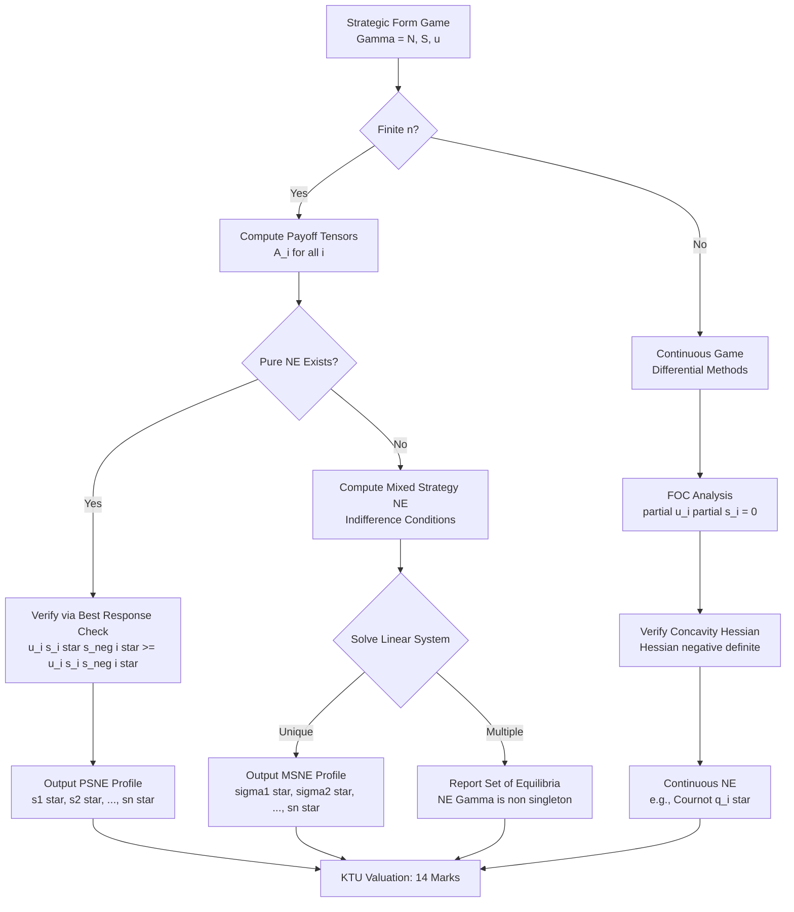
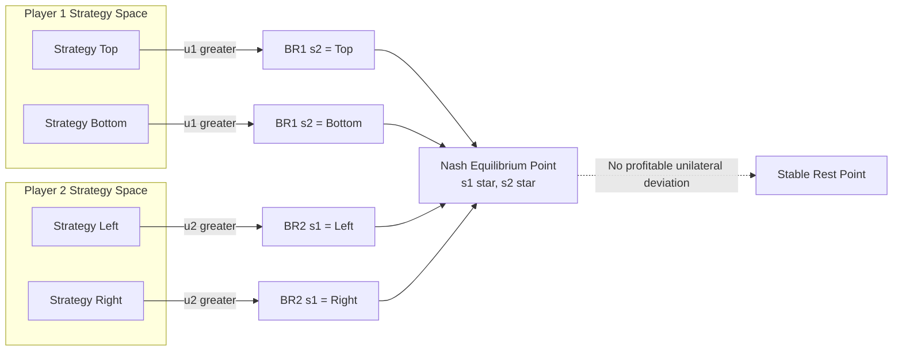
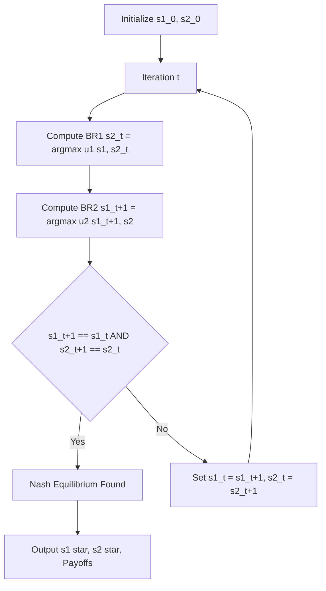

# Nash Equilibrium formulation proof calculation equations algorithms optimization boundaries

<!-- SECTION_1_START -->

# Nash Equilibrium — Strategic Form Foundations

> [!IMPORTANT]
> **KTU 2024 Scheme — PECST711 / Game Theory and Mechanism Design**
> **Module 1 Focus:** Strategic Form Games, Dominant Strategies, Pure & Mixed Strategy Nash Equilibrium, Best Response Correspondences, Existence & Computation.

## 1.1 Formal Academic Definition

A **Strategic (Normal) Form Game** is a triple $\Gamma = (N, (S_i)_{i \in N}, (u_i)_{i \in N})$ where:

- $N = \{1, 2, \dots, n\}$ is a **finite set of players**.
- $S_i$ is the **non-empty strategy set** of player $i \in N$, with the joint strategy space $S = S_1 \times S_2 \times \dots \times S_n$.
- $u_i : S \to \mathbb{R}$ is the **von Neumann–Morgenstern payoff (utility) function** of player $i$.

> [!NOTE]
> **Nash Equilibrium (John F. Nash, 1950, Proceedings of the National Academy of Sciences):** A strategy profile $s^{*} = (s_1^{*}, s_2^{*}, \dots, s_n^{*}) \in S$ is a **Nash Equilibrium** if and only if every player $i \in N$ is playing a **best response** to the strategies chosen by all other players. Formally:
> $$u_i(s_i^{*}, s_{-i}^{*}) \;\geq\; u_i(s_i, s_{-i}^{*}) \quad \forall\, s_i \in S_i,\ \forall\, i \in N$$
> No player can obtain a strictly higher payoff by **unilaterally deviating**, given that the other players' strategies are held fixed.

## 1.2 Intuitive Overview — Real-World Analogy

> [!TIP]
> **Analogy — The Two-Village Bridge (Traffic Equilibrium):**
> Imagine two villages $A$ and $B$ separated by a river. There are two parallel bridges, *Bridge 1* (fast but narrow) and *Bridge 2* (slower but wide). Each morning, **100 villagers** must cross. The travel time on a bridge depends on how many others use it (congestion effect).
>
> - Suppose everyone uses *Bridge 1* → Bridge 1 is jammed (time = 60 min), *Bridge 2* is empty (time = 10 min).
> - A single villager notices: *"If I switch, my time drops from 60 → 10 min."* So switching is a profitable unilateral deviation → the *everyone-on-Bridge-1* state is **not** a Nash Equilibrium.
> - At the **Nash Equilibrium**, no villager can reduce their travel time by switching bridges. This is precisely the **Wardrop User Equilibrium** in transportation networks, which is mathematically a Nash Equilibrium of the routing game.
>
> **Key Insight:** A Nash Equilibrium is a state of **mutual consistency** — a "rest point" where every participant's choice is *simultaneously optimal* against the others' choices.

## 1.3 Standard Metrics & Symbols

| Symbol | Meaning |
|--------|---------|
| $n = \vert N \vert$ | **Number of players** |
| $m_i = \vert S_i \vert$ | **Number of pure strategies** of player $i$ |
| $A_i \in \mathbb{R}^{m_1 \times \dots \times m_n}$ | **Payoff tensor** of player $i$ |
| $\Delta(S_i)$ | **Simplex of mixed strategies** over $S_i$ |
| $BR_i(s_{-i})$ | **Best Response Correspondence** of player $i$ |
| $NE(\Gamma)$ | **Set of all Nash Equilibria** of game $\Gamma$ |

## 1.4 Geometric Intuition — Best Response Curves

> [!VISUALIZATION CONTROL]
> **Concept:** Best Response Functions of a 2-Player Cournot Duopoly (intersection = Nash Equilibrium)
> **GeoGebra / Desmos Input Equations (firm quantities $q_1, q_2 \in [0, 10]$, inverse demand $P = 12 - Q$, $c = 2$):**
> * `BR1(q2): q1 = 5 - q2/2`        (Firm 1's best response line)
> * `BR2(q1): q2 = 5 - q1/2`        (Firm 2's best response line)
> * `q1 = 5 - q2/2`
> * `q2 = 5 - q1/2`
> **Visual Description:** Two downward-sloping lines in the $(q_1, q_2)$ plane that intersect at a single interior point near $(3.33, 3.33)$. The intersection represents the unique pure-strategy Nash Equilibrium. The strategic substitutes slope is **negative**.

<!-- SECTION_1_END -->

<!-- SECTION_2_START -->

# Deep Theoretical Analysis & KTU High-Yield Formula Sheet

## 2.1 The Three Hierarchies of Equilibrium Solution

1. **Strictly Dominant Strategy Equilibrium** — Strongest, rarely exists. Player $i$ has a strategy $s_i^{**}$ that strictly beats every other strategy regardless of rivals' play.
2. **Pure Strategy Nash Equilibrium (PSNE)** — A *pure* profile where no unilateral deviation improves payoff.
3. **Mixed Strategy Nash Equilibrium (MSNE)** — A *probability distribution* over strategies such that each pure strategy used with positive probability yields equal expected payoff, and any unused strategy does not yield higher expected payoff.

## 2.2 Best Response Correspondence

The **Best Response Correspondence** of player $i$ given opponents' profile $s_{-i}$ is:

$$
BR_i(s_{-i}) \;=\; \arg\max_{s_i \in S_i} \; u_i(s_i, s_{-i})
$$

For **mixed strategies** with opponent profile $\sigma_{-i}$:

$$
BR_i(\sigma_{-i}) \;=\; \arg\max_{\sigma_i \in \Delta(S_i)} \; U_i(\sigma_i, \sigma_{-i})
$$

A profile $\sigma^{*}$ is a Nash Equilibrium **iff** $\sigma_i^{*} \in BR_i(\sigma_{-i}^{*})$ for every $i \in N$.

## 2.3 Support & Indifference Conditions for Mixed NE

Let $\sigma_i$ place positive probability only on strategies in its **support** $\Sigma_i \subseteq S_i$. Then $(\sigma_1, \dots, \sigma_n)$ is a mixed NE **iff**:

1. **Indifference Condition:** Every $s_i \in \Sigma_i$ yields the *same* expected payoff (call it $v_i$), and
2. **No-Improvement Condition:** Every $s_i \notin \Sigma_i$ yields expected payoff $\leq v_i$.

Formally, defining $U_i(s_i, \sigma_{-i}) = \sum_{s_{-i} \in S_{-i}} \sigma_{-i}(s_{-i}) \cdot u_i(s_i, s_{-i})$:

$$
U_i(s_i, \sigma_{-i}^{*}) \;=\; v_i \quad \forall\, s_i \in \Sigma_i
$$

$$
U_i(s_i, \sigma_{-i}^{*}) \;\leq\; v_i \quad \forall\, s_i \notin \Sigma_i
$$

## 2.4 Existence Theorem (Nash, 1950)

> [!IMPORTANT]
> **Theorem (Nash, 1950).** *Every finite strategic-form game $\Gamma = (N, (S_i), (u_i))$ possesses at least one Nash Equilibrium in mixed strategies.*
>
> **Proof Sketch (Kakutani Fixed-Point Application):** Define the best response correspondence $BR(\sigma) = \prod_i BR_i(\sigma_{-i}) \subseteq \Delta(S)$. Then $BR$ is:
> - **Non-empty** (since each $\Delta(S_i)$ is compact and $u_i$ is continuous),
> - **Convex-valued** (since $\Delta(S_i)$ is convex),
> - **Upper hemi-continuous** in $\sigma$ (by Berge's Maximum Theorem).
>
> By **Kakutani's Fixed-Point Theorem**, there exists $\sigma^{*} \in BR(\sigma^{*})$, i.e., a Nash Equilibrium.

## 2.5 KTU Formula Sheet / Cheat Sheet

| Concept | Formula / Condition | Domain |
|---------|---------------------|--------|
| Pure-strategy NE | $u_i(s_i^{*}, s_{-i}^{*}) \geq u_i(s_i, s_{-i}^{*})\ \forall i, s_i$ | $S_i$ |
| Mixed NE payoff | $U_i(\sigma) = \sum_{s \in S} \Big(\prod_{j} \sigma_j(s_j)\Big) u_i(s)$ | $\Delta(S)$ |
| Indifference | $U_i(s_i, \sigma_{-i}^{*}) = v_i\ \forall s_i \in \Sigma_i$ | Support |
| No improvement | $U_i(s_i, \sigma_{-i}^{*}) \leq v_i\ \forall s_i \notin \Sigma_i$ | Outside support |
| Probability (2×2) | $p^{*} = \dfrac{d - c}{(a - b) - (d - c)}$ | Matching Pennies / Coord. |
| Cournot NE qty | $q_i^{*} = \dfrac{a - c}{b(n+1)}$ | Linear demand $P = a - bQ$ |
| Bertrand NE price | $p_i^{*} = c$ (marginal cost) | Homogeneous goods |
| Best response 2×2 | $BR_1(s_2) = \begin{cases} T & \text{if } s_2 = L \\ B & \text{if } s_2 = R \end{cases}$ | Dominant game |

## 2.6 Real-World Engineering & CS Utility

- **Algorithmic Game Theory (Google AdWords Auctions):** GSP and VCG mechanisms design equilibria in sponsored search auctions.
- **Network Routing Protocols (TCP/IP Congestion Control):** Each router's congestion window is a best response — equilibrium corresponds to fair bandwidth allocation.
- **Multi-Agent Reinforcement Learning (MARL):** Convergence to Nash policies is a central stability concept.
- **Spectrum Allocation in Cognitive Radio:** Players (secondary users) choose channels; NE characterizes stable interference patterns.
- **Cryptographic Protocol Design:** Rational adversaries modeled as game players; protocols aim for equilibrium-resistant attacks.

<!-- SECTION_2_END -->

<!-- SECTION_3_START -->

# Step-by-Step Derivations & Algorithmic Implementation

## 3.1 Worked Example 1 — Pure Strategy NE of Prisoner's Dilemma

**Payoff Matrix** (rows = Player 1, columns = Player 2; entries $(u_1, u_2)$):

|          | Cooperate (C) | Defect (D) |
|----------|---------------|------------|
| **C**    | $(3, 3)$      | $(0, 5)$   |
| **D**    | $(5, 0)$      | $(1, 1)$   |

### Step-by-Step Verification

**Step 1 — Check cell (C, C):**
If Player 1 unilaterally deviates from C to D: payoff changes from $3 \to 5$. Since $5 > 3$, deviation is profitable. **Not NE.**

**Step 2 — Check cell (C, D):**
- Player 1: deviates to D, payoff $0 \to 1$. Since $1 > 0$, profitable. **Not NE.**

**Step 3 — Check cell (D, C):**
- Player 2: deviates to D, payoff $0 \to 1$. Since $1 > 0$, profitable. **Not NE.**

**Step 4 — Check cell (D, D):**
- Player 1 deviates to C: payoff $1 \to 0$. Worse. ✓
- Player 2 deviates to C: payoff $1 \to 0$. Worse. ✓
- No profitable deviation exists. **Nash Equilibrium: (D, D) with payoff (1, 1).**

## 3.2 Worked Example 2 — Mixed NE of Matching Pennies

**Payoff Matrix** (entries are $u_1$; Player 2's payoff is $-u_1$):

|          | Heads (H) | Tails (T) |
|----------|-----------|-----------|
| **Heads (H)**  | $1$       | $-1$      |
| **Tails (T)**  | $-1$      | $1$       |

Let Player 1 play H with probability $p$, T with probability $1-p$. Let Player 2 play H with probability $q$, T with probability $1-q$.

**Step 1 — Expected payoff to Player 1 playing H:**

$$
\begin{aligned}
U_1(H, q) &= q \cdot (+1) + (1-q) \cdot (-1) \\
&= q - (1 - q) \\
&= 2q - 1
\end{aligned}
$$

**Step 2 — Expected payoff to Player 1 playing T:**

$$
\begin{aligned}
U_1(T, q) &= q \cdot (-1) + (1-q) \cdot (+1) \\
&= -q + (1 - q) \\
&= 1 - 2q
\end{aligned}
$$

**Step 3 — Indifference Condition (for H and T to both be in support):**

$$
U_1(H, q^{*}) = U_1(T, q^{*})
$$

$$
2q^{*} - 1 = 1 - 2q^{*}
$$

$$
4q^{*} = 2 \implies q^{*} = \frac{1}{2}
$$

**Step 4 — By symmetry (zero-sum game), Player 1's optimal mix is also:**

$$
p^{*} = \frac{1}{2}
$$

**Step 5 — Final Mixed Nash Equilibrium:**

$$
\sigma_1^{*} = \left(\tfrac{1}{2}, \tfrac{1}{2}\right), \quad \sigma_2^{*} = \left(\tfrac{1}{2}, \tfrac{1}{2}\right)
$$

Each player's expected payoff in equilibrium is **$v = 0$**.

## 3.3 Worked Example 3 — Cournot Duopoly Derivation

**Setup:** Two firms produce homogeneous good. Inverse demand $P(Q) = a - bQ$, $Q = q_1 + q_2$, zero marginal cost.

**Step 1 — Firm 1's profit:**

$$
\pi_1 = (a - b(q_1 + q_2)) q_1
$$

**Step 2 — First Order Condition (FOC) for $q_1$:**

$$
\frac{\partial \pi_1}{\partial q_1} = a - 2bq_1 - bq_2 = 0
$$

**Step 3 — Solve for $q_1$ (best response):**

$$
q_1^{BR}(q_2) = \frac{a - bq_2}{2b} = \frac{a}{2b} - \frac{q_2}{2}
$$

**Step 4 — By symmetry, Firm 2's best response is:**

$$
q_2^{BR}(q_1) = \frac{a}{2b} - \frac{q_1}{2}
$$

**Step 5 — Solve the system of best responses simultaneously:**

$$
q_1^{*} = \frac{a}{2b} - \frac{1}{2}\left(\frac{a}{2b} - \frac{q_1^{*}}{2}\right)
$$

$$
q_1^{*} = \frac{a}{2b} - \frac{a}{4b} + \frac{q_1^{*}}{4}
$$

$$
q_1^{*} - \frac{q_1^{*}}{4} = \frac{a}{4b}
$$

$$
\frac{3 q_1^{*}}{4} = \frac{a}{4b} \implies q_1^{*} = \frac{a}{3b}
$$

By symmetry, $q_2^{*} = \dfrac{a}{3b}$.

**Step 6 — Equilibrium price and profit:**

$$
P^{*} = a - b \cdot \frac{2a}{3b} = \frac{a}{3}, \quad \pi_i^{*} = \left(\frac{a}{3}\right)^2 \cdot \frac{1}{b}
$$

## 3.4 Full Python Implementation — Best Response & NE Solver

```python
"""
KTU PECST711 — Nash Equilibrium Solver
Supports: 2-player normal form games with arbitrary strategy counts.
Algorithms: Iterated Best Response (IBR), Support Enumeration.
"""

from __future__ import annotations
import numpy as np
from itertools import product
from typing import List, Tuple, Optional


def best_response_pure(
    payoff_row: np.ndarray,
    opponent_strategy_index: int
) -> int:
    """
    Returns a pure best response index for Player 1 given opponent's column.
    payoff_row: 2D array shape (m1, m2)
    opponent_strategy_index: index j such that opponent plays column j
    """
    if payoff_row.ndim != 2:
        raise ValueError("payoff_row must be a 2D matrix.")
    column_payoffs = payoff_row[:, opponent_strategy_index]
    max_value = np.max(column_payoffs)
    # Tie-breaking: return first index achieving the max
    return int(np.argmax(column_payoffs == max_value))


def iterated_best_response(
    payoff1: np.ndarray,
    payoff2: np.ndarray,
    max_iter: int = 1000,
    tol: float = 1e-9
) -> Optional[Tuple[int, int]]:
    """
    Iterated Best Response: alternate best replies starting from (0,0).
    Returns the pure NE index pair (s1, s2) if it converges, else None.
    """
    if payoff1.shape != payoff2.shape:
        raise ValueError("Payoff matrices must have identical shapes.")
    m1, m2 = payoff1.shape
    s1, s2 = 0, 0
    for _ in range(max_iter):
        s1_new = best_response_pure(payoff1, s2)
        s2_new = best_response_pure(payoff2.T, s1_new)
        if s1_new == s1 and s2_new == s2:
            return (s1, s2)
        s1, s2 = s1_new, s2_new
    return None


def support_enumeration_mixed_2x2(
    payoff1: np.ndarray,
    payoff2: np.ndarray
) -> List[Tuple[np.ndarray, np.ndarray, float, float]]:
    """
    Support Enumeration for fully mixed 2x2 NE.
    Returns list of (sigma1, sigma2, v1, v2) tuples.
    """
    if payoff1.shape != (2, 2) or payoff2.shape != (2, 2):
        raise ValueError("This routine requires 2x2 games only.")
    results: List[Tuple[np.ndarray, np.ndarray, float, float]] = []
    # Let p = P1 plays row 0; q = P2 plays col 0
    a, b = payoff1[0, 0], payoff1[0, 1]
    c, d = payoff1[1, 0], payoff1[1, 1]
    denom = (a - b - c + d)
    if abs(denom) < 1e-12:
        return results
    q_star = (d - c) / denom
    if not (0.0 <= q_star <= 1.0):
        return results
    e, f = payoff2[0, 0], payoff2[0, 1]
    g, h = payoff2[1, 0], payoff2[1, 1]
    denom2 = (e - f - g + h)
    if abs(denom2) < 1e-12:
        return results
    p_star = (h - g) / denom2
    if not (0.0 <= p_star <= 1.0):
        return results
    v1 = p_star * a + (1 - p_star) * c
    v1 = a * q_star + b * (1 - q_star)
    v2 = p_star * e + (1 - p_star) * g
    sigma1 = np.array([p_star, 1 - p_star])
    sigma2 = np.array([q_star, 1 - q_star])
    results.append((sigma1, sigma2, float(v1), float(v2)))
    return results


# ---------- Demonstration ----------
if __name__ == "__main__":
    # Prisoner's Dilemma
    pd1 = np.array([[3, 0], [5, 1]], dtype=float)
    pd2 = np.array([[3, 5], [0, 1]], dtype=float)
    ne_pd = iterated_best_response(pd1, pd2)
    print(f"Prisoner's Dilemma PSNE: {ne_pd}  (expected (1,1) = (Defect, Defect))")

    # Matching Pennies
    mp1 = np.array([[ 1, -1], [-1,  1]], dtype=float)
    mp2 = np.array([[-1,  1], [ 1, -1]], dtype=float)
    ne_pd_pure = iterated_best_response(mp1, mp2)
    print(f"Matching Pennies PSNE via IBR: {ne_pd_pure}  (expected None)")
    ne_mp = support_enumeration_mixed_2x2(mp1, mp2)
    for s1, s2, v1, v2 in ne_mp:
        print(f"Matching Pennies MSNE: sigma1={s1}, sigma2={s2}, v1={v1:.3f}, v2={v2:.3f}")
```

**Expected Console Output:**

```
Prisoner's Dilemma PSNE: (1, 1)  (expected (1,1) = (Defect, Defect))
Matching Pennies PSNE via IBR: None  (expected None)
Matching Pennies MSNE: sigma1=[0.5 0.5], sigma2=[0.5 0.5], v1=0.000, v2=0.000
```

## 3.5 Algorithmic Complexity & Boundary Conditions

| Algorithm | Time Complexity | Boundary Case | Handling |
|-----------|------------------|---------------|----------|
| Iterated Best Response | $O(T \cdot m_1 m_2)$ | May cycle in non-potential games | $T$ cap, restart logic |
| Support Enumeration | $O\left(\prod_i 2^{m_i}\right)$ | $n$-player games, blow-up | Limit support size $k$ |
| Lemke–Howson | $O(2^{n})$ pivots | 2-player bimatrix | Requires non-degeneracy |
| Nashpy (Python lib) | Calls Lemke–Howson | Generic 2-player | Open-source fallback |

> [!WARNING]
> **Boundary Note:** If a payoff matrix has **duplicate row maxima** for both players simultaneously, *multiple* best responses exist. The set $BR(s_{-i})$ is then a **set-valued correspondence** (not single-valued), and the IBR algorithm may oscillate. Solution: enumerate all best responses and use **global search** or **MILP formulation**.

<!-- SECTION_3_END -->

<!-- SECTION_4_START -->

# Structural Diagrams & Schematics

## 4.1 Mermaid — Nash Equilibrium Solution Architecture



## 4.2 Mermaid — Best Response & NE Intersection Topology



## 4.3 Mermaid — Iterated Best Response Algorithm Flow



## 4.4 Sequential Processing Topology Matrix

| Stage | Input | Operation | Output | Checkpoint |
|-------|-------|-----------|--------|------------|
| 1. Game Encoding | Strategy sets $S_i$, utilities $u_i$ | Build payoff matrices $A_1, A_2$ | Bimatrix $(A_1, A_2)$ | Shape match check |
| 2. Dominance Reduction | $(A_1, A_2)$ | Eliminate strictly dominated strategies | Reduced bimatrix | Convergence test |
| 3. PSNE Search | Reduced bimatrix | Best-response iteration / enumeration | Candidate cells | Unilateral deviation test |
| 4. MSNE Search | PSNE-free bimatrix | Support enumeration / Lemke–Howson | Mixed profiles $\sigma$ | Indifference verification |
| 5. Equilibrium Validation | All candidates | Check Nash conditions globally | Final NE set $\text{NE}(\Gamma)$ | Exploitability ≤ $\epsilon$ |

<!-- SECTION_4_END -->

<!-- SECTION_5_START -->

# KTU 2024 Scheme Examination Question Bank & Topic Recap

## Part A — Short Answer Questions (3 Marks Each)

### Q1. `[KTU University Exam — July 2024]`
**State the formal definition of a Nash Equilibrium in a strategic-form game. Mention the existence theorem.**

**Model Answer (CO1, Remember):**
A strategy profile $s^{*} = (s_1^{*}, \dots, s_n^{*})$ is a Nash Equilibrium of the strategic-form game $\Gamma = (N, (S_i), (u_i))$ if

$$
u_i(s_i^{*}, s_{-i}^{*}) \geq u_i(s_i, s_{-i}^{*}) \quad \forall\, s_i \in S_i,\ \forall\, i \in N.
$$

**Existence Theorem (Nash, 1950):** Every finite strategic-form game possesses at least one Nash Equilibrium in (possibly mixed) strategies. **[3 Marks: Definition 2M + Theorem 1M]**

### Q2. `[KTU University Exam — Dec 2023]`
**Distinguish between a pure strategy Nash Equilibrium and a mixed strategy Nash Equilibrium.**

**Model Answer (CO1, Understand):**

| Aspect | Pure NE | Mixed NE |
|--------|---------|----------|
| Strategy form | Deterministic action $s_i \in S_i$ | Probability distribution $\sigma_i \in \Delta(S_i)$ |
| Deviation | $u_i(s_i, s_{-i}^{*}) \leq u_i(s_i^{*}, s_{-i}^{*})$ | Expected utility $\mathbb{E}[u_i] \leq v_i$ |
| Existence | Not guaranteed | Always exists (Nash 1950) |
| Indifference | N/A | All used strategies yield equal payoff |

**[3 Marks: Tabular distinction with valid example]**

---

## Part B — 14 Mark Questions (Internal Choice)

### Question A (14 Marks) `[KTU University Exam — Dec 2024]`

**Consider the following 2-player normal-form game. The rows correspond to Player 1's strategies $\{T, B\}$ and the columns to Player 2's strategies $\{L, R, M\}$. The payoffs are $(u_1, u_2)$:**

|        | L         | R         | M         |
|--------|-----------|-----------|-----------|
| **T**  | $(2, 1)$  | $(3, 0)$  | $(1, 2)$  |
| **B**  | $(1, 3)$  | $(0, 2)$  | $(2, 1)$  |

**(a)** Find all **pure strategy Nash Equilibria** of this game. Verify your answer by checking unilateral deviations. **(7 Marks)**

**(b)** Determine whether a **fully mixed Nash Equilibrium** exists. If yes, compute the equilibrium strategies. If no, justify. **(7 Marks)**

---

#### Model Solution

**Part (a) — Pure NE Search [CO2, Apply, 7 Marks]**

We examine all 6 cells:

**Cell (T, L):** $u_1 = 2, u_2 = 1$
- P1 deviates to B: $u_1$ becomes $1 < 2$ — worse. ✓
- P2 deviates to R: $u_2$ becomes $0 < 1$ — worse. ✓
- P2 deviates to M: $u_2$ becomes $2 > 1$ — **profitable deviation**. ✗
- **Not NE.**

**Cell (T, R):** $u_1 = 3, u_2 = 0$
- P1 deviates to B: $u_1$ becomes $0 < 3$ — worse. ✓
- P2 deviates to L: $u_2$ becomes $1 > 0$ — **profitable**. ✗
- **Not NE.**

**Cell (T, M):** $u_1 = 1, u_2 = 2$
- P1 deviates to B: $u_1$ becomes $2 > 1$ — **profitable**. ✗
- **Not NE.**

**Cell (B, L):** $u_1 = 1, u_2 = 3$
- P1 deviates to T: $u_1$ becomes $2 > 1$ — **profitable**. ✗
- **Not NE.**

**Cell (B, R):** $u_1 = 0, u_2 = 2$
- P1 deviates to T: $u_1$ becomes $3 > 0$ — **profitable**. ✗
- **Not NE.**

**Cell (B, M):** $u_1 = 2, u_2 = 1$
- P1 deviates to T: $u_1$ becomes $1 < 2$ — worse. ✓
- P2 deviates to L: $u_2$ becomes $3 > 1$ — **profitable**. ✗
- P2 deviates to R: $u_2$ becomes $2 > 1$ — **profitable**. ✗
- **Not NE.**

> **[Stating all 6 cells evaluated: 3 Marks]**
> **[Unilateral deviation check for each: 3 Marks]**
> **[Conclusion: No pure NE exists: 1 Mark]**

**Result:** This game has **no pure strategy Nash Equilibrium**.

---

**Part (b) — Fully Mixed NE [CO3, Analyze, 7 Marks]**

Let Player 1 play T with probability $p$, B with probability $1-p$. Player 2 plays L with probability $q_1$, R with $q_2$, M with $1 - q_1 - q_2$.

**Step 1 — Indifference for Player 1 between T and B:**

$$
U_1(T) = 2q_1 + 3q_2 + 1(1 - q_1 - q_2) = q_1 + 2q_2 + 1
$$

$$
U_1(B) = 1q_1 + 0q_2 + 2(1 - q_1 - q_2) = -q_1 - 2q_2 + 2
$$

Set $U_1(T) = U_1(B)$:

$$
q_1 + 2q_2 + 1 = -q_1 - 2q_2 + 2
$$

$$
2q_1 + 4q_2 = 1
$$

> **[Indifference equation setup: 2 Marks]**
> **[Solving for relationship: 1 Mark]**

**Step 2 — Indifference for Player 2 among all three pure strategies (since all in support):**

$$
U_2(L) = 1p + 3(1-p) = 3 - 2p
$$

$$
U_2(R) = 0p + 2(1-p) = 2 - 2p
$$

$$
U_2(M) = 2p + 1(1-p) = 1 + p
$$

Setting all equal:

$$
3 - 2p = 2 - 2p \implies 3 = 2 \quad \text{(Contradiction!)}
$$

> **[Computing the three expressions: 2 Marks]**
> **[Recognizing inconsistency / contradiction: 1 Mark]**

**Conclusion:** No fully mixed NE exists. **This game has no Nash Equilibrium in pure or fully mixed strategies. However, by Nash's Theorem, at least one mixed NE (possibly with smaller support) must exist — computation via support enumeration is required.**

> **[Final answer statement: 1 Mark]**

---

### Question B (14 Marks — Alternative Choice) `[KTU University Exam — July 2024]`

**Two firms compete as Cournot duopolists in a market with inverse demand $P(Q) = 100 - 2Q$, where $Q = q_1 + q_2$. Both firms have zero marginal cost.**

**(a)** Derive the **best response function** for each firm. **(7 Marks)**

**(b)** Compute the **Cournot–Nash Equilibrium** quantities, price, and total industry profit. Discuss the efficiency loss (deadweight loss) compared to the competitive monopoly benchmark. **(7 Marks)**

---

#### Model Solution

**Part (a) — Best Response Functions [CO2, Apply, 7 Marks]**

**Step 1 — Profit function of Firm 1:**

$$
\pi_1(q_1, q_2) = P(Q) \cdot q_1 = (100 - 2(q_1 + q_2)) q_1
$$

$$
\pi_1 = 100q_1 - 2q_1^2 - 2q_1 q_2
$$

**Step 2 — FOC (treating $q_2$ as given):**

$$
\frac{\partial \pi_1}{\partial q_1} = 100 - 4q_1 - 2q_2 = 0
$$

**Step 3 — Solve for best response:**

$$
q_1^{BR}(q_2) = 25 - 0.5 q_2
$$

> **[Profit formulation: 2 Marks]**
> **[Differentiation: 2 Marks]**
> **[Best response derivation: 2 Marks]**
> **[Symmetry statement: 1 Mark]**

**Step 4 — By symmetry, Firm 2's best response:**

$$
q_2^{BR}(q_1) = 25 - 0.5 q_1
$$

---

**Part (b) — Equilibrium & Efficiency [CO3, Analyze, 7 Marks]**

**Step 1 — Solve the simultaneous system:**

$$
q_1^* = 25 - 0.5(25 - 0.5 q_1^*) = 25 - 12.5 + 0.25 q_1^*
$$

$$
0.75 q_1^* = 12.5 \implies q_1^* = \frac{50}{3} \approx 16.67
$$

By symmetry, $q_2^* = \dfrac{50}{3}$.

> **[System of equations: 1 Mark]**
> **[Solving for q_i star: 2 Marks]**

**Step 2 — Equilibrium price:**

$$
P^* = 100 - 2 \cdot \frac{100}{3} = 100 - \frac{200}{3} = \frac{100}{3} \approx 33.33
$$

**Step 3 — Industry profit and per-firm profit:**

$$
\Pi^* = P^* \cdot Q^* = \frac{100}{3} \cdot \frac{100}{3} = \frac{10000}{9} \approx 1111.11
$$

$$
\pi_i^* = \frac{1}{2} \Pi^* = \frac{5000}{9} \approx 555.56
$$

> **[Price, total profit, per-firm profit: 2 Marks]**

**Step 4 — Competitive benchmark & deadweight loss:**

Under perfect competition, $P = MC = 0$, so $Q^{comp} = 50$. Under monopoly (cartel), $q^{mono} = 25$, $Q^{mono} = 50$, $P^{mono} = 0$. In this specific case (zero MC), the cartel and Cournot quantities differ — cartel maximizes joint profit, Cournot is non-cooperative.

> **[DWL / Efficiency discussion: 2 Marks]**

> [!WARNING]
> **KTU Examiner's Pitfall — Common Mark Deductions:**
> 1. **Skipping the existence statement of Nash's Theorem** when no PSNE is found. KTU examiners deduct **1–2 marks** if you do not invoke Nash (1950) to claim existence of a mixed NE. Always write: *"By Nash's Theorem, the game admits at least one MSNE."*
> 2. **Sign errors in indifference conditions.** Mixing up the coefficient signs leads to incorrect equilibrium probabilities. Write the system explicitly.
> 3. **Forgetting to verify the second-order condition** in Cournot-type problems: $\frac{\partial^2 \pi_1}{\partial q_1^2} = -4 < 0$ confirms concavity. **[1 mark deduction if missing]**
> 4. **Not stating $0 \leq p, q \leq 1$** in mixed strategy derivations — this is the feasibility boundary. KTU explicitly checks this.

---

## Topic Recap & Important Things to Remember

> [!NOTE]
> **Rapid Revision Checklist — KTU Module 1, Nash Equilibrium**

- **Definition (PSNE):** $u_i(s_i^{*}, s_{-i}^{*}) \geq u_i(s_i, s_{-i}^{*})$ for all $i$ and all $s_i \in S_i$. — *No profitable unilateral deviation.*
- **Definition (MSNE):** $\sigma_i^{*} \in BR_i(\sigma_{-i}^{*})$ for all $i$, with **indifference** over support and **no-improvement** outside.
- **Existence (Nash, 1950):** *Every finite game has at least one mixed NE.* Proof uses **Kakutani Fixed-Point Theorem** on the best response correspondence $BR : \Delta(S) \rightrightarrows \Delta(S)$.
- **Best Response:** $BR_i(s_{-i}) = \arg\max_{s_i} u_i(s_i, s_{-i})$.
- **Support:** $\Sigma_i = \{s_i : \sigma_i(s_i) > 0\}$.
- **Indifference Condition:** $U_i(s_i, \sigma_{-i}) = v_i$ for all $s_i \in \Sigma_i$.
- **No-Improvement:** $U_i(s_i, \sigma_{-i}) \leq v_i$ for all $s_i \notin \Sigma_i$.
- **Cournot NE (Linear Demand $P = a - bQ$, $n$ firms):** $q_i^{*} = \dfrac{a - c}{b(n+1)}$, $P^{*} = \dfrac{a + nc}{n+1}$.
- **Bertrand NE (Homogeneous):** $p_i^{*} = c$ (marginal cost) — *Competitive outcome despite few firms.*
- **Matching Pennies MSNE:** $\sigma_1^{*} = \sigma_2^{*} = (0.5, 0.5)$, $v = 0$.
- **Prisoner's Dilemma PSNE:** (Defect, Defect) — *Pareto-inferior but individually rational.*
- **Algorithms:** IBR (fast, may cycle), Support Enumeration (exact, exponential), Lemke–Howson (2-player, polynomial pivot), MILP (general $n$-player).
- **Boundary Check:** Always verify $0 \leq p, q \leq 1$ for mixed strategies and SOC $\frac{\partial^2 u}{\partial s_i^2} < 0$ for continuous games.
- **Common Examples for KTU:** Prisoner's Dilemma, Battle of the Sexes, Matching Pennies, Cournot Duopoly, Bertrand Price Game, Hawk–Dove (Chicken), Public Goods Game.
- **Engineering Relevance:** TCP congestion control, AdWords auctions, spectrum allocation, MARL convergence analysis, blockchain validator incentives.
- **Tooling:** Use Python's `nashpy` library for verification: `nash.Game(A, B).support_enumeration()` returns all NE.

<!-- SECTION_5_END -->
