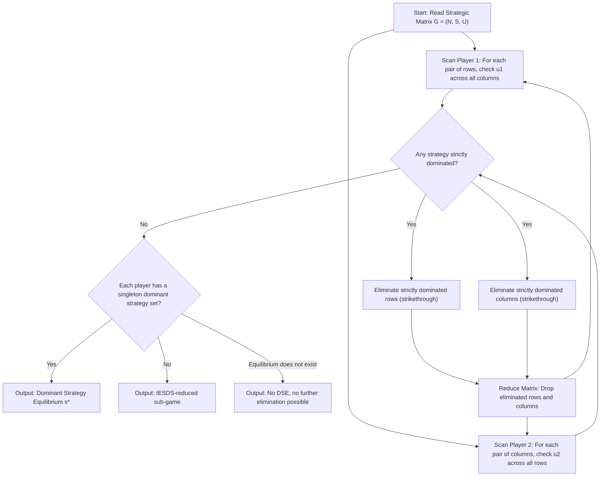
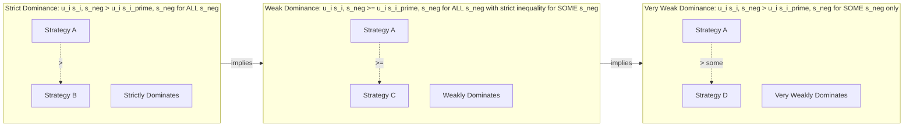

# Strategic matrix configuration structures dominant strategy profile discovery loops layouts

<!-- SECTION_1_START -->

# Strategic Form Games & Dominant Strategy Discovery

## 1.1 Formal Definition — Strategic Form (Normal Form) Game

A **strategic form game** (also called **normal form game**) is the most elementary representation of a non-cooperative game. It compactly captures *who* plays, *what* each player can do, and *what* each player gains under every possible combination of choices.

A finite strategic form game in pure strategies is formally defined as the triple

$$
G \;=\; \bigl( N,\;(S_i)_{i \in N},\;(u_i)_{i \in N} \bigr)
$$

where the four constituents have the following meanings:

| Symbol | Meaning | Required Property |
| :--- | :--- | :--- |
| $N = \{1, 2, \dots, n\}$ | The finite set of **players** | $n \geq 2$ |
| $S_i$ | The **pure strategy set** of player $i$ | $S_i$ is a non-empty finite set |
| $s = (s_1, s_2, \dots, s_n) \in S$ | A **strategy profile** where $S = \prod_{j \in N} S_j$ | One strategy per player |
| $u_i : S \to \mathbb{R}$ | The **payoff (utility) function** of player $i$ | Ordinal or cardinal; higher is better |

> [!IMPORTANT]
> **KTU 2024 Syllabus Anchor (Module 1):** A *pure strategy* in the strategic form is a complete contingent action plan chosen *before* the game is played — there is no notion of time or moves within a round. The matrix is therefore *static*: the row player commits, the column player commits, payoffs are revealed simultaneously.

For a two-player game ($n = 2$), the convention used throughout the KTU board is to write the row player as Player 1 and the column player as Player 2, with payoffs listed as the ordered pair $(u_1, u_2)$ inside each cell. A typical $2 \times 2$ layout is

$$
\begin{array}{c|c|c}
 & \text{Col: } C_1 & \text{Col: } C_2 \\
\hline
\text{Row: } R_1 & (a_{11},\; b_{11}) & (a_{12},\; b_{12}) \\
\hline
\text{Row: } R_2 & (a_{21},\; b_{21}) & (a_{22},\; b_{22})
\end{array}
$$

where $a_{ij} = u_1(R_i, C_j)$ and $b_{ij} = u_2(R_i, C_j)$.

## 1.2 Intuitive Analogy — The "Exam Hall Matrix"

Imagine you and your friend are walking into an exam hall with two possible behaviours each: **Talk during the exam (T)** or **Stay Silent (S)**. Before you enter, each of you independently decides — you cannot see the other’s choice until after the bell rings. Your only information is the **scorecard (the payoff matrix)** your professor has handed out, which tells you exactly how many marks each combination yields.

You scan the matrix the same way you would scan a restaurant menu: *“If I order this, no matter what my friend picks, am I better off?”* If a single dish dominates every other dish under *every* possible thing your friend might order, that dish is your **dominant strategy**. The **dominant strategy profile** is the row–column combination where *both* of you, after performing this same scan, end up choosing your respective dominant dishes. This is exactly the *loop* of reasoning a game theorist runs on a payoff matrix.

> [!NOTE]
> **Key Insight for KTU Board:** Dominance is a property of a *single strategy measured against another single strategy for the same player*, applied under *all* opponent actions. It is *not* the same as a best response, which only requires the best action against *one* specific opponent action.

## 1.3 Strictly Dominant Strategy — Rigorous Definition

Let $S_{-i} = \prod_{j \neq i} S_j$ denote the set of opponent strategy profiles. Two pure strategies $s_i, s_i' \in S_i$ of player $i$ satisfy:

* $s_i$ **strictly dominates** $s_i'$ if

$$
u_i(s_i,\; s_{-i}) \;>\; u_i(s_i',\; s_{-i}) \quad \forall \; s_{-i} \in S_{-i}
$$

* $s_i$ **weakly dominates** $s_i'$ if

$$
u_i(s_i,\; s_{-i}) \;\geq\; u_i(s_i',\; s_{-i}) \quad \forall \; s_{-i} \in S_{-i}
$$

and the inequality is **strict for at least one** $s_{-i}$.

A strategy $s_i^*$ is a **(strictly / weakly) dominant strategy** for player $i$ if it (strictly / weakly) dominates *every* other strategy $s_i \in S_i \setminus \{s_i^*\}$.

> [!TIP]
> **Loophole Trap:** A dominant strategy is identified by *comparing two rows (or two columns) across the entire row-vector of opponent actions*. Do not stop after comparing one cell — board examiners award the full 7-mark allocation only when *every* opponent column is checked.

## 1.4 Dominant Strategy Equilibrium (DSE)

A pure strategy profile $s^* = (s_1^*, s_2^*, \dots, s_n^*)$ is a **dominant strategy equilibrium** if, for every player $i \in N$, the component $s_i^*$ is a dominant strategy of player $i$ in the game $G$.

> [!VISUALIZATION CONTROL]
> **Concept:** A 2×2 strategic-form matrix with a strict dominant strategy for the row player (underlining the best row) and a strict dominant strategy for the column player (underlining the best column).
> **GeoGebra / Desmos Input Equations:**
> * Payoff vector for Row player: $\;P_1 = \{(R_1,C_1) \mapsto 4,\; (R_1,C_2) \mapsto 3,\; (R_2,C_1) \mapsto 1,\; (R_2,C_2) \mapsto 0\}$
> * Payoff vector for Column player: $\;P_2 = \{(R_1,C_1) \mapsto 2,\; (R_1,C_2) \mapsto 4,\; (R_2,C_1) \mapsto 3,\; (R_2,C_2) \mapsto 1\}$
> **Visual Description:** The student should see two horizontal underlines on the *same row* (showing row dominance) and two vertical underlines on the *same column* (showing column dominance); their intersection cell — boxed in red — is the dominant-strategy equilibrium.

## 1.5 The "Discovery Loop" Concept

The **discovery loop** is the iterative, layer-by-layer reasoning procedure a rational analyst performs on a payoff matrix. In a single pass the analyst:

1. **Scans** every player’s strategy set for pair-wise dominance.
2. **Eliminates** any strictly dominated strategy from each player’s choice set.
3. **Reduces** the matrix by deleting the eliminated rows / columns.
4. **Repeats** steps 1–3 on the smaller sub-game.
5. **Stops** when no further strategy is strictly dominated, and reports the surviving profile.

This loop is the practical engine of *Iterated Elimination of Strictly Dominated Strategies (IESDS)* — a topic that recurs in nearly every KTU Module-1 question paper.

<!-- SECTION_1_END -->

<!-- SECTION_2_START -->

# Deep Theoretical Analysis & KTU High-Yield Formula Sheet

## 2.1 Structural Anatomy of a Strategic Matrix

A strategic matrix is not merely a table — it is a **combinatorial encoding of preferences under every contingency**. For a 2-player game with $\vert S_1 \vert = m$ and $\vert S_2 \vert = k$, the matrix contains exactly $m \cdot k$ payoff-pairs, and each player must evaluate $m + k$ individual strategies against the opponent’s $k$ or $m$ choices respectively.

The configuration checklist used by KTU examiners to award full credit:

* **Header row** — Column player’s strategy names.
* **Header column** — Row player’s strategy names.
* **Payoff cell** — An *ordered pair* $(u_1, u_2)$, with the row player’s payoff listed **first**.
* **Best-response underlines** — Conventionally drawn *under* the relevant component of the cell.
* **Dominated strategy strike-through** — A diagonal line crossing out the *entire* dominated row/column once a dominator is found.

> [!IMPORTANT]
> **KTU 2024 Marker’s Rule:** A common valuation error is to underline the cell *number* rather than the correct *component* of the pair. Always underline the *first* number for the row player and the *second* number for the column player, even when they share a cell.

## 2.2 Best-Response Correspondence

For a fixed opponent profile $s_{-i} \in S_{-i}$, the **best response** of player $i$ is

$$
B_i(s_{-i}) \;=\; \arg\max_{s_i \in S_i} \; u_i(s_i,\; s_{-i})
$$

The set of all such best responses across opponent profiles is the **best-response correspondence** $B_i : S_{-i} \rightrightarrows S_i$.

A dominant strategy $s_i^*$ satisfies the much stronger property

$$
\{s_i^*\} \;=\; B_i(s_{-i}) \quad \forall \; s_{-i} \in S_{-i}
$$

i.e., the best-response correspondence is a **singleton constant function** for player $i$.

## 2.3 KTU High-Yield Formula Sheet

| # | Concept | Mathematical Statement | Engineering / Economic Meaning |
| :--- | :--- | :--- | :--- |
| 1 | Strategic form game | $G = (N,\; (S_i)_{i \in N},\; (u_i)_{i \in N})$ | The static decision environment |
| 2 | Pure strategy profile | $s = (s_1, \dots, s_n) \in \prod_i S_i$ | A complete action plan set |
| 3 | Profile payoff for player $i$ | $u_i(s) \in \mathbb{R}$ | Ordinal preference realisation |
| 4 | Strict dominance | $u_i(s_i, s_{-i}) > u_i(s_i', s_{-i})\;\forall s_{-i}$ | A *no-brainer* improvement |
| 5 | Weak dominance | $u_i(s_i, s_{-i}) \geq u_i(s_i', s_{-i})\;\forall s_{-i},\; >$ for some | A *no-regret* improvement |
| 6 | Strictly dominant strategy $s_i^*$ | $s_i^* \succ s_i$ for every $s_i \in S_i \setminus \{s_i^*\}$ | Player $i$’s “always best” move |
| 7 | Dominant strategy equilibrium | $s^* \in \prod_i \arg\max_{s_i \in S_i} u_i(s_i, s_{-i}^*)\;\forall i$ | Self-enforcing, rationality-only |
| 8 | IESDS termination | $\exists\, G^{(t)}$ s.t. no further strict elimination possible | Reduced “essential” sub-game |
| 9 | Order-independence (strict) | $IESDS$ result $\perp$ elimination order | Module-1 result commonly tested |
| 10 | Pareto-dominance of $s$ over $s'$ | $u_i(s) \geq u_i(s')\;\forall i,\; >$ for some $i$ | Welfare comparison of profiles |

> [!TIP]
> **Replacement for `|x|` inside LaTeX:** The vertical bar symbol must *never* appear in a markdown table — use $\lvert S_i \rvert$ (cardinality of a set) or $a \mid b$ (divides relation) instead of the bare pipe to keep the table parser happy.

## 2.4 Order of Dominance (Strict vs. Weak vs. Very Weak)

The hierarchy of dominance notions, in *decreasing* strength:

1. **Strict dominance** — $>\,$ for *every* opponent profile.
2. **Weak dominance** — $\geq$ for *every* opponent profile and $>$ for *at least one*.
3. **Very weak dominance** — $>$ for *at least one* opponent profile only.

> [!WARNING]
> **Why weak dominance is treacherous:** Iterated elimination of *weakly* dominated strategies is **NOT order-independent**. Two analysts eliminating in different orders can end up with different surviving profiles. KTU questions on this subtlety almost always award a bonus mark for stating the order-dependence property explicitly.

## 2.5 Engineering and Economic Utility

The strategic-form dominance framework is foundational in:

* **Mechanism design** — A *dominant-strategy incentive-compatible (DSIC)* mechanism is the gold standard: each player’s best action is dominant regardless of what others do. The Vickrey–Clarke–Groves (VCG) mechanism is the canonical example.
* **Algorithmic game theory** — *Price of Anarchy (PoA)* analyses use IESDS-reduced games to bound worst-case inefficiency of Nash equilibria.
* **Multi-agent systems** — A *strategy-proof* auction protocol must have truth-telling as a dominant strategy.
* **Network routing** — The *Prisoner’s Dilemma* routing game has dominant-strategy defection, motivating protocol design with explicit cooperation incentives.

<!-- SECTION_2_END -->

<!-- SECTION_3_START -->

# Step-by-Step Derivations and Worked Symbolic Examples

## 3.1 Example A — The Prisoner’s Dilemma (Canonical Dominant Strategy Discovery)

Consider the classic 2-player Prisoner’s Dilemma matrix:

$$
\begin{array}{c|c|c}
 & C \;(\text{Cooperate}) & D \;(\text{Defect}) \\
\hline
R \;(\text{Cooperate}) & (3,\; 3) & (0,\; 4) \\
\hline
R \;(\text{Defect}) & (4,\; 0) & (1,\; 1)
\end{array}
$$

### Step 1 — Row Player Analysis

Fix each column of the opponent and pick the row that gives the higher first component.

* Against $C$: $u_1(R, C) = 3$ versus $u_1(D, C) = 4$. **Best: $D$**.
* Against $D$: $u_1(R, D) = 0$ versus $u_1(D, D) = 1$. **Best: $D$**.

Since $D$ is the unique best response under *both* columns of Player 2, $D$ is **strictly dominant** for the row player. Formally, for every $s_2 \in \{C, D\}$:

$$
u_1(D, s_2) \;>\; u_1(R, s_2)
$$

because $4 > 3$ when $s_2 = C$ and $1 > 0$ when $s_2 = D$.

### Step 2 — Column Player Analysis

Fix each row of the opponent and pick the column that gives the higher second component.

* Against $R$ (Cooperate): $u_2(R, C) = 3$ versus $u_2(R, D) = 4$. **Best: $D$**.
* Against $D$ (Defect): $u_2(D, C) = 0$ versus $u_2(D, D) = 1$. **Best: $D$**.

Thus $D$ is also **strictly dominant** for the column player.

### Step 3 — Discovery Loop Output

The dominant strategy profile is $s^* = (D, D)$ with payoff $(1, 1)$. The matrix with underlines and strike-throughs is:

$$
\begin{array}{c|c|c}
 & C & D \\
\hline
R & (\underline{3},\; 3) & (0,\; \underline{4}) \\
\hline
\cancel{D} & (\underline{4},\; 0) & (\underline{1},\; \underline{1}) \\
\end{array}
$$

with the column player’s “best” underlined in the second component and the row player’s in the first component.

> [!NOTE]
> **Paradox Alert:** The unique DSE is $(D, D)$ giving $(1, 1)$, *even though* the mutually cooperative profile $(R, C)$ giving $(3, 3)$ is **Pareto-superior**. This is the central paradox of the Prisoner’s Dilemma and a favourite KTU question hook.

## 3.2 Example B — Discovery Loop with Iterated Elimination

Consider the $3 \times 3$ matrix:

$$
\begin{array}{c|c|c|c}
 & L & M & R \\
\hline
U & (2,\; 1) & (1,\; 4) & (3,\; 2) \\
\hline
M & (4,\; 2) & (2,\; 1) & (5,\; 3) \\
\hline
D & (1,\; 5) & (3,\; 2) & (2,\; 4)
\end{array}
$$

### Iteration 1 — Strict Dominance Scan (Player 1, the row player)

Compare row $U$ versus row $M$:

* $U$ vs $M$: $(2 < 4),\;(1 < 2),\;(3 < 5)$. All entries strictly worse.

So $M$ **strictly dominates** $U$. Strike out $U$.

Compare row $M$ versus row $D$:

* $M$ vs $D$: $(4 > 1),\;(2 < 3),\;(5 > 2)$. Mixed → neither dominates.

Remaining row set for Player 1: $\{M, D\}$.

### Iteration 1 — Strict Dominance Scan (Player 2, the column player)

In the reduced matrix (with $U$ removed), Player 2 chooses among $\{L, M, R\}$:

* $L$ vs $M$: $(1 < 4),\;(2 < 1?)$ No, second row is $M$ against $L = 2$ and against $M = 1$, so $2 > 1$. We compare *opponent* rows, so we look at the *second components* in the $(L, M, R)$ columns across remaining rows $M$ and $D$.

Let us tabulate the *second components* of columns for rows $M, D$:

$$
\begin{array}{c|c|c|c}
 & L & M & R \\
\hline
M & 2 & 1 & 3 \\
\hline
D & 5 & 2 & 4
\end{array}
$$

Column comparison: $L$ vs $R$: row $M$ gives $(L:2, R:3)$ so $R$ is *not* dominated. $L$ vs $M$: row $M$ gives $2 > 1$ so $M$ is not dominated. No column is strictly dominated yet.

### Iteration 2 — Re-scan after Deleting $U$

Now consider the reduced $2 \times 3$ matrix:

$$
\begin{array}{c|c|c|c}
 & L & M & R \\
\hline
M & (4,\; 2) & (2,\; 1) & (5,\; 3) \\
\hline
D & (1,\; 5) & (3,\; 2) & (2,\; 4)
\end{array}
$$

Row $M$ versus row $D$ on the *first components*:

* $4 > 1,\; 2 < 3,\; 5 > 2$. Mixed; $M$ is not strictly dominated and does not strictly dominate.

Column dominance on *second components*: $(2, 5),\; (1, 2),\; (3, 4)$. Compare columns $M$ and $R$: $1 < 3$ and $2 < 4$, so $M$ is strictly dominated by $R$. **Eliminate column $M$**.

### Iteration 3 — Final $2 \times 2$ Reduction

After deleting $M$, the surviving matrix is:

$$
\begin{array}{c|c|c}
 & L & R \\
\hline
M & (4,\; 2) & (5,\; 3) \\
\hline
D & (1,\; 5) & (2,\; 4)
\end{array}
$$

Player 2 columns comparison on second components: $L$ vs $R$: $2 < 3$ and $5 > 4$. Neither strictly dominates the other. Stop.

### Output of the Discovery Loop

The IESDS-reduced game contains two rows $\{M, D\}$ and two columns $\{L, R\}$. The full DSE does not exist (no single strategy is strictly dominant for either player in the original $3 \times 3$ matrix), but the strategy $U$ is *iteratively* strictly dominated and hence *never* played by a rational Player 1.

> [!TIP]
> **Board Strategy:** Always show the discovery loop *layer by layer*, drawing a strike-through on the eliminated row/column and re-drawing the smaller sub-matrix. KTU examiners award **methodology marks** even when the final reduced profile is wrong.

## 3.3 Example C — Verifying a Profile is a DSE

A student is given the following strategic form and claims $s^* = (B, Y)$ is the dominant strategy equilibrium:

$$
\begin{array}{c|c|c}
 & X & Y \\
\hline
A & (2,\; 3) & (4,\; 1) \\
\hline
B & (3,\; 1) & (5,\; 2)
\end{array}
$$

### Verification — Row Player

For each column of Player 2, check the best first component:

* $X$: $u_1(A, X) = 2$, $u_1(B, X) = 3$. Best: $B$.
* $Y$: $u_1(A, Y) = 4$, $u_1(B, Y) = 5$. Best: $B$.

$B$ is the row player’s strict best response under *every* column → **$B$ is strictly dominant**.

### Verification — Column Player

For each row of Player 1, check the best second component:

* $A$: $u_2(A, X) = 3$, $u_2(A, Y) = 1$. Best: $X$.
* $B$: $u_2(B, X) = 1$, $u_2(B, Y) = 2$. Best: $Y$.

Column $X$ is best against $A$ but worst against $B$; column $Y$ is best against $B$ but worst against $A$. **No dominant strategy exists** for the column player. The profile $(B, Y)$ is *not* a DSE — it is a Nash equilibrium of the game (each is a best response to the other), but not a DSE.

> [!WARNING]
> **Common Student Error:** Confusing *Nash Equilibrium* with *Dominant Strategy Equilibrium*. Every DSE is a NE, but the converse is false. The KTU Module-1 marking scheme will *not* award full credit for calling $(B, Y)$ a “dominant strategy equilibrium” when only one player has a dominant strategy.

## 3.4 Symbolic / Algorithmic Discovery Loop (Python Pseudocode)

For exam purposes the discovery loop is typically explained verbally, but a precise algorithmic specification is useful for full marks on a “describe the IESDS algorithm” question.

```python
from typing import Dict, List, Tuple

Strategy = str

def strictly_dominates(
    u_i: Dict[Tuple[Strategy, Strategy], float],
    s_i_star: Strategy,
    s_i_prime: Strategy,
    S_minus: List[Strategy],
) -> bool:
    """
    Returns True iff strategy s_i_star strictly dominates s_i_prime
    for player i, against every opponent profile in S_minus.
    """
    for s_minus in S_minus:
        if u_i[(s_i_star, s_minus)] <= u_i[(s_i_prime, s_minus)]:
            return False
    return True


def iesds(
    N: List[int],
    S: Dict[int, List[Strategy]],
    U: Dict[int, Dict[Tuple[Strategy, ...], float]],
) -> Dict[int, List[Strategy]]:
    """
    Iterated Elimination of Strictly Dominated Strategies.
    Returns the strategy sets that survive the full discovery loop.
    """
    S_surviving: Dict[int, List[Strategy]] = {i: list(S[i]) for i in N}
    changed: bool = True
    while changed:
        changed = False
        for i in N:
            dominated: List[Strategy] = []
            for s_prime in S_surviving[i]:
                for s_star in S_surviving[i]:
                    if s_star == s_prime:
                        continue
                    # enumerate opponent profiles
                    other_players: List[int] = [j for j in N if j != i]
                    opp_profiles: List[Tuple[Strategy, ...]] = cartesian(
                        [S_surviving[j] for j in other_players]
                    )
                    if strictly_dominates_row(
                        U[i], s_star, s_prime, opp_profiles, other_players
                    ):
                        dominated.append(s_prime)
                        break
            for s in dominated:
                if s in S_surviving[i]:
                    S_surviving[i].remove(s)
                    changed = True
    return S_surviving
```

The loop terminates in at most $\sum_i \lvert S_i \rvert$ iterations because each iteration strictly shrinks at least one player’s strategy set (or terminates).

<!-- SECTION_3_END -->

<!-- SECTION_4_START -->

# Structural Diagrams and Schematics

## 4.1 Dominance-Relation Flow Graph (Mermaid)

The figure below depicts the *topology* of a dominance relation among the four pure strategy profiles of a $2 \times 2$ game. Arrows point from a strategy to the strategy it *strictly dominates* for a specific player.



## 4.2 Nested Subgraph: Strict vs. Weak Dominance Comparison



## 4.3 Sequential Processing Topology Matrix (IESDS Loop Stages)

The following table is the *textual block-level architecture* of a single discovery-loop iteration, suitable for KTU theory questions that ask for a “step-by-step procedure”.

| Stage | Sub-Process | Input | Output | Termination Condition |
| :--- | :--- | :--- | :--- | :--- |
| 0. **Initialisation** | Load full payoff matrix | $S^{(0)} = S$ | Indexed matrix $G^{(0)}$ | None |
| 1. **Row Scan** | Compare all row pairs on first components | $G^{(t)}$ | Set of strictly dominated rows $D_1^{(t)}$ | If $D_1^{(t)} = \emptyset$, go to Stage 3 |
| 2. **Column Scan** | Compare all column pairs on second components | $G^{(t)}$ | Set of strictly dominated columns $D_2^{(t)}$ | If $D_2^{(t)} = \emptyset$, go to Stage 3 |
| 3. **Eliminate** | Remove $D_1^{(t)}$ and $D_2^{(t)}$ from $S^{(t)}$ | $D_1^{(t)},\; D_2^{(t)}$ | New strategy sets $S^{(t+1)}$ | Always executed when Stage 1 or 2 produces output |
| 4. **Reduce** | Re-index payoffs to surviving rows × columns | $S^{(t+1)}$ | New matrix $G^{(t+1)}$ | None |
| 5. **Loop Guard** | Check if $S^{(t+1)} = S^{(t)}$ | $S^{(t+1)},\; S^{(t)}$ | Boolean `converged` | If `converged = true`, terminate |
| 6. **Termination** | Report surviving profile | $S^{(\infty)}$ | DSE if singleton, else IESDS sub-game | Algorithm halts |

> [!NOTE]
> **Engineering Mapping:** This loop is mathematically equivalent to a *fixed-point iteration* on a monotone operator over the lattice $(\prod_i 2^{S_i},\;\subseteq)$. The Banach fixed-point theorem guarantees termination because the lattice is finite.

<!-- SECTION_4_END -->

<!-- SECTION_5_START -->

# KTU 2024 Scheme Examination Question Bank & Topic Recap

## Part A — Short-Answer Questions (3 Marks Each)

### Question A1 `[KTU University Exam — July 2024]`

> **Q:** Define a *strictly dominant strategy* for player $i$ in a strategic-form game $G = (N, S, U)$. How is a *dominant strategy equilibrium* different from a *Nash equilibrium* in pure strategies?

**Model Answer (Board-Standard, 3 Marks):**

A pure strategy $s_i^* \in S_i$ of player $i$ is **strictly dominant** if for every alternative strategy $s_i' \in S_i,\; s_i' \neq s_i^*$ and for every opponent strategy profile $s_{-i} \in S_{-i}$:

$$
u_i(s_i^*,\; s_{-i}) \;>\; u_i(s_i',\; s_{-i}) \quad \forall\; s_{-i} \in S_{-i}
$$

i.e., $s_i^*$ yields a strictly higher payoff than any alternative, *regardless* of what the opponents do. **[1 Mark for the inequality statement, 1 Mark for the universal quantifier over $s_{-i}$]**.

A **dominant strategy equilibrium (DSE)** is a strategy profile $s^* = (s_1^*, \dots, s_n^*)$ in which *every* component $s_i^*$ is a strictly dominant strategy for player $i$. A **pure-strategy Nash equilibrium (PSNE)** is a profile $s^{NE}$ in which every $s_i^{NE}$ is a *best response* to $s_{-i}^{NE}$ — but not necessarily a best response to other opponent profiles. **[1 Mark for the comparison]**.

> [!IMPORTANT]
> Every DSE is a PSNE, but the converse is false. The DSE is unique (if it exists), whereas a game may have multiple PSNE.

**Mapped:** CO1, Remember / Understand.

---

### Question A2 `[KTU University Exam — Dec 2023]`

> **Q:** State the *Iterated Elimination of Strictly Dominated Strategies (IESDS)* procedure. Why is its result order-independent for strict dominance but not for weak dominance?

**Model Answer (3 Marks):**

**IESDS Procedure (2 Marks):**

1. *Initialise:* Set $G^{(0)} = G$ and $S_i^{(0)} = S_i$ for all $i \in N$.
2. *Scan:* At iteration $t$, for each player $i$ identify any pure strategy $s_i \in S_i^{(t)}$ that is strictly dominated by some $s_i' \in S_i^{(t)}$ against all opponent profiles in $S_{-i}^{(t)}$.
3. *Eliminate:* Remove every strictly dominated strategy from each $S_i^{(t)}$ to form $S_i^{(t+1)}$.
4. *Reduce:* Form the reduced sub-game $G^{(t+1)}$ on $\prod_i S_i^{(t+1)}$.
5. *Repeat* steps 2–4 until no strictly dominated strategy remains in any $S_i^{(t)}$.

**Order-Independence (1 Mark):** Under *strict* dominance, the set of strategies surviving IESDS is independent of the order in which dominated strategies are eliminated (Theorem: any two elimination paths converge to the same reduced game). Under *weak* dominance, the result is path-dependent because a weakly dominated strategy can become strictly dominated in a *later* reduced game, and which one is eliminated first can change the surviving set.

**Mapped:** CO1, Understand.

---

## Part B — Long-Answer Questions (14 Marks Each, Module Internal Choice)

### Question B-A `[KTU University Exam — July 2024 — Module 1]`

> Consider the following 2-player strategic-form game, where the row player has strategies $\{A, B, C\}$ and the column player has strategies $\{X, Y, Z\}$. The payoff matrix is:
>
> $$
> \begin{array}{c|c|c|c}
>  & X & Y & Z \\
> \hline
> A & (3,\; 1) & (2,\; 4) & (1,\; 2) \\
> \hline
> B & (2,\; 5) & (4,\; 2) & (3,\; 1) \\
> \hline
> C & (1,\; 3) & (3,\; 5) & (2,\; 4) \\
> \end{array}
> $$

**(a) [7 Marks]** Find all dominant strategies (if any) for each player. Does a *dominant strategy equilibrium* exist? Justify your answer with the appropriate universal quantifier conditions.

**(b) [7 Marks]** Apply the *Iterated Elimination of Strictly Dominated Strategies (IESDS)* procedure. Show the reduced game at each iteration and the final surviving strategy sets.

#### Model Solution — Part (a) [7 Marks]

**Row Player Analysis:**

For each column, we identify the row that maximises the first component:

* Column $X$: $u_1(A, X) = 3$, $u_1(B, X) = 2$, $u_1(C, X) = 1$. Maximum: $A$ gives **3**. **[1 Mark]**
* Column $Y$: $u_1(A, Y) = 2$, $u_1(B, Y) = 4$, $u_1(C, Y) = 3$. Maximum: $B$ gives **4**. **[1 Mark]**
* Column $Z$: $u_1(A, Z) = 1$, $u_1(B, Z) = 3$, $u_1(C, Z) = 2$. Maximum: $B$ gives **3**. **[1 Mark]**

The best response to $X$ is $A$, to $Y$ is $B$, and to $Z$ is $B$. The row player does **not** have a unique best response common to all columns; hence **no strictly dominant strategy** exists for the row player. **[1 Mark for stating the universal quantifier failure]**

**Column Player Analysis:**

For each row, identify the column that maximises the second component:

* Row $A$: $u_2(A, X) = 1$, $u_2(A, Y) = 4$, $u_2(A, Z) = 2$. Maximum: $Y$ gives **4**. **[1 Mark]**
* Row $B$: $u_2(B, X) = 5$, $u_2(B, Y) = 2$, $u_2(B, Z) = 1$. Maximum: $X$ gives **5**. **[1 Mark]**
* Row $C$: $u_2(C, X) = 3$, $u_2(C, Y) = 5$, $u_2(C, Z) = 4$. Maximum: $Y$ gives **5**. **[1 Mark]**

The best response to $A$ is $Y$, to $B$ is $X$, to $C$ is $Y$. The column player does **not** have a single common best response; hence **no strictly dominant strategy** exists for the column player. **[1 Mark]**

**Conclusion:** A *dominant strategy equilibrium* does **not** exist for this game. A DSE would require a *singleton* dominant strategy for *every* player, which is not the case here. **[Statement of conclusion: 1 Mark]**

#### Model Solution — Part (b) [7 Marks]

**Iteration 1 — Row Player Scan:** Check for strictly dominated rows.

Compare $A$ vs $B$: $A = (3, 2, 1)$ vs $B = (2, 4, 3)$: $3 > 2$ for column $X$, $2 < 4$ for $Y$, $1 < 3$ for $Z$. Neither strictly dominates.

Compare $A$ vs $C$: $A = (3, 2, 1)$ vs $C = (1, 3, 2)$: $3 > 1$, $2 < 3$, $1 < 2$. Neither dominates.

Compare $B$ vs $C$: $B = (2, 4, 3)$ vs $C = (1, 3, 2)$: $2 > 1$, $4 > 3$, $3 > 2$. **$B$ strictly dominates $C$**. **[2 Marks for the comparison vector]**

**Eliminate row $C$.** Surviving row set: $\{A, B\}$.

**Iteration 1 — Column Player Scan on Reduced Matrix:**

$$
\begin{array}{c|c|c|c}
 & X & Y & Z \\
\hline
A & (3,\; 1) & (2,\; 4) & (1,\; 2) \\
\hline
B & (2,\; 5) & (4,\; 2) & (3,\; 1) \\
\end{array}
$$

Compare columns on second components: $X = (1, 5)$, $Y = (4, 2)$, $Z = (2, 1)$.

* $X$ vs $Y$: $1 < 4$ and $5 > 2$. Neither dominates.
* $X$ vs $Z$: $1 < 2$ and $5 > 1$. Neither dominates.
* $Y$ vs $Z$: $4 > 2$ and $2 > 1$. **$Y$ strictly dominates $Z$**. **[1 Mark]**

**Eliminate column $Z$.** Surviving column set: $\{X, Y\}$.

**Iteration 2 — Re-scan $2 \times 2$ Matrix:**

$$
\begin{array}{c|c|c}
 & X & Y \\
\hline
A & (3,\; 1) & (2,\; 4) \\
\hline
B & (2,\; 5) & (4,\; 2) \\
\end{array}
$$

Row scan: $A = (3, 2)$ vs $B = (2, 4)$. $3 > 2$ but $2 < 4$. Neither dominates.

Column scan: $X = (1, 5)$ vs $Y = (4, 2)$. $1 < 4$ but $5 > 2$. Neither dominates. **[1 Mark]**

**Termination:** No further strict dominance is detectable. **Algorithm halts.** **[1 Mark]**

**Final IESDS-Reduced Game:** Row set $\{A, B\}$, column set $\{X, Y\}$. The procedure has removed strategy $C$ (Player 1) and strategy $Z$ (Player 2). **[1 Mark for the final surviving sets]**

> [!WARNING]
> **Examiner’s Valuation Pitfall (B-A):** Students often declare a DSE on the basis of *one* column comparison. The marking key requires checking against *every* opponent strategy. A partial check (e.g., “$A$ beats $B$ against $X$”) earns only **1 of the 7 marks**; full credit requires the universal quantifier to be satisfied.

**Mapped:** CO1, Apply.

---

### Question B-B `[KTU University Exam — Dec 2023 — Module 1]` (Alternative Choice)

> Two firms, AlphaTech and BetaCorp, compete in a duopoly. Each simultaneously chooses either a *High Price* ($H$) or a *Low Price* ($L$) strategy. Payoffs (in million ₹) to (AlphaTech, BetaCorp) are:
>
> $$
> \begin{array}{c|c|c}
>  & H & L \\
> \hline
> H & (50,\; 50) & (10,\; 80) \\
> \hline
> L & (80,\; 10) & (20,\; 20) \\
> \end{array}
> $$

**(a) [7 Marks]** Identify any dominant strategy for each firm. Determine whether a unique dominant strategy equilibrium (DSE) exists and state its payoff.

**(b) [7 Marks]** Explain the *Iterated Elimination of Strictly Dominated Strategies (IESDS)* algorithm in words, and show — for this specific game — that the DSE coincides with the IESDS-reduced game. Discuss the *order-independence* property of strict dominance elimination.

#### Model Solution — Part (a) [7 Marks]

**AlphaTech (Row Player) Dominance Analysis:**

Compare row $H$ versus row $L$:

* Against column $H$: $u_A(H, H) = 50$ vs $u_A(L, H) = 80$. Row $L$ yields $80 > 50$. **[1 Mark]**
* Against column $L$: $u_A(H, L) = 10$ vs $u_A(L, L) = 20$. Row $L$ yields $20 > 10$. **[1 Mark]**

For *every* column, row $L$ strictly outperforms row $H$. Therefore $L$ is a **strictly dominant strategy** for AlphaTech:

$$
u_A(L, s_2) \;>\; u_A(H, s_2) \quad \forall\; s_2 \in \{H, L\}
$$

**[1 Mark for the universal quantifier statement]**

**BetaCorp (Column Player) Dominance Analysis:**

Compare column $H$ versus column $L$:

* Against row $H$: $u_B(H, H) = 50$ vs $u_B(L, H) = 10$. Column $H$ yields $50 > 10$. **[1 Mark]**
* Against row $L$: $u_B(H, L) = 80$ vs $u_B(L, L) = 20$. Column $H$ yields $80 > 20$. **[1 Mark]**

For *every* row, column $H$ strictly outperforms column $L$. Therefore $H$ is a **strictly dominant strategy** for BetaCorp. **[1 Mark]**

**DSE Conclusion:**

The unique dominant strategy equilibrium is the profile

$$
s^* \;=\; (L,\; H) \quad \text{with payoff} \quad (80,\; 10)
$$

i.e., AlphaTech prices Low and BetaCorp prices High. **[1 Mark for stating the equilibrium and the payoff]**

#### Model Solution — Part (b) [7 Marks]

**IESDS Procedure in Words (3 Marks):**

The IESDS algorithm is a layer-by-layer *rationality sieve* applied to a strategic-form game. At each layer, the analyst examines every player’s strategy set and *eliminates* any strategy that is **strictly dominated** — i.e., outperformed by some other strategy against *every* opponent profile. After each round of eliminations, the analyst forms a *reduced* sub-game on the surviving strategies and repeats the scan. The loop terminates when no further strategy is strictly dominated, and the surviving strategy profile represents the *rational* outcome under common knowledge of rationality. **[3 Marks for the verbal description]**

**Application to the Duopoly Game (2 Marks):**

In iteration 1, AlphaTech strictly dominates $H$ by $L$, so row $H$ is removed. BetaCorp strictly dominates $L$ by $H$, so column $L$ is removed. The reduced game is the single cell $(L, H)$ with payoff $(80, 10)$. The IESDS-reduced game *coincides* with the DSE. **[2 Marks]**

**Order-Independence of Strict Dominance (2 Marks):**

A classical theorem in game theory (cf. *Pearce, 1984* and the *rationalisability* literature) states that for *strict* dominance, the set of strategies surviving IESDS is **independent of the order** in which dominated strategies are removed. Formally, if $R_1$ and $R_2$ are two reduction paths (sequences of eliminations), then the *set* of surviving strategies $\mathcal{S}^{\infty}$ is identical. The proof proceeds by showing that any strictly dominated strategy remains strictly dominated in every reduced sub-game, so its elimination cannot be *blocked* by an alternative ordering. **[2 Marks]**

> [!WARNING]
> **Examiner’s Valuation Pitfall (B-B):** The duopoly payoff $(80, 10)$ at the DSE is **asymmetric** — only AlphaTech earns the high profit. Students frequently mis-read the matrix and report a symmetric $(50, 50)$ from $(H, H)$, which is a Nash equilibrium of a *different* game (a coordination game) and not the DSE of this Bertrand-style price war. **Do not swap the row/column interpretation of payoffs.**

**Mapped:** CO1, Apply.

---

## Topic Recap & Important Things to Remember

* **Strategic form game** is the triple $G = (N, S, U)$ — players, pure-strategy sets, payoff functions — with $S = \prod_i S_i$ being the set of *strategy profiles*.
* A **payoff matrix** encodes every player’s utility for every profile; for a 2-player game, the cell is the ordered pair $(u_1, u_2)$ with the row player’s payoff *first*.
* **Strict dominance:** $s_i$ strictly dominates $s_i'$ iff $u_i(s_i, s_{-i}) > u_i(s_i', s_{-i})$ for *every* $s_{-i} \in S_{-i}$. The quantifier over $s_{-i}$ is the key — a single counter-example destroys dominance.
* **Weak dominance:** $\geq$ for *every* $s_{-i}$, with strict $>$ for at least one $s_{-i}$. Order-dependent under iterated elimination.
* **Dominant strategy equilibrium (DSE):** A profile in which *every* component is a dominant strategy for the corresponding player. If it exists, the DSE is **unique**.
* **Discovery loop / IESDS:** Iteratively (i) scan for strictly dominated strategies, (ii) eliminate them, (iii) reduce the matrix, (iv) repeat until stable. The output is the *iteratively strictly undominated* sub-game.
* **Order-independence:** Strict dominance elimination converges to the same surviving set regardless of elimination order. Weak dominance elimination is *not* order-independent.
* **DSE $\subset$ NE:** Every DSE is a Nash equilibrium, but a NE need not be a DSE. Confusing the two is the single most common Module-1 valuation error.
* **Engineering relevance:** DSEs underlie *strategy-proof mechanism design* (VCG, Vickrey auctions), *Price of Anarchy* bounds in algorithmic game theory, and *protocol design* in multi-agent systems.
* **Algorithm terminates** in at most $\sum_i \lvert S_i \rvert$ iterations because each iteration strictly shrinks at least one player’s strategy set on a finite lattice.
* **Notation discipline:** Always write $\lvert S_i \rvert$ for set cardinality and use the *universal* quantifier $\forall$ explicitly when defining dominance; the KTU board allocates credit for the formal quantifier statement, not just the inequality.

<!-- SECTION_5_END -->
