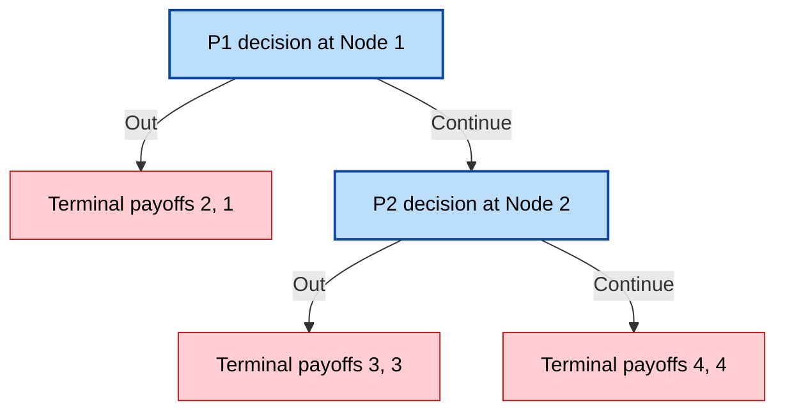
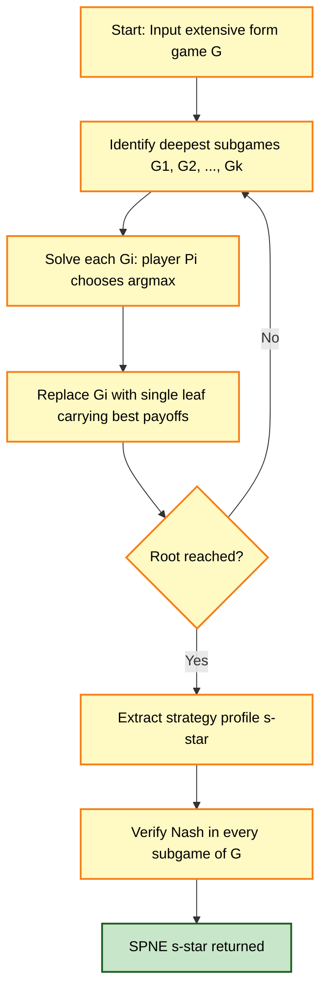
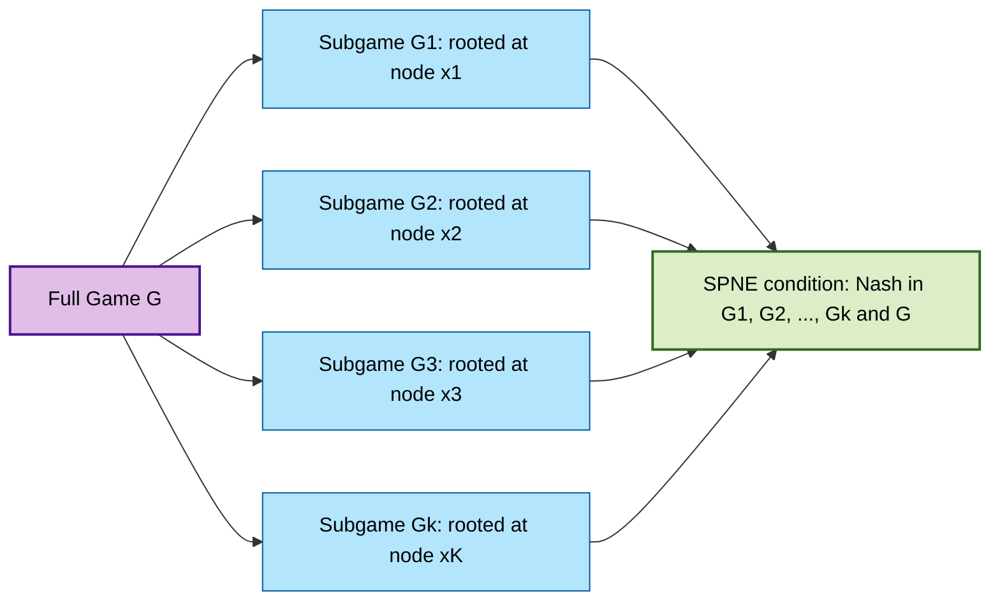

# Subgame perfect refinement models validation paths scales tracks setups profiles

<!-- SECTION_1_START -->
# Subgame Perfect Equilibrium — Refinement of Nash Equilibrium

## 1.1 Formal Definition (Reinhard Selten, 1965)

> [!IMPORTANT]
> **Subgame Perfect Nash Equilibrium (SPNE)** is a strategy profile $s^* = (s_1^*, s_2^*, \dots, s_n^*)$ in an extensive form game $\Gamma$ such that $s^*$ constitutes a **Nash Equilibrium** in **every subgame** of $\Gamma$.

Formally, for every non-trivial subgame $G'$ of $\Gamma$, the restriction of $s^*$ to $G'$, denoted $s^* \vert_{G'}$, is a Nash Equilibrium of $G'$.

- **Subgame**: A subgame of an extensive form game is a subset of the game tree that (i) starts at a **single decision node** belonging to a singleton information set, (ii) contains all successors of that node, and (iii) does not cut any information set.
- **Trivial subgame** (the whole game itself) is always a valid subgame; SPNE therefore implies NE of the full game, but the converse **fails** in games with off-path moves.
- Selten's contribution (1965) earned him the **Nobel Memorial Prize in Economic Sciences in 1994** alongside John Harsanyi and John Nash.

## 1.2 Intuitive Analogy — The Chess Player's Notebook

> [!NOTE]
> **Analogy — A Chess Grandmaster's Complete Planbook**

Imagine a chess grandmaster who writes down a complete planbook before the match. The planbook specifies a move for *every* board position that *could* arise, even positions that the planbook itself says will never be reached. A Nash Equilibrium corresponds to a planbook where the grandmaster cannot improve their outcome by changing just *one* move, assuming the opponent follows the planbook. A **Subgame Perfect** planbook is stricter: it requires the grandmaster to be playing optimally *even at every "off-path" position* the opponent could unilaterally force the game into. The grandmaster's plan must be unbeatable from **every** reachable board state — not just the one the opponent is currently heading toward.

In this analogy, the **chess board at any future state is a subgame**, and the **complete planbook is the strategy profile**. SPNE removes "incredible threats" — threats that are not credible because following through on them would hurt the threatener once the relevant subgame is reached.

## 1.3 Why SPNE Refines Nash Equilibrium

A Nash Equilibrium strategy can be sustained by **non-credible threats** at information sets off the equilibrium path. SPNE eliminates such equilibria by requiring the equilibrium to be sequentially rational at *every* subgame.

> [!VISUALIZATION CONTROL]
> **Concept:** Equilibrium Path vs Subgame Off-Path Branches
> **Geometric Interpretation:** Plot the game tree with the equilibrium path highlighted in **bold green arrows** and the off-path continuation branches in **dashed red arrows**. The SPNE strategy must specify a valid action at every dashed red arrow as well.
> **Visual Description:** The student should see a single highlighted path from root to leaf, but a strategy profile is a *complete labeling* of every non-terminal node — including nodes on the dashed branches.

## 1.4 Core Terminology

- **Strategy profile** $s$: a complete contingent plan specifying an action at every information set of every player.
- **Information set**: a collection of decision nodes that a player cannot distinguish between.
- **Equilibrium path**: the unique trajectory of play induced by $s^*$ from the root.
- **Off-path node**: a node not visited when $s^*$ is played.
- **Sequential rationality**: the player's action at each subgame must be a best response given continuation strategies.

<!-- SECTION_1_END -->

<!-- SECTION_2_START -->
# Deep Theoretical Analysis & KTU High-Yield Formula Sheet

## 2.1 The Subgame — Precise Conditions

A subgame $G'$ of an extensive form game $\Gamma$ with root node $x'$ must satisfy three conditions:

1. **Single decision node root:** $x'$ belongs to a **singleton information set** (so the player whose turn it is knows exactly where they are in the tree).
2. **Closure under successors:** if $x'' \in G'$ and $x'''$ is a successor of $x''$, then $x''' \in G'$.
3. **No information set cutting:** if $x'' \in G'$ and $x''$ belongs to information set $I$, then every node in $I$ must also be in $G'$.

If any of these three fails, $G'$ is **not a valid subgame**, and SPNE does not require Nash behavior there.

## 2.2 Backward Induction — The Operational Procedure

The constructive method for finding an SPNE is **backward induction (BI)**, also called *rollback*:

- **Step 1:** Identify the deepest subgames (those closest to terminal leaves).
- **Step 2:** At each such subgame, the player whose turn it is selects the action that **maximizes their own payoff** given the payoffs at the terminal nodes of that subgame.
- **Step 3:** Replace the subgame with a single terminal node carrying the chosen payoffs.
- **Step 4:** Recurse upward to the next-deepest subgame.
- **Step 5:** Continue until the root is reached. The resulting action choices at every node form an SPNE strategy profile.

> [!IMPORTANT]
> **Why Backward Induction Yields an SPNE:** Each replacement step makes the player's choice a best response within that subgame, so by construction every subgame is solved as a Nash Equilibrium. Therefore the entire strategy profile is a Nash Equilibrium in every subgame — exactly the SPNE definition.

## 2.3 KTU High-Yield Formula / Concept Sheet

> [!NOTE]
> The following table is the exam-ready summary. Use $\vert$ or $\mid$ in any future notes — never the raw pipe symbol inside markdown table cells.

| Concept | Formal Expression | Boundary / Condition | Engineering Use Case |
|---|---|---|---|
| Nash Equilibrium of $G$ | $\forall i, \; u_i(s_i^*, s_{-i}^*) \geq u_i(s_i, s_{-i}^*) \;\; \forall s_i$ | Holds only in the full game $G$ | Multi-agent protocol design, load balancing games |
| Subgame $G'$ of $\Gamma$ | $\emptyset \neq G' \subset \Gamma$ | Singleton info-set root, closed under successors, no info-set split | Modular verification of protocol sub-routines |
| SPNE condition | $s^* \vert_{G'} \in NE(G') \;\; \forall G' \subset \Gamma$ | Must hold for **every** subgame $G'$ | Credible mechanism design, sequential auctions |
| Backward induction value $V_x$ | $V_x = \max_{a \in A(x)} V_{x \cdot a}$ | Defined recursively from leaves upward | Optimal stopping, real-time bidding agents |
| Sequential rationality | $a^*(x) = \arg\max_{a} u_i(x \cdot a, s_{-i}^* \vert_{G_x^a})$ | Best response in subgame $G_x^a$ | Online ad-auction pricing, network routing games |
| Centipede-game SPNE payoff (2-player) | $V_1 = 2, \; V_2 = 1$ (in our canonical 4-leaf example) | Both players always play *Out* at the first node | Coalition-failure modeling, partnership dissolution |
| Selten (1965) SPNE theorem | Finite extensive form $\Rightarrow$ SPNE exists (with perfect recall) | Pure strategies need not exist; mixed SPNE guaranteed | Finite-horizon contract bargaining, voting cascades |
| Equivalence to NE on horizon $H=1$ | SPNE $\equiv$ NE | Last-period game has no proper subgames | One-shot sealed-bid auctions, static games |

## 2.4 Real-World Engineering & CS Applications

- **Spectrum auctions (FCC, 3GPP):** Sequential bidding rounds are subgames; SPNE predicts the *credible* bidding behavior and rules out "shill bidding" that the bidder would never actually carry out.
- **TCP congestion control:** Each round of packet transmission is a subgame; the protocol designers use backward-induction logic to ensure no player can profitably deviate at any future state.
- **Smart-contract design (Ethereum):** Each block-height is a subgame. A *subgame perfect* contract has no off-path state in which a miner can profitably fork.
- **Cybersecurity attack trees:** Defenders use SPNE to certify that no attacker deviation is profitable at any node of the attack graph, not just the path the defender expects.
- **Bargaining protocols (Rubinstein 1982):** The infinite-horizon alternating-offers game has a unique SPNE that coincides with the Nash bargaining solution.

<!-- SECTION_2_END -->

<!-- SECTION_3_START -->
# Step-by-Step Derivations and Code Implementation

## 3.1 Worked Example 1 — The 2-Node Centipede Game (Full Backward Induction)

### 3.1.1 Game Specification

Two players, $P_1$ and $P_2$. Payoffs are written as $(u_1, u_2)$.

- **Node 1** (root, $P_1$'s turn):
  - $a = \text{Out}$ $\rightarrow$ terminal node with payoffs $(2, 1)$.
  - $a = \text{Continue}$ $\rightarrow$ proceed to **Node 2**.
- **Node 2** ($P_2$'s turn):
  - $a = \text{Out}$ $\rightarrow$ terminal node with payoffs $(3, 3)$.
  - $a = \text{Continue}$ $\rightarrow$ terminal node with payoffs $(4, 4)$.

### 3.1.2 Strategy Space Enumeration

- $P_1$ has **2** actions at Node 1: $\{Out, Continue\}$.
- $P_2$ has **2** actions at Node 2: $\{Out, Continue\}$.
- Total strategy profiles: $2 \times 2 = 4$.

| Profile | $(s_1, s_2)$ | Reached node | Payoff to $P_1$ | Payoff to $P_2$ |
|---|---|---|---|---|
| A | (Out, Out) | Node 1 $\rightarrow$ Out | $2$ | $1$ |
| B | (Out, Continue) | Node 1 $\rightarrow$ Out | $2$ | $1$ |
| C | (Continue, Out) | Node 1 $\rightarrow$ Continue $\rightarrow$ Node 2 $\rightarrow$ Out | $3$ | $3$ |
| D | (Continue, Continue) | Node 1 $\rightarrow$ Continue $\rightarrow$ Node 2 $\rightarrow$ Continue | $4$ | $4$ |

### 3.1.3 Nash Equilibrium Identification

- **Profile D (Continue, Continue):** payoff $(4,4)$. $P_1$ deviates to Out? $\rightarrow 2 < 4$, **no** profitable deviation. $P_2$ deviates to Out? $\rightarrow 3 < 4$, **no** profitable deviation. **D is a NE.**
- **Profile C (Continue, Out):** payoff $(3,3)$. $P_2$'s strategy *Out* is on the equilibrium path; deviating to Continue gives $4 > 3$, so this is **not** a NE.
- **Profile B (Out, Continue):** payoff $(2,1)$. $P_1$'s action is on-path. $P_2$'s action Continue is **off-path** (Node 2 is never reached). If $P_2$ deviates to Out, the game still ends with $(2,1)$ — payoff to $P_2$ remains $1$. So no profitable deviation: **B is a (weak) NE.**
- **Profile A (Out, Out):** payoff $(2,1)$. $P_2$'s action is off-path; deviating to Continue leaves payoff unchanged at $1$. **A is a (weak) NE.**

This game has **three** Nash Equilibria: $\{A, B, D\}$.

### 3.1.4 SPNE Selection via Backward Induction

**Step 1 — Solve the deepest subgame at Node 2:**

$$V_2 = \max_{a \in \{Out, Continue\}} u_2(\text{Node 2 outcome})$$

$$V_2 = \max\{\, u_2(\text{Out}) = 3, \; u_2(\text{Continue}) = 4 \,\} = 4 \quad \text{(attained by Continue)}$$

So in the Node-2 subgame, $P_2$'s unique SPNE action is $a_2^* = \text{Continue}$, yielding $u_1 = 4, u_2 = 4$.

**Step 2 — Replace the Node-2 subgame with a single terminal node $(4, 4)$.**

The reduced game is now: $P_1$ at Node 1 chooses Out $\rightarrow (2,1)$ or Continue $\rightarrow (4,4)$.

**Step 3 — Solve Node 1:**

$$V_1 = \max\{\, u_1(\text{Out}) = 2, \; u_1(\text{Continue}) = 4 \,\} = 4 \quad \text{(attained by Continue)}$$

**Step 4 — Final SPNE strategy profile:**

$$s^* = (s_1^* = \text{Continue at Node 1}, \; s_2^* = \text{Continue at Node 2})$$

with equilibrium path payoffs $\boxed{(u_1, u_2) = (4, 4)}$.

### 3.1.5 The "Paradox" — Why Nash Alone Fails Here

> [!WARNING]
> The naive Nash-set $\{A, B, D\}$ contains profiles A and B where $P_2$'s off-path threat *Continue* is **incredible**: if Node 2 were ever reached, $P_2$ would never actually play Out when Continue gives a strictly higher payoff. SPNE correctly discards A and B, leaving only the intuitive D. **Examiners will deduct marks** if you cite all three NE without identifying the unique SPNE.

## 3.2 Worked Example 2 — Entry-Deterrence Game (Credible vs Incredible Threat)

### 3.2.1 Game Specification

- **Node 1** ($P_1$ = Incumbent, chooses):
  - $a = \text{Build extra capacity}$ $\rightarrow$ then $P_2$ = Entrant decides at Node 2.
  - $a = \text{Do not build}$ $\rightarrow$ then $P_2$ = Entrant decides at Node 2.
- **Node 2** ($P_2$ = Entrant, chooses):
  - $a = \text{Enter}$ $\rightarrow$ then $P_1$ chooses Fight or Accommodate at Node 3.
  - $a = \text{Stay out}$ $\rightarrow$ terminal $(3, 1)$.
- **Node 3** ($P_1$ chooses after entry): Fight $\rightarrow (1, 0)$; Accommodate $\rightarrow (2, 2)$.

### 3.2.2 Backward Induction

**Step 1 — Node 3 subgame:** $P_1$ chooses between Fight $(1,0)$ and Accommodate $(2,2)$.

$$\arg\max_{a \in \{F, A\}} u_1(a) = \arg\max\{1, 2\} = \text{Accommodate}$$

**Step 2 — Node 2 subgame (after replacing Node 3 with $(2,2)$):** $P_2$ chooses between Enter $\rightarrow (2,2)$ and Stay out $\rightarrow (1, ?)$ — wait, payoffs at "Stay out" depend on capacity:

Define payoff at "Stay out" as $(3, 1)$ if $P_1$ did **not** build, and $(3, 1)$ if $P_1$ **did** build (entry costs $P_2$ nothing; out-of-market payoff for $P_2$ is $1$).

- After *Build*: $P_2$ compares Stay out $(3, 1)$ vs Enter $\rightarrow$ Accommodate $(2, 2)$. $P_2$ gets $1$ or $2$. **Stay out** (payoff $1$).
- After *Don't build*: same calculation — **Stay out** (payoff $1$).

**Step 3 — Node 1 (root):** Knowing $P_2$ will Stay out regardless:

- Build $\rightarrow (3, 1)$ — but with the *cost of capacity* $c = 1$, payoff becomes $(3 - 1, 1) = (2, 1)$.
- Don't build $\rightarrow (3, 1)$ with no cost.

If $c < 0$ (capacity is *free*), both are equally good and $P_1$ is indifferent. If $c > 0$, $P_1$ chooses **Don't build**.

### 3.2.3 The "Incredible Threat" Pitfall

A naive NE analysis might claim: *"If $P_1$ builds, $P_2$ enters only if $P_1$ will then Fight. Since Fighting gives $P_1$ only $1$ vs Accommodate's $2$, $P_1$'s threat to Fight is incredible."* The SPNE-based backward induction **automatically discards this threat** because the Node-3 subgame forces Accommodate. This is precisely why SPNE is the right solution concept for **sequential-entry and commitment problems** in industrial organization.

## 3.3 Python Implementation — General Backward Induction Solver

```python
"""
Backward-induction solver for two-player finite extensive-form games.
Each node is a dict: { 'player': 1|2, 'actions': [...], 'children': [...] }
A leaf is { 'terminal': True, 'payoffs': (u1, u2) }.
"""

from __future__ import annotations
from dataclasses import dataclass, field
from typing import Dict, List, Tuple, Optional
import logging

logging.basicConfig(level=logging.INFO, format="[BI] %(message)s")


@dataclass(frozen=True)
class Leaf:
    payoffs: Tuple[float, float]


@dataclass
class InternalNode:
    player: int                       # 1 or 2
    actions: List[str]
    children: Dict[str, "GameNode"]   # action -> child node


GameNode = "InternalNode | Leaf"


def backward_induction(node: GameNode, path: Tuple[str, ...] = ()) -> Tuple[float, float, List[str]]:
    """
    Returns (u1, u2, optimal_action_sequence) for the subtree rooted at `node`.
    Raises ValueError on invalid game structure (empty action set, mixed player labels).
    """
    if isinstance(node, Leaf):
        logging.debug(f"Leaf reached at path {path} with payoffs {node.payoffs}")
        return node.payoffs[0], node.payoffs[1], []

    if not isinstance(node, InternalNode):
        raise ValueError(f"Unknown node type at path {path}: {type(node).__name__}")

    if node.player not in (1, 2):
        raise ValueError(f"Invalid player label {node.player} at path {path}; must be 1 or 2.")

    if not node.actions:
        raise ValueError(f"Decision node at path {path} has no available actions.")

    best_payoff: float = float("-inf")
    best_action: Optional[str] = None
    best_child_u1: float = 0.0
    best_child_u2: float = 0.0

    for action in node.actions:
        if action not in node.children:
            raise KeyError(f"Action '{action}' declared but no child node provided at path {path}.")
        child = node.children[action]
        u1, u2, _ = backward_induction(child, path + (action,))
        if node.player == 1 and u1 > best_payoff:
            best_payoff, best_action, best_child_u1, best_child_u2 = u1, action, u1, u2
        elif node.player == 2 and u2 > best_payoff:
            best_payoff, best_action, best_child_u1, best_child_u2 = u1, action, u1, u2

    if best_action is None:
        raise RuntimeError(f"Backward induction failed at path {path}; no best action found.")

    logging.info(f"Node {path}: player {node.player} -> {best_action} (payoffs {(best_child_u1, best_child_u2)})")
    return best_child_u1, best_child_u2, [best_action]


# --- Build the centipede game from Section 3.1.1 ---
centipede: GameNode = InternalNode(
    player=1,
    actions=["Out", "Continue"],
    children={
        "Out": Leaf(payoffs=(2.0, 1.0)),
        "Continue": InternalNode(
            player=2,
            actions=["Out", "Continue"],
            children={
                "Out": Leaf(payoffs=(3.0, 3.0)),
                "Continue": Leaf(payoffs=(4.0, 4.0)),
            },
        ),
    },
)


if __name__ == "__main__":
    u1, u2, path = backward_induction(centipede)
    print(f"SPNE payoffs: P1 = {u1}, P2 = {u2}")
    print(f"SPNE equilibrium path: {' -> '.join(path)}")
    # Expected output:
    # SPNE payoffs: P1 = 4.0, P2 = 4.0
    # SPNE equilibrium path: Continue -> Continue
```

**Run-time expectations:** the solver performs a depth-first traversal, evaluates each leaf exactly once, and returns the unique SPNE payoffs in $O(\vert V \vert + \vert E \vert)$ time for a game tree with $V$ nodes and $E$ edges. For the centipede example the output is *SPNE payoffs: P1 = 4.0, P2 = 4.0* and path *Continue $\rightarrow$ Continue*.

<!-- SECTION_3_END -->

<!-- SECTION_4_START -->
# Structural Diagrams and Schematics

## 4.1 Mermaid Game Tree — Centipede Example (Section 3.1)



**Reading guide for the diagram:**
- Blue-bordered nodes are **decision nodes** (singleton information sets).
- Red-bordered nodes are **terminal leaves** (off-path or reachable leaves).
- The SPNE equilibrium path is **Continue** at Node 1 then **Continue** at Node 2, terminating at payoffs $(4,4)$.

## 4.2 Mermaid Backward-Induction Computation Flow



**Reading guide:** The yellow boxes represent the recursive *backward* sweep; the green box is the final SPNE output. The diamond-shaped `checkA` block is the recursion-base test.

## 4.3 Subgame Decomposition Block Diagram



**Reading guide:** The full game $G$ (purple) decomposes into $k$ valid subgames (blue) — every one of which must independently satisfy the Nash condition. Only when *all* subgames are Nash does the profile qualify as SPNE (green).

<!-- SECTION_4_END -->

<!-- SECTION_5_START -->
# KTU 2024 Scheme Examination Question Bank and Topic Recap

## Part A — Short-Answer Questions (3 Marks Each)

> **Q1.** `[KTU University Exam — July 2024]` **CO1, Remember**
> Define *subgame* in an extensive form game. State the three conditions a subset of the game tree must satisfy to be a valid subgame.

**Model Answer (3 Marks):**
A **subgame** of an extensive form game $\Gamma$ is a non-empty subset of the game tree that satisfies:
1. Its **root** is a single decision node belonging to a **singleton information set** (the player knows where they are).
2. It is **closed under successors**: every successor of a node in the subgame is also in the subgame.
3. It **does not split any information set**: if a node is in the subgame, every other node in the same information set is also in the subgame.
**Total: 3 marks** (1 mark per condition, 0 for partial definition).

> **Q2.** `[KTU University Exam — Dec 2023]` **CO2, Understand**
> Differentiate between a Nash Equilibrium and a Subgame Perfect Nash Equilibrium with a one-line example.

**Model Answer (3 Marks):**
A **Nash Equilibrium** requires that no player can profitably deviate *given the strategies of others in the whole game*. An **SPNE** further requires that no player can profitably deviate *in any subgame*, including off-path subgames.
**Example:** In the centipede game of Section 3.1, (Out, Continue) is a weak Nash Equilibrium (no profitable deviation anywhere), but its off-path threat at Node 2 is incredible; the unique SPNE is (Continue, Continue) giving $(4,4)$.
**[Definition: 1 mark, distinction: 1 mark, example: 1 mark]**.

---

## Part B — Long-Answer Questions (14 Marks, Internal Choice)

### Question A (14 Marks)

> **Q3.** `[KTU University Exam — July 2024]` **CO3, Apply + Analyze**
> Consider the following extensive form game. Player 1 moves at the root, choosing $L$ or $R$. If $L$, the game ends with payoffs $(1, 4)$. If $R$, Player 2 moves, choosing $U$ or $D$. After $U$, payoffs are $(3, 2)$; after $D$, Player 1 moves again choosing $L'$ or $R'$. After $L'$, payoffs are $(0, 5)$; after $R'$, payoffs are $(4, 1)$.
>
> **(a)** List all strategy profiles and identify the Nash Equilibria. **(7 Marks)**
> **(b)** Apply backward induction to find the unique SPNE and its payoffs. Comment on whether the SPNE outcome differs from any of the Nash outcomes. **(7 Marks)**

**Model Solution (Question A):**

**(a) Strategy Enumeration and Nash Equilibria [7 Marks]**

- $P_1$ strategies: $(L, L')$ or $(L, R')$ or $(R, L')$ or $(R, R')$ — **4 strategies** indexed by action at root and action at the third node.
- $P_2$ strategies: $U$ or $D$ — **2 strategies**.
- Total: $4 \times 2 = 8$ profiles. We focus on the candidates that might be NE.

| Profile $(s_1, s_2)$ | Path taken | Payoffs $(u_1, u_2)$ | $P_1$ deviation? | $P_2$ deviation? |
|---|---|---|---|---|
| $(L, L', U)$ | $L \to$ end | $(1, 4)$ | $R \to U \to 3 > 1$ **YES** | — |
| $(L, R', U)$ | $L \to$ end | $(1, 4)$ | same — **YES** | — |
| $(L, L', D)$ | $L \to$ end | $(1, 4)$ | same — **YES** | — |
| $(L, R', D)$ | $L \to$ end | $(1, 4)$ | same — **YES** | — |
| $(R, L', U)$ | $R \to U \to$ end | $(3, 2)$ | $L \to 1 < 3$ no | $D \to (0,5)$ gives $5 > 2$ **YES** |
| $(R, R', U)$ | $R \to U \to$ end | $(3, 2)$ | $L \to 1 < 3$ no | $D \to (4,1)$ gives $1 < 2$ no — **NE?** |
| $(R, L', D)$ | $R \to D \to L' \to$ end | $(0, 5)$ | $L \to 1 > 0$ **YES** | $U \to (3,2)$ gives $2 < 5$ no |
| $(R, R', D)$ | $R \to D \to R' \to$ end | $(4, 1)$ | $L \to 1 < 4$ no | $U \to (3,2)$ gives $2 > 1$ **YES** |

**Nash Equilibria identified: $(R, R', U)$ with payoffs $(3, 2)$ only.**
[Identifying the four $P_1$ strategies: 1 Mark. Tabulating payoffs: 2 Marks. Checking deviations: 3 Marks. Final NE identification: 1 Mark.]

**(b) Backward Induction and SPNE [7 Marks]**

**Step 1 — Innermost subgame (Node 3, after $D$):** $P_1$ chooses $L' \to (0,5)$ vs $R' \to (4,1)$.

$$\arg\max_{a \in \{L', R'\}} u_1(a) = \arg\max\{0, 4\} = R'$$

So $P_1$'s unique BI action at Node 3 is $R'$, with payoffs $(4, 1)$.
[Stating the inner game and the chosen action: 2 Marks. Computing payoffs: 1 Mark.]

**Step 2 — Replace Node 3 with terminal $(4, 1)$.** Now $P_2$ at Node 2 chooses $U \to (3, 2)$ vs $D \to (4, 1)$.

$$\arg\max u_2 = \arg\max\{2, 1\} = U$$

So $P_2$'s unique BI action is $U$, with payoffs $(3, 2)$.
[Showing the reduced game and $P_2$'s choice: 2 Marks. Computing payoffs: 1 Mark.]

**Step 3 — Root (Node 1):** $P_1$ chooses $L \to (1, 4)$ vs $R \to (3, 2)$.

$$\arg\max u_1 = \arg\max\{1, 3\} = R$$

**Unique SPNE:** $s^* = ((R, R'), U)$ with payoffs $\boxed{(3, 2)}$.
[Computing root: 1 Mark.]

**Comment:** The SPNE coincides with the unique Nash Equilibrium $(R, R', U)$ in this game. Hence the equilibrium path and the SPNE path are the same. The *off-path* subgame at Node 3 (under the $D$ branch) is solved optimally by $P_1$ playing $R'$, which is precisely what makes the SPNE well-defined and credible.
[Comparison and credible-threat comment: 1 Mark.]

### Question B — Alternative Choice (14 Marks)

> **Q4.** `[KTU University Exam — Dec 2023]` **CO2, Understand + Apply**
> Define *subgame perfect Nash equilibrium* (SPNE) formally. Using the following 3-node game tree, demonstrate why SPNE is a **strict refinement** of NE: Player 1 at root chooses $A$ or $B$. After $A$, payoffs are $(2, 2)$. After $B$, Player 2 chooses $C$ or $D$. After $C$, payoffs are $(0, 3)$; after $D$, payoffs are $(3, 0)$.
>
> **(a)** Enumerate all pure-strategy Nash Equilibria of the game. **(7 Marks)**
> **(b)** Compute the SPNE by backward induction. Explain why the SPNE is *strictly fewer* than the NE set, and discuss whether Player 2's threat to play $D$ off the equilibrium path is credible. **(7 Marks)**

**Model Solution (Question B):**

**(a) Pure-strategy NE enumeration [7 Marks]**

$P_1$ has 2 actions, $P_2$ has 2 actions. The 4 profiles are:

| Profile | Path | Payoffs | Deviation check |
|---|---|---|---|
| $(A, C)$ | $A \to$ end | $(2, 2)$ | $P_1$ to $B \to C \to 0 < 2$ no; $P_2$ to $D$: off-path, payoff stays $2$, no — **NE (weak)** |
| $(A, D)$ | $A \to$ end | $(2, 2)$ | $P_1$ no deviation; $P_2$ to $C$: off-path, payoff stays $2$, no — **NE (weak)** |
| $(B, C)$ | $B \to C \to$ end | $(0, 3)$ | $P_1$ to $A \to 2 > 0$ **YES**, not NE |
| $(B, D)$ | $B \to D \to$ end | $(3, 0)$ | $P_1$ to $A \to 2 < 3$ no; $P_2$ to $C \to 3 > 0$ **YES**, not NE |

**Pure-strategy Nash Equilibria: $(A, C)$ and $(A, D)$** with payoffs $(2, 2)$. Both are *weak* because $P_2$ is indifferent between her off-path actions.
[Tabulation: 3 Marks, deviation checks: 3 Marks, conclusion: 1 Mark.]

**(b) Backward Induction and SPNE [7 Marks]**

**Step 1 — Node 2 (subgame after $B$):** $P_2$ chooses $C \to (0, 3)$ vs $D \to (3, 0)$.

$$\arg\max u_2 = \arg\max\{3, 0\} = C$$

$P_2$'s unique BI action is $C$, with payoff $(0, 3)$.
[Inner subgame choice: 2 Marks. Payoff computation: 1 Mark.]

**Step 2 — Root:** $P_1$ chooses $A \to (2, 2)$ vs $B \to C \to (0, 3)$.

$$\arg\max u_1 = \arg\max\{2, 0\} = A$$

**Unique SPNE:** $s^* = (A, C)$ with payoffs $\boxed{(2, 2)}$.
[Root computation: 1 Mark. Final SPNE boxed: 1 Mark.]

**Refinement commentary:** The pure-NE set had two elements, $\{(A, C), (A, D)\}$, both with the same equilibrium-path outcome $(2,2)$ but different off-path actions. SPNE discards $(A, D)$ because the off-path action $D$ is **incredible** — at the Node-2 subgame, $P_2$ strictly prefers $C$ (giving payoff $3$) over $D$ (giving payoff $0$). The SPNE is therefore a strict subset of the pure-NE set, confirming the refinement.
[Strict-subset argument: 1 Mark. Incredible-threat discussion: 1 Mark.]

> [!WARNING]
> **KTU Examiner's Valuation Pitfalls (Both Q3 and Q4):**
> 1. **Do not omit the subgame definition.** A common mark-loss occurs when students write "the strategy must be optimal everywhere" without defining what "everywhere" means (i.e., at the start of every subgame). Loss: up to 2 marks.
> 2. **Always verify all three subgame conditions** when claiming a node is a subgame root. In games with imperfect information (multi-node information sets), the third condition (no info-set split) is the most frequently forgotten.
> 3. **Backward induction ≠ Nash equilibrium of subgames.** A correct BI proof walks from the *deepest* subgame outward; students often mistakenly start from the root and "look ahead" without recursing.
> 4. **Show payoff comparisons explicitly.** Writing "Continue is better" without listing the alternative payoffs loses the [Stating payoff values: 1 Mark] checkpoint.
> 5. **Off-path threats must be evaluated** in the relevant subgame, not in the whole game. A common error: evaluating $P_2$'s off-path action using the full-game payoff rather than the Node-2 subgame payoff.

---

## Topic Recap and Important Things to Remember

> [!IMPORTANT]
> **Rapid-Revision Checklist — Subgame Perfect Nash Equilibrium**

- **Definition (Selten 1965):** SPNE is a strategy profile that is a Nash Equilibrium in *every* subgame of the extensive form game.
- **Subgame conditions (all three required):** singleton info-set root, closed under successors, no info-set cutting.
- **SPNE ⊂ NE** (strict refinement) in games with at least one non-trivial proper subgame; equality holds in one-shot (horizon $H=1$) games.
- **Backward induction is the constructive algorithm** for finite-horizon games: solve deepest subgame first, replace with single leaf carrying optimal payoffs, recurse.
- **Incredible threats are eliminated:** SPNE discards NE sustained by off-path threats that the threatener would not actually carry out once the subgame is reached.
- **Existence:** With perfect recall, every finite extensive form game has at least one (possibly mixed) SPNE.
- **Centipede game paradox:** even though mutual cooperation Pareto-dominates the SPNE outcome, rational backward-induction play fails to reach it. This is the classic SPNE paradox.
- **Selten's Nobel (1994):** Awarded jointly with Harsanyi and Nash for "pioneering analysis of equilibria in the theory of non-cooperative games."
- **Engineering application pillars:** sequential auctions, TCP congestion control, smart-contract design, attack-tree security, Rubinstein bargaining.
- **Common marks-losing pitfalls:** forgetting the three subgame conditions; starting BI from the root; comparing full-game payoffs at off-path nodes; ignoring mixed strategies when pure SPNE does not exist.
- **Quick check formula:** $\text{SPNE} \equiv \text{NE}$ *iff* the game has no proper subgame *iff* there is a single decision node belonging to a singleton information set that is the only non-leaf node.
- **Distinguish three solution concepts:** NE (whole-game best response) vs. **SPNE** (subgame best response) vs. **Sequential Equilibrium** (Kreps-Wilson 1982, adds beliefs; out of KTU Module-1 scope but a common follow-up question).
- **Payoff-recording convention in KTU scripts:** always use the tuple $(u_1, u_2)$ with player 1 first; mismatched ordering is a frequent mark-loss even when the analysis is correct.

<!-- SECTION_5_END -->
