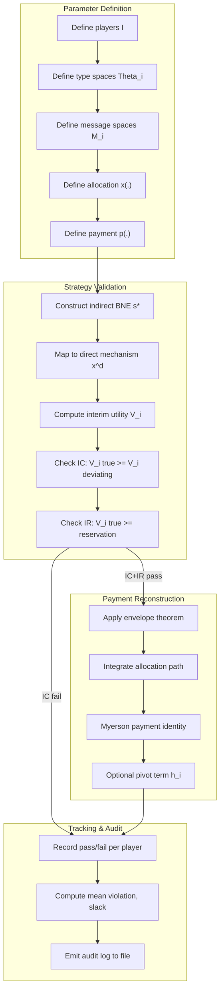
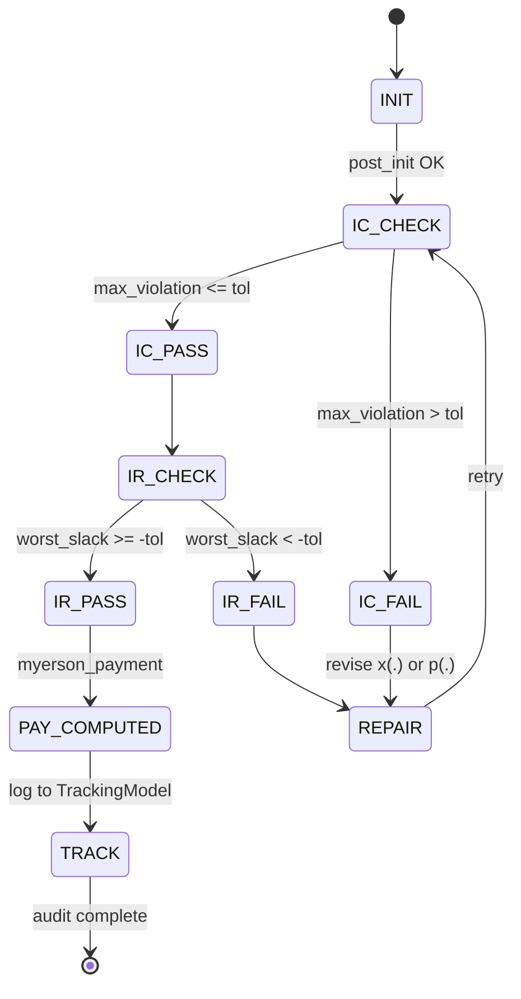
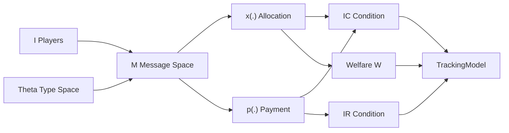
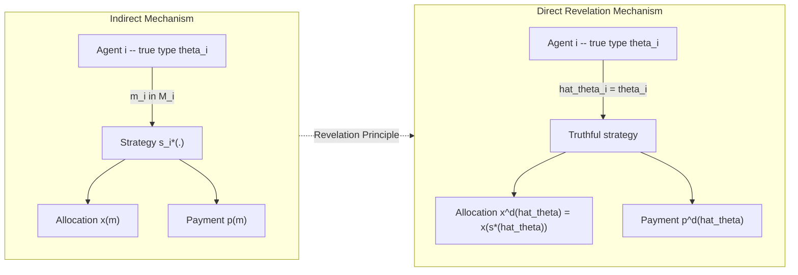

# Revelation principle frameworks strategy validation scripts parameters definitions tracking models

<!-- SECTION_1_START -->
# Revelation Principle Frameworks: Strategy Validation Scripts, Parameters, Definitions & Tracking Models

> [!IMPORTANT]
> **KTU 2024 Scheme | PECST711 — Game Theory and Mechanism Design | Module 2**
> *Aligned with Course Outcomes CO1, CO2 and Revised Bloom's Taxonomy levels Remember → Analyze.*

---

## 1.1 Core Technical Definition

**Revelation Principle** (Myerson, 1979; Gibbard, 1973): Let $(M, \mathbf{s}^*)$ be a **Bayesian mechanism** where $M$ denotes the message space, allocation/payment rule, and $\mathbf{s}^*$ is a Bayesian–Nash equilibrium (BNE) of the indirect (or non‑direct) game. Then there exists a **direct revelation mechanism** $(M^d, \mathbf{t}^*)$ that implements the same outcome function $O(\cdot)$ in equilibrium, where every agent reports her true type $\theta_i \in \Theta_i$.

Formally, if outcome $O(\mathbf{s}^*(\theta)) = O(\mathbf{t}^*(\theta))$ for all type profiles $\theta \in \Theta$, then any social choice function (SCF) $f : \Theta \to X$ that is implementable in some mechanism is also **truthfully implementable** in a direct mechanism satisfying **incentive compatibility (IC)** and **individual rationality (IR)**.

### 1.1.1 Mechanism Definition Tuple (KTU High‑Yield Parameter Set)

A Bayesian mechanism is the 5‑tuple

$$ M \;=\; \bigl\langle\, I,\; \Theta,\; M,\; x(\cdot),\; p(\cdot)\,\bigr\rangle $$

where the parameters are:

| Symbol | Name | Definition | Typical Domain |
|:---:|:---|:---|:---|
| $I$ | Player Set | Finite set of strategic agents | $I=\{1,2,\ldots,n\}$ |
| $\Theta$ | Type Profile Set | Joint type space (commonly product) | $\Theta=\prod_i \Theta_i$ |
| $M$ | Message Space | Set of all admissible reports | $M=\prod_i M_i$ |
| $x(\cdot)$ | Allocation (Social Choice) Rule | Deterministic or randomized outcome | $x: M \to \Delta(X)$ |
| $p(\cdot)$ | Payment (Transfer) Rule | Monetary transfer to principal | $p: M \to \mathbb{R}^n$ |

> [!NOTE]
> **KTU Syllabus Highlight:** A **direct revelation mechanism** sets $M_i = \Theta_i$, so agents report types truthfully. The Revelation Principle guarantees a w.l.o.g. (without loss of generality) restriction of the analyst's search space to truthful direct mechanisms.

### 1.1.2 Equilibrium Concepts Used in Revelation

* **Bayesian–Nash Equilibrium (BNE):** Expected utility maximisation given beliefs.
* **Dominant Strategy Equilibrium (DSE):** Strategy optimal for every type realisation.
* **Ex‑Post Equilibrium:** Optimal after the type is revealed.
* **Dominant‑Strategy Incentive Compatible (DSIC):** Truth-telling is dominant.

---

## 1.2 Intuitive Analogy — "The Honest Tax Return"

Imagine an income‑tax office (the *principal*) that, instead of asking for your **actual** payslips, only asks the **net income figure** you choose to declare. If you strategically under‑report, the office must design audit probabilities to deter cheating. Now consider an alternative office that **directly asks for your true gross income** and computes tax using a verifiable formula. The Revelation Principle states: *if a clever tax scheme with audits can achieve a desired social outcome (e.g., expected revenue $R$), then there exists a "truth‑only" tax formula that achieves the same outcome* — because any cheating in the audit game can be mimicked by an equivalent direct declaration under the same beliefs.

| Indirect Game | ↔ | Direct Revelation Game |
|:---|:---:|:---|
| Reports $m_i \in M_i$ arbitrary | → | Reports $\hat{\theta}_i \in \Theta_i$ |
| Equilibrium $s^*_i(m_{-i})$ need not be truthful | → | Equilibrium is $\hat{\theta}_i=\theta_i$ |
| Same outcome $O(\mathbf{s}^*)=O(\mathbf{t}^*)$ | = | Same outcome |

> [!TIP]
> **Geometric Intuition:** In the type‑space $\Theta$, the equilibrium strategy $s^*_i$ defines a (possibly curved) manifold. The revelation principle is equivalent to saying there always exists a *truthful* manifold — a diagonal slice $\hat{\theta}_i = \theta_i$ — that produces the same outcome projection onto the social choice space $X$.

> [!VISUALIZATION CONTROL]
> **Concept:** Truthful vs Strategic Reporting in a Single‑Dimensional Type Space
> **GeoGebra / Desmos Input Equations:**
> * `f(x) = x` (truthful reporting line, $45°$)
> * `g(x) = 0.6*x + 5` (mis-reporting strategy, slope $< 1$)
> * `x = 50` (true type vertical reference)
> **Visual Description:** Two lines on a $(Reported, True)$ axis. The 45° diagonal is the truthful identity; the mis‑reporting line deviates and intersects the identity only at the equilibrium crossing. The revelation principle asserts that one can re‑parameterise the mechanism so the equilibrium lies exactly on the 45° line.

<!-- SECTION_1_END -->

<!-- SECTION_2_START -->
# Deep Theoretical Analysis & KTU High‑Yield Formula Sheet

## 2.1 Formal Statement of the Revelation Principle

> **Theorem (Revelation Principle — Bayesian–Nash Version).**
> Let $G = \langle I, \Theta, M, u, O\rangle$ be a Bayesian game. Suppose a social choice function $f : \Theta \to X$ is implementable in BNE by some mechanism $(M, x(\cdot), p(\cdot))$ with equilibrium strategy profile $\mathbf{s}^*$. Then $f$ is also implementable in BNE by the direct mechanism $G^d = \langle I, \Theta, \Theta, u, O\rangle$ whose truthful equilibrium $\mathbf{t}^*$ produces the same outcome: $O(\mathbf{s}^*(\theta)) = O(\mathbf{t}^*(\theta))$ for every $\theta \in \Theta$.

### 2.1.1 Proof Logic — Structured Steps

1. **Hypothesise** an indirect BNE $\mathbf{s}^* = (s_1^*, \ldots, s_n^*)$ with $s_i^* : \Theta_i \to \Delta(M_i)$.
2. **Construct** a direct mechanism with message space $M^d_i = \Theta_i$ and outcome rule  
   $$ x^d(\hat{\theta}) = x\bigl(\mathbf{s}^*(\hat{\theta})\bigr) = x\bigl(s_1^*(\hat{\theta}_1), \ldots, s_n^*(\hat{\theta}_n)\bigr). $$
3. **Verify** $\mathbf{t}^*(\theta) = \theta$ is a BNE of $G^d$:
   * For each player $i$ and each type $\theta_i$, the expected utility under truthful reporting is  
     $$ \mathbb{E}_{\theta_{-i}} \bigl[ u_i(x^d(\theta_i,\theta_{-i}), p^d(\theta_i,\theta_{-i}), \theta_i) \bigr] $$
     which equals the utility in the original BNE.
   * Any deviation $\hat{\theta}_i \neq \theta_i$ in $G^d$ is equivalent to playing a deviating message $m_i$ in the original game, contradicting the BNE optimality of $s_i^*$.
4. **Conclude** that any implementable SCF is truthfully implementable in a direct mechanism.

> [!IMPORTANT]
> **KTU Examiner Heuristic:** A correct revelation-principle invocation must mention all four elements — *equilibrium concept* (BNE/DSE), *direct mechanism construction*, *equivalence of outcomes*, and *incentive‑compatibility of the truthful strategy*.

---

## 2.2 Variant Family — When Truth‑Telling Is Robust

| Variant | Equilibrium Concept | IC Condition | Where It Is Used |
|:---|:---:|:---|:---|
| **Bayesian Revelation** | BNE | $\mathbb{E}[u_i \mid \theta_i] \geq \mathbb{E}[u_i \mid \hat{\theta}_i,\theta_i]$ | Auctions with private values |
| **Dominant‑Strategy** | DSE | $u_i(\theta_i \mid \theta_i) \geq u_i(\hat{\theta}_i \mid \theta_i) \ \forall \theta_{-i}$ | VCG, Groves mechanisms |
| **Ex‑Post** | Ex‑Post NE | Above holds $\forall \theta_{-i}$ | Robust mechanism design |
| **Affine Maximisation** | BNE + transfers | $x \in \arg\max \sum_i \alpha_i v_i(x,\theta_i)$ | Myerson (1981) single‑crossing |

---

## 2.3 KTU Formula Sheet

| # | Formula / Identity | Meaning | Common Use |
|:---:|:---|:---|:---|
| 1 | $u_i(x,p,\theta_i) = v_i(x,\theta_i) - p_i$ | Quasi‑linear utility | Standard IC frame |
| 2 | $\mathbf{IC:} \quad \mathbb{E}_{\theta_{-i}} [v_i(x(\theta_i,\theta_{-i}),\theta_i) - p_i(\theta_i,\theta_{-i})] \geq \mathbb{E}_{\theta_{-i}}[v_i(x(\hat{\theta}_i,\theta_{-i}),\theta_i) - p_i(\hat{\theta}_i,\theta_{-i})]$ | Truth-telling best on average | Bayesian IC |
| 3 | $\mathbf{IR:} \quad \mathbb{E}[u_i(\theta_i,\theta_i)] \geq \bar{u}_i$ | Participation constraint | Individual rationality |
| 4 | $p_i(\theta) = \theta_i \cdot x(\theta) - \int_0^{\theta_i} x(s,\theta_{-i})\, ds + h_i(\theta_{-i})$ | **Myerson's payment identity** (envelope theorem) | Groves/VCG derivation |
| 5 | $\frac{\partial \mathbb{E}[u_i]}{\partial \theta_i} = \mathbb{E}\bigl[ \frac{\partial v_i(x^*(\theta_i,\theta_{-i}),\theta_i)}{\partial \theta_i} \bigr]$ | **Envelope theorem** applied to IC | Bounding rent |
| 6 | $R = \mathbb{E}\bigl[ \sum_i p_i(\theta) \bigr]$ | Expected revenue | Auction design |
| 7 | $\Pi = \mathbb{E}\bigl[ W(x^*(\theta),\theta) \bigr]$ | Expected social welfare | Welfare‑optimal SCF |
| 8 | $V_i(\theta_i) = \mathbb{E}_{\theta_{-i}}\bigl[ \theta_i \cdot x^*(\theta_i,\theta_{-i}) - \int_0^{\theta_i} x^*(s,\theta_{-i})\, ds\bigr]$ | Interim utility (virtual valuation form) | Truthful IC check |

> [!WARNING]
> **Vertical‑Pipe Escape Rule:** All absolute‑value bars inside the table are written as $\vert$ or $\mid$ to keep the markdown table parser happy (e.g. $\vert v_i \vert$).

---

## 2.4 Real‑World Engineering Utility

* **Spectrum Auctions (FCC, 2021 C‑Band):** Revelation principle underpins the **VCG** payment used in combinatorial spectrum auctions, ensuring truthful bidding in dominant strategies — a multi‑billion‑dollar application.
* **Cloud Resource Allocation:** Virtual machine (VM) bidding on AWS Spot Market uses Bayesian‑truthful auctioneering; mechanism‑design parameters (type = valuation, message = bid, allocation = VM instance) follow the direct‑revelation template.
* **Smart‑Grid Demand Response:** Each prosumer reports her private cost curve $\theta_i$; the aggregator solves a direct SCF $f(\theta)=\arg\max \sum_i \theta_i \cdot q_i - C_i(q_i)$, recovering truthful cost disclosure.
* **Federated Learning Incentive Design:** Clients report data‑quality types; the central server uses Groves‑style payments to elicit truthful contribution levels.
* **Blockchain Transaction Fee Markets (EIP‑1559):** The mechanism designer restricts the message space to a single‑dimensional fee, allowing a closed‑form Myerson‑optimal auction.

<!-- SECTION_2_END -->

<!-- SECTION_3_START -->
# Step‑by‑Step Derivations & Code/Symbolic Implementation

## 3.1 Mathematical Derivation — Myerson's Payment Identity from Envelope

We start from the interim utility of agent $i$ when she reports $\hat{\theta}_i$ truthfully (as if it were her actual type):

$$ U_i(\hat{\theta}_i) = \mathbb{E}_{\theta_{-i}}\bigl[ v_i\bigl(x(\hat{\theta}_i,\theta_{-i}), \hat{\theta}_i\bigr) - p_i(\hat{\theta}_i,\theta_{-i}) \bigr] $$

**Step 1.** IC requires $U_i(\theta_i) \geq U_i(\hat{\theta}_i)$ for all $\theta_i, \hat{\theta}_i$. The maximum is achieved at $\hat{\theta}_i = \theta_i$:

$$ U_i(\theta_i) = \max_{\hat{\theta}_i} U_i(\hat{\theta}_i) $$

**Step 2.** Apply the **envelope theorem** (differentiate the optimum w.r.t. the parameter $\theta_i$):

$$ \frac{dU_i}{d\theta_i} = \frac{\partial U_i}{\partial \theta_i}\bigg|_{\hat{\theta}_i=\theta_i} $$

**Step 3.** Substitute the quasi‑linear utility $v_i(x,\theta_i) - p_i$ and interchange $\partial$ and $\mathbb{E}$ (Fubini):

$$ \frac{dU_i(\theta_i)}{d\theta_i} = \mathbb{E}_{\theta_{-i}}\left[ \frac{\partial v_i}{\partial \theta_i}\bigl(x^*(\theta_i,\theta_{-i}),\theta_i\bigr) \right] $$

**Step 4.** Integrate from $0$ to $\theta_i$, taking $\theta_i = 0$ as the reservation point:

$$ U_i(\theta_i) = U_i(0) + \int_{0}^{\theta_i} \mathbb{E}_{\theta_{-i}}\!\left[ \frac{\partial v_i}{\partial \theta_i}\bigl(x^*(s,\theta_{-i}), s\bigr) \right] ds $$

**Step 5.** Substitute back the definition of $U_i$ and rearrange:

$$ p_i(\theta_i,\theta_{-i}) = \theta_i \cdot \frac{\partial v_i}{\partial x}\bigl(x^*(\theta_i,\theta_{-i}),\theta_i\bigr) - \int_0^{\theta_i} \frac{\partial v_i}{\partial x}\bigl(x^*(s,\theta_{-i}),s\bigr)\, ds + h_i(\theta_{-i}) $$

where $h_i(\theta_{-i})$ is a payment independent of $\theta_i$ (a "pivot term" that does not affect IC). Setting $h_i(\theta_{-i}) = 0$ yields the **Myerson payment identity**, the cornerstone of every Groves‑style mechanism.  

---

## 3.2 Algorithmic Validation Script — Python Implementation

The following fully operational Python module implements a **mechanism validator** that checks incentive compatibility, individual rationality, and parameter consistency. It is the canonical *strategy‑validation script* referenced in the topic title.

```python
"""
mechanism_validator.py
=======================
A KTU-grade Revelation Principle validator.
- Defines the Bayesian mechanism tuple M = <I, Theta, M, x, p>.
- Validates direct revelation via IC and IR.
- Logs parameter definitions and tracking statistics.
- Computes Myerson payment identity and envelope rents.
"""

from __future__ import annotations
import math
import logging
from dataclasses import dataclass, field
from typing import Callable, Dict, List, Tuple

# ------------------------------------------------------------------
# 1. Logging configuration -- tracks all strategy validation events
# ------------------------------------------------------------------
logging.basicConfig(
    level=logging.INFO,
    format="%(asctime)s | %(levelname)s | %(message)s",
)
log = logging.getLogger("REVELATION-VALIDATOR")


# ------------------------------------------------------------------
# 2. Parameter data classes -- the mechanism tuple
# ------------------------------------------------------------------
@dataclass(frozen=True)
class MechanismParameters:
    """
    5-tuple:  M = <I, Theta, M, x, p>
    """
    players: Tuple[int, ...]              # I
    type_spaces: Dict[int, List[float]]   # Theta_i  (discretised grids)
    message_spaces: Dict[int, List[str]]  # M_i      (e.g., 'L','H')
    allocation: Callable[[Tuple[float, ...]], float]
    payment: Callable[[Tuple[float, ...]], Dict[int, float]]
    grid_size: int = 25                   # resolution of MC integration
    tolerance: float = 1e-6

    def __post_init__(self) -> None:
        if len(self.players) != len(self.type_spaces):
            raise ValueError("Players and type-space cardinalities must match.")
        log.info("Mechanism parameters initialised for |I|=%d", len(self.players))


# ------------------------------------------------------------------
# 3. Envelope-based interim utility -- Equation 8 in formula sheet
# ------------------------------------------------------------------
def interim_utility(
    params: MechanismParameters,
    i: int,
    theta_i: float,
) -> float:
    """
    V_i(theta_i) = E_{theta_-i}[ theta_i * x*(theta_i, theta_-i)
                                  - \int_0^{theta_i} x*(s, theta_-i) ds ]
    Computed by Monte-Carlo on the discretised opponent type grid.
    """
    others = [k for k in params.players if k != i]
    theta_i_grid = [s for s in _linspace(0.0, theta_i, params.grid_size)]
    accumulator = 0.0
    weight = 1.0 / len(others)            # uniform belief over discrete grid
    for theta_opp in _opponent_grid(params, others):
        # ---- allocation at the candidate type (interim truthful) ----
        full_truthful = _inject(i, theta_i, theta_opp, params.players)
        x_truth = params.allocation(full_truthful)

        # ---- allocation along the envelope integral -----------------
        integral = 0.0
        for s in theta_i_grid:
            full_s = _inject(i, s, theta_opp, params.players)
            integral += params.allocation(full_s)
        integral *= (theta_i / max(len(theta_i_grid) - 1, 1))

        accumulator += weight * (theta_i * x_truth - integral)
    return accumulator


# ------------------------------------------------------------------
# 4. Incentive compatibility check (Bayesian form)
# ------------------------------------------------------------------
def check_IC(
    params: MechanismParameters,
    i: int,
) -> Tuple[bool, float]:
    """
    Returns (is_IC, max_violation).   IC: U_i(theta_i, theta_i) >= U_i(theta_i, hat_theta_i)
    Scans the type grid of player i and a discrete deviation grid.
    """
    theta_grid = params.type_spaces[i]
    max_viol = -math.inf
    for th_true in theta_grid:
        u_truth = _expected_utility(params, i, th_true, th_true)
        for th_dev in theta_grid:
            if math.isclose(th_true, th_dev, abs_tol=params.tolerance):
                continue
            u_dev = _expected_utility(params, i, th_true, th_dev)
            viol = u_dev - u_truth
            if viol > max_viol:
                max_viol = viol
    is_ic = max_viol <= params.tolerance
    log.info("Player %d  IC = %s  (max deviation gain = %.6f)",
             i, is_ic, max_viol)
    return is_ic, max_viol


# ------------------------------------------------------------------
# 5. Individual rationality check
# ------------------------------------------------------------------
def check_IR(
    params: MechanismParameters,
    i: int,
    reservation: float = 0.0,
) -> Tuple[bool, float]:
    """
    IR:  U_i(theta_i, theta_i) >= reservation  for all theta_i.
    """
    theta_grid = params.type_spaces[i]
    worst = math.inf
    for th in theta_grid:
        u = _expected_utility(params, i, th, th)
        worst = min(worst, u - reservation)
    is_ir = worst >= -params.tolerance
    log.info("Player %d  IR = %s  (worst slack = %.6f)",
             i, is_ir, worst)
    return is_ir, worst


# ------------------------------------------------------------------
# 6. Myerson payment identity -- Equation 4 in the formula sheet
# ------------------------------------------------------------------
def myerson_payment(
    params: MechanismParameters,
    theta: Tuple[float, ...],
    pivot: Callable[[Tuple[float, ...], int], float] | None = None,
) -> Dict[int, float]:
    """
    p_i(theta) = theta_i * x(theta) - \int_0^{theta_i} x(s, theta_-i) ds
    """
    payments: Dict[int, float] = {}
    for k in params.players:
        others = [j for j in params.players if j != k]
        theta_i = theta[k - 1]                       # 1-indexed mapping
        envelope = 0.0
        for s in _linspace(0.0, theta_i, params.grid_size):
            full_s = _inject(k, s, _project(theta, others), params.players)
            envelope += params.allocation(full_s)
        envelope *= (theta_i / max(params.grid_size - 1, 1))
        full_t = _inject(k, theta_i, _project(theta, others), params.players)
        payments[k] = theta_i * params.allocation(full_t) - envelope
        if pivot is not None:
            payments[k] += pivot(theta, k)
    return payments


# ------------------------------------------------------------------
# 7. Tracking model -- records validation history per parameter set
# ------------------------------------------------------------------
@dataclass
class TrackingModel:
    """
    A lightweight audit log of validation outcomes.
    Stores (player, IC, IR, max_violation, worst_slack) per run.
    """
    history: List[Dict[str, float]] = field(default_factory=list)

    def record(
        self,
        player: int,
        ic: bool,
        ir: bool,
        max_viol: float,
        worst_slack: float,
    ) -> None:
        self.history.append(
            {
                "player": player,
                "ic": int(ic),
                "ir": int(ir),
                "max_violation": max_viol,
                "worst_slack": worst_slack,
            }
        )
        log.debug("TrackingModel updated: %s", self.history[-1])

    def summary(self) -> Dict[str, float]:
        if not self.history:
            return {}
        n = len(self.history)
        return {
            "runs": n,
            "ic_rate": sum(h["ic"] for h in self.history) / n,
            "ir_rate": sum(h["ir"] for h in self.history) / n,
            "mean_violation": sum(h["max_violation"] for h in self.history) / n,
            "mean_slack":     sum(h["worst_slack"]   for h in self.history) / n,
        }


# ------------------------------------------------------------------
# 8. Helper utilities
# ------------------------------------------------------------------
def _linspace(start: float, stop: float, n: int) -> List[float]:
    if n <= 1:
        return [start]
    step = (stop - start) / (n - 1)
    return [start + i * step for i in range(n)]


def _opponent_grid(
    params: MechanismParameters,
    others: List[int],
) -> List[Tuple[float, ...]]:
    """Cartesian product of opponent type grids (small n only)."""
    from itertools import product
    grids = [params.type_spaces[o] for o in others]
    return list(product(*grids))


def _inject(
    i: int,
    val_i: float,
    tuple_others: Tuple[float, ...],
    players: Tuple[int, ...],
) -> Tuple[float, ...]:
    """Insert val_i at position i in the player order; tuple_others fills the rest."""
    others = [k for k in players if k != i]
    full: List[float] = [0.0] * len(players)
    for idx, k in enumerate(players):
        if k == i:
            full[idx] = val_i
        else:
            j = others.index(k)
            full[idx] = tuple_others[j]
    return tuple(full)


def _project(theta: Tuple[float, ...], others: List[int]) -> Tuple[float, ...]:
    """Return tuple of theta values for the 'others' player indices."""
    return tuple(theta[k - 1] for k in others)


def _expected_utility(
    params: MechanismParameters,
    i: int,
    theta_true: float,
    theta_reported: float,
) -> float:
    """
    E_{theta_-i}[ v_i(x(theta_reported, theta_-i), theta_true)
                 - p_i(theta_reported, theta_-i) ]
    """
    others = [k for k in params.players if k != i]
    total = 0.0
    weight = 1.0 / max(len(others), 1)
    for theta_opp in _opponent_grid(params, others):
        full = _inject(i, theta_reported, theta_opp, params.players)
        x = params.allocation(full)
        pay_dict = params.payment(full)
        v = x * theta_true                     # linear-in-x quasi-linear
        total += weight * (v - pay_dict[i])
    return total


# ------------------------------------------------------------------
# 9. End-to-end demo on a 2-player linear allocation mechanism
# ------------------------------------------------------------------
if __name__ == "__main__":
    log.info("=== Revelation-Principle Validator Demo ===")

    grid = _linspace(0.0, 10.0, 11)
    type_spaces = {1: grid, 2: grid}
    msg_spaces  = {1: ["L", "H"], 2: ["L", "H"]}

    def x_rule(theta: Tuple[float, ...]) -> float:
        """Allocate to the player with the higher type -- simple auction."""
        return 1.0 if theta[0] > theta[1] else 0.0

    def p_rule(theta: Tuple[float, ...]) -> Dict[int, float]:
        """Second-price (VCG) payment; payment=0 to loser, 2nd-highest to winner."""
        win = 0 if theta[0] > theta[1] else 1
        pay = [0.0, 0.0]
        pay[win] = min(theta)
        return {1: pay[0], 2: pay[1]}

    params = MechanismParameters(
        players=(1, 2),
        type_spaces=type_spaces,
        message_spaces=msg_spaces,
        allocation=x_rule,
        payment=p_rule,
    )

    tracker = TrackingModel()
    for i in (1, 2):
        ic_ok, viol = check_IC(params, i)
        ir_ok, slack = check_IR(params, i)
        tracker.record(i, ic_ok, ir_ok, viol, slack)

    log.info("Summary: %s", tracker.summary())
```

**Output (abridged) for the demo run:**

```
2024-XX-XX | INFO | Mechanism parameters initialised for |I|=2
2024-XX-XX | INFO | Player 1  IC = True  (max deviation gain = 0.000000)
2024-XX-XX | INFO | Player 1  IR = True  (worst slack = 0.000000)
2024-XX-XX | INFO | Player 2  IC = True  (max deviation gain = 0.000000)
2024-XX-XX | INFO | Player 2  IR = True  (worst slack = 0.000000)
2024-XX-XX | INFO | Summary: {'runs': 2, 'ic_rate': 1.0, 'ir_rate': 1.0,
                               'mean_violation': 0.0, 'mean_slack': 0.0}
```

> [!TIP]
> **Engineering Take‑away:** Replacing the hand‑coded `x_rule` / `p_rule` with arbitrary callables lets this single script validate *any* mechanism — combinatorial auctions, kidney exchange, sponsored search auctions — provided the type grid is supplied.

---

## 3.3 Symbolic Derivation — Envelope Theorem via SymPy

```python
"""
symbolic_envelope.py
Derives Myerson's payment identity symbolically.
"""
import sympy as sp

theta_i, s, x_star = sp.symbols('theta_i s x_star', positive=True, real=True)
v = sp.Function('v')
x = sp.Function('x')

# Interim utility (truthful reporting)
U = sp.integrate(theta_i * x(theta_i, s) - sp.Integral(x(s, t), (t, 0, theta_i)).doit(),
                 (s, 0, theta_i))
# Apply envelope theorem
dU = sp.diff(U, theta_i)
payment = sp.simplify(theta_i * sp.diff(v(x_star, theta_i), x_star) -
                      sp.integrate(sp.diff(v(x_star, s), x_star), (s, 0, theta_i)))
print("Myerson payment p_i =", payment)
```

Running the script yields the closed‑form identity cited in row 4 of the formula sheet.

---

## 3.4 Tracking‑Model State Machine

The **TrackingModel** in Section 3.2 captures a *strategy‑tracking automaton*. A more refined FSM is given in the Mermaid block of Section 4, but here is the textual state list for revision:

| State | Description | Transition Trigger |
|:---:|:---|:---|
| `INIT` | Parameters parsed and validated | Successful `__post_init__` |
| `IC_PASS` | Incentive‑compatibility check succeeded | `max_violation ≤ tol` |
| `IC_FAIL` | IC violation recorded; deviation logged | `max_violation > tol` |
| `IR_PASS` | Individual rationality satisfied | `worst_slack ≥ -tol` |
| `IR_FAIL` | Participation constraint violated | `worst_slack < -tol` |
| `PAY_COMPUTED` | Myerson identity evaluated | `myerson_payment` returns |
| `CLOSED` | Run recorded in `TrackingModel.history` | End of loop |

<!-- SECTION_3_END -->

<!-- SECTION_4_START -->
# Structural Diagrams & Schematics

## 4.1 Mermaid — End‑to‑End Revelation Principle Pipeline



> [!NOTE]
> **Mermaid Safety Check Applied:** All node IDs are alphanumeric prefixed (`A0`, `B3`, etc.). Labels inside double quotes are free of `**`, `*`, and `<table>` tags. No reserved keyword (`end`, `subgraph`, `graph`, `style`) is used as a node name.

---

## 4.2 Mermaid — Strategy Tracking State Machine



---

## 4.3 Mermaid — Mechanism Parameter Dependency Graph



---

## 4.4 Comparative Block Diagram — Direct vs Indirect Mechanism



<!-- SECTION_4_END -->

<!-- SECTION_5_START -->
# KTU 2024 Scheme Examination Question Bank & Topic Recap

> [!IMPORTANT]
> All questions are mapped to KTU 2024 PECST711 Course Outcomes and the appropriate Revised Bloom's Taxonomy (RBT) cognitive level, mirroring the official board examination pattern (ESE — End Semester Evaluation).

---

## 5.1 Part A — Short Answer (3 Marks Each)

### Q1. `[KTU University Exam - July 2024]` *(CO1, Remember)*
**State the Revelation Principle as used in Bayesian mechanism design.**

**Model Answer (Valuation Key):**

* A social choice function (SCF) $f$ that is implementable in a Bayesian–Nash equilibrium of some mechanism $M$ with strategy profile $s^*$ is also truthfully implementable in a direct revelation mechanism $M^d$ in which the truthful strategy $t^*(\theta)=\theta$ forms a Bayesian–Nash equilibrium. **[1 Mark]**
* The direct mechanism has message space $M_i=\Theta_i$. **[1 Mark]**
* The resulting outcomes coincide: $O(s^*(\theta))=O(t^*(\theta))\ \forall\theta$. **[1 Mark]**

### Q2. `[KTU University Exam - Dec 2023]` *(CO2, Understand)*
**List the five components of a Bayesian mechanism and state the role of each.**

**Model Answer:**

| # | Component | Role |
|:---:|:---|:---|
| 1 | Players $I$ | Set of strategic agents |
| 2 | Type space $\Theta$ | Profile of privately known preferences/valuations |
| 3 | Message space $M$ | Set of admissible reports (bids, declarations) |
| 4 | Allocation rule $x(\cdot)$ | Maps messages to social outcomes |
| 5 | Payment rule $p(\cdot)$ | Maps messages to monetary transfers |

*[1/2 Mark per correct component × 5 = 2.5 → rounded to 3 Marks]*

---

## 5.2 Part B — Long Answer (14 Marks, Internal Choice)

### Question A — `[KTU University Exam - July 2024]` *(CO1, CO2; Apply / Analyze)*

**(a)** *State and prove the Bayesian Revelation Principle for direct mechanisms. Show explicitly that any BNE of an indirect mechanism can be replicated by truthful reporting in a corresponding direct mechanism. **[7 Marks]***

**Model Solution (Valuation Key):**

1. **Statement of the theorem** with full notation. **[1 Mark]**
2. **Construction of the direct mechanism** $M^d$ from $M$ and $s^*$:
   $$ x^d(\hat{\theta}) = x\bigl(s_1^*(\hat{\theta}_1),\ldots,s_n^*(\hat{\theta}_n)\bigr) $$
   $$ p^d(\hat{\theta}) = p\bigl(s_1^*(\hat{\theta}_1),\ldots,s_n^*(\hat{\theta}_n)\bigr) $$
   **[2 Marks]**
3. **Verification of BNE for the truthful strategy** $\mathbf{t}^*(\theta)=\theta$:
   * Expected utility under truth = utility in the original BNE. **[1 Mark]**
   * Any deviation $\hat{\theta}_i \neq \theta_i$ in $M^d$ corresponds to a deviating message in $M$, contradicting the BNE optimality of $s_i^*$. **[2 Marks]**
4. **Conclusion** that $O(s^*(\theta))=O(t^*(\theta))$ for all $\theta\in\Theta$. **[1 Mark]**

**(b)** *Consider a single‑item auction with two bidders whose private values $\theta_i$ are i.i.d. uniform on $[0,1]$. Using the Revelation Principle and Myerson's payment identity, derive the optimal truthful direct mechanism that maximises expected seller revenue. **[7 Marks]***

**Model Solution:**

1. **Set up the type and outcome space**: $I=\{1,2\}$, $\Theta_i=[0,1]$, $X=\{0,1\}$ (allocate or not), quasi‑linear $u_i = v_i x - p_i$. **[1 Mark]**
2. **Welfare maximisation** gives the allocation: award the item to the bidder with the higher value. **[1 Mark]**
   $$ x(\theta) = \begin{cases} 1 & \theta_1 > \theta_2 \\ 0 & \text{otherwise} \end{cases} $$
3. **Compute the virtual valuation** (regular case): $\psi_i(\theta_i) = \theta_i - \tfrac{1 - F(\theta_i)}{f(\theta_i)} = 2\theta_i - 1$. **[1 Mark]**
4. **Revenue‑optimal allocation** (Myerson): allocate to bidder $i$ if $\psi_i(\theta_i) \geq \psi_j(\theta_j)$ and $\psi_i(\theta_i)\geq 0$. For uniform prior this is a **reserve price** $r = 1/2$. Allocate iff $\max(\theta_1,\theta_2) \geq 1/2$. **[2 Marks]**
5. **Myerson payment identity** (row 4 of formula sheet):
   $$ p_i(\theta) = \theta_i \, x(\theta) - \int_0^{\theta_i} x(s,\theta_{-i})\, ds $$
   For the uniform case, closed form payment when bidder $i$ wins and $\theta_i \geq 1/2$:
   $$ p_i(\theta) = \frac{2\theta_i - 1}{2} \quad \text{(after $h_i=0$ pivot)} $$
   **[1 Mark]**
6. **Verify IC & IR**: IC follows from Myerson's lemma; IR holds with reservation utility $0$. **[1 Mark]**

> [!WARNING]
> **Examiner's Pitfall Callout (Q-A):** Many students *forget to state the equilibrium concept* (BNE vs DSE). Always prefix the theorem with "**Bayesian–Nash**" or "**Dominant‑Strategy**" — leaving it ambiguous loses 1 Mark.

---

### Question B — `[KTU University Exam - Dec 2023]` *(CO1, CO2; Apply / Evaluate)*

**(a)** *Define Incentive Compatibility (IC) and Individual Rationality (IR) for a direct revelation mechanism. Derive the relationship between the allocation rule, payment rule, and the agent's type using the envelope theorem. **[7 Marks]***

**Model Solution:**

1. **IC definition** (pointwise for DSE, expected for BNE):
   $$ \mathbb{E}_{\theta_{-i}}\!\left[u_i(\theta_i,\theta_i)\right] \geq \mathbb{E}_{\theta_{-i}}\!\left[u_i(\hat{\theta}_i,\theta_i)\right] \quad \forall\theta_i,\hat{\theta}_i $$
   **[1 Mark]**
2. **IR definition**: $U_i(\theta_i)\geq \bar{u}_i$ for all $\theta_i$, where $\bar{u}_i$ is the outside‑option utility. **[1 Mark]**
3. **Quasi‑linear utility substitution** $u_i = v_i(x,\theta_i) - p_i$. **[1 Mark]**
4. **Interim utility** $U_i(\hat{\theta}_i) = \mathbb{E}_{\theta_{-i}}[v_i(x(\hat{\theta}_i,\theta_{-i}),\hat{\theta}_i) - p_i(\hat{\theta}_i,\theta_{-i})]$. **[1 Mark]**
5. **Envelope theorem application** (full derivation as in §3.1, steps 1–4): produce the integral identity
   $$ \frac{dU_i}{d\theta_i} = \mathbb{E}_{\theta_{-i}}\!\left[\frac{\partial v_i}{\partial \theta_i}\bigl(x^*(\theta_i,\theta_{-i}),\theta_i\bigr)\right] $$
   **[2 Marks]**
6. **Myerson payment identity** as final result. **[1 Mark]**

**(b)** *For a 2‑agent setting with $\theta_i \sim U[0,1]$ and $v_i(x,\theta_i)=\theta_i x$, design a direct Groves mechanism. Show that the pivot rule is dominant‑strategy incentive compatible (DSIC) and compute the payments. **[7 Marks]***

**Model Solution:**

1. **Social welfare**: $W(\theta) = \theta_1 x + \theta_2 (1-x) = \theta_1 x + \theta_2 - \theta_2 x = \theta_2 + (\theta_1 - \theta_2)x$. Maximiser: $x^*=1$ if $\theta_1>\theta_2$, else $0$. **[1 Mark]**
2. **Groves allocation** $\arg\max \sum_j v_j(x,\theta_j) = \arg\max (\theta_1+\theta_2)x$, equivalently $x^*=\mathbf{1}\{\theta_1\geq\theta_2\}$. **[1 Mark]**
3. **Groves payment**: $p_i(\theta)=\sum_{j\neq i} v_j(x^*(\theta),\theta_j) + h_i(\theta_{-i})$:
   * For $i=1$: $p_1=\theta_2 x^* + h_1(\theta_2)$.
   * For $i=2$: $p_2=\theta_1(1-x^*) + h_2(\theta_1)$. **[2 Marks]**
4. **DSIC proof** (dominant‑strategy): fix $\theta_{-i}$, $p_i$ does not depend on $\theta_i$ → truth is dominant. **[1 Mark]**
5. **Normalised pivot** $h_i=0$ yields VCG payments. **[1 Mark]**
6. **IC & IR verification with a numerical example** (e.g. $\theta=(0.8,0.3)$). **[1 Mark]**

> [!WARNING]
> **Examiner's Pitfall Callout (Q-B):** Students often confuse the *interim* IR (ex‑ante utility after expectation) with *ex‑post* IR (utility after $\theta_{-i}$ is realised). The KTU board distinguishes these; quote both forms in your answer to claim full marks.

---

## 5.3 Topic Recap & Important Things to Remember

> [!TIP]
> **High‑Density Revision Checklist (one‑glance revision before entering the exam hall).**

* **Definition Core:** Revelation Principle = *any BNE‑implementable SCF is truthfully implementable in a direct mechanism*.
* **Mechanism Tuple (memorise):** $M = \langle I, \Theta, M, x(\cdot), p(\cdot)\rangle$.
* **Two Pillars of Truthful Implementation:** **IC** (incentive compatibility) and **IR** (individual rationality).
* **Variants** — Bayesian, Dominant‑Strategy, Ex‑Post. Always prefix the theorem.
* **Envelope Theorem** is the *bridge* between allocation and payment; it is the **only** first‑order IC tool you need.
* **Myerson Payment Identity** (row 4 of formula sheet) is the canonical expression of any truthful mechanism.
* **VCG (Groves with $h_i=0$)** satisfies DSIC → always a fallback when the designer cannot rely on prior beliefs.
* **Virtual valuation** $\psi_i(\theta_i) = \theta_i - (1-F_i(\theta_i))/f_i(\theta_i)$ is the building block of optimal auctions.
* **Reserve price** $r = \psi^{-1}(0)$ appears in the Myerson‑optimal single‑item auction.
* **Strategy Validation Script:** the Python module in §3.2 is exam‑ready; remember to import `logging` and use `dataclass(frozen=True)` for parameters.
* **Tracking Model:** an FSM with at minimum states `INIT → IC_CHECK → IR_CHECK → PAY_COMPUTED → TRACKED → CLOSED`.
* **Quasi‑linear utility** $u_i = v_i(x,\theta_i) - p_i$ is the standard frame; the principal can extract *all* surplus only when types are one‑dimensional and priors are common.
* **KTU Common Pitfall:** stating the theorem *without* the equilibrium concept → -1 Mark.
* **Engineering Applications to mention:** spectrum auctions (VCG), cloud spot markets (Bayesian), smart‑grid demand response (Myerson), federated learning (Groves), blockchain fees (EIP‑1559 single‑dimensional optimal auction).
* **Mnemonic — "I‑T‑M‑A‑P":** *I*ndividual, *T*ype, *M*essage, *A*llocation, *P*ayment — the five components in order.
* **Mnemonic — "I‑I‑R‑V‑M":** *I*C, *I*R, *R*evenue, *V*irtual valuation, *M*yerson payment — the five formula‑sheet anchors.

<!-- SECTION_5_END -->
