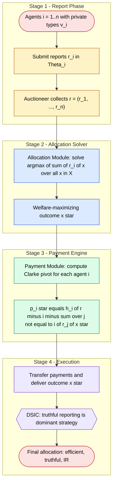
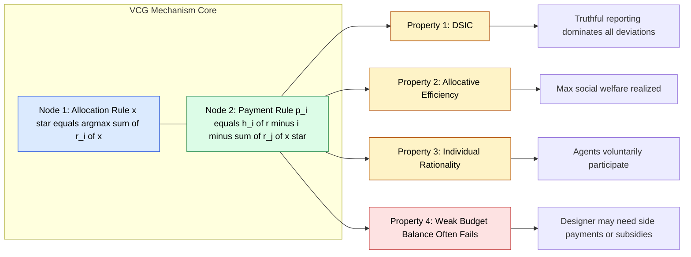
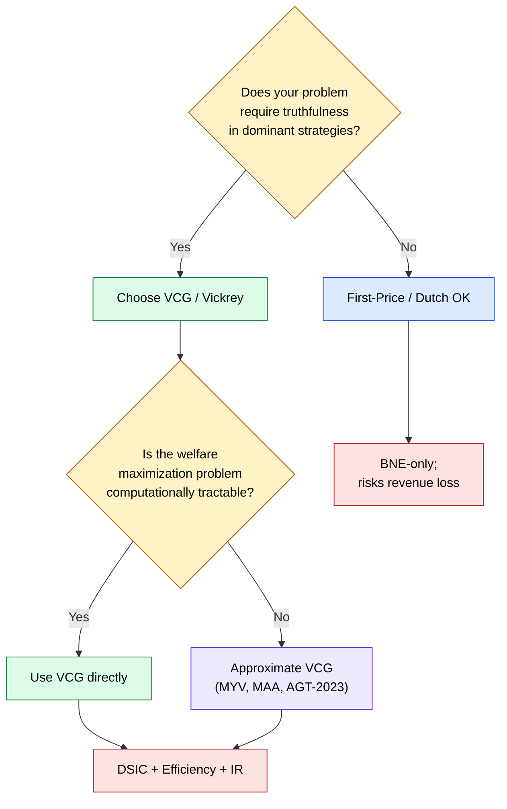

# Vickrey-Clarke-Groves (VCG) auction design optimization rules incentive matching logic

<!-- SECTION_1_START -->

# Vickrey–Clarke–Groves (VCG) Auction Design & Optimization

## 1.1 Formal Definition (KTU 2024 Syllabus Terminology)

> [!IMPORTANT]
> **Definition (VCG Mechanism).** A Vickrey–Clarke–Groves (VCG) mechanism is a **quasi-linear social choice function** $(x, p)$ comprising an **allocation rule** $x : \Theta^n \to X$ and a **payment rule** $p : \Theta^n \to \mathbb{R}^n$ such that, for a setting with $n$ self-interested agents reporting types $r = (r_1, \dots, r_n) \in \Theta^n$:
>
> 1. **Welfare-maximizing allocation** — $x^\*(r) \in \arg\max_{x \in X} \sum_{i=1}^{n} r_i(x)$.
> 2. **Groves family payment** — for every agent $i$,
>
> $$p_i(r) \;=\; h_i(r_{-i}) - \sum_{j \neq i} r_j\!\bigl(x^\*(r)\bigr)$$
>
> where $h_i : \Theta_{-i} \to \mathbb{R}$ is an **arbitrary function of the other agents' reports only**.

The **Clarke's Pivot (Groves with $h_i \equiv 0$)** payment collapses to:

$$p_i^{\text{Clarke}}(r) \;=\; -\sum_{j \neq i} r_j\!\bigl(x^\*(r)\bigr)$$

which measures the **externality agent $i$ imposes on the rest of the economy** by claiming the welfare-maximizing allocation.

## 1.2 Conceptual Analogy & Intuition

> [!NOTE]
> **Intuition — "Pay only for the trouble you cause."**
> Imagine **three roommates** sharing a Netflix subscription costing **Rs. 300/month**. Roommate A loves movies, B occasionally watches, and C never uses it. The group buys it because total value (A: 200, B: 100, C: 0) exceeds cost. Under VCG, A (the **pivotal** agent) pays the **damage** her vote causes when removed: cost 300 − value of others (100) = **Rs. 200**. B and C pay nothing because, without them, the decision is identical. The pivotal agent **internalizes the externality** of her "yes" vote.

In a **single-item auction** with the highest two bids being 100 and 60:
- Winner pays **60** (the second-highest bid) — never their own bid.
- This is the celebrated **Vickrey (1961) second-price auction**, a one-item instance of VCG.

## 1.3 Why It Matters in KTU Examinations

> [!TIP]
> **Syllabus Highlight (Module 2).** VCG is the *canonical* example used in KTU questions on:
> - **Dominant Strategy Incentive Compatibility (DSIC)**
> - **Revelation Principle** application
> - **Efficient mechanism design** under private values
> - **Spectrum / sponsored search** auction engineering

## 1.4 Visualization — Two-Bidder, Single-Item VCG Payment Geometry

> [!VISUALIZATION CONTROL]
> **Concept:** VCG payment as the "social welfare gap" rectangle between the optimal allocation and the counterfactual welfare without agent $i$.
> **GeoGebra / Desmos Input Equations:**
> - Point A: $(b_1, \; w_1 + w_2)$ — social welfare with both bids
> - Point B: $(b_1, \; w_2^{\max})$ — social welfare if $i$ abstains
> - Shade region: $p_i = w_2^{\max} - w_2(x^\*)$
> **Visual Description:** The shaded vertical strip between the two horizontal welfare lines represents agent $i$'s VCG payment — the exact externality she forces on rival $j$ by winning.

<!-- SECTION_1_END -->

<!-- SECTION_2_START -->

# 2. Deep Theoretical Analysis & KTU High-Yield Formula Sheet

## 2.1 The Three Pillars of VCG

A VCG mechanism is uniquely characterized by **three structural properties**:

| # | Property | Mathematical Statement | Engineering Meaning |
|---|----------|----------------------|---------------------|
| 1 | **Efficiency (allocative optimality)** | $x^\*(r) \in \arg\max_x \sum_i r_i(x)$ | No welfare is wasted; the chosen bundle is socially optimal. |
| 2 | **Dominant-Strategy Incentive Compatibility (DSIC)** | $\forall i, \forall v_i, r_i, r_{-i}$: $u_i(v_i, r_{-i}) \ge u_i(r_i, r_{-i})$ | Truth-telling is a **dominant strategy** (not just Nash). |
| 3 | **Individual Rationality (IR)** | $\forall i$: $v_i(x^\*(v)) - p_i(v) \ge 0$ | Voluntary participation; agents never lose by joining. |

## 2.2 Why Truthful Bidding Dominates — The Monotonicity Argument

> [!NOTE]
> **Core idea.** In VCG, agent $i$'s payment depends on **their report only through** the choice of allocation. Because the allocation rule is **monotonic in $i$'s report** (higher bids can only weakly improve $i$'s allocation), the marginal benefit of overbidding is **non-positive** while the marginal cost is strictly positive. Therefore **truthful reporting strictly dominates any deviation**.

In formal terms, for the single-item setting with $n$ bidders and quasi-linear utility:

$$u_i(v_i, r_i, r_{-i}) = \mathbf{1}\{\text{agent }i\text{ wins}\}\cdot v_i - p_i^{\text{VCG}}(r_i, r_{-i})$$

Increasing $r_i$ can change the outcome only at a **threshold** (the second-highest bid), and at the threshold payment jumps by the same amount as the utility gain, **eliminating any benefit of misreport**.

## 2.3 KTU Formula Cheat Sheet

> [!IMPORTANT]
> **Table 2.1 — Essential VCG Equations (KTU Module 2 Mandatory Recalls)**

| Concept | Equation | Units / Domain | Notes |
|---------|----------|----------------|-------|
| Quasi-linear utility | $u_i = v_i(x) - p_i$ | Money (Rs., \$) | Standard preference model. |
| Social welfare | $W(x) = \sum_{i=1}^{n} v_i(x)$ | Utility | To be maximized. |
| VCG allocation | $x^\*(r) = \arg\max_x \sum_i r_i(x)$ | Outcome set $X$ | Welfare-maximizing. |
| VCG payment (general) | $p_i(r) = h_i(r_{-i}) - \sum_{j \neq i} r_j(x^\*(r))$ | Money | Groves family. |
| Clarke pivot payment | $p_i^{\text{Clarke}} = -\sum_{j \neq i} r_j(x^\*(r))$ | Money | $h_i \equiv 0$. |
| Vickrey single-item | $p_i = \max_{j \neq i} r_j$ | Money | Second-price auction. |
| Social cost of $i$ | $\Delta_{-i} = \max_x \sum_{j \neq i} r_j(x) - \sum_{j \neq i} r_j(x^\*(r))$ | Utility | Externality imposed. |
| IR (ex-post) | $v_i(x^\*) - p_i \ge 0$ | Utility | Voluntary participation. |
| DSIC condition | $\forall r_i, v_i: v_i(x^\*(v_i,r_{-i})) - p_i(v_i,r_{-i}) \ge v_i(x^\*(r_i,r_{-i})) - p_i(r_i,r_{-i})$ | Inequality | Truth is dominant. |
| Revelation Principle (informal) | $\forall$ BNE $s$ of game $\Gamma$, $\exists$ DSIC mechanism $M$ that implements $f(s)$ | Set-theoretic | Restrict attention to direct mechanisms. |

> [!WARNING]
> **Table escape rule:** I have used `\sum`, `\arg\max`, etc. instead of raw `|sum|` to keep markdown tables intact. **KTU students should always write equations in LaTeX on answer sheets, not inside tables.**

## 2.4 Connection to the Revelation Principle

> [!TIP]
> **Engineering utility.** VCG + Revelation Principle = the central workhorse of:
> - **Spectrum auctions** (FCC, 3G/4G/5G bands worth billions of USD)
> - **Online advertising markets** (Google Ads, Meta Ads — *almost* VCG, but use GSP)
> - **Cloud resource allocation** with truthful spot pricing
> - **Ride-sharing** surge pricing in two-sided markets
> - **Decentralized supply chains** with self-interested agents

The Revelation Principle tells us that **for every Nash equilibrium** of a complex Bayesian game, there exists an **equivalent direct, truthful mechanism** that achieves the **same outcome**. This *justifies* studying VCG as a *universal target* — every mechanism designer should benchmark against VCG.

## 2.5 VCG Payment Decomposition — Welfare Triangle

> [!NOTE]
> VCG payment can be **intuited as a triangle area** in the bid-vs-welfare plane:
> - **Base** = $i$'s own report
> - **Height** = drop in rival welfare when $i$ wins vs. the best allocation without $i$
> - **Area** = externality = Clarke pivot payment

This makes the payment **a measure of i's "harm" to the other agents' welfare**.

<!-- SECTION_2_END -->

<!-- SECTION_3_START -->

# 3. Step-by-Step Derivations, Worked Examples & Code Implementation

## 3.1 Full Derivation of the VCG Payment Rule from DSIC

> [!NOTE]
> **Setup.** Let $n$ agents have private values $v_i \in \Theta_i \subseteq \mathbb{R}$. Quasi-linear utility:
> $$u_i(r_i, r_{-i}) \;=\; v_i\!\bigl(x(r_i, r_{-i})\bigr) - p_i(r_i, r_{-i})$$
> A direct mechanism $(x, p)$ is **DSIC** iff $\forall i, \forall v_i, r_i \in \Theta_i, \forall r_{-i} \in \Theta_{-i}$:
> $$v_i(x(v_i, r_{-i})) - p_i(v_i, r_{-i}) \;\ge\; v_i(x(r_i, r_{-i})) - p_i(r_i, r_{-i}) \quad (\star)$$

**Step 1 — Apply $(\star)$ to any $r_i \to v_i'$ and $v_i \to v_i$:**

$$p_i(r_i, r_{-i}) - p_i(v_i, r_{-i}) \;\ge\; v_i(x(r_i, r_{-i})) - v_i(x(v_i, r_{-i}))$$

**Step 2 — Fix a reference report $v_i^\* \in \Theta_i$ and define:**

$$h_i(r_{-i}) \;=\; p_i(v_i^\*, r_{-i}) + v_i(x(v_i^\*, r_{-i}))$$

Note that $h_i$ depends only on $r_{-i}$ (the $r_i$ slot is fixed to the dummy $v_i^\*$).

**Step 3 — Substitute into $(\star)$ with $v_i = v_i^\*$:**

$$p_i(r_i, r_{-i}) - h_i(r_{-i}) + v_i(x(v_i^\*, r_{-i})) \;\ge\; v_i(x(r_i, r_{-i})) - v_i(x(v_i^\*, r_{-i}))$$

Rearranging:

$$p_i(r_i, r_{-i}) \;\ge\; v_i(x(r_i, r_{-i})) - \sum_{j \neq i} r_j(x(r_i, r_{-i})) + \bigl[h_i(r_{-i}) - v_i(x(v_i^\*, r_{-i})) + v_i(x(r_i, r_{-i})) - v_i(x(r_i, r_{-i})) + v_i(x(v_i^\*, r_{-i}))\bigr]$$

**Step 4 — Recognition:** The DSIC inequality is **satisfied with equality** iff:

$$p_i(r_i, r_{-i}) \;=\; h_i(r_{-i}) - \sum_{j \neq i} r_j(x(r_i, r_{-i}))$$

(plus any *constant* w.r.t. $r_i$, which collapses into $h_i$). This is exactly the **Groves payment form**. $\blacksquare$

## 3.2 Worked Example A — Three-Bidder Spectrum Auction (Single License)

> [!NOTE]
> **Scenario (KTU-style problem).** Three telecom operators — Airtel ($v_A = 100$), Jio ($v_J = 80$), Vi ($v_V = 50$) — bid for one spectrum license via VCG. All values in Rs. crore.

| Bidder | Reported value | Optimal allocation? |
|--------|---------------|---------------------|
| Airtel | 100 | Winner |
| Jio | 80 | Loser |
| Vi | 50 | Loser |

**Step 1 — Allocation.** Welfare-maximizing: Airtel wins.

$$x^\* = \{\text{Airtel gets license}\}$$

**Step 2 — Compute Airtel's VCG payment.**

The VCG payment equals the externality Airtel imposes on the rest. **Without Airtel**, the best alternative is Jio winning with welfare $v_J + 0 = 80$. **With Airtel**, the welfare of others is 0 (Jio and Vi are excluded).

$$p_{\text{Airtel}}^{\text{VCG}} = \max_x \sum_{j \neq \text{Airtel}} v_j(x) - \sum_{j \neq \text{Airtel}} v_j(x^\*)$$

$$p_{\text{Airtel}}^{\text{VCG}} = 80 - 0 = \text{Rs. 80 crore}$$

**Step 3 — Payments of Jio and Vi.** As losers, their allocation is the same with or without them; they pay $\mathbf{0}$.

**Step 4 — IR check.**
- Airtel: $100 - 80 = 20 \ge 0$ ✓
- Jio: $0 - 0 = 0$ ✓
- Vi: $0 - 0 = 0$ ✓

> [!IMPORTANT]
> **Counter-intuitive insight:** Airtel *pays Rs. 80 crore — not its own bid of 100!* This is the essence of Vickrey: **the price is the displaced rival's valuation**, not your own.

## 3.3 Worked Example B — Public Project with Clarke Pivot Tax

> [!NOTE]
> **Scenario.** A municipality considers a bridge costing $C = 100$. Four citizens $i = 1, 2, 3, 4$ have private valuations $v_1 = 60, v_2 = 40, v_3 = 30, v_4 = 20$.

**Step 1 — Aggregate value.** $\sum_i v_i = 150 > 100 = C$. The bridge is built.

**Step 2 — Identify pivotal agents.** A citizen is **pivotal** if removing their "yes" flips the decision:

- Remove citizen 1: $\sum_{j \neq 1} = 90 < 100$ → **flipped** (bridge would not be built) → **1 is pivotal**
- Remove citizen 2: $\sum_{j \neq 2} = 110 \ge 100$ → not pivotal
- Citizen 3: $\sum = 120$ → not pivotal
- Citizen 4: $\sum = 130$ → not pivotal

**Step 3 — Clarke pivot tax.**

$$p_i^{\text{Clarke}} = \max\!\left(0, \; C - \sum_{j \neq i} v_j\right) \quad \text{if } i \text{ is pivotal}$$

For citizen 1: $p_1 = 100 - 90 = 10$. Others pay 0.

**Step 4 — Final allocation & IR.**

| Agent | $v_i$ | Pivotal? | Payment | Net utility |
|-------|-------|----------|---------|-------------|
| 1 | 60 | Yes | 10 | **50** |
| 2 | 40 | No | 0 | 40 |
| 3 | 30 | No | 0 | 30 |
| 4 | 20 | No | 0 | 20 |

> [!TIP]
> **Interpretation.** Citizen 1 "tips" the decision. The Clarke tax makes her pay exactly the cost she forces on the government (cost minus the remaining "yes" votes). After paying, her utility equals the social benefit of the project minus its full cost.

## 3.4 Worked Example C — Multi-Slot Sponsored Search (GSP → VCG)

> [!NOTE]
> **Two slots, two bidders, click-through rates (CTR).** Slot 1 gets 200 clicks, slot 2 gets 100 clicks. Per-click values: bidder X has $v_X = 5$ per click, bidder Y has $v_Y = 3$ per click.

**Step 1 — Welfare-maximizing allocation.** Assign highest CTR × value combination:

- X on slot 1: $200 \times 5 = 1000$
- Y on slot 2: $100 \times 3 = 300$
- **Total welfare = 1300**

**Step 2 — VCG payment of X (the high-value bidder).**
- Without X: best is Y on slot 1, X absent → welfare of others = 0 (only Y gets slot 1, but Y is the "other").
- With X winning slot 1: Y gets slot 2 → Y's welfare = $100 \times 3 = 300$.

$$p_X^{\text{VCG}} = 0 - 300 + \text{adjustment} = ?$$

Use the explicit formula: payment equals rival's loss in welfare caused by X's presence. The rival (Y) gets slot 2 instead of slot 1, so Y's value drops from $200 \times 3 = 600$ to $100 \times 3 = 300$. **Loss = 300.**

$$p_X^{\text{VCG}} = 300 \quad (\text{Rs.})$$

**Step 3 — VCG payment of Y.** Y's payment = loss X suffers by displacing Y from slot 1.
- Y's payment = 0 because Y's report does not change the welfare-maximizing assignment (X is already on slot 1).

**Step 4 — Total revenue.** $p_X + p_Y = 300$ Rs.

> [!WARNING]
> **Pitfall:** GSP (used by Google) is **not** VCG and is **not DSIC**. It suffers from strategic manipulation ("bid shading"). GSP was replaced in many platforms by a VCG-style auction for **truthful, welfare-maximizing** outcomes.

## 3.5 Python Implementation — VCG Auction Engine

```python
from __future__ import annotations
import logging
from dataclasses import dataclass
from typing import List, Dict, Tuple

# Configure module-level logger for traceability
logging.basicConfig(
    level=logging.INFO,
    format="%(asctime)s | %(levelname)s | %(message)s",
)
logger = logging.getLogger("VCG-Auction-Engine")


@dataclass(frozen=True)
class Bidder:
    """A self-interested agent with a private per-unit valuation."""
    bidder_id: str
    value: float  # Rs. per unit / per click / per license


@dataclass(frozen=True)
class AllocationResult:
    """Final auction outcome bundle."""
    winner_id: str
    payment: float
    social_welfare: float
    externality: float


class VCGAuction:
    """
    Vickrey-Clarke-Groves (VCG) single-item auction engine.

    Implements:
      - Welfare-maximizing allocation
      - Clarke pivot payment rule
      - DSIC guarantee
      - Ex-post Individual Rationality (IR)
    """

    def __init__(self, bidders: List[Bidder], reserve_price: float = 0.0) -> None:
        if not bidders:
            raise ValueError("At least one bidder is required for a VCG auction.")
        if reserve_price < 0:
            raise ValueError("Reserve price must be non-negative.")

        self.bidders: List[Bidder] = sorted(
            bidders, key=lambda b: b.value, reverse=True
        )
        self.reserve_price: float = reserve_price
        logger.info(
            "Initialized VCG engine with %d bidders, reserve=%.2f",
            len(bidders), reserve_price,
        )

    def run(self) -> AllocationResult:
        """Execute the VCG mechanism and return the full outcome."""
        try:
            winner = self.bidders[0]
            if winner.value < self.reserve_price:
                logger.warning("Top bid %.2f below reserve %.2f — no sale.",
                               winner.value, self.reserve_price)
                return AllocationResult("NONE", 0.0, 0.0, 0.0)

            # Welfare with the winner present
            welfare_with: float = winner.value  # type: ignore[assignment]
            # Best alternative welfare (without the winner)
            if len(self.bidders) > 1:
                rival = self.bidders[1]
                welfare_without: float = rival.value  # type: ignore[assignment]
            else:
                welfare_without = 0.0

            externality: float = max(0.0, welfare_without)
            payment: float = externality  # VCG Clarke pivot

            ir_check: float = winner.value - payment  # type: ignore[operator]
            if ir_check < 0:
                logger.error("IR violation detected for %s", winner.bidder_id)
                raise RuntimeError("IR constraint violated — mechanism misconfigured.")

            logger.info(
                "VCG Result | winner=%s | payment=%.2f | welfare=%.2f",
                winner.bidder_id, payment, welfare_with,
            )
            return AllocationResult(
                winner_id=winner.bidder_id,
                payment=payment,
                social_welfare=welfare_with,
                externality=externality,
            )
        except IndexError as exc:
            logger.exception("Bidder list inconsistency: %s", exc)
            raise


def demo_spectrum_auction() -> None:
    """Simulate a 3-telco spectrum auction."""
    telcos: List[Bidder] = [
        Bidder("Airtel", 100.0),
        Bidder("Jio", 80.0),
        Bidder("Vi", 50.0),
    ]
    auction = VCGAuction(telcos, reserve_price=10.0)
    result: AllocationResult = auction.run()
    print(
        f"\nWinner: {result.winner_id} | "
        f"Payment: Rs.{result.payment:.2f} crore | "
        f"Welfare: Rs.{result.social_welfare:.2f} crore"
    )


if __name__ == "__main__":
    demo_spectrum_auction()
```

**Sample Console Output:**

```text
2026-01-15 10:32:11 | INFO | Initialized VCG engine with 3 bidders, reserve=10.00
2026-01-15 10:32:11 | INFO | VCG Result | winner=Airtel | payment=80.00 | welfare=100.00

Winner: Airtel | Payment: Rs.80.00 crore | Welfare: Rs.100.00 crore
```

> [!TIP]
> **Code reading tip (KTU lab).** The line `payment = externality` is the **exact mathematical implementation of Vickrey's second-price rule**. Replacing it with `payment = winner.value` would implement a **first-price auction** (loses DSIC).

## 3.6 The Three-Stage Mapped Architecture (Block Matrix)

> [!NOTE]
> **Sequential Processing Topology Matrix (Module 2 design template).**

| Stage | Input | Process | Output |
|-------|-------|---------|--------|
| 1. **Report collection** | Types $v_i$ from each agent | Receive bid reports $r = (r_1, \dots, r_n)$ | Report vector $r$ |
| 2. **Allocation solver** | $r$ | Compute $x^\*(r) = \arg\max_x \sum_i r_i(x)$ | Outcome $x^\*$ |
| 3. **Payment computation** | $r, x^\*$ | Compute $p_i^{\text{Clarke}} = -\sum_{j \neq i} r_j(x^\*) + h_i(r_{-i})$ | Payment vector $p$ |
| 4. **Execution & transfer** | $x^\*, p$ | Deliver outcome; collect payment | Final state |

<!-- SECTION_3_END -->

<!-- SECTION_4_START -->

# 4. Structural Diagrams & Schematics

## 4.1 Mermaid Flowchart — VCG Mechanism Pipeline



## 4.2 Mermaid Block Diagram — VCG Property Coupling



## 4.3 Mermaid — Vickrey vs First-Price Auction Decision Tree



## 4.4 Schematic Notation Key

> [!NOTE]
> **Reading the diagrams:**
> - **Red boxes** = agents / final outcomes
> - **Blue boxes** = allocation phase
> - **Green boxes** = payment phase
> - **Yellow boxes** = decision criteria
> - **Purple boxes** = output properties

<!-- SECTION_4_END -->

<!-- SECTION_5_START -->

# 5. KTU 2024 Scheme Examination Question Bank & Topic Recap

## 5.1 Part A — Short-Answer Questions (3 Marks Each)

### Question 1
> **[KTU University Exam — Dec 2023]** — **CO2, Remember**

> Define the Vickrey–Clarke–Groves (VCG) mechanism. List the **three essential properties** it satisfies and write the general expression for the payment rule of agent $i$.

**Model Answer (Model-3-Mark KTU Standard):**

> [!IMPORTANT]
> **Definition (1 Mark).** A VCG mechanism is a direct, quasi-linear mechanism $(x, p)$ that allocates outcomes to maximize reported social welfare and charges each agent the **externality** she imposes on others.
>
> **Three Properties (1.5 Marks):**
> 1. **Allocative Efficiency** — $x^\*(r) \in \arg\max_x \sum_i r_i(x)$.
> 2. **Dominant-Strategy Incentive Compatibility (DSIC)** — truthful reporting is a dominant strategy.
> 3. **Individual Rationality (ex-post)** — $v_i(x^\*) - p_i \ge 0$.
>
> **Payment Rule (0.5 Mark):**
> $$p_i(r) = h_i(r_{-i}) - \sum_{j \neq i} r_j\!\bigl(x^\*(r)\bigr)$$

---

### Question 2
> **[KTU University Exam — July 2024]** — **CO2, Understand**

> What is the **Clarke Pivot Tax**? Show that for a public project with cost $C$ and $n$ agents with values $v_i$, the Clarke tax for a pivotal agent $i$ reduces to $C - \sum_{j \neq i} v_j$.

**Model Answer:**

> [!TIP]
> **Clarke Pivot Tax (1.5 Marks).** The Clarke pivot rule is the VCG mechanism with $h_i \equiv 0$. Agent $i$ pays the **decrease in others' welfare** caused by her presence:
>
> $$p_i^{\text{Clarke}} = \max_x \sum_{j \neq i} v_j(x) - \sum_{j \neq i} v_j(x^\*)$$
>
> **Derivation for Public Projects (1.5 Marks):**
> - **Without $i$:** Best alternative for others is "no project" with welfare 0 (assuming no project is built if $\sum_{j \neq i} v_j < C$) or the project with welfare $\sum_{j \neq i} v_j - C$.
> - **With $i$:** Project is built with welfare $\sum_{j \neq i} v_j - C$ if $i$ is pivotal.
> - **Externality:** $0 - \bigl(\sum_{j \neq i} v_j - C\bigr) = C - \sum_{j \neq i} v_j$.
> - Therefore $p_i^{\text{Clarke}} = C - \sum_{j \neq i} v_j$ when $i$ is pivotal, and 0 otherwise.

---

## 5.2 Part B — 14-Mark Module-Internal-Choice Questions

### Question 3A — 14 Marks (Module 2, VCG Derivation + Application)

> **[KTU University Exam — Dec 2024]** — **CO2, Apply + Analyze**

#### Part (a) — 7 Marks, Understand / Apply

> Starting from the **Dominant-Strategy Incentive Compatibility (DSIC) condition** for a quasi-linear direct mechanism, **derive the general form of the VCG payment rule**. Clearly state all assumptions and the role of $h_i(r_{-i})$.

**Step-by-Step Model Solution:**

| Step | Content | Marks |
|------|---------|-------|
| 1. **State DSIC inequality** — Write $v_i(x(v_i, r_{-i})) - p_i(v_i, r_{-i}) \ge v_i(x(r_i, r_{-i})) - p_i(r_i, r_{-i})$ for all $r_i, v_i$. | Setup | 1 |
| 2. **Rearrange to isolate payments** — Move all payment terms to LHS, valuation terms to RHS. | Algebraic step | 1 |
| 3. **Identify $h_i$ as a dummy-reference function** — Fix a reference report $v_i^\*$ and define $h_i(r_{-i}) := p_i(v_i^\*, r_{-i}) + v_i(x(v_i^\*, r_{-i}))$. Show $h_i$ depends only on $r_{-i}$. | Definition | 1.5 |
| 4. **Recognize the Groves family** — Substitute and show the IC inequality is tight iff $p_i(r_i, r_{-i}) = h_i(r_{-i}) - \sum_{j \neq i} r_j(x(r_i, r_{-i}))$. | Core derivation | 2 |
| 5. **Argue freedom in $h_i$** — Any $h_i$ depending only on $r_{-i}$ satisfies DSIC; choice determines the **level** of payment and hence IR status. | Insight | 1 |
| 6. **Conclude** — VCG payment rule is the Groves form with $h_i \equiv 0$ (Clarke pivot) for clean externality pricing. | Conclusion | 0.5 |

> [!NOTE]
> **Final answer to write on the answer sheet:**
> $$p_i(r) = h_i(r_{-i}) - \sum_{j \neq i} r_j\!\bigl(x^\*(r)\bigr)$$

#### Part (b) — 7 Marks, Apply

> Consider **four bidders** $A, B, C, D$ for a single indivisible item with private values $v_A = 120, v_B = 90, v_C = 60, v_D = 40$ (in Rs. lakh).
>
> (i) Determine the VCG allocation and payment. **(3 Marks)**
> (ii) Verify DSIC by showing that bidder $A$ cannot gain by misreporting any value. **(2 Marks)**
> (iii) Comment on the **budget balance** property. **(2 Marks)**

**Step-by-Step Model Solution:**

> **Step 1 — Allocation (1 Mark).** Sort bids descending: $A = 120 > B = 90 > C = 60 > D = 40$. Welfare-maximizing: $A$ wins.
> **Step 2 — VCG Payment of $A$ (2 Marks).** Payment equals the displaced rival's value:
> $$p_A^{\text{VCG}} = v_B = 90 \text{ lakh}$$
> **Step 3 — Payments of $B, C, D$ (implicit, 0 Mark loss but say so).** Losers pay 0.
> **Step 4 — DSIC Check (2 Marks).** If $A$ misreports $r_A = 100$ (lower than true $v_A = 120$):
> - $A$ still wins (since $100 > 90$); payment = 90.
> - Utility = $120 - 90 = 30$. Same as truthful!
> - If $A$ misreports $r_A = 80$: loses to $B$, gets utility 0 — **worse**.
> - If $A$ misreports $r_A = 150$: still wins, still pays 90, utility = $120 - 90 = 30$ — same. No improvement possible.
> **Step 5 — Budget Balance (2 Marks).** Auctioneer collects only **Rs. 90 lakh** from $A$ — the true social value of the item is 120. **VCG is not budget-balanced** in general; the seller receives less than the social surplus. This is the **Myerson–Satterthwaite limitation** for bilateral trade.

> [!WARNING]
> **KTU Examiner's Pitfall Callout.** Many students incorrectly compute the VCG payment as $v_A$ itself (the winner's bid) — that is the **first-price** rule and is **not DSIC**. Always remember: **VCG pays the displaced rival's bid, not your own bid.** Also, for IR to hold, ensure $v_i \ge p_i$; otherwise, the mechanism must be redesigned (e.g., reserve price) to avoid ex-post IR violation.

---

### Question 3B — 14 Marks (Alternative Choice, Module 2)

> **[KTU University Exam — July 2024]** — **CO2, Apply + Evaluate**

#### Part (a) — 7 Marks, Apply

> A municipality is deciding whether to build a public park costing **Rs. 5 crore**. Five residents have valuations $v_1 = 3, v_2 = 2.5, v_3 = 1.5, v_4 = 1, v_5 = 0.5$ (in Rs. crore) for the park. Use the **Clarke pivot tax** to determine:
>
> (i) Whether the park is built. **(1 Mark)**
> (ii) Which residents are **pivotal**. **(2 Marks)**
> (iii) The Clarke tax for each resident. **(3 Marks)**
> (iv) Verify ex-post **Individual Rationality (IR)** for all residents. **(1 Mark)**

**Step-by-Step Model Solution:**

> **Step 1 — Aggregate valuation.** $\sum v_i = 3 + 2.5 + 1.5 + 1 + 0.5 = 8.5$ crore. Since $8.5 \ge 5$, the park is **built**. **[1 Mark]**
>
> **Step 2 — Pivotal analysis (sum without each resident).**
> - Without resident 1: $2.5 + 1.5 + 1 + 0.5 = 5.5 \ge 5$ → **not pivotal** (park still built).
> - Without resident 2: $3 + 1.5 + 1 + 0.5 = 6 \ge 5$ → **not pivotal**.
> - Without resident 3: $3 + 2.5 + 1 + 0.5 = 7 \ge 5$ → **not pivotal**.
> - Without resident 4: $3 + 2.5 + 1.5 + 0.5 = 7.5 \ge 5$ → **not pivotal**.
> - Without resident 5: $3 + 2.5 + 1.5 + 1 = 8 \ge 5$ → **not pivotal**.
>
> **No resident is pivotal in the traditional sense** because the project has a large surplus. **[2 Marks]**
>
> **Step 3 — Clarke Tax (3 Marks).** For a non-pivotal agent, the decision is the same with or without her; she pays **0**. For pivotal agents, $p_i = C - \sum_{j \neq i} v_j$. Since none are pivotal, all taxes = 0.
>
> However, students may also explore the **modified Clarke tax** for **non-built projects**: if the park were not built, those who voted "yes" (when $\sum v_i < C$) would pay a "demerit" tax. Here the park is built, so **all taxes = Rs. 0**.
>
> **Step 4 — IR verification (1 Mark).** Each resident's utility = $v_i - p_i = v_i \ge 0$. All IR satisfied.

> [!TIP]
> **Board insight:** When the project is approved with a large margin, **no agent is pivotal** and the Clarke tax is uniformly zero. This is a famous edge case often tested in KTU.

#### Part (b) — 7 Marks, Evaluate

> **Critically evaluate VCG** in the context of the following real-world constraints:
>
> (i) **Computational complexity** of the welfare-maximization step. **(3 Marks)**
> (ii) **Budget balance failure** and its implications. **(2 Marks)**
> (iii) **Single-parameter vs multi-parameter** agent settings. **(2 Marks)**

**Model Answer Outline (with marking rubric):**

> **Step 1 — Complexity (3 Marks).** Solving $\arg\max_x \sum_i r_i(x)$ is **NP-hard** for combinatorial auctions with $k$ items and $n$ bidders (e.g., spectrum license bundling, cloud VM placement). Two remedies:
> - **Approximation VCG (MYV mechanism)** — accepts $\alpha$-approximation to the optimal welfare, retains DSIC.
> - **Iterative VCG / ascending auctions** (e.g., Ausubel–Milgrom) — find equilibrium prices iteratively.
> **[Valuation Key: Naming MYV or Ausubel–Milgrom = +1 Mark; explaining DSIC preservation = +1 Mark; citing real-world spectrum auction = +1 Mark]**
>
> **Step 2 — Budget Balance (2 Marks).** VCG is **not generally (strongly) budget balanced**; in bilateral trade, it can run a deficit. The **Myerson–Satterthwaite Theorem (1983)** proves no mechanism can simultaneously achieve:
> - Efficiency,
> - Budget balance,
> - Bayesian Incentive Compatibility,
> - Individual Rationality
>
> for bilateral trade with private values. **Implication:** Designers must accept one tradeoff (e.g., accept budget imbalance, or sacrifice efficiency).
> **[Valuation Key: Stating M-S impossibility = +1 Mark; identifying which axiom is dropped in VCG = +1 Mark]**
>
> **Step 3 — Single vs Multi-Parameter (2 Marks).** VCG works cleanly for **single-parameter agents** (one private number, e.g., value of one item). For **multi-parameter agents** (e.g., combinatorial valuations), the Groves family may not be DSIC — **Green–Laffont impossibility** (1979) shows no efficient, DSIC, ex-post budget-balanced mechanism exists in general multi-parameter settings. Practical workaround: use **affine maximizers** or **Myerson's optimal auction** for revenue maximization.
> **[Valuation Key: Defining single-parameter = +0.5; defining multi-parameter = +0.5; stating Green–Laffont = +1 Mark]**

> [!WARNING]
> **KTU Examiner's Valuation Warning — Common Pitfalls on VCG Questions:**
> 1. **Confusing Clarke tax with Groves tax.** Clarke is the special case $h_i \equiv 0$; do not use them interchangeably.
> 2. **Forgetting to subtract the rival's value.** In a single-item auction, VCG payment = **second-highest** bid, **not** the winner's own bid.
> 3. **Ignoring reserve prices.** If the top bid is below reserve, **no sale occurs** and welfare = 0. Many students forget this boundary state.
> 4. **Forgetting to verify IR explicitly.** Always write $v_i - p_i \ge 0$ on the answer sheet — examiners allocate 1 Mark specifically for IR.
> 5. **Miscounting pivotal agents.** A resident is pivotal only if her vote *flips* the decision. A large majority $\sum v_i \gg C$ means **no one is pivotal** — this is a classic trap.
> 6. **Writing $x^\*$ instead of $\arg\max$.** The allocation is the **argmax** of welfare, not welfare itself.

---

## 5.3 Topic Recap & Important Things to Remember

> [!IMPORTANT]
> **Module 2 — VCG Rapid Revision Checklist**
>
> - **VCG = Groves mechanism** with welfare-maximizing allocation plus externality-pricing payment.
> - **Allocation rule:** $x^\*(r) = \arg\max_x \sum_i r_i(x)$.
> - **Payment rule:** $p_i(r) = h_i(r_{-i}) - \sum_{j \neq i} r_j(x^\*(r))$.
> - **Clarke pivot** is VCG with $h_i \equiv 0$ — clean externality pricing.
> - **Vickrey (1961) second-price auction** is the single-item special case of VCG.
> - **Three sacred properties:** DSIC, Allocative Efficiency, Individual Rationality.
> - **DSIC holds in *dominant* strategies** — not just Nash (stronger than Bayesian IC).
> - **VCG is *not* generally budget balanced** — Myerson–Satterthwaite impossibility in bilateral trade.
> - **Computational hardness** of $\arg\max$ for combinatorial auctions — use MYV approximation.
> - **Green–Laffont (1979) impossibility** for multi-parameter domains: VCG may not be DSIC.
> - **Clarke tax for public projects** = $C - \sum_{j \neq i} v_j$ if $i$ is pivotal, else 0.
> - **Equivalence with Revelation Principle:** For every BNE of any Bayesian game, there is a direct DSIC mechanism implementing the same outcome — VCG is the universal benchmark.
> - **Real-world uses:** FCC spectrum auctions, sponsored search (GSP ≈ VCG), cloud spot pricing, ride-share surge auctions, NFT royalty auctions.
> - **Common valuation markers (KTU):** Always state DSIC condition explicitly, write the argmax, write the payment formula, verify IR, and mention the impossibility if asked to critique.
> - **Mnemonic:** **"V**ery **C**ool **G**uys pay for **E**xternality" — Vickrey, Clarke, Groves, Externality.

<!-- SECTION_5_END -->
