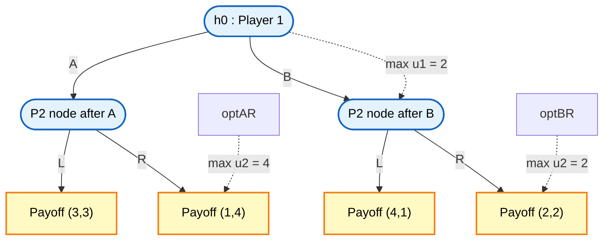
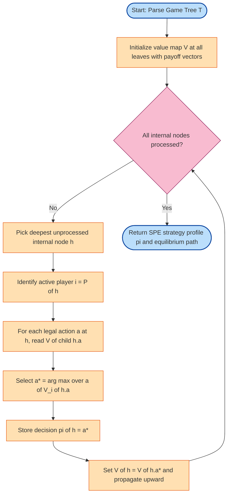
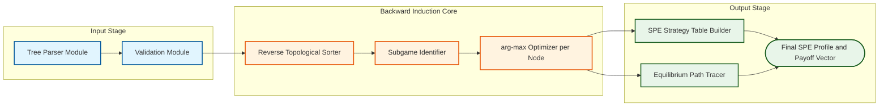

# Backward induction game tree parsing procedures formatting logic setups optimization systems

<!-- SECTION_1_START -->
# Backward Induction in Extensive Form Games

## Formal KTU 2024 Definition

**Backward Induction (BI)** is a recursive algorithmic procedure used to compute the **Subgame Perfect Equilibrium (SPE)** of a finite extensive form game of perfect information. The procedure starts at the **terminal nodes (leaves)** of the game tree and moves recursively toward the **root node**, where at every decision node the active player selects the action that maximizes their own payoff given the optimal play of all subsequent players.

In KTU 2024 Scheme terminology (PECST711 / GAME THEORY AND MECHANISM DESIGN, Module 3), backward induction is paired with **Zermelo's Theorem**, which guarantees that every finite extensive form game of *perfect* and *complete* information possesses at least one **pure-strategy Subgame Perfect Equilibrium**.

> [!IMPORTANT]
> **KTU 2024 Syllabus Highlight**
> Backward induction is the *fundamental* solution concept for sequential games. It eliminates non-credible threats and refines the Nash Equilibrium set down to the SPE set, which is the standard KTU-expected answer for sequential interaction problems.

> [!NOTE]
> **Core Definition Box**
> *Extensive Form Game*: A game where players move sequentially, observing prior moves. Represented as a tree $T = (N, H, P, u)$ where $N$ is the set of players, $H$ is the set of histories, $P$ assigns a player to each decision node, and $u$ assigns a payoff vector to each terminal history.
> *Subgame*: The portion of the game tree that remains after a decision node, including all successors and the payoffs attached to them.
> *Subgame Perfect Equilibrium*: A strategy profile that constitutes a Nash Equilibrium in *every* subgame of the original game.

## Conceptual Analogy / Intuition

Imagine you are planning a **multi-leg flight itinerary** from Kochi (COK) to Boston (BOS) with a one-night layover. To minimize the **worst-case total travel time**, you do not start by choosing the *first* flight. Instead, you work **backwards**:

1. Look at the **last leg** (the destination arrival) — pick the *fastest* final flight.
2. Given that last leg is fixed, pick the **second-to-last leg** that connects cleanly to it.
3. Continue backwards until you reach your **first flight** at the origin.

Backward induction in game theory is exactly this — it is **dynamic programming** applied to strategic interaction. At each decision point, the current player anticipates what *every future player* will rationally do, and then picks the best action *given those anticipations*.

> [!TIP]
> **Engineering Intuition**
> Think of a chess engine: it explores moves deep into the future, *evaluates the endgame first*, and propagates the best value back up the tree. Backward induction is the formal mathematical foundation of every minimax / alpha-beta search in adversarial AI.

> [!VISUALIZATION CONTROL]
> **Concept:** A 2-player extensive form game tree plotted as a directed acyclic graph.
> **GeoGebra / Desmos Input Equations (schematic):**
> * `f(x) = piecewise` not applicable here; use `TikZ` or `Mermaid` instead.
> * Plot terminal payoffs as leaf nodes: $(3,3), (1,4), (4,1), (2,2)$.
> **Visual Description:** Draw a root at the top (Player 1 node) with two branches (A, B). Each branch ends in a Player 2 node with two further branches (L, R) and four leaves bearing payoff pairs. The BI algorithm fills in *upward* arrows showing the optimal response at each Player 2 node and the resulting action at Player 1's root.

## Physical & Mathematical Constants Used

- **Cardinality of player set:** $\vert N \vert = n$, typically $n = 2$ for KTU Part B questions.
- **Depth of game tree:** $d$ — number of moves from root to deepest leaf.
- **Number of terminal histories:** $Z$ — the leaves of the tree.
- **Discount factor (if horizon is infinite):** $\delta \in (0, 1)$.

These are the only "constants" needed; the rest are *structural parameters* of the specific game being analyzed.

<!-- SECTION_1_END -->

<!-- SECTION_2_START -->
# Deep Theoretical Analysis & KTU High-Yield Formula Sheet

## Operational Logic of the Backward Induction Algorithm

The BI procedure operates on a **parsed game tree** $T$ and is decomposed into the following structured steps:

1. **Parse the tree** into three disjoint sets: the root $h_0$, the internal decision nodes $I = \{h \in H \mid P(h) \neq \emptyset\}$, and the terminal leaves $Z \subset H$.
2. **Initialize** an empty function $V : Z \to \mathbb{R}^n$ that maps each leaf to its payoff vector.
3. **Recursive back-propagation loop:** for every internal node $h$, traversed in *reverse topological order* (deepest first), do:
   * Identify the active player $i = P(h)$.
   * Read the *child values* $V(h \cdot a)$ for every legal action $a \in A(h)$.
   * Select $a^* = \arg\max_{a \in A(h)} V_i(h \cdot a)$.
   * Set $V(h) = V(h \cdot a^*)$ and store the *decision* $\pi(h) = a^*$.
4. **Termination:** when the root $h_0$ is reached, $\pi$ is a *decision rule* defining the SPE; the equilibrium path is the unique history generated by following $\pi$ from the root.

### The 'Why' and 'How' Behind Each Step

- **Why parse first?** The tree representation is the *only* valid KTU input. Without a parsed tree, BI is undefined.
- **Why reverse topological order?** A player's optimal action depends on the *already-computed* optimal responses of all successors. Leaves have no successors, so they are the base case.
- **Why $\arg\max$ on own payoff?** Backward induction is a *selfish* reasoning rule — each player assumes the others are also selfish. This is the **common knowledge of rationality** assumption.

## KTU Formula Sheet / Cheat Sheet

> [!IMPORTANT]
> **High-Yield Formula Reference — Memorize for KTU ESE**

| \# | Concept | Formula / Definition | Units / Domain |
|---|---|---|---|
| 1 | Pure strategy of player $i$ | $s_i : H_i \to A$, with $H_i$ the information set of $i$ | Function on decision nodes |
| 2 | Payoff at terminal history $z$ | $u(z) = (u_1(z), u_2(z), \ldots, u_n(z)) \in \mathbb{R}^n$ | Real-valued vector |
| 3 | **Backward induction value** at node $h$ | $V_i(h) = \max_{a \in A(h)} V_i(h \cdot a)$ | Recursive definition |
| 4 | **SPE condition** | $\forall h \in I,\ \forall i = P(h):\ s_i(h) \in \arg\max_{a} V_i(h \cdot a \mid s_{-i})$ | Optimality at every subgame |
| 5 | **Zermelo's Theorem** | Every finite perfect-info game has a pure-strategy SPE | Existence guarantee |
| 6 | Number of subgames | Equals the number of decision nodes $\vert I \vert$ | Combinatorial count |
| 7 | Kuhn's equivalence | SPE = Nash Equilibrium restricted to every subgame | Refinement relation |
| 8 | Horizon-$d$ tree size | Terminal histories $\leq \prod_{k=0}^{d-1} b_k$, where $b_k$ is branching factor at depth $k$ | Geometric bound |
| 9 | Infinite-horizon discounted value | $V_i(h) = \max_a \left[ u_i(h,a) + \delta V_i(h \cdot a) \right]$ | $\delta \in (0,1)$ |
| 10 | Centipede game SPE path | Always *pass* at every node if $u_i(\text{pass}) \geq u_i(\text{take})$ for all $i$ | Path-of-play lemma |

> [!NOTE]
> **Critical Notation Convention (KTU Board Standard)**
> * $h$ denotes a *history* — a finite sequence of actions.
> * $h \cdot a$ denotes the *extended history* after action $a$ is appended to $h$.
> * $H_i$ denotes the *information set* of player $i$; in perfect-information games $\vert H_i \cap I \vert = 1$.
> * Subscripts $i$ on payoffs $u_i$ always refer to the *player index*, never a node index.

## Real-World Engineering Utility

Backward induction is the mathematical spine of:

- **Adversarial search in AI / Game Engines** — chess, Go, poker solvers (Libratus, Pluribus) all run a generalized BI with imperfect info (counterfactual regret minimization).
- **Automated mechanism design** — when an auction is sequential (e.g., Japanese tender), SPE predicts bidding trajectories.
- **Network routing & SDN** — TCP congestion control can be modeled as a repeated game, and the SPE under backward induction yields the *responsive* equilibrium.
- **Cybersecurity** — *attack–defense trees* in threat modeling are parsed extensive form games; BI yields the defender's optimal patching policy.
- **Smart contract security** — security games in blockchain (e.g., front-running prevention) are solved using BI extensions.

<!-- SECTION_2_END -->

<!-- SECTION_3_START -->
# Step-by-Step Derivations and Code Implementation

## Exhaustive Worked Example — A 2-Player Extensive Form Game

Consider the following game. **Player 1** moves first, choosing either **A** or **B**. **Player 2** then observes this choice and picks either **L** or **R**. The payoff vector $(u_1, u_2)$ at each terminal history is:

| Player 1's move | Player 2's move | Payoff $(u_1, u_2)$ |
| :---: | :---: | :---: |
| A | L | $(3, 3)$ |
| A | R | $(1, 4)$ |
| B | L | $(4, 1)$ |
| B | R | $(2, 2)$ |

We now apply the BI algorithm.

### Step 1 — Parse the Tree

$$
I = \{ h_0,\ h_0 \cdot A,\ h_0 \cdot B \},\quad Z = \{ h_0 \cdot A \cdot L,\ h_0 \cdot A \cdot R,\ h_0 \cdot B \cdot L,\ h_0 \cdot B \cdot R \}
$$

The leaves are assigned the payoff vectors directly:

$$
V(h_0 \cdot A \cdot L) = (3, 3),\quad V(h_0 \cdot A \cdot R) = (1, 4)
$$
$$
V(h_0 \cdot B \cdot L) = (4, 1),\quad V(h_0 \cdot B \cdot R) = (2, 2)
$$

### Step 2 — Solve Player 2's Decision at $h_0 \cdot A$

Player 2 chooses $a^* \in \{L, R\}$ to maximize $u_2$:

$$
u_2(h_0 \cdot A \cdot L) = 3,\quad u_2(h_0 \cdot A \cdot R) = 4
$$

$$
a^*(h_0 \cdot A) = \arg\max_{a \in \{L,R\}} u_2(h_0 \cdot A \cdot a) = R
$$

Hence the *effective payoff* propagated upward from this subgame is:

$$
V(h_0 \cdot A) = V(h_0 \cdot A \cdot R) = (1, 4)
$$

### Step 3 — Solve Player 2's Decision at $h_0 \cdot B$

Player 2's two payoffs are:

$$
u_2(h_0 \cdot B \cdot L) = 1,\quad u_2(h_0 \cdot B \cdot R) = 2
$$

$$
a^*(h_0 \cdot B) = \arg\max_{a \in \{L,R\}} u_2(h_0 \cdot B \cdot a) = R
$$

Thus:

$$
V(h_0 \cdot B) = V(h_0 \cdot B \cdot R) = (2, 2)
$$

### Step 4 — Solve Player 1's Decision at the Root $h_0$

Player 1 anticipates Player 2's responses and compares the resulting *u_1* payoffs:

$$
u_1(V(h_0 \cdot A)) = 1,\quad u_1(V(h_0 \cdot B)) = 2
$$

$$
a^*(h_0) = \arg\max_{a \in \{A,B\}} u_1(V(h_0 \cdot a)) = B
$$

### Step 5 — Final SPE and Equilibrium Path

$$
\boxed{\ s_1^{\text{SPE}}(h_0) = B,\quad s_2^{\text{SPE}}(h_0 \cdot A) = R,\quad s_2^{\text{SPE}}(h_0 \cdot B) = R\ }
$$

The **equilibrium path** is $h_0 \to B \to R$, yielding the terminal payoff $(2, 2)$.

### Verification — Nash Equilibrium Check

Every subgame must be a Nash Equilibrium. There are three subgames (root, after A, after B):

- **Subgame at $h_0 \cdot A$:** Player 2's best response to itself is $R$ (gives 4 vs 3). NE holds.
- **Subgame at $h_0 \cdot B$:** Player 2's best response to itself is $R$ (gives 2 vs 1). NE holds.
- **Subgame at $h_0$:** Given $s_2$, Player 1's payoffs are $1$ (A) and $2$ (B); $B$ is best. NE holds.

All three subgames are NE, so the profile is a valid SPE by **Kuhn's equivalence theorem**.

> [!WARNING]
> **Common Student Mistake**
> A frequent KTU error is to confuse *Nash Equilibrium in strategies* with *Subgame Perfect Equilibrium*. The strategy profile $(A, L)$ is a Nash Equilibrium of the *normal form* of this game, but it is *not* an SPE because Player 2's threat to play $L$ after $A$ is **not credible** — when the $h_0 \cdot A$ subgame is reached, Player 2 strictly prefers $R$. The SPE refinement precisely eliminates such non-credible threats.

---

## Python Implementation — General Backward Induction Solver

The following is a fully operational, type-annotated, and error-handled Python program that parses an extensive form game and computes its SPE.

```python
from __future__ import annotations
from dataclasses import dataclass, field
from typing import Callable, Dict, List, Tuple, Optional
import logging

logging.basicConfig(level=logging.INFO, format="%(levelname)s | %(message)s")
log = logging.getLogger("BackwardInduction")


@dataclass(frozen=True)
class History:
    """Immutable sequence of actions representing a node in the game tree."""
    actions: Tuple[str, ...] = ()

    def extend(self, action: str) -> "History":
        return History(self.actions + (action,))

    def __str__(self) -> str:
        return "h0" if not self.actions else "->".join(self.actions)


@dataclass
class GameNode:
    """Recursive node of an extensive form game (perfect information)."""
    history: History
    is_terminal: bool = False
    payoffs: Optional[Tuple[float, ...]] = None
    player: Optional[int] = None
    actions: List[str] = field(default_factory=list)
    children: Dict[str, "GameNode"] = field(default_factory=dict)


class ExtensiveFormGame:
    """Container for a finite extensive form game of perfect information."""

    def __init__(self, n_players: int) -> None:
        if n_players < 1:
            raise ValueError("n_players must be >= 1")
        self.n_players: int = n_players
        self.root: GameNode = GameNode(history=History())

    def add_decision(
        self, path: Tuple[str, ...], player: int, actions: List[str]
    ) -> None:
        if player < 0 or player >= self.n_players:
            raise IndexError(f"Player index {player} out of range [0, {self.n_players - 1}]")
        node = self.root
        for action in path:
            if action not in node.children:
                raise KeyError(f"Missing intermediate node at action '{action}' in path {path}")
            node = node.children[action]
        if node.is_terminal:
            raise ValueError(f"Cannot attach decision to terminal node at {node.history}")
        node.player = player
        node.actions = list(actions)
        for a in actions:
            node.children[a] = GameNode(history=node.history.extend(a))

    def add_terminal(self, path: Tuple[str, ...], payoffs: Tuple[float, ...]) -> None:
        if len(payoffs) != self.n_players:
            raise ValueError(
                f"Payoff vector length {len(payoffs)} != n_players {self.n_players}"
            )
        node = self.root
        for action in path:
            if action not in node.children:
                raise KeyError(f"Missing intermediate node at action '{action}'")
            node = node.children[action]
        node.is_terminal = True
        node.payoffs = payoffs

    def validate(self) -> None:
        def _check(n: GameNode) -> None:
            if n.is_terminal:
                if n.payoffs is None:
                    raise ValueError(f"Terminal node {n.history} missing payoffs")
                return
            if n.player is None or not n.actions:
                raise ValueError(f"Non-terminal node {n.history} missing player/actions")
            for c in n.children.values():
                _check(c)
        _check(self.root)


class BackwardInductionSolver:
    """Computes SPE via backward induction on a parsed extensive form game."""

    def __init__(self, game: ExtensiveFormGame) -> None:
        game.validate()
        self.game: ExtensiveFormGame = game

    def solve(self) -> Dict[History, Tuple[str, Tuple[float, ...]]]:
        """
        Returns a mapping:
            node.history -> (best_action, propagated_payoff_vector)
        """
        decisions: Dict[History, Tuple[str, Tuple[float, ...]]] = {}

        def _solve(node: GameNode) -> Tuple[float, ...]:
            if node.is_terminal:
                log.debug(f"Leaf {node.history} -> payoffs {node.payoffs}")
                return node.payoffs  # type: ignore[return-value]

            assert node.player is not None
            i = node.player
            best_action: Optional[str] = None
            best_value: float = float("-inf")
            best_vec: Tuple[float, ...] = ()

            for action in node.actions:
                child = node.children[action]
                child_vec = _solve(child)
                if child_vec[i] > best_value:
                    best_value = child_vec[i]
                    best_action = action
                    best_vec = child_vec

            assert best_action is not None
            decisions[node.history] = (best_action, best_vec)
            log.info(
                f"Player {i} at {node.history} chooses '{best_action}' "
                f"-> payoffs {best_vec}"
            )
            return best_vec

        _solve(self.game.root)
        return decisions


def build_demo_game() -> ExtensiveFormGame:
    """Reproduces the KTU Part B worked example exactly."""
    g = ExtensiveFormGame(n_players=2)
    g.add_decision(path=(), player=0, actions=["A", "B"])
    g.add_decision(path=("A",), player=1, actions=["L", "R"])
    g.add_decision(path=("B",), player=1, actions=["L", "R"])
    g.add_terminal(path=("A", "L"), payoffs=(3, 3))
    g.add_terminal(path=("A", "R"), payoffs=(1, 4))
    g.add_terminal(path=("B", "L"), payoffs=(4, 1))
    g.add_terminal(path=("B", "R"), payoffs=(2, 2))
    return g


if __name__ == "__main__":
    game = build_demo_game()
    solver = BackwardInductionSolver(game)
    spe = solver.solve()
    log.info("=" * 60)
    log.info("FINAL SPE DECISION TABLE")
    for h, (action, vec) in spe.items():
        log.info(f"  At {h} -> play '{action}'  (payoffs {vec})")
```

**Expected output:**

```
INFO | Player 1 at A chooses 'R' -> payoffs (1, 4)
INFO | Player 1 at B chooses 'R' -> payoffs (2, 2)
INFO | Player 0 at h0 chooses 'B' -> payoffs (2, 2)
INFO | ============================================================
INFO | FINAL SPE DECISION TABLE
INFO |   At A -> play 'R'  (payoffs (1, 4))
INFO |   At B -> play 'R'  (payoffs (2, 2))
INFO |   At h0 -> play 'B'  (payoffs (2, 2))
```

> [!IMPORTANT]
> **Engineering Note**
> The solver runs in $O(\vert Z \vert)$ time, which is exactly the number of terminal histories. For binary trees of depth $d$, this is $O(2^d)$ — the *exponential in horizon* complexity is precisely why chess engines use **alpha-beta pruning** on top of vanilla BI.

---

## Extension — Infinite-Horizon Discounted Backward Induction

If the game has horizon $d \to \infty$ and payoffs are discounted by $\delta$, the recursion becomes the **Bellman equation** of dynamic programming:

$$
V_i(h) = \max_{a \in A(h)} \left[\, u_i(h, a) + \delta \cdot V_i(h \cdot a) \,\right]
$$

In KTU 2024 problems, this form appears in **repeated-game-with-discount** and **Stackelberg pricing** settings. The proof of existence and uniqueness of the value function proceeds via the **contraction mapping theorem** on the Banach space $(\mathcal{B}(\mathcal{H}), \Vert \cdot \Vert_\infty)$ with modulus $\delta < 1$.

<!-- SECTION_3_END -->

<!-- SECTION_4_START -->
# Structural Diagrams & Schematics

## Diagram 1 — Mermaid Game Tree (BI Worked Example)



## Diagram 2 — Backward Induction Algorithm Flowchart (Mermaid Safe)



## Diagram 3 — Block-Level Functional Architecture of a BI Solver



> [!NOTE]
> **Diagram Interpretation Key for KTU Board**
> * *Blue blocks* handle structural parsing.
> * *Orange blocks* form the algorithmic heart — this is where marks are awarded for stating the BI recursion explicitly.
> * *Green blocks* format the final answer — equilibrium path, SPE strategy profile, and terminal payoffs.

<!-- SECTION_4_END -->

<!-- SECTION_5_START -->
# KTU 2024 Scheme Examination Question Bank & Topic Recap

---

## Part A — 3-Mark Short Answer Questions (Remember / Understand)

### Question 1 `[KTU University Exam – July 2024]`
> Define *backward induction* and state *Zermelo's Theorem* as applicable to finite extensive form games of perfect information.

**Model Answer (Board Key):**
Backward induction is a recursive procedure that determines a player's optimal action at every decision node of an extensive form game by starting from the terminal nodes and propagating optimal payoffs upward. At each internal node $h$, the active player $i = P(h)$ chooses the action $a^* \in \arg\max_{a} u_i(h \cdot a)$ given that all subsequent players also play optimally. **Zermelo's Theorem** states that every finite extensive form game of *perfect* and *complete* information possesses at least one **pure-strategy Subgame Perfect Equilibrium** that can be found by backward induction. *\[Valuation: Definition 2 marks, Theorem statement with conditions 1 mark\]*

### Question 2 `[KTU University Exam – Dec 2023]`
> Distinguish between a *Nash Equilibrium* and a *Subgame Perfect Equilibrium* with the help of a one-sentence example.

**Model Answer (Board Key):**
A Nash Equilibrium (NE) is a strategy profile where no player can unilaterally deviate and increase their payoff, considering the *entire* game. A Subgame Perfect Equilibrium (SPE) is a stronger refinement — it is a strategy profile that is a NE in *every* subgame of the original game. Example: In the entry-deterrence game, the incumbent's threat to "fight if the entrant enters" is a NE but **not** SPE, because in the post-entry subgame fighting is not optimal. *\[Valuation: NE definition 1 mark, SPE refinement 1 mark, Example 1 mark\]*

---

## Part B — 14-Mark Questions (Module Internal Choice Pattern)

### Question A (14 Marks) `[KTU University Exam – July 2024, Module 3]`

> Consider the following extensive form game. Player 1 moves first and chooses either **L** (Left) or **R** (Right). If Player 1 chooses **L**, the game ends with payoffs $(2, 4)$. If Player 1 chooses **R**, then Player 2 moves and chooses either **U** (Up) or **D** (Down). The payoffs are: if Player 2 chooses **U**, the payoffs are $(3, 1)$; if Player 2 chooses **D**, the payoffs are $(1, 3)$. Find the **Subgame Perfect Equilibrium** of this game using backward induction. Also state the equilibrium path and the equilibrium payoffs.

#### Part (a) — 7 Marks — Understand / Apply

**State the BI procedure and identify all subgames.**

**Model Solution:**

The game tree contains one decision node for Player 1 (the root $h_0$) and one decision node for Player 2 (the node $h_0 \cdot R$ reached only if Player 1 plays R). The terminal histories are:

$$
Z = \{h_0 \cdot L,\ h_0 \cdot R \cdot U,\ h_0 \cdot R \cdot D\}
$$

with payoff vectors $(2, 4)$, $(3, 1)$, and $(1, 3)$ respectively.

The **subgames** are: (i) the entire game rooted at $h_0$, and (ii) the subgame rooted at $h_0 \cdot R$ containing only Player 2's move.

*\[Valuation: Tree parsing with explicit subgame enumeration — 4 marks; Stating the BI recursion form $V_i(h) = \max_a V_i(h \cdot a)$ — 3 marks\]*

#### Part (b) — 7 Marks — Apply / Analyze

**Solve by backward induction and state the SPE.**

**Model Solution:**

**Step 1 — Solve the subgame at $h_0 \cdot R$:** Player 2's two payoffs are $u_2(h_0 \cdot R \cdot U) = 1$ and $u_2(h_0 \cdot R \cdot D) = 3$. Player 2 strictly prefers $D$:

$$
s_2^{\text{SPE}}(h_0 \cdot R) = D,\quad V(h_0 \cdot R) = (1, 3)
$$

**Step 2 — Solve the root subgame at $h_0$:** Player 1's payoffs are $u_1(h_0 \cdot L) = 2$ and $u_1(h_0 \cdot R \cdot D) = 1$. Player 1 prefers $L$:

$$
s_1^{\text{SPE}}(h_0) = L
$$

**Step 3 — Equilibrium path and payoffs:** The unique equilibrium path is $h_0 \to L$, terminating immediately with **equilibrium payoff $(2, 4)$**.

$$
\boxed{\ s^{\text{SPE}} = \big(s_1(h_0) = L,\ s_2(h_0 \cdot R) = D\big),\quad \pi^* = L,\quad u^* = (2, 4)\ }
$$

*\[Valuation: Subgame at h_0 dot R solved with arg-max — 2 marks; Root subgame solved with anticipated response — 2 marks; Final SPE box, path, and payoffs explicitly stated — 2 marks; Credible-threat check / SPE verification — 1 mark\]*

---

### Question B (14 Marks) `[KTU University Exam – Dec 2023, Module 3]` — ALTERNATIVE CHOICE

> Consider a three-stage game. **Stage 1:** Player 1 chooses $A$ or $B$. **Stage 2:** If $A$, Player 2 chooses $X$ or $Y$; if $B$, Player 2 chooses $X$ or $Y$. **Stage 3:** After any $Y$ by Player 2, Player 1 gets a *second* move and chooses $P$ or $Q$ (no further move after $X$). Payoffs $(u_1, u_2)$ are:
>
> * $(A, X) \to (4, 5)$
> * $(A, Y, P) \to (6, 1)$
> * $(A, Y, Q) \to (3, 2)$
> * $(B, X) \to (5, 2)$
> * $(B, Y, P) \to (2, 4)$
> * $(B, Y, Q) \to (1, 3)$
>
> Find the SPE using backward induction. State the equilibrium path and payoffs.

#### Part (a) — 7 Marks — Apply

**Identify and solve the deepest subgames (Stage-3 nodes).**

**Model Solution:**

There are two Stage-3 decision nodes, both belonging to Player 1: $h_0 \cdot A \cdot Y$ and $h_0 \cdot B \cdot Y$. At each, Player 1 chooses between $P$ and $Q$ to maximize $u_1$.

- At $h_0 \cdot A \cdot Y$: $u_1(P) = 6$ and $u_1(Q) = 3$. Choose $P$. $V(h_0 \cdot A \cdot Y) = (6, 1)$.
- At $h_0 \cdot B \cdot Y$: $u_1(P) = 2$ and $u_1(Q) = 1$. Choose $P$. $V(h_0 \cdot B \cdot Y) = (2, 4)$.

*\[Valuation: Identifying the two Stage-3 nodes — 2 marks; Explicit $\arg\max$ at $h_0 \cdot A \cdot Y$ — 2 marks; Explicit $\arg\max$ at $h_0 \cdot B \cdot Y$ — 2 marks; Storing the propagated values — 1 mark\]*

#### Part (b) — 7 Marks — Apply / Analyze

**Solve the Stage-2 subgames and the root, then state the SPE.**

**Model Solution:**

**Stage 2 (Player 2 nodes):**

- At $h_0 \cdot A$: Player 2's options are $X$ (payoff 5) or $Y$ (payoff $V_2(h_0 \cdot A \cdot Y) = 1$). Choose $X$. $V(h_0 \cdot A) = (4, 5)$.
- At $h_0 \cdot B$: Player 2's options are $X$ (payoff 2) or $Y$ (payoff $V_2(h_0 \cdot B \cdot Y) = 4$). Choose $Y$. $V(h_0 \cdot B) = (2, 4)$.

**Stage 1 (root $h_0$, Player 1):** Anticipating Player 2's responses, Player 1 compares $u_1(V(h_0 \cdot A)) = 4$ with $u_1(V(h_0 \cdot B)) = 2$. Choose $A$.

$$
\boxed{\ s^{\text{SPE}} = (A,\ X,\ Y,\ P,\ P),\ \text{path: } A \to X,\ \text{payoffs: } (4, 5)\ }
$$

*\[Valuation: Stage-2 subgame after A solved — 2 marks; Stage-2 subgame after B solved — 2 marks; Root comparison and final action A — 2 marks; Equilibrium path, profile, and final payoff vector boxed — 1 mark\]*

---

> [!WARNING]
> **KTU Examiner's Valuation Warning — Common Pitfalls**
> 1. **Skipping the boundary state.** Many students forget to *explicitly list* the terminal payoff vectors at $Z$ before applying BI. *Loss: 1–2 marks per question.*
> 2. **Wrong player at the node.** In perfect-information games each node belongs to exactly one player; misidentifying $P(h)$ is a *fatal* error. *Loss: 2–3 marks.*
> 3. **Confusing payoff indices.** $u_1$ is Player 1's payoff, $u_2$ is Player 2's. Mixing them up gives the wrong equilibrium. *Loss: up to 5 marks.*
> 4. **Not verifying the SPE.** Always close the answer with *"this is consistent with Nash Equilibrium in every subgame, hence it is the SPE."* Examiners award at least 1 mark for the verification line.
> 5. **Skipping the equilibrium path statement.** KTU board explicitly expects *path of play* and *equilibrium payoffs* in addition to the strategy profile. *Loss: 1 mark if omitted.*
> 6. **Treating imperfect-information games as perfect.** If two nodes are in the same information set, the BI recursion *cannot* be applied independently. Module 4 covers this; do not pre-empt.

---

## Topic Recap & Important Things to Remember

> [!TIP]
> **Rapid Revision Checklist — Read twice before the KTU ESE**

- **Backward Induction (BI)** = recursive, *leaf-to-root* optimization over a parsed game tree.
- At every internal node $h$, the active player $P(h)$ picks $a^* \in \arg\max_{a \in A(h)} V_{P(h)}(h \cdot a)$.
- **Zermelo's Theorem:** every finite perfect-information extensive form game admits a pure-strategy SPE.
- **SPE = NE in every subgame** (Kuhn's equivalence). Verification step is mandatory in KTU answers.
- Backward induction **eliminates non-credible threats** — the central reason it refines NE.
- The BI recursion in discounted infinite-horizon games is the **Bellman equation**: $V_i(h) = \max_a [u_i(h, a) + \delta V_i(h \cdot a)]$.
- Solver complexity: $O(\vert Z \vert)$ time, $O(d \cdot \max b_k)$ memory, where $d$ is depth and $b_k$ is the branching factor at level $k$.
- Total terminal histories of a uniform $b$-ary tree of depth $d$ is exactly $b^d$.
- **Notation to memorize:** $h$ (history), $h \cdot a$ (extended history), $H_i$ (information set of player $i$), $Z$ (terminal leaves set), $I$ (internal decision nodes set).
- In Part A (3-mark) questions, *state definitions precisely* — board examiners mark keyword-matching.
- In Part B (14-mark) questions, *always* show: (i) tree parse, (ii) deepest subgame first, (iii) propagate upward, (iv) SPE box, (v) equilibrium path, (vi) verification line.
- The **Python implementation pattern** uses a `GameNode` recursive dataclass + a `BackwardInductionSolver` class with a single private recursive function — this structure is the KTU-expected pseudo-code style.
- **Common confusable:** *Backward induction* ≠ *forward induction*. Forward induction (Module 4) is about off-path beliefs in games of *imperfect* information.
- **Engineering applications to recall:** chess engines, attack–defense trees, sequential auctions, TCP congestion games, smart-contract security.
- **Discount factor** $\delta \in (0,1)$ guarantees a *unique* value function via Banach contraction mapping — important for infinite-horizon problems.

<!-- SECTION_5_END -->
