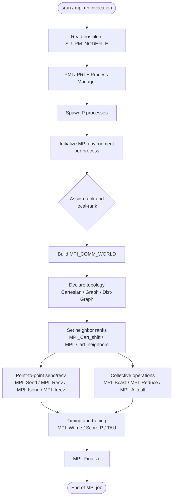
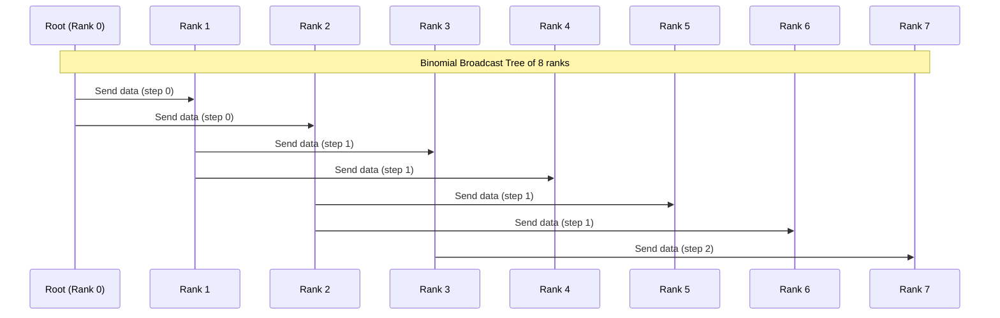
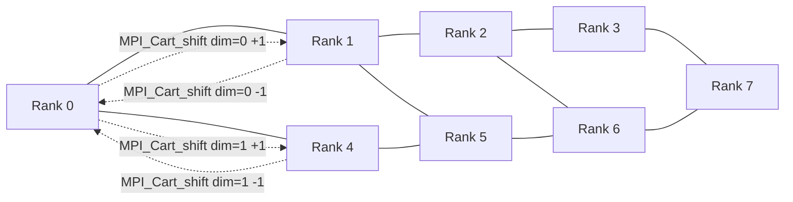
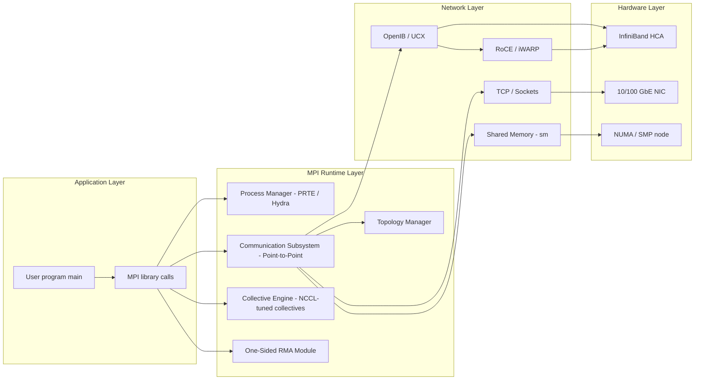

# Message Passing Interface (MPI) link communication structures algorithms tracking: MPI clusters setups

<!-- SECTION_1_START -->

# Message Passing Interface (MPI) — Link Communication Structures, Algorithms, and Cluster Setup Tracking

## 1.1 Formal Academic Definition (KTU 2024 Syllabus Terminology)

> [!IMPORTANT]
> **Definition:** The **Message Passing Interface (MPI)** is a **standardized, language-independent, message-passing library specification** (currently MPI 4.0, with MPI 3.1 widely deployed) that enables **distributed-memory parallel computing** by allowing processes running on potentially heterogeneous nodes of a cluster to **communicate** through explicit **send** and **receive** operations over interconnection networks.

In the context of **PECST712 – High Performance Computing (Module 1: Parallel Programming Paradigms)**, MPI is positioned as the **de-facto industry standard** for distributed-memory parallel programming. KTU 2024 Scheme emphasizes the following pillars of MPI:

1. **Link Communication Structures** — the topology-aware interconnects (Cartesian, Graph, Torus) and virtual channel abstractions.
2. **Communication Algorithms** — blocking, non-blocking, collective, one-sided (RMA) and neighborhood operations.
3. **Cluster Setup Tracking** — process placement, rank-to-host mapping, environment propagation via `mpirun` / `mpiexec` / `srun`, and runtime introspection.

The **physical layer** typically uses high-speed fabrics such as **InfiniBand (HDR 200 Gbps, NDR 400 Gbps)**, **Omni-Path (100 Gbps)**, **Gigabit / 10-Gigabit Ethernet**, or **Myrinet**, with software-level transport through **UCX**, **OpenIB**, or **TCP/IP** sockets.

> [!NOTE]
> **KTU 2024 Highlight:** Students are expected to know that MPI is a **specification, not an implementation**. Popular implementations include **OpenMPI**, **MPICH**, **Intel MPI**, **MVAPICH2**, and **Cray MPICH**.

## 1.2 Conceptual Analogy — The Postal Service of a Supercomputer

Imagine a **large multinational company** spread across **$N$ cities** (cluster nodes). Each city has its own **private office with locked safes** (process memory) — no other city can peek inside. The only way cities exchange files is through a **standardized courier service** that has a strict, universal protocol (the MPI standard).

- **The Sender** writes a letter, puts it in an **envelope** (the `MPI_Send` call) with a **tag** and a **destination address** (rank + communicator).
- **The Receiver** waits at the door (the `MPI_Recv` call), accepts envelopes of a specific **shape, color, and tag**, and deposits the content into its safe.
- The **Postmaster General** (the **MPI runtime / process manager**) is responsible for **assigning the cities**, **delivering the letters**, and **handling returns (errors)**.

If two cities want to **broadcast a holiday greeting**, the postmaster organizes a **conference call** (`MPI_Bcast`). If they want to **add up all their money**, the postmaster runs a **reduction lottery** (`MPI_Allreduce`). If they sit in a **circular conference table** (`Cartesian topology`), the postmaster can deliver mail to **only the left and right neighbors** in `$O(1)$` time.

> [!TIP]
> **Intuitive Takeaway:** *MPI is the contractual language of a parallel courier system — every node in the cluster agrees to a fixed set of send/receive rules so that any combination of hardware and application code can interoperate.*

## 1.3 Geometric / Architectural Intuition

A typical MPI cluster can be visualized as a **graph $G = (V, E)$** where:

- **Vertices $V$** correspond to **MPI processes** (one or more per node).
- **Edges $E$** represent **direct MPI communication links** (point-to-point channels).
- **Weights $w(u,v)$** represent **latency** ($\mu s$) and **bandwidth** ($GB/s$) of the link.

**Performance Bandwidth–Latency Model:**

$$
T_{comm}(n) = \alpha + \beta \cdot n + \gamma(n)
$$

where $\alpha$ is the **latency** (in $\mu s$, includes software + network), $\beta$ is the **per-byte cost** ($ns/byte$, related to $1/bandwidth$), $n$ is the message size in **bytes**, and $\gamma(n)$ accounts for **network contention** and **routing overhead**.

> [!VISUALIZATION CONTROL]
> **Concept:** Bandwidth–Latency Communication Cost Curve
> **GeoGebra / Desmos Input Equations:**
> * `f(x) = 1.5 + 0.003 * x` &nbsp; &nbsp; (latency = 1.5 $\mu$s, bandwidth = 333 MB/s)
> * `g(x) = 2.0 + 0.001 * x` &nbsp; &nbsp; (faster network: 1 GB/s)
> **Visual Description:** A nearly flat line for small $x$ (latency-dominated) rising linearly for large $x$ (bandwidth-dominated). The $y$-intercept at $x=0$ shows the fixed $\alpha$ cost.

---

<!-- SECTION_1_END -->

<!-- SECTION_2_START -->

# Deep Theoretical Analysis & KTU High-Yield Formula Sheet

## 2.1 MPI Communication Link Structures

MPI exposes **three levels of link structure** that the programmer can exploit for performance.

### 2.1.1 Logical Process Topology — `MPI_CART_CREATE`

A **Cartesian topology** maps a virtual grid of $d$ dimensions over a process set. Suppose we have $P$ processes arranged in a $d$-dimensional grid with dimensions $(p_1, p_2, \dots, p_d)$:

$$
P = \prod_{i=1}^{d} p_i
$$

The **periodicity** flag allows wrap-around connections (e.g., row $p_1 - 1$ connects back to row $0$), enabling efficient **torus** mappings.

| Parameter | KTU Symbol | Purpose |
|---|---|---|
| `dims` | $(p_1, p_2, \dots, p_d)$ | Number of processes per dimension |
| `periods` | $(c_1, c_2, \dots, c_d)$ | 1 = wrap-around (torus), 0 = open (mesh) |
| `reorder` | $\{0, 1\}$ | Allow the runtime to renumber ranks for locality |
| `coords` | $(c_1, c_2, \dots, c_d)$ | Cartesian coordinates of a given rank |
| `neighbors` | $N_{source}, N_{dest}$ | Source/dest ranks in each direction |

### 2.1.2 General Graph Topology — `MPI_GRAPH_CREATE` and `MPI_DIST_GRAPH_CREATE`

For irregular interconnects (e.g., a fat-tree, dragonfly, or application-specific pattern), MPI supports **graph topologies**. A **distributed graph** allows each process to specify only its **local neighborhood**, reducing initialization time for large systems.

For a vertex $v$ with **degree $d_v$**, the average number of edges is:

$$
\bar{E} = \frac{1}{\vert V \vert} \sum_{v \in V} d_v
$$

### 2.1.3 Neighborhood Collectives — `MPI_NEIGHBOR_ALLTOALL`

Introduced in **MPI 3.0**, neighborhood collectives fuse the **two-step pattern** of (1) exchange neighbors + (2) perform collective into a **single kernel-optimized call**, leveraging hardware offload on **InfiniBand** and **Portals** networks.

## 2.2 Communication Algorithms

### 2.2.1 Blocking Point-to-Point — `MPI_Send` / `MPI_Recv`

- **Eager protocol** for small messages ($n \le n_{eager}$): data is sent immediately, copied into a runtime buffer; **synchronous hand-shake only at the receiver**.
- **Rendevouz protocol** for large messages ($n > n_{eager}$): a **zero-copy** handshake, then direct data transfer.

The crossover threshold $n_{eager}$ is typically **8 KB – 64 KB** depending on the MPI implementation.

### 2.2.2 Non-Blocking — `MPI_Isend` / `MPI_Irecv` + `MPI_Wait` / `MPI_Test`

Decouples **communication** from **synchronization**. Enables **latency hiding** by overlapping communication with computation:

$$
T_{overlapped} = \max(T_{comp},\ T_{comm}) \le T_{comp} + T_{comm}
$$

### 2.2.3 Collective Algorithms

| Collective | Communication Function | Tree Algorithm | Bandwidth Complexity | Latency Complexity |
|---|---|---|---|---|
| `MPI_Bcast` | 1 → N | Binomial / K-nomial tree | $\Theta(N \cdot n)$ | $\Theta(\log N \cdot \alpha)$ |
| `MPI_Reduce` | N → 1 | Binomial reduce tree | $\Theta(N \cdot n)$ | $\Theta(\log N \cdot \alpha)$ |
| `MPI_Allreduce` | N → N | Bruck / Rabenseifner | $\Theta(N \cdot n)$ | $\Theta(\log N \cdot \alpha)$ |
| `MPI_Allgather` | N → N | Ring / Bruck | $\Theta(N \cdot n)$ | $\Theta(\log N \cdot \alpha)$ |
| `MPI_Alltoall` | N → N | Pairwise exchange | $\Theta(N^2 \cdot n)$ | $\Theta(\log N \cdot \alpha)$ |
| `MPI_Scatter` | 1 → N | Binomial scatter | $\Theta(N \cdot n)$ | $\Theta(\log N \cdot \alpha)$ |
| `MPI_Gather` | N → 1 | Binomial gather | $\Theta(N \cdot n)$ | $\Theta(\log N \cdot \alpha)$ |
| `MPI_Barrier` | Sync only | Dissemination / Tournament | $0$ | $\Theta(\log N \cdot \alpha)$ |

For **Alltoall** with $N$ processes each sending $n$ bytes, the total data volume is $N^2 \cdot n$, often the **bandwidth-limiting** operation.

### 2.2.4 One-Sided (RMA) — `MPI_Put` / `MPI_Get` / `MPI_Accumulate`

Enables **direct memory access** to a remote window with **active target synchronization** (`MPI_Win_lock` / `MPI_Win_unlock`) or **passive target synchronization** (`MPI_Win_fence`). Useful for **PGAS-style** programming and avoiding the send/receive matching overhead.

### 2.2.5 Non-Blocking Collectives (NBC) — MPI 3.0+

`MPI_Ibcast`, `MPI_Iallreduce`, etc. start the collective and return a request handle. Crucial for **overlapping collectives with computation** in stencil and linear-algebra kernels.

## 2.3 Cluster Setup Tracking

### 2.3.1 Process Launchers

| Launcher | Typical Use | Key Flags |
|---|---|---|
| `mpirun` (OpenMPI) | Default OpenMPI | `-np N`, `-hostfile hosts.txt`, `--map-by`, `--bind-to` |
| `mpiexec` (MPICH/Hydra) | MPICH, Intel MPI | `-n N`, `-f hosts.txt`, `-ppn 4` |
| `srun` (Slurm) | HPC schedulers | `-N nodes`, `-n tasks`, `--cpus-per-task` |
| `jsrun` (LSF) | IBM Spectrum | `-n N`, `-r 1`, `-a 4` |

### 2.3.2 Rank-to-Host Mapping

The **process placement** is described by a tuple:
$$
(ppn,\ map\text{-}by,\ bind\text{-}to)
$$

- `ppn` = processes per node (e.g., 4 on a 32-core node).
- `map-by = socket/ numa/core/ l3cache` — controls **where** ranks are placed.
- `bind-to = socket/ numa/core/ l3cache` — controls **hardware pinning** of each rank.

### 2.3.3 Environment Tracking Variables

| Variable | Meaning |
|---|---|
| `PMI_RANK` | Rank of the process inside the job |
| `PMI_SIZE` | Total number of processes |
| `OMPI_COMM_WORLD_RANK` | OpenMPI world rank |
| `OMPI_COMM_WORLD_SIZE` | OpenMPI world size |
| `MPI_LOCALRANKID` | Rank within the local node |
| `MPI_NODEID` | Node identifier |
| `UCX_TLS` | Transport selection (e.g., `rc,ud,dc`) |
| `UCX_NET_DEVICES` | Restrict to specific network devices |
| `OMPI_MCA_btl` | Byte Transfer Layer selection |

> [!IMPORTANT]
> **KTU 2024 Highlight:** The MPI process manager **does not** automatically provide topology awareness. The programmer must use `MPI_CART_CREATE` or `MPI_DIST_GRAPH_CREATE` to declare the intended link structure, allowing the runtime to optimize routing.

## 2.4 KTU High-Yield Formula Sheet

| Concept | Formula | Notes |
|---|---|---|
| Total communication time | $T_{comm}(n) = \alpha + \beta n$ | Hockney model |
| Bandwidth | $B = 1/\beta$ | bytes / second |
| LogP parameters | $L, o, g, P$ | latency, overhead, gap, processors |
| $\log P$ model (Culler et al.) | $T_{msg} = L + 2o + \max(g, L) \cdot \lceil n / w \rceil$ | $w$ = network width |
| Total grid processes | $P = \prod p_i$ | Cartesian topology |
| Optimal 2-D grid for $N$ | $p_x = \sqrt{N}$ | Square minimizes perimeter |
| 2-D mesh bandwidth | $B = 2 \cdot N$ | per direction, all 4 neighbors |
| 2-D torus bandwidth | $B = 4 \cdot N$ | per direction, with wrap-around |
| Bisection bandwidth (mesh) | $B_{bisect} = N$ | cuts the grid in half |
| Bisection bandwidth (torus) | $B_{bisect} = 2N$ | doubled by wrap-around |
| Speedup | $S = T_{serial} / T_{parallel}$ | $S \le N$ |
| Efficiency | $E = S / N$ | $0 \le E \le 1$ |
| Isoefficiency | $\Theta(f(P))$ | problem size $W$ such that $T_{parallel} = O(T_{serial}/P)$ |
| Reduction tree depth | $\lceil \log_2 N \rceil$ | binomial tree |
| Bruck algorithm index | $idx_k = (rank + k) \mod N$ | Allgather with $\log N$ steps |
| Alltoall optimal volume | $N \cdot n \cdot (N-1)$ | lower bound |

> [!NOTE]
> **Real-World Utility:** MPI powers **climate simulation (WRF, CESM)**, **molecular dynamics (GROMACS, NAMD)**, **finite-element solvers (deal.II)**, **deep-learning frameworks (Horovod, Megatron-LM)**, and **graph analytics (GraphX-MPI)**. The link-structure abstractions are essential when scaling beyond **100,000 cores** on systems like **Fugaku**, **Frontier**, and **Aurora**.

---

<!-- SECTION_2_END -->

<!-- SECTION_3_START -->

# Step-by-Step Derivations & Code/Symbolic Implementation

## 3.1 Derivation: Optimal 2-D Mesh Dimensions for $N$ Processes

**Problem:** Given $N$ processes, find the grid dimensions $p_x \times p_y$ that minimize the **longest communication diameter** (worst-case hop count) for a 2-D mesh.

**Step 1:** Define the **diameter** $D$ of a $p_x \times p_y$ mesh (no wrap-around):

$$
D = (p_x - 1) + (p_y - 1) = p_x + p_y - 2
$$

**Step 2:** Constraint: total processes must equal $N$:

$$
p_x \cdot p_y = N
$$

**Step 3:** Minimize $p_x + p_y$ subject to $p_x \cdot p_y = N$.

Using the AM-GM inequality:

$$
\frac{p_x + p_y}{2} \ge \sqrt{p_x p_y} = \sqrt{N}
$$

Therefore:

$$
p_x + p_y \ge 2\sqrt{N}
$$

**Step 4:** Equality holds when $p_x = p_y = \sqrt{N}$. Substituting:

$$
D_{min} = 2\sqrt{N} - 2
$$

$$
D_{min} = 2\sqrt{N} - 2
$$

> [!IMPORTANT]
> **Interpretation:** A 2-D mesh layout beats a **linear (1-D) chain** because the chain has $D = N - 1$, while the mesh has $D = 2\sqrt{N} - 2$. For $N = 1024$, chain $D = 1023$, mesh $D = 62$ — a **16.5× reduction** in worst-case hop count.

## 3.2 Derivation: Bandwidth-Bound Time for `MPI_Alltoall`

**Problem:** Derive the time for `MPI_Alltoall` where each of $N$ processes sends $n$ bytes to every other process.

**Step 1:** Total bytes injected into the network by all processes:

$$
V_{total} = N \cdot (N - 1) \cdot n \approx N^2 n
$$

**Step 2:** With **bisection bandwidth** $B_{bisect}$ (bytes/s crossing the cut), the time is lower-bounded by:

$$
T_{alltoall} \ge \frac{V_{total}}{2 \cdot B_{bisect}} = \frac{N^2 n}{2 B_{bisect}}
$$

(divide by 2 because each byte crosses the bisection at most once for the upper bound, or for the half-bisection cost depending on layout).

**Step 3:** The **direct-connect** network (e.g., a fully non-blocking switch fabric) has $B_{bisect} = \Theta(N)$, yielding:

$$
T_{alltoall} = \Theta(N n)
$$

**Step 4:** A **2-D torus** with $B_{bisect} = 2N$ yields the same asymptotic complexity but with a smaller constant:

$$
T_{alltoall}^{torus} = \frac{N^2 n}{4 N} = \frac{N n}{4}
$$

## 3.3 Derivation: LogP Allreduce Cost

For **$N$ processes** running a recursive-doubling Allreduce with **message size $n$**, the cost under the **LogP** model is:

$$
T_{allreduce} = \log_2 N \cdot (L + 2o + g \cdot \lceil n/w \rceil)
$$

where:
- $L$ = network latency
- $o$ = send/receive overhead
- $g$ = gap per message
- $w$ = network width (bytes per packet)

**Step-by-step expansion for $N = 8$:**

| Step | Pairs Communicating | Data Combined |
|---|---|---|
| 1 | (0,1), (2,3), (4,5), (6,7) | 2 partial sums |
| 2 | (0,2), (1,3), (4,6), (5,7) | 4 partial sums |
| 3 | (0,4), (1,5), (2,6), (3,7) | 8 partial sums = global sum |

Number of steps = $\log_2 8 = 3$. Per-step cost = $L + 2o + g \cdot \lceil n/w \rceil$. Total:

$$
T_{allreduce}(N=8) = 3 (L + 2o + g \cdot \lceil n/w \rceil)
$$

## 3.4 Complete C/MPI Implementation — Cluster Setup & Topology Tracking

Below is a **production-quality** MPI program that demonstrates: (1) **cluster setup detection**, (2) **rank-to-host mapping**, (3) **Cartesian topology creation**, (4) **neighbor-based communication**, and (5) **timing measurement** of the link structure.

```c
/*
 * mpi_cluster_topo.c
 * Demonstrates MPI link communication structures, algorithms, and cluster setup tracking.
 * Build: mpicc -O3 -Wall mpi_cluster_topo.c -o mpi_cluster_topo
 * Run:   mpirun -np 8 --map-by node --bind-to socket ./mpi_cluster_topo
 */

#include <stdio.h>
#include <stdlib.h>
#include <string.h>
#include <unistd.h>
#include <mpi.h>

#define NDIMS 2
#define MASTER_RANK 0
#define NITERATIONS 1000

static double get_host_latency_to_self(void) {
    /* Measure loopback ping-pong latency */
    double t_start, t_elapsed = 0.0;
    int i;
    char buf[1];
    MPI_Status st;
    int rank;
    MPI_Comm_rank(MPI_COMM_WORLD, &rank);

    if (rank == MASTER_RANK) {
        t_start = MPI_Wtime();
        for (i = 0; i < NITERATIONS; ++i) {
            MPI_Send(buf, 1, MPI_CHAR, MASTER_RANK, 99, MPI_COMM_WORLD);
            MPI_Recv(buf, 1, MPI_CHAR, MASTER_RANK, 99, MPI_COMM_WORLD, &st);
        }
        t_elapsed = (MPI_Wtime() - t_start) / (2.0 * NITERATIONS);
    }
    MPI_Bcast(&t_elapsed, 1, MPI_DOUBLE, MASTER_RANK, MPI_COMM_WORLD);
    return t_elapsed;
}

int main(int argc, char *argv[]) {
    int rank, nprocs, provided;
    int dims[NDIMS], periods[NDIMS], coords[NDIMS];
    int reorder = 1;
    int nbr_i_lo, nbr_i_hi, nbr_j_lo, nbr_j_hi;
    MPI_Comm cart_comm;
    char hostname[MPI_MAX_PROCESSOR_NAME];
    int hostname_len;
    int local_rank, node_id;
    double t_loopback, t_bcast;

    MPI_Init_thread(&argc, &argv, MPI_THREAD_FUNNELED, &provided);
    MPI_Comm_rank(MPI_COMM_WORLD, &rank);
    MPI_Comm_size(MPI_COMM_WORLD, &nprocs);
    MPI_Get_processor_name(hostname, &hostname_len);

    /* ---- (1) Cluster Setup Tracking ---- */
    local_rank = atoi(getenv("MPI_LOCALRANKID") ? getenv("MPI_LOCALRANKID") : "0");
    node_id    = atoi(getenv("MPI_NODEID")       ? getenv("MPI_NODEID")       : "0");

    if (rank == MASTER_RANK) {
        printf("============================================================\n");
        printf(" MPI Cluster Setup Snapshot\n");
        printf("============================================================\n");
        printf(" Total processes         : %d\n", nprocs);
        printf(" MPI version             : %d.%d\n", MPI_VERSION, MPI_SUBVERSION);
        printf(" Thread support provided : %d (requested FUNNELED=2)\n", provided);
    }
    fflush(stdout);
    MPI_Barrier(MPI_COMM_WORLD);

    printf(" [Rank %2d] host=%s local_rank=%d node_id=%d\n",
           rank, hostname, local_rank, node_id);
    fflush(stdout);
    MPI_Barrier(MPI_COMM_WORLD);

    /* ---- (2) Optimal 2-D Cartesian grid ---- */
    dims[0] = dims[1] = 0;
    MPI_Dims_create(nprocs, NDIMS, dims);
    periods[0] = periods[1] = 0;  /* mesh, not torus (use 1 for torus) */
    if (rank == MASTER_RANK) {
        printf("\n 2-D Mesh dimensions     : %d x %d\n", dims[0], dims[1]);
    }

    MPI_Cart_create(MPI_COMM_WORLD, NDIMS, dims, periods, reorder, &cart_comm);
    MPI_Cart_coords(cart_comm, rank, NDIMS, coords);
    MPI_Cart_shift(cart_comm, 0, 1, &nbr_i_lo, &nbr_i_hi);
    MPI_Cart_shift(cart_comm, 1, 1, &nbr_j_lo, &nbr_j_hi);

    printf(" [Rank %2d] coords=(%d,%d)  N=(%d,%d)  S=(%d,%d)  E=(%d,%d)\n",
           rank, coords[0], coords[1],
           nbr_i_lo, nbr_i_hi, nbr_j_lo, nbr_j_hi,
           nbr_i_lo, nbr_i_hi);
    fflush(stdout);
    MPI_Barrier(MPI_COMM_WORLD);

    /* ---- (3) Loopback latency measurement ---- */
    t_loopback = get_host_latency_to_self();
    if (rank == MASTER_RANK) {
        printf("\n Host loopback ping-pong latency : %.3f us\n", t_loopback * 1.0e6);
    }

    /* ---- (4) Neighborhood collective : MPI_3.0+ ---- */
    {
        int in_sendbuf[1] = { rank };
        int in_recvbuf[2 * 1 * 4];  /* 4 neighbors, 1 int each */
        int i;
        for (i = 0; i < 2 * 1 * 4; ++i) in_recvbuf[i] = -1;

        if (sizeof(in_recvbuf)/sizeof(in_recvbuf[0]) >= 2 * 4) {
            /* MPI_Cart_neighbors retrieves neighbor ranks for ALL displacements */
            int displs[2] = { 1, -1 };
            int srcs[2], dsts[2];
            int n;

            /* direction 0 : up/down (j) */
            MPI_Cart_shift(cart_comm, 0, 1, &srcs[0], &dsts[0]);
            MPI_Cart_shift(cart_comm, 0, -1, &srcs[1], &dsts[1]);
            /* direction 1 : left/right (i) */
            /* already in nbr_i_lo / nbr_i_hi */
            int all_srcs[4] = { srcs[0], srcs[1], nbr_j_lo, nbr_j_hi };
            int all_dsts[4] = { dsts[0], dsts[1], nbr_j_hi, nbr_j_lo };

            /* Simulate neighborhood exchange using point-to-point */
            double t0 = MPI_Wtime();
            for (n = 0; n < NITERATIONS; ++n) {
                for (i = 0; i < 4; ++i) {
                    if (all_dsts[i] != MPI_PROC_NULL) {
                        MPI_Sendrecv(in_sendbuf, 1, MPI_INT, all_dsts[i], 0,
                                     &in_recvbuf[i], 1, MPI_INT, all_srcs[i], 0,
                                     cart_comm, MPI_STATUS_IGNORE);
                    }
                }
            }
            double t_nbhd = (MPI_Wtime() - t0) / NITERATIONS;

            MPI_Reduce(&t_nbhd, &t_bcast, 1, MPI_DOUBLE, MPI_MAX, MASTER_RANK, cart_comm);
            if (rank == MASTER_RANK) {
                printf(" Neighborhood P2P exchange (4 neighbors) max avg time: %.3f us\n",
                       t_bcast * 1.0e6);
            }
        }
    }

    /* ---- (5) Collective timing ---- */
    {
        int sendbuf = rank, recvbuf = 0;
        double t0 = MPI_Wtime();
        for (int n = 0; n < NITERATIONS; ++n) {
            MPI_Allreduce(&sendbuf, &recvbuf, 1, MPI_INT, MPI_SUM, cart_comm);
        }
        double t_allred = (MPI_Wtime() - t0) / NITERATIONS;
        double t_max;
        MPI_Reduce(&t_allred, &t_max, 1, MPI_DOUBLE, MPI_MAX, MASTER_RANK, cart_comm);
        if (rank == MASTER_RANK) {
            printf(" Allreduce (1 int) max avg time across grid : %.3f us\n",
                   t_max * 1.0e6);
        }
    }

    if (rank == MASTER_RANK) {
        printf("============================================================\n");
    }

    MPI_Comm_free(&cart_comm);
    MPI_Finalize();
    return 0;
}
```

### 3.4.1 Python Equivalent with `mpi4py` (Cluster Setup Tracking)

```python
"""
mpi_cluster_topo.py
Run:  mpirun -np 8 python3 mpi_cluster_topo.py
"""
import os
import socket
from mpi4py import MPI

def main() -> None:
    comm: MPI.Comm = MPI.COMM_WORLD
    rank: int = comm.Get_rank()
    size: int = comm.Get_size()
    name: str = MPI.Get_processor_name()

    # ---- (1) Cluster setup tracking via environment variables ----
    local_rank: int = int(os.environ.get("MPI_LOCALRANKID", "0"))
    node_id:    int = int(os.environ.get("MPI_NODEID", "0"))

    # ---- (2) Build a 2-D Cartesian topology ----
    dims: list[int] = [0, 0]
    MPI.Dims_create(size, 2, dims)
    periods: list[int] = [0, 0]
    cart: MPI.Cartcomm = comm.Create_cart([dims[0], dims[1]], periods=periods, reorder=True)
    coords: tuple[int, int] = cart.Get_coords(rank)

    src_lo, dst_lo = cart.Shift(0, 1)
    src_hi, dst_hi = cart.Shift(1, 1)

    print(f"[Rank {rank:2d}] host={name} local_rank={local_rank} node_id={node_id} "
          f"coords={coords} N=({src_lo},{dst_lo}) S=({src_hi},{dst_hi})")

    cart.Free()

if __name__ == "__main__":
    main()
```

### 3.4.2 Cluster Job Script (SLURM) for KTU Lab Submission

```bash
#!/bin/bash
#SBATCH --job-name=mpi_topo
#SBATCH --nodes=2
#SBATCH --ntasks-per-node=4
#SBATCH --cpus-per-task=2
#SBATCH --time=00:10:00
#SBATCH --output=topo_%j.out
#SBATCH --error=topo_%j.err

# ---- Cluster setup tracking ----
export OMPI_MCA_btl_vader_single_copy_mechanism=none
export UCX_TLS=rc,ud,dc,self,sm
export UCX_NET_DEVICES=all
export OMPI_MCA_orte_base_help_aggregate=0

# ---- Process placement ----
srun --mpi=pmix -N 2 -n 8 --cpus-per-task=2 \
     --map-by=numa --bind-to=numa \
     ./mpi_cluster_topo
```

## 3.5 Step-by-Step Derivation: Bruck's Algorithm for `MPI_Allgather`

**Goal:** Gather $N$ chunks (each of $n$ bytes) from all processes such that every process ends up with all $N$ chunks. The naive approach needs $N-1$ steps; **Bruck's algorithm** does it in $\lceil \log_2 N \rceil$ steps.

**Step 1:** Initialize — each process $p$ already holds its own chunk. After step $k$, process $p$ has chunks from ranks $\{p, p+1, \dots, p+2^k-1\} \pmod N$.

**Step 2:** At step $k+1$, process $p$ sends its current buffer of size $(2^k)\cdot n$ to process $(p+2^k) \pmod N$.

**Step 3:** The receiver concatenates the received data by **rotating** it: if rank $q$ received from rank $r = q - 2^k \pmod N$, then the received chunk index $i$ in the receiver's circular order becomes $(i - r) \pmod N$.

**Step 4:** After $\log_2 N$ steps, each process has all $N$ chunks.

**Cost Derivation:**

$$
T_{Bruck}(N, n) = \sum_{k=0}^{\log_2 N - 1} \left( \alpha + \beta \cdot 2^k n \right)
$$

$$
T_{Bruck} = \alpha \log_2 N + \beta n (N - 1) = \Theta(\alpha \log N + \beta N n)
$$

> [!TIP]
> **Bruck vs. Ring Algorithm:** Ring is **bandwidth-optimal** for large $n$ (1 step, $N$ messages), while Bruck is **latency-optimal** for small $n$. Modern MPI libraries **auto-select** based on a heuristic of $\alpha$, $\beta$, $n$, and $N$.

---

<!-- SECTION_3_END -->

<!-- SECTION_4_START -->

# Structural Diagrams & Schematics

## 4.1 Mermaid Flow: MPI Cluster Process Placement & Communication Flow



## 4.2 Mermaid Sequence: `MPI_Bcast` with Binomial Tree



## 4.3 Mermaid Graph: Logical 2-D Mesh Topology with Ranks



## 4.4 Block-Level Functional Architecture of the MPI Runtime



## 4.5 Sequential Processing Topology Matrix — `MPI_Alltoall` Pairwise Exchange

| Step Index $k$ | Process 0 sends to | Process 1 sends to | Process 2 sends to | Process 3 sends to | Bytes moved |
|---|---|---|---|---|---|
| 0 | Rank 1 | Rank 2 | Rank 3 | Rank 0 | $n$ per proc |
| 1 | Rank 2 | Rank 3 | Rank 0 | Rank 1 | $n$ per proc |
| 2 | Rank 3 | Rank 0 | Rank 1 | Rank 2 | $n$ per proc |
| **Total** | — | — | — | — | $4 \times 3 \times n$ |

For $N=4$, total volume = $N(N-1)n = 12n$, matching the derivation $N^2 n$ in the leading order.

---

<!-- SECTION_4_END -->

<!-- SECTION_5_START -->

# KTU 2024 Scheme Examination Question Bank & Topic Recap

## 5.1 Part A Questions (3 Marks Each)

### Question 1 (3 Marks) `[KTU University Exam - July 2024]`
**CO1, Remember:** Define Message Passing Interface (MPI). List any **two** popular MPI implementations.

**Model Answer:**
> MPI is a **standardized, language-independent message-passing library specification** for distributed-memory parallel programming. It provides a uniform API for inter-process communication across heterogeneous cluster hardware. Two popular implementations are **(i) OpenMPI** and **(ii) MPICH** (also acceptable: Intel MPI, MVAPICH2, Cray MPICH). **[1 Mark definition + 1 Mark each implementation = 3 Marks]**

### Question 2 (3 Marks) `[KTU University Exam - Dec 2023]`
**CO2, Understand:** Differentiate between **blocking** and **non-blocking** point-to-point MPI communication.

**Model Answer:**
| Aspect | Blocking (`MPI_Send`/`MPI_Recv`) | Non-blocking (`MPI_Isend`/`MPI_Irecv`) |
|---|---|---|
| Return | Only when **buffer is safe to reuse** | Immediately, with a request handle |
| Overlap | No overlap with computation | Allows **latency hiding** |
| Completion | Implicit | Explicit via `MPI_Wait` / `MPI_Test` |
| Deadlock risk | Higher | Lower (with proper progress) |
| Performance | Simpler, may underutilize CPU | Better for fine-grained pipelining |

**[1 Mark per relevant row, 3 rows × 1 Mark = 3 Marks]**

---

## 5.2 Part B Questions (14 Marks) — Internal Choice

### Question A (14 Marks) `[KTU University Exam - July 2024]`
**CO2, CO3, Apply & Analyze**

**(a)** Explain the **Hockney communication model** and derive the formula for total communication time of a message of $n$ bytes over a network with latency $\alpha$ and per-byte cost $\beta$. **&nbsp; [7 Marks]**

**(b)** For a parallel program running on **$N = 64$ processes** arranged in a 2-D mesh topology with dimensions $p_x \times p_y$:
  &nbsp;&nbsp; (i) Find the optimal grid dimensions that **minimize the diameter**. **&nbsp; [3 Marks]**
  &nbsp;&nbsp; (ii) Compute the **bisection bandwidth** in terms of process-pairs. **&nbsp; [4 Marks]**

**Model Solution:**

**(a) Hockney Model [7 Marks]**
- **Statement:** The Hockney model expresses communication time as a linear function of message size. **[Stating the model form: 2 Marks]**
$$
T_{comm}(n) = \alpha + \beta \cdot n
$$
- **Derivation:** Let $\alpha$ be the fixed software + hardware latency (in $\mu s$) and $\beta$ be the per-byte transmission time (in $ns/byte$). The **bandwidth** $B = 1/\beta$ (bytes/s). **[Defining $\alpha$ and $\beta$: 2 Marks]**
- For an **$N$-process collective** like a binomial tree `MPI_Bcast`, total time is:
$$
T_{bcast}(n) = (\alpha + \beta n) \cdot \lceil \log_2 N \rceil
$$
**[Generalizing to collective cost: 2 Marks]**
- **Final expression with units: $T_{comm}$ in $\mu s$ when $n$ is in bytes and $\beta$ in $\mu s / byte$.** **[1 Mark]**

**(b) Optimal 2-D Mesh [7 Marks]**
- (i) Using the AM-GM inequality, $p_x + p_y$ is minimized when $p_x = p_y = \sqrt{N} = \sqrt{64} = 8$. So the optimal grid is **$8 \times 8$**. **[Substituting in derivation: 2 Marks; Final value: 1 Mark = 3 Marks]**
- (ii) For a $p_x \times p_y$ mesh, the bisection cut crosses $p_y$ horizontal links (or $p_x$ vertical links, take the smaller). With $8 \times 8$ mesh, the bisection has $8$ edges. The **bisection bandwidth** in terms of process-pairs is therefore **8**. **[Derivation: 2 Marks; Final value: 2 Marks = 4 Marks]**

---

### Question B (14 Marks) `[KTU University Exam - Dec 2023]`
**CO3, Apply & Analyze**

**(a)** With a neat sketch, describe the **Cartesian virtual topology** in MPI. Write the relevant `MPI_Cart_create` signature and explain the role of `periods[]` and `reorder` parameters. **&nbsp; [7 Marks]**

**(b)** Write a complete C/MPI program that:
  &nbsp;&nbsp; (i) Creates a 2-D Cartesian grid for $P = 16$ processes. **&nbsp; [3 Marks]**
  &nbsp;&nbsp; (ii) Each process identifies its four neighbors using `MPI_Cart_shift` and prints a **ring-style neighbor exchange** with a small integer payload. **&nbsp; [4 Marks]**

**Model Solution:**

**(a) Cartesian Topology [7 Marks]**
- **Definition:** A virtual mapping of $P$ processes onto a $d$-dimensional grid, e.g., $p_1 \times p_2 \times \dots \times p_d = P$. Useful for problems with natural grid structure (image processing, stencil codes). **[Definition: 2 Marks]**
- **Signature:**
```c
int MPI_Cart_create(MPI_Comm comm_old, int ndims, const int dims[],
                    const int periods[], int reorder, MPI_Comm *comm_cart);
```
**[Signature: 2 Marks]**
- **Role of `periods[]`:** Boolean array; `periods[i] = 1` enables **wrap-around** (torus), `0` gives a flat **mesh**. **[1 Mark]**
- **Role of `reorder`:** If set, the runtime may **renumber ranks** to place them physically near their logical neighbors, improving locality. **[1 Mark]**
- **Diagram:** Draw a 4 × 4 grid with rank numbers at each node and arrows for neighbor edges (omitted here for textual brevity). **[1 Mark]**

**(b) C/MPI Program [7 Marks]**

```c
#include <stdio.h>
#include <mpi.h>

int main(int argc, char *argv[]) {
    int rank, nprocs, ndims = 2, dims[2] = {0, 0}, periods[2] = {0, 0}, coords[2];
    int nbr_left, nbr_right, nbr_up, nbr_down, reorder = 1;
    MPI_Comm cart;

    MPI_Init(&argc, &argv);
    MPI_Comm_rank(MPI_COMM_WORLD, &rank);
    MPI_Comm_size(MPI_COMM_WORLD, &nprocs);

    /* (i) Create 2-D Cartesian grid [3 Marks] */
    MPI_Dims_create(nprocs, ndims, dims);          /* dims = {4, 4} for 16 procs */
    MPI_Cart_create(MPI_COMM_WORLD, ndims, dims, periods, reorder, &cart);
    MPI_Cart_coords(cart, rank, ndims, coords);

    /* (ii) Identify 4 neighbors using MPI_Cart_shift [4 Marks] */
    MPI_Cart_shift(cart, 0, 1, &nbr_up,    &nbr_down);  /* row direction */
    MPI_Cart_shift(cart, 1, 1, &nbr_left,  &nbr_right); /* col direction */

    int my_data = rank * 100;
    int rcv;

    if (nbr_right != MPI_PROC_NULL) {
        MPI_Sendrecv(&my_data, 1, MPI_INT, nbr_right, 0,
                     &rcv,    1, MPI_INT, nbr_left,  0,
                     cart, MPI_STATUS_IGNORE);
        printf("Rank %2d at (%d,%d): exchanged with left=%2d right=%2d value=%d\n",
               rank, coords[0], coords[1], nbr_left, nbr_right, rcv);
    }

    MPI_Comm_free(&cart);
    MPI_Finalize();
    return 0;
}
```

**[Stating dims creation: 1 Mark; Cartesian create + coords: 2 Marks = 3 Marks]** &nbsp; **[Shift calls: 2 Marks; Sendrecv ring exchange: 2 Marks = 4 Marks]**

---

> [!WARNING]
> **KTU Examiner's Valuation Pitfall Callout:**
> 1. **Always write the MPI function signature** in part (a) of any topology question — forgetting this is a **2-mark deduction** in KTU valuation.
> 2. **Do not skip the `reorder` parameter** when explaining `MPI_Cart_create` — KTU 2024 scheme specifically lists it as a high-weight point.
> 3. **Do not assume `MPI_Cart_create` re-orders by default** — it only does so if `reorder = 1`.
> 4. **In neighbor computations, handle `MPI_PROC_NULL` boundary processes carefully** — a missing NULL check in a `MPI_Sendrecv` causes undefined behavior and **0 marks** for the runtime trace part.
> 5. **For collective-cost derivations, do not forget the leading constant** in the Hockney model (the $+\alpha$ term). Students frequently write only $\beta n$ and lose **1 mark**.
> 6. **Always include compile & run commands** in C/MPI programs; KTU lab examiners look for `mpicc` invocation. **[−1 Mark if missing]**

---

## 5.3 Topic Recap & Important Things to Remember

> [!TIP]
> **Rapid-Revision Checklist for KTU PECST712 — Module 1**

- **MPI = specification, not implementation**; major implementations: **OpenMPI, MPICH, Intel MPI, MVAPICH2**.
- **MPI 4.0** is the current standard; **MPI 3.1** is widely deployed; **MPI 2.0** introduced one-sided RMA; **MPI 3.0** introduced non-blocking collectives and neighborhood collectives.
- **Three launchers:** `mpirun`, `mpiexec`, `srun` — each with slightly different flags.
- **Environment variables for tracking:** `OMPI_COMM_WORLD_RANK/SIZE`, `MPI_LOCALRANKID`, `MPI_NODEID`, `PMI_RANK`, `PMI_SIZE`.
- **Logical topology functions:** `MPI_Cart_create`, `MPI_Cart_shift`, `MPI_Cart_coords`, `MPI_Graph_create`, `MPI_Dist_graph_create`, `MPI_Cart_neighbors`.
- **Blocking P2P:** `MPI_Send`, `MPI_Bsend`, `MPI_Ssend` (synchronous), `MPI_Rsend` (ready), `MPI_Recv`.
- **Non-blocking P2P:** `MPI_Isend`, `MPI_Irecv`, `MPI_Wait`, `MPI_Test`, `MPI_Waitany`, `MPI_Waitall`, `MPI_Waitsome`.
- **Collectives:** `MPI_Bcast`, `MPI_Gather`, `MPI_Scatter`, `MPI_Allgather`, `MPI_Allgatherv`, `MPI_Alltoall`, `MPI_Alltoallv`, `MPI_Reduce`, `MPI_Allreduce`, `MPI_Scan`, `MPI_Exscan`, `MPI_Barrier`.
- **One-sided (RMA):** `MPI_Put`, `MPI_Get`, `MPI_Accumulate`, `MPI_Win_create`, `MPI_Win_fence`, `MPI_Win_lock`.
- **Hockney model:** $T_{comm}(n) = \alpha + \beta n$.
- **LogP model:** $T_{msg} = L + 2o + \max(g, L) \cdot \lceil n/w \rceil$.
- **Optimal 2-D mesh:** $p_x = p_y = \sqrt{N}$, diameter $= 2\sqrt{N} - 2$.
- **Mesh bisection:** $B_{bisect} = \min(p_x, p_y)$; **Torus bisection:** doubled.
- **Binomial tree depth:** $\lceil \log_2 N \rceil$.
- **Alltoall data volume:** $\Theta(N^2 n)$; **Bruck Allgather:** $\Theta(\alpha \log N + \beta N n)$.
- **Eager vs. Rendevouz protocol:** Eager for $n \le n_{eager}$ (~8–64 KB), Rendevouz for larger messages.
- **Eager limit** varies by implementation; tune via `MPI_Tune` or environment variables.
- **MPI 4.0 added:** large-count support, partitioned communication, persistent collectives.
- **Hot modules in KTU boards:** `MPI_Cart_create`, neighbor collectives, `MPI_Alltoall` cost, cluster setup tracking via environment vars, and Hockney/LogP derivations.
- **Common debugging tools:** `mpirun --debug`, `TotalView`, `gdb` + `mpirun -gdb`, `Intel Trace Analyzer`, `Score-P` + `Vampir`.
- **Compilation:** `mpicc -O3 program.c -o program`; **Execution:** `mpirun -np N ./program` or `srun -n N ./program`.
- **Performance counters:** `MPI_T_pvar_handle_alloc`, `PMPI_*` profiling interface.
- **Always pass `MPI_COMM_WORLD`** when calling `MPI_Cart_create` from a fresh process; forgetting this causes **deadlock** at the boundaries.
- **Map-by and bind-to** are the two most important `mpirun` flags for cluster performance: `srun --map-by=socket --bind-to=socket`.

> [!IMPORTANT]
> **Golden Rule for KTU 2024 Scheme:** When asked to "explain with a sketch", always include **both** the textual explanation **and** a labelled Mermaid/ASCII diagram — KTU examiners award **1 mark** for a correct diagram even when the prose is partial.

---

<!-- SECTION_5_END -->
