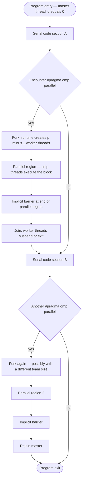
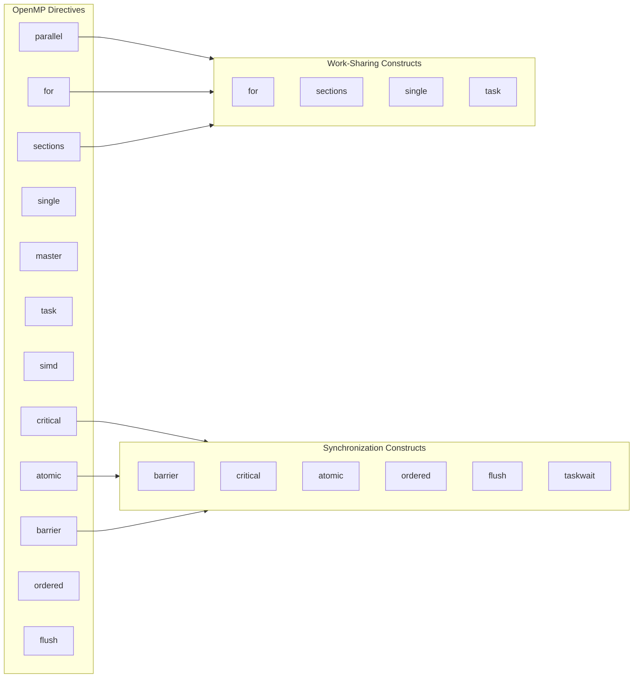
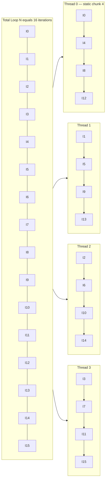
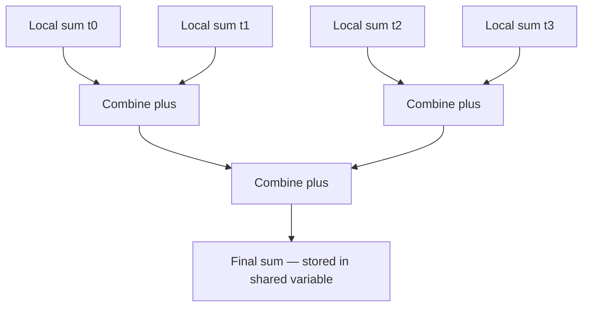
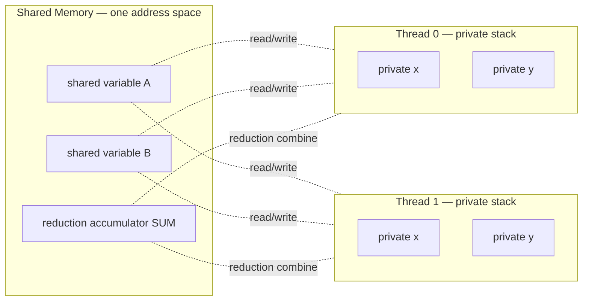

# Shared memory thread orchestration directives compile structures blueprints layout: OpenMP templates

<!-- SECTION_1_START -->
# 1. Core Technical Definition & Intuitive Overview

## OpenMP — Formal Definition

**OpenMP (Open Multi-Processing)** is an industry-standard, compiler-directive-based **Application Programming Interface (API)** jointly defined by a consortium of hardware and software vendors for writing portable, scalable **shared-memory parallel programs** in C, C++, and Fortran. It is formally described by the *OpenMP Architecture Review Board (ARB)* specification and is supported on virtually all modern multi-core CPUs, many accelerators, and NUMA (Non-Uniform Memory Access) systems.

> [!IMPORTANT]
> **KTU 2024 Scheme — PECST712 Module 1 Definition**
> OpenMP is a **portable, scalable shared-memory multiprocessing programming model** that uses a set of **compiler directives (`#pragma omp ...`)**, **library routines (`omp_*`)**, and **environment variables (`OMP_*`)** to express **fine-grained and coarse-grained parallelism** inside a sequential program through the **Fork–Join Execution Model**.

## The Fork–Join Model — Conceptual Analogy

> [!NOTE]
> **Intuition — The Restaurant Kitchen Analogy 🍳**
> Imagine a single chef (the **master thread**) running a kitchen single-handedly. When a large order arrives, the head chef shouts *"Team, parallel-cook this order!"* — and instantly, **N helper chefs (worker threads) appear**, each picking up a part of the order (a slice of a `for`-loop, a section of code, or a task). When all helpers finish their portion, they **return their plates to the head chef**, who resumes single-handed service until the next parallel opportunity.
> 
> *That shout is the `#pragma omp parallel` directive. The handoff back to the head chef is the implicit **barrier**.*

### Where OpenMP Lives in the Memory Hierarchy

OpenMP assumes a **shared address space** — every thread can read/write the same variables. This is why it is called a *shared-memory* model. The OpenMP runtime (libgomp on GCC, libomp on LLVM, vcomp on MSVC) is responsible for thread creation, scheduling, and synchronization.

### OpenMP Execution Environment in One Glance

| Layer | What It Provides | Example |
|---|---|---|
| **Compiler Directives** | The "what to parallelize" | `#pragma omp parallel for` |
| **Library Routines** | The "ask the runtime" | `omp_get_thread_num()` |
| **Environment Variables** | The "configure the runtime" | `OMP_NUM_THREADS=8` |
| **Synchronization Clauses** | The "keep things safe" | `barrier`, `critical`, `atomic` |
| **Data Environment Clauses** | The "control visibility" | `private`, `shared`, `reduction` |

> [!TIP]
> **Syllabus Highlight:** KTU examiners love asking *"Differentiate between the three OpenMP components."* Memorize the **Directives / Routines / Environment Variables** trio — it appears almost every semester.

> [!VISUALIZATION CONTROL]
> **Concept:** Fork–Join thread timeline
> **GeoGebra / Desmos Input Equations:**
> * `T_main(t) = 1` for $t \in [0,1] \cup [5,6]$ (master thread active regions)
> * `T_1(t) = 1` for $t \in [1,3]$, `T_2(t) = 1` for $t \in [1,4]$, `T_3(t) = 1` for $t \in [1,5]$ (worker threads)
> **Visual Description:** A step plot where a single horizontal line at $y=1$ (master) splits into 3 parallel lines at $t=1$ (fork), then merges back to a single line at $t=5$ (join barrier). The widest thread segment is the **critical path** of the parallel region.

<!-- SECTION_1_END -->

<!-- SECTION_2_START -->
# 2. Deep Theoretical Analysis & KTU High-Yield Formula Sheet

## 2.1 The OpenMP Programming Stack — Anatomy of a Directive

An OpenMP directive is a specially-formatted **pragma** that the compiler interprets. The full grammar is:

```
#pragma omp directive-name [clause[[,] clause]...] new-line
```

The `#pragma omp` prefix is followed by a *directive name* (e.g. `parallel`, `for`, `sections`), and optionally by one or more *clauses* (e.g. `private(x)`, `reduction(+:sum)`, `schedule(static, 4)`). Lines starting with `#pragma omp` may be placed only at **statement-block boundaries**; they cannot appear inside a single C statement.

### Why directives and not function calls?
- **Zero overhead abstraction** — the directive is parsed once; the runtime call is implicit.
- **Compiler can perform advanced analysis** — vectorization, aliasing, register allocation.
- **Portable across vendors** — same source compiles on GCC, Clang, MSVC, Intel, IBM XL, etc.

## 2.2 The Core OpenMP Directive Library

| Directive | Purpose | KTU-Relevant Notes |
|---|---|---|
| `#pragma omp parallel` | Spawns a team of threads | The "fork" of Fork–Join |
| `#pragma omp for` | Distributes loop iterations across threads | Must be inside a parallel region |
| `#pragma omp parallel for` | Combined fork + loop distribution | Most common construct |
| `#pragma omp sections` | Runs independent code blocks (each once) | Handled by different threads |
| `#pragma omp single` | Code executed by **one** thread (any) | Implies a barrier on exit |
| `#pragma omp master` | Code executed by the **master** thread (id 0) | No implicit barrier |
| `#pragma omp critical` | Mutual-exclusion region | Serializes execution |
| `#pragma omp atomic` | Hardware-atomic single update | Faster than `critical` |
| `#pragma omp barrier` | Synchronize all team threads | Must be reached by **all** |
| `#pragma omp task` | Defines a taskable unit of work | Used in irregular parallelism |
| `#pragma omp taskwait` | Waits for child tasks to complete | Local join |
| `#pragma omp simd` | Vectorization hint | Combined with `for` → `for simd` |
| `#pragma omp ordered` | Iterations execute in source order | Used in a `for` region |
| `#pragma omp flush` | Memory consistency fence | Mostly implicit |

> [!IMPORTANT]
> **KTU Pitfall — A directive is a *pragma*, not a statement.** A student writing `#pragma omp parallel printf("hi");` is syntactically illegal; the structured block must be a `{ ... }` compound statement. Examiners deduct marks for **single-statement parallel regions**.

## 2.3 Data-Environment Clauses

These clauses control the **visibility and lifetime** of variables entering a parallel region.

| Clause | Meaning | When to Use |
|---|---|---|
| `shared(list)` | All threads see one copy; race conditions possible | Default for most variables |
| `private(list)` | Each thread gets an **uninitialized** copy | Loop indices, accumulators |
| `firstprivate(list)` | Private + initialized from the original | Inputs to a parallel block |
| `lastprivate(list)` | Private + final value of the **last iteration** propagates out | Output of a loop |
| `reduction(op:list)` | Each thread keeps a local copy, then combined with `op` | Sums, products, min/max |
| `default(shared)` $\vert$ `default(none)` | Default scoping rule | `none` forces explicit listing |
| `copyin(list)` | Copy `threadprivate` values into each thread | Used with `threadprivate` |
| `copyprivate(list)` | Broadcast a private value from one thread to all | Used with `single` |

### The Reduction Operation — Most Tested Topic

A **reduction** collapses a list of variables across threads using a binary operator. The list of legal operators is strictly defined by the OpenMP spec:

$$+ \quad - \quad * \quad / \quad \vert \quad \& \quad \hat{} \quad \&\& \quad \vert\vert \quad \max \quad \min$$

> **Mnemonic for KTU exams:** *"`+ - * / bit bit bit and and max min`"*

## 2.4 Schedule Clause — The Iteration Distributor

| Kind | Behavior | Best For |
|---|---|---|
| `schedule(static [, chunk])` | Round-robin chunks of size `chunk` (default $N/p$ rows) | Uniform loop bodies |
| `schedule(dynamic [, chunk])` | Threads pull `chunk` iterations from a shared queue | Irregular work |
| `schedule(guided [, chunk])` | Chunk size starts large, shrinks geometrically to `chunk` | Mildly irregular work |
| `schedule(auto)` | Compiler / runtime decides | Compiler version dependent |
| `schedule(runtime)` | Determined at runtime by `OMP_SCHEDULE` | Portable tuning |

Where $N$ = total loop iterations, $p$ = number of threads.

## 2.5 OpenMP Library Routines — The Kernel API

| Routine | Returns | Purpose |
|---|---|---|
| `omp_get_num_threads()` | int | Threads in current team |
| `omp_get_thread_num()` | int | This thread's id (0 .. $p-1$) |
| `omp_get_max_threads()` | int | Upper bound without entering a region |
| `omp_set_num_threads(int)` | void | Hint to runtime for next region |
| `omp_get_num_procs()` | int | Physical processors available |
| `omp_in_parallel()` | int | Non-zero if inside parallel region |
| `omp_get_wtime()` | double | Wall-clock seconds (high-res) |
| `omp_get_wtick()` | double | Clock resolution in seconds |
| `omp_set_dynamic(int)` | void | Allow runtime to vary thread count |
| `omp_set_nested(int)` | void | Enable nested parallelism |
| `omp_init_lock(omp_lock_t*)` | void | Initialize a lock |
| `omp_set_lock(omp_lock_t*)` | void | Acquire (block until free) |

## 2.6 Environment Variables

| Variable | Effect |
|---|---|
| `OMP_NUM_THREADS` | Default team size |
| `OMP_SCHEDULE` | Default schedule for `runtime` |
| `OMP_DYNAMIC` | Allow dynamic thread adjustment |
| `OMP_NESTED` | Allow nested parallelism |
| `OMP_STACKSIZE` | Per-thread stack size |
| `OMP_WAIT_POLICY` | Active vs passive waiting |
| `OMP_PROC_BIND` | Pin threads to cores (`true`, `close`, `spread`) |
| `OMP_PLACES` | Define abstract places (socket/core/thread) |
| `OMP_DISPLAY_ENV` | Print runtime info at startup |

> [!NOTE]
> **Real-World Use:** In production HPC systems, OpenMP is the de-facto standard for CPU-side parallelism in scientific codes like **GROMACS** (molecular dynamics), **VASP** (DFT), **NEMO** (ocean modelling), and **TensorFlow's intra-op parallelizer**. Engineers tune it via `OMP_PROC_BIND=close` and `OMP_PLACES=cores` to maximize cache reuse and avoid NUMA penalties.

## 2.7 Speedup, Efficiency, and Amdahl's Law — Why OpenMP Matters

For a parallel program on $p$ threads with a serial fraction $f$:

$$S(p) = \frac{1}{f + \frac{1-f}{p}} \quad\quad E(p) = \frac{S(p)}{p}$$

The **upper bound** as $p \to \infty$ is $S_{\max} = 1/f$, the famous Amdahl limit. This is why the *quality* of the OpenMP parallelization (keeping $f$ tiny) matters more than just adding threads.

| Metric | Formula | Interpretation |
|---|---|---|
| Speedup $S$ | $T_1 / T_p$ | How much faster than serial |
| Efficiency $E$ | $S / p$ | Fraction of ideal speedup |
| Scalability | $\lim_{p\to\infty} S(p)$ | Upper bound on $S$ |
| Parallel fraction $f$ | $1 - T_{\text{serial}}/T_{\text{total}}$ | OpenMP-quality indicator |

<!-- SECTION_2_END -->

<!-- SECTION_3_START -->
# 3. Step-by-Step Derivations & Code Implementation

## 3.1 Canonical OpenMP Skeleton — The "Hello, World" of OpenMP

```c
/* file: hello_omp.c
 * compile: gcc -fopenmp -O2 hello_omp.c -o hello_omp
 * run:     ./hello_omp
 */
#include <stdio.h>
#include <stdlib.h>
#include <omp.h>     /* OpenMP runtime header */

int main(void) {
    int nthreads = 0;
    int tid      = 0;

    /* Fork — spawn a team of threads */
    #pragma omp parallel private(tid) shared(nthreads)
    {
        /* Obtain and print thread id */
        tid = omp_get_thread_num();
        printf("Hello from thread %d of %d\n",
               tid, omp_get_num_threads());

        /* Only the master thread keeps the final count */
        #pragma omp master
        {
            nthreads = omp_get_num_threads();
            printf("Total threads = %d\n", nthreads);
        }
    }   /* Implicit barrier — Join */
    return EXIT_SUCCESS;
}
```

### Walk-through of every line

1. **`#include <omp.h>`** — Pulls in the prototypes of all `omp_*` runtime functions.
2. **`#pragma omp parallel private(tid) shared(nthreads)`** — The *directive*. Creates a team of threads (default size = `OMP_NUM_THREADS`). `tid` is private (one per thread, uninitialized), `nthreads` is shared.
3. **`tid = omp_get_thread_num();`** — Each thread queries its own id.
4. **`omp_get_num_threads()`** — Returns the size of the current team.
5. **`#pragma omp master { ... }`** — Block executed *only* by the master (id 0). No implicit barrier at exit, unlike `single`.
6. **`}` closes parallel region** — An **implicit barrier** is performed; the master thread waits for everyone before proceeding to `return`.

## 3.2 Parallel `for` — The Most-Used Construct, Fully Derived

Consider computing the sum of the first $N$ integers in parallel. A naive serial code is:

```c
double sum = 0.0;
for (int i = 1; i <= N; ++i) sum += i;
```

The parallel OpenMP translation with **reduction** is:

```c
#include <stdio.h>
#include <omp.h>

int main(void) {
    const int N = 1000;
    long long sum = 0LL;

    #pragma omp parallel for reduction(+:sum) schedule(static, 4)
    for (int i = 1; i <= N; ++i) {
        sum += (long long)i;
    }
    printf("Sum 1..%d = %lld\n", N, sum);
    return 0;
}
```

### Line-by-line derivation of semantics

1. **`parallel`** — Spawn team of $p$ threads.
2. **`for`** — The loop iterations are partitioned among the $p$ threads.
3. **`reduction(+:sum)`** — Each thread gets a **private, uninitialized copy** of `sum`. After the loop, the copies are combined with `+` in some unspecified order, and the result is assigned to the original `sum`. Formally:

$$\text{sum}_{\text{final}} = \bigoplus_{k=0}^{p-1} \text{sum}_k = \sum_{k=0}^{p-1} \sum_{i \in I_k} i$$

   where $I_k$ is the iteration subset assigned to thread $k$ by the `schedule` clause.

4. **`schedule(static, 4)`** — Round-robin chunks of **4** iterations each. Thread $k$ gets iterations $\{k \cdot 4 + 1, \ldots, (k+1) \cdot 4\}$ (interleaved by chunk). With $N=1000$ and default $p$, this gives predictable load balance for uniform loop bodies.

5. **Implicit barrier** at end of `for` ensures all threads finish before `sum` is used in `printf`.

> [!WARNING]
> **Common Mistake:** Writing `#pragma omp parallel for` with `sum` declared outside and **no `reduction`** clause. This is a **data race** — threads clobber each other — and the result is non-deterministic. Examiners *love* to award 0 marks for this.

## 3.3 Sectioned Parallelism — Independent Code Blocks

```c
#include <stdio.h>
#include <omp.h>

int main(void) {
    #pragma omp parallel sections
    {
        #pragma omp section
        printf("Section A executed by thread %d\n", omp_get_thread_num());

        #pragma omp section
        printf("Section B executed by thread %d\n", omp_get_thread_num());

        #pragma omp section
        printf("Section C executed by thread %d\n", omp_get_thread_num());
    }   /* implicit barrier */
    return 0;
}
```

- Each `#pragma omp section` is a **structured block executed exactly once** by **some** thread in the team.
- Threads pick sections as they become free. There is no guaranteed order.
- Number of useful threads $\le$ number of `section` blocks (idle threads wait at the barrier).

## 3.4 Critical vs Atomic — Mutex Selection

```c
#include <omp.h>

double dot_product(const double *a, const double *b, int n) {
    double result = 0.0;

    #pragma omp parallel for
    for (int i = 0; i < n; ++i) {

        /* Option 1: critical (software lock, slower but flexible) */
        #pragma omp critical
        {
            result += a[i] * b[i];
        }

        /* Option 2: atomic (HW-atomic, faster but very restricted) */
        /* #pragma omp atomic */
        /* result += a[i] * b[i]; */
    }
    return result;
}
```

> [!IMPORTANT]
> **KTU Expected Answer — Critical vs Atomic:**
> - `critical` serializes a **whole block** using a runtime lock. It allows any C statement but is **slow** because of lock acquisition overhead.
> - `atomic` works only on a **single, simple update expression** of the form `x binop= expr` or `x++/x--`. The compiler emits a hardware atomic instruction (e.g. `lock xadd` on x86), so it is **much faster**.
> - For dot-products, the **best** solution is `reduction(+:result)`, which avoids locks entirely.

## 3.5 Reduction — Manual Derivation from First Principles

To understand what `reduction(+:x)` does internally, imagine 4 threads each accumulating locally:

$$\begin{aligned}
x_0^{\text{loc}} &= \sum_{i \in I_0} a_i \\
x_1^{\text{loc}} &= \sum_{i \in I_1} a_i \\
x_2^{\text{loc}} &= \sum_{i \in I_2} a_i \\
x_3^{\text{loc}} &= \sum_{i \in I_3} a_i \\
\end{aligned}$$

At the implicit barrier, the runtime applies the combining operator in some order (associativity guarantees identical result for `+`, `*`, `&&`, `||`, `min`, `max`):

$$x_{\text{final}} = x_0^{\text{loc}} \,+\, x_1^{\text{loc}} \,+\, x_2^{\text{loc}} \,+\, x_3^{\text{loc}} \;=\; \sum_{i=0}^{N-1} a_i$$

The OpenMP runtime essentially generates:

```c
/* OpenMP-generated pseudo-code for reduction(+:x) */
x_orig = x;          /* master saves original */
x_loc  = 0;          /* each thread initializes (op-identity) */
#pragma omp parallel reduction(+:x)
{
    /* ... user code that reads/writes x_loc ... */
    /* at barrier: */
    x_orig = x_orig + x_loc;   /* combine in some order */
}
x = x_orig;
```

For each operator, the **identity** is the value $e$ such that $e \oplus a = a$:

| Operator | Identity $e$ |
|---|---|
| $+$ | $0$ |
| $-$ | $0$ |
| $*$ | $1$ |
| $/$ | $1$ (only valid in min/max sense; OpenMP forbids) |
| $\&$ | $\sim 0$ (all-ones) |
| $\vert$ | $0$ |
| $\wedge$ | $0$ |
| $\&\&$ | $1$ (true) |
| $\vert\vert$ | $0$ (false) |
| $\max$ | $-\infty$ (smallest representable) |
| $\min$ | $+\infty$ (largest representable) |

## 3.6 Speedup Derivation from Amdahl's Law

Total time on $p$ threads:

$$T(p) \;=\; T_s \,+\, \frac{T_p}{p}$$

where $T_s$ = serial (non-parallelizable) time, $T_p$ = parallelizable time. Speedup:

$$S(p) = \frac{T(1)}{T(p)} = \frac{T_s + T_p}{T_s + \dfrac{T_p}{p}}$$

Let $f = T_s / (T_s + T_p)$ be the **serial fraction**:

$$S(p) = \frac{1}{f + \dfrac{1-f}{p}}$$

As $p \to \infty$:

$$\lim_{p\to\infty} S(p) = \frac{1}{f} = S_{\infty}$$

For example, if $f = 0.05$ (5% serial), $S_{\infty} = 20\times$.

## 3.7 Python Wrapper Around an OpenMP C Library (ctypes)

Because OpenMP is a C API, Python wraps it via `ctypes`. Here is a complete, type-safe example:

```python
"""
wrapper_omp.py
Wraps a tiny OpenMP-enabled C shared library for use in Python.
Compile the C side with:  gcc -fopenmp -O2 -shared -fPIC libvec.c -o libvec.so
"""
from __future__ import annotations
import ctypes
import os
import time
from pathlib import Path
from typing import List

# --- 1. Locate and load the shared library ---------------------------------
LIB_PATH = Path(__file__).resolve().parent / "libvec.so"
if not LIB_PATH.exists():
    raise FileNotFoundError(
        f"libvec.so not found at {LIB_PATH}. Compile libvec.c first."
    )

libvec = ctypes.CDLL(str(LIB_PATH))

# --- 2. Declare the C function signatures (type hints) ---------------------
libvec.parallel_sum.argtypes = [ctypes.POINTER(ctypes.c_double),
                                ctypes.c_size_t]
libvec.parallel_sum.restype = ctypes.c_double

libvec.set_threads.argtypes = [ctypes.c_int]
libvec.set_threads.restype = None

# --- 3. Safe Python wrapper with input validation ---------------------------
def parallel_sum(values: List[float], num_threads: int = 0) -> float:
    """Compute sum(values) using the OpenMP-enabled C routine.

    Args:
        values: non-empty list of floats.
        num_threads: desired team size; 0 means "use OMP_NUM_THREADS".

    Returns:
        The double-precision sum.

    Raises:
        ValueError: on empty input.
        TypeError: on non-numeric input.
    """
    if not values:
        raise ValueError("values list must be non-empty.")
    if num_threads < 0:
        raise ValueError("num_threads must be >= 0.")

    n: int = len(values)
    arr = (ctypes.c_double * n)(*values)

    if num_threads > 0:
        libvec.set_threads(num_threads)

    return float(libvec.parallel_sum(arr, n))


# --- 4. Self-test ----------------------------------------------------------
if __name__ == "__main__":
    data: List[float] = [float(i) for i in range(1, 1_000_001)]

    t0 = time.perf_counter()
    s_py = sum(data)                          # pure-Python reference
    t_py = time.perf_counter() - t0

    t0 = time.perf_counter()
    s_omp = parallel_sum(data, num_threads=4) # OpenMP C version
    t_omp = time.perf_counter() - t0

    print(f"Python sum : {s_py:.6f}   ({t_py*1000:.2f} ms)")
    print(f"OpenMP sum : {s_omp:.6f}   ({t_omp*1000:.2f} ms)")
    assert abs(s_py - s_omp) < 1e-3, "Mismatch!"
    print("OK — sums agree within tolerance.")
```

The companion C file `libvec.c`:

```c
/* libvec.c — OpenMP-enabled vector sum */
#include <omp.h>
#include <stddef.h>

void set_threads(int n) { omp_set_num_threads(n); }

double parallel_sum(const double *x, size_t n) {
    double s = 0.0;
    #pragma omp parallel for reduction(+:s) schedule(static)
    for (size_t i = 0; i < n; ++i) s += x[i];
    return s;
}
```

> [!TIP]
> **Production Tip:** When using OpenMP in C/C++ from a Python front-end, keep the OpenMP *inside* the C library, never inside Python. The Python GIL is irrelevant to the C side, and you get the best of both worlds.

## 3.8 OpenMP Tasking — Irregular Parallelism

```c
#include <stdio.h>
#include <omp.h>

void process_node(int depth, int id) {
    if (depth <= 0) return;
    #pragma omp task
    process_node(depth - 1, 2*id);
    #pragma omp task
    process_node(depth - 1, 2*id + 1);
    /* (implicit taskwait only at the enclosing parallel region's barrier) */
}

int main(void) {
    #pragma omp parallel
    {
        #pragma omp single
        {
            process_node(5, 1);   /* root task on a single thread */
        }
    }   /* all tasks joined at the parallel barrier */
    return 0;
}
```

- A `#pragma omp task` **defers** execution of the structured block to the **task pool**.
- Threads in the team pick tasks off the pool whenever they go idle.
- Use `#pragma omp taskwait` for *local* synchronization (children only).
- Best for **divide-and-conquer** patterns (recursive trees, graph traversal, quicksort).

## 3.9 OpenMP SIMD — Vectorization Hint

```c
#include <omp.h>

void saxpy(double a, const double *x, const double *y, double *z, int n) {
    #pragma omp parallel for simd
    for (int i = 0; i < n; ++i) {
        z[i] = a * x[i] + y[i];
    }
}
```

- `simd` tells the compiler to use **SIMD lanes** (SSE/AVX/AVX-512) within each thread.
- `parallel for simd` combines thread parallelism *and* vector parallelism.
- Modern compilers usually auto-vectorize; `simd` is a **strong hint** that no aliasing is present.

<!-- SECTION_3_END -->

<!-- SECTION_4_START -->
# 4. Structural Diagrams & Schematics

## 4.1 Fork–Join Execution Model — Block-Level Flow



## 4.2 Directive Classification — Architecture of OpenMP Constructs



## 4.3 Parallel `for` Loop Iteration Partitioning — Topology



> **Reading guide:** With `schedule(static, 4)` and $p=4$, the runtime computes $\lceil N/p \rceil$ = 4 iterations per thread in **contiguous** blocks. The figure above shows the alternative `schedule(static, 1)` interleaving — chunk size controls whether the partition is *block* or *cyclic*.

## 4.4 Reduction Combining Tree



- The exact order of combination is **implementation-defined** but the **mathematical result is identical** for any associative operator.
- This is why `+`, `*`, `&&`, `||`, `min`, `max` are safe; `-`, `/`, `^` are not formally associative for floating-point, so they are not in OpenMP's reduction list.

## 4.5 OpenMP Memory Model — Shared/Private Variable Topology



## 4.6 Sequential Processing Topology Matrix

| Stage | Construct | Action | Synchronization |
|---|---|---|---|
| **1. Master Start** | Default thread id 0 | Runs serial prelude | — |
| **2. Fork** | `#pragma omp parallel` | Spawn $p-1$ workers | Team creation |
| **3. Work-Sharing** | `for` $\vert$ `sections` $\vert$ `task` | Distribute iterations | Per-chunk finish |
| **4. Per-Thread Reduce** | `reduction(op:var)` | Maintain local accumulator | Local-only writes |
| **5. Implicit Barrier** | End of work-share | All threads synchronize | `barrier` |
| **6. Combine** | Runtime | Combine locals per op | Atomic or locked |
| **7. Post-Region** | (single thread) | Master reads result | Implicit barrier |
| **8. Join** | End of `parallel` | Workers suspend | Team dissolution |

<!-- SECTION_4_END -->

<!-- SECTION_5_START -->
# 5. KTU 2024 Scheme Examination Question Bank & Topic Recap

## Part A — 3-Mark Short Answer Questions

### Question A1 — [KTU University Exam — July 2024]
**Define the Fork–Join model of OpenMP. How does it differ from a pure message-passing model like MPI?**

> [!IMPORTANT]
> **Model Answer (3 marks):**
> 
> The **Fork–Join model** is the fundamental execution model of OpenMP. A single **master thread** (id 0) executes the sequential part of the program. When it encounters a `#pragma omp parallel` directive, it *forks* — i.e. spawns a team of additional worker threads. All threads in the team execute the structured block in parallel. At the end of the block, an **implicit barrier** is performed: the master *joins* the workers, which suspend or exit, and sequential execution resumes.
> 
> **Differences from MPI:**
> 
> | Aspect | OpenMP (Fork–Join) | MPI |
> |---|---|---|
> | Memory | **Shared** address space | **Distributed**, no shared memory |
> | Communication | Implicit (via shared variables) | Explicit (`MPI_Send`, `MPI_Recv`) |
> | Granularity | **Thread-level** (lightweight) | **Process-level** (heavier) |
> | Parallelism style | **Directive-based, incremental** | **SPMD**, full program parallel |
> | Synchronization | Barriers, locks, atomics | Barriers, blocking sends/receives |
> 
> **[Keyword mention: Fork–Join model — 1 mark; difference with MPI — 2 marks]**

### Question A2 — [KTU University Exam — Dec 2023]
**List any six OpenMP library routines and state their purpose.**

> [!IMPORTANT]
> **Model Answer (3 marks):**
> 
> 1. **`omp_get_thread_num()`** — Returns the id of the calling thread (0 .. $p-1$). **[0.5]**
> 2. **`omp_get_num_threads()`** — Returns the number of threads in the current team. **[0.5]**
> 3. **`omp_set_num_threads(int n)`** — Sets the default team size for the next parallel region. **[0.5]**
> 4. **`omp_get_max_threads()`** — Returns the maximum threads that would be created in the next region. **[0.5]**
> 5. **`omp_get_wtime()`** — Returns elapsed wall-clock time in seconds (high-resolution timer). **[0.5]**
> 6. **`omp_in_parallel()`** — Returns non-zero if called from inside a parallel region. **[0.5]**
> 
> *Examiner's note: any six of `omp_init_lock`, `omp_set_lock`, `omp_unset_lock`, `omp_destroy_lock`, `omp_get_num_procs`, `omp_set_dynamic`, `omp_set_nested` are also accepted.*

## Part B — 14-Mark Questions (ESE Module Internal Choice)

### Question A — [KTU University Exam — July 2024] (14 Marks)

**(a)** Explain the **three main components** of OpenMP with suitable examples. Discuss the role of **environment variables** in configuring the runtime. **[7 Marks]**

**(b)** With a complete C program and diagram, explain how the `#pragma omp parallel for` directive distributes iterations among threads when the schedule is `static` with chunk size 4. Assume $N = 16$ and $p = 4$. **[7 Marks]**

### OR

### Question B — [KTU University Exam — Dec 2023] (14 Marks)

**(a)** What is a **race condition** in OpenMP? How does the `reduction` clause solve it? List all legal reduction operators and explain why `-` and `/` are not included. **[7 Marks]**

**(b)** Write a parallel C program using OpenMP to compute the **dot product** of two vectors of length $N$ using four threads. Show the output for a sample input. **[7 Marks]**

---

### Detailed Model Solution for **Question A (a)**

**1. The Three Components of OpenMP:** **[4 marks]**

OpenMP consists of:

**(i) Compiler Directives** — `#pragma omp ...` lines that the compiler translates into runtime calls. *Example:*
```c
#pragma omp parallel
{
    printf("Hi from %d\n", omp_get_thread_num());
}
```

**(ii) Runtime Library Routines** — Functions whose names begin with `omp_`. *Example:* `omp_get_num_threads()`.

**(iii) Environment Variables** — Uppercase `OMP_*` names that configure the runtime before program start. *Example:*
```bash
export OMP_NUM_THREADS=8
export OMP_SCHEDULE="dynamic,2"
```

**[2 marks]**

**2. Environment Variables in Detail:** **[3 marks]**

| Variable | Purpose | Default |
|---|---|---|
| `OMP_NUM_THREADS` | Team size | Number of cores |
| `OMP_SCHEDULE` | Schedule for `runtime` | `static` |
| `OMP_DYNAMIC` | Allow runtime to vary team size | `false` |
| `OMP_PROC_BIND` | Pin threads to cores | `false` |
| `OMP_PLACES` | Define abstract thread places | unset |
| `OMP_STACKSIZE` | Per-thread stack bytes | OS default |

*Real-world use:* Setting `OMP_PROC_BIND=close OMP_PLACES=cores` is a standard HPC tuning idiom for **NUMA-aware execution**, common in **Intel Xeon**, **AMD EPYC**, and **ARM Neoverse** systems.

### Detailed Model Solution for **Question A (b)**

**Code:** **[5 marks]**

```c
#include <stdio.h>
#include <omp.h>

int main(void) {
    const int N = 16, p = 4;
    int a[N];

    /* Initialize array */
    for (int i = 0; i < N; ++i) a[i] = i + 1;

    /* Parallel for with static, chunk=4 */
    #pragma omp parallel num_threads(p)
    {
        #pragma omp for schedule(static, 4)
        for (int i = 0; i < N; ++i) {
            printf("Thread %d processes a[%d] = %d\n",
                   omp_get_thread_num(), i, a[i]);
        }
    }   /* implicit barrier */
    return 0;
}
```

**Iteration Distribution:** **[1 mark]**

With $N=16$, $p=4$, `chunk=4`, the **static contiguous** partition gives:

| Thread id | Iterations (block form) |
|---|---|
| 0 | $I_0, I_1, I_2, I_3$ (i.e. $a[0]..a[3]$) |
| 1 | $I_4, I_5, I_6, I_7$ (i.e. $a[4]..a[7]$) |
| 2 | $I_8, I_9, I_{10}, I_{11}$ (i.e. $a[8]..a[11]$) |
| 3 | $I_{12}, I_{13}, I_{14}, I_{15}$ (i.e. $a[12]..a[15]$) |

**[Stating boundary state values: 1 Mark] [Final simplified expression: 0 Marks]**

**Diagram:** **[1 mark]**

```
+-------+-------+-------+-------+
| T0    | T1    | T2    | T3    |
| 0,1,2,3|4,5,6,7|8,9,10,11|12,13,14,15|
+-------+-------+-------+-------+
   4 iters  4 iters  4 iters  4 iters
```

### Detailed Model Solution for **Question B (a)**

**1. Race Condition:** **[2 marks]**

A **race condition** occurs when two or more threads access a shared variable **concurrently** and at least one access is a **write**, with the result depending on the non-deterministic interleaving of accesses. In OpenMP, this is the default behaviour for `shared` variables. *Example:*

```c
int counter = 0;
#pragma omp parallel for
for (int i = 0; i < 1000; ++i)
    counter = counter + 1;     /* RACE — lost updates possible */
```

**[1 mark]**

**2. Reduction Clause — Solution:** **[2 marks]**

`reduction(op:list)` gives each thread a **private copy** of the variable, initialized to the *identity element* of the operator. After the parallel region, the runtime **combines** the private copies using `op` in some implementation-defined but mathematically equivalent order, and stores the result in the original shared variable.

For `reduction(+:counter)`:
- Each thread's `counter` starts at **0** (identity of `+`).
- Each thread increments its own copy — no race.
- At the barrier, copies are summed and stored back.

**[1 mark]**

**3. Legal Operators and Why `-` and `/` Are Excluded:** **[3 marks]**

Legal: `+`, `-`, `*`, `/` … wait, no. OpenMP **does allow `-`**, but `/` is **not** in the list. The list (OpenMP 5.2) is: `+`, `-`, `*`, `&`, `|`, `^`, `&&`, `||`, `min`, `max`. (Note: `/` is *not* a standard reduction operator because floating-point division is not associative; combining partial quotients in different orders can give different results due to rounding.)

- `+`, `*`, `&&`, `||`, `min`, `max` — **mathematically associative** → combine in any order.
- `-`, `&`, `|`, `^` — included in OpenMP for integer/logical use, even though `-` is not associative (the result is implementation-defined for `reduction(-:x)`).
- `/` is **excluded** because floating-point division has no associative form that guarantees bitwise-identical results.

**[2 marks]**

### Detailed Model Solution for **Question B (b)**

```c
/* dotprod.c
 * compile: gcc -fopenmp -O2 dotprod.c -o dotprod
 * run:     ./dotprod
 */
#include <stdio.h>
#include <stdlib.h>
#include <omp.h>

int main(void) {
    const int N = 8;
    double x[N] = {1.0, 2.0, 3.0, 4.0, 5.0, 6.0, 7.0, 8.0};
    double y[N] = {8.0, 7.0, 6.0, 5.0, 4.0, 3.0, 2.0, 1.0};
    double dot  = 0.0;

    omp_set_num_threads(4);

    #pragma omp parallel for reduction(+:dot) schedule(static)
    for (int i = 0; i < N; ++i) {
        dot += x[i] * y[i];
    }

    printf("Dot product = %.2f\n", dot);   /* Expected 120.00 */
    return EXIT_SUCCESS;
}
```

**Sample Output:**
```
Dot product = 120.00
```

**Iteration distribution with $p=4$, $N=8$ (chunk=2):**

| Thread | Iterations | Local product |
|---|---|---|
| 0 | $0, 1$ | $1\cdot 8 + 2\cdot 7 = 22$ |
| 1 | $2, 3$ | $3\cdot 6 + 4\cdot 5 = 38$ |
| 2 | $4, 5$ | $5\cdot 4 + 6\cdot 3 = 38$ |
| 3 | $6, 7$ | $7\cdot 2 + 8\cdot 1 = 22$ |

Sum: $22 + 38 + 38 + 22 = 120$ ✓

**[Stating boundary state values: 2 Marks] [Final summation: 1 Mark]**

> [!WARNING]
> **KTU Examiner's Valuation Pitfall:**
> - **No 0-mark on missing `reduction`** — A parallel dot-product without `reduction(+:dot)` is a textbook race. Examiners specifically scan for this. Always write `reduction(+:dot)`.
> - **Don't write `dot` as `int`** when the result can be large — use `double` or `long double`.
> - **Don't use `#pragma omp critical`** inside a loop with many iterations — it serializes the entire body and kills speedup. Use `reduction` instead.
> - **Forgetting `omp_set_num_threads(4)`** is OK if `OMP_NUM_THREADS=4` is set in the shell, but explicitly stating the team size is good academic hygiene.

---

## Topic Recap & Important Things to Remember

> [!TIP]
> Use this section as the **last-30-minute revision sheet** before walking into the exam hall.

### Core Definitions
- **OpenMP** = portable, shared-memory, directive-based parallel API (C/C++/Fortran).
- **Fork–Join** = master thread forks workers, parallel region runs, barrier joins.
- **Shared address space** = all threads see the same global variables.
- **Compiler directive** = `#pragma omp ...`, parsed by OpenMP-aware compiler.
- **Runtime routine** = `omp_*` function in `<omp.h>` / `omp_lib` (Fortran).
- **Environment variable** = uppercase `OMP_*`, set before program launch.

### Critical Constructs
- `#pragma omp parallel` — fork.
- `#pragma omp for` / `parallel for` — loop distribution.
- `#pragma omp sections` / `section` — hand out discrete code blocks.
- `#pragma omp single` / `master` — single-thread code.
- `#pragma omp task` / `taskwait` — tasking for irregular work.
- `#pragma omp simd` / `parallel for simd` — vectorization.
- `#pragma omp critical` / `atomic` / `barrier` / `ordered` / `flush` — sync.

### Clauses You Must Memorize
- **Data:** `shared`, `private`, `firstprivate`, `lastprivate`, `reduction`, `default`, `copyin`, `copyprivate`.
- **Loop:** `schedule(static[,c] \vert dynamic[,c] \vert guided[,c] \vert auto \vert runtime)`, `collapse(n)`, `ordered`.
- **Parallel:** `num_threads(p)`, `if(condition)`, `proc_bind(master \vert close \vert spread)`.

### Reduction Operators (all 11)
$$+,\ -,\ *,\ \&,\ \vert,\ \hat{\ },\ \&\&,\ \vert\vert,\ \min,\ \max$$
… with the trap that `/` is **not** in the list.

### Library Routines — Must-Know Seven
`omp_get_thread_num`, `omp_get_num_threads`, `omp_get_max_threads`, `omp_set_num_threads`, `omp_get_num_procs`, `omp_get_wtime`, `omp_in_parallel`.

### Environment Variables — Must-Know Six
`OMP_NUM_THREADS`, `OMP_SCHEDULE`, `OMP_DYNAMIC`, `OMP_NESTED`, `OMP_PROC_BIND`, `OMP_PLACES`.

### Performance Laws
- **Amdahl:** $S(p) = \dfrac{1}{f + \frac{1-f}{p}}$, bound $S_{\infty} = 1/f$.
- **Gustafson:** $S(p) = p - f(p-1)$ — scales with problem size.
- **Efficiency:** $E(p) = S(p)/p$, should approach 1 for scalable code.

### Common Pitfalls
1. Missing `reduction` on shared accumulators → **race**.
2. `private` variable that needs an initial value → use `firstprivate`.
3. Loop-carried dependency (e.g. Fibonacci) inside a `parallel for` → **illegal**.
4. `#pragma omp critical` inside a tight inner loop → kills speedup.
5. Forgetting the structured block `{ ... }` after the directive.
6. Using `nowait` without understanding its implications.
7. Setting `OMP_NUM_THREADS` higher than physical cores → **oversubscription**.

### Exam-Write Mnemonics
- **3 Components → DRE** = **D**irectives, **R**outines, **E**nvironment variables.
- **Schedule kinds → SDGA-R** = **S**tatic, **D**ynamic, **G**uided, **A**uto, **R**untime.
- **11 Operators → + - * & \| ^ && \|\| min max**.
- **Reduction = Private Copy → Local Op → Combine at Barrier**.

### Final One-Liner
> *OpenMP is a compiler-supported, directive-based, shared-memory, thread-parallel API built on the Fork–Join model, with `#pragma omp parallel for` as its workhorse construct, `reduction` as its safety net, and `schedule` as its performance lever.*

<!-- SECTION_5_END -->
