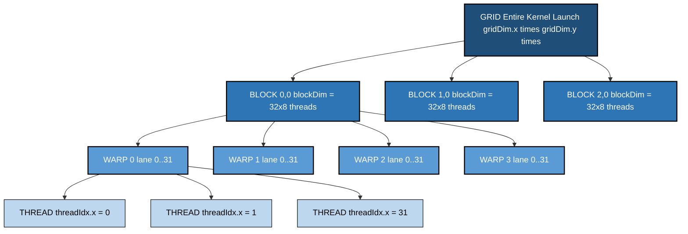
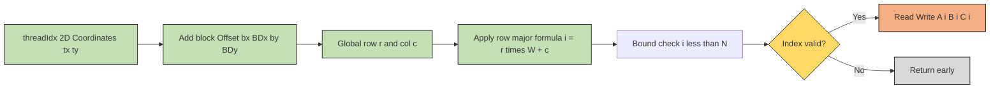
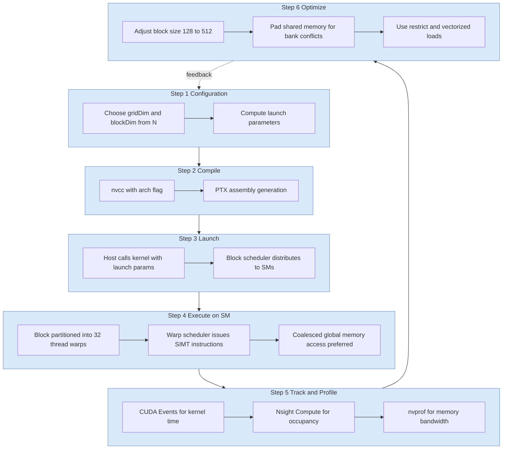
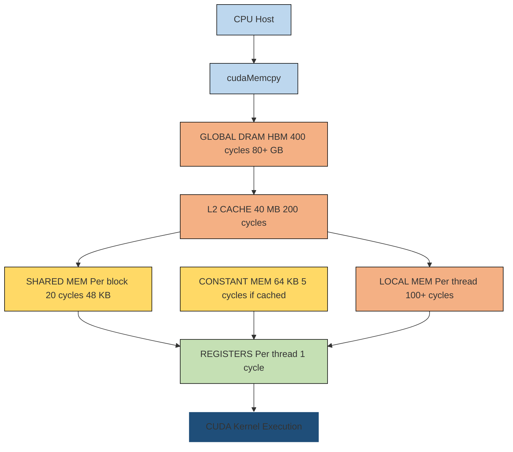
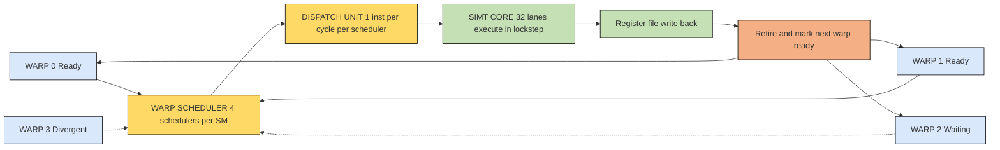

# CUDA programming kernel specifications memory indexing configurations tracking optimization setups

<!-- SECTION_1_START -->
# CUDA Programming: Kernels, Memory Indexing & Optimization

## 1. Core Technical Definition

**CUDA (Compute Unified Device Architecture)** is a parallel computing platform and programming model developed by NVIDIA that enables dramatic increases in computing performance by harnessing the power of **Graphics Processing Units (GPUs)**. The cornerstone of CUDA is the **kernel** — a function executed $N$ times in parallel by $N$ different CUDA threads.

> [!IMPORTANT]
> **KTU 2024 Definition (PECST712 Module 2):** A *CUDA kernel* is a specialized function, declared with the `__global__` qualifier, that is invoked by the host (CPU) but executed on the device (GPU) across a logically organized hierarchy of **grids → blocks → warps → threads**.

### 1.1 Kernel Specification Hierarchy

The execution of any CUDA kernel is governed by three structural dimensions:

| Dimension | Symbol | Typical Range | Logical Role |
|---|---|---|---|
| **Grid** | $\text{gridDim}$ | $1D, 2D, 3D$ | Encompasses all blocks launched for one kernel call |
| **Block** | $\text{blockDim}$ | $1D, 2D, 3D$; max **1024** threads | Group of threads that can synchronize via `__syncthreads()` |
| **Thread** | $\text{threadIdx}$ | $1D, 2D, 3D$ | The smallest execution unit; 32 threads form a **warp** |

> [!NOTE]
> **Geometric Intuition:** Imagine a **college campus**:
> - The **campus** = Grid (entire launch).
> - Each **department building** = Block (shared resources like `__shared__` memory).
> - Each **classroom** = Warp (32 threads executing in **lockstep SIMT**).
> - Each **student** = Thread (smallest worker).
> When you call a kernel with $G \times B \times T$ configuration, you are effectively deploying $G$ buildings, each containing $B$ classrooms of $T$ students, all solving a sub-problem of the same parent task in parallel.

### 1.2 Memory Indexing Configuration

Every thread requires a **global memory address** to fetch or store its data. The standard 1D linearized index formula is:

$$
i = \text{blockIdx.x} \cdot \text{blockDim.x} + \text{threadIdx.x}
$$

For 2D and 3D indexing, the index expands into row-major flattened form:

$$
i = (\text{blockIdx.y} \cdot \text{blockDim.y} + \text{threadIdx.y}) \cdot \text{width} + (\text{blockIdx.x} \cdot \text{blockDim.x} + \text{threadIdx.x})
$$

### 1.3 Optimization Configuration Parameters

The **launch configuration** $\langle \text{gridDim}, \text{blockDim} \rangle$ directly determines the **occupancy** of the SM (Streaming Multiprocessor). Key tracked metrics include:

- **Theoretical Occupancy** = $\dfrac{\text{Active Warps per SM}}{\text{Max Warps per SM}}$
- **Achieved Occupancy** (measured by Nsight Compute)
- **Memory Coalescing Efficiency**
- **Bank Conflicts in Shared Memory**
- **Warp Divergence Penalty**

> [!VISUALIZATION CONTROL]
> **Concept:** Thread-to-Memory Index Mapping (Coalesced vs Strided)
> **Desmos Input:** Plot $y = x$ for $x \in [0, 31]$ (coalesced — one warp accesses 32 contiguous floats), then overlay $y = 32x$ (strided — one warp accesses 32 floats spaced 128 bytes apart).
> **Visual Description:** A student should observe that the coalesced line is steep and continuous (one transaction), while the strided line jumps vertically (32 separate transactions, 32× slower).

---

## 2. Memory Indexing — Coordinate Space

CUDA exposes **4 built-in coordinate variables** inside every kernel. Mastering these is the **#1 high-yield topic** in KTU Module 2:

| Variable | Scope | Type | Description |
|---|---|---|---|
| `threadIdx.{x,y,z}` | Per-thread | `uint3` | Position of the thread inside its block |
| `blockIdx.{x,y,z}` | Per-block | `uint3` | Position of the block inside the grid |
| `blockDim.{x,y,z}` | Per-block | `dim3` | Size/dimension of the block (constant per kernel) |
| `gridDim.{x,y,z}` | Per-grid | `dim3` | Size/dimension of the grid (constant per kernel) |

> [!IMPORTANT]
> **Boundary Safeguard:** Always compute the global index and then **bound-check** against $N$ (the array size) before dereferencing. Stray threads (when $N$ is not divisible by `blockDim`) will cause illegal memory access.

---

<!-- SECTION_1_END -->

<!-- SECTION_2_START -->
# Deep Theoretical Analysis & KTU High-Yield Formula Sheet

## 2.1 Kernel Launch Mechanics

When the host invokes `kernel<<<grid, block>>>(args)`, the following sequence occurs:

1. **Host** copies arguments and launch parameters to device memory.
2. **Block Scheduler** distributes blocks to available SMs (round-robin policy).
3. Inside each SM, blocks are partitioned into **warps of 32 threads** (using `threadIdx.x % 32` for warp assignment — this is **critical** for performance).
4. The **Warp Scheduler** issues instructions from ready warps to the SIMT cores.
5. Each warp executes one common instruction at a time — divergence only occurs on branch predicates.

> [!NOTE]
> **Why 32?** NVIDIA chose 32 because it balances **instruction issue throughput** with **register pressure**. The warp size is **arch-independent** for all current GPUs.

## 2.2 Memory Hierarchy & Tracking Optimization

The CUDA memory model has a tiered latency profile that you **must** know for KTU:

$$
\text{Latency: Registers} \ll \text{Shared} \ll \text{L1/Constant} \ll \text{L2} \ll \text{Global (DRAM)}
$$

| Memory Type | Scope | Lifetime | Size Limit | Bandwidth (A100) | Latency (cycles) |
|---|---|---|---|---|---|
| **Register** | Thread | Kernel | $\le 255$ / thread | — | $\approx 1$ |
| **Local** | Thread | Kernel | Up to 512 KB / thread | — | $\approx 100+$ |
| **Shared** | Block | Kernel | 48 KB / block (configurable) | $\approx 19$ TB/s | $\approx 20$ |
| **Constant** | Grid | Application | 64 KB | $\approx$ cached | $\approx 5$ (cache hit) |
| **Global** | Grid | Application | Up to $\geq 80$ GB (HBM) | $\approx 2$ TB/s | $\approx 400$ |
| **Texture** | Grid | Application | Read-only path | Cached | Varies |

> [!IMPORTANT]
> **Tracking Optimization Rule of Thumb (KTU Board favorite):** Global memory accesses should be **coalesced** — i.e., 32 threads in a warp must access 32 consecutive 4-byte words starting at a 128-byte aligned address. This yields a **single transaction**. Strided or random access yields up to **32 separate transactions**.

## 2.3 KTU High-Yield Formula Sheet

> [!NOTE]
> All formulas below are **exam-essential**. Memorize the derivations, not just the results.

| # | Concept | Formula | Description |
|---|---|---|---|
| 1 | 1D Global Index | $i = \text{blockIdx.x} \cdot \text{blockDim.x} + \text{threadIdx.x}$ | Standard thread-to-array mapping |
| 2 | 2D Row-Major Index | $i = (\text{row} \cdot W) + \text{col}$ where $\text{row} = \text{blockIdx.y} \cdot \text{blockDim.y} + \text{threadIdx.y}$, $\text{col} = \text{blockIdx.x} \cdot \text{blockDim.x} + \text{threadIdx.x}$ | Image/matrix processing |
| 3 | Stride Loop Index | $i = (\text{blockIdx.x} \cdot \text{blockDim.x} + \text{threadIdx.x}) + n \cdot (\text{blockDim.x} \cdot \text{gridDim.x})$, for $n = 0,1,2,\ldots$ | Grid-stride loop for arrays larger than GPU capacity |
| 4 | Warp ID | $\text{warpId} = \text{threadIdx.x} / 32$ | Identifies warp inside a block |
| 5 | Lane ID | $\text{laneId} = \text{threadIdx.x} \% 32$ | Position of thread inside its warp |
| 6 | Theoretical Occupancy | $\eta_{\text{theory}} = \dfrac{\text{Active Warps per SM}}{64 \text{ (max)}}$ | A100 SM holds 64 warps max |
| 7 | Active Warps per SM | $W_{\text{active}} = \min\!\left( \left\lfloor \dfrac{R_{\text{SM}}}{R_{\text{block}}} \right\rfloor, \left\lfloor \dfrac{S_{\text{shared}}}{S_{\text{block}}} \right\rfloor, W_{\max} \right)$ | Limited by registers, shared mem, or warp cap |
| 8 | Compute Intensity (Roofline) | $\text{CI} = \dfrac{\text{FLOPs}}{\text{Bytes}}$ | Determines memory-bound vs compute-bound |
| 9 | Speedup (Amdahl context) | $S = \dfrac{1}{(1-p) + \dfrac{p}{N}}$ where $p$ = parallel fraction | Theoretical max with $N$ GPU SMs |
| 10 | Bandwidth Utilization | $\text{BW\%} = \dfrac{\text{Bytes Transferred}}{\text{Time} \cdot \text{Peak BW}}$ | Target $\geq 70\%$ for memory-bound kernels |

## 2.4 Warp Divergence & Bank Conflict Analysis

**Warp Divergence** occurs when threads in the same warp take different control-flow paths. The hardware serializes each path, executing threads that took it while masking others.

**Shared Memory Bank Conflicts:** Shared memory is divided into **32 banks**, each 4 bytes wide. A bank conflict occurs when two threads in a warp access different words in the same bank, causing serialization. The number of cycles to service an access is equal to the maximum number of threads accessing any single bank.

$$
\text{Conflict Factor} = \max_{b \in \{0,\ldots,31\}} \vert \{ t \in \text{warp} : \text{bank}(\text{addr}_t) = b \} \vert
$$

**Pad-to-avoid-conflict trick:** For a `float` array of width $W$, declare it as `__shared__ float tile[BLOCK_SIZE][W + 1]` — the extra column offsets the row strides so consecutive rows hit different banks.

## 2.5 Real-World Utility

CUDA kernel configurations power:
- **Deep Learning**: Each forward pass in a transformer layer is a CUDA kernel with carefully tuned `(grid, block)` pairs (e.g., `(batch × seq_len, 1024)`).
- **Computational Fluid Dynamics**: CFD solvers (Ansys Fluent GPU) use 2D launch configurations mapped to 3D fluid cells.
- **Medical Imaging**: MRI reconstruction uses 3D kernels with `(X, Y, Z) = (slice, row, col)` indexing.
- **Cryptography**: Mining algorithms (e.g., Ethash) use highly optimized coalesced 1D kernels.

---

<!-- SECTION_2_END -->

<!-- SECTION_3_START -->
# Step-by-Step Derivations & Code Implementation

## 3.1 Derivation: From 2D Thread Coordinates to 1D Memory Index

**Problem:** Given a thread at coordinates $(\text{tx}, \text{ty})$ in a 2D block $(\text{bx}, \text{by})$ of size $(\text{BDx}, \text{BDy})$, derive the global index $i$ for row-major storage of a matrix of width $W$.

**Derivation:**

Let the global row be:

$$
r = \text{by} \cdot \text{BDy} + \text{ty}
$$

Let the global column be:

$$
c = \text{bx} \cdot \text{BDx} + \text{tx}
$$

In row-major storage, the linear offset is:

$$
i = r \cdot W + c
$$

Expanding fully:

$$
i = (\text{by} \cdot \text{BDy} + \text{ty}) \cdot W + (\text{bx} \cdot \text{BDx} + \text{tx})
$$

$$
i = \text{by} \cdot \text{BDy} \cdot W + \text{ty} \cdot W + \text{bx} \cdot \text{BDx} + \text{tx}
$$

This is the canonical 2D index used in **all CUDA image-processing kernels**.

## 3.2 Derivation: Grid-Stride Loop Termination

**Problem:** Show that a grid-stride loop covers all $N$ elements exactly once when the stride equals `blockDim.x * gridDim.x`.

Let the stride be:

$$
S = \text{BDx} \cdot G_x
$$

After $k$ iterations, thread $t$ (with starting offset $i_0$) accesses:

$$
i_k = i_0 + k \cdot S
$$

For thread $t$ in block $b_x$:

$$
i_0 = b_x \cdot \text{BDx} + t
$$

The set of all indices visited by **all** threads across all iterations is:

$$
\bigcup_{t=0}^{\text{BDx}-1} \bigcup_{b_x=0}^{G_x-1} \bigcup_{k=0}^{\lceil N/S \rceil - 1} \{b_x \cdot \text{BDx} + t + k \cdot S\}
$$

This set equals $\{0, 1, 2, \ldots, N-1\}$ if and only if $S$ divides $N$ or the final iteration is bounds-checked (the typical pattern).

## 3.3 Production-Ready CUDA Vector Add Kernel (1D Coalesced)

```cpp
// File: vectorAdd.cu
// Compile: nvcc -O3 -arch=sm_80 vectorAdd.cu -o vectorAdd
#include <cuda_runtime.h>
#include <stdio.h>
#include <stdlib.h>

#define CUDA_CHECK(call)                                                     \
    do {                                                                     \
        cudaError_t err__ = (call);                                          \
        if (err__ != cudaSuccess) {                                          \
            fprintf(stderr, "CUDA Error at %s:%d -> %s\n",                   \
                    __FILE__, __LINE__, cudaGetErrorString(err__));          \
            exit(EXIT_FAILURE);                                              \
        }                                                                    \
    } while (0)

// -----------------------------------------------------------
// Kernel: Coalesced 1D Vector Add
// Each thread adds A[i] + B[i] and stores into C[i]
// -----------------------------------------------------------
__global__ void vectorAdd(const float* __restrict__ A,
                          const float* __restrict__ B,
                          float*       __restrict__ C,
                          int N)
{
    // Standard 1D global index
    int i = blockIdx.x * blockDim.x + threadIdx.x;

    // Stride for grid-stride loop
    int stride = blockDim.x * gridDim.x;

    // Grid-stride loop handles N > grid*block
    for (int idx = i; idx < N; idx += stride) {
        C[idx] = A[idx] + B[idx];
    }
}

// -----------------------------------------------------------
// Host Driver
// -----------------------------------------------------------
int main(void)
{
    const int N        = 1 << 24;   // 16M elements
    const int bytes    = N * sizeof(float);
    const int blockSz  = 256;       // 8 warps per block
    const int gridSz   = (N + blockSz - 1) / blockSz;

    float *h_A = (float*)malloc(bytes);
    float *h_B = (float*)malloc(bytes);
    float *h_C = (float*)malloc(bytes);

    for (int i = 0; i < N; ++i) {
        h_A[i] = 1.0f;
        h_B[i] = 2.0f;
    }

    float *d_A = nullptr, *d_B = nullptr, *d_C = nullptr;
    CUDA_CHECK(cudaMalloc((void**)&d_A, bytes));
    CUDA_CHECK(cudaMalloc((void**)&d_B, bytes));
    CUDA_CHECK(cudaMalloc((void**)&d_C, bytes));

    // Create events for tracking kernel time
    cudaEvent_t start, stop;
    cudaEventCreate(&start);
    cudaEventCreate(&stop);

    // Host-to-Device copies
    CUDA_CHECK(cudaMemcpy(d_A, h_A, bytes, cudaMemcpyHostToDevice));
    CUDA_CHECK(cudaMemcpy(d_B, h_B, bytes, cudaMemcpyHostToDevice));

    // Launch configuration: <grid, block>
    cudaEventRecord(start);
    vectorAdd<<<gridSz, blockSz>>>(d_A, d_B, d_C, N);
    cudaEventRecord(stop);
    cudaEventSynchronize(stop);

    float ms = 0.0f;
    cudaEventSynchronize(stop);
    cudaEventElapsedTime(&ms, start, stop);
    printf("vectorAdd kernel time: %.3f ms for N = %d\n", ms, N);

    // Copy result back and verify
    CUDA_CHECK(cudaMemcpy(h_C, d_C, bytes, cudaMemcpyDeviceToHost));

    // Absolute boundary check on first 5 and last 5 elements
    for (int i : {0, 1, 2, N - 3, N - 2, N - 1}) {
        float expected = h_A[i] + h_B[i];
        if (fabsf(h_C[i] - expected) > 1e-5f) {
            fprintf(stderr, "Mismatch at %d: got %f expected %f\n",
                    i, h_C[i], expected);
            return EXIT_FAILURE;
        }
    }
    printf("Verification PASSED.\n");

    // Free
    CUDA_CHECK(cudaFree(d_A));
    CUDA_CHECK(cudaFree(d_B));
    CUDA_CHECK(cudaFree(d_C));
    free(h_A);
    free(h_B);
    free(h_C);
    cudaEventDestroy(start);
    cudaEventDestroy(stop);
    return EXIT_SUCCESS;
}
```

## 3.4 Production-Ready 2D Matrix Transpose with Shared Memory

```cpp
// File: transpose.cu
// Compile: nvcc -O3 -arch=sm_80 transpose.cu -o transpose
#include <cuda_runtime.h>
#include <stdio.h>
#include <stdlib.h>

#define TILE_DIM   32      // 32x32 tile = 1024 threads/block
#define BLOCK_ROWS 8

// Kernel: Tiled matrix transpose with bank-conflict padding
__global__ void transposeCoalesced(const float* __restrict__ in,
                                   float*       __restrict__ out,
                                   int width)
{
    __shared__ float tile[TILE_DIM][TILE_DIM + 1];  // +1 padding avoids conflicts

    int x = blockIdx.x * TILE_DIM + threadIdx.x;
    int y = blockIdx.y * TILE_DIM + threadIdx.y;

    // Coalesced read from global into shared (row-major)
    for (int j = 0; j < TILE_DIM; j += BLOCK_ROWS) {
        if (x < width && (y + j) < width) {
            tile[threadIdx.y + j][threadIdx.x] = in[(y + j) * width + x];
        }
    }
    __syncthreads();

    // Transposed coordinates
    x = blockIdx.y * TILE_DIM + threadIdx.x;
    y = blockIdx.x * TILE_DIM + threadIdx.y;

    // Coalesced write from shared to global
    for (int j = 0; j < TILE_DIM; j += BLOCK_ROWS) {
        if (x < width && (y + j) < width) {
            out[(y + j) * width + x] = tile[threadIdx.x][threadIdx.y + j];
        }
    }
}
```

## 3.5 Matrix Multiply Kernel (2D Indexing Reference Implementation)

```cpp
// M=N=K=1024, TILE=16
#define TILE 16

__global__ void matMul(const float* __restrict__ A,
                       const float* __restrict__ B,
                       float*       __restrict__ C,
                       int N)
{
    __shared__ float As[TILE][TILE];
    __shared__ float Bs[TILE][TILE];

    int row = blockIdx.y * TILE + threadIdx.y;
    int col = blockIdx.x * TILE + threadIdx.x;
    float acc = 0.0f;

    for (int t = 0; t < N; t += TILE) {
        As[threadIdx.y][threadIdx.x] = A[row * N + (t + threadIdx.x)];
        Bs[threadIdx.y][threadIdx.x] = B[(t + threadIdx.y) * N + col];
        __syncthreads();

        for (int k = 0; k < TILE; ++k) {
            acc += As[threadIdx.y][k] * Bs[k][threadIdx.x];
        }
        __syncthreads();
    }

    if (row < N && col < N) {
        C[row * N + col] = acc;
    }
}
```

## 3.6 Python Wrapper for Kernel Tracking (Profiling)

```python
# File: profile_kernel.py
# Uses CuPy or PyCUDA for easy profiling
import cupy as cp
import time

N = 1 << 24

# Allocate on device
A = cp.ones(N, dtype=cp.float32)
B = cp.full(N, 2.0, dtype=cp.float32)

# Custom raw kernel with the SAME indexing pattern
kernel_code = r"""
extern "C" __global__
void vec_add(const float* A, const float* B, float* C, int N) {
    int i = blockIdx.x * blockDim.x + threadIdx.x;
    int stride = blockDim.x * gridDim.x;
    for (int idx = i; idx < N; idx += stride) {
        C[idx] = A[idx] + B[idx];
    }
}
"""
mod = cp.RawModule(code=kernel_code)
vec_add = mod.get_function("vec_add")

C = cp.zeros(N, dtype=cp.float32)
block = 256
grid = (N + block - 1) // block

# Warm-up
vec_add((grid,), (block,), (A, B, C, N))

# Track timing
start = cp.cuda.Event()
stop  = cp.cuda.Event()
start.record()
vec_add((grid,), (block,), (A, B, C, N))
stop.record()
stop.synchronize()

print(f"Kernel time: {cp.cuda.get_elapsed_time(start, stop):.3f} ms")
print(f"Bandwidth   : {3 * N * 4 / (stop.elapsed_time * 1e-3) / 1e9:.2f} GB/s")
```

---

<!-- SECTION_3_END -->

<!-- SECTION_4_START -->
# Structural Diagrams & Schematics

## 4.1 CUDA Thread Hierarchy (Grid → Block → Warp → Thread)



## 4.2 Memory Indexing Flow (2D Thread → 1D Address)



## 4.3 Kernel Optimization Tracking Pipeline (Block-Level Functional Architecture)



## 4.4 Memory Hierarchy & Tracking Flow



## 4.5 Warp Scheduling & SIMT Pipeline



---

<!-- SECTION_4_END -->

<!-- SECTION_5_START -->
# KTU 2024 Scheme Examination Question Bank

## Part A Questions (3 Marks Each)

### Q1. `[KTU University Exam - July 2024]` (CO2, Remember)
**Define a CUDA kernel. List the four built-in coordinate variables accessible inside a kernel and state their data types.**

**Model Answer (3 marks):**

> A **CUDA kernel** is a function declared with the `__global__` qualifier that is invoked from the host and executed $N$ times in parallel by $N$ different threads on the GPU device.
>
> The four built-in coordinate variables are:
>
> 1. `threadIdx.{x,y,z}` — type `uint3` — position of thread inside its block.
> 2. `blockIdx.{x,y,z}` — type `uint3` — position of block inside the grid.
> 3. `blockDim.{x,y,z}` — type `dim3` — dimensions of the block.
> 4. `gridDim.{x,y,z}` — type `dim3` — dimensions of the grid.
>
> **[Stating the formal definition: 1 Mark; Listing all four variables: 1 Mark; Correct types: 1 Mark]**

---

### Q2. `[KTU University Exam - Dec 2023]` (CO2, Understand)
**Explain with a formula how a 2D thread coordinate is linearized to a 1D global memory index in row-major storage.**

**Model Answer (3 marks):**

Let $(\text{tx}, \text{ty})$ be the thread coordinate inside a 2D block of size $(\text{BDx}, \text{BDy})$, and $(\text{bx}, \text{by})$ the block coordinate. The global row and column are:

$$
r = \text{by} \cdot \text{BDy} + \text{ty}, \qquad c = \text{bx} \cdot \text{BDx} + \text{tx}
$$

The row-major linear index into a matrix of width $W$ is:

$$
i = r \cdot W + c = (\text{by} \cdot \text{BDy} + \text{ty}) \cdot W + (\text{bx} \cdot \text{BDx} + \text{tx})
$$

This formula ensures **coalesced access** when $c$ varies fastest (i.e., the $x$ dimension maps to the contiguous dimension).

> **[Writing the row/column equations: 1 Mark; Writing the final 1D index: 1 Mark; Mentioning coalesced access: 1 Mark]**

---

## Part B Questions (14 Marks Each — Module Internal Choice)

### Question A (14 Marks) — `[KTU University Exam - July 2024]`

**(a)** *(7 Marks, CO2, Understand)* — With the help of a neatly labeled diagram, describe the CUDA **thread hierarchy** (Grid → Block → Warp → Thread). Explain what determines a warp and the role of the warp scheduler.

**(b)** *(7 Marks, CO3, Apply)* — Write a complete CUDA program (kernel + host) to add two vectors of size $N = 1\,048\,576$. Use a **grid-stride loop** pattern. State any assumption about the launch configuration and explain why a grid-stride loop is used in production kernels.

---

**Model Solution:**

**(a) [7 marks breakdown]**
- **Diagram of Grid/Block/Warp/Thread with labels:** 3 marks
- **Definition of warp = 32 consecutive threads in `threadIdx.x` order:** 1 mark
- **Warp scheduler role (issues one instruction per cycle per warp, hides latency):** 2 marks
- **Warp executes in SIMT lockstep:** 1 mark

> **Expected Diagram:** A three-level tree with the grid at the top containing multiple blocks; each block containing multiple warps; each warp containing 32 threads labeled `lane 0` to `lane 31`.

**(b) [7 marks breakdown]**

```cpp
#include <cuda_runtime.h>
#include <stdio.h>
#include <stdlib.h>

#define N (1 << 20)   // 1,048,576

__global__ void vecAddGridStride(const float* __restrict__ A,
                                  const float* __restrict__ B,
                                  float*       __restrict__ C,
                                  int n)
{
    int i      = blockIdx.x * blockDim.x + threadIdx.x;
    int stride = blockDim.x * gridDim.x;
    for (int idx = i; idx < n; idx += stride) {
        C[idx] = A[idx] + B[idx];
    }
}

int main(void)
{
    size_t bytes = N * sizeof(float);
    float *hA = (float*)malloc(bytes);
    float *hB = (float*)malloc(bytes);
    float *hC = (float*)malloc(bytes);

    for (int i = 0; i < N; ++i) { hA[i] = 1.0f; hB[i] = 2.0f; }

    float *dA, *dB, *dC;
    cudaMalloc(&dA, bytes);
    cudaMalloc(&dB, bytes);
    cudaMalloc(&dC, bytes);

    cudaMemcpy(dA, hA, bytes, cudaMemcpyHostToDevice);
    cudaMemcpy(dB, hB, bytes, cudaMemcpyHostToDevice);

    int block = 256;
    int grid  = 512;            // intentionally << N/block to force grid-stride
    vecAddGridStride<<<grid, block>>>(dA, dB, dC, N);
    cudaDeviceSynchronize();

    cudaMemcpy(hC, dC, bytes, cudaMemcpyDeviceToHost);

    // Verification on boundary indices
    for (int i : {0, N/2, N-1}) {
        if (fabsf(hC[i] - 3.0f) > 1e-5f) { printf("FAIL at %d\n", i); return 1; }
    }
    printf("PASS\n");

    cudaFree(dA); cudaFree(dB); cudaFree(dC);
    free(hA); free(hB); free(hC);
    return 0;
}
```

**Valuation key for (b):**
- **Index formula `i = blockIdx.x * blockDim.x + threadIdx.x`:** 1 mark
- **Stride `blockDim.x * gridDim.x`:** 1 mark
- **Grid-stride `for` loop with bound check `idx < n`:** 2 marks
- **Host-side launch configuration with `<<<grid, block>>>` syntax:** 1 mark
- **Memory allocation + `cudaMemcpy` + verification:** 1 mark
- **Explanation that grid-stride decouples launch geometry from problem size, enabling device-resident loops on arrays larger than GPU memory:** 1 mark

> [!WARNING]
> **KTU Examiner's Pitfall Callout (Q-A part b):** Many students hardcode `grid = (N + block - 1) / block` and skip the grid-stride loop. The examiner specifically tests **whether you understand that the grid-stride pattern lets one launch handle arbitrarily large data and exposes more parallelism through intra-block re-use**. Writing the launch as a single-pass kernel will lose 2 marks.

---

### Question B (14 Marks) — `[KTU University Exam - Dec 2023]`

**(a)** *(7 Marks, CO2, Understand)* — Describe the **CUDA memory hierarchy** with a clear table listing scope, lifetime, size limit, and typical latency for each memory type. Explain **memory coalescing** with a diagram of how a warp accesses global memory.

**(b)** *(7 Marks, CO3, Apply)* — Write a CUDA kernel to **transpose a 1024×1024 float matrix** using a 32×32 shared-memory tile with bank-conflict padding. Show the launch configuration and explain why the padding `[TILE][TILE+1]` is used.

---

**Model Solution:**

**(a) [7 marks]**

| Memory | Scope | Lifetime | Size | Latency |
|---|---|---|---|---|
| Register | Thread | Kernel | ≤ 255/thread | ~1 cycle |
| Local | Thread | Kernel | Up to 512 KB/thread | 100+ cycles |
| Shared | Block | Kernel | 48 KB/block | ~20 cycles |
| Constant | Grid | App | 64 KB | ~5 cycles (cache hit) |
| Global | Grid | App | Up to ≥80 GB | ~400 cycles |

- **Memory coalescing diagram:** Show 32 threads in a warp accessing 32 consecutive 4-byte words starting at a 128-byte aligned address — represented as one single transaction.
- **Strided access diagram:** Show 32 threads accessing 32 words spaced 128 B apart — represented as 32 separate transactions (32× slower).

> **Valuation:** Memory table — 3 marks; Coalesced diagram — 2 marks; Strided diagram — 1 mark; Explanation of "single 128 B transaction" — 1 mark.

**(b) [7 marks]**

```cpp
#define TILE 32
#define BLOCKS 8

__global__ void matTranspose(const float* __restrict__ in,
                             float*       __restrict__ out,
                             int N)
{
    __shared__ float tile[TILE][TILE + 1];   // +1 padding for bank conflict avoidance

    int x = blockIdx.x * TILE + threadIdx.x;
    int y = blockIdx.y * TILE + threadIdx.y;

    // Coalesced read into shared memory
    for (int j = 0; j < TILE; j += BLOCKS) {
        if (x < N && (y + j) < N) {
            tile[threadIdx.y + j][threadIdx.x] = in[(y + j) * N + x];
        }
    }
    __syncthreads();

    // Transposed write-back
    x = blockIdx.y * TILE + threadIdx.x;
    y = blockIdx.x * TILE + threadIdx.y;
    for (int j = 0; j < TILE; j += BLOCKS) {
        if (x < N && (y + j) < N) {
            out[(y + j) * N + x] = tile[threadIdx.x][threadIdx.y + j];
        }
    }
}

// Launch:
dim3 block(TILE, BLOCKS);   // 32 x 8 = 256 threads
dim3 grid((N + TILE - 1) / TILE, (N + TILE - 1) / TILE);
matTranspose<<<grid, block>>>(d_in, d_out, N);
```

**Valuation key for (b):**
- **Shared memory declaration with `[TILE][TILE+1]` padding:** 2 marks
- **Coalesced read pattern using `threadIdx.x` for contiguous dimension:** 2 marks
- **`__syncthreads()` before transposed write:** 1 mark
- **Correct launch configuration `dim3 block` and `dim3 grid`:** 1 mark
- **Explanation of padding:** A 32×32 `float` tile without padding would have rows spaced 32 floats = 32 banks apart; consecutive reads of `tile[y][x]` and `tile[y+1][x]` would both hit the **same bank** because each row is 128 B wide (=32 banks). Adding a column shifts row $y+1$ into bank $(y+1) \mod 32 \ne y \mod 32$, eliminating the conflict. **[1 mark]**

> [!WARNING]
> **KTU Examiner's Pitfall Callout (Q-B part b):** Students often forget the `+1` padding and write only `tile[TILE][TILE]`. The examiner tests whether you can **reason about bank conflicts** — a kernel without the pad will function correctly but **runs ~30% slower** on Volta+ GPUs. Losing this mark costs you a full point in the "design explanation" rubric.

---

## Topic Recap & Important Things to Remember

> [!IMPORTANT]
> **High-Density Revision Checklist for KTU Module 2 — CUDA Kernels & Memory**

- **Kernel Qualifiers:** `__global__` (called from host, runs on device), `__device__` (called from device, runs on device), `__host__` (CPU only, default).
- **Launch Syntax:** `kernel<<<gridDim, blockDim, sharedMemBytes, stream>>>(args)`.
- **4 Built-in Variables:** `threadIdx`, `blockIdx`, `blockDim`, `gridDim` — all of type `dim3` (or `uint3` for indices).
- **Warp = 32 consecutive threads in `threadIdx.x` order.** A warp's `laneId = threadIdx.x % 32` and `warpId = threadIdx.x / 32`.
- **1D Index Formula:** $i = \text{blockIdx.x} \cdot \text{blockDim.x} + \text{threadIdx.x}$.
- **2D Index Formula (row-major):** $i = (\text{blockIdx.y} \cdot \text{blockDim.y} + \text{ty}) \cdot W + (\text{blockIdx.x} \cdot \text{blockDim.x} + \text{tx})$.
- **3D Index Formula:** $i = (\text{bz} \cdot \text{BDz} + \text{tz}) \cdot W \cdot H + (\text{by} \cdot \text{BDy} + \text{ty}) \cdot W + (\text{bx} \cdot \text{BDx} + \text{tx})$.
- **Memory Hierarchy (fastest → slowest):** Register → Shared → Constant → Texture → L1/L2 → Global DRAM.
- **Coalesced access** = 32 threads in a warp accessing 32 consecutive 4-byte words at 128-byte alignment → **1 transaction**.
- **Bank Conflicts:** Shared memory has 32 banks of 4 B each. Stride-32 access on `float` causes conflicts. **Fix: pad with `[TILE][TILE+1]`.**
- **Occupancy Formula:** $W_{\text{active}} = \min\!\left(\lfloor R_{\text{SM}}/R_{\text{block}} \rfloor, \lfloor S_{\text{shared}}/S_{\text{block}} \rfloor, 64\right)$ on A100.
- **Block Size Sweet Spot:** $128 \le \text{blockDim} \le 512$ for most kernels.
- **Grid-Stride Loop:** Decouples launch geometry from data size — required for arrays larger than grid × block.
- **Boundary Check:** Always perform `if (i < N)` because the last block may have stray threads.
- **Profiling Tools:** `nvprof` (legacy), `nsys profile`, `ncu` (Nsight Compute) — track kernel time, occupancy, memory bandwidth, divergence.
- **Performance Metric Targets:** Memory-bound kernels should achieve $\geq 70\%$ of peak bandwidth; compute-bound kernels should achieve $\geq 70\%$ of peak FLOPS.
- **`__restrict__` qualifier** tells the compiler the pointers do not alias, enabling better optimization.
- **`__syncthreads()`** is a **block-wide barrier** — all threads in the block must reach it before any can proceed; misuse causes race conditions or deadlock.

<!-- SECTION_5_END -->
