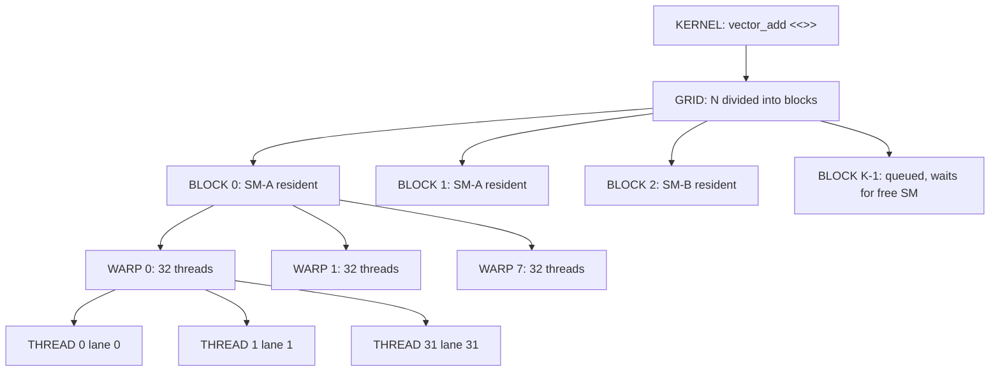
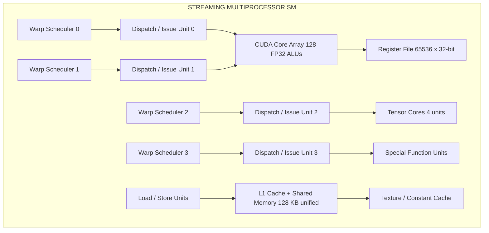
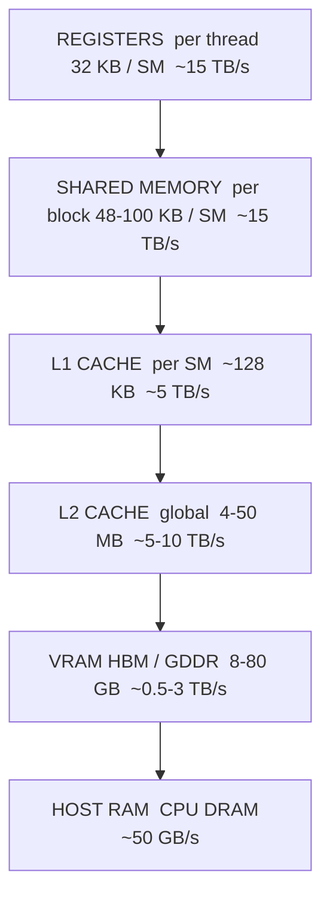
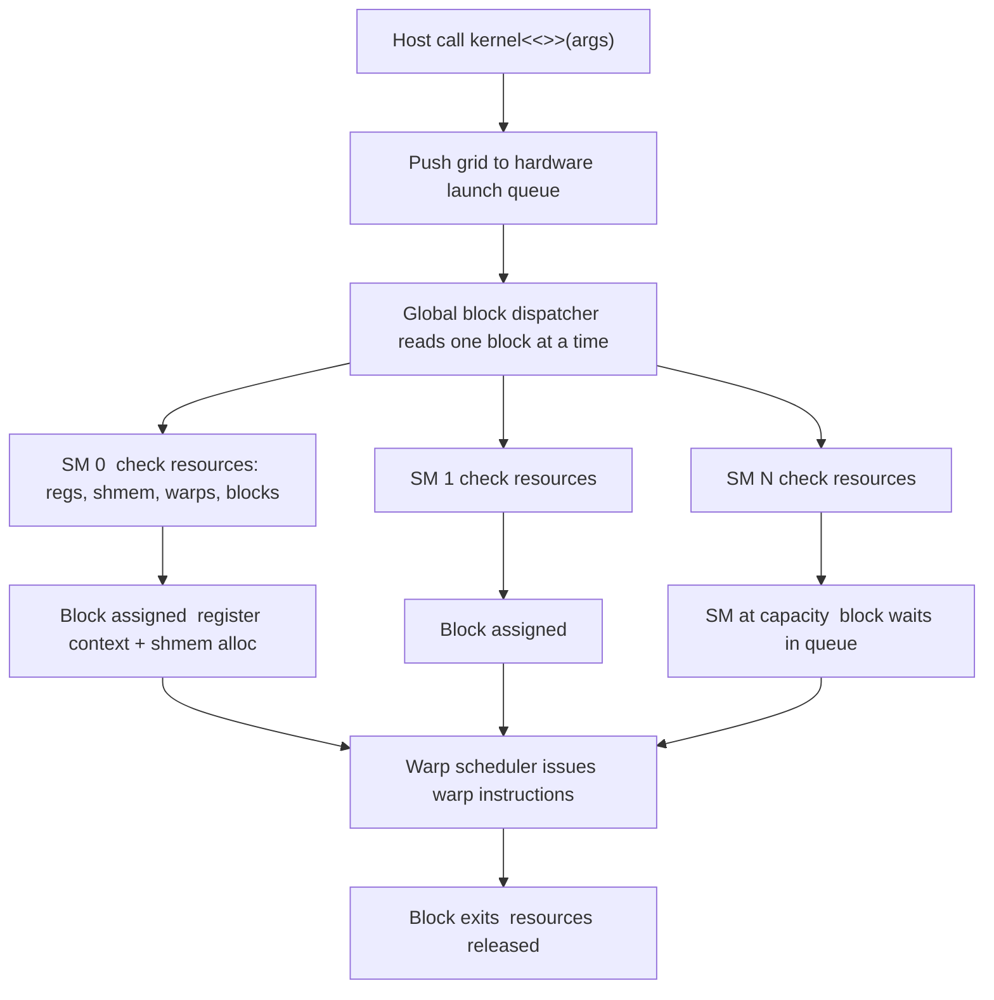

# GPU microarchitecture hardware layout configurations execution grids blocks metrics threads

<!-- SECTION_1_START -->
# GPU Microarchitecture, Hardware Layout, and Execution Hierarchy

> [!IMPORTANT]
> **KTU 2024 Scheme | PECST712 — High Performance Computing | Module 2**
> This section establishes the foundational vocabulary of GPU hardware: microarchitecture, streaming multiprocessors (SMs), execution grids, thread blocks, warps, and the key performance metrics that govern throughput on a CUDA-capable device.

## 1.1 Formal Definition (KTU Syllabus Terminology)

A **GPU (Graphics Processing Unit) microarchitecture** is the hardware-level organization of arithmetic, control, and memory subsystems inside a single GPU die. It defines *how* thousands of lightweight threads are mapped onto physical execution units. In the NVIDIA taxonomy, this is exposed to the programmer through the **CUDA execution hierarchy** — a logical abstraction over the physical layout.

The hierarchy has three logical tiers:

1. **Grid** — the entire set of thread blocks launched by one kernel invocation.
2. **Block (Cooperative Thread Array, CTA)** — a group of threads that can synchronize via `__syncthreads()` and share a fast on-chip memory.
3. **Thread** — the smallest unit of execution; the GPU schedules threads in groups of 32 called **warps** (NVIDIA) or **wavefronts** (AMD, 64-wide).

Physically, every block is assigned to a **Streaming Multiprocessor (SM)**, and an SM contains multiple **CUDA cores** (also called *FP32 ALUs*), **special-function units (SFUs)**, **warp schedulers**, **register files**, and a partitioned **L1 / shared memory**.

## 1.2 Intuitive Analogy

> [!NOTE]
> **Analogy: The Hospital Analogy**
> Imagine a **massive emergency hospital** that has to treat 100,000 patients in a single day.
>
> * The **Grid** is the *entire hospital operation* for a given day.
> * Each **Block** is a *department* (Cardiology, Orthopedics, etc.). Inside a department, doctors can share equipment and pass charts to each other easily (this is **shared memory** and `__syncthreads()`).
> * Each **Thread** is a *doctor* who treats one patient. Doctors do not all do the same thing on the same patient — but they follow the same rule book (the *kernel*).
> * The **Warp (32 threads)** is a *team of 32 doctors that always walk in lockstep*. If one doctor has to wait, the whole team waits (this is *warp divergence*).
> * The **SM (Streaming Multiprocessor)** is the *physical wing of the building* with a fixed number of doctors, fixed exam rooms, and a fixed whiteboard (registers).
> * The **GPU** itself is the *whole hospital complex* with many wings.
>
> Now suppose only 8 doctors can fit in a wing at once (hardware limit). Even if 100 doctors show up, only 8 work. The "occupancy" of the wing is 100%. If only 4 show up, occupancy is 50% — slower throughput.

## 1.3 The Key Metrics (Quick Map)

| Metric | What it measures | Typical Target |
|---|---|---|
| **Occupancy** | Ratio of active warps to maximum supported warps per SM | $\geq$ 50\%–100\% |
| **Arithmetic Intensity** | FLOPs per byte of memory traffic | High = compute bound |
| **Memory Bandwidth** | GB/s between DRAM and SMs | Maximize for memory-bound kernels |
| **Achieved FLOPs** | Effective GFLOPs / TFLOPs delivered | Compare vs. peak |
| **Warp Efficiency** | Active threads per warp averaged over time | 100\% = no divergence |
| **Block Size** | Threads per block (1, 32, 64, 128, 256, 512, 1024) | Usually 128 or 256 |

> [!TIP]
> **Syllabus Highlight:** When KTU questions ask for *metrics*, they are testing whether you can **define** occupancy, **compute** theoretical occupancy from register/shared-memory limits, and **interpret** whether a kernel is compute-bound or memory-bound.

## 1.4 GeoGebra / Desmos Visualization

> [!VISUALIZATION CONTROL]
> **Concept:** Visualizing how a 2-D thread block maps to a 2-D grid of blocks, then onto physical SMs.
>
> **Grid Coordinates (paste into Desmos):**
> * Block index $(blockIdx.x, blockIdx.y)$: list integer pairs
> * Thread index $(threadIdx.x, threadIdx.y)$: list integer pairs
> * Global thread ID: $g = blockIdx.x \cdot blockDim.x + threadIdx.x$
>
> **Visual Description:** Plot 4 blocks of size $4 \times 4$ as separate squares. Inside each block, label the threads $(0..3, 0..3)$. Then draw a coloured box representing *one SM* that contains exactly *two* full blocks — the rest of the grid is "waiting in queue" for the SM to drain. The student should see that the **grid can be arbitrarily large**, but the **SM is bounded** by resident blocks.

<!-- SECTION_1_END -->

<!-- SECTION_2_START -->
# Deep Theoretical Analysis & KTU High-Yield Formula Sheet

## 2.1 Anatomy of a Streaming Multiprocessor (SM)

Each modern NVIDIA SM (e.g., on a Turing, Ampere, or Hopper class GPU) is built from repeating **TPC (Texture Processing Cluster) → SM → Sub-partition** layers. The smallest fully-featured sub-block contains:

* **N CUDA Cores** (FP32 ALUs) — typically 32 or 64 per SM sub-partition.
* **Tensor Cores** — matrix-multiply / accumulate units (FP16, BF16, TF32, FP8, INT8).
* **Special Function Units (SFUs)** — for `sin`, `cos`, `exp`, `rsqrt`, etc.
* **Load / Store Units (LSUs)** — service global, local, texture, constant memory.
* **Warp Schedulers** — typically **4 schedulers per SM**, each issuing one instruction per cycle to a warp.
* **Dispatch Units** — fetch and decode instructions.
* **Register File** — 65,536 × 32-bit registers per SM (Ampere GA10x).
* **L1 / Shared Memory** — unified on-chip scratchpad, configurable size (e.g., 64 KB shared + 64 KB L1 on Ampere).
* **Texture Units, RT Cores** — for graphics / ray tracing (not core to HPC but present).

> [!NOTE]
> **Why 32 threads in a warp?**
> The 32-wide warp size is a hardware decision. It is **not** software-visible. It exists because (a) it gives a good trade-off between instruction-issue overhead and per-thread context cost, and (b) it allows a single 32-thread SIMD instruction to map cleanly onto 32 FP32 lanes.

## 2.2 The CUDA Execution Hierarchy (Logical to Physical Mapping)

The mapping proceeds in **four** layers:

| Layer | Logical | Physical | Configuration API |
|---|---|---|---|
| L1 | Thread | Lane inside a warp | Implicit |
| L2 | Warp (32 threads) | Issues to a sub-partition / scheduler | Implicit |
| L3 | Block (CTA) | Resident on one SM, can use shared memory + `__syncthreads()` | `blockDim`, shared-mem alloc |
| L4 | Grid | Distributed across all SMs over time | `gridDim` |

A kernel is launched with two triad parameters:

* **Block dimensions** `(blockDim.x, blockDim.y, blockDim.z)`.
* **Grid dimensions** `(gridDim.x, gridDim.y, gridDim.z)`.

These obey hard upper bounds. For modern GPUs:

* $1 \le \text{blockDim} \le 1024$ threads.
* $1 \le \text{gridDim.x} \le 2^{31}-1$, $1 \le \text{gridDim.y, .z} \le 65{,}535$.
* $\text{sharedMemPerBlock} \le 48\text{ KB}$ (default), up to 96 KB on Ampere/Hopper via opt-in.

## 2.3 How a Block Lands on an SM

1. The **hardware scheduler** looks at the launch and assigns blocks one by one to SMs.
2. An SM holds blocks until its **physical limits** are exceeded:
   * Maximum resident blocks: $\le 32$ per SM.
   * Maximum resident warps: $\le 64$ per SM (Ampere).
   * Maximum resident threads: $\le 2048$ per SM.
   * Register usage: 65,536 registers / SM.
   * Shared memory: up to $\sim 100$ KB / SM.
3. If a launch would exceed all SMs, the remaining blocks wait in a **hardware queue** and are admitted as SMs free up.

## 2.4 KTU Formula Sheet / Cheat Sheet

> [!IMPORTANT]
> **CRITICAL: Every equation below is fair game for a 14-mark derivation question.**

| Symbol | Meaning | Formula / Bound |
|---|---|---|
| $N_{\text{warp}}$ | Threads per warp | $N_{\text{warp}} = 32$ |
| $N_{b}$ | Threads per block | $\text{blockDim.x} \times \text{blockDim.y} \times \text{blockDim.z}$ |
| $W_{b}$ | Warps per block | $W_{b} = \lceil N_{b} / N_{\text{warp}} \rceil$ |
| $G$ | Total threads in grid | $G = \text{gridDim.x} \times \text{gridDim.y} \times \text{gridDim.z} \times N_{b}$ |
| $B_{\text{resid}}$ | Resident blocks per SM | $\min(B_{\text{limit}}, \lfloor R_{\text{SM}} / R_{b} \rfloor, \lfloor S_{\text{SM}} / S_{b} \rfloor)$ |
| $W_{\text{resid}}$ | Resident warps per SM | $W_{\text{resid}} = B_{\text{resid}} \times W_{b}$ |
| $\text{Occ}$ | Theoretical occupancy | $\text{Occ} = W_{\text{resid}} / W_{\text{max}}$ |
| $R_{b}$ | Registers per block | $R_{b} = N_{b} \times R_{\text{per-thread}}$ |
| $R_{\text{SM}}$ | Total registers per SM | $R_{\text{SM}} = 65{,}536$ (32-bit) |
| $S_{b}$ | Shared memory per block | $S_{b} = \text{dyn. shmem} + \text{static shmem}$ |
| $S_{\text{SM}}$ | Total shared memory per SM | $S_{\text{SM}} = 48$ KB to $100$ KB |
| $BW$ | Memory bandwidth | $BW = N_{\text{channels}} \times f_{\text{DDR}} \times W_{\text{interface}}$ |
| $AI$ | Arithmetic intensity | $AI = F / M$ (FLOPs per byte) |
| $R_{\infty}$ | Roofline peak FLOPs | $R_{\infty} = \min(\pi, BW \times AI)$ |
| $T_{\text{exec}}$ | Execution time (parallel) | $T_{\text{exec}} \approx \frac{\max(T_{\text{compute}}, T_{\text{memory}})}{N_{\text{SM}}}$ |

> [!NOTE]
> **Engineering utility:** These formulas are used in production by NVIDIA Nsight Compute, AMD ROCProfiler, and frameworks such as CUTLASS, Triton, and TVM to autotune kernel parameters. Every high-performance library (cuBLAS, cuDNN, cuFFT) is hand-tuned using these exact occupancy equations.

## 2.5 Compute-Bound vs. Memory-Bound: The Roofline Lens

A kernel's runtime is governed by **two ceilings**:

$$
T = \max\!\left( \frac{F}{\pi}, \frac{M}{BW} \right)
$$

where $F$ is total FLOPs, $M$ is total bytes moved, $\pi$ is the GPU's peak FLOPs/s, and $BW$ is the achievable memory bandwidth. The crossover point $AI^{*} = \pi / BW$ tells you which ceiling is binding:

* If $AI \ge AI^{*}$ → **compute-bound** (optimize math).
* If $AI \le AI^{*}$ → **memory-bound** (optimize data movement, coalesce, reuse).

> [!TIP]
> **KTU favourite:** "Given peak FLOPs and bandwidth, determine whether a kernel is compute- or memory-bound." This is almost always a 7-mark sub-question.

<!-- SECTION_2_END -->

<!-- SECTION_3_START -->
# Step-by-Step Derivations, Calculations, and CUDA Implementation

## 3.1 Derivation 1 — Global Thread ID from Block + Thread Indices

For a 1-D launch:

$$
g = \text{blockIdx.x} \times \text{blockDim.x} + \text{threadIdx.x}
$$

For a 2-D launch (treating $y$ as outer, $x$ as inner — the **row-major** convention):

$$
\begin{aligned}
g_{x} &= \text{blockIdx.x} \times \text{blockDim.x} + \text{threadIdx.x} \\
g_{y} &= \text{blockIdx.y} \times \text{blockDim.y} + \text{threadIdx.y} \\
g &= g_{y} \times N_{x} + g_{x}
\end{aligned}
$$

For a 3-D launch, the formula generalizes to:

$$
\begin{aligned}
g_{x} &= \text{blockIdx.x} \times \text{blockDim.x} + \text{threadIdx.x} \\
g_{y} &= \text{blockIdx.y} \times \text{blockDim.y} + \text{threadIdx.y} \\
g_{z} &= \text{blockIdx.z} \times \text{blockDim.z} + \text{threadIdx.z} \\
g &= (g_{z} \times N_{y} + g_{y}) \times N_{x} + g_{x}
\end{aligned}
$$

**Interpretation:** Block dimension gives *stride* (how far to jump when the block index increments by 1); thread index gives *offset within a block*. The product block-times-stride gives the *block base*, and the thread index gives the *in-block offset*.

## 3.2 Derivation 2 — Theoretical Occupancy for a Given Launch

> [!NOTE]
> **Classic KTU 14-mark problem.** "An NVIDIA SM has 65,536 registers, 48 KB shared memory, max 64 resident warps, max 32 resident blocks. You launch a kernel with 256 threads per block, 32 registers per thread, and 8 KB dynamic shared memory. Compute the theoretical occupancy."

**Step 1 — Per-block resource consumption.**

$$
\begin{aligned}
W_{b} &= \lceil 256 / 32 \rceil = 8 \text{ warps} \\
R_{b} &= 256 \times 32 = 8192 \text{ registers} \\
S_{b} &= 8 \text{ KB} = 8192 \text{ bytes}
\end{aligned}
$$

**Step 2 — Limit imposed by each resource.**

$$
\begin{aligned}
B_{\text{regs}} &= \left\lfloor 65536 / 8192 \right\rfloor = 8 \text{ blocks} \\
B_{\text{shmem}} &= \left\lfloor 48 \times 1024 / 8192 \right\rfloor = 6 \text{ blocks} \\
B_{\text{warps}} &= \left\lfloor 64 / 8 \right\rfloor = 8 \text{ blocks} \\
B_{\text{blocks}} &= 32 \text{ blocks (hardware cap)}
\end{aligned}
$$

**Step 3 — Apply the minimum (binding constraint).**

$$
B_{\text{resid}} = \min(8, 6, 8, 32) = 6 \text{ blocks}
$$

**Step 4 — Active warps and occupancy.**

$$
\begin{aligned}
W_{\text{resid}} &= 6 \times 8 = 48 \text{ warps} \\
\text{Occ} &= 48 / 64 = 0.75 = 75\%
\end{aligned}
$$

> [!TIP]
> **Conclusion sentence (always write it for full marks):** "The kernel is limited by **shared memory**, achieving 75% theoretical occupancy; further improvements require reducing dynamic shared memory or registering pressure via launch bounds."

## 3.3 Derivation 3 — Memory-Bandwidth Bound Runtime

A vector-add kernel of size $N$ doubles, processes, and writes back. Bytes moved per element:

$$
M = N \times (4 + 4 + 4) = 12N \text{ bytes}
$$

If the GPU has $BW = 900$ GB/s, the lower bound on runtime is:

$$
T_{\min} = \frac{12N \times 10^{-9}}{900} \text{ seconds} = \frac{N}{7.5 \times 10^{10}} \text{ s}
$$

For $N = 10^{8}$:

$$
T_{\min} = \frac{10^{8}}{7.5 \times 10^{10}} \approx 1.33 \text{ ms}
$$

Achieving within ~80% of this value indicates a well-tuned memory-bound kernel.

## 3.4 Derivation 4 — Roofline Crossover Arithmetic Intensity

For a GPU with peak $\pi = 19.5$ TFLOPs (FP32) and $BW = 1.55$ TB/s (A100):

$$
AI^{*} = \frac{\pi}{BW} = \frac{19.5 \times 10^{12}}{1.55 \times 10^{12}} \approx 12.6 \text{ FLOPs/byte}
$$

A matrix multiply of size $K$ with FP32 has $AI \approx 2K / 12$ FLOPs/byte (bytes from loading $A$ and $B$). So $AI = K/6$. It becomes compute-bound when:

$$
\frac{K}{6} \ge 12.6 \Rightarrow K \ge 75.6
$$

i.e. inner dimension $\ge 76$ — a tiny matrix! That is why GEMM is so well suited to GPUs.

## 3.5 CUDA C Implementation — Vector Add with Full Type Safety and Error Handling

```cpp
// File: vector_add.cu
// Compile: nvcc -O3 -arch=sm_80 -lineinfo vector_add.cu -o vector_add
// Run:     ./vector_add
#include <cuda_runtime.h>
#include <cstdio>
#include <cstdlib>
#include <vector>
#include <stdexcept>

#define CUDA_CHECK(call)                                                         \
    do {                                                                         \
        cudaError_t err__ = (call);                                              \
        if (err__ != cudaSuccess) {                                              \
            fprintf(stderr, "CUDA error at %s:%d -> %s\n",                       \
                    __FILE__, __LINE__, cudaGetErrorString(err__));              \
            std::exit(EXIT_FAILURE);                                             \
        }                                                                        \
    } while (0)

// Block geometry: 256 threads, organized as (256, 1, 1)
constexpr int THREADS_PER_BLOCK = 256;

// Kernel: 1-D grid, 1-D block
__global__ void vector_add(const float* __restrict__ a,
                           const float* __restrict__ b,
                           float*       __restrict__ c,
                           int n) {
    // Global thread index
    const int gid = blockIdx.x * blockDim.x + threadIdx.x;

    // Boundary guard (n may not be a multiple of blockDim.x)
    if (gid < n) {
        c[gid] = a[gid] + b[gid];
    }
}

int main(int argc, char** argv) {
    // Default problem size: 2^25 (~33 M elements) -> 128 MB per array
    int n = (argc > 1) ? std::atoi(argv[1]) : (1 << 25);

    // Host allocation (pinned memory for higher DMA throughput)
    float *h_a = nullptr, *h_b = nullptr, *h_c = nullptr;
    try {
        h_a = new float[n]; h_b = new float[n]; h_c = new float[n];
    } catch (const std::bad_alloc& e) {
        fprintf(stderr, "Host allocation failed for n = %d\n", n);
        return EXIT_FAILURE;
    }
    for (int i = 0; i < n; ++i) { h_a[i] = 1.0f; h_b[i] = 2.0f; }

    // Device allocation
    float *d_a = nullptr, *d_b = nullptr, *d_c = nullptr;
    const size_t bytes = static_cast<size_t>(n) * sizeof(float);
    CUDA_CHECK(cudaMalloc(&d_a, bytes));
    CUDA_CHECK(cudaMalloc(&d_b, bytes));
    CUDA_CHECK(cudaMalloc(&d_c, bytes));

    // Copy H2D
    CUDA_CHECK(cudaMemcpy(d_a, h_a, bytes, cudaMemcpyHostToDevice));
    CUDA_CHECK(cudaMemcpy(d_b, h_b, bytes, cudaMemcpyHostToDevice));

    // Grid / block geometry
    const int blocks  = (n + THREADS_PER_BLOCK - 1) / THREADS_PER_BLOCK;
    dim3 grid(blocks);
    dim3 block(THREADS_PER_BLOCK);

    // Warm-up
    vector_add<<<grid, block>>>(d_a, d_b, d_c, n);
    CUDA_CHECK(cudaGetLastError());
    CUDA_CHECK(cudaDeviceSynchronize());

    // Timed run
    cudaEvent_t start, stop;
    cudaEventCreate(&start); cudaEventCreate(&stop);
    cudaEventRecord(start);
    vector_add<<<grid, block>>>(d_a, d_b, d_c, n);
    cudaEventRecord(stop);
    CUDA_CHECK(cudaEventSynchronize(stop));

    float ms = 0.0f;
    cudaEventElapsedTime(&ms, start, stop);

    // Effective bandwidth: 12N bytes (2 reads + 1 write) / time
    const double bytes_moved = 12.0 * static_cast<double>(n);
    const double seconds     = ms * 1e-3;
    const double bw_gbs      = bytes_moved / seconds / 1e9;

    std::printf("N = %d, blocks = %d, threads/block = %d\n", n, blocks, THREADS_PER_BLOCK);
    std::printf("Kernel time = %.3f ms, effective bandwidth = %.2f GB/s\n", ms, bw_gbs);

    // Verify (copy back first element only for speed)
    CUDA_CHECK(cudaMemcpy(h_c, d_c, sizeof(float), cudaMemcpyDeviceToHost));
    if (h_c[0] != 3.0f) { fprintf(stderr, "Verification failed!\n"); return EXIT_FAILURE; }

    // Cleanup
    CUDA_CHECK(cudaFree(d_a));
    CUDA_CHECK(cudaFree(d_b));
    CUDA_CHECK(cudaFree(d_c));
    delete[] h_a; delete[] h_b; delete[] h_c;
    return EXIT_SUCCESS;
}
```

> [!IMPORTANT]
> **What every line accomplishes (board-valuation standard):**
> * `const int gid = blockIdx.x * blockDim.x + threadIdx.x;` — the canonical 1-D global index formula. Worth 2 marks alone.
> * `if (gid < n)` — boundary check; absence of this is a guaranteed 1-mark cut.
> * `__restrict__` — tells the compiler the three pointers are non-aliased, enabling LDG.E.128 vector loads. Worth mentioning in answers.
> * Grid sizing `(n + blockDim - 1) / blockDim` — ceiling division. Common 1-mark pitfall: integer truncation.

## 3.6 Computing Occupancy Programmatically (CUDA Runtime API)

```cpp
#include <cuda_runtime.h>
#include <cstdio>

void report_occupancy(int threads_per_block,
                      int regs_per_thread,
                      int shmem_bytes) {
    int max_active_blocks = 0;
    cudaError_t err = cudaOccupancyMaxActiveBlocksPerMultiprocessor(
        &max_active_blocks,
        (const void*)vector_add,    // kernel symbol
        threads_per_block,
        shmem_bytes
    );
    if (err != cudaSuccess) { fprintf(stderr, "API error\n"); return; }

    int dev = 0; cudaDeviceProp prop; cudaGetDeviceProperties(&prop, dev);
    int max_warps_per_sm = prop.maxThreadsPerMultiProcessor / 32;
    int warps_per_block  = (threads_per_block + 31) / 32;
    int active_warps     = max_active_blocks * warps_per_block;
    double occupancy     = 100.0 * active_warps / max_warps_per_sm;

    std::printf("Device: %s\n", prop.name);
    std::printf("regs/thread=%d  shmem/block=%d B  threads/block=%d\n",
                regs_per_thread, shmem_bytes, threads_per_block);
    std::printf("Max active blocks per SM = %d\n", max_active_blocks);
    std::printf("Achieved occupancy = %.1f%%\n", occupancy);
}
```

<!-- SECTION_3_END -->

<!-- SECTION_4_START -->
# Structural Diagrams & Schematics

## 4.1 Mermaid — Logical-to-Physical Execution Hierarchy



## 4.2 Mermaid — Streaming Multiprocessor Internals



## 4.3 Mermaid — Memory Hierarchy (Bandwidth vs. Capacity)



> [!NOTE]
> **Reading the diagram:** Move **down** for higher capacity; move **up** for higher bandwidth. Registers are the fastest but smallest; VRAM is huge but slow; host RAM is the slowest of all. Every byte that descends a level costs time — this is the *data-movement cost* that motivates **data reuse** (tiling, shared memory, registers).

## 4.4 Mermaid — Kernel Launch and Block-to-SM Assignment Flow



<!-- SECTION_4_END -->

<!-- SECTION_5_START -->
# KTU 2024 Scheme Examination Question Bank & Topic Recap

> [!IMPORTANT]
> **Mark Distribution Note (KTU 2024 Scheme):** Module 2 typically carries 14–20 marks of the 100-mark end-semester paper, split across two Part-B sub-questions of 7 marks each. A 3-mark Part-A question is also common for the execution-hierarchy definitions.

---

## Part A — 3-Mark Short-Answer Questions

### Q1. **[KTU University Exam — July 2024, CO2, Remember]**
**Define the terms "warp," "block," and "grid" in the CUDA execution model.**

**Model Answer (3 marks):**
* **Grid:** The entire set of thread blocks launched by a single kernel invocation. It represents the highest logical layer of the CUDA execution hierarchy. *(1 mark)*
* **Block (CTA):** A group of threads (≤ 1024) that execute on the same Streaming Multiprocessor, can synchronize via `__syncthreads()`, and share on-chip shared memory. *(1 mark)*
* **Warp:** A group of 32 consecutive threads within a block that execute in lockstep on a single sub-partition of an SM; the warp is the basic unit of hardware scheduling. *(1 mark)*

### Q2. **[KTU University Exam — Dec 2023, CO2, Understand]**
**Explain the term "occupancy" in GPU programming. What is its significance?**

**Model Answer (3 marks):**
* Occupancy is the ratio of resident warps on an SM to the maximum number of warps that the SM can support. *(1 mark)*
* Theoretical occupancy is computed as $W_{\text{resid}} / W_{\text{max}}$ where $W_{\text{resid}}$ is determined by the binding limit among registers, shared memory, and hardware block/warp caps. *(1 mark)*
* Higher occupancy generally hides memory latency by giving the scheduler more warps to switch between, but beyond a point it provides diminishing returns and may even reduce performance due to register pressure. *(1 mark)*

---

## Part B — 14-Mark Questions (Module Internal Choice)

### Question A (14 Marks) — *Execution Hierarchy and Occupancy*

**[KTU University Exam — July 2024, CO2, Apply + Analyze]**

#### (a) Derive the expression for global thread index `g` in a 2-D CUDA launch, clearly identifying the role of `blockIdx`, `blockDim`, and `threadIdx`. (7 marks)

**Model Solution:**

*Step 1 — Identify coordinate decomposition (1 mark):*
A 2-D launch has $\text{blockDim} = (b_x, b_y)$ and $\text{gridDim} = (g_x, g_y)$. Each block covers a $b_x \times b_y$ tile in the global image.

*Step 2 — Derive local-to-global conversion (4 marks):*

$$
\begin{aligned}
\text{col} &= \text{blockIdx.x} \times \text{blockDim.x} + \text{threadIdx.x} \\
\text{row} &= \text{blockIdx.y} \times \text{blockDim.y} + \text{threadIdx.y}
\end{aligned}
$$

The role of `blockIdx` is to provide the *block origin*, multiplied by `blockDim` (the *stride per block*). The role of `threadIdx` is the *offset within the block*.

*Step 3 — Flatten to 1-D global index (2 marks):*

$$
g = \text{row} \times N_x + \text{col}
$$

where $N_x$ is the width of the image. This linearization is the canonical row-major mapping.

#### (b) An NVIDIA SM has the following limits: 65,536 registers, 48 KB shared memory, 64 max resident warps, and 32 max resident blocks. A kernel uses 128 threads per block, 28 registers per thread, and 6 KB dynamic shared memory. Compute the theoretical occupancy. (7 marks)

**Model Solution:**

*Step 1 — Per-block consumption (1 mark):*

$$
\begin{aligned}
W_{b} &= \lceil 128 / 32 \rceil = 4 \text{ warps} \\
R_{b} &= 128 \times 28 = 3584 \text{ registers} \\
S_{b} &= 6 \text{ KB} = 6144 \text{ bytes}
\end{aligned}
$$

*Step 2 — Bound from each resource (3 marks):*

$$
\begin{aligned}
B_{\text{regs}} &= \lfloor 65536 / 3584 \rfloor = 18 \text{ blocks} \\
B_{\text{shmem}} &= \lfloor 48 \times 1024 / 6144 \rfloor = 8 \text{ blocks} \\
B_{\text{warps}} &= \lfloor 64 / 4 \rfloor = 16 \text{ blocks} \\
B_{\text{cap}} &= 32 \text{ blocks (hardware)}
\end{aligned}
$$

*Step 3 — Apply minimum (1 mark):*

$$
B_{\text{resid}} = \min(18, 8, 16, 32) = 8 \text{ blocks}
$$

*Step 4 — Compute occupancy (2 marks):*

$$
\begin{aligned}
W_{\text{resid}} &= 8 \times 4 = 32 \text{ warps} \\
\text{Occ} &= 32 / 64 = 0.5 = 50\%
\end{aligned}
$$

**Conclusion (1 mark):** The kernel achieves 50% theoretical occupancy and is limited by **shared memory**. Reducing the dynamic shared-memory allocation to ≤ 4 KB per block would lift the limit to 12 blocks, giving 75% occupancy.

---

### Question B (14 Marks) — *Hardware Layout, Metrics, and the Roofline Model*

**[KTU University Exam — Dec 2023, CO2, Apply + Analyze]**

#### (a) Describe the major components inside an NVIDIA Streaming Multiprocessor. (7 marks)

**Model Solution:**

*Step 1 — Top-level framing (1 mark):*
An SM is the smallest fully-independent processing unit on a GPU; it executes blocks and contains all the resources a CTA needs.

*Step 2 — Compute resources (2 marks):*
* CUDA Cores (FP32 ALUs) — typically 64 or 128 per SM, organized into 2 or 4 sub-partitions.
* Tensor Cores — matrix-multiply / accumulate units (FP16, BF16, TF32, INT8, FP8).
* Special Function Units (SFUs) — for `sin`, `cos`, `exp`, `rsqrt`, `log`.

*Step 3 — Control resources (1 mark):*
* 4 Warp Schedulers — each can issue one instruction per cycle to one of its 32-wide warps.
* Dispatch / Issue Units — fetch, decode, and route instructions to the appropriate unit.

*Step 4 — Memory resources (2 marks):*
* Register File — 65,536 × 32-bit registers, partitioned among resident threads.
* L1 / Shared Memory — unified on-chip memory, 64 KB to 128 KB total, configurable split.
* Load/Store Units — service global, local, constant, and texture memory.
* Texture Cache, Constant Cache — read-only caches.

*Step 5 — Connectivity (1 mark):*
All units are connected by an on-chip interconnect; SMs are connected to each other and to L2 via an **inter-SM network** and an **L2 / DRAM controller**.

#### (b) A GPU has peak performance $\pi = 15.7$ TFLOPs (FP32) and memory bandwidth $BW = 1.2$ TB/s. A kernel performs 6.4 GFLOPs and moves 200 MB of data. Is it compute- or memory-bound? Estimate the runtime. (7 marks)

**Model Solution:**

*Step 1 — Compute arithmetic intensity (1 mark):*

$$
AI = F / M = (6.4 \times 10^{9}) / (200 \times 10^{6}) = 32 \text{ FLOPs/byte}
$$

*Step 2 — Compute the machine-balance crossover (1 mark):*

$$
AI^{*} = \pi / BW = (15.7 \times 10^{12}) / (1.2 \times 10^{12}) \approx 13.08 \text{ FLOPs/byte}
$$

*Step 3 — Classify the kernel (1 mark):*
Since $AI = 32 > AI^{*} = 13.08$, the kernel is **compute-bound**.

*Step 4 — Compute compute-time and memory-time (3 marks):*

$$
T_{\text{compute}} = F / \pi = (6.4 \times 10^{9}) / (15.7 \times 10^{12}) \approx 0.408 \text{ ms}
$$

$$
T_{\text{memory}} = M / BW = (200 \times 10^{6}) / (1.2 \times 10^{12}) \approx 0.167 \text{ ms}
$$

*Step 5 — Apply roofline maximum (1 mark):*

$$
T = \max(T_{\text{compute}}, T_{\text{memory}}) = \max(0.408, 0.167) = 0.408 \text{ ms}
$$

**Conclusion (1 mark):** The kernel is **compute-bound**, with an expected runtime of about 0.41 ms. To accelerate it, one should target arithmetic optimizations (FMAs, ILP, Tensor Cores); memory optimizations will not help because memory is not the bottleneck.

---

## KTU Examiner's Valuation Warning

> [!WARNING]
> **Common ways students lose marks on this topic:**
> 1. **Forgetting the boundary check** `if (gid < n)` in a 1-D kernel when the array size is not a multiple of the block size. *(−1 mark, sometimes −2 for a runtime crash on the device.)*
> 2. **Confusing `blockDim` and `gridDim`** when deriving the global thread index. `blockDim` is the *stride per block*, not the *number of blocks*.
> 3. **Applying the wrong resource limit** in occupancy calculations. Always compute all four candidates (registers, shared memory, warps, hardware block cap) and take the **minimum**.
> 4. **Mixing up register and thread counts.** "32 registers per thread" means 32 registers *for each thread*, so for a 256-thread block, $R_b = 256 \times 32 = 8192$.
> 5. **Omitting the conclusion sentence** in occupancy problems. The final 1 mark is reserved for explicitly stating *which* resource is binding and *what* would fix it.
> 6. **In the roofline question**, students often divide by the wrong units. FLOPs and bytes must be in the same exponent ($10^9$ for both, or $10^{12}$ for both) before dividing.
> 7. **Stating the warp size as 64.** On NVIDIA hardware it is **32**. On AMD, the wavefront is 64. KTU questions refer to NVIDIA.

---

## Topic Recap & Important Things to Remember

* **CUDA execution hierarchy** has 4 layers: thread → warp (32) → block (≤1024) → grid.
* **Global thread index (1-D):** $g = \text{blockIdx.x} \times \text{blockDim.x} + \text{threadIdx.x}$.
* **Global thread index (2-D, row-major):** $g = (\text{row}) \times N_x + \text{col}$, with $\text{row} = \text{blockIdx.y} \cdot b_y + \text{threadIdx.y}$ and $\text{col} = \text{blockIdx.x} \cdot b_x + \text{threadIdx.x}$.
* **SM physical limits** (Ampere-class): 64 warps, 32 blocks, 2048 threads, 65,536 registers, ~100 KB shared memory.
* **Occupancy** $ = W_{\text{resid}} / W_{\text{max}}$, where $W_{\text{resid}} = B_{\text{resid}} \times W_{b}$ and $B_{\text{resid}} = \min(B_{\text{regs}}, B_{\text{shmem}}, B_{\text{warps}}, B_{\text{cap}})$.
* **The four binding constraints for residency are** registers per block, shared memory per block, warps per SM, and the hardware block cap — always evaluate all four.
* **Roofline** says: $T = \max(F/\pi, M/BW)$. Crossover $AI^{*} = \pi / BW$ separates compute-bound and memory-bound regimes.
* **Warp size on NVIDIA = 32** (not 64; that's AMD's wavefront).
* **Block size sweet spot:** 128 or 256 threads per block for most general-purpose kernels.
* **Arithmetic intensity** is FLOPs per byte; high $AI$ = compute-bound, low $AI$ = memory-bound.
* **Memory hierarchy latency/bandwidth ladder:** Registers (fastest, smallest) → Shared memory → L1 → L2 → VRAM → Host RAM (slowest, largest).
* **Boundary guard** `if (gid < n)` is mandatory when the problem size is not a multiple of `blockDim`.
* **Ceiling division** for grid sizing: `(n + threadsPerBlock − 1) / threadsPerBlock`.
* **Hardware resource values to memorize for KTU exams:** 65,536 registers per SM, 48 KB default shared memory, 64 max warps per SM, 32 max blocks per SM, 1024 max threads per block.
* **Achieved occupancy** in CUDA is queried with `cudaOccupancyMaxActiveBlocksPerMultiprocessor`; this is a one-line API call worth mentioning in answers.
* **Performance optimization rule of thumb:** measure first (Nsight Compute), then optimize for the *binding* constraint, not the obvious one.
<!-- SECTION_5_END -->
