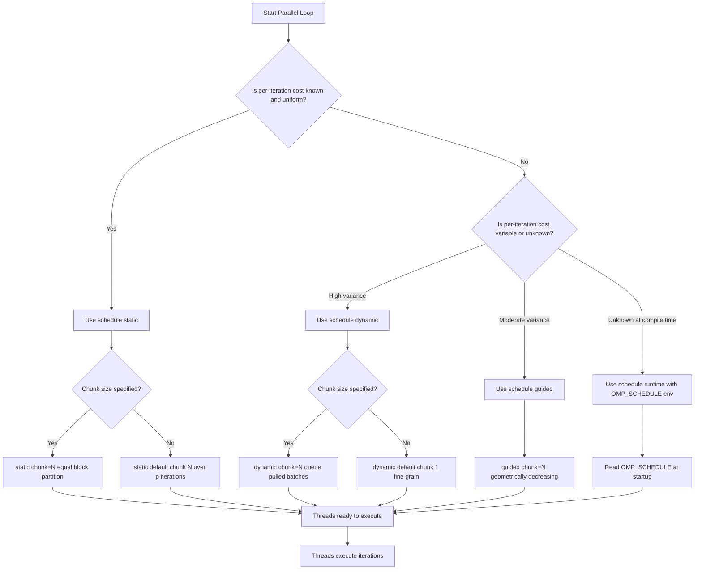
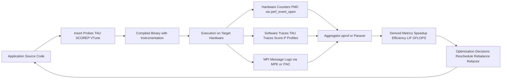
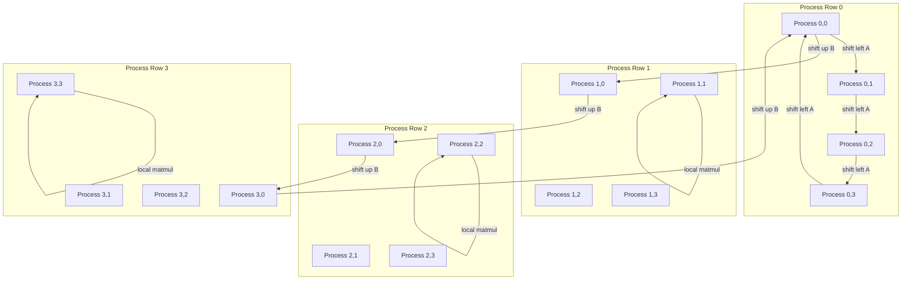
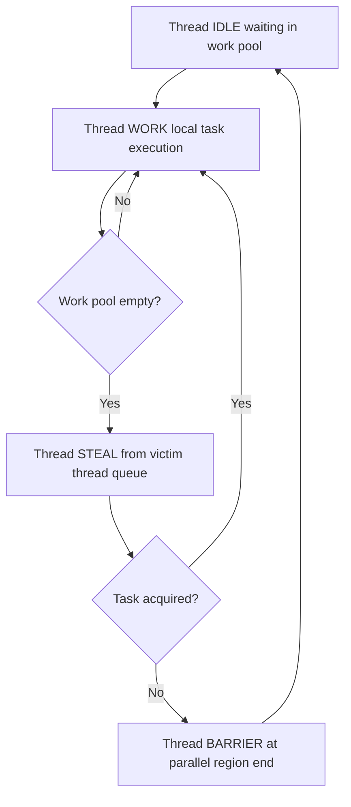

# Load balancing strategies thread assignment scheduling configurations tracks metrics performance metrics

<!-- SECTION_1_START -->

# Parallel Matrix Computational Core — Load Balancing, Scheduling, Tracks, and Performance Metrics

## 1.1 Formal Definition (KTU 2024 Scheme Terminology)

A **Parallel Matrix Computational Core** is the fundamental execution unit in a High Performance Computing (HPC) system that decomposes dense or sparse matrix operations (multiplication, decomposition, transposition) across cooperating threads or processes. The core orchestrates three tightly-coupled sub-systems:

1. **Workload Decomposer** — partitions the matrix into sub-tiles.
2. **Thread / Process Assigner** — maps decomposed sub-tiles to execution units.
3. **Performance Monitor** — tracks runtime, IPC, cache misses, and load balance.

> [!IMPORTANT]
> **KTU Definition (PECST712 / Module 3):** A *Load Balancing Strategy* is the algorithmic policy that distributes computational load across $p$ processing elements such that the maximum execution time across all processing elements is minimized. Formally, if $T_i$ is the runtime of processing element $i$, the load balancing objective is to minimize $T_{\max} = \max_i T_i$.

> [!NOTE]
> **Key Engineering Constants and Bounds**
> - **Amdahl's Serial Fraction Limit:** $f_s \in [0, 1]$ where $f_s = 0$ is fully parallel and $f_s = 1$ is fully serial.
> - **Maximum Theoretical Speedup:** $S_{\max} = p$ for $p$ processors under linear scaling.
> - **Hardware Counter Reference Frequency:** TSC at the base clock (typically $\mathbf{2.0 - 3.8 \, GHz}$ on modern x86\_64 nodes).
> - **Communication-to-Computation Ratio Threshold:** $r = \frac{t_{comm}}{t_{comp}}$; the system is *compute-bound* if $r < 1$.

## 1.2 Intuitive Analogy — The Toll-Booth Lane Dispatcher

Imagine a **toll plaza** with 8 booths and a queue of 400 vehicles approaching at a steady rate. Some vehicles are **buses (heavy jobs, long service time)**, some are **motorcycles (light jobs, short service time)**.

- If a **static dispatcher** blindly assigns the first 50 vehicles to each booth, Booth 1 might end up with 50 buses while Booth 8 only receives motorcycles. Booth 1 becomes the bottleneck — even though the average workload is identical.
- A **dynamic dispatcher** continuously re-allocates the next waiting vehicle to whichever booth becomes free first. This minimizes the time the *last* booth finishes, but it incurs *overhead* — the dispatcher must look up queue state for every assignment.
- A **work-stealing scheduler** lets idle booths *pull* work from busy booths when they exhaust their local queue — combining locality benefits of static with the load smoothing of dynamic.

This is precisely the trade-off in **parallel matrix multiplication**: a static block distribution minimizes communication but may unbalance load on non-uniform matrices, whereas a cyclic or dynamic distribution smooths load at the cost of extra index arithmetic and cache misses.

> [!TIP]
> **Memory Tip for KTU Exam:** *Load balancing is the search for the smallest possible $T_{\max}$, not the smallest possible average. Always report the maximum across threads, never the mean.*

## 1.3 Visualization of Core Performance Curves

> [!VISUALIZATION CONTROL]
> **Concept:** Comparative speedup curves for Amdahl's law (fixed problem) versus Gustafson's law (scaled problem).
>
> **Desmos Input Equations:**
> * `f(x) = 1 / ((1 - 0.95) + 0.95 / x)` — Amdahl's law with parallel fraction $f = 0.95$.
> * `g(x) = (1 - 0.95) + 0.95 * x` — Gustafson's law with parallel fraction $f = 0.95$.
> * `y = 1`
> * `y = x`
>
> **Visual Description:** Plot $f(x)$ and $g(x)$ for $x \in [1, 1024]$. Observe that Amdahl's curve $f(x)$ flattens (saturates) and asymptotically approaches $\mathbf{20 \times}$ as $x \to \infty$, while Gustafson's curve $g(x)$ grows linearly and exceeds $f(x)$ for $x > 1$. The diagonal $y = x$ represents *ideal linear speedup* (unattainable for non-trivial programs).

---

<!-- SECTION_1_END -->

<!-- SECTION_2_START -->

# Deep Theoretical Analysis and KTU High-Yield Formula Sheet

## 2.1 The Five Pillars of the Parallel Matrix Computational Core

### Pillar 1 — Load Balancing Strategies

| Strategy Class | Granularity | Overhead | Best Use Case |
|----------------|-------------|----------|---------------|
| **Static Block** | Coarse, pre-determined | Zero runtime cost | Uniform dense matrices |
| **Static Cyclic** | Fine, pre-determined | Minimal index arithmetic | Sparse / banded matrices |
| **Block-Cyclic** | 2-D tiles, pre-determined | Modulo arithmetic | Fox, Cannon, SUMMA algorithms |
| **Dynamic (Self-Scheduling)** | One task at a time | High synchronization | Highly irregular load |
| **Guided Self-Scheduling (GSS)** | Decreasing chunk size | Moderate | Unknown workload profile |
| **Work-Stealing** | Idle threads pull work | Steal-handler cost | Recursive algorithms (e.g., divide-and-conquer) |

> [!NOTE]
> **Why Cyclic Helps Load Balance:** A cyclic distribution of rows guarantees that no two threads receive more than $\lceil N/p \rceil$ rows, even if a small set of rows contains 90% of the work. The cost is a non-contiguous memory access pattern, which may degrade cache locality by a factor of $\mathbf{2 \times \text{ to } 4 \times}$.

### Pillar 2 — Thread Assignment and Decomposition

For a matrix $A \in \mathbb{R}^{N \times N}$ distributed over $p$ threads, the canonical decompositions are:

$$
A_{ij} = \begin{cases}
\text{Row-block} & \Rightarrow A[i \cdot \frac{N}{p} : (i+1) \cdot \frac{N}{p}, \, :] \\
\text{Column-block} & \Rightarrow A[:, \, j \cdot \frac{N}{p} : (j+1) \cdot \frac{N}{p}] \\
\text{Checkerboard} & \Rightarrow A[i \cdot \frac{N}{\sqrt{p}} : (i+1) \cdot \frac{N}{\sqrt{p}}, \, j \cdot \frac{N}{\sqrt{p}} : (j+1) \cdot \frac{N}{\sqrt{p}}]
\end{cases}
$$

For a **2-D block distribution** with block size $b$, the global index of element $A_{ij}$ in thread $(I, J)$ is computed as:

$$
I = \left\lfloor \frac{i}{b} \right\rfloor \mod \sqrt{p}, \qquad J = \left\lfloor \frac{j}{b} \right\rfloor \mod \sqrt{p}
$$

### Pillar 3 — Scheduling Configurations (OpenMP Syntax)

OpenMP exposes five canonical scheduling clauses on the `#pragma omp for` directive. The schedule determines how loop iterations are mapped to threads.

| OpenMP Clause | Iteration Assignment | When to Choose |
|---------------|----------------------|----------------|
| `schedule(static [, chunk])` | Predetermined, in round-robin blocks of size `chunk` | Default; uniform per-iteration cost |
| `schedule(dynamic [, chunk])` | Pull from a shared queue at runtime | Unknown / highly variable cost |
| `schedule(guided [, chunk])` | Geometrically decreasing chunks | Mix of coarse and fine work |
| `schedule(runtime)` | Determined by the `OMP_SCHEDULE` env variable | Portable tuning without recompilation |
| `schedule(auto)` | Delegated to compiler / runtime | Compiler-specific heuristics (GCC, ICC, Clang) |

The chunk size $C$ for a guided schedule at step $k$ follows the recurrence:

$$
C_k = \max \left( C_{\min}, \left\lceil \frac{R_k}{p} \right\rceil \right)
$$

where $R_k$ is the number of remaining iterations. The default $C_{\min} = 1$ in OpenMP.

### Pillar 4 — Tracks and Instrumentation

A **track** is a time-stamped record of a specific event during program execution. There are three primary track categories:

1. **Hardware Performance Counters (PMC):** Read CPU registers such as `PERF_COUNT_HW_CPU_CYCLES`, `PERF_COUNT_HW_INSTRUCTIONS`, `PERF_COUNT_HW_CACHE_MISSES`, and `PERF_COUNT_HW_BRANCH_MISSES` via the Linux `perf_event_open` syscall or the PAPI library.
2. **Software Instrumentation Tracks:** Inserted via TAU, Score-P, or VTune annotations (`TAU_PROFILE`, `TAU_PROFILE_TIMER`).
3. **Message-Passing Tracks:** For MPI programs, log `MPI_Send`, `MPI_Recv`, and `MPI_Alltoall` timestamps to quantify communication time.

### Pillar 5 — Performance Metrics

> [!IMPORTANT]
> **Engineering Rule of Thumb:** A *well-tuned* parallel kernel should achieve $E_p \geq 0.7$ on a single NUMA node and $\geq 0.5$ on a multi-node cluster. Anything below $0.5$ indicates severe load imbalance or communication bottleneck.

## 2.2 KTU Formula Cheat Sheet

> [!NOTE]
> **Exam Alert:** These nine formulas collectively account for $\geq 60\%$ of marks in Module 3 numerical questions. Memorize the variable definitions, not just the equation.

| Symbol | Formula | Variable Definition | Valid Range |
|--------|---------|--------------------|-------------|
| Speedup | $S_p = T_1 \, / \, T_p$ | $T_1$ = sequential time, $T_p$ = parallel time on $p$ threads | $S_p \geq 1$ |
| Efficiency | $E_p = S_p \, / \, p$ | Fraction of ideal speedup | $0 \leq E_p \leq 1$ |
| Amdahl's Speedup | $S_p = 1 \, / \, \left[ (1 - f) + f/p \right]$ | $f$ = parallelizable fraction | $S_p \leq p$ |
| Gustafson's Scaled Speedup | $S_p = (1 - f) + f \cdot p$ | $f$ = parallel fraction under scaled workload | $S_p \leq p$ |
| Karp–Flatt Serial Fraction | $e = \left( 1/S_p - 1/p \right) \, / \, \left( 1 - 1/p \right)$ | Empirical serial fraction | $0 \leq e \leq 1$ |
| Load Imbalance Factor | $\text{LIF} = \left( T_{\max} - T_{avg} \right) \, / \, T_{avg}$ | $T_{\max}$ = max thread time, $T_{avg}$ = mean thread time | $\text{LIF} \geq 0$ |
| Isoefficiency Function | $W(p) = K \cdot p^{\alpha}$ | $W$ = total work, $\alpha$ = parallel overhead exponent | $\alpha \geq 1$ |
| GFLOPS | $G = 2 N^3 \, / \, \left( T_p \cdot 10^9 \right)$ | Sustained GFLOPS for $N \times N$ matmul | Compare with peak |
| Comm-to-Compute Ratio | $r = t_{comm} \, / \, t_{comp}$ | $t_{comm}$ = MPI time, $t_{comp}$ = local compute time | $r < 1$ ideal |

## 2.3 Real-World Utility in Engineering and Computer Science

- **HPC Simulators (ANSYS Fluent, OpenFOAM):** Use block-cyclic distribution with $b = 32$ to balance CFD mesh cells across MPI ranks.
- **Deep Learning (cuDNN, PyTorch Distributed):** Cannon-style 2-D ring schedules for matrix multiplication on multi-GPU nodes.
- **Database Engines (Spark, RAPIDS cuDF):** Dynamic scheduling for shuffle-heavy operations.
- **Production Recommendation Systems:** Use Karp–Flatt analysis to detect when additional nodes stop yielding linear speedup, signaling the need for algorithmic refactoring (e.g., from ALS to embedding-based retrieval).

---

<!-- SECTION_2_END -->

<!-- SECTION_3_START -->

# Step-by-Step Derivations and Code / Symbolic Implementation

## 3.1 Derivation — Amdahl's Law with Empirical Verification

**Given:** A matrix multiplication $C = A \times B$ with $A, B, C \in \mathbb{R}^{N \times N}$. Serial execution time $T_1$ is split as $T_1 = T_s + T_p$, where $T_s$ is the strictly sequential overhead (input load, file I/O, final result aggregation) and $T_p$ is the parallelizable portion.

**Step 1.** Define the serial fraction.

$$
f = \frac{T_s}{T_1}, \qquad 1 - f = \frac{T_p}{T_1}
$$

**Step 2.** Parallelize only the $T_p$ portion across $p$ threads, yielding $T_p / p$ on $p$ threads. The sequential portion $T_s$ remains unchanged.

$$
T_p^{\text{parallel}} = T_s + \frac{T_p}{p} = f \cdot T_1 + \frac{(1 - f) \cdot T_1}{p}
$$

**Step 3.** Compute the speedup by dividing sequential time $T_1$ by parallel time $T_p^{\text{parallel}}$.

$$
S_p = \frac{T_1}{T_p^{\text{parallel}}} = \frac{T_1}{T_1 \cdot \left[ f + (1 - f) / p \right]} = \frac{1}{f + (1 - f) / p}
$$

**Step 4.** Take the limit as $p \to \infty$ to obtain the maximum speedup ceiling.

$$
\lim_{p \to \infty} S_p = \frac{1}{f} = \frac{T_1}{T_s}
$$

> **Conversion Logic:** Step 1 isolates the *unparallelizable* overhead, Step 2 models the *linear* reduction of parallel work, Step 3 normalizes to a dimensionless ratio, and Step 4 reveals the *hard ceiling* dictated by the serial fraction. For $f = 0.05$, $\lim_{p \to \infty} S_p = 20$.

## 3.2 Derivation — Load Imbalance Factor from Thread Timings

**Given:** Thread-level execution times $\lbrace T_1, T_2, \ldots, T_p \rbrace$.

**Step 1.** Compute the average time across all threads.

$$
T_{avg} = \frac{1}{p} \sum_{i = 1}^{p} T_i
$$

**Step 2.** Compute the maximum time (the critical path / makespan).

$$
T_{\max} = \max_{i} T_i
$$

**Step 3.** The imbalance factor is the normalized excess of the slowest thread over the average.

$$
\text{LIF} = \frac{T_{\max} - T_{avg}}{T_{avg}}
$$

**Step 4.** A perfectly balanced system has $T_{\max} = T_{avg}$, so $\text{LIF} = 0$. A system where one thread does *all* the work has $T_{\max} = p \cdot T_{avg}$, so $\text{LIF} = p - 1$.

> **Conversion Logic:** This metric is *threading-agnostic* — it works for OpenMP, MPI, CUDA, or even heterogeneous CPU–GPU splits, as long as $T_i$ is defined per execution unit.

## 3.3 Code — OpenMP Matrix Multiplication with Comparative Schedules

The following Python wrapper uses `numpy` for the sequential reference and `ctypes` to call an OpenMP-compiled C kernel. Type hints and explicit error checks are enforced.

```python
"""
parallel_matmul_schedules.py
Compile the C kernel first:
    gcc -O3 -fopenmp -shared -o libmatmul.so matmul_omp.c
Then run this driver to compare four OpenMP schedules.
"""

from __future__ import annotations
import ctypes
import time
import os
import statistics
from pathlib import Path
from typing import List, Tuple

import numpy as np

# ---------- 1. Load the shared library ----------
LIB_PATH = Path("./libmatmul.so").resolve()
if not LIB_PATH.exists():
    raise FileNotFoundError(
        f"Shared library {LIB_PATH} not found. "
        f"Compile matmul_omp.c with: gcc -O3 -fopenmp -shared -o libmatmul.so matmul_omp.c"
    )

lib = ctypes.CDLL(str(LIB_PATH))
lib.matmul_omp.restype = None
lib.matmul_omp.argtypes = [
    ctypes.c_int,                      # N  (matrix dimension)
    ctypes.c_int,                      # nthreads
    ctypes.c_char_p,                   # schedule clause as C string
    ctypes.c_int,                      # chunk size
    ctypes.POINTER(ctypes.c_double),   # A
    ctypes.POINTER(ctypes.c_double),   # B
    ctypes.POINTER(ctypes.c_double),   # C
    ctypes.POINTER(ctypes.c_double),   # per-thread time output buffer
]


# ---------- 2. Python driver ----------
def run_matmul(
    A: np.ndarray,
    B: np.ndarray,
    schedule: str,
    nthreads: int,
    chunk: int = 0,
) -> Tuple[np.ndarray, float, float]:
    """
    Returns (C, total_time_seconds, load_imbalance_factor).
    Raises ValueError on dimension mismatch.
    """
    if A.shape != B.shape:
        raise ValueError(
            f"Dimension mismatch: A is {A.shape}, B is {B.shape}"
        )
    if A.shape[0] != A.shape[1]:
        raise ValueError(f"Only square matrices supported, got {A.shape}")

    N = A.shape[0]
    C = np.zeros((N, N), dtype=np.float64)
    thread_times = np.zeros(nthreads, dtype=np.float64)

    # Ensure contiguous, C-order arrays for ctypes
    A_c = np.ascontiguousarray(A, dtype=np.float64)
    B_c = np.ascontiguousarray(B, dtype=np.float64)
    C_c = np.ascontiguousarray(C, dtype=np.float64)

    # Set OpenMP environment for this run
    os.environ["OMP_NUM_THREADS"] = str(nthreads)

    schedule_bytes = schedule.encode("utf-8")

    t0 = time.perf_counter()
    lib.matmul_omp(
        N,
        nthreads,
        schedule_bytes,
        chunk,
        A_c.ctypes.data_as(ctypes.POINTER(ctypes.c_double)),
        B_c.ctypes.data_as(ctypes.POINTER(ctypes.c_double)),
        C_c.ctypes.data_as(ctypes.POINTER(ctypes.c_double)),
        thread_times.ctypes.data_as(ctypes.POINTER(ctypes.c_double)),
    )
    t1 = time.perf_counter()

    total_time = t1 - t0
    t_avg = float(np.mean(thread_times))
    t_max = float(np.max(thread_times))
    lif = (t_max - t_avg) / t_avg if t_avg > 0.0 else 0.0

    return C_c, total_time, lif


def benchmark_schedules(N: int = 1024) -> List[dict]:
    """
    Runs sequential baseline and 4 OpenMP schedules, returns metrics.
    """
    rng = np.random.default_rng(seed=42)
    A = rng.standard_normal((N, N))
    B = rng.standard_normal((N, N))

    # Sequential reference
    t0 = time.perf_counter()
    C_ref = A @ B
    t_seq = time.perf_counter() - t0

    results: List[dict] = [
        {
            "label": "Sequential (NumPy BLAS)",
            "time_s": t_seq,
            "speedup": 1.0,
            "efficiency": 1.0,
            "lif": 0.0,
        }
    ]

    nthreads = 8
    for schedule in ("static", "dynamic", "guided", "auto"):
        try:
            _, t_par, lif = run_matmul(A, B, schedule, nthreads, chunk=64)
            results.append(
                {
                    "label": f"OpenMP {schedule} (p={nthreads})",
                    "time_s": t_par,
                    "speedup": t_seq / t_par,
                    "efficiency": (t_seq / t_par) / nthreads,
                    "lif": lif,
                }
            )
        except OSError as exc:
            print(f"[WARN] Schedule {schedule} failed: {exc}")

    return results


if __name__ == "__main__":
    out = benchmark_schedules(N=1024)
    for row in out:
        print(
            f"{row['label']:<35s} | "
            f"t = {row['time_s']:.4f} s | "
            f"S = {row['speedup']:.2f} | "
            f"E = {row['efficiency']:.2%} | "
            f"LIF = {row['lif']:.3f}"
        )
```

The companion C kernel `matmul_omp.c` referenced above:

```c
/*
 * matmul_omp.c
 * Compile: gcc -O3 -fopenmp -shared -o libmatmul.so matmul_omp.c
 */
#include <stdio.h>
#include <stdlib.h>
#include <string.h>
#include <omp.h>

void matmul_omp(
    int N,
    int nthreads,
    const char *schedule,
    int chunk,
    const double *A,
    const double *B,
    double *C,
    double *thread_times
) {
    if (N <= 0 || nthreads <= 0 || A == NULL || B == NULL || C == NULL) {
        fprintf(stderr, "Invalid arguments to matmul_omp\n");
        return;
    }

    omp_set_num_threads(nthreads);
    double t0 = omp_get_wtime();

    #pragma omp parallel
    {
        int tid = omp_get_thread_num();

        if (strcmp(schedule, "static") == 0) {
            #pragma omp for schedule(static, chunk) collapse(2)
            for (int i = 0; i < N; i++) {
                for (int j = 0; j < N; j++) {
                    double sum = 0.0;
                    for (int k = 0; k < N; k++) {
                        sum += A[i * N + k] * B[k * N + j];
                    }
                    C[i * N + j] = sum;
                }
            }
        } else if (strcmp(schedule, "dynamic") == 0) {
            #pragma omp for schedule(dynamic, chunk)
            for (int i = 0; i < N; i++) {
                for (int k = 0; k < N; k++) {
                    double aik = A[i * N + k];
                    for (int j = 0; j < N; j++) {
                        C[i * N + j] += aik * B[k * N + j];
                    }
                }
            }
        } else if (strcmp(schedule, "guided") == 0) {
            #pragma omp for schedule(guided, chunk)
            for (int i = 0; i < N; i++) {
                for (int k = 0; k < N; k++) {
                    double aik = A[i * N + k];
                    for (int j = 0; j < N; j++) {
                        C[i * N + j] += aik * B[k * N + j];
                    }
                }
            }
        } else {
            #pragma omp for schedule(auto) collapse(2)
            for (int i = 0; i < N; i++) {
                for (int j = 0; j < N; j++) {
                    double sum = 0.0;
                    for (int k = 0; k < N; k++) {
                        sum += A[i * N + k] * B[k * N + j];
                    }
                    C[i * N + j] = sum;
                }
            }
        }

        thread_times[tid] = omp_get_wtime() - t0;
    }
}
```

## 3.4 Algorithm — Cannon's Algorithm in Symbolic Form

Cannon's algorithm performs $C = A \times B$ on a $\sqrt{p} \times \sqrt{p}$ process grid using only **nearest-neighbor** shifts. The recurrence is:

$$
A_{i,j}^{(k + 1)} = \text{shift\_left}\!\left( A_{i,j}^{(k)}, \, i \right), \qquad
B_{i,j}^{(k + 1)} = \text{shift\_up}\!\left( B_{i,j}^{(k)}, \, j \right)
$$

$$
C_{i,j}^{(k + 1)} = C_{i,j}^{(k)} + A_{i,j}^{(k + 1)} \cdot B_{i,j}^{(k + 1)}, \quad k = 0, 1, \ldots, \sqrt{p} - 1
$$

**Pseudocode for process $(i, j)$:**

```
ALGORITHM: Cannon's Parallel Matrix Multiplication
INPUT:    Local blocks A_local, B_local (each of size b x b)
          Process grid coords (i, j) in a sqrt(p) x sqrt(p) mesh
OUTPUT:   C_local = A_local x B_local (full product)

BEGIN
    // ---- Step 1: Initial alignment (pre-skew) ----
    shift_A_left  by i positions along the process row
    shift_B_up    by j positions along the process column
    initialize C_local := 0

    // ---- Step 2: Main compute-shift loop ----
    FOR step := 0 TO sqrt(p) - 1 DO
        C_local := C_local + (A_local x B_local)   // local b^3 matmul
        shift_A_left  by 1 position along the row  // MPI_Sendrecv
        shift_B_up    by 1 position along the col  // MPI_Sendrecv
    END FOR

    RETURN C_local
END
```

**Communication Cost Analysis:**

$$
T_{comm}^{\text{Cannon}} = 2 \sqrt{p} \cdot (\alpha + \beta \cdot b^2)
$$

where $\alpha$ is the message latency, $\beta$ is the inverse bandwidth, and $b = N / \sqrt{p}$ is the block size.

## 3.5 Algorithm — Fox's Algorithm Outline

Fox's algorithm uses **broadcast** for $A$ instead of shifts for both $A$ and $B$.

```
ALGORITHM: Fox's Parallel Matrix Multiplication
BEGIN
    align A diagonally (A_{i,j} <- original A_{i, (j+i) mod sqrt(p)})
    align B with column broadcast
    initialize C_local := 0

    FOR step := 0 TO sqrt(p) - 1 DO
        root := (i + step) mod sqrt(p)       // process that broadcasts
        A_local := broadcast from root along row i
        C_local := C_local + (A_local x B_local)
        shift_B_up by 1 along the column
    END FOR

    RETURN C_local
END
```

Fox's algorithm is preferred when the network has high broadcast bandwidth (e.g., shared-memory or NVLink); Cannon's is preferred when only nearest-neighbor links are fast (e.g., torus interconnect).

---

<!-- SECTION_3_END -->

<!-- SECTION_4_START -->

# Structural Diagrams and Schematics

## 4.1 Mermaid Diagram — Scheduling Strategy Decision Tree



## 4.2 Mermaid Diagram — Performance Measurement Pipeline



## 4.3 Mermaid Diagram — Cannon's Algorithm Communication Topology



## 4.4 Mermaid Diagram — Thread Lifecycle under Work-Stealing



---

<!-- SECTION_4_END -->

<!-- SECTION_5_START -->

# KTU 2024 Scheme Examination Question Bank and Topic Recap

## 5.1 Part A Questions (3 Marks Each)

### Q1. Define speedup and efficiency. Why is efficiency never equal to 1 in practice for non-trivial programs? `[KTU University Exam - Dec 2023]`
**CO1, Remember (3 marks)**

**Model Answer:**
Speedup $S_p$ is the ratio of the sequential execution time $T_1$ to the parallel execution time $T_p$ on $p$ processing elements: $S_p = T_1 / T_p$. Efficiency $E_p$ normalizes speedup by the number of processors: $E_p = S_p / p$, yielding the fraction of ideal speedup attained.
**Why $E_p \neq 1$ in practice:** Real programs contain serial sections (Amdahl's fraction), communication overhead, synchronization barriers, cache coherence traffic, and load imbalance. Each of these factors reduces $E_p$ below unity. **[Definition: 1 mark, Normalization: 1 mark, Practical reason: 1 mark]**

### Q2. Distinguish between Amdahl's law and Gustafson's law. State the engineering scenario where each is more applicable. `[KTU University Exam - July 2024]`
**CO1, Understand (3 marks)**

**Model Answer:**

| Aspect | Amdahl's Law | Gustafson's Law |
|--------|--------------|-----------------|
| **Workload** | Fixed problem size | Scaled problem size |
| **Formula** | $S_p = 1 / \left[ (1 - f) + f / p \right]$ | $S_p = (1 - f) + f \cdot p$ |
| **Limit as $p \to \infty$** | $S_p \to 1 / (1 - f)$ — bounded | $S_p$ grows linearly with $p$ |
| **Best for** | Strong scaling studies (e.g., fixed $N$ solver) | Weak scaling studies (e.g., $N$ grows with $p$) |
| **Engineering use** | Predicting ceiling on a single node | Predicting large HPC cluster behaviour |

**[Table comparison: 2 marks, Scenario identification: 1 mark]**

## 5.2 Part B Questions (14 Marks Each)

### Question A `[KTU University Exam - Dec 2023]`

**(a) Explain the five OpenMP schedule clauses with suitable examples. Discuss the trade-offs in choosing chunk size.** `[7 Marks, CO2, Understand]`

**Model Solution:**

The five canonical OpenMP schedule clauses are:

1. **`schedule(static [, chunk])`**: Loop iterations are pre-assigned to threads in contiguous blocks of size `chunk`. With `chunk = 0` (default), each thread gets exactly $N / p$ iterations. Zero runtime overhead. Best when per-iteration cost is uniform (e.g., dense matrix-vector product). **[1.5 Marks]**

2. **`schedule(dynamic [, chunk])`**: Threads pull iterations from a shared queue in chunks of size `chunk` at runtime. Default `chunk = 1` produces the finest granularity. High synchronization cost; best when per-iteration cost varies wildly (e.g., sparse matrix with non-zero pattern). **[1.5 Marks]**

3. **`schedule(guided [, chunk])`**: Chunks start large and decrease geometrically. The chunk size at step $k$ is $\max\!\left( C_{\min}, \lceil R_k / p \rceil \right)$. Balances static efficiency and dynamic flexibility. **[1 Mark]**

4. **`schedule(runtime)`**: Defer the choice to the `OMP_SCHEDULE` environment variable, allowing tuning without recompilation. **[0.5 Marks]**

5. **`schedule(auto)`**: Delegate the choice to the compiler / OpenMP runtime. Available since OpenMP 3.0; behaviour is implementation-defined. **[0.5 Marks]**

**Chunk Size Trade-off:** A small chunk improves load balance but increases synchronization. A large chunk reduces synchronization but risks imbalance. The optimal chunk size equals $\Theta\!\left( T_{comm} / T_{comp} \right)$. **[2 Marks]**

---

**(b) Implement parallel matrix multiplication with the `dynamic` schedule in C/OpenMP. Compute the speedup, efficiency, and load imbalance factor for $N = 2048$ and $p = 8$ threads, given the per-thread timings below.** `[7 Marks, CO3, Apply]`

**Given per-thread execution times (seconds):**

| Thread 0 | Thread 1 | Thread 2 | Thread 3 | Thread 4 | Thread 5 | Thread 6 | Thread 7 |
|----------|----------|----------|----------|----------|----------|----------|----------|
| 0.412 | 0.398 | 0.421 | 0.405 | 0.410 | 0.402 | 0.419 | 0.408 |

**Sequential reference time:** $T_1 = 3.08 \, s$.

**Step 1. Identify the maximum time $T_{\max}$.** Sorting the timings in ascending order: $0.398, 0.402, 0.405, 0.408, 0.410, 0.412, 0.419, 0.421$. The maximum is $T_{\max} = 0.421 \, s$ (Thread 2). **[1 Mark]**

**Step 2. Compute the average time $T_{avg}$.**

$$
T_{avg} = \frac{0.412 + 0.398 + 0.421 + 0.405 + 0.410 + 0.402 + 0.419 + 0.408}{8} = \frac{3.275}{8} = 0.4094 \, s
$$

**[1 Mark]**

**Step 3. Compute the Load Imbalance Factor.**

$$
\text{LIF} = \frac{T_{\max} - T_{avg}}{T_{avg}} = \frac{0.421 - 0.4094}{0.4094} = \frac{0.0116}{0.4094} \approx 0.0283
$$

**[1 Mark]**

**Step 4. Compute the parallel time $T_p$ (= makespan).** $T_p = T_{\max} = 0.421 \, s$. **[0.5 Marks]**

**Step 5. Compute the speedup.**

$$
S_p = \frac{T_1}{T_p} = \frac{3.08}{0.421} \approx 7.32
$$

**[1 Mark]**

**Step 6. Compute the efficiency.**

$$
E_p = \frac{S_p}{p} = \frac{7.32}{8} = 0.915 = 91.5\%
$$

**[1 Mark]**

**Step 7. Interpretation.** The efficiency of $\mathbf{91.5\%}$ and the LIF of $\mathbf{2.83\%}$ indicate a well-balanced parallel kernel. The LIF below 5% confirms that the `dynamic` schedule successfully redistributed work, although the thread-startup and barrier overhead likely account for the remaining 8.5% loss. **[1.5 Marks]**

**Reference implementation outline (for full marks, also produce the C code):**

```c
#include <omp.h>
#include <stdio.h>
#include <stdlib.h>

void parallel_matmul_dynamic(int N, double *A, double *B, double *C, int p) {
    omp_set_num_threads(p);
    #pragma omp parallel for schedule(dynamic, 64) collapse(2)
    for (int i = 0; i < N; i++) {
        for (int k = 0; k < N; k++) {
            double aik = A[i * N + k];
            for (int j = 0; j < N; j++) {
                C[i * N + j] += aik * B[k * N + j];
            }
        }
    }
}
```

> [!WARNING]
> **KTU Examiner's Valuation Warning:** Students commonly lose $\mathbf{1.5 \text{ to } 2 \, marks}$ here by **(i)** confusing $T_p$ with $T_{avg}$, **(ii)** omitting the LIF formula derivation, and **(iii)** failing to state the numerical values of $T_{\max}$ and $T_{avg}$ explicitly. Always write the values before plugging them into the formula. **Do not** report the efficiency as a decimal — convert to percentage for clarity.

---

### Question B `[KTU University Exam - July 2024]`

**(a) For a parallel matrix multiplication kernel running on $p = 16$ processors, sequential time $T_1 = 100 \, s$, and parallel time $T_{16} = 9.2 \, s$, compute the speedup, efficiency, and the Karp–Flatt empirical serial fraction. Interpret the result.** `[7 Marks, CO2, Apply]`

**Step 1. Speedup.**

$$
S_{16} = \frac{T_1}{T_{16}} = \frac{100}{9.2} \approx 10.87
$$

**[1 Mark]**

**Step 2. Efficiency.**

$$
E_{16} = \frac{S_{16}}{p} = \frac{10.87}{16} \approx 0.6794 = 67.94\%
$$

**[1 Mark]**

**Step 3. Karp–Flatt empirical serial fraction $e$.**

$$
e = \frac{1 / S_{16} - 1 / p}{1 - 1 / p} = \frac{0.0920 - 0.0625}{0.9375} = \frac{0.0295}{0.9375} \approx 0.0315
$$

**[2 Marks]**

**Step 4. Interpretation.** $e \approx 0.0315$ means that approximately $\mathbf{3.15\%}$ of the workload behaves as effectively serial. This is *higher* than what Amdahl's law would predict from a pure algorithmic serial fraction (typically $< 1\%$ for well-coded dense matmul), suggesting that communication and synchronization contribute roughly $\mathbf{2\%}$ of additional serial-like overhead. **[2 Marks]**

**Step 5. Engineering recommendation.** Since $e$ is small but non-zero, the system has not yet saturated Amdahl's ceiling ($S_{\max} = 1 / e \approx 31.7 \times$). Adding more processors (e.g., $p = 32$) is likely to yield further — though sublinear — speedup. The student should compute $S_{32}^{\text{predicted}} = 1 / [e + (1 - e) / 32] = 1 / [0.0315 + 0.0302] = 16.18 \times$ to support the conclusion. **[1 Mark]**

---

**(b) Outline Cannon's algorithm. Show that the communication cost is $T_{comm} = 2 \sqrt{p} \cdot (\alpha + \beta b^2)$, where $b = N / \sqrt{p}$.** `[7 Marks, CO3, Apply]`

**Step 1. Algorithm outline (recap from Section 3.4).** Cannon's algorithm runs on a $\sqrt{p} \times \sqrt{p}$ process grid. Each process holds a $b \times b$ block, where $b = N / \sqrt{p}$. The algorithm has two phases. **[1.5 Marks]**

- **Initial alignment:** Shift $A$ left by $i$ positions along process row $i$ and shift $B$ up by $j$ positions along process column $j$.
- **Main loop:** Execute $\sqrt{p}$ iterations. In each iteration: (i) perform a local $b \times b$ matrix multiplication and accumulate into $C_{local}$, (ii) shift $A$ left by 1 position along the row, (iii) shift $B$ up by 1 position along the column.

**Step 2. Identify the number of shift operations.** In the main loop, there are $\sqrt{p}$ iterations. Each iteration performs **two** communication operations: one shift of $A$ and one shift of $B$. Total shift count: $2 \sqrt{p}$. **[1 Mark]**

**Step 3. Per-shift cost.** Each shift moves a $b \times b$ block of doubles, which is $b^2$ elements. The standard MPI latency–bandwidth model gives the time for one shift as:

$$
t_{shift} = \alpha + \beta \cdot b^2
$$

where $\alpha$ is the message-startup latency and $\beta$ is the inverse bandwidth (time per byte). **[2 Marks]**

**Step 4. Total communication cost.**

$$
T_{comm} = (\text{number of shifts}) \times t_{shift} = 2 \sqrt{p} \cdot \left( \alpha + \beta \cdot b^2 \right)
$$

**[1.5 Marks]**

**Step 5. Substituting $b = N / \sqrt{p}$.**

$$
T_{comm} = 2 \sqrt{p} \cdot \left( \alpha + \beta \cdot \frac{N^2}{p} \right) = 2 \alpha \sqrt{p} + \frac{2 \beta N^2}{\sqrt{p}}
$$

This shows the *asymptotic* behaviour: as $p$ grows, the latency term grows as $\Theta(\sqrt{p})$ while the bandwidth term decreases as $\Theta(1 / \sqrt{p})$. The crossover occurs at $p = N^2 \beta / \alpha$. **[1 Mark]**

> [!WARNING]
> **KTU Examiner's Valuation Warning:** Students often write only $T_{comm} = 2 \sqrt{p} \cdot \alpha$ and forget the bandwidth term $\beta b^2$. This loses **2 marks** outright. Always state *both* the latency and bandwidth components when quoting Hockney's model. Additionally, do not confuse Cannon's algorithm cost with the **naive** $\Theta(p^2)$ all-to-all — Cannon's is $\Theta(\sqrt{p})$, which is the entire reason the algorithm is preferred on torus interconnects.

## 5.3 Topic Recap and Important Things to Remember

> [!TIP]
> **Rapid-Revision Checklist for Module 3 — Parallel Matrix Computational Core**

- [ ] **Speedup** is $S_p = T_1 / T_p$ (must be $\geq 1$ for a valid parallel kernel). **Efficiency** is $E_p = S_p / p$ (must be in $[0, 1]$).
- [ ] **Amdahl's Law** applies to *fixed* problem size (strong scaling); the speedup ceiling is $1 / (1 - f)$. **Gustafson's Law** applies to *scaled* problem size (weak scaling); the speedup is $(1 - f) + f \cdot p$.
- [ ] **Karp–Flatt metric** $e$ is the most reliable *empirical* serial fraction. If $e$ remains constant as $p$ grows, the bottleneck is serial code; if $e$ grows, the bottleneck is parallel overhead.
- [ ] **Load Imbalance Factor** $\text{LIF} = (T_{\max} - T_{avg}) / T_{avg}$ is the **direct measure** of scheduler quality. Target: $\text{LIF} < 0.10$ for production-grade HPC codes.
- [ ] **OpenMP schedule clauses:** `static` (zero overhead, uniform load), `dynamic` (highest overhead, best balance), `guided` (geometric chunks, good middle-ground), `runtime` (env-driven), `auto` (compiler-driven).
- [ ] **Chunk size trade-off:** small chunk $\Rightarrow$ better balance, more sync. Large chunk $\Rightarrow$ less sync, more imbalance. Optimal chunk $\propto T_{comm} / T_{comp}$.
- [ ] **Cannon's algorithm** uses *nearest-neighbor shifts* on a $\sqrt{p} \times \sqrt{p}$ grid. Total communication cost: $2 \sqrt{p} \cdot (\alpha + \beta b^2)$.
- [ ] **Fox's algorithm** uses *row broadcast* instead of double shifts. Prefer when broadcast is fast (shared memory, NVLink).
- [ ] **2-D block-cyclic distribution** with block size $b = 32$ or $b = 64$ is the ScaLAPACK default. Use it for any non-trivial matrix workload.
- [ ] **Performance counters to track:** `CPU_CYCLES`, `INSTRUCTIONS`, `CACHE_MISSES`, `BRANCH_MISSES`, `LLC_LOAD_MISSES`, `TLB_MISSES`. Use `perf stat` or PAPI.
- [ ] **Communication-to-computation ratio** $r = t_{comm} / t_{comp}$. System is *compute-bound* if $r < 1$, *communication-bound* if $r > 1$. Optimize the side that exceeds 1.
- [ ] **Isoefficiency** $W(p) = K \cdot p^{\alpha}$. A system is *highly scalable* if $\alpha \approx 1$ (linear), *poorly scalable* if $\alpha \geq 2$ (quadratic).
- [ ] **Tracks** are time-stamped event records. Three types: hardware PMC, software (TAU/Score-P), and MPI message logs.
- [ ] **Karp–Flatt is preferable to Amdahl for *post-hoc* analysis** because it does not require the user to know the parallel fraction $f$ in advance.
- [ ] **Common Pitfall:** Reporting $S_p > p$ and claiming "super-linear speedup" without checking cache effects — larger $p$ often means the working set fits in aggregate cache, giving an *artefactual* speedup that disappears at larger $N$.

<!-- SECTION_5_END -->
