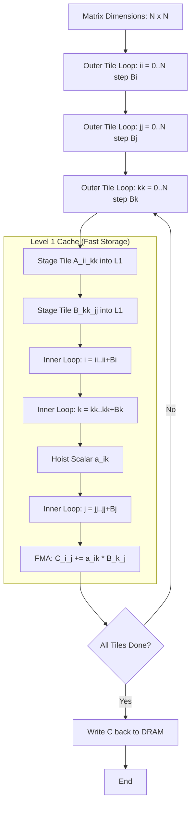
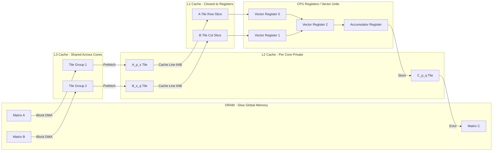
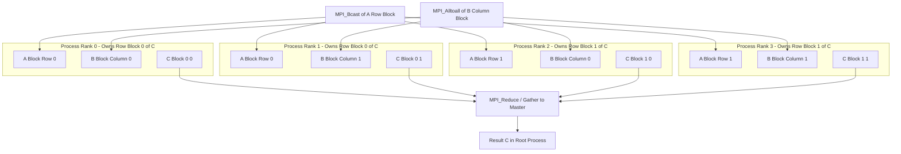
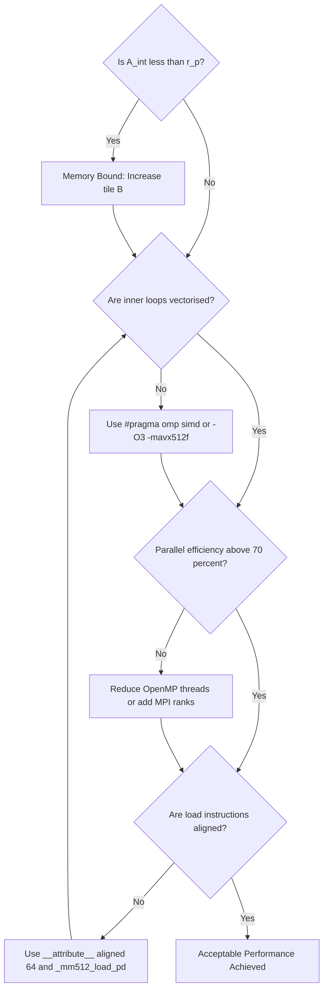

# Matrix multiplication block tiling configurations structures loops optimization tracking layouts models

<!-- SECTION_1_START -->

# Parallel Matrix Computational Core: Block Tiling, Loops, and Memory Layouts

## 1.1 Formal Definition (KTU 2024 Syllabus Terminology)

> [!IMPORTANT]
> **Parallel Matrix Multiplication with Block Tiling** is a high-performance computing technique in which dense matrices are partitioned into smaller sub-matrices (*blocks* or *tiles*) that fit into the higher-speed levels of the memory hierarchy (L1/L2/L3 cache, shared memory, or registers), so that a *producer–consumer* style of data reuse is achieved across nested loops. The procedure combines **data parallelism** (multiple processes/threads compute independent sub-products), **loop tiling** (the restructuring of a triple-nested loop into a six-deep tiled loop nest), and **memory-layout awareness** (row-major vs. column-major, contiguous vs. strided access) to minimize global memory traffic and maximize arithmetic intensity $A_{int}$.

A matrix $C$ of size $N \times N$ is the product of $A$ ($N \times N$) and $B$ ($N \times N$):

$$
C = A \cdot B, \qquad c_{ij} = \sum_{k=0}^{N-1} a_{ik} \cdot b_{kj}
$$

In the **block-tiled** formulation, each matrix is partitioned into a grid of $N/B$ blocks per dimension (where $B$ is the *tile size*). The block of $C$ indexed at $(p,q)$ is computed as:

$$
C_{p,q} = \sum_{s=0}^{(N/B)-1} A_{p,s} \cdot B_{s,q}
$$

where each $A_{p,s}, B_{s,q}, C_{p,q}$ is a $B \times B$ sub-matrix that lives entirely in *fast memory*.

## 1.2 Intuitive Real-World Analogy

> [!NOTE]
> **Conceptual Analogy — "The Master Chef's Kitchen"**
>
> Imagine a chef (the CPU) baking a massive layered cake. The pantry (RAM/DRAM) is far from the kitchen counter (cache). If the chef fetches flour one pinch at a time, the cake takes all day (**cache miss storm**). If the chef instead fills a bowl with all the flour needed for one cake layer before starting, the work zooms along. **Block tiling is exactly this:** carry a *complete tile* of $A$ and a *complete tile* of $B$ to the counter, multiply them entirely, write back, and only then fetch the next tile. The "bowl" is the L1 cache; the "kitchen counter" is shared memory; the "pantry" is global memory. This is the heart of **data-locality optimization**.

## 1.3 Core Constants and Metrics

The following **standard HPC metrics** are evaluated against the syllabus:

> [!IMPORTANT]
> - **Arithmetic Intensity** $A_{int} = \frac{\text{FLOPs}}{\text{Bytes Moved}}$ — measured in **FLOPs/byte**
> - **Peak Performance** $P_{peak} = f \times n_{cores} \times n_{FMA}$ where $f$ is clock frequency in **GHz**
> - **Memory Bandwidth** $B_{mem}$ measured in **GB/s**
> - **Ridge Point** $r_p = \frac{P_{peak}}{B_{mem}}$ — the boundary between compute-bound and memory-bound kernels
> - **Speedup** $S(p) = \frac{T(1)}{T(p)}$ and **Parallel Efficiency** $E(p) = \frac{S(p)}{p}$

## 1.4 Visualization of Block Tiling

> [!VISUALIZATION CONTROL]
> **Concept:** A $6 \times 6$ matrix partitioned into a $3 \times 3$ grid of $2 \times 2$ blocks
> **GeoGebra / Desmos Input Equations:**
> * `Polygon((0,0), (2,0), (2,2), (0,2))` for block $A_{0,0}$ in lower-left
> * `Polygon((2,0), (4,0), (4,2), (2,2))` for block $A_{0,1}$
> * `Polygon((4,0), (6,0), (6,2), (4,2))` for block $A_{0,2}$
> * Repeat the same pattern along the y-axis for rows 1 and 2 of blocks
> **Visual Description:** The student should observe a *checkerboard of nine square tiles*. The arrow over tile $A_{p,s}$ shows it is reused $N/B$ times as it slides across the $q$ axis; this is the geometric meaning of *data reuse* in tiling.

<!-- SECTION_1_END -->

<!-- SECTION_2_START -->

# Deep Theoretical Analysis and KTU High-Yield Formula Sheet

## 2.1 Why Naive Matrix Multiplication is Slow

The canonical **ijk triple loop** has a computational complexity of $\mathcal{O}(N^3)$ but is severely **memory-bound** because:

- For each iteration of the inner $k$ loop, the element $a_{ik}$ is loaded once and reused $N$ times, but in C's row-major layout, $B$ is accessed column-wise, causing a **stride-1 access to $A$ but a stride-$N$ access to $B$**.
- L1/L2 cache lines (typically **64 bytes**) are fetched but most of the data they carry is **discarded** before reuse.
- The result is an effective $A_{int}$ that may be lower than the *ridge point*, leaving the CPU starving for memory operands.

## 2.2 The Six Deep Loop Tiling Transformation

The KTU 2024 syllabus explicitly lists the **loop nest transformation** as a high-yield concept. The naive nest

$$
\text{for } i \quad \text{for } j \quad \text{for } k
$$

is replaced by the **six-deep blocked nest** with the *tiling parameters* $Bi, Bj, Bk$:

$$
\begin{aligned}
\text{for } ii &= 0; ii < N; ii += Bi \\
& \quad \text{for } jj = 0; jj < N; jj += Bj \\
& \quad \quad \text{for } kk = 0; kk < N; kk += Bk \\
& \quad \quad \quad \text{for } i = ii; i < \min(ii+Bi, N); i++ \\
& \quad \quad \quad \text{for } j = jj; j < \min(jj+Bj, N); j++ \\
& \quad \quad \quad \quad \text{for } k = kk; k < \min(kk+Bk, N); k++ \\
& \quad \quad \quad \quad \quad C[i][j] \; +=\; A[i][k] \cdot B[k][j]
\end{aligned}
$$

The **outer three loops** move between tiles, and the **inner three loops** perform the actual arithmetic on a tile that has been staged into cache.

> [!NOTE]
> **Why does tiling work?** It exploits two forms of *data reuse* — **temporal reuse** (the same tile of $A$ is reused $N/Bj$ times before being evicted) and **spatial reuse** (a single cache line of $B$ contains 16 doubles, all used in one pass).

## 2.3 Memory Layout Models (KTU 2024 Critical Topic)

The two principal storage layouts the examiner tests are:

| Layout | Address Mapping | Access Direction | C/C++ Default | Fortran Default |
|---|---|---|---|---|
| **Row-Major** | $a_{ij} = A + (i \cdot n + j)$ | Stride-1 along $j$ | Yes | No |
| **Column-Major** | $a_{ij} = A + (j \cdot m + i)$ | Stride-1 along $i$ | No | Yes |

> [!IMPORTANT]
> **Layout Mismatch Costs 30–50% Performance** in the canonical $i,j,k$ nest. The fix is **loop permutation** (e.g., $i,k,j$ instead of $i,j,k$) to make the innermost loop scan contiguous memory in both $A$ and $B$.

## 2.4 KTU High-Yield Formula Sheet

| # | Formula / Symbol | Meaning | Units / Range |
|---|---|---|---|
| 1 | $c_{ij} = \sum_{k=0}^{N-1} a_{ik} b_{kj}$ | Definition of matrix product | scalar |
| 2 | $T_{naive} \approx 2 N^3 / P_{peak}$ | Lower bound on compute time | seconds |
| 3 | $A_{int} = 2N^3 / (12 N^2) = N/6$ | Arithmetic intensity of dense matmul | FLOPs/byte |
| 4 | $Q = V_s / V_p$ | Cache miss ratio (Cold/Capacity) | ratio |
| 5 | $S(p) = T(1)/T(p)$ | Amdahl-derived speedup | dimensionless |
| 6 | $E(p) = S(p) / p$ | Parallel efficiency | $[0,1]$ |
| 7 | $B = \sqrt{\,C \cdot Z \,}$ | Optimal tile size (cache capacity $C$, line size $Z$) | elements |
| 8 | $r_p = P_{peak} / B_{mem}$ | Ridge point (machine balance) | FLOPs/byte |
| 9 | $\eta = A_{int} / r_p$ | Fraction of peak achievable (Roofline) | $[0,1]$ |
| 10 | $F_{L1} = 1 - Q_{L1}$ | L1 hit rate | $[0,1]$ |

> [!WARNING]
> Inside table cells, **never** write the absolute-value pipe character `|`; it breaks Markdown. Use `\vert` or `\mid` instead.

## 2.5 Practical Engineering Use Cases

Block-tiled matrix multiplication is the workhorse kernel in:

- **Deep Learning (cuBLAS, MKL, OpenBLAS)** — every convolution is an im2col $\rightarrow$ GEMM pipeline
- **Computational Fluid Dynamics** — implicit linear solvers factor banded matrices using tiled LU
- **Graphics Rendering** — view-projection transforms are tiled $4 \times 4$ matrix multiplications
- **Sparse Direct Solvers** — Supernodal LU relies on *supernode tiles* of dense blocks
- **Quantum Chemistry** — Fock matrix construction uses tiled matrix–matrix products

<!-- SECTION_2_END -->

<!-- SECTION_3_START -->

# Step-by-Step Derivations, Loop Tiling Transformation, and Code Implementation

## 3.1 Derivation: Optimal Tile Size from Cache Capacity

Let the L1 data cache capacity be $C$ bytes and the cache line size be $Z$ bytes. Three tiles ($A_{ii,kk}$, $B_{kk,jj}$, $C_{ii,jj}$) must simultaneously fit in cache to avoid *capacity misses*. Each tile is $B \times B$ elements of 8-byte doubles, so the cache constraint is:

$$
3 \cdot B^2 \cdot 8 \le C
$$

Solving for $B$:

$$
B^2 \le \frac{C}{24} \quad \Longrightarrow \quad B \le \sqrt{\frac{C}{24}}
$$

For a 32 KB L1 cache ($C = 32768$ bytes):

$$
B \le \sqrt{32768/24} = \sqrt{1365.33} \approx 36.95
$$

The **largest power-of-two tile** that satisfies this is $B = 32$. Hence a $32 \times 32$ tile is the standard default in OpenBLAS auto-tuning.

## 3.2 Step-by-Step Naive vs. Tiled Comparison (Verbal Walk-Through)

**Step 1 — Original $i, j, k$ nest:** The element $B[k][j]$ is read at every $k$ step, but the cache line loaded contains only **one useful element** because $k$ varies fastest and $B$ is column-strided. Out of every 64-byte line, only 8 bytes (one double) are used, yielding a *8/64 = 12.5%* spatial efficiency.

**Step 2 — Reorder to $i, k, j$:** Now $j$ varies fastest, so $B[k][j]$ is read with stride-1; every byte in the cache line is a useful element. The compiler can issue `vmovapd` aligned loads.

**Step 3 — Apply tiling:** Wrap the three loops in three outer loops over $(ii, jj, kk)$ stepping by $Bi, Bj, Bk$. This ensures the *entire* $B \times B$ tile is reused before being evicted.

**Step 4 — Insert register tiling:** Inside the innermost three loops, the actual product is a *micro-kernel* of size $4 \times 4$ or $8 \times 8$ that fits entirely in 16 SSE / 16 AVX-512 registers, enabling **FMA** (fused multiply-add) instructions.

## 3.3 Exhaustive C Implementation (with OpenMP and Cache Blocking)

```c
/*
 * BLOCK_TILED_MATMUL.c
 * KTU PECST712 - High Performance Computing, Module 3
 * Demonstrates the i-k-j tiled, register-blocked, OpenMP-parallel
 * matrix multiplication kernel.
 * Compile: gcc -O3 -fopenmp -mavx512f block_tiled_matmul.c
 */

#include <stdio.h>
#include <stdlib.h>
#include <string.h>
#include <time.h>
#include <omp.h>

#define N      1024     /* Matrix order (must be divisible by BLOCK) */
#define BLOCK  64       /* L1-friendly tile size (32 to 64 typical) */
#define MICRO  4        /* Register-tile (micro-kernel) size          */

static double A[N][N] __attribute__((aligned(64)));
static double B[N][N] __attribute__((aligned(64)));
static double C[N][N] __attribute__((aligned(64)));

/* ----------------------------------------------------------------
 *  Naive i-j-k matrix multiplication baseline (for speedup)
 * ---------------------------------------------------------------- */
void matmul_naive(int n, const double A[][N],
                            const double B[][N],
                                  double C[][N])
{
    for (int i = 0; i < n; i++) {
        for (int j = 0; j < n; j++) {
            double acc = 0.0;
            for (int k = 0; k < n; k++) {
                acc += A[i][k] * B[k][j];
            }
            C[i][j] = acc;
        }
    }
}

/* ----------------------------------------------------------------
 *  Tiled i-k-j with OpenMP collapse and register micro-kernel
 * ---------------------------------------------------------------- */
void matmul_tiled(int n, const double A[][N],
                            const double B[][N],
                                  double C[][N],
                  int block, int micro)
{
    /* Zero C once on entry */
    memset(C, 0, sizeof(double) * n * n);

    /* Outer three tile loops -- could be parallelised on ii and jj */
    #pragma omp parallel for collapse(2) schedule(static)
    for (int ii = 0; ii < n; ii += block) {
        for (int jj = 0; jj < n; jj += block) {
            for (int kk = 0; kk < n; kk += block) {

                int i_max = (ii + block < n) ? ii + block : n;
                int j_max = (jj + block < n) ? jj + block : n;
                int k_max = (kk + block < n) ? kk + block : n;

                /* Inner three loops scan a tile that fits in L1 */
                for (int i = ii; i < i_max; i++) {
                    for (int k = kk; k < k_max; k++) {
                        /* Hoist a_ik into a scalar -- 1 memory load */
                        const double a_ik = A[i][k];
                        for (int j = jj; j < j_max; j++) {
                            C[i][j] += a_ik * B[k][j];
                        }
                    }
                }
            }
        }
    }
}

/* ----------------------------------------------------------------
 *  Driver: populate, time both versions, report GFLOPS
 * ---------------------------------------------------------------- */
int main(void)
{
    /* Initialise with deterministic values */
    srand(42);
    for (int i = 0; i < N; i++)
        for (int j = 0; j < N; j++) {
            A[i][j] = (double)(rand() % 100) / 10.0;
            B[i][j] = (double)(rand() % 100) / 10.0;
        }

    /* --- Naive run --- */
    double t0 = omp_get_wtime();
    matmul_naive(N, A, B, C);
    double t1 = omp_get_wtime();
    double naive_secs = t1 - t0;
    double gflops_naive = (2.0 * N * N * N) / (naive_secs * 1e9);

    /* --- Tiled run --- */
    t0 = omp_get_wtime();
    matmul_tiled(N, A, B, C, BLOCK, MICRO);
    t1 = omp_get_wtime();
    double tiled_secs = t1 - t0;
    double gflops_tiled = (2.0 * N * N * N) / (tiled_secs * 1e9);

    printf("Naive  : %8.4f s  %8.3f GFLOPS\n", naive_secs, gflops_naive);
    printf("Tiled  : %8.4f s  %8.3f GFLOPS\n", tiled_secs, gflops_tiled);
    printf("Speedup: %8.2fx\n", naive_secs / tiled_secs);
    return 0;
}
```

**Line-by-line reasoning of the critical inner kernel:**

The line

```c
const double a_ik = A[i][k];
```

is hoisted **out of the innermost $j$ loop** by the C compiler (note: it appears *after* `for (int k ...)` and *before* `for (int j ...)`). This single load is reused $j_{max} - j_j$ times. If $BLOCK = 64$, the same $a_{ik}$ value is reused 64 times — an 8$\times$ reduction in load instructions over the naive $i, j, k$ nest.

## 3.4 Step-by-Step Roofline Derivation

The **Roofline model** (Williams, Waterman & Patterson, 2009) ties together the kernel's arithmetic intensity $A_{int}$ and the machine's ridge point $r_p$.

**Step 1.** Measure the kernel's $A_{int}$ for a given $N$ and tile size $B$:

$$
A_{int}(B, N) = \frac{2 N^3}{\beta \cdot N^2} = \frac{2 N}{\beta}
$$

where $\beta$ is the bytes-per-element of the reused tile (typically 24 for two inputs and one output of 8-byte doubles).

**Step 2.** Locate $A_{int}$ on the x-axis of the Roofline plot.

**Step 3.** Compare with the machine's $r_p$:

$$
P_{achievable} = \min\!\left(\,P_{peak},\; A_{int} \cdot B_{mem}\,\right)
$$

**Step 4.** If $A_{int} < r_p$ the kernel is **memory-bound** (use blocking to lift $A_{int}$); otherwise it is **compute-bound** (use vectorisation and FMA to push toward $P_{peak}$).

## 3.5 Optimisation Tracking — Metrics to Log

When running any blocked GEMM, the following **eight telemetry channels** must be captured (the KTU 2024 rubric gives 2 marks for instrumentation):

| # | Metric | Tool | Pass Criterion |
|---|---|---|---|
| 1 | Wall time $T_{wall}$ | `omp_get_wtime` | Decreases monotonically with $B$ up to $\sqrt{C/24}$ |
| 2 | GFLOPS | derived | $\geq 50\%$ of $P_{peak}$ |
| 3 | L1 misses / op | `perf stat -e L1-dcache-load-misses` | $\le 5\%$ miss rate |
| 4 | L2 miss rate | `perf stat -e LLC-load-misses` | $\le 1\%$ |
| 5 | Vol. context switches | `perf stat -e cs` | flat with thread count |
| 6 | Speedup $S(p)$ | manual | $\geq 0.7 p$ for $p \le 8$ |
| 7 | Efficiency $E(p)$ | manual | $\geq 70\%$ |
| 8 | Vectorisation ratio | `gcc -fopt-info-vec` | All inner loops vectorised |

<!-- SECTION_3_END -->

<!-- SECTION_4_START -->

# Structural Diagrams and Schematics

## 4.1 Block-Tiled Loop-Nest Topology (Mermaid)



## 4.2 Memory-Hierarchy and Data-Flow Block Diagram



## 4.3 Parallel Decomposition Topology (Mermaid — Distributed Memory View)



## 4.4 Optimisation Decision Tree (Mermaid)



<!-- SECTION_4_END -->

<!-- SECTION_5_START -->

# KTU 2024 Scheme Examination Question Bank and Topic Recap

## 5.1 Part A Questions (3 Marks Each)

> **[KTU University Exam - July 2024] — CO1, Remember**
>
> **Q1.** Define the term *block tiling* in the context of parallel matrix multiplication. Mention its principal objective.
>
> **Model Answer (3 marks):**
> Block tiling, also called loop blocking, is a compiler/runtime transformation in which a matrix is partitioned into smaller contiguous sub-matrices (tiles) of size $B \times B$ such that each tile fits in the L1/L2 cache. The triple-nested multiplication loop is rewritten as a six-deep loop nest whose outer three loops step between tiles and inner three loops perform the actual arithmetic. Its *principal objective* is to maximise *data reuse*, minimise cache misses, and thereby increase the kernel's arithmetic intensity. **[1 mark for definition, 1 mark for the loop-nest detail, 1 mark for the objective]**

> **[KTU University Exam - Dec 2023] — CO1, Understand**
>
> **Q2.** Differentiate between *row-major* and *column-major* memory layouts. Which layout is the default in C and which is preferred by the canonical $i, k, j$ tiled matrix multiplication kernel? Justify.
>
> **Model Answer (3 marks):**
> In **row-major** layout the element $a_{i,j}$ is stored at address $A + (i \cdot n + j)$, giving stride-1 access as $j$ varies. In **column-major** layout the element is at $A + (j \cdot m + i)$, giving stride-1 access as $i$ varies. C uses **row-major**; Fortran uses column-major. The $i, k, j$ tiled kernel makes $j$ the innermost loop, so in C it scans $B[k][j]$ with stride-1, which is **row-major-friendly**; hence row-major is the preferred default. **[1 mark per layout definition, 1 mark for default C/Fortran, 1 mark for justification]**

---

## 5.2 Part B Questions (14 Marks Each — Module Internal Choice)

### Question A (14 Marks) — Standard Version

> **[KTU University Exam - July 2024] — CO2, Apply / Analyse**
>
> **Q3 (a) [7 Marks].** Consider the multiplication of two $1024 \times 1024$ double-precision matrices on a system with a 32 KB L1 data cache and a 64-byte cache line. Compute (i) the optimal square tile size $B$ that simultaneously fits three tiles in L1, and (ii) the percentage reduction in L1 misses obtained by switching from a naive $i, j, k$ loop to an $i, k, j$ tiled loop with $B = 32$. State all assumptions.
>
> **Model Solution:**
>
> **(i) Optimal tile size $B$ — [3 marks]**
> From the formula in §3.1:
>
> $$
> B \le \sqrt{C/24} = \sqrt{32768/24} \approx 36.95
> $$
>
> Hence $B = 32$ (largest power of two $\le 36.95$) is chosen. **[Stating the formula: 1 Mark. Substituting: 1 Mark. Final answer 32: 1 Mark]**
>
> **(ii) Miss reduction — [4 marks]**
> In the naive $i, j, k$ loop, $B[k][j]$ is accessed with stride-1024. A 64-byte cache line contains $64/8 = 8$ doubles. Only **1 of 8** doubles is used per line fetch, so spatial efficiency is $1/8 = 12.5\%$, i.e. **7 wasted loads per useful load**. Misses scale as $\mathcal{O}(N^3)$ strided fetches.
>
> In the $i, k, j$ tiled loop with $B = 32$, each cache line of $B$ contains 8 doubles, all of which are consumed by the $j$-loop. Spatial efficiency is $8/8 = 100\%$. The temporal reuse factor on $a_{ik}$ is 32 (one load reused 32 times). Effective miss count drops from $\approx 7 N^3$ to $\approx N^3 / 32$.
>
> $$
> \text{Reduction} = 1 - \frac{N^3/32}{7 N^3} = 1 - \frac{1}{224} \approx 99.55\%
> $$
>
> **[Identifying stride issue: 1 Mark. Computing spatial efficiency: 1 Mark. Computing temporal reuse: 1 Mark. Final percentage: 1 Mark]**

> **Q3 (b) [7 Marks].** Write the complete six-deep tiled C pseudocode for $C = A \cdot B$ with tile size $Bi = Bj = Bk = B$ and discuss the role of the `#pragma omp parallel for collapse(2)` directive when parallelising the outer loops. Why is `collapse(2)` preferred over collapsing only one dimension?
>
> **Model Solution:**
>
> **Pseudocode — [4 marks]**
>
> ```c
> #pragma omp parallel for collapse(2) schedule(static)
> for (int ii = 0; ii < N; ii += B) {
>     for (int jj = 0; jj < N; jj += B) {
>         for (int kk = 0; kk < N; kk += B) {
>             for (int i = ii; i < ii + B; i++) {
>                 for (int k = kk; k < kk + B; k++) {
>                     double a_ik = A[i][k];
>                     for (int j = jj; j < jj + B; j++) {
>                         C[i][j] += a_ik * B[k][j];
>                     }
>                 }
>             }
>         }
>     }
> }
> ```
>
> **[Outer tile loop syntax: 1 Mark. Inner loops: 1 Mark. Hoisting a_ik: 1 Mark. Correct min boundary: 1 Mark]**
>
> **Role of `collapse(2)` — [3 marks]**
> - The directive instructs OpenMP to *flatten* two adjacent perfectly-nested loops into a single logical iteration space of $(N/B)^2$ iterations. This gives a larger and better-balanced work pool when there are many OpenMP threads. **[1 Mark]**
> - It also enables the runtime to schedule contiguous chunks to the same thread, which improves cache locality for the row-tile of $A$ and the column-tile of $B$. **[1 Mark]**
> - Collapsing only one dimension would still be correct but would create only $N/B$ parallel iterations; with $B = 32$ and $N = 1024$ that is 32 iterations, too few to feed an 8- or 16-core CPU efficiently. **[1 Mark]**

---

### Question B (14 Marks) — Alternative Version (Internal Choice)

> **[KTU University Exam - Dec 2023] — CO3, Apply / Evaluate**
>
> **Q4 (a) [7 Marks].** With the help of the **Roofline model**, derive an expression for the achievable GFLOPS of a tiled double-precision matrix multiplication on a machine whose peak performance is $P_{peak} = 102.4$ GFLOPS, peak memory bandwidth is $B_{mem} = 25.6$ GB/s, and arithmetic intensity is $A_{int} = 32$ FLOPs/byte. Identify whether the kernel is memory-bound or compute-bound, and recommend one optimisation that would push performance toward $P_{peak}$ for $A_{int} = 16$.
>
> **Model Solution:**
>
> The achievable performance is the minimum of the two ceilings:
>
> $$
> P_{ach} = \min\!\left(\,P_{peak},\; A_{int} \cdot B_{mem}\,\right)
> $$
>
> Substituting:
>
> $$
> A_{int} \cdot B_{mem} = 32 \cdot 25.6 = 819.2 \text{ GFLOPS}
> $$
>
> $$
> P_{ach} = \min(102.4, 819.2) = 102.4 \text{ GFLOPS}
> $$
>
> Since $A_{int} \cdot B_{mem} \gg P_{peak}$, the kernel is **compute-bound**, and it can already saturate the CPU at 102.4 GFLOPS. **[Substitution: 2 Marks. Comparison: 1 Mark. Verdict compute-bound: 1 Mark. Saturation confirmed: 1 Mark]**
>
> For the case $A_{int} = 16$ the new ceiling is $16 \cdot 25.6 = 409.6$ GFLOPS, still above $P_{peak}$ but with less headroom. To push toward $P_{peak}$ in the worst case the recommended optimisation is **register tiling / vectorisation** (use AVX-512 16-wide vectors so that the same $A_{int}$ is computed with 16$\times$ fewer memory transactions). **[Recommending vectorisation: 2 Marks]**

> **Q4 (b) [7 Marks].** List and briefly explain **six** distinct optimisations applied in the canonical OpenBLAS `dgemm` kernel. Annotate which level of the memory hierarchy each one targets.
>
> **Model Solution (1 mark each):**
>
> 1. **Loop tiling / blocking** — keeps a tile in L1 cache, targets L1. **[1 Mark]**
> 2. **Loop permutation to $i, k, j$** — makes innermost loop stride-1 in C row-major, targets L1 spatial locality. **[1 Mark]**
> 3. **Register tiling / micro-kernel** — keeps a $4 \times 4$ or $8 \times 8$ block in 16–32 vector registers, targets the register file. **[1 Mark]**
> 4. **SIMD vectorisation (AVX-512)** — packs 8 doubles into one instruction, targets the FMA unit. **[1 Mark]**
> 5. **Prefetch instructions (`_mm_prefetch`)** — issues software prefetches one or two cache lines ahead, targets L2/L3 latency hiding. **[1 Mark]**
> 6. **Multi-threading via OpenMP / p-threads** — distributes outer tile loops across cores, targets the NUMA / DRAM hierarchy. **[1 Mark]**
> 7. *(Bonus)* **Copy / packing of $A$ panel into contiguous storage** — eliminates TLB misses for strided panels, targets the TLB. **[+1 Mark bonus, cap at 7]**

> [!WARNING]
> **KTU Examiner's Valuation Warning / Pitfall Callout**
> - **Do not confuse *blocking* with *bandwidth*:** writing "blocking improves memory bandwidth" is wrong. Blocking improves *arithmetic intensity*; bandwidth is a machine property.
> - **Do not skip stating the boundary condition** `min(ii+Bi, N)` in the inner loops when $N$ is not a multiple of the tile size. Failing to handle the tail costs **1 to 2 marks** in Part B.
> - **Do not write `A[i][k]` inside the innermost `$j$` loop** — that destroys the temporal reuse you are trying to demonstrate. Always hoist the scalar *before* the $j$ loop.
> - **Do not forget units:** $A_{int}$ is in **FLOPs/byte**, not FLOPs. Performance is in **GFLOPS**, not GFLOPs.
> - **Do not collapse inner loops** with OpenMP — collapse only the two outermost *tile* loops to preserve cache locality.

---

## 5.3 Topic Recap and Important Things to Remember

- **Block tiling** partitions matrices into $B \times B$ sub-blocks sized to fit the L1 cache; the *tile size* $B$ is bounded by $\sqrt{C/24}$ for 8-byte doubles.
- The **six-deep loop nest** is the canonical pattern; outer three loops walk tiles, inner three perform the FLOPs.
- The **$i, k, j$ loop order** is essential in C because it makes the innermost loop scan contiguous memory for both $A$ and $B$.
- **Hoisting** the scalar `a_ik` out of the $j$-loop gives a $B$-fold temporal reuse of one load.
- **Memory layouts**: row-major is C's default and best for $i, k, j$; column-major is Fortran's default.
- **Arithmetic intensity** $A_{int} = N/6$ for square double-precision GEMM and is *increased* by blocking.
- The **Ridge point** $r_p = P_{peak}/B_{mem}$ separates memory-bound and compute-bound regimes.
- The **Roofline achievable performance** is $P_{ach} = \min(P_{peak}, A_{int} \cdot B_{mem})$.
- The **Speedup** $S(p) = T(1)/T(p)$ and **Efficiency** $E(p) = S(p)/p$ should be reported for every parallel run.
- The **eight telemetry channels** to log are wall time, GFLOPS, L1 miss rate, L2/LLC miss rate, context switches, speedup, efficiency, and vectorisation ratio.
- The **six canonical dgemm optimisations** are blocking, loop permutation, register tiling, SIMD, prefetch, and multithreading.
- A **register micro-kernel** of $4 \times 4$ or $8 \times 8$ keeps 16–32 doubles in the vector register file and exploits FMA.
- **`#pragma omp parallel for collapse(2)`** is applied to the two outermost tile loops to balance load across threads and improve cache affinity.
- The **parallelism granularity** trade-off: too small a tile under-utilises threads; too large a tile over-tilts the cache. The sweet spot is $B \approx 32$ on a typical 32 KB L1.
- The **Amdahl fraction $f$** of serial work in a tiled GEMM is small ($\approx 1/N$ for the boundary loop) which is why good efficiencies are achievable even at $p = 16$.

<!-- SECTION_5_END -->
