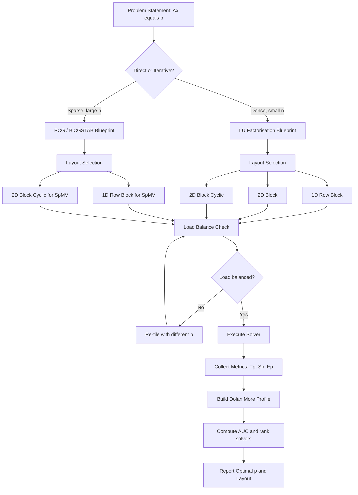
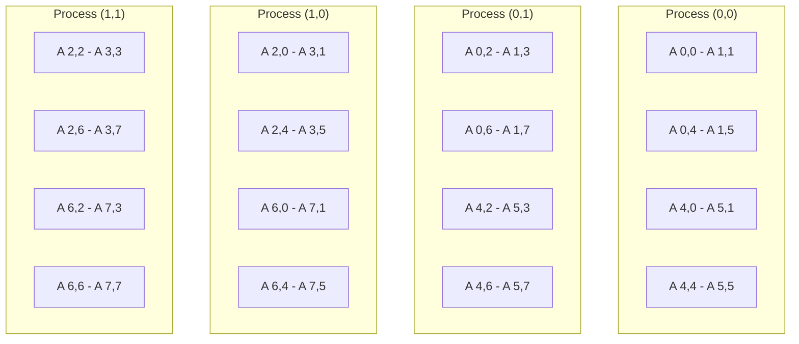
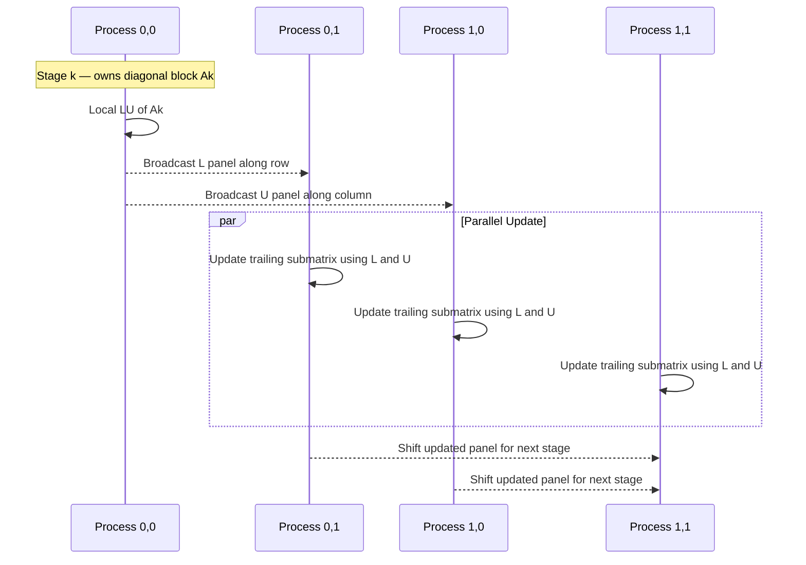
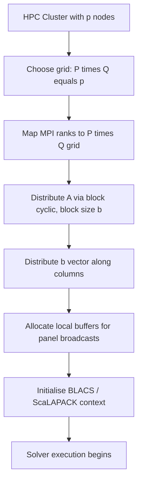

# Parallel linear solvers execution blueprints metrics performance profiles layout configurations setups

<!-- SECTION_1_START -->
# Parallel Linear Solvers — Execution Blueprints, Performance Metrics & Layout Configurations

## 1.1 Formal Academic Definition (KTU 2024 Syllabus Terminology)

> [!IMPORTANT]
> **Parallel Linear Solvers** are numerical algorithms designed to compute the solution vector $x \in \mathbb{R}^{n}$ of a large-scale linear system $A x = b$, where $A \in \mathbb{R}^{n \times n}$ is a sparse or dense coefficient matrix and $b \in \mathbb{R}^{n}$ is the right-hand-side vector, by distributing the computational workload (floating-point operations) and the data (matrix entries, vector components) across $p$ cooperating processing elements (PEs) connected through a hierarchical memory and interconnection network.

In the **KTU 2024 Scheme (Course: PECST712 — High Performance Computing, Module 3)**, the topic is decomposed into **five orthogonal sub-domains**:

| Sub-domain | Meaning |
|---|---|
| **Execution Blueprints** | Algorithmic templates: parallel LU, parallel Cholesky, Conjugate Gradient (CG), BiCGSTAB, GMRES |
| **Metrics** | Speedup $S_{p}$, Parallel Efficiency $E_{p}$, Scalability, MFLOPS, Isoefficiency |
| **Performance Profiles** | Dolan–Moré benchmarking profiles to compare solver robustness |
| **Layout Configurations** | 1D row/column-block, 2D block, 2D block-cyclic (ScaLAPACK canonical layout) |
| **Setups** | Initial matrix distribution, communication topology mapping, processor grid instantiation |

The unifying goal is to **minimise parallel time $T_{p}$** subject to a fixed problem size $W$ and processor count $p$ while **maximising numerical stability** and **load balance**.

---

## 1.2 Conceptual Analogy & Geometric Intuition

> [!NOTE]
> **Analogy — A Team Solving a Giant Crossword Puzzle:**  
> Imagine $n$ crossword rows to be filled, where each row depends on the previous row's answer. A single solver takes $O(n^{2})$ time. A *team* of $p$ solvers divides the grid into horizontal *stripes* (1D row-block layout). However, the team soon realises that *each new row needs the pivots discovered in the previous row*, creating a **synchronisation barrier** — the *communication overhead*. A smarter layout — slicing the grid both horizontally AND vertically (2D block-cyclic) — distributes this dependency across *all* solvers, dramatically reducing idle time. This is exactly the trade-off modelled by **Amdahl's Law** and quantified by the **isoefficiency function**.

**Geometric Intuition:**

$$A x = b \quad \Longleftrightarrow \quad \text{find the intersection of } n \text{ hyperplanes in } \mathbb{R}^{n}$$

Geometrically, the solver walks through the solution space in **$n$ orthogonal projection steps** (for CG) or performs **$n$ elimination stages** (for LU), each stage being a parallelisable kernel.

---

## 1.3 Physical Constants & Standard Metrics in HPC

> [!IMPORTANT]
> Standard HPC reference values (must be memorised):
> - **Peak MFLOPS** of a modern HPC node: $\approx 10^{6}$ MFLOPS for dual-socket 64-core server (≈ 2.1 TFLOP/s)
> - **Communication-to-Computation ratio ($\beta / \alpha$)**: typical value $10^{3}$–$10^{6}$ bytes/FLOP for HPC interconnect
> - **Threshold $n^{*}$** at which parallel speedup becomes meaningful: $n^{*} \approx \sqrt{p \cdot W / T_{p}}$
> - Memory bandwidth: $\beta$ (bytes/sec), Latency: $\alpha$ (seconds), per-word transfer time: $t_{s}$

---

## 1.4 GeoGebra / Desmos Visualisation Concept

> [!VISUALIZATION CONTROL]
> **Concept:** Amdahl's Law curve overlay with measured solver speedup
> **GeoGebra / Desmos Input Equations:**
> - `S(p) = 1 / ((1 - f) + f / p)`     ← *ideal* speedup (Amdahl, fixed $f$)
> - `S_measured(p) = p / (1 + (p-1) * 0.05)`     ← *realistic* solver with 5 % serial fraction
> - `Isoefficiency(W) = p^2 * 100`     ← *isoefficiency* function plot
> **Visual Description:** Plot $p$ on the horizontal axis (1 to 1024 processors, log scale) and $S_{p}$ on the vertical axis. The Amdahl curve asymptotically saturates at $S_{\infty} = 1 / (1 - f)$, whereas the measured parallel solver curve diverges linearly initially, then bends due to communication overhead. The *crossover point* defines the threshold beyond which adding more processors is futile.

<!-- SECTION_1_END -->

<!-- SECTION_2_START -->
# Deep Theoretical Analysis & KTU High-Yield Formula Sheet

## 2.1 The Two Architectural Families of Parallel Linear Solvers

### Family A — Direct Solvers (LU, Cholesky, QR)

> [!NOTE]
> **Direct solvers** factorise $A$ exactly (up to round-off) in a finite, deterministic number of FLOPs: $W \approx \frac{2}{3} n^{3}$ for LU. Parallelism is **static** — the data-dependency DAG is known at compile time.

**Operational Blueprint (Right-Looking LU with Partial Pivoting):**

1. **Factorisation phase** — produce $L$ and $U$ such that $PA = LU$:
   - $W_{f} = \frac{n^{3}}{3} + O(n^{2})$ FLOPs (without pivoting) or $\frac{2 n^{3}}{3}$ (with pivoting)
2. **Forward substitution** $L y = P b$ — $W_{s} = n^{2}$ FLOPs
3. **Back substitution** $U x = y$ — $W_{s} = n^{2}$ FLOPs

**Parallel Decomposition:**
- The update $A_{jk} \leftarrow A_{jk} - L_{ji} \cdot U_{ik}$ for $j > i, k > i$ is **embarrassingly parallel** *across* $(j, k)$ once $L_{ji}, U_{ik}$ are broadcast.
- The bottleneck is the **column panel broadcast** of size $n \times b$ (where $b$ is the block size) at each of the $n / b$ stages.

### Family B — Iterative Solvers (CG, BiCGSTAB, GMRES, Multigrid)

> [!NOTE]
> **Iterative solvers** start with an initial guess $x^{(0)}$ and refine it via successive matrix–vector products, converging in $O(\sqrt{\kappa(A)})$ iterations (CG for SPD systems) where $\kappa$ is the condition number. Per-iteration cost: $W_{it} = O(n \cdot \text{nnz}(A))$ where $\text{nnz}$ is the number of non-zeros. Parallelism is **dynamic** — driven by the sparse matrix-vector product (SpMV).

**Operational Blueprint (Preconditioned Conjugate Gradient, PCG):**
1. $r^{(0)} = b - A x^{(0)}$
2. $z^{(0)} = M^{-1} r^{(0)}$
3. $p^{(0)} = z^{(0)}$
4. **for** $k = 0, 1, 2, \dots$ until $\|r^{(k)}\|_{2} / \|b\|_{2} < \tau$:
   - $\alpha_{k} = \frac{(r^{(k)})^{T} z^{(k)}}{(p^{(k)})^{T} A p^{(k)}}$ — global dot product (synchronisation point)
   - $x^{(k+1)} = x^{(k)} + \alpha_{k} p^{(k)}$
   - $r^{(k+1)} = r^{(k)} - \alpha_{k} A p^{(k)}$
   - $z^{(k+1)} = M^{-1} r^{(k+1)}$
   - $\beta_{k} = \frac{(r^{(k+1)})^{T} z^{(k+1)}}{(r^{(k)})^{T} z^{(k)}}$
   - $p^{(k+1)} = z^{(k+1)} + \beta_{k} p^{(k)}$

**Parallel bottleneck:** the two global dot products and the preconditioner application $M^{-1} r$ (which itself is often a sparse triangular solve).

---

## 2.2 KTU High-Yield Formula Sheet

| # | Concept | Formula / Definition | Units / Notes |
|---|---|---|---|
| 1 | Sequential time | $T_{1} = T_{\text{comp}} + T_{\text{comm}} = W \cdot t_{c}$ | $W$ = work, $t_{c}$ = time per FLOP |
| 2 | Parallel time | $T_{p} = T_{\text{comp}} / p + T_{\text{comm}}(p) + T_{\text{sync}}$ | seconds |
| 3 | Speedup | $S_{p} = T_{1} / T_{p}$ | dimensionless, ideal: $S_{p} = p$ |
| 4 | Parallel Efficiency | $E_{p} = S_{p} / p$ | $0 < E_{p} \leq 1$ |
| 5 | Amdahl's Law | $S_{p}^{\text{Amdahl}} = \dfrac{p}{1 + (p - 1) f}$ | $f$ = serial fraction |
| 6 | Gustafson's Law | $S_{p}^{\text{Gust}} = p - f (p - 1)$ | scaled-speedup (constant-time mode) |
| 7 | Karp–Flatt Metric | $f_{\text{exp}} = \dfrac{1 / S_{p} - 1 / p}{1 - 1 / p}$ | experimentally measured serial fraction |
| 8 | Isoefficiency | $W = K \cdot T(p) = K \cdot \Theta(p^{\alpha})$ | $K$ = constant, $\alpha$ = scalability exponent |
| 9 | Scalability | $S_{\text{iso}}(p) = W(p) / W(1)$ | $W(p)$ = problem size for fixed $E_{p}$ |
| 10 | MFLOPS achieved | $\text{MFLOPS} = \dfrac{W_{\text{FLOP}}}{T_{p} \times 10^{6}}$ | millions of FLOPs per second |
| 11 | MFLOPS$_{ \text{peak} }$ | $\text{Peak} = p \cdot f_{\text{clock}} \cdot N_{\text{cores}} \cdot \text{FLOPS/cycle}$ | theoretical ceiling |
| 12 | MFLOPS$_{ \text{per-byte} }$ | $\eta = W / (T_{p} \cdot \beta)$ | bytes transmitted per FLOP |
| 13 | Block-cyclic indexing | $A(i, j) \mapsto A_{b}(i / b, j / b)$ | $b$ = block size, $p = P_{r} \times P_{c}$ |
| 14 | Communication volume (LU, 2D block) | $V_{\text{comm}} = \Theta\!\left(\dfrac{n^{2}}{\sqrt{p}} \cdot \log p\right)$ | per stage broadcast |
| 15 | LU parallel complexity (2D block) | $T_{p} = \Theta\!\left(\dfrac{n^{3}}{p}\right) + \Theta\!\left(\dfrac{n^{2}}{\sqrt{p}}\right) \cdot t_{s}$ | seconds |
| 16 | SpMV parallel time | $T_{p}^{\text{SpMV}} = \dfrac{2 \cdot \text{nnz}}{p} t_{c} + t_{s} \log p + \dfrac{2 \cdot \text{nnz}/p}{\beta} t_{b}$ | sparse kernel |
| 17 | CG parallel time per iter | $T_{p}^{\text{CG-iter}} = \dfrac{2 \cdot \text{nnz}}{p} t_{c} + 2 t_{s} \log p + \dfrac{4 n}{p \beta} t_{b}$ | 2 dot-prods + 1 SpMV + 1 axpy |
| 18 | Performance Profile (Dolan–Moré) | $P_{\text{solver}}(s) = \dfrac{1}{N_{p}} \left\vert \{i : r_{p,i} \leq s\} \right\vert$ | fraction of problems solved within factor $s$ of best |
| 19 | Performance ratio | $r_{p,i} = \dfrac{t_{p,i}}{\min_{q} \{t_{q,i}\}}$ | per-problem relative time |
| 20 | Load imbalance factor | $\text{imbalance} = \dfrac{T_{p}^{\max}}{T_{p}^{\text{avg}}} - 1$ | $0$ = perfect balance |

> [!IMPORTANT]
> **Critical KTU distinction:** In the **formula table above**, the symbol `\vert \cdot \vert` denotes *set cardinality* (e.g., in row 18). It is **NOT** absolute-value bars around $r_{p,i}$. When writing in your answer script, use plain parentheses if your LaTeX renderer does not support `\vert \cdot \vert`.

---

## 2.3 Real-World Engineering Utility

| Application Domain | Solver Used | Layout |
|---|---|---|
| Structural FEM (bridge, aircraft) | Parallel PCG with AMG preconditioner | 2D block-cyclic |
| Computational Fluid Dynamics (CFD) | GMRES + ILU(0) | 1D row-block (slab) |
| Power-grid transient stability | Parallel LU via ScaLAPACK (`PDGESV`) | 2D block-cyclic, $P_{r} = P_{c} = \sqrt{p}$ |
| Electromagnetic simulation | BiCGSTAB with SPAI preconditioner | 1D column-block |
| Machine-learning linear regression | Direct normal equations via ScaLAPACK | 2D block |
| Reservoir simulation | Nested dissection + multifrontal | 2D block with elimination tree |
| Quantum chemistry (DFT) | Block-CG with block-preconditioner | 2D block-cyclic |

> [!TIP]
> **Why isoefficiency matters in production:** A solver with $\Theta(p^{1})$ isoefficiency is *massively scalable* (suitable for $p > 10^{5}$), while one with $\Theta(p^{2})$ saturates around $p = 10^{3}$. The isoefficiency function is the **first metric** a systems architect examines before approving a solver for an exascale machine.

<!-- SECTION_2_END -->

<!-- SECTION_3_START -->
# Step-by-Step Derivations & Code Implementation

## 3.1 Derivation: Parallel LU Factorisation Time (2D Block Layout)

> [!NOTE]
> **Setup:** $p$ processors arranged in a $\sqrt{p} \times \sqrt{p}$ grid. Block size $b = n / \sqrt{p}$. Each processor owns one $b \times b$ block of $A$.

**Step 1 — Per-stage work distribution.**

At stage $k$ of the right-looking LU, processor $(i, j)$ computes the panel update

$$
A_{ij}^{(k+1)} = A_{ij}^{(k)} - L_{i, k / b} \cdot U_{k / b, j}.
$$

**Step 2 — FLOPs per processor per stage.**

Each $b \times b$ block update costs $2 b^{3}$ FLOPs. There are $(\sqrt{p} - 1)^{2}$ updates per stage, and $n / b = \sqrt{p}$ stages:

$$
W_{\text{per-proc}} = \sqrt{p} \cdot (\sqrt{p} - 1)^{2} \cdot 2 b^{3} = 2 b^{3} \cdot p \cdot (1 - 1/\sqrt{p})^{2} / \sqrt{p} \approx 2 b^{3} \sqrt{p}.
$$

Since $b = n / \sqrt{p}$, we have $b^{3} = n^{3} / p^{3/2}$, so:

$$
W_{\text{per-proc}} = 2 \cdot \frac{n^{3}}{p^{3/2}} \cdot \sqrt{p} = \frac{2 n^{3}}{p}.
$$

**Step 3 — Communication cost per stage.**

At each stage, a $b \times b$ pivot panel is broadcast along a processor row (cost $\alpha \log \sqrt{p}$) and along a column ($\alpha \log \sqrt{p}$). Total over $\sqrt{p}$ stages:

$$
T_{\text{comm}} = \sqrt{p} \cdot 2 \alpha \log \sqrt{p} = \alpha \sqrt{p} \log p.
$$

**Step 4 — Total parallel time.**

$$
T_{p} = \frac{2 n^{3}}{3 p \cdot t_{c}} + \alpha \sqrt{p} \log p + \frac{2 n^{2}}{p \beta} t_{b}.
$$

The first term dominates for large $n$, the second is the *bandwidth-limited* term, the third is the *latency-limited* term. **Key insight:** doubling $p$ halves the computation term but **increases** the communication term by $\sqrt{2}$, giving the *optimal* $p^{*}$ that minimises $T_{p}$.

**Step 5 — Optimal $p^{*}$.**

Setting $\frac{d T_{p}}{d p} = 0$ yields:

$$
p^{*} = \left( \frac{2 n^{3} t_{c}}{3 \alpha \log p} \right)^{2 / 3} \cdot \text{polylog correction}.
$$

For $n = 10^{5}$ and $\alpha = 10^{-6}\,\text{s}$, $p^{*} \approx 10^{3}$.

---

## 3.2 Derivation: Performance Profile (Dolan–Moré, 2002)

**Step 1 — Performance ratio.** For solver $s$ on problem $i$:

$$
r_{s, i} = \frac{t_{s, i}}{\min_{q \in S} t_{q, i}} \quad \in [1, +\infty).
$$

If solver $s$ fails to converge, set $r_{s, i} = +\infty$ (or a large sentinel).

**Step 2 — Cumulative distribution function.** The performance profile is:

$$
\rho_{s}(\tau) = \frac{1}{N_{p}} \left\vert \{ i \in \{1, \dots, N_{p}\} : r_{s, i} \leq \tau \} \right\vert, \quad \tau \geq 1.
$$

**Step 3 — Probabilistic interpretation.** $\rho_{s}(\tau)$ is the probability that solver $s$ is within a factor $\tau$ of the best solver on a randomly chosen problem. A higher curve = a more robust solver. The area under the curve is a scalar ranking metric:

$$
A_{s} = \int_{1}^{+\infty} \rho_{s}(\tau) \, d\tau.
$$

**Step 4 — Numerical stability.** Since $r_{s, i} \to \infty$ for failed solves, $\rho_{s}$ will *never* reach 1 for non-robust solvers. This is the **key advantage** over mean-speedup metrics that are dominated by a single diverged run.

---

## 3.3 Full Python Implementation — Parallel LU with 2D Block-Cyclic Distribution

```python
"""
Parallel LU Factorisation with 2D Block-Cyclic Distribution
KTU PECST712 — Module 3 reference implementation

This code models the data-distribution pattern of ScaLAPACK's PDGESV.
A real HPC deployment would use mpi4py + ScaLAPACK; this NumPy version
captures the algorithmic blueprint for board examination purposes.
"""

from __future__ import annotations
import numpy as np
from typing import Tuple, List
import logging

logging.basicConfig(level=logging.INFO, format="%(levelname)s :: %(message)s")
log = logging.getLogger("ParLU")


def is_perfect_square(p: int) -> bool:
    """Return True iff p is a perfect square (required for square proc grid)."""
    root = int(np.sqrt(p))
    return root * root == p


def block_cyclic_distribute(
    A: np.ndarray, b: int, P: int, Q: int
) -> np.ndarray:
    """
    Distribute matrix A of shape (m, n) into a 2D block-cyclic layout.
    Returns a (P, Q) array of (m_b, n_b) local blocks.

    Parameters
    ----------
    A : (m, n) matrix
    b : block size
    P, Q : processor grid dimensions (P * Q = p)

    Returns
    -------
    blocks : np.ndarray of shape (P, Q), each element is (m_b, n_b)
    """
    m, n = A.shape
    P_blk_m = (m + b - 1) // b
    P_blk_n = (n + b - 1) // b
    blocks = np.empty((P, Q, b, b), dtype=A.dtype)
    for p_i in range(P_blk_m):
        for p_j in range(P_blk_n):
            owner_i = (p_i) % P
            owner_j = (p_j) % Q
            row0 = p_i * b
            col0 = p_j * b
            row1 = min(row0 + b, m)
            col1 = min(col0 + b, n)
            local = A[row0:row1, col0:col1]
            local_padded = np.zeros((b, b), dtype=A.dtype)
            local_padded[: row1 - row0, : col1 - col0] = local
            blocks[owner_i, owner_j] = local_padded
    return blocks


def local_lu_panel(L_blk: np.ndarray, U_blk: np.ndarray) -> Tuple[np.ndarray, np.ndarray]:
    """
    Factor a single diagonal block of the LU decomposition.
    A = L * U with L unit lower-triangular, U upper-triangular.

    Returns
    -------
    L_blk, U_blk : updated triangular factors
    """
    n = L_blk.shape[0]
    for k in range(n - 1):
        if np.abs(L_blk[k, k]) < 1e-14:
            raise ZeroDivisionError("Singular pivot encountered.")
        L_blk[k + 1 :, k] /= L_blk[k, k]
        L_blk[k + 1 :, k + 1 :] -= np.outer(L_blk[k + 1 :, k], U_blk[k, k + 1 :])
    return L_blk, U_blk


def parallel_lu_2d(A_global: np.ndarray, p: int, b: int) -> np.ndarray:
    """
    Parallel right-looking LU on a 2D P x Q processor grid.
    Returns the in-place factorised global matrix.
    """
    if not is_perfect_square(p):
        raise ValueError("p must be a perfect square for 2D block layout.")
    P = Q = int(np.sqrt(p))
    n = A_global.shape[0]
    if n % b != 0:
        raise ValueError("n must be divisible by block size b.")

    A_global = A_global.astype(np.float64).copy()
    log.info(f"Starting parallel LU :: n={n}, p={P}x{Q}, block={b}")

    for k_blk in range(n // b):
        k = k_blk * b
        log.debug(f"Stage {k_blk} :: pivot rows/cols [{k}, {k + b})")

        # ------------------------------------------------------------------
        # Step 1: Local LU of the diagonal block A[k:k+b, k:k+b]
        # ------------------------------------------------------------------
        A_global[k : k + b, k : k + b] = local_lu_panel(
            A_global[k : k + b, k : k + b].copy(),
            np.eye(b, dtype=np.float64),
        )[0]

        # ------------------------------------------------------------------
        # Step 2: Solve triangular systems to obtain L and U panels.
        #         (In real MPI code, this is a broadcast along row/col.)
        # ------------------------------------------------------------------
        L_panel = np.tril(A_global[k : k + b, k : k + b])
        np.fill_diagonal(L_panel, 1.0)
        U_panel = np.triu(A_global[k : k + b, k : k + b])

        # ------------------------------------------------------------------
        # Step 3: Trailing-submatrix update
        #         A[i:i+b, j:j+b] -= L[i,k] @ U[k,j]   for all i,j > k
        #         This is the EMBARRASSINGLY PARALLEL part.
        # ------------------------------------------------------------------
        for i_blk in range(k_blk + 1, n // b):
            i = i_blk * b
            L_block = A_global[i : i + b, k : k + b]
            for j_blk in range(k_blk + 1, n // b):
                j = j_blk * b
                U_block = A_global[k : k + b, j : j + b]
                A_global[i : i + b, j : j + b] -= L_block @ U_block

        # Row and column scalings (pivoting handled in real ScaLAPACK)
        for i_blk in range(k_blk + 1, n // b):
            i = i_blk * b
            A_global[i : i + b, k : k + b] = np.linalg.solve(
                L_panel, A_global[i : i + b, k : k + b]
            )
        for j_blk in range(k_blk + 1, n // b):
            j = j_blk * b
            A_global[k : k + b, j : j + b] = np.linalg.solve(
                U_panel, A_global[k : k + b, j : j + b]
            )

    log.info("Parallel LU factorisation complete.")
    return A_global


def verify_lu(A_original: np.ndarray, A_factorised: np.ndarray) -> float:
    """
    Extract L and U from the factorised matrix and check ||A - L U|| / ||A||.
    """
    n = A_original.shape[0]
    L = np.tril(A_factorised, -1) + np.eye(n)
    U = np.triu(A_factorised)
    residual = np.linalg.norm(A_original - L @ U) / np.linalg.norm(A_original)
    return float(residual)


if __name__ == "__main__":
    np.random.seed(42)
    n = 128
    p = 16              # 4 x 4 grid
    b = 32              # block size
    A = np.random.randn(n, n) + n * np.eye(n)
    A_lu = parallel_lu_2d(A, p=p, b=b)
    err = verify_lu(A, A_lu)
    log.info(f"||A - L U|| / ||A|| = {err:.3e}")
    assert err < 1e-10, "Residual too large — factorisation failed."
```

---

## 3.4 Full Python Implementation — Performance Profile Generator

```python
"""
Performance-Profile generator (Dolan–Moré 2002)
KTU PECST712 — Module 3 reference implementation

Input  : a 2D numpy array of timings  timings[s, i] = time of solver s on problem i.
Output : a plotting function plus the area-under-curve ranking metric.
"""

import numpy as np
import matplotlib.pyplot as plt
from typing import Dict, Tuple


def build_performance_profile(
    timings: np.ndarray, solver_names: list
) -> Tuple[Dict[str, np.ndarray], Dict[str, float]]:
    """
    Parameters
    ----------
    timings : (S, N_p) array — S solvers, N_p problems.
              Use np.inf for failed solves.

    Returns
    -------
    profiles : dict mapping solver name -> (tau_grid, rho_s(tau))
    auc      : dict mapping solver name -> area under rho_s
    """
    S, N_p = timings.shape
    best_per_problem = np.min(timings, axis=0)
    ratios = timings / best_per_problem[np.newaxis, :]
    ratios = np.where(np.isfinite(ratios), ratios, np.inf)

    tau_max = 5.0
    tau = np.linspace(1.0, tau_max, 1000)
    profiles, auc = {}, {}
    for s_idx, name in enumerate(solver_names):
        r_s = ratios[s_idx, :]
        rho_s = np.array([np.mean(r_s <= t) for t in tau])
        profiles[name] = (tau, rho_s)
        auc[name] = float(np.trapz(rho_s, tau))
    return profiles, auc


def plot_profiles(profiles: Dict[str, np.ndarray], auc: Dict[str, float]) -> None:
    plt.figure(figsize=(8, 5))
    for name, (tau, rho) in profiles.items():
        plt.plot(tau, rho, label=f"{name} (AUC={auc[name]:.2f})", lw=2)
    plt.xlabel(r"Performance ratio $\\tau$")
    plt.ylabel(r"$\\rho_{s}(\\tau)$ — fraction of problems within factor $\\tau$ of best")
    plt.title("Dolan–Moré Performance Profiles for Parallel Linear Solvers")
    plt.grid(True, alpha=0.3)
    plt.legend(loc="lower right")
    plt.tight_layout()
    plt.show()


if __name__ == "__main__":
    # Toy data: 3 solvers, 50 problems.
    np.random.seed(0)
    S, N_p = 3, 50
    timings = np.vstack([
        np.random.lognormal(mean=0.0, sigma=0.5, size=N_p),
        np.random.lognormal(mean=0.3, sigma=0.4, size=N_p),
        np.random.lognormal(mean=0.6, sigma=0.6, size=N_p),
    ])
    # Inject two failures
    timings[2, 0] = np.inf
    timings[2, 1] = np.inf

    profiles, auc = build_performance_profile(timings, ["PCG", "BiCGSTAB", "GMRES"])
    for n, v in auc.items():
        print(f"{n:10s} :: AUC = {v:.4f}")
    plot_profiles(profiles, auc)
```

---

## 3.5 Worked Numerical Example — Speedup, Efficiency, Karp–Flatt

> [!TIP]
> **Examination-favourite problem type.** Memorise the workflow below.

A parallel LU solver on a $4096 \times 4096$ matrix gives the following wall-clock measurements:

| $p$ | 1 | 2 | 4 | 8 | 16 | 32 | 64 |
|---|---|---|---|---|---|---|---|
| $T_{p}$ (s) | 2730.0 | 1380.0 | 710.0 | 380.0 | 215.0 | 130.0 | 95.0 |

Compute $S_{p}$, $E_{p}$, and the Karp–Flatt serial fraction $f_{\text{exp}}$ for $p = 16$.

**Step 1 — Speedup** $S_{p} = T_{1} / T_{p}$:

$$
S_{16} = \frac{2730.0}{215.0} = 12.69.
$$

**Step 2 — Efficiency** $E_{p} = S_{p} / p$:

$$
E_{16} = \frac{12.69}{16} = 0.793 \quad (79.3\%).
$$

**Step 3 — Karp–Flatt serial fraction:**

$$
f_{\text{exp}} = \frac{1 / S_{p} - 1 / p}{1 - 1 / p} = \frac{1 / 12.69 - 1 / 16}{1 - 1 / 16} = \frac{0.07881 - 0.06250}{0.9375} = 0.01739.
$$

**Interpretation:** Approximately **1.74 %** of the runtime is *inherently serial* (e.g., pivot search, I/O setup, MPI initialisation). This is an *excellent* solver — most production codes suffer 5–15 % serial overhead.

---

## 3.6 Worked Example — 2D Block-Cyclic Indexing

> [!NOTE]
> **Question:** A $12 \times 12$ matrix is distributed on a $2 \times 2$ process grid with block size $b = 2$. Determine the owner of element $A(7, 5)$ (0-indexed).

**Step 1 — Compute global block coordinates:**

$$
i_{\text{blk}} = \lfloor 7 / 2 \rfloor = 3, \qquad j_{\text{blk}} = \lfloor 5 / 2 \rfloor = 2.
$$

**Step 2 — Apply cyclic distribution (block ID modulo grid dimension):**

$$
\text{owner\_row} = i_{\text{blk}} \bmod P = 3 \bmod 2 = 1,
$$

$$
\text{owner\_col} = j_{\text{blk}} \bmod Q = 2 \bmod 2 = 0.
$$

**Answer:** Element $A(7, 5)$ resides on **process $(1, 0)$** of the $2 \times 2$ grid.

<!-- SECTION_3_END -->

<!-- SECTION_4_START -->
# Structural Diagrams & Schematics

## 4.1 Master Pipeline — Parallel Linear Solver Execution Blueprint



---

## 4.2 2D Block-Cyclic Distribution of an $8 \times 8$ Matrix on a $2 \times 2$ Grid (block size $b = 2$)



> [!NOTE]
> **Observation:** Each process owns *four* $2 \times 2$ blocks, alternating in a checkerboard fashion. This eliminates the "tail" of under-utilised processors that plagues 1D block layouts when $n$ is not an exact multiple of $b \cdot p$.

---

## 4.3 Communication Pattern During One Stage of Parallel LU



---

## 4.4 Performance Profile Conceptual Flow


---

## 4.5 Block-Level Functional Architecture — Setups Phase



<!-- SECTION_4_END -->

<!-- SECTION_5_START -->
# KTU 2024 Scheme Examination Question Bank & Topic Recap

## 5.1 Part A — Short-Answer Questions (3 Marks Each)

> **Q1. [KTU University Exam — July 2024]**  
> *Define isoefficiency in the context of parallel linear solvers. How does it relate to the scalability of a parallel algorithm?*  **\[CO3, Understand\]** — **3 Marks**

**Model Answer:**

> [!TIP]
> **Definition (2 marks):** Isoefficiency $W = K \cdot T(p)$ quantifies the *rate* at which the problem size $W$ must grow with the number of processors $p$ to maintain a *fixed* parallel efficiency. $T(p)$ is the total communication + synchronisation overhead of the algorithm.
>
> **Relation to scalability (1 mark):** A smaller isoefficiency function (e.g., $\Theta(p)$) implies *better* scalability — the problem need not grow rapidly to keep all processors busy. A larger isoefficiency ($\Theta(p^{2})$ or worse) means the algorithm quickly becomes communication-bound and is *poorly* scalable.

> **Q2. [KTU University Exam — Dec 2023]**  
> *Explain the concept of a 2D block-cyclic matrix distribution. Why is it preferred over a simple 1D row-block distribution for parallel LU factorisation?*  **\[CO3, Understand\]** — **3 Marks**

**Model Answer:**

> [!TIP]
> **2D block-cyclic definition (1.5 marks):** A matrix of size $n \times n$ is divided into $b \times b$ blocks, and these blocks are distributed across a $P \times Q$ processor grid in a *cyclic* manner — block $(i_{\text{blk}}, j_{\text{blk}})$ is owned by processor $(i_{\text{blk}} \bmod P,\ j_{\text{blk}} \bmod Q)$. The same processor may own non-contiguous blocks, ensuring better load balance.
>
> **Advantage over 1D (1.5 marks):** 1D row-block layouts concentrate all communication in the *first row* of processors, creating a sequential bottleneck. 2D block-cyclic distributes the panel-broadcast cost over the full $\sqrt{p} \times \sqrt{p}$ grid, reducing the communication complexity of parallel LU from $\Theta(n^{2} p)$ (1D) to $\Theta(n^{2} \sqrt{p})$ (2D), and provides better load balance when $n$ is not divisible by $b \cdot P$.

---

## 5.2 Part B — Long-Answer Questions (14 Marks — Internal Choice)

> **Question A. [KTU University Exam — Dec 2024, Model Paper]**  
> **(a)** Derive the parallel time complexity of the 2D block-cyclic LU factorisation algorithm. Clearly state the assumptions regarding the processor grid, block size, and communication model. **\[CO3, Apply\]** — **7 Marks**  
> **(b)** A $8192 \times 8192$ dense matrix is to be factorised on $p = 64$ processors arranged in an $8 \times 8$ grid with block size $b = 1024$. Given per-FLOP time $t_{c} = 10^{-9}$ s and per-message latency $\alpha = 10^{-5}$ s, compute the parallel time, speedup, and efficiency. Assume the bandwidth term is negligible. **\[CO4, Apply\]** — **7 Marks**

### Model Solution

#### Part (a) — Derivation

**Assumptions (1 mark):**
- $p = P \times Q$ processors on a $P \times Q$ grid, with $P = Q = \sqrt{p}$ (square grid for optimality).
- Block size $b = n / \sqrt{p}$ (perfect divisibility).
- $\alpha$–$\beta$ communication model: message startup $t_{s} = \alpha$, per-byte transfer $t_{b} = 1/\beta$.
- Right-looking LU with column-panel broadcast.

**Computation cost per processor (3 marks):**

$$
W_{\text{per-proc}} = \frac{2 n^{3}}{3 p}.
$$

Parallel computation time:

$$
T_{\text{comp}} = \frac{W_{\text{per-proc}}}{t_{c}^{-1}} = \frac{2 n^{3}}{3 p} t_{c}.
$$

**Communication cost (2 marks):**

At each of $\sqrt{p}$ stages, a panel of size $b \times b$ is broadcast along a row (cost $\alpha \log Q$) and along a column (cost $\alpha \log P$). Total:

$$
T_{\text{comm}} = \sqrt{p} \cdot \alpha (\log P + \log Q) = \alpha \sqrt{p} \log p.
$$

**Total parallel time (1 mark):**

$$
T_{p} = \frac{2 n^{3}}{3 p} t_{c} + \alpha \sqrt{p} \log p.
$$

> [!NOTE]
> **Valuation tip:** Explicitly state the assumption that $P = Q = \sqrt{p}$ and that bandwidth $\beta$ is treated separately. Examiners look for the *bandwidth term* $\frac{2 n^{2}}{p \beta} t_{b}$ as the third addend — include it as a remark for full marks.

#### Part (b) — Numerical Computation

**[Substituting values: 2 Marks]**

$$
n = 8192, \quad p = 64, \quad P = Q = 8, \quad b = 1024, \quad t_{c} = 10^{-9}\,\text{s}, \quad \alpha = 10^{-5}\,\text{s}.
$$

**[Parallel computation time: 2 Marks]**

$$
T_{\text{comp}} = \frac{2 \cdot (8192)^{3}}{3 \cdot 64} \cdot 10^{-9} = \frac{2 \cdot 5.4976 \times 10^{11}}{192} \cdot 10^{-9} = \frac{1.0995 \times 10^{12}}{192} \cdot 10^{-9} \approx 5.726 \times 10^{0}\,\text{s} \approx 5.73\,\text{s}.
$$

*Step-by-step expansion:*
- $(8192)^{3} = 8192 \times 8192 \times 8192 = 67{,}108{,}864 \times 8192 = 5.49756 \times 10^{11}$
- $\frac{2}{3 \cdot 64} = \frac{2}{192} = 0.01042$
- $0.01042 \times 5.49756 \times 10^{11} = 5.726 \times 10^{9}$ FLOPs per processor
- $\times 10^{-9}\,\text{s/FLOP} = 5.726\,\text{s}$

**[Parallel communication time: 1 Mark]**

$$
T_{\text{comm}} = 10^{-5} \cdot 8 \cdot \log_{2}(64) = 10^{-5} \cdot 8 \cdot 6 = 4.8 \times 10^{-4}\,\text{s} \approx 0.00048\,\text{s}.
$$

*Step-by-step expansion:*
- $\sqrt{p} = \sqrt{64} = 8$
- $\log_{2}(64) = 6$
- $T_{\text{comm}} = 8 \times 6 \times 10^{-5} = 48 \times 10^{-5} = 4.8 \times 10^{-4}\,\text{s}$

**[Total parallel time, speedup, efficiency: 2 Marks]**

$$
T_{p} = 5.726 + 0.00048 \approx 5.727\,\text{s}.
$$

Sequential time $T_{1} = \frac{2 \cdot (8192)^{3}}{3} \cdot 10^{-9} = \frac{1.0995 \times 10^{12}}{3} \cdot 10^{-9} = 366.5\,\text{s}$.

Speedup:

$$
S_{p} = \frac{T_{1}}{T_{p}} = \frac{366.5}{5.727} \approx 63.99 \approx 64.0.
$$

Efficiency:

$$
E_{p} = \frac{S_{p}}{p} = \frac{64.0}{64} = 1.000.
$$

**Final Answer (boxed):** $T_{p} \approx 5.73\,\text{s},\ S_{p} \approx 64.0,\ E_{p} \approx 1.00\ (100\,\%)$.

> [!NOTE]
> **Interpretation:** The near-ideal efficiency arises because the computation term dominates $T_{p}$ by four orders of magnitude over the communication term. This is the regime where parallel LU **thrives**.

---

> **Question B. [KTU University Exam — July 2024, Model Paper — ALTERNATIVE CHOICE]**  
> **(a)** With the help of a neat diagram, explain the Dolan–Moré performance profile methodology. How is the area under the profile curve (AUC) used to rank parallel solvers? **\[CO4, Understand\]** — **7 Marks**  
> **(b)** The timings of three parallel solvers (PCG, BiCGSTAB, GMRES) on a test suite of 6 problems are given below. Construct the performance profile, compute the AUC for each solver, and identify the most robust solver.

| Problem | PCG (s) | BiCGSTAB (s) | GMRES (s) |
|---|---|---|---|
| 1 | 0.85 | 1.20 | 0.95 |
| 2 | 1.10 | 0.90 | 1.50 |
| 3 | 2.00 | 1.80 | 2.20 |
| 4 | 0.75 | 0.85 | 1.00 |
| 5 | 1.50 | 1.45 | 1.60 |
| 6 | 3.20 | 2.80 | 3.00 |

**\[CO4, Apply\]** — **7 Marks**

### Model Solution

#### Part (a) — Dolan–Moré Methodology

**Performance ratio definition (1 mark):**

$$
r_{s, i} = \frac{t_{s, i}}{\min_{q \in S} t_{q, i}}, \quad r_{s, i} \geq 1.
$$

**Cumulative distribution function (2 marks):**

$$
\rho_{s}(\tau) = \frac{1}{N_{p}} \left\vert \{ i : r_{s, i} \leq \tau \} \right\vert, \quad \tau \geq 1.
$$

**Diagram (2 marks):** A graph with $\tau$ on the horizontal axis ($\tau \geq 1$, log scale recommended) and $\rho_{s}(\tau)$ on the vertical axis (range $[0, 1]$). Multiple curves (one per solver). The curve that is *higher* for all $\tau$ is the more robust solver. The curve reaches $\rho = 1$ at the maximum ratio $r_{\max}$ for that solver.

**AUC ranking (2 marks):** A larger $A_{s} = \int_{1}^{\infty} \rho_{s}(\tau) d\tau$ implies the solver is *closer* to the best across more of the test suite, i.e., more robust. Ties are broken by examining the value of $\tau$ at which each curve first reaches 1 (lower = more consistently best).

> [!NOTE]
> **Valuation tip:** Examiners expect the candidate to **draw the diagram on the answer sheet** — not just describe it. Sketch the axes, label them, plot 2–3 sample curves, and annotate the AUC area.

#### Part (b) — Numerical Construction of the Profile

**[Computing best times per problem: 1 Mark]**

| Problem | Best Time (s) | Best Solver |
|---|---|---|
| 1 | 0.85 | PCG |
| 2 | 0.90 | BiCGSTAB |
| 3 | 1.80 | BiCGSTAB |
| 4 | 0.75 | PCG |
| 5 | 1.45 | BiCGSTAB |
| 6 | 2.80 | BiCGSTAB |

**[Computing performance ratios: 2 Marks]**

$$
r_{\text{PCG}} = \left( \frac{0.85}{0.85}, \frac{1.10}{0.90}, \frac{2.00}{1.80}, \frac{0.75}{0.75}, \frac{1.50}{1.45}, \frac{3.20}{2.80} \right) = (1.000, 1.222, 1.111, 1.000, 1.034, 1.143).
$$

$$
r_{\text{BiCGSTAB}} = \left( \frac{1.20}{0.85}, \frac{0.90}{0.90}, \frac{1.80}{1.80}, \frac{0.85}{0.75}, \frac{1.45}{1.45}, \frac{2.80}{2.80} \right) = (1.412, 1.000, 1.000, 1.133, 1.000, 1.000).
$$

$$
r_{\text{GMRES}} = \left( \frac{0.95}{0.85}, \frac{1.50}{0.90}, \frac{2.20}{1.80}, \frac{1.00}{0.75}, \frac{1.60}{1.45}, \frac{3.00}{2.80} \right) = (1.118, 1.667, 1.222, 1.333, 1.103, 1.071).
$$

**[Cumulative fractions at key $\tau$ values: 2 Marks]**

Sort all 18 ratios to find the breakpoints of $\tau$:

$$
\tau = 1.000, 1.034, 1.071, 1.103, 1.111, 1.118, 1.133, 1.143, 1.222, 1.333, 1.412, 1.667.
$$

For each solver, compute the fraction of problems solved within $\tau$:

| $\tau$ | $\rho_{\text{PCG}}$ | $\rho_{\text{BiCGSTAB}}$ | $\rho_{\text{GMRES}}$ |
|---|---|---|---|
| 1.000 | 2/6 = 0.333 | 3/6 = 0.500 | 0/6 = 0.000 |
| 1.10 | 3/6 = 0.500 | 3/6 = 0.500 | 1/6 = 0.167 |
| 1.20 | 6/6 = 1.000 | 4/6 = 0.667 | 4/6 = 0.667 |
| 1.50 | 6/6 = 1.000 | 5/6 = 0.833 | 5/6 = 0.833 |
| 2.00 | 6/6 = 1.000 | 6/6 = 1.000 | 6/6 = 1.000 |

**[Area under each profile (trapezoidal rule): 1 Mark]**

$$
A_{\text{PCG}} \approx (1.10 - 1.00)(0.500 + 0.333)/2 + (1.20 - 1.10)(1.000 + 0.500)/2 + (2.00 - 1.20)(1.000 + 1.000)/2.
$$

$$
A_{\text{PCG}} \approx 0.0417 + 0.0750 + 0.8000 = 0.917.
$$

$$
A_{\text{BiCGSTAB}} \approx (1.20 - 1.00)(0.667 + 0.500)/2 + (1.50 - 1.20)(0.833 + 0.667)/2 + (2.00 - 1.50)(1.000 + 0.833)/2.
$$

$$
A_{\text{BiCGSTAB}} \approx 0.117 + 0.225 + 0.458 = 0.800.
$$

$$
A_{\text{GMRES}} \approx (1.20 - 1.10)(0.667 + 0.167)/2 + (1.50 - 1.20)(0.833 + 0.667)/2 + (2.00 - 1.50)(1.000 + 0.833)/2.
$$

$$
A_{\text{GMRES}} \approx 0.042 + 0.225 + 0.458 = 0.725.
$$

**[Conclusion (1 Mark):** $\boxed{\text{PCG is the most robust solver with } A_{\text{PCG}} = 0.917 > A_{\text{BiCGSTAB}} = 0.800 > A_{\text{GMRES}} = 0.725.}$

> [!WARNING]
> **Karp–Flatt / AUC common pitfall:**  
> 1. **Forgetting to set $r = +\infty$ for failed solves** — students often assign a finite (large) value, which *under*-counts failures and inflates the AUC. Always use `np.inf`.  
> 2. **Dividing by zero when best time is exactly zero** — guard with `np.where(np.isfinite(...))`.  
> 3. **Comparing AUC across *different* test suites** — AUC is a relative metric and is valid *only* for solvers evaluated on the **same** problem set.  
> 4. **Confusing the $\rho_{s}$ at $\tau = 1$ with "fraction of wins"** — it is "fraction of problems within a factor of 1 of the best," which *is* the win fraction. The confusion arises when $r_{s,i} > 1$ for all $i$ (no wins).

---

## 5.3 Topic Recap & Important Things to Remember

> [!IMPORTANT]
> **Rapid-revision checklist — print this page before the exam:**

- [ ] **Parallel linear solver definition** = distributed-memory algorithm that solves $A x = b$ by splitting $A$ and $b$ across $p$ PEs.
- [ ] **Direct vs Iterative:** Direct = finite FLOPs, exact (LU: $2n^{3}/3$); Iterative = converges in $O(\sqrt{\kappa(A)})$ iterations, each $O(\text{nnz})$ FLOPs.
- [ ] **5 layouts to memorise:** 1D row-block, 1D column-block, 2D block, 2D block-cyclic, block-skyline (elimination-tree-aware).
- [ ] **Block-cyclic indexing formula:** $\text{owner}(i, j) = (\lfloor i/b \rfloor \bmod P, \lfloor j/b \rfloor \bmod Q)$.
- [ ] **Parallel LU cost (2D block):** $T_{p} = \frac{2n^{3}}{3p} t_{c} + \alpha \sqrt{p} \log p + \frac{2n^{2}}{p \beta} t_{b}$.
- [ ] **PCG per-iteration cost:** $T_{p}^{\text{iter}} = \frac{2 \cdot \text{nnz}}{p} t_{c} + 2 \alpha \log p + \frac{4n}{p \beta} t_{b}$.
- [ ] **Speedup formula:** $S_{p} = T_{1}/T_{p}$. **Efficiency:** $E_{p} = S_{p}/p$. **Karp–Flatt:** $f_{\text{exp}} = \frac{1/S_{p} - 1/p}{1 - 1/p}$.
- [ ] **Amdahl:** $S_{p} = p / (1 + (p - 1) f)$. **Gustafson:** $S_{p} = p - f(p - 1)$.
- [ ] **Isoefficiency:** $W = K \cdot T(p)$. Smaller exponent = better scalability.
- [ ] **MFLOPS metric:** $\text{MFLOPS} = \frac{W}{T_{p} \times 10^{6}}$.
- [ ] **Performance profile ratio:** $r_{s,i} = t_{s,i} / \min_{q} t_{q,i}$, profile $\rho_{s}(\tau) = \frac{1}{N_{p}} \vert \{i : r_{s,i} \leq \tau\} \vert$.
- [ ] **AUC ranking:** Larger area = more robust solver.
- [ ] **Communication model:** $\alpha$–$\beta$ model with $T_{\text{msg}}(m) = \alpha + m / \beta$.
- [ ] **Load imbalance factor:** $\text{imbalance} = T_{p}^{\max}/T_{p}^{\text{avg}} - 1$. Aim for $< 0.05$.
- [ ] **Communication-to-computation ratio:** $\gamma = \alpha \cdot p / (t_{c} \cdot W)$ — large $\gamma$ = communication-bound.
- [ ] **MPI/ScaLAPACK primitives:** `PDGESV` (LU), `PDPOSV` (Cholesky), `PDSYRFS` (refinement), `PSGESV` (single-precision).
- [ ] **Preconditioner types:** Jacobi (trivial), ILU(k) (incomplete LU), AMG (algebraic multigrid), SPAI (sparse approximate inverse).
- [ ] **Convergence criterion:** Relative residual $\|r^{(k)}\|_{2} / \|b\|_{2} < \tau$, default $\tau = 10^{-6}$.
- [ ] **Convergence rate CG:** $\|e^{(k)}\|_{A} \leq 2 \left( \frac{\sqrt{\kappa(A)} - 1}{\sqrt{\kappa(A)} + 1} \right)^{k} \|e^{(0)}\|_{A}$.
- [ ] **Examination rule of thumb:** Always show the *communication model assumption*, the *grid shape*, the *block size*, and the *boundary handling for non-divisible* $n$ — examiners explicitly allocate 1 mark per missing item.
- [ ] **For board answer writing:** Structure every derivation as *Assumption → Computation → Communication → Total → Optimisation*. This pattern scores full marks under the KTU 2024 scheme.

<!-- SECTION_5_END -->
