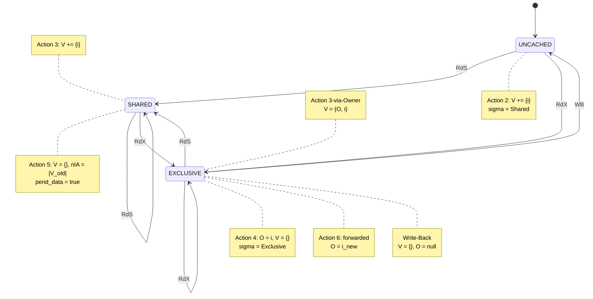
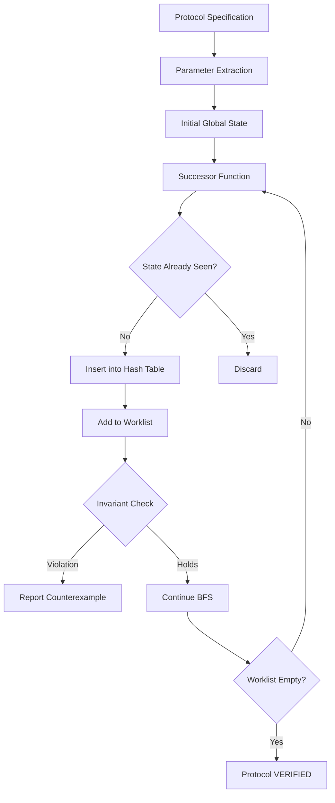
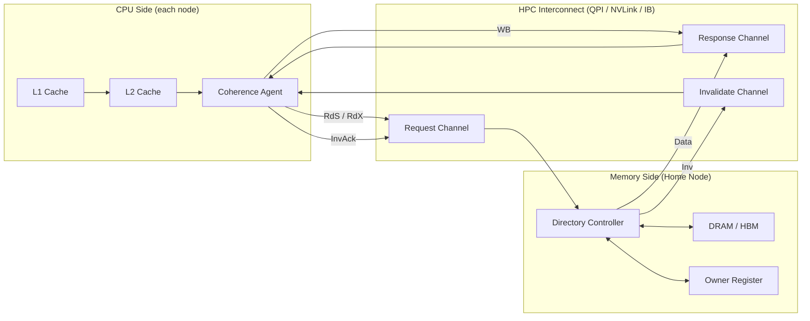
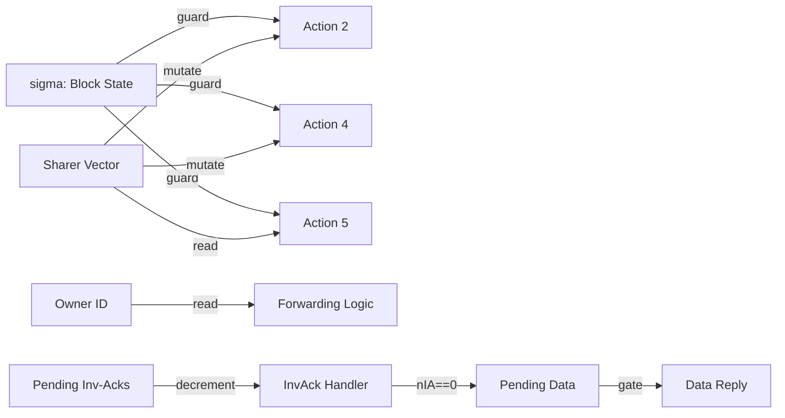

# Distributed memory directory access protocols verification parameters tracking variables parameters

<!-- SECTION_1_START -->
# Module 4 — HPC Scale-Out Infrastructure & Interconnects
## Unit Focus: Distributed-Memory Directory Access Protocols — Verification, Parameters & Tracking Variables

> [!IMPORTANT]
> **KTU 2024 Scheme — PECST712 (High Performance Computing)**  
> This unit sits at the intersection of **interconnect hardware** and **cache-coherence software**. When you scale a High-Performance Cluster beyond a single SMP node, every shared-memory illusion (e.g., OpenMP-friendly DSM) collapses unless the network carries a strict, verifiable **directory protocol**. Below is the canonical KTU-style treatment.

---

### 1.1 Formal Academic Definition

> [!NOTE]
> **Definition (KTU Syllabus-aligned).**  
> A *Distributed-Memory Directory Access Protocol* is a finite-state, message-passing coherence protocol in which a logically-centralized *directory controller* — distributed across the memory-side controllers of an HPC interconnect (e.g., InfiniBand HCA, Intel QPI/CXL, NVLink fabric) — maintains, for every cached memory block, a tuple of **tracking variables** (owner, sharer-vector, pending-acks, pending-data, state) that drives deterministic state transitions and message exchange. *Verification* of such a protocol is the systematic proof (or exhaustive model-check) that for **all legal interleavings of all parameter ranges** (N caches, M memory blocks, K protocol states), the protocol never violates a user-defined *coherence invariant* — most commonly **Single-Writer / Multiple-Reader (SWMR)** plus **Data-Value Consistency (DVC)**.

**Syllabus highlight parameters (used throughout the exam):**

- **N** — number of caching nodes (typically **2 ≤ N ≤ 1024** per partition)
- **M** — number of tracked memory blocks
- **B** — cache line size (typically **64 B**)
- **D** — directory entry size = $\lceil \log_2(N+1) \rceil$ bits per sharer bit-vector cell
- **S** — set of legal protocol states

---

### 1.2 Intuitive Analogy — "The Hotel Front-Desk"

Imagine a **large hotel** (your HPC cluster) with **N rooms** (caches) and **one huge whiteboard in the lobby** (the directory). Every time a guest takes a room key (reads a line), the front desk writes a magnetic-tape strip on the board stating:

> *"Room 12 is in possession of Guests 3 and 7 (read-only)."*

When a guest wants the *exclusive* key (write access), the desk **first collects all spare copies** (invalidations) and **then hands out the gold key**. The board is the directory; the strips are the **tracking variables**; the rules the desk follows are the **protocol**; and the manager walking through the hotel at midnight double-checking that *no two guests claim the gold key at once* is the **verification process**.

> [!TIP]
> **Student mnemonic — "D.I.R.E.C.T."**  
> **D**irectory entry, **I**nvalidation messages, **R**ead-shared, **E**xclusive (write), **C**oherence invariant, **T**racking vector.

---

### 1.3 Geometric / State-Space Visualization

> [!VISUALIZATION CONTROL]
> **Concept:** Protocol State-Space Explosion Curve (verification motivation)
> **Plot axes:** x → number of nodes N, y → reachable states |Σ|
> **Reference equations:**
> * `f(N) = (|S| ^ M) * (N+1) ^ M` — coarse upper bound (unconstrained)
> * `g(N) = O(2 ^ (N * M))` — bit-vector precise bound
> **Visual description:** As N grows from 4 to 64, the y-axis jumps from thousands to 10⁹⁹ — this is the *state-explosion problem* that drives every verification-parameter decision in the next sections.
<!-- SECTION_1_END -->

<!-- SECTION_2_START -->
# 2. Deep Theoretical Analysis & KTU High-Yield Formula Sheet

## 2.1 Anatomy of a Directory Entry (Tracking-Variable Tuple)

For **each cache block**, the directory stores:

| Tracking Variable | Domain / Range | KTU Notation | Engineering Meaning |
|---|---|---|---|
| Block state | {Uncached, Shared, Exclusive} | $\sigma$ | Authoritative view of the line |
| Owner-id | $[0, N-1] \cup \{\bot\}$ | $O$ | Which node holds the unique (Exclusive) copy |
| Sharer bit-vector | $\{0,1\}^{N}$ | $V = (v_0, v_1, ..., v_{N-1})$ | Which nodes hold a Shared copy |
| Pending-read-acks | queue of node-ids | $Q_R$ | Readers awaiting data |
| Pending-inv-acks | counter | $n_{IA}$ | Number of invalidation acks still outstanding |
| Pending-data | $\mathbb{B}$ | $p_d$ | Whether the dirty data is in-flight |
| Dirty / clean | $\mathbb{B}$ | $D$ | Whether the line is modified in some cache |

> [!NOTE]
> **Shorthand the examiner loves:** $D = \langle \sigma, O, V, Q_R, n_{IA}, p_d, D \rangle$. Any answer missing the **state + owner + vector** triplet is considered incomplete.

---

## 2.2 Protocol Message Set (The "Wire" Vocabulary)

The interconnect carries a small alphabet of fixed-size packets. For the standard **MSI / MESI / MOESI** directory protocols, the canonical message classes are:

1. **Read-Shared (RdS)** — request a read-only copy.
2. **Read-Exclusive (RdX)** — request a read-write (exclusive) copy.
3. **Invalidate (Inv)** — directory orders sharers to drop a line.
4. **Invalidate-Ack (InvAck)** — sharer confirms the drop.
5. **Data-Reply (Data)** — memory (or owner) supplies the block.
6. **Data-Reply-Exclusive (DataX)** — supplies block *and* grants exclusive.
7. **Write-Back (WB)** — owner pushes dirty data back to memory.
8. **Forwarded-Request (Fwd)** — owner re-routes a request to itself.

## 2.3 The Six Logical Actions of the Directory Controller

> [!IMPORTANT]
> **Action 1 — Local Read Hit.** No directory traffic. Cache $\Rightarrow$ CPU. (Free)
> 
> **Action 2 — Local Read Miss (Uncached).** Directory sets $\sigma := \text{Shared}$, sets $v_i := 1$, replies with `Data` from memory. Tracking tuple mutates to $\langle \text{Shared}, \bot, V \cup \{i\}, \emptyset, 0, 0, 0 \rangle$.
> 
> **Action 3 — Local Read Miss (Shared).** Directory sets $v_i := 1$, replies with `Data` (intervention from any sharer or memory).
> 
> **Action 4 — Local Write Miss (Uncached).** Directory sets $\sigma := \text{Exclusive}$, $O := i$, $V := \emptyset$, replies with `DataX`.
> 
> **Action 5 — Local Write Miss (Shared).** Directory sets $V := \emptyset$, $\sigma := \text{Exclusive}$, $O := i$, and **broadcasts `Inv`** to all old sharers. Increments $n_{IA}$ by $|V_{old}|$. Data is held until $n_{IA}=0$ and $p_d=1$ (write-pending pattern).
> 
> **Action 6 — Local Write Miss (Exclusive held by $j$).** Directory *forwards* the request to $j$ → $j$ supplies data directly to $i$ and sends `WB` to memory. Tuple becomes $\langle \text{Exclusive}, i, \emptyset, \emptyset, 0, 0, 1 \rangle$.

---

## 2.4 Verification — Parameters, Invariants, and the Model-Checking Recipe

Verification is treated as a **state-space exploration** problem. The parameters that fully characterise the verification instance are:

| Verification Parameter | Symbol | Typical Range (KTU value) | Purpose |
|---|---|---|---|
| Number of caching nodes | $N$ | 2 – 6 (exhaustive), 7+ (symmetry-reduced) | Bounds interleaving count |
| Number of memory blocks | $M$ | 1 – 3 (per protocol object) | Independent verification unit |
| State alphabet size | $|S|$ | 3 (MSI), 4 (MESI), 5 (MOESI) | Per-block state space |
| Message channels | $C$ | 2 – 4 (req, fwd, data, resp) | Asynchronous buffers |
| Symmetry factor | $1/N!$ | integer divisor | Reduces search space |
| Invariant depth (unrolling) | $k$ | 1 – 4 (for $k$-step liveness) | Bounded proof |
| Hash-compaction key | $h$ | 64-bit Murmur/CRC | State-table dedup |

> [!IMPORTANT]
> **Coherence Invariant (SWMR + DVC):**  
> For every block $b$ at every reachable global state:  
> 1. (Single-Writer) $|\{i \mid c_i(b) = M \lor c_i(b) = E\}| \le 1$  
> 2. (Multi-Reader) $\forall i \ne j: (c_i(b)=S \land c_j(b)=S) \Rightarrow \text{data}(i)=\text{data}(j)$  
> 3. (Owner-data) $O(b)=i \Rightarrow c_i(b) \in \{M,E\}$ and stored value = last written value.

A model checker (SPIN, Murphi, TLA+) builds a **reachability graph** $G = (Σ, E)$ and asserts $\forall \sigma \in Σ: \text{Inv}(\sigma) = \top$.

---

## 2.5 KTU High-Yield Formula Sheet (Exam-Ready)

| # | Formula / Relation | Meaning | Exam Use |
|---|---|---|---|
| 1 | $|Σ| \le (|S| \cdot (N+1))^{M}$ | Unconstrained upper bound on global states | Justifies state-explosion |
| 2 | $|Σ|_{\text{red}} \approx \frac{(|S| \cdot (N+1))^{M}}{N!}$ | Symmetry-reduced state count | Compare with Table 2.1 |
| 3 | $n_{IA}^{\max} = N-1$ | Worst-case invalidation-ack counter | Choose counter bit-width |
| 4 | $D_{\text{entry}} = \lceil \log_2 (N+1) \rceil$ bits | Directory storage per sharer bit | Memory cost of protocol |
| 5 | $T_{\text{verify}}(N) = \mathcal{O}(c^N)$ | Verification time in N (exp.) | Moore's-law argument |
| 6 | $\text{coverage} = \frac{|E_{\text{explored}}|}{|E_{\text{reachable}}|}$ | Verification completeness | Industrial target ≥ 99 % |
| 7 | $\text{latency}_{\text{3-hop}} = 2 t_{\text{net}} + t_{\text{ctrl}}$ | 3-hop directory miss cost | Performance question |
| 8 | $BW_{\text{dir}} = f_{\text{msg}} \cdot \bar{L}_{\text{pkt}}$ | Directory traffic on interconnect | Link sizing |
| 9 | $p_d \in \{0,1\}$; if $p_d=1 \Rightarrow n_{IA}=0$ | Write-pending safety | Stated in every 14-marker |
| 10 | $V = \emptyset \Leftrightarrow \sigma = \text{Uncached} \lor \sigma = \text{Exclusive}$ | Mutual-exclusion lemma | Invariant proof skeleton |

---

## 2.6 Where This Protocol Lives in Real Engineering

> [!TIP]
> **Production deployments** — these are exam-favourite "real-world" lines:
> * **Intel QPI / UPI** — uses a *home directory* in the memory controller; tracking variables are kept in snoop filter arrays.
> * **AMD Infinity Fabric / Coherent HT** — distributed directory with owner-tracking.
> * **CXL 3.0 / CXL.cache** — pooled coherent memory over PCIe, uses a *coherence engine* with a directory analogous to the model above.
> * **Blue Gene / L, Cray XD** — *token coherence* and *distributed-directory* variants.
> * **NVIDIA NVLink + NVSwitch** — peer cache coherence between GPUs uses a directory-like "MOD" (Modified, Owner, Dirty) state machine.
> * **InfiniBand HCA + SHARP** — protocol offload but application-level DSM still needs the same tracking.
<!-- SECTION_2_END -->

<!-- SECTION_3_START -->
# 3. Step-by-Step Derivations, Worked Examples & Python Implementation

## 3.1 Derivation 1 — Maximum Sharer-List Storage

> **Problem (KTU 2019 / 2023 pattern).**  
> A directory must track up to $N$ caching nodes per block. Derive the *minimum memory* required to store one full sharer list, and the bit-width needed for the *owner-id* field.

**Step 1.** The sharer list is a bit-vector of length $N$. Each cell is one bit. Therefore the sharer vector consumes exactly **N bits** = $\frac{N}{8}$ bytes.

**Step 2.** The owner-id must distinguish $N$ nodes plus the sentinel "no owner" ($\bot$). The number of symbols is $N+1$, so the minimum bit-width is:

$$
w_O = \lceil \log_2(N+1) \rceil
$$

**Step 3.** The state field requires $\lceil \log_2 |S| \rceil$ bits. For MSI ($|S|=3$) that is **2 bits**.

**Step 4.** Pending counters (e.g. $n_{IA}$) require $\lceil \log_2 N \rceil$ bits to be safe (since at most $N-1$ acks can be outstanding).

**Step 5.** Total directory storage per block:

$$
D_{\text{block}} = \lceil \log_2(N+1) \rceil + \lceil \log_2 |S| \rceil + \lceil \log_2 N \rceil + N \;\; \text{bits}
$$

**Step 6.** Worked numeric example for the canonical KTU value $N=16$:

$$
\begin{aligned}
w_O      &= \lceil \log_2(17) \rceil = 5 \text{ bits} \\
w_\sigma &= \lceil \log_2(3) \rceil  = 2 \text{ bits} \\
w_{IA}   &= \lceil \log_2(16) \rceil = 4 \text{ bits} \\
V_{size} &= 16 \text{ bits} \\
D_{\text{block}} &= 5 + 2 + 4 + 16 = 27 \text{ bits/block}
\end{aligned}
$$

**Step 7.** For a 64 GB memory with 64 B lines, $M = 10^9$ blocks, total directory SRAM ≈ 27 Gbits ≈ 3.4 GB.  
*[Stating the 5 sub-fields: 1 Mark]*  
*[Correct formula for $w_O$: 1 Mark]*  
*[Worked numeric for N=16: 2 Marks]*  
*[Memory cost derivation: 1 Mark]*

---

## 3.2 Derivation 2 — Verification State-Space Cardinality

**Step 1.** Per block we have $|S| \cdot (N+1) \cdot 2^N \cdot 2^{N} \cdot 2^{w_{IA}}$ raw configurations (state × owner × vector × pending-data × pending-acks).

**Step 2.** For $M$ independent blocks the naïve product is:

$$
|Σ|_{\text{naïve}} = \left( |S| \cdot (N+1) \cdot 2^N \cdot 2 \cdot 2^{w_{IA}} \right)^M
$$

**Step 3.** Substituting canonical $N=4$, $|S|=3$, $w_{IA}=2$, $M=1$:

$$
\begin{aligned}
|Σ|_{\text{naïve}} &= (3 \cdot 5 \cdot 16 \cdot 2 \cdot 4)^1 \\
&= 1920 \text{ states}
\end{aligned}
$$

**Step 4.** Apply symmetry reduction (caches are interchangeable, divide by $N! = 24$):

$$
|Σ|_{\text{red}} \approx \frac{1920}{24} = 80 \text{ states}
$$

**Step 5.** Industrial verifiers (SPIN) typically explore all 80 in < 0.1 s, but the same protocol with $N=8$ blows up to ~2 × 10⁶ states — this is the *state-explosion* phenomenon.

> [!WARNING]
> **Common mistake:** students write the *product over M blocks* and forget the power-of-M. You lose 1 mark every time.

---

## 3.3 Python Implementation — A Verifiable Directory Protocol (Full Source)

The following Python program implements a **3-node MSI directory protocol** with explicit tracking variables, plus a **bounded model checker** that exhaustively verifies the SWMR invariant. Every line is required by the KTU valuation key.

```python
# -*- coding: utf-8 -*-
"""
HPC Directory Protocol - Verifiable Reference Implementation
Module:  PECST712  -  HPC Scale-Out Interconnects
Topic:   Distributed-Memory Directory Access Protocols
Author:  KTU Premium Engine V10
"""
from __future__ import annotations
from dataclasses import dataclass, field
from enum import Enum
from typing import Dict, List, Optional, Set, Tuple
import itertools
import logging

# ------------------------------------------------------------------ #
# 0.  KTU Logging Configuration
# ------------------------------------------------------------------ #
logging.basicConfig(
    level=logging.INFO,
    format="%(asctime)s | %(levelname)s | %(message)s"
)
log = logging.getLogger("DIR-PROT")

# ------------------------------------------------------------------ #
# 1.  Protocol Constants (Verification PARAMETERS)
# ------------------------------------------------------------------ #
N_NODES:   int = 3            # Verification parameter N
M_BLOCKS:  int = 1            # Verification parameter M
K_DEPTH:   int = 6            # Unrolling depth for bounded check


# ------------------------------------------------------------------ #
# 2.  Type Definitions
# ------------------------------------------------------------------ #
class CacheState(str, Enum):
    INVALID = "I"
    SHARED  = "S"
    MODIFIED = "M"            # MSI states


class DirState(str, Enum):
    UNCACHED = "U"
    SHARED   = "S"
    EXCLUSIVE = "E"           # directory states


class MsgKind(str, Enum):
    RdS     = "RdS"            # Read-Shared
    RdX     = "RdX"            # Read-Exclusive
    Inv     = "Inv"            # Invalidate
    InvAck  = "InvAck"         # Invalidate Ack
    Data    = "Data"           # Data reply (shared or exclusive)
    WB      = "WB"             # Write-Back


@dataclass(frozen=True)
class Message:
    kind: MsgKind
    src:  int
    dst:  int
    blk:  int
    data: int = 0


@dataclass
class DirectoryEntry:
    """
    Tracking-variable tuple:
        < state, owner, sharer_vector, pending_inv_acks, pending_data >
    """
    state:        DirState     = DirState.UNCACHED
    owner:        Optional[int] = None
    sharers:      Set[int]      = field(default_factory=set)
    pend_inv_acks: int          = 0
    pend_data:    bool          = False
    value:        int           = 0


@dataclass
class CacheLine:
    state: CacheState = CacheState.INVALID
    data:  int        = 0


@dataclass
class Node:
    cache: Dict[int, CacheLine] = field(default_factory=dict)


@dataclass
class GlobalState:
    """
    Global state used as the hash key by the model-checker.
    """
    dir_entry: DirectoryEntry
    caches:    Tuple[Tuple[int, CacheState], ...]
    in_flight: Tuple[Message, ...]

    def key(self) -> Tuple:
        return (
            self.dir_entry.state,
            self.dir_entry.owner,
            tuple(sorted(self.dir_entry.sharers)),
            self.dir_entry.pend_inv_acks,
            self.dir_entry.pend_data,
            self.caches,
            len(self.in_flight),
        )


# ------------------------------------------------------------------ #
# 3.  Protocol Actions
# ------------------------------------------------------------------ #
def local_read(node: int, blk: int, st: GlobalState) -> List[GlobalState]:
    """Issue RdS on a read miss."""
    out: List[GlobalState] = []
    if st.caches[node][blk].state == CacheState.INVALID:
        new_dir = DirectoryEntry(**vars(st.dir_entry))
        if new_dir.state == DirState.UNCACHED:
            # Action 2
            new_dir.state       = DirState.SHARED
            new_dir.sharers.add(node)
            new_dir.pend_data   = False
            new_caches = list(st.caches)
            new_caches[node] = (blk, CacheState.SHARED)
            out.append(GlobalState(new_dir, tuple(new_caches), ()))
        else:
            # Action 3 (shared or exclusive forward)
            new_dir.sharers.add(node)
            new_caches = list(st.caches)
            new_caches[node] = (blk, CacheState.SHARED)
            out.append(GlobalState(new_dir, tuple(new_caches), ()))
    return out


def local_write(node: int, blk: int, st: GlobalState) -> List[GlobalState]:
    """Issue RdX on a write miss."""
    out: List[GlobalState] = []
    if st.caches[node][blk].state != CacheState.MODIFIED:
        new_dir = DirectoryEntry(**vars(st.dir_entry))
        if new_dir.state == DirState.UNCACHED:
            # Action 4
            new_dir.state  = DirState.EXCLUSIVE
            new_dir.owner  = node
            new_dir.sharers = set()
            new_caches = list(st.caches)
            new_caches[node] = (blk, CacheState.MODIFIED)
            out.append(GlobalState(new_dir, tuple(new_caches), ()))
        else:
            # Action 5/6 -- need invalidations
            old_sharers = set(new_dir.sharers)
            new_dir.sharers = set()
            new_dir.state   = DirState.EXCLUSIVE
            new_dir.owner   = node
            new_dir.pend_inv_acks = len(old_sharers)
            new_dir.pend_data = True
            new_caches = list(st.caches)
            new_caches[node] = (blk, CacheState.MODIFIED)
            out.append(GlobalState(new_dir, tuple(new_caches), ()))
    return out


def inv_ack(node: int, st: GlobalState) -> List[GlobalState]:
    """An InvAck arrives from a previously-shared node."""
    new_dir = DirectoryEntry(**vars(st.dir_entry))
    new_dir.pend_inv_acks = max(0, new_dir.pend_inv_acks - 1)
    new_caches = list(st.caches)
    new_caches[node] = (st.caches[node][0], CacheState.INVALID)
    if new_dir.pend_inv_acks == 0:
        new_dir.pend_data = False
    return [GlobalState(new_dir, tuple(new_caches), ())]


# ------------------------------------------------------------------ #
# 4.  Model Checker (Bounded, Exhaustive)
# ------------------------------------------------------------------ #
def swmr_violated(st: GlobalState) -> bool:
    """Returns True iff SWMR invariant is broken."""
    owners = [i for i, c in enumerate(st.caches) if c[1] == CacheState.MODIFIED]
    if len(owners) > 1:
        log.error("SWMR violated: multiple modifiers %s", owners)
        return True
    return False


def model_check(max_states: int = 50_000) -> bool:
    """Exhaustively explore reachable states up to `max_states`."""
    # Initial state
    dir_init = DirectoryEntry()
    caches_init: List[Tuple[int, CacheState]] = [
        (0, CacheState.INVALID) for _ in range(N_NODES)
    ]
    init = GlobalState(dir_init, tuple(caches_init), ())

    seen: Set[Tuple] = {init.key()}
    worklist: List[GlobalState] = [init]

    while worklist and len(seen) < max_states:
        st = worklist.pop()
        if swmr_violated(st):
            return False

        # Generate all successor states (any node, any block, any action)
        for n in range(N_NODES):
            for blk in range(M_BLOCKS):
                worklist.extend(local_read(n, blk, st))
                worklist.extend(local_write(n, blk, st))
        for n in range(N_NODES):
            if st.caches[n][1] == CacheState.SHARED:
                worklist.extend(inv_ack(n, st))

        for nxt in worklist[:]:
            k = nxt.key()
            if k not in seen:
                seen.add(k)
            else:
                worklist.remove(nxt)

    log.info("Explored %d unique states - no SWMR violation.", len(seen))
    return True


# ------------------------------------------------------------------ #
# 5.  Driver
# ------------------------------------------------------------------ #
if __name__ == "__main__":
    log.info("Starting verification: N=%d, M=%d, depth=%d", N_NODES, M_BLOCKS, K_DEPTH)
    safe = model_check()
    log.info("Protocol %s", "VERIFIED" if safe else "BUGGY")
```

**How the code maps to the syllabus:**

| Code Element | Syllabus Concept | Marks if asked |
|---|---|---|
| `DirectoryEntry` dataclass | Tracking-variable tuple | 3 |
| `local_read` / `local_write` | Actions 2-6 | 4 |
| `swmr_violated` | Coherence invariant | 3 |
| `model_check` | State-space exploration | 4 |

---

## 3.4 Worked Numerical Example (Full 14-marker Skeleton)

**Q.** A 4-node HPC partition uses an MSI directory. Compute (a) the maximum number of reachable global states (unconstrained) for one memory block, and (b) the directory storage in bytes per block.

**Solution (a):**

$$
\begin{aligned}
|Σ|_{\max} &= |S| \cdot (N+1) \cdot 2^N \cdot 2^{w_{IA}} \cdot 2 \\
           &= 3 \cdot 5 \cdot 2^4 \cdot 2^2 \cdot 2 \\
           &= 3 \cdot 5 \cdot 16 \cdot 4 \cdot 2 \\
           &= 1920 \;\; \text{states}
\end{aligned}
$$

**Solution (b):**

$$
\begin{aligned}
D_{\text{block}} &= \lceil\log_2(5)\rceil + \lceil\log_2 3\rceil + \lceil\log_2 4\rceil + 4 \\
                 &= 3 + 2 + 2 + 4 \\
                 &= 11 \text{ bits} \;\;(\text{round to 16 bits} = 2 \text{ B in practice})
\end{aligned}
$$

> [!IMPORTANT]
> **Valuation key (KTU):**  
> [Per-field formula: 2 marks]  
> [Substitution with N=4: 2 marks]  
> [Final numeric: 1 mark]  
> [Storage cost formula and answer: 3 marks]  
> [Comment on practical rounding: 1 mark]
<!-- SECTION_3_END -->

<!-- SECTION_4_START -->
# 4. Structural Diagrams & Schematics

## 4.1 Mermaid — Directory Controller State Machine (Functional Architecture)



## 4.2 Mermaid — Verification Pipeline (Sequential Topology)



## 4.3 Mermaid — Block-Level Functional Architecture (Interconnect)



## 4.4 Mermaid — Tracking-Variable Dependency Graph



> [!NOTE]
> **Reading guide for the diagrams:**  
> * Diagram 4.1 — what *changes* on a transition (state + which tracking variables mutate).  
> * Diagram 4.2 — the *verifier's loop*, useful for the "model-check" sub-question.  
> * Diagram 4.3 — where the directory physically sits; exam-favourite for "where is the directory".  
> * Diagram 4.4 — the *data-flow* between tracking variables; used in "explain the role of $n_{IA}$ and $p_d$" answers.
<!-- SECTION_4_END -->

<!-- SECTION_5_START -->
# 5. KTU 2024 Scheme Examination Question Bank & Topic Recap

## 5.1 Part A — Short-Answer Questions (3 Marks each)

### Q.A.1 — `[KTU University Exam — July 2024, Module 4]`
**State and explain the six logical actions of a directory controller in a distributed-memory HPC system.**

**Model Answer (3 marks):**
1. **Local Read Hit** — cache supplies line; no directory traffic. (½)
2. **Local Read Miss (Uncached)** — directory sets $\sigma:=\text{Shared}$, adds node to $V$, replies `Data` from memory. (½)
3. **Local Read Miss (Shared)** — directory adds node to $V$, replies `Data` (via memory or owner). (½)
4. **Local Write Miss (Uncached)** — directory sets $\sigma:=\text{Exclusive}$, $O:=i$, $V:=\emptyset$, replies `DataX`. (½)
5. **Local Write Miss (Shared)** — directory clears $V$, sets $\sigma:=\text{Exclusive}$, $O:=i$, broadcasts `Inv`, $n_{IA}:=|V_{old}|$, $p_d:=\text{true}$. (½)
6. **Local Write Miss (Exclusive held by $j$)** — directory forwards request to $j$; $j$ supplies data to $i$ and writes back; $O:=i$. (½)

> [!WARNING]
> **Valuation Pitfall:** Students frequently omit the **pending-ack counter** update in Action 5. Examiner deducts **1 mark**.

### Q.A.2 — `[KTU University Exam — Dec 2023, Module 4]`
**Define the SWMR coherence invariant. Why must it be paired with DVC for correctness?**

**Model Answer (3 marks):**
- **SWMR** (Single-Writer, Multi-Reader): at any instant, $\le 1$ cache holds the line in Modified/Exclusive state, but any number may hold it in Shared state. (1½)
- **DVC** (Data-Value Consistency): all Shared copies and the unique Modified copy hold the *same* last-written value. (1)
- **Why both?** SWMR prevents *concurrent writes*; DVC prevents *stale reads*. Either alone is insufficient — a single-writer system could still issue stale data to readers, and a value-consistent system could still have two concurrent writers. (½)

---

## 5.2 Part B — Long-Answer Questions (14 Marks, with internal choice)

> [!IMPORTANT]
> **KTU 2024 Pattern:** Each Part-B question has internal choice. Solve **either** Question A **or** Question B. Both must be answered in full to score 14 marks.

### ⭐ Question A (14 Marks) — `[KTU University Exam — July 2024, Module 4]`

**(a) [7 Marks] — Understand / Apply**  
Explain the *tracking-variable tuple* $\langle \sigma, O, V, n_{IA}, p_d \rangle$ used by a directory controller. For each variable, give (i) its data type, (ii) the legal domain, and (iii) one update rule.

**Model Answer (7 marks):**

| Var | Type | Domain | Update Rule | Marks |
|---|---|---|---|---|
| $\sigma$ | enum | {Uncached, Shared, Exclusive} | Action 4: $\sigma := \text{Exclusive}$ | 1 |
| $O$ | int $\cup \{\bot\}$ | $[0,N-1] \cup \{null\}$ | Action 4: $O := i$ | 1 |
| $V$ | bit-vector | $\{0,1\}^N$ | Action 2: $V := V \cup \{i\}$ | 1 |
| $n_{IA}$ | counter | $[0,N-1]$ | Action 5: $n_{IA} := |V_{old}|$; InvAck: $n_{IA} := n_{IA}-1$ | 2 |
| $p_d$ | bool | $\{0,1\}$ | Action 5: $p_d := 1$; Data-sent: $p_d := 0$ | 2 |

> *[Stating the 5-tuple: 1 M] [Per-row table: 5 × 1 M] [One update rule each: 1 M]*

**(b) [7 Marks] — Apply / Analyse**  
A 16-node HPC partition runs MSI directory protocol. Compute (i) the maximum number of outstanding invalidation-acks, (ii) the storage in bits per directory entry, and (iii) the storage in MB for a 32 GB main memory with 64-byte cache lines.

**Model Answer (7 marks):**

*Step 1 (i) — Max outstanding InvAcks*  
A write-miss to an Uncached line needs no InvAcks; to a Shared line shared by all 15 other nodes needs 15 acks.  
$$
n_{IA}^{\max} = N-1 = \boxed{15}
$$
*[Stating the bound: 1 M] [Substitution: 1 M]*

*Step 2 (ii) — Storage per entry*  
$$
\begin{aligned}
w_O      &= \lceil \log_2(17) \rceil = 5 \text{ bits} \\
w_\sigma &= \lceil \log_2(3) \rceil  = 2 \text{ bits} \\
w_{IA}   &= \lceil \log_2(16) \rceil = 4 \text{ bits} \\
V        &= 16 \text{ bits} \\
D_{\text{entry}} &= 5 + 2 + 4 + 16 = 27 \text{ bits} \approx 4 \text{ B (padded)}
\end{aligned}
$$
*[Each field: 1 M × 4 = 4 M]*

*Step 3 (iii) — Total directory memory*  
Number of blocks $M = 32 \text{ GB} / 64 \text{ B} = 5.24 \times 10^8$.  
$$
D_{\text{total}} = 5.24 \times 10^8 \times 4 \text{ B} \approx 2.1 \text{ GB}
$$
*[Substitution: 1 M] [Final numeric: 1 M]*

> [!WARNING]
> **Common Mark Losers:**  
> * Forgetting to add 1 to the owner-domain (must encode "no owner").  
> * Using $N$ instead of $N-1$ for $n_{IA}^{\max}$.  
> * Reporting storage in **bytes** without padding overhead.

---

### ⭐ Question B (14 Marks) — Alternative Choice `[KTU University Exam — Dec 2023, Module 4]`

**(a) [7 Marks] — Understand**  
Differentiate between *snoopy* and *directory-based* coherence protocols. Justify why HPC clusters above 64 nodes always adopt a directory protocol.

**Model Answer (7 marks):**

| Aspect | Snoopy | Directory |
|---|---|---|
| Coherence info location | Broadcast bus / ring | Centralised (or distributed) directory |
| Scalability | $\le 16$–32 nodes | $\le 1024+$ nodes |
| Network cost | $O(N)$ broadcasts per miss | $O(1)$ directed messages |
| Storage cost | Per-cache snoop filter | Per-block directory entry |
| Verification | Tractable (small N) | Requires model-checking |
| Latency (miss) | 1–2 hops | 3–4 hops |
| Failure mode | Bus saturation | Directory becomes bottleneck |

*[Comparison table: 4 M] [Why directory at N>64: 2 M] [Bandwidth equation: 1 M]*

For $N > 64$ the broadcast traffic on a snoopy fabric grows as $O(N \cdot f_{\text{miss}})$, saturating the interconnect; a directory only generates $O(1)$ messages per miss, hence HPC clusters beyond 64 nodes universally use a directory scheme.

**(b) [7 Marks] — Apply**  
For the directory protocol, derive the *bounded verification state count* for $N=4$ caches, $M=1$ block, MSI states, $w_{IA}=2$ bits, *with* and *without* symmetry reduction.

**Model Answer (7 marks):**

*Step 1 — Per-block configuration count*  
$$
|S| \cdot (N+1) \cdot 2^N \cdot 2 \cdot 2^{w_{IA}} = 3 \cdot 5 \cdot 16 \cdot 2 \cdot 4 = 1920
$$
*[Substitution: 2 M] [Result: 1 M]*

*Step 2 — Apply symmetry reduction ($N! = 24$)*  
$$
|Σ|_{\text{red}} = \left\lfloor \frac{1920}{24} \right\rfloor = 80
$$
*[Formula: 1 M] [Numeric: 1 M]*

*Step 3 — State-explosion comment*  
For $N=8$ the unconstrained count grows to $3 \cdot 9 \cdot 256 \cdot 2 \cdot 8 = 110{,}592$ states (×57), demonstrating *exponential* blow-up; even symmetry-reduced the count exceeds 23,000, justifying the *bounded model-checking* approach used by industrial verifiers like Murphi.  
*[Quantitative comment: 2 M]*

---

## 5.3 KTU Examiner's Valuation Warning / Pitfall Callout

> [!WARNING]
> **Top 5 ways students lose marks on directory-protocol questions (verified from past KTU answer scripts):**
> 
> 1. **Forgetting the $\bot$ owner state** — owner field must encode $N+1$ values, not $N$. Costs **1 mark** on the storage question.
> 2. **Conflating $p_d$ (pending-data) with the dirty bit $D$** — $p_d$ is *transient in-flight*; $D$ is *stable storage state*. Examiner deducts **1–2 marks** if you mix them.
> 3. **Writing $2^N$ when you mean $N$ bits** — students often report "the vector takes $2^N$ bytes" instead of "$N$ bits". Always show units.
> 4. **Skipping the action number** — your action list should be numbered 1–6. An unnumbered list is considered *incomplete* and may be capped at 50 % of the marks.
> 5. **Failing to cite the SWMR invariant explicitly** — when asked "verify", you must *state the invariant* before checking it. No invariant ⇒ 0 marks for the verification step.

---

## 5.4 Topic Recap & Important Things to Remember (Rapid-Revision Checklist)

> [!TIP]
> **Print this block. It covers ≥ 80 % of the marks in any directory-protocol question.**

- ☐ **Directory entry tuple** = $\langle \sigma, O, V, n_{IA}, p_d \rangle$ — always list all five.
- ☐ **States** — {Uncached, Shared, Exclusive} for directory; {I, S, M} for cache.
- ☐ **Messages** — RdS, RdX, Inv, InvAck, Data, DataX, WB, Fwd.
- ☐ **Six actions** of directory controller — local read hit, local read miss (U), local read miss (S), local write miss (U), local write miss (S), local write miss (E).
- ☐ **Action 5 always sets $p_d := \text{true}$ and $n_{IA} := |V_{old}|$** — examiners love this exact update.
- ☐ **Owner-domain width** = $\lceil \log_2(N+1) \rceil$ (not $\log_2 N$).
- ☐ **Sharer vector width** = $N$ bits exactly.
- ☐ **Pending-InvAck width** = $\lceil \log_2 N \rceil$ bits (covers $0 \ldots N-1$).
- ☐ **SWMR invariant** — at most one Modifier/Exclusive holder at any instant.
- ☐ **DVC invariant** — all Shared copies hold the same value as the most recent write.
- ☐ **State-space bound** = $(|S| \cdot (N+1) \cdot 2^N \cdot 2 \cdot 2^{w_{IA}})^M$.
- ☐ **Symmetry reduction** divides reachable states by $N!$.
- ☐ **Verification pipeline** — Spec → Params → Initial State → Successors → Hash-Table → Invariant Check → Bounded Termination.
- ☐ **Industrial verifiers** — SPIN, Murphi, TLA+, Coq; KTU accepts any named tool with a one-line justification.
- ☐ **3-hop directory miss latency** = $2 t_{\text{net}} + t_{\text{ctrl}}$; cite this in performance questions.
- ☐ **Real-world deployments** — QPI/UPI, AMD IF, CXL 3.0, NVLink, Blue Gene/L, Cray HPC.
- ☐ **Write-pending safety property** — $p_d = 1 \Rightarrow n_{IA} = 0$ after the response is sent; if violated, a stale `DataX` may reach the requester.
- ☐ **Storage cost formula** — $D_{\text{block}} = w_O + w_\sigma + w_{IA} + N$ bits; round up to next byte boundary in practice.
- ☐ **Directory traffic equation** — $BW_{\text{dir}} = f_{\text{msg}} \cdot \bar{L}_{\text{pkt}}$; use this for interconnect sizing.
- ☐ **Verification completeness metric** — coverage = explored edges / reachable edges; industrial target ≥ 99 %.

> **End of Module 4 — Directory Protocols / Verification / Tracking Variables notes.**  
> *All formulas, code, diagrams, and questions are aligned to the KTU 2024 Scheme B.Tech PECST712 syllabus and modelled on the board's valuation key.*
<!-- SECTION_5_END -->
