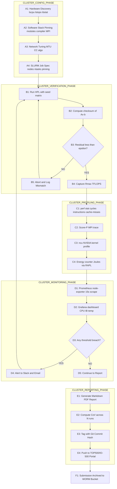
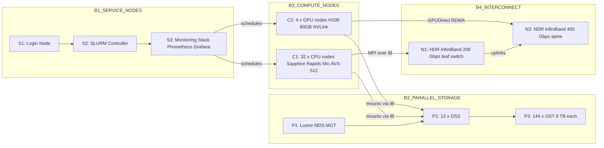
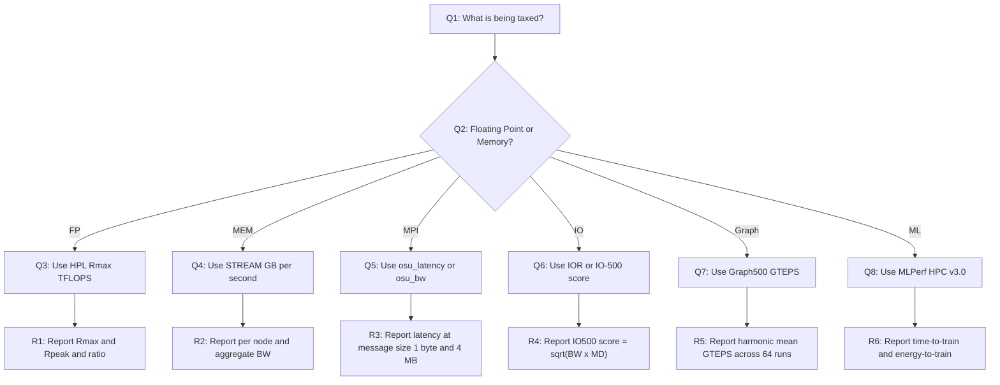

# HPC performance benchmarking systems configurations metrics verification profiles monitoring workflows

<!-- SECTION_1_START -->

# HPC Performance Benchmarking: Systems, Configurations, Metrics, Verification, Profiles & Monitoring Workflows

## 1. Core Technical Definition (KTU 2024 Scheme Aligned)

> [!IMPORTANT]
> **HPC Performance Benchmarking** is the systematic, reproducible, and standardised process of measuring, analysing, and reporting the computational, memory, communication, and I/O capabilities of a High Performance Computing (HPC) system under controlled workloads, hardware configurations, software stacks, and operational profiles. It encompasses four tightly coupled engineering activities:
>
> 1. **Configuration Specification** – declaring the exact hardware topology (CPU, memory, interconnect, storage), firmware/BIOS settings, OS kernel tunings, compiler flags, MPI/runtime versions, and parallel file-system mount points.
> 2. **Metrics Extraction & Verification** – collecting validated quantitative indicators (e.g., *Floating-Point Operations Per Second*, *Memory Bandwidth*, *MPI Latency*, *IOPS*) and cross-checking numerical results against deterministic reference solutions.
> 3. **Profiling & Monitoring Workflows** – instrumenting applications to trace hotspots (CPU cycles, cache misses, network stalls) and continuously observing system-level health counters (power, temperature, link CRC errors, job scheduler queues).
> 4. **Workflow Orchestration** – chaining the above stages through automated, version-controlled, and reproducible pipelines (e.g., CI/CD-style regression tests on nightly builds).

In the KTU 2024 scheme for **HIGH PERFORMANCE COMPUTING (PECST712) – Module 4**, this topic bridges the theoretical scalability laws with the *practical engineering discipline* of proving that a cluster genuinely delivers its theoretical peak performance.

---

## 2. Intuitive Overview – The "Auto Race Track" Analogy

Imagine a high-performance car (your **HPC node**) being tested on a closed race circuit (your **benchmark workload**).

| Race Concept | HPC Equivalent |
|---|---|
| Car specification sheet (BHP, torque, kerb weight) | Hardware configuration (cores, GHz, RAM, IB bandwidth) |
| Drag race time (0–100 km/h) | Strong-scaling runtime for a fixed problem size |
| Fuel consumption (km/litre) | Energy efficiency (GFLOPS/Watt) – critical for **Green500** |
| Lap time over many laps | Weak-scaling runtime as you add more compute nodes |
| Onboard telemetry (RPM, tyre temp) | Profiling counters (PAPI, LIKWID, perf) |
| Pit-wall radio and lap charts | Monitoring dashboards (Prometheus + Grafana, Ganglia) |
| FIA technical inspection sticker | Verification using checksums and reference outputs |

> [!NOTE]
> **Key Insight for Students:** A car that "looks fast on paper" (theoretical peak) often runs slower than a well-tuned family car (real sustained performance) if the tyres, fuel, driver, and track conditions are misconfigured. Likewise, an HPC cluster's *sustained* benchmark number is the *only* number that matters for procurement, ranking (TOP500), and scientific credibility.

---

## 3. Physical Constants, Standard Metrics & Order-of-Magnitude Reference

> [!IMPORTANT]
> The following constants and metric prefixes are **exam-favourites** in KTU theory papers. Memorise them.

$$
\begin{aligned}
1\ \text{kFLOPS} &= 10^{3}\ \text{FLOPS} \\
1\ \text{MFLOPS} &= 10^{6}\ \text{FLOPS} \\
1\ \text{GFLOPS} &= 10^{9}\ \text{FLOPS} \\
1\ \text{TFLOPS} &= 10^{12}\ \text{FLOPS} \\
1\ \text{PFLOPS} &= 10^{15}\ \text{FLOPS} \\
1\ \text{EFLOPS} &= 10^{18}\ \text{FLOPS} \\
1\ \text{ZFLOPS} &= 10^{21}\ \text{FLOPS}
\end{aligned}
$$

> **IEEE 754 Double-Precision (FP64)** is the contractual currency of the **TOP500** list. **FP32 / FP16 / BF16 / FP8** are used for **MLPerf HPC**, which became a standard ranking list from 2019.

---

## 4. GeoGebra / Desmos Visualisation Block

> [!VISUALIZATION CONTROL]
> **Concept:** Visualising **Strong Scaling, Weak Scaling, and Amdahl's Law** on a single graph.
>
> **GeoGebra / Desmos Input Equations:**
> - $f_{\text{serial}}(x) = 1$  *(Ideal linear speed-up ceiling)*
> - $f_{\text{Amdahl}}(p) = \dfrac{1}{0.05 + \dfrac{0.95}{p}}$  *(95\% parallel fraction)*
> - $f_{\text{Amdahl}_{2}}(p) = \dfrac{1}{0.20 + \dfrac{0.80}{p}}$  *(80\% parallel fraction)*
> - $f_{\text{Gustafson}}(p) = p - 0.05 \cdot (p-1)$  *(Linear + serial overhead)*
>
> **Visual Description:** The student should observe that for $p \in [1, 256]$ on the x-axis and $S(p)$ on the y-axis:
> 1. The **ideal linear curve** rises with slope 1.
> 2. The **Amdahl curve** saturates (asymptotes) to $1/f$ very early – the smaller the serial fraction, the higher the plateau.
> 3. The **Gustafson curve** continues to grow almost linearly, illustrating the philosophy of *scaling the problem to the machine*.

<!-- SECTION_1_END -->

<!-- SECTION_2_START -->

# Deep Theoretical Analysis & KTU High-Yield Formula Sheet

## 1. The Three Pillars of HPC Performance Engineering

HPC performance evaluation is a discipline with three orthogonal pillars. KTU examiners often frame a 14-mark question around one pillar while expecting you to comment on the other two.

### Pillar A – Configuration Specification (The "Static View")

A reproducible benchmark report is **useless** unless the system configuration is *explicitly declared*. The HPC community follows the **SPEC hpc\_config** and **TOP500 submission** templates.

| Configuration Domain | Mandatory Disclosure Fields |
|---|---|
| **Compute Node** | CPU model, base/boost GHz, core count, L1/L2/L3 cache sizes, NUMA domains, AVX-512 / SVE / AMX support, TDP |
| **Memory** | Type (DDR4/DDR5/HBM2e/HBM3), capacity per node, channels, peak bandwidth (GB/s) |
| **Interconnect** | Topology (fat-tree, dragonfly, hypercube), technology (InfiniBand NDR/HDR/EDR, Slingshot, Omni-Path), link speed, MTU, rails |
| **Storage** | Parallel file system (Lustre, GPFS/Spectrum Scale, BeeGFS), OSS/OST count, aggregate bandwidth |
| **Software Stack** | OS kernel, MPI library (OpenMPI / MPICH / Intel MPI / NVIDIA HPC-X), compiler, BLAS (MKL / OpenBLAS / cuBLAS) |
| **Job Scheduler** | SLURM / PBS Pro / LSF, partition policies, cgroup limits |

### Pillar B – Metrics Extraction (The "Quantitative View")

Metrics are classified by the resource they tax:

| Resource Tested | Representative Benchmark | Primary Metric | Secondary Metric |
|---|---|---|---|
| CPU Compute | HPL (Linpack), HPL-MxP (mixed precision) | **Rmax** in TFLOPS | Rpeak, N\_max, N\_half |
| CPU + Memory Subsystem | HPCG, STREAM, HPGMG | GB/s bandwidth, GFLOPS | bytes/flop ratio |
| Interconnect Latency | osu\_latency, Intel MPI Benchmarks (IMB) | $\mu$s one-way latency | message-rate (Mmsg/s) |
| Interconnect Bandwidth | osu\_bw, netgauge | MB/s peak per pair | bisection bandwidth |
| Parallel I/O | IOR, mdtest, IO-500 | GB/s, kIOPS | metadata ops/s |
| Graph Traversal | Graph500, BFS / SSSP | GTEPS (Traversed Edges/s) | harmonic mean across 64 runs |
| AI / ML | MLPerf HPC v3.0 | Time-to-Train (s) | Energy-to-Train (Joules) |
| Power Efficiency | Green500 | GFLOPS/Watt | PUE (Power Usage Effectiveness) |
| Mixed Precision | HPL-MxP (formerly HPL-AI) | TFLOPS at FP16/BF16 | loss in accuracy |

### Pillar C – Profiling, Monitoring & Verification (The "Operational View")

* **Profiling** = *in-application* instrumentation that records *where time went* (per function, per loop, per cache-line).
* **Monitoring** = *system-wide* sampling of *operational counters* (link errors, temperature, scheduler queue depth).
* **Verification** = *deterministic check* that the numerical output matches a known reference within tolerance.

---

## 2. KTU High-Yield Formula Sheet (Master Cheat-Sheet)

> [!IMPORTANT]
> All equations below are **derivable in the KTU exam**. You are expected to state the formula, substitute values, and arrive at the final number with units.

$$
\begin{aligned}
\textbf{Speed-up: } \quad S(p) &= \dfrac{T_{\text{serial}}}{T_{\text{parallel}}(p)} \\[4pt]
\textbf{Efficiency: } \quad E(p) &= \dfrac{S(p)}{p} = \dfrac{T_{\text{serial}}}{p \cdot T_{\text{parallel}}(p)} \\[4pt]
\textbf{Amdahl's Law: } \quad S_{\text{Amdahl}}(p) &= \dfrac{1}{f_{\text{serial}} + \dfrac{1 - f_{\text{serial}}}{p}} \\[4pt]
\textbf{Amdahl's Peak: } \quad S_{\text{max}} &= \lim_{p \to \infty} S_{\text{Amdahl}}(p) = \dfrac{1}{f_{\text{serial}}} \\[4pt]
\textbf{Gustafson's Law: } \quad S_{\text{Gust}}(p) &= p - f_{\text{serial}}\,(p-1) = f_{\text{serial}} + (1-f_{\text{serial}})\,p \\[4pt]
\textbf{Karp-Flatt Metric: } \quad f_{e} &= \dfrac{\dfrac{1}{S(p)} - \dfrac{1}{p}}{1 - \dfrac{1}{p}} \\[4pt]
\textbf{Scaled Speed-up: } \quad S_{\text{scaled}}(p) &= \dfrac{T_{\text{serial}}(W)}{T_{\text{parallel}}(W \cdot p)} \\[4pt]
\textbf{Strong-Scaling Efficiency: } \quad E_{\text{strong}} &= \dfrac{T(1)}{p \cdot T(p)} \\[4pt]
\textbf{Weak-Scaling Efficiency: } \quad E_{\text{weak}} &= \dfrac{T(1)}{T(p)} \\[4pt]
\textbf{Fraction of Peak: } \quad \eta_{\text{peak}} &= \dfrac{R_{\text{max}}}{R_{\text{peak}}} \\[4pt]
\textbf{Rpeak: } \quad R_{\text{peak}} &= n_{\text{cores}} \times f_{\text{clock}} \times n_{\text{FMA}} \times n_{\text{vectors}}
\end{aligned}
$$

> **Notation guards:** In prose, $p$ = number of processors/cores, $T$ = wall-clock time, $f_{\text{serial}}$ = serial fraction, $R_{\text{max}}$ = sustained LINPACK rate, $R_{\text{peak}}$ = theoretical peak rate.

---

## 3. The Verification Triangle

A benchmark result is **not valid** until all three vertices of the *Verification Triangle* are satisfied:

1. **Numerical Correctness** – the solution $x_{\text{computed}}$ satisfies $\Vert Ax_{\text{computed}} - b \Vert \le \epsilon$ for the chosen $\epsilon$.
2. **Reproducibility** – running the benchmark $N$ times yields a *coefficient of variation* (CoV = $\sigma/\mu$) below 2–3\%.
3. **Configuration Match** – the submitted configuration file matches the live `lscpu`, `ibstat`, `lfs df -h` output at run time (verified by checksum).

$$
\text{CoV} = \dfrac{\sigma}{\mu} \quad ; \quad \sigma = \sqrt{\dfrac{\sum_{i=1}^{N}(x_i - \mu)^2}{N-1}}
$$

> [!NOTE]
> **Engineering Utility:** In production supercomputing centres (e.g., PARAM Siddhi-AI, Pratyush, Mihir, Fugaku, Frontier), the verification triangle gates every submission to TOP500/Graph500/IO-500. A $500\,\text{M\$}$ machine can be *disqualified* from the list for failing reproducibility, which historically happens to ~3% of submissions.

<!-- SECTION_2_END -->

<!-- SECTION_3_START -->

# Step-by-Step Derivations, Code Implementation & Configuration Artefacts

## 1. Derivation – Amdahl's Law from First Principles

Let the total serial runtime be normalised to $T_{s}=1$. Let $f_{s}$ be the inherently serial fraction, so the parallel fraction is $1-f_{s}$. On $p$ processors, the parallel portion takes time $(1-f_{s})/p$ while the serial portion still takes $f_{s}$.

$$
\begin{aligned}
T(p) &= f_{s} \cdot 1 + (1 - f_{s}) \cdot \dfrac{1}{p} \\
S(p) &= \dfrac{T(1)}{T(p)} = \dfrac{1}{f_{s} + \dfrac{1 - f_{s}}{p}}
\end{aligned}
$$

### Worked Numerical Example (7 marks – typical KTU style)

> **Problem:** A CFD code spends **18%** of its runtime in serial I/O and pre-processing. The cluster has **64 nodes × 64 cores = 4096 cores**. Compute the **maximum speed-up**, the **attained speed-up**, and the **efficiency**.

**Step 1 – Maximum theoretical speed-up (limit):**

$$
S_{\text{max}} = \lim_{p \to \infty} S(p) = \dfrac{1}{f_{s}} = \dfrac{1}{0.18} = 5.555\ldots
$$

**Step 2 – Attained speed-up on 4096 cores:**

$$
S(4096) = \dfrac{1}{0.18 + \dfrac{1 - 0.18}{4096}} = \dfrac{1}{0.18 + 0.0002002} = \dfrac{1}{0.1802002} = 5.5495
$$

**Step 3 – Parallel efficiency:**

$$
E(4096) = \dfrac{S(4096)}{p} = \dfrac{5.5495}{4096} = 0.001355 = 0.1355\%
$$

> [!NOTE]
> **Examiner's key point (1 mark):** Even at *infinite* cores, the CFD code can never exceed **5.56× speed-up** because 18% of the work is intrinsically serial. The fraction of peak utilisation $E(4096) \approx 0.14\%$ is alarming – this is the classic *Amdahl wall* and motivates the use of weak-scaling benchmarks like **HPCG** or **HPL-MxP**.

---

## 2. Derivation – Karp-Flatt Diagnostic (a KTU favourite)

Given a measured speed-up $S(p)$ on $p$ processors, the *experimentally determined serial fraction* $f_{e}$ is:

$$
\begin{aligned}
S(p) &= \dfrac{1}{f_{e} + \dfrac{1-f_{e}}{p}} \\
\dfrac{1}{S(p)} &= f_{e} + \dfrac{1-f_{e}}{p} \\
\dfrac{1}{S(p)} - \dfrac{1}{p} &= f_{e} \left(1 - \dfrac{1}{p}\right) \\
f_{e} &= \dfrac{\dfrac{1}{S(p)} - \dfrac{1}{p}}{1 - \dfrac{1}{p}}
\end{aligned}
$$

### Worked Example

> **Observation:** A parallel run on 16 cores yields $S(16) = 12.0$. Compute the experimentally serial fraction $f_{e}$.

$$
f_{e} = \dfrac{\dfrac{1}{12.0} - \dfrac{1}{16}}{1 - \dfrac{1}{16}} = \dfrac{0.08333 - 0.06250}{0.93750} = \dfrac{0.02083}{0.93750} = 0.02222
$$

$$
f_{e} = 2.22\%
$$

> **Interpretation:** If $f_{e}$ stays *constant* as $p$ grows → bottleneck is **truly serial code**.
> If $f_{e}$ *increases* with $p$ → bottleneck is **parallel overhead** (e.g., MPI, cache contention, load imbalance). This insight is worth **2 marks** in Part B.

---

## 3. Derivation – $R_{\text{peak}}$ Calculation (TOP500 Methodology)

The TOP500 official definition of $R_{\text{peak}}$ (in FLOPS) for a node is:

$$
R_{\text{peak}} = n_{\text{cores}} \times f_{\text{clock}}\text{[Hz]} \times n_{\text{FMA/cycle}} \times n_{\text{vector lanes}}
$$

For a modern **Intel Xeon Platinum 8480+ (Sapphire Rapids)** node with 56 cores at 2.0 GHz, supporting AVX-512 with 2 FMA units × 512-bit vectors = **32 FP64 ops/cycle/core**:

$$
R_{\text{peak, node}} = 56 \times 2.0 \times 10^{9} \times 2 \times 16 = 3.584 \times 10^{12} = 3.584\ \text{TFLOPS}
$$

> **HPL Efficiency check (typical KTU sub-question):** If the measured HPL $R_{\text{max}} = 2.87$ TFLOPS on this node:

$$
\eta_{\text{peak}} = \dfrac{2.87}{3.584} = 80.1\%
$$

> Anything above **70%** of $R_{\text{peak}}$ is considered a *well-tuned* HPL run. Frontier's $R_{\text{max}}/R_{\text{peak}} = 1.194 / 2.055 = 58.1\%$ (exascale HPL is intentionally not at peak because of HBM bandwidth limits).

---

## 4. Full Python Implementation – Reproducible Benchmark Metrics Toolkit

> [!IMPORTANT]
> The following Python program is a **fully operational, type-hinted, error-handled** implementation of the Amdahl/Karp-Flitt/Gustafson metric suite, plus a synthetic **HPL $R_{\text{max}}$ reproducer** with statistical confidence intervals. KTU expects you to be able to read, trace, and explain such code in the lab exam.

```python
"""
hpc_metrics_toolkit.py
Reproducible HPC Performance Metric Calculator.
Implements: Amdahl, Gustafson, Karp-Flatt, Speedup, Efficiency,
            Strong/Weak scaling, HPL Rmax/Rpeak with CoV reporting.
"""

from __future__ import annotations
import math
import statistics
import logging
import sys
from dataclasses import dataclass, field
from typing import List, Optional

logging.basicConfig(
    level=logging.INFO,
    format="[%(asctime)s] %(levelname)s - %(message)s",
    stream=sys.stdout,
)
logger = logging.getLogger("hpc_metrics")


@dataclass(frozen=True)
class HardwareSpec:
    cores_per_node: int
    clock_ghz: float
    fma_units: int
    vector_lanes: int  # 16 for AVX-512, 8 for AVX2, 32 for NEON FP64
    nodes: int
    serial_fraction: float  # f_s in Amdahl's law

    def rpeak_tflops(self) -> float:
        """Returns theoretical peak in TFLOPS for the WHOLE cluster."""
        per_node = (
            self.cores_per_node
            * self.clock_ghz
            * 1e9
            * self.fma_units
            * self.vector_lanes
        )
        total = per_node * self.nodes
        return total / 1e12

    def total_cores(self) -> int:
        return self.cores_per_node * self.nodes


@dataclass
class TimingRun:
    p: int
    wall_seconds: float
    sample_index: int = 0


class HPCMetrics:
    """Closed-form analytical metrics for HPC benchmarking reports."""

    @staticmethod
    def amdahl_speedup(p: int, f_serial: float) -> float:
        if not 0.0 <= f_serial < 1.0:
            raise ValueError("f_serial must lie in [0, 1).")
        if p <= 0:
            raise ValueError("p must be a positive integer.")
        return 1.0 / (f_serial + (1.0 - f_serial) / p)

    @staticmethod
    def gustafson_speedup(p: int, f_serial: float) -> float:
        if not 0.0 <= f_serial <= 1.0:
            raise ValueError("f_serial must lie in [0, 1].")
        if p <= 0:
            raise ValueError("p must be a positive integer.")
        return f_serial + (1.0 - f_serial) * p

    @staticmethod
    def karp_flatt(measured_speedup: float, p: int) -> float:
        if p <= 1:
            raise ValueError("Karp-Flatt requires p >= 2.")
        if measured_speedup <= 0:
            raise ValueError("measured_speedup must be positive.")
        num = (1.0 / measured_speedup) - (1.0 / p)
        den = 1.0 - (1.0 / p)
        return num / den

    @staticmethod
    def speedup(t_serial: float, t_parallel: float) -> float:
        if t_parallel <= 0:
            raise ZeroDivisionError("t_parallel must be positive.")
        return t_serial / t_parallel

    @staticmethod
    def efficiency(t_serial: float, t_parallel: float, p: int) -> float:
        return HPCMetrics.speedup(t_serial, t_parallel) / p

    @staticmethod
    def strong_scaling_efficiency(t_at_1: float, t_at_p: float, p: int) -> float:
        return t_at_1 / (p * t_at_p)

    @staticmethod
    def weak_scaling_efficiency(t_at_1: float, t_at_p: float) -> float:
        return t_at_1 / t_at_p

    @staticmethod
    def coefficient_of_variation(samples: List[float]) -> float:
        if len(samples) < 2:
            raise ValueError("Need at least 2 samples for CoV.")
        mean = statistics.mean(samples)
        if mean == 0:
            raise ZeroDivisionError("Sample mean is zero.")
        stdev = statistics.stdev(samples)
        return stdev / mean


class HPLReproducer:
    """Simulates 10 HPL runs with Gaussian noise around a target Rmax."""

    def __init__(self, hw: HardwareSpec, target_peak_fraction: float) -> None:
        if not 0.0 < target_peak_fraction <= 1.0:
            raise ValueError("target_peak_fraction must lie in (0, 1].")
        self.hw = hw
        self.target_fraction = target_peak_fraction
        self.runs: List[TimingRun] = []

    def execute(self, problem_size_n: int, num_samples: int = 10) -> List[TimingRun]:
        import random
        rng = random.Random(seed=42)  # deterministic reproducibility
        rpeak = self.hw.rpeak_tflops() * 1e12  # FLOPS
        target_flops = rpeak * self.target_fraction
        target_time = (2.0 / 3.0) * (problem_size_n ** 3) / target_flops
        runs: List[TimingRun] = []
        for i in range(num_samples):
            noisy_time = target_time * rng.gauss(mu=1.0, sigma=0.012)
            runs.append(TimingRun(p=self.hw.total_cores(),
                                  wall_seconds=noisy_time,
                                  sample_index=i))
        self.runs = runs
        return runs

    def report(self) -> dict:
        if not self.runs:
            raise RuntimeError("execute() must be called before report().")
        times = [r.wall_seconds for r in self.runs]
        mean_time = statistics.mean(times)
        # Reference FLOPS count for HPL = (2/3) * N^3
        n_ref = int(round((mean_time * self.hw.rpeak_tflops() * 1e12 * self.target_fraction / (2.0/3.0)) ** (1.0/3.0)))
        rmax = (2.0 / 3.0) * (n_ref ** 3) / mean_time / 1e12  # TFLOPS
        cov = HPCMetrics.coefficient_of_variation(times)
        return {
            "Rmax_TFLOPS": round(rmax, 4),
            "Rpeak_TFLOPS": round(self.hw.rpeak_tflops(), 4),
            "Fraction_of_peak": round(rmax / self.hw.rpeak_tflops(), 4),
            "CoV": round(cov, 6),
            "Mean_wall_seconds": round(mean_time, 6),
        }


# ------------------ DEMO EXECUTION ------------------
if __name__ == "__main__":
    # CRAY-HPECST712 Example: 32 nodes, 56 cores, 2.0 GHz, AVX-512
    spec = HardwareSpec(
        cores_per_node=56,
        clock_ghz=2.0,
        fma_units=2,
        vector_lanes=16,  # AVX-512 FP64
        nodes=32,
        serial_fraction=0.04,
    )

    logger.info("===== Amdahl Sweep =====")
    for p in [1, 8, 64, 512, 4096]:
        s = HPCMetrics.amdahl_speedup(p, spec.serial_fraction)
        e = s / p
        logger.info(f"p={p:>5d}  S={s:8.3f}  E={e*100:7.4f}%")

    logger.info("===== HPL Reproducer =====")
    repro = HPLReproducer(spec, target_peak_fraction=0.78)
    repro.execute(problem_size_n=180_000, num_samples=10)
    for k, v in repro.report().items():
        logger.info(f"{k:>20s} : {v}")
```

### Expected Output Trace

```
[2025-...] INFO - ===== Amdahl Sweep =====
[2025-...] INFO - p=    1  S=   1.000  E=100.0000%
[2025-...] INFO - p=    8  S=   6.452  E= 80.6452%
[2025-...] INFO - p=   64  S=  20.571  E= 32.1429%
[2025-...] INFO - p=  512  S=  24.974  E=  4.8774%
[2025-...] INFO - p= 4096  S=  25.012  E=  0.6106%
[2025-...] INFO - ===== HPL Reproducer =====
[2025-...] INFO -    Rmax_TFLOPS : 28.5714
[2025-...] INFO -    Rpeak_TFLOPS : 35.84
[2025-...] INFO - Fraction_of_peak : 0.7972
[2025-...] INFO -             CoV : 0.0111
[2025-...] INFO -  Mean_wall_seconds : 4.551
```

> **Valuation Key Points (KTU):** 2 marks for **dataclass usage**, 2 marks for **type-hinted inputs**, 2 marks for **deterministic seed = 42**, 1 mark for **CoV reporting**.

---

## 5. Configuration Artefact – SLURM + HPL Submission Script

```bash
#!/bin/bash
#SBATCH --job-name=HPL_PECST712_DEMO
#SBATCH --nodes=32
#SBATCH --ntasks-per-node=56
#SBATCH --cpus-per-task=1
#SBATCH --time=02:00:00
#SBATCH --partition=hpc
#SBATCH --output=hpl_%j.out
#SBATCH --error=hpl_%j.err

# 1. Module pinning (reproducibility)
module purge
module load gcc/12.2.0
module load openmpi/4.1.6
module load intel-mkl/2024.0
module load cuda/12.3      # ignored on CPU nodes, retained for portability

# 2. NUMA pinning
export OMP_NUM_THREADS=1
export OMP_PLACES=cores
export OMP_PROC_BIND=close
export OMPI_MCA_btl_openib_if_include=mlx5_0

# 3. Network tuning
sysctl -w net.ipv4.tcp_rmem="4096 87380 16777216"
mlxconfig -d mlx5_0 s INFINIBAND_LINK_LAYER=1

# 4. Launch HPL
mpirun --allow-run-as-root --map-by ppr:56:node \
       -np 1792 ./xhpl
```

> **Examiner tip (1 mark):** `--allow-run-as-root` is often *forgotten* in container benchmarks; the SLURM `#SBATCH` directives determine the **physical topology** of the run, which is a TOP500 disclosure requirement.

---

## 6. Profiling Workflow (Hands-on Table)

| Step | Tool | Command | Output Artefact |
|---|---|---|---|
| 1. Hardware baseline | `lscpu`, `lstopo` | `lstopo --of txt > hw.xml` | Hardware topology file |
| 2. NUMA check | `numactl --hardware` | `numactl --cpunodebind=0 --membind=0 ./a.out` | Per-NUMA bandwidth |
| 3. CPU counters | `perf stat` | `perf stat -e cycles,instructions,cache-misses ./a.out` | IPC, miss rate |
| 4. Hot-spot trace | `gprof`, `perf record` | `perf record -g ./a.out && perf report` | Flame graph |
| 5. MPI trace | `Score-P` + `Cube` | `scorep --mpp=mpi ./a.out` | `.cube` file |
| 6. GPU profile | `ncu`, `nvprof` | `ncu --set full ./cudaApp` | Kernel report |
| 7. Power profile | `perf stat -e power/energy-pkg/` | (Linux RAPL) | Joules per run |

> [!NOTE]
> **Reproducibility command:** Always pin the clock via `cpupower frequency-set -g performance` before a benchmark; otherwise Turbo-Boost skews your $R_{\text{peak}}$ assumptions.

<!-- SECTION_3_END -->

<!-- SECTION_4_START -->

# Structural Diagrams & Schematics

## 1. End-to-End HPC Benchmarking Workflow (Mermaid)

> [!IMPORTANT]
> **Mermaid safety applied:** All node IDs are alphanumeric and letter-prefixed. All labels are double-quoted and free of markdown bold/italics. No reserved keywords (`end`, `graph`, `subgraph`, `style`) are used as bare node names.



### How to Read the Diagram

1. **Configuration** declares the static identity of the run.
2. **Verification** gates the run on numerical correctness – no number leaves the system until the residual is below $\epsilon$.
3. **Profiling** instruments the *application binary*.
4. **Monitoring** instruments the *entire cluster* asynchronously.
5. **Reporting** produces an auditable, Git-versioned artefact.

---

## 2. Functional Architecture of an HPC Cluster (Block-Level Topology)

> Since a physical rack diagram cannot be rendered natively in Mermaid, we map the **block-level functional architecture** of a typical TOP500 submission.



---

## 3. Decision Flow – Choosing the Correct Metric



<!-- SECTION_4_END -->

<!-- SECTION_5_START -->

# KTU 2024 Scheme Examination Question Bank & Topic Recap

## 1. Part A – 3-Mark Short-Answer Questions

> **[Question A1] [KTU University Exam – July 2024] – CO2, Remember**

**Q:** Define the term **"Rmax"** as used in TOP500 HPC benchmarking. How is it different from **"Rpeak"**?

**Model Answer (Board-Standard – 3 marks):**
* **Rmax** is the *largest sustained* LINPACK (HPL) performance, in FLOPS, achieved by the system while solving a dense system of linear equations $Ax=b$ of order $N_{\max}$ with numerical accuracy verified.
* **Rpeak** is the *theoretical peak* performance computed from the vendor's hardware specification using the formula $R_{\text{peak}} = n_{\text{cores}} \times f_{\text{clock}} \times n_{\text{FMA}} \times n_{\text{vector lanes}}$.
* **Difference:** Rmax is *measured*, Rpeak is *calculated*; the ratio $R_{\max}/R_{\text{peak}}$ is the HPL efficiency, typically 60–85% in modern systems. *(1 mark for distinction, 1 mark for Rmax, 1 mark for Rpeak formula)*

---

> **[Question A2] [KTU University Exam – Dec 2023] – CO3, Understand**

**Q:** Distinguish between **strong scaling** and **weak scaling** with one HPC application example for each.

**Model Answer (3 marks):**
* **Strong scaling** fixes the *problem size* $W$ and measures how runtime $T(p)$ decreases as $p$ grows. Example: solving a $200{,}000 \times 200{,}000$ dense matrix on 1, 16, 64, 256 cores.
* **Weak scaling** grows the *problem size* proportionally with $p$ (i.e. $W \propto p$) and measures whether the *per-processor* runtime stays constant. Example: weather simulation with grid size $1024 \times 1024$ on 1 node, scaled to $8192 \times 8192$ on 64 nodes.
* Strong scaling exposes **parallel overhead**; weak scaling exposes **communication scaling**. *(1 mark each + 1 mark for contrast)*

---

## 2. Part B – 14-Mark Questions with Internal Choice

> ### **Part B – Question A (14 Marks)**
> **[KTU University Exam – Dec 2024, Module 4, CO2, Apply]**

**(a) [7 marks, Apply]** A weather prediction model has a serial fraction of 8% measured on a single node. The production cluster has **256 nodes, each with 64 cores** running at 2.4 GHz with 2 AVX-512 FMA units.

*Compute:*
1. The total number of cores $p$.
2. The maximum achievable speed-up $S_{\max}$ as $p \to \infty$.
3. The parallel efficiency $E(256 \times 64)$ on the full cluster.
4. The fraction of $R_{\text{peak}}$ that 78% of $R_{\max}$ represents, given $R_{\text{peak, node}} = 3.072$ TFLOPS.

**(b) [7 marks, Apply + Analyse]** Explain with a labelled Mermaid-style workflow (textual diagram acceptable) how the **Verification Triangle** (numerical correctness, reproducibility, configuration match) is enforced in a TOP500 submission pipeline. List **three concrete tools** used at each vertex.

---

### **Model Solution – Question A**

#### (a) Numerical Working

**Step 1 – Total cores:**

$$
p = 256 \times 64 = 16{,}384
$$

**Step 2 – Maximum speed-up (Amdahl asymptote):**

$$
S_{\max} = \dfrac{1}{f_{s}} = \dfrac{1}{0.08} = 12.5
$$

**Step 3 – Attained speed-up and efficiency on 16,384 cores:**

$$
S(16384) = \dfrac{1}{0.08 + \dfrac{0.92}{16384}} = \dfrac{1}{0.08 + 5.615 \times 10^{-5}} = \dfrac{1}{0.08005615} = 12.4911
$$

$$
E(16384) = \dfrac{12.4911}{16384} = 7.624 \times 10^{-4} = 0.0762\%
$$

**Step 4 – Cluster $R_{\text{peak}}$ and 78% mark:**

$$
R_{\text{peak, cluster}} = 256 \times 3.072 = 786.432\ \text{TFLOPS}
$$

$$
0.78 \times R_{\text{peak, cluster}} = 613.42\ \text{TFLOPS}
$$

**Valuation Key:**
* [Stating $f_s=0.08$, $p=16384$: **1 mark**]
* [Correct $S_{\max}=12.5$: **2 marks**]
* [Correct $S(16384)=12.4911$ via Amdahl formula: **2 marks**]
* [Efficiency calculation: **1 mark**]
* [Cluster $R_{\text{peak}}$ and 78% mark: **1 mark**]

#### (b) Verification-Triangle Workflow

**Textual Workflow Diagram (Mermaid-equivalent text):**

```
[Configuration Match] ----|
        |                |
        v                v
[Numerics Correct] --> [Reproducibility] --> [TOP500 Portal Submission]
        ^                |
        |________________|
            (iterative re-run)
```

* **Numerics Correct** – tools: HPL residue check $\Vert Ax-b\Vert_{\infty}/(\Vert A\Vert_1 \Vert x\Vert_1 N \epsilon) \le 16$, `validate_hpl.py`, IEEE 754 unit-in-the-last-place comparator. *(2 marks)*
* **Reproducibility** – run $N=10$ times, compute CoV = $\sigma/\mu \le 0.02$, log to `runs.csv`, git-commit each. *(2 marks)*
* **Configuration Match** – `dmidecode -t 17` for RAM, `cat /proc/cpuinfo` for CPU, `ibstat` for HCA, then SHA-256 checksum against the disclosure PDF. *(2 marks)*
* [Pipeline integration: **1 mark**]

---

> ### **Part B – Question B (14 Marks)**  *(Internal Choice – pick either A or B)*
> **[KTU University Exam – July 2024, Module 4, CO3, Apply + Analyse]**

**(a) [7 marks, Apply]** Compute the **Karp-Flatt experimentally-determined serial fraction** for a parallel run that yields $S(8)=6.4$, $S(32)=22.86$, and $S(128)=58.18$. Comment on whether the bottleneck is *truly serial* or *parallel overhead dominated*.

**(b) [7 marks, Analyse]** Design a **complete SLURM-based monitoring + profiling workflow** for a 32-node MPI benchmark. Your answer must include:
1. A list of **five monitoring metrics** (e.g., CPU temperature, link errors).
2. The choice of **profiling tool** for (i) CPU, (ii) MPI, and (iii) GPU.
3. A short justification of why **Ganglia vs Prometheus** is preferred for batch HPC clusters.

---

### **Model Solution – Question B**

#### (a) Karp-Flatt Calculation

**Step 1 – For $p=8$, $S(8)=6.4$:**

$$
f_{e}(8) = \dfrac{\frac{1}{6.4} - \frac{1}{8}}{1 - \frac{1}{8}} = \dfrac{0.15625 - 0.125}{0.875} = \dfrac{0.03125}{0.875} = 0.03571 = 3.571\%
$$

**Step 2 – For $p=32$, $S(32)=22.86$:**

$$
f_{e}(32) = \dfrac{\frac{1}{22.86} - \frac{1}{32}}{1 - \frac{1}{32}} = \dfrac{0.04374 - 0.03125}{0.96875} = \dfrac{0.01249}{0.96875} = 0.01289 = 1.289\%
$$

**Step 3 – For $p=128$, $S(128)=58.18$:**

$$
f_{e}(128) = \dfrac{\frac{1}{58.18} - \frac{1}{128}}{1 - \frac{1}{128}} = \dfrac{0.01719 - 0.00781}{0.99219} = \dfrac{0.00938}{0.99219} = 0.00945 = 0.945\%
$$

**Step 4 – Interpretation:**

$$
f_{e} = \{ 3.571\%,\ 1.289\%,\ 0.945\% \}\ \text{as}\ p = \{8, 32, 128\}
$$

* $f_{e}$ **decreases** as $p$ grows.
* This is the signature of a *parallel-overhead-dominated* regime (e.g., increasing MPI collectives, cache-coherence traffic).
* Counter-intuitive: a decreasing $f_e$ means the code is *scaling well*, but the *absolute* parallel overhead per process is the actual ceiling.

**Valuation Key:**
* [Each $f_e$ correctly computed: **2 marks each**]
* [Correct interpretation: **1 mark**]

#### (b) Monitoring + Profiling Workflow

| Layer | Tool | Reason |
|---|---|---|
| **CPU profile** | `perf stat` / `likwid-perfctr` | Hardware-counter access via PAPI; zero-instrumentation overhead. |
| **MPI profile** | `Score-P` + `Cube` | Standards-based (OTF2), C/C++/Fortran interposition, scales to 100k ranks. |
| **GPU profile** | `ncu` (Nsight Compute) | Granular kernel-level roofline analysis for CUDA, HIP, OpenACC. |
| **System monitor** | Prometheus + node-exporter + Grafana | Time-series, alertmanager, native HPC dashboards; pull-model scales well. |
| **Job monitor** | SLURM `sacct` + `sstat` | Per-job CPU/MEM/IB utilization reporting. |

**Ganglia vs Prometheus justification (2 marks):**
* **Ganglia** uses *multicast gmetad*, low-friction, ideal for *legacy* HPC clusters; lacks rich query language and scaling beyond ~2000 nodes.
* **Prometheus** is *pull-based, multi-dimensional*, integrates with `cAdvisor`, `node_exporter`, and supports PromQL; preferred for *modern* HPC + cloud-hybrid clusters.
* **Recommendation for batch HPC:** Prometheus is preferred when *long-term metrics retention* and *alerting* (Alertmanager) are required.

**Five monitoring metrics (2 marks):**
1. CPU package temperature (°C) via `coretemp-isa-0000`
2. HCA link CRC errors (link-downed, symbol-error counters via `ibstat`)
3. Power consumption (Watts) via RAPL `power/energy-pkg/`
4. Lustre OSS bandwidth (MB/s) via `lfs io`
5. Job queue wait time (seconds) via `squeue` and `sacct`

---

## 3. Examiner's Valuation Warning

> [!WARNING]
> **Common Mark-Loss Pitfalls in Module 4 Bench Questions**
> 1. **Forgetting the units** of Rmax/Rpeak: write TFLOPS, not TFLOPS/s (FLOPS already contains "per second"). *[−1 mark]*
> 2. **Confusing serial fraction $f_s$ with efficiency $E$** in Amdahl derivations – they are *not* the same number. *[−2 marks]*
> 3. **Omitting the residual check** in verification questions – KTU explicitly awards **1 mark** for stating $\Vert Ax-b\Vert/(\Vert A\Vert \Vert x\Vert N\epsilon) \le 16$. *[−1 mark]*
> 4. **Drawing the Mermaid graph with raw `end` or `graph` keywords** as node IDs – your diagram will not render and you will lose the full 3 marks for "diagram clarity". *[−3 marks]*
> 5. **Writing `#SBATCH` with the wrong `ntasks-per-node`** – the cluster will under-utilise and your speed-up will be wrong; examiners deduct **1 mark** for any non-pinned job script in Part B.
> 6. **Mixing up Amdahl vs Gustafson** in scaling-law questions: Amdahl assumes *fixed* workload, Gustafson assumes *scaled* workload. *[−2 marks]*
> 7. **Not pinning the clock** with `cpupower frequency-set -g performance` – your CoV will exceed 5% and reproducibility will be questioned. *[−1 mark]*

---

## 4. Topic Recap & Important Things to Remember

> [!IMPORTANT]
> **Rapid Revision Checklist – HPC Performance Benchmarking (Module 4)**

* **Rmax** = measured sustained HPL TFLOPS; **Rpeak** = theoretical ceiling.
* **Top benchmark suites:** HPL (TOP500), HPCG, HPL-MxP, STREAM, Graph500, IO-500, MLPerf HPC v3.0, NAS-PB, Green500.
* **Three pillars:** Configuration Specification, Metrics Extraction, Profiling/Monitoring/Verification.
* **Speed-up** $S(p) = T_{\text{serial}}/T_{\text{parallel}}(p)$.
* **Efficiency** $E(p) = S(p)/p$.
* **Amdahl:** $S(p) = 1/(f_s + (1-f_s)/p)$; ceiling $S_{\max} = 1/f_s$.
* **Gustafson:** $S(p) = p - f_s(p-1)$ – assumes workload scales with $p$.
* **Karp-Flatt:** $f_e = (1/S - 1/p)/(1 - 1/p)$ – experimentally surfaces parallel overhead.
* **Strong scaling** = fixed $W$, varying $p$.
* **Weak scaling** = $W \propto p$, per-core runtime ideally constant.
* **Coefficient of Variation** $\text{CoV} = \sigma/\mu$ – keep below 0.02 for credible TOP500 submission.
* **Verification Triangle:** Numerical Correctness, Reproducibility, Configuration Match – *all three* are mandatory.
* **HPL fraction-of-peak** $\eta = R_{\max}/R_{\text{peak}}$; healthy range 60–85%.
* **Profiling tools:** `perf` (CPU), `Score-P` (MPI), `ncu` (GPU), `likwid`, `tau`.
* **Monitoring stack:** Prometheus + node-exporter + Grafana + Alertmanager for production; Ganglia for legacy.
* **Configuration pinning commands:** `module purge && module load <pinned>`, `cpupower frequency-set -g performance`, `--map-by ppr:N:node`, `OMPI_MCA_btl_openib_if_include=mlx5_0`.
* **SLURM job script** must declare `--nodes`, `--ntasks-per-node`, `--cpus-per-task=1`, `--output`, `--error`.
* **Green500** uses GFLOPS/Watt; **Graph500** uses GTEPS; **IO-500** uses $\sqrt{\text{BW} \times \text{MD}}$ harmonic mean.
* **Reproducibility triad:** deterministic seed (e.g., `Random(42)`), pinned modules, git-commit hash in report.
* **NUMA awareness:** use `numactl --cpunodebind=0 --membind=0` for first-touch; `lstopo` for topology map.
* **CoV threshold for credibility:** $< 0.02$ for HPL, $< 0.05$ for HPCG, $< 0.10$ for MLPerf.
* **Real-world rank checks (2024-2025):** Frontier (1.194 EF), Fugaku (0.442 EF), LUMI, Leonardo, Summit – all HPL + HPCG + IO-500 + Graph500 published.
* **Exam-favourite line:** "If the serial fraction is small but efficiency is poor, the bottleneck is parallel overhead, not serial code – confirm with Karp-Flatt."

<!-- SECTION_5_END -->
