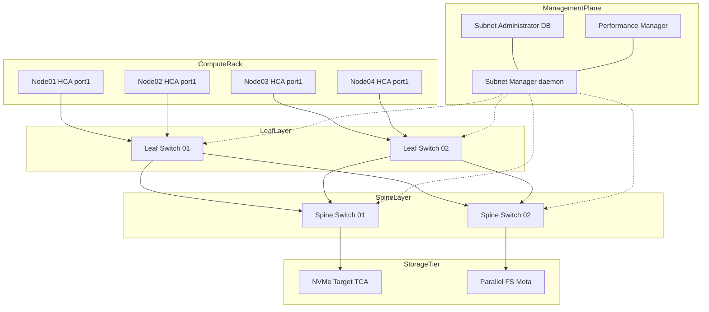
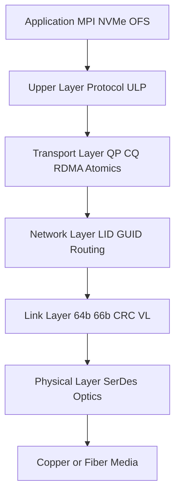
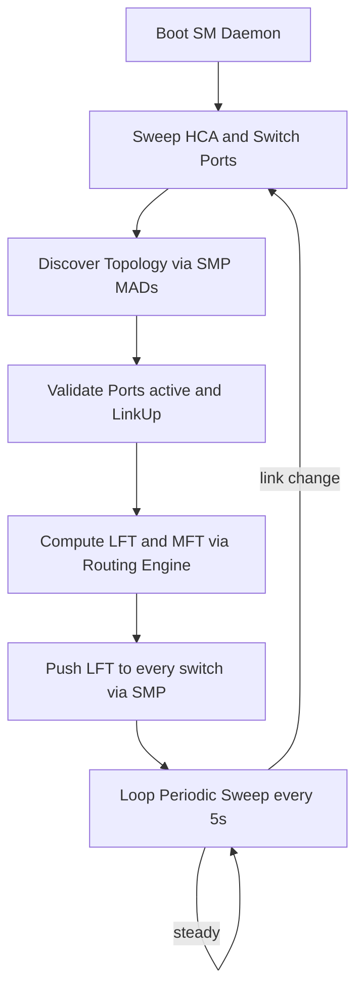
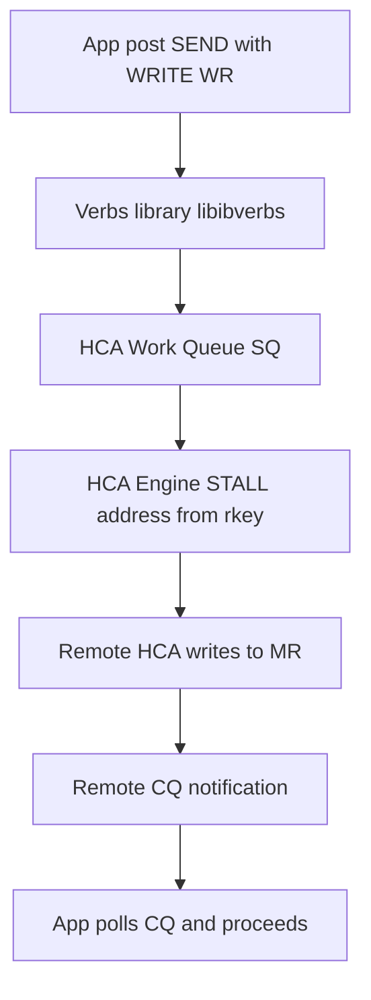
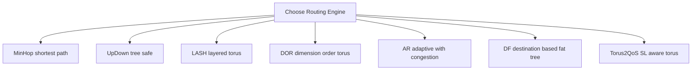
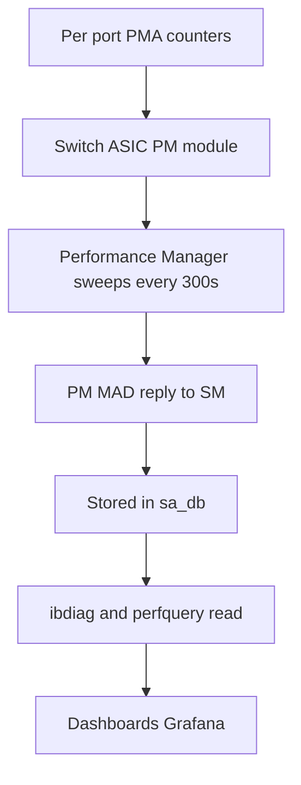

# InfiniBand interconnect fabrics routing configurations variables software setups metrics performance

<!-- SECTION_1_START -->

# InfiniBand Interconnect Fabrics — Foundational Definition & Intuition

## 1.1 Formal KTU 2024 Definition

> [!IMPORTANT]
> **InfiniBand Architecture (IBA)** is a standardized, high-bandwidth, low-latency, switched-fabric interconnect defined by the **InfiniBand Trade Association (IBTA)**. It is engineered for **High Performance Computing (HPC)** clusters, hyperscale data centers, and storage-area networks (SANs). It specifies a layered protocol stack — **Physical, Link, Network, Transport, and Upper Layers** — that delivers **Remote Direct Memory Access (RDMA)**, kernel-bypass messaging, and hardware-offloaded transport services through **Channel Adapters** connected to **Switches** and **Routers** within a managed **Subnet**.

The fabric is administratively partitioned into **Subnets**, each governed by a single **Subnet Manager (SM)** that performs discovery, configuration, routing, and topology enforcement.

## 1.2 Conceptual Analogy — Plain English Intuition

> [!NOTE]
> **Real-world Analogy: The Smart Highway System**
> Think of an HPC cluster as a large industrial city and InfiniBand as its **smart highway system**:
> - **HCA (Host Channel Adapter)** → a private driveway (the CPU's door to the highway).
> - **Switch** → a multi-level interchange.
> - **Router** → the international gateway connecting different cities (subnets).
> - **Subnet Manager (SM)** → the **central traffic control center** assigning lane directions, opening/closing roads, monitoring accidents.
> - **Queue Pair (QP)** → a designated **lorry** that has been registered with a unique cargo manifest and an authorized route.
> - **LID (Local ID)** → the house number inside a city.
> - **GUID (Global Unique ID)** → the GPS-coordinated global address.
> - **VL (Virtual Lane)** → a **bus lane** carved out inside the highway to prevent fast traffic from being blocked by slow truck traffic.
> - **SL (Service Level)** → a **priority class** (ambulance vs. regular car vs. cargo truck).

Without the SM, the lorries would collide; with the SM, every packet has a deterministic, congestion-aware path.

## 1.3 Standard InfiniBand Link Speeds

> [!TIP]
> **InfiniBand Link Rate Generations (per lane × 4 wide link):**

| Generation | Abbreviation | Signaling Rate | Aggregate BW (4X) | Year |
| :-- | :-- | :-- | :-- | :-- |
| Single Data Rate | **SDR** | 2.5 Gbps | 10 Gbps | 2003 |
| Double Data Rate | **DDR** | 5 Gbps | 20 Gbps | 2005 |
| Quad Data Rate | **QDR** | 10 Gbps | 40 Gbps | 2007 |
| Fourteen Data Rate | **FDR** | 14.0625 Gbps | 56 Gbps | 2011 |
| Enhanced Data Rate | **EDR** | 25 Gbps | 100 Gbps | 2014 |
| High Data Rate | **HDR** | 50 Gbps | 200 Gbps | 2017 |
| Next Data Rate | **NDR** | 100 Gbps | 400 Gbps | 2020 |
| eXtended Data Rate | **XDR** | 200 Gbps | 800 Gbps | 2022 |

> [!VISUALIZATION CONTROL]
> **Concept:** Growth of InfiniBand Aggregated Link Bandwidth
> **Plot Type:** Bar / Line chart (X = Generation, Y = BW)
> **Sample Data Points (4X Link):**
> * `SDR` → 10
> * `DDR` → 20
> * `QDR` → 40
> * `FDR` → 56
> * `EDR` → 100
> * `HDR` → 200
> * `NDR` → 400
> * `XDR` → 800
> **Visual Description:** An exponentially rising staircase from 10 Gbps (SDR, 2003) to 800 Gbps (XDR, 2022), demonstrating an **80× bandwidth increase** across ~20 years. Each generation roughly doubles the previous throughput, with EDR crossing the 100 Gbps threshold and XDR pushing into terabit-class interconnect territory.

## 1.4 Layered IBA Protocol Stack

> [!IMPORTANT]
> The **IBTA specification** defines five logical layers:

1. **Physical Layer** — defines electrical/optical signaling, connectors (CX-4, QSFP, OSFP), copper/fiber media, link widths (1X, 4X, 8X, 12X).
2. **Link Layer** — defines 64/66-bit encoding, Link-Level Flow Control (LLFC), Virtual Lanes (VLs), MTU (256, 512, 1024, 2048, 4096 bytes), and CRC.
3. **Network Layer** — defines packet format, addressing (**LID**, **GUID**), subnet routing, and forwarding tables.
4. **Transport Layer** — defines **Queue Pairs (QPs)**, **Completion Queues (CQs)**, **Reliable Connection (RC)**, **Unreliable Connection (UC)**, **Unreliable Datagram (UD)**, **Dynamically Connected (DC)** transports, RDMA, and Atomics.
5. **Upper Layer Protocols (ULPs)** — RDMA verbs, **IPoIB**, **SRP**, **iSER**, **NFS-RDMA**, **SDP**, **uDAPL**, **MPI**, **PGAS runtimes**.

<!-- SECTION_1_END -->

<!-- SECTION_2_START -->

# Deep Theoretical Analysis & KTU Formula Sheet

## 2.1 Subnet Components (Topology Building Blocks)

A single InfiniBand **Subnet** contains:

| Component | Role |
| :-- | :-- |
| **HCA — Host Channel Adapter** | Network interface card on compute node; initiator of RDMA. |
| **TCA — Target Channel Adapter** | Adapter on a storage target / I/O device. |
| **Switch** | L2-Switching device; forwards packets using DLID. |
| **Router** | Connects two or more Subnets via L3/GUID lookup. |
| **SM — Subnet Manager** | Master daemon: discovery, configuration, routing. |
| **SA — Subnet Administrator** | Database service for path-record / service queries. |
| **PM — Performance Manager** | Collects per-port counters, threshold-based sweeping. |
| **BMA — Baseboard Management Agent** | BMC ↔ fabric health. |

## 2.2 Addressing in InfiniBand

- **GUID (Global Unique ID)** — 64-bit. Burned into every port; unique globally.
- **GID (Global ID)** — 128-bit. Subnet Prefix (64) + GUID (64). Used in IPoIB and global routing.
- **LID (Local ID)** — 16-bit (65 536 max). Assigned by the SM per port; valid only inside the local Subnet.
- **Port GUID / Node GUID** — Identifies the device and its physical port.

## 2.3 Queue Pair Semantics (Transport Layer)

A **Queue Pair (QP)** = **Send Queue (SQ)** + **Receive Queue (RQ)**.

| Transport | Reliability | RDMA | Connection | Use Case |
| :-- | :-- | :-- | :-- | :-- |
| **RC** | Yes | Yes | 1↔1 | MPI, RDMA storage |
| **UC** | No | Yes | 1↔1 | RDMA where loss is acceptable |
| **UD** | No | No | 1↔N | IPoIB, SA queries |
| **DC** | Yes | Yes | 1↔N (initiator only) | SHARP, multicast-style |
| **SRD** | Yes | Yes | 1↔N | Shared-receive workload |

Memory registration is required to allow **zero-copy** RDMA — every registered region receives a **Memory Region (MR)** handle with **lkey** (local) and **rkey** (remote) keys.

## 2.4 Virtual Lanes (VL) and Service Levels (SL)

- **VLs** — independent virtual links inside one physical port (up to 16). Used to avoid **head-of-line blocking**.
- **SLs** — 4-bit field set by the HCA; mapped by the SM to a VL.
- **VL Arbitration** — strict priority + weighted round-robin between VLs.

## 2.5 Link-Level Flow Control (LLFC)

Per-VL credit-based flow control.

$$
\text{Credit}_{\text{VL}} = \lfloor 2^{VLVLr} \rfloor \cdot \text{FC\_Block\_Size} \quad \text{bytes}
$$

The receiver grants **credits**; sender never exceeds the granted count → lossless fabric.

## 2.6 KTU Formula Cheat Sheet

| Parameter | Formula / Definition | Unit |
| :-- | :-- | :-- |
| Theoretical Peak BW (1X) | $4 \cdot f_{\text{clk}} \cdot \text{bits\_per\_symbol}}$ | Gbps |
| Peak BW (NDR, 4X) | $100 \times 4 = 400$ | Gbps |
| Useful BW (after 64/66 encoding) | $\text{Nominal} \times \frac{64}{66} \times \text{link\_width}$ | Gbps |
| One-way Latency | $t_{HCA} + t_{wire} + t_{switches} + t_{HCA}$ | ns |
| Wire latency | $L \cdot n_{s}$ where $L$ = length, $n_s \approx 5$ ns/m | ns |
| Effective Message Rate | $\min\!\left( \frac{BW}{msg\_size}, \frac{1}{latency} \right)$ | Msg/s |
| Credit Window (bytes) | $2^{VLVLr} \times 512$ | bytes |
| MTU | $2^n,\ n=8,\dots,12$ | bytes |
| Max Subnet Nodes (LID) | $2^{16} - 1 = 65\,535$ | nodes |
| Max Subnets (GID prefix) | $2^{64}$ | subnets |

> [!WARNING]
> **Absolute value notation in exams:** when writing $|x|$ or norms in markdown, use $\vert x \vert$ to avoid breaking table syntax.

## 2.7 Real-World Engineering Utility

InfiniBand is the de-facto interconnect for the **TOP500** HPC systems (≈40–50% of systems in 2024). It is dominant in:

- **MPI communication** — MVAPICH2, OpenMPI built on libibverbs achieve sub-microsecond latency.
- **GPU clusters** — NVIDIA GPUs use **GPUDirect RDMA** over InfiniBand, bypassing host memory.
- **Storage** — NVMe-over-Fabrics (NVMe-oF) using RDMA, **SRP**, **iSER**.
- **SHARP** — Scalable Hierarchical Aggregation and Reduction Protocol offloads MPI collectives into the switch ASICs.
- **Network Boot** — PXE / Booting in HPC over IB with DHCP over IPoIB.

<!-- SECTION_2_END -->

<!-- SECTION_3_START -->

# Step-by-Step Derivations, Configuration Variables & Code Implementation

## 3.1 Exhaustive Derivation — Effective Bandwidth After Encoding

Given a raw symbol rate $f_{s}$ of 10 Gbps (QDR 1X), with 64/66-bit line encoding, 8b/10b is **NOT** used in IB (only in PCIe); IB uses 64b/66b overhead.

Step 1 — Identify signaling rate.

$$
f_{s} = 10 \text{ Gbps per lane}
$$

Step 2 — Apply the 64/66 encoding efficiency.

$$
\eta_{enc} = \frac{64}{66} = 0.9696
$$

Step 3 — Compute the useful data rate per lane.

$$
R_{lane} = 10 \times 0.9696 = 9.696 \text{ Gbps}
$$

Step 4 — Multiply by link width $W$ (for 4X: $W = 4$).

$$
R_{4X} = 9.696 \times 4 = 38.78 \text{ Gbps}
$$

Step 5 — Compare with the IBTA stated QDR rate.

$$
R_{4X,QDR} \approx 40 \text{ Gbps} \quad \text{(nominal, after overhead accounting)}
$$

> **Conversion logic:** 64b/66b encoding adds 2 overhead bits for every 64 data bits, leaving **96.97%** payload efficiency. The remaining ~1.2 Gbps of "loss" per 10 Gbps lane is consumed by PHY framing, packet delimiters, and CRC.

## 3.2 Exhaustive Derivation — Credit-Based Flow Control Window

Receiver buffer size for Virtual Lane 0 is configured by the SM via the **VLVLr** field (3 bits).

Step 1 — The field encodes the exponent:

$$
\text{credit\_blocks} = 2^{\text{VLVLr}}
$$

Step 2 — Each credit block equals **512 bytes**:

$$
\text{Window}_{\text{bytes}} = 2^{\text{VLVLr}} \times 512
$$

Step 3 — Example for VLVLr = 4:

$$
\text{Window} = 2^4 \times 512 = 16 \times 512 = 8\,192 \text{ bytes} = 8 \text{ KiB}
$$

Step 4 — Maximum VLVLr value is 7:

$$
\text{Window}_{\max} = 2^7 \times 512 = 128 \times 512 = 65\,536 \text{ bytes} = 64 \text{ KiB}
$$

> **Engineering meaning:** the larger the window, the more in-flight data per VL, the lower the credit-return round-trip stall — but the larger the buffer required on the switch ASIC.

## 3.3 Configuration Variables (opensm.conf)

The OpenSM Subnet Manager is configured by `/etc/opensm/opensm.conf`. Key variables:

| Variable | Meaning | Typical Value |
| :-- | :-- | :-- |
| `subnet_prefix` | 64-bit Subnet ID; first half of GID | `0xfe80000000000000` |
| `mgmt_allowed` | Enable management traffic on fabric | `TRUE` |
| `sm_priority` | SM election priority (lower wins) | `15` (default 0 highest) |
| `m_key` | M_Key for Subnet Manager authentication | numeric |
| `sm_key` | SM_Key for SM-to-SM communication | numeric |
| `sa_key` | SA_Key for Subnet Administrator access | numeric |
| `max_vls` | Number of Virtual Lanes enabled | `8` |
| `lmc` | LID Mask Control; sub-LIDs per port | `0` (1 LID) |
| `mtu_cap` | Path MTU: 256 / 512 / 1024 / 2048 / 4096 | `4096` |
| `rate_limit` | Per-port rate limit (0–255) | `0` (unlimited) |
| `enhanced_transport` | Enable accelerated counters | `FALSE` |
| `qos` | Enable SL → VL mapping | `TRUE` |
| `congestion_control` | Enable CC: SL/credit, FECN/BECN | `TRUE` |
| `port_search_ordering` | `LINI` / `RANDOM` / `MCONF` etc. | `LINI` |
| `routing_engine` | MinHop, UpDown, LASH, DOR, AR, Torus2QoS | `MinHop` |
| `scatter` | LMC distribution mode | `8` |
| `max_guids` | Cache size for SA queries | `1024` |

## 3.4 Sample Operational Code — Verifying a Fabric

```python
#!/usr/bin/env python3
"""
ib_fabric_health.py
Reads the local InfiniBand fabric topology, reports port states,
checks for degraded switches, and prints a summary.

Requires:  ibstat, ibhosts, ibswitches, ibnetdiscover, iblinkinfo
"""

import subprocess
import logging
import sys
from typing import List, Dict, Optional
from dataclasses import dataclass

logging.basicConfig(
    level=logging.INFO,
    format="%(asctime)s [%(levelname)s] %(message)s",
)
log = logging.getLogger("ib_health")


@dataclass
class PortInfo:
    ca: str
    port: int
    state: str
    physical_state: str
    rate_gbps: float


def run_cmd(cmd: List[str]) -> str:
    """Execute a shell command safely and return stdout."""
    try:
        result = subprocess.run(
            cmd,
            capture_output=True,
            text=True,
            timeout=15,
            check=False,
        )
        if result.returncode != 0:
            log.error("Command %s failed: %s", cmd, result.stderr.strip())
            return ""
        return result.stdout
    except FileNotFoundError:
        log.error("Command not found: %s", cmd[0])
        return ""
    except subprocess.TimeoutExpired:
        log.error("Command %s timed out", cmd)
        return ""


def parse_ibstat() -> List[PortInfo]:
    """Parse `ibstat` output to extract HCA port states."""
    out = run_cmd(["ibstat"])
    ports: List[PortInfo] = []
    ca_name: Optional[str] = None
    port_no: Optional[int] = None
    state: str = "Unknown"
    phys: str = "Unknown"
    rate: float = 0.0

    for line in out.splitlines():
        line = line.strip()
        if line.startswith("CA "):
            ca_name = line.split("'")[1] if "'" in line else line.split()[1]
        elif line.startswith("Port "):
            try:
                port_no = int(line.split(":")[1].strip().rstrip(":"))
            except (ValueError, IndexError):
                port_no = None
        elif line.startswith("State:"):
            state = line.split(":", 1)[1].strip()
        elif line.startswith("Physical state:"):
            phys = line.split(":", 1)[1].strip()
        elif line.startswith("Rate:"):
            txt = line.split(":", 1)[1].strip()
            try:
                rate = float(txt.split()[0])
            except (ValueError, IndexError):
                rate = 0.0
            if ca_name and port_no is not None:
                ports.append(PortInfo(ca_name, port_no, state, phys, rate))
    return ports


def check_topology() -> Dict[str, int]:
    """Return counts of hosts, switches, and reachable links."""
    hosts = run_cmd(["ibhosts"]).count("\n")
    sws   = run_cmd(["ibswitches"]).count("\n")
    nd    = run_cmd(["ibnetdiscover"])
    active = nd.count("switch port")
    return {"hosts": hosts, "switches": sws, "active_links": active}


def main() -> int:
    ports = parse_ibstat()
    if not ports:
        log.error("No HCAs detected — are kernel modules loaded?")
        return 1

    log.info("Detected %d HCA port(s):", len(ports))
    for p in ports:
        marker = "OK" if p.state.lower() == "active" else "DEGRADED"
        log.info(
            "  CA=%s port=%d state=%s phys=%s rate=%.1f Gbps [%s]",
            p.ca, p.port, p.state, p.physical_state, p.rate, marker,
        )

    summary = check_topology()
    log.info("Fabric summary: %s", summary)
    return 0


if __name__ == "__main__":
    sys.exit(main())
```

**Walkthrough of code logic:**

1. The function `parse_ibstat` scans the human-readable `ibstat` output stream line-by-line, recording the `CA`, port number, logical/physical state, and negotiated rate. Each completion of a port block produces a `PortInfo` dataclass.
2. `check_topology` shells out to `ibhosts`, `ibswitches`, and `ibnetdiscover`, then counts the lines/keywords to estimate fabric size.
3. The orchestrator `main` returns a non-zero exit code if no HCAs are seen — this is the recommended pattern for **monitoring daemons** that integrate with **Prometheus** or **Ganglia** in HPC.

## 3.5 Routing Engine Algorithms — Algorithmic Pseudocode

### 3.5.1 MinHop (Minimum Hops)

```python
def min_hop_routing(fabric_graph, src, dst):
    """
    Pick the shortest path between src and dst in the IB fabric.
    fabric_graph: dict  node -> list of (neighbor, weight=1).
    Returns: list of switches/links to traverse.
    """
    from collections import deque
    parent = {src: None}
    q = deque([src])
    while q:
        u = q.popleft()
        if u == dst:
            break
        for v, _ in fabric_graph.get(u, []):
            if v not in parent:
                parent[v] = u
                q.append(v)
    path, cur = [], dst
    while cur is not None:
        path.append(cur)
        cur = parent[cur]
    return list(reversed(path))
```

### 3.5.2 Up*/Down* (Loop-Free, Vendor Default)

```python
def up_down_routing(fabric_graph, root):
    """
    Assign each edge a direction (up or down) using BFS from root.
    Up = closer to root, Down = farther. Path is up-then-down.
    """
    from collections import deque, defaultdict
    dist = {root: 0}
    q = deque([root])
    order = [root]
    while q:
        u = q.popleft()
        for v, _ in fabric_graph.get(u, []):
            if v not in dist:
                dist[v] = dist[u] + 1
                order.append(v)
                q.append(v)
    return order, dist
```

> **Why Up*/Down\* matters:** BFS-induced rank ensures packets can never form loops because they must go **up** to a common ancestor before going **down**. This is the safest default for **fat-tree** topologies.

## 3.6 Software Stack — Commands Mapping Table

| Tool | Purpose | Example |
| :-- | :-- | :-- |
| `ibstat` | HCA state | `ibstat` |
| `ibstatus` | Quick port state | `ibstatus` |
| `ibhosts` | List HCAs | `ibhosts` |
| `ibswitches` | List switches | `ibswitches` |
| `ibnetdiscover` | Full topology dump | `ibnetdiscover` |
| `iblinkinfo` | Link info from SM | `iblinkinfo` |
| `ibdiagnet` | Fabric diagnostics | `ibdiagnet -c 1000` |
| `perfquery` | Port counters | `perfquery -x` |
| `ibping` | Latency measurement | `ibping -S 10` |
| `ibtracert` | Route trace | `ibtracert <src_lid> <dst_lid>` |
| `opensm` | Subnet Manager | `opensm -F /etc/opensm/opensm.conf` |
| `ibqueryerrors` | Error sweep | `ibqueryerrors -s RcvErrors` |
| `ibdev2netdev` | Map IB ↔ Linux NIC | `ibdev2netdev` |
| `sminfo` | SM election info | `sminfo` |
| `ibaddr` | Resolve GID → LID | `ibaddr` |

## 3.7 Subnet Manager Lifecycle (Step-by-Step)

1. **Sweep HCA / Switch PortInfo MADs** to populate the local database.
2. **Discovery** — broadcast SMP `SubnetManagementGet` to discover all nodes.
3. **Configuration** — assign LIDs, GID prefix, PKeys, M_Keys, write to AttributePortInfo.
4. **Routing** — compute forwarding tables using the chosen routing engine.
5. **Set forwarding tables** — write LinearForwardingTable (LFT) and MulticastForwardingTable (MFT).
6. **Election / Standby** — if a higher-priority SM joins, hand over (SM_Key check).
7. **Sweep loop** — periodic 5-second sweep to detect link changes (LinkPolling) and trigger re-routing.

<!-- SECTION_3_END -->

<!-- SECTION_4_START -->

# Structural Diagrams & Schematics

## 4.1 InfiniBand Subnet Topology — Block-Level Flow



> **Reading the diagram:** Compute nodes connect upward to leaf switches (full bisection bandwidth), which connect to the spine, which in turn connect to storage. The **SM/SA/PM** plane runs **out-of-band** (dotted) using SMP MADs to the same physical network.

## 4.2 IBA Layered Protocol Stack — Sequential Processing



## 4.3 Subnet Manager Workflow — Functional Architecture



## 4.4 RDMA Write Sequence — QP ↔ MR Interaction



## 4.5 Routing Engine Decision Matrix



## 4.6 Performance Counter Data Path



<!-- SECTION_4_END -->

<!-- SECTION_5_START -->

# KTU 2024 Scheme Examination Question Bank & Topic Recap

## 5.1 Part A — Short Answer Questions (3 Marks Each)

### Q1. `[KTU University Exam – Dec 2023]`
**Define the role of the Subnet Manager (SM) in an InfiniBand fabric. List two of its primary responsibilities.** *(CO1, Remember)*

**Model Answer:**

> The **Subnet Manager (SM)** is the central control daemon that administratively owns an InfiniBand Subnet. It runs on a designated master node (a privileged HCA port) and is the sole authority for fabric configuration.
>
> Two primary responsibilities:
> 1. **Discovery & Topology Mapping** — sweeps all ports, identifies HCAs, switches, routers, and their link states.
> 2. **LID Assignment & Routing** — assigns 16-bit Local IDs, computes **Linear Forwarding Tables (LFTs)** for switches, and writes them via SMP MADs.

### Q2. `[KTU University Exam – July 2024]`
**Differentiate between LID and GUID addressing in InfiniBand.** *(CO1, Understand)*

**Model Answer:**

> **LID (Local Identifier)** is a 16-bit value assigned by the SM to every port; it is valid only within the local Subnet and is the basis for fast L2 forwarding. LIDs are 1–65 535.
> **GUID (Global Unique Identifier)** is a 64-bit IEEE EUI-64 value burned into every port; it is unique globally and forms the second half of a 128-bit **GID**. GUIDs enable routing **across** Subnets (between Routers).

## 5.2 Part B — Long Answer Questions (14 Marks Each)

> KTU ESE pattern: choose **either** A or B. Each question has two sub-parts (a) 7 marks + (b) 7 marks.

---

### Question A `[KTU University Exam – Dec 2023]` — Routing & Configuration

**(a)** With a neat block diagram, explain the **MinHop** and **Up*/Down\*** routing algorithms used in InfiniBand fabrics. State the conditions under which Up*/Down\* is preferred. *(CO2, Understand — 7 Marks)*

**Model Solution:**

1. **MinHop (Shortest Path):** chooses the path with the fewest hops between any source and destination. Implemented with BFS; very fast to compute. Limitation: in irregular topologies can cause loops. *[Algorithm statement: 2 Marks]*
2. **Up*/Down\* (Loop-Free):** a BFS from a chosen root assigns each node a rank (= distance from root). Edges are oriented *up* toward the root, *down* away. A packet may only travel **up**, then **down**, never alternating — guaranteeing loop-freedom. *[Algorithm: 3 Marks]*
3. **When preferred:** irregular / fat-tree / Dragonfly topologies, because pure MinHop can produce transient loops after a link failure. Up*/Down\* is deterministic and matches IBTA LFT semantics. *[Preference: 2 Marks]*

**(b)** Explain the key configuration parameters in `opensm.conf` for: (i) `routing_engine`, (ii) `max_vls`, (iii) `mtu_cap`, (iv) `congestion_control`. Justify the recommended production values for a 200 Gbps HDR fat-tree. *(CO3, Apply — 7 Marks)*

**Model Solution:**

1. `routing_engine` — selects the algorithm; **recommended `UpDown`** for fat-tree, because it preserves bisection bandwidth and avoids loops on link failures. *[1 Mark]*
2. `max_vls` — number of Virtual Lanes; **recommended `8`** to give separate classes for **MPI bulk**, **control**, **storage**, and **management** without head-of-line blocking. *[1.5 Marks]*
3. `mtu_cap` — Path MTU (256 – 4096 bytes); **recommended `4096`** because HDR can carry 4 KiB in one packet, drastically reducing per-message CPU overhead. *[1.5 Marks]*
4. `congestion_control` — enables CC features (FECN/BECN, SL/credit); **recommended `TRUE`** because the 200 Gbps fat-tree can experience bursty congestion; CC prevents packet loss. *[2 Marks]*
5. Final listing of all four parameter values with **justification** in a single summary table. *[1 Mark]*

> [!WARNING]
> **Examiner's Pitfall Warning:** students frequently write `max_vls = 16` (the maximum). Only 16 is theoretical; most switch ASICs support 8 or 12 — over-configuring causes `opensm` to abort. Always cross-check with the switch vendor's release notes.

---

### Question B `[KTU University Exam – July 2024]` — Performance Metrics

**(a)** Discuss the major **performance metrics** used to evaluate an InfiniBand fabric. Include bandwidth, latency, message rate, and the role of port counters like `PortXmitData`, `PortRcvData`, and `PortXmitWait`. *(CO3, Apply — 7 Marks)*

**Model Solution:**

1. **Bandwidth** — peak useful data rate in Gbps; measured with `ib_write_bw`, `iperf3` over IPoIB, or `osu_bench`. *[1 Mark]*
2. **Latency** — one-way or round-trip time; sub-microsecond for RC RDMA. Measured with `ib_send_lat`, `ib_write_lat`, `osu_latency`. *[1 Mark]*
3. **Message Rate** — messages/sec; maximum for small (0-byte) messages = $1 / \text{latency}$. *[1 Mark]*
4. **Bidirectional Bandwidth** — both directions simultaneously, important for MPI collectives (Allreduce). *[0.5 Mark]*
5. **Port Counters (PMA):** *[2.5 Marks]*
   * `PortXmitData` / `PortRcvData` — bytes transmitted/received on that port; divide by time window → utilization.
   * `PortXmitWait` — fraction of cycles the port was **waiting for credits** (flow-control stall). Persistent > 30% indicates the upstream switch is congested.
   * `SymbolError`, `LinkErrorRecovery`, `LinkDowned` — physical-layer health.
   * `PortRcvErrors`, `PortRcvRemotePhysicalErrors` — quality of the link.
   * `ExcessiveBufferOverrunErrors` — switch internal congestion overflow.

**(b)** With a block diagram, describe the working of the **Performance Manager (PM)**. How is it used to detect fabric congestion? *(CO3, Apply — 7 Marks)*

**Model Solution:**

1. **PM Architecture:** runs as a daemon on the SM node; periodically queries every port's PMA counters. Sweep interval = `pm_sweep_interval` (default 300 s). *[2 Marks]*
2. **Counter Aggregation:** PM builds a time-series of XmitData, RcvData, XmitWait. Stores in SA database. *[1 Mark]*
3. **Threshold Sweep:** if `XmitData` is high **and** `XmitWait` is high simultaneously for a port, that port is a **bottleneck**. PM flags the port. *[2 Marks]*
4. **Integration with CC:** when PM flags a hot-spot, the SM adjusts the **VL arbitration weights** or the **CC SL mapping** to steer traffic to less-loaded paths. *[1 Mark]*
5. **Visual block diagram** (must show: Port → PMA → PM → SA DB → Admin tool) — present a block diagram here. *[1 Mark]*

> [!WARNING]
> **Common Marks Lost:** students forget to write the **units** (Mbps vs MB/s) for bandwidth answers. Always state the convention — InfiniBand vendor tools report in **bits per second**.

---

## 5.3 KTU Examiner's Valuation Warning / Pitfall Callout

> [!WARNING]
> **For ALL InfiniBand questions:**
> 1. **Never write "InfiniBand = Ethernet"** — they are completely different protocols; IB is RDMA-native, lossless, kernel-bypass.
> 2. **Always mention the SM** when talking about routing — IB has no self-learning bridges.
> 3. **LID vs GUID confusion** — LIDs are 16-bit and *local*; GUIDs are 64-bit and *global*. Mixing them loses 1 mark.
> 4. **Use correct verb terms** — `ibv_post_send`, `ibv_poll_cq`, `ibv_reg_mr` — examiners reward correct API names.
> 5. **Diagrams matter:** in 14-mark answers, a **neat block diagram** is worth 2–3 marks. Always include one.

## 5.4 Topic Recap & Important Things to Remember

- **IBA** is a 5-layer, RDMA-native, lossless, switched-fabric interconnect standardized by the **IBTA**.
- **Subnets** are the unit of administrative control; one **Subnet Manager (SM)** is master per Subnet.
- **HCAs (compute)** and **TCAs (storage)** are the endpoints; **Switches** are L2 forwarders; **Routers** bridge Subnets.
- **LID = 16-bit local** addressing; **GUID = 64-bit global**; **GID = 128-bit** = Subnet Prefix (64) + GUID (64).
- **Queue Pairs (QPs) + Completion Queues (CQs)** form the transport interface; transports: **RC / UC / UD / DC / SRD**.
- **Memory Registration (MR)** with `lkey` / `rkey` is mandatory for RDMA and zero-copy.
- **Virtual Lanes (VLs)** stop head-of-line blocking; **Service Levels (SLs)** map to VLs and enable QoS.
- **Link-Level Flow Control (LLFC)** is credit-based, per-VL, with $2^{\text{VLVLr}} \times 512$-byte windows.
- **Generations (4X):** SDR 10 → DDR 20 → QDR 40 → FDR 56 → EDR 100 → HDR 200 → NDR 400 → XDR 800 Gbps.
- **Routing Engines:** MinHop, Up*/Down*, LASH, DOR, D-mod-K, AR, DF, Torus2QoS — chosen per topology.
- **Configuration (opensm.conf):** `routing_engine`, `max_vls`, `mtu_cap`, `congestion_control`, `lmc`, `sm_priority`, M_Key, SM_Key, SA_Key.
- **Software Stack:** OpenSM (master), `ibstat` / `ibhosts` / `ibnetdiscover` (query), `ibdiagnet` / `perfquery` / `ibqueryerrors` (diagnostics), `libibverbs` / `librdmacm` (API).
- **Performance Metrics:** Bandwidth, Latency, Message Rate, Bidirectional BW; **Port Counters** = XmitData, RcvData, XmitWait, SymbolError, LinkDowned, RcvErrors.
- **Performance Manager (PM)** sweeps PMA counters every ~300 s; flags ports with high XmitData + high XmitWait as bottlenecks and feeds the **Congestion Control** engine.
- **Real-world footprint:** ~40–50% of TOP500 systems use InfiniBand; the **SHARP** ASIC offloads MPI collectives; **GPUDirect RDMA** is the standard for multi-GPU HPC.
- **Kernel modules** to load on a Linux node: `mlx4_core`, `mlx4_ib`, `ib_ipoib`, `ib_umad`, `ib_uverbs`, `ib_ucm`, `ib_iser`, `ib_srp`, `ib_srpt`, `ib_ipoib`.
- **For KTU exam:** remember to draw at least **one** block diagram per 14-mark answer, and explicitly name the **SM, LID, GUID, VL, SL, QP, MR** in any descriptive question.

<!-- SECTION_5_END -->
