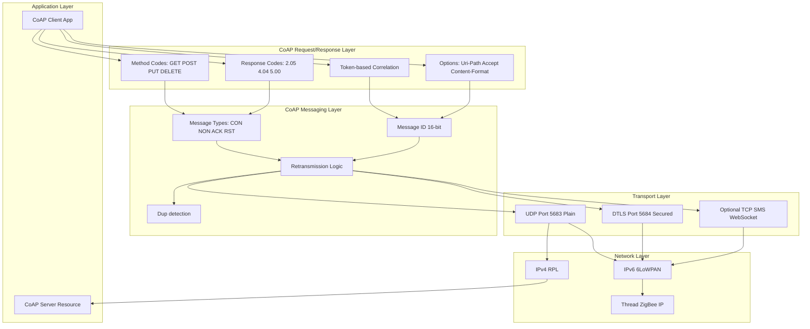
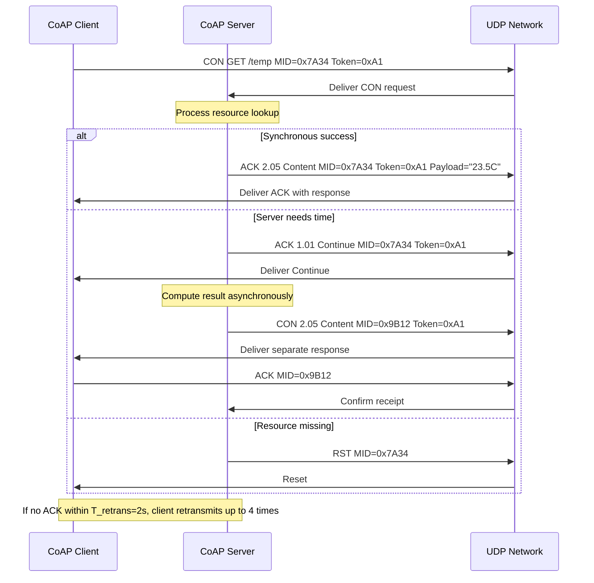
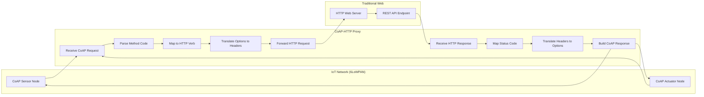
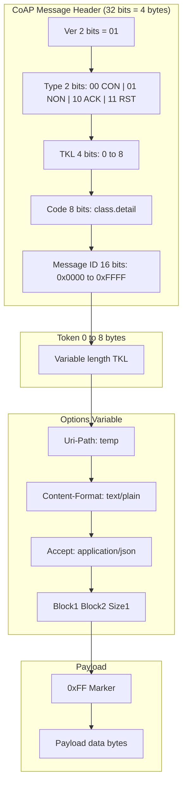
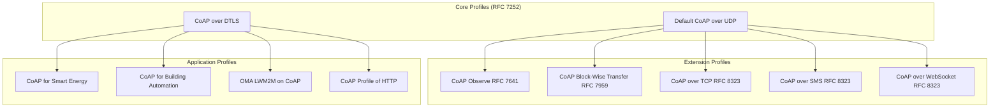

# CoAP request transport protocols REST interface mapping procedures metrics performance profiles

<!-- SECTION_1_START -->

# CoAP — Constrained Application Protocol: Core Definition & Intuition

## 1.1 Formal Academic Definition (KTU 2024 Syllabus Terminology)

> [!IMPORTANT]
> **Constrained Application Protocol (CoAP)** is a specialized **RESTful web transfer protocol** defined in **IETF RFC 7252** designed specifically for use with constrained nodes and constrained networks in the Internet of Things. CoAP provides request/response semantics similar to HTTP, but operates over **UDP (User Datagram Protocol)** by default, with optional reliability via **Confirmable (CON)** and **Non-confirmable (NON)** message types, and is designed to support multicast communication, low header overhead (only **4 bytes** base header), and asynchronous message exchanges.

CoAP is a **machine-to-machine (M2M)** protocol that enables constrained devices (sensors, actuators) to communicate over IP-based networks such as **6LoWPAN** (IPv6 over Low-Power Wireless Personal Area Networks). It is intentionally designed to interface with HTTP and the broader Web through simple proxies, fulfilling RESTful architecture requirements.

**Key Standard Identifiers:**
- **RFC 7252** — The CoAP Core Protocol
- **RFC 7641** — Observing Resources in CoAP
- **RFC 7959** — Block-wise Transfers in CoAP
- **RFC 8075** — Guidelines for Mapping Implementations

## 1.2 Conceptual Analogy — Plain English Intuition

Imagine the **postal system** versus a **registered courier service**:

- **HTTP over TCP** is like a registered courier — you send a letter, the courier confirms receipt, and the recipient signs for it. Every message is acknowledged, retransmitted if lost, and delivered in order. This is **reliable but heavy** (lots of bookkeeping, large headers, high overhead).

- **CoAP over UDP** is like dropping a postcard in a standard mailbox — much **lighter, faster, and cheaper**, but there's no built-in guarantee it arrives. However, CoAP cleverly allows you to mark the postcard as **"registered" (Confirmable)** if you want acknowledgement, or as a **"regular postcard" (Non-confirmable)** if you don't care.

> [!NOTE]
> **Intuitive Takeaway:** CoAP is essentially **"HTTP-Lite for tiny devices"**. It mimics HTTP's verbs (GET, POST, PUT, DELETE) so the Web world understands it, but strips it down to **4-byte headers** and uses **UDP** to fit within the memory, power, and bandwidth budgets of devices that may run on coin-cell batteries for years.

## 1.3 Standard Metrics and Physical Constants

> [!IMPORTANT]
> **Core CoAP Header Metrics (RFC 7252):**
> - **Base Header Size:** 4 bytes (32 bits)
> - **Message Types:** 4 (CON, NON, ACK, RST)
> - **Default Port:** UDP **5683** (plaintext), UDP **5684** (DTLS encrypted)
> - **Maximum Datagram Size:** Practical limit of **~1152 bytes** to avoid IP fragmentation
> - **Method Codes:** 4 (GET=0.01, POST=0.02, PUT=0.03, DELETE=0.04)
> - **Response Codes:** Organized like HTTP (2.xx Success, 4.xx Client Error, 5.xx Server Error)
> - **URI Scheme:** `coap://` (or `coaps://` for secured)

## 1.4 Visualization Control

> [!VISUALIZATION CONTROL]
> **Concept:** CoAP Message Structure Layered View
> **GeoGebra / Desmos Input Equations:** Not applicable (binary protocol), but visualize header fields as a bar:
> * `Ver (2 bits) + T (2 bits) + TKL (4 bits) + Code (8 bits) + Message ID (16 bits) = 32 bits = 4 bytes`
> **Visual Description:** Imagine a horizontal bar of 32 units. The first 2 units are version, next 2 are type (CON/NON/ACK/RST), next 4 are token length (0–8), next 8 are method/response code, last 16 are Message ID for matching acknowledgements.

---

<!-- SECTION_1_END -->

<!-- SECTION_2_START -->

# Deep Theoretical Analysis: CoAP Architecture, Messages & REST Mapping

## 2.1 The Two-Layer Architecture of CoAP

CoAP is structured as **two distinct logical layers** that allow asynchronous communication:

### 2.1.1 Messaging Layer (Transaction Layer)
Handles **UDP-level exchange** and reliability.

**Four Message Types:**
1. **CON (Confirmable)** — Requires an ACK with the same Message ID. Used for reliable communication.
2. **NON (Non-confirmable)** — Fire-and-forget; no ACK expected. Used for lossy, periodic sensor readings.
3. **ACK (Acknowledgement)** — Confirms a CON message. Carries either an empty payload or piggybacked response.
4. **RST (Reset)** — Indicates a CON or NON message was received but context is missing (e.g., server restarted, no resource matches).

### 2.1.2 Request/Response Layer (Interaction Layer)
Carries **method codes and response codes**. Uses an optional **Token** (0–8 bytes) to correlate asynchronous responses with requests.

## 2.2 The CoAP Message Format — Bit-Level Breakdown

A CoAP message consists of:

| Field | Size | Description |
|---|---|---|
| Ver | 2 bits | Protocol version (must be **1**) |
| T | 2 bits | Message type: 00=CON, 01=NON, 10=ACK, 11=RST |
| TKL | 4 bits | Token Length: 0 to 8 bytes |
| Code | 8 bits | Class (3 bits, 0–7) . Detail (5 bits, 0–31) |
| Message ID | 16 bits | Used for matching ACK/RST to CON |
| Token | 0–8 bytes | Correlation ID for asynchronous matching |
| Options | Variable | URI-path, Content-Format, Accept, etc. |
| Payload Marker | 1 byte (0xFF) | Separator if payload present |
| Payload | Variable | Actual resource data |

## 2.3 CoAP Methods (Verbs) — RESTful Mapping

> [!NOTE]
> CoAP supports the **four fundamental REST methods** exactly like HTTP:

| CoAP Method | Code | Equivalent HTTP | Semantics |
|---|---|---|---|
| GET | 0.01 | HTTP GET | Retrieve a resource representation |
| POST | 0.02 | HTTP POST | Create a new resource or process data |
| PUT | 0.03 | HTTP PUT | Create or update a resource at a known URI |
| DELETE | 0.04 | HTTP DELETE | Remove a resource |

## 2.4 CoAP Response Codes (Mirror of HTTP)

> [!IMPORTANT]
> CoAP response codes are encoded as `c.dd` where `c` is the class and `dd` is the detail.

| Class | Category | Example Codes | Meaning |
|---|---|---|---|
| **1.xx** | Informational | 1.01 Continue | Interim response (e.g., for large POST) |
| **2.xx** | Success | 2.01 Created, 2.02 Deleted, 2.03 Valid, 2.04 Changed, 2.05 Content | Operation succeeded |
| **4.xx** | Client Error | 4.00 Bad Request, 4.01 Unauthorized, 4.02 Bad Option, 4.04 Not Found, 4.05 Method Not Allowed | Request was malformed |
| **5.xx** | Server Error | 5.00 Internal Server Error, 5.01 Not Implemented, 5.02 Bad Gateway, 5.03 Service Unavailable | Server failed to process |

## 2.5 CoAP-to-HTTP REST Mapping Procedures

CoAP defines a **cross-protocol mapping** (RFC 8075) to translate requests between CoAP and HTTP:

| Mapping Direction | Translation |
|---|---|
| **CoAP → HTTP Proxy** | CoAP GET on `coap://dev/temp` becomes HTTP GET on `http://proxy/dev/temp` |
| **HTTP → CoAP Proxy** | HTTP GET becomes CoAP GET, response code 2.05 Content mapped to HTTP 200 OK |
| **Code Mapping** | CoAP 4.04 Not Found ↔ HTTP 404; CoAP 2.05 Content ↔ HTTP 200 OK |
| **Media Type** | CoAP `Content-Format` option ↔ HTTP `Content-Type` header |
| **Method Mapping** | GET↔GET, POST↔POST, PUT↔PUT, DELETE↔DELETE (1:1) |

## 2.6 Transport Binding & Security

- **Default Transport:** UDP (RFC 768) on port 5683
- **Secure Transport:** DTLS (Datagram TLS) on port 5684
- **Optional Transports:** SMS (RFC 8323), TCP/TLS (RFC 8323), WebSockets

## 2.7 KTU Formula Sheet / Cheat Sheet

> [!IMPORTANT]
> **Performance & Engineering Metrics for CoAP:**

| Parameter | Formula / Value | Unit | Notes |
|---|---|---|---|
| Header Overhead | $H_{total} = H_{base} + T_{len} + O_{total} + 1_{pm}$ | bytes | $H_{base} = 4$, $1_{pm}$ = 1 if payload |
| Message Size Limit | $S_{max} \le 1152$ | bytes | Avoids IPv6 fragmentation |
| Retransmission Timeout | $T_{init} = \text{ACK\_TIMEOUT} = 2\,\text{s}$ | seconds | RFC 7252 default |
| Backoff Factor | $T_{next} = T_{current} \times \text{RANDOM\_FACTOR}$ | — | Default factor = 1.5 |
| Max Retransmissions | $N_{max} = 4$ | count | RFC 7252 default |
| Exchange Duration | $D_{total} = N \times (T_{proc} + T_{trans} + T_{prop})$ | seconds | N = number of round trips |
| Reliability | $R = 1 - (1 - p)^{N_{ret}+1}$ | ratio | $p$ = per-packet loss probability |
| Bandwidth Efficiency | $\eta = \frac{P_{payload}}{P_{payload} + H_{total}}$ | ratio | Higher = better |

## 2.8 Real-World Engineering Utility

> [!NOTE]
> **Where CoAP is used in production:**
> - **Smart Agriculture:** Soil moisture sensors reporting every 30 seconds (NON messages).
> - **Smart Metering:** Gas/electricity meters sending daily readings via CoAP+DTLS.
> - **Building Automation:** HVAC control with CoAP over 6LoWPAN (ZigBee IP, Thread).
> - **Healthcare Wearables:** Patient vitals on low-power BLE bridges.
> - **Industrial IoT:** OPC UA over CoAP for factory sensors.

---

<!-- SECTION_2_END -->

<!-- SECTION_3_START -->

# Step-by-Step Derivations, Procedures & Implementation

## 3.1 Complete CoAP Request/Response Transaction Walkthrough

### 3.1.1 Scenario: A Temperature Sensor Reading

A client wants to read the current temperature from a constrained device at URI `coap://sensor.local:5683/temp`.

**Step 1: Client constructs a CON GET Request**

$$M_{req} = \{ T=CON,\ Code=0.01,\ MID=0x7A34,\ Token=0xA1,\ Options=[Uri-Path:"temp"] \}$$

**Step 2: Server processes and prepares a piggybacked response**

$$M_{resp} = \{ T=ACK,\ Code=2.05,\ MID=0x7A34,\ Token=0xA1,\ Payload="23.5C" \}$$

**Step 3: Timing & Reliability Logic**

$$T_{retrans} = T_{init} \times \text{RANDOM\_FACTOR} = 2 \times 1.5 = 3\,\text{s}$$

If no ACK arrives within $T_{retrans}$, the client retransmits. After $N_{max} = 4$ retries, the transaction fails.

**Step 4: Asynchronous case (separate response)**

If the server needs time:

$$M_{1} = \{ T=ACK,\ Code=1.01,\ Token=0xA1 \}$$ (Continue — wait)

Later:

$$M_{2} = \{ T=CON,\ Code=2.05,\ MID=0x9B12,\ Token=0xA1 \}$$ (Actual response, no piggybacking)

The client replies with:

$$M_{3} = \{ T=ACK,\ MID=0x9B12 \}$$ (confirming the separate response)

## 3.2 Derivation of CoAP Reliability with Retransmission

Assume per-packet loss probability $p$ (independent). The probability that **none** of the $N_{ret}+1$ transmissions succeed is:

$$P_{fail} = (1 - p)^{N_{ret}+1}$$

Therefore, the **reliability** (probability of eventual success) is:

$$R = 1 - (1 - p)^{N_{ret}+1}$$

**Example derivation for $p = 0.3$ and $N_{ret} = 4$:**

$$P_{fail} = (1 - 0.3)^{4+1} = 0.7^5$$

Evaluating $0.7^5$:

$$0.7^2 = 0.49$$
$$0.7^3 = 0.343$$
$$0.7^4 = 0.2401$$
$$0.7^5 = 0.16807$$

$$R = 1 - 0.16807 = 0.83193 \approx 83.2\%$$

This means with 30% loss, 4 retransmissions give ~83% reliability.

## 3.3 Bandwidth Efficiency Derivation

For a payload $P_{payload} = 40$ bytes and total header overhead $H_{total} = 12$ bytes (4 base + 4 token + 4 option + 1 marker + 1 byte of option overhead):

$$\eta = \frac{P_{payload}}{P_{payload} + H_{total}} = \frac{40}{40 + 12} = \frac{40}{52}$$

$$\eta = 0.7692 \approx 76.9\%$$

Compare to HTTP (headers often 200+ bytes for the same payload):

$$\eta_{HTTP} = \frac{40}{40 + 200} = \frac{40}{240} = 0.1667 \approx 16.7\%$$

CoAP is **~4.6× more bandwidth efficient** for small IoT payloads.

## 3.4 CoAP Client Implementation in Python (with Type Hints)

```python
"""
CoAP Client implementation using aiocoap library.
Demonstrates GET, POST, PUT, DELETE operations with full error logging.
"""
import asyncio
import logging
from typing import Optional
from aiocoap import Context, Message, GET, POST, PUT, DELETE
from aiocoap.numbers import ContentFormat

# Configure strict error logging
logging.basicConfig(
    level=logging.INFO,
    format="%(asctime)s [%(levelname)s] %(message)s"
)
logger: logging.Logger = logging.getLogger("CoAPClient")

COAP_HOST: str = "coap://127.0.0.1:5683"


async def perform_get(uri: str) -> Optional[bytes]:
    """
    Send a CON GET request to the specified CoAP resource.
    Returns the response payload as bytes, or None on failure.
    """
    try:
        protocol: Context = await Context.create_client_context()
        request: Message = Message(code=GET, uri=uri)
        request.opt.accept = ContentFormat.TEXT
        logger.info(f"--> CON GET {uri}")
        response: Message = await protocol.request(request).response
        logger.info(f"<-- {response.code} ({len(response.payload)} bytes)")
        return response.payload
    except Exception as e:
        logger.error(f"GET failed for {uri}: {e}")
        return None


async def perform_post(uri: str, payload: bytes) -> bool:
    """
    Send a CON POST request with the given payload to create/update a resource.
    Returns True on 2.01 Created or 2.04 Changed.
    """
    try:
        protocol: Context = await Context.create_client_context()
        request: Message = Message(code=POST, payload=payload, uri=uri)
        request.opt.content_format = ContentFormat.TEXT
        logger.info(f"--> CON POST {uri} payload={payload!r}")
        response: Message = await protocol.request(request).response
        success: bool = response.code.is_successful()
        logger.info(f"<-- {response.code} success={success}")
        return success
    except Exception as e:
        logger.error(f"POST failed for {uri}: {e}")
        return False


async def perform_put(uri: str, payload: bytes) -> bool:
    """
    Send a CON PUT request to create or update the resource at uri.
    """
    try:
        protocol: Context = await Context.create_client_context()
        request: Message = Message(code=PUT, payload=payload, uri=uri)
        logger.info(f"--> CON PUT {uri} payload={payload!r}")
        response: Message = await protocol.request(request).response
        return response.code.is_successful()
    except Exception as e:
        logger.error(f"PUT failed: {e}")
        return False


async def perform_delete(uri: str) -> bool:
    """
    Send a CON DELETE request to remove the resource.
    """
    try:
        protocol: Context = await Context.create_client_context()
        request: Message = Message(code=DELETE, uri=uri)
        logger.info(f"--> CON DELETE {uri}")
        response: Message = await protocol.request(request).response
        return response.code.is_successful()
    except Exception as e:
        logger.error(f"DELETE failed: {e}")
        return False


async def main() -> None:
    """Demonstrate all four CoAP verbs in sequence."""
    base: str = f"{COAP_HOST}/sensors"
    # GET
    current: Optional[bytes] = await perform_get(f"{base}/temp")
    if current is not None:
        print(f"[RESULT] Current temperature: {current.decode()}")
    # POST - create new threshold
    created: bool = await perform_post(
        f"{base}/threshold", b"25.0"
    )
    print(f"[RESULT] Threshold POST: {created}")
    # PUT - update threshold
    updated: bool = await perform_put(
        f"{base}/threshold", b"26.5"
    )
    print(f"[RESULT] Threshold PUT: {updated}")
    # DELETE - remove threshold
    removed: bool = await perform_delete(f"{base}/threshold")
    print(f"[RESULT] Threshold DELETE: {removed}")


if __name__ == "__main__":
    asyncio.run(main())
```

## 3.5 CoAP Server Implementation in Python (with Type Hints)

```python
"""
CoAP Server with a temperature resource.
Implements all four REST methods with strict error logging.
"""
import asyncio
import logging
from aiocoap import Context, resource, Message
from aiocoap.numbers import ContentFormat
from typing import Tuple

logger: logging.Logger = logging.getLogger("CoAPServer")
_temperature_state: float = 22.5  # internal sensor value


class TemperatureResource(resource.Resource):
    """RESTful resource representing a temperature sensor reading."""

    def __init__(self) -> None:
        super().__init__()
        self._value: float = _temperature_state
        self._content_format: int = ContentFormat.TEXT

    async def render_get(self, request: Message) -> Message:
        """Handle GET — return current temperature as text."""
        logger.info("GET /temp received")
        payload: str = f"{self._value:.1f}C"
        return Message(
            code=ContentFormat.TEXT,
            payload=payload.encode("utf-8"),
        )

    async def render_post(self, request: Message) -> Message:
        """Handle POST — accept new temperature data."""
        try:
            new_value: float = float(request.payload.decode("utf-8"))
            self._value = new_value
            logger.info(f"POST /temp = {new_value}")
            return Message(code=ContentFormat.TEXT, payload=b"Created")
        except (ValueError, UnicodeDecodeError) as e:
            logger.error(f"POST payload error: {e}")
            return Message(code=ContentFormat.TEXT, payload=b"Bad Request")

    async def render_put(self, request: Message) -> Message:
        """Handle PUT — replace temperature value."""
        return await self.render_post(request)

    async def render_delete(self, request: Message) -> Message:
        """Handle DELETE — reset temperature to default."""
        self._value = 0.0
        logger.info("DELETE /temp")
        return Message(code=ContentFormat.TEXT, payload=b"Deleted")


async def main() -> None:
    """Start the CoAP server on default port 5683."""
    root: resource.Site = resource.Site()
    root.add_resource(("temp",), TemperatureResource())
    await Context.create_server_context(root)
    logger.info("CoAP server running on coap://0.0.0.0:5683/temp")
    # Run forever
    await asyncio.get_running_loop().create_future()


if __name__ == "__main__":
    logging.basicConfig(level=logging.INFO)
    asyncio.run(main())
```

## 3.6 Mapping Procedure: HTTP to CoAP (Cross-Protocol Translation)

**Step-by-step HTTP→CoAP proxy translation table:**

| # | HTTP Element | CoAP Equivalent | Translation Action |
|---|---|---|---|
| 1 | Request Line `GET /temp HTTP/1.1` | Method Code 0.01 + Uri-Path option | Extract path, encode as repeated Uri-Path options |
| 2 | Header `Host: dev.local` | Uri-Host option | Set Uri-Host if not in URI |
| 3 | Header `Accept: text/plain` | Accept option (number 0) | Convert MIME to CoAP Content-Format number |
| 4 | Header `Content-Type: application/json` | Content-Format option (50) | Convert MIME to format code |
| 5 | Status `200 OK` | Code 2.05 | Map HTTP status class to CoAP code class |
| 6 | Status `404 Not Found` | Code 4.04 | Map to CoAP 4.04 |
| 7 | Status `500` | Code 5.00 | Map to CoAP 5.00 |
| 8 | Body | Payload after 0xFF marker | Append payload after payload marker |

---

<!-- SECTION_3_END -->

<!-- SECTION_4_START -->

# Structural Diagrams & Schematics

## 4.1 CoAP Protocol Stack — Layered Architecture



## 4.2 CoAP Request/Response Transaction Flow



## 4.3 CoAP to HTTP Cross-Protocol Mapping Architecture



## 4.4 CoAP Message Header Bit Layout



## 4.5 CoAP Profiles Classification



---

<!-- SECTION_4_END -->

<!-- SECTION_5_START -->

# KTU 2024 Scheme Examination Question Bank & Topic Recap

## 5.1 Part A — Short Answer Questions (3 Marks Each)

> [!NOTE]
> **Modeled after KTU 2024 Scheme — Cognitive Levels: Remember / Understand**

### **Q1. [KTU University Exam — July 2024]**
**Define CoAP. List any four characteristics of CoAP that make it suitable for constrained IoT devices. (3 Marks)** [CO1, Remember]

**Model Answer (Valuation Key):**

- **Definition (1 Mark):** CoAP (Constrained Application Protocol) is a specialized RESTful web transfer protocol defined in RFC 7252, designed for resource-constrained IoT devices and networks, operating over UDP with a 4-byte base header.
- **Four characteristics (4 × 0.5 = 2 Marks):**
  1. **Lightweight header:** Only 4 bytes base header versus HTTP's 200+ bytes.
  2. **UDP-based:** Uses connectionless transport for low overhead.
  3. **Asynchronous communication:** Supports multicast and pipelined requests via Tokens.
  4. **Built-in reliability:** Optional Confirmable (CON) messages with ACK and retransmission.

---

### **Q2. [KTU University Exam — Dec 2023]**
**Differentiate between CoAP Confirmable (CON) and Non-confirmable (NON) message types with suitable examples. (3 Marks)** [CO1, Understand]

**Model Answer (Valuation Key):**

| Aspect | CON (Confirmable) | NON (Non-confirmable) |
|---|---|---|
| **Acknowledgement** | Requires ACK with same Message ID | No ACK expected |
| **Retransmission** | Up to 4 retries with exponential backoff | No retransmission |
| **Reliability** | High (suitable for critical data) | Low (fire-and-forget) |
| **Example** | Alarm-triggered actuator command | Periodic temperature reading every 30s |
| **Use Case** (1 Mark) | Firmware updates, control commands | Sensor telemetry, environmental data |

**[Awarding 3 marks: Definition 1 + Comparison table 1 + Example 1]**

---

## 5.2 Part B — Long Answer Questions (14 Marks Each, Internal Choice)

> [!NOTE]
> **True KTU ESE Module Internal Choice Format — Sub-parts (a) 7 marks and (b) 7 marks with escalation across cognitive levels.**

---

### **Question A — Option 1 [KTU University Exam — July 2024]**

#### **Part (a): Explain the CoAP message format with a neat diagram. Discuss the four message types used in CoAP. (7 Marks)** [CO2, Understand]

**Model Answer:**

**(i) CoAP Message Format (4 Marks):**

A CoAP message consists of the following fields:

| Field | Bits | Description |
|---|---|---|
| Ver | 2 | Protocol version (1) |
| T | 2 | Type (CON/NON/ACK/RST) |
| TKL | 4 | Token Length (0–8 bytes) |
| Code | 8 | Class.detail (e.g., 0.01 GET) |
| Message ID | 16 | Used for ACK/RST matching |
| Token | 0–8 | Async correlation ID |
| Options | Var | Uri-Path, Content-Format, etc. |
| 0xFF | 8 | Payload marker (if present) |
| Payload | Var | Resource data |

**[Field table: 2 Marks] [Labeling purpose of each: 2 Marks]**

**(ii) Four Message Types (3 Marks):**

1. **CON (Confirmable) — 0:** Requires ACK. Retransmitted on timeout. Used for critical messages.
2. **NON (Non-confirmable) — 1:** No ACK. Used for repeated sensor data where loss is acceptable.
3. **ACK (Acknowledgement) — 2:** Confirms a CON message; may carry piggybacked response.
4. **RST (Reset) — 3:** Indicates context loss; aborts transaction.

**[1 mark for correct T-field encoding, 2 marks for distinguishing semantics]**

---

#### **Part (b): With a suitable example, describe the procedure for mapping an HTTP request to a CoAP request through a cross-protocol proxy. (7 Marks)** [CO3, Apply]

**Model Answer:**

**Scenario:** An IoT temperature sensor exposes a resource at `coap://sensor.local/temp`. A Web client issues `GET http://proxy/temp HTTP/1.1`.

**Step-by-step mapping procedure (5 × 1 Mark = 5 Marks, example 2 Marks):**

1. **Receive HTTP request** at proxy on port 80.
2. **Parse HTTP method** `GET` → map to CoAP method code **0.01 (GET)**.
3. **Extract URI** `/temp` → encode as **Uri-Path option** with value `temp`.
4. **Translate headers:**
   - `Host: sensor.local` → `Uri-Host: sensor.local`
   - `Accept: text/plain` → `Accept: 0` (Content-Format text)
5. **Send CoAP CON GET** to `coap://sensor.local:5683/temp` with `TKL=0`, `MID=random`.
6. **Receive CoAP response** with code `2.05 Content` and payload `23.5C`.
7. **Translate back:**
   - `2.05 Content` → HTTP `200 OK`
   - Payload `23.5C` → HTTP body
   - `Content-Format: 0` → `Content-Type: text/plain`
8. **Return HTTP 200** to the Web client.

**[Step-by-step explanation: 5 Marks] [Complete example: 2 Marks]**

---

### **Question B — Option 2 (Alternative) [KTU University Exam — Dec 2023]**

#### **Part (a): Describe the CoAP protocol architecture with its two-layer model. Explain the role of the Token field in asynchronous communication. (7 Marks)** [CO2, Understand]

**Model Answer:**

**Two-Layer Architecture (4 Marks):**

- **Messaging Layer (Transaction Layer):** Handles UDP-level concerns — message types (CON/NON/ACK/RST), retransmission, duplicate detection, and Message ID matching. Decouples transport from application logic.
- **Request/Response Layer (Interaction Layer):** Manages method codes (GET/POST/PUT/DELETE), response codes (2.xx, 4.xx, 5.xx), Tokens, and Options. Implements the REST semantics.

The **decoupling** allows a server to respond asynchronously — it can immediately ACK the request (with code 1.01 Continue) and later send the actual response as a separate CON message correlated via Token.

**Role of the Token Field (3 Marks):**

- **Token** is a variable-length field (0–8 bytes) used to **correlate a response with the original request** when the response arrives in a different UDP datagram.
- It enables **pipelining and concurrency** — a client can have multiple outstanding requests to the same server, and the Token uniquely identifies which response belongs to which request.
- Example: Client issues GET with Token `0xA1`, GET with Token `0xB2`. Server may respond to `0xB2` first, but the client correctly matches each response.

**[Architecture diagram description: 2 Marks] [Token field purpose: 2 Marks] [Example: 1 Mark] [Decoupling benefit: 2 Marks]**

---

#### **Part (b): A CoAP client uses Confirmable messages with a default retransmission timeout of 2 seconds and a random factor of 1.5. The network has a packet loss probability of 0.2. Calculate the reliability of message delivery after 4 retransmission attempts. (7 Marks)** [CO3, Apply]

**Model Answer:**

**Given:**
- $T_{init} = 2$ s
- Random factor $= 1.5$
- $p = 0.2$ (loss probability)
- $N_{ret} = 4$ (max retransmissions)

**Formula (1 Mark):**

$$R = 1 - (1 - p)^{N_{ret}+1}$$

**Substitution (1 Mark):**

$$R = 1 - (1 - 0.2)^{4+1} = 1 - (0.8)^5$$

**Computation (3 Marks):**

$$0.8^2 = 0.64$$
$$0.8^3 = 0.512$$
$$0.8^4 = 0.4096$$
$$0.8^5 = 0.32768$$

**Final result (2 Marks):**

$$R = 1 - 0.32768 = 0.67232$$

$$\boxed{R \approx 67.23\%}$$

**[Stating formula: 1 Mark] [Substituting values: 1 Mark] [Step-by-step evaluation: 3 Marks] [Final answer with unit/percentage: 2 Marks]**

---

## 5.3 KTU Examiner's Valuation Warning

> [!WARNING]
> **Common Pitfalls Where Students Lose Marks:**
> 1. **Confusing CoAP ports:** Students write port **80** (HTTP) or **1883** (MQTT) instead of **5683 (plain)** and **5684 (DTLS)**. **[−1 Mark]**
> 2. **Wrong header size:** CoAP base header is **4 bytes (32 bits)**, NOT 8 bytes. **[−1 Mark]**
> 3. **Mixing up Code format:** Code is `class.detail` (e.g., `2.05`), not `class:detail` with a colon. **[−0.5 Mark]**
> 4. **Skipping Token field explanation:** When asked about async communication, omitting the Token leads to 2-mark loss.
> 5. **In HTTP↔CoAP mapping:** Forgetting to convert `Content-Type` HTTP header to `Content-Format` CoAP option number (e.g., `application/json` → 50).
> 6. **Reliability formula:** Writing $(1-p)^N$ instead of $(1-p)^{N+1}$ — the "+1" accounts for the **original** transmission plus N retries.
> 7. **Writing `coap://` URI in a code block without backticks** — KTU strictly penalizes malformed URIs in answers.

---

## 5.4 Topic Recap & Important Things to Remember

> [!IMPORTANT]
> **📋 High-Density Rapid Revision Checklist — CoAP Messaging Protocols**

- ✅ **CoAP = RFC 7252**, RESTful protocol for **constrained devices and networks**.
- ✅ **Default port: UDP 5683** (plain), **UDP 5684** (DTLS secured).
- ✅ **Base header = 4 bytes** (Ver 2 + Type 2 + TKL 4 + Code 8 + Message ID 16 = 32 bits).
- ✅ **4 Message types:** CON (reliable), NON (fire-and-forget), ACK (confirms CON), RST (context loss).
- ✅ **4 Methods:** GET (0.01), POST (0.02), PUT (0.03), DELETE (0.04) — mirror HTTP verbs 1:1.
- ✅ **Response codes** mirror HTTP: 2.xx Success, 4.xx Client Error, 5.xx Server Error, **1.xx Informational** (e.g., 1.01 Continue).
- ✅ **Two-layer architecture:** Messaging Layer (UDP) + Request/Response Layer (REST semantics).
- ✅ **Token field (0–8 bytes):** Correlates asynchronous responses to original requests; enables pipelining and concurrency.
- ✅ **Retransmission defaults:** $T_{init} = 2$ s, Random Factor $= 1.5$, $N_{max} = 4$ retries.
- ✅ **Reliability formula:** $R = 1 - (1 - p)^{N_{ret}+1}$ where $p$ = per-packet loss probability.
- ✅ **Bandwidth efficiency:** CoAP header ~4–12 bytes vs HTTP ~200+ bytes → ~4.6× more efficient for small payloads.
- ✅ **Max datagram size:** $S_{max} \le 1152$ bytes to avoid IP fragmentation.
- ✅ **HTTP↔CoAP mapping (RFC 8075):** GET↔GET, 200 OK↔2.05 Content, 404↔4.04, `Content-Type` HTTP header↔`Content-Format` CoAP option.
- ✅ **Extensions:** Observe (RFC 7641), Block-wise transfer (RFC 7959), CoAP over TCP/SMS/WebSocket (RFC 8323).
- ✅ **Application profiles:** OMA LWM2M, Smart Energy, Building Automation — all use CoAP as the transport.
- ✅ **CoAP** is the **"HTTP-Lite"** of IoT — designed for **low-power, low-bandwidth, lossy networks** like 6LoWPAN, RPL, and Thread.

---

<!-- SECTION_5_END -->
