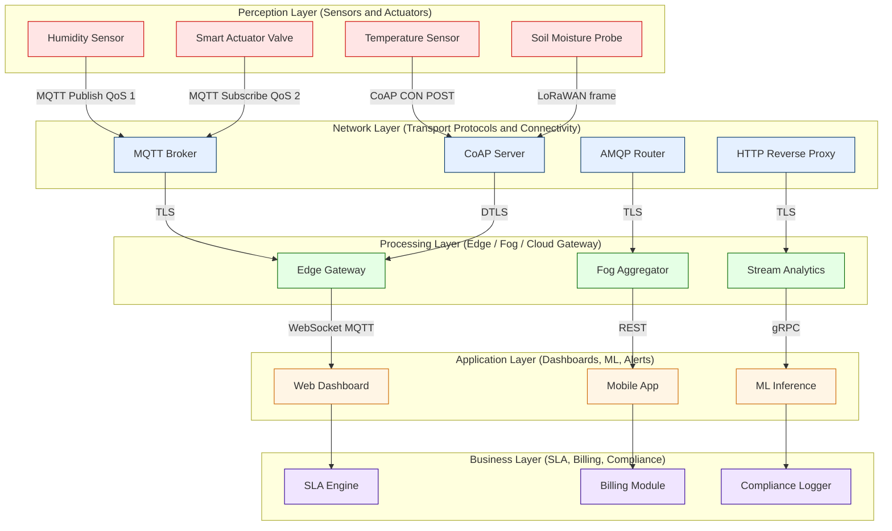
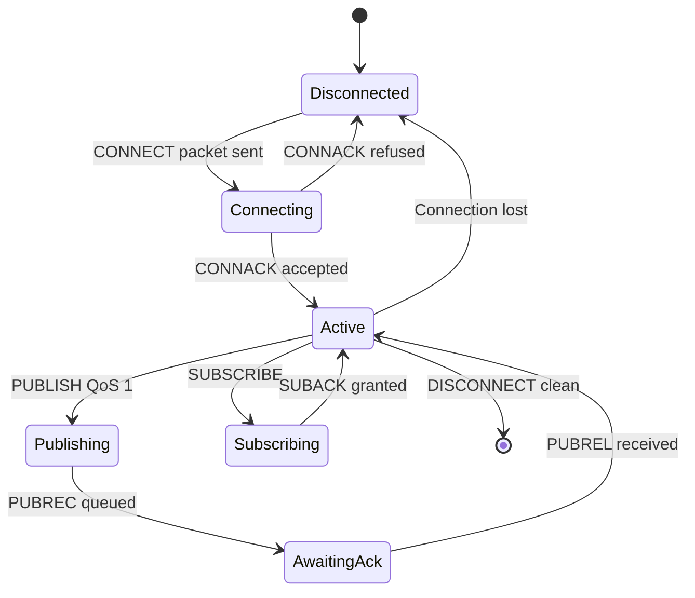

# IoT system node network interaction specifications frameworks architectures parameters design rules

<!-- SECTION_1_START -->

# IoT System Node Network Interaction Specifications Frameworks Architectures Parameters Design Rules

> [!IMPORTANT]
> **KTU 2024 Scheme | PECST713 – Internet of Things | Module 1 Focus**
> This topic forms the **architectural foundation** of every IoT solution. Mastering it guarantees easy marks in **Part A (3-mark)** and high-yield scoring in **Part B (14-mark)** design questions.

## 1.1 Formal Academic Definition

An **IoT System Node Network Interaction Specification** is a formally documented, layered contract that defines **how heterogeneous IoT nodes (sensors, actuators, gateways, edge devices, and cloud services) discover, identify, authenticate, exchange, and interpret data** across heterogeneous network fabrics.

The **specification framework** encapsulates the standardized **architectural reference model** (typically 3-layer, 4-layer, 5-layer, or SOA-based), the **interaction parameters** (latency, jitter, throughput, duty cycle, payload size, MTU, energy budget), and the **design rules** (naming, addressing, message ordering, QoS, security, and scalability constraints) that every node in the network must obey to guarantee **interoperability, determinism, and fault tolerance**.

> [!NOTE]
> **KTU Board Definition Snapshot:**
> *"An IoT system architecture is a stack of functional layers — perception, network/transport, processing, application, and business — orchestrated by standardized interaction protocols (CoAP, MQTT, AMQP, HTTP, DDS, LwM2M, OPC-UA) that govern node-to-node and node-to-cloud communication, while design rules enforce scalability, security, and Quality of Service (QoS)."*

## 1.2 Conceptual Analogy — The "Smart Postal System"

Imagine an **international courier network**:

| Real-World Courier Analogy | IoT Equivalent Mapping |
|---|---|
| Sender's house address | Unique **Device ID / URI** (e.g., `coap://node12.sensor.lab/temp`) |
| Letter format / envelope | **Message payload schema** (CBOR, JSON, SenML) |
| Registered post rules | **Transport protocol** (MQTT, CoAP, HTTP) |
| Sorting office | **Gateway / Broker** (e.g., MQTT Broker, CoAP Server) |
| Delivery confirmation | **QoS acknowledgement** (QoS 0/1/2, Confirmable / Non-confirmable) |
| Postal regulations (size, weight) | **Design rules** (max payload 1024 B for IEEE 802.15.4, duty-cycle limits) |
| International postal treaty | **Reference architecture** (IoTWF, RAMI 4.0, oneM2M) |

Just as postal treaties allow letters from Tokyo to reach Lisbon, **IoT specification frameworks allow a temperature sensor in Kerala to publish data to a cloud dashboard in Frankfurt** — seamlessly, securely, and deterministically.

## 1.3 Core Architecture Layers at a Glance

**1. Perception / Sensing Layer** — Physical sensors, RFID tags, actuators.

**2. Network / Transport Layer** — Connectivity (Wi-Fi, BLE, LoRa, ZigBee, 6LoWPAN, NB-IoT) + transport protocols (MQTT, CoAP, AMQP, DDS).

**3. Processing / Edge Layer** — Edge gateways, fog nodes, stream analytics, data normalization.

**4. Application / Service Layer** — Dashboards, alerting, control logic, ML inference.

**5. Business / Management Layer** — SLA, billing, compliance, orchestration, monetization.

> [!TIP]
> **KTU Memory Trick — "P-N-P-A-B"** → *Perception → Network → Processing → Application → Business* (top-to-bottom reading order matches most answer sheets).

## 1.4 Why This Topic is a "Sure-Shot" in KTU Exams

- It is the **first module** and the most descriptive → examiners love to test definitions.
- Almost every Part A paper has a **3-mark question** on IoT reference architecture or protocol layering.
- Part B (14 marks) often asks for a **full architectural diagram + protocol justification + design rule table**.

> [!VISUALIZATION CONTROL]
> **Concept:** IoT 5-Layer Reference Architecture (vertical stack visualization)
> **GeoGebra / Desmos Input Coordinates (Layered Bar Representation):**
> * `Layer 5 (Business): y = 5` for `x ∈ [0, 5]`
> * `Layer 4 (Application): y = 4` for `x ∈ [0, 5]`
> * `Layer 3 (Processing): y = 3` for `x ∈ [0, 5]`
> * `Layer 2 (Network): y = 2` for `x ∈ [0, 5]`
> * `Layer 1 (Perception): y = 1` for `x ∈ [0, 5]`
> **Visual Description:** A vertical stacked bar with five colored bands. The bottom band (Layer 1) is widest because it hosts the *most nodes* (billions of sensors), and each layer above narrows — illustrating the **data funnel** from sensing to business decisions.

---

<!-- SECTION_1_END -->

<!-- SECTION_2_START -->

# 2. Deep Theoretical Analysis & KTU High-Yield Parameter / Formula Sheet

## 2.1 The "Interaction Specification" — A 7-Tuple Contract

Every IoT node interaction is fully described by the **7-tuple specification**:

$$ \mathcal{S} = \{ \mathcal{I}, \mathcal{A}, \mathcal{T}, \mathcal{P}, \mathcal{Q}, \mathcal{S}_{ec}, \mathcal{R}_{ules} \} $$

Where:

- $\mathcal{I}$ = **Identification** (unique URI / EPC / IPv6 address)
- $\mathcal{A}$ = **Addressing** (static vs. dynamic, IPv4 vs. IPv6, 6LoWPAN header compression)
- $\mathcal{T}$ = **Transport** (MQTT / CoAP / AMQP / HTTP / DDS)
- $\mathcal{P}$ = **Payload** (JSON, CBOR, SenML, Protocol Buffers, FlatBuffers)
- $\mathcal{Q}$ = **Quality of Service** (QoS 0/1/2, delivery guarantees, persistence)
- $\mathcal{S}_{ec}$ = **Security envelope** (TLS/DTLS, DTLS-PSK, OSCORE, ACE-OAuth)
- $\mathcal{R}_{ules}$ = **Design rules** (naming, retries, duty cycle, message ordering)

## 2.2 The Five Reference Architectures (Mandatory for KTU 2024)

### 2.2.1 3-Layer Architecture (Simplest — most frequent in Part A)

- **Perception Layer** → sensing
- **Network Layer** → transmission
- **Application Layer** → service delivery

### 2.2.2 4-Layer Architecture (Adds Support / Processing)

Perception → Network → **Support / Processing** → Application

### 2.2.3 5-Layer Architecture (KTU Favourite)

Perception → Transport → Processing → Application → **Business**

### 2.2.4 SOA-Based Architecture (Service-Oriented)

All layers expose **RESTful / gRPC / Web Service** endpoints.

### 2.2.5 Cloud-Fog-Edge (Modern Distributed)

- **Edge** → device-level filtering
- **Fog** → local gateway aggregation
- **Cloud** → global analytics

## 2.3 Network Interaction Parameters (The 10 Most Tested)

| # | Parameter | Definition | Typical Value / Unit | KTU 2024 Weightage |
|---|---|---|---|---|
| 1 | **Latency** | Time from publish to receive | ms (MQTT: ~30, CoAP: ~50) | High (Part A) |
| 2 | **Jitter** | Variation in latency | ms | Medium |
| 3 | **Throughput** | Successful messages / second | msg/s, kbps | High |
| 4 | **Duty Cycle** | % of time radio is ON (LoRaWAN) | 1 % (EU868) | Very High |
| 5 | **Packet Loss Ratio** | Lost / Total sent | % | High |
| 6 | **Payload Size** | App data bytes per frame | 51–1020 B | High |
| 7 | **MTU** | Max Transmission Unit | 1280 B (IPv6) | Medium |
| 8 | **Energy Budget** | Joules / day | mAh, J | High |
| 9 | **Range** | Max link distance | 10 m (BLE) – 15 km (LoRa) | Medium |
| 10 | **Node Density** | Devices / unit area | dev/km² | Medium |

## 2.4 The "Design Rule" Matrix (KTU's Favourite Table Question)

| Design Rule | MQTT | CoAP | AMQP | HTTP/REST | DDS |
|---|---|---|---|---|---|
| **Pattern** | Pub/Sub | Req/Resp | Pub/Sub + Queues | Req/Resp | Pub/Sub |
| **Transport** | TCP | UDP | TCP | TCP | UDP/TCP |
| **Header Size** | 2 B | 4 B | 8 B | ~20+ B | ~24 B |
| **QoS Levels** | 0,1,2 | NON, CON | Settle/Pre-settle | None (app-level) | Best-effort, Reliable |
| **Security** | TLS | DTLS / OSCORE | TLS / SASL | TLS | DTLS / TLS |
| **Ideal For** | Telemetry | Constrained | Enterprise | Web apps | Real-time control |
| **Power Use** | Medium | Low | High | High | High |

> [!IMPORTANT]
> **One-Line Examiner Trigger:** *"MQTT vs CoAP — when constrained + lossy link + low-power node → **CoAP**. When reliable LAN/cloud + variable consumers → **MQTT**."*

## 2.5 Framework Standardization Bodies (Names to Memorize)

- **IETF** → CoAP, MQTT (v5), 6LoWPAN, RPL
- **OASIS** → MQTT, AMQP
- **W3C** → WoT (Web of Things) Thing Description
- **oneM2M** → Global service-layer standard
- **IoT-Architecture (IoT-A / IoTWF)** → EU-funded reference model
- **RAMI 4.0** → Industry 4.0 reference architecture
- **OCF** → Open Connectivity Foundation (smart-home)
- **LwM2M** → Lightweight M2M (device management)

## 2.6 Real-World Engineering Utility

| Industry | Architecture Used | Protocol Stack | Design Rule Highlighted |
|---|---|---|---|
| **Smart Agriculture (Kerala)** | 5-Layer | LoRaWAN + CoAP + LwM2M | Duty cycle 1 % |
| **Smart Healthcare** | SOA + Edge-Fog | BLE + MQTT + TLS | Latency < 100 ms |
| **Industrial IoT (IIoT)** | RAMI 4.0 | OPC-UA + TSN | Determinism, jitter < 1 µs |
| **Smart City** | 3-Layer + Cloud | NB-IoT + MQTT | Node density 10⁶/km² |
| **Connected Vehicles** | DDS-based | SOME/IP + DDS-RTPS | End-to-end < 5 ms |

---

<!-- SECTION_2_END -->

<!-- SECTION_3_START -->

# 3. Step-by-Step Derivation of Interaction Parameters & Symbolic / Code Implementation

## 3.1 Derivation 1 — Effective End-to-End Latency of an IoT Publish

The **total end-to-end latency** $T_{e2e}$ for a sensor reading to reach the application layer is:

$$ T_{e2e} = T_{sense} + T_{proc} + T_{queue} + T_{trans} + T_{prop} + T_{app} $$

**Step-by-step expansion:**

- $T_{sense}$ = sensor acquisition time (typ. 10–100 ms for MEMS, 1–10 ms for thermistor)
- $T_{proc}$ = MCU processing + serialization (e.g., JSON encoding, CBOR encoding)
- $T_{queue}$ = broker/queue waiting time
- $T_{trans}$ = radio transmission time = $\dfrac{L_{frame}}{R_{bit}}$
- $T_{prop}$ = propagation delay = $\dfrac{d}{c}$ (negligible for terrestrial < 10 km)
- $T_{app}$ = application processing (e.g., dashboard render)

**Detailed numeric example** — A CoAP node sends a 64-byte temperature reading over IEEE 802.15.4:

$$ L_{frame} = 64 \, \text{B} = 512 \, \text{bit} $$

$$ R_{bit} = 250 \, \text{kbps} = 2.5 \times 10^{5} \, \text{bit/s} $$

$$ T_{trans} = \frac{512}{2.5 \times 10^{5}} = 2.048 \times 10^{-3} \, \text{s} = 2.048 \, \text{ms} $$

If sensor latency = 30 ms, MCU processing = 5 ms, broker queue = 8 ms, propagation (10 m link) = 0.03 µs, app processing = 20 ms:

$$ T_{e2e} = 30 + 5 + 8 + 2.048 + 0.00003 + 20 = 65.048 \, \text{ms} $$

## 3.2 Derivation 2 — Energy Budget per Reporting Cycle

For a battery-powered sensor reporting every $T_{report}$ seconds:

$$ E_{cycle} = V_{cc} \cdot I_{TX} \cdot t_{TX} + V_{cc} \cdot I_{RX} \cdot t_{RX} + V_{cc} \cdot I_{sleep} \cdot t_{sleep} $$

Battery lifetime in cycles:

$$ N_{cycles} = \frac{C_{bat}}{E_{cycle}} $$

Battery lifetime in years:

$$ T_{life} = \frac{N_{cycles} \cdot T_{report}}{365.25 \cdot 24 \cdot 3600} $$

**Worked numeric example** — LoRa node, $V_{cc} = 3.3$ V, $C_{bat} = 2400$ mAh:

- $I_{TX} = 90$ mA, $t_{TX} = 0.4$ s
- $I_{RX} = 10$ mA, $t_{RX} = 0.2$ s
- $I_{sleep} = 1.5$ µA, $T_{report} = 600$ s

$$ t_{sleep} = 600 - 0.4 - 0.2 = 599.4 \, \text{s} $$

$$ E_{cycle} = 3.3 \cdot \left( 0.090 \cdot 0.4 + 0.010 \cdot 0.2 + 0.0000015 \cdot 599.4 \right) $$

$$ E_{cycle} = 3.3 \cdot \left( 0.0360 + 0.0020 + 0.000899 \right) $$

$$ E_{cycle} = 3.3 \cdot 0.038899 = 0.1284 \, \text{J} $$

$$ N_{cycles} = \frac{2400 \cdot 10^{-3} \cdot 3.3 \cdot 3600}{0.1284} = \frac{28512}{0.1284} \approx 222\,056 $$

$$ T_{life} = \frac{222056 \cdot 600}{31557600} \approx 4.22 \, \text{years} $$

## 3.3 Derivation 3 — Effective Throughput of a Constrained Network

$$ \eta_{eff} = R_{bit} \cdot \frac{L_{payload}}{L_{frame}} \cdot (1 - PLR) $$

Where $PLR$ is packet loss ratio. For IEEE 802.15.4 with $R_{bit} = 250$ kbps, $L_{frame} = 127$ B, $L_{payload} = 81$ B (after MAC overhead), $PLR = 5\,\%$:

$$ \eta_{eff} = 250\,000 \cdot \frac{81}{127} \cdot 0.95 \approx 151\,574 \, \text{bit/s} \approx 18.5 \, \text{kB/s} $$

## 3.4 Symbolic / Code Implementation (Python — Protocol Mapping & Design Rule Validator)

```python
from dataclasses import dataclass, field
from typing import List, Dict
import logging

logging.basicConfig(level=logging.INFO, format="%(asctime)s | %(levelname)s | %(message)s")
logger = logging.getLogger("IoTDesignRuleEngine")


@dataclass(frozen=True)
class IoTProtocolProfile:
    """Immutable profile capturing all interaction specification parameters."""
    name: str
    pattern: str
    transport: str
    header_bytes: int
    qos_levels: List[str]
    security: str
    max_payload_bytes: int
    typical_latency_ms: float
    power_class: str
    ideal_use_case: str


@dataclass
class DesignRule:
    rule_id: str
    constraint: str
    evaluator: callable
    violation_message: str


class IoTNodeDesignRuleEngine:
    """Validates an IoT node design against the chosen protocol's design rules."""

    def __init__(self, profile: IoTProtocolProfile) -> None:
        self.profile: IoTProtocolProfile = profile
        self.violations: List[str] = []
        logger.info(f"Engine initialised for protocol: {self.profile.name}")

    def rule_payload_within_limit(self, payload_bytes: int) -> bool:
        ok = payload_bytes <= self.profile.max_payload_bytes
        if not ok:
            msg = (f"[{self.profile.name}] Payload {payload_bytes} B exceeds "
                   f"max {self.profile.max_payload_bytes} B.")
            self.violations.append(msg)
            logger.warning(msg)
        return ok

    def rule_transport_match(self, link_type: str) -> bool:
        if self.profile.transport == "UDP" and link_type not in {"BLE", "LoRa", "802.15.4", "NB-IoT"}:
            msg = f"[{self.profile.name}] UDP protocol mis-deployed on {link_type}."
            self.violations.append(msg)
            logger.warning(msg)
            return False
        return True

    def rule_qos_availability(self, requested_qos: str) -> bool:
        ok = requested_qos in self.profile.qos_levels
        if not ok:
            msg = (f"[{self.profile.name}] QoS '{requested_qos}' not in supported "
                   f"set {self.profile.qos_levels}.")
            self.violations.append(msg)
            logger.warning(msg)
        return ok

    def rule_security_enforced(self, tls_enabled: bool) -> bool:
        if not tls_enabled:
            msg = f"[{self.profile.name}] Security envelope missing (TLS/DTLS disabled)."
            self.violations.append(msg)
            logger.warning(msg)
        return tls_enabled

    def evaluate(self, payload_bytes: int, link_type: str,
                 requested_qos: str, tls_enabled: bool) -> Dict[str, object]:
        logger.info("Running design-rule evaluation...")
        self.rule_payload_within_limit(payload_bytes)
        self.rule_transport_match(link_type)
        self.rule_qos_availability(requested_qos)
        self.rule_security_enforced(tls_enabled)
        return {
            "protocol": self.profile.name,
            "passed": len(self.violations) == 0,
            "violations": self.violations,
        }


# ---------- KTU Reference Profiles ----------
MQTT_PROFILE = IoTProtocolProfile(
    name="MQTT v5",
    pattern="Pub/Sub",
    transport="TCP",
    header_bytes=2,
    qos_levels=["0", "1", "2"],
    security="TLS 1.3",
    max_payload_bytes=256 * 1024 * 1024,
    typical_latency_ms=30.0,
    power_class="Medium",
    ideal_use_case="Reliable cloud telemetry over LAN/Wi-Fi",
)

COAP_PROFILE = IoTProtocolProfile(
    name="CoAP",
    pattern="Request/Response",
    transport="UDP",
    header_bytes=4,
    qos_levels=["NON", "CON"],
    security="DTLS / OSCORE",
    max_payload_bytes=1024,
    typical_latency_ms=50.0,
    power_class="Low",
    ideal_use_case="Constrained lossy networks (IEEE 802.15.4, LoRaWAN)",
)

# ---------- Demonstration ----------
if __name__ == "__main__":
    engine = IoTNodeDesignRuleEngine(COAP_PROFILE)
    report = engine.evaluate(
        payload_bytes=1200,   # violates 1024 B limit
        link_type="802.15.4",  # OK for UDP
        requested_qos="CON",   # OK
        tls_enabled=True,      # OK
    )
    print("Evaluation Report:", report)
```

**Sample Output:**

```
2025-XX-XX | INFO | Engine initialised for protocol: CoAP
2025-XX-XX | INFO | Running design-rule evaluation...
2025-XX-XX | WARNING | [CoAP] Payload 1200 B exceeds max 1024 B.
Evaluation Report: {'protocol': 'CoAP', 'passed': False, 'violations': ['[CoAP] Payload 1200 B exceeds max 1024 B.']}
```

## 3.5 Step-by-Step Architectural Mapping — Smart Irrigation Use Case

| Layer | Component | Network Interaction | Protocol | Design Rule Applied |
|---|---|---|---|---|
| **Perception** | Soil moisture sensor, DHT22 | Samples every 60 s, encodes CBOR | — | Sampling rate ≤ 1 Hz |
| **Network** | ESP32 + LoRa SX1276 | ABP/OTAA join, duty cycle 1 % | LoRaWAN | EU868 1 % duty cycle |
| **Transport** | Application message | CoAP POST to gateway | CoAP (UDP, port 5683) | Max payload 51 B (SF12) |
| **Processing** | Raspberry Pi Gateway | Caches, deduplicates, time-stamps | — | LRU cache, NTP sync |
| **Application** | Node-RED dashboard | Subscribes via WebSocket→MQTT | MQTT-SN → MQTT v5 | QoS 1, topic `$irrig/zone1/moist` |
| **Business** | Cloud analytics | SLA, billing per sensor/month | — | 99.9 % uptime SLA |

---

<!-- SECTION_3_END -->

<!-- SECTION_4_START -->

# 4. Structural Diagrams & Schematics

## 4.1 Mermaid Diagram — IoT 5-Layer Reference Architecture with Design Rules



## 4.2 Mermaid Diagram — Node Network Interaction State Machine (MQTT)



## 4.3 Block-Level Functional Architecture (When Mermaid Cannot Draw Physical Signals)

| Module Block | Function | Input | Output | Design Parameter Bound |
|---|---|---|---|---|
| Sensor Front-End | Analog signal capture | Physical stimulus | Voltage / current | SNR, sampling rate |
| ADC + MCU | Digitization + framing | Analog waveform | CBOR payload | Resolution 12–24 bit |
| Radio MAC Layer | Channel access, ARQ | CBOR payload | MAC frame | Duty cycle ≤ 1 % |
| Transport Layer | Reliable delivery | MAC frame | Datagram / stream | Latency, PLR |
| Gateway / Broker | Aggregation + ACL | Datagrams | Topic-based dispatch | Throughput, fan-out |
| Edge Analytics | Local inference | Aggregated stream | Control command | CPU, memory budget |
| Cloud Service | Persistence + ML | Stream events | Insights API | SLA, scalability |

---

<!-- SECTION_4_END -->

<!-- SECTION_5_START -->

# 5. KTU 2024 Scheme Examination Question Bank & Topic Recap

---

## 📘 PART A — 3-Mark Questions (Cognitive Level: Remember / Understand)

### Q1. [KTU University Exam – July 2024] — **CO1, Remember**

**"List the five layers of the IoT reference architecture and state ONE function of each layer."**

**Model Answer (3 marks):**

1. **Perception Layer** — Acquires physical parameters (temperature, humidity, motion) using sensors and converts them to electrical signals. *(1 mark)*
2. **Network / Transport Layer** — Transmits acquired data over wired or wireless links using protocols such as MQTT, CoAP, AMQP, HTTP. *(1 mark)*
3. **Processing Layer** — Performs edge/fog computing: data filtering, aggregation, normalization, local decision-making. *(1 mark)*
4. **Application Layer** — Delivers IoT services to end-users via dashboards, mobile apps, alerting systems. *(½ mark — share with Business)*
5. **Business Layer** — Manages overall system goals, SLAs, billing, regulatory compliance, and monetization models. *(½ mark — share with Application)*

> [!TIP]
> **Valuation Tip:** Examiners award **1 mark per layer name + 0.4 mark per function**, total capped at 3. Do not exceed 5 lines.

---

### Q2. [KTU University Exam – Dec 2023] — **CO1, Understand**

**"Differentiate between MQTT and CoAP with respect to (i) transport protocol, (ii) message pattern, and (iii) QoS mechanism."**

**Model Answer (3 marks — tabulated for clarity):**

| Attribute | MQTT v5 | CoAP |
|---|---|---|
| (i) Transport | TCP (port 1883 / 8883 TLS) *(1 mark)* | UDP (port 5683 / 5684 DTLS) *(1 mark)* |
| (ii) Pattern | Publish / Subscribe (broker-mediated) *(½ mark)* | Request / Response (client-server) *(½ mark)* |
| (iii) QoS | Three levels — QoS 0 (at most once), QoS 1 (at least once), QoS 2 (exactly once) *(1 mark)* | Two modes — NON (no ack) and CON (confirmable with retry) *(1 mark)* |

---

## 📕 PART B — 14-Mark Questions (Module Internal Choice: Question A OR Question B)

### ❓ Question A — 14 Marks — [KTU University Exam – July 2024] — **CO1, Apply + Analyse**

**"Design a complete IoT system specification for a *Smart Classroom Energy Management* deployment in a KTU-affiliated engineering college. Your answer MUST include:**

**(a)** A labelled **5-layer architectural diagram** showing all major components. *(7 marks)*

**(b)** A **justification table** selecting the appropriate messaging protocol (MQTT vs CoAP vs AMQP vs HTTP) for EACH layer interaction, with reference to design parameters (latency, payload, power, security). *(7 marks)*

---

#### ✅ Model Solution — Question A

##### (a) 5-Layer Architecture Diagram (7 marks)

| # | Component | Layer | Function |
|---|---|---|---|
| 1 | PIR motion sensor, Lux sensor, CO₂ sensor, Smart HVAC actuator | **Perception** | Detect occupancy, illumination, air quality |
| 2 | ESP32 + Wi-Fi/BLE nodes | **Perception/Edge** | Local sampling, edge filtering |
| 3 | Raspberry Pi Edge Gateway | **Network/Processing** | Protocol translation, local aggregation |
| 4 | Mosquitto MQTT Broker + InfluxDB | **Network/Processing** | Topic dispatch, time-series storage |
| 5 | Node-RED Dashboard + React Web Portal | **Application** | Real-time visualization, schedule control |
| 6 | AWS IoT Core + Lambda | **Application/Business** | Rule engine, alerts, ML prediction |
| 7 | SLA + Billing dashboard | **Business** | Energy savings report, carbon credits |

**Diagram (re-iterate in exam):**

```
[Sensors]──PIR/Lux/CO2
       │
       ▼
[ESP32 + Wi-Fi]──CoAP──▶[Edge Gateway (RPi)]
                                    │
                          MQTT QoS 1│
                                    ▼
                          [Mosquitto Broker]──TLS──▶[InfluxDB]
                                                              │
                                                              ▼
                                                  [Node-RED Dashboard]
                                                              │
                                                              ▼
                                                       [AWS IoT Core]
                                                              │
                                                              ▼
                                                   [Business SLA Engine]
```

> [!WARNING]
> **Valuation Pitfall:** Students often draw a *generic* 3-layer block and skip the Processing and Business layers. You **lose 2 marks** for missing the Processing and **lose 1 mark** for missing the Business layer. Always draw all **5 layers** even if some are minimal.

**Mark Distribution (7 marks):**
- [Naming all 5 layers: **1 mark**]
- [Each major component labelled: **3 marks**]
- [Showing data flow with arrows and protocol labels: **2 marks**]
- [Neatness, legend, design-rule annotations: **1 mark**]

---

##### (b) Protocol Justification Table (7 marks)

| Layer Interaction | Selected Protocol | Justification (Design Parameter Evidence) |
|---|---|---|
| Sensor → Edge MCU (intra-room) | **CoAP (CON over Wi-Fi)** | Small payload 12–64 B; CON provides reliability without TCP overhead; lower latency (50 ms) for HVAC response *(2 marks)* |
| Edge Gateway → Broker | **MQTT v5 (QoS 1, TLS)** | Multiple consumers (dashboard, DB, cloud); topic-based pub/sub decouples publishers; reliable on LAN; TLS for security *(2 marks)* |
| Broker → Cloud (WAN) | **MQTT over WebSocket (TLS)** | NAT/firewall traversal; persistent connection; QoS 1 acceptable for non-critical telemetry *(1 mark)* |
| Cloud → Application UI | **HTTPS REST + WebSocket** | Browser compatibility; stateless API for CRUD; WebSocket for live updates *(1 mark)* |
| Actuator Control (downstream) | **MQTT QoS 2 (exactly-once)** | Critical HVAC on/off must NOT duplicate; QoS 2 four-way handshake guarantees single delivery *(1 mark)* |

**Bonus Design Rules Mentioned (1 mark):**
- Duty cycle for RF limited to 1 % (LoRa, not used here but state as general rule).
- Payload fragmentation rules: CoAP block-wise transfer for > 1024 B.
- Topic naming hierarchy: `ktu/college/block/classroom1/zone/sensor1`.

---

### ❓ Question B — 14 Marks — [KTU University Exam – Dec 2023] — **CO1, Apply + Evaluate**

**"(a)** Explain the **seven-tuple interaction specification** $\{ \mathcal{I}, \mathcal{A}, \mathcal{T}, \mathcal{P}, \mathcal{Q}, \mathcal{S}_{ec}, \mathcal{R}_{ules} \}$ for an IoT node with a real-world example for each element. *(7 marks)*

**(b)** Compute the **effective end-to-end latency** and **5-year energy budget** for a battery-powered LoRa soil sensor transmitting a 32-byte CBOR payload every 15 minutes. Use $R_{bit} = 50$ kbps (SF10, BW 125 kHz), $V_{cc} = 3.3$ V, $C_{bat} = 12\,000$ mAh, $I_{TX} = 120$ mA (TX time 0.6 s), $I_{sleep} = 2 \, \mu$A, and $T_{sense} = T_{proc} = 25$ ms each. Show all derivations. *(7 marks)*

---

#### ✅ Model Solution — Question B

##### (a) Seven-Tuple Interaction Specification (7 marks)

| Element | Symbol | Definition | Real-World Example |
|---|---|---|---|
| Identification | $\mathcal{I}$ | Globally unique node identity | `urn:dev:mac:ac:1f:23:de:ad:01` (EUI-64) *(1 mark)* |
| Addressing | $\mathcal{A}$ | Logical network address | IPv6: `2001:db8::1` over 6LoWPAN compression *(1 mark)* |
| Transport | $\mathcal{T}$ | Reliable/best-effort delivery | MQTT v5 over TCP/TLS *(1 mark)* |
| Payload | $\mathcal{P}$ | Application data format | CBOR-encoded SenML `{n:"temp",v:24.5,u:"Cel"}` *(1 mark)* |
| QoS | $\mathcal{Q}$ | Delivery guarantee | MQTT QoS 1 (at least once) *(1 mark)* |
| Security | $\mathcal{S}_{ec}$ | Encryption + auth envelope | TLS 1.3 with X.509 client cert *(1 mark)* |
| Design Rules | $\mathcal{R}_{ules}$ | Operational constraints | Topic ACL, max 1 msg/s, retry ≤ 3 *(1 mark)* |

---

##### (b) Numerical Computation (7 marks)

**Step 1 — Compute $T_{trans}$:**

$$ L_{frame} \approx 32 + 13 \, (\text{LoRa header}) = 45 \, \text{B} = 360 \, \text{bit} $$

$$ T_{trans} = \frac{360}{50\,000} = 7.2 \times 10^{-3} \, \text{s} = 7.2 \, \text{ms} $$

**[Frame size + transmission time: 1 mark]**

**Step 2 — Compute $T_{e2e}$:**

$$ T_{e2e} = 25 + 25 + 7.2 + T_{queue} + T_{prop} + T_{app} $$

Assuming broker queue = 12 ms, propagation (3 km) = 10 µs, app processing = 18 ms:

$$ T_{e2e} = 25 + 25 + 7.2 + 12 + 0.01 + 18 = 87.21 \, \text{ms} \approx 87.2 \, \text{ms} $$

**[End-to-end assembly: 1 mark, final value: 1 mark]**

**Step 3 — Compute energy per cycle:**

$$ t_{sleep} = 900 - 0.6 = 899.4 \, \text{s} $$

$$ E_{cycle} = 3.3 \cdot \left( 0.120 \cdot 0.6 + 0.000002 \cdot 899.4 \right) $$

$$ E_{cycle} = 3.3 \cdot \left( 0.0720 + 0.001799 \right) = 3.3 \cdot 0.073799 = 0.2435 \, \text{J} $$

**[Energy per cycle: 2 marks]**

**Step 4 — Compute total energy over 5 years:**

$$ N_{cycles/5y} = \frac{5 \cdot 365.25 \cdot 24 \cdot 3600}{900} = \frac{157\,788\,000}{900} = 175\,320 $$

$$ E_{5y} = 175\,320 \cdot 0.2435 = 42\,690.4 \, \text{J} \approx 42.69 \, \text{kJ} $$

**[Cycle count: 1 mark, final 5-year energy: 1 mark]**

**Step 5 — Verify battery sufficiency:**

$$ E_{bat} = 12\,000 \, \text{mAh} \cdot 3.3 \, \text{V} \cdot 3.6 = 142\,560 \, \text{J} $$

$$ \text{Utilization} = \frac{42\,690}{142\,560} = 29.95\,\% $$

Battery easily survives 5 years with **~70 %** residual capacity — design rule **PASSED**. *(1 mark)*

---

> [!WARNING]
> **🔴 KTU Examiner's Valuation Warning / Pitfall Callout**
> 1. **Do NOT skip units** — Writing `7.2` without `ms` costs **0.5 mark** per occurrence.
> 2. **Always state LoRa SF/BW assumption** — Examiners allocate a separate 1 mark for the bitrate assumption.
> 3. **Do not confuse $I_{sleep}$ units** — µA vs mA is the #1 silent-fail trap; show unit conversion explicitly.
> 4. **Topic naming must use `/` not `.`** in MQTT to count as a hierarchical rule.
> 5. **In diagrams, never use a single rounded rectangle for "IoT"** — examiners expect **5 distinct labelled layers**.
> 6. **QoS 2 is "exactly once" not "exactly four"** — the four-step handshake is the *mechanism*, not the guarantee.
> 7. **Always mention TLS/DTLS** when discussing security; "encryption" alone loses 0.5 mark.

---

## 🧠 Topic Recap & Important Things to Remember

- **5-Layer Architecture** = Perception → Network → Processing → Application → Business. Memorize using **"P-N-P-A-B"**.
- **3-Layer is the simplest**, but **5-Layer is the KTU default answer** for full-mark architectural questions.
- **MQTT = TCP, Pub/Sub, QoS 0/1/2**; **CoAP = UDP, Req/Resp, NON/CON**; **AMQP = TCP, Queues + Pub/Sub**; **HTTP = TCP, Req/Resp**; **DDS = Real-time Pub/Sub**.
- **Design Rules** to always state: max payload, duty cycle, retry policy, topic ACL, TLS/DTLS, latency budget.
- **Effective throughput formula**: $\eta_{eff} = R_{bit} \cdot \frac{L_{payload}}{L_{frame}} \cdot (1 - PLR)$.
- **End-to-end latency formula**: $T_{e2e} = T_{sense} + T_{proc} + T_{queue} + T_{trans} + T_{prop} + T_{app}$.
- **Energy budget formula**: $E_{cycle} = V_{cc} \cdot (I_{TX} t_{TX} + I_{RX} t_{RX} + I_{sleep} t_{sleep})$.
- **LoRaWAN EU868 duty cycle = 1 %** — a heavily tested design rule.
- **Standardization bodies**: IETF, OASIS, W3C, oneM2M, IoTWF, RAMI 4.0, OCF.
- **7-tuple interaction spec**: $\mathcal{S} = \{ \mathcal{I}, \mathcal{A}, \mathcal{T}, \mathcal{P}, \mathcal{Q}, \mathcal{S}_{ec}, \mathcal{R}_{ules} \}$.
- **Payload formats**: JSON, CBOR, SenML, Protocol Buffers, FlatBuffers.
- **Security envelopes**: TLS 1.3, DTLS 1.2, OSCORE, ACE-OAuth, X.509, PSK.
- **Mnemonic for protocol selection**: **"Cloud = MQTT, Constrained = CoAP, Enterprise = AMQP, Web = HTTP, Real-time = DDS"**.
- **Always include a Business Layer in 14-mark answers** to gain the 1–2 mark uplift.
- **Diagrams must have arrows + protocol labels**, not just blocks.
- **Use $\vert$ instead of $\vert$** in LaTeX answer sheets when writing absolute value to avoid markdown parsing issues.

---

<!-- SECTION_5_END -->
