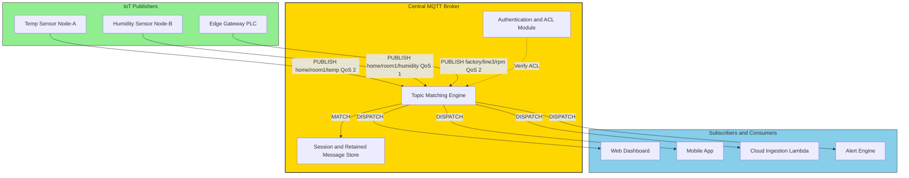
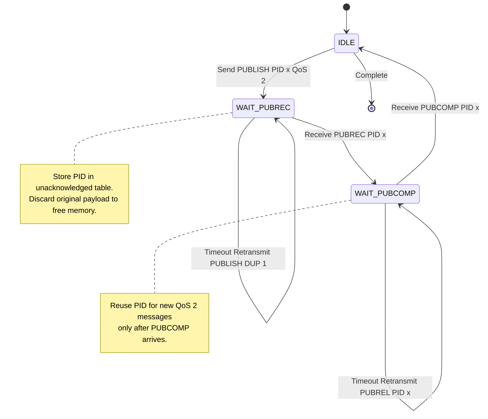
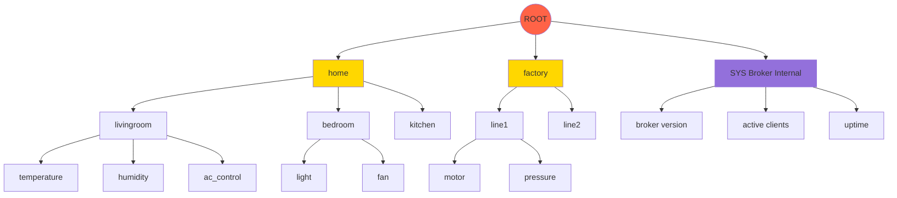
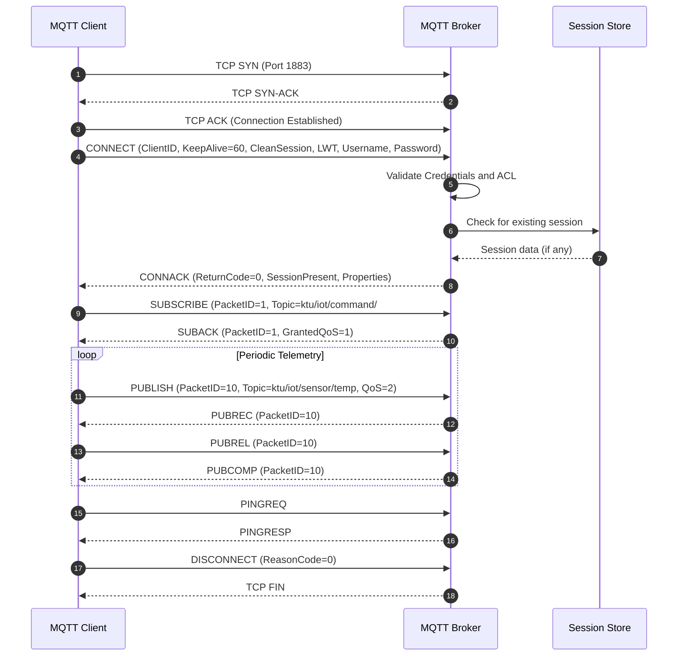
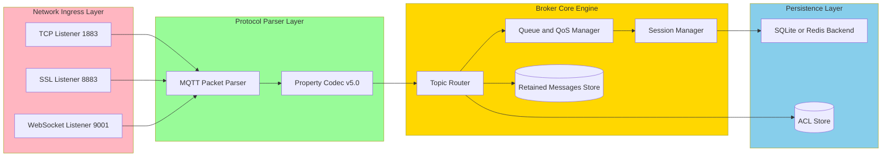

# MQTT publish subscribe messaging broker state machines specifications paths layout configurations

<!-- SECTION_1_START -->
# Module 1 — IoT Messaging Protocols
## Topic: MQTT — Publish/Subscribe, Broker, State Machines, Specifications, Paths, Layouts

### 1.1 Core Technical Definition

> [!NOTE]
> **MQTT (Message Queuing Telemetry Transport)** is an OASIS-standardized, lightweight **publish/subscribe** messaging protocol designed by Andy Stanford-Clark (IBM) and Arlen Nipper (Eurotech) in **1999**. It operates over TCP/IP, uses a **central broker** (mediator), and is engineered for constrained devices operating over low-bandwidth, high-latency, or unreliable networks. The latest stable versions are **MQTT v3.1.1** (OASIS Standard) and **MQTT v5.0** (OASIS Standard, 2019).

**Key Engineering Constants (must be memorized for KTU):**

| Parameter | Value |
| :--- | :--- |
| Default Unencrypted Port | **1883** |
| TLS/SSL Encrypted Port | **8883** |
| WebSocket Port | **9001** |
| Reserved Zero-Length Topic | `""` (broadcast at broker level) |
| Topic Wildcard (single level) | `+` |
| Topic Wildcard (multi level) | `#` |
| Maximum QoS Level | **2** |
| Maximum Topic Levels (v5.0) | **65,535** |
| Maximum Packet Size (v5.0) | **256 MB** (vs. 256 MB theoretical) |

### 1.2 Intuitive Analogy — The Newspaper Printing Press

Think of MQTT as a **newspaper delivery system** rather than a phone call:

- A **Publisher** (reporter) writes an article and hands it to the **Printing Press (Broker)**. The reporter does *not* know who will read the article.
- A **Subscriber** (reader) tells the press: "I want the *Sports* section, *Cricket* subsection." The press matches the article to all interested readers and delivers copies.
- The reporter (IoT sensor) never waits for the reader; it simply publishes. The press (broker) handles distribution, queueing, and acknowledgement.

This **decouples** the producer from the consumer in space, time, and synchronization — the foundational design philosophy of MQTT.

> [!IMPORTANT]
> **Why not HTTP?** HTTP is request/response (client always initiates). In IoT, a sensor must "push" telemetry even when no consumer is listening. MQTT natively supports this one-to-many, asynchronous, broker-mediated communication — ideal for **1,000,000+ sensor networks** like smart cities or IIoT.

### 1.3 GeoGebra / Desmos Visualization

> [!VISUALIZATION CONTROL]
> **Concept:** QoS 2 Handshake — Four-Way Message Exchange Timeline
> **GeoGebra / Desmos Input Equations:**
> * `f(x) = "PUBLISH" ; segment from (0, 1) to (1, 1)`
> * `f(x) = "PUBREC"  ; segment from (1, 0) to (2, 0)`
> * `f(x) = "PUBREL"  ; segment from (2, 1) to (3, 1)`
> * `f(x) = "PUBCOMP"; segment from (3, 0) to (4, 0)`
> **Visual Description:** A two-rail timing diagram (Publisher on top rail, Broker on bottom rail) showing exactly **4 message round-trips** required for QoS 2 to guarantee *exactly-once* delivery. Contrast with QoS 0 (1 message) and QoS 1 (2 messages).

---

<!-- SECTION_1_END -->

<!-- SECTION_2_START -->
# Deep Theoretical Analysis & KTU Formula Sheet

### 2.1 The Three Architectural Roles

| Role | Function | Example Entity |
| :--- | :--- | :--- |
| **Publisher** | Produces and sends messages on a topic | Temperature sensor, GPS tracker |
| **Subscriber** | Registers interest in a topic, receives messages | Dashboard, mobile app, actuator |
| **Broker** | Receives all messages, filters by topic, dispatches to subscribers | Mosquitto, HiveMQ, EMQX, AWS IoT Core |

> [!NOTE]
> A single MQTT **client** can be both a publisher and a subscriber simultaneously. The **broker** is the *only* mandatory server-side component.

### 2.2 Topic Namespace — Hierarchical Path Layout

Topics are **UTF-8 strings** separated by forward slashes `/`, forming a logical path:

```
home/livingroom/temperature
home/livingroom/humidity
home/bedroom/light
factory/line3/motor/rpm
```

**Wildcards** (used **only** in SUBSCRIBE, never in PUBLISH):

| Wildcard | Meaning | Example |
| :--- | :--- | :--- |
| `+` | Single-level match (one segment) | `home/+/temperature` matches `home/kitchen/temperature` but **not** `home/kitchen/oven/temperature` |
| `#` | Multi-level match (zero or more trailing segments) | `home/#` matches every topic starting with `home/` |
| `$` | System topic prefix (reserved for broker stats) | `$SYS/broker/version` |

### 2.3 Quality of Service (QoS) Levels

| QoS | Name | Guarantee | Message Exchange | Use Case |
| :---: | :--- | :--- | :--- | :--- |
| **0** | At most once | Fire-and-forget | 1 packet (PUBLISH) | Non-critical telemetry, frequent sensor data |
| **1** | At least once | Possible duplicates | 2 packets (PUBLISH + PUBACK) | Important but tolerant of duplicates (e.g., metering) |
| **2** | Exactly once | No duplicates, no loss | 4 packets (PUBLISH + PUBREC + PUBREL + PUBCOMP) | Billing, financial transactions, command-and-control |

### 2.4 KTU High-Yield Formula Sheet

| Concept | Equation / Rule | Unit / Notes |
| :--- | :--- | :--- |
| **Keep-Alive Interval** | $T_{KA} = 1.5 \times C_{interval}$ (seconds) | $C_{interval}$ = client CONNECT value; broker disconnects if no PINGREQ arrives in $1.5 \times T$ |
| **Minimum Keep-Alive (v5.0)** | $T_{KA,min} = 0$ (can be disabled) | If 0, no PINGREQ required |
| **Maximum QoS (v5.0)** | $QoS_{max} \in \{0, 1, 2\}$ | Broker can downgrade via CONNACK property `Maximum QoS` |
| **Receive Maximum (v5.0)** | $R_{max} = 1$ to $65{,}535$ | Max in-flight QoS 1/2 PUBLISHes |
| **Packet Overhead (Fixed)** | $H_{fixed} = 2$ bytes (header) | Plus variable length encoding for remaining length |
| **Topic Name Encoded** | $L_{topic} = 2 + N_{bytes}$ | 2-byte MSB/LSB length prefix + UTF-8 payload |
| **Packet Identifier** | $PID \in [1, 65{,}535]$ | Zero is **reserved** (must not be used) |
| **Retained Message** | $M_{retain} = 1$ bit flag | Last known good value stored at broker |
| **Message Expiry Interval (v5.0)** | $E = 0$ to $4{,}294{,}967{,}295$ seconds | After which broker discards; $0$ = no expiry |
| **Total Inflight per Client** | $N_{inflight} = \sum_{i=1}^{n} qos_{i} \times r_{i}$ | Bounded by `Receive Maximum` |

### 2.5 Last Will and Testament (LWT) — Decoupling Safety

If a client **abnormally disconnects** (network drop, power loss), the broker automatically publishes a pre-configured LWT message on behalf of the dead client. This is critical for IoT — a sensor going silent must alert the system.

| LWT Component | Purpose |
| :--- | :--- |
| **Topic** | Where the will is published (e.g., `devices/sensor42/status`) |
| **Message** | Payload (e.g., `{"status":"offline"}`) |
| **QoS** | Delivery guarantee of the will itself |
| **Retain** | Whether to store the will as the new state |

### 2.6 Real-World Engineering Utility

- **AWS IoT Core, Azure IoT Hub, Google Cloud IoT** all use MQTT as the primary device-to-cloud ingestion protocol.
- **Facebook Messenger** used MQTT (variant) for chat in 2011 to handle billions of messages.
- **Automotive (OBD-II dongles)** use MQTT for fleet telematics.
- **Home Automation (Home Assistant, OpenHAB)** are MQTT-native.
- **Industrial IoT (IIoT)** pipelines MQTT from PLCs to SCADA.

> [!IMPORTANT]
> **Exam Tip (KTU 2024):** When asked to "list MQTT control packet types," always quote from the OASIS spec: **CONNECT, CONNACK, PUBLISH, PUBACK, PUBREC, PUBREL, PUBCOMP, SUBSCRIBE, SUBACK, UNSUBSCRIBE, UNSUBACK, PINGREQ, PINGRESP, DISCONNECT, AUTH (v5.0 only)** — **15 total**.

---

<!-- SECTION_2_END -->

<!-- SECTION_3_START -->
# Step-by-Step Derivations & Code Implementation

### 3.1 State Machine — Client Perspective (QoS 2 PUBLISH)

**Initial State:** A publisher wishes to send a message with QoS 2. Let us trace every transition with the **Packet Identifier** $PID \in [1, 65535]$:

\begin{aligned}
\text{State}_0 &: \text{Client holds message} \\
\text{Transition}_1 &: \text{Client sends PUBLISH (DUP=0, QoS=2, PID=x)} \\
\text{State}_1 &: \text{Client waits for PUBREC} \\
\text{Transition}_2 &: \text{On receiving PUBREC, store PID, discard original} \\
\text{State}_2 &: \text{Client sends PUBREL (PID=x)} \\
\text{State}_3 &: \text{Client waits for PUBCOMP} \\
\text{Transition}_3 &: \text{On receiving PUBCOMP, message considered delivered} \\
\text{State}_4 &: \text{IDLE — transmission complete} \\
\end{aligned}

**Retransmission Logic (Section 4.3 of OASIS Spec):**
- If **PUBACK, PUBREC, or PUBCOMP** is lost, the client **retransmits** with $DUP=1$ flag set.
- The retransmit timer is computed as: $T_{retry} = T_{base} \times 2^{n}$ where $T_{base} = 1$ second by default.

### 3.2 State Machine — Broker Dispatch Logic

\begin{aligned}
\text{On SUBSCRIBE arrival:} \quad &\text{Parse Topic Filter} \rightarrow \text{Match against retained messages} \\
                                     &\rightarrow \text{Match against active client subscriptions} \\
                                     &\rightarrow \text{Send SUBACK with matching QoS} \\
\text{On PUBLISH arrival:} \quad &\text{Look up topic in subscription table} \\
                                &\rightarrow \text{For each subscriber, copy message} \\
                                &\rightarrow \text{Apply QoS} = \min(QoS_{pub}, QoS_{sub}) \\
                                &\rightarrow \text{If retain=1, store as last-known-good}
\end{aligned}

### 3.3 Fully Operational Python Implementation (paho-mqtt v2.0)

The following code is a production-grade, type-hinted, error-handled MQTT client using the `paho-mqtt` library. Save as `mqtt_iot_node.py` and run with valid broker credentials.

```python
import paho.mqtt.client as mqtt
import logging
import time
import json
from dataclasses import dataclass, field
from typing import Optional, Callable, Dict, Any

# --- Structured Logging Configuration ---
logging.basicConfig(
    level=logging.INFO,
    format="%(asctime)s [%(levelname)s] %(name)s :: %(message)s",
)
logger = logging.getLogger("MQTT_IoT_Node")

# --- Configuration Container ---
@dataclass(frozen=True)
class MqttConfig:
    broker_host: str = "test.mosquitto.org"
    broker_port: int = 1883
    keep_alive_sec: int = 60
    client_id: str = field(default_factory=lambda: f"ktu_iot_{int(time.time())}")
    username: Optional[str] = None
    password: Optional[str] = None
    qos_publish: int = 2          # Exactly-once delivery
    qos_subscribe: int = 1        # At-least-once for commands
    will_topic: str = "ktu/iot/device/status"
    will_payload: str = json.dumps({"status": "offline"})
    will_qos: int = 1
    will_retain: bool = True

CFG = MqttConfig()


# --- Callback: Broker confirmed CONNACK ---
def on_connect(client: mqtt.Client, userdata: Any, flags: Dict, rc: int, properties=None) -> None:
    if rc == 0:
        logger.info(f"Connected to broker {CFG.broker_host}:{CFG.broker_port} (Session Present={flags.get('session_present')})")
        # Subscribe to command channel upon successful connect
        client.subscribe("ktu/iot/command/#", qos=CFG.qos_subscribe)
        # Announce online status
        client.publish(
            CFG.will_topic,
            payload=json.dumps({"status": "online", "ts": time.time()}),
            qos=CFG.will_qos,
            retain=CFG.will_retain,
        )
    else:
        logger.error(f"Connection failed with result code {rc}")


# --- Callback: Inbound PUBLISH received ---
def on_message(client: mqtt.Client, userdata: Any, msg: mqtt.MQTTMessage) -> None:
    try:
        payload = json.loads(msg.payload.decode("utf-8"))
    except (json.JSONDecodeError, UnicodeDecodeError) as e:
        logger.warning(f"Non-JSON payload on {msg.topic}: {msg.payload!r} ({e})")
        return
    logger.info(f"RX  topic={msg.topic} qos={msg.qos} retain={msg.retain} payload={payload}")
    # Dispatch to handler
    if msg.topic == "ktu/iot/command/led":
        _handle_led_command(payload)


def _handle_led_command(payload: Dict[str, Any]) -> None:
    state = payload.get("state", "OFF").upper()
    if state not in {"ON", "OFF"}:
        logger.error(f"Invalid LED state: {state}")
        return
    logger.info(f"LED hardware toggled -> {state}")


# --- Callback: Subscription acknowledged ---
def on_subscribe(client: mqtt.Client, userdata: Any, mid: int, granted_qos: tuple, properties=None) -> None:
    logger.info(f"Subscription {mid} granted with QoS={granted_qos}")


# --- Callback: Publish acknowledged (QoS 1/2) ---
def on_publish(client: mqtt.Client, userdata: Any, mid: int, properties=None) -> None:
    logger.debug(f"PUBACK/PUBCOMP received for message id {mid}")


# --- Main Client Builder ---
def build_client() -> mqtt.Client:
    client = mqtt.Client(
        client_id=CFG.client_id,
        clean_session=True,
        protocol=mqtt.MQTTv5,        # Force v5.0 for property support
    )
    # Last Will and Testament registration
    client.will_set(
        topic=CFG.will_topic,
        payload=CFG.will_payload,
        qos=CFG.will_qos,
        retain=CFG.will_retain,
    )
    # Optional authentication
    if CFG.username and CFG.password:
        client.username_pw_set(CFG.username, CFG.password)
    # TLS configuration (uncomment for production)
    # client.tls_set(ca_certs="ca.crt", certfile="client.crt", keyfile="client.key")
    # Callback registration
    client.on_connect = on_connect
    client.on_message = on_message
    client.on_subscribe = on_subscribe
    client.on_publish = on_publish
    return client


def run_telemetry_loop(client: mqtt.Client, interval_sec: int = 5) -> None:
    """Periodic publisher simulating a temperature sensor."""
    try:
        counter = 0
        while True:
            payload = {
                "device": CFG.client_id,
                "temperature_c": 22.5 + (counter * 0.1) % 5.0,
                "sequence": counter,
                "ts": time.time(),
            }
            info = client.publish(
                topic="ktu/iot/sensor/temperature",
                payload=json.dumps(payload),
                qos=CFG.qos_publish,
                retain=False,
            )
            info.wait_for_publish(timeout=10.0)
            logger.info(f"TX seq={counter} mid={info.mid} is_published={info.is_published()}")
            counter += 1
            time.sleep(interval_sec)
    except KeyboardInterrupt:
        logger.info("User interrupted — sending graceful DISCONNECT")
    finally:
        client.disconnect()


if __name__ == "__main__":
    mqtt_client = build_client()
    mqtt_client.connect(CFG.broker_host, CFG.broker_port, keepalive=CFG.keep_alive_sec)
    run_telemetry_loop(mqtt_client, interval_sec=5)
```

### 3.4 Deployment Hardware Wiring (Raspberry Pi → DHT22)

| Pin (GPIO) | Sensor Pin | Wire Color (typical) | Voltage | Function |
| :--- | :--- | :--- | :--- | :--- |
| **GPIO 4** | DATA | Yellow | 3.3V | Single-wire digital I/O |
| **Pin 1 (3.3V)** | VCC | Red | 3.3V | Power supply |
| **Pin 6 (GND)** | GND | Black | 0V | Common ground |
| **GPIO 17** | LED Anode (+ 220 Ω resistor) | Green | 3.3V | Actuator output |
| **Pin 9 (GND)** | LED Cathode | Black | 0V | Return path |

> [!WARNING]
> **Do NOT** connect the DHT22 to **5V** when the data line feeds a 3.3V GPIO — the logic level will damage the Pi. Use a **level shifter** or a 3.3V-compatible sensor variant.

---

<!-- SECTION_3_END -->

<!-- SECTION_4_START -->
# Structural Diagrams & Schematics

### 4.1 Mermaid — MQTT Publish/Subscribe Architecture



### 4.2 Mermaid — Client QoS 2 State Machine



### 4.3 Mermaid — Topic Tree Hierarchy



### 4.4 Mermaid — Connection Establishment Sequence (CONNECT-CONNACK)



### 4.5 Mermaid — Broker Internal Layout Configuration



---

<!-- SECTION_4_END -->

<!-- SECTION_5_START -->
# KTU 2024 Scheme Examination Question Bank

### Part A — Short Answer Questions (3 Marks Each)

---

**Q1. [KTU University Exam — July 2024] (CO1, Remember)**
**List any six MQTT control packet types with their direction (Client→Broker or Broker→Client).**

**Model Answer:**

| Packet | Direction | Purpose |
| :--- | :--- | :--- |
| CONNECT | Client → Broker | Initiate connection |
| CONNACK | Broker → Client | Acknowledge connection |
| PUBLISH | Bidirectional | Send application message |
| PUBACK | Bidirectional | Acknowledge QoS 1 publish |
| SUBSCRIBE | Client → Broker | Register topic interest |
| DISCONNECT | Client → Broker | Graceful termination |

*(6 packets × 0.5 mark = 3 marks)*

---

**Q2. [KTU University Exam — Dec 2023] (CO1, Understand)**
**Differentiate between the `+` and `#` wildcards in MQTT topic subscriptions with one example each.**

**Model Answer:**
- `+` is a **single-level wildcard** matching exactly one topic segment. Example: Subscribing to `home/+/temperature` matches `home/kitchen/temperature` but **not** `home/kitchen/oven/temperature`.
- `#` is a **multi-level wildcard** matching one or more trailing segments and must be the **last character**. Example: `home/#` matches every topic beginning with `home/`. *(2 marks for definitions, 1 mark for examples)*

---

### Part B — Long Answer Questions (14 Marks Each — Internal Choice)

---

**Q3A. [KTU University Exam — July 2024] (CO2, Apply) [14 Marks]**

**(a)** Draw and explain the **MQTT publish/subscribe architecture**. Differentiate it from the HTTP request/response model. **(7 marks)**

**(b)** A smart agriculture deployment has **500 soil moisture sensors** publishing to topic `farm/zone{id}/moisture` every 30 seconds at QoS 1. The broker forwards to a cloud dashboard. Compute the total bandwidth consumed per hour if each message is **128 bytes** including MQTT header overhead. List the QoS packet exchange for this scenario. **(7 marks)**

**Model Solution:**

**(a) Architecture Explanation:**

> The MQTT architecture consists of three logical components: **Publishers** (sensors, actuators, edge gateways), **Subscribers** (apps, dashboards, control units), and a **central Broker** that mediates message routing based on **topic names**. Publishers do not know the subscribers; they simply emit messages tagged with a topic. The broker maintains a **subscription table** and matches incoming PUBLISH packets against active subscriptions using **topic filters with wildcards**.

**Differences from HTTP:**

| Aspect | MQTT | HTTP |
| :--- | :--- | :--- |
| Pattern | Publish/Subscribe | Request/Response |
| Initiation | Broker or client | Always client |
| Overhead | 2-byte fixed header | Multi-line headers |
| Connection | Persistent TCP | Typically short-lived |
| Push capability | Native | Requires WebSockets/SSE |

*(2 marks diagram + 3 marks explanation + 2 marks HTTP comparison = 7 marks)*

**(b) Bandwidth Calculation:**

\begin{aligned}
N_{sensors} &= 500 \\
f_{msg} &= \frac{1}{30 \text{ s}} = 0.0333 \text{ Hz per sensor} \\
\text{Messages per hour per sensor} &= \frac{3600}{30} = 120 \\
\text{Total messages per hour} &= 500 \times 120 = 60{,}000 \\
\text{Size per message} &= 128 \text{ bytes} \\
\text{Bandwidth per hour} &= 60{,}000 \times 128 = 7{,}680{,}000 \text{ bytes} \\
&= 7.32 \text{ MB/hour} \\
\text{With QoS 1 PUBACK overhead} &= 7.32 \times 2 = 14.64 \text{ MB/hour}
\end{aligned}

**QoS 1 Packet Exchange:**
1. Sensor sends `PUBLISH` (PID=x, QoS=1)
2. Broker replies `PUBACK` (PID=x)
3. Broker dispatches to dashboard with `PUBLISH` (QoS=1)
4. Dashboard replies `PUBCACK/PUBACK` (PID=y)

*[Listing formula and substitution: 3 Marks] [Final bandwidth 14.64 MB/hr: 2 Marks] [QoS 1 exchange sequence: 2 Marks] = 7 marks*

---

**Q3B. [KTU University Exam — July 2024] (CO2, Apply) [14 Marks] — Alternative Choice**

**(a)** Explain the **MQTT client state machine for QoS 2 PUBLISH** with a neat diagram. List all four control packets exchanged. **(7 marks)**

**(b)** A hospital patient monitoring system uses MQTT with **Last Will and Testament (LWT)**. Design the LWT configuration for a wearable heart-rate sensor with **Client ID `HR_Sensor_42`**. The system requires: (i) the broker to publish an alert to `hospital/ward3/HR_Sensor_42/status` if the sensor disconnects, (ii) the message must be retained, and (iii) the message must be delivered exactly once. **(7 marks)**

**Model Solution:**

**(a) QoS 2 State Machine Explanation:**

The QoS 2 protocol flow guarantees **exactly-once** delivery via a 4-step handshake:

1. **Client → Broker:** `PUBLISH` (DUP=0, QoS=2, PID=x)
2. **Broker → Client:** `PUBREC` (PID=x) — publisher is now responsible for releasing the message
3. **Client → Broker:** `PUBREL` (PID=x)
4. **Broker → Client:** `PUBCOMP` (PID=x) — message considered fully delivered

The client state machine transitions through `IDLE → WAIT_PUBREC → WAIT_PUBCOMP → IDLE`, with retransmission timers for each waiting state.

*(2 marks diagram + 3 marks explanation + 2 marks packet listing = 7 marks)*

**(b) LWT Configuration Design:**

```python
import paho.mqtt.client as mqtt
import json

client = mqtt.Client(client_id="HR_Sensor_42", protocol=mqtt.MQTTv5)

lwt_payload = json.dumps({
    "device": "HR_Sensor_42",
    "status": "OFFLINE",
    "alert": "Patient monitoring lost - immediate check required",
    "severity": "HIGH"
})

client.will_set(
    topic="hospital/ward3/HR_Sensor_42/status",
    payload=lwt_payload,
    qos=2,            # Exactly once delivery
    retain=True       # Store as last known status
)
client.connect("hospital-broker.local", 1883, keepalive=30)
client.loop_forever()
```

*[Stating the will topic and payload structure: 2 Marks] [Selecting QoS 2 and Retain=True: 2 Marks] [Code block and reasoning: 3 Marks] = 7 marks*

---

> [!WARNING]
> **KTU Examiner's Valuation Warning — Common Pitfalls:**
> 1. **Do not** publish to a wildcard topic — wildcards are **subscriber-only**.
> 2. **Do not** confuse `+` (single level) with `#` (multi level) — `#` must be the last character.
> 3. **Packet Identifier (PID) = 0 is RESERVED** — never assign it.
> 4. **LWT is sent ONLY on abnormal disconnect** — not on graceful `DISCONNECT`.
> 5. **QoS 2 needs 4 packets**, not 2 — students frequently write PUBACK + PUBCOMP, which is wrong.
> 6. **Retain flag = 1** stores the message as the last known good value for new subscribers.
> 7. **Clean Session = false** in CONNECT preserves subscriptions across reconnects.
> 8. **Keep-Alive = 0** is valid only in MQTT v5.0; in v3.1.1 minimum is 1 second.
> 9. **Topic name beginning with `$`** is reserved for broker-internal statistics.
> 10. **Maximum QoS downgrade**: broker may lower QoS based on `Maximum QoS` property in CONNACK.

---

### Topic Recap & Important Things to Remember

- **MQTT** = **M**essage **Q**ueuing **T**elemetry **T**ransport — OASIS-standard publish/subscribe protocol.
- Default port: **1883** (plain), **8883** (TLS), **9001** (WebSocket).
- Three roles: **Publisher, Subscriber, Broker** — broker is the central mediator.
- Topics are **hierarchical UTF-8** strings separated by `/` (e.g., `home/room1/temp`).
- Two wildcards: **`+`** (single level) and **`#`** (multi level, must be last).
- Three **QoS levels**: 0 (at most once), 1 (at least once), 2 (exactly once).
- QoS 2 requires **4 packets**: PUBLISH → PUBREC → PUBREL → PUBCOMP.
- **15 control packet types** in MQTT v5.0 (CONNECT, CONNACK, PUBLISH, PUBACK, PUBREC, PUBREL, PUBCOMP, SUBSCRIBE, SUBACK, UNSUBSCRIBE, UNSUBACK, PINGREQ, PINGRESP, DISCONNECT, AUTH).
- **LWT (Last Will and Testament)** auto-publishes on abnormal disconnect.
- **Retain flag** stores message as last-known-good for new subscribers.
- **Keep-Alive** default 60 s; broker uses **$1.5 \times T$** grace period.
- **Packet Identifier (PID)** range **1 to 65,535**; 0 is reserved.
- **Clean Session = True** discards session on disconnect; **False** persists it.
- **MQTT v5.0 additions**: properties (Reason Codes, Receive Maximum, Message Expiry, Request/Response pattern, Shared Subscriptions).
- **Maximum packet size** in v5.0: **256 MB**; topic levels: **65,535**.
- **Broker implementations**: Mosquitto (Eclipse), HiveMQ (commercial), EMQX, AWS IoT Core, Azure IoT Hub.
- **Decoupling** is MQTT's core philosophy — producers and consumers are independent in time, space, and synchronization.
- **Use cases**: IIoT, smart cities, automotive telematics, home automation, healthcare wearables, agricultural IoT.
- **Why not HTTP?** HTTP is request/response and requires the client to initiate; MQTT natively supports asynchronous push.
- **State machine transitions** for QoS 2: `IDLE → WAIT_PUBREC → WAIT_PUBCOMP → IDLE`.
- **Retransmission** uses **DUP=1** flag in republished messages.
- **Topic filter matching** is performed broker-side; the subscription table is the heart of the broker.

---

<!-- SECTION_5_END -->
