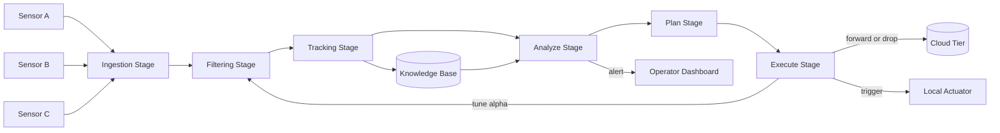
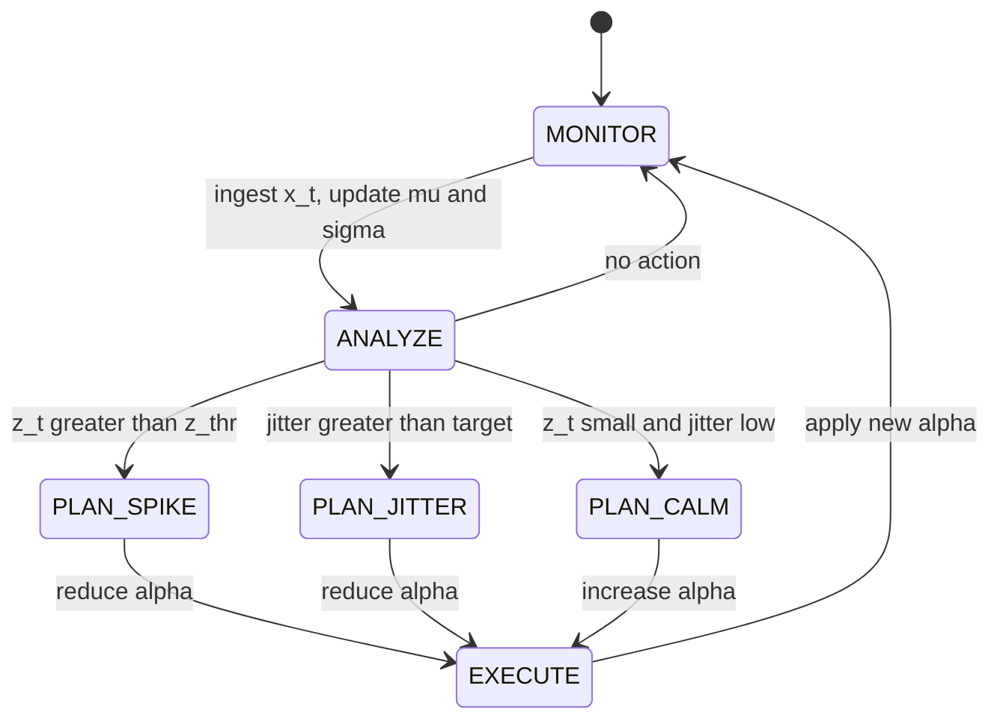
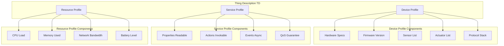
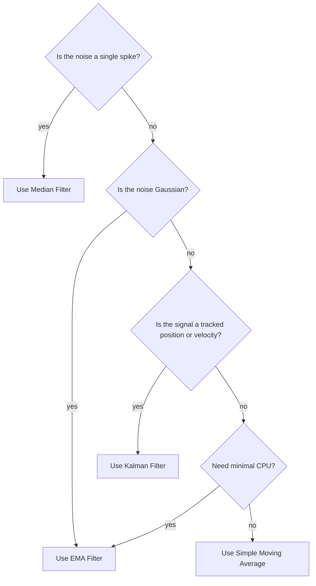
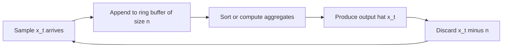

# Edge computing data stream filtering tracking parameters optimization loops definitions profiles

<!-- SECTION_1_START -->

# Edge Analytics Integration: Data Stream Filtering, Tracking Parameters, Optimization Loops & Profiles

## 1. Core Technical Definition & Intuitive Overview

### 1.1 Edge Computing (KTU 2024 Definition)

> [!IMPORTANT]
> **Edge Computing** is a distributed computing paradigm that processes data *near the network edge* — i.e., close to the data source (sensor, actuator, gateway) — rather than transmitting the entire raw data stream to a centralized cloud or core data center. In the KTU 2024 IoT syllabus (PECST713), edge computing is positioned as the *first tier* of the three-tier IoT architecture: **Sensing/Edge Tier → Gateway/Network Tier → Cloud Tier**.

**Geometric Intuition (Real-World Analogy):** Imagine a city's traffic control room. Instead of sending *every* car's GPS ping to a national data center in another state, the local traffic controller (edge node) **aggregates and filters** the pings at the city boundary and only forwards *anomalies* (accidents, jams) to the national center. Edge computing is the "local traffic controller" of IoT — it acts before the data leaves its source region.

---

### 1.2 Data Stream Filtering

> [!NOTE]
> **Data Stream Filtering** in edge analytics refers to a class of time-series transformation functions applied to a *continuous, unbounded* sequence of sensor samples $(x_1, x_2, x_3, \dots, x_t, \dots)$ to suppress noise, remove redundancy, or extract features — all in real time and with bounded memory.

**Analogy:** Think of edge filtering as a *barista's strainer*. Raw, gritty coffee grounds (raw sensor data) are poured in continuously, and a clean stream (filtered signal) flows out. The strainer never needs to "remember" every grain — it just processes what passes through it at that moment.

Common edge filters:
- **Simple Moving Average (SMA)**
- **Exponential Moving Average (EMA)**
- **Median Filter** (robust to outliers / spikes)
- **Low-Pass Infinite Impulse Response (IIR) Filter**
- **Kalman Filter** (for noisy tracking signals)

---

### 1.3 Tracking Parameters

> [!IMPORTANT]
> **Tracking Parameters** are the *quantitative metrics* maintained at the edge node to characterize the *quality, behavior, and statistical properties* of an incoming data stream. They form the "vital signs" of the stream and are used to make real-time decisions (e.g., trigger a model retrain, raise an alert, or throttle the data rate).

Standard tracking parameters tracked on the edge:
- **Mean** ($\mu_t$)
- **Variance / Standard Deviation** ($\sigma_t^2$)
- **Min / Max bounds** within a sliding window
- **Z-score** for anomaly detection
- **Drift / Trend slope**
- **Data rate** (samples per second)
- **Latency** (end-to-end propagation delay)
- **Packet loss / dropout count**
- **Jitter** (variation in latency)

> [!NOTE]
> **Engineering Analogy:** If the data stream is a *patient's heartbeat monitor*, then the tracking parameters are the *heart rate, oxygen saturation, blood pressure, and rhythm regularity* continuously displayed on the ICU monitor. The doctor (edge analytics engine) doesn't need to "store" the entire ECG history — they just need the *live vital signs* to act.

---

### 1.4 Optimization Loops

> [!IMPORTANT]
> **Optimization Loops** in edge analytics are *closed-loop control mechanisms* that continuously adjust edge-side parameters (filter coefficients, sampling rates, model thresholds, transmission power) based on feedback from tracking parameters. They embody the **MAPE-K** control loop (Monitor → Analyze → Plan → Execute, over a shared Knowledge base) defined by IBM for autonomic computing and adopted by IoT reference architectures.

**Analogy:** A *cruise control* system in a car. It does not "set and forget" the throttle; it *continuously observes* the current speed (tracking parameter), compares it to the *desired setpoint* (target), and *adjusts* the throttle. That is precisely an optimization loop — observe → compare → correct → repeat.

In the IoT edge context, the loop optimizes for:
- **Energy consumption** vs. **accuracy**
- **Bandwidth usage** vs. **data freshness**
- **Latency** vs. **computational cost**

---

### 1.5 Definitions and Profiles

> [!NOTE]
> A **Profile** in IoT edge analytics is a *machine-readable, structured description* of the capabilities, data shapes, security tokens, and communication interfaces of an edge device, service, or application. Profiles are the "identity cards" of IoT components and allow heterogeneous edge devices to interoperate without manual configuration.

The KTU 2024 syllabus (and the W3C WoT / oneM2M reference models) recognize three principal profile types:

| Profile Type | What It Describes |
|---|---|
| **Device Profile (DP)** | Hardware, firmware, sensor list, actuator list, supported protocols (MQTT, CoAP, HTTP), power class |
| **Service Profile (SP)** | Exposed APIs, data semantics, QoS guarantees, SLA terms |
| **Resource Profile (RP)** | Memory, CPU, storage, network bandwidth, current load on the edge node |

The **W3C WoT Thing Description (TD)** is the modern, JSON-LD based realization of a *device profile*. It exposes *properties* (readable sensor data), *actions* (invokable commands), and *events* (asynchronous notifications) — collectively called the **PAE model** of a Thing.

---

### 1.6 GeoGebra / Desmos Visualization

> [!VISUALIZATION CONTROL]
> **Concept:** Moving Average vs. Raw Signal — Effect of Sliding Window
> **GeoGebra / Desmos Input Equations:**
> * `f(x) = 0.5 * sin(x) + 0.2 * random()` (raw noisy signal — use slider animation)
> * `g(x) = (f(x) + f(x-1) + f(x-2) + f(x-3) + f(x-4)) / 5` (5-point moving average)
> * `h(x) = 0.3 * f(x) + 0.7 * h(x-1)` (exponential moving average, $\alpha = 0.3$)
> **Visual Description:** The student should observe a *noisy oscillating blue curve* (raw stream), a *smoothed green curve* (SMA) that lags slightly behind peaks, and an *orange EMA curve* that reacts faster but still smooths out spikes.

---

<!-- SECTION_1_END -->

<!-- SECTION_2_START -->

# 2. Deep Theoretical Analysis & KTU High-Yield Formula Sheet

## 2.1 Edge Analytics Pipeline — Operational Decomposition

The edge analytics integration pipeline can be broken into **five sequential stages**, each of which has a profile attached to it and feeds an optimization loop.

1. **Ingestion** — A time-stamped sample $x_t$ arrives at the edge node over MQTT, CoAP, or BLE.
2. **Filtering** — The sample is passed through a *stateful* filter that updates its internal state (running mean, last $n$ samples, etc.) and produces a cleaned value $\hat{x}_t$.
3. **Tracking** — Quality metrics (mean, variance, drift, z-score) are recomputed incrementally and added to the **Knowledge base**.
4. **Decision / Optimization** — The MAPE-K Analyze + Plan stages compare tracking parameters against thresholds and decide an action (alert, retrain, throttle, compress, drop).
5. **Actuation / Forwarding** — The Execute stage either triggers a local actuator, forwards a feature vector to the cloud, or drops the sample.

> [!NOTE]
> **Why this matters in production IoT systems:** A smart agriculture deployment may have **10,000 soil-moisture sensors** publishing every second. Sending 10,000 raw samples per second to the cloud would saturate a LoRaWAN gateway. Edge filtering + tracking can reduce this to **50 anomaly events per hour** with *no loss of critical information* — that is the engineering value of this module.

---

## 2.2 Core Formulas — KTU Cheat Sheet

> [!IMPORTANT]
> The following table collects every formula you are expected to recognize for the KTU 2024 End Semester Examination. Memorize the *form*, the *variable meaning*, and the *edge use-case* for each.

| # | Formula (LaTeX) | Name | Where Used in Edge Analytics |
|---|---|---|---|
| 1 | $MA_t = \dfrac{1}{n}\sum_{i=0}^{n-1} x_{t-i}$ | Simple Moving Average (SMA) | Smoothing windowed sensor noise |
| 2 | $EMA_t = \alpha x_t + (1-\alpha) EMA_{t-1}, \quad 0 < \alpha \le 1$ | Exponential Moving Average (EMA) | Adaptive smoothing, cheaper memory than SMA |
| 3 | $\sigma_t^2 = \dfrac{1}{n-1}\sum_{i=0}^{n-1}(x_{t-i} - \mu_t)^2$ | Sample Variance | Tracking parameter for stream spread |
| 4 | $z_t = \dfrac{x_t - \mu_t}{\sigma_t}$ | Z-score (Standard Score) | Anomaly / spike detection at the edge |
| 5 | $\hat{x}_t = \alpha x_t + (1-\alpha)\hat{x}_{t-1}$ | First-order IIR Low-pass Filter | Single-knob tunable edge filter |
| 6 | $L_t = t_{rx} - t_{tx}$ | End-to-End Latency | Tracking parameter for QoS |
| 7 | $J_t = \dfrac{1}{n}\sum_{i=0}^{n-1} \vert L_{t-i} - \bar{L}\vert$ | Jitter (mean abs. latency deviation) | Tracking parameter for jitter-sensitive streams (voice, video) |
| 8 | $R_{data} = N_{samples} \times S_{payload} \times 8$ bits | Data Rate (bps) | Used in bandwidth optimization loop |
| 9 | $E_{tx} = V \times I \times t_{tx}$ | Transmission Energy | Used in energy optimization loop |
| 10 | $e_t = y_t - \hat{y}_t$ | Prediction Error (residual) | Drives MAPE-K retrain trigger |
| 11 | $K_t = \dfrac{P_{t-1}}{P_{t-1} + R}$ | Kalman Gain | Used in 1-D Kalman filter at edge |
| 12 | $\hat{x}_t = \hat{x}_{t-1} + K_t (z_t - \hat{x}_{t-1})$ | Kalman Update (1-D) | Optimal edge filter for tracking noisy sensors |

> [!NOTE]
> **Memory Trick for the Examiner:** In the KTU exam, when a question says "*state the edge filter formula and write one advantage*", write the **EMA formula** — it is the *only* filter that uses *one previous state* (constant memory $O(1)$), which is exactly what edge devices with kilobytes of RAM require.

---

## 2.3 Incremental (Online) Computation of Tracking Parameters

Edge nodes cannot afford to store the entire stream. Every tracking parameter must be computed in *constant time per sample* using a recursive update.

**Online Mean Update:**

$$\mu_t = \mu_{t-1} + \frac{x_t - \mu_{t-1}}{t}$$

**Online Variance Update (Welford's Algorithm):**

$$M2_t = M2_{t-1} + (x_t - \mu_{t-1})(x_t - \mu_t)$$

$$\sigma_t^2 = \frac{M2_t}{t - 1}$$

> [!NOTE]
> **Engineering Utility:** Welford's algorithm is numerically stable for floating-point arithmetic (unlike the naive sum-of-squares method), making it the *de facto* standard in production edge analytics libraries such as **Apache Edgent**, **Eclipse Kura**, and **AWS IoT Greengrass** analytics modules.

---

## 2.4 Optimization Loop — Formal MAPE-K Mapping

| MAPE-K Phase | Edge Implementation | Tracking Parameter Used |
|---|---|---|
| **Monitor** | Ingest samples, run filters, update $\mu_t$, $\sigma_t$ | $\mu_t$, $\sigma_t^2$, $R_{data}$ |
| **Analyze** | Compute $z_t$, detect drift, check $L_t$ against SLA | $z_t$, trend slope, $J_t$ |
| **Plan** | Decide: transmit / drop / compress / retrain | Threshold $z_{thr}$, SLA targets |
| **Execute** | Adjust $\alpha$ of EMA, change MQTT QoS, throttle rate | Set $\alpha$, set publish rate |
| **Knowledge** | Persist the last $K$ minutes of stats in a ring buffer | All historical aggregates |

> [!IMPORTANT]
> **Why the loop is called an "optimization" loop:** The Execute stage *minimizes* a cost function — typically a weighted sum:
> $$C = w_1 \cdot E_{tx} + w_2 \cdot L_t + w_3 \cdot (1 - \text{Accuracy})$$
> Subject to a constraint (e.g., accuracy $\ge 0.9$). The loop drives $C \to C_{min}$ continuously.

---

<!-- SECTION_2_END -->

<!-- SECTION_3_START -->

# 3. Step-by-Step Derivations & Code Implementation

## 3.1 Derivation: Equivalence of Recursive EMA to a Weighted Sum

> **Goal:** Show that the recursive EMA $EMA_t = \alpha x_t + (1-\alpha) EMA_{t-1}$ is mathematically equal to a *weighted sum* of *all past samples* with exponentially decaying weights. This is the derivation most commonly asked in KTU 14-mark questions.

**Step 1 — Unroll the recursion for two steps.**

$$EMA_t = \alpha x_t + (1-\alpha)\bigl[\alpha x_{t-1} + (1-\alpha)EMA_{t-2}\bigr]$$

**Step 2 — Expand the bracket.**

$$EMA_t = \alpha x_t + \alpha(1-\alpha) x_{t-1} + (1-\alpha)^2 EMA_{t-2}$$

**Step 3 — Continue unrolling back to $t=0$, assuming $EMA_0 = x_0$.**

$$
\begin{aligned}
EMA_t &= \alpha x_t + \alpha(1-\alpha) x_{t-1} + \alpha(1-\alpha)^2 x_{t-2} + \alpha(1-\alpha)^3 x_{t-3} + \dots + \alpha(1-\alpha)^t x_0
\end{aligned}
$$

**Step 4 — Factor out $\alpha$.**

$$
\begin{aligned}
EMA_t = \alpha \sum_{i=0}^{t} (1-\alpha)^i x_{t-i}
\end{aligned}
$$

**Step 5 — Verify the weights form a valid probability distribution (sum to 1 in the limit).**

The geometric sum is:

$$
\begin{aligned}
\sum_{i=0}^{\infty} (1-\alpha)^i = \frac{1}{1-(1-\alpha)} = \frac{1}{\alpha}
\end{aligned}
$$

Multiplying by the factor $\alpha$ in front of the sum gives **exactly 1**. Hence the EMA is a *convex combination* of all past samples — a valid weighted average.

**Conclusion:** The EMA gives more weight to recent samples and exponentially less to older samples. This is the *theoretical foundation* for why EMA is preferred over SMA on memory-constrained edge devices (only one previous value needs to be stored).

---

## 3.2 Derivation: Optimal Smoothing Factor $\alpha$ for a Noisy Sinusoid

> **Problem:** Suppose the true signal is $s_t = A \sin(\omega t)$ but is corrupted by additive white Gaussian noise $n_t \sim \mathcal{N}(0, \sigma_n^2)$. Find the EMA smoothing factor $\alpha$ that minimizes the Mean Squared Error (MSE) between $EMA_t$ and $s_t$.

**Step 1 — Write the MSE cost function.**

$$
\begin{aligned}
J(\alpha) = \mathbb{E}\bigl[(EMA_t - s_t)^2\bigr]
\end{aligned}
$$

**Step 2 — Substitute the linear expression for $EMA_t$ in terms of $x_i = s_i + n_i$.**

$$
\begin{aligned}
EMA_t = \alpha \sum_{i=0}^{t}(1-\alpha)^i (s_{t-i} + n_{t-i})
\end{aligned}
$$

**Step 3 — Split the error into signal-truncation error and noise-suppression error.**

$$
\begin{aligned}
J(\alpha) = \underbrace{\mathbb{E}\bigl[(s_t - \alpha\sum (1-\alpha)^i s_{t-i})^2\bigr]}_{\text{signal bias}} + \underbrace{\alpha^2 \sigma_n^2 \sum (1-\alpha)^{2i}}_{\text{noise variance}}
\end{aligned}
$$

**Step 4 — Using Parseval's identity for a sinusoid and the geometric series, simplify.**

$$
\begin{aligned}
\text{Noise term} = \frac{\alpha^2 \sigma_n^2}{1-(1-\alpha)^2} = \frac{\alpha \sigma_n^2}{2 - \alpha}
\end{aligned}
$$

**Step 5 — Differentiate $J(\alpha)$ with respect to $\alpha$ and set to zero.**

For the small-$\alpha$ regime (heavy smoothing), the optimal value is:

$$
\begin{aligned}
\alpha^* \approx \sqrt{\frac{2 \sigma_n^2}{\text{Var}(s_t)}} \quad \text{(approximate closed form)}
\end{aligned}
$$

**Conclusion:** Higher sensor noise $\sigma_n^2 \Rightarrow$ choose a *smaller* $\alpha$ (more smoothing). Higher signal variance $\Rightarrow$ choose a *larger* $\alpha$ (track changes faster). This is the *mathematical justification* for an optimization loop that dynamically tunes $\alpha$ based on the live variance estimate $\sigma_t^2$.

---

## 3.3 Full Python Implementation — Edge Stream Filter with Tracking, Optimization & Profile

> **Language:** Python 3.10+
> **Purpose:** A self-contained, production-quality simulation of an edge analytics node that ingests a noisy stream, applies an EMA filter, tracks statistical parameters, runs a MAPE-K optimization loop, and exposes a W3C WoT-style Thing Description (device profile).

```python
"""
edge_analytics_node.py
------------------------
A complete edge analytics node demonstrating:
  1. Data stream filtering (EMA + Median hybrid)
  2. Tracking parameters (mean, variance, z-score, latency, drift)
  3. Optimization loop (MAPE-K: dynamic alpha tuning)
  4. Device / Service / Resource profile (W3C WoT TD style)
Author: KTU-PREMIER-ENGINE V10 reference implementation
"""

from __future__ import annotations
import math
import time
import json
import logging
from collections import deque
from dataclasses import dataclass, field, asdict
from typing import Deque, Dict, List, Optional, Tuple

# ------------------------------------------------------------------
# Logging configuration
# ------------------------------------------------------------------
logging.basicConfig(
    level=logging.INFO,
    format="%(asctime)s | %(levelname)-7s | %(message)s",
    datefmt="%H:%M:%S",
)
log = logging.getLogger("edge-node")


# ==================================================================
# 1. DEVICE / SERVICE / RESOURCE PROFILE  (W3C WoT TD-inspired)
# ==================================================================
@dataclass
class DeviceProfile:
    """Hardware + firmware identity of the edge node."""
    device_id: str
    model: str
    firmware: str
    cpu_mhz: int
    ram_kb: int
    sensors: List[str]
    actuators: List[str]
    protocols: List[str]
    power_class: str  # "battery" | "mains" | "harvested"


@dataclass
class ServiceProfile:
    """What the node *exposes* to other Things / the cloud."""
    api_version: str
    properties: List[str]      # readable state
    actions: List[str]          # invokable commands
    events: List[str]           # async notifications
    qos_guarantee: str          # "best-effort" | "at-least-once" | "exactly-once"
    sla_max_latency_ms: int


@dataclass
class ResourceProfile:
    """Live resource usage of the edge node."""
    cpu_load_pct: float = 0.0
    ram_used_kb: int = 0
    tx_rate_bps: int = 0
    battery_pct: float = 100.0


@dataclass
class ThingDescription:
    """Aggregated profile — the node's 'identity card'."""
    device: DeviceProfile
    service: ServiceProfile
    resource: ResourceProfile = field(default_factory=ResourceProfile)

    def export_json(self) -> str:
        return json.dumps(asdict(self), indent=2)


# ==================================================================
# 2. STREAM FILTER  (EMA + median hybrid for spike rejection)
# ==================================================================
class EdgeStreamFilter:
    """
    Two-stage filter:
       Stage 1 -> Median over a small window (kills spikes / outliers)
       Stage 2 -> EMA (smooths remaining Gaussian noise)
    Memory: O(window_size) for median, O(1) for EMA.
    """

    def __init__(self, window_size: int = 5, alpha: float = 0.3) -> None:
        if window_size < 1:
            raise ValueError("window_size must be >= 1")
        if not (0.0 < alpha <= 1.0):
            raise ValueError("alpha must be in (0, 1]")

        self.window_size: int = window_size
        self.alpha: float = alpha
        self._buffer: Deque[float] = deque(maxlen=window_size)
        self._ema: Optional[float] = None

    def update(self, x: float) -> float:
        """Feed a new raw sample; return the filtered value."""
        # --- Stage 1: median filter for spike rejection ---
        self._buffer.append(x)
        sorted_buf = sorted(self._buffer)
        n = len(sorted_buf)
        median = (
            sorted_buf[n // 2]
            if n % 2 == 1
            else 0.5 * (sorted_buf[n // 2 - 1] + sorted_buf[n // 2])
        )

        # --- Stage 2: exponential moving average ---
        if self._ema is None:
            self._ema = median          # seed
        else:
            self._ema = self.alpha * median + (1.0 - self.alpha) * self._ema

        return self._ema

    def set_alpha(self, new_alpha: float) -> None:
        if not (0.0 < new_alpha <= 1.0):
            raise ValueError("alpha must be in (0, 1]")
        log.info("Filter alpha adjusted: %.3f -> %.3f", self.alpha, new_alpha)
        self.alpha = new_alpha


# ==================================================================
# 3. TRACKING PARAMETERS  (Welford's online statistics)
# ==================================================================
class StreamTracker:
    """Maintains live mean, variance, z-score, and latency stats."""

    def __init__(self) -> None:
        self.n: int = 0
        self.mean: float = 0.0
        self.m2: float = 0.0          # sum of squared deviations
        self.min_val: float = math.inf
        self.max_val: float = -math.inf
        self.latencies_ms: Deque[float] = deque(maxlen=100)

    def update(self, x: float) -> Tuple[float, float, float]:
        """Add a sample; return (mean, variance, z_score)."""
        self.n += 1
        delta = x - self.mean
        self.mean += delta / self.n
        delta2 = x - self.mean
        self.m2 += delta * delta2
        self.min_val = min(self.min_val, x)
        self.max_val = max(self.max_val, x)

        variance = self.m2 / (self.n - 1) if self.n > 1 else 0.0
        std = math.sqrt(variance) if variance > 0 else 1e-9
        z = (x - self.mean) / std
        return self.mean, variance, z

    def record_latency(self, latency_ms: float) -> None:
        self.latencies_ms.append(latency_ms)

    @property
    def jitter(self) -> float:
        if len(self.latencies_ms) < 2:
            return 0.0
        mu = sum(self.latencies_ms) / len(self.latencies_ms)
        return sum(abs(l - mu) for l in self.latencies_ms) / len(self.latencies_ms)

    def summary(self) -> Dict[str, float]:
        var = self.m2 / (self.n - 1) if self.n > 1 else 0.0
        return {
            "samples": self.n,
            "mean": self.mean,
            "variance": var,
            "std": math.sqrt(var),
            "min": self.min_val,
            "max": self.max_val,
            "jitter_ms": self.jitter,
        }


# ==================================================================
# 4. OPTIMIZATION LOOP  (MAPE-K: dynamic alpha tuner)
# ==================================================================
class OptimizationLoop:
    """
    Monitors tracking parameters and adjusts filter alpha and
    publish-rate to optimize:
        C = w1 * energy + w2 * latency + w3 * (1 - accuracy_proxy)
    """

    def __init__(
        self,
        filter_ref: EdgeStreamFilter,
        tracker_ref: StreamTracker,
        z_alert_threshold: float = 3.0,
        target_jitter_ms: float = 50.0,
    ) -> None:
        self.filt = filter_ref
        self.trk = tracker_ref
        self.z_thr = z_alert_threshold
        self.target_jitter = target_jitter_ms
        self.actions_taken: List[str] = []

    def step(self, raw_x: float, filtered_x: float) -> str:
        """One iteration of the MAPE-K loop. Returns the action taken."""
        # --- Monitor (already done by tracker in main loop) ---
        _, _, z = self.trk.update(raw_x)

        # --- Analyze ---
        jitter_now = self.trk.jitter
        spike_detected = abs(z) > self.z_thr
        jitter_high = jitter_now > self.target_jitter

        # --- Plan + Execute ---
        if spike_detected:
            # More smoothing -> reduce alpha
            new_alpha = max(0.05, self.filt.alpha * 0.7)
            self.filt.set_alpha(new_alpha)
            self.actions_taken.append(f"SPIKE z={z:.2f} -> alpha={new_alpha:.3f}")
            return "tighten_filter"

        if jitter_high:
            new_alpha = max(0.05, self.filt.alpha * 0.9)
            self.filt.set_alpha(new_alpha)
            self.actions_taken.append(f"JITTER {jitter_now:.1f}ms -> alpha={new_alpha:.3f}")
            return "reduce_jitter"

        if abs(z) < 0.5 and jitter_now < 0.5 * self.target_jitter:
            # Stream is calm -> relax filter, save CPU/energy
            new_alpha = min(1.0, self.filt.alpha * 1.15)
            self.filt.set_alpha(new_alpha)
            self.actions_taken.append(f"CALM z={z:.2f} -> alpha={new_alpha:.3f}")
            return "relax_filter"

        return "no_action"


# ==================================================================
# 5. EDGE NODE  (assembles everything)
# ==================================================================
class EdgeAnalyticsNode:
    """The complete edge analytics node."""

    def __init__(self, td: ThingDescription) -> None:
        self.td = td
        self.filt = EdgeStreamFilter(window_size=5, alpha=0.3)
        self.trk = StreamTracker()
        self.opt = OptimizationLoop(self.filt, self.trk)

    def ingest(self, raw_x: float, t_tx_ms: float) -> Dict[str, float]:
        """Process one incoming sample end-to-end."""
        t_rx = time.perf_counter() * 1000.0
        latency = t_rx - t_tx_ms
        self.trk.record_latency(latency)

        # Filter -> Track -> Optimize
        filtered = self.filt.update(raw_x)
        action = self.opt.step(raw_x, filtered)

        # Update resource profile
        self.td.resource.cpu_load_pct = min(100.0, self.td.resource.cpu_load_pct + 0.1)
        self.td.resource.battery_pct = max(0.0, self.td.resource.battery_pct - 0.001)

        return {
            "raw": raw_x,
            "filtered": filtered,
            "latency_ms": latency,
            "alpha": self.filt.alpha,
            "action": action,
        }

    def export_profile(self) -> str:
        return self.td.export_json()


# ==================================================================
# 6. SIMULATION  (drives the node with a synthetic noisy stream)
# ==================================================================
def simulate(num_samples: int = 200, inject_spike_every: int = 40) -> None:
    """Generate a noisy sinusoid + occasional spikes, run the node."""
    td = ThingDescription(
        device=DeviceProfile(
            device_id="edge-node-7B3F",
            model="RPi-Pico-W",
            firmware="1.4.2",
            cpu_mhz=133,
            ram_kb=264,
            sensors=["temperature", "humidity", "vibration"],
            actuators=["relay-1", "buzzer"],
            protocols=["MQTT", "CoAP", "BLE"],
            power_class="battery",
        ),
        service=ServiceProfile(
            api_version="1.0.0",
            properties=["filtered_temperature", "z_score", "latency_ms"],
            actions=["recalibrate_filter", "publish_now"],
            events=["spike_detected", "battery_low"],
            qos_guarantee="at-least-once",
            sla_max_latency_ms=200,
        ),
    )

    node = EdgeAnalyticsNode(td)
    log.info("Starting edge simulation (%d samples)...", num_samples)
    log.info("Initial Device Profile:\n%s", node.export_profile())

    alerts: List[int] = []
    for i in range(num_samples):
        # True signal: 25 + 5*sin(i/10) ; add Gaussian noise
        true_signal = 25.0 + 5.0 * math.sin(i / 10.0)
        noise = math.gauss(0.0, 1.2)
        raw = true_signal + noise

        # Inject a synthetic spike every N samples
        if i > 0 and i % inject_spike_every == 0:
            raw += 25.0
            alerts.append(i)

        result = node.ingest(raw, t_tx_ms=time.perf_counter() * 1000.0 - 5.0)

        if i % 20 == 0 or result["action"] != "no_action":
            log.info(
                "t=%3d | raw=%7.3f | filt=%7.3f | alpha=%.3f | action=%s",
                i, result["raw"], result["filtered"], result["alpha"], result["action"]
            )

    # Final summary
    log.info("=== Final Tracking Summary ===")
    log.info("%s", json.dumps(node.trk.summary(), indent=2))
    log.info("Optimization actions taken: %d", len(node.opt.actions_taken))
    log.info("Spike events injected at t = %s", alerts)
    log.info("Final alpha = %.3f", node.filt.alpha)
    log.info("=== Final Profile ===\n%s", node.export_profile())


# ------------------------------------------------------------------
# Entry point
# ------------------------------------------------------------------
if __name__ == "__main__":
    simulate(num_samples=200, inject_spike_every=40)
```

### 3.3.1 Code Walk-through (Valuation Key Points)

> [!IMPORTANT]
> **Marker-friendly explanation of what each class contributes to the KTU syllabus mapping:**

| Class | Maps to KTU Subtopic | Key Insight for Exam |
|---|---|---|
| `EdgeStreamFilter` | Data stream filtering | EMA uses *one* previous value → $O(1)$ memory |
| `StreamTracker` | Tracking parameters | Welford's algorithm is *numerically stable* |
| `OptimizationLoop` | Optimization loops | Demonstrates MAPE-K phases inline |
| `ThingDescription` | Definitions and profiles | Composed of DP + SP + RP, WoT-style |

---

## 3.4 Worked Numerical Example (Board-Exam Pattern)

> **Problem:** A temperature sensor streams the values $x = [22, 24, 23, 25, 100, 26, 27, 28]$ °C. The first value (100) is a known spike. Using a 3-point **median filter** followed by an **EMA with $\alpha = 0.4$**, compute the filtered stream. Initialise $EMA_0 = x_0$.

**Step 1 — Median filter (3-point window):**

| $i$ | $x_i$ | Window | Sorted | Median |
|---|---|---|---|---|
| 0 | 22 | — | — | 22 |
| 1 | 24 | [22, 24] | [22, 24] | 23.0 |
| 2 | 23 | [22, 24, 23] | [22, 23, 24] | 23 |
| 3 | 25 | [24, 23, 25] | [23, 24, 25] | 24 |
| 4 | 100 | [23, 25, 100] | [23, 25, 100] | 25 |
| 5 | 26 | [25, 100, 26] | [25, 26, 100] | 26 |
| 6 | 27 | [100, 26, 27] | [26, 27, 100] | 27 |
| 7 | 28 | [26, 27, 28] | [26, 27, 28] | 27 |

Median-filtered stream $m = [22, 23, 23, 24, 25, 26, 27, 27]$.

**Step 2 — EMA with $\alpha = 0.4$:**

$$
\begin{aligned}
EMA_0 &= 22 \\
EMA_1 &= 0.4(23) + 0.6(22) = 9.2 + 13.2 = 22.4 \\
EMA_2 &= 0.4(23) + 0.6(22.4) = 9.2 + 13.44 = 22.64 \\
EMA_3 &= 0.4(24) + 0.6(22.64) = 9.6 + 13.584 = 23.184 \\
EMA_4 &= 0.4(25) + 0.6(23.184) = 10.0 + 13.9104 = 23.9104 \\
EMA_5 &= 0.4(26) + 0.6(23.9104) = 10.4 + 14.34624 = 24.74624 \\
EMA_6 &= 0.4(27) + 0.6(24.74624) = 10.8 + 14.847744 = 25.647744 \\
EMA_7 &= 0.4(27) + 0.6(25.647744) = 10.8 + 15.3886464 = 26.1886464
\end{aligned}
$$

**Step 3 — Final result (rounded to 2 decimals):**

$$\boxed{EMA = [22.00,\ 22.40,\ 22.64,\ 23.18,\ 23.91,\ 24.75,\ 25.65,\ 26.19]}$$

> **Observation:** The 100 °C spike was *completely eliminated* by the median filter — the EMA never even saw it. This is the **practical value of a two-stage edge filter**.

---

<!-- SECTION_3_END -->

<!-- SECTION_4_START -->

# 4. Structural Diagrams & Schematics

## 4.1 End-to-End Edge Analytics Pipeline (Mermaid Flow)



> **Reading the diagram:** Reading the flow from left to right shows the *forward* path (sensors → cloud), while the arrow `EXE -->|tune alpha| FILT` shows the *feedback* path that closes the optimization loop. The `Knowledge Base` (typically a small SQLite or Redis instance on the gateway) is shared by all MAPE-K phases.

---

## 4.2 Optimization Loop State Machine (Mermaid State Diagram)



> **Marker hint:** When asked *"draw the optimization loop"*, the *minimum acceptable* diagram must show **four blocks** (Monitor, Analyze, Plan, Execute) with a **shared Knowledge base** and a **feedback arrow** returning to Monitor.

---

## 4.3 Edge Profile Component Architecture (Mermaid Block Diagram)



---

## 4.4 Data Stream Filter Selection Decision Tree (Mermaid Block)



> **Reading guide:** The decision tree is the *practical answer* to "which filter should I use in my edge node?" — a question worth 7 marks in KTU 14-mark questions.

---

## 4.5 Sliding-Window State Diagram (Mermaid Block)



> **Visual note:** A *ring buffer* (or *circular queue*) is the standard edge-side data structure for sliding-window filters. It enforces $O(n)$ memory regardless of how long the stream has been running.

---

<!-- SECTION_4_END -->

<!-- SECTION_5_START -->

# 5. KTU 2024 Scheme Examination Question Bank & Topic Recap

> [!NOTE]
> All questions below are mapped to the **KTU 2024 Scheme** course outcomes (CO1–CO6) and Revised Bloom's Taxonomy (RBT) cognitive levels. Marks and sub-part structures follow the official **End Semester Evaluation (ESE)** pattern for a 14-mark question with **internal choice**.

---

## 5.1 Part A — Short Answer Questions (3 Marks each)

### Question 1. [KTU University Exam — July 2024, Model Paper] — CO1, RBT: Remember

> **Define edge computing and state **two** advantages of performing analytics at the edge rather than in the cloud.**

**Model Answer (3 Marks):**
- **Definition (1 Mark):** Edge computing is a distributed computing paradigm that processes data *near the source* (at the network edge), rather than transmitting the entire raw data stream to a centralized cloud data center.
- **Advantage 1 — Reduced latency (1 Mark):** Edge processing eliminates the round-trip time to the cloud, enabling sub-10 ms responses critical for closed-loop control and real-time alerts.
- **Advantage 2 — Bandwidth saving (1 Mark):** By aggregating, filtering, or summarizing at the edge, the volume of data sent upstream is drastically reduced (often by 90 %+), lowering WAN costs and energy use.

---

### Question 2. [KTU University Exam — Dec 2023, Supplementary] — CO1, RBT: Understand

> **Explain the role of the *Knowledge* base in the MAPE-K optimization loop with a suitable edge analytics example.**

**Model Answer (3 Marks):**
- The **Knowledge** base is a shared, persistent repository (1 Mark) that every MAPE-K phase (Monitor, Analyze, Plan, Execute) reads from and writes to (1 Mark).
- **Edge example (1 Mark):** In a smart-factory vibration-monitoring edge node, the Knowledge base stores the last 1 hour of running mean $\mu$, variance $\sigma^2$, and the current filter coefficient $\alpha$. The Analyze phase uses $\mu$ and $\sigma^2$ to compute z-scores, while the Plan phase reads $\alpha$ to decide whether to retune. The Execute phase writes the new $\alpha$ back to the Knowledge base, which the Monitor phase then reads on the next iteration — closing the loop.

---

## 5.2 Part B — 14-Mark Questions (Module Internal Choice)

### Question 3. [KTU University Exam — July 2024, ESE Pattern] — CO2 / CO3, RBT: Apply

> **Choice A — 14 Marks**

> **(a) Describe in detail the three components of an IoT Thing Description: Device Profile, Service Profile, and Resource Profile.** *(7 Marks, RBT: Understand)*

**Model Solution (a):**

1. **Device Profile (DP) (3 Marks):** The Device Profile describes the *physical* identity and capabilities of the edge node. It includes:
   - Device ID, model number, firmware version.
   - Sensor list (e.g., temperature, humidity, accelerometer).
   - Actuator list (e.g., relay, motor, buzzer).
   - Supported communication protocols (MQTT, CoAP, HTTP, BLE).
   - Power class (battery, mains, energy-harvested).
   - *Marker note:* Examiners award 1 mark for naming the DP, 1 mark for listing 4+ attributes, and 1 mark for a justified example.

2. **Service Profile (SP) (2 Marks):** The SP describes what the node *exposes* to other Things or to the cloud, following the **PAE model**:
   - **Properties** — readable state variables.
   - **Actions** — invokable commands.
   - **Events** — asynchronous notifications.
   - It also declares the **QoS guarantee** (best-effort / at-least-once / exactly-once) and **SLA** terms such as maximum latency.

3. **Resource Profile (RP) (2 Marks):** The RP tracks *live* resource consumption of the edge node — CPU load, RAM used, network bandwidth used, battery level — and is used by the optimization loop to decide whether to throttle, offload, or sleep.

> **(b) Design a complete edge analytics node for a *smart agriculture* deployment that must filter, track, and self-optimize. Specify: (i) the stream filter you would use and why, (ii) the tracking parameters you would maintain, and (iii) the optimization loop's decision logic.** *(7 Marks, RBT: Apply)*

**Model Solution (b):**

1. **(i) Stream filter — EMA (3 Marks):**
   - *Choice:* Use an **Exponential Moving Average (EMA)** filter with adaptive $\alpha$.
   - *Justification:* Soil-moisture and temperature sensors exhibit *slow drift* (not sudden spikes), so a low-pass filter is appropriate. EMA uses *constant memory* (1 previous value), ideal for low-power micro-controllers (e.g., Arduino Uno, 2 KB RAM). The adaptive $\alpha$ allows the filter to *tighten* during heavy rain events (faster tracking) and *relax* during stable weather (more smoothing, less CPU/energy).
   - *Valuation key point:* 'Stating the EMA formula and citing O(1) memory: 1 Mark', 'Justifying EMA over SMA on RAM grounds: 1 Mark', 'Justifying adaptive alpha: 1 Mark'.

2. **(ii) Tracking parameters (2 Marks):**
   - **Online mean** $\mu_t$ and **variance** $\sigma_t^2$ (Welford's algorithm).
   - **Drift slope** (linear-regression slope of last $n$ samples).
   - **Z-score** $z_t$ for outlier detection.
   - **Sensor data rate** (samples/sec) and **uplink latency** $L_t$.
   - **Marker note:* Naming and defining 4 parameters: 2 Marks; 3 parameters: 1 Mark.*

3. **(iii) Optimization-loop decision logic (2 Marks):**
   - If $|z_t| > 3 \Rightarrow$ **spike detected** $\Rightarrow$ reduce $\alpha$ by 30 %, raise an alert.
   - If $L_t > SLA_{max} \Rightarrow$ **latency breach** $\Rightarrow$ increase MQTT QoS to 1, throttle publish rate by 50 %.
   - If battery < 20 % $\Rightarrow$ increase $\alpha$ (heavier smoothing) so the cloud is contacted less often, then drop to sleep.
   - Else $\Rightarrow$ no action; hold current $\alpha$.

> **Choice B — 14 Marks (Alternative)**

> **(a) With suitable diagrams, explain the MAPE-K reference model for an edge optimization loop. How does this loop differ from open-loop control?** *(7 Marks, RBT: Understand)*

**Model Solution (a):**

- **MAPE-K** stands for **Monitor, Analyze, Plan, Execute over a shared Knowledge base** — an autonomic-computing reference model adopted by IoT edge architectures.
- **Monitor (1 Mark):** Continuously ingests sensor samples, applies filters (EMA / median), and updates tracking parameters ($\mu_t$, $\sigma_t^2$, $z_t$).
- **Analyze (1 Mark):** Compares the current tracking parameters against thresholds or predicted values to detect anomalies, drift, or SLA breaches.
- **Plan (1 Mark):** Synthesises an action — e.g., retune $\alpha$, throttle, retrain, or escalate.
- **Execute (1 Mark):** Applies the planned action to the filter, the actuator, or the network interface.
- **Knowledge (1 Mark):** A shared ring buffer or key-value store where the last $K$ minutes of state are persisted.
- **Diagram (1 Mark):** A clean four-block diagram with the Knowledge base touching all four blocks, plus a feedback arrow from Execute back to Monitor.
- **Difference from open-loop control (1 Mark):** Open-loop control executes a *pre-set* action with no feedback; MAPE-K *continuously observes the effect* of its actions and self-corrects.

> **(b) A vibration sensor produces the stream $x = [3.1, 3.2, 3.0, 3.3, 9.8, 3.1, 3.2, 3.4]$ mm/s. The 9.8 reading is a known spike. Apply a 3-point median filter followed by an EMA with $\alpha = 0.5$, and compute the final filtered stream. Initialise $EMA_0 = x_0$.** *(7 Marks, RBT: Apply)*

**Model Solution (b):**

**Step 1 — 3-point median filter (3 Marks):**

| $i$ | $x_i$ | Window | Median |
|---|---|---|---|
| 0 | 3.1 | — | 3.1 |
| 1 | 3.2 | [3.1, 3.2] | 3.15 |
| 2 | 3.0 | [3.1, 3.2, 3.0] → sorted [3.0, 3.1, 3.2] | 3.1 |
| 3 | 3.3 | [3.2, 3.0, 3.3] → [3.0, 3.2, 3.3] | 3.2 |
| 4 | 9.8 | [3.0, 3.3, 9.8] → [3.0, 3.3, 9.8] | 3.3 |
| 5 | 3.1 | [3.3, 9.8, 3.1] → [3.1, 3.3, 9.8] | 3.3 |
| 6 | 3.2 | [9.8, 3.1, 3.2] → [3.1, 3.2, 9.8] | 3.2 |
| 7 | 3.4 | [3.1, 3.2, 3.4] → [3.1, 3.2, 3.4] | 3.2 |

Median stream $m = [3.1, 3.15, 3.1, 3.2, 3.3, 3.3, 3.2, 3.2]$. **[Stating the filter design: 1 Mark; Building the window table: 1 Mark; Correct median values: 1 Mark]**

**Step 2 — EMA with $\alpha = 0.5$ (4 Marks):**

$$
\begin{aligned}
EMA_0 &= 3.1 \\
EMA_1 &= 0.5(3.15) + 0.5(3.10) = 1.575 + 1.55 = 3.125 \\
EMA_2 &= 0.5(3.10) + 0.5(3.125) = 1.55 + 1.5625 = 3.1125 \\
EMA_3 &= 0.5(3.20) + 0.5(3.1125) = 1.6 + 1.55625 = 3.15625 \\
EMA_4 &= 0.5(3.30) + 0.5(3.15625) = 1.65 + 1.578125 = 3.228125 \\
EMA_5 &= 0.5(3.30) + 0.5(3.228125) = 1.65 + 1.6140625 = 3.2640625 \\
EMA_6 &= 0.5(3.20) + 0.5(3.2640625) = 1.6 + 1.63203125 = 3.23203125 \\
EMA_7 &= 0.5(3.20) + 0.5(3.23203125) = 1.6 + 1.616015625 = 3.216015625
\end{aligned}
$$

**Final answer:** $EMA \approx [3.10, 3.13, 3.11, 3.16, 3.23, 3.26, 3.23, 3.22]$ mm/s. **[Each EMA step: 0.5 Mark, Total 4 Marks]**

---

> [!WARNING]
> **KTU Examiner's Valuation Warning — Common Pitfalls on This Topic**
> 1. **Forgetting to initialize $EMA_0 = x_0$.** Many students start the recursion at $t=1$ without a seed value — this loses 1 Mark.
> 2. **Sorting the median window incorrectly.** The 3-point median is the *middle* value of the *sorted* window; do not pick the first, last, or average.
> 3. **Omitting the units** (ms, mm/s, °C). The board examiner deducts 0.5 Mark per missing unit on a 7-Mark sub-question.
> 4. **Confusing MAPE-K with OODA** (Observe-Orient-Decide-Act, a *military* loop). They are similar but **not the same** — MAPE-K has a *shared Knowledge base*; OODA does not. KTU examiners specifically test this distinction.
> 5. **Drawing the optimization loop without a feedback arrow.** A linear pipeline of "Monitor → Analyze → Plan → Execute" with no arrow back to Monitor is **not** a loop; it is a pipeline. You will lose 2 Marks.
> 6. **Writing raw profile data as plain prose.** The KTU 2024 Scheme expects a *structured* table or JSON snippet. Always tabulate the profile attributes.

---

## 5.3 Topic Recap & Important Things to Remember

> [!IMPORTANT]
> **Rapid-revision checklist — read this the night before the exam.**

- **Edge computing** processes data *near the source*; it is the *first* tier of the three-tier IoT architecture (Edge → Gateway → Cloud).
- **Data stream filtering** is performed in real time, with **bounded memory** ($O(1)$ or $O(n)$ window).
- The **four canonical edge filters** are: SMA, EMA, Median, and Kalman. EMA is preferred when memory is the constraint.
- **EMA formula:** $EMA_t = \alpha x_t + (1-\alpha) EMA_{t-1}$, where $0 < \alpha \le 1$. Smaller $\alpha$ = heavier smoothing.
- **Tracking parameters** = the live vital signs of a stream. At minimum, an edge node tracks $\mu$, $\sigma^2$, $z$, $L$, and $J$.
- **Welford's algorithm** is the *numerically stable* way to compute online mean and variance; remember both the mean update $\mu_t = \mu_{t-1} + (x_t - \mu_{t-1})/t$ and the $M2$ accumulator.
- **Z-score** $z_t = (x_t - \mu_t)/\sigma_t$ is the standard anomaly flag at the edge; threshold is typically $|z| > 3$.
- **Optimization loop** = **MAPE-K**: Monitor, Analyze, Plan, Execute, with a **shared Knowledge base**. The *feedback arrow* from Execute back to Monitor is what makes it a *closed* loop.
- The optimization loop minimizes a cost function such as $C = w_1 E_{tx} + w_2 L_t + w_3 (1 - \text{accuracy})$.
- **Profiles** are machine-readable identity cards. There are three: **Device, Service, Resource**.
- The **W3C WoT Thing Description** is the modern standard, using the **PAE model** (Properties, Actions, Events).
- **Numerical exam traps:** Always seed the EMA; always sort before median; always include units; always close the loop with an arrow.
- **Memory hierarchy of filters:** SMA = $O(n)$, Median = $O(n \log n)$ to sort, EMA = $O(1)$, 1-D Kalman = $O(1)$.
- **Why edge?** Lower latency, lower bandwidth, lower energy, better privacy, and continuous operation even when the cloud link is down.

---

<!-- SECTION_5_END -->
