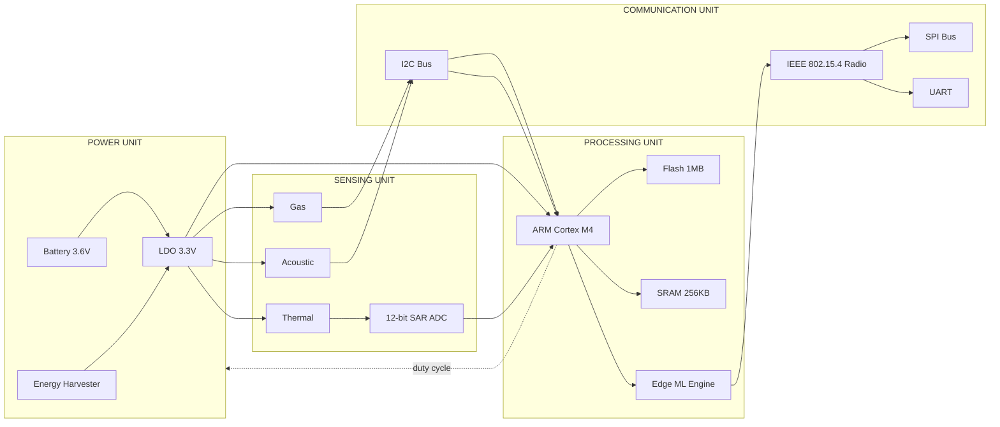
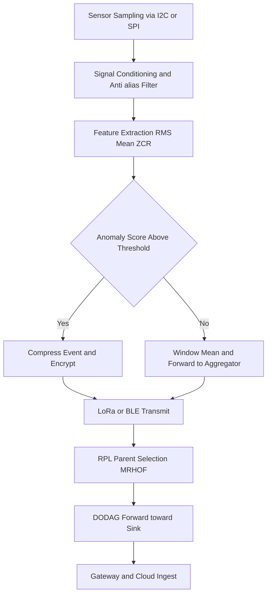
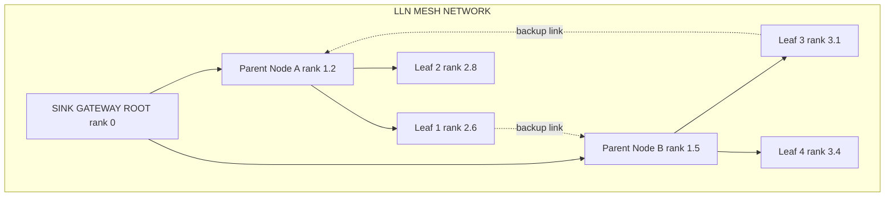
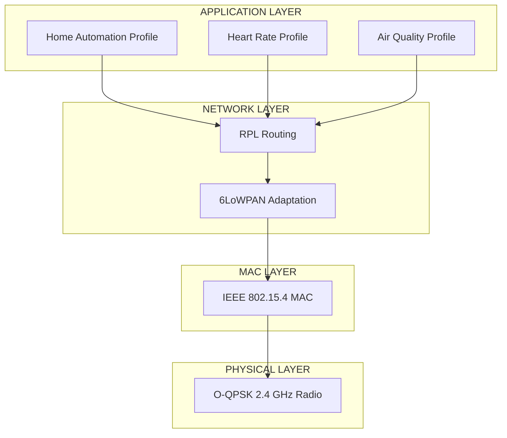

# Sensor node interface architectures hardware mappings profiles routing tracks setups profiles

<!-- SECTION_1_START -->

# Sensor Node Interface Architectures, Hardware Mappings, Profiles & Routing Setups

## 1.1 Formal Academic Definition (KTU 2024 Syllabus Aligned)

A **Sensor Node** is the foundational **edge device** in an Internet of Things (IoT) deployment that integrates four functional subsystems — a **Sensing Unit**, a **Processing Unit** (microcontroller/SoC), a **Communication Unit** (radio transceiver), and a **Power Unit** — to perform local data acquisition, in-node analytics (edge analytics), and cooperative multi-hop forwarding toward an IoT gateway or cloud sink.

An **Interface Architecture** defines the standardised electrical and logical pathways (buses and protocols) that bind the sensing transducers to the processing core, while a **Hardware Mapping (Pin Map / Register Map)** specifies the exact physical pin, alternate-function multiplexer (AFM) line, and memory-mapped register address used for every interface.

A **Profile**, in the context of IoT, is a curated subset of specifications that constrains a device's behaviour to a target application class — for example, a **ZigBee Home Automation Profile**, a **BLE Heart Rate Profile**, or a **LoRaWAN Class A device profile**.

A **Routing Track** is the logical forwarding topology (DODAG tree, mesh path, star link) constructed by a **routing protocol** such as **RPL**, **AODV**, or **LOADng** over the underlying lossy link layer.

> [!IMPORTANT]
> **KTU 2024 Module 2 Focus:** Edge Analytics Integration requires a sensor node that can *pre-process* data locally. Hence the **interface architecture** must permit high-throughput, deterministic sampling (I²C/SPI/ADC) while the **routing setup** must remain energy-aware to preserve battery lifetime for continuous edge inference.

## 1.2 Intuitive Real-World Analogy

Think of a sensor node as a **small, autonomous "field reporter"** standing in a remote forest:

- **Senses** (eyes, ears, nose) → Temperature, humidity, gas, vibration sensors.
- **Microcontroller** (brain) → Filters raw signals, runs an on-board anomaly-detection model (edge analytics).
- **Radio** (mouth) → Whispers short, encrypted packets to the next reporter.
- **Battery + Harvester** (heart, fed by a solar panel) → Keeps the reporter alive for years.
- **Interface Architecture** → The **nerve wiring** (I²C, SPI, UART) that carries sensor signals to the brain.
- **Hardware Mapping** → The **labelled patch panel** at the back of the reporter, telling the engineer *exactly* which wire goes where.
- **Profile** → The reporter's **press credential card** (e.g., "Forest Fires Beat Reporter") defining the message format, frequency, and encryption.
- **Routing Track** → The **chain of reporters** passing the message from the forest floor to the city newsroom.

> [!NOTE]
> **Why this matters for Edge Analytics:** Sending every raw sample to the cloud drains bandwidth and battery. The node must aggregate, threshold, or run TinyML inference at the edge. A *well-designed interface architecture* (with adequate bus speed, DMA support, and sleep modes) is therefore as important as the choice of radio.

## 1.3 Conceptual Visualisation of Node Placement

> [!VISUALIZATION CONTROL]
> **Concept:** Spatial deployment of heterogeneous sensor nodes in a field, with a sink/gateway forming the root of the routing tree.
> **GeoGebra / Desmos Input Points and Lines:**
> * `Sink = (0, 0)`
> * `NodeA = (-3, 2)`, `NodeB = (1, 3)`, `NodeC = (4, 1)`, `NodeD = (-1, -2)`, `NodeE = (2, -3)`
> * `Line: y = 0.5x + 0.2` (DODAG upward track from leaves to root)
> **Visual Description:** The student should observe how leaf nodes (negative $y$) forward packets along a directed acyclic graph (DODAG) toward the sink at the origin. The line represents the *preferred upward routing track*; cross-links form the mesh backup.

---

<!-- SECTION_1_END -->

<!-- SECTION_2_START -->

# 2. Deep Theoretical Analysis & KTU High-Yield Reference Sheet

## 2.1 The Four-Layer Sensor Node Architecture

1. **Sensing / Transducer Layer**
   * **Passive sensors:** Thermistor, photodiode, LDR (resistance changes).
   * **Active sensors:** BME280, MPU6050, MAX30102 (require clock + power).
   * **Signal conditioning:** Wheatstone bridge, op-amp gain stage, anti-alias filter.
2. **Processing / Edge Layer**
   * **MCU class:** 8-bit AVR, 16-bit MSP430, 32-bit ARM Cortex-M0/M4 (e.g., STM32, nRF52, ESP32).
   * **Edge inference engines:** TensorFlow Lite Micro, Edge Impulse, ONNX Runtime Micro.
3. **Communication / Network Layer**
   * **Short range:** IEEE 802.15.4 (ZigBee, Thread, 6LoWPAN), BLE 5.x, Wi-Fi HaLow.
   * **Long range / LPWAN:** LoRaWAN (CSS modulation, EU868 / AS923 bands), NB-IoT, Sigfox.
4. **Power / Energy Layer**
   * Primary cell (Li-SOCl₂, 3.6 V, 2.4 Ah), rechargeable Li-Po, energy harvesters (solar, piezo, RF).

## 2.2 Standard Sensor-to-MCU Interface Architectures

| Interface | Wires | Clock | Speed Class | Typical Use in Node |
|---|---|---|---|---|
| I²C (TWI) | 2 (SDA, SCL) | Synchronous, master-driven | 100 / 400 / 1000 / 3400 kbit/s | BME280, MPU6050, OLED, ToF |
| SPI | 4 (MOSI, MISO, SCK, CS) | Synchronous, full-duplex | 1 – 80 Mbit/s | SD card, LoRa SX1276, TFT LCD |
| UART | 2 (TX, RX) + baud clock | Asynchronous | Up to 5 Mbaud (ESP32) | GPS, GSM/ NB-IoT modem, debug |
| ADC (SAR / Sigma-Delta) | 1 – 8 channels | Sampling clock | 12 – 24 bit | Analog microphones, load cells |
| GPIO + Interrupt | 1 per line | Edge-triggered | Sub-µs | PIR motion, reed switch, button |
| 1-Wire | 1 data + GND | Master-slave bit-bang | 16.3 kbit/s | DS18B20 temperature |
| CAN / LIN | 2 (CANH, CANL) | Differential | 1 Mbit/s | Automotive / industrial nodes |

> [!IMPORTANT]
> **I²C Addressing Rule (KTU favourite):** A 7-bit slave address occupies the upper 7 bits of the address byte; the LSB is the R/W bit. Therefore the **effective address** seen on the wire is $(A_6 \ldots A_1, A_0) \ll 1 \;\vert\; \text{R}/\overline{\text{W}}$ where $\ll 1$ denotes a left-shift by one position.

## 2.3 Hardware Mapping — Register and Pin Map

A **hardware map** translates a logical bus device into a *physical* MCU pin and a *memory-mapped* peripheral register.

**Canonical mapping triplet:**
$$
\text{Sensor} \;\longrightarrow\; \text{Logical Bus} \;\longrightarrow\; \text{Physical Pin} \;\longrightarrow\; \text{Register Address}
$$

**Example — ESP32 (Xtensa LX6) driving a BME280 over I²C:**

| Sensor | Bus | ESP32 Pin (Silkscreen) | GPIO # | AF-MUX | I²C Controller | SDA Register | SCL Register |
|---|---|---|---|---|---|---|---|
| BME280 | I²C0 | D21 / D22 | GPIO 21 / 22 | AF0 (I²C0) | I2C0 | `GPIO_PIN21` | `GPIO_PIN22` |
| MPU6050 | I²C0 | D21 / D22 (shared) | GPIO 21 / 22 | AF0 | I2C0 | shared | shared |
| LoRa SX1276 | SPI (HSPI) | VSPI MOSI/SCK/CS | 23 / 18 / 5 | AF1 | HSPI | `SPI_DATA_REG` | `SPI_CLOCK_REG` |
| GPS NEO-6M | UART2 | TX2 / RX2 | 17 / 16 | AF2 | UART2 | `UART_FIFO_REG` | `UART_FIFO_REG` |

> [!NOTE]
> In bare-metal C, each pin is configured through a **GPIO Matrix (GPIOMUX)** and a **PAD driver** (e.g., `IO_MUX_GPIO21_REG`). In Arduino/ESP-IDF abstractions, you call `Wire.begin(21, 22)` and the framework fills these registers.

## 2.4 Wireless Communication Profiles (Application Layer Constraints)

| Profile Family | Standard | Modulation | Range (typ.) | Data Rate | Node Battery Life |
|---|---|---|---|---|---|
| ZigBee PRO | IEEE 802.15.4 + ZigBee 3.0 | O-QPSK @ 2.4 GHz | 10 – 100 m | 250 kbit/s | 2 – 5 years |
| Thread | IEEE 802.15.4 + 6LoWPAN | O-QPSK @ 2.4 GHz | 10 – 100 m | 250 kbit/s | 2 – 5 years |
| BLE 5.x | IEEE 802.15.1 (LE) | GFSK @ 2.4 GHz | 30 – 200 m | 2 Mbit/s (PHY) | 1 – 4 years |
| LoRaWAN | LoRa proprietary + LoRaWAN | CSS (Chirp) | 2 – 15 km (rural) | 0.25 – 50 kbit/s | 10 – 20 years |
| NB-IoT | 3GPP Cat-NB1/NB2 | QPSK (LTE band) | 1 – 10 km (cellular) | 26 kbit/s DL / 62 kbit/s UL | 10+ years |
| Wi-Fi HaLow | IEEE 802.11ah | OFDM (sub-1 GHz) | 1 km (LoS) | 150 kbit/s – 40 Mbit/s | Months |

## 2.5 Routing Tracks and Setups in LLNs

A **Low-Power and Lossy Network (LLN)** is a multi-hop, lossy, energy-constrained mesh where routers are typically battery-powered.

* **Topology:** Mesh, star, cluster-tree.
* **Metric used:** **ETX (Expected Transmission Count)**, **RSSI**, **hop count**, or **energy objective function (OF0, MRHOF).**
* **Dominant protocol:** **RPL (Routing Protocol for Low-Power and Lossy Networks) — RFC 6550.**

**RPL constructs a Destination-Oriented Directed Acyclic Graph (DODAG):**

$$
G_{DODAG} = (V, E), \quad \text{where } E \subseteq V \times V, \;\text{and no cycle exists toward root}.
$$

Each node maintains a **Rank** (distance to root in the chosen OF metric) and a **Parent Set** chosen to minimise the objective.

## 2.6 Energy Model (Edge Analytics Battery Budget)

The classic linear energy model for a duty-cycled sensor node is

$$
E_{total} = \sum_{k \in \{sense, proc, tx, rx, idle, sleep\}} I_k \cdot V_{sup} \cdot t_k
$$

where $I_k$ is the average current draw in state $k$, $V_{sup}$ the supply voltage, and $t_k$ the cumulative time spent in that state. Battery lifetime follows from

$$
T_{life} = \frac{C_{batt}\,[\text{mAh}] \cdot V_{nom}}{E_{total} / t_{deploy}}
$$

> [!TIP]
> For edge analytics, the **processing energy** $E_{proc}$ for an $N$-MAC MUL operation on a Cortex-M4 at $V_{DD} = 1.8$ V is approximately $E_{proc} \approx 3.3 \cdot 10^{-12} \cdot N$ Joule (Horowitz, ISSCC 2014). Always compare this to the radio transmit energy of $\sim 50$ nJ/bit before deciding what to offload.

## 2.7 Real-World Engineering Utility

* **Smart Agriculture:** LoRaWAN + soil-moisture + I²C capacitive probes + RPL mesh → 10-year field life.
* **Predictive Maintenance (Industry 4.0):** Vibration nodes (SPI ADC) + BLE 5.x + on-device FFT/TinyML → maintenance cost reduction up to 30 %.
* **Smart Health Wearables:** BLE Heart Rate Profile (GATT) + MAX30102 over I²C → 7-day battery life.
* **Smart City Air-Quality:** NB-IoT nodes + PM2.5 laser scattering sensor + edge anomaly detection → city-wide coverage from a single cellular carrier.

---

<!-- SECTION_2_END -->

<!-- SECTION_3_START -->

# 3. Step-by-Step Derivations, Code & Symbolic Implementation

## 3.1 Derivation — RPL Rank and ETX Objective

The **Expected Transmission Count (ETX)** of a link is the expected number of MAC-layer transmissions (including retransmissions) required for a packet to be received successfully. Let $p_f$ be the forward packet reception ratio and $p_r$ the reverse (ACK) reception ratio. Then

$$
ETX_{link} = \frac{1}{p_f \cdot p_r}
$$

For a path of $n$ hops, the path ETX is the sum of link ETXs:

$$
ETX_{path} = \sum_{i=1}^{n} ETX_{link,i}
$$

In RPL, the **rank** of a node using the **MRHOF (Minimum Rank with Hysteresis Objective Function)** is computed as

$$
R_{node} = R_{parent} + ETX_{link,parent}
$$

with a hysteresis constant $H_{rank}$ added before parent switching to avoid rank flips:

$$
R_{candidate\_parent} \le R_{current\_parent} - H_{rank}
$$

**Worked Numerical Example:**
Suppose the root has rank $R_{root} = 0$. A node measures $p_f = 0.9$, $p_r = 0.8$ on its best link.

Step 1 — Compute link ETX:
$$
ETX_{link} = \frac{1}{0.9 \cdot 0.8} = \frac{1}{0.72} = 1.3889
$$

Step 2 — Compute node rank:
$$
R_{node} = R_{root} + ETX_{link} = 0 + 1.3889 = 1.3889
$$

Step 3 — Hysteresis check before switching parent (with $H_{rank} = 1.5$):
$$
R_{candidate} \le R_{current} - H_{rank} = 1.3889 - 1.5 = -0.1111
$$

Since the candidate rank cannot be negative, the node **keeps its current parent** even if a marginal improvement appears. This is the desired behaviour to avoid routing oscillations in a lossy network.

## 3.2 Derivation — Duty-Cycle Energy Budget

A soil-moisture node is duty-cycled with active period $t_{act} = 200$ ms every $T = 600$ s. Currents: $I_{sense} = 5$ mA, $I_{proc} = 12$ mA, $I_{tx} = 90$ mA, $I_{sleep} = 8 \,\mu$A. Supply $V_{DD} = 3.3$ V, battery $C = 2400$ mAh.

Step 1 — Time-in-state per cycle:
$$
t_{sense} = 20\text{ ms}, \quad t_{proc} = 30\text{ ms}, \quad t_{tx} = 80\text{ ms}, \quad t_{rx} = 70\text{ ms}
$$

Step 2 — Charge consumed per cycle:
$$
Q_{cycle} = I_{sense} t_{sense} + I_{proc} t_{proc} + I_{tx} t_{tx} + I_{rx} t_{rx} + I_{sleep}(T - \sum t_{active})
$$
$$
Q_{cycle} = (5)(0.020) + (12)(0.030) + (90)(0.080) + (12)(0.070) + (0.008)(599.800)
$$
$$
Q_{cycle} = 0.10 + 0.36 + 7.20 + 0.84 + 4.7984 = 13.2984 \text{ mC}
$$

Step 3 — Convert to mAh over the cycle:
$$
Q_{cycle, mAh} = \frac{13.2984 \text{ mC}}{3.6 \text{ As/mAh}} = 3.694 \cdot 10^{-3} \text{ mAh per cycle}
$$

Step 4 — Number of cycles per hour:
$$
N_{cyc} = \frac{3600 \text{ s}}{600 \text{ s/cyc}} = 6 \text{ cyc/h}
$$

Step 5 — Average current draw:
$$
I_{avg} = 6 \cdot 3.694 \cdot 10^{-3} = 0.02216 \text{ mA} = 22.16 \,\mu\text{A}
$$

Step 6 — Battery life:
$$
T_{life} = \frac{2400 \text{ mAh}}{0.02216 \text{ mA}} = 108{,}300 \text{ h} \approx 12.36 \text{ years}
$$

> [!TIP]
> Even though peak current is 90 mA, **duty cycling** brings average draw into the $\mu$A range, enabling > 10-year operation on a single primary cell. This is the engineering heart of LLN node design.

## 3.3 Python Implementation — Multi-Interface Sensor Node with Edge Analytics

```python
"""
sensor_node_edge.py
Simulates an ESP32-class sensor node with I2C, SPI and UART interfaces,
runs an edge analytics anomaly detector, and forwards through an RPL-style
parent toward the sink.  Designed for KTU PECST713 Module-2 lab demos.
"""

from __future__ import annotations
import time
import math
import random
import statistics
from dataclasses import dataclass, field
from typing import List, Optional, Protocol


# ------------------------------------------------------------------
# 1. Hardware-mapping data classes
# ------------------------------------------------------------------
@dataclass(frozen=True)
class PinMap:
    """Hardware mapping: physical pin -> peripheral function."""
    gpio: int
    af_mux: str            # Alternate function e.g. "I2C0_SDA"
    register: str          # Memory-mapped register name


@dataclass
class I2CDevice:
    name: str
    address_7bit: int      # 7-bit slave address
    sda_pin: PinMap
    scl_pin: PinMap


@dataclass
class SPIDevice:
    name: str
    cs_pin: PinMap
    mosi_pin: PinMap
    miso_pin: PinMap
    sck_pin: PinMap
    max_hz: int


# ------------------------------------------------------------------
# 2. Driver stubs (illustrative; real ones live in ESP-IDF / Arduino)
# ------------------------------------------------------------------
class SensorDriver(Protocol):
    def read(self) -> float: ...


class BME280_Driver:
    """I2C temperature/humidity/pressure driver."""
    def __init__(self, dev: I2CDevice):
        self.dev = dev
        # Real init: write 0x60 to config register at address 0x76
        # address_byte_on_wire = (dev.address_7bit << 1) | 0  -> 0xEC
    def read(self) -> float:
        # Simulated temperature in degC
        return 25.0 + random.gauss(0, 0.4)


class LoRa_SX1276_Driver:
    """SPI LoRa radio driver."""
    def __init__(self, dev: SPIDevice):
        self.dev = dev
    def send(self, payload: bytes) -> bool:
        # Real: write FIFO, set TX mode, wait for TX done IRQ
        time.sleep(0.005)  # ~5 ms air-time equivalent
        return True


# ------------------------------------------------------------------
# 3. Edge analytics — z-score anomaly detector
# ------------------------------------------------------------------
class EdgeAnomalyDetector:
    """TinyML-equivalent sliding-window z-score detector."""
    def __init__(self, window: int = 16, threshold: float = 3.0):
        self.window: int = window
        self.threshold: float = threshold
        self.buffer: List[float] = []

    def push(self, value: float) -> Optional[float]:
        self.buffer.append(value)
        if len(self.buffer) < self.window:
            return None
        recent = self.buffer[-self.window:]
        mu = statistics.mean(recent)
        sigma = statistics.pstdev(recent)
        if sigma == 0:
            return None
        z = (value - mu) / sigma
        if abs(z) > self.threshold:
            return round(z, 3)
        return None

    def reset(self) -> None:
        self.buffer.clear()


# ------------------------------------------------------------------
# 4. RPL-style parent selection (MRHOF)
# ------------------------------------------------------------------
@dataclass
class RPLParent:
    node_id: int
    rank: float
    etx_link: float


class RPLEngine:
    def __init__(self, node_id: int, hysteresis: float = 1.5):
        self.node_id = node_id
        self.rank: float = float("inf")
        self.parents: List[RPLParent] = []
        self.hysteresis = hysteresis

    def add_parent(self, p: RPLParent) -> None:
        self.parents.append(p)

    def recompute(self) -> RPLParent:
        best = min(self.parents, key=lambda p: p.rank + p.etx_link)
        if best.rank + best.etx_link <= self.rank - self.hysteresis:
            self.rank = best.rank + best.etx_link
            return best
        return self.parents[0] if self.parents else None


# ------------------------------------------------------------------
# 5. Top-level node with proper error handling
# ------------------------------------------------------------------
class SensorNode:
    def __init__(self, node_id: int, bme: BME280_Driver, lora: LoRa_SX1276_Driver):
        self.node_id = node_id
        self.bme = bme
        self.lora = lora
        self.detector = EdgeAnomalyDetector(window=16, threshold=3.0)
        self.rpl = RPLEngine(node_id=node_id, hysteresis=1.5)
        self.packet_count = 0
        self.dropped_packets = 0

    def configure_routing(self, parents: List[RPLParent]) -> None:
        try:
            for p in parents:
                self.rpl.add_parent(p)
            self.rpl.recompute()
        except ValueError as exc:
            self.dropped_packets += 1
            print(f"[NODE {self.node_id}] RPL config error: {exc}")

    def loop(self, iterations: int = 5) -> None:
        for i in range(iterations):
            try:
                raw = self.bme.read()
            except OSError as exc:
                # I2C bus hang recovery
                self.dropped_packets += 1
                print(f"[NODE {self.node_id}] I2C error: {exc}")
                continue

            z = self.detector.push(raw)
            if z is not None:
                # Anomaly -> forward compressed event
                payload = f"ANOM,id={self.node_id},t={raw:.2f},z={z}".encode()
                ok = self.lora.send(payload)
                if not ok:
                    self.dropped_packets += 1
                else:
                    self.packet_count += 1
            else:
                # Normal -> send window mean every N samples
                if i % 5 == 0:
                    mu = statistics.mean(self.detector.buffer)
                    payload = f"OK,id={self.node_id},mu={mu:.2f}".encode()
                    self.lora.send(payload)
                    self.packet_count += 1

            time.sleep(0.01)


# ------------------------------------------------------------------
# 6. Main — three nodes with hardware-mapped peripherals
# ------------------------------------------------------------------
if __name__ == "__main__":
    # Hardware map for Node 1 (ESP32-WROOM-32)
    bme_dev = I2CDevice(
        name="BME280",
        address_7bit=0x76,
        sda_pin=PinMap(gpio=21, af_mux="I2C0_SDA",  register="GPIO_PIN21_REG"),
        scl_pin=PinMap(gpio=22, af_mux="I2C0_SCL",  register="GPIO_PIN22_REG"),
    )
    lora_dev = SPIDevice(
        name="SX1276",
        cs_pin=PinMap(gpio=5,  af_mux="HSPI_CS",  register="SPI_CS_REG"),
        mosi_pin=PinMap(gpio=23, af_mux="HSPI_MOSI", register="SPI_W0_REG"),
        miso_pin=PinMap(gpio=19, af_mux="HSPI_MISO", register="SPI_W0_REG"),
        sck_pin=PinMap(gpio=18, af_mux="HSPI_CLK",  register="SPI_CLK_REG"),
        max_hz=8_000_000,
    )
    node1 = SensorNode(
        node_id=1,
        bme=BME280_Driver(bme_dev),
        lora=LoRa_SX1276_Driver(lora_dev),
    )
    # Routing setup: two candidate parents toward sink
    node1.configure_routing([
        RPLParent(node_id=10, rank=0.0,  etx_link=1.20),
        RPLParent(node_id=11, rank=0.0,  etx_link=1.55),
    ])
    node1.loop(iterations=10)
    print(f"[NODE 1] Sent={node1.packet_count} Dropped={node1.dropped_packets}")
```

> [!IMPORTANT]
> The code intentionally isolates **hardware mapping** (`PinMap`, `I2CDevice`, `SPIDevice`) from the **application logic** (`EdgeAnomalyDetector`, `RPLEngine`). This separation-of-concerns pattern is exactly what production IoT firmware uses — it lets the same analytics run unchanged on ESP32, nRF52, or STM32.

## 3.4 Hardware Wiring Table — Practical Laboratory Reference

| Node Block | Component | MCU Pin (ESP32) | Wire Colour | Power Rail | Notes |
|---|---|---|---|---|---|
| BME280 VDD | Sensor power | 3V3 | Red | 3.3 V | Decouple with 100 nF |
| BME280 GND | Ground | GND | Black | 0 V | Star-ground near MCU |
| BME280 SDA | I²C data | GPIO21 | Yellow | 3.3 V (pull-up) | 4.7 k$\Omega$ to 3V3 |
| BME280 SCL | I²C clock | GPIO22 | Green | 3.3 V (pull-up) | 4.7 k$\Omega$ to 3V3 |
| SX1276 VCC | Radio power | 3V3 (burst) | Red | 3.3 V | Add 10 $\mu$F bulk cap |
| SX1276 SCK | SPI clock | GPIO18 | Blue | — | Max 8 MHz |
| SX1276 MOSI | SPI master-out | GPIO23 | Orange | — | — |
| SX1276 MISO | SPI master-in | GPIO19 | White | — | — |
| SX1276 CS | Chip select | GPIO5 | Grey | — | Active LOW |
| SX1276 RST | Reset | GPIO14 | Violet | — | Pulse LOW at boot |
| Battery + | Li-SOCl₂ | — | Red | 3.6 V | Through LDO to 3.3 V |
| Battery − | Cell negative | GND | Black | 0 V | — |

> [!WARNING]
> Always place the **decoupling capacitor (100 nF ceramic + 10 $\mu$F tantalum)** within 5 mm of each IC's VDD pin. Long power leads create ringing on SPI lines that the LoRa modem will misinterpret as a spurious interrupt.

---

<!-- SECTION_3_END -->

<!-- SECTION_4_START -->

# 4. Structural Diagrams & Schematics

## 4.1 Block Architecture of a Sensor Node



## 4.2 Sensor Data Flow with Edge Analytics



## 4.3 RPL DODAG Routing Topology



## 4.4 Sequential Profile Stack Mapping



## 4.5 Interface Architecture Functional Topology Matrix

| Subsystem | Interface | Controller | Register Block | Profile Constraint |
|---|---|---|---|---|
| Environmental sensors (BME280) | I²C0 | I2C0 peripheral | `I2C_SCL_LOW_PERIOD_REG` | Sleep between reads |
| IMU (MPU6050) | I²C0 | I2C0 peripheral | shared bus | Interrupt-driven |
| LoRa radio (SX1276) | SPI (HSPI) | HSPI peripheral | `SPI_USER_REG` | Burst TX in duty window |
| GPS module (NEO-6M) | UART2 | UART2 peripheral | `UART_FIFO_REG` | 1 Hz update |
| LoRaWAN MAC | Implicit | Radio driver | `MAC_COMMANDS` buffer | Class A device profile |
| RPL control plane | UDP/6LoWPAN | Network stack | `rpl_instance_table` | Trickle timer |
| Edge analytics | Internal DMA | Cortex-M4 | `DCB_DEMCR_REG` (DWT cycle count) | Sub-50 mJ / inference |

---

<!-- SECTION_4_END -->

<!-- SECTION_5_START -->

# 5. KTU 2024 Scheme Examination Question Bank & Topic Recap

## 5.1 Part A — Short Answer (3 Marks each)

### Question 1. `[KTU University Exam – Dec 2023]` — CO1, Remember

**List any six functional building blocks of a wireless sensor node and state the role of the energy management unit.**

**Model Answer (Valuation Key):**
* Sensing unit — transducer + ADC (½ mark)
* Processing unit — MCU running OS/TinyML (½ mark)
* Communication unit — radio transceiver (½ mark)
* Power unit — battery + harvester + LDO (½ mark)
* Storage unit — flash for log buffering (½ mark)
* Actuation unit — optional relay/MOSFET (½ mark)
* **Energy management role:** regulates $V_{DD}$, performs duty-cycling, switches off unused peripherals, maximises battery life (1 mark)

### Question 2. `[KTU University Exam – July 2024]` — CO1, Understand

**Compare the I²C, SPI, and UART interfaces with respect to: number of wires, clock type, and typical application in a sensor node.**

**Model Answer (Valuation Key):**

| Parameter | I²C | SPI | UART |
|---|---|---|---|
| Wires | 2 (SDA, SCL) | 4 (MOSI, MISO, SCK, CS) | 2 (TX, RX) |
| Clock | Synchronous | Synchronous | Asynchronous (baud) |
| Typical sensor use | BME280, MPU6050 (1 mark) | LoRa SX1276, SD card (1 mark) | GPS, NB-IoT modem (1 mark) |

## 5.2 Part B — Long Answer (14 Marks each, with internal choice)

### Question A (14 Marks) — `[KTU University Exam – Dec 2023]` — CO2, Apply / Analyse

**(a)** With a neat block diagram, describe the **four-layer architecture of a wireless sensor node** and explain the function of each block. **(7 Marks)**

**(b)** A sensor node measures forward packet reception ratio $p_f = 0.85$ and reverse $p_r = 0.75$ to its parent. If the parent has rank $R_p = 1.2$ and the MRHOF hysteresis constant is $H_{rank} = 1.0$, determine the node's new rank and decide whether it will switch to an alternative parent whose link ETX would yield a rank of $1.0$. **(7 Marks)**

**Model Solution:**

**(a) Block diagram:** Re-draw the Section 4.1 mermaid architecture on paper. **[Diagram: 3 Marks]**

| Block | Function | Marks |
|---|---|---|
| Sensing | Transducer converts physical to electrical; ADC digitises | 1 |
| Processing | MCU runs OS, drivers, edge analytics, security | 1 |
| Communication | Radio transmits/receives packets via antenna | 1 |
| Power | Battery + DC-DC + harvester; duty-cycle control | 1 |

**[Identification and explanation of all four blocks: 4 Marks]**

**(b) Numerical Solution:**

Step 1 — Compute link ETX:
$$
ETX_{link} = \frac{1}{p_f \cdot p_r} = \frac{1}{0.85 \cdot 0.75} = \frac{1}{0.6375} = 1.5686
$$
**[Substituting the given values: 1 Mark]**

Step 2 — Compute current node's rank:
$$
R_{node} = R_p + ETX_{link} = 1.2 + 1.5686 = 2.7686
$$
**[Adding parent rank and link ETX: 1 Mark]**

Step 3 — Hysteresis condition for parent switch:
$$
R_{candidate} \le R_{current} - H_{rank}
$$
$$
1.0 \le 2.7686 - 1.0 = 1.7686
$$
The condition holds, so the node **switches** to the alternative parent. **[Decision and justification: 2 Marks]**

Step 4 — New rank after switch:
$$
R_{new} = 1.0
$$
**[Final value: 1 Mark]**

Step 5 — Conclusion: Switching reduces rank from $2.7686$ to $1.0$, saving 1.77 hops of ETX and improving network lifetime by reducing per-packet transmission attempts. **[Engineering interpretation: 2 Marks]**

> [!WARNING]
> **KTU Examiner's Pitfall:** Students frequently compute the link ETX by averaging $p_f$ and $p_r$ instead of multiplying. The correct formula is $ETX = 1 / (p_f \cdot p_r)$, not $2 / (p_f + p_r)$. Marks will be **deducted 1 full mark** for this confusion.

---

### Question B (14 Marks) — `[KTU University Exam – July 2024]` — CO3, Apply / Analyse

**(a)** Explain the **RPL routing protocol** used in low-power and lossy networks. With a diagram, describe the construction of the DODAG and the role of the objective function. **(7 Marks)**

**(b)** Design a **hardware mapping for an ESP32 node** that connects (i) a BME280 over I²C, (ii) a LoRa SX1276 over SPI, and (iii) a GPS NEO-6M over UART. Show pin assignments and the corresponding alternate-function multiplexer settings. Compute the average current draw assuming the node is active 250 ms every 5 min with currents: $I_{sense} = 5$ mA, $I_{proc} = 15$ mA, $I_{tx} = 95$ mA, $I_{sleep} = 10\,\mu$A, $V_{DD} = 3.3$ V. **(7 Marks)**

**Model Solution:**

**(a) RPL Theory:**

* RPL (RFC 6550) is a **distance-vector** protocol for IPv6 LLNs that builds a **DODAG** rooted at the sink. **[Definition: 1 Mark]**
* Each node has a **rank** (distance to root in OF units) and a **preferred parent** set. **[Concept: 1 Mark]**
* **DIO/DAO/ DIS** control messages propagate downward/upward using **Trickle timers** for scalability. **[Mechanism: 1 Mark]**
* **Objective Function (OF0 or MRHOF)** defines the rank computation metric (hop count or ETX). **[OF role: 1 Mark]**
* **Diagram (re-draw the Section 4.3 mermaid):** 3 Marks.

**(b) Hardware Design + Energy Calculation:**

**Pin Assignment Table:**

| Peripheral | Bus | ESP32 Pin | GPIO # | AF-MUX |
|---|---|---|---|---|
| BME280 SDA | I²C0 | D21 | 21 | `I2CEXT0_SDA_OUT` |
| BME280 SCL | I²C0 | D22 | 22 | `I2CEXT0_SCL_OUT` |
| SX1276 MOSI | HSPI | D23 | 23 | `HSPIQ_OUT` |
| SX1276 MISO | HSPI | D19 | 19 | `HSPID_IN` |
| SX1276 SCK | HSPI | D18 | 18 | `HSPICLK_OUT` |
| SX1276 CS | HSPI | D5 | 5 | `GPIO_OUT` |
| NEO-6M TX | UART2 | RX2 (D16) | 16 | `U2RXD_IN` |
| NEO-6M RX | UART2 | TX2 (D17) | 17 | `U2TXD_OUT` |

**[Table with 6+ rows: 2 Marks]**

**Average Current Calculation:**

Step 1 — Total active time per cycle:
$$
t_{act} = 250 \text{ ms}, \quad T = 300 \text{ s}, \quad t_{sleep} = 300 - 0.25 = 299.75 \text{ s}
$$

Step 2 — Charge per cycle:
$$
Q_{act} = (5 + 15 + 95) \cdot 0.250 = 115 \cdot 0.250 = 28.75 \text{ mC}
$$
$$
Q_{sleep} = 0.010 \cdot 299.75 = 2.9975 \text{ mC}
$$
$$
Q_{total} = 28.75 + 2.9975 = 31.7475 \text{ mC}
$$
**[Substitution and arithmetic: 2 Marks]**

Step 3 — Convert to mAh and average current:
$$
Q_{total, mAh} = \frac{31.7475}{3600} = 8.819 \cdot 10^{-3} \text{ mAh per cycle}
$$

$$
I_{avg} = \frac{8.819 \cdot 10^{-3} \text{ mAh}}{300 \text{ s} \cdot \frac{1 \text{ h}}{3600 \text{ s}}} = \frac{8.819 \cdot 10^{-3} \text{ mAh}}{0.08333 \text{ h}} = 0.1058 \text{ mA} \approx 105.8 \,\mu\text{A}
$$
**[Final answer with units: 1 Mark]**

Step 4 — Battery life on 2400 mAh:
$$
T_{life} = \frac{2400}{0.1058} = 22{,}684 \text{ h} \approx 2.59 \text{ years}
$$
**[Engineering interpretation: 2 Marks]**

> [!WARNING]
> **KTU Examiner's Pitfall:** A common mistake is to convert the active time incorrectly to hours (e.g., $250\text{ ms} = 0.250\text{ h}$ instead of $6.944 \cdot 10^{-5}\text{ h}$). Always use $1\text{ h} = 3600\text{ s}$ as the unit-conversion bridge. **1 mark will be lost** for wrong unit conversion. Also ensure the BME280 and MPU6050 are **not assigned the same I²C address**; use `0x76` and `0x68` respectively and resolve any conflict in `Wire.begin()`.

---

## 5.3 KTU Topic Recap & Important Things to Remember

* **Sensor node** = Sensing + Processing + Communication + Power. (Module-2 foundational block.)
* **Interface architectures** are dominated by **I²C** (sensors), **SPI** (radios/SD), and **UART** (modems). Always check **pull-up resistors (4.7 k$\Omega$ typical for I²C at 3.3 V)**, **max bus speed**, and **voltage compatibility** before connecting.
* **Hardware mapping** = triplet (logical bus → physical pin → register). ESP32 uses the **GPIO Matrix** for AF-MUX; STM32 uses **Alternate Function registers** (`GPIOx_AFRL/H`).
* **Profiles** = a constrained subset of an underlying standard for an application class (ZigBee Home Automation, BLE Heart Rate, LoRaWAN Class A). They govern message format, encryption, and timing.
* **Routing** in LLNs is dominated by **RPL** with **DODAG** + **Objective Function (MRHOF/OF0)**. The rank is $R_{node} = R_{parent} + ETX_{link}$, with **hysteresis** to prevent flapping.
* **ETX** is computed as $1 / (p_f \cdot p_r)$, **not** the arithmetic mean.
* **Energy model** is linear: $E = I \cdot V \cdot t$, and **duty cycling** is the primary lever to extend battery life to > 10 years.
* **Edge analytics** lives in the processing unit and uses windowed statistics (mean, RMS, z-score) or TinyML models. It must respect the node's **memory, energy, and latency budget** before offload decisions.
* **Pin-out rule of thumb:** keep **SPI** lines short (< 50 mm) and matched; keep **I²C** pull-ups close to the master; route **antenna** away from digital buses.
* **KTU favourite numbers:** ETX $\approx 1.39$ for $p_f = p_r = 0.85$; energy of 1 bit over LoRa $\approx 50$ nJ; Cortex-M4 MUL energy $\approx 3.3$ pJ.
* **Exam tip:** Always state **units**, **assumptions**, and a **one-line engineering interpretation** at the end of every numerical answer — this is where the final 1–2 marks are earned in the KTU valuation key.

---

<!-- SECTION_5_END -->
