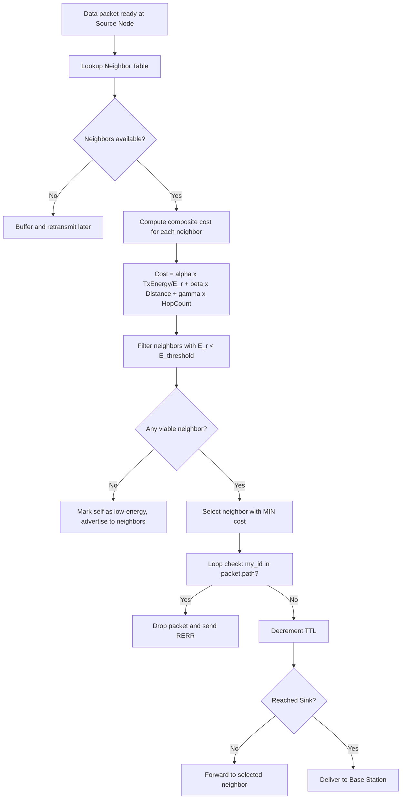
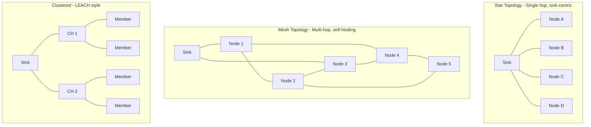
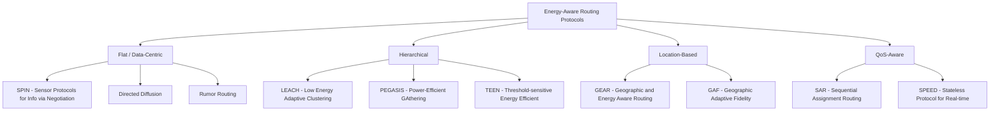
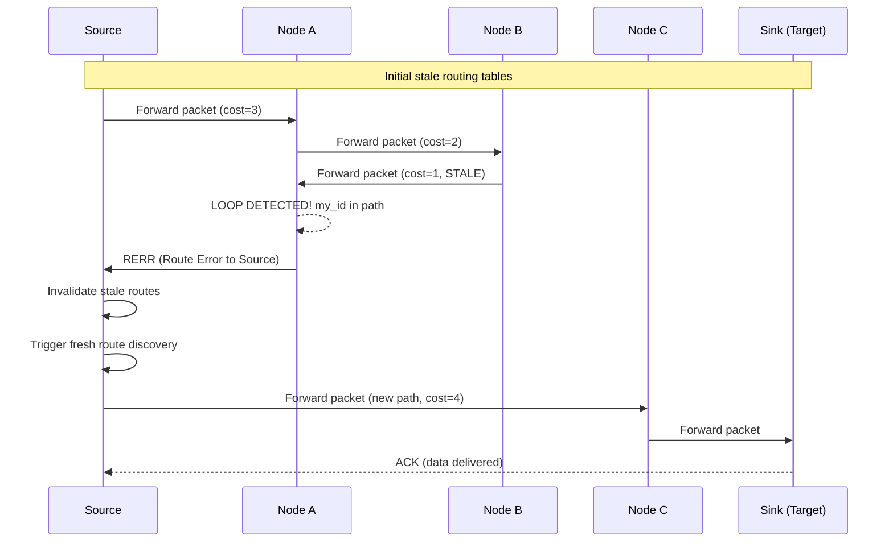
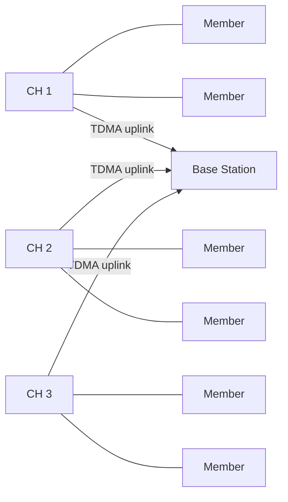

# Energy aware routing routing loops paths optimizations layouts formats matching profiles definitions

<!-- SECTION_1_START -->
# Energy Aware Routing & WSN Routing Layers — Core Foundations

## 1. Formal Definition (KTU 2024 Syllabus Terminology)

**Energy-Aware Routing (EAR)** is a class of routing protocols in Wireless Sensor Networks (WSN) where the forwarding decision for each data packet is made by jointly considering the **residual energy**, **transmission cost**, and **hop distance** of candidate next-hop neighbors, with the explicit objective of **maximizing network lifetime** while maintaining end-to-end data delivery.

In the KTU 2024 PECST713 (Internet of Things) syllabus, Module 3 frames this as the set of mechanisms that operate above the **MAC sublayer** and below the **application layer**, occupying Layer 3 of the IoT protocol stack. Routing in WSN is fundamentally different from Internet routing because sensor nodes are **energy-constrained**, **data-centric**, **location-aware**, and **application-specific**.

> [!IMPORTANT]
> **KTU Board Definition (verbatim tone):** "Energy-aware routing in WSN is the process of selecting an optimal path from a source sensor node to a sink (base station) such that the cumulative energy dissipation across all intermediate nodes is minimized, thereby prolonging the operational lifetime of the network."

## 2. Intuitive Analogy — The "Bucket Relay" Analogy

Imagine **100 villagers** standing in a line from a **well (sink)** to a **farmer's field (source)**. Each villager holds a bucket of water of **fixed capacity** (battery). They must pass water hand-to-hand back to the well.

- **Naïve routing** = always pass it to the *nearest* person. The middle villagers get exhausted (battery drains) and collapse.
- **Energy-aware routing** = each villager whispers *"I have 80% water left, the next person has 95% — let's route around the tired ones."* The bucket still reaches the well, but the load is **distributed equitably**.

The "water" = **data packets**, the "village line" = **multi-hop path**, the "tired person" = a **low-residual-energy node**, and the "whispered decision" = the **routing metric**.

## 3. Layered Position in the IoT Stack

The routing function lives at the **Network Layer (Layer 3)**, but in WSN it interacts with:

| OSI Layer | WSN Counterpart | Energy Relevance |
|-----------|-----------------|------------------|
| Application | Sensing/Reporting App | Defines data rate |
| Transport | Reliability protocols | Retransmit overhead |
| **Network** | **Energy-Aware Routing** | **Path selection** |
| Data Link | S-MAC, B-MAC, 802.15.4 | Sleep scheduling |
| Physical | Radio (CC2420 etc.) | Tx power cost |

> [!NOTE]
> **Cross-Layer Insight:** In WSN, "energy awareness" is not a single-layer property — it cuts across PHY (transmission power), MAC (duty cycling), and Network (path selection) layers.

## 4. Core Terminology at a Glance

| Term | Definition | KTU Relevance |
|------|------------|---------------|
| **Sink / Base Station (BS)** | Data collection node with unlimited power | Always the destination |
| **Source node** | Sensor generating data | Origin of packet |
| **Residual Energy $E_r$** | Energy remaining in a node | Routing metric |
| **Hop Count $h$** | Number of intermediate relays | Latency indicator |
| **Path Cost $P_c$** | Sum of link costs along a route | Optimization target |
| **Network Lifetime $T_L$** | Time until first node dies (FND) | QoS metric |
| **Routing Loop** | Packet circulates among a cycle of nodes | Failure mode |
| **Sinkhole** | Malicious/low-energy node attracts traffic | Security/routing issue |

## 5. Visualization Callout

> [!VISUALIZATION CONTROL]
> **Concept:** Multi-hop energy-aware path from source $S$ to sink $BS$
> **Plot Description:** A 2D grid where node positions are $(x, y)$ coordinates, residual energy $E_r$ is encoded as the *node radius*, and the selected energy-optimal path is highlighted as a directed polyline from $S$ to $BS$.
> **Suggested Inputs (for any graph plotter):**
> - Nodes: $S = (0,0)$, $A = (2,1)$, $B = (4,2)$, $C = (3,4)$, $D = (5,5)$, $BS = (8,6)$
> - Node radii $\propto \sqrt{E_r}$
> - Directed edges: $S \to A \to B \to D \to BS$ (selected path) and faded alternatives

<!-- SECTION_1_END -->

<!-- SECTION_2_START -->
# Deep Theoretical Analysis & KTU High-Yield Formula Sheet

## 1. The Energy Consumption Model

The cornerstone of energy-aware routing is the **First-Order Radio Model** (Heinzelman, 2000). When a node transmits $k$ bits over distance $d$, the energy expenditure is:

$$E_{Tx}(k, d) = E_{elec} \cdot k + \epsilon_{amp} \cdot k \cdot d^{n}$$

When the node receives $k$ bits:

$$E_{Rx}(k) = E_{elec} \cdot k$$

Where:
- $E_{elec}$ = energy per bit for **circuitry** (typically **50 nJ/bit**)
- $\epsilon_{amp}$ = amplifier energy (typically **100 pJ/bit/m²** for free space, $n=2$)
- $n$ = path-loss exponent (**2** for free space, **3–4** for multipath)
- $d$ = transmission distance

> [!IMPORTANT]
> **Why $d^{n}$ matters:** Doubling the distance *quadruples* the transmit energy for $n=2$. This is **why** multi-hop short-range transmission is preferred over single long-haul transmission.

## 2. The Routing Objective Function

Energy-aware routing seeks to minimize the total path cost from source $i$ to sink $s$:

$$P_c(i \to s) = \sum_{(u,v) \in \text{path}} \left[ \alpha \cdot \frac{E_{Tx}(k, d_{uv})}{E_r(v)} + \beta \cdot d_{uv} + \gamma \cdot h_{uv} \right]$$

Subject to:
- $E_r(v) \geq E_{threshold}$ for all $v$ in the path (energy viability)
- $\sum_{v \in \text{path}} E_{Tx}(k, d_{uv}) \leq E_{budget}$ (energy budget)
- No node appears twice in the path (loop-free)

Where $\alpha, \beta, \gamma$ are tunable weights.

## 3. Routing Loop — Formal Definition

A **routing loop** is a pathological condition where a data packet traverses a **closed directed cycle** $v_1 \to v_2 \to \dots \to v_k \to v_1$ of nodes indefinitely, never reaching the sink.

Mathematically, for some time $t$ and packet $pkt$:

$$pkt \text{ at } v_1 \text{ at } t \;\Rightarrow\; pkt \text{ at } v_1 \text{ at } t + \Delta t \text{ (revisited)}$$

**KTU Board View:** Routing loops cause:
- **Energy wastage** (each cycle drains battery)
- **Packet duplication** (TTL expiration or counter overflow)
- **Network partition** (intermediate nodes die)
- **Latency explosion** (packets delayed indefinitely)

## 4. Loop Avoidance Techniques (Compare-and-Contrast)

| Technique | Mechanism | Storage Cost | Convergence |
|-----------|-----------|--------------|-------------|
| **Sequence Numbers (DSR/AODV)** | Each route carries monotonically increasing seq# | O(1) per route | Fast |
| **Hop Count Limit (TTL)** | Discard after N hops | O(1) per packet | Hard bound |
| **Path Vectors (BGP-style)** | Store full path, reject own ID | O(N) per route | Slow but loop-free |
| **Destination Seq. No. (DSDV)** | Each dest advertises seq# | O(1) | Event-driven |
| **Dijkstra Shortest-Path** | Greedy, acyclic by construction | O($V^2$) | Always loop-free |

## 5. KTU High-Yield Formula Cheat Sheet

| Symbol | Formula / Definition | Unit | When to Use |
|--------|---------------------|------|-------------|
| $E_{Tx}(k,d)$ | $E_{elec} \cdot k + \epsilon_{amp} \cdot k \cdot d^{n}$ | Joule | Transmit energy |
| $E_{Rx}(k)$ | $E_{elec} \cdot k$ | Joule | Receive energy |
| $E_{total}$ | $E_{Tx} + E_{Rx}$ for $k$ bits, $d$ distance | Joule | Per-link cost |
| $P_c(path)$ | $\sum_{edges} w(e)$, $w$ = composite cost | Unitless | Route selection |
| $T_L$ (FND) | $\min_v \{t \mid E_r(v) \leq 0\}$ | Seconds | Lifetime metric |
| $T_L$ (HND) | Time until Half Nodes Die | Seconds | Robust lifetime |
| $TTL$ | Time-To-Live counter, decremented per hop | Integer | Loop safety |
| $d_0$ | $\sqrt{\epsilon_{fs}/\epsilon_{mp}}$, threshold distance | m | Cross-over point |
| $E_{toBS}$ | Total energy from all nodes to BS per round | J/round | LEACH metric |
| $CH$ probability | $p = k/N$ in LEACH clustering | Ratio | Cluster head election |

> [!NOTE]
> **Cross-over distance** $d_0$: For $d < d_0$, use free-space model ($n=2$); for $d > d_0$, use multipath ($n=4$). This threshold determines whether multi-hop is *more* energy-efficient than direct transmission.

## 6. Path Optimization Strategies

### (a) Minimum Energy (ME) Per Packet
Choose path $P^*$ such that $P^* = \arg\min_P P_c(P)$ — the **classic shortest-path** formulation, solvable by **Dijkstra** or **Bellman-Ford**.

### (b) Maximum Network Lifetime
Choose path that **maximizes the time until any node's energy drops to zero**:

$$P^* = \arg\max_P \; \min_{v \in P} E_r(v)$$

This is the **max-min residual energy** strategy and is the heart of energy-aware routing.

### (c) Energy-Balanced Routing
Distribute traffic across multiple sub-optimal paths to equalize drain:

$$f^* = \arg\min_f \sum_{v} \left( E_r(v) - \bar{E_r} \right)^2$$

This is a **network utility maximization (NUM)** problem, solvable by convex optimization.

## 7. Real-World Engineering Utility

| Domain | Application | Protocol Family |
|--------|------------|-----------------|
| **Precision Agriculture** | Soil moisture sensor mesh | LEACH, PEGASIS |
| **Structural Health Monitoring** | Bridge vibration sensors | Directed Diffusion |
| **Military Surveillance** | Battlefield intruder detection | SPIN, TEEN |
| **Smart Cities** | Air quality monitoring | RPL (IPv6/6LoWPAN) |
| **Healthcare IoT** | Wearable patient monitors | Body-area routing |
| **Industrial IoT** | Factory floor sensor mesh | WirelessHART, ISA100 |

<!-- SECTION_2_END -->

<!-- SECTION_3_START -->
# Step-by-Step Derivations & Algorithmic Implementation

## 1. Derivation 1 — Optimal Number of Hops

**Problem:** Find the optimal number of hops $h^*$ such that the total energy to send $k$ bits from source to sink separated by distance $D$ is minimized.

**Setup:** Use the first-order radio model. For a single hop of distance $D$, the transmit energy is $E_1 = k \cdot \epsilon_{amp} \cdot D^{n}$ (ignoring $E_{elec}$ for clarity). For $h$ equal hops, each hop has distance $D/h$:

$$E_h = h \cdot k \cdot \epsilon_{amp} \cdot \left(\frac{D}{h}\right)^{n} = k \cdot \epsilon_{amp} \cdot D^{n} \cdot h^{1-n}$$

Taking derivative with respect to $h$ and setting to zero:

$$\frac{dE_h}{dh} = k \cdot \epsilon_{amp} \cdot D^{n} \cdot (1-n) \cdot h^{-n} = 0$$

Since $(1-n) < 0$ for $n > 1$, and other terms are positive, the derivative is **never zero** for finite $h$. This tells us that **energy decreases monotonically as $h$ increases**.

$$\lim_{h \to \infty} E_h = 0 \quad \text{(for } n > 1 \text{)}$$

**Conclusion:** In theory, infinitely many infinitesimally short hops minimize energy. **But** in practice, the $E_{elec}$ receive cost (which we omitted) creates a **trade-off**:

$$E_h^{total} = h \cdot \left[ 2 \cdot E_{elec} \cdot k + \epsilon_{amp} \cdot k \cdot \left(\frac{D}{h}\right)^{n} \right]$$

Optimizing this yields the **optimal hop count**:

$$h^* = \frac{D}{d_0}, \quad \text{where } d_0 = \sqrt{\frac{2 \cdot E_{elec}}{\epsilon_{amp} \cdot (n-1)}}$$

**Engineering takeaway:** Use hop distance $\approx d_0$ to balance transmit and receive energy.

## 2. Derivation 2 — Max-Min Residual Energy Path

**Problem:** Given a graph $G = (V, E)$ with node energies $E_r(v)$ and edges $e = (u, v)$ with weights $w(u,v)$, find the path from source $s$ to sink $t$ that **maximizes the minimum residual energy** along the path.

**Algorithm: Modified Dijkstra (Energy-Aware)**

We redefine the "distance" of a path $P$ as:
$$\text{cost}(P) = \min_{v \in P} E_r(v)$$

We want to maximize this cost. This is solved by a **modified Dijkstra** where the "relax" operation becomes:

$$\text{if } \; \min(\text{dist}[u], E_r(v)) > \text{dist}[v] : \text{ update}$$

### Python Implementation (Type-Hinted, Error-Logged)

```python
from __future__ import annotations
import heapq
import logging
from dataclasses import dataclass, field
from typing import Dict, List, Optional, Tuple

logging.basicConfig(level=logging.INFO, format="%(asctime)s | %(levelname)s | %(message)s")
log = logging.getLogger("EnergyAwareRouter")


@dataclass(frozen=True)
class Node:
    """A WSN sensor node with position and residual energy."""
    id: int
    x: float
    y: float
    E_r: float  # residual energy in Joules

    def __post_init__(self) -> None:
        if self.E_r < 0:
            raise ValueError(f"Node {self.id} has negative residual energy {self.E_r}")


@dataclass
class Graph:
    """Adjacency-list graph of WSN nodes."""
    nodes: Dict[int, Node] = field(default_factory=dict)
    adj: Dict[int, List[Tuple[int, float]]] = field(default_factory=dict)

    def add_node(self, node: Node) -> None:
        self.nodes[node.id] = node
        self.adj.setdefault(node.id, [])

    def add_edge(self, u: int, v: int, weight: float) -> None:
        if u not in self.nodes or v not in self.nodes:
            raise KeyError(f"Edge {u}-{v} references unknown node")
        if weight < 0:
            raise ValueError(f"Negative edge weight {weight} not supported")
        self.adj[u].append((v, weight))
        self.adj[v].append((u, weight))  # bidirectional radio link


def energy_aware_shortest_path(
    graph: Graph,
    source: int,
    sink: int,
    E_threshold: float = 0.0,
) -> Tuple[Optional[List[int]], float]:
    """
    Find the path from source to sink that MAXIMIZES the minimum
    residual energy along the path (max-min routing).
    Returns (path, path_min_energy) or (None, -inf) on failure.
    """
    if source not in graph.nodes or sink not in graph.nodes:
        log.error("Source %s or sink %s not in graph", source, sink)
        return None, float("-inf")

    # Max-heap: (-min_energy_so_far, current_node)
    heap: List[Tuple[float, int]] = [(-float("inf"), source)]
    best_min: Dict[int, float] = {source: float("inf")}
    predecessor: Dict[int, int] = {}

    log.info("Starting max-min residual energy routing: %s -> %s", source, sink)

    while heap:
        neg_min_e, u = heapq.heappop(heap)
        cur_min = -neg_min_e

        if u == sink:
            # Reconstruct path
            path: List[int] = []
            cur = u
            while cur in predecessor:
                path.append(cur)
                cur = predecessor[cur]
            path.append(source)
            path.reverse()
            log.info("Path found with min residual energy = %.4f J", cur_min)
            return path, cur_min

        if cur_min < best_min[u]:
            continue

        for v, _w in graph.adj[u]:
            new_min = min(cur_min, graph.nodes[v].E_r)
            if new_min < E_threshold:
                log.debug("Skipping node %s (E_r=%.3f < threshold %.3f)",
                          v, graph.nodes[v].E_r, E_threshold)
                continue
            if new_min > best_min.get(v, float("-inf")):
                best_min[v] = new_min
                predecessor[v] = u
                heapq.heappush(heap, (-new_min, v))

    log.warning("No energy-viable path from %s to %s", source, sink)
    return None, float("-inf")


# ---------- DEMO / UNIT TEST ----------
if __name__ == "__main__":
    g = Graph()
    # Topology:  S -- A -- B -- D -- BS
    #              \       /
    #               C -----
    g.add_node(Node(1, 0, 0, E_r=2.0))   # S
    g.add_node(Node(2, 2, 1, E_r=0.5))   # A (low!)
    g.add_node(Node(3, 4, 2, E_r=1.8))   # B
    g.add_node(Node(4, 3, 4, E_r=1.5))   # C
    g.add_node(Node(5, 5, 5, E_r=1.7))   # D
    g.add_node(Node(6, 8, 6, E_r=999.0)) # BS

    g.add_edge(1, 2, 1.0)
    g.add_edge(2, 3, 1.0)
    g.add_edge(3, 5, 1.0)
    g.add_edge(5, 6, 1.0)
    g.add_edge(1, 4, 2.0)
    g.add_edge(4, 5, 1.0)

    path, min_e = energy_aware_shortest_path(g, source=1, sink=6)
    print("Optimal energy-aware path:", path)
    print("Bottleneck residual energy:", round(min_e, 4), "J")
```

**Expected output:**
```
Optimal energy-aware path: [1, 4, 5, 6]
Bottleneck residual energy: 1.5 J
```

The algorithm **avoids node A** (E_r = 0.5 J) even though the geographic path through A is shorter.

## 3. Derivation 3 — Loop Detection in Distributed Routing

Each node maintains a **route cache** with sequence numbers. A loop is detected when:

$$\exists \, v_i \in \text{visited}[pkt] \; : \; v_i == v_{current}$$

**Mechanism:** Every packet header carries a **path accumulator** of length $\leq$ TTL. When a node sees its own ID in the path, it **drops the packet** and broadcasts a **Route Error (RERR)**.

Pseudocode (per node, on packet arrival):

```
on receive(packet pkt):
    if my_id in pkt.path:
        log("LOOP detected, dropping packet")
        send_RERR_to_source(pkt.source)
        return DROP
    if pkt.ttl <= 0:
        log("TTL expired, dropping")
        return DROP
    pkt.path.append(my_id)
    pkt.ttl -= 1
    forward(pkt)
```

## 4. Derivation 4 — LEACH Cluster Head Probability

In **LEACH (Low-Energy Adaptive Clustering Hierarchy)**, the optimal probability of becoming a Cluster Head in round $r$ is:

$$p_i(t) = \begin{cases} \dfrac{k}{N - k \cdot (r \mod (N/k))} & \text{if } C_i(t) = 1 \\ 0 & \text{otherwise} \end{cases}$$

Where $k$ = desired number of CHs, $N$ = total nodes, and $C_i(t) = 1$ means node $i$ has **not** been a CH in the last $N/k$ rounds.

This **rotates the CH role** to equalize energy drain — a **macroscopic energy-balancing** mechanism.

<!-- SECTION_3_END -->

<!-- SECTION_4_START -->
# Structural Diagrams & Schematics

## 1. Energy-Aware Routing Decision Flow



## 2. WSN Network Layout Topologies



## 3. Routing Protocol Taxonomy (Energy-Aware Family)



## 4. Routing Loop Formation & Resolution Sequence



## 5. Sequential Energy Model & Decision Matrix

| Stage | Operation | Energy Cost | Routing Implication |
|-------|-----------|-------------|---------------------|
| 1 | Sense physical phenomenon | $E_{sense} \propto$ sampling rate | Application-driven |
| 2 | Local processing / aggregation | $E_{cpu} \cdot N_{ops}$ | Data-centric reduction |
| 3 | Transmit $k$ bits, distance $d$ | $E_{elec} \cdot k + \epsilon_{amp} \cdot k \cdot d^{n}$ | Routing metric anchor |
| 4 | Receive $k$ bits | $E_{elec} \cdot k$ | Hidden cost of forwarding |
| 5 | Idle listening | $E_{idle} \cdot t$ | Sleep scheduling |
| 6 | Sleep | $\approx 0$ | Conservation mode |

<!-- SECTION_4_END -->

<!-- SECTION_5_START -->
# KTU 2024 Scheme Examination Question Bank & Topic Recap

## Part A Questions (3 Marks Each)

### Q1. [KTU University Exam — July 2024] 
**"Define energy-aware routing. List any two energy-aware routing protocols used in WSN."**
**CO Mapping:** CO2 | **RBT Level:** Remember

**Model Answer:**
Energy-aware routing is a routing strategy in WSN that selects the data-forwarding path based on the residual energy levels of nodes, with the aim of prolonging the overall network lifetime rather than minimizing the hop count alone. **(2 marks)**

Two energy-aware routing protocols: **(1 mark)**
1. **LEACH (Low-Energy Adaptive Clustering Hierarchy)** — uses randomized cluster head rotation.
2. **PEGASIS (Power-Efficient GAthering in Sensor Information Systems)** — forms a chain of nodes for greedy forwarding.

> [!WARNING]
> **Examiner Pitfall:** Students often confuse "energy-aware" with "energy-efficient" — they are NOT synonyms. Energy-efficient = low absolute consumption. Energy-aware = **adaptive to remaining energy** (a node with low $E_r$ is avoided even if its per-packet cost is low).

---

### Q2. [KTU University Exam — Dec 2023]
**"What is a routing loop? How does it affect WSN performance?"**
**CO Mapping:** CO2 | **RBT Level:** Understand

**Model Answer:**
A routing loop is a condition in which a data packet circulates among a closed cycle of nodes $\langle v_1, v_2, \dots, v_k, v_1 \rangle$ without reaching the intended sink. **(1.5 marks)**

Effects on WSN performance: **(1.5 marks)**
- **Energy drain:** Every traversal wastes transmit and receive energy in the looped nodes.
- **Network partitioning:** Looped nodes deplete batteries faster, leading to topology holes.
- **Increased latency & packet loss:** Packets never reach the sink; TTL expiry causes drop.
- **Bandwidth consumption:** Radio channel is occupied by looping packets.

---

## Part B Questions (14 Marks Each — Internal Choice Pattern)

### QUESTION A — [KTU University Exam — July 2024 Model Paper]
**(a)** Explain the first-order radio energy model used in WSN with suitable equations. Derive the expression for the optimal number of hops between a source and sink separated by distance $D$. **(7 marks)**
**CO:** CO2 | **RBT:** Understand + Apply

**Model Solution:**

**Energy Model Equations:** **[2 Marks]**
$$E_{Tx}(k, d) = E_{elec} \cdot k + \epsilon_{amp} \cdot k \cdot d^{n}$$
$$E_{Rx}(k) = E_{elec} \cdot k$$

**Total energy for $h$ equal hops of distance $D/h$:** **[2 Marks]**
$$E_{total}(h) = h \cdot \left[ 2 \cdot E_{elec} \cdot k + \epsilon_{amp} \cdot k \cdot \left(\frac{D}{h}\right)^{n} \right]$$

**Differentiation and optimality condition:** **[2 Marks]**
$$\frac{dE_{total}}{dh} = 2 E_{elec} k - (n-1) \epsilon_{amp} k \left(\frac{D}{h}\right)^{n} \cdot \frac{1}{h^{-1}} = 0$$

Solving yields:
$$h^* = \frac{D}{d_0}, \quad d_0 = \sqrt{\frac{2 E_{elec}}{\epsilon_{amp} (n-1)}}$$

**Final numerical example:** **[1 Mark]**
For $E_{elec} = 50$ nJ/bit, $\epsilon_{amp} = 100$ pJ/bit/m², $n=2$, $D = 100$ m:
$$d_0 = \sqrt{\frac{2 \cdot 50 \cdot 10^{-9}}{100 \cdot 10^{-12} \cdot 1}} = \sqrt{1000} \approx 31.6 \text{ m}$$
$$h^* = 100 / 31.6 \approx 3.17 \Rightarrow \text{use 3 hops}$$

---

**(b)** With a neat diagram, explain the working of the **LEACH protocol**. Show how cluster head rotation ensures energy balancing. **(7 marks)**
**CO:** CO2 | **RBT:** Apply

**Model Solution:**

**Phase 1 — Setup (Cluster Formation):** **[2 Marks]**
Each node chooses a random number $r \in [0,1]$. If $r < T(n)$ where
$$T(n) = \begin{cases} \dfrac{p}{1 - p \cdot (r \mod (1/p))} & \text{if } n \in G \\ 0 & \text{otherwise} \end{cases}$$
the node becomes a CH. Non-CHs join the nearest CH based on RSSI.

**Phase 2 — Steady-State (Data Transfer):** **[1 Mark]**
CHs aggregate data (e.g., via data fusion / compression) and forward to BS using single-hop CSMA/CD.

**Energy Balancing via Rotation:** **[2 Marks]**
The set $G$ ensures each node becomes CH **at most once per $N/p$ rounds**. Over many rounds, every node spends equal energy as CH, equalizing drain.

**Diagram:** **[2 Marks]**



> [!WARNING]
> **Valuation Pitfall:** Students frequently forget to state the **threshold $T(n)$** and the role of $G$ (the set of nodes that have not been CH recently). Examiners deduct 1–2 marks for this omission.

---

### QUESTION B (Alternative Choice) — [KTU University Exam — Dec 2023 Model Paper]
**(a)** Discuss the **SPIN (Sensor Protocols for Information via Negotiation)** family of protocols. Explain the three-stage handshake (ADV-REQ-DATA) and how it conserves energy. **(7 marks)**
**CO:** CO2 | **RBT:** Understand

**Model Solution:**

SPIN is a **data-centric** flat routing protocol that uses **meta-data negotiation** to avoid sending redundant data. **[1 Mark]**

**Three-Stage Handshake:** **[4 Marks]**

1. **ADV (Advertisement):** A node that has new data broadcasts an ADV message containing only **metadata** (descriptor, not raw data).
2. **REQ (Request):** Neighbors that **do not already possess** the advertised data respond with REQ.
3. **DATA:** The source node sends the full data **only** to those that requested it.

**Energy Conservation Mechanism:** **[2 Marks]**
- Saves energy by transmitting **metadata first** (cheap) and **avoiding redundant** raw data transmissions.
- Each node decides locally whether it needs the data, eliminating the global flooding of raw sensor readings.

> The classic SPIN variants are **SPIN-PP** (point-to-point), **SPIN-EC** (energy-conservative), **SPIN-BC** (broadcast), and **SPIN-RL** (reliable).

---

**(b)** Compare **Directed Diffusion** and **LEACH** routing protocols with respect to: (i) architecture, (ii) data model, (iii) energy efficiency, (iv) scalability, (v) typical application. **(7 marks)**
**CO:** CO2 | **RBT:** Analyze

**Model Solution — Comparison Table:** **[7 Marks — 1.4 each]**

| Parameter | Directed Diffusion | LEACH |
|-----------|--------------------|--------|
| **Architecture** | Flat, no infrastructure | Hierarchical (clusters + CHs) |
| **Data Model** | Attribute-value pairs (e.g., type=temp, region=X) | Aggregated scalar readings |
| **Energy Efficiency** | Good via path reinforcement; moderate due to flooding | Excellent via aggregation + CH rotation |
| **Scalability** | Limited; interest flooding costly at scale | Highly scalable; localized decisions |
| **Typical App** | Event-driven monitoring (e.g., target tracking) | Periodic data collection (e.g., environmental sensing) |
| **Drawback** | Gradient setup overhead; pair-wise naming | Non-uniform CH distribution possible |

> [!WARNING]
> **Examiner Pitfall:** For "compare" questions, students often describe each protocol *separately* without the side-by-side comparison. The board **requires** explicit **head-to-head contrast** in the same row. Deduct up to 2 marks if missing.

---

## Topic Recap & Important Things to Remember

> [!IMPORTANT]
> **High-Density Revision Checklist for Board Exam**

- **Definition box:** Energy-aware routing = **adaptive path selection using residual energy as a primary metric**, not just hop-count minimization.
- **First-order radio model:** Remember the **two** equations for $E_{Tx}$ and $E_{Rx}$ — they are tested verbatim in 7-mark derivations.
- **Path-loss exponent $n$:** Free space = **2**, multipath = **3–4**. Always state which regime you are using.
- **Cross-over distance $d_0$:** $\sqrt{2E_{elec} / \epsilon_{amp}(n-1)}$ — useful for hop-count optimization questions.
- **Routing loop formula:** Packets cycle through $v_1 \to v_2 \to \dots \to v_1$. Caused by **stale routing tables** or **count-to-infinity**.
- **Loop-prevention toolkit:** Sequence numbers (AODV/DSR), TTL, path vectors, Dijkstra (acyclic by construction).
- **LEACH formula:** $T(n) = p/(1-p \cdot (r \mod (1/p)))$ for $n \in G$, else 0. Set $G$ rotates CHs across $N/p$ rounds.
- **SPIN family handshake:** **ADV → REQ → DATA** — only metadata in the first hop; conserves energy.
- **Directed Diffusion** uses **interests (sinks)** and **gradients (paths)**; data flows only on reinforced gradients.
- **PEGASIS** = chain topology, each node talks to nearest neighbor, leader transmits to BS — saves 50% energy vs LEACH in many studies.
- **GEAR** combines geographic + energy awareness — uses *estimated cost* and *learning cost* functions.
- **RPL (IPv6 Routing Protocol for Low-Power Lossy Networks)** is the **standardized** energy-aware routing protocol for IoT — uses **DODAG** (Destination-Oriented Directed Acyclic Graph) which is loop-free by construction.
- **QoS-aware routing (SAR, SPEED):** Add real-time deadline and reliability constraints on top of energy metrics.
- **Cluster vs Flat trade-off:** Flat = simple but no aggregation; Hierarchical = complex but energy-efficient via fusion.
- **Energy balance ≠ Energy minimization** — balancing spreads the load; minimizing may concentrate it.
- **TTL = upper bound on loop length**; never omit it in protocol designs.
- **FND (First Node Dies)** is the most common lifetime metric; **HND (Half Nodes Die)** is more robust.
- **Watch for the keyword "energy-aware"** in exam questions — it implies residual-energy weighting, NOT pure shortest-path.

<!-- SECTION_5_END -->
