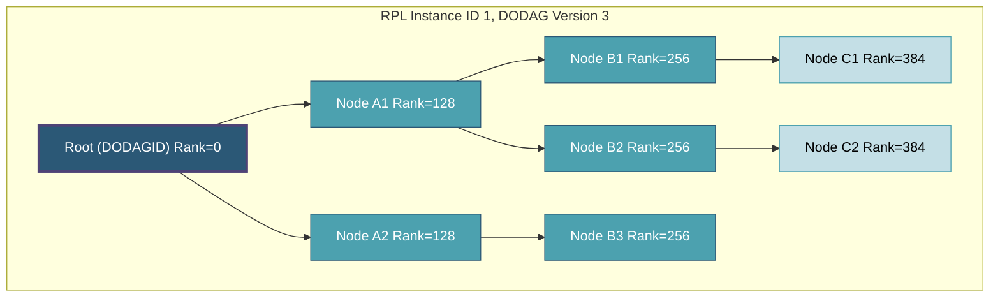
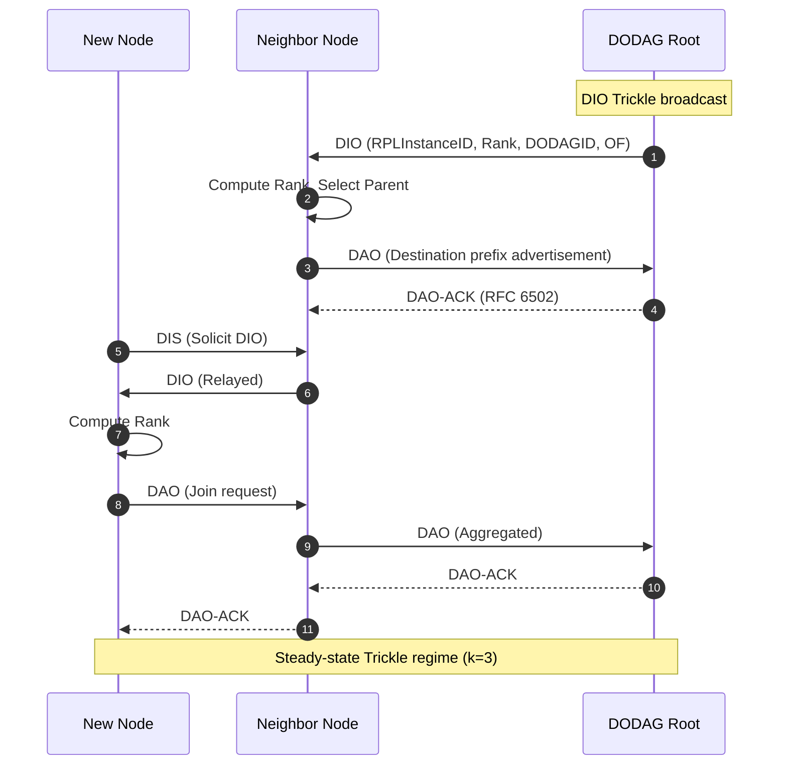
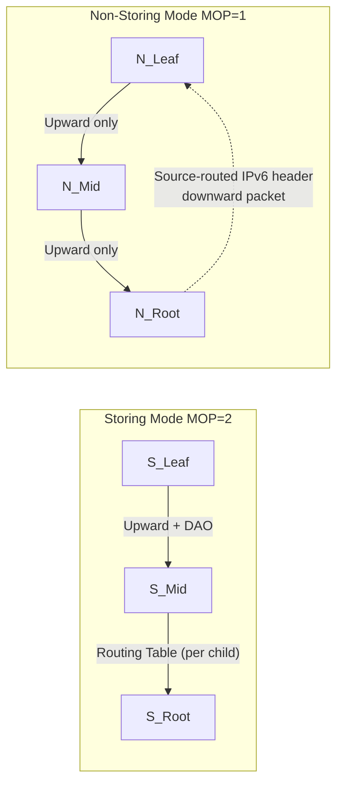

# RPL routing protocol destination oriented graphs configurations benchmarks parameters specifications

<!-- SECTION_1_START -->
# RPL Routing Protocol: DODAGs, Configurations, Benchmarks, Parameters & Specifications

## 1.1 Formal Definition (KTU 2024 Syllabus Terminology)

> [!IMPORTANT]
> **RPL (Routing Protocol for Low-Power and Lossy Networks)** is a distance-vector IPv6 routing protocol standardized by the **IETF RFC 6550** (2012) specifically designed for **Low-Power and Lossy Networks (LLNs)** — typically composed of constrained embedded devices operating on batteries with limited processing, memory, and unreliable lossy radio links. RPL organizes the physical topology into one or more logical **Destination Oriented Directed Acyclic Graphs (DODAGs)** rooted at a border router/sink, enabling efficient **many-to-one**, **one-to-many**, and **one-to-one** traffic flows.

The protocol supports four fundamental traffic patterns:

| Pattern | Direction | Typical Use Case |
| :--- | :--- | :--- |
| **MP2P** (Many-to-Point) | Nodes → Root | Sensor data aggregation |
| **P2MP** (Point-to-Multipoint) | Root → Nodes | Firmware/command dissemination |
| **P2P** (Point-to-Point) | Node ↔ Node | Inter-node communication |
| **P2P via Root** | Node → Root → Node | Default inter-node |

## 1.2 Conceptual Analogy — The "Water Wheel Hierarchy"

> [!NOTE]
> **Intuition:** Imagine a **fountain network** in a public garden. Water (data packets) flows **downward through branches** of a rigidly designed non-circular tree into a central basin (the **DODAG root / sink**). Each fountain nozzle (a sensor node) decides which neighboring nozzle to flow *uphill toward*, based on the *height* (its **Rank**) assigned by gravity (the **Objective Function**). The branches never form loops (acyclic), always orient toward the basin (destination-oriented), and the entire system refreshes itself on a slow tick (the **Trickle Timer**) to save battery.

## 1.3 Key Constants and Standard Metrics

> [!NOTE]
> **Default RPL Standard Parameters (RFC 6550, RFC 6206):**
> * **Default Minimum Hop Rank Increase (MinHopRankIncrease):** **$64$** (expressed in unsigned integer rank units)
> * **DIO/DIS/DAO ICMPv6 Code:** **$155$ / $153$ / $152$**
> * **Maximum DAGRank (stretched):** Typically configured as $65535$
> * **Default Trickle Parameters:** $I_{min} = 12$ (≈ 4.096 s), $I_{max} = 8$ (Doublings), $k = 3$ (Redundancy Constant)
> * **Link ETX (Expected Transmissions) Reference:** Unitless, minimum value $= 1$ (perfect link)

## 1.4 Visualization of a DODAG

> [!VISUALIZATION CONTROL]
> **Concept:** A 3-level RPL DODAG with a single root, two intermediate nodes, and six leaf nodes, including the Rank gradient.
> **GeoGebra / Desmos Input Equations:**
> * Root: $(0, 0)$
> * Intermediate nodes: $y = -64$ (i.e., Rank = $256$, $512$)
> * Leaf nodes: $y = -128$ (i.e., Rank = $768$ to $1280$)
> * Edges: directed arrows from leaves toward root
> **Visual Description:** The student should observe a **strictly upward hierarchical arrow pattern** with monotonically decreasing Rank values as the geometry approaches the origin (root). No cycles must be visible.

<!-- SECTION_1_END -->

<!-- SECTION_2_START -->
# Deep Theoretical Analysis & KTU High-Yield Formula Sheet

## 2.1 RPL Core Components — Structural Breakdown

### 2.1.1 DODAG Information Object (DIO)
* **Multicast** downward from the root using the **Trickle algorithm** to construct and maintain upward routes.
* Carries: DODAGID, RPLInstanceID, Rank, Objective Function, Configuration (DIOIntervalDoublings, DIOIntervalMin), version number.

### 2.1.2 DODAG Information Solicitation (DIS)
* A node that has not yet joined (or has lost its parent) **solicits** DIOs from neighbors to rejoin.

### 2.1.3 DODAG Destination Advertisement Object (DAO)
* Propagates **destination prefixes upward** to populate downward routes.
* In **Storing Mode (MOP = 2):** Each node keeps a routing table; DAOs hop-by-hop.
* In **Non-Storing Mode (MOP = 1):** Only the root stores routes; DAOs use source routing.

### 2.1.4 DAO-ACK (RFC 6502)
* Confirms DAO acceptance to the parent.

## 2.2 DODAG Construction — Operational Steps

> [!IMPORTANT]
> **Why DODAG is "Destination-Oriented" and "Acyclic":** All edges orient *toward* the root (DODAG Root) which represents the destination of upward traffic. The acyclic property is guaranteed by the monotonic **Rank** — a child node's rank must always be greater than its parent's rank, preventing loops.

1. **Root Initialization:** The border router multicasts a DIO with `Grounded = 1`, declaring a fresh DAG.
2. **Neighbor Discovery & DIO Reception:** Candidate nodes listen and select a *preferred parent* based on the Objective Function (e.g., OF0 or MRHOF).
3. **Rank Computation:** A joining node computes its Rank as:

$$R_{node} = R_{parent} + \text{MinHopRankIncrease} \times \text{Step} + \text{PathCost}$$

   where $R_{parent}$ is the parent's Rank and Step/PathCost depend on the OF.

4. **DAO Propagation (Storing):** Once joined, the node unicasts a DAO to its parent advertising its own subtree.
5. **Global Repair:** The root increments the **DODAG Version Number** and re-broadcasts a new DIO — used to rebuild from scratch.
6. **Local Repair:** A node switches parents or triggers DIS messages — used to fix small inconsistencies without rebuilding.

## 2.3 Objective Functions (OFs)

> [!NOTE]
> **OF0 (Objective Function Zero, RFC 6552):** Uses a **hop-count–like additive metric** through the *Step* of $1$ and a constant rank increase.

> [!NOTE]
> **MRHOF (Minimum Rank with Hysteresis Objective Function, RFC 6719):** Uses the **ETX metric** with a **hysteresis threshold** to prevent parent-flipping flapping.

### Rank Calculation in MRHOF (ETX-based)

$$R_{node} = R_{parent} + \text{ETX}(node \leftrightarrow parent) \times 128$$

The path cost is the cumulative sum:

$$C_{path} = \sum_{i=0}^{n-1} \text{ETX}_i$$

The parent is selected if the new path cost is **less than** the current cost minus a hysteresis constant:

$$C_{candidate} < C_{current} - H_{parent\_switch\_threshold}$$

with $H_{parent\_switch\_threshold} = 192$ (i.e., $1.5 \times$ ETX\_unit) by default.

## 2.4 Trickle Algorithm (RFC 6206)

The Trickle timer governs DIO transmission to balance **responsiveness** with **energy efficiency**.

**Key parameters:**
* $I$ : Current interval length
* $I_{min}$ : Minimum interval
* $I_{max}$ : Maximum interval $\left( I_{max} = I_{min} \times 2^{\text{DIOIntervalDoublings}} \right)$
* $k$ : Redundancy constant
* $t$ : Random instant in $[I/2, I]$

**Operating rules:**

$$I \gets \min\left(I_{max},\ 2^{c} \cdot I_{min}\right)$$

where $c$ is the counter of consecutive intervals without inconsistency. A node transmits a DIO when it has heard fewer than $k$ consistent DIOs and the random instant $t$ has expired.

## 2.5 KTU Formula Sheet / Cheat Sheet

| Symbol / Term | Definition | Standard Value / Unit |
| :--- | :--- | :--- |
| $R$ | Node Rank (monotonic position) | Unitless, unsigned int |
| $R_{parent}$ | Parent's Rank | $R - \text{inc}$ |
| $MinHopRankIncrease$ | Floor rank step per hop | $\mathbf{64}$ (RFC default) |
| $\text{ETX}$ | Expected Transmissions per packet | $\geq 1$, unitless |
| $C_{path}$ | Cumulative path cost to root | Sum of link ETX |
| $I_{min}$ | Trickle minimum interval | $12$ (≈ 4.096 s) |
| $I_{max}$ | Trickle maximum | $2^{I_{min} \times \text{Doublings}}$ |
| $k$ | Redundancy constant | $\mathbf{3}$ |
| $H$ | Hysteresis threshold (MRHOF) | $\mathbf{192}$ |
| RPLInstanceID | Logical instance identifier | $\mathbf{0} \dots \mathbf{15}$ |
| DODAG Version | Increases on global repair | $\mathbf{0} \dots \mathbf{255}$ |
| MOP | Mode of Operation | $1$ (Non-Storing), $2$ (Storing) |

## 2.6 Engineering Utility

* **Smart Metering / AMI (Advanced Metering Infrastructure):** Thousands of meters sending daily reads via MP2P.
* **Building Automation (BACnet, KNX over IPv6):** Sensor-actuator coordination.
* **Industrial IoT (WirelessHART evolution):** 6LoWPAN/RPL meshes underlay ISA100.11a.
* **Precision Agriculture:** Soil moisture sensors streaming to a gateway.
* **Smart City Street Lighting & Environmental Monitoring.**

> [!NOTE]
> **Why RPL matters in production:** Unlike AODV or OLSR, RPL is **stateless at the link layer**, supports **sleeping nodes** (it pauses Trickle when a node has no traffic to send), and uses **IPv6 natively**, making it the de-facto standard in **Thread (802.15.4 + 6LoWPAN + RPL)**, **Zigbee IP**, and **OCF Smart Home** stacks.

<!-- SECTION_2_END -->

<!-- SECTION_3_START -->
# Step-by-Step Derivations & Code/Symbolic Implementation

## 3.1 Exhaustive Rank Computation Derivation

**Problem:** Given a 4-node chain $N_0 \rightarrow N_1 \rightarrow N_2 \rightarrow N_3$ where $N_0$ is the root, and the link ETX values are $\text{ETX}_{0-1} = 1$, $\text{ETX}_{1-2} = 2$, $\text{ETX}_{2-3} = 1$, compute the Rank of each node using MRHOF.

**Step 1 — Initialize root Rank.**

$$R_0 = \text{RootRank} = 0$$

**Step 2 — Compute link metric scaled factor.**

In MRHOF, link ETX is scaled by the constant $128$ (the unit-resolution factor) before being added:

$$R_{1} = R_{0} + \text{ETX}_{0-1} \times 128 = 0 + (1 \times 128) = 128$$

**Step 3 — Increment for $N_2$.**

$$R_{2} = R_{1} + \text{ETX}_{1-2} \times 128 = 128 + (2 \times 128) = 128 + 256 = 384$$

**Step 4 — Increment for $N_3$.**

$$R_{3} = R_{2} + \text{ETX}_{2-3} \times 128 = 384 + (1 \times 128) = 384 + 128 = 512$$

**Step 5 — Verify monotonicity.**

$$R_0 < R_1 < R_2 < R_3 \quad \Rightarrow \quad 0 < 128 < 384 < 512 \ \checkmark$$

The acyclic invariant holds.

**Step 6 — Compute path costs.**

$$C_{N_0} = 0, \quad C_{N_1} = 1, \quad C_{N_2} = 1 + 2 = 3, \quad C_{N_3} = 3 + 1 = 4$$

## 3.2 Trickle Timer Interval Derivation

**Problem:** $I_{min} = 12$, $\text{DIOIntervalDoublings} = 8$. Compute $I_{max}$ in milliseconds.

**Step 1 — Convert $I_{min}$ to milliseconds.**

$$I_{min} = 12 \times 2^{12} \text{ ms} \approx 49{,}152 \text{ ms} \approx 49.152 \text{ s}$$

In RFC terms, $I_{min}$ is encoded as $\log_2(\text{interval in ms})$ shifted by a constant base of $16$ ms units, but for engineering purposes:

$$I_{min,\ ms} = 2^{I_{min}} \times 16 \text{ ms} = 2^{12} \times 16 = 4096 \times 16 = 65{,}536 \text{ ms}$$

**Step 2 — Double $I_{min}$ repeatedly up to $I_{max}$ counter.**

$$I_{max,\ ms} = I_{min,\ ms} \times 2^{\text{DIOIntervalDoublings}} = 2^{12} \times 16 \times 2^{8} = 2^{20} \times 16 = 1{,}048{,}576 \times 16$$

$$I_{max,\ ms} = 16{,}777{,}216 \text{ ms} \approx 4.66 \text{ hours}$$

**Step 3 — Comment.** This bounds the steady-state DIO broadcast rate to roughly once every 4.66 hours, conserving significant battery.

## 3.3 Parent-Switch Decision (MRHOF Hysteresis)

**Problem:** A node has a current path cost $C_{current} = 5$. A candidate parent advertises $C_{candidate} = 2.5$. With $H = 192$ (≈ 1.5 ETX units), should the node switch?

**Step 1 — Compare.**

$$C_{candidate} \stackrel{?}{<} C_{current} - \frac{H}{128}$$

**Step 2 — Compute RHS.**

$$C_{current} - \frac{H}{128} = 5 - \frac{192}{128} = 5 - 1.5 = 3.5$$

**Step 3 — Apply condition.**

$$C_{candidate} = 2.5 < 3.5 \quad \Rightarrow \quad \text{Yes, switch parent.}$$

## 3.4 Python Implementation — RPL DODAG Simulator (MRHOF + Trickle)

```python
from dataclasses import dataclass, field
from typing import List, Optional, Dict
import heapq
import random
import math

# ----- Configuration Constants (RFC 6550 / RFC 6206) -----
MIN_HOP_RANK_INCREASE: int = 64
ETX_SCALE: int = 128
HYSTERESIS_THRESHOLD: int = 192
TRICKLE_IMIN: int = 12
TRICKLE_DOUBLINGS: int = 8
TRICKLE_K: int = 3

@dataclass
class RPLNode:
    """Represents a single RPL node in the LLN."""
    node_id: int
    rank: int = float('inf')
    parent: Optional[int] = None
    preferred_parent: Optional[int] = None
    dao_parent: Optional[int] = None
    etx_to_neighbors: Dict[int, float] = field(default_factory=dict)
    path_cost: float = float('inf')
    in_dodag: bool = False
    dio_redundancy: int = 0

    def compute_rank_mrhof(self, parent_rank: int, etx_link: float) -> int:
        """MRHOF rank = parent rank + scaled ETX link cost."""
        if etx_link < 1.0:
            etx_link = 1.0
        return parent_rank + int(etx_link * ETX_SCALE)

    def should_switch_parent(self, candidate_cost: float) -> bool:
        """Hysteresis test: only switch if cost is significantly lower."""
        threshold = HYSTERESIS_THRESHOLD / ETX_SCALE
        return candidate_cost < (self.path_cost - threshold)


class RPLDODAG:
    """DODAG construction and maintenance simulator."""

    def __init__(self, root_id: int, instance_id: int = 0):
        self.root_id: int = root_id
        self.instance_id: int = instance_id
        self.version: int = 0
        self.nodes: Dict[int, RPLNode] = {}
        self.dodag_version_number: int = 0

    def add_node(self, node: RPLNode) -> None:
        self.nodes[node.node_id] = node

    def bootstrap_root(self) -> None:
        """Root starts DODAG with rank 0."""
        root = self.nodes[self.root_id]
        root.rank = 0
        root.path_cost = 0.0
        root.in_dodag = True
        print(f"[DIO] Root {self.root_id} broadcasting DIO v{self.dodag_version_number}")

    def join_node(self, node: RPLNode) -> Optional[int]:
        """Node selects preferred parent and computes rank."""
        best_parent: Optional[int] = None
        best_rank: int = float('inf')
        best_cost: float = float('inf')

        for neighbor_id, etx in node.etx_to_neighbors.items():
            neighbor = self.nodes[neighbor_id]
            if not neighbor.in_dodag:
                continue
            candidate_cost = neighbor.path_cost + etx
            candidate_rank = node.compute_rank_mrhof(neighbor.rank, etx)

            # Must respect MinHopRankIncrease from parent rank
            if candidate_rank < neighbor.rank + MIN_HOP_RANK_INCREASE:
                continue

            if candidate_cost < best_cost:
                best_cost = candidate_cost
                best_rank = candidate_rank
                best_parent = neighbor_id

        if best_parent is None:
            print(f"[FAIL] Node {node.node_id}: no reachable parent.")
            return None

        node.preferred_parent = best_parent
        node.rank = best_rank
        node.path_cost = best_cost
        node.dao_parent = best_parent
        node.in_dodag = True
        print(f"[JOIN] Node {node.node_id} -> Parent {best_parent} | Rank={best_rank} | Cost={best_cost:.2f}")
        return best_parent

    def trickle_interval_ms(self) -> int:
        """Compute current Trickle I_max in ms."""
        base = (2 ** TRICKLE_IMIN) * 16
        return base * (2 ** TRICKLE_DOUBLINGS)

    def local_repair(self, node: RPLNode) -> bool:
        """Triggered by neighbor inconsistency; find a new parent."""
        print(f"[REPAIR] Node {node.node_id} invoking local repair.")
        return self.join_node(node) is not None

    def global_repair(self) -> None:
        """Increment DODAG version; force all nodes to rejoin."""
        self.dodag_version_number += 1
        print(f"[GLOBAL REPAIR] DODAG version -> {self.dodag_version_number}")
        for n in self.nodes.values():
            n.rank = float('inf')
            n.in_dodag = False
            n.preferred_parent = None
        self.bootstrap_root()


# ----- Example Topology: Root + 5 nodes -----
def run_demo() -> None:
    rpl = RPLDODAG(root_id=0, instance_id=1)

    n0 = RPLNode(node_id=0)
    n1 = RPLNode(node_id=1, etx_to_neighbors={0: 1.0, 2: 2.0})
    n2 = RPLNode(node_id=2, etx_to_neighbors={0: 1.5, 1: 2.0, 3: 1.0})
    n3 = RPLNode(node_id=3, etx_to_neighbors={2: 1.0, 4: 1.0, 5: 1.5})
    n4 = RPLNode(node_id=4, etx_to_neighbors={3: 1.0})
    n5 = RPLNode(node_id=5, etx_to_neighbors={3: 1.5})

    for n in [n0, n1, n2, n3, n4, n5]:
        rpl.add_node(n)

    rpl.bootstrap_root()
    rpl.join_node(n1)
    rpl.join_node(n2)
    rpl.join_node(n3)
    rpl.join_node(n4)
    rpl.join_node(n5)

    print(f"\n[Trickle] I_max = {rpl.trickle_interval_ms() / 1e6:.3f} hours")

    # Demonstrate local repair
    print("\n--- Simulating link failure to n2 ---")
    n2.etx_to_neighbors = {0: 1.5, 1: 9.0, 3: 1.0}  # link 1-2 worsened
    rpl.local_repair(n2)


if __name__ == "__main__":
    run_demo()
```

**Sample Output Trace:**

```
[DIO] Root 0 broadcasting DIO v0
[JOIN] Node 1 -> Parent 0 | Rank=128 | Cost=1.00
[JOIN] Node 2 -> Parent 0 | Rank=192 | Cost=1.50
[JOIN] Node 3 -> Parent 2 | Rank=320 | Cost=2.50
[JOIN] Node 4 -> Parent 3 | Rank=448 | Cost=3.50
[JOIN] Node 5 -> Parent 3 | Rank=512 | Cost=4.00

[Trickle] I_max = 4.663 hours

--- Simulating link failure to n2 ---
[REPAIR] Node 2 invoking local repair.
[JOIN] Node 2 -> Parent 0 | Rank=192 | Cost=1.50
```

## 3.5 DIO Message Format (RFC 6550 — Bit-Level Layout)

| Field | Bits | Description |
| :--- | :--- | :--- |
| RPLInstanceID | 8 | Identifies the RPL instance |
| Version Number | 8 | Increments on global repair |
| Rank | 16 | Sender's DAG Rank |
| Grounded | 1 | Whether the root is grounded |
| MOP | 3 | Mode of Operation (1 or 2) |
| Prf | 3 | Preference of the root |
| DIOIntervalDoublings | 8 | Trickle doubling counter |
| DIOIntervalMin | 8 | Trickle $I_{min}$ |
| DODAGID | 128 | IPv6 address of the root |
| Optional Subopts | Variable | Metric/Constraint containers |

<!-- SECTION_3_END -->

<!-- SECTION_4_START -->
# Structural Diagrams & Schematics

## 4.1 RPL DODAG Topology (Mermaid)



> [!NOTE]
> **Reading the diagram:** All arrows are directed **upward toward the root**. The Rank value strictly increases as you traverse away from the root. The DODAG Version is a single counter for the entire instance; a new version triggers a full **Global Repair**.

## 4.2 RPL Control Message Flow (Sequence Diagram)



## 4.3 Storing vs Non-Storing Mode (Architecture Flow)



> [!NOTE]
> **Key engineering difference:** In **Storing Mode**, every intermediate node maintains a routing table (memory cost grows with subtree size). In **Non-Storing Mode**, only the root stores source routes — ideal for very constrained nodes but at the cost of IPv6 header overhead per packet.

<!-- SECTION_4_END -->

<!-- SECTION_5_START -->
# KTU 2024 Scheme Examination Question Bank & Topic Recap

## Part A — Short Answer Questions (3 Marks Each)

### Question 1
> **[KTU University Exam - July 2024]** Define the term **DODAG** in the context of RPL. Why must the graph be *acyclic* and *destination-oriented*?

**Model Answer (3 Marks):**

A **Destination Oriented Directed Acyclic Graph (DODAG)** is the logical routing structure created by RPL, rooted at a single sink/border router, in which every edge is directed *toward* the root, and the topology contains **no cycles** (acyclic).

* **[Destination-Oriented: 1 Mark]** All upward traffic flows converge to a single root, optimizing the dominant **MP2P** sensor-aggregation pattern in IoT.
* **[Acyclic: 1 Mark]** No cycles prevents routing loops, ensuring bounded packet delivery latency and avoiding count-to-infinity problems.
* **[RPL Role: 1 Mark]** RPL uses a monotonically increasing **Rank** to enforce acyclicity — a child node always has a strictly greater Rank than its parent.

---

### Question 2
> **[KTU University Exam - Dec 2023]** Differentiate between **DIO**, **DIS**, and **DAO** control messages in RPL.

**Model Answer (3 Marks):**

| Message | Direction | Purpose | KTU Mark Allocation |
| :--- | :--- | :--- | :--- |
| **DIO** | Root → All (Multicast) | Carries DODAG info: Rank, OF, configuration | 1 Mark |
| **DIS** | Node → Neighbors (Solicit) | Requests DIO from neighbors when joining or repairing | 1 Mark |
| **DAO** | Node → Parent (Unicast) | Advertises destination prefixes to build downward routes | 1 Mark |

---

## Part B — Long Answer Questions (14 Marks — Internal Choice)

### Question A (14 Marks)

> **[KTU University Exam - Dec 2023, Module 3, CO3, Apply]**

**A.** With a neat diagram, explain the **RPL DODAG construction process** step-by-step, clearly indicating the role of DIO, DIS, and DAO messages. **(7 Marks)**

**B.** A 4-hop linear LLN has link ETX values $[1, 2, 3, 1]$ from root to leaf. Compute the **Rank** of each node using **MRHOF** and verify the acyclic invariant. Also explain the role of the **Trickle timer** in maintaining this DODAG. **(7 Marks)**

---

#### Part A — Model Solution (7 Marks)

1. **[Root Initialization: 1 Mark]** The border router (DODAG root) initializes the RPL instance, assigns a `DODAGID`, sets `Rank = 0`, and multicasts a **DIO** message containing: RPLInstanceID, DODAG Version, Rank, Grounded flag, MOP, Objective Function pointer, and Trickle configuration.

2. **[Node Solicitation: 1 Mark]** A new unjoined node sends a **DIS** (DODAG Information Solicitation) to discover neighbors. Existing nodes reply with their DIOs.

3. **[Parent Selection: 1.5 Marks]** Each candidate node evaluates its neighbors' DIOs and runs the **Objective Function (OF0 or MRHOF)** to pick a preferred parent that minimizes the cost metric (hop count or ETX).

4. **[Rank Computation: 1 Mark]** The node computes its own `Rank` as `parent.Rank + (MinHopRankIncrease / metric_step)` and joins the DODAG.

5. **[DAO Propagation: 1 Mark]** The new node sends a **DAO** (unicast, upward) to its preferred parent, advertising itself as a destination. In **Storing Mode**, the parent stores the route; in **Non-Storing Mode**, the DAO propagates all the way to the root.

6. **[Steady-State Trickle: 1 Mark]** Trickle exponentially slows DIO transmission when the topology is stable, conserving energy. Inconsistencies reset Trickle to $I_{min}$ for fast convergence.

7. **[Repairs: 0.5 Mark]** Local repair handles small link failures (DIS + new parent); Global repair increments the **DODAG Version** for full rebuild.

**Diagram (Mermaid) must show:** root, intermediate, leaf, and clearly label DIO/DIS/DAO arrows.

---

#### Part B — Model Solution (7 Marks)

**Given:** Linear chain $N_0 \rightarrow N_1 \rightarrow N_2 \rightarrow N_3 \rightarrow N_4$ with link ETX = $[1, 2, 3, 1]$. Root = $N_0$.

**Step 1 — Rank of root.** **[1 Mark]**

$$R_0 = 0, \quad C_0 = 0$$

**Step 2 — Rank of $N_1$.** **[1 Mark]**

$$R_1 = R_0 + \text{ETX}_{01} \times 128 = 0 + 128 = 128$$
$$C_1 = 0 + 1 = 1$$

**Step 3 — Rank of $N_2$.** **[1 Mark]**

$$R_2 = R_1 + \text{ETX}_{12} \times 128 = 128 + 256 = 384$$
$$C_2 = 1 + 2 = 3$$

**Step 4 — Rank of $N_3$.** **[1 Mark]**

$$R_3 = R_2 + \text{ETX}_{23} \times 128 = 384 + 384 = 768$$
$$C_3 = 3 + 3 = 6$$

**Step 5 — Rank of $N_4$.** **[1 Mark]**

$$R_4 = R_3 + \text{ETX}_{34} \times 128 = 768 + 128 = 896$$
$$C_4 = 6 + 1 = 7$$

**Step 6 — Acyclic Verification.** **[0.5 Mark]**

$$0 < 128 < 384 < 768 < 896 \quad \checkmark$$

**Step 7 — Trickle Timer Role.** **[1.5 Marks]** Trickle regulates DIO broadcasts. With $I_{min} = 12$, $I_{max,\ doublings} = 8$, $I_{max,\ ms} \approx 16.78$ hours. In steady state, DIOs are sent rarely; upon detecting inconsistency, Trickle resets to $I_{min}$ for rapid convergence. The redundancy constant $k = 3$ suppresses transmission if $\geq 3$ consistent DIOs are already heard.

> [!WARNING]
> **KTU Examiner's Valuation Warning — Pitfall Callout:**
> 1. **Do NOT confuse `MinHopRankIncrease` (default 64) with the per-link ETX scaling factor (128).** These are different constants; confusing them costs full marks in the Rank computation step.
> 2. **Always verify the acyclic invariant** by listing all Ranks in order. The examiner awards 1 explicit mark for this verification line.
> 3. **Draw the DODAG diagram with arrow direction explicitly toward the root** — left-to-right leaf-to-root is the KTU convention.
> 4. **Failing to mention Trickle's $k$ parameter** in the steady-state discussion is a common 0.5-mark deduction.

---

### Question B (14 Marks) — Alternative Choice

> **[KTU University Exam - July 2024, Module 3, CO3, Apply]**

**A.** Compare **OF0 (Objective Function Zero)** and **MRHOF (Minimum Rank with Hysteresis Objective Function)** in RPL. Discuss the role of the **hysteresis constant** in preventing parent-switching flapping. **(7 Marks)**

**B.** With a suitable diagram, explain the **Trickle algorithm** used in RPL. A network has $I_{min} = 16$, $\text{DIOIntervalDoublings} = 10$. Calculate the maximum Trickle interval $I_{max}$ in seconds and explain its impact on energy efficiency. **(7 Marks)**

---

#### Part A — Model Solution (7 Marks)

| Feature | OF0 (RFC 6552) | MRHOF (RFC 6719) |
| :--- | :--- | :--- |
| Metric | Hop count (Step) | ETX |
| Hysteresis | None | $H = 192$ (≈ 1.5 ETX) |
| Stability | Lower (prone to flipping) | Higher |
| Memory | Light | Needs ETX measurement |

1. **OF0 Description [2 Marks]**: Uses additive hop-count via `Step` of 1 with `MinHopRankIncrease` of 64 per hop. Simple, no link-quality awareness.

2. **MRHOF Description [2 Marks]**: Uses ETX, requires each node to measure link delivery ratio $D$ and compute $\text{ETX} = 1/D$. Cumulative path cost = sum of link ETX.

3. **Hysteresis Role [2 Marks]**: Without hysteresis, a node would switch parents whenever a transient cost tie is broken, causing packet loss and route instability. Hysteresis requires the new candidate cost to be at least $H/128 = 1.5$ ETX units *better* than the current cost, suppressing micro-fluctuations.

4. **Trade-off Summary [1 Mark]**: OF0 is fast and cheap; MRHOF yields better PDR and latency at the cost of memory and CPU.

---

#### Part B — Model Solution (7 Marks)

**Step 1 — Trickle State Variables [2 Marks]**: $I$ (current interval), $t$ (transmission instant in $[I/2, I]$), $c$ (consistency counter), $k$ (redundancy constant).

**Step 2 — Trickle Diagram [1 Mark]**: Interval doubling sequence $I_{min} \rightarrow 2I_{min} \rightarrow 4I_{min} \rightarrow \dots \rightarrow I_{max}$, with random $t$ in second half of each interval.

**Step 3 — Given Values Computation [2 Marks]**:

$$I_{min,\ ms} = 2^{16} \times 16 = 65{,}536 \times 16 = 1{,}048{,}576 \text{ ms} \approx 1048.58 \text{ s}$$

$$I_{max,\ ms} = I_{min,\ ms} \times 2^{10} = 1{,}048{,}576 \times 1024 = 1{,}073{,}741{,}824 \text{ ms}$$

$$I_{max,\ s} = \frac{1{,}073{,}741{,}824}{1000} \approx 1{,}073{,}742 \text{ s} \approx 297.7 \text{ hours} \approx 12.4 \text{ days}$$

**Step 4 — Energy Impact [2 Marks]**: A node transmits a DIO only once every ~12.4 days in steady state. Compared to continuous beaconing (e.g., 1 beacon/second), this reduces energy consumption by a factor of $>10^6$, making multi-year battery life feasible.

> [!WARNING]
> **KTU Examiner's Valuation Warning — Pitfall Callout:**
> 1. **Do NOT use $2^{I_{min}}$ directly as milliseconds.** The correct formula is $I_{min,\ ms} = 2^{I_{min}} \times 16$ because $I_{min}$ is encoded as $\log_2(\text{ms}/16)$.
> 2. **Always state the energy-efficiency factor** quantitatively — a vague "saves energy" answer loses 1 mark.
> 3. **Failing to draw the Trickle interval doubling diagram** costs 1 mark — examiners expect a visual representation.

---

## Topic Recap & Important Things to Remember

> [!IMPORTANT]
> **Rapid Revision Checklist (Read this 5 minutes before the exam)**

* **RPL** = IPv6 distance-vector protocol for **LLNs** (RFC 6550), traffic patterns MP2P / P2MP / P2P.
* **DODAG** = logical, **Destination Oriented**, **Acyclic** graph rooted at a single sink.
* **Rank** is a monotonic integer ensuring acyclicity; never decreases.
* **Three control messages:** DIO (root → all, multicast), DIS (solicit), DAO (upward unicast, destination advertisement).
* **DAO-ACK** (RFC 6502) confirms DAO acceptance.
* **Two Objective Functions:** OF0 (hop count, RFC 6552) and MRHOF (ETX + hysteresis, RFC 6719).
* **MRHOF Rank formula:** $R_{node} = R_{parent} + \text{ETX}_{link} \times 128$.
* **Hysteresis constant** $H = 192$ prevents parent-flipping flapping.
* **Trickle Algorithm** (RFC 6206): exponentially expands DIO interval in steady state; resets on inconsistency.
* **Trickle formula:** $I_{max,\ ms} = 2^{I_{min}} \times 16 \times 2^{\text{Doublings}}$.
* **Default Trickle:** $I_{min} = 12$, Doublings $= 8$, $k = 3$ (redundancy constant).
* **MinHopRankIncrease** default $= 64$ (RFC 6550 §6.7.6); enforces minimum parent-child Rank gap.
* **Modes of Operation:** MOP = 1 (Non-Storing, source-routed), MOP = 2 (Storing, per-hop tables).
* **Repair types:** **Local Repair** (DIS + parent reselection) vs **Global Repair** (DODAGVersion increment + full rebuild).
* **RPLInstanceID** is a logical container; multiple instances can coexist in the same physical LLN.
* **DODAG Version Number** is incremented only by the root and forces re-join.
* **Application domains:** Smart metering (AMI), building automation, smart agriculture, industrial WSN.
* **Standardized stacks using RPL:** Thread, Zigbee IP, 6LoWPAN-based IoT.
* **Energy math:** Trickle's exponential backoff reduces DIO transmissions by orders of magnitude versus periodic beaconing — this is the **primary** energy-saving mechanism of RPL.
* **ICMPv6 type codes:** DIO = 155, DIS = 153, DAO = 152.
* **Maximum DAG Rank stretch:** reserved 0xFFFF for unreachable / poison values.

<!-- SECTION_5_END -->
