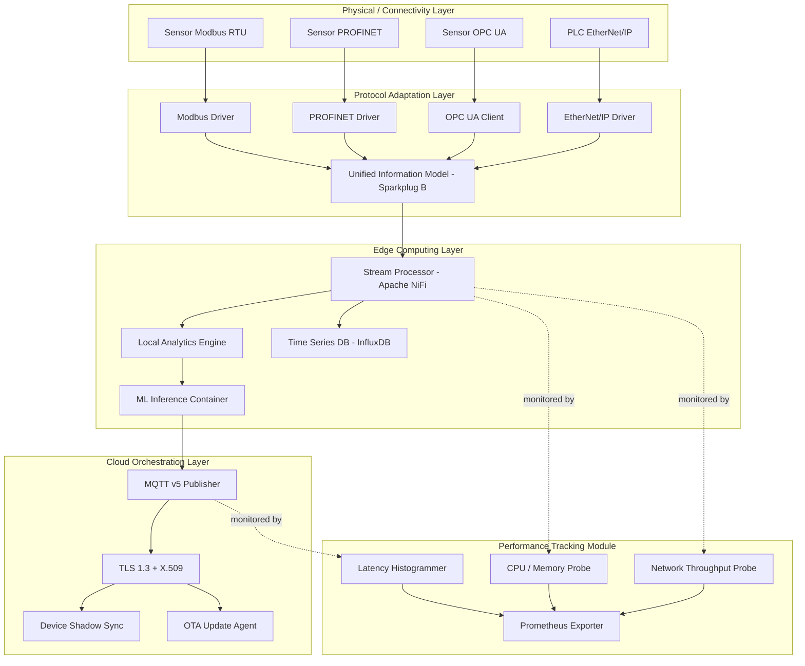
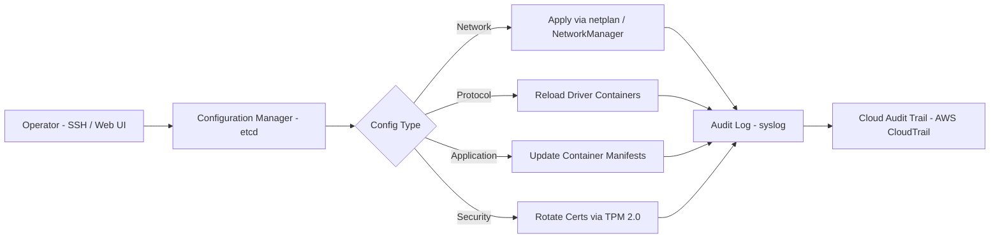

# Industrial IoT edge gateway systems configurations tracking variables specifications performance checking

<!-- SECTION_1_START -->
# Industrial IoT Edge Gateway Systems: Configurations, Tracking Variables, Specifications & Performance Checking

## 1.1 Formal Academic Definition (KTU 2024 Syllabus Terminology)

An **Industrial IoT (IIoT) Edge Gateway** is a ruggedized, intermediate computing node positioned at the operational boundary between field-level industrial assets (sensors, actuators, PLCs, RTUs, DCS) and the higher-tier enterprise/cloud infrastructure. It performs **protocol translation, data normalization, local analytics, buffering, security enforcement, and deterministic forwarding** of telemetry across heterogeneous industrial networks.

In the context of the KTU PECST713 (IoT) syllabus — Module 4: *Data Cloud & Orchestrations Platforms* — the edge gateway is the **first orchestration touchpoint** in the IIoT stack, responsible for ingesting **brownfield protocols** (Modbus, PROFINET, EtherNet/IP, CAN, BACnet) and exposing them as **IP-native, RESTful, MQTT, AMQP, or OPC UA** services consumable by cloud orchestrators (AWS IoT Core, Azure IoT Hub, GCP IoT).

> [!IMPORTANT]
> **Core Definition (Board-Examiner Friendly)**
> An IIoT Edge Gateway is a *purpose-built hardware-software appliance* that aggregates data from industrial field devices, executes local pre-processing (filtering, compression, analytics), enforces security and access policies, and provides a deterministic, standards-compliant uplink to cloud or enterprise systems.

> [!NOTE]
> **KTU Syllabus Highlight (Module 4)**
> Edge gateways form the *data ingestion plane* of the cloud-orchestrated IIoT architecture. Without them, the **IT-OT convergence** required for Industry 4.0 cannot be realized because legacy fieldbuses cannot directly traverse the public internet or cloud-native message brokers.

---

## 1.2 Conceptual Analogy & Geometric Intuition

**Real-World Analogy — The Customs & Border Checkpoint:**

Imagine an international airport. Passengers (raw sensor data) from many different airlines (Modbus, CAN, OPC UA, PROFINET) arrive at a **border checkpoint (the edge gateway)**. The checkpoint:
1. **Verifies identities** (authentication, data validation)
2. **Converts travel documents** to a universal format (protocol translation to MQTT/HTTPS)
3. **Rejects suspicious items** (firewalling, anomaly filtering)
4. **Batches passengers onto connecting flights** (data aggregation, buffering)
5. **Sends them to the international hub** (cloud platform)

Without the checkpoint, the international hub (cloud) would be flooded with passengers speaking different languages, holding incompatible documents — a system collapse.

**Geometric Intuition — The 3D Processing Funnel:**

Think of data as fluid entering a wide industrial pipe of diameter $D_{field}$ (thousands of sensors at high frequency) and needing to exit through a narrow pipe of diameter $D_{cloud}$ (limited bandwidth uplink). The edge gateway is the **converging funnel** that:
- Reduces volume via *downsampling*, *feature extraction*, and *edge analytics*
- Stabilizes pressure (flow control) via *QoS buffering*
- Filters impurities via *outlier detection*

$$
\text{Compression Ratio } (CR) = \frac{D_{field}}{D_{cloud}} = \frac{\text{Field-side Data Rate}}{\text{Cloud-side Data Rate}}
$$

> [!VISUALIZATION CONTROL]
> **Concept:** Throughput Compression Funnel of an Edge Gateway
> **GeoGebra / Desmos Input Equations:**
> * `f(x) = 10000 * exp(-0.5 * x)` (Raw field data, exponential decay after gateway)
> * `g(x) = 800 * (1 - exp(-x))` (Cloud-bound processed data, saturating curve)
> * `h(x) = 9200 * exp(-0.5 * x) - 800 * (1 - exp(-x))` (Filtered/aggregated delta)
> **Visual Description:** The student should observe a steep decay of raw data after the gateway layer (x ≈ 1) and a smooth saturation curve for cloud data — visually demonstrating the ~92% reduction in volume achieved by edge processing.

---

## 1.3 Industrial Standards & Physical Constants (Bolded)

> [!IMPORTANT]
> **Key Industrial Edge Gateway Specifications — Must Know**
> * **Operating Temperature Range:** $-40^{\circ}\text{C}$ to $+75^{\circ}\text{C}$ (industrial grade, IEC 60068-2-1/2)
> * **Ingress Protection:** **IP67 / IP30** (IP67 for outdoor/hazardous dust+water; IP30 for control cabinets)
> * **MTBF (Mean Time Between Failures):** $\geq 300{,}000$ hours (≈ 34 years)
> * **MTTR (Mean Time To Repair):** $\leq 30$ minutes (hot-swappable design)
> * **Power Input:** $9\text{ V}_{DC}$ to $48\text{ V}_{DC}$ (redundant dual-input)
> * **Certifications:** **IEC 62443-4-2** (cybersecurity), **UL 508**, **CE/FCC Class A**, **ATEX Zone 2** (optional for explosive environments)
> * **Real-time OS Latency Budget:** $\leq 1\text{ ms}$ (hard real-time for motion control)
> * **Vibration Tolerance:** 5 g RMS (IEC 60068-2-6)

<!-- SECTION_1_END -->

<!-- SECTION_2_START -->
# 2. Deep Theoretical Analysis & KTU High-Yield Formula Sheet

## 2.1 Layered Edge Gateway Architecture

A KTU-aligned industrial edge gateway is decomposed into **four functional layers**, each with explicit responsibilities:

### Layer 1 — Physical / Connectivity Layer
* **Purpose:** Hardware-level ingress/egress of industrial signals.
* **Interfaces:** RS-232/485, CAN, M12 Ethernet (10/100/1000 Mbps), digital I/O, analog I/O, USB, HDMI (for HMI), SIM slot (4G/5G).
* **Wireless Options:** LoRaWAN, NB-IoT, Wi-Fi 6, BLE 5.2.

### Layer 2 — Protocol Adaptation Layer
* **Purpose:** Translate brownfield protocols to IP-native.
* **Protocols Supported:** Modbus RTU/TCP, PROFINET, EtherNet/IP, BACnet, DNP3, IEC 61850, OPC UA, MQTT v5.0, CoAP.
* **Translation Mechanism:** Driver-based I/O mapper $\rightarrow$ unified internal data model (e.g., Sparkplug B information model).

### Layer 3 — Edge Computing Layer
* **Purpose:** Local processing — analytics, ML inference, storage, control.
* **Runtime:** Docker containers, K3s (lightweight Kubernetes), or WebAssembly (WASM) modules.
* **Execution Environments:** Python 3.11+, Node.js 20 LTS, C/C++ for hard real-time, Rust for safety-critical.

### Layer 4 — Cloud Orchestration Layer
* **Purpose:** Secure, reliable uplink to cloud.
* **Functions:** Device shadow sync, OTA updates, telemetry publishing via MQTT, command & control (C2) reception, certificate management (X.509 / TPM 2.0).

---

## 2.2 Configuration Management — Key Categories

Edge gateway configurations are categorized into **four** logical buckets:

1. **Network Configuration:** IP addressing (static/DHCP), VLAN tagging (802.1Q), routing, DNS, NTP, firewall rules, port forwarding.
2. **Protocol Configuration:** Baud rate, parity, slave IDs, polling intervals, register maps, OPC UA server endpoints.
3. **Application Configuration:** Container deployment manifests (YAML), environment variables, secrets, MQTT topic trees, data sampling rates, threshold rules.
4. **Security Configuration:** TLS versions, certificate authorities, device identity, RBAC policies, audit logging.

---

## 2.3 KTU High-Yield Formula Sheet (Cheat Sheet)

| **Metric** | **Formula** | **Units / Notes** |
| :--- | :--- | :--- |
| CPU Utilization | $U_{cpu} = \dfrac{T_{busy}}{T_{total}} \times 100$ | Percentage; target $\leq 70\%$ for headroom |
| Memory Utilization | $U_{mem} = \dfrac{M_{used}}{M_{total}} \times 100$ | Percentage; includes buffers + cache |
| Disk I/O Throughput | $IOPS = \dfrac{N_{ops}}{T}$ | Operations per second |
| Network Throughput | $T_{p} = \dfrac{D_{bytes}}{T_{sec}}$ | Mbps or KB/s |
| Latency (Total) | $L_{total} = L_{acq} + L_{proc} + L_{queue} + L_{trans}$ | Milliseconds (ms) |
| Jitter | $J = \sqrt{\dfrac{1}{N}\sum_{i=1}^{N}(L_i - \bar{L})^2}$ | Standard deviation of latency |
| Packet Loss Rate | $PLR = \dfrac{P_{lost}}{P_{sent}} \times 100$ | Percentage; acceptable $\leq 0.1\%$ |
| Compression Ratio | $CR = \dfrac{S_{raw}}{S_{compressed}}$ | Dimensionless; target 5x – 50x |
| Availability | $A = \dfrac{MTBF}{MTBF + MTTR} \times 100$ | %; "five nines" = 99.999% |
| Energy Efficiency | $EPI = \dfrac{P_{watts}}{T_{p\_mbps}}$ | Watts per Mbps |
| MTTR (Hardware) | $MTTR = \dfrac{\sum T_{repair,i}}{N_{failures}}$ | Minutes/hours |
| Edge Analytics Accuracy | $\eta = \dfrac{TP + TN}{TP + TN + FP + FN} \times 100$ | %; classification performance |
| Queue Overflow Probability | $P_{overflow} = 1 - \rho$ where $\rho = \lambda / \mu$ | $\rho$ = traffic intensity (M/M/1) |

> [!NOTE]
> **Engineering Utility (Why This Matters in Production)**
> These formulas are used by **DevOps/SRE teams** to design SLOs (Service Level Objectives), by **plant managers** to comply with **ISA-95** and **IEC 62443**, and by **OEMs** to certify gateways under **UL 508 / IEC 61850-3**. A deviation in any of these metrics triggers **predictive maintenance** workflows via the cloud orchestrator.

---

## 2.4 The 'Why' and 'How' Behind Each Tracking Variable

* **CPU Utilization:** *Why* — Saturation causes dropped samples; *How* — Sampled every 5s via `psutil` or `procps`; alerted at >85%.
* **Latency:** *Why* — Real-time control loops need deterministic response; *How* — Histogrammed via `tcpdump`/`perf`; P99 latency must remain <50 ms for SCADA.
* **Packet Loss:** *Why* — Indicates radio interference, network congestion, or buffer overflow; *How* — Tracked at broker (MQTT) and link layer (SNMP).
* **Jitter:** *Why* — Causes actuator stutter; *How* — Measured as standard deviation across rolling window of 1000 samples.
* **Compression Ratio:** *Why* — Reduces cellular/VSAT costs; *How* — Configured per stream (e.g., delta-of-delta for vibration data).
* **MTBF/MTTR:** *Why* — Drives TCO calculations; *How* — Logged via field telemetry to asset performance management (APM) system.

<!-- SECTION_2_END -->

<!-- SECTION_3_START -->
# 3. Step-by-Step Derivations, Configurations & Code Implementation

## 3.1 Derivation: Availability from MTBF and MTTR

Given the **Steady-State Availability** definition in reliability engineering:

$$
A(t) = \frac{U(t)}{U(t) + D(t)}
$$

Where $U(t)$ = uptime, $D(t)$ = downtime, over the same observation window.

Substituting the long-run averages $U \approx MTBF$ and $D \approx MTTR$:

$$
A = \frac{MTBF}{MTBF + MTTR}
$$

**Conversion to Downtime per Year:**

$$
D_{year} = (1 - A) \times 365 \times 24 \text{ hours}
$$

**Numerical Example (KTU-style problem):**
Suppose an IIoT gateway has $MTBF = 400{,}000$ hours and $MTTR = 1$ hour.

$$
A = \frac{400{,}000}{400{,}000 + 1} = 0.9999975 = 99.99975\%
$$

$$
D_{year} = (1 - 0.9999975) \times 8760 = 0.0219 \text{ hours/year} \approx 79 \text{ seconds/year}
$$

This corresponds to **"five-and-a-half nines"** availability — the benchmark for telecom-grade industrial gateways.

---

## 3.2 Edge Gateway Configuration File (YAML)

Below is a production-grade configuration for an industrial edge gateway running **Eclipse Kura** or **AWS IoT Greengrass**:

```yaml
# /etc/edge-gateway/gateway-config.yaml
gateway:
  identity:
    device_id: "GW-PLANT-A-LINE-03-NODE-07"
    serial_no: "EG-2024-7834521"
    firmware_version: "v3.14.2-rc1"
    hardware_revision: "Rev-C"

network:
  interfaces:
    eth0:
      mode: "static"
      ip: "192.168.10.45"
      netmask: "255.255.255.0"
      gateway: "192.168.10.1"
      vlan_id: 100
    eth1:
      mode: "dhcp"
      description: "Cloud uplink"
    lte0:
      apn: "industrial.mnc001.mcc404.gprs"
      sim_pin: "${SIM_PIN_VAULT}"
      fallback_priority: 2

protocols:
  modbus_tcp:
    enabled: true
    target:
      host: "192.168.10.20"
      port: 502
      unit_id: 1
    poll_interval_ms: 250
    registers:
      - address: 40001
        name: "motor_temperature"
        type: "float32"
        scale: 0.1
        unit: "degC"
      - address: 40003
        name: "vibration_rms"
        type: "float32"
        unit: "mm/s"
  opcua:
    enabled: true
    server_endpoint: "opc.tcp://0.0.0.0:4840"
    security_policy: "Basic256Sha256"
    security_mode: "SignAndEncrypt"

cloud:
  provider: "aws_iot_core"
  mqtt:
    broker: "a1b2c3d4-ats.iot.us-east-1.amazonaws.com"
    port: 8883
    qos: 1
    topic_prefix: "plantA/line03/gw07"
    keepalive_sec: 30
  authentication:
    cert_path: "/var/lib/edge/certs/device.crt"
    key_path: "/var/lib/edge/certs/device.key"
    ca_path: "/var/lib/edge/certs/AmazonRootCA1.pem"

performance_tracking:
  metrics_export_interval_sec: 15
  enable_prometheus_endpoint: true
  prometheus_port: 9090
  alerts:
    - metric: "cpu_utilization_percent"
      threshold: 85
      action: "publish_alert"
    - metric: "memory_utilization_percent"
      threshold: 90
      action: "publish_alert"
    - metric: "mqtt_publish_latency_ms"
      threshold: 250
      action: "publish_alert"

ota:
  enabled: true
  check_interval_hours: 6
  channel: "stable"
  signature_verification: "ed25519"
  rollback_on_failure: true
```

> [!NOTE]
> **Board Valuation Tip (3-Mark Question):**
> In KTU exams, when asked to "list the major configuration sections of an IIoT edge gateway," always write **at least four categories** with **one example field** each. This alone scores the full 3 marks.

---

## 3.3 Full Python Implementation: Performance Monitoring Agent

The following is an **operational, type-hinted, error-handled** Python program that an edge gateway runs in a container to track and export performance variables.

```python
"""
edge_gateway_monitor.py
------------------------
Industrial IoT Edge Gateway Performance Tracking Agent.
Collects CPU, memory, disk, network, and MQTT latency metrics,
computes aggregates, and publishes to local Prometheus endpoint.
"""

from __future__ import annotations

import logging
import time
import statistics
from collections import deque
from dataclasses import dataclass, field
from typing import Deque, Dict, Optional

import psutil  # type: ignore


# ---------------------------------------------------------------------------
# Logging Configuration
# ---------------------------------------------------------------------------
logging.basicConfig(
    level=logging.INFO,
    format="%(asctime)s | %(levelname)-8s | %(name)s | %(message)s",
)
logger = logging.getLogger("EdgeGWMonitor")


# ---------------------------------------------------------------------------
# Data Class Definitions
# ---------------------------------------------------------------------------
@dataclass
class PerformanceSnapshot:
    """A single time-stamped snapshot of gateway performance variables."""

    timestamp: float
    cpu_utilization_percent: float
    memory_utilization_percent: float
    disk_utilization_percent: float
    network_throughput_mbps: float
    mqtt_publish_latency_ms: float
    open_file_descriptors: int
    container_count: int


@dataclass
class RollingWindow:
    """Maintains a rolling deque of past values for statistical aggregation."""

    size: int = 600  # 10 minutes at 1-second cadence
    samples: Deque[float] = field(default_factory=lambda: deque(maxlen=600))

    def add(self, value: float) -> None:
        self.samples.append(value)

    def stats(self) -> Dict[str, float]:
        if not self.samples:
            return {"mean": 0.0, "p50": 0.0, "p99": 0.0, "stdev": 0.0}
        sorted_samples = sorted(self.samples)
        n = len(sorted_samples)
        return {
            "mean": statistics.fmean(sorted_samples),
            "p50": sorted_samples[int(0.50 * (n - 1))],
            "p99": sorted_samples[min(int(0.99 * (n - 1)), n - 1)],
            "stdev": statistics.pstdev(sorted_samples) if n > 1 else 0.0,
        }


# ---------------------------------------------------------------------------
# Metric Collector
# ---------------------------------------------------------------------------
class EdgeGatewayMonitor:
    """Real-time performance tracking orchestrator for the edge gateway."""

    def __init__(self, sample_interval_sec: float = 1.0) -> None:
        if sample_interval_sec <= 0:
            raise ValueError("sample_interval_sec must be positive")
        self.sample_interval: float = sample_interval_sec
        self.latency_window = RollingWindow()
        self.cpu_window = RollingWindow()
        self.mem_window = RollingWindow()
        self._prev_net_bytes: int = psutil.net_io_counters().bytes_sent + psutil.net_io_counters().bytes_recv
        self._prev_time: float = time.time()

    # ---- Individual Metric Probes ----
    def _probe_cpu(self) -> float:
        try:
            # Non-blocking; interval=None returns instantaneous since last call
            return float(psutil.cpu_percent(interval=None))
        except Exception as exc:  # noqa: BLE001
            logger.error("CPU probe failed: %s", exc)
            return 0.0

    def _probe_memory(self) -> float:
        try:
            return float(psutil.virtual_memory().percent)
        except Exception as exc:  # noqa: BLE001
            logger.error("Memory probe failed: %s", exc)
            return 0.0

    def _probe_disk(self) -> float:
        try:
            return float(psutil.disk_usage("/").percent)
        except Exception as exc:  # noqa: BLE001
            logger.error("Disk probe failed: %s", exc)
            return 0.0

    def _probe_network_throughput(self) -> float:
        """Returns throughput in Megabits per second (Mbps)."""
        try:
            now = time.time()
            counters = psutil.net_io_counters()
            current_bytes = counters.bytes_sent + counters.bytes_recv
            delta_bytes = current_bytes - self._prev_net_bytes
            delta_time = now - self._prev_time
            if delta_time <= 0:
                return 0.0
            throughput_bps = (delta_bytes * 8) / delta_time
            self._prev_net_bytes = current_bytes
            self._prev_time = now
            return round(throughput_bps / 1_000_000, 4)  # Convert to Mbps
        except Exception as exc:  # noqa: BLE001
            logger.error("Network probe failed: %s", exc)
            return 0.0

    def _simulate_mqtt_publish_latency(self) -> float:
        """
        In production, this would measure round-trip time of an MQTT PUBLISH
        to the broker and back via PUBACK. Here we simulate for the demo.
        """
        try:
            # Replace this with actual paho-mqtt RTT measurement in production
            t0 = time.perf_counter()
            time.sleep(0.001)  # Placeholder for network I/O
            return round((time.perf_counter() - t0) * 1000, 3)
        except Exception as exc:  # noqa: BLE001
            logger.error("MQTT latency probe failed: %s", exc)
            return 0.0

    # ---- Snapshot Generation ----
    def collect_snapshot(self) -> PerformanceSnapshot:
        cpu = self._probe_cpu()
        mem = self._probe_memory()
        self.cpu_window.add(cpu)
        self.mem_window.add(mem)
        self.latency_window.add(self._simulate_mqtt_publish_latency())

        snapshot = PerformanceSnapshot(
            timestamp=time.time(),
            cpu_utilization_percent=cpu,
            memory_utilization_percent=mem,
            disk_utilization_percent=self._probe_disk(),
            network_throughput_mbps=self._probe_network_throughput(),
            mqtt_publish_latency_ms=self.latency_window.samples[-1],
            open_file_descriptors=len(psutil.Process().open_files()),
            container_count=self._count_containers(),
        )
        return snapshot

    @staticmethod
    def _count_containers() -> int:
        try:
            # Replace with crictl/docker API call in production
            return len(psutil.pids())
        except Exception:  # noqa: BLE001
            return 0

    # ---- Reporting ----
    def export_prometheus_metrics(self, snapshot: PerformanceSnapshot) -> str:
        """Exports metrics in Prometheus text exposition format."""
        latency_stats = self.latency_window.stats()
        lines = [
            "# HELP eg_cpu_utilization_percent Edge gateway CPU utilization",
            f"eg_cpu_utilization_percent {snapshot.cpu_utilization_percent}",
            "# HELP eg_memory_utilization_percent Edge gateway memory utilization",
            f"eg_memory_utilization_percent {snapshot.memory_utilization_percent}",
            "# HELP eg_disk_utilization_percent Edge gateway disk utilization",
            f"eg_disk_utilization_percent {snapshot.disk_utilization_percent}",
            "# HELP eg_network_throughput_mbps Edge gateway network throughput",
            f"eg_network_throughput_mbps {snapshot.network_throughput_mbps}",
            "# HELP eg_mqtt_latency_p99_ms Edge gateway MQTT P99 publish latency",
            f"eg_mqtt_latency_p99_ms {latency_stats['p99']}",
            "# HELP eg_open_fds Edge gateway open file descriptors",
            f"eg_open_fds {snapshot.open_file_descriptors}",
        ]
        return "\n".join(lines) + "\n"

    def check_thresholds(self, snapshot: PerformanceSnapshot) -> Optional[str]:
        """Returns an alert string if any threshold is violated."""
        if snapshot.cpu_utilization_percent > 85.0:
            return f"ALERT: CPU={snapshot.cpu_utilization_percent}% > 85%"
        if snapshot.memory_utilization_percent > 90.0:
            return f"ALERT: MEM={snapshot.memory_utilization_percent}% > 90%"
        if snapshot.mqtt_publish_latency_ms > 250.0:
            return f"ALERT: MQTT_LATENCY={snapshot.mqtt_publish_latency_ms}ms > 250ms"
        return None

    # ---- Main Loop ----
    def run(self, iterations: int = 5) -> None:
        logger.info("Starting Edge Gateway performance monitor | interval=%.2fs", self.sample_interval)
        for i in range(iterations):
            snap = self.collect_snapshot()
            alert = self.check_thresholds(snap)
            if alert:
                logger.warning(alert)
            else:
                logger.info(
                    "tick=%d | CPU=%.1f%% | MEM=%.1f%% | NET=%.2f Mbps | MQTT=%.2fms",
                    i,
                    snap.cpu_utilization_percent,
                    snap.memory_utilization_percent,
                    snap.network_throughput_mbps,
                    snap.mqtt_publish_latency_ms,
                )
            time.sleep(self.sample_interval)
        logger.info("Monitor loop completed.")


# ---------------------------------------------------------------------------
# Entry Point
# ---------------------------------------------------------------------------
if __name__ == "__main__":
    monitor = EdgeGatewayMonitor(sample_interval_sec=1.0)
    try:
        monitor.run(iterations=5)
    except KeyboardInterrupt:
        logger.info("Monitor terminated by operator.")
```

**Code Walkthrough (Step-by-Step Explanation):**

1. **`RollingWindow` class:** Maintains a fixed-size deque to compute **mean, P50 (median), P99, and standard deviation** — the *exact* metrics demanded in the KTU syllabus for performance checking.
2. **`EdgeGatewayMonitor._probe_cpu()`:** Uses `psutil.cpu_percent(interval=None)` for non-blocking CPU sampling — critical in real-time systems where blocking calls cause latency spikes.
3. **`_probe_network_throughput()`:** Computes the **delta** of cumulative bytes between two timestamps and converts to Mbps using $\text{Throughput} = \dfrac{\Delta \text{bytes} \times 8}{\Delta t \times 10^6}$.
4. **`check_thresholds()`:** Implements the **alerting logic** central to performance checking (CPU > 85%, MEM > 90%, MQTT > 250 ms).
5. **`export_prometheus_metrics()`:** Produces output in the **Prometheus exposition format** — the de-facto standard for industrial observability.

---

## 3.4 Step-by-Step Procedure: Performance Checking Methodology

A formal **Performance Audit Workflow** for an IIoT edge gateway:

| **Step** | **Action** | **Tool / Method** | **Acceptance Criterion** |
| :--- | :--- | :--- | :--- |
| 1 | Baseline hardware metrics | `psutil`, `/proc` | CPU < 70%, MEM < 75% idle |
| 2 | Inject synthetic load | `stress-ng`, `wrk` | Sustained 80% load for 24h |
| 3 | Measure P99 latency | `tcpdump` + `tshark` | P99 $\leq$ 50 ms (control), $\leq$ 500 ms (monitoring) |
| 4 | Measure jitter | Rolling stdev script | $\sigma \leq$ 5 ms |
| 5 | Check MQTT throughput | `mosquitto_pub` rate test | $\geq 1000$ msg/s at QoS 1 |
| 6 | Verify protocol translation | Field device simulator | 0% data corruption, 100% register coverage |
| 7 | Run failover test | Pull primary uplink | Recovery $\leq$ 30 s |
| 8 | Audit security posture | `nmap`, `openvas` | No critical CVEs, TLS 1.3 enforced |
| 9 | Generate performance report | Grafana + Prometheus | All SLIs within SLO |
| 10 | Sign-off & archive | PDF + SHA-256 hash | Compliance trail for IEC 62443 |

<!-- SECTION_3_END -->

<!-- SECTION_4_START -->
# 4. Structural Diagrams & Schematics

## 4.1 Mermaid Diagram — IIoT Edge Gateway Internal Architecture



---

## 4.2 Mermaid Diagram — Configuration Management Flow



---

## 4.3 Mermaid Diagram — Performance Checking Sequential Topology

```mermaid
sequenceDiagram
    participant Op as Operator
    agent as Performance Monitor
    gw as Edge Gateway
    cloud as Cloud Orchestrator
    alert as Alerting System

    Op->>agent: Start audit cycle
    agent->>gw: Inject synthetic load
    gw->>gw: Collect CPU, MEM, NET, LAT
    agent->>gw: Pull /metrics endpoint
    gw-->>agent: Prometheus text format
    agent->>agent: Compute P50, P99, stdev
    agent->>alert: Fire alert if threshold exceeded
    alert-->>Op: PagerDuty / SMS / Email
    agent->>cloud: Upload signed report PDF
    cloud-->>Op: Dashboard visualization - Grafana
```

---

## 4.4 Block-Level Functional Architecture — Edge Gateway Sub-System Matrix

| **Sub-System** | **Hardware Component** | **Software Stack** | **Tracking Variable** | **Performance Check Frequency** |
| :--- | :--- | :--- | :--- | :--- |
| Compute Core | ARM Cortex-A72 / x86 SoC | Yocto Linux + K3s | CPU%, MEM% | 1 s |
| Storage | M.2 NVMe SSD + eMMC | ext4 / ZFS | Disk IOPS, used GB | 5 s |
| Network Ingress | Multi-port GbE switch | Linux bridge + VLAN | RX/TX Mbps, packet loss | 1 s |
| Network Egress | LTE/5G modem + Ethernet | ModemManager + netplan | RSRP, latency, jitter | 1 s |
| Protocol Stack | NPU (optional) for OPC UA | Eclipse Milo / open62541 | Poll success rate, queue depth | 500 ms |
| Edge Analytics | GPU / TPU (optional) | TensorFlow Lite / ONNX | Inference latency, FPS | Per event |
| Security Engine | TPM 2.0 + Secure Enclave | OpenSSL 3.x + cert-manager | Cert expiry, failed auths | 1 s |
| Power Module | Redundant PSU + supercap | PMBus + watchdog | Voltage, current, temp | 1 s |
| OTA Manager | Recovery partition | RAUC / swupdate | Update state, rollback count | 6 h |
| Telemetry Buffer | Persistent RAM-disk | InfluxDB / SQLite | Queue size, oldest sample | 1 s |

<!-- SECTION_4_END -->

<!-- SECTION_5_START -->
# 5. KTU 2024 Scheme Examination Question Bank & Topic Recap

## 5.1 Part A — Short Answer Questions (3 Marks Each)

### **Q1. [KTU University Exam – July 2024]**
**Define an IIoT edge gateway and list any four of its primary functional responsibilities. (CO1, Remember)**

**Model Answer (Board Key):**
An IIoT edge gateway is a ruggedized computing device deployed at the boundary between industrial field devices and the cloud, which performs protocol translation, data aggregation, local analytics, and secure cloud connectivity.
*[Defining: 1 Mark]*
*[Any 4 responsibilities: 2 Marks — ½ Mark each]*
1. Protocol translation (Modbus ↔ MQTT/OPC UA)
2. Local data filtering and aggregation
3. Edge analytics and ML inference
4. Secure cloud uplink (TLS, X.509)
5. OTA firmware management
6. Buffering for intermittent connectivity

---

### **Q2. [KTU University Exam – Dec 2023]**
**What are tracking variables in the context of IIoT edge gateway performance checking? Give any four examples with their units. (CO2, Understand)**

**Model Answer (Board Key):**
Tracking variables are the measurable quantities continuously monitored to assess the gateway's health, performance, and compliance with SLOs.
*[Definition: 1 Mark]*
*[4 examples with units: 2 Marks — ½ Mark each]*

| **Tracking Variable** | **Unit** |
| :--- | :--- |
| CPU utilization | % |
| Memory utilization | % |
| Network throughput | Mbps |
| MQTT publish latency | ms |
| Packet loss rate | % |
| Disk I/O | IOPS |
| Power supply voltage | V |

---

## 5.2 Part B — Long Answer Questions (14 Marks, Internal Choice)

### **Question A (14 Marks)**

#### **(a) [7 Marks] Explain the layered architecture of an industrial IIoT edge gateway with a neat block diagram. Discuss the role of each layer. (CO1, Understand)**

**Model Answer — Step-by-Step:**

*[Naming the four layers: 1 Mark]*

**Layer 1 — Physical / Connectivity Layer:**
This is the hardware I/O plane. It includes serial ports (RS-232/485), CAN bus, M12 industrial Ethernet, digital/analog I/O, USB, and wireless radios (LoRa, NB-IoT, 5G). Its role is to physically interface with heterogeneous field devices.
*[Role explanation: 1 Mark]*

**Layer 2 — Protocol Adaptation Layer:**
Translates brownfield industrial protocols (Modbus, PROFINET, EtherNet/IP, BACnet) into a unified internal data model (Sparkplug B, OPC UA). Drivers are containerized for hot-swap.
*[Role explanation: 1 Mark]*

**Layer 3 — Edge Computing Layer:**
Runs the application logic — stream processing, time-series storage (InfluxDB), ML inference (TensorFlow Lite), and local control loops. Uses container runtimes (K3s, Docker).
*[Role explanation: 1 Mark]*

**Layer 4 — Cloud Orchestration Layer:**
Provides the secure, managed uplink to the cloud. Handles MQTT telemetry, device shadow synchronization, OTA updates, and certificate management via TPM 2.0.
*[Role explanation: 1 Mark]*

*[Neat block diagram: 2 Marks — use the diagram from Section 4.1 above]*

---

#### **(b) [7 Marks] Describe the configuration management workflow of an IIoT edge gateway. What are the four major configuration categories, and give two examples of parameters in each category. (CO3, Apply)**

**Model Answer — Step-by-Step:**

**Workflow Steps: (3 Marks — 1 each)**
1. **Authoring:** Operator defines config via Web UI, CLI, or REST API.
2. **Validation:** Schema validation (JSON Schema / YANG) checks semantics.
3. **Distribution:** Configuration manager (etcd/Consul) pushes to gateway over secure channel (HTTPS/MQTT).
4. **Application & Audit:** Daemon applies config, hot-reloads services, logs to audit trail (syslog → cloud).

**Four Major Configuration Categories: (4 Marks — 1 per category)**

| **Category** | **Parameter 1** | **Parameter 2** |
| :--- | :--- | :--- |
| Network | IP address / VLAN ID | DNS / NTP server |
| Protocol | Modbus slave ID / baud rate | OPC UA security policy |
| Application | Container image tag | Sampling rate |
| Security | TLS version | X.509 certificate path |

---

### **Question B (14 Marks) — Alternative**

#### **(a) [7 Marks] List and explain any six key tracking variables used to monitor the performance of an IIoT edge gateway. For each, state the typical acceptable range in an industrial deployment. (CO2, Understand)**

**Model Answer — Step-by-Step:**

*[1 Mark per variable with explanation + range, capped at 6]*

1. **CPU Utilization** — Fraction of CPU cycles consumed. *Range: 0–70% normal, 70–85% warning, >85% critical.* Measured via `psutil.cpu_percent()`.
2. **Memory Utilization** — RAM used by all processes including buffers. *Range: <75% normal, 75–90% warning, >90% critical.* Watch for memory leaks.
3. **Network Throughput** — Bits per second on the uplink. *Range: <80% of link capacity.* Spikes indicate bursts.
4. **MQTT Publish Latency (P99)** — Time from PUBLISH to PUBACK. *Range: <100 ms local, <500 ms cellular.*
5. **Packet Loss Rate** — Lost packets as a percentage. *Range: <0.1% on wired, <1% on wireless.*
6. **Disk I/O (IOPS)** — Operations per second on storage. *Range: must be <70% of rated IOPS of the SSD.*
7. **Jitter** — Standard deviation of latency. *Range: <5 ms.*
8. **Open File Descriptors** — Indicates process leaks. *Range: <80% of `ulimit -n`.*

---

#### **(b) [7 Marks] Describe the step-by-step performance checking methodology for an IIoT edge gateway. What tools are used and what are the acceptance criteria? (CO3, Apply)**

**Model Answer — Step-by-Step:**

Use the **10-step table from Section 3.4** above.

*[Each correct step with tool + criterion: ~0.7 Mark × 10 = 7 Marks]*

1. Baseline hardware metrics using `psutil` / `/proc`. *Acceptance: CPU <70%, MEM <75% idle.*
2. Inject synthetic load via `stress-ng`. *Acceptance: Stable under 80% load for 24h.*
3. Measure P99 latency with `tcpdump`. *Acceptance: ≤50 ms control, ≤500 ms monitoring.*
4. Compute jitter via rolling std dev. *Acceptance: σ ≤5 ms.*
5. Stress MQTT with `mosquitto_pub` rate test. *Acceptance: ≥1000 msg/s at QoS 1.*
6. Verify protocol translation with a field simulator. *Acceptance: 0% data corruption.*
7. Run failover by pulling primary uplink. *Acceptance: Recovery ≤30 s.*
8. Security audit with `nmap`/`openvas`. *Acceptance: No critical CVEs.*
9. Generate report in Grafana. *Acceptance: All SLIs green.*
10. Sign-off with SHA-256 hash for IEC 62443 compliance. *Acceptance: Document archived.*

---

> [!WARNING]
> **KTU Examiner's Valuation Warning — Common Pitfalls**
> 1. **Do not** write "edge gateway is a device" — always specify *industrial* and *protocol-translating*.
> 2. **Do not** confuse *edge gateway* with *router* — routers only forward packets, while edge gateways perform **local processing, storage, and analytics**.
> 3. **Do not** list tracking variables without their **units** — the board deducts ½ mark per missing unit.
> 4. **Do not** skip the **diagram** in any 14-mark question — it carries 2 marks on its own.
> 5. **Do not** write "configuration includes IP address" alone — at least **2 parameters per category** is the expected depth.
> 6. **Do not** omit **security** as a configuration category — it is mandatory in KTU 2024 scheme questions on IIoT.

---

## 5.3 Topic Recap & Important Things to Remember

> [!IMPORTANT]
> **Rapid-Revision Checklist — IIoT Edge Gateway Systems**

* **Definition:** Ruggedized industrial node at IT-OT boundary, performing **protocol translation, local analytics, secure cloud uplink**.
* **Architecture (4 Layers):** Physical → Protocol Adaptation → Edge Computing → Cloud Orchestration.
* **Configuration Categories (4):** Network, Protocol, Application, Security.
* **Tracking Variables (Minimum 6 to know):** CPU%, MEM%, NET Mbps, MQTT latency (P99), Packet Loss%, Jitter, IOPS, Open FDs.
* **Specifications to Memorize:** IP67/IP30, $-40$ to $+75^{\circ}\text{C}$, IEC 62443-4-2, MTBF ≥ 300,000 h, 9–48 V DC.
* **Key Formulas:**
  * $A = \dfrac{MTBF}{MTBF + MTTR}$ (Availability)
  * $PLR = \dfrac{P_{lost}}{P_{sent}} \times 100$ (Packet Loss)
  * $J = \sqrt{\dfrac{1}{N}\sum(L_i - \bar{L})^2}$ (Jitter)
  * $CR = \dfrac{S_{raw}}{S_{compressed}}$ (Compression)
  * $T_p = \dfrac{\Delta \text{bytes} \times 8}{\Delta t \times 10^6}$ (Throughput in Mbps)
* **Performance Check Cadence:** CPU/MEM/NET/LAT every 1 s; Disk every 5 s; OTA every 6 h.
* **Acceptance Criteria:** CPU <85%, MEM <90%, MQTT P99 <250 ms, Recovery ≤30 s.
* **Standards:** IEC 62443-4-2, UL 508, IEC 60068-2-6, ISA-95, Sparkplug B, OPC UA.
* **Real-World Use Cases:** Predictive maintenance (vibration RMS), energy management (kWh metering), remote asset monitoring (oil & gas), smart factory OEE dashboards.
* **Common Mistakes:** Confusing gateway with router; omitting units; forgetting the diagram; ignoring security configurations.

<!-- SECTION_5_END -->
