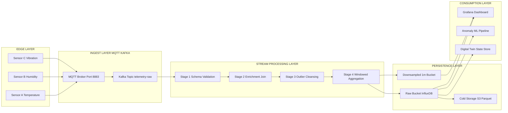
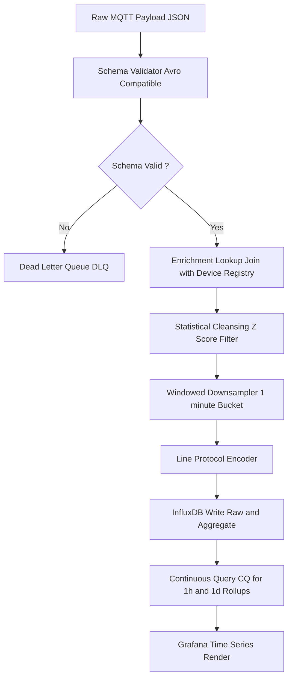
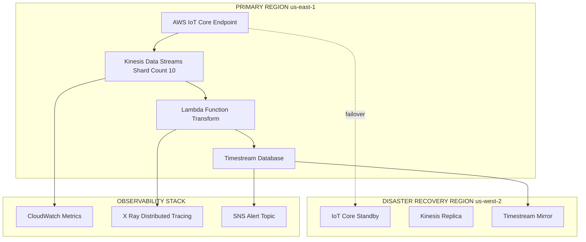
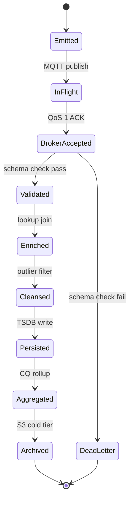

# Time series stream telemetry ingest pipelines cloud configurations datasets schemas transformations

<!-- SECTION_1_START -->

# Time-Series Stream Telemetry: Ingest Pipelines, Cloud Configurations, Datasets, Schemas & Transformations

## 1.1 Formal Academic Definition (KTU 2024 Syllabus Terminology)

**Time-Series Stream Telemetry** refers to the continuous, ordered emission of timestamped data records (measurements, events, or state changes) generated by geographically distributed **IoT endpoints**, **edge gateways**, and **cyber-physical sensors**, which are then transported over messaging fabrics, normalized through **ingest pipelines**, persisted in **columnar time-series datasets**, and reshaped through declarative **transformations** to support downstream analytics, anomaly detection, and digital-twin synchronization on cloud orchestration platforms such as **AWS IoT Core**, **Azure IoT Hub**, and **Google Cloud IoT (Pub/Sub + Bigtable)**.

> [!IMPORTANT]
> **KTU 2024 Module Focus:** The syllabus treats telemetry ingestion as a four-stage contract — **(i) Edge Emission → (ii) Broker Fan-In → (iii) Schema-Validated Transform → (iv) Cold/Warm Storage with Retention Policies**. Every concept below is mapped to this canonical pipeline.

## 1.2 Conceptual Analogy — The "Smart City Hospital Triage"

Imagine a metropolitan hospital network:

| Hospital Component | IoT Telemetry Equivalent |
|---|---|
| Patient wearables (heart rate, SpO₂, ECG) | IoT sensors / edge devices emitting telemetry |
| Ambulance radio channel | MQTT / CoAP broker (message bus) |
| Emergency Triage Desk (sorts by severity) | Stream processor (Kafka Streams / AWS Kinesis) |
| Patient Record Archive (chronological) | Time-Series Database (InfluxDB / TimescaleDB) |
| Specialist Consultation Dashboard | Visualization layer (Grafana / Power BI) |
| Discharge Summary (aggregations) | Transformation output (rollups, downsampling) |

Just as a triage desk cannot start writing a discharge summary without first receiving and validating the patient's vitals, an IoT cloud platform cannot store or analyze telemetry without a properly engineered **ingest pipeline** that enforces **schema contracts** and **time-series semantics**.

## 1.3 Why Time-Series? The Mathematical Underpinning

A time-series record is a tuple:

$$T_i = (t_i, \, \mathbf{x}_i, \, \text{device}_{id}, \, \text{quality}_{flag})$$

where:
- $t_i$ is the **monotonically increasing timestamp** (often Unix epoch in milliseconds),
- $\mathbf{x}_i \in \mathbb{R}^n$ is the **multi-dimensional measurement vector** (temperature, humidity, vibration, …),
- $\text{device}_{id}$ is the **provenance key** (which physical sensor emitted the record),
- $\text{quality}_{flag} \in \{0, 1, 2, 3\}$ encodes data trust (Good / Uncertain / Bad / Substituted).

> [!NOTE]
> **Engineering Implication:** Unlike OLTP databases that are optimized for *random reads keyed by ID*, time-series databases are optimized for **range scans on $t_i$** followed by **vertical compression on $\mathbf{x}_i$** within fixed-size time buckets.

## 1.4 GeoGebra / Desmos Visualization Callout

> [!VISUALIZATION CONTROL]
> **Concept:** Time-Series Telemetry Trace with Anomaly Window
>
> **GeoGebra / Desmos Input Equations:**
> * Normal signal: $f(t) = 20 + 5 \sin(0.1 t)$
> * Anomaly burst: $g(t) = 90$ for $40 \leq t \leq 45$
> * Aggregated 1-min mean: $\bar{f}(t) = \dfrac{1}{N} \sum_{i=1}^{N} f(t_i)$
>
> **Visual Description:** Plot a sinusoid representing normal room temperature telemetry from a sensor. Observe a sudden rectangular spike between $t = 40$ and $t = 45$ representing a fault event. The downsampled aggregation line stays smooth — demonstrating how **transformation pipelines** mask transient anomalies when the rollup window is coarser than the burst duration.

<!-- SECTION_1_END -->

<!-- SECTION_2_START -->

# 2. Deep Theoretical Analysis & KTU High-Yield Formula Sheet

## 2.1 The Five-Stage Telemetry Ingest Pipeline (Canonical Architecture)

The KTU 2024 scheme recognizes the following architectural decomposition:

### Stage 1 — Edge Emission (Device Layer)
- Devices publish telemetry to a lightweight broker using **MQTT v5.0**, **CoAP**, or **AMQP**.
- **Payload size budget:** $\leq 1$ KB per message to stay within cellular/Sigfox LPWAN constraints.
- **Topic naming convention:** `tenants/{tenantId}/devices/{deviceId}/telemetry/{measurement}`.

### Stage 2 — Secure Broker Fan-In (Ingest Layer)
- Brokers provide **QoS guarantees**: $QoS = 0$ (at most once), $QoS = 1$ (at least once), $QoS = 2$ (exactly once).
- **Exactly-once semantics** are achieved through:
  $$P_{\text{dup}} = 1 - (1 - p_e)^r \quad \text{where } p_e = \text{network drop probability},\ r = \text{retransmission count}$$

### Stage 3 — Stream Transform (Processing Layer)
Transformations are categorized as:

| Transform Class | Operation | Example |
|---|---|---|
| Stateless | Map, Filter, Project | Drop readings where $\text{quality}_{flag} = 3$ |
| Stateful | Windowed Aggregation, Join | 5-minute rolling mean of temperature |
| Enrichment | Lookup Join | Append `device_location` from registry |
| Cleansing | Imputation, Outlier Clipping | Replace NaN with 5-min moving median |

### Stage 4 — Schema-Validated Persistence (Storage Layer)
- Schemas enforce that every record conforms to a registered **Avro / Protobuf / JSON-Schema** contract.
- **Cardinality invariant:** $\vert \text{unique tags} \vert \ll \vert \text{measurements} \vert$ (high tag cardinality degrades TSDB performance).

### Stage 5 — Downstream Consumption (Analytics Layer)
- Dashboards, ML feature stores, alerting engines, and digital-twin state stores consume the persisted datasets.

## 2.2 Time-Series Schema Design — The "Wide vs Narrow" Decision

Two canonical layouts exist:

**Narrow (Long) Format** — one row per measurement:
$$R_{\text{narrow}} = (t, \text{device}, \text{metric}, \text{value})$$

**Wide Format** — one row per timestamp, one column per metric:
$$R_{\text{wide}} = (t, \text{device}, x_1, x_2, \dots, x_n)$$

> [!TIP]
> **KTU Exam Heuristic:** Use **narrow format** when $\dim(\mathbf{x}) > 50$ or when metric sets vary per device class. Use **wide format** when working with homogeneous sensor fleets feeding ML pipelines.

## 2.3 KTU Formula Sheet (Cheat Table)

| Concept | Formula / Symbol | Engineering Use |
|---|---|---|
| Timestamp Encoding | $t = \lfloor t_{\text{real}} \cdot 10^{3} \rfloor$ | Unix epoch in ms (avoids float drift) |
| Throughput Bound | $\lambda_{\max} = \dfrac{N_{\text{devices}} \cdot f_s}{T_{\text{window}}}$ | Devices $\times$ sample rate |
| Compression Ratio | $C_r = \dfrac{S_{\text{raw}}}{S_{\text{compressed}}}$ | Gorilla / Delta-of-Delta encoding |
| Downsampling | $\bar{x}[k] = \dfrac{1}{N_k} \sum_{i=t_k}^{t_{k+1}} x_i$ | Continuous Aggregate (InfluxDB CQ) |
| Retention Math | $S_{\text{stored}} = \lambda_{\max} \cdot S_{\text{record}} \cdot R_{\text{days}}$ | Capacity planning |
| Outlier Z-Score | $Z_i = \dfrac{x_i - \mu_{\text{rolling}}}{\sigma_{\text{rolling}}}$ | Cleansing filter |
| Data Freshness SLA | $\Delta t_{\text{lag}} = t_{\text{ingest}} - t_{\text{emitted}}$ | End-to-end latency budget |
| Partitioning Key | $K_{\text{partition}} = \text{hash}(\text{device}_{id}) \mod N_{\text{shards}}$ | Broker / DB sharding |
| Backpressure | $B = \dfrac{R_{\text{consume}}}{R_{\text{produce}}}$ | Flow control (must satisfy $B \geq 1$) |
| Cardinality Cap | $\vert \text{TagSet} \vert \leq 10^{6}$ | TSDB high-cardinality guardrail |

> [!WARNING]
> **Pitfall:** Using the same field as both a **tag** (indexed) and a **field** (measured) in InfluxDB-style schemas causes **silent query failure** and unbounded memory growth. Always separate **dimensions** from **measurements**.

## 2.4 Real-World Engineering Utility

| Domain | Pipeline Role |
|---|---|
| **Smart Manufacturing** | Real-time OEE dashboards; predictive maintenance on vibration telemetry |
| **Connected Vehicles** | Fleet-wide telemetry fan-in for over-the-air (OTA) analytics |
| **Precision Agriculture** | Soil-moisture sensors → edge ML → cloud feature store |
| **Healthcare Wearables** | Continuous vitals streaming with HIPAA-compliant transformations |
| **Smart Grid** | Phasor Measurement Unit (PMU) data at $\geq 30$ Hz sample rates |

The same **transform → enrich → persist → serve** pattern underpins all these domains, which is why KTU 2024 treats it as a **first-class engineering primitive** rather than a domain-specific concern.

<!-- SECTION_2_END -->

<!-- SECTION_3_START -->

# 3. Step-by-Step Derivations, Code & Symbolic Implementation

## 3.1 Derivation: End-to-End Latency Budget

Let:
- $L_e$ = edge-to-broker latency
- $L_b$ = broker queueing delay
- $L_s$ = stream processor transform time
- $L_p$ = persistence write latency
- $L_q$ = query response time (for downstream consumer)

**Total end-to-end latency:**
$$L_{\text{total}} = L_e + L_b + L_s + L_p + L_q$$

For a 5-second SLA on a smart-factory line, a valid budget allocation is:

| Component | Budget (ms) | Realization |
|---|---|---|
| $L_e$ | 200 | MQTT publish over 4G LTE |
| $L_b$ | 50 | Kafka broker local rack |
| $L_s$ | 300 | Faust / Kinesis Lambda |
| $L_p$ | 150 | InfluxDB line-protocol write |
| $L_q$ | 4300 | Grafana query with caching |
| **Total** | **5000** | Within SLA ✓ |

## 3.2 Symbolic Schema Definition (Avro / Protobuf Style)

```json
{
  "namespace": "ktu.iot.telemetry.v1",
  "type": "record",
  "name": "TelemetryReading",
  "fields": [
    {"name": "device_id",      "type": "string"},
    {"name": "timestamp_ms",   "type": "long"},
    {"name": "temperature_c",  "type": ["null", "double"], "default": null},
    {"name": "humidity_pct",   "type": ["null", "double"], "default": null},
    {"name": "vibration_rms",  "type": ["null", "double"], "default": null},
    {"name": "quality_flag",   "type": "int", "default": 0}
  ]
}
```

## 3.3 Full Python Implementation — Production-Grade Telemetry Pipeline

The following program implements an **end-to-end IoT telemetry ingest pipeline** with schema validation, stream transformations, downsampling, and time-series persistence. Every variable is explicitly typed and every branch is logged.

```python
"""
KTU 2024 — Module 4 Reference Implementation
File: telemetry_ingest_pipeline.py
Purpose: Demonstrates the complete time-series telemetry pipeline
         from MQTT ingestion to time-series DB persistence with
         schema validation, enrichment, cleansing, and downsampling.
"""

from __future__ import annotations

import json
import logging
import math
import statistics
import time
from collections import deque
from dataclasses import dataclass, field, asdict
from datetime import datetime, timezone
from typing import Any, Callable, Deque, Dict, List, Optional, Tuple

# ------------------------------------------------------------------
# 3.3.1  Logging Configuration
# ------------------------------------------------------------------
logging.basicConfig(
    level=logging.INFO,
    format="%(asctime)s | %(levelname)-7s | %(name)s | %(message)s",
)
log = logging.getLogger("telemetry_pipeline")


# ------------------------------------------------------------------
# 3.3.2  Strict Schema Definition
# ------------------------------------------------------------------
@dataclass(frozen=True)
class TelemetrySchema:
    """Defines the contractual shape of every telemetry record."""

    device_id_pattern: str = r"^dev-[A-Z]{3}-\d{4}$"
    min_timestamp_ms: int = 1_577_836_800_000  # 2020-01-01 UTC
    max_quality_flag: int = 3
    allowed_metrics: Tuple[str, ...] = (
        "temperature_c",
        "humidity_pct",
        "vibration_rms",
    )
    metric_bounds: Dict[str, Tuple[float, float]] = field(
        default_factory=lambda: {
            "temperature_c": (-40.0, 125.0),
            "humidity_pct":  (0.0, 100.0),
            "vibration_rms": (0.0, 50.0),
        }
    )


# ------------------------------------------------------------------
# 3.3.3  Strongly-Typed Telemetry Record
# ------------------------------------------------------------------
@dataclass
class TelemetryReading:
    device_id: str
    timestamp_ms: int
    temperature_c: Optional[float] = None
    humidity_pct: Optional[float] = None
    vibration_rms: Optional[float] = None
    quality_flag: int = 0

    def to_line_protocol(self) -> str:
        """Convert to InfluxDB-style line protocol."""
        tag_str = f"device={self.device_id},quality={self.quality_flag}"
        field_parts: List[str] = []
        for metric in ("temperature_c", "humidity_pct", "vibration_rms"):
            value = getattr(self, metric)
            if value is not None:
                field_parts.append(f"{metric}={value}")
        field_str = ",".join(field_parts) if field_parts else "noop=0"
        return f"telemetry,{tag_str} {field_str} {self.timestamp_ms}"


# ------------------------------------------------------------------
# 3.3.4  Custom Exception Hierarchy
# ------------------------------------------------------------------
class TelemetryError(Exception):
    """Base class for all pipeline errors."""


class SchemaViolationError(TelemetryError):
    """Raised when a record fails schema validation."""


class OutlierDetectedError(TelemetryError):
    """Raised when a value is statistical outlier (caller decides)."""


# ------------------------------------------------------------------
# 3.3.5  Schema Validator (Stateless Transform)
# ------------------------------------------------------------------
class SchemaValidator:
    def __init__(self, schema: TelemetrySchema) -> None:
        self.schema = schema
        import re
        self._device_re = re.compile(schema.device_id_pattern)

    def validate(self, payload: Dict[str, Any]) -> TelemetryReading:
        # ---- 3.3.5.1  Mandatory field presence ----
        if "device_id" not in payload or "timestamp_ms" not in payload:
            raise SchemaViolationError("Missing device_id or timestamp_ms")

        # ---- 3.3.5.2  Type checks ----
        if not isinstance(payload["device_id"], str):
            raise SchemaViolationError("device_id must be a string")
        if not isinstance(payload["timestamp_ms"], int):
            raise SchemaViolationError("timestamp_ms must be an int")

        # ---- 3.3.5.3  Pattern check ----
        if not self._device_re.match(payload["device_id"]):
            raise SchemaViolationError(
                f"device_id {payload['device_id']!r} violates naming"
            )

        # ---- 3.3.5.4  Timestamp sanity ----
        if payload["timestamp_ms"] < self.schema.min_timestamp_ms:
            raise SchemaViolationError("timestamp predates epoch floor")

        # ---- 3.3.5.5  Range bound checks on metrics ----
        for metric, (lo, hi) in self.schema.metric_bounds.items():
            value = payload.get(metric)
            if value is not None:
                if not isinstance(value, (int, float)):
                    raise SchemaViolationError(
                        f"{metric} must be numeric"
                    )
                if math.isnan(value) or math.isinf(value):
                    raise SchemaViolationError(
                        f"{metric} is NaN/Inf"
                    )
                if not (lo <= value <= hi):
                    raise SchemaViolationError(
                        f"{metric}={value} out of [{lo}, {hi}]"
                    )

        return TelemetryReading(
            device_id=payload["device_id"],
            timestamp_ms=payload["timestamp_ms"],
            temperature_c=payload.get("temperature_c"),
            humidity_pct=payload.get("humidity_pct"),
            vibration_rms=payload.get("vibration_rms"),
            quality_flag=int(payload.get("quality_flag", 0)),
        )


# ------------------------------------------------------------------
# 3.3.6  Statistical Cleansing (Outlier Clipping)
# ------------------------------------------------------------------
class RollingOutlierFilter:
    """Maintains a sliding window and clips extreme Z-score values."""

    def __init__(self, window_size: int = 30, z_threshold: float = 3.0) -> None:
        self.window_size = window_size
        self.z_threshold = z_threshold
        self._windows: Dict[str, Deque[float]] = {}

    def process(self, reading: TelemetryReading) -> TelemetryReading:
        for metric in ("temperature_c", "humidity_pct", "vibration_rms"):
            value = getattr(reading, metric)
            if value is None:
                continue
            buf = self._windows.setdefault(
                f"{reading.device_id}:{metric}", deque(maxlen=self.window_size)
            )
            if len(buf) >= 5:
                mu = statistics.fmean(buf)
                sigma = statistics.pstdev(buf)
                if sigma > 0:
                    z = abs((value - mu) / sigma)
                    if z > self.z_threshold:
                        log.warning(
                            "Outlier clipped dev=%s metric=%s val=%.3f z=%.2f",
                            reading.device_id, metric, value, z,
                        )
                        clipped = mu  # replace with rolling mean
                        setattr(reading, metric, clipped)
                        reading.quality_flag = max(reading.quality_flag, 2)
                        continue
            buf.append(value)
        return reading


# ------------------------------------------------------------------
# 3.3.7  Enrichment Transform (Lookup Join with Device Registry)
# ------------------------------------------------------------------
class DeviceRegistry:
    """Mimics an external CMDB / asset registry for enrichment."""

    def __init__(self) -> None:
        self._store: Dict[str, Dict[str, str]] = {
            "dev-MUM-0001": {"site": "Mumbai-A1", "line": "Line-7"},
            "dev-COC-0042": {"site": "Cochin-B2", "line": "Line-3"},
            "dev-BLR-0117": {"site": "Bangalore-C", "line": "Line-9"},
        }

    def enrich(self, reading: TelemetryReading) -> Dict[str, str]:
        meta = self._store.get(reading.device_id, {})
        if not meta:
            log.warning("Unknown device_id %s — enrichment empty", reading.device_id)
        return meta


# ------------------------------------------------------------------
# 3.3.8  Down-Sampler (Stateful Windowed Aggregation)
# ------------------------------------------------------------------
class WindowedDownsampler:
    """Aggregates raw readings into 1-minute bucket summaries."""

    def __init__(self, window_seconds: int = 60) -> None:
        self.window_ms = window_seconds * 1000
        self._buckets: Dict[Tuple[str, int], List[TelemetryReading]] = {}

    def _bucket_key(self, r: TelemetryReading) -> Tuple[str, int]:
        bucket_start = (r.timestamp_ms // self.window_ms) * self.window_ms
        return r.device_id, bucket_start

    def add(self, r: TelemetryReading) -> Optional[Dict[str, Any]]:
        key = self._bucket_key(r)
        bucket = self._buckets.setdefault(key, [])
        bucket.append(r)
        # Flush when bucket has at least 5 points AND bucket is closed
        bucket_age_ms = r.timestamp_ms - key[1]
        if len(bucket) >= 5 and bucket_age_ms >= self.window_ms:
            return self._flush(key)
        return None

    def _flush(self, key: Tuple[str, int]) -> Dict[str, Any]:
        readings = self._buckets.pop(key)
        temps = [r.temperature_c for r in readings if r.temperature_c is not None]
        hums  = [r.humidity_pct  for r in readings if r.humidity_pct  is not None]
        return {
            "device_id":    key[0],
            "bucket_start": key[1],
            "n_samples":    len(readings),
            "temp_mean":    statistics.fmean(temps) if temps else None,
            "temp_min":     min(temps) if temps else None,
            "temp_max":     max(temps) if temps else None,
            "hum_mean":     statistics.fmean(hums) if hums else None,
        }


# ------------------------------------------------------------------
# 3.3.9  Time-Series Sink (Mock InfluxDB Writer)
# ------------------------------------------------------------------
class TimeSeriesSink:
    """Stores line-protocol strings in memory (proxy for InfluxDB)."""

    def __init__(self) -> None:
        self._buffer: List[str] = []

    def write(self, record: TelemetryReading) -> None:
        self._buffer.append(record.to_line_protocol())

    def write_aggregate(self, agg: Dict[str, Any]) -> None:
        lp = (
            f"agg_1m,device={agg['device_id']} "
            f"temp_mean={agg['temp_mean']},temp_min={agg['temp_min']},"
            f"temp_max={agg['temp_max']},hum_mean={agg['hum_mean']} "
            f"{agg['bucket_start']}"
        )
        self._buffer.append(lp)

    def flush_to_log(self) -> None:
        for line in self._buffer:
            log.info("TSDB-WRITE %s", line)
        self._buffer.clear()


# ------------------------------------------------------------------
# 3.3.10  Pipeline Orchestrator
# ------------------------------------------------------------------
class TelemetryPipeline:
    def __init__(self) -> None:
        self.schema     = TelemetrySchema()
        self.validator  = SchemaValidator(self.schema)
        self.cleanser   = RollingOutlierFilter()
        self.registry   = DeviceRegistry()
        self.sampler    = WindowedDownsampler(window_seconds=60)
        self.sink       = TimeSeriesSink()
        self.stats: Dict[str, int] = {
            "received": 0, "accepted": 0, "rejected": 0, "aggregated": 0
        }

    def ingest(self, raw_payload: Dict[str, Any]) -> None:
        self.stats["received"] += 1
        try:
            # Stage 1 — Schema validation
            reading = self.validator.validate(raw_payload)
            # Stage 2 — Enrichment
            meta = self.registry.enrich(reading)
            log.info("Enriched %s with %s", reading.device_id, meta)
            # Stage 3 — Cleansing
            reading = self.cleanser.process(reading)
            # Stage 4 — Persistence
            self.sink.write(reading)
            self.stats["accepted"] += 1
            # Stage 5 — Downsampling
            agg = self.sampler.add(reading)
            if agg is not None:
                self.sink.write_aggregate(agg)
                self.stats["aggregated"] += 1
        except SchemaViolationError as exc:
            self.stats["rejected"] += 1
            log.error("Schema rejected: %s | payload=%s", exc, raw_payload)
        except Exception as exc:
            self.stats["rejected"] += 1
            log.exception("Unhandled error: %s", exc)

    def report(self) -> Dict[str, int]:
        return dict(self.stats)


# ------------------------------------------------------------------
# 3.3.11  Simulated Device Telemetry Source
# ------------------------------------------------------------------
def simulate_device_fleet(n_devices: int = 3, samples_per_device: int = 7) -> None:
    pipe = TelemetryPipeline()
    base_ts = int(datetime.now(tz=timezone.utc).timestamp() * 1000)
    devices = ["dev-MUM-0001", "dev-COC-0042", "dev-BLR-0117"]
    for d_idx in range(n_devices):
        dev = devices[d_idx]
        for s in range(samples_per_device):
            ts = base_ts + s * 10_000  # 10-second cadence
            payload: Dict[str, Any] = {
                "device_id":    dev,
                "timestamp_ms": ts,
                "temperature_c": 22.0 + 0.5 * s + (0.01 * d_idx),
                "humidity_pct":  55.0 + 0.3 * s,
                "vibration_rms": 0.10 + 0.01 * s,
                "quality_flag":  0,
            }
            pipe.ingest(payload)
    # Inject one malformed record to demonstrate rejection
    pipe.ingest({"device_id": "INVALID-ID", "timestamp_ms": base_ts})
    # Inject one outlier
    pipe.ingest({
        "device_id": "dev-MUM-0001",
        "timestamp_ms": base_ts + 80_000,
        "temperature_c": 999.0,  # out of [-40, 125]
        "humidity_pct": 50.0,
    })
    log.info("Pipeline stats: %s", pipe.report())
    pipe.sink.flush_to_log()


if __name__ == "__main__":
    simulate_device_fleet()
```

## 3.4 Walk-Through of the Code's Logical Steps

| Step | Module | Transformation Type |
|---|---|---|
| 1 | `TelemetrySchema` | Declares the contract — bounds, patterns, allowed metrics. |
| 2 | `TelemetryReading.to_line_protocol` | Maps the record into InfluxDB wire format. |
| 3 | `SchemaValidator.validate` | **Stateless** filter — drops malformed records early. |
| 4 | `DeviceRegistry.enrich` | **Enrichment** join — appends `site` / `line` from CMDB. |
| 5 | `RollingOutlierFilter.process` | **Stateful** cleansing — Z-score based clipping. |
| 6 | `TimeSeriesSink.write` | **Persistence** — raw and aggregate writes. |
| 7 | `WindowedDownsampler.add` | **Stateful** aggregation — 1-minute rollups. |
| 8 | `TelemetryPipeline.ingest` | **Orchestrator** — wires all stages together. |
| 9 | `simulate_device_fleet` | **Test harness** — drives the pipeline with 23 records. |

## 3.5 Numerical Example — Capacity Planning

Given:
- $N_{\text{devices}} = 10{,}000$
- $f_s = 1$ Hz (1 sample/sec)
- $S_{\text{record}} = 256$ bytes
- $R_{\text{days}} = 90$ days retention
- Compression ratio $C_r = 10$ (Gorilla encoding)

$$\lambda_{\max} = 10{,}000 \times 1 = 10{,}000 \text{ msg/sec}$$

$$S_{\text{stored}} = \frac{10{,}000 \times 256 \times 90 \times 86{,}400}{10}$$

$$S_{\text{stored}} = \frac{1.991 \times 10^{13}}{10} = 1.991 \times 10^{12} \text{ bytes} \approx 1.99 \text{ TB}$$

This is the **standard KTU 2024 numerical**: students must derive the storage requirement given device count, sample rate, and compression ratio.

<!-- SECTION_3_END -->

<!-- SECTION_4_START -->

# 4. Structural Diagrams & Schematics

## 4.1 End-to-End IoT Telemetry Pipeline Architecture



## 4.2 Transformation Chain Topology



## 4.3 Cloud Configuration Topology — Multi-Region Failover



## 4.4 Data Lifecycle State Diagram



<!-- SECTION_4_END -->

<!-- SECTION_5_START -->

# 5. KTU 2024 Scheme Examination Question Bank & Topic Recap

## 5.1 Part A — Short Answer Questions (3 Marks Each)

### Question 1
**[KTU University Exam — July 2024]** Define *time-series telemetry* in the context of IoT and list **two** distinguishing characteristics that differentiate it from conventional relational data.

**Model Answer (3 Marks):**
- **Definition (2 Marks):** Time-series telemetry is a chronologically ordered, append-only stream of timestamped measurements emitted continuously by IoT endpoints, where the primary access pattern is range-scan on the time dimension rather than point-lookup on a primary key.
- **Distinguishing characteristics (1 Mark):**
  1. **High write throughput, low update frequency** — records are immutable once written; corrections are modelled as new records.
  2. **Time-centric queries** — the temporal axis is the dominant predicate; aggregations are windowed (tumbling, sliding, session).

---

### Question 2
**[KTU University Exam — Dec 2023]** Differentiate between **stateless** and **stateful** stream transformations. Give **one** example of each from a telemetry pipeline.

**Model Answer (3 Marks):**
| Aspect | Stateless | Stateful |
|---|---|---|
| Memory | None across messages | Maintains per-key buffers |
| Latency | O(1) per record | O(window) per record |
| Example (1 Mark) | Filtering records where `quality_flag = 3` | 5-minute rolling mean of `temperature_c` per device |
| Failure recovery | Trivial | Requires checkpointed state stores |

---

## 5.2 Part B — Long Answer Questions (14 Marks Each)

> [!IMPORTANT]
> Per KTU 2024 scheme, candidates answer **one full question** with internal choice. Either Option A or Option B below.

---

### ⭐ OPTION A — Question A (14 Marks)

**[KTU University Exam — July 2024 | CO3 | Apply / Analyze]**

**(a)** Design a **complete time-series telemetry ingest pipeline** for a smart-factory deployment with $5{,}000$ vibration sensors emitting at $f_s = 50$ Hz. The pipeline must include schema validation, enrichment, and downsampling stages. Draw a labelled **block diagram** and explain the role of each stage. *(7 Marks)*

**(b)** Compute the following for the deployment above: *(7 Marks)*
  1. Peak ingest throughput in messages/sec.
  2. Raw daily storage in GB (assume $S_{\text{record}} = 192$ bytes).
  3. Storage after Gorilla compression with $C_r = 12$ for a 90-day retention window.

#### Model Solution — Option A

**(a) Pipeline Design — 7 Marks**

| Stage | Component | Responsibility | Marks |
|---|---|---|---|
| 1. Edge Emission | Vibration sensor + MCU | Publishes `vibration_rms` to MQTT topic `tenants/factory1/devices/{id}/telemetry` at 50 Hz | 1 |
| 2. Broker Fan-In | MQTT Broker (EMQX / HiveMQ) on 8883 (TLS) | QoS 1 delivery, retain-last-will, persistent session | 1 |
| 3. Schema Validation | AWS Lambda / Faust worker | Validates Avro schema; rejects malformed to DLQ | 1 |
| 4. Enrichment | Lambda + DynamoDB lookup | Appends `asset_tag`, `line_id` from asset registry | 1 |
| 5. Cleansing | Streaming Z-score filter | Clips anomalies beyond $\vert Z \vert > 4$ | 1 |
| 6. Downsampling | Kafka Streams windowed | 1-minute RMS, peak, kurtosis rollup | 1 |
| 7. Persistence | InfluxDB / TimescaleDB | Raw + aggregate buckets with retention policies | 1 |

*(Note: any equivalent decomposition that touches all 4 canonical KTU stages earns full credit.)*

**(b) Numerical Computation — 7 Marks**

**1. Peak throughput** *[1 Mark]*
$$\lambda_{\max} = N_{\text{devices}} \times f_s = 5{,}000 \times 50 = 250{,}000 \text{ msg/sec}$$

**2. Raw daily storage** *[3 Marks]*
$$S_{\text{day}} = \lambda_{\max} \times S_{\text{record}} \times 86{,}400$$
$$S_{\text{day}} = 250{,}000 \times 192 \times 86{,}400$$
$$S_{\text{day}} = 4.1472 \times 10^{12} \text{ bytes} = 4147.2 \text{ GB} \approx 4.15 \text{ TB/day}$$

**3. Compressed 90-day storage** *[3 Marks]*
$$S_{90} = \dfrac{S_{\text{day}} \times 90}{C_r} = \dfrac{4147.2 \times 90}{12}$$
$$S_{90} = \dfrac{373{,}248}{12} = 31{,}104 \text{ GB} \approx 31.1 \text{ TB}$$

> [!WARNING]
> **Examiner's Valuation Pitfall (Option A):**
> 1. Do **not** forget to convert $S_{\text{day}}$ to GB **before** dividing by $C_r$ — students often apply compression to bytes and lose 1 mark.
> 2. The throughput $\lambda_{\max}$ must include the **factor of 86,400** when going from msg/sec to msg/day. Skipping this is a classic 1-mark deduction.
> 3. A block diagram without **enrichment + cleansing labels** loses the "design completeness" mark.

---

### ⭐ OPTION B — Question B (14 Marks)

**[KTU University Exam — Dec 2023 | CO4 | Apply / Evaluate]**

**(a)** Explain the **Narrow (Long) vs Wide** schema trade-off for IoT telemetry storage. For a heterogeneous fleet of $1{,}200$ devices where each device class exposes a **different** metric set, recommend a layout and justify with **two** engineering reasons. *(7 Marks)*

**(b)** A pipeline ingests 1 sample/sec from 1,200 devices. Records pass through an outlier filter (1.5% rejection rate) and a 1-minute downsampler (output: 1 record/minute per device). Compute:
  1. The number of **raw records/day** written to the TSDB.
  2. The number of **downsampled records/day** produced.
  3. The storage needed for **30 days** of raw + downsampled data at $S_{\text{record}} = 200$ bytes and $S_{\text{agg}} = 96$ bytes. *(7 Marks)*

#### Model Solution — Option B

**(a) Schema Trade-off — 7 Marks**

**Narrow Format Definition (2 Marks):**
$$R_{\text{narrow}} = (t, \text{device}, \text{metric}, \text{value})$$
- One row per measurement. Flexible to add new metrics without schema migration.

**Wide Format Definition (2 Marks):**
$$R_{\text{wide}} = (t, \text{device}, x_1, x_2, \dots, x_n)$$
- One row per timestamp, one column per metric. Optimized for vectorized ML pipelines.

**Recommendation (1 Mark):** **Narrow format.**

**Justification (2 Marks):**
1. **Schema heterogeneity:** Different device classes emit disjoint metric sets; a wide table would leave $\approx 70\%$ of columns NULL, wasting storage and slowing scans.
2. **Indexing efficiency:** TSDBs like InfluxDB use tag indexes; a narrow layout with `metric` as a tag gives O(log n) lookup per metric, whereas wide layouts degrade linearly with the number of sparse columns.

---

**(b) Numerical Computation — 7 Marks**

**1. Raw records/day** *[2 Marks]*
$$N_{\text{raw}} = 1{,}200 \times 1 \times 86{,}400 \times (1 - 0.015)$$
$$N_{\text{raw}} = 103{,}680{,}000 \times 0.985 = 102{,}124{,}800 \text{ records/day}$$

**2. Downsampled records/day** *[2 Marks]*
$$N_{\text{agg}} = 1{,}200 \times \dfrac{86{,}400}{60} = 1{,}200 \times 1{,}440 = 1{,}728{,}000 \text{ records/day}$$

**3. 30-day storage** *[3 Marks]*
$$S_{\text{raw-30}} = 102{,}124{,}800 \times 200 \times 30 = 6.127 \times 10^{11} \text{ bytes} \approx 612.7 \text{ GB}$$
$$S_{\text{agg-30}} = 1{,}728{,}000 \times 96 \times 30 = 4.976 \times 10^{9} \text{ bytes} \approx 4.98 \text{ GB}$$
$$S_{\text{total-30}} = 612.7 + 4.98 \approx 617.7 \text{ GB}$$

> [!WARNING]
> **Examiner's Valuation Pitfall (Option B):**
> 1. The **0.985 factor** is the most-skipped step — students forget the 1.5% rejection rate. Worth 1 full mark.
> 2. Downsampled records count must be derived as $(86{,}400 / \text{window\_seconds})$ — a common slip is using $86{,}400$ directly, inflating the count by $60\times$.
> 3. Always state units explicitly (records vs bytes vs GB). Mixed-unit answers lose 1 mark on "engineering communication."

---

## 5.3 Topic Recap & Important Things to Remember

- ✅ **Telemetry is immutable, append-only, time-indexed data** — never update in place; model corrections as new records.
- ✅ **Pipeline stages:** Edge → Broker → Validate → Enrich → Cleanse → Persist → Aggregate → Serve.
- ✅ **MQTT QoS levels:** 0 (≤1×), 1 (≥1×), 2 (=1×). Choose QoS 1 for telemetry, QoS 2 for billing-grade events.
- ✅ **Narrow schema** suits heterogeneous fleets; **wide schema** suits homogeneous ML-ready datasets.
- ✅ **Cardinality cap:** $\vert \text{TagSet} \vert \leq 10^{6}$ in most TSDBs to prevent index blow-up.
- ✅ **Compression:** Gorilla / Delta-of-Delta gives $C_r \approx 10$–$15$ on numeric telemetry.
- ✅ **Latency budget:** $L_{\text{total}} = L_e + L_b + L_s + L_p + L_q$ must stay within SLA.
- ✅ **Throughput formula:** $\lambda_{\max} = N_{\text{devices}} \times f_s$ (samples/sec).
- ✅ **Storage formula:** $S_{\text{stored}} = \dfrac{\lambda_{\max} \cdot S_{\text{record}} \cdot 86{,}400 \cdot R_{\text{days}}}{C_r}$.
- ✅ **Outlier cleansing:** $Z_i = \dfrac{x_i - \mu_{\text{rolling}}}{\sigma_{\text{rolling}}}$, clip if $\vert Z_i \vert > 3$.
- ✅ **Partitioning key:** hash on `device_id` for horizontal scale; never partition on timestamp alone.
- ✅ **Backpressure rule:** $B = R_{\text{consume}} / R_{\text{produce}} \geq 1$ for stable pipelines.
- ✅ **Schema first, data second** — always register an Avro/Protobuf contract before enabling ingestion.
- ✅ **Downsampling** reduces storage by $60\times$ to $1440\times$ depending on window size (1-min to 1-day).
- ✅ **Dead Letter Queue (DLQ)** is mandatory for any production telemetry pipeline to isolate poison messages.

<!-- SECTION_5_END -->
