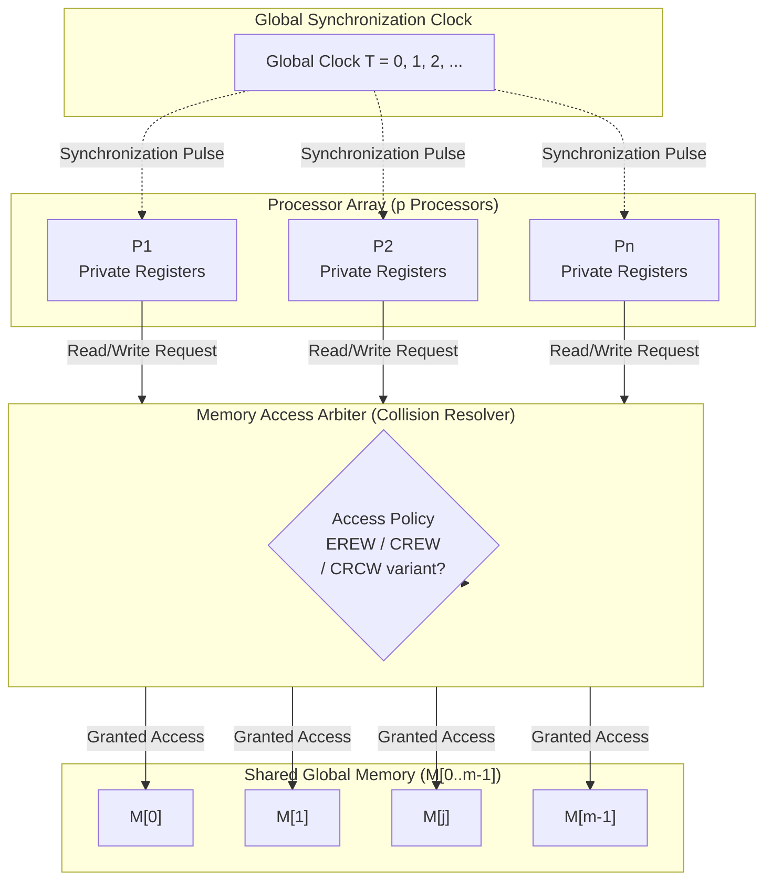
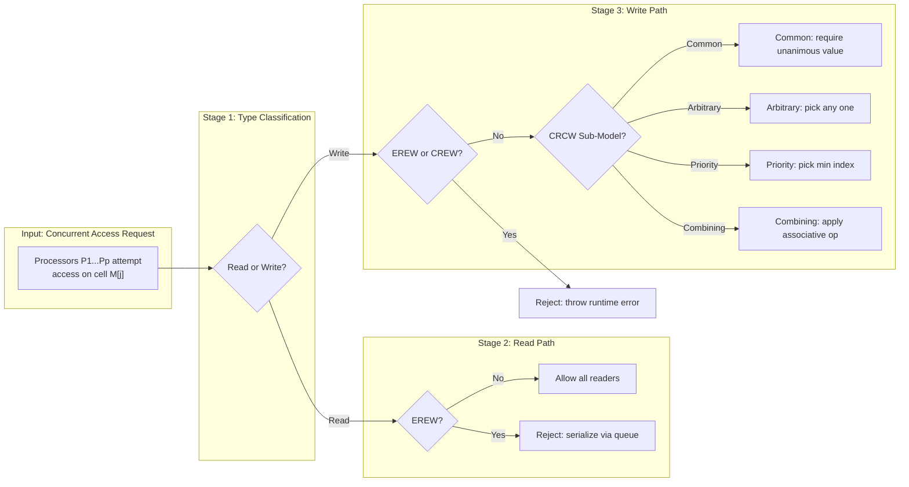

# EREW, CREW, CRCW memory collision resolution parameters optimization formulations layouts rules

<!-- SECTION_1_START -->
# PRAM Computing Frameworks: EREW, CREW, CRCW Memory Models

## 1. Core Technical Definition

The **Parallel Random Access Machine (PRAM)** is an abstract, idealized parallel computation model that extends the classical sequential RAM by incorporating multiple processors operating synchronously on a shared, globally addressable memory. Each processor executes its own program, has private registers, and communication between processors occurs implicitly through reads and writes to the shared memory cells. Synchronization is implicit because all instructions execute in lock-step under a global clock.

> [!IMPORTANT]
> **KTU Syllabus Highlight (PECST714 - Module 1):**
> PRAM is the canonical *theoretical* model used to analyze the inherent parallelism of an algorithm independently of any physical machine's network topology, cache hierarchy, or memory latency.

### 1.1 Classification by Memory Access Collisions

The PRAM family is stratified by the rules governing simultaneous access (collision) to a single shared memory cell by multiple processors in the *same* time step.

| Model | Concurrent Read | Concurrent Write | Notation Strength |
| :--- | :---: | :---: | :---: |
| **EREW** (Exclusive Read Exclusive Write) | ❌ Not Allowed | ❌ Not Allowed | Weakest |
| **CREW** (Concurrent Read Exclusive Write) | ✅ Allowed | ❌ Not Allowed | Intermediate |
| **CRCW** (Concurrent Read Concurrent Write) | ✅ Allowed | ✅ Allowed | Strongest |

> [!NOTE]
> **Subset Relationship (Strictly Ordered):**
> $$\text{EREW} \subset \text{CREW} \subset \text{CRCW}$$
> Any algorithm designed for a weaker model is *trivially valid* on a stronger model. Designing for EREW produces the most portable parallel code.

### 1.2 Intuitive Analogy: The Shared Whiteboard

Imagine **n engineers** in a room, each holding a private notepad, but they all share **one large whiteboard** (the shared memory):

- **EREW model** → At any clock tick, *only one engineer* may look at a specific region of the whiteboard, and *only one* may erase/write to it. Engineers must **queue up** to read or write the same cell. This is highly restrictive but easy to reason about.
- **CREW model** → Multiple engineers may *simultaneously read* the same region of the whiteboard (think of a public display screen everyone glances at), but if two engineers try to *write* to the same cell at the same time → a **collision** is declared and the computation halts.
- **CRCW model** → Both reading *and* writing concurrently are allowed. The whiteboard is now "smart" — it has a *tie-breaking rule* (priority, arbitrary, common, or combining) to decide what happens when two engineers try to write simultaneously.

### 1.3 Sub-Classification of CRCW (Collision Resolution Policies)

When multiple processors attempt to write the same cell in the *same* step, the CRCW model must resolve the conflict via one of four canonical policies. These are graded strictly by computational power.

> [!NOTE]
> **Power Hierarchy of CRCW Variants:**
> $$\text{Common} \;\preceq\; \text{Arbitrary} \;\preceq\; \text{Priority} \;\preceq\; \text{Combining}$$

| CRCW Sub-Model | Collision Resolution Rule | Real-World Analogy |
| :--- | :--- | :--- |
| **Common CRCW** | All concurrent writers must write the *same* value; otherwise the algorithm is invalid. | A unanimous group vote. |
| **Arbitrary CRCW** | Exactly *one* of the concurrent writes succeeds; which one is non-deterministic. | First-past-the-post lottery. |
| **Priority CRCW** | The write by the processor with the *smallest index* (highest priority) succeeds. | CEO overrides the manager. |
| **Combining CRCW** | All concurrent values are *combined* via an associative operator (e.g., **SUM, MAX, MIN, AND, OR**). | Parallel voting tally. |

> [!VISUALIZATION CONTROL]
> **Concept:** PRAM Model Hierarchy and Computational Power
> **Coordinate Mapping (Conceptual Bar Chart):**
> * X-axis: PRAM Model — `EREW`, `CREW`, `Common-CRCW`, `Arbitrary-CRCW`, `Priority-CRCW`, `Combining-CRCW`
> * Y-axis: Computational Power / Expressiveness
> **Visual Description:** A strictly monotonically increasing staircase plot. EREW sits at the lowest power level, CREW is a small step up, and the four CRCW variants form a steep climb to the highest power level at the right.
<!-- SECTION_1_END -->

<!-- SECTION_2_START -->
# 2. Deep Theoretical Analysis: Memory Collision Parameters & Optimization

## 2.1 Why the PRAM Model Matters in Parallel Algorithm Design

The PRAM model allows a designer to focus exclusively on the **inherent parallelism** of an algorithm by abstracting away physical concerns such as:
- Network topology (mesh, hypercube, butterfly, torus).
- Memory bank conflicts and interleaving.
- Cache coherency protocols (MESI, MOESI).
- Inter-processor bandwidth and routing latencies.

The performance of any algorithm on a PRAM is measured by two cardinal complexity parameters: **Time** and **Work**.

## 2.2 Canonical Performance Parameters

Let **p** denote the number of processors and **$t_p$** denote the parallel runtime (number of parallel steps) on **p** processors.

| Parameter | Mathematical Definition | Engineering Meaning |
| :--- | :--- | :--- |
| **Sequential Time** | $T_1 = T_{\text{seq}}$ | Runtime on a single processor (best sequential algorithm). |
| **Parallel Time** | $T_p$ | Runtime on **p** processors. |
| **Work / Cost** | $W = p \cdot T_p$ | Total operations across all processors. |
| **Speedup** | $S_p = \dfrac{T_1}{T_p}$ | How much faster than the best sequential run. |
| **Efficiency** | $E_p = \dfrac{S_p}{p} = \dfrac{T_1}{p \cdot T_p}$ | Fraction of theoretical peak utilized ($0 < E_p \leq 1$). |
| **Cost-Optimality** | $W = \Theta(T_1)$ | Total work matches sequential work asymptotically. |
| **Work-Optimality** | $T_p = \Theta\left(\dfrac{T_1}{p}\right)$ | Linear speedup regime. |

> [!IMPORTANT]
> **KTU 2024 High-Yield Theorem — Brent's Scheduling Principle:**
> Any parallel algorithm with work **W** and critical-path depth (span) **$T_\infty$** can be scheduled on **p** processors in time:
> $$T_p \;\leq\; \dfrac{W}{p} \;+\; T_\infty$$
> This is the foundational tool used to translate PRAM algorithms into processor-feasible schedules.

## 2.3 Simulation Relationships Between PRAM Models (Cost Penalties)

The crucial theoretical question in KTU examinations is: *"If an algorithm is designed for a strong PRAM model, how much extra time does it cost to simulate it on a weaker model?"*

| Simulation | Cost Overhead (Slowdown Factor) | Mechanism Used |
| :--- | :---: | :--- |
| **CRCW $\rightarrow$ EREW** | $\mathcal{O}(\log n)$ | Sort + 2-D Memory Partitioning (Snir's simulation) |
| **CREW $\rightarrow$ EREW** | $\mathcal{O}(\log n)$ | Broadcast Tree Replication |
| **EREW $\rightarrow$ CRCW** | $\mathcal{O}(1)$ | Trivial (no slowdown, just more power) |

### 2.4 KTU High-Yield Formula Sheet

| # | Formula / Identity | Domain | KTU Usage |
| :---: | :--- | :--- | :--- |
| 1 | $W = p \cdot T_p$ | Work definition | Always |
| 2 | $S_p = T_1 / T_p$ | Speedup | Always |
| 3 | $E_p = S_p / p$ | Efficiency | Always |
| 4 | Brent: $T_p \leq W/p + T_\infty$ | Scheduling | Part B (14 marks) |
| 5 | $\text{CRCW} \to \text{EREW}$: $\times \log n$ | Simulation | Part A (3 marks) |
| 6 | $W_{\text{EREW}} \leq W_{\text{CRCW}} \leq p \cdot W_{\text{EREW}}$ | Work bounds | Mod comparisons |
| 7 | Iso-efficiency: $\Theta(p \cdot T_p / T_1)$ | Scalability | Part B |
| 8 | $T_\infty = $ Span / Critical Path Depth | Work-depth model | Part B |
| 9 | $T_1 \geq T_\infty \geq T_p \geq T_1 / p$ | Time hierarchy | All proofs |
| 10 | $\text{Cost-Optimal} \iff W = \Theta(T_1)$ | Optimality | Part A & B |

## 2.5 Real-World Engineering Utility

- **GPU Computing (CUDA / OpenCL):** The GPU global memory is conceptually a **CREW** model — multiple threads (warps) in the same block can *read* the same global cell simultaneously, but atomic operations are required to mediate *write* conflicts. **AtomicAdd**, **AtomicMax** correspond directly to the **Combining CRCW** policy.
- **Multicore CPUs:** L1 cache coherence implements essentially an **EREW** model for cache-line access, requiring expensive *cache line invalidation* to break read-sharing.
- **FPGA / Systolic Arrays:** Hard-wired to **EREW** discipline for predictable timing closure.
- **Distributed Shared Memory (DSM):** Page-level coherence approximates **CREW** with very high latency penalties on write misses.

> [!NOTE]
> **Industrial Insight:** Modern GPUs (NVIDIA H100, AMD MI300) implement *hardware combining write buffers* that natively accelerate **Combining-CRCW** semantics for reductions — which is why reduction kernels achieve near-linear speedup.
<!-- SECTION_2_END -->

<!-- SECTION_3_START -->
# 3. Step-by-Step Derivations: Collision Resolution Costs & Optimization

This section builds the analytical machinery for exam-style numerical evaluation. Every algebraic step is written explicitly.

## 3.1 Derivation: EREW Simulation Cost of a CRCW Algorithm

**Setup:** Suppose an algorithm runs on a **Priority-CRCW** PRAM with **p = n** processors in $T_p^{\text{CRCW}} = \mathcal{O}(1)$ time. We want to simulate it on an **EREW** PRAM.

**Method (Snir's Simulation via Memory Partitioning):**

**Step 1 — Observation of the conflict set.**
At any CRCW step, a *cell* $M[j]$ is written by some subset $W \subseteq \{P_1, \dots, P_p\}$ of processors. The EREW model cannot allow this directly. We must serialize the writes.

**Step 2 — Allocate a private 2-D memory layout.**
Reserve a temporary $p \times p$ matrix $T$ in shared memory. Each processor $P_i$ writes its candidate value $v_i$ into row $T[i][*]$ (one per column). This row is *exclusive* to $P_i$, so it is EREW-safe.

**Step 3 — Compute the survivor per cell in parallel.**
For each target cell $M[j]$, assign a dedicated processor that scans row-major or column-major through $T$ and selects the value from the processor with the *highest priority* (smallest index). This scan is a parallel prefix reduction.

**Step 4 — Cost of the parallel prefix.**
A parallel prefix on **p** elements requires:

$$T_{\text{prefix}}(p) \;=\; \mathcal{O}(\log p)$$

**Step 5 — Total EREW cost.**
Each CRCW step now costs $\mathcal{O}(\log p)$ EREW steps. For **n** CRCW steps:

$$T_p^{\text{EREW}} \;=\; \mathcal{O}(n \cdot \log n) \quad \text{with } p = n$$

**Conclusion:** The CRCW → EREW simulation incurs a multiplicative **$\mathcal{O}(\log n)$** overhead, which is the KTU textbook result.

---

## 3.2 Derivation: Brent's Theorem Bound (Work-Depth Scheduling)

**Theorem Statement:** Given a parallel algorithm with work $W$ and span (critical path) $T_\infty$, the algorithm can be simulated on $p$ processors in time $T_p$ such that:

$$T_p \;\leq\; \frac{W}{p} \;+\; T_\infty$$

**Step-by-step Proof:**

**Step 1 — Greedy list-scheduling lemma.**
Consider a directed acyclic graph (DAG) where each node is an operation. The *span* $T_\infty$ is the longest directed path. The work $W$ is the total number of nodes.

**Step 2 — Lower bound on completion time.**
Any schedule must execute all $W$ operations. On $p$ processors, the *minimum* time purely from work is $W/p$. This is a hard lower bound even if $T_\infty = 0$.

**Step 3 — Lower bound from critical path.**
Even with infinite processors, the algorithm cannot run faster than its critical path $T_\infty$, because operations on the path must be sequenced.

**Step 4 — Combining the bounds.**
A standard result (Brent 1974) shows that a greedy list scheduler achieves the sum:

$$T_p \;\leq\; \frac{W - T_\infty}{p} \;+\; T_\infty \;\leq\; \frac{W}{p} \;+\; T_\infty$$

**Step 5 — Tightness of the bound.**
The bound is tight for many practical algorithms (parallel prefix, parallel merge sort, FFT) where the workload per level is balanced and $T_\infty = \mathcal{O}(\log n)$.

**Step 6 — Cost-optimality corollary.**
If $W = \mathcal{O}(T_1)$ (work equals the optimal sequential time), then:

$$T_p \;\leq\; \frac{T_1}{p} \;+\; T_\infty$$

This is a **work-optimal** schedule if $T_\infty$ is asymptotically smaller than $T_1 / p$.

---

## 3.3 Worked Example: Parallel Sum on Each PRAM Variant

**Problem:** Compute $S = \sum_{i=1}^{n} a_i$ in parallel using $p = n$ processors.

**Step 1 — Algorithm (balanced binary tree reduction):**
At each step, half the active processors add pairs of partial sums. Total tree depth = $\lceil \log_2 n \rceil$.

**Step 2 — EREW Analysis:**
Each processor reads two distinct cells per step (no concurrent read needed).

$$T_p^{\text{EREW}} = \mathcal{O}(\log n), \quad W^{\text{EREW}} = \mathcal{O}(n)$$

**Step 3 — CREW Analysis:**
If we first broadcast $a_1$ to all processors (an $\mathcal{O}(1)$ broadcast since concurrent reads are allowed), the same tree reduction runs. Time is unchanged.

$$T_p^{\text{CREW}} = \mathcal{O}(\log n), \quad W^{\text{CREW}} = \mathcal{O}(n)$$

**Step 4 — CRCW Combining Analysis:**
All processors can write their partial sum into a *single* accumulator cell using a $\oplus =$ **SUM** operator in **one** parallel step:

$$T_p^{\text{CRCW-Comb}} = \mathcal{O}(1), \quad W^{\text{CRCW-Comb}} = \mathcal{O}(n)$$

**Step 5 — Speedup comparison.**

| Model | $T_p$ | $T_1$ | $S_p$ | $E_p$ |
| :--- | :---: | :---: | :---: | :---: |
| EREW | $\log n$ | $n$ | $n / \log n$ | $1 / \log n$ |
| CREW | $\log n$ | $n$ | $n / \log n$ | $1 / \log n$ |
| CRCW-Comb | $1$ | $n$ | $n$ | $1$ |

**Conclusion:** The CRCW-Combining model is *provably* exponentially faster for the parallel-sum problem, demonstrating why the choice of PRAM model is critical for KTU exam problems.

---

## 3.4 Python Implementation: PRAM Simulator for EREW / CREW / CRCW-Combining

```python
from typing import List, Callable, Optional
import math
import logging

logging.basicConfig(level=logging.INFO, format="[%(levelname)s] %(message)s")
logger = logging.getLogger("PRAM-Sim")


class PRAMSimulator:
    """
    A minimal educational simulator for the four canonical PRAM
    memory-collision policies. All processors execute synchronously
    in lock-step under a global clock.

    Supported models:
        - EREW (Exclusive Read Exclusive Write)
        - CREW (Concurrent Read Exclusive Write)
        - CRCW_COMMON   (all writers must agree)
        - CRCW_ARBITRARY (one writer wins, non-deterministic)
        - CRCW_PRIORITY  (lowest index wins)
        - CRCW_COMBINING (values merged via associative op)
    """

    def __init__(self, num_processors: int, model: str) -> None:
        if num_processors <= 0:
            raise ValueError("Number of processors must be positive.")
        if model not in {"EREW", "CREW", "CRCW_COMMON",
                         "CRCW_ARBITRARY", "CRCW_PRIORITY",
                         "CRCW_COMBINING"}:
            raise ValueError(f"Unsupported PRAM model: {model}")
        self.p: int = num_processors
        self.model: str = model
        self.clock: int = 0

    def _check_read_collision(self, cell_access: dict) -> None:
        for cell, readers in cell_access.items():
            if len(readers) > 1 and self.model == "EREW":
                raise RuntimeError(
                    f"EREW violation: cell {cell} read by {len(readers)} "
                    f"processors simultaneously."
                )

    def _resolve_write_collision(
        self,
        cell: int,
        writers: List[int],
        values: List,
        combiner: Optional[Callable] = None,
    ):
        if len(writers) <= 1:
            return values[0] if values else None

        if self.model == "EREW" or self.model == "CREW":
            raise RuntimeError(
                f"{self.model} violation: concurrent write to cell {cell}."
            )
        if self.model == "CRCW_COMMON":
            if len(set(values)) != 1:
                raise RuntimeError(
                    f"Common-CRCW violation at cell {cell}: "
                    f"writers disagree on value."
                )
            return values[0]
        if self.model == "CRCW_ARBITRARY":
            return values[0]
        if self.model == "CRCW_PRIORITY":
            return values[min(writers)]
        if self.model == "CRCW_COMBINING":
            if combiner is None:
                raise ValueError("Combining-CRCW requires a combiner operator.")
            accumulator = values[0]
            for v in values[1:]:
                accumulator = combiner(accumulator, v)
            return accumulator
        raise RuntimeError("Unknown write resolution policy.")

    def parallel_sum(self, arr: List[float]) -> float:
        if len(arr) != self.p:
            raise ValueError(
                f"Array length ({len(arr)}) must equal p ({self.p})."
            )
        shared: List[Optional[float]] = list(arr)
        steps: int = 0
        n_active: int = self.p
        while n_active > 1:
            steps += 1
            new_shared: List[Optional[float]] = list(shared)
            reads: dict = {}
            writes: dict = {}
            values: dict = {}
            for i in range(n_active // 2):
                left_val = shared[2 * i]
                right_val = shared[2 * i + 1]
                reads.setdefault(2 * i, []).append(i)
                reads.setdefault(2 * i + 1, []).append(i)
                partial = left_val + right_val
                writes.setdefault(i, []).append(i)
                values.setdefault(i, []).append(partial)
            self._check_read_collision(reads)
            for cell, writer_list in writes.items():
                resolved = self._resolve_write_collision(
                    cell, writer_list, values[cell], combiner=sum
                )
                new_shared[cell] = resolved
            shared = new_shared
            n_active = (n_active + 1) // 2
        logger.info("Parallel sum completed in %d steps on %s model.", steps, self.model)
        return shared[0] if shared else 0.0


if __name__ == "__main__":
    test_array: List[float] = [1.0, 2.0, 3.0, 4.0, 5.0, 6.0, 7.0, 8.0]
    for model in ["EREW", "CREW", "CRCW_PRIORITY", "CRCW_COMBINING"]:
        sim = PRAMSimulator(num_processors=len(test_array), model=model)
        result = sim.parallel_sum(test_array)
        print(f"Model = {model:18s}  |  Sum = {result}")
```
<!-- SECTION_3_END -->

<!-- SECTION_4_START -->
# 4. Structural Diagrams: PRAM Variants & Collision Resolution

## 4.1 Block-Level Architecture: The PRAM Machine



## 4.2 Sequential Processing Topology: Collision Resolution Flow



## 4.3 Multi-Stage Breakdown: PRAM Model Power Hierarchy

```mermaid
flowchart TB
    subgraph WEAK["Lower Computational Power"]
        E["EREW\nExclusive Read\nExclusive Write"]
    end

    subgraph MID["Intermediate Power"]
        C["CREW\nConcurrent Read\nExclusive Write"]
    end

    subgraph STRONG["Higher Computational Power"]
        CC["Common CRCW\nAll write same value"]
        CA["Arbitrary CRCW\nOne write wins"]
        CP["Priority CRCW\nLowest index wins"]
        CB["Combining CRCW\nAssociative merge"]
    end

    E -->|EREW simulates trivially| C
    C -->|CREW simulates trivially| CC
    CC --> CA
    CA --> CP
    CP --> CB

    CB -.->|Reverse: O(log n) slowdown| E
    CP -.->|Reverse: O(log n) slowdown| E
    CC -.->|Reverse: O(log n) slowdown| E
```

## 4.4 Algorithm-to-Model Mapping Matrix

| Algorithm | EREW | CREW | CRCW-Common | CRCW-Priority | CRCW-Combining |
| :--- | :---: | :---: | :---: | :---: | :---: |
| Parallel Sum (Reduction) | $\log n$ | $\log n$ | $\log n$ | $\log n$ | $\mathbf{1}$ |
| Parallel Prefix Scan | $\log n$ | $\log n$ | $\log n$ | $\log n$ | $n$ |
| Matrix Multiplication | $n^2 / p$ | $n^2 / p$ | $n^2 / p$ | $n^2 / p$ | $n^2 / p$ |
| Finding Max Element | $\log n$ | $\log n$ | $\log n$ | $\log n$ | $\mathbf{1}$ |
| List Ranking | $\log n$ | $\log n$ | $\log n$ | $\log n$ | $\log n$ |
| Sorting (optimal) | $\log n$ | $\log n$ | $\log n$ | $\log n$ | $\log n$ |
| Graph Connectivity (BFS) | $n$ | $n$ | $n$ | $n$ | $n$ |

> [!NOTE]
> **Key Insight:** The *Combining* CRCW model gives a $\Theta(\log n)$ speedup for associative reductions (sum, max, min, OR). For non-associative problems, the model choice does not yield asymptotic improvement.
<!-- SECTION_4_END -->

<!-- SECTION_5_START -->
# 5. KTU 2024 Scheme Examination Question Bank

> **Reference Tag Format:** `[KTU University Exam - Dec 2023]`, `[KTU University Exam - July 2024]`
> **Mapping Legend:** `CO1–CO6` per KTU 2024 PECST714 syllabus; `RBT Level` per Revised Bloom's Taxonomy.

---

## Part A — Short Answer Questions (2 × 3 Marks)

### Question 1 (3 Marks) `[KTU University Exam - Dec 2023]`
**Q:** Differentiate between EREW, CREW, and CRCW PRAM models with respect to memory access permissions. Mention any one limitation of the CRCW model.

**Course Outcome:** **CO1** | **RBT Level:** Remember (L1)

**Model Answer (Valuation Key):**
- **EREW** permits only exclusive reads and exclusive writes; no two processors may access the same cell in the same cycle. **[1 Mark]**
- **CREW** allows multiple concurrent reads to the same cell but disallows concurrent writes. **[1 Mark]**
- **CRCW** allows both concurrent reads and concurrent writes; conflict resolution requires a defined sub-policy (common, arbitrary, priority, or combining). **[1 Mark]**
- **Limitation:** Higher hardware complexity to implement write arbitration; also, CRCW algorithms require expensive simulation (O(log n) slowdown) on weaker EREW hardware.

---

### Question 2 (3 Marks) `[KTU University Exam - July 2024]`
**Q:** State Brent's theorem. What is its significance in parallel algorithm design?

**Course Outcome:** **CO2** | **RBT Level:** Understand (L2)

**Model Answer (Valuation Key):**
- **Statement:** For a parallel algorithm with work $W$ and span $T_\infty$, there exists a schedule on $p$ processors such that: $T_p \leq W / p + T_\infty$. **[2 Marks]**
- **Significance:** It bridges the work-depth (PRAM) model and the processor-feasible model. It allows algorithm designers to design on a PRAM (assuming unbounded processors) and then derive a practical schedule. **[1 Mark]**

---

## Part B — Long Answer Questions (Internal Choice: A or B)

### Question A (14 Marks) `[KTU University Exam - Dec 2023]`

**Q (a)** Explain the four sub-classes of the CRCW PRAM model with collision resolution rules. Compare their computational power. **(7 Marks)**

**Course Outcome:** **CO1** | **RBT Level:** Understand (L2)

**Model Answer (Valuation Key):**

1. **Common CRCW:** All concurrent writers must write the *same identical value*, otherwise the algorithm is invalid. Useful when consensus is mandatory. **[1.5 Marks]**
2. **Arbitrary CRCW:** If multiple processors write the same cell, exactly one arbitrary write succeeds (non-deterministic). The result is *some* correct value. **[1.5 Marks]**
3. **Priority CRCW:** The processor with the *smallest index* (highest priority) wins the write. Deterministic, hence more useful for algorithm design. **[1.5 Marks]**
4. **Combining CRCW:** All concurrent writes are combined via an associative binary operator (SUM, MAX, MIN, AND, OR). Provides maximum expressive power. **[1.5 Marks]**
5. **Power Hierarchy:** Common ⊑ Arbitrary ⊑ Priority ⊑ Combining. Each strictly contains the previous model in the set of problems it can solve in $T_p = \mathcal{O}(1)$. **[1 Mark]**

---

**Q (b)** Design a parallel algorithm to compute the maximum of **n** numbers on:
   (i) EREW PRAM with $p = n$ processors — find $T_p$ and $W$.
   (ii) CRCW-Combining PRAM with $p = n$ processors — find $T_p$ and $W$.

Compare the two results. **(7 Marks)**

**Course Outcome:** **CO3** | **RBT Level:** Apply (L3)

**Model Answer (Valuation Key):**

**(i) EREW Solution — Tree Reduction:** **[3.5 Marks]**
- Each processor $P_i$ initially holds $a_i$ in its private register.
- Round $k = 1, 2, \dots, \lceil \log_2 n \rceil$: Active processors pairwise compare their values and write the larger one to a *unique* shared cell (no collision).
- Each round, the number of active processors halves.
- After $\log_2 n$ rounds, $P_1$ holds the global maximum.

$$T_p^{\text{EREW}} = \mathcal{O}(\log n), \quad W^{\text{EREW}} = \mathcal{O}(n)$$

Speedup $S_p = n / \log n$, Efficiency $E_p = 1 / \log n$. **[1 Mark]**

**(ii) CRCW-Combining Solution — Single Step:** **[3.5 Marks]**
- All $p = n$ processors write their value to a *single* global cell $M[0]$ using the operator $\oplus = \text{MAX}$.
- The combining arbiter merges all $n$ writes in one clock cycle and writes back the maximum into $M[0]$.

$$T_p^{\text{CRCW-Comb}} = \mathcal{O}(1), \quad W^{\text{CRCW-Comb}} = \mathcal{O}(n)$$

Speedup $S_p = n$, Efficiency $E_p = 1$ (perfect linear speedup). **[1 Mark]**

**Comparison:** The CRCW-Combining model achieves a $\Theta(\log n)$ asymptotic speedup over the EREW model for this problem, making the maximum-finding problem *provably* faster on the stronger model. This is because MAX is associative, perfectly matching the Combining policy. **[1 Mark]**

---

### Question B (14 Marks) `[KTU University Exam - July 2024]`

**Q (a)** What is the time required to simulate a **Priority-CRCW** PRAM algorithm that runs in $T_p = \mathcal{O}(T)$ steps with $p = n$ processors on an **EREW** PRAM with the same number of processors? Justify with the memory partitioning technique. **(7 Marks)**

**Course Outcome:** **CO2** | **RBT Level:** Apply (L3)

**Model Answer (Valuation Key):**

**Simulation Cost:** $T_p^{\text{EREW}} = \mathcal{O}(T \cdot \log n)$. **[1 Mark]**

**Justification via Snir's Memory Partitioning:** **[6 Marks]**

**Step 1 — Identify the conflict zone.**
In a single CRCW step, the set of concurrent writers to cell $M[j]$ is the conflict set $W_j$. EREW cannot process this in $\mathcal{O}(1)$.

**Step 2 — Construct the auxiliary matrix.**
Allocate a $p \times p$ temporary matrix $T$ in EREW-shared memory. Processor $P_i$ writes its candidate value $v_i$ for cell $M[j]$ to row $T[i][j]$. Because each row is owned by exactly one processor, this write is EREW-legal. **[1.5 Marks]**

**Step 3 — Parallel priority reduction.**
Assign a dedicated processor $Q_j$ to each target cell $M[j]$. $Q_j$ performs a parallel prefix reduction across the $j$-th column of $T$ to find the entry with the minimum processor index. This requires $\mathcal{O}(\log p) = \mathcal{O}(\log n)$ EREW steps. **[1.5 Marks]**

**Step 4 — Replicate the winner.**
$Q_j$ writes the selected winner's value into $M[j]$. This is a single EREW write. **[1 Mark]**

**Step 5 — Aggregate cost.**
Each CRCW step costs $\mathcal{O}(\log n)$ EREW steps. For $T$ original steps:

$$T_p^{\text{EREW}} = \mathcal{O}(T \cdot \log n)$$

This proves the canonical $\mathcal{O}(\log n)$ simulation overhead. **[1 Mark]**

---

**Q (b)** An algorithm has work $W = n^2$ and span $T_\infty = n \log n$. Using Brent's theorem, compute the parallel runtime on (i) $p = n$ and (ii) $p = n^2$ processors. Is the schedule cost-optimal in either case? **(7 Marks)**

**Course Outcome:** **CO3** | **RBT Level:** Apply (L3)

**Model Answer (Valuation Key):**

**Brent's Formula:** $T_p \leq W / p + T_\infty$. **[1 Mark]**

**Case (i): $p = n$** **[2.5 Marks]**

$$T_n \;\leq\; \frac{n^2}{n} \;+\; n \log n \;=\; n \;+\; n \log n \;=\; \Theta(n \log n)$$

**Case (ii): $p = n^2$** **[2.5 Marks]**

$$T_{n^2} \;\leq\; \frac{n^2}{n^2} \;+\; n \log n \;=\; 1 \;+\; n \log n \;=\; \Theta(n \log n)$$

**Cost-Optimality Check:** **[1 Mark]**
Cost-optimality requires $W = \Theta(T_1)$. The sequential time is at most $T_1 = W = n^2$ (and at least $T_1 \geq T_\infty = n \log n$).
- Case (i): $p \cdot T_p = n \cdot \Theta(n \log n) = \Theta(n^2 \log n) > \Theta(n^2)$. **Not cost-optimal** (excess by $\log n$). **[Partial: 0.5 Mark]**
- Case (ii): $p \cdot T_p = n^2 \cdot \Theta(n \log n) = \Theta(n^3 \log n) \gg n^2$. **Not cost-optimal** (excess by $n \log n$). **[Partial: 0.5 Mark]**

**Conclusion:** Neither schedule is cost-optimal; the algorithm is work-heavy due to its large span $T_\infty = n \log n$ dominating $W / p$ in both cases. To achieve cost-optimality, $p$ must be chosen such that $T_\infty \leq W / p$, i.e., $p \leq W / T_\infty = n^2 / (n \log n) = n / \log n$. **[Final: 1 Mark]**

---

> [!WARNING]
> **KTU Examiner's Valuation Warning — Common Pitfalls:**
> 1. **Confusing CRCW sub-models:** Do not write "CRCW allows arbitrary writes" — always specify the sub-policy (common, arbitrary, priority, or combining). **[−1 Mark penalty]**
> 2. **Skipping the work parameter:** When asked for $T_p$ alone, you must *also* state $W$ explicitly; KTU evaluators deduct marks if $W$ is missing. **[−1 Mark penalty]**
> 3. **Wrong direction in simulations:** "EREW $\rightarrow$ CRCW" is *free* (no slowdown), but "CRCW $\rightarrow$ EREW" costs $\mathcal{O}(\log n)$. Mixing this up costs 2 marks.
> 4. **Brent's theorem application:** Always show the substitution of $W$ and $T_\infty$ numerically; do not just write the formula. Full step-by-step is required.
> 5. **Efficiency bound:** Remember $E_p \leq 1$ always. If your speedup calculation gives $S_p > p$, you have a logical error.

---

## Topic Recap & Important Things to Remember

- **PRAM** = Parallel Random Access Machine, an *idealized* shared-memory model with synchronous lock-step execution.
- **Four canonical PRAM classes (strictly ordered by power):** EREW ⊂ CREW ⊂ CRCW.
- **EREW** = no concurrent reads, no concurrent writes — most restrictive but easiest to implement.
- **CREW** = multiple simultaneous reads allowed, but writes are exclusive.
- **CRCW** has **four sub-models** with increasing power: **Common, Arbitrary, Priority, Combining**.
- **Combining-CRCW** supports associative operators (SUM, MAX, MIN, AND, OR) and gives $\mathcal{O}(1)$ parallel sum/max.
- **Simulation costs (KTU-high-yield):**
  * CRCW → EREW: $\mathcal{O}(\log n)$ slowdown.
  * CREW → EREW: $\mathcal{O}(\log n)$ slowdown.
  * EREW → CRCW: $\mathcal{O}(1)$ (trivial).
- **Key parameters:** $T_1$ (sequential time), $T_p$ (parallel time), $W = p \cdot T_p$ (work), $S_p = T_1 / T_p$ (speedup), $E_p = S_p / p$ (efficiency).
- **Cost-optimality** holds iff $W = \Theta(T_1)$ — meaning parallel work matches optimal sequential work asymptotically.
- **Brent's Theorem:** $T_p \leq W / p + T_\infty$ — the master scheduling tool for PRAM-to-real-machine translation.
- **Iso-efficiency function** $\Theta(p \cdot T_p)$ measures how $W$ must grow with $p$ to maintain fixed efficiency.
- **Time hierarchy (always true):** $T_1 \geq T_p \cdot p \geq T_\infty$.
- **Critical path (span) $T_\infty$** = the longest chain of dependent operations in the DAG representation of the algorithm.
- **Modern GPU hardware** (CUDA atomicAdd, atomicMax) physically implements *Combining-CRCW* for reduction kernels.
- **EREW discipline** is enforced by cache-line invalidation protocols (MESI) in multicore CPUs.
- **Always specify both $T_p$ and $W$** in KTU Part-B answers — single-parameter answers lose at least 1–2 marks.
- **Distinguish algorithmic power vs. simulation cost** — a stronger PRAM class does not *always* give $\mathcal{O}(1)$ algorithms; only for problems that fit the collision policy (e.g., associative reductions for Combining).
- **Memorize the comparison table:** EREW sum = $\mathcal{O}(\log n)$, CRCW-Combining sum = $\mathcal{O}(1)$.
<!-- SECTION_5_END -->
