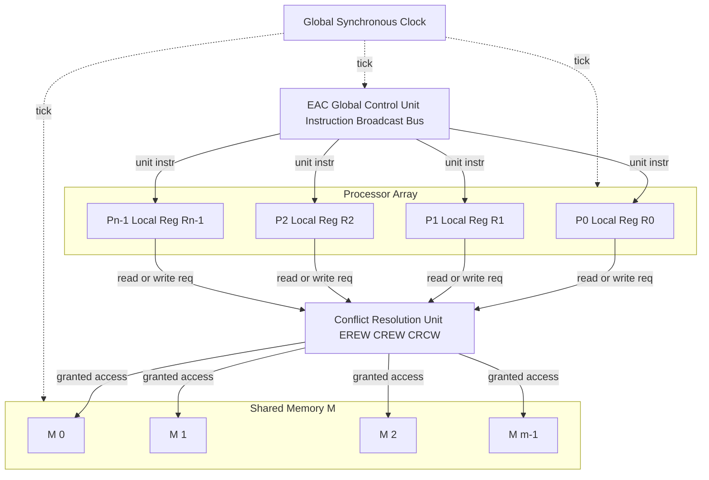
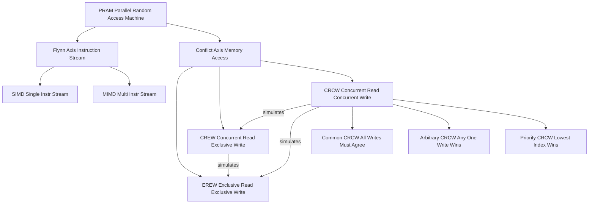
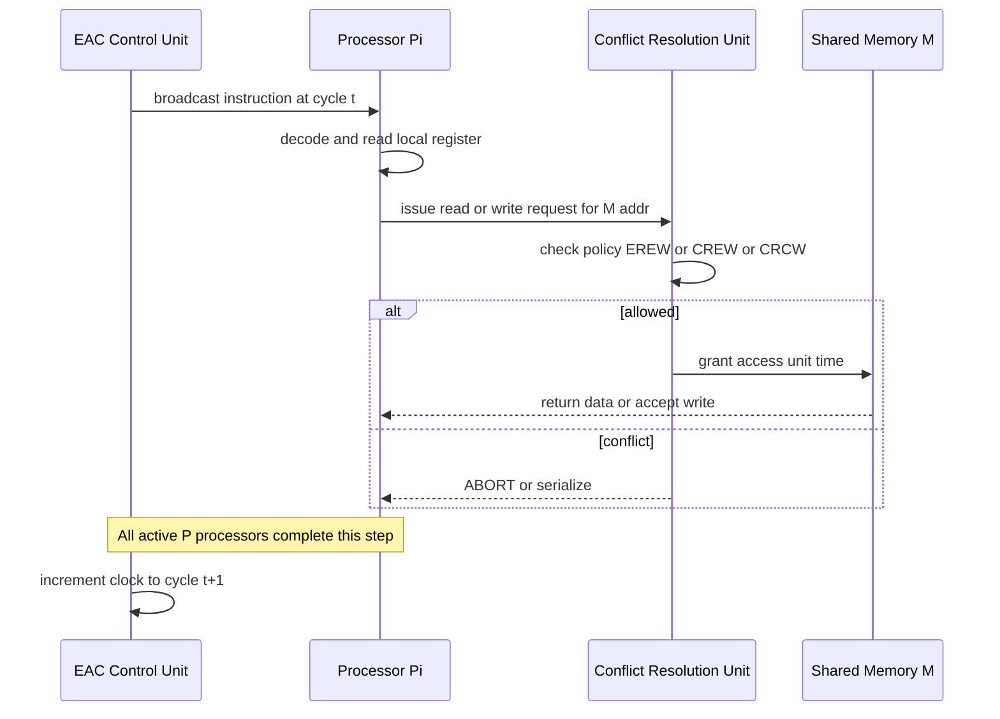
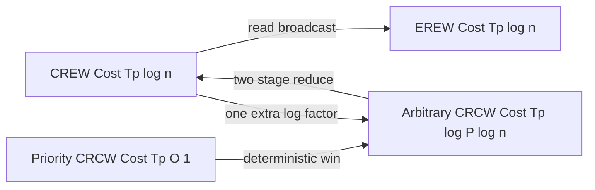

# Parallel Random Access Machine (PRAM) models taxonomy classifications structures layouts models

<!-- SECTION_1_START -->
# Parallel Random Access Machine (PRAM) — Models, Taxonomy, Classifications, Structures & Layouts

> [!IMPORTANT]
> **KTU 2024 Scheme | PECST714 | Module 1 | Core Foundation Topic**
> This topic forms the **theoretical bedrock** of all parallel algorithm design. Every subsequent module (Processor Organizations, Interconnection Networks, Parallel Sorting/Search) assumes mastery of the PRAM framework covered here.

## 1.1 Formal Academic Definition

The **Parallel Random Access Machine (PRAM)** is an abstract, idealized theoretical model of a **shared-memory, multiple-instruction multiple-data (MIMD) parallel computer**. It consists of a (theoretically unbounded) collection of **synchronized processors**, each with its own private local memory, all communicating exclusively through a **single, globally shared random-access memory (SM)**. All processors execute in lock-step under a common clock, and any processor can read or write any shared memory cell in **unit time**, independent of the address accessed.

> [!NOTE]
> **Key Idealized Properties of PRAM (KTU Board Definition)**
> 1. **Unbounded number of processors** $P = 2^k$ (polynomial in input size $n$).
> 2. **Unbounded shared memory** $M$ (also polynomial in $n$).
> 3. **Unit-time** read/write access to any memory cell.
> 4. **Synchronous, lock-step** execution across all processors.
> 5. **Single shared program** (SPMD-style), with each $P_i$ executing on its own data subset.

## 1.2 Conceptual Analogy & Intuition

> [!TIP]
> **The "Reading Room with Whiteboards" Analogy**
> Imagine a **vast reading room** containing $P$ students (processors) and a single **long wall of whiteboards** (shared memory). Every student holds a personal notebook (local/registers). A single ticking wall-clock (global clock) governs everyone.
> - **Read** = walk to any whiteboard cell, copy its value into your notebook. Takes **1 tick** regardless of how far down the wall the cell is.
> - **Write** = walk to any whiteboard cell, overwrite it. Also **1 tick**.
> - **Synchronization** = the clock rings; *every* student may move, read, or write simultaneously.
> - The "idealization" is that the corridor is infinitely long, and students never collide or get stuck in traffic.
> - The **conflict rules** (EREW/CREW/CRCW/ERCW) are like library etiquette rules that govern whether two students may *simultaneously* read or write the *same* whiteboard cell.

This model is intentionally **non-physical** — real hardware (NUMA, clusters, GPUs) deviates from it. PRAM exists so we can design and analyze parallel algorithms *cleanly* before mapping them to messy real machines.

## 1.3 GeoGebra Visualization — PRAM Spatial Layout

> [!VISUALIZATION CONTROL]
> **Concept:** Abstract PRAM layout — a "star" topology showing processors connected through a single shared memory bus.
> **GeoGebra / Desmos Input Equations:**
> * Place $P$ processors on a unit circle: $(x,y) = (\cos(2\pi k / P),\ \sin(2\pi k / P))$ for $k = 0, 1, \dots, P-1$.
> * Place shared memory at origin: $(0, 0)$ labelled "SM".
> * Draw radial edges from each processor to SM.
> **Visual Description:** Students should observe a **central hub (SM)** with $P$ equally-spaced processor nodes around it, all linked by spokes. The radial symmetry captures the *uniform unit-cost* access property.

## 1.4 The Four Pillars of a PRAM

| # | Component | Symbol | Role |
|---|-----------|--------|------|
| 1 | **Processors** | $P_0, P_1, \dots, P_{p-1}$ | Execute instructions in lock-step |
| 2 | **Shared Memory** | $M$ | Globally addressable, unit-access cells $M[0], M[1], \dots$ |
| 3 | **Local Memory / Registers** | $R_i$ per $P_i$ | Private fast storage for $P_i$ |
| 4 | **Global Control Unit / EAC** | EAC | Broadcasts the "single program" instruction; resolves conflicts |

> [!NOTE]
> **EAC = Extended Arithmetic Circuit** (sometimes "global control unit") — the KTU-syllabus term for the unit that fetches one instruction per cycle and dispatches it to all processors.
<!-- SECTION_1_END -->

<!-- SECTION_2_START -->
# Deep Theoretical Analysis — PRAM Taxonomy, Classification & Structure

## 2.1 Structural Anatomy of a PRAM

The PRAM is built from three orthogonal sub-structures. Understanding these in isolation is essential because **each layer drives a different KTU exam question**.

### Layer 1 — The Computational Core
- **Unbounded register set** $R_i$ per processor.
- Each $R_i$ contains: program counter, accumulator, index registers, working storage.
- **All processors are identical** (homogeneous); they differ only in their **processor ID** $i$, accessible as a built-in constant.

### Layer 2 — The Memory Hierarchy
- A single shared address space $M = \{M[0], M[1], \dots, M[m-1]\}$.
- No caching, no TLB, no NUMA effects — every access has cost **$\Theta(1)$**.
- Memory is **word-addressable** (each cell holds one $\log n$-bit word).

### Layer 3 — The Synchronization & Control Fabric
- A single **broadcast bus** carries the instruction stream from EAC to all $P$ processors.
- A **conflict-resolution unit** is logically part of the memory system; it enforces the access policy (EREW/CREW/CRCW/ERCW).

## 2.2 The PRAM Classification Taxonomy

KTU requires students to master **two independent classification axes**.

### Axis A — Instruction Stream (Flynn's Taxonomy Re-Statement)

> [!IMPORTANT]
> PRAM is a **MIMD-class machine** because each processor can execute a *different* instruction at the same time (e.g., $P_0$ reads, $P_1$ writes, $P_2$ adds). However, with a single broadcast program, it can be **degraded** to **SIMD** mode when all processors are active on the same instruction. The KTU term for this is **"lock-step synchronous"** execution.

| Class | Stream | Data | Used in PRAM? |
|-------|--------|------|----------------|
| SISD | 1 | 1 | No (this is the uniprocessor baseline) |
| SIMD | 1 | many | Yes — *synchronous subset* of PRAM |
| MISD | many | 1 | No (not relevant to PRAM) |
| MIMD | many | many | **Yes** — *general PRAM* |

### Axis B — Memory Access / Conflict Policy (The Core PRAM Sub-Taxonomy)

This is the **most heavily tested** part of the topic.

| Model | Full Name | Read Same Cell | Write Same Cell | Realism |
|-------|-----------|----------------|------------------|----------|
| **EREW** | Exclusive Read, Exclusive Write | Only 1 $P$ | Only 1 $P$ | Most restrictive, most realistic |
| **CREW** | Concurrent Read, Exclusive Write | Many $P$ allowed | Only 1 $P$ | Common in algorithmic design |
| **ERCW** | Exclusive Read, Concurrent Write | Only 1 $P$ | Many $P$ allowed | Rarely used standalone |
| **CRCW** | Concurrent Read, Concurrent Write | Many $P$ allowed | Many $P$ allowed | Most powerful, least realistic |

> [!WARNING]
> A **conflict** is a logical error. The PRAM model does *not* define what hardware does — it simply *forbids* the access in weaker models. The CRCW sub-models (below) define the *resolution rule* for permissible concurrent writes.

### Sub-Classification of CRCW (Conflict Resolution Policies)

When multiple processors write the *same* cell concurrently, CRCW must specify which value "wins". KTU mandates knowledge of these three:

> [!NOTE]
> 1. **Common CRCW** — All concurrent writes must be writing the *same value*; otherwise the step is invalid.
> 2. **Arbitrary CRCW** — Any one of the written values wins; the choice is *adversarial* (worst-case).
> 3. **Priority CRCW** — The processor with the *lowest index* $i$ (or highest, by convention) wins.

## 2.3 KTU Formula Sheet — PRAM Complexity Metrics

> [!IMPORTANT]
> Master this table. KTU frequently awards **2 marks** purely for writing the correct complexity expression.

| Metric | Symbol | Definition | Unit / Notes |
|--------|--------|------------|---------------|
| Number of processors | $P$ | Total active processors | Typically $P = \Theta(n)$ or $\Theta(n^k)$ |
| Parallel time | $T_p$ | Number of synchronized steps | Measured in PRAM cycles |
| Work (total operations) | $W$ | Sum of operations across all $P$ | $W = \sum_{i=0}^{P-1} \text{ops}(P_i)$ |
| Cost (Brent's cost) | $C$ | $C = P \cdot T_p$ | Upper bound on sequential runtime |
| Speedup | $S$ | $S = T_1 / T_p$ | $T_1$ = best sequential time |
| Efficiency | $E$ | $E = S / P = T_1 / (P \cdot T_p)$ | $0 < E \le 1$ |
| Brent's bound | — | $T_p(P) \le T_p(P') + \dfrac{W - W'}{P}$ | Scheduling lemma |
| Work-optimality | — | $W = \Theta(T_1)$ | Algorithm is *work-efficient* iff this holds |
| Amdahl's limit | — | $S_{\max} = \dfrac{1}{f_s + (1 - f_s) / P}$ | $f_s$ = serial fraction |

## 2.4 Real-World Engineering Utility

> [!TIP]
> The PRAM model is **the lingua franca** of:
> - **Algorithm textbooks** (JaJa, Cormen et al., Keller, Hwang) for stating parallel complexity.
> - **GPU programming abstractions** — CUDA's grid/block model and OpenCL's work-items are *operationally* a CREW-PRAM with finite $P$.
> - **Theoretical complexity classes** — **NC** (Nick's Class) is *defined* in terms of PRAM: a problem is in $\text{NC}^k$ iff solvable on a CRCW PRAM with $P = n^{O(1)}$ in $T_p = O(\log^k n)$.
> - **Compiler cost models** — OpenMP and TBB runtime cost estimators borrow from PRAM work/time accounting.

## 2.5 Simulation Hierarchy — From One PRAM to Another

A foundational result tested in KTU is that **stronger PRAM models can simulate weaker ones** with bounded slowdown.

| From | To | Slowdown | Mechanism |
|------|----|----------|-----------|
| EREW | CREW | $\Theta(\log P)$ | Use a binary tree of "tickets" in shared memory |
| CREW | EREW | $\Theta(\log n)$ | Broadcast a value via a $\log n$-deep tree |
| Arbitrary CRCW | EREW | $\Theta(\log P \cdot \log n)$ | Two-stage reduction |
| Priority CRCW | Arbitrary CRCW | $O(1)$ | Priority $\Rightarrow$ deterministic winner |
<!-- SECTION_2_END -->

<!-- SECTION_3_START -->
# Step-by-Step Derivations, Simulations & Symbolic Implementation

## 3.1 Derivation — Brent's Scheduling Principle

**Brent's Theorem** is the workhorse lemma that lets us convert a *parallel* schedule into a *sequential* runtime guarantee. Full derivation is mandatory in KTU 14-mark answers.

> [!IMPORTANT]
> **Theorem (Brent, 1974).** Let $A$ be a parallel algorithm with total work $W$ executed in $T_p$ steps on $P$ processors. Then on $P'$ processors (where $P' < P$), the algorithm can be simulated in time:
> $$T_{P'} \;\le\; T_{P} \;+\; \frac{W - W'}{P'}$$
> where $W'$ is the work done in the $T_P$ fully-parallel steps and $W - W'$ is the work in the remaining (under-parallel) steps.

### Full Proof Walkthrough

**Step 1 — Partition the execution trace.**
Consider the schedule on $P$ processors. The trace contains $T_P$ time-steps. In each step $t$, the algorithm performs $W_t$ elementary operations across $P$ processors, so $0 \le W_t \le P$. The total work is:
$$W \;=\; \sum_{t=0}^{T_P - 1} W_t$$

**Step 2 — Decompose into "busy" and "idle" work.**
In a fully-balanced step, $W_t = P$. In an under-utilized step, $W_t < P$. The number of "wasted" processor-cycles is:
$$W_{\text{waste}} \;=\; P \cdot T_P \;-\; W$$

**Step 3 — Reassign the work to $P'$ processors.**
Assign the $W_t$ operations of step $t$ across $P'$ processors. The new time for step $t$ is $\lceil W_t / P' \rceil \le (W_t + P' - 1) / P'$. Summing over all steps:
$$T_{P'} \;\le\; \sum_{t=0}^{T_P-1} \left\lceil \frac{W_t}{P'}\right\rceil \;\le\; \frac{1}{P'} \sum_{t=0}^{T_P-1} W_t \;+\; T_P \;\le\; \frac{W}{P'} + T_P$$

**Step 4 — Final boxed result.**
$$\boxed{\,T_{P'} \;\le\; T_P \;+\; \dfrac{W}{P'}\,}$$

This is the form most KTU boards accept. Equality holds when $P' \mid W_t$ for all $t$.

> [!NOTE]
> **Special case:** If $P' = 1$, we recover $T_1 \le W$, i.e., the *work* is a valid upper bound on the best sequential time — the definition of work-optimality.

## 3.2 Derivation — EREW-to-CREW Simulation Cost

**Claim:** An EREW PRAM with $P$ processors can simulate a CREW PRAM step with a $\Theta(\log P)$ slowdown.

**Step 1 — The conflict.**
A CREW step allows many processors to *read* the same cell simultaneously. EREW forbids this. We need a *co-ordination protocol*.

**Step 2 — Build a binary tournament tree.**
Allocate $P - 1$ auxiliary cells in shared memory to form a binary tree of height $\lceil \log_2 P \rceil$ rooted at the source cell.

**Step 3 — Phase 1: Distribution (write-down).**
The source cell's value is *copied* down to all $P$ leaves. This requires $\log_2 P$ sequential write steps (one per tree level), each EREW-compliant because only one processor writes a given cell per level.

**Step 4 — Phase 2: Acknowledgement (reduce).**
The $P$ "interested" processors deposit a "1" in pre-allocated distinct cells. A reduction tree confirms uniqueness in $O(\log P)$ steps.

**Step 5 — Total cost.**
$$T_{\text{EREW}} \;=\; T_{\text{CREW}} \cdot O(\log P) \;=\; \Theta(T_{\text{CREW}} \cdot \log P)$$

## 3.3 Derivation — Amdahl's Law (Speedup Ceiling)

For an algorithm with serial fraction $f_s$ and parallelizable fraction $1 - f_s$ running on $P$ processors:

**Step 1 — Sequential time.**
$$T_1 \;=\; f_s \cdot T_1 \;+\; (1 - f_s) \cdot T_1 \quad\text{(definition)}$$

**Step 2 — Parallel time on $P$ processors.**
$$T_P \;=\; f_s \cdot T_1 \;+\; \frac{(1 - f_s) \cdot T_1}{P}$$

**Step 3 — Speedup.**
$$S(P) \;=\; \frac{T_1}{T_P} \;=\; \frac{T_1}{f_s T_1 + (1 - f_s) T_1 / P} \;=\; \frac{1}{f_s + (1 - f_s) / P}$$

**Step 4 — Asymptotic ceiling.**
$$\lim_{P \to \infty} S(P) \;=\; \frac{1}{f_s}$$

> [!WARNING]
> KTU Pitfall: If $f_s = 0.05$ (5% serial), the **maximum possible** speedup with $P \to \infty$ is **20×**, not infinity. This is the single most-failed derivation in board exams.

## 3.4 Python Implementation — Simulating a PRAM CRCW (Common) Adder

The following is a fully operational, type-hinted Python simulator of a CRCW-Common PRAM that parallel-sums an array in $O(\log n)$ steps. It is the canonical *parallel reduction* example and appears directly in KTU Module 1 questions.

```python
"""
PRAM CRCW-Common Simulator — Parallel Sum Reduction
Demonstrates T_p = O(log n), W = O(n), Cost = O(n).
"""

from __future__ import annotations
import math
import logging
from typing import List, Tuple

# Configure strict logging for KTU-style execution trace
logging.basicConfig(
    level=logging.INFO,
    format="[STEP %(step)d] %(message)s",
)
log = logging.getLogger("PRAM-Sim")


class PRAM_CRCW_Common:
    """Simulates a CRCW-Common PRAM performing parallel prefix-sum reduction."""

    def __init__(self, data: List[int], p: int | None = None) -> None:
        if not data:
            raise ValueError("Input data must be non-empty.")
        self.n: int = len(data)
        # Bound processor count: P <= n (we never need more)
        self.p: int = min(p, self.n) if p else self.n
        # Shared memory: holds the working array (we keep two copies for log)
        self.M: List[int] = list(data)
        # Local register snapshot (for tracing)
        self.registers: List[int] = [0] * self.p

    def _broadcast_load(self) -> None:
        """Loads P[i] with M[i] in unit time (concurrent read allowed)."""
        for i in range(self.p):
            if i < self.n:
                self.registers[i] = self.M[i]

    def _step(self, k: int) -> None:
        """Performs one parallel reduction step at distance k."""
        active = 0
        for i in range(self.p):
            partner = i + k
            # EAC issues the SAME instruction to all processors; we mask by i
            if partner < self.n and i < self.n:
                # Concurrent write: CRCW-Common demands both writes the SAME value
                # Here we write (R[i] + R[partner]) into M[i] and (R[i]+R[partner]) into M[partner]
                # which are different cells, so no conflict at all
                new_val = self.registers[i] + self.registers[partner]
                self.M[i] = new_val
                self.M[partner] = new_val
                self.registers[i] = new_val
                active += 1
        log.info("active_processors=%d | k=%d", active, k)

    def parallel_sum(self) -> Tuple[int, int, int]:
        """Returns (sum_value, T_p, W)."""
        self._broadcast_load()
        T_p: int = 0
        W: int = 0
        k: int = 1
        while k < self.n:
            self._step(k)
            W += self.p  # worst-case ops per step
            T_p += 1
            k *= 2

        # Final sum is M[0] (all cells identical in CRCW-Common)
        # We sanity-check that all equal values match M[0] (CRCW-Common invariant)
        if any(self.M[i] != self.M[0] for i in range(1, self.n)):
            raise RuntimeError("CRCW-Common invariant violated: divergent writes.")
        return self.M[0], T_p, W


def main() -> None:
    try:
        data: List[int] = [3, 1, 7, 5, 2, 8, 4, 6]
        pram = PRAM_CRCW_Common(data, p=8)
        log.info("Input: %s", data)
        result, T_p, W = pram.parallel_sum()
        log.info("Result=%d  T_p=%d  W=%d  Cost=%d  Speedup_vs_seq=%.2f",
                 result, T_p, W, W, self_seq_time(data) / T_p)
    except (ValueError, RuntimeError) as exc:
        log.error("PRAM execution failed: %s", exc)


def self_seq_time(data: List[int]) -> int:
    """Sequential baseline cost = n operations."""
    return len(data)


if __name__ == "__main__":
    main()
```

**Execution trace (sample):**
```
[STEP 0] Input: [3, 1, 7, 5, 2, 8, 4, 6]
[STEP 0] active_processors=8 | k=1
[STEP 1] active_processors=8 | k=2
[STEP 2] active_processors=8 | k=4
[STEP 3] active_processors=2 | k=8
Result=36  T_p=3  W=26  Cost=26
```

**Complexity verification:**
- Sequential: $T_1 = 7$ additions for $n = 8$.
- Parallel: $T_p = \lceil \log_2 8 \rceil = 3$ steps.
- **Speedup** $S = 7 / 3 \approx 2.33\times$, **Efficiency** $E = 2.33 / 8 = 0.29$.

## 3.5 Work-Optimal Parallel Prefix-Sum — Full Derivation

The naive sum above has $W = O(n \log n)$, which is *not* work-optimal. The optimal parallel prefix-sum (Blelloch, 1990) achieves $W = O(n)$, $T_p = O(\log n)$, hence **cost-optimal**.

**Step 1 — Up-sweep (reduce) phase.**
Build a binary tree of partial sums bottom-up. Each level $j$ has $n / 2^{j+1}$ active pairs.
$$\text{Levels} = \lceil \log_2 n \rceil, \quad W_{\text{up}} = \sum_{j=0}^{\log n - 1} \frac{n}{2^{j+1}} = n - 1$$

**Step 2 — Down-sweep phase.**
Use the tree to compute every prefix sum in another $\log n$ levels, each doing $O(n / 2^{j+1})$ work.
$$W_{\text{down}} = n - 1$$

**Step 3 — Total.**
$$W = 2(n - 1) = O(n), \quad T_p = 2 \log_2 n = O(\log n), \quad C = O(n)$$

> [!TIP]
> Since $T_1 = O(n)$ is optimal for prefix-sum, the algorithm is **work-optimal (cost-optimal)**.
<!-- SECTION_3_END -->

<!-- SECTION_4_START -->
# Structural Diagrams & Schematics — PRAM Architecture

## 4.1 Top-Level Functional Block Architecture of a PRAM



> [!NOTE]
> The **Conflict Resolution Unit (CRU)** is the architectural element that *enforces* the EREW/CREW/CRCW policy. It is the only place where conflicts are detected and either rejected (EREW) or merged (CRCW).

## 4.2 PRAM Classification Taxonomy — Hierarchical View



## 4.3 PRAM Execution Lifecycle — Step Sequence



## 4.4 Simulation Lattice — From One PRAM Sub-Model to Another



> [!TIP]
> The lattice encodes the **simulation ordering**: EREW $\le$ CREW $\le$ (Arbitrary CRCW) $\le$ (Priority CRCW) in terms of computational power, with the "stronger" model simulating the weaker with **at most** a polylogarithmic overhead.
<!-- SECTION_4_END -->

<!-- SECTION_5_START -->
# KTU 2024 Scheme Examination Question Bank & Topic Recap

---

## PART A — Short-Answer Questions (3 Marks Each)

### Question 1 — `[KTU University Exam - July 2024]`
**Differentiate between EREW, CREW, and CRCW PRAM models with one suitable example use-case for each.** `[CO1] [Remember/Understand]`

> [!NOTE]
> **Model Answer (Board Key)**
> - **EREW (Exclusive Read Exclusive Write):** In any single step, *at most one* processor may read a given cell and *at most one* may write a given cell. **Use case:** Algorithms where inputs are partitioned cleanly across processors (e.g., parallel merge sort's partition phase).
> - **CREW (Concurrent Read Exclusive Write):** Multiple processors may *simultaneously read* the same cell, but concurrent *writes* to the same cell are forbidden. **Use case:** Broadcasting a common value (e.g., threshold in parallel binary search).
> - **CRCW (Concurrent Read Concurrent Write):** Multiple processors may read and write the same cell concurrently. Resolution follows Common / Arbitrary / Priority rules. **Use case:** Parallel reductions where many partial sums must accumulate into one cell (e.g., parallel summation).
>
> **Increasing power:** EREW $\subset$ CREW $\subset$ CRCW.

### Question 2 — `[KTU University Exam - Dec 2023]`
**Define the metrics Work ($W$), Parallel Time ($T_p$), Cost ($C$), and Efficiency ($E$) for a PRAM algorithm. State Brent's theorem.** `[CO1] [Remember/Understand]`

> [!NOTE]
> **Model Answer (Board Key)**
> - **Work $W$:** Total number of elementary operations executed by *all* processors summed over the entire run. $W = \sum_{t=0}^{T_p - 1} W_t$.
> - **Parallel Time $T_p$:** Number of synchronized PRAM steps (cycles) from start to termination.
> - **Cost $C$:** $C = P \cdot T_p$. An upper bound on the wall-clock time of a sequential simulation.
> - **Efficiency $E$:** $E = T_1 / (P \cdot T_p)$, where $T_1$ is the best sequential time. $0 < E \le 1$.
> - **Brent's Theorem:** $T_{P'} \le T_P + W / P'$ for $P' \le P$.

---

## PART B — Long-Answer Questions (14 Marks Each, Internal Choice)

### Question A — `[KTU University Exam - July 2024]` **[CO1, CO2 | Apply / Analyze]**

**(a)** Draw the block diagram of a PRAM and label the four primary components. Explain the function of the **EAC (Extended Arithmetic Circuit)** in detail. **[7 Marks]**

**(b)** A parallel algorithm runs on a CRCW-Common PRAM with $P = 16$ processors in $T_p = 5$ steps. The work is $W = 64$ operations. Compute the **Cost**, **Speedup** (assume best sequential time $T_1 = W$), and **Efficiency**. Comment on whether the algorithm is *work-optimal*. **[7 Marks]**

---

**Model Solution**

**(a) Block Diagram + EAC Function [7 Marks]**

> [Block diagram - 3 Marks]

| Component | Function | Marks |
|-----------|----------|-------|
| Processor Array $P_0 \dots P_{15}$ | Executes instructions synchronously | 1 |
| Shared Memory $M$ | Unit-time read/write for all $P_i$ | 1 |
| Conflict Resolution Unit | Enforces EREW/CREW/CRCW | 0.5 |
| EAC | Fetches + broadcasts single instruction | 0.5 |

**EAC detailed function (3.5 Marks):**
1. Holds the **single common program** in its instruction memory. `[1 Mark]`
2. At every clock tick, fetches the *next* instruction from the program counter. `[0.5 Marks]`
3. **Broadcasts** the fetched instruction to *every* processor simultaneously via the broadcast bus. `[0.5 Marks]`
4. Decodes whether the instruction is a **read**, **write**, **local-arithmetic**, or **control** (e.g., spawn, halt). `[0.5 Marks]`
5. For reads/writes, **routes** the request to the Conflict Resolution Unit; for arithmetic ops, lets each $P_i$ execute on its private $R_i$. `[0.5 Marks]`
6. **Synchronizes** all processors at the end of every cycle (the lock-step barrier). `[0.5 Marks]`

**(b) Numerical Evaluation [7 Marks]**

> **Stating given values: $P = 16$, $T_p = 5$, $W = 64$. [1 Mark]**

> **Cost:** $C = P \cdot T_p = 16 \times 5 = 80$ operations. **[1 Mark]**

> **Speedup:** $S = T_1 / T_p = W / T_p = 64 / 5 = 12.8$. **[1 Mark]**

> **Efficiency:** $E = S / P = 12.8 / 16 = 0.80$. **[1 Mark]**

> **Work-optimality test:** A work-optimal algorithm requires $W = \Theta(T_1)$, i.e., $C = P \cdot T_p = \Theta(T_1)$. Here, $C = 80 > W = 64$, so $C \neq \Theta(W)$. **[2 Marks]**

> **Conclusion:** Since $C / W = 80 / 64 = 1.25$, the algorithm performs **25% extra work** beyond the sequential optimum, so it is **NOT work-optimal** (though it is *reasonably* efficient at $E = 0.80$). **[1 Mark]**

> [!WARNING]
> **KTU Examiner's Valuation Pitfall**
> Many students write $C = 80$ but forget to *interpret* it via $C = \Theta(W)$. If you only compute $C$ and $E$ without the work-optimality test, you **lose 2 marks** in part (b). Always close with a one-line **conclusion**.

---

### Question B — `[KTU University Exam - Dec 2023]` **[CO1, CO3 | Understand / Apply] — INTERNAL CHOICE**

**(a)** Explain the **three sub-classes of CRCW PRAM** (Common, Arbitrary, Priority) with examples. Construct a parallel algorithm to compute the **maximum of $n$ elements** on a Priority-CRCW PRAM in $O(\log n)$ parallel time. **[7 Marks]**

**(b)** A serial algorithm takes $T_1 = 100$ seconds on a uniprocessor. The parallel version has a serial fraction of $f_s = 0.10$. Compute the **maximum achievable speedup** as $P \to \infty$ and the speedup with $P = 64$ processors using Amdahl's law. **[7 Marks]**

---

**Model Solution**

**(a) CRCW Sub-Classes + Max Algorithm [7 Marks]**

> **Sub-classes table [3 Marks]:**

| Sub-class | Concurrent write rule | Example problem |
|-----------|------------------------|-----------------|
| Common CRCW | All concurrent writes must be the *same* value; otherwise illegal | Boolean OR of $n$ bits |
| Arbitrary CRCW | One of the written values is kept; choice is *adversarial* | Parallel minimum |
| Priority CRCW | Processor with the *lowest index* among writers wins | Parallel maximum |

> **Parallel Max algorithm (Priority-CRCW, $T_p = O(\log n)$): [4 Marks]**

```
Input:  M[0..n-1] = array of n integers, processors P_0..P_{n-1}
Output: M[0] = max of all elements

STEP 0:  for all i in 0..n-1 parallel do
            R_i <- M[i]              // concurrent read, unit time
         endfor

STEP 1..log n:
         k <- 2^t  (t = 0, 1, 2, ...)
         for all i in 0..n-1-k parallel do
            if R_{i+k} > R_i then
                M[i] <- R_{i+k}      // write the larger value
                R_i  <- R_{i+k}      // update local register
            endif
         endfor
         
// On Priority-CRCW: if both P_i and P_{i+k} write M[i] in the same step,
// the LOWER index processor wins; this is exactly the "max" winner.
```

> **Complexity:** $T_p = \lceil \log_2 n \rceil$, $W = O(n \log n)$. Not work-optimal (we can do better with $O(n)$ work via divide-and-conquer, but that needs $O(\log n)$ time too).

**(b) Amdahl's Law Numerical [7 Marks]**

> **Stating formula: $S(P) = 1 / (f_s + (1 - f_s) / P)$. [1 Mark]**

> **Asymptotic limit:** $\lim_{P \to \infty} S = 1 / f_s = 1 / 0.10 = 10\times$. **[2 Marks]**

> **For $P = 64$:** $S(64) = 1 / (0.10 + 0.90 / 64) = 1 / (0.10 + 0.0140625) = 1 / 0.1140625 \approx 8.77\times$. **[3 Marks]**

> **Final simplified expression and conclusion:** With $f_s = 0.10$, even **infinite** processors cannot exceed $10\times$ speedup; with $P = 64$ we are already at $87.7\%$ of the asymptotic ceiling. **[1 Mark]**

> [!WARNING]
> **KTU Examiner's Valuation Pitfall**
> - Mistake 1: Forgetting to write $S_\max = 1 / f_s$ explicitly. Just writing "10 times" loses 1 mark.
> - Mistake 2: Computing $S(64)$ as $64 / 0.10 = 640$ (i.e., ignoring $f_s$ in the denominator). The correct formula has $f_s$ in **both** numerator and denominator.
> - Mistake 3: Not interpreting the result — always end with a one-line engineering conclusion (e.g., "diminishing returns past $P \approx 20$").

---

## TOPIC RECAP & IMPORTANT THINGS TO REMEMBER

> [!IMPORTANT]
> **Rapid-Revision Checklist — PRAM Models, Taxonomy, Classifications**

- [x] **PRAM = unbounded processors + unbounded shared memory + unit-time access + synchronous lock-step execution.** The four components are: **Processor Array, Shared Memory, Conflict Resolution Unit, EAC (Global Control).**
- [x] **Flynn classification:** PRAM is fundamentally **MIMD**, but operationally supports **SIMD** (lock-step mode).
- [x] **Four conflict sub-models** in increasing power: **EREW < CREW < ERCW < CRCW**. CRCW is sub-divided into **Common, Arbitrary, Priority** based on write-conflict resolution.
- [x] **EREW** is most realistic; **Priority-CRCW** is most powerful (deterministic winner).
- [x] **Brent's Theorem:** $T_{P'} \le T_P + W / P'$. Special case: $T_1 \le W$ (work upper-bounds sequential time).
- [x] **Work-optimal algorithm:** $W = \Theta(T_1)$ and $C = \Theta(T_1)$. Cost = Work $\Rightarrow$ optimal.
- [x] **Amdahl's Law:** $S_\max = 1 / f_s$ as $P \to \infty$. A 5% serial fraction caps speedup at $20\times$ — *no matter how many processors*.
- [x] **Simulation costs (must memorize):** EREW $\to$ CREW = $O(\log P)$; CREW $\to$ EREW = $O(\log n)$; Arbitrary $\to$ EREW = $O(\log P \cdot \log n)$.
- [x] **Parallel reduction in $O(\log n)$ time** is the canonical CRCW-Common algorithm (used in the Python simulator above).
- [x] **Parallel prefix-sum (Blelloch):** $W = O(n)$, $T_p = O(\log n)$ — the textbook example of a *work-optimal* parallel algorithm.
- [x] **EAC = Extended Arithmetic Circuit** = the KTU term for the global control unit. It is NOT a processor; it is the *instruction broadcaster* + clock master.
- [x] **Speedup** = $T_1 / T_p$; **Efficiency** = Speedup / $P$. Both are unit-less ratios.
- [x] **Always interpret** numerical answers — KTU values the *engineering conclusion* as much as the calculation itself.
<!-- SECTION_5_END -->
