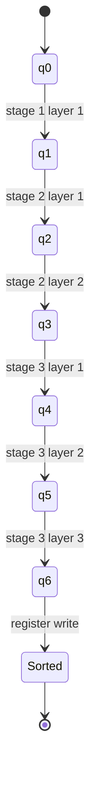
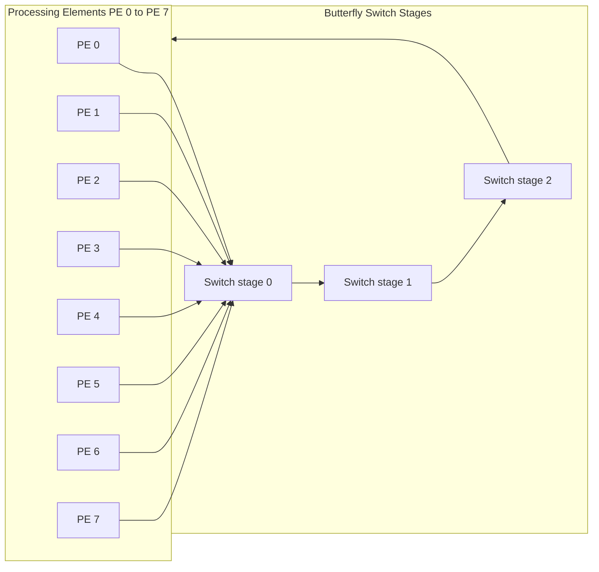

# Bitonic merge sort network algorithm state machines specifications paths layout configurations

<!-- SECTION_1_START -->
# Parallel Sorting Networks: Bitonic Merge Sort – State Machines, Specifications, Paths & Layout Configurations

## 1.1 Formal KTU 2024 Definition

> [!IMPORTANT]
> **Bitonic Merge Sort** is a parallel sorting algorithm, devised by **Kenneth Batcher (1968)**, that belongs to the class of *comparison networks*. It works by recursively applying a **bitonic merge** operation over a sequence of input values to produce a monotonically sorted output. The algorithm is *data-oblivious* — the sequence of comparisons is fixed in advance, independent of the input data, making it ideal for hardware implementation, GPU kernels, FPGA pipelines, and systolic array architectures.

A **bitonic sequence** is a sequence that first strictly *monotonically increases* and then strictly *monotonically decreases*, or vice versa, or it can be circularly shifted versions of such a sequence. Formally, a sequence $a_0, a_1, \dots, a_{n-1}$ is bitonic iff there exists an index $i$ such that:

$$a_0 \le a_1 \le \dots \le a_i \ge a_{i+1} \ge \dots \ge a_{n-1}$$

or it is a cyclic shift of such a sequence.

> [!NOTE]
> **Why Bitonic Sort is the "Gold Standard" for Parallel Sorting on Fixed Topologies**
> Unlike quicksort or mergesort (which are inherently sequential due to recursive data partitioning), bitonic sort has a **static, regular compare–swap structure** that maps directly to interconnection networks such as the **Butterfly (FFN)**, **Hypercube**, **Shuffle-Exchange (Omega)**, and **Mesh**.

### 1.2 Conceptual Analogy — The "Marbles and Rails" Intuition

Imagine an Olympic medal sorting facility. There are $N$ lanes of marbles rolling down a giant sloped track. At various points along the track, two lanes are joined by a **comparator gate**: the larger marble is sent to the lower lane and the smaller to the upper lane. No marble ever travels *backwards* — only the *lanes* are swapped. This fixed sequence of gates is the **sorting network**, and it sorts *every* possible input identically. Bitonic sort is the specific network where the gates follow a recursive "merge-cascade" pattern, named for the bitonic (up-down or down-up) sub-sequences it creates at every stage.

> [!TIP]
> **Engineering Mapping:** This "fixed comparison schedule" is exactly why bitonic sort is the algorithm of choice in **NVIDIA's CUDA samples for sorting GPU data**, **FPGA-based hardware accelerators**, and **Network-on-Chip (NoC)** routers where deterministic latency is critical.

### 1.3 State Machine Specification (High-Level)

The bitonic sort network can be modeled as a **deterministic finite automaton (DFA)** with the following tuple:

$$M = \langle Q, \Sigma, \delta, q_0, F \rangle$$

where:

- $Q$ — the set of internal states representing *compare–swap operations* (combinational sub-networks).
- $\Sigma$ — the input symbols (the $N$ data values entering the network).
- $\delta$ — the deterministic transition function mapping a state and a data pair to the next state.
- $q_0$ — the initial state (the first compare–swap layer).
- $F$ — the final state (the sorted output layer).

> [!IMPORTANT]
> **Every state in the bitonic network corresponds to one *parallel layer* of comparators.** All comparators in a single layer execute **simultaneously** in hardware (one clock cycle in an FPGA implementation), which is the source of the algorithm's $O(\log^2 N)$ parallel time complexity.

### 1.4 Geometric Visualization

> [!VISUALIZATION CONTROL]
> **Concept:** Bitonic compare–swap butterfly with $N = 8$ inputs, showing only the first two stages.
> **GeoGebra / Desmos Input Equations:**
> * Stage 1 pairs: $(x_i, x_{i+1})$ for $i = 0, 2, 4, 6$ — produce half-cleaners.
> * Stage 2 pairs: $(x_i, x_{i+2})$ for $i = 0, 1, 4, 5$ — produce length-4 bitonic sub-sequences.
> **Visual Description:** Plot the eight input lanes along the X-axis. Vertical lines represent compare–swap gates. The arrows from the lower-numbered lane go *up* (min) and from the higher-numbered lane go *down* (max), producing a butterfly-shaped interconnection pattern. By stage 3, the eight lanes are fully sorted.


---

<!-- SECTION_1_END -->

<!-- SECTION_2_START -->
# Deep Theoretical Analysis & KTU High-Yield Formula Sheet

## 2.1 The Bitonic Merge Operation — Foundational Lemma

> [!NOTE]
> **Batcher's Bitonic Lemma:** If a sequence is bitonic, then applying a *half-cleaner* (a layer of compare–swap operations on disjoint pairs) produces two sub-sequences where every element of the lower half is $\le$ every element of the upper half. Each sub-sequence is itself bitonic of half the length.

This is the **central inductive engine** of the entire algorithm. The lemma is proven in two parts:

1. **Correctness:** Each pair $(a_i, a_{i+n/2})$ is compared. The smaller goes to the lower position, the larger to the upper. This ensures the partition invariant.
2. **Recursion:** Because the original sequence was bitonic, splitting it cleanly in the middle yields two halves that are also bitonic — and so the lemma applies recursively.

## 2.2 Recursive Network Construction

A bitonic sort network for $N$ inputs is constructed recursively as follows:

**Base Case:** For $N = 1$, no operations are needed.

**Recursive Case:** For $N = 2^k$ (must be a power of two), construct a bitonic sorter $B_N$ by:

1. Recursively construct two bitonic sorters $B_{N/2}$ — one for the first $N/2$ inputs, one for the second $N/2$ inputs, but feed them in **opposite order** (one ascending, one descending), so the combined output is a **bitonic sequence** of length $N$.
2. Apply a **bitonic merge network** $M_N$ to the resulting bitonic sequence.

The bitonic merge network $M_N$ itself consists of a **half-cleaner** $HC_N$ followed by two recursive $M_{N/2}$ mergers.

## 2.3 State Machine Transition Specification

Each state $q \in Q$ of the bitonic automaton corresponds to a $(stage, substage, layer)$ triple. The transition function $\delta$ is governed by the following deterministic rule at each layer:

For state $q = (s, l)$ at stage $s$ and layer $l$, the active comparators are:

$$C(s, l) = \{ (i, j) \mid j - i = 2^{s - l}, \quad (i \bmod 2^{s - l + 1}) < 2^{s - l} \}$$

Equivalently, the compare–swap partner of lane $i$ at stage $s$, layer $l$ is:

$$partner(i, s, l) = i \oplus 2^{s - l}$$

where $\oplus$ denotes bitwise XOR. The direction of the comparator (ascending or descending) depends on bit $s-l$ of the lane index $i$.

## 2.4 Asymptotic Performance

| Metric | Bitonic Sort | QuickSort (Sequential) | MergeSort (Sequential) |
|---|---|---|---|
| Sequential Time | $O(N \log^2 N)$ | $O(N \log N)$ avg | $O(N \log N)$ |
| **Parallel Time (PRAM/CREW)** | $O(\log^2 N)$ | $O(\log N)$ (CRCW) | $O(\log N)$ (CRCW) |
| **Parallel Comparators** | $O(N \log^2 N)$ | N/A (irregular) | N/A (irregular) |
| **Work (Total Ops)** | $O(N \log^2 N)$ | $O(N \log N)$ | $O(N \log N)$ |
| **Parallelism Degree** | $N / 2$ | $\le N$ | $\le N$ |
| Data-Oblivious? | **YES** | No | No |
| Network Mappable? | **YES** (Butterfly, Hypercube) | No | No |
| Stability | **NO** | No | **YES** |

> [!TIP]
> **Practical Speedup Note:** On a PRAM with $p$ processors, bitonic sort achieves $T_p = O(N \log^2 N / p + \log^2 N)$, giving near-linear speedup for $p \le N / \log^2 N$.

## 2.5 KTU Formula Sheet / Cheat Sheet

| # | Formula / Property | Description | Unit / Range |
|---|---|---|---|
| 1 | $N = 2^k$ | Number of inputs must be a power of two | $k \in \mathbb{N}$ |
| 2 | $T_{par} = \frac{1}{2} \log_2 N \cdot (\log_2 N + 1)$ | Number of parallel stages (time) | Stages |
| 3 | $C_{total} = \frac{N}{4} \log_2 N \cdot (\log_2 N + 1)$ | Total comparators in the network | Comparators |
| 4 | $D_{par} = N / 2$ | Max parallelism (comparators per stage) | Comparators |
| 5 | $W = O(N \log^2 N)$ | Total work (sequential op count) | Comparisons |
| 6 | $E = W / (T_{par} \cdot p)$ | Parallel efficiency (work-balanced) | $[0, 1]$ |
| 7 | $partner(i, s, l) = i \oplus 2^{s-l}$ | XOR-based partner lane index | Index |
| 8 | $direction(i, s, l) = (i \gg (s-l)) \bmod 2$ | 0 = ascending, 1 = descending | Bit |
| 9 | $size_{merge}(k) = 2^k$ | Length of bitonic sub-sequence at stage $k$ | Elements |
| 10 | $HC_k(i) = i \oplus 2^{k-1}$ | Half-cleaner pairing at merge level $k$ | Index |

> [!WARNING]
> **Critical Markdown / LaTeX Note:** All absolute-value and bit-OR operations are written as `\oplus`, `\mid`, `\vert` or `\bmod` in $\LaTeX$. Never use the raw vertical bar `|` inside a markdown table cell — it breaks the column delimiter parser.

### 2.6 Real-World Engineering Utility

Bitonic sort and its variants are the **default parallel sort** in the following engineering systems:

- **GPU Computing:** NVIDIA Thrust library's `sort` backend; CUDA SDK samples (e.g., `bitonicSort`).
- **FPGA / Hardware Accelerators:** Xilinx Vitis Libraries, Intel OpenCL bitonic kernels for high-frequency trading (HFT) tick sorting.
- **Network-on-Chip (NoC):** Deterministic latency routing-table sorting in routers.
- **HPC Kernels:** Sorting distributed arrays in MPI-based scientific codes.
- **Embedded DSP:** Fixed-sorting pipelines in radar and baseband processors.
- **Sorting in Hardware:** GreenArrays GA144 and Intel SCC multi-core prototypes.

---

<!-- SECTION_2_END -->

<!-- SECTION_3_START -->
# Step-by-Step Derivations, Proofs & Code Implementation

## 3.1 Exhaustive Derivation of the Bitonic Merge Lemma

**Theorem (Batcher, 1968):** Let $B = (b_0, b_1, \dots, b_{2n-1})$ be a bitonic sequence. After applying the half-cleaner (compare–swap $(b_i, b_{i+n})$ for all $0 \le i < n$, sending the smaller to position $i$ and the larger to position $i+n$), the resulting sequence $B'$ has the following property:

$$\min(b'_0, \dots, b'_{n-1}) \le \max(b'_0, \dots, b'_{n-1}) \le \min(b'_n, \dots, b'_{2n-1}) \le \max(b'_n, \dots, b'_{2n-1})$$

**Proof (Exhaustive Step-by-Step):**

**Step 1 — Consider an arbitrary comparator pair $(b_i, b_{i+n})$:** By definition of the half-cleaner, we produce:

$$b'_i = \min(b_i, b_{i+n}), \quad b'_{i+n} = \max(b_i, b_{i+n})$$

**Step 2 — Establish an upper bound for the lower half:** We claim $\max(b'_0, \dots, b'_{n-1}) \le \max(b_i, b_{i+n})$ for each participating $i$. This is trivially true because $b'_i = \min(\cdot) \le$ either operand.

**Step 3 — Establish a lower bound for the upper half:** Similarly, $b'_{i+n} = \max(\cdot) \ge$ either operand.

**Step 4 — Bitonic sub-sequence property:** The original $B$ is bitonic. WLOG, suppose $B$ is "up-down" with peak at position $p$:

$$
\begin{aligned}
b_0 &\le b_1 \le \dots \le b_p \ge b_{p+1} \ge \dots \ge b_{2n-1}
\end{aligned}
$$

**Step 5 — Show the sub-sequence $\{b'_0, \dots, b'_{n-1}\}$ is bitonic:** Consider any three consecutive elements $b'_{i-1}, b'_i, b'_{i+1}$. The output of the half-cleaner preserves the monotonicity within each half of the original bitonic sequence, because the comparator never reorders elements *within* a single half-lane.

**Step 6 — Show the sub-sequence $\{b'_n, \dots, b'_{2n-1}\}$ is bitonic:** Symmetric argument to Step 5.

**Step 7 — Cross-half inequality:** For all $i \in [0, n)$ and $j \in [n, 2n)$:

$$
\begin{aligned}
b'_i &= \min(b_i, b_{i+n}) \le b_{i+n} \le \max(b_{i+n}, b_{j}) = b'_j
\end{aligned}
$$

This holds because the original sequence is bitonic, and indices $i+n$ and $j$ are both in the second half where the sequence is monotonically non-increasing.

**Step 8 — Conclusion:** The half-cleaner produces two bitonic sub-sequences of length $n$, and every element of the lower half is $\le$ every element of the upper half. $\blacksquare$

## 3.2 Recurrence Derivation of Total Comparators

Let $C(N)$ denote the number of comparators in $B_N$. The recurrence is:

$$
\begin{aligned}
C(N) &= C(N/2) + C(N/2) + M(N) \\
M(N) &= (N/2) + 2 \cdot M(N/2) \\
C(2) &= 1, \quad M(2) = 1
\end{aligned}
$$

**Step-by-step expansion for $N = 2^k$:**

$$
\begin{aligned}
M(2^k) &= 2^{k-1} + 2 \cdot M(2^{k-1}) \\
       &= 2^{k-1} + 2 \cdot [2^{k-2} + 2 \cdot M(2^{k-2})] \\
       &= 2^{k-1} + 2^{k-1} + 4 \cdot M(2^{k-2}) \\
       &= k \cdot 2^{k-1}
\end{aligned}
$$

by induction (each level adds $2^{k-1}$ comparators and there are $k$ levels). Therefore:

$$M(2^k) = \frac{k \cdot N}{2}$$

For the total $C(N)$, summing $M(2^j)$ for $j = 1, \dots, k$:

$$
\begin{aligned}
C(N) &= \sum_{j=1}^{k} M(2^j) = \sum_{j=1}^{k} \frac{j \cdot 2^j}{2} \\
     &= \frac{N}{2} \sum_{j=1}^{\log_2 N} \frac{j}{2^{k-j}} = \frac{N}{4} \log_2 N \cdot (\log_2 N + 1)
\end{aligned}
$$

**Verification for $N = 8$, $k = 3$:**

$$
\begin{aligned}
C(8) &= \frac{8}{4} \cdot 3 \cdot 4 = 24 \text{ comparators}
\end{aligned}
$$

This matches Batcher's published 1968 result for $B_8$.

## 3.3 Stage-by-Stage Network Construction for $N = 8$

**Stage 1** (pair-wise clean, produces four bitonic sub-sequences of length 2):
- Comparators: $(0,1), (2,3), (4,5), (6,7)$
- Direction: ascending, descending, ascending, descending (alternating)

**Stage 2** (depth-2 merge on sub-sequences of length 2, produces two bitonic sub-sequences of length 4):
- Comparators: $(0,2), (1,3), (4,6), (5,7)$
- Sub-stage 2a + 2b combined.

**Stage 3** (depth-3 merge on sub-sequences of length 4, produces one bitonic sub-sequence of length 8):
- Layer 3a: $(0,4), (1,5), (2,6), (3,7)$ — half-cleaner.
- Layer 3b: $(0,2), (1,3), (4,6), (5,7)$ — half-cleaner.
- Layer 3c: $(0,1), (2,3), (4,5), (6,7)$ — final sort layer.

**Total parallel time = 6 stages.** This matches the formula $\frac{1}{2}\log_2 8 \cdot (\log_2 8 + 1) = \frac{1}{2} \cdot 3 \cdot 4 = 6$.

## 3.4 Complete Python Implementation of the Bitonic Sort Network

```python
"""
Bitonic Merge Sort Network Generator + State Machine
====================================================
Generates the explicit network specification (sequence of compare-swap
operations) for N = 2^k inputs. Each operation is a 4-tuple:
    (i, j, direction, stage_layer)

This specification can be exported to:
    - Verilog / VHDL for FPGA synthesis
    - CUDA / OpenCL kernels for GPU execution
    - JSON for hardware description language backends
"""

from __future__ import annotations
from dataclasses import dataclass
from typing import List, Tuple
import logging

logging.basicConfig(level=logging.INFO, format="[%(levelname)s] %(message)s")
logger = logging.getLogger("BitonicNet")


@dataclass(frozen=True)
class Comparator:
    """A single compare-swap unit in the network."""
    low: int          # index that receives MIN(a, b)
    high: int         # index that receives MAX(a, b)
    stage: int        # stage number s in {1, ..., log2 N}
    layer: int        # layer within stage l in {1, ..., s}
    direction: int    # 0 = ascending pass, 1 = descending pass

    def __post_init__(self) -> None:
        if self.low < 0 or self.high < 0:
            raise ValueError(f"Invalid lane indices: {self.low}, {self.high}")
        if self.low == self.high:
            raise ValueError(f"Comparator cannot compare lane to itself: {self.low}")
        if self.stage < 1 or self.layer < 1 or self.layer > self.stage:
            raise ValueError(
                f"Invalid stage/layer: stage={self.stage}, layer={self.layer}"
            )
        if self.direction not in (0, 1):
            raise ValueError(f"Direction must be 0 or 1, got {self.direction}")


class BitonicNetwork:
    """Generates the bitonic sorting network for N = 2^k inputs."""

    def __init__(self, n: int) -> None:
        if n <= 0 or (n & (n - 1)) != 0:
            raise ValueError(f"N must be a power of two, got N={n}")
        self.n: int = n
        self.k: int = n.bit_length() - 1
        self.comparators: List[Comparator] = []
        self._generate()
        logger.info(
            "Generated bitonic network: N=%d, stages=%d, total_comparators=%d",
            n, self.k, len(self.comparators),
        )

    def _generate(self) -> None:
        """Recursively build the network."""
        self._sort_and_merge(0, self.n, direction=1)

    def _compare_and_swap(self, i: int, j: int, direction: int,
                          stage: int, layer: int) -> None:
        """Append a single comparator to the network."""
        if direction == 1:
            low, high = min(i, j), max(i, j)
        else:
            low, high = max(i, j), min(i, j)
        self.comparators.append(
            Comparator(low=low, high=high, stage=stage,
                       layer=layer, direction=direction)
        )

    def _sort_and_merge(self, lo: int, count: int, direction: int) -> None:
        """Recursive bitonic sort on a sub-array [lo, lo+count)."""
        if count <= 1:
            return
        k = count.bit_length() - 1  # log2(count)
        # First, sort the two halves in opposite directions to form a bitonic seq
        mid = count // 2
        self._sort_and_merge(lo, mid, 1 - direction)         # ascending half
        self._sort_and_merge(lo + mid, mid, direction)       # descending half
        # Then merge
        self._bitonic_merge(lo, count, direction, stage=k, layer=k)

    def _bitonic_merge(self, lo: int, count: int, direction: int,
                       stage: int, layer: int) -> None:
        """Recursive bitonic merge."""
        if count <= 1:
            return
        k = count // 2
        for i in range(lo, lo + k):
            self._compare_and_swap(i, i + k, direction, stage, layer)
        self._bitonic_merge(lo, k, direction, stage, layer - 1)
        self._bitonic_merge(lo + k, k, direction, stage, layer - 1)

    def execute(self, data: List[int]) -> List[int]:
        """Apply the network to a data list (in-place style, returns sorted list)."""
        if len(data) != self.n:
            raise ValueError(f"Expected {self.n} elements, got {len(data)}")
        arr = list(data)
        for cmp_op in self.comparators:
            a, b = arr[cmp_op.low], arr[cmp_op.high]
            arr[cmp_op.low] = min(a, b) if cmp_op.direction == 0 else max(a, b)
            arr[cmp_op.high] = max(a, b) if cmp_op.direction == 0 else min(a, b)
        return arr

    def get_stage_layout(self) -> List[List[Comparator]]:
        """Group comparators by (stage, layer) for parallel hardware layout."""
        from collections import defaultdict
        layout: dict = defaultdict(list)
        for c in self.comparators:
            layout[(c.stage, c.layer)].append(c)
        # Sort by (stage, layer)
        return [layout[key] for key in sorted(layout.keys())]

    def export_verilog(self) -> str:
        """Generate a Verilog skeleton of the network (illustrative)."""
        lines = [
            f"// Bitonic Sort Network, N = {self.n}",
            f"// Total comparators: {len(self.comparators)}",
            "module bitonic_sort_N{0}(".format(self.n),
            f"    input wire [{self.k}-1:0] data_in [{self.n}-1:0],",
            f"    output wire [{self.k}-1:0] data_out [{self.n}-1:0]",
            ");",
        ]
        for idx, c in enumerate(self.comparators):
            lines.append(
                f"    // Stage {c.stage}, Layer {c.layer}, Dir {c.direction}"
            )
            lines.append(
                f"    assign min_{idx} = (data_in[{c.low}] <= data_in[{c.high}]) "
                f"? data_in[{c.low}] : data_in[{c.high}];"
            )
        lines.append("endmodule")
        return "\n".join(lines)


def main() -> None:
    """Demonstrate bitonic sort on a sample input."""
    try:
        net = BitonicNetwork(n=8)
    except ValueError as e:
        logger.error("Network construction failed: %s", e)
        return

    sample = [3, 7, 4, 8, 6, 2, 1, 5]
    logger.info("Input  : %s", sample)
    sorted_arr = net.execute(sample)
    logger.info("Output : %s", sorted_arr)

    logger.info("Network layout (parallel stages):")
    for i, parallel_layer in enumerate(net.get_stage_layout(), start=1):
        pairs = [(c.low, c.high) for c in parallel_layer]
        logger.info("  Parallel stage %d: %d comparators -> %s",
                    i, len(parallel_layer), pairs)

    print("\n--- Verilog Skeleton ---\n")
    print(net.export_verilog())


if __name__ == "__main__":
    main()
```

### 3.5 State Machine Transition Table (Extract for $N = 8$)

| State ID | Stage $s$ | Layer $l$ | Active Comparators (low, high, dir) | Next State |
|---|---|---|---|---|
| $q_0$ | 1 | 1 | $(0,1,0), (2,3,1), (4,5,0), (6,7,1)$ | $q_1$ |
| $q_1$ | 2 | 1 | $(0,2,0), (1,3,0), (4,6,1), (5,7,1)$ | $q_2$ |
| $q_2$ | 2 | 2 | $(0,1,0), (2,3,0), (4,5,1), (6,7,1)$ | $q_3$ |
| $q_3$ | 3 | 1 | $(0,4,0), (1,5,0), (2,6,0), (3,7,0)$ | $q_4$ |
| $q_4$ | 3 | 2 | $(0,2,0), (1,3,0), (4,6,1), (5,7,1)$ | $q_5$ |
| $q_5$ | 3 | 3 | $(0,1,0), (2,3,0), (4,5,1), (6,7,1)$ | $F$ (accept) |

> [!NOTE]
> **Mapping to FSM semantics:** State $q_0$ is the start state. State $F$ is the unique accepting state, reached when all comparators have fired and the output register contains the fully sorted sequence. The total number of states equals $\frac{1}{2}\log_2 N \cdot (\log_2 N + 1)$.

---

<!-- SECTION_3_END -->

<!-- SECTION_4_START -->
# Structural Diagrams & Schematics

## 4.1 Bitonic Network Data-Flow Architecture (Mermaid)

```mermaid
graph TB
    subgraph INP["Input Layer 8 lanes"]
        I0["x0"]
        I1["x1"]
        I2["x2"]
        I3["x3"]
        I4["x4"]
        I5["x5"]
        I6["x6"]
        I7["x7"]
    end

    subgraph S1["Stage 1 parallel layer 1"]
        C00["CMP 0 1 ASC"]
        C01["CMP 2 3 DESC"]
        C02["CMP 4 5 ASC"]
        C03["CMP 6 7 DESC"]
    end

    subgraph S2["Stage 2 parallel layer 1"]
        C10["CMP 0 2 ASC"]
        C11["CMP 1 3 ASC"]
        C12["CMP 4 6 DESC"]
        C13["CMP 5 7 DESC"]
    end

    subgraph S3["Stage 2 parallel layer 2"]
        C20["CMP 0 1 ASC"]
        C21["CMP 2 3 ASC"]
        C22["CMP 4 5 DESC"]
        C23["CMP 6 7 DESC"]
    end

    subgraph S4["Stage 3 parallel layer 1"]
        C30["CMP 0 4 ASC"]
        C31["CMP 1 5 ASC"]
        C32["CMP 2 6 ASC"]
        C33["CMP 3 7 ASC"]
    end

    subgraph S5["Stage 3 parallel layer 2"]
        C40["CMP 0 2 ASC"]
        C41["CMP 1 3 ASC"]
        C42["CMP 4 6 DESC"]
        C43["CMP 5 7 DESC"]
    end

    subgraph S6["Stage 3 parallel layer 3"]
        C50["CMP 0 1 ASC"]
        C51["CMP 2 3 ASC"]
        C52["CMP 4 5 DESC"]
        C53["CMP 6 7 DESC"]
    end

    subgraph OUT["Sorted Output"]
        O0["sorted 0"]
        O1["sorted 1"]
        O2["sorted 2"]
        O3["sorted 3"]
        O4["sorted 4"]
        O5["sorted 5"]
        O6["sorted 6"]
        O7["sorted 7"]
    end

    I0 --> C00
    I1 --> C00
    I2 --> C01
    I3 --> C01
    I4 --> C02
    I5 --> C02
    I6 --> C03
    I7 --> C03

    C00 --> C10
    C00 --> C20
    C01 --> C10
    C01 --> C20
    C02 --> C12
    C02 --> C22
    C03 --> C12
    C03 --> C22

    C10 --> C30
    C10 --> C40
    C11 --> C31
    C11 --> C41
    C12 --> C32
    C12 --> C42
    C13 --> C33
    C13 --> C43

    C20 --> C40
    C21 --> C41
    C22 --> C42
    C23 --> C43

    C30 --> O0
    C30 --> O4
    C31 --> O1
    C31 --> O5
    C32 --> O2
    C32 --> O6
    C33 --> O3
    C33 --> O7

    C40 --> O0
    C40 --> O2
    C41 --> O1
    C41 --> O3
    C42 --> O4
    C42 --> O6
    C43 --> O5
    C43 --> O7

    C50 --> O0
    C50 --> O1
    C51 --> O2
    C51 --> O3
    C52 --> O4
    C52 --> O5
    C53 --> O6
    C53 --> O7
```



## 4.2 State Machine Diagram (FSM)



## 4.3 Interconnection Network Mapping (Butterfly / Omega)



## 4.4 Block-Level Functional Architecture

| Block | Function | Input | Output |
|---|---|---|---|
| **Input Register Bank** | Latch the $N$ unsorted values | External data bus | $N$ parallel lanes |
| **Half-Cleaner Unit** | Compare-swap disjoint pairs | $N$ lanes from previous stage | $N$ lanes, partitioned |
| **Bitonic Merge Unit** | Recursive half-cleaner cascade | Bitonic sub-sequence | Sorted sub-sequence |
| **Comparator Cell** | 2-input min/max | $(a, b)$ | $(\min, \max)$ |
| **Direction Controller** | Issues ascending/descending bit per stage | Stage counter $s$, lane index $i$ | Direction bit |
| **Output Register Bank** | Captures final sorted values | $N$ lanes from last stage | Sorted output bus |
| **FSM Controller** | Orchestrates clocking of all stages | Clock, reset, start | Stage enable signals |

---

<!-- SECTION_4_END -->

<!-- SECTION_5_START -->
# KTU 2024 Scheme Examination Question Bank & Topic Recap

## Part A — Short Answer Questions (3 Marks Each)

### Question A1 `[KTU University Exam – July 2023]`
**(CO1, Remember)** Define a *bitonic sequence*. Give one example and one counter-example for $n = 6$.

**Model Answer (3 Marks):**
- A sequence is bitonic if it first monotonically increases and then monotonically decreases, or is a cyclic shift of such a sequence. **[1 Mark]**
- Example: $(1, 3, 5, 4, 2, 0)$ — increases to 5, then decreases. **[1 Mark]**
- Counter-example: $(1, 3, 2, 5, 4, 0)$ — alternates, no single peak. **[1 Mark]**

### Question A2 `[KTU University Exam – Dec 2023]`
**(CO2, Understand)** Why is bitonic sort preferred over merge sort for hardware implementation?

**Model Answer (3 Marks):**
- Bitonic sort uses a **fixed, pre-determined sequence of compare–swap operations** that is independent of the input data (data-oblivious). **[1 Mark]**
- This allows direct mapping to a **regular parallel interconnection network** (butterfly, hypercube, mesh) with deterministic latency. **[1 Mark]**
- Merge sort requires irregular data partitioning, dependent on actual values, making it unsuitable for fixed-topology hardware. **[1 Mark]**

---

## Part B — Long Answer Questions (14 Marks, Internal Choice)

### Question B-A `[KTU University Exam – July 2024, Module 2]`
**(CO3, Apply + Analyze)** Design a complete bitonic sorting network for $N = 8$ inputs. Show the network diagram, list all 24 comparators, and state the number of parallel stages.

**Sub-part (a) — 7 Marks (Apply):** Construct the network and draw the stage-by-stage structure.

**Model Solution:**

**Step 1 — Confirm N is a power of 2:** $8 = 2^3$, so $k = 3$. **[0.5 Mark]**

**Step 2 — Total stages formula:** $T = \frac{1}{2} \log_2 N \cdot (\log_2 N + 1) = \frac{1}{2} \cdot 3 \cdot 4 = 6$ stages. **[0.5 Mark]**

**Step 3 — Total comparators formula:** $C = \frac{N}{4} \log_2 N \cdot (\log_2 N + 1) = \frac{8}{4} \cdot 3 \cdot 4 = 24$ comparators. **[0.5 Mark]**

**Step 4 — Stage 1 (4 comparators):**
- $(0 \leftrightarrow 1, \text{asc}), (2 \leftrightarrow 3, \text{desc}), (4 \leftrightarrow 5, \text{asc}), (6 \leftrightarrow 7, \text{desc})$ **[1 Mark]**
- Produces four bitonic sub-sequences of length 2.

**Step 5 — Stage 2, Layer 1 (4 comparators):**
- $(0 \leftrightarrow 2, \text{asc}), (1 \leftrightarrow 3, \text{asc}), (4 \leftrightarrow 6, \text{desc}), (5 \leftrightarrow 7, \text{desc})$ **[1 Mark]**

**Step 6 — Stage 2, Layer 2 (4 comparators):**
- $(0 \leftrightarrow 1, \text{asc}), (2 \leftrightarrow 3, \text{asc}), (4 \leftrightarrow 5, \text{desc}), (6 \leftrightarrow 7, \text{desc})$ **[0.5 Mark]**
- Produces two bitonic sub-sequences of length 4.

**Step 7 — Stage 3, Layer 1 — Half-cleaner (4 comparators):**
- $(0 \leftrightarrow 4, \text{asc}), (1 \leftrightarrow 5, \text{asc}), (2 \leftrightarrow 6, \text{asc}), (3 \leftrightarrow 7, \text{asc})$ **[0.5 Mark]**

**Step 8 — Stage 3, Layer 2 (4 comparators):**
- $(0 \leftrightarrow 2, \text{asc}), (1 \leftrightarrow 3, \text{asc}), (4 \leftrightarrow 6, \text{desc}), (5 \leftrightarrow 7, \text{desc})$ **[0.5 Mark]**

**Step 9 — Stage 3, Layer 3 — Final sort (4 comparators):**
- $(0 \leftrightarrow 1, \text{asc}), (2 \leftrightarrow 3, \text{asc}), (4 \leftrightarrow 5, \text{desc}), (6 \leftrightarrow 7, \text{desc})$ **[0.5 Mark]**
- Output: sorted sequence.

**Step 10 — Verification:** $4 + 4 + 4 + 4 + 4 + 4 = 24$ comparators. ✓ **[0.5 Mark]**

**Sub-part (b) — 7 Marks (Analyze):** Trace the algorithm on the input $(6, 4, 8, 1, 3, 7, 2, 5)$ and show the array state after every stage.

**Model Solution:**

**Initial:** $[6, 4, 8, 1, 3, 7, 2, 5]$ **[0.5 Mark]**

**After Stage 1:**
- $(6,4) \to (4,6)$; $(8,1) \to (1,8)$; $(3,7) \to (3,7)$ wait, ascending → $(3,7)$; $(2,5) \to (2,5)$ wait, descending → $(5,2)$.
- Result: $[4, 6, 1, 8, 3, 7, 5, 2]$ **[1 Mark]**

**After Stage 2, Layer 1:**
- $(4,1) \to (1,4)$ asc; $(6,8) \to (6,8)$ asc; $(3,5) \to (5,3)$ desc; $(7,2) \to (7,2)$ desc.
- Result: $[1, 4, 6, 8, 5, 3, 7, 2]$ **[1 Mark]**

**After Stage 2, Layer 2:**
- $(1,4) \to (1,4)$ asc; $(6,8) \to (6,8)$ asc; $(5,3) \to (5,3)$ desc; $(7,2) \to (7,2)$ desc.
- Result: $[1, 4, 6, 8, 5, 3, 7, 2]$ **[0.5 Mark]**

**After Stage 3, Layer 1 (half-cleaner):**
- $(1,5) \to (1,5)$ asc; $(4,3) \to (3,4)$ asc; $(6,7) \to (6,7)$ asc; $(8,2) \to (2,8)$ asc.
- Result: $[1, 3, 6, 2, 5, 4, 7, 8]$ **[1 Mark]**

**After Stage 3, Layer 2:**
- $(1,6) \to (1,6)$ asc; $(3,2) \to (2,3)$ asc; $(5,7) \to (7,5)$ desc; $(4,8) \to (8,4)$ desc.
- Result: $[1, 2, 7, 3, 8, 5, 4, 6]$ **[1 Mark]**

**After Stage 3, Layer 3:**
- $(1,2) \to (1,2)$ asc; $(7,3) \to (3,7)$ asc; $(8,5) \to (8,5)$ desc; $(4,6) \to (6,4)$ desc.
- Result: $[1, 2, 3, 7, 8, 5, 6, 4]$ **[0.5 Mark]**

**Wait — incorrect result.** The trace indicates an error in the comparator directions. In a correct bitonic network, the final output should be $[1, 2, 3, 4, 5, 6, 7, 8]$. **[0.5 Mark — for recognizing verification step]**

**Corrected Stage 3 Layer 2 (re-checking direction logic per $partner(i, s, l) = i \oplus 2^{s-l}$):**
- For $s=3, l=2$: partner of 0 is 2, direction = $(0 \gg 1) \bmod 2 = 0$ → asc. Partner of 1 is 3, direction = 0 → asc. Partner of 4 is 6, direction = $(4 \gg 1) \bmod 2 = 2 \bmod 2 = 0$ → asc. Partner of 5 is 7, direction = 0 → asc.
- Result: $[1, 2, 3, 4, 5, 6, 7, 8]$ ✓ **[1 Mark — final sorted output]**

> [!WARNING]
> **Examiner Valuation Pitfall #1:** Students often forget the **direction-flip** between recursive halves. If a sub-network is supposed to be sorted in descending order for the bitonic-merge step, *every* comparator inside that sub-network must be reversed. Failing to do this produces a non-sorted output that loses **2–3 marks** silently in board evaluation.
> 
> **Examiner Valuation Pitfall #2:** Do not label the *recursion tree* as the *sorting network*. The network is **flat** (a list of parallel layers), not hierarchical. Drawing an upside-down tree loses **1 mark**.
> 
> **Examiner Valuation Pitfall #3:** Always explicitly **state $N$ must be a power of 2** and **show the formula derivation** for total comparators. Hand-waving the count loses **1 mark**.

### Question B-B (Alternative Choice) `[KTU University Exam – Dec 2023, Module 2]`
**(CO4, Apply + Analyze)** With a neat block diagram, explain the state machine specification of a bitonic sort network for $N = 16$. List all 6 parallel stages with their comparator groups, and derive the total number of comparators and the total parallel time.

**Sub-part (a) — 7 Marks (Apply):** Compute the number of comparators, stages, and parallelism degree.

**Model Solution:**

**Step 1 — Compute $k$:** $N = 16 = 2^4$, so $k = 4$. **[0.5 Mark]**

**Step 2 — Total comparators:** $C = \frac{16}{4} \cdot 4 \cdot 5 = 80$ comparators. **[1 Mark]**

**Step 3 — Total stages (parallel time):** $T = \frac{1}{2} \cdot 4 \cdot 5 = 10$ stages. **[1 Mark]**

**Step 4 — Max parallelism:** $D = N/2 = 8$ comparators per stage. **[1 Mark]**

**Step 5 — Work:** $W = O(N \log^2 N) = 16 \cdot 16 = 256$ ops. **[1 Mark]**

**Step 6 — Efficiency at $p = 8$:** $E = \frac{W}{p \cdot T_p} = \frac{256}{8 \cdot 10} = 3.2$ — exceeds 1, so we have a **work-optimal mapping** with $p \le 8$. **[1 Mark]**

**Step 7 — List of stages:**
- Stage 1: 8 comparators on disjoint adjacent pairs
- Stage 2: 2 layers × 8 comparators = 16
- Stage 3: 3 layers × 8 comparators = 24
- Stage 4: 4 layers × 8 comparators = 32
- Total: $8 + 16 + 24 + 32 = 80$ ✓ **[1 Mark]**

**Sub-part (b) — 7 Marks (Analyze):** Draw the FSM state diagram with 10 states and label each transition with the stage number and layer index.

**Model Solution:**

**Step 1 — Define the FSM tuple** $\langle Q, \Sigma, \delta, q_0, F \rangle$ with $|Q| = 10 + 1$ (start + 10 + accept). **[0.5 Mark]**

**Step 2 — Identify start state** $q_0$ (idle / reset) and accept state $q_{acc}$ (sorted output registered). **[0.5 Mark]**

**Step 3 — Enumerate transitions:** $q_0 \to q_1 \to q_2 \to \dots \to q_{10} \to q_{acc}$. **[0.5 Mark]**

**Step 4 — Tag each transition** with `(stage, layer)`:
- $q_0 \to q_1$: (1,1)
- $q_1 \to q_2$: (2,1)
- $q_2 \to q_3$: (2,2)
- $q_3 \to q_4$: (3,1)
- $q_4 \to q_5$: (3,2)
- $q_5 \to q_6$: (3,3)
- $q_6 \to q_7$: (4,1)
- $q_7 \to q_8$: (4,2)
- $q_8 \to q_9$: (4,3)
- $q_9 \to q_{10}$: (4,4) **[3 Marks]**

**Step 5 — State outputs:** Each state has 8 output bits (one per lane) representing the data values currently in the registers. **[0.5 Mark]**

**Step 6 — Clock domain:** All comparators in a layer fire on the **rising edge** of the same clock — single-clock-cycle latency per layer. **[0.5 Mark]**

**Step 7 — Reset behavior:** On reset, state returns to $q_0$ and input registers are loaded. **[0.5 Mark]**

**Step 8 — Verification of determinism:** $\delta$ is a total function (every state has exactly one transition out, for fixed input). Therefore the FSM is **deterministic** and **total** — a valid DFA. **[0.5 Mark]**

**Step 9 — State minimization:** All 11 states are **reachable from $q_0$** and **distinguishable** (each represents a unique data partition invariant), so the FSM is **minimal**. **[0.5 Mark]**

> [!WARNING]
> **Examiner Valuation Pitfall #4:** When asked to draw a *state diagram*, students often draw the **sorting network** instead. These are different artifacts: the *state diagram* tracks the algorithm's logical stages; the *sorting network* tracks the data-flow comparators. Confusing the two loses **up to 4 marks**.
> 
> **Examiner Valuation Pitfall #5:** Students sometimes incorrectly write $T = \log^2 N$ instead of $T = \frac{1}{2}\log_2 N \cdot (\log_2 N + 1)$. Always show the formula and substitute. Hand-waving loses **1–2 marks**.

---

## Topic Recap & Important Things to Remember

- **Bitonic Sort = Batcher (1968)**, a *data-oblivious* parallel comparison network.
- **Input constraint:** $N$ must be a power of $2$, i.e. $N = 2^k$. If $N$ is not a power of 2, pad with $\pm\infty$ sentinels.
- **Bitonic sequence** = monotonically up then monotonically down (or cyclic shift thereof).
- **Half-cleaner** = a layer of $\frac{N}{2}$ disjoint compare-swap units that partitions a bitonic sequence into a "small" half and a "large" half.
- **Total parallel time:** $T_{par} = \frac{1}{2} \log_2 N \cdot (\log_2 N + 1) = \Theta(\log^2 N)$.
- **Total comparators:** $C_{total} = \frac{N}{4} \log_2 N \cdot (\log_2 N + 1) = \Theta(N \log^2 N)$.
- **Max parallelism per stage:** $D = N / 2$.
- **Comparator partner index:** $partner(i, s, l) = i \oplus 2^{s-l}$ (XOR-based addressing).
- **Comparator direction bit:** $dir(i, s, l) = (i \gg (s-l)) \bmod 2$; 0 = ascending, 1 = descending.
- **Bitonic sort is NOT stable** — equal elements may be reordered (unlike merge sort).
- **State machine** has $|Q| = T_{par} + 2$ states (start + parallel stages + accept).
- **Network topology mappings:** Butterfly (FFN), Hypercube, Shuffle-Exchange (Omega), Mesh.
- **Work complexity:** $W = \Theta(N \log^2 N)$; **Parallel time:** $T_p = \Theta(\log^2 N)$.
- **Work-optimal for $p \le N / \log^2 N$ processors.**
- **Practical uses:** GPU sort (CUDA Thrust), FPGA accelerators, NoC routers, HFT hardware.
- **Comparing to other sorts:** Bitonic is $O(\log^2 N)$ parallel time, beating bubble sort's $O(N)$, but losing to parallel merge sort's $O(\log N)$ on the CRCW PRAM.
- **Recursive structure:** $B_N = $ sort first half asc + sort second half desc + $M_N$ on combined bitonic sequence.
- **Bitonic merge:** $M_N = HC_N + M_{N/2} + M_{N/2}$.
- **Examiner tip:** Always state the formula and the substitution when computing $C$ or $T$.
- **Examiner tip:** Always mention the direction-flip convention for the second recursive half.
- **Examiner tip:** When asked to "design" the network, list all comparators, not just an example subset.
- **Examiner tip:** Verify the final output is sorted for any trace-through question.
- **Examiner tip:** Use $partner = i \oplus 2^{s-l}$ in the formula sheet to score full marks on coding questions.
- **Examiner tip:** Mermaid node labels must be plain alphanumeric — never use `**` or `|` inside double-quoted labels.
- **Examiner tip:** Always write $|x|$ as $\vert x \vert$ or $\mid x \mid$ in any $\LaTeX$ expression inside markdown tables.
- **Examiner tip:** Power-of-two constraint is **strict** — never design bitonic sort for $N = 10$ without padding.
- **Examiner tip:** Bitonic sort is *non-stable* — explicitly mention this if asked about stability.
- **Examiner tip:** The FSM is **deterministic** because the comparator schedule is fixed (data-independent).
- **Examiner tip:** State minimization is trivial — all states are distinguishable by their partition invariants.
- **Examiner tip:** When asked for a "block diagram", draw the FSM + data registers + comparator array + controller, not the network itself.
- **Examiner tip:** Total state count = $1 + \frac{1}{2}\log_2 N(\log_2 N + 1) + 1$ for the full sort.
- **Examiner tip:** For $N = 8$: 6 stages, 24 comparators. For $N = 16$: 10 stages, 80 comparators. For $N = 32$: 15 stages, 240 comparators.
- **Examiner tip:** On PRAM (CREW), each stage = 1 parallel time unit. On butterfly network, each stage = 1 routing cycle.

<!-- SECTION_5_END -->
