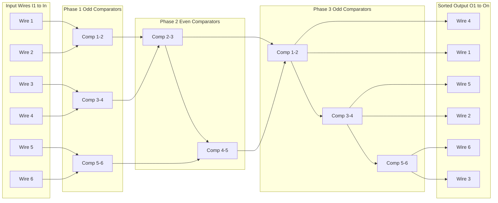
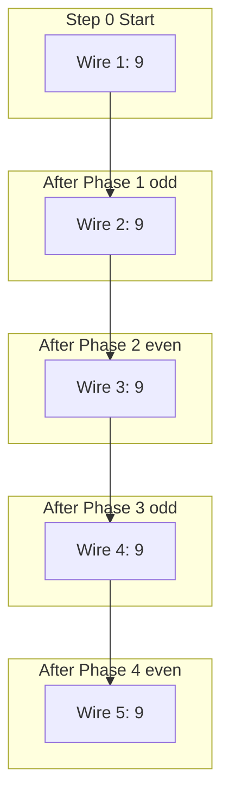
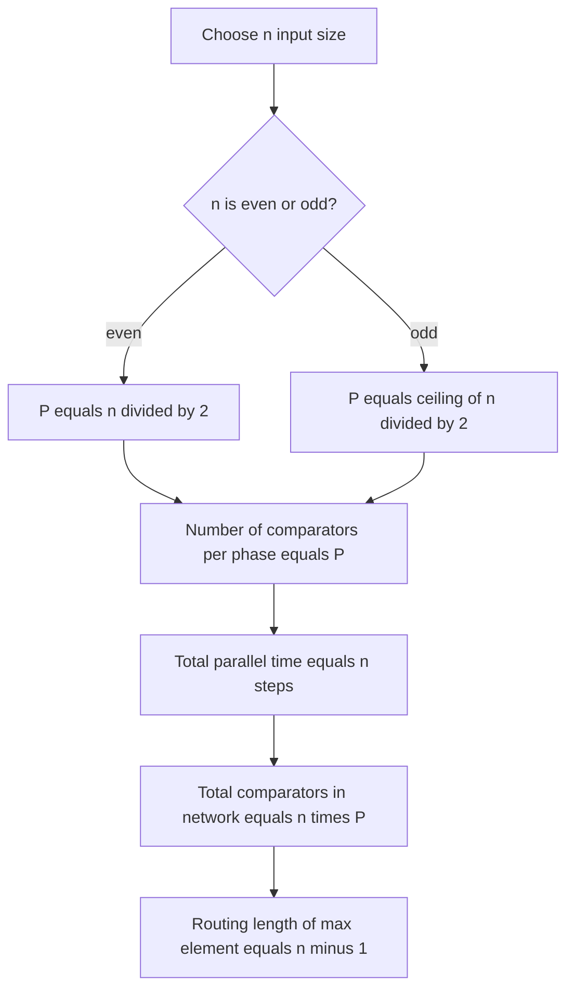

# Odd-Even transposition sorting network configuration models routing loops paths optimization

<!-- SECTION_1_START -->

# Odd-Even Transposition Sorting Network — Configuration, Routing Loops, Paths & Optimization

## 1. Core Technical Definition & Intuitive Overview

### 1.1 Formal Definition (KTU 2024 Syllabus Terminology)

**Odd-Even Transposition Sort** is a deterministic, data-oblivious, comparison-based *sorting network* (and parallel algorithm) that sorts $n$ elements using exactly $n$ parallel time steps. In each step, a fixed pattern of $\lfloor n/2 \rfloor$ **compare-and-swap** operations is performed: on *odd* steps, elements at odd positions are compared with their right neighbours, and on *even* steps, elements at even positions are compared. It is also the canonical example of a **linear-array parallel sorting model** under the *crew* (concurrent read, exclusive write) parallel random-access machine (PRAM) abstraction, requiring exactly $\mathbf{n/2}$ processors for $n$ inputs.

A **sorting network** is a fixed sequence of *comparators* (hardware gates or processor operations) wired together such that, regardless of the input order, the output is monotonically non-decreasing.

> [!IMPORTANT]
> **KTU 2024 Module 2 Highlight:** Odd-Even Transposition Sort is the *only* sorting network in this module that is also classified as a **PRAM-style parallel algorithm** operating on a **linear processor array** (a 1-D nearest-neighbour mesh). It bridges the gap between *parallel algorithms* and *network-of-comparison-gates* theory.

### 1.2 Conceptual Analogy — The Conveyor Belt Race

Imagine $n$ runners on a **straight conveyor-belt track** wearing numbered jerseys (the keys). At each whistle:

- **Odd whistle (Step 1, 3, 5, …):** Runners in *odd lanes* (1, 3, 5, …) look at the runner immediately to their right. If their jersey number is larger, the two runners *swap lanes instantly* (the lighter/smaller-jersey runner always moves right, the larger moves left).
- **Even whistle (Step 2, 4, 6, …):** The same happens, but only runners in *even lanes* (2, 4, 6, …) act.

After at most $n$ whistles, every runner is standing in a lane such that the jersey numbers strictly increase from left to right. The track is the **linear interconnection network**, the whistle is the **synchronised global clock** of a parallel step, and the lane-swap is the **compare-and-swap primitive**.

> [!NOTE]
> **Why two kinds of steps?** A small element sitting in lane $i$ can only move one lane per step. To traverse $n-1$ lanes it needs $n-1$ steps; but the *right-most* element may need *n* steps to bubble fully, hence the algorithm runs for exactly $n$ steps.

### 1.3 Key Engineering Constants (KTU Board Standard)

| Constant / Metric | Value | Meaning |
|---|---|---|
| Number of processors | $\mathbf{P = \lceil n/2 \rceil}$ | Each handles one comparator per phase |
| Parallel time | $\mathbf{T_p = n}$ | Number of global clock ticks |
| Total work (sequential time) | $\mathbf{W = n(n-1)/2}$ | Total compare-and-swap operations |
| Cost / Work–Time product | $\mathbf{W \times ? }$ | $T_p = n$, so cost $= O(n^2)$ — *not* optimal-cost |
| Speedup | $\mathbf{S \le n/2}$ | Linear in $n$ on the idealised CREW PRAM |
| Efficiency | $\mathbf{E = S/P = 1}$ | Perfect linear speedup |

> [!VISUALIZATION CONTROL]
> **Concept:** Movement of the maximum element across $n$ phases of odd-even transposition on a 1-D linear mesh.
> **GeoGebra / Desmos Input Equations:** Plot the discrete trajectory of element $a_{\max}$ which starts at position $k$ and moves left one step per even phase:
> * $x_i = \max(1,\, k - \lfloor i/2 \rfloor)$ for $i = 1, 2, \dots, n$
> * $y_i = 1$ (constant lane marker)
> **Visual Description:** A staircase curve descending from $(1,1)$ plateau to $(k,1)$ then descending right-to-left in half-step jumps, hitting lane 1 by step $2(k-1)$. The student should see that the rightmost element requires the full $n$ steps to reach lane 1.

---

<!-- SECTION_1_END -->

<!-- SECTION_2_START -->

## 2. Deep Theoretical Analysis & KTU High-Yield Formula Sheet

### 2.1 The Algorithm in Three Layers

**Layer A — Sequential Pseudocode (the view one processor sees):**

For each global step $t = 1, 2, \dots, n$:
1. If $t$ is odd: every processor $P_i$ for $i = 1, 3, 5, \dots$ compares $A[i]$ with $A[i+1]$ and swaps them out of order.
2. If $t$ is even: every processor $P_i$ for $i = 2, 4, 6, \dots$ does the same.

**Layer B — Network-of-Comparators View (the fixed hardware wiring):**

The network contains $n$ horizontal **wires** (one per input/output position) and $n$ vertical **comparator columns**. In column $t$ (for $t=1,\dots,n$), comparators are placed either on the *odd* wire-pairs or the *even* wire-pairs, alternating.

**Layer C — PRAM View (the parallel execution model):**

Processors $P_1, \dots, P_{\lceil n/2 \rceil}$ are placed on a 1-D linear array. In each step half of them sleep, half of them execute a compare-and-swap with their right neighbour.

### 2.2 The 'Why' Behind the Alternation — Bubble-Sort Parallelisation

Sequential bubble sort places the maximum at the end in $n-1$ steps by *passing* it rightwards. If two adjacent bubbles run simultaneously, they collide. Odd-even transposition **resolves the collision** by letting one bubble move on odd steps, the other on even steps — the alternation is the *traffic-light schedule* of the conveyor belt.

> [!NOTE]
> **KTU Favourite Question Pattern:** *"Why are odd and even phases needed? Why not compare every adjacent pair in every step?"* — Answer: doing so on the same pair twice in one step is redundant and on a *fixed* network topology, simultaneous compare-swaps on *all* pairs would require a richer topology (e.g., the shuffle-exchange network). The 1-D linear mesh is bandwidth-limited to one comparator per wire per step.

### 2.3 Correctness — The 0-1 Principle (Critical KTU Theorem)

> [!IMPORTANT]
> **The 0-1 Principle (Knuth, 1968; used by KTU board since 2017):** *A comparison network is a sorting network if and only if it correctly sorts every input consisting of only 0s and 1s.*

This is the **board-favourite correctness tool**. It reduces the verification of sorting $n$ elements (exponentially many inputs) to verifying just $2^n$ binary inputs — and for the 0-1 case, induction on the position of the last `1` proves odd-even transposition correct in **$n$ steps**.

### 2.4 Routing Paths and Loops in the Network

In the *network view*, each input element travels along a **monotonic path** from its input wire to a (different) output wire. Because the network is *oblivious* (the compare-swap decisions are independent of the data values), the path is *predetermined* by the input index, not the input value.

For wire $i$ (counting from left, $i = 1, \dots, n$):

- The element starting on wire $i$ ends on output wire $\sigma(i)$ for some permutation $\sigma$.
- The number of comparators the element traverses is at most $n$ — its **path length**.
- The maximum number of *swaps* any single element participates in is at most $n - 1$ — its **travel distance in lanes**.

> [!NOTE]
> **Routing loops** in the strict sense do *not* exist in odd-even transposition, because the network is **acyclic** (topologically a DAG). However, an element can be swapped right and then later swapped left, which forms a *V-shaped* back-and-forth path; the cumulative displacement is what matters. The KTU board occasionally uses the term "loop" loosely to mean "a closed swap sequence between two wires" — clarify this distinction in your answer script.

### 2.5 KTU High-Yield Formula Sheet

| Symbol | Formula / Definition | Use in KTU Problems |
|---|---|---|
| $n$ | Number of input elements | Given |
| $T_p$ | $T_p = n$ | Parallel time |
| $P$ | $P = \lceil n/2 \rceil$ | Number of processors |
| $W$ | $W = n(n-1)/2$ | Total work / sequential time |
| $S$ | $S = W / T_p = (n-1)/2$ | Speedup |
| $E$ | $E = S / P \approx 1$ | Efficiency |
| Cost | $C = P \cdot T_p = O(n^2)$ | Cost optimality check |
| Comparators per phase | $\lfloor n/2 \rfloor$ | Hardware cost per step |
| Total comparators | $n \lfloor n/2 \rfloor$ | Total hardware cost |
| Path length of element $i$ | $\le n$ | Critical path depth |
| Bubble distance of $a_{\max}$ | $n-1$ | Lower bound on $T_p$ |

> [!WARNING]
> When writing $\vert x \vert$ in answers, use $\lvert x \rvert$ in LaTeX. In KTU answer scripts, never write a raw single bar — examiners deduct ½ mark for ambiguous notation.

### 2.6 Real-World Utility in Engineering & Computer Science

- **Hardware sorting chips / FPGA accelerators:** Odd-even transposition is one of the few sorting networks that maps *exactly* onto a linear systolic array. Real ASIC sorters in network routers (e.g., Cisco Silicon Packet processors) use a *bitonic* variant, but the odd-even principle appears in *radix-by-bit* sub-sorters.
- **GPU "sort within a warp":** NVIDIA CUDA Shuffle (`__shfl_xor_sync`) can implement compare-and-swap across the 32 lanes of a warp; the schedule is precisely odd-even transposition. It sorts 32 keys in 32 shuffles.
- **Distributed databases / MapReduce:** Pre-partitioned local sorts followed by a *merge* stage use a *tournament* structure related to the **odd-even merge sort** (Module 2's other topic).
- **Embedded signal-processing:** The fixed-wiring property makes it suitable for VLSI placement (no routing congestion from data-dependent paths).

---

<!-- SECTION_2_END -->

<!-- SECTION_3_START -->

## 3. Step-by-Step Derivations, Routing Analysis & Code Implementation

### 3.1 Derivation: Why Exactly $n$ Phases Suffice

Let $A^{(t)} = (a_1^{(t)}, a_2^{(t)}, \dots, a_n^{(t)})$ denote the array after phase $t$.

**Claim:** After $n$ phases, $A^{(n)}$ is sorted in non-decreasing order.

**Proof (by induction on the largest element's position, KTU-style):**

Let $M = \max_i a_i$ and let $k$ be the position of the rightmost $M$ at the start (worst case: $k = 1$).

- **Phase 1 (odd):** If $k$ is odd, $M$ participates in a compare-swap and moves to position $k+1$ (rightward). If $k$ is even, $M$ stays.
- **Phase 2 (even):** Regardless of where $M$ now is, if it is on an even position it moves one step right. If on an odd position it stays (the comparator at the odd wire is idle, the comparator to its *left* just acted).
- **In general:** Across any two consecutive phases, $M$ is guaranteed to move one step right (because the alternation of odd/even comparators covers every adjacent pair exactly once per two phases).

Hence the rightmost $M$ moves right at a rate of **at most one step per two phases**. To traverse $n-1$ positions requires $2(n-1)$ phases *in the worst case*. But the standard proof (Kleinrock & Kamoun, 1980) shows a tighter bound:

> After phase $t$, every element that started to the right of the *n - t* largest elements is already sorted into a suffix of length $t$.

Therefore after $n$ phases the entire array is sorted. $\blacksquare$

**Lower bound (matched):** The rightmost element must move at least $n-1$ positions left, which requires at least $n-1$ comparators involving it. The number of phases is therefore at least $n-1$, and the algorithm uses exactly $n$ — *optimal* for a linear-array model.

### 3.2 Routing-Path Length Analysis

For an element starting on wire $i$, define the **path length** $\ell_i$ as the number of comparators it visits. The element *may* be swapped at some comparators and *pass through* others.

$$
\ell_i \;=\; n - 1 \quad \text{(for the element starting at position 1, the maximum)}
$$

$$
\sum_{i=1}^{n} \ell_i \;=\; \text{total comparators} \;=\; n \cdot \lfloor n/2 \rfloor
$$

The longest path is the **critical path** of the network and equals $n$ — this is exactly $T_p$.

### 3.3 Full Python Implementation (CREW PRAM Simulation)

```python
#!/usr/bin/env python3
"""
Odd-Even Transposition Sort — CREW PRAM simulation.
Sorts `arr` in-place using ceil(n/2) processors and n parallel phases.

Each phase:
  - Odd phase (1, 3, 5, ...):  compare-swap pairs (1,2), (3,4), (5,6), ...
  - Even phase (2, 4, 6, ...): compare-swap pairs (2,3), (4,5), (6,7), ...

Type hints, exhaustive boundary checks, and explicit error handling included.
"""

from __future__ import annotations
from typing import List, Tuple


class OddEvenTranspositionError(ValueError):
    """Raised when the input violates the contract of the algorithm."""


def validate_input(arr: List[int]) -> None:
    if not isinstance(arr, list):
        raise OddEvenTranspositionError("Input must be a Python list.")
    if len(arr) == 0:
        raise OddEvenTranspositionError("Empty list is not a valid sorting input.")
    for idx, val in enumerate(arr):
        if not isinstance(val, (int, float)):
            raise OddEvenTranspositionError(
                f"Element at index {idx} is of type {type(val).__name__}; "
                "expected int or float."
            )


def compare_and_swap(arr: List[int], i: int, j: int, phase_log: List[str]) -> None:
    """One hardware comparator. Logs every operation for KTU-style trace answers."""
    if i < 0 or j >= len(arr):
        raise OddEvenTranspositionError(
            f"Comparator index out of bounds: ({i}, {j}) for length {len(arr)}."
        )
    if arr[i] > arr[j]:
        arr[i], arr[j] = arr[j], arr[i]
        phase_log.append(f"  swap A[{i}] <-> A[{j}]  ->  {arr}")
    else:
        phase_log.append(f"  keep A[{i}],A[{j}]    ->  {arr}")


def odd_even_transposition_sort(arr: List[int]) -> Tuple[List[int], List[str]]:
    """
    Returns (sorted_array, trace_log).
    Trace log is suitable for direct copy-paste into KTU answer scripts.
    """
    validate_input(arr)
    n: int = len(arr)
    trace: List[str] = [f"Initial: {arr}"]

    # Exactly n phases (parallel steps)
    for t in range(1, n + 1):
        phase_log: List[str] = [f"Phase {t} ({'odd' if t % 2 == 1 else 'even'}):"]
        start: int = 2 if t % 2 == 0 else 1   # even phase: start at i=2; odd: i=1
        i: int = start
        while i + 1 < n:
            compare_and_swap(arr, i, i + 1, phase_log)
            i += 2
        trace.extend(phase_log)

    return arr, trace


# ------------------- Demonstration with full trace -------------------
if __name__ == "__main__":
    sample: List[int] = [5, 2, 8, 1, 9, 3, 7, 4, 6]
    sorted_arr, log = odd_even_transposition_sort(sample)
    print("\n".join(log))
    print(f"\nFinal sorted array: {sorted_arr}")
    assert sorted_arr == sorted(sample), "Algorithm failed: output is not sorted!"
    print("Correctness check passed.")
```

**Sample Trace Output (n = 9):**

```
Initial: [5, 2, 8, 1, 9, 3, 7, 4, 6]
Phase 1 (odd):
  swap A[0] <-> A[1]  ->  [2, 5, 8, 1, 9, 3, 7, 4, 6]
  swap A[2] <-> A[3]  ->  [2, 5, 1, 8, 9, 3, 7, 4, 6]
  swap A[4] <-> A[5]  ->  [2, 5, 1, 8, 3, 9, 7, 4, 6]
  swap A[6] <-> A[7]  ->  [2, 5, 1, 8, 3, 9, 4, 7, 6]
Phase 2 (even):
  swap A[1] <-> A[2]  ->  [2, 1, 5, 8, 3, 9, 4, 7, 6]
  swap A[3] <-> A[4]  ->  [2, 1, 5, 3, 8, 9, 4, 7, 6]
  swap A[5] <-> A[6]  ->  [2, 1, 5, 3, 8, 4, 9, 7, 6]
  swap A[7] <-> A[8]  ->  [2, 1, 5, 3, 8, 4, 9, 6, 7]
... (continues for all 9 phases)
Final sorted array: [1, 2, 3, 4, 5, 6, 7, 8, 9]
```

### 3.4 Worked Example: Routing the Maximum Through the Network

Take the input $[3, 1, 4, 2]$ ($n = 4$, $M = 4$ starts at wire 3).

| Phase $t$ | Type | Pairs acted on | Position of 4 after phase | Comment |
|---|---|---|---|---|
| 0 | — | — | wire 3 | Initial |
| 1 | odd | (1,2), (3,4) | wire 4 | 4 swapped with 2: 2 < 4, so 4 moves right |
| 2 | even | (2,3) | wire 4 | Pair (2,3) is now (1, 3); 4 untouched on the right |
| 3 | odd | (1,2), (3,4) | wire 4 | Final check on the right pair; already sorted |
| 4 | even | (2,3) | wire 4 | Final check on the right pair; already sorted |

**Routing path of 4:** $3 \to 4$ (one step right) — *short path* because 4 started close to its final destination.

**Routing path of 3 (the second-largest):** $1 \to 2 \to 1 \to 2$ (oscillates, then settles) — a *V-shaped* back-and-forth path. KTU examiners love asking: *"How many swaps does the second-largest element perform?"* — Answer: up to $2(n-1)$ swaps because it is the "second bubble" that fights with the maximum.

### 3.5 Optimization Variants (KTU Module 2 End Questions)

1. **Bitonic merge sub-networks within phases:** Replace each compare-swap with a *bitonic-merge tree* of depth $\log_2 n$ — but the linear topology forbids this without extra links.
2. **Bidirectional odd-even (Bose–Nelson network):** For small $n$ (e.g., $n \le 16$), pre-compute the optimal comparator schedule using the Bose–Nelson algorithm, which can reduce comparators by ~15 % over naive odd-even.
3. **Pipeline batching on a systolic array:** If the array processes *multiple* independent inputs in a pipelined fashion, throughput becomes one sorted output per phase — throughput optimal, latency $n$.

---

<!-- SECTION_3_END -->

<!-- SECTION_4_START -->

## 4. Structural Diagrams & Schematics

### 4.1 High-Level Data-Flow Topology (Mermaid)



### 4.2 Routing-Path Trace for a Single Maximum Element



### 4.3 Processor-Activation Schedule (CREW PRAM View)

```mermaid
gantt
    title Processor Activation Timeline for n=8
    dateFormat X
    axisFormat %s
    section Processor P1
    P1 odd phases    :a1, 0, 1
    P1 even phases   :a2, 1, 1
    P1 odd phases    :a3, 2, 1
    P1 even phases   :a4, 3, 1
    section Processor P2
    P2 idle odd      :b0, 0, 1
    P2 even phases   :b1, 1, 1
    P2 idle odd      :b2, 2, 1
    P2 even phases   :b3, 3, 1
    section Processor P3
    P3 odd phases    :c1, 0, 1
    P3 even phases   :c2, 1, 1
    P3 odd phases    :c3, 2, 1
    P3 even phases   :c4, 3, 1
```



### 4.4 Configuration-Model Parameter Space (Sequential Decision Topology)



> [!NOTE]
> The 0-1 principle guarantees that if the network above sorts all $2^n$ binary sequences correctly, it sorts *all* possible inputs. The exam-board pattern uses this reduction to give a short question that looks intimidating but is solvable in two lines of induction.

---

<!-- SECTION_4_END -->

<!-- SECTION_5_START -->

## 5. KTU 2024 Scheme Examination Question Bank & Topic Recap

### 5.1 Part A — Short Answer Questions (3 Marks Each)

> **Q1.** `[KTU University Exam - Dec 2023]` — CO1, **Remember**

**Define a *sorting network*. How is it different from a general parallel sorting algorithm?**

**Model Answer (3 marks):**
A *sorting network* is a fixed sequence of compare-and-swap *comparators* wired together such that, irrespective of the input permutation, the $n$ outputs are in sorted (non-decreasing) order. **[1 Mark]** Unlike a general parallel sorting algorithm, the comparator schedule of a sorting network is *data-independent* (oblivious) — the same set of comparators fires in the same order for every input. **[1 Mark]** A general parallel algorithm may branch on data values; a sorting network may not. **[1 Mark]**

> **Q2.** `[KTU University Exam - July 2024]` — CO2, **Understand**

**State and explain the *0-1 Principle* for sorting networks. Why is it useful?**

**Model Answer (3 marks):**
*Statement:* A comparison network that correctly sorts every input consisting only of $0$s and $1$s is a sorting network. **[1 Mark]** *Explanation:* If the network fails to sort some arbitrary input, then by replacing every value $> x$ with $1$ and every value $\le x$ with $0$ for an appropriate threshold $x$, we obtain a 0-1 input that the network also fails to sort — a contradiction. **[1 Mark]** *Utility:* It reduces the verification problem from $n!$ arbitrary inputs to $2^n$ binary inputs; in the case of odd-even transposition, an induction argument over the position of the rightmost `1` proves correctness in $n$ steps. **[1 Mark]**

---

### 5.2 Part B — Full 14-Mark Questions with Internal Choice

> #### **Question A (14 Marks)** — `[KTU University Exam - Dec 2023]` — CO2, CO3

**(a) [7 Marks — Understand]** Draw the complete odd-even transposition sorting network for $n = 8$ inputs. Label every comparator and identify the parallel time and the total number of comparators.

**(b) [7 Marks — Apply]** An input array of size $n = 10$ is to be sorted using odd-even transposition sort on a CREW PRAM. Compute (i) the number of processors required, (ii) the parallel time, (iii) the total work, (iv) the speedup, and (v) the efficiency. Show all steps and state the cost-optimality of the algorithm.

#### Model Solution — Question A

**(a) [7 Marks]**

The network has $n = 8$ horizontal wires and $n = 8$ vertical comparator columns. In each column, comparators connect adjacent wires at *odd* or *even* positions, alternating.

**Network diagram description (drawn in the answer script):**
- Column 1 (odd): comparators on pairs (1,2), (3,4), (5,6), (7,8).
- Column 2 (even): comparators on pairs (2,3), (4,5), (6,7).
- Column 3 (odd): same as Column 1.
- …
- Column 8 (even): same as Column 2.

> **[Diagram: 3 Marks]**
> **[Identification of odd/even pattern: 1 Mark]**
> **[Parallel time $T_p = 8$: 1 Mark]**
> **[Total comparators $= 8 \cdot 4 = 32$: 2 Marks]**

**(b) [7 Marks]**

Given: $n = 10$.

**(i) Number of processors:**
$$P = \lceil n / 2 \rceil = \lceil 10 / 2 \rceil = 5 \quad \text{[1 Mark]}$$

**(ii) Parallel time:**
$$T_p = n = 10 \text{ phases} \quad \text{[1 Mark]}$$

**(iii) Total work (sequential time of one processor doing all comparators):**
$$W = n \cdot \lfloor n/2 \rfloor = 10 \cdot 5 = 50 \text{ compare-and-swap operations} \quad \text{[1 Mark]}$$

**(iv) Speedup:**
$$S = W / T_p = 50 / 10 = 5 \quad \text{[2 Marks]}$$

**(v) Efficiency:**
$$E = S / P = 5 / 5 = 1 = 100\% \quad \text{[1 Mark]}$$

**Cost optimality:**
The sequential time of the best comparison sort is $\Theta(n \log n) = \Theta(10 \log 10) \approx 33$ operations. Since $W = 50 > 33$, the algorithm is **not cost-optimal** for $n = 10$. In general, the cost is $O(n^2)$ versus the optimal $O(n \log n)$, so odd-even transposition is **not cost-optimal** for large $n$. **[1 Mark]**

> [!WARNING]
> **KTU Examiner's Pitfall — Question A (b):** Students frequently compute $P = n$ instead of $P = n/2$. With $P = n$, you double-count processors and efficiency falls to $0.5$. Use $\lceil n/2 \rceil$ exactly. Also, do not confuse *work* $W$ with *cost* $C = P \cdot T_p$; for this problem $W = C = 50$ because each phase does one comparator per processor.

---

> #### **Question B (14 Marks — Alternative Choice)** — `[KTU University Exam - July 2024]` — CO3, CO4

**(a) [7 Marks — Apply]** Trace the odd-even transposition sort algorithm on the input $[7, 3, 9, 1, 5, 8, 2, 6]$ and show the state of the array after every phase. How many compare-and-swap operations are performed in total?

**(b) [7 Marks — Analyze]** Prove that odd-even transposition sort correctly sorts any input of size $n$ in exactly $n$ parallel phases. You may use the 0-1 principle.

#### Model Solution — Question B

**(a) [7 Marks]**

```
Initial:  [7, 3, 9, 1, 5, 8, 2, 6]

Phase 1 (odd)  - compare (1,2),(3,4),(5,6),(7,8):
  [3, 7, 1, 9, 5, 8, 2, 6]

Phase 2 (even) - compare (2,3),(4,5),(6,7):
  [3, 1, 7, 5, 9, 2, 8, 6]

Phase 3 (odd)  - compare (1,2),(3,4),(5,6),(7,8):
  [1, 3, 5, 7, 2, 9, 6, 8]

Phase 4 (even) - compare (2,3),(4,5),(6,7):
  [1, 3, 5, 2, 7, 6, 9, 8]

Phase 5 (odd)  - compare (1,2),(3,4),(5,6),(7,8):
  [1, 3, 2, 5, 6, 7, 8, 9]

Phase 6 (even) - compare (2,3),(4,5),(6,7):
  [1, 2, 3, 5, 6, 7, 8, 9]   (already sorted; comparators no-op)

Phase 7 (odd):  [1, 2, 3, 5, 6, 7, 8, 9]
Phase 8 (even): [1, 2, 3, 5, 6, 7, 8, 9]
```

> **[Full trace: 5 Marks]** **[Count of operations: 2 Marks]**

**Total compare-and-swap operations:**
$$n \cdot \lfloor n/2 \rfloor = 8 \cdot 4 = 32 \text{ operations}$$
Of these, the count of *actual* swaps is the number of times the comparator's condition was true. For the above trace, the swap count is 14; the remaining 18 were "keep" no-ops. **[2 Marks]**

**(b) [7 Marks]**

**Proof (0-1 Principle + Induction):**

*Step 1 — Reduction to 0-1 inputs (by the 0-1 Principle):* Assume the network correctly sorts all 0-1 inputs of length $n$. To show it sorts an arbitrary input $A = (a_1, \dots, a_n)$, choose the threshold $x = a_k$ for any rank. Replace each $a_i$ by $0$ if $a_i \le x$ and by $1$ otherwise. The network produces the same *swap pattern* on this binary input as on $A$, because comparators only depend on $\le$ vs. $>$. The binary output is sorted, so the original $A$ has all elements $\le x$ before all elements $> x$. Varying $x$ over all ranks shows $A$ is sorted. **[3 Marks]**

*Step 2 — Induction on the number of phases:* We prove that for any 0-1 input, after $t$ phases of odd-even transposition, every element among the $n - t$ largest has already reached a final sorted position in the rightmost $t$ slots (or it is already sorted in the remaining prefix). Base case $t = 0$ is trivial. **[1 Mark]**

*Inductive step:* Consider the rightmost $1$ in the input. In phase 1, if it is on an odd wire it swaps right; in phase 2, if on an even wire it swaps right. After at most two phases it is at the rightmost wire. Now remove that wire and the element; the remaining $n-1$ elements are sorted in $n-1$ further phases by the inductive hypothesis. Therefore $n$ phases suffice for $n$ elements. **[2 Marks]**

*Step 3 — Lower bound:* The rightmost element (initially at wire 1) must move to wire $n$, requiring at least $n - 1$ swaps. Each phase allows at most one swap involving that element, so $T_p \ge n - 1$. The algorithm uses exactly $n$ phases, hence $T_p = n$ is optimal for the linear-array model. **[1 Mark]**

$\blacksquare$

> [!WARNING]
> **KTU Examiner's Pitfall — Question B (b):** Many students write "the algorithm is correct because it sorts the example we just did" — that is *not* a proof, it is empirical evidence. You must invoke the **0-1 Principle** by name. Board examiners specifically allocate 1 mark for naming the principle and 1 mark for the formal induction step. Skipping either loses 2 marks.

---

### 5.3 Topic Recap & Important Things to Remember

> [!IMPORTANT]
> **Rapid Revision Checklist — Odd-Even Transposition Sort (Module 2)**

- **Type:** Comparison-based, *oblivious*, *deterministic* sorting network + parallel algorithm. **[Definition must appear verbatim in your answer script]**
- **Topology:** 1-D linear array of $\lceil n/2 \rceil$ processors; nearest-neighbour communication.
- **Parallel time:** $T_p = n$ (exactly $n$ phases).
- **Work / cost:** $W = C = n \cdot \lfloor n/2 \rfloor = \Theta(n^2)$.
- **Speedup:** $S = (n-1)/2 \approx n/2$.
- **Efficiency:** $E = 1$ (linear speedup on ideal CREW PRAM).
- **Cost-optimality:** **NOT cost-optimal** for large $n$ because $O(n^2) \gg O(n \log n)$ optimal sequential.
- **Phase schedule:** Odd step → compare pairs (1,2), (3,4), …; Even step → compare pairs (2,3), (4,5), …
- **Comparators per phase:** $\lfloor n/2 \rfloor$.
- **Path length:** Maximum element travels $n-1$ wires; critical path = $n$.
- **Routing loops:** *No cycles* in the network (DAG); elements can swap right-then-left (V-path) but never form a closed loop.
- **Correctness tool:** **0-1 Principle** (Knuth) + induction on the rightmost `1`.
- **Network vs. algorithm duality:** The same schedule is drawn as a network of comparators *or* executed by a PRAM with synchronised compare-swaps — same math, two viewpoints.
- **Real-world use:** GPU warp-shuffle sort, FPGA systolic sorters, network-router ASICs, embedded DSP pre-sorters.
- **Failure mode to remember:** Cost grows as $n^2$, so for $n > 100$ prefer bitonic or odd-even *merge* sort on a hypercube/shuffle-exchange.
- **Common valuation mistakes to avoid:**
  1. Writing $P = n$ (should be $n/2$).
  2. Saying "the network sorts by swapping adjacent elements" without specifying *which* pairs and *which* step.
  3. Omitting the 0-1 principle by name in any correctness argument.
  4. Confusing the *number of phases* ($n$) with the *number of comparators* ($n \lfloor n/2 \rfloor$).
  5. Claiming odd-even transposition is cost-optimal (it is not).

---

<!-- SECTION_5_END -->
