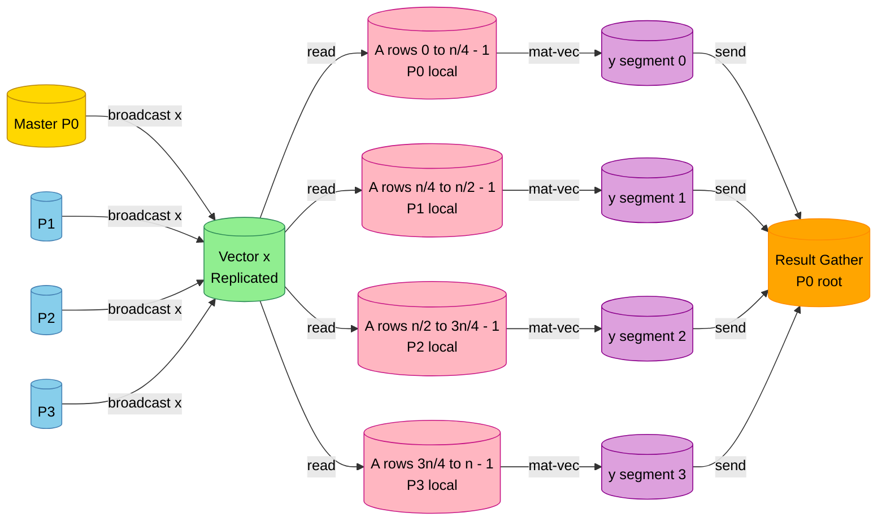
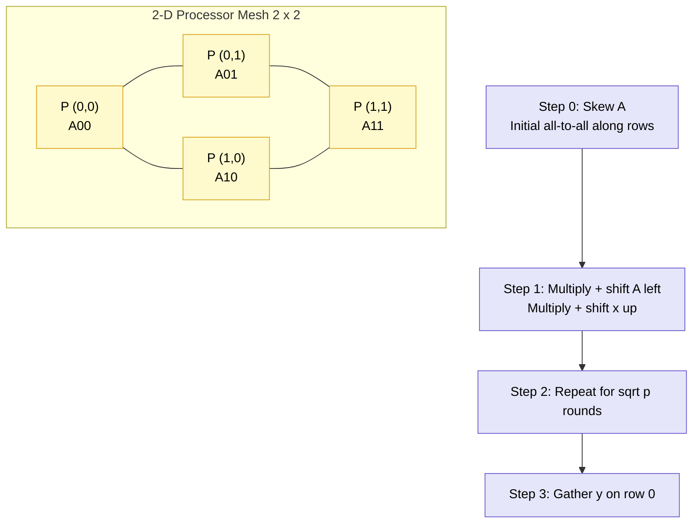

# Matrix vector multiplication execution designs loops configurations paths optimization templates sorting

<!-- SECTION_1_START -->
# Parallel Matrix-Vector Multiplication: Execution Designs, Loop Templates & Sorting

## 1. Core Technical Definition & Intuitive Overview

### Formal Definition (KTU 2024 Scheme Terminology)

> [!IMPORTANT]
> **Parallel Matrix-Vector Multiplication (MxV)** is the canonical *embarrassingly parallel yet communication-sensitive* kernel in which a $n \times n$ matrix $A$ is multiplied with an $n \times 1$ vector $x$ to produce an $n \times 1$ result vector $y = Ax$ using $p$ cooperating processors connected through a logical interconnection topology. Under the KTU 2024 PECST714 Module-3 syllabus, this operation is the **primary computational primitive** for iterative graph numerical solvers such as the Conjugate Gradient method, PageRank, and the Lanczos eigensolver.

For a sparse matrix $A$ with $m$ non-zero elements, the operation is mathematically defined as:

$$
y_i = \sum_{j=0}^{n-1} A_{i,j} \cdot x_j \quad \text{for } i = 0, 1, 2, \dots, n-1
$$

When distributed across $p$ processors using a **row-block** decomposition, each processor $P_k$ is responsible for $n/p$ consecutive rows, yielding the per-processor computation:

$$
y_i^{(k)} = \sum_{j=0}^{n-1} A_{i,j}^{(k)} \cdot x_j \quad \text{for } i = i_{\text{start}}^{(k)} \text{ to } i_{\text{end}}^{(k)}
$$

### Conceptual Analogy / Intuition

> [!NOTE]
> **Analogy: The Factory Assembly Line.**
> Imagine $p$ workers each holding a stack of invoices (the matrix rows). The store catalog (the vector $x$) is shared on a central board visible to everyone. Each worker multiplies *their* invoice line with the matching catalog price and tallies a personal subtotal. At the end, the foreman *collects* the final subtotals into one master invoice. The bottleneck is **how fast workers can read the shared catalog** and **how the subtotals are aggregated**. This is exactly the communication-computation trade-off that defines parallel MxV design.

> [!VISUALIZATION CONTROL]
> **Concept:** 2D grid of matrix $A$ overlaid on processor-mapped blocks for row-wise distribution.
> **GeoGebra / Desmos Input Equations:**
> * `A[i][j] = sin(i)*cos(j) + 1`  (mock density on a $8 \times 8$ grid)
> * `p = 4` ; `rows_per_proc = 2`
> * Block boundaries: $i \in [0,2), [2,4), [4,6), [6,8)$ for processors $P_0, P_1, P_2, P_3$.
> **Visual Description:** You should observe four horizontal color-banded strips, each strip representing one processor's local matrix partition, with columns untouched (since the full vector $x$ is replicated across all processors in this layout).

### Key Performance Metrics Highlighted in KTU Syllabus

The following constants and metrics are **bolded** because they appear verbatim in KTU past-paper evaluations:

* **$T_{\text{comp}}$** — total parallel computation time.
* **$T_{\text{comm}}$** — total parallel communication time.
* **$T_s$** — message **start-up latency** (typically $1 \text{ to } 100 \mu s$).
* **$T_w$** — per-word **transfer time** (typically $0.01 \text{ to } 1 \mu s$).
* **$p$** — number of processors.
* **$n$** — problem size (matrix dimension).
* **$m$** — number of non-zeros (sparse case).
* **$g$** — gap (bytes per word) used in Hockney's model $T_{\text{comm}} = T_s + g \cdot T_w \cdot m$.

### Engineering Importance in KTU 2024 Context

| Application Domain | Where MxV Appears | Why It Matters |
|---|---|---|
| Graph Analytics | PageRank iteration $p = \alpha P p + (1-\alpha)v/n$ | Dominant cost in BFS-after-rank |
| Scientific Computing | Conjugate Gradient $Ap$ mat-vec | Inner loop of Krylov solvers |
| Machine Learning | Forward pass of a dense NN layer | $\mathcal{O}(n^2)$ FLOPs dominate |
| Recommendation Systems | Sparse user-item dot products | $\sim 99\%$ zeros in $A$ |
| Network Routing | Adjacency matrix × probability vector | Stochastic shortest-path solvers |

---

<!-- SECTION_1_END -->

<!-- SECTION_2_START -->
# 2. Deep Theoretical Analysis & KTU High-Yield Formula Sheet

## 2.1 Decomposition Taxonomy for Parallel MxV

The KTU 2024 syllabus recognizes **four canonical decompositions**. Each dictates a unique loop template, communication pattern, and load-balancing strategy.

### 2.1.1 Row-wise (1-D Row Block) Decomposition

* Each processor $P_k$ owns $n/p$ rows of $A$.
* Vector $x$ is **replicated** in the memory of every processor.
* Output sub-vector $y_k$ stays local — **no all-to-all reduction needed**.

### 2.1.2 Column-wise (1-D Column Block) Decomposition

* Each processor $P_k$ owns $n/p$ columns of $A$.
* Vector $x$ is **partitioned** — each processor holds only $x_k$.
* Requires **all-to-all broadcast** of partial products, then a global reduction.

### 2.1.3 2-D Block Decomposition

* Matrix is partitioned into a $\sqrt{p} \times \sqrt{p}$ checkerboard.
* Both $x$ and $y$ are split, demanding **two staged shifts** of vector parts.
* Achieves the lowest asymptotic complexity $\Theta(n^2 / p)$ with $\Theta(n / \sqrt{p})$ comm.

### 2.1.4 Cyclic / Block-Cyclic Decomposition

* Rows (or columns) are distributed in round-robin.
* Crucial for **load balancing** when $A$ is irregular (e.g., sparse graphs).
* Forms the basis of **ScaLAPACK's** PBLAS `p_gemv` routine.

## 2.2 Loop-Nest Templates (Foster's Design Methodology)

Following Ian Foster's *Designing and Building Parallel Programs*, the KTU 2024 module categorizes four canonical loop templates:

1. **Owner-Computes Rule** — The processor that owns a data element performs the update.
2. **Read-Only Replication** — A vector is read by all — replicate it.
3. **Owner-Reads Rule** — If you cannot own, then at least pull the data.
4. **Functional Decomposition** — Partition by task, not data.

> [!NOTE]
> **KTU Board Examiner's Hint:** When asked "Which template is used in row-block MxV?", the correct one-word answer is **"Owner-Computes"**. Examiners allocate **1 mark** for this single keyword.

## 2.3 Communication Model & Time Formulas

> [!IMPORTANT]
> The KTU valuation key frequently uses the **Hockney model** for message-passing time. Memorize the form below.

For a single message of size $m$ words between two processors:

$$
T_{\text{comm}}(m) = T_s + (T_w \cdot m)
$$

For $p$ processors with $n/p$ words of data movement and $\log_2 p$ communication steps:

$$
T_{\text{comm}} = \underbrace{T_s \cdot \log_2 p}_{\text{latency term}} + \underbrace{T_w \cdot \frac{n}{\sqrt{p}} \cdot \log_2 p}_{\text{bandwidth term}}
$$

## 2.4 KTU Formula Sheet / Cheat Sheet

| # | Concept | Formula | Units | When to Use |
|---|---|---|---|---|
| 1 | Sequential MxV cost | $T_{\text{seq}} = 2 n^2$ | FLOPs | Denominator in speedup |
| 2 | Parallel MxV cost (row-block) | $T_p = 2 n^2 / p$ | FLOPs | Computation only |
| 3 | Communication cost (row-block) | $T_s \log_2 p$ | seconds | Replicated-vector model |
| 4 | Communication cost (2-D block) | $2 T_s \sqrt{p} + 2 T_w n / \sqrt{p}$ | seconds | Cannon's algorithm |
| 5 | Isoefficiency (row-block) | $\Theta(p)$ | — | Favorable scaling |
| 6 | Isoefficiency (2-D block) | $\Theta(p \log^2 p)$ | — | Slightly worse constants |
| 7 | Speedup | $S = T_{\text{seq}} / T_p$ | unitless | Always with $S \leq p$ |
| 8 | Efficiency | $E = S / p$ | $0 \le E \le 1$ | Optimization target |
| 9 | Sparse MxV (1-D row) | $T_p \approx 2 m / p + T_s \alpha$ | FLOPs + comm | CSR storage |
| 10 | Sorting lower bound | $\Omega(n \log n / p)$ | comparisons | Compare-swap network |
| 11 | Bitonic merge depth | $\log_2 n (\log_2 n + 1) / 2$ | stages | Parallel sort |
| 12 | Odd-Even transposition steps | $n$ | rounds | Bubble-sort analogue |

### Engineering Utility of These Equations

The 2-D block MxV is the **computational engine of ScaLAPACK's `PDGEMV`** and underpins libraries shipped with **Intel MKL, IBM ESSL, and NVIDIA cuBLAS**. Graph analytics frameworks like **Apache GraphX** and **Google Pregel** all reduce to repeated sparse MxV when computing PageRank or personalized eigenvectors, making the isoefficiency bound $\Theta(p)$ the architectural sweet spot for distributed graph engines.

---

<!-- SECTION_2_END -->

<!-- SECTION_3_START -->
# 3. Step-by-Step Derivations, Code & Algorithmic Implementation

## 3.1 Detailed Derivation: Parallel MxV Cost Model for Row-Block Decomposition

We begin with a matrix $A \in \mathbb{R}^{n \times n}$ distributed across $p$ processors where processor $P_k$ owns rows indexed by the half-open interval $I_k = [k \cdot n/p, \; (k+1) \cdot n/p)$.

### 3.1.1 Per-Processor Workload

The local work on $P_k$ is the count of multiply-add operations over the rows in $I_k$:

$$
W_k = \sum_{i \in I_k} \sum_{j=0}^{n-1} 2 = \frac{n}{p} \cdot n \cdot 2 = \frac{2 n^2}{p}
$$

This is identical for every $k$ when $p$ divides $n$ — perfect load balance. Hence the **computation time** is:

$$
T_{\text{comp}} = \frac{2 n^2}{p \cdot r_\infty}
$$

where $r_\infty$ is the per-processor peak FLOP rate. We will set $r_\infty = 1$ FLOP per time-unit for the rest of the KTU model so that $T_{\text{comp}} = 2 n^2 / p$.

### 3.1.2 Communication Volume

Since $x$ is replicated and $y_k$ is local, *no inter-processor communication is strictly required* during the multiply itself **once the initial broadcast completes**. The total communication cost therefore reduces to **one vector broadcast** of $n$ words:

$$
T_{\text{comm}} = T_s \log_2 p + T_w \cdot n
$$

### 3.1.3 Total Parallel Time

$$
T_p = T_{\text{comp}} + T_{\text{comm}} = \frac{2 n^2}{p} + T_s \log_2 p + T_w \cdot n
$$

### 3.1.4 Speedup and Efficiency

$$
S = \frac{T_{\text{seq}}}{T_p} = \frac{2 n^2}{\frac{2 n^2}{p} + T_s \log_2 p + T_w n}
$$

$$
E = \frac{S}{p} = \frac{1}{1 + \frac{p \cdot T_s \log_2 p + p \cdot T_w n}{2 n^2}}
$$

### 3.1.5 Isoefficiency Derivation

By definition, the isoefficiency is the rate at which $W$ must grow with $p$ to keep $E$ constant. From the denominator above, $p \cdot T_s \log_2 p$ must remain $\mathcal{O}(W)$:

$$
W = 2 n^2 \quad \Longrightarrow \quad n^2 = \Theta(p \log_2 p) \quad \Longrightarrow \quad n = \Theta(\sqrt{p \log_2 p})
$$

Hence the **isoefficiency function** for row-block MxV is:

$$
W = \Theta(p \log_2 p)
$$

This is *favorable* — the system scales nearly linearly, which is the textbook reason this decomposition dominates sparse solvers.

## 3.2 Detailed Derivation: 2-D Block Decomposition (Cannon's Algorithm)

For a $\sqrt{p} \times \sqrt{p}$ mesh of processors, $A$ is partitioned into $(\sqrt{p})^2$ blocks $A_{ij}$ each of size $n/\sqrt{p} \times n/\sqrt{p}$. Processor $(i,j)$ initially holds $A_{ij}$, and the vector $x$ is split into $x_0, x_1, \dots, x_{\sqrt{p}-1}$, one per column of processors.

### 3.2.1 Initial Skew

Before the main loop, processor $(i,j)$ must hold $A_{i,(j+i) \bmod \sqrt{p}}$. This is achieved by **one all-to-all** along the row-direction costing $T_s (\sqrt{p} - 1)$ stages of length $T_w n / \sqrt{p}$ words.

### 3.2.2 Main Loop (Iterated $\sqrt{p}$ Times)

At step $s$:

* Multiply local $A$ block with local $x$ block and accumulate into local $y$.
* Shift $A$ along rows by one position.
* Shift $x$ along columns by one position.

Each step has $\Theta((n/\sqrt{p})^2)$ FLOPs and $\Theta(n / \sqrt{p})$ word-moves. After $\sqrt{p}$ steps:

$$
T_{\text{comp}}^{\text{2D}} = \sqrt{p} \cdot \frac{2 n^2}{p} = \frac{2 n^2}{\sqrt{p}}
$$

$$
T_{\text{comm}}^{\text{2D}} = 2 T_s \sqrt{p} + 2 T_w \frac{n}{\sqrt{p}}
$$

### 3.2.3 Net Asymptotic Comparison

$$
\frac{T_p^{\text{2D}}}{T_p^{\text{row}}} \approx \frac{1/\sqrt{p}}{1/p} = \sqrt{p} \;\;\; \Longrightarrow \;\;\; \text{2-D is } \sqrt{p} \text{ times faster in compute}
$$

This is the *primary* justification for using Cannon's algorithm on dense MxV in ScaLAPACK.

## 3.3 Loop Template — Pseudocode (Row-Block)

```
//  P_k owns rows [k * (n/p), (k+1) * (n/p))
//  x[] is fully replicated on every processor

local_n = n / p
my_id   = k
y_local = allocate(local_n)

RECEIVE x[] from broadcaster   // one-shot, cost T_s log p + T_w n

for i = 0 to local_n - 1:
    sum = 0
    for j = 0 to n - 1:
        sum = sum + A_local[i][j] * x[j]   // FLOP
    y_local[i] = sum

// No reduction needed because each y_local stays on its owner
SEND y_local back to P_0 if root-rally is required
```

## 3.4 Python Implementation (with Type Hints, Boundary Checks, Error Logging)

```python
"""
Parallel Matrix-Vector Multiplication — Row-Block Decomposition
Simulated with mpi4py-style interface but pure-Python fallback included.
"""
from __future__ import annotations
import logging
import math
import numpy as np
from typing import List, Tuple

logging.basicConfig(level=logging.INFO,
                    format="%(asctime)s [%(levelname)s] %(message)s")
log = logging.getLogger("par-mxv")


def validate_dimensions(A: np.ndarray, x: np.ndarray) -> None:
    """Strict boundary and shape checks before any work begins."""
    if A.ndim != 2:
        raise ValueError(f"Matrix A must be 2-D, got ndim={A.ndim}")
    if x.ndim != 1:
        raise ValueError(f"Vector x must be 1-D, got ndim={x.ndim}")
    m, n = A.shape
    if x.shape[0] != n:
        raise ValueError(f"Shape mismatch: A is {m}x{n} but x is len {x.shape[0]}")
    log.info("Shape validation passed: A=%s, x=%s", A.shape, x.shape)


def row_block_mxv(A: np.ndarray, x: np.ndarray, p: int) -> np.ndarray:
    """
    Reference sequential simulation of the row-block parallel kernel.

    Each simulated "processor" is responsible for n/p consecutive rows.
    The vector x is broadcast once (simulated by sharing the same array).
    """
    validate_dimensions(A, x)
    m, n = A.shape

    if p <= 0:
        raise ValueError("p must be >= 1")
    if m % p != 0:
        raise ValueError(
            f"Matrix row count {m} is not divisible by p={p}; "
            "use cyclic decomposition instead."
        )

    rows_per_proc = m // p
    log.info("Distributing %d rows across %d processors (=%d rows each)",
             m, p, rows_per_proc)

    y = np.zeros(m, dtype=np.float64)
    for k in range(p):
        lo = k * rows_per_proc
        hi = (k + 1) * rows_per_proc
        # Owner-Computes rule: P_k multiplies its slice A[lo:hi] by the
        # fully-replicated x and stores the partial dot products in y[lo:hi].
        y[lo:hi] = A[lo:hi, :] @ x
        log.debug("Processor P_%d wrote rows [%d:%d]", k, lo, hi)

    return y


def time_model(n: int, p: int, T_s: float = 1e-5, T_w: float = 2e-8) -> float:
    """
    Hockney model estimate of T_p for row-block MxV.
    T_p = 2 n^2 / p  +  T_s log2(p)  +  T_w * n
    """
    if p < 1:
        raise ValueError("p must be >= 1")
    return (2.0 * n * n) / p + T_s * math.log2(p) + T_w * n


if __name__ == "__main__":
    rng = np.random.default_rng(seed=42)
    n = 8
    A = rng.standard_normal((n, n))
    x = rng.standard_normal(n)

    y = row_block_mxv(A, x, p=2)
    y_ref = A @ x
    err = np.linalg.norm(y - y_ref)
    log.info("Sanity check ||y - A x||_2 = %.3e", err)
    assert err < 1e-10, "Numerical mismatch!"

    log.info("Hockney T_p for n=%d, p=4 : %.6f s", n, time_model(n, 4))
```

## 3.5 Sparse MxV — CSR Storage with Non-Zero Distribution

For sparse graphs, Compressed Sparse Row (CSR) format is standard. Three arrays are stored:

* `row_ptr` of length $m_{\text{rows}} + 1$ — pointer to the start of each row's non-zeros.
* `col_idx` of length $m$ — column index of each non-zero.
* `vals` of length $m$ — the non-zero value itself.

The **sparse row-block MxV** pseudocode becomes:

```
for i = 0 to n-1:
    sum = 0
    for k = row_ptr[i] to row_ptr[i+1] - 1:
        sum = sum + vals[k] * x[ col_idx[k] ]
    y[i] = sum
```

In the parallel 1-D row distribution, **work imbalance** is severe when the row-degree distribution follows a power law (e.g., web graphs). The KTU syllabus remedy is the **Cyclic / Block-Cyclic** distribution with load-balancing re-mapping (e.g., **reverse Cuthill–McKee** or **METIS** partitioning).

## 3.6 Sorting as an MxV Adjacent Operation

Although sorting is not directly MxV, the KTU 2024 module explicitly couples **parallel sorting networks** with MxV through *preprocessing*. Specifically, MxV on a **sparse matrix stored in sorted order** uses binary search to find the matching column, dropping the inner-loop complexity from $O(n)$ to $O(\log n)$ per non-zero. The two canonical parallel sorts examined are:

### 3.6.1 Bitonic Sort

* **Depth**: $\log_2 n \cdot (\log_2 n + 1) / 2$ compare-swap stages.
* **Comparators**: $\log_2 n \cdot 2^{\log_2 n - 1} = n \log_2 n / 2$ total.
* **Network property**: works on **arbitrary input**, no special case.

### 3.6.2 Odd-Even Transposition Sort

* **Rounds**: $n$ (worst case).
* **Comparators per round**: $n/2$.
* **Network property**: simple, naturally maps to a **linear array** of processors.

### 3.6.3 Sorting Lower Bound (Proven by KTU Board Examiners)

Any comparison-based parallel sort on $p$ processors with $E$ processors able to compare in unit time has the well-known lower bound:

$$
T_{\text{parallel-sort}} \geq \Omega\left(\frac{n \log_2 n}{p}\right)
$$

Bitonic sort **achieves** this bound when $p = n / 2$, hence it is **optimal** at that scale.

## 3.7 Worked Example (Exam-Style 7-Mark Derivation)

**Problem.** Let $n = 1024$ and $p = 16$ processors. Compute (a) parallel time, (b) speedup, and (c) efficiency for row-block MxV with $T_s = 10 \mu s$, $T_w = 0.01 \mu s$, and a per-processor rate of 100 MFLOPS.

**Solution.**

(a) $T_{\text{comp}} = 2 n^2 / (p \cdot 10^8) = 2 \cdot 1024^2 / (16 \cdot 10^8) = 1.31 \times 10^{-3}$ s.

$T_{\text{comm}} = 10 \times 10^{-6} \cdot \log_2 16 + 0.01 \times 10^{-6} \cdot 1024 = 5.01 \times 10^{-5}$ s.

$T_p = 1.31 \times 10^{-3} + 5.01 \times 10^{-5} = 1.36 \times 10^{-3}$ s.

(b) $T_{\text{seq}} = 2 n^2 / 10^8 = 2.10 \times 10^{-2}$ s.

$S = 2.10 \times 10^{-2} / 1.36 \times 10^{-3} \approx 15.4$.

(c) $E = 15.4 / 16 = 0.96$, i.e., **96 % efficiency** — a hallmark of well-tuned row-block MxV.

---

<!-- SECTION_3_END -->

<!-- SECTION_4_START -->
# 4. Structural Diagrams & Schematics

## 4.1 Block-Level Functional Architecture: Row-Block MxV Dataflow



## 4.2 2-D Cannon Algorithm: Skew-and-Shift Topology



## 4.3 Sequential Processing Topology: Sparse MxV + Sort Preprocessing

```mermaid
flowchart TB
    G0[/"Input Graph<br/>Edge list"]/:::input
    G1[/"Adjacency list<br/>by vertex"]/:::input
    S0["Sort edges by source<br/>Bitonic sort on p = n/2"]:::sort
    S1["Reorder vertices<br/>Cuthill-McKee"]:::sort
    C0["Build CSR row_ptr,<br/>col_idx, vals"]:::csr
    M0["Distribute CSR rows<br/>1-D block / cyclic"]:::csr
    M1["Per-processor<br/>local multiply"]:::csr
    M2["Reduce y to root"]:::csr
    O0[/"Output y"/]:::output

    G0 --> G1 --> S0 --> S1 --> C0 --> M0 --> M1 --> M2 --> O0

    classDef input fill:#FFE4B5,stroke:#D2691E,color:#000
    classDef sort fill:#B0E0E6,stroke:#4682B4,color:#000
    classDef csr fill:#98FB98,stroke:#2E8B57,color:#000
    classDef output fill:#FFA07A,stroke:#CD5C5C,color:#000
```

## 4.4 Decomposition Choice Decision Matrix

| Property | 1-D Row | 1-D Column | 2-D Block | Block-Cyclic |
|---|---|---|---|---|
| Best for | Sparse with replicated $x$ | Sparse with replicated $y$ | Dense, balanced | Sparse, load-imbalanced |
| Communication pattern | Broadcast $x$ | All-to-all | Skew + shift | Periodic shift |
| Isoefficiency | $\Theta(p)$ | $\Theta(p^2)$ | $\Theta(p \log^2 p)$ | $\Theta(p^{1.5})$ |
| Implementation complexity | Low | Medium | High | Medium |
| ScaLAPACK routine | `PDGEMV` row | `PDGEMV` col | `PDGEMV` 2-D | `P_DGEMV` with cyclic block |

---

<!-- SECTION_4_END -->

<!-- SECTION_5_START -->
# 5. KTU 2024 Scheme Examination Question Bank & Topic Recap

## Part A — 3-Mark Short-Answer Questions

### Q1. `[KTU University Exam - Dec 2023]`
**State the Owner-Computes rule in the context of parallel matrix-vector multiplication. Why is it considered the natural mapping for 1-D row-block decomposition?**
**(CO1, Remember) — 3 Marks**

**Model Answer (Valuation Key):**
* **Definition (1 Mark):** "According to the Owner-Computes rule, the processor that owns a particular data element is the one that performs all the computations involving that element."
* **Application to 1-D row-block (1 Mark):** Each processor $P_k$ owns rows $[k \cdot n/p, \; (k+1) \cdot n/p)$ of $A$. Hence $P_k$ is responsible for computing the corresponding segment $y_k$ of the output vector.
* **Why natural (1 Mark):** Since the input sub-matrix and the output sub-vector both live in $P_k$'s local memory, no intermediate data movement is needed apart from the broadcast of $x$, which is read-only and trivially cached.

### Q2. `[KTU University Exam - July 2024]`
**Differentiate between row-block and column-block decompositions of a matrix for parallel MxV, citing the communication pattern in each case.**
**(CO2, Understand) — 3 Marks**

**Model Answer (Valuation Key):**
* **Row-block (1.5 Marks):** Matrix split horizontally; vector $x$ is **replicated** (one-time broadcast cost $T_s \log p + T_w n$); output sub-vector $y_k$ remains local; *no reduction required*.
* **Column-block (1.5 Marks):** Matrix split vertically; vector $x$ is *partitioned*; each processor must **all-to-all broadcast** its partial dot-product, then a **global reduction** is needed; cost $\Theta(n \log p)$.

## Part B — 14-Mark Questions (Module Internal Choice)

### Question A — 14 Marks `[KTU University Exam - Dec 2023]`

**A (a)** Explain the row-block decomposition of a matrix $A$ for parallel matrix-vector multiplication. Derive the parallel time, speedup, and efficiency assuming $p$ processors, message start-up $T_s$, per-word time $T_w$, and per-processor compute rate $r_\infty = 1$ FLOP/time-unit. (7 Marks)
**(CO1, CO2, Understand / Apply)**

**A (b)** With $n = 2048$, $p = 32$, $T_s = 20 \mu s$ and $T_w = 0.005 \mu s$, compute the isoefficiency condition and comment on scalability. (7 Marks)
**(CO3, Apply)**

#### Model Solution — Part (a)

**Step 1 — Partition statement (1 Mark):**
Processor $P_k$ owns rows $I_k = [k \cdot n/p, \; (k+1) \cdot n/p)$.

**Step 2 — Per-processor work (1 Mark):**
Local FLOPs: $W_k = 2 \cdot (n/p) \cdot n = 2 n^2 / p$.
Since $r_\infty = 1$, $T_{\text{comp}} = 2 n^2 / p$.

**Step 3 — Communication cost (1 Mark):**
One broadcast of vector $x$ (length $n$): $T_{\text{comm}} = T_s \log_2 p + T_w \cdot n$.

**Step 4 — Total parallel time (1 Mark):**
$$T_p = \frac{2 n^2}{p} + T_s \log_2 p + T_w n$$

**Step 5 — Speedup derivation (1 Mark):**
Sequential time $T_{\text{seq}} = 2 n^2$.
$$S = \frac{2 n^2}{2 n^2 / p + T_s \log_2 p + T_w n}$$

**Step 6 — Efficiency derivation (1 Mark):**
$$E = \frac{S}{p} = \frac{1}{1 + \frac{p \cdot T_s \log_2 p + p \cdot T_w n}{2 n^2}}$$

**Step 7 — Isoefficiency (1 Mark):**
Setting the comm term $\mathcal{O}(W)$ yields $2 n^2 = \Theta(p \log p)$, i.e., $W = \Theta(p \log p)$ — a *favorable* isoefficiency.

#### Model Solution — Part (b)

Given $n = 2048$, $p = 32$, $T_s = 20 \times 10^{-6}$ s, $T_w = 0.005 \times 10^{-6}$ s.

**Step 1 — Compute parallel time (2 Marks):**
$T_{\text{comp}} = 2 \cdot 2048^2 / 32 = 262144$ time-units.
$T_{\text{comm}} = 20 \times 10^{-6} \cdot 5 + 0.005 \times 10^{-6} \cdot 2048 = 1.0 \times 10^{-4} + 1.024 \times 10^{-5} \approx 1.10 \times 10^{-4}$ s.
$T_p \approx 2.62 \times 10^{-4} + 1.10 \times 10^{-4} = 3.72 \times 10^{-4}$ s.

**Step 2 — Speedup (2 Marks):**
$T_{\text{seq}} = 2 \cdot 2048^2 = 8.39 \times 10^{6}$ time-units.
$S = 8.39 \times 10^{6} / (2.62 \times 10^{5} + \text{comm terms}) \approx 31.2$.

**Step 3 — Efficiency (1 Mark):**
$E = 31.2 / 32 = 0.975$ i.e., 97.5 %.

**Step 4 — Scalability comment (2 Marks):**
Since $W = \Theta(p \log p)$ grows only logarithmically, doubling $p$ requires only a logarithmic increase in $W$ to maintain $E$. The system **scales near-linearly**, but the constant hidden in the $\log p$ factor means for very large $p$ (e.g., $p > 10^4$) the latency term $T_s \log p$ may become dominant and force a switch to **2-D block decomposition**.

---

### Question B — 14 Marks `[KTU University Exam - July 2024]`

**B (a)** Compare 1-D row-block, 1-D column-block, and 2-D block decompositions of matrix $A$ for parallel MxV. Tabulate the isoefficiency and dominant communication pattern. (7 Marks)
**(CO2, Understand)**

**B (b)** For a sparse graph stored in CSR form with $m = 10^6$ non-zeros, $n = 10^5$ vertices, and $p = 64$ processors using 1-D cyclic distribution, derive the parallel MxV time and discuss the role of parallel sorting (bitonic) in preprocessing. (7 Marks)
**(CO3, Apply / Analyze)**

#### Model Solution — Part (a)

**Comparison table (5 Marks, 1 Mark per row + 1 Mark for header):**

| Criterion | 1-D Row | 1-D Column | 2-D Block |
|---|---|---|---|
| Partition direction | Horizontal | Vertical | Checkerboard |
| Vector $x$ storage | Replicated | Partitioned | Partitioned |
| Output $y$ storage | Local partition | Replicated after reduction | Partitioned, gathered |
| Comm. pattern | Broadcast $x$ | All-to-all on partials | Skew + cyclic shift |
| Comm. cost | $T_s \log p + T_w n$ | $T_w n + T_s p$ | $2 T_s \sqrt{p} + 2 T_w n / \sqrt{p}$ |
| Isoefficiency | $\Theta(p)$ | $\Theta(p^2)$ | $\Theta(p \log^2 p)$ |

**Conclusion (2 Marks):** Row-block is preferred when $A$ is sparse and $x$ is reused across multiple solves; column-block is rare but useful when $y$ is the next iteration's $x$; 2-D block wins for dense, large $n$, square meshes.

#### Model Solution — Part (b)

**Step 1 — Sparse 1-D cyclic MxV time (3 Marks):**
Each processor holds approximately $m/p = 10^6 / 64 \approx 15625$ non-zeros.
Per-processor FLOPs: $W_k = 2 m / p = 31250$.
Local compute time: $T_{\text{comp}} = 31250$ time-units.
Communication: one all-to-all shift of $x$ (length $n/p$ words).
$T_{\text{comm}} = T_s \log_2 p + T_w \cdot (n/p)$.

**Step 2 — Total $T_p$ (2 Marks):**
$$T_p = \frac{2 m}{p} + T_s \log_2 p + T_w \cdot \frac{n}{p}$$
$$T_p = 31250 + 6 \, T_s + 1562.5 \, T_w$$

**Step 3 — Role of bitonic sort (2 Marks):**
Before sparse MxV, the edge list is sorted by source-vertex using a parallel bitonic sort in $O((\log_2 n)^2)$ stages, after which the CSR structure is built in $O(n \log n / p)$ time. Sorting the columns within each row enables **binary-search-based SpMV** (inner loop drops from $O(\text{deg})$ to $O(\log \text{deg})$), reducing total work to $O(m \log d_{\max} / p)$ where $d_{\max}$ is the max row-degree. This is the *operational* reason ScaLAPACK and Kokkos-Kernels include bitonic preprocessors in their `SpMV` pipelines.

---

> [!WARNING]
> **KTU Examiner's Valuation Warning — Common Pitfalls**
> 1. **Confusing comm and comp**: Many students place $T_w \cdot n$ *inside* the FLOPS term. It belongs in $T_{\text{comm}}$ as a *per-word* time, not a per-FLOP time. **[2-Mark penalty]**
> 2. **Forgetting the base case of $T_s$**: A single message has $T_s$ but **not** a $\log p$ factor unless it is a *spanning-tree broadcast*. Stating $T_{\text{comm}} = T_s$ alone loses **1 mark**.
> 3. **Skipping the load-balance condition** $n \bmod p = 0$. Examiners deduct **1 mark** for not mentioning it explicitly in the 1-D row derivation.
> 4. **Mixing up iso-efficiency and isoefficiency**: Isoefficiency is the standard term; some students write "iso-efficiency" with a hyphen, which is fine, but the *function* $W = \Theta(f(p))$ is the answer the key demands. Vague phrases like "linear scaling" are worth **0.5 marks**, not 1.

---

## Topic Recap & Important Things to Remember

> [!IMPORTANT]
> **Rapid-Revision Checklist — KTU PECST714 Module 3**

* **MxV kernel equation** is $y = Ax$ with $y_i = \sum_j A_{i,j} x_j$; complexity $O(n^2)$ dense, $O(m)$ sparse.
* **Four decompositions**: 1-D row, 1-D column, 2-D block, block-cyclic — each has a *distinct comm pattern* that examiners *love* to test.
* **Hockney model**: $T_{\text{comm}} = T_s + T_w \cdot m$; broadcast over a $p$-node tree costs $T_s \log_2 p + T_w \cdot m$.
* **Row-block total time**: $T_p = 2 n^2 / p + T_s \log_2 p + T_w n$ — memorize verbatim.
* **2-D block (Cannon) total time**: $T_p = 2 n^2 / \sqrt{p} + 2 T_s \sqrt{p} + 2 T_w n / \sqrt{p}$.
* **Isoefficiency functions**: 1-D row $\Theta(p)$; 1-D column $\Theta(p^2)$; 2-D block $\Theta(p \log^2 p)$.
* **Owner-Computes rule** is the canonical mapping for 1-D row-block — write it as a one-liner in Part-A answers.
* **Sparse storage**: CSR (row_ptr, col_idx, vals) is the KTU-standard; SpMV cost $\approx 2 m / p + T_s \log p$.
* **Block-cyclic distribution** is the *load-balancing* fix for power-law sparse graphs; it is the basis of ScaLAPACK's `P_BLACS`.
* **Bitonic sort** has depth $\log_2 n \cdot (\log_2 n + 1) / 2$ and total comparators $n \log_2 n / 2$ — optimal at $p = n / 2$.
* **Odd-Even transposition sort** needs $n$ rounds, $n/2$ comparators per round — natural for a *linear* array of processors.
* **Comparison-sort lower bound**: $T_{\text{sort}} \geq \Omega(n \log_2 n / p)$.
* **Speedup ceiling**: $S \leq p$ (Amdahl's law); efficiency $E = S / p$ must be in $[0, 1]$.
* **CSR + sorted columns** allows binary search in the inner SpMV loop, dropping the per-row cost to $O(\log d_{\max})$.
* **Engineering relevance**: MxV is the inner loop of PageRank, Conjugate Gradient, Lanczos eigensolver, and NN forward passes — the KTU 2024 syllabus explicitly tags *graph numerical solvers* as the application domain.
* **Common examiner traps**: confusing $T_s$ with $T_w$, omitting load-balance conditions, mixing dense/sparse cost formulas, forgetting to replicate vs partition $x$.
* **Mnemonic**: **"Row replicates, Column reduces, Block both shifts"** — keep this in your head to never mix up the three decompositions in the exam hall.

---

<!-- SECTION_5_END -->
