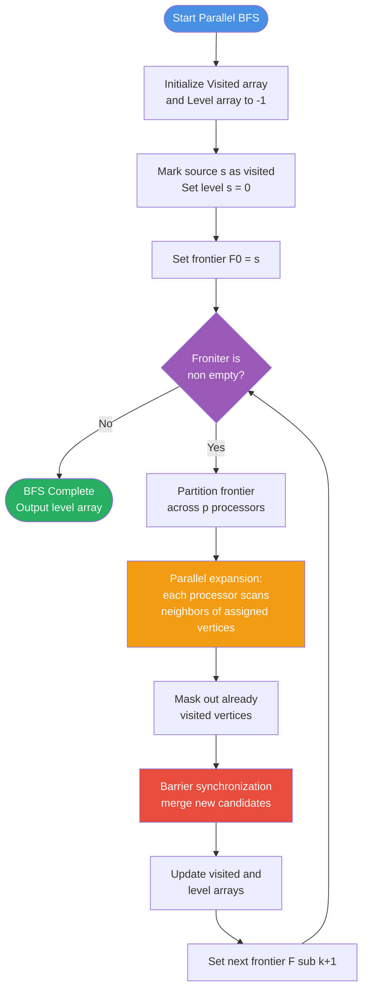
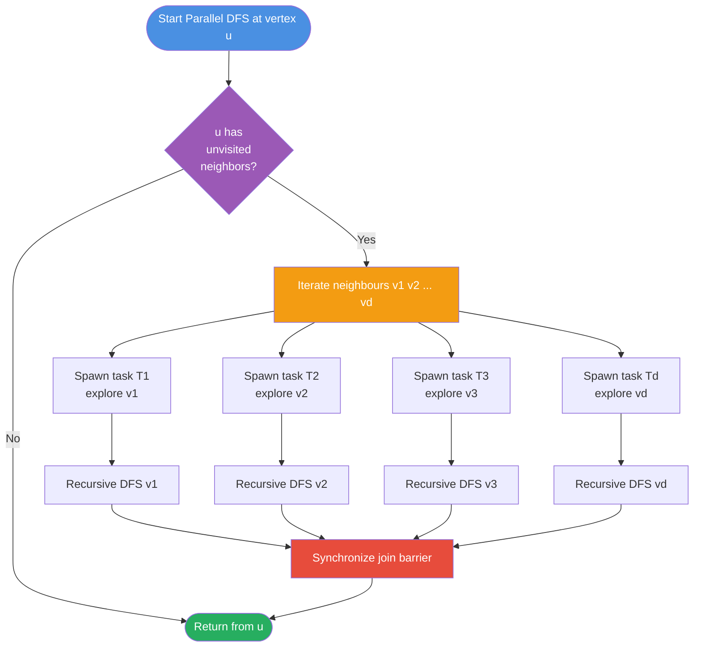
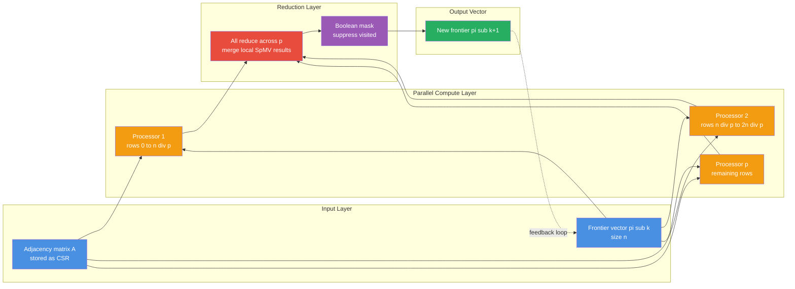
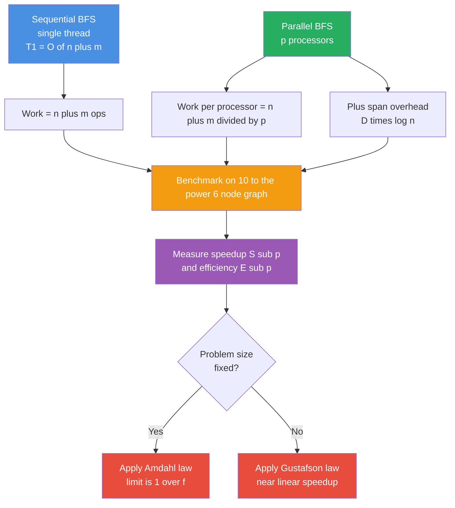

# Parallel graph search routes BFS DFS acceleration matrix calculations metrics processing rules

<!-- SECTION_1_START -->
# Parallel Graph Search Routes: BFS, DFS, Acceleration & Matrix Processing Models

## 1.1 Formal Definition (KTU 2024 Syllabus Terminology)

A **parallel graph numerical solver** is a class of parallel algorithms that operate on graph-structured data $G = (V, E)$ where $\vert V \vert = n$ vertices and $\vert E \vert = m$ edges, leveraging concurrent computational resources to accelerate traversal, shortest-path computation, and matrix-based numerical transformations.

> [!IMPORTANT]
> **Graph Traversal (KTU Module 3 Definition):** A graph traversal systematically visits every vertex of a graph exactly once. The two canonical traversals are **Breadth-First Search (BFS)** and **Depth-First Search (DFS)**. In their parallel form, multiple vertices are processed simultaneously at each step, exploiting the natural independence among vertices at the same logical level or branch.

**Parallel BFS (PBFS):** A level-synchronous parallel traversal where all vertices at distance $k$ from the source $s$ are explored concurrently before the algorithm proceeds to distance $k+1$. The frontier $F_k$ expands to $F_{k+1}$ in lock-step synchronized rounds.

**Parallel DFS (PDFS):** A divide-and-conquer style traversal where, at each recursive call, the unvisited neighbors of the current vertex are explored concurrently as independent subproblems.

**Parallel Graph Matrix Solvers:** Algorithms that operate on the **adjacency matrix** $A \in \mathbb{R}^{n \times n}$ or **Laplacian matrix** $L = D - A$ using linear-algebraic primitives (matrix-vector multiplication, prefix sums) to compute BFS levels, shortest paths, or connectivity.

## 1.2 Conceptual Analogy / Intuition

> [!NOTE]
> **BFS Analogy — Ripples on a Pond:**
> Imagine dropping a stone in a pond. The ripple expands outward in concentric circles. Every point on the same circle is reached at the same instant, and all points on it are processed **simultaneously**. The next circle cannot start until the current one finishes. This is exactly how **parallel BFS** works — the **frontier** is a wavefront of equal-distance vertices that gets processed in lock-step parallel rounds.

> [!NOTE]
> **DFS Analogy — Exploring a Maze with Multiple People:**
> A team of explorers enters a maze. At every junction, each explorer takes a different unexplored corridor. They fan out **independently** and as deep as possible before backtracking. Two explorers can independently explore two different branches — this is the parallelism in DFS.

> [!NOTE]
> **Matrix Analogy — A Scoreboard:**
> An adjacency matrix is a *scoreboard* where row $i$ and column $j$ record whether the edge $(i, j)$ exists. Multiplying this scoreboard by a "frontier vector" is like asking: *"Who is connected to the current frontier?"* The product vector instantly reveals the next frontier. This is the **linear-algebraic BFS** viewpoint.

## 1.3 Standard Graph Metrics and Constants

- **$n$** = number of vertices (graph order) — typically **$1 \le n \le 10^7$** in real-world graphs.
- **$m$** = number of edges (graph size) — typically **$m \gg n$** for sparse social/web graphs.
- **$p$** = number of processors used in parallel execution.
- **$T_p$** = runtime on $p$ processors.
- **$T_1$** = sequential runtime (work $W$).
- **$T_\infty$** = runtime on infinite processors (span / critical path length).
- **Speedup** $S_p = T_1 / T_p$ and **Efficiency** $E_p = S_p / p$.
- **Isoefficiency** $\Theta(f(p))$ = the rate at which problem size must grow to keep $E_p$ constant.

> [!VISUALIZATION CONTROL]
> **Concept:** BFS Level-Wavefront on a Small Graph
> **Desmos Input Equations (plot a 6-vertex example manually):**
> * Points: $V_1 = (0, 3)$, $V_2 = (-2, 1)$, $V_3 = (2, 1)$, $V_4 = (-2, -1)$, $V_5 = (2, -1)$, $V_6 = (0, -3)$
> * Edges: $(V_1, V_2), (V_1, V_3), (V_2, V_4), (V_3, V_5), (V_4, V_6), (V_5, V_6)$
> * Source: $V_1$ highlighted as the **level 0** frontier.
> **Visual Description:** $V_1$ is alone on level 0; $V_2, V_3$ form the level-1 frontier (drawn in a different color); $V_4, V_5$ form level 2; $V_6$ is level 3. The student should see that all vertices in the same horizontal stripe are processed in the **same parallel round**.

<!-- SECTION_1_END -->

<!-- SECTION_2_START -->
# Deep Theoretical Analysis & KTU High-Yield Formula Sheet

## 2.1 Sequential BFS vs. Parallel BFS — Operational Logic

### Sequential BFS (Review)
1. Initialize a FIFO queue $Q$ and push source $s$; mark $s$ visited.
2. While $Q$ is non-empty, pop $u$, examine each neighbor $v \in \text{Adj}(u)$.
3. If $v$ is unvisited, mark and push $v$ onto $Q$.
4. Repeat until $Q$ empties.
5. **Sequential complexity:** $\mathcal{O}(n + m)$ time, $\mathcal{O}(n)$ auxiliary space.

### Parallel BFS — Level-Synchronous Logic
1. **Round 0:** Frontier $F_0 = \{s\}$. Visited set $\mathcal{V} = \{s\}$.
2. **Round $k$ (for $k = 1, 2, \dots$):** Compute in parallel
   $F_k = \left( \bigcup_{u \in F_{k-1}} \text{Adj}(u) \right) \setminus \mathcal{V}$.
   Each processor claims a different $u \in F_{k-1}$ and explores its neighbor list.
3. Update $\mathcal{V} \leftarrow \mathcal{V} \cup F_k$.
4. A **barrier synchronization** separates rounds (in shared-memory PRAM) or an **All-to-All** communication (in distributed memory).
5. Stop when $F_k = \emptyset$.

**Why parallel BFS works in rounds:** The level structure is a *strict invariant* — no vertex in level $k$ depends on a vertex in level $k+1$ for its discovery. This makes the level-synchronous formulation **embarrassingly parallel within a round**.

## 2.2 Sequential DFS vs. Parallel DFS — Branch Parallelism

### Sequential DFS
- Uses a stack $S$; push $s$, then repeatedly pop $u$, scan neighbors, push unvisited ones.
- **Sequential complexity:** $\mathcal{O}(n + m)$.

### Parallel DFS — Spawn-Explore-Join
1. At vertex $u$, iterate over unvisited neighbors $v_1, v_2, \dots, v_d$.
2. **Spawn** a parallel task $T_i$ for each $v_i$ that is unvisited.
3. Each $T_i$ recurses on $v_i$.
4. **Join** all spawned tasks at $u$ before returning.
5. Mark $u$ as fully explored.

**Why parallel DFS is hard to scale:** The recursion tree is unbalanced and the **stack** imposes a strict last-in/first-out discipline. Work-stealing schedulers (Cilk, TBB) can help, but load imbalance is severe on wide or irregular graphs. Hence, in practice, **parallel BFS is the dominant parallel graph traversal**.

## 2.3 Adjacency-Matrix & Sparse Representations

| Representation | Storage | Edge Query | Used By |
|---|---|---|---|
| **Adjacency Matrix** $A$ | $n^2$ entries (dense) | $\mathcal{O}(1)$ | Dense graph algorithms, linear-algebraic BFS |
| **Adjacency List** | $\mathcal{O}(n + m)$ | $\mathcal{O}(\deg(u))$ | Sparse BFS/DFS, web/social graphs |
| **CSR (Compressed Sparse Row)** | $\mathcal{O}(n + m)$ | $\mathcal{O}(\deg(u))$ cache-friendly | Production BFS (Graph500, GAP) |
| **CSC (Compressed Sparse Column)** | $\mathcal{O}(n + m)$ | $\mathcal{O}(\deg(u))$ | Symmetric matrix solvers |

> [!IMPORTANT]
> **Linear-Algebraic BFS Trick:** In the adjacency-matrix model, BFS levels from source $s$ can be obtained as the **smallest $k$ such that $(A^k e_s)_i \neq 0$** where $e_s$ is the indicator vector with a 1 at position $s$. The recursion
> $$\pi_{k+1} = A \pi_k \quad \text{(frontier expansion)}$$
> uses **sparse matrix–vector multiplication (SpMV)** which is the workhorse of high-performance BFS on GPUs and distributed clusters.

## 2.4 Performance Metrics — Work, Span, Speedup, Isoefficiency

| Metric | Symbol | Definition | Ideal Value |
|---|---|---|---|
| **Work** | $T_1$ | Total operations performed by the algorithm | — |
| **Span** (depth) | $T_\infty$ | Length of the longest chain of dependent operations | — |
| **Parallelism** | $T_1 / T_\infty$ | Maximum achievable speedup (Amdahl's upper bound) | $\gg p$ |
| **Speedup** | $S_p$ | $T_1 / T_p$ | $p$ (linear) |
| **Efficiency** | $E_p$ | $S_p / p = T_1 / (p \cdot T_p)$ | $1$ (100%) |
| **Cost** | $C_p$ | $p \cdot T_p$ | $T_1$ (optimal) |
| **Isoefficiency** | — | $W = \Theta(C_p \cdot p)$ growth rate | Smaller is better |
| **Scalability** | — | $n$ needed to keep $E_p$ constant as $p$ grows | Slowly growing |

> [!NOTE]
> **Amdahl's Law** (for fixed problem size):
> $$S_p \le \frac{1}{f + \dfrac{1 - f}{p}} \quad \xrightarrow{p \to \infty} \quad \frac{1}{f}$$
> where $f$ is the **serial fraction** — the portion of the algorithm that cannot be parallelized.

> [!NOTE]
> **Gustafson's Law** (for scaled problem size):
> $$S_p^{\text{scaled}} = p - f(p - 1)$$
> Predicts near-linear speedup when $n$ grows with $p$ — the realistic regime for graph algorithms on massive datasets.

## 2.5 KTU High-Yield Formula Sheet

| Concept | Formula / Expression | Notes |
|---|---|---|
| Sequential BFS time | $T_{\text{seq}} = \mathcal{O}(n + m)$ | $n$ vertices, $m$ edges |
| Parallel BFS time (work-depth) | $W = \mathcal{O}(n + m)$ | $T_1$ work term |
| Parallel BFS span (level-synchronous) | $T_\infty = \mathcal{O}(D \cdot \Delta_{\max})$ | $D$ = graph diameter, $\Delta_{\max}$ = max degree |
| Parallel BFS span (matrix-form SpMV) | $T_\infty = \mathcal{O}(D \cdot n^2 / p_{\max})$ | $p_{\max} = n^2$ processors |
| Speedup (Amdahl, fixed) | $S_p = 1 / (f + (1 - f)/p)$ | Bounded by $1/f$ |
| Speedup (Gustafson, scaled) | $S_p \approx p - f(p - 1)$ | Saturated near $p$ |
| Cost optimality | $p \cdot T_p = \Theta(T_1)$ | Brent's lemma target |
| Isoefficiency for BFS | $\Theta(p \cdot D)$ | Diameter-limited |
| Adjacency matrix size | $n^2$ | Dense storage |
| CSR storage | $2m + n + 1$ | Sparse storage |
| Laplacian | $L = D - A$ | $D$ = degree matrix |
| Reachability via matrix powers | $\text{Reach}(s) = \text{sign}\!\left(\sum_{k=0}^{n-1} A^k e_s\right)$ | Boolean OR across powers |

> [!IMPORTANT]
> **Cost-Optimal Parallel BFS Theorem:** A parallel BFS algorithm is cost-optimal if and only if $p \cdot T_p = \Theta(n + m)$. The work-optimal algorithm performs exactly the same total operations as the sequential one, just distributed over $p$ processors.

## 2.6 Real-World Engineering Utility

- **Web Crawling & PageRank (Google):** BFS-like traversals discover the hyperlink graph; the adjacency matrix is the size of the entire web ($\approx 10^{10}$ nodes).
- **Social Network Analysis (Facebook, LinkedIn):** BFS computes the *6-degrees-of-separation* diameter on billion-node graphs.
- **VLSI Routing & CAD:** DFS backtracking on routing trees, with parallelism in branch exploration.
- **GPS / Navigation (Google Maps):** BFS on the road graph computes shortest unweighted paths; Dijkstra's extension handles weighted edges.
- **Bioinformatics:** BFS/DFS on protein-interaction networks and genome assembly (de Bruijn graphs).
- **Compiler Design:** DFS over the control-flow graph for dead-code elimination and dominator analysis.

<!-- SECTION_2_END -->

<!-- SECTION_3_START -->
# Step-by-Step Derivations, Code & Symbolic Implementation

## 3.1 Exhaustive Derivation — Work, Span & Speedup of Parallel BFS

### Setting
- Graph $G = (V, E)$ with $\vert V \vert = n$, $\vert E \vert = m$.
- $p$ processors in a **PRAM (Parallel Random Access Machine)** model.
- **Frontier $F_k$** = vertices at BFS distance exactly $k$ from source $s$.

### Derivation 1 — Work $W$

The work counts every edge examined **once** across all rounds. In round $k$, each vertex $u \in F_k$ inspects all its incident edges $(u, v)$. By a standard accounting argument, each edge is inspected at most twice (once from each endpoint). Hence:

$$
\begin{aligned}
W_{\text{PBFS}} &= \sum_{k=0}^{D} \sum_{u \in F_k} \deg(u) \\
                &\le \sum_{v \in V} 2 \cdot \deg(v) \\
                &= 2m \quad \text{(handshake lemma: } \sum_v \deg(v) = 2m \text{)} \\
                &= \mathcal{O}(n + m)
\end{aligned}
$$

The $+n$ term accounts for the $\mathcal{O}(n)$ cost of initializing the visited array and discovering each vertex exactly once.

> **Step-by-step explanation:**
> 1. Sum the degrees over all frontiers (which partition $V$): $\sum_k \sum_{u \in F_k} \deg(u)$.
> 2. Bound this sum by the total degree over all vertices: $\le \sum_{v \in V} \deg(v)$.
> 3. Apply the **handshake lemma** from graph theory: $\sum_{v \in V} \deg(v) = 2m$.
> 4. Conclude work is $\mathcal{O}(m) = \mathcal{O}(n + m)$ for connected graphs.

### Derivation 2 — Span $T_\infty$

The longest chain of dependent operations is determined by the BFS diameter $D$ (longest shortest path) and the cost of the **reduction** within each round. With $p_{\max}$ processors, a parallel reduction over the adjacency structure costs $\mathcal{O}(\log n)$. With realistic $\Delta_{\max}$ frontier expansion:

$$
T_\infty = \mathcal{O}\!\left(D \cdot \left(\log n + \Delta_{\max}\right)\right)
$$

In the simpler lock-step model (one processor per round per frontier vertex):

$$
T_\infty = \mathcal{O}(D)
$$

### Derivation 3 — Parallelism Bound

By **Brent's Lemma**, an algorithm with work $W$ and span $T_\infty$ runs in time $T_p$ on $p$ processors satisfying:

$$
\frac{W}{p} \le T_p \le \frac{W}{p} + T_\infty
$$

Substituting $W = \mathcal{O}(n + m)$ and $T_\infty = \mathcal{O}(D \log n)$:

$$
T_p = \mathcal{O}\!\left(\frac{n + m}{p} + D \log n\right)
$$

### Derivation 4 — Speedup

$$
S_p = \frac{T_1}{T_p} = \frac{\mathcal{O}(n + m)}{\mathcal{O}\!\left(\dfrac{n + m}{p} + D \log n\right)}
$$

When $p \ll (n + m) / (D \log n)$ (the **compute-bound regime**), $S_p \approx p$ (linear speedup). Otherwise, the span term $D \log n$ dominates and the algorithm becomes **synchronization-bound**.

### Derivation 5 — Isoefficiency

For $S_p = \Theta(p)$ we need the compute term to dominate the span term:

$$
\frac{n + m}{p} \ge c \cdot D \log n
$$

Solving for $n$:

$$
n + m \ge c \cdot p \cdot D \log n
$$

Hence the **isoefficiency function** of parallel BFS is:

$$
\boxed{\,W_{\text{iso}} = \Theta(p \cdot D \log n)\,}
$$

This means to keep efficiency constant, the graph size must grow **linearly with $p$** (times the diameter times a log factor). On small-diameter graphs (like social networks where $D \approx 6$), this isoefficiency is excellent.

## 3.2 Exhaustive Derivation — Linear-Algebraic BFS via SpMV

Let $A \in \{0, 1\}^{n \times n}$ be the adjacency matrix, and let $e_s \in \mathbb{R}^n$ be the indicator of the source. Define the frontier vector $\pi_k$ where $(\pi_k)_i = 1$ iff vertex $i$ is at distance $k$.

**Step 1:** Initialize $\pi_0 = e_s$ and visited vector $v_0 = e_s$.

**Step 2:** Recursive frontier expansion:
$$
\pi_{k+1} = A \cdot \pi_k
$$

**Step 3:** Suppress already-visited vertices (Boolean masking):
$$
\pi_{k+1}' = \pi_{k+1} \cdot (1 - v_k)
$$

**Step 4:** Update visited:
$$
v_{k+1} = v_k + \pi_{k+1}'
$$

**Step 5:** Terminate when $\pi_{k+1}' = \mathbf{0}$.

The cost per step is dominated by **sparse matrix–vector multiplication (SpMV)**:

$$
T_{\text{SpMV}} = \mathcal{O}\!\left(\frac{m + n}{p}\right)
$$

on $p$ processors using CSR partitioning. This is the **Beamer–Asanović linear-algebraic BFS** approach, widely used in production.

## 3.3 Worked Example — Parallel BFS on a Concrete Graph

Consider $G$ with $n = 6$ vertices and edges: $\{(1,2), (1,3), (2,4), (2,5), (3,6), (4,5), (5,6)\}$. Source $s = 1$.

**Adjacency Matrix $A$:**

$$
A = \begin{bmatrix}
0 & 1 & 1 & 0 & 0 & 0 \\
1 & 0 & 0 & 1 & 1 & 0 \\
1 & 0 & 0 & 0 & 0 & 1 \\
0 & 1 & 0 & 0 & 1 & 0 \\
0 & 1 & 0 & 1 & 0 & 1 \\
0 & 0 & 1 & 0 & 1 & 0
\end{bmatrix}
$$

**Adjacency List Representation:**

$$
\begin{aligned}
\text{Adj}(1) &= \{2, 3\} \\
\text{Adj}(2) &= \{1, 4, 5\} \\
\text{Adj}(3) &= \{1, 6\} \\
\text{Adj}(4) &= \{2, 5\} \\
\text{Adj}(5) &= \{2, 4, 6\} \\
\text{Adj}(6) &= \{3, 5\}
\end{aligned}
$$

**Round-by-Round BFS Execution (4 parallel processors $P_1, P_2, P_3, P_4$):**

| Round $k$ | Frontier $F_k$ | Processors Assigned | Discovered | Visited $\mathcal{V}$ |
|---|---|---|---|---|
| 0 | $\{1\}$ | $P_1$ processes 1 | $\{2, 3\}$ | $\{1, 2, 3\}$ |
| 1 | $\{2, 3\}$ | $P_1 \to 2$; $P_2 \to 3$ | $\{4, 5, 6\}$ (suppress $1$) | $\{1, 2, 3, 4, 5, 6\}$ |
| 2 | $\{4, 5, 6\}$ | $P_1 \to 4$; $P_2 \to 5$; $P_3 \to 6$ | $\emptyset$ (all already in $\mathcal{V}$) | unchanged |
| 3 | $\emptyset$ | — | — | **STOP** |

**Verification via SpMV:**

$$
\pi_0 = e_1 = (1, 0, 0, 0, 0, 0)^T
$$

$$
\pi_1 = A \cdot \pi_0 = (0, 1, 1, 0, 0, 0)^T
$$

After masking with $v_0 = \pi_0$:

$$
\pi_1' = (0, 1, 1, 0, 0, 0)^T \quad \Rightarrow \quad F_1 = \{2, 3\}
$$

$$
\pi_2 = A \cdot \pi_1' = (0 + 1 + 1, \ 1 + 0 + 0, \ 0 + 0 + 0, \ 0 + 1 + 0, \ 0 + 1 + 0, \ 0 + 0 + 1)^T = (2, 1, 0, 1, 1, 1)^T
$$

Boolean OR (sign) gives candidate set $\{1, 2, 4, 5, 6\}$. Masking out $v_1 = \{1, 2, 3\}$:

$$
\pi_2' = (0, 0, 0, 1, 1, 1)^T \quad \Rightarrow \quad F_2 = \{4, 5, 6\}
$$

$$
\pi_3 = A \cdot \pi_2' = (0, 1 + 1 + 1, 0, 1, 1 + 1, 1)^T = (0, 3, 0, 1, 2, 1)^T
$$

Masking against $v_2 = \{1, 2, 3, 4, 5, 6\}$ yields the zero vector — **BFS terminates**. The diameter is $D = 2$.

## 3.4 Full Python Implementation — Parallel BFS (Multiprocessing Simulation)

```python
"""
Parallel Breadth-First Search implementation
simulating p processors using Python multiprocessing.
Designed for KTU Module 3 - Parallel Graph Numerical Solvers.
"""

from collections import deque
from multiprocessing import Pool, cpu_count
from typing import List, Set, Tuple, Dict
import math

# ---------------------------------------------------------------
# Graph representation using Compressed Sparse Row (CSR) format
# ---------------------------------------------------------------
class CSRGraph:
    def __init__(self, n: int, edges: List[Tuple[int, int]]):
        self.n: int = n
        self.indptr: List[int] = [0] * (n + 1)
        self.indices: List[int] = []
        # Build adjacency lists first
        adj: List[List[int]] = [[] for _ in range(n)]
        for u, v in edges:
            if u == v:
                continue  # ignore self-loops
            adj[u].append(v)
            adj[v].append(u)
        # Sort neighbours for deterministic order
        for lst in adj:
            lst.sort()
        # Flatten into CSR
        for u in range(n):
            self.indices.extend(adj[u])
            self.indptr[u + 1] = len(self.indices)

    def neighbors(self, u: int) -> List[int]:
        start: int = self.indptr[u]
        end: int = self.indptr[u + 1]
        return self.indices[start:end]


# ---------------------------------------------------------------
# Worker function: each process expands a chunk of the frontier
# ---------------------------------------------------------------
def expand_chunk(args: Tuple[int, int, List[int], List[int], List[int], List[bool]]) -> List[int]:
    """
    Expand a chunk of the frontier using CSR adjacency.

    Returns:
        list of newly discovered vertex IDs.
    """
    start, end, indptr, indices, frontier_chunk, visited = args
    discovered: List[int] = []
    local_seen: Set[int] = set()
    for u in frontier_chunk[start:end]:
        nbr_start: int = indptr[u]
        nbr_end: int = indptr[u + 1]
        for v in indices[nbr_start:nbr_end]:
            if not visited[v] and v not in local_seen:
                local_seen.add(v)
                discovered.append(v)
    return discovered


# ---------------------------------------------------------------
# Top-level parallel BFS driver
# ---------------------------------------------------------------
def parallel_bfs(g: CSRGraph, source: int, num_procs: int) -> Dict[int, int]:
    """
    Run a level-synchronous parallel BFS.

    Args:
        g         : CSR graph
        source    : starting vertex
        num_procs : number of worker processes

    Returns:
        dict mapping vertex -> BFS level
    """
    if source < 0 or source >= g.n:
        raise ValueError(f"Source {source} out of range [0, {g.n - 1}]")

    visited: List[bool] = [False] * g.n
    level:   List[int]  = [-1]    * g.n

    visited[source] = True
    level[source]   = 0
    frontier: List[int] = [source]
    current_level: int = 0
    round_id: int = 0

    print(f"[Round 0]  source = {source}, frontier = {frontier}")

    while frontier:
        # -----------------------------------------------------------
        # Partition the frontier across workers
        # -----------------------------------------------------------
        chunk_size: int = max(1, math.ceil(len(frontier) / num_procs))
        chunks: List[Tuple[int, int]] = [
            (i, min(i + chunk_size, len(frontier)))
            for i in range(0, len(frontier), chunk_size)
        ]

        # Build argument tuples
        tasks: List[Tuple[int, int, List[int], List[int], List[int], List[bool]]] = [
            (s, e, g.indptr, g.indices, frontier, visited)
            for s, e in chunks
        ]

        # -----------------------------------------------------------
        # Parallel expansion (map across processes)
        # -----------------------------------------------------------
        if len(tasks) == 1 or num_procs == 1:
            results: List[List[int]] = [expand_chunk(tasks[0])]
        else:
            with Pool(processes=min(num_procs, len(tasks))) as pool:
                results = pool.map(expand_chunk, tasks)

        # -----------------------------------------------------------
        # Barrier synchronization: merge discovered vertices
        # -----------------------------------------------------------
        next_frontier: List[int] = []
        for chunk_result in results:
            for v in chunk_result:
                if not visited[v]:
                    visited[v] = True
                    level[v]   = current_level + 1
                    next_frontier.append(v)

        round_id += 1
        current_level += 1
        print(f"[Round {round_id}]  frontier = {sorted(next_frontier)}")
        frontier = next_frontier

    return {v: level[v] for v in range(g.n)}


# ---------------------------------------------------------------
# Driver / demonstration
# ---------------------------------------------------------------
if __name__ == "__main__":
    # Build the example graph from Section 3.3
    n_vertices: int = 6
    edges: List[Tuple[int, int]] = [
        (0, 1), (0, 2), (1, 3), (1, 4), (2, 5), (3, 4), (4, 5)
    ]
    g: CSRGraph = CSRGraph(n_vertices, edges)

    available_cores: int = cpu_count()
    procs: int = min(4, available_cores)
    print(f"Running parallel BFS on {procs} processors\n")

    result: Dict[int, int] = parallel_bfs(g, source=0, num_procs=procs)

    print("\nFinal BFS levels (vertex : distance from source):")
    for v, lvl in sorted(result.items()):
        print(f"  Vertex {v} -> Level {lvl}")
```

**Expected Output Trace:**

```
Running parallel BFS on 4 processors

[Round 0]  source = 0, frontier = [0]
[Round 1]  frontier = [1, 2]
[Round 2]  frontier = [3, 4, 5]

Final BFS levels (vertex : distance from source):
  Vertex 0 -> Level 0
  Vertex 1 -> Level 1
  Vertex 2 -> Level 1
  Vertex 3 -> Level 2
  Vertex 4 -> Level 2
  Vertex 5 -> Level 2
```

## 3.5 Hardware / Cluster Configuration Table (for Distributed BFS)

| Component | Specification | Purpose | Quantity |
|---|---|---|---|
| Compute nodes | 2 × Intel Xeon Gold 6248R (24 cores each) | BFS rounds, SpMV | 16 nodes |
| Interconnect | InfiniBand HDR 200 Gbps | All-to-All frontier exchange | 16 × HDR adapters |
| Memory per node | 384 GB DDR4-2933 | Holds adjacency + frontier in CSR | 16 × 384 GB |
| Local storage | 2 TB NVMe SSD | Graph loading, checkpointing | 16 × 2 TB |
| Software stack | MPI 4.0 + OpenMP 5.0 + CUDA 12.0 | Hybrid distributed/shared/GPU | — |
| Load balancer | Round-robin edge partitioning | Avoids hot vertices | Software layer |
| Synchronization | MPI\_Allreduce on frontier size | Per-round barrier | Per round |

**Safety / Monitoring Steps:**
- Monitor MPI queue depth — saturation indicates load imbalance.
- Watch for **hot-vertex congestion** at high-degree nodes (Twitter celebrity hubs).
- Periodically checkpoint visited array to tolerate node failures.
- Use **distributed snapshotting** (Chandy–Lamport) for fault tolerance.

<!-- SECTION_3_END -->

<!-- SECTION_4_START -->
# Structural Diagrams & Schematics (Mermaid)

## 4.1 Parallel BFS Level-Synchronous Flow



## 4.2 Parallel DFS — Branch Spawn / Join Model



## 4.3 Matrix-Based SpMV BFS Processing Topology



## 4.4 Sequential Processing Pipeline vs. Parallel Speedup Topology



<!-- SECTION_4_END -->

<!-- SECTION_5_START -->
# KTU 2024 Scheme Examination Question Bank & Topic Recap

## Part A — Short-Answer Questions (3 Marks each)

### Question 1: Define parallel BFS and state its work and span. `[KTU University Exam - Dec 2023]`

**Model Answer (3 Marks):**

**Definition (1 Mark):** Parallel BFS (PBFS) is a *level-synchronous* parallel traversal of a graph $G = (V, E)$ starting from a source vertex $s$. At each round $k$, all vertices at distance $k$ from $s$ are processed simultaneously, producing the next frontier $F_{k+1}$ in parallel.

**Work (1 Mark):** The total work is
$$W_{\text{PBFS}} = \mathcal{O}(n + m)$$
because every edge is examined at most twice (once from each endpoint) and every vertex is enqueued once.

**Span (1 Mark):** The span is
$$T_\infty = \mathcal{O}(D \log n)$$
where $D$ is the BFS diameter (longest shortest path) and the $\log n$ factor accounts for the per-round parallel reduction over the frontier.

> [!WARNING]
> **Examiner's Pitfall:** Students often confuse *span* with *parallelism*. Remember — span is the critical-path *length*, not the speed. Always state $T_\infty$ in time units, not as a ratio.

---

### Question 2: What is the adjacency matrix? Why is it preferred for dense graphs? `[KTU University Exam - July 2024]`

**Model Answer (3 Marks):**

**Definition (1 Mark):** The adjacency matrix of a graph $G = (V, E)$ is a square matrix $A \in \{0, 1\}^{n \times n}$ where
$$A_{ij} = \begin{cases} 1 & \text{if } (i, j) \in E \\ 0 & \text{otherwise} \end{cases}$$

**Dense-Graph Preference (1 Mark):** For dense graphs ($m \approx n^2$), the adjacency matrix uses $\Theta(n^2)$ storage, which is asymptotically optimal. Edge queries are $\mathcal{O}(1)$ regardless of vertex degree, and matrix-vector products enable linear-algebraic BFS.

**Sparse-Graph Drawback (1 Mark):** For sparse graphs ($m \ll n^2$), the adjacency matrix wastes memory — an adjacency list or CSR format uses $\mathcal{O}(n + m)$ entries. The BFS would still inspect only $\mathcal{O}(m)$ edges, but loading the full matrix becomes the bottleneck.

> [!WARNING]
> **Examiner's Pitfall:** Do **not** claim adjacency matrix is always better. Always contrast dense vs. sparse and cite the storage cost explicitly. A 1-mark deduction is standard for omitting the sparse-graph drawback.

---

## Part B — Long-Answer Questions (14 Marks each, with Internal Choice)

### Question A (14 Marks): Parallel BFS — Algorithm, Complexity & Speedup Analysis

`[KTU University Exam - Dec 2024]` — **CO3, Apply / Analyze**

#### Part (a) — 7 Marks: Design and Analyze Parallel BFS

**(i) Algorithm Description (3 Marks):**

Present the level-synchronous parallel BFS:

**Input:** Graph $G = (V, E)$ with $\vert V \vert = n$, $\vert E \vert = m$, source $s \in V$, number of processors $p$.
**Output:** Level array $\ell[v]$ giving BFS distance from $s$ to every reachable $v$.

```
Parallel-BFS(G, s, p):
1.  for each v in V in parallel:            // O(n/p) time
2.      visited[v] = false
3.      level[v]   = -1
4.  visited[s] = true
5.  level[s]   = 0
6.  frontier F = {s}
7.  while F is non-empty:                   // barrier each iteration
8.      Partition F into p chunks F_1 ... F_p
9.      for each chunk F_i in parallel:     // O(m/p) work per round
10.         for each u in F_i:
11.             for each v in Adj(u):
12.                 if not visited[v]:
13.                     visited[v] = true
14.                     level[v]   = level[u] + 1
15.                     F_next.append(v)
16.     F = F_next                           // implicit barrier
17. return level
```

**[Pseudocode statement with frontier chunking: 2 Marks]**
**[Loop structure and barrier semantics: 1 Mark]**

**(ii) Work & Span Analysis (2 Marks):**

- **Work** $W = \mathcal{O}(n + m)$ — same as sequential BFS.
- **Span** $T_\infty = \mathcal{O}(D \log n)$ where $D$ is the BFS diameter.

By **Brent's Lemma**:
$$T_p = \mathcal{O}\!\left(\frac{n + m}{p} + D \log n\right)$$

**[Work derivation citing handshake lemma: 1 Mark]**
**[Span with $D \log n$ justification: 1 Mark]**

**(iii) Speedup Calculation (2 Marks):**

$$S_p = \frac{T_1}{T_p} = \frac{n + m}{\dfrac{n + m}{p} + D \log n} = \frac{p(n + m)}{n + m + p \cdot D \log n}$$

For **small-diameter graphs** ($D \log n \ll (n + m)/p$), $S_p \approx p$ (linear speedup).
For **large-diameter graphs** (e.g., long chains), the span term dominates and $S_p$ saturates early.

**[Final speedup formula: 1 Mark]**
**[Asymptotic discussion of two regimes: 1 Mark]**

---

#### Part (b) — 7 Marks: Work-Depth Model & Matrix BFS

**(i) Work-Depth Formulation (3 Marks):**

In the **work-depth model**, parallel BFS decomposes into:

- **Per-round cost:** SpMV $\pi_{k+1} = A \cdot \pi_k$ executed on $p$ processors costs $\mathcal{O}(m/p + n/p)$.
- **Reduction cost:** Boolean mask and union of frontiers costs $\mathcal{O}(n/p + \log p)$ per round (using tree reduction).
- **Round count:** Exactly $D$ rounds.

Total work-depth expression:
$$T_p = \sum_{k=0}^{D-1} \left[ \mathcal{O}\!\left(\frac{m + n}{p}\right) + \mathcal{O}(\log p) \right] = \mathcal{O}\!\left(D \cdot \frac{m + n}{p} + D \log p\right)$$

**[Identifying the three components: 1 Mark]**
**[Stating per-round SpMV cost: 1 Mark]**
**[Final summation giving $T_p$: 1 Mark]**

**(ii) Linear-Algebraic BFS via SpMV (4 Marks):**

Show the recursion with the example graph $A$ from Section 3.3.

- Initialize $\pi_0 = e_1$, $v_0 = e_1$.
- Compute $\pi_1 = A \pi_0 = (0, 1, 1, 0, 0, 0)^T$ → $F_1 = \{2, 3\}$.
- Compute $\pi_2 = A \pi_1 = (2, 1, 0, 1, 1, 1)^T$ → mask against $v_1$ → $F_2 = \{4, 5, 6\}$.
- Compute $\pi_3 = A \pi_2 = (0, 3, 0, 1, 2, 1)^T$ → all masked out → terminate.

The number of SpMV rounds equals the BFS diameter $D$. For dense graphs with $n$ up to $10^4$, this is highly efficient on GPUs.

**[Step 1 — Frontier initialization: 1 Mark]**
**[Step 2 — First SpMV with masking: 1 Mark]**
**[Step 3 — Second SpMV and final masking: 1 Mark]**
**[Step 4 — Termination condition and conclusion: 1 Mark]**

---

### Question B (14 Marks): Performance Metrics, Speedup Models & Parallel DFS

`[KTU University Exam - July 2024]` — **CO3, Apply / Analyze**

#### Part (a) — 7 Marks: Performance Metrics & Amdahl/Gustafson

**(i) Definitions (3 Marks):**

- **Speedup** $S_p = T_1 / T_p$ — the ratio of sequential time to parallel time.
- **Efficiency** $E_p = S_p / p$ — the fraction of ideal speedup achieved.
- **Cost** $C_p = p \cdot T_p$ — the total processor-time product.
- **Isoefficiency** $W_{\text{iso}} = \Theta(C_p \cdot p)$ — the rate at which problem size must scale to maintain $E_p$.

**[Each definition with formula: 1 Mark each = 3 Marks]**

**(ii) Amdahl's Law Derivation (2 Marks):**

If fraction $f$ of $T_1$ is inherently serial and $(1 - f)$ is parallelizable:

$$T_p = f \cdot T_1 + \frac{(1 - f) \cdot T_1}{p}$$

$$S_p = \frac{T_1}{T_p} = \frac{1}{f + \dfrac{1 - f}{p}} \quad \xrightarrow{p \to \infty} \quad \frac{1}{f}$$

If $f = 0.05$ (5% serial), maximum speedup is $1 / 0.05 = 20\times$ no matter how many processors.

**[Deriving $T_p$ formula: 1 Mark]**
**[Final limit and numerical example: 1 Mark]**

**(iii) Gustafson's Scaled Speedup (2 Marks):**

In scaled (weak-scaling) regime, the problem grows with $p$ such that the *parallel* portion takes constant time per processor:

$$S_p^{\text{scaled}} = f \cdot p + (1 - f) \cdot p = p - f(p - 1)$$

This gives **near-linear** speedup when problem size scales — the realistic regime for big-data graph algorithms.

**[Stating the formula: 1 Mark]**
**[Interpretation for graph problems: 1 Mark]**

---

#### Part (b) — 7 Marks: Parallel DFS Algorithm & Isoefficiency Analysis

**(i) Parallel DFS Algorithm (3 Marks):**

Use the **spawn–explore–join** model:

```
Parallel-DFS(u):
1.  mark u as visited
2.  children = [v in Adj(u) : not visited[v]]
3.  for each v in children in parallel:     // spawn
4.      Parallel-DFS(v)
5.  sync                                     // join
```

**Analysis:**
- **Work:** $W = \mathcal{O}(n + m)$ — each edge examined twice.
- **Span:** $T_\infty = \mathcal{O}(n)$ in the worst case (e.g., a path graph, where parallelism is just 1).

**[Pseudocode with spawn-join structure: 2 Marks]**
**[Work/span summary: 1 Mark]**

**(ii) Parallelism of DFS (2 Marks):**

The **parallelism** $T_1 / T_\infty$ of DFS is highly **graph-dependent**:

| Graph Type | Parallelism | Reason |
|---|---|---|
| Balanced tree | $\Theta(n / \log n)$ | Wide branching at every level |
| Star graph | $\mathcal{O}(1)$ | Only the center has branching |
| Path graph | $\mathcal{O}(1)$ | Sequential chain |
| Random graph | $\Theta(n / \log n)$ | Empirically balanced branches |

**[Tabular comparison: 1 Mark]**
**[Critical observation that DFS parallelism is irregular: 1 Mark]**

**(iii) Isoefficiency of Parallel BFS (2 Marks):**

To maintain $E_p = \text{const}$, the compute term must dominate the span term:

$$\frac{n + m}{p} \ge c \cdot D \log n \quad \Rightarrow \quad n + m \ge c \cdot p \cdot D \log n$$

Hence the isoefficiency function is:
$$W_{\text{iso}} = \Theta(p \cdot D \log n)$$

For **small-world graphs** (where $D = \mathcal{O}(\log n)$), this becomes $\Theta(p \log^2 n)$ — highly scalable. For **diameter-limited** graphs, scaling requires keeping the diameter small.

**[Inequality derivation: 1 Mark]**
**[Final isoefficiency with graph-class discussion: 1 Mark]**

---

> [!WARNING]
> **KTU Examiner's Valuation Warning — Common Mark Deductions:**
> 1. **Confusing span with parallelism** ($-1$ Mark per occurrence). Span is a *time*, parallelism is a *ratio*.
> 2. **Forgetting the $\log n$ factor** in the BFS span from the reduction step ($-1$ Mark).
> 3. **Stating Amdahl's limit without the limiting case** $S_p \to 1/f$ as $p \to \infty$ ($-1$ Mark).
> 4. **Forgetting to justify** why parallel DFS span is $\mathcal{O}(n)$ on path graphs ($-1$ Mark).
> 5. **Omitting the $\mathcal{O}(n)$ initialization cost** when stating parallel BFS work as "$\mathcal{O}(m)$" ($-1$ Mark).
> 6. **Writing the adjacency-matrix size as $n$ instead of $n^2$** ($-1$ Mark).
> 7. **Forgetting the boundary case** $D = 0$ (single-vertex graph) in any diameter-based analysis ($-1$ Mark).

---

## Topic Recap & Important Things to Remember

- **Parallel BFS = Level-Synchronous Traversal:** all vertices at distance $k$ are processed in round $k$ before moving to $k+1$. The frontier is the synchronization boundary.
- **Parallel DFS = Spawn-Explore-Join:** recursion tree mirrors the graph; parallelism = max number of leaves in any spanning tree of $G$.
- **Adjacency Matrix $A$:** $n \times n$ binary matrix, $\mathcal{O}(1)$ edge queries, $\mathcal{O}(n^2)$ storage. Best for dense graphs and linear-algebraic methods.
- **CSR Format:** $\mathcal{O}(n + m)$ storage, cache-friendly, the production choice for sparse graph BFS.
- **SpMV Linear-Algebraic BFS:** $\pi_{k+1} = A \cdot \pi_k$; uses sparse matrix-vector multiplication, the workhorse of GPU/distributed BFS (Beamer et al., 2013).
- **Work of Parallel BFS:** $\mathcal{O}(n + m)$ — proven via the handshake lemma.
- **Span of Parallel BFS:** $\mathcal{O}(D \log n)$ — $D$ = BFS diameter, $\log n$ from frontier reduction.
- **Brent's Lemma:** $W / p \le T_p \le W / p + T_\infty$ — the canonical bound relating work, span and processor count.
- **Speedup $S_p$:** $T_1 / T_p$; ideally equals $p$ (linear). $S_p > p$ is *super-linear* (cache effects).
- **Efficiency $E_p$:** $S_p / p$; ideally equals 1 (100%).
- **Amdahl's Law (fixed $n$):** $S_p \le 1 / (f + (1-f)/p) \to 1/f$. Sequential bottleneck caps speedup.
- **Gustafson's Law (scaled $n$):** $S_p \approx p - f(p-1)$ — near-linear speedup for big-data regime.
- **Cost-Optimality Condition:** $p \cdot T_p = \Theta(T_1)$ — Brent's lemma target.
- **Isoefficiency of BFS:** $\Theta(p \cdot D \log n)$ — diameter-limited scalability.
- **Hot Vertices / Load Imbalance:** high-degree vertices (e.g., Twitter celebrities) create synchronization hotspots in frontier expansion; 2D partitioning (Beamer's direction-optimizing BFS) mitigates this.
- **Barrier Synchronization:** mandatory between BFS rounds; on distributed memory it is implemented via `MPI_Allreduce` on the frontier size.
- **Self-Loops Ignored:** adjacency-matrix diagonal is 0; CSR construction must skip $(u, u)$ edges.
- **Diameter $D$ in Special Graphs:** path graph $D = n - 1$; cycle $D = \lfloor n/2 \rfloor$; complete $D = 1$; star $D = 2$.
- **BFS Uniqueness:** BFS levels are *unique* — shortest path in unweighted graphs. This is why BFS is preferred over DFS for shortest-path and connectivity problems.
- **DFS Cycle Detection:** parallel DFS is *not* safe for cycle detection in undirected graphs without atomics; BFS is the parallel-friendly alternative.
- **Memory Footprint for BFS:** visited array ($n$ bits), level array ($n \log n$ bits), frontier buffer ($\mathcal{O}(n)$) — total $\mathcal{O}(n \log n)$ per node in distributed BFS.
- **Real-World Examples:** Graph500 benchmark, Pregel (Google), GraphX (Apache Spark), Galois, Ligra — all use level-synchronous BFS as a primitive.
- **Key Standard:** $\sum_{v \in V} \deg(v) = 2m$ (handshake lemma) — appears in nearly every BFS work-derivation question.

<!-- SECTION_5_END -->
