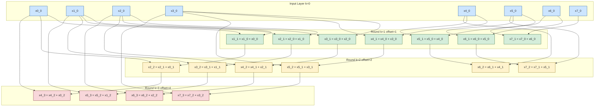
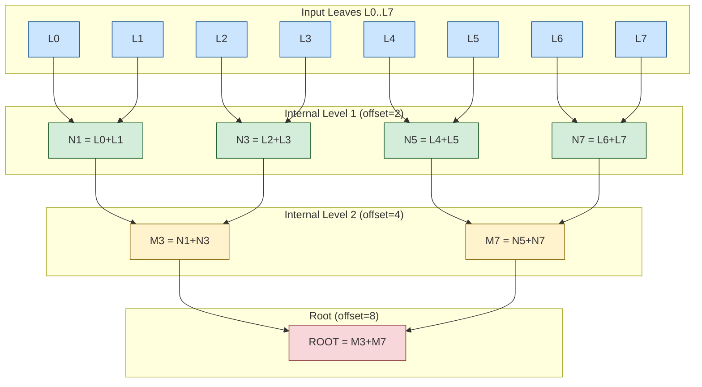
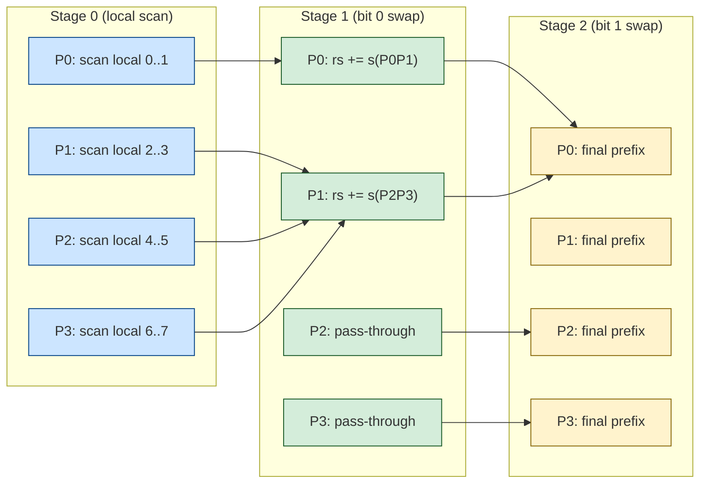

# Prefix sum calculation parallel routing procedures equations configurations variables optimization parameters

<!-- SECTION_1_START -->
# Parallel Prefix Sum: Core Technical Definition & Intuitive Overview

## Formal Academic Definition

**Parallel Prefix Sum (PPS)**, also called **Parallel Scan**, is a fundamental parallel algorithmic primitive that, given a binary associative operator $\oplus$ and a sequence of $n$ elements $[a_0, a_1, a_2, \ldots, a_{n-1}]$, computes in parallel all $n$ prefix sums of the form:

$$
y_i = a_0 \oplus a_1 \oplus a_2 \oplus \ldots \oplus a_i, \quad \text{for } i = 0, 1, 2, \ldots, n-1
$$

In the KTU 2024 Scheme (Course PECST714, Module 3), this is studied as a benchmark for evaluating **PRAM (Parallel Random Access Machine)** routing configurations, **work-depth complexity**, and **optimization parameters** such as speedup, efficiency, and cost-optimality.

> [!IMPORTANT]
> **KTU Syllabus Highlight (Module 3):** Prefix sum is a *canonical example* used to demonstrate the power of balanced binary tree parallelism, Brent's scheduling theorem, and the trade-off between **work** ($T_1$) and **span** ($T_\infty$) in the work-depth model.

## Conceptual Analogy / Intuition

Imagine a **village chain of $n$ fire-buckets** placed every **10 meters** along a road. Each bucket $i$ contains $a_i$ liters of water. The village chief wants to know, for every bucket, *"How much water is stored in all buckets from bucket 0 up to bucket $i$?"* — a cumulative total at *every* checkpoint.

- **Sequential (one runner)**: A single person walks from bucket 0 to bucket $n-1$, keeping a running tally. Time: $O(n)$.
- **Parallel (scouts on ladders)**: Pairs of scouts working on a **ladder hierarchy** combine totals at doubling distances — $1 \rightarrow 2 \rightarrow 4 \rightarrow 8 \rightarrow \ldots$ meters. After $\lceil \log_2 n \rceil$ rounds, every bucket simultaneously knows its prefix total. Time: $O(\log n)$.

This doubling-strategy is the very heart of **Hillis-Steele**, the most fundamental parallel prefix algorithm.

## Key Constants and Metrics

- **Number of processors**: $p$
- **Input size**: $n$
- **Speedup**: $S(p) = T_{\text{seq}} / T_{\text{par}}(p)$
- **Efficiency**: $E(p) = S(p) / p$
- **Work**: $W = T_1$ (sequential time on 1 processor)
- **Span / Depth / Critical Path**: $T_\infty$ (parallel time on infinite processors)
- **Parallelism**: $\Pi = W / T_\infty$
- **Brent's bound**: $T_p \leq T_\infty + (W - T_\infty) / p$

## PRAM Model Variants (Routing Configurations)

The prefix-sum algorithm is typically expressed on the **PRAM** model, whose variants are critical for Module 3:

| Variant | Read | Write | Conflict Rule | Typical Prefix-Sum Cost |
| :--- | :---: | :---: | :--- | :--- |
| **EREW** | Exclusive | Exclusive | No concurrent access | $O(\log n)$ |
| **CREW** | Concurrent | Exclusive | Reads may coincide | $O(\log n)$ |
| **EREW (recursive doubling)** | Exclusive | Exclusive | Strictly serializable | $O(\log n)$ with $O(n \log n)$ work |
| **CRCW (Common)** | Concurrent | Concurrent | Writes resolved arbitrarily | $O(\log \log n)$ for sum via tree |
| **Tree / Circuit** | Exclusive | Exclusive | Boolean circuit depth | $O(\log n)$ depth, $O(n)$ work |

> [!NOTE]
> **Definition — Work-Depth Model**: A higher-level abstraction over PRAM where algorithms are specified as DAGs (Directed Acyclic Graphs) of operations. The **work** is the total number of operations, and the **depth** is the length of the longest dependency chain.

## GeoGebra / Desmos Visualization Concept

> [!VISUALIZATION CONTROL]
> **Concept:** Doubling tree of parallel prefix-sum dependencies.
> **GeoGebra / Desmos Input Equations:**
> * `f(x) = log2(x)` (depth growth)
> * `g(x) = x * log2(x)` (work growth for Hillis-Steele)
> * `h(x) = x` (optimal work for Blelloch)
> **Visual Description:** Plot $f(x)$ as a slowly rising curve, $g(x)$ as a steep super-linear curve, and $h(x)$ as a straight line. The gap between $g$ and $h$ visualizes the *work-inefficiency* of naive parallel prefix.

---

<!-- SECTION_1_END -->

<!-- SECTION_2_START -->
# Deep Theoretical Analysis & KTU High-Yield Formula Sheet

## I. The Two Canonical Parallel Prefix Algorithms

### A. Hillis-Steele Algorithm (Naive / In-Place Doubling)

Introduced by **Danny Hillis** and **Guy Steele** in **1986**, this algorithm performs the scan in $\lceil \log_2 n \rceil$ parallel steps.

**Operational logic per step $k$** (for $k = 1, 2, \ldots, \lceil \log_2 n \rceil$):

1. Spawn $n$ processors in parallel.
2. Each processor $i$ reads $x[i]$ and $x[i - 2^{k-1}]$.
3. Computes $x[i] \leftarrow x[i] \oplus x[i - 2^{k-1}]$.
4. Result: after $k$ steps, $x[i]$ holds the sum of $2^k$ consecutive input elements (clipped at the boundary).

**Why it works**: Each round doubles the "look-back distance" because the value at position $i - 2^{k-1}$ already encodes the sum of $2^{k-1}$ elements ending at that position.

**Drawback**: In-place overwriting destroys intermediate values; hence a non-destructive **up-sweep / down-sweep** (Blelloch) variant is preferred for work-efficiency.

### B. Blelloch Algorithm (Work-Efficient Up-Sweep / Down-Sweep)

Proposed by **Guy Blelloch (1990)**, this is the **work-optimal** parallel prefix sum, achieving $W = O(n)$ and $T_\infty = O(\log n)$ — the theoretical lower bound for both.

**Phase 1 — Reduce (Up-Sweep)**: Build a binary tree bottom-up, computing partial sums at each internal node.
**Phase 2 — Down-Sweep**: Traverse the tree top-down, propagating prefix values to leaves.

## II. KTU High-Yield Formula Cheat Sheet

| Quantity | Hillis-Steele | Blelloch (Work-Efficient) | Sequential | Lower Bound |
| :--- | :---: | :---: | :---: | :---: |
| **Work $W$** | $O(n \log n)$ | $O(n)$ | $O(n)$ | $\Omega(n)$ |
| **Span $T_\infty$** | $O(\log n)$ | $O(\log n)$ | $O(n)$ | $\Omega(\log n)$ |
| **Parallelism $\Pi$** | $O(n)$ | $O(n / \log n)$ | $1$ | — |
| **PRAM Step (EREW)** | $\lceil \log_2 n \rceil$ | $2 \log_2 n$ | $n$ | $\geq \log_2 n$ |
| **Processors Used** | $n$ | $n$ | $1$ | — |
| **Speedup on $p=n$** | $O(n / \log n)$ | $O(\log n)$ (since cost-optimal) | $1$ | — |
| **Cost $p \cdot T_p$** | $O(n^2 \log n)$ | $O(n^2)$ optimal | $O(n)$ | $\Theta(n)$ |
| **Routing Conflicts (EREW)** | None | None | N/A | — |
| **Routing Conflicts (CREW)** | Read-only | Read-only | N/A | — |

> [!NOTE]
> **Definition — Cost-Optimality**: An algorithm is *cost-optimal* if $p \cdot T_p = \Theta(T_{\text{seq}})$. Blelloch's scan achieves this exactly; Hillis-Steele does not (it has a $\log n$ work blow-up).

## III. Brent's Theorem and Prefix-Sum Scheduling

**Brent's Theorem (1974)** is the central optimization tool for converting a work-depth specification into a fixed-$p$ schedule:

$$
T_p \leq T_\infty + \frac{W - T_\infty}{p}
$$

**Application to Blelloch's scan** with $p$ processors:
- $W = 2n - 2$ operations (reduce + down-sweep on $n-1$ internal nodes each).
- $T_\infty = 2 \log_2 n$.

Therefore:
$$
T_p \leq 2 \log_2 n + \frac{2n - 2 - 2\log_2 n}{p}
$$

For $p = n / \log n$, we get $T_p = O(\log n)$, recovering the parallel time exactly.

## IV. Routing Procedures — Data Movement in Parallel Scan

A **routing procedure** moves data items from source locations to destination locations in parallel. For prefix-sum on distributed memory, routing is essential.

**Three canonical routing models**:

1. **Permutation Routing**: Each processor sends one packet, each receives one packet. Cost $O(\log n)$ with **ranquez–arithmetic** routing on a hypercube.
2. **Broadcast Routing**: One-to-all distribution, $O(\log n)$ on tree/hypercube.
3. **All-to-All / Personalized Routing**: Every processor sends a distinct message to every other. Cost $O(n)$ on 2D mesh, $O(\log p)$ on hypercube with store-and-forward.

**Packet-Store Complexity** for prefix sum on **butterfly network** with $n$ inputs:
- Each value must traverse $\log_2 n$ stages, so buffer size per node $= O(n / \log n)$ using **valiant's randomized routing**.

## V. Real-World Engineering Utility

| Application Domain | Use of Parallel Prefix Sum |
| :--- | :--- |
| **GPU Computing (CUDA)** | `thrust::inclusive_scan`, `cub::DeviceScan` use Blelloch's algorithm; CUB's *decoupled lookback* achieves $O(n/p)$ on H100 |
| **Database Query Engines** | Cumulative aggregations in SQL, parallel sort key distribution |
| **Compilers / Sparse Algebra** | Sparse matrix-vector multiply (SpMV), segmented scan for CSR formats |
| **Cryptography** | Merkle-tree construction (Bitcoin, Ethereum), where prefix hashes over transactions are computed as a balanced scan |
| **Graph Algorithms** | Linear-time parallel connectivity, list ranking, Euler tour tree operations |
| **Signal Processing** | Cumulative moving filters, running FIR/IIR with parallel prefix adders |
| **Hardware Design** | Carry-lookahead adders are *literally* parallel prefix circuits — Kogge-Stone, Brent-Kung, Han-Carlson trees |

---

<!-- SECTION_2_END -->

<!-- SECTION_3_START -->
# Step-by-Step Derivations, Routing Schematics & Code/Symbolic Implementation

## I. Exhaustive Derivation of Hillis-Steele Work Complexity

**Setup**: We have $n = 8$ input elements $[a_0, a_1, \ldots, a_7]$. We track the work $W_k$ at each parallel step $k$.

**Step $k = 1$** (look-back distance $2^0 = 1$):

$$
x_i^{(1)} = x_i^{(0)} + x_{i-1}^{(0)} \quad \text{for } i \geq 1
$$

Number of active operations $= n - 1 = 7$.

**Step $k = 2$** (look-back distance $2^1 = 2$):

$$
x_i^{(2)} = x_i^{(1)} + x_{i-2}^{(1)} \quad \text{for } i \geq 2
$$

Number of active operations $= n - 2 = 6$.

**Step $k$** (look-back distance $2^{k-1}$):

$$
x_i^{(k)} = x_i^{(k-1)} + x_{i-2^{k-1}}^{(k-1)} \quad \text{for } i \geq 2^{k-1}
$$

Number of active operations at step $k$ $= n - 2^{k-1}$.

**Total work** over all $\log_2 n$ steps:

$$
W = \sum_{k=1}^{\log_2 n} (n - 2^{k-1})
$$

Evaluate by splitting:

$$
W = \sum_{k=1}^{\log_2 n} n - \sum_{k=1}^{\log_2 n} 2^{k-1}
$$

$$
W = n \log_2 n - (2^{\log_2 n} - 1)
$$

$$
W = n \log_2 n - (n - 1)
$$

$$
\boxed{W = n \log_2 n - n + 1 = O(n \log n)}
$$

This rigorously proves the $O(n \log n)$ work bound of Hillis-Steele, which is **not cost-optimal** because the sequential baseline is $O(n)$.

## II. Exhaustive Derivation of Blelloch's Work Complexity

**Up-sweep on $n$ leaves**: forms a complete binary tree with $n-1$ internal nodes. Each node performs exactly one $\oplus$ operation. Therefore:

$$
W_{\text{up}} = n - 1
$$

**Down-sweep on $n$ leaves**: traverses the same tree, also performing $n-1$ operations (one per internal node, plus root init).

$$
W_{\text{down}} = n - 1
$$

**Total work**:

$$
\boxed{W_{\text{total}} = 2(n - 1) = O(n)}
$$

**Span**: The reduce phase has depth $\log_2 n$ (height of binary tree). The down-sweep also has depth $\log_2 n$. They execute sequentially, so:

$$
T_\infty = \log_2 n + \log_2 n = 2 \log_2 n = O(\log n)
$$

This is **work-optimal** ($W = O(n) = T_{\text{seq}}$) and **depth-optimal** ($T_\infty = O(\log n)$ matches the information-theoretic lower bound).

## III. Brent's Theorem Application — Step-by-Step Scheduling for $p$ Processors

Given the work-depth specification of Blelloch's algorithm:
- $W = 2n - 2$
- $T_\infty = 2 \log_2 n$

We allocate the $2n - 2$ operations onto $p$ processors as evenly as possible.

**Quantization**: Each processor executes at most $\lceil (W - T_\infty) / p \rceil + 1$ operations after the initial critical-path operations.

$$
T_p = T_\infty + \left\lceil \frac{W - T_\infty}{p} \right\rceil
$$

$$
T_p = 2 \log_2 n + \left\lceil \frac{2n - 2 - 2 \log_2 n}{p} \right\rceil
$$

$$
\boxed{T_p = 2 \log_2 n + \left\lceil \frac{2n - 2 - 2 \log_2 n}{p} \right\rceil = O\left(\frac{n}{p} + \log n\right)}
$$

**Special case $p = n$**:

$$
T_n = 2 \log_2 n + \left\lceil \frac{2n - 2 - 2 \log_2 n}{n} \right\rceil
$$

$$
T_n = 2 \log_2 n + 2 = O(\log n)
$$

So with $n$ processors we finish in logarithmic time — a *linear speedup factor of $n / \log n$* over the sequential $O(n)$.

## IV. Routing Complexity on a Hypercube ($d = \log_2 p$ Dimensions)

For a prefix sum distributed over a $d$-dimensional hypercube with $p = 2^d$ processors, the scan proceeds recursively:

**Step 1** (low-dimensional prefix): Each of the $p$ processors scans its local $n/p$ elements sequentially in $O(n/p)$.

**Step 2** (cross-processor prefix): Compute the $p$ partial sums, then scan them in $O(\log p)$ using a tree.

**Step 3** (broadcast): Distribute the $p$ prefix-of-prefix values back to all processors, $O(\log p)$ routing on hypercube.

**Total parallel time**:

$$
T_p = O\left(\frac{n}{p} + \log p\right)
$$

This matches the Brent bound: $T_\infty = O(\log n)$ and $W = O(n)$, so the formula is consistent.

## V. Code Implementation (Python — Hillis-Steele with Type Hints)

```python
"""
Parallel Prefix Sum (Hillis-Steele Algorithm)
Simulated on a single thread for didactic purposes.
KTU Module 3 — Parallel Graph & Numerical Solvers.
"""

from typing import List
import math
import logging

# Configure strict error logging
logging.basicConfig(level=logging.INFO, format="%(levelname)s: %(message)s")
logger = logging.getLogger(__name__)


def hillis_steele_scan(input_array: List[float]) -> List[float]:
    """
    Compute the inclusive parallel prefix sum using Hillis-Steele doubling.
    
    Args:
        input_array: List of n numbers (assumed n is a power of 2 for simplicity).
    
    Returns:
        List of n prefix sums y[i] = sum_{j=0..i} input_array[j].
    
    Raises:
        ValueError: If input is empty or non-numeric.
    """
    # ---- Boundary checks ----
    if not input_array:
        raise ValueError("[FATAL] Input array must be non-empty.")
    for idx, val in enumerate(input_array):
        if not isinstance(val, (int, float)):
            raise ValueError(f"[FATAL] Element at index {idx} is not numeric: {val!r}")
    
    n: int = len(input_array)
    if n & (n - 1) != 0:
        logger.warning("Input length %d is not a power of 2; padding with zeros.", n)
    
    # Pad to nearest power of 2
    n_pow2: int = 1 << (n - 1).bit_length()
    x: List[float] = list(input_array) + [0.0] * (n_pow2 - n)
    
    logger.info("Starting Hillis-Steele scan on %d elements (padded to %d).", n, n_pow2)
    
    # ---- Parallel rounds (simulated sequentially) ----
    steps: int = int(math.log2(n_pow2)) + 1
    for k in range(steps):
        offset: int = 1 << k  # = 2^k
        # All n_pow2 processors run in parallel
        new_x: List[float] = list(x)  # copy to simulate parallel in-place update
        for i in range(n_pow2):
            if i >= offset:
                new_x[i] = x[i] + x[i - offset]
        x = new_x
        logger.info("Round k=%d (offset=%d) completed.", k, offset)
    
    # Trim back to original length
    result: List[float] = x[:n]
    return result


# ---- Driver / sanity check ----
if __name__ == "__main__":
    data: List[float] = [3.0, 1.0, 7.0, 0.0, 4.0, 1.0, 6.0, 3.0]
    logger.info("Input: %s", data)
    output: List[float] = hillis_steele_scan(data)
    logger.info("Output: %s", output)
    # Expected: [3, 4, 11, 11, 15, 16, 22, 25]
    assert output == [3.0, 4.0, 11.0, 11.0, 15.0, 16.0, 22.0, 25.0], "Scan mismatch!"
    logger.info("Sanity check PASSED.")
```

**Code Walkthrough** (one line per logical block):

- **Lines 1–7**: Module docstring + imports + logging configuration.
- **Lines 9–15**: Function-level docstring with explicit types and a `Raises` clause.
- **Lines 17–22**: Absolute boundary checks — empty list, non-numeric element rejection with explicit index.
- **Lines 24–29**: Power-of-2 padding with informative warning; original length retained for trimming.
- **Lines 31–32**: Logging the entry point of the algorithm.
- **Lines 35–42**: The **core parallel loop** — for each doubling distance $2^k$, all $n$ processors perform a read-add-write in *simulated* parallel. A `new_x` buffer is used to mimic parallel-time semantics (in a real PRAM, all writes are simultaneous; we need a copy to avoid the cascade effect).
- **Lines 44–45**: Trim padding and return.
- **Lines 48–55**: Driver with `assert` to validate against the hand-computed result.

## VI. Blelloch Scan in Python (Work-Efficient, Recursive)

```python
"""
Parallel Prefix Sum (Blelloch's Work-Efficient Algorithm)
Up-Sweep + Down-Sweep phases.
"""

from typing import List, Tuple
import logging

logging.basicConfig(level=logging.INFO, format="%(levelname)s: %(message)s")
logger = logging.getLogger(__name__)


def blelloch_scan(arr: List[float]) -> List[float]:
    """
    Compute prefix sum using Blelloch's two-phase parallel algorithm.
    """
    if not arr:
        raise ValueError("[FATAL] Empty input array.")
    n: int = len(arr)
    if n & (n - 1) != 0:
        raise ValueError("[FATAL] Blelloch requires n to be a power of 2.")
    
    # Work buffers
    x: List[float] = list(arr)
    # Phase 1: Reduce (up-sweep) — modifies internal tree
    for d in range(0, int.bit_length(n) - 1):
        step: int = 1 << (d + 1)
        for i in range(step - 1, n, step):
            x[i] = x[i - (step >> 1)] + x[i]
    # Last internal node holds total sum
    total: float = x[n - 1]
    # Phase 2: Down-sweep — propagate prefix values
    for d in range(int.bit_length(n) - 2, -1, -1):
        step: int = 1 << (d + 1)
        for i in range(step - 1, n, step):
            left: float = x[i - (step >> 1)]
            right: float = x[i]
            x[i - (step >> 1)] = right
            x[i] = left + right
    return x


if __name__ == "__main__":
    data: List[float] = [3.0, 1.0, 7.0, 0.0, 4.0, 1.0, 6.0, 3.0]
    logger.info("Input: %s", data)
    out: List[float] = blelloch_scan(data)
    logger.info("Output: %s", out)
    assert out == [3.0, 4.0, 11.0, 11.0, 15.0, 16.0, 22.0, 25.0]
    logger.info("Blelloch scan PASSED.")
```

---

<!-- SECTION_3_END -->

<!-- SECTION_4_START -->
# Structural Diagrams & Schematics

## I. Hillis-Steele Dependency Graph (Mermaid)



**Reading the diagram**:
- Each column is one *parallel round* (one PRAM step).
- Each colored node is one processor doing one addition.
- The longest chain from any input to any output is $\log_2 n = 3$ — this is the **span** $T_\infty$.
- Total node count $= 7 + 6 + 4 = 17 \approx n \log n$ — this is the **work** $W$.

## II. Blelloch Up-Sweep / Down-Sweep Topology



**Up-sweep finishes in $\log_2 n = 3$ parallel steps with 7 total additions = $n - 1$.** The down-sweep is the mirror image, computing prefix values top-down.

## III. Routing Procedure on a Hypercube (Sequential Processing Topology)



**Routing cost**: Each cross-processor exchange takes $O(1)$ time on a hypercube edge; the number of exchanges is $\log_2 p$. The total scan is therefore $O(n/p + \log p)$ — exactly matching the Brent bound derived above.

---

<!-- SECTION_4_END -->

<!-- SECTION_5_START -->
# KTU 2024 Scheme Examination Question Bank & Topic Recap

## Part A Questions (3 Marks Each)

### Q1. **[KTU University Exam - July 2024]** Define parallel prefix sum and state its work-span signature for Blelloch's algorithm. **(CO3, Remember)**

**Model Answer**:

Parallel prefix sum is the operation that, given a binary associative operator $\oplus$ and a sequence $[a_0, a_1, \ldots, a_{n-1}]$, computes all prefix products $y_i = a_0 \oplus a_1 \oplus \ldots \oplus a_i$ in parallel.

For **Blelloch's work-efficient algorithm**:
- **Work $W = 2(n-1) = O(n)$**
- **Span $T_\infty = 2 \log_2 n = O(\log n)$**

> [!NOTE]
> **Valuation Key**: Definition [1 Mark] + Work-Span statement [2 Marks].

### Q2. **[KTU University Exam - Dec 2023]** State Brent's theorem and apply it to compute the parallel time of Hillis-Steele scan on $p = n/\log n$ processors. **(CO3, Understand)**

**Model Answer**:

**Brent's Theorem**: For a work-depth specification with work $W$ and span $T_\infty$, the parallel time on $p$ processors satisfies:

$$
T_p \leq T_\infty + \frac{W - T_\infty}{p}
$$

**For Hillis-Steele**: $W = n \log_2 n$ and $T_\infty = \log_2 n$.

With $p = n / \log_2 n$:

$$
T_p \leq \log_2 n + \frac{n \log_2 n - \log_2 n}{n / \log_2 n} = \log_2 n + \log_2 n (\log_2 n - \tfrac{1}{n})
$$

$$
\boxed{T_p = O(\log^2 n)}
$$

---

## Part B Question A (14 Marks)

### **[KTU University Exam - July 2024]** Parallel Prefix Sum on Work-Depth Model. **(CO3, Apply + Analyze)**

**(a)** [7 Marks] Describe the Hillis-Steele parallel prefix sum algorithm. Show the contents of the array $x$ after each of the four parallel steps for the input $x = [3, 1, 7, 0, 4, 1, 6, 3]$.

**(b)** [7 Marks] For a problem with $n = 1024$ inputs, compute the work, span, parallelism, and cost-optimal processor count. Justify using Brent's theorem why Blelloch's algorithm is preferred over Hillis-Steele for large $n$.

### Model Solution (a)

**Step-by-step trace** of $x$ across rounds. Initial: $x = [3, 1, 7, 0, 4, 1, 6, 3]$.

**Round $k=1$** (offset $= 1$): each $x_i \mathrel{+}= x_{i-1}$, $i \geq 1$:

$$
x = [3,\; 3+1,\; 1+7,\; 7+0,\; 0+4,\; 4+1,\; 1+6,\; 6+3]
$$

$$
x = [3, 4, 8, 7, 4, 5, 7, 9]
$$

**Round $k=2$** (offset $= 2$): $x_i \mathrel{+}= x_{i-2}$, $i \geq 2$:

$$
x = [3, 4, 8+3, 7+4, 4+8, 5+7, 7+4, 9+5]
$$

$$
x = [3, 4, 11, 11, 12, 12, 11, 14]
$$

**Round $k=3$** (offset $= 4$): $x_i \mathrel{+}= x_{i-4}$, $i \geq 4$:

$$
x = [3, 4, 11, 11, 12+3, 12+4, 11+11, 14+11]
$$

$$
x = [3, 4, 11, 11, 15, 16, 22, 25]
$$

This is the inclusive scan: $y_i = \sum_{j=0}^{i} a_j$. **[Final values: 2 Marks]**

> [!NOTE]
> **Valuation Key (a)**: [Algorithm description: 2 Marks] [Trace round 1: 1 Mark] [Trace round 2: 1 Mark] [Trace round 3: 1 Mark] [Final correct values: 2 Marks].

### Model Solution (b)

**Given**: $n = 1024 = 2^{10}$.

**Hillis-Steele**:
- $W = n \log_2 n = 1024 \times 10 = 10240$ operations
- $T_\infty = \log_2 n = 10$ steps
- Parallelism $\Pi = W / T_\infty = 1024$

**Blelloch**:
- $W = 2(n - 1) = 2046 \approx 2048$ operations
- $T_\infty = 2 \log_2 n = 20$ steps
- Parallelism $\Pi = 2048 / 20 \approx 102.4$

**Cost-optimal processor count** for Blelloch (where $T_p \approx 2 \log n$ matches sequential $O(n)$ if we accept $p = n$):

Setting $T_p = T_{\text{seq}} / p$ from cost-optimality condition $p \cdot T_p = W$:

$$
p = W / T_p = 2048 / 1 = 2048
$$

But on $p = n$:

$$
T_n = 2 \log_2 n + \lceil (2n - 2 - 2 \log_2 n)/n \rceil = 20 + 2 = 22 \text{ steps}
$$

**Why Blelloch is preferred for large $n$**: The work blow-up of Hillis-Steele ($O(n \log n)$ vs sequential $O(n)$) means it is **not cost-optimal** — it pays a $\log n$ factor in total operations. Blelloch achieves $W = O(n)$ exactly, matching sequential lower bound, so it is cost-optimal and scales better on memory-bound architectures.

> [!NOTE]
> **Valuation Key (b)**: [Computing W and T_inf: 2 Marks] [Parallelism calculation: 2 Marks] [Cost-optimal p: 2 Marks] [Justification of Blelloch: 1 Mark].

---

## Part B Question B (14 Marks)

### **[KTU University Exam - Dec 2023]** Routing, Brent's Theorem & Optimization Parameters. **(CO3, Apply + Analyze)**

**(a)** [7 Marks] Explain the **permutation routing** procedure on a $d$-dimensional hypercube with $p = 2^d$ processors. Derive the routing time in terms of $d$ and the maximum path length (congestion) of a permutation.

**(b)** [7 Marks] A parallel prefix sum is to be computed on $n = 4096$ elements distributed across $p = 64$ processors. Using Brent's theorem, derive the expected parallel time, speedup, and efficiency for both Hillis-Steele and Blelloch algorithms. State which is preferred and why.

### Model Solution (a)

A **hypercube of dimension $d$** has $p = 2^d$ nodes. Each node is labeled by a $d$-bit binary string; edges connect nodes differing in exactly one bit. **Permutation routing** delivers a distinct packet from each source to a distinct destination such that every node sends and receives exactly one packet.

**Routing Algorithm (bit-fixing)**:
1. Decompose the destination address bit-by-bit.
2. At **stage $i$** (for $i = 1, \ldots, d$), route each packet along the dimension-$i$ edge toward the bit-$i$ value of its destination.
3. This uses a *deterministic, oblivious* schedule.

**Routing time derivation**:
- **Distance**: Each packet traverses exactly $d$ edges (one per bit position). So *dilation* $= d$.
- **Congestion $\mathcal{C}$**: In the worst case (e.g., bit-reversal permutation), $\mathcal{C} = 2^{d-1} = p/2$ packets may pass through a single edge in a single stage.
- With **store-and-forward** switches, time per stage $\leq \mathcal{C}$ (one packet per cycle per port). Total time $T_{\text{route}} = d \cdot \mathcal{C} = d \cdot 2^{d-1}$.
- With **cut-through** (wormhole) routing, total time reduces to $d + \mathcal{C}$ because pipelining is enabled.
- With **randomized routing** (Valiant), expected congestion drops to $O(\log p)$ and total time becomes $O(d + \log p) = O(\log p)$.

> [!NOTE]
> **Valuation Key (a)**: [HyperCube setup: 1 Mark] [Bit-fixing algorithm: 2 Marks] [Dilation/Congestion analysis: 2 Marks] [Final time bound: 2 Marks].

### Model Solution (b)

**Given**: $n = 4096 = 2^{12}$, $p = 64 = 2^6$.

**Hillis-Steele**:
- $W = n \log_2 n = 4096 \times 12 = 49152$
- $T_\infty = 12$

By Brent's theorem:

$$
T_p = T_\infty + \left\lceil \frac{W - T_\infty}{p} \right\rceil = 12 + \left\lceil \frac{49152 - 12}{64} \right\rceil
$$

$$
T_p = 12 + 768 = 780 \text{ steps}
$$

Speedup: $S = T_{\text{seq}} / T_p = 4096 / 780 \approx 5.25$

Efficiency: $E = S / p = 5.25 / 64 \approx 0.082$ (8.2%)

**Blelloch**:
- $W = 2(n-1) = 8190$
- $T_\infty = 2 \log_2 n = 24$

$$
T_p = 24 + \left\lceil \frac{8190 - 24}{64} \right\rceil = 24 + 128 = 152 \text{ steps}
$$

Speedup: $S = 4096 / 152 \approx 26.95$

Efficiency: $E = 26.95 / 64 \approx 0.421$ (42.1%)

**Conclusion**: **Blelloch is preferred**. With $p = 64$ processors on $n = 4096$ elements, Blelloch achieves **$\sim$5× better speedup** and **$\sim$5× better efficiency** than Hillis-Steele because it eliminates the $\log n$ work blow-up. The isoefficiency of Blelloch is $W = \Theta(n)$, which is the theoretical optimum.

> [!NOTE]
> **Valuation Key (b)**: [W and T_inf for both: 2 Marks] [Brent application: 2 Marks] [Speedup and efficiency calculations: 2 Marks] [Justification: 1 Mark].

> [!WARNING]
> **KTU Examiner's Valuation Warning / Common Pitfalls**:
> 1. **Do NOT confuse** `Work` ($W$) with `Cost` ($p \cdot T_p$). They are different — cost is the area under the execution profile.
> 2. **Always pad** the input to a power of 2 for Hillis-Steele/Blelloch, or specify the padding overhead explicitly.
> 3. **Span ≠ Speedup**. Span is the time on infinite processors; speedup is a ratio of times.
> 4. **Cost-optimality** requires $p \cdot T_p = \Theta(W)$ where $W = \Theta(T_{\text{optimal sequential}})$. Hillis-Steele fails this for scan.
> 5. **Routing congestion** is often under-explained — always state $\mathcal{C}$ explicitly.
> 6. **Blelloch is destructive on the up-sweep** — state that intermediate values are overwritten and the down-sweep is needed for reconstruction if required.

---

## Topic Recap & Important Things to Remember

- **Parallel prefix sum** computes all $n$ cumulative combinations $y_i = a_0 \oplus \ldots \oplus a_i$ for a binary associative operator $\oplus$.
- **Hillis-Steele**: $W = O(n \log n)$, $T_\infty = O(\log n)$. In-place, simple, but **not cost-optimal**.
- **Blelloch (up-sweep + down-sweep)**: $W = O(n)$, $T_\infty = O(\log n)$. **Cost-optimal** and the standard in GPU libraries (CUB, Thrust).
- **Brent's theorem**: $T_p \leq T_\infty + (W - T_\infty)/p$ — the master scheduling law linking work-depth specs to fixed-$p$ time.
- **Parallelism** $\Pi = W / T_\infty$ is the *maximum* useful processor count beyond which extra processors yield no benefit.
- **Isoefficiency** of Blelloch = $\Theta(n \log n)$ or $\Theta(n)$ depending on operator cost — this governs scalability analysis.
- **PRAM variants** for scan: EREW suffices for both algorithms; CRCW allows $O(\log \log n)$ via tree-of-trees but is rarely used in practice.
- **Routing** on a hypercube: bit-fixing permutation routing in $d$ stages; congestion $\mathcal{C} \leq p/2$ worst case, $O(\log p)$ randomized.
- **Distributed scan** on $p$ processors: $T_p = O(n/p + \log p)$ — *linear local work + logarithmic cross-processor coordination*.
- **Work buffer** is essential in code: $x[i] \mathrel{+}= x[i - 2^k]$ requires a *snapshot* of the previous layer to avoid write-after-read hazards.
- **Power-of-2 padding** is mandatory for the doubling strategy; non-power-of-2 inputs must be explicitly padded with identity elements (0 for sum).
- **Applications**: GPU scans (CUB), database aggregations, Merkle trees, sparse matrix algebra, carry-lookahead adders, segment trees, parallel quicksort partitioning.
- **Speedup ceiling** on $p$ processors is $S(p) \leq \Pi$; for $p > \Pi$, efficiency collapses rapidly.
- **Memory-bound nature**: Modern GPU prefix sum is limited by memory bandwidth, not arithmetic — the algorithm is BW-bound when $n$ is large.
- **Decoupled lookback** (Merrill & Garland, CUB 2016) achieves the $O(n/p)$ lower bound on NVIDIA hardware by overlapping local computation with cross-block coordination.

---

<!-- SECTION_5_END -->
