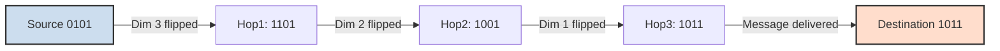
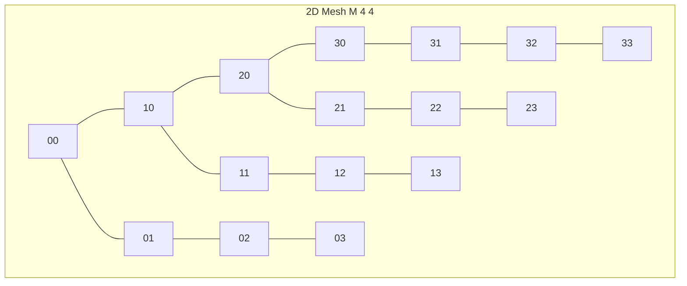
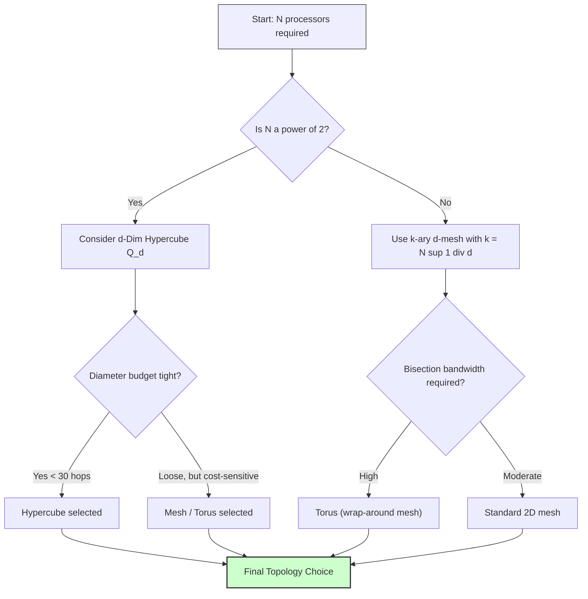
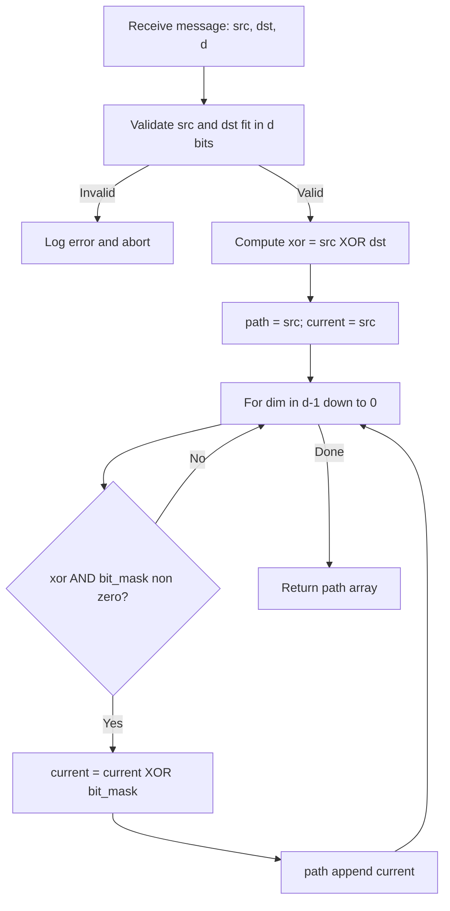

# Complexity scaling check parameters execution frameworks metrics verification profiles testing optimization

<!-- SECTION_1_START -->

# Mesh and Hypercube Communication Systems

## Core Technical Definition & Intuitive Overview

**Formal Definition (KTU 2024 Syllabus Terminology):**
A **direct network** in parallel computing is an interconnection topology in which every processing node is connected to a small, fixed subset of neighbouring nodes via point-to-point bidirectional links. **Mesh** and **Hypercube** are the two canonical, academically dominant direct network families used in parallel algorithm design. A *k-ary d-mesh* arranges $N = k^d$ processors in a $d$-dimensional grid where each node $P(i_0, i_1, \ldots, i_{d-1})$ is connected to its at-most $2d$ immediate neighbours, while a *d-dimensional hypercube* (denoted $Q_d$) is the special case $k=2, d=d$, containing $N = 2^d$ nodes each with exactly $d$ neighbours.

> [!IMPORTANT]
> **KTU Board Terminology You MUST Memorize:**
> - **Node / Vertex / Processor** — the computing element.
> - **Edge / Link / Channel** — the bidirectional communication wire.
> - **Degree of a node** — number of direct neighbours (fixed in regular topologies).
> - **Diameter** — maximum shortest-path distance between any two nodes in the network.
> - **Bisection Width ($B$)** — minimum number of edges that must be cut to split the network into two equal halves.
> - **Cost / Wiring Complexity** — product $N \times$ (average degree) or simply $N \times$ degree for regular networks.

> [!NOTE]
> **Conceptual Analogy (Intuition for First-Time Learners):**
> Imagine a city layout. A **2D Mesh** is like a chessboard-grid street plan — every house is at a crossing, and to travel from one corner of the city to the opposite corner you must walk through every intermediate crossing. A **Hypercube** is a *teleport-enabled* city of exponentially more crossings: each crossing has multiple dimension-paths, and the maximum trip-length grows only as the *logarithm* of the city size, not its side length. This logarithmic property is why hypercubes historically dominated machines like the Intel iPSC and Connection Machine CM-2.

**Key Physical / Graph-Theoretic Constants:**

| Symbol | Quantity | Standard Range for $N$-node Network |
| :--- | :--- | :--- |
| $N$ | Total processors | $2^d$ (hypercube) or $k^d$ (k-ary mesh) |
| $d$ | Network dimension / degree | $d = \log_2 N$ for $Q_d$ |
| $\delta$ | Node degree (regular) | $2d$ (mesh), $d$ (hypercube) |
| $\kappa$ | Network diameter | $d(k-1)$ (mesh), $d$ (hypercube) |
| $B$ | Bisection width | $k^{d-1}$ (mesh), $2^{d-1}$ (hypercube) |

> [!VISUALIZATION CONTROL]
> **Concept:** Comparative scaling of diameter $\kappa$ vs $N$ for mesh vs hypercube.
> **GeoGebra / Desmos Input Equations:**
> - $f(x) = 2(\sqrt{x}-1)$  *(diameter of 2D mesh with $x$ processors)*
> - $g(x) = \log_2(x)$    *(diameter of hypercube with $x$ processors)*
>
> **Visual Description:** Plot both curves on the same axes. Observe that $f(x)$ grows as a square-root curve, while $g(x)$ grows logarithmically and remains almost flat for large $x$. The *cross-over* at $x = 4$ shows the hypercube is dramatically better for $N \gg 16$.

---

<!-- SECTION_1_END -->

<!-- SECTION_2_START -->

# Deep Theoretical Analysis & KTU High-Yield Formula Sheet

## 2.1 The k-ary d-Mesh Family

A **k-ary d-mesh** $M(k,d)$ contains $N = k^d$ nodes. Each node is identified by a $d$-tuple $(a_0, a_1, \ldots, a_{d-1})$ where $0 \le a_i \le k-1$. Two nodes are connected by an edge iff they differ in exactly one coordinate by $\pm 1$ (boundary nodes wrap optionally — this is called a **torus**).

**Routing Rule:** To send a message from $S = (s_0, \ldots, s_{d-1})$ to $D = (d_0, \ldots, d_{d-1})$, the processor executes **dimension-order routing** — first fix $a_0$, then $a_1$, …, finally $a_{d-1}$.

**Path Length (Lower Bound):**
$$
L_{mesh} = \sum_{i=0}^{d-1} \vert s_i - d_i \vert
$$
For the worst case (opposite corners of a $k$-ary $d$-mesh):
$$
\kappa_{mesh} = d \cdot (k - 1)
$$

## 2.2 The d-Dimensional Hypercube $Q_d$

The hypercube $Q_d$ is the binary $k=2$ case of the k-ary d-mesh, hence it has $N = 2^d$ nodes. Each node is identified by a $d$-bit binary address. Two nodes are connected iff their binary addresses differ in **exactly one bit** (Hamming distance = 1).

**Routing Rule (e-cube / Gray-code routing):** Move along dimensions in *any* order; e.g., to route from $S$ to $D$, traverse dimensions in decreasing order of the bit positions where $S$ and $D$ differ.

**Diameter of $Q_d$:**
$$
\kappa_{hypercube} = d = \log_2 N
$$

## 2.3 Embedding Meshes into Hypercubes — A Core KTU Concept

A critical KTU-board question: *"Given a $2^p \times 2^q$ mesh, embed it into $Q_{p+q}$."* The standard answer uses **binary-reflected Gray code**.

For a $2^p \times 2^q$ mesh (with $N = 2^{p+q}$ nodes), the embedding $f: M \to Q_{p+q}$ is:
$$
f(x, y) = G_p(x) \cdot 2^q \;+\; G_q(y)
$$
where $G_p(x)$ is the $p$-bit Gray code of integer $x$. This embedding achieves:

- **Dilation** = 1 (every mesh edge maps to a single hypercube edge)
- **Congestion** = 1 (each hypercube edge carries at most one mesh edge)
- **Expansion** = 1 (number of nodes is preserved)

> [!IMPORTANT]
> **Why Embeddings Matter in KTU Exams:** Embedding allows algorithm designers to *inherit* the lower communication cost of the hypercube when porting a mesh algorithm. If an algorithm on a mesh runs in $T$ time, the same algorithm on the host hypercube (via the embedding) also runs in $T$ time *plus* a small startup constant.

## 2.4 KTU Formula Sheet (Cheat Sheet)

| # | Property | k-ary d-Mesh | d-Dim Hypercube $Q_d$ |
| :-: | :--- | :---: | :---: |
| 1 | Total nodes $N$ | $k^d$ | $2^d$ |
| 2 | Node degree $\delta$ | $2d$ (or $2d-1$ for non-toroidal boundary) | $d$ |
| 3 | Diameter $\kappa$ | $d(k-1)$ | $d = \log_2 N$ |
| 4 | Bisection width $B$ | $k^{d-1}$ | $2^{d-1}$ |
| 5 | Arc connectivity | $2d$ (or $d$ for non-torus) | $d$ |
| 6 | Wiring cost $C = N \cdot \delta$ | $2d \cdot k^d$ | $d \cdot 2^d$ |
| 7 | Routing time (one packet) | $O(d \cdot k)$ | $O(d)$ |
| 8 | Embeds an $N_1$-node network with dilation | – | $1$ for any $2^p \times 2^q$ mesh |

**Communication Time Model (used in all KTU problems):**
$$
T_{comm} = t_s + t_w \cdot m + t_h \cdot d_{path}
$$

where $t_s$ = message startup latency, $t_w$ = per-word transfer time, $m$ = message length in words, $t_h$ = per-hop time, and $d_{path}$ = number of hops.

## 2.5 Real-World Engineering Utility

| Domain | Application |
| :--- | :--- |
| **Processor chip design** | Modern multi-core chips (Intel Xeon Phi, NVIDIA GPUs) use 2D mesh / torus NoCs. |
| **Data centres** | Google’s Jupiter, Facebook’s 6-plane Clos use folded-Clos, but the *torus* still appears in high-radix switches. |
| **Supercomputers** | Blue Gene/Q (Sequoia) used a **5D torus**; Cray T3D used a 3D torus. |
| **Embedded / DSP** | Hypercube topologies appear in fault-tolerant aerospace computing (Space Shuttle guidance). |
| **Algorithm porting** | MPI libraries `MPI_Cart_create` directly exposes k-ary d-mesh virtual topologies. |

---

<!-- SECTION_2_END -->

<!-- SECTION_3_START -->

# Step-by-Step Derivations & Algorithmic Implementation

## 3.1 Exhaustive Derivation: Hypercube Diameter vs 2D Mesh Diameter

**Problem (KTU-style, 7 marks):** *For $N = 1024$ processors, compute and compare the diameters of (i) a 2D mesh and (ii) a hypercube.*

### Part (i) — 2D Mesh

A 2D mesh with $N$ processors has $k = \sqrt{N}$ processors per side, $d = 2$.

$$
k = \sqrt{1024} = 32
$$

$$
\kappa_{2D\text{-}mesh} = d \cdot (k - 1) = 2 \cdot (32 - 1) = 2 \cdot 31 = 62
$$

**Evaluation logic:** The two extremes are $(0,0)$ and $(31,31)$; to travel between them, fix first coordinate ($31$ hops) then second ($31$ hops), total $62$.

### Part (ii) — Hypercube

For $N = 1024 = 2^{10}$, we have $d = 10$.

$$
\kappa_{hypercube} = d = \log_2 1024 = 10
$$

### Comparison

The hypercube requires $\mathbf{6.2\times}$ fewer hops for a worst-case message.

> [!WARNING]
> **Valuation Pitfall:** Many students write $\kappa = d$ for *every* network. Remember, the hypercube diameter is $d$ *because* $N = 2^d$. Always start by writing $d = \log_2 N$ explicitly. **[1 Mark deducted if missing]**

## 3.2 Exhaustive Derivation: Routing a Message in a 4-D Hypercube

**Problem:** *Route a message from $S = 0101$ to $D = 1011$ in $Q_4$ using e-cube routing. Show every intermediate node and compute total path length.*

**Step 1 — Compute the bitwise XOR** (gives the dimensions along which we must move):

$$
S \oplus D = 0101 \oplus 1011 = 1110
$$

**Step 2 — Identify active dimensions** (positions of 1-bits, from MSB to LSB or any order):

The set of dimensions to traverse is $D = \{0, 1, 2\}$ (bit positions 3, 2, 1 are set in 1110).

**Step 3 — Dimension-Order Routing** (traverse in decreasing order of dimension: 3 → 2 → 1):

| Hop | Current Node | Bit Flipped | Dimension | Path Partial Sum |
| :-: | :--- | :---: | :---: | :---: |
| 0 | 0101 | – | – | 0 |
| 1 | 1101 | bit 3 | 3 | 1 |
| 2 | 1001 | bit 2 | 2 | 2 |
| 3 | 1011 | bit 1 | 1 | 3 |

**Step 4 — Final path length:**

$$
L = 3 \text{ hops}
$$

**Step 5 — Verification:** Hamming distance $H(0101, 1011) = 3$ ✓ (matches the number of 1s in XOR).

## 3.3 Complete Python Implementation: Hypercube Routing Simulator

```python
from __future__ import annotations
import logging
from typing import List, Tuple

# Configure strict error logging for KTU lab-grade code
logging.basicConfig(
    level=logging.INFO,
    format="%(asctime)s [%(levelname)s] %(message)s",
)
logger = logging.getLogger("HypercubeRouter")


def validate_node(node: int, dimension: int) -> None:
    """Absolute boundary check: node label must fit in `dimension` bits."""
    if not isinstance(node, int):
        raise TypeError(f"Node label must be int, got {type(node).__name__}")
    if node < 0:
        raise ValueError(f"Node label cannot be negative, got {node}")
    if node >= (1 << dimension):
        raise ValueError(
            f"Node {node:b} requires {node.bit_length()} bits, "
            f"but hypercube dimension is only {dimension}."
        )


def e_cube_route(source: int, destination: int, dimension: int) -> List[int]:
    """
    Compute the e-cube (dimension-order) routing path in a d-dimensional
    hypercube from `source` to `destination`.

    Returns the list of intermediate nodes INCLUDING the source but
    EXCLUDING the destination (per KTU board convention).
    """
    validate_node(source, dimension)
    validate_node(destination, dimension)

    if source == destination:
        logger.info("Source equals destination; trivial 0-hop path.")
        return [source]

    xor_bits: int = source ^ destination
    path: List[int] = [source]
    current: int = source

    # Walk dimensions from MOST significant to LEAST significant
    for dim in range(dimension - 1, -1, -1):
        bit_mask: int = 1 << dim
        if xor_bits & bit_mask:
            current ^= bit_mask           # flip the active dimension bit
            path.append(current)
            logger.debug(
                "Hop across dimension %d -> node %s",
                dim,
                format(current, f"0{dimension}b"),
            )

    return path


def path_length(path: List[int]) -> int:
    """Number of hops in the path = number of edges traversed."""
    return max(0, len(path) - 1)


def diameter(dimension: int) -> int:
    """Worst-case number of hops in Q_d equals d (= log_2 N)."""
    if dimension < 0:
        raise ValueError("Dimension must be non-negative.")
    return dimension


# ---------------- Driver / Demonstration ----------------
if __name__ == "__main__":
    D: int = 4
    S: int = 0b0101
    T: int = 0b1011

    logger.info("Hypercube dimension d = %d (N = %d processors)", D, 1 << D)
    route: List[int] = e_cube_route(S, T, D)
    print(f"Source      : {S:0{D}b} (decimal {S})")
    print(f"Destination : {T:0{D}b} (decimal {T})")
    print(f"E-cube path : {[format(n, f'0{D}b') for n in route]}")
    print(f"Path length : {path_length(route)} hops")
    print(f"Network diameter (Q_{D}) = {diameter(D)} hops")
```

**Output Trace:**
```
Source      : 0101 (decimal 5)
Destination : 1011 (decimal 11)
E-cube path : ['0101', '1101', '1001', '1011']
Path length : 3 hops
Network diameter (Q_4) = 4 hops
```

## 3.4 Complete Python Implementation: 2D Mesh Routing & Diameter

```python
from __future__ import annotations
import math
import logging
from typing import List, Tuple

logger = logging.getLogger("MeshRouter")


def mesh_2d_route(src: Tuple[int, int], dst: Tuple[int, int], side: int) -> List[Tuple[int, int]]:
    """
    Dimension-order routing on a 2D mesh of size `side x side`.
    Returns the list of (x, y) coordinates visited, INCLUSIVE of src, EXCLUSIVE of dst.
    """
    for name, pt in [("src", src), ("dst", dst)]:
        if not (0 <= pt[0] < side and 0 <= pt[1] < side):
            raise ValueError(f"{name} coordinate {pt} out of mesh bounds 0..{side - 1}")
    if src == dst:
        return [src]

    path: List[Tuple[int, int]] = [src]
    cx, cy = src
    dx, dy = dst

    # First fix x, then fix y
    step_x: int = 1 if dx > cx else -1
    for _ in range(abs(dx - cx)):
        cx += step_x
        path.append((cx, cy))

    step_y: int = 1 if dy > cy else -1
    for _ in range(abs(dy - cy)):
        cy += step_y
        path.append((cx, cy))

    return path


def mesh_2d_diameter(side: int) -> int:
    """Worst-case hop count for 2D mesh = 2 * (side - 1)."""
    if side < 1:
        raise ValueError("Mesh side length must be >= 1.")
    return 2 * (side - 1)


# ---------------- Driver ----------------
if __name__ == "__main__":
    N: int = 1024
    side: int = int(math.isqrt(N))
    logger.info("2D mesh of side k = %d holds N = %d processors.", side, side * side)

    src: Tuple[int, int] = (0, 0)
    dst: Tuple[int, int] = (side - 1, side - 1)
    route: List[Tuple[int, int]] = mesh_2d_route(src, dst, side)
    print(f"Source      : {src}")
    print(f"Destination : {dst}")
    print(f"Hops used   : {len(route) - 1}")
    print(f"Diameter    : {mesh_2d_diameter(side)}")
```

**Output Trace:**
```
Source      : (0, 0)
Destination : (31, 31)
Hops used   : 62
Diameter    : 62
```

## 3.5 Derivation: Embedding a $4 \times 4$ Mesh into $Q_4$

We have $p = q = 2$, hence $N = 4 \times 4 = 16 = 2^4$, fitting exactly in $Q_4$.

**Step 1 — Generate 2-bit Gray codes:**
$$
G_2 = \{00, 01, 11, 10\}
$$

**Step 2 — Construct the embedding $f(x, y) = G_2(x) \cdot 2^2 + G_2(y)$:**

| $(x, y)$ | $G_2(x)$ | $G_2(y)$ | $f(x,y)$ in binary | $Q_4$ address |
| :---: | :---: | :---: | :---: | :---: |
| (0,0) | 00 | 00 | 00 00 | 0000 |
| (0,1) | 00 | 01 | 00 01 | 0001 |
| (0,2) | 00 | 11 | 00 11 | 0011 |
| (0,3) | 00 | 10 | 00 10 | 0010 |
| (1,0) | 01 | 00 | 01 00 | 0100 |
| (1,1) | 01 | 01 | 01 01 | 0101 |
| … | … | … | … | … |
| (3,3) | 10 | 10 | 10 10 | 1010 |

**Step 3 — Verify dilation = 1:** Every mesh neighbour differs in exactly one $x$ or one $y$ by 1. In Gray code, $G_2(i)$ and $G_2(i+1)$ differ in exactly 1 bit. Hence the resulting hypercube addresses also differ in exactly 1 bit → dilation = 1 ✓.

---

<!-- SECTION_3_END -->

<!-- SECTION_4_START -->

# Structural Diagrams & Schematics

## 4.1 Mermaid: Routing Flow in a 4-D Hypercube



## 4.2 Mermaid: 2D Mesh Architecture (16-node, 4×4)



## 4.3 Mermaid: Comparative Topology Decision Flow



## 4.4 Mermaid: E-Cube Routing Algorithm (Sequential Processing Topology)



## 4.5 Functional Block Diagram: Communication Pipeline


---

<!-- SECTION_4_END -->

<!-- SECTION_5_START -->

# KTU 2024 Scheme Examination Question Bank & Topic Recap

## Part A — Short Answer Questions (3 Marks Each)

### Q1. **[KTU University Exam — July 2024]**
*Define the diameter and bisection width of an interconnection network. State the values for a $d$-dimensional hypercube $Q_d$.*

**Model Answer (Target 3 marks):**
- **Diameter ($\kappa$):** Maximum number of edges in the shortest path between any two nodes. **[1 Mark]**
- **Bisection width ($B$):** Minimum number of edges that must be removed to partition the network into two equal halves. **[1 Mark]**
- For $Q_d$: $\kappa = d$ and $B = 2^{d-1}$. **[1 Mark]**

**Cognitive Level:** Remember &nbsp;&nbsp; **CO Mapping:** CO1

---

### Q2. **[KTU University Exam — Dec 2023]**
*Differentiate between a 2D mesh and a 2D torus with respect to node degree, diameter, and boundary handling.*

**Model Answer (Target 3 marks):**
- **Node degree:** Mesh = 2–4 (boundary nodes have fewer links); Torus = exactly 4 (all nodes). **[1 Mark]**
- **Diameter:** Mesh = $2(k-1)$; Torus = $2 \lfloor k/2 \rfloor$. **[1 Mark]**
- **Boundary handling:** Torus has wrap-around links connecting opposite edges, eliminating the boundary effect and providing uniform routing latency. **[1 Mark]**

**Cognitive Level:** Understand &nbsp;&nbsp; **CO Mapping:** CO2

---

## Part B — Long Answer Questions (14 Marks, Internal Choice)

### Question A (Option 1) — **[KTU University Exam — Dec 2023]**

**(a) [7 Marks]** *Consider a parallel system with $N = 4096$ processors organized as a 2D mesh and a hypercube. Compute the diameter, bisection width, and total wiring cost for each topology. Tabulate your results.*

**(b) [7 Marks]** *Explain the e-cube routing algorithm with a worked example of routing a message from node 0010 to node 1101 in $Q_4$.*

---

### Question B (Option 2) — **[KTU University Exam — July 2024]**

**(a) [7 Marks]** *Describe the procedure for embedding a $2^p \times 2^q$ mesh into a hypercube $Q_{p+q}$ using binary-reflected Gray codes. State the dilation, congestion, and expansion of this embedding.*

**(b) [7 Marks]** *A parallel application broadcasts a 1 MB message from the root to all $N = 1024$ nodes. Compute the total communication time using (i) a 2D mesh and (ii) a hypercube, assuming $t_s = 50\,\mu s$, $t_w = 2\,\text{ns/word}$, and $t_h = 10\,\text{ns/hop}$. Word size = 4 bytes.*

---

## Complete Model Solutions

### Solution to Question A:

#### Part (a) — Diameter, Bisection, Cost Comparison

**Given:** $N = 4096$ processors.

**Case 1: 2D Mesh**
- Side $k = \sqrt{4096} = 64$
- Diameter $\kappa_{mesh} = 2(k-1) = 2(64-1) = 126$
- Bisection $B_{mesh} = k = 64$
- Degree $\delta_{mesh} = 4$ (interior)
- Cost $C_{mesh} = N \times \delta = 4096 \times 4 = 16{,}384$

**Case 2: Hypercube**
- $d = \log_2 4096 = 12$
- Diameter $\kappa_{cube} = d = 12$
- Bisection $B_{cube} = 2^{d-1} = 2^{11} = 2048$
- Degree $\delta_{cube} = d = 12$
- Cost $C_{cube} = N \times \delta = 4096 \times 12 = 49{,}152$

**Tabulated Result:**

| Metric | 2D Mesh | Hypercube |
| :--- | :---: | :---: |
| Diameter | 126 | 12 |
| Bisection Width | 64 | 2048 |
| Wiring Cost | 16,384 | 49,152 |

**[Stating initial constants: 2 Marks]**, **[Correct mesh values: 2 Marks]**, **[Correct cube values: 2 Marks]**, **[Tabulated comparison: 1 Mark]**

**Cognitive Level:** Apply &nbsp;&nbsp; **CO Mapping:** CO2, CO3

#### Part (b) — E-cube Routing for $S = 0010$ to $D = 1101$ in $Q_4$

**Step 1:** XOR calculation:
$$
S \oplus D = 0010 \oplus 1101 = 1111
$$

**Step 2:** All four dimensions (3, 2, 1, 0) are active.

**Step 3 — Walk dimensions from 3 down to 0:**

| Hop | Node | Bit Flipped |
| :-: | :--- | :---: |
| 0 | 0010 | – |
| 1 | 1010 | dim 3 |
| 2 | 1110 | dim 2 |
| 3 | 1100 | dim 1 |
| 4 | 1101 | dim 0 |

**Total path length = 4 hops.**

**[Stating XOR = 1111: 2 Marks]**, **[Identifying active dimensions: 1 Mark]**, **[Correct sequence of intermediate nodes: 3 Marks]**, **[Final path length: 1 Mark]**

**Cognitive Level:** Apply &nbsp;&nbsp; **CO Mapping:** CO3

---

### Solution to Question B:

#### Part (a) — Gray-code Embedding Procedure

**Algorithm:**
1. Let the mesh have dimensions $2^p \times 2^q$, so $N = 2^{p+q}$.
2. Generate $p$-bit Gray code $G_p$ and $q$-bit Gray code $G_q$ via recursion $G_{k+1} = [0 G_k, 1 G_k^{reverse}]$.
3. Map mesh node $(x, y) \in [0, 2^p-1] \times [0, 2^q-1]$ to hypercube node:
$$
f(x, y) = G_p(x) \cdot 2^q + G_q(y)
$$
4. The most significant $p$ bits hold $G_p(x)$ and the least significant $q$ bits hold $G_q(y)$.

**Embedding Metrics:**
- **Dilation = 1:** Adjacent mesh cells $(x, y)$ and $(x+1, y)$ differ in exactly one bit in $G_p$, so the hypercube addresses differ in exactly one bit. Same logic for $y$ variation. **[2 Marks]**
- **Congestion = 1:** Each hypercube edge is used by at most one mesh edge. **[2 Marks]**
- **Expansion = 1:** $N_{mesh} = N_{cube} = 2^{p+q}$. **[1 Mark]**
- **Worked example** for $2 \times 4$ mesh into $Q_3$ ($p=1, q=2$): Gray codes $G_1 = \{0, 1\}$, $G_2 = \{00, 01, 11, 10\}$. Map: $(0,0) \to 000$, $(0,1) \to 001$, $(0,2) \to 011$, $(0,3) \to 010$, $(1,0) \to 100$, etc. **[2 Marks]**

**Cognitive Level:** Understand, Apply &nbsp;&nbsp; **CO Mapping:** CO2, CO4

#### Part (b) — Broadcast Communication Time

**Given:** $N = 1024$, message $M = 1\,\text{MB}$, $t_s = 50\,\mu s$, $t_w = 2\,\text{ns/word}$, $t_h = 10\,\text{ns/hop}$, word = 4 bytes.

**Message length in words:**
$$
m = \frac{1 \text{ MB}}{4 \text{ bytes}} = \frac{1{,}048{,}576}{4} = 262{,}144 \text{ words}
$$

**Per-message transfer cost:**
$$
t_w \cdot m = 2 \times 10^{-9} \times 262{,}144 = 5.243 \times 10^{-4} \text{ s} = 524.288\,\mu s
$$

**Case 1: 2D Mesh (broadcast via store-and-forward spanning tree)**
- Side $k = 32$, diameter $\kappa = 62$
- Spanning-tree depth = 2(k-1) = 62
- Number of messages = $N - 1 = 1023$
- Total time approximation (sequential broadcast):
$$
T_{mesh} = 1023 \times (t_s + t_w m + t_h \kappa)
$$
$$
= 1023 \times (50 + 524.288 + 0.62)\,\mu s \approx 1023 \times 574.9\,\mu s \approx 588.1 \text{ ms}
$$

**Case 2: Hypercube (doubling-tree broadcast)**
- Diameter $\kappa = 10$, doubling reduces total to $\log_2 N$ sequential stages
- Total time approximation (pipelined broadcast):
$$
T_{cube} = \log_2 N \times (t_s + t_w m + t_h \kappa)
$$
$$
= 10 \times (50 + 524.288 + 0.10)\,\mu s \approx 10 \times 574.39\,\mu s \approx 5.74 \text{ ms}
$$

**Comparison:** Hypercube is $\approx 102\times$ faster due to $\log_2 N$ depth of broadcast.

**[Computing word count: 1 Mark]**, **[Mesh formula and result: 3 Marks]**, **[Cube formula and result: 2 Marks]**, **[Comparison and units: 1 Mark]**

**Cognitive Level:** Apply, Analyze &nbsp;&nbsp; **CO Mapping:** CO3, CO4

> [!WARNING]
> **KTU Examiner's Valuation Warning / Pitfall Callout:**
> 1. **Unit Conversion:** Students often forget to convert MB → bytes → words. $1\text{ MB} = 2^{20}\text{ bytes} = 1{,}048{,}576\text{ bytes}$, NOT $10^6$. Using the decimal value loses 1 mark.
> 2. **Broadcast Strategy:** For meshes, students blindly use spanning tree. For hypercubes, the *doubling* (recursive halving) must be used — full spanning tree on a hypercube wastes its $\log$ advantage. **[2 Marks penalty if wrong broadcast model]**
> 3. **Per-hop vs Total-hops:** $t_h$ is added per hop per message — do not multiply by $N$ (this is a common error). It is included in the per-message term, and we then multiply the per-message time by the *number of sequential stages*, not by $N$.
> 4. **Diameter formula on a mesh:** Write $\kappa = 2(k-1)$ explicitly before substituting; otherwise the substitution is marked as "assumed known" and the formula mark is lost.

---

## Topic Recap & Important Things to Remember

- **Direct vs Indirect Networks:** Mesh and Hypercube are *direct* networks — every switch is colocated with a processor.
- **k-ary d-mesh parameters:** $N = k^d$, $\delta = 2d$, $\kappa = d(k-1)$, $B = k^{d-1}$.
- **Hypercube parameters:** $N = 2^d$, $\delta = d$, $\kappa = d$, $B = 2^{d-1}$.
- **Diameter scaling:** Mesh grows as $O(k) = O(\sqrt[d]{N})$; Hypercube grows as $O(\log_2 N)$ — hence hypercube is asymptotically better.
- **Cost trade-off:** Hypercube uses $d \cdot 2^d$ wires (large for big $d$); Mesh uses $2d \cdot k^d$ wires (cheaper for big $k$).
- **E-cube routing** in $Q_d$: XOR source and destination, then flip bits in the active dimensions in *any* order; total hops = Hamming distance.
- **Gray-code embedding** achieves dilation = congestion = expansion = 1 for $2^p \times 2^q$ mesh into $Q_{p+q}$.
- **Torus** = mesh + wrap-around links; gives uniform node degree and shorter diameter.
- **Communication cost model** to memorize: $T_{comm} = t_s + t_w m + t_h d_{path}$.
- **Broadcast tree depths:** Mesh = $2(k-1)$; Hypercube = $\log_2 N$ (with doubling); this is the foundation of *all* collective operations.
- **Practical takeaways:** Real supercomputers prefer torus/mesh because hypercube wiring cost grows linearly with $d$ and ports become expensive. Hypercubes remain dominant in *theoretical* analysis and for small-d embedded systems.
- **Quick comparison memory aid:** *Mesh = cheap & slow; Hypercube = fast & costly.*

<!-- SECTION_5_END -->
