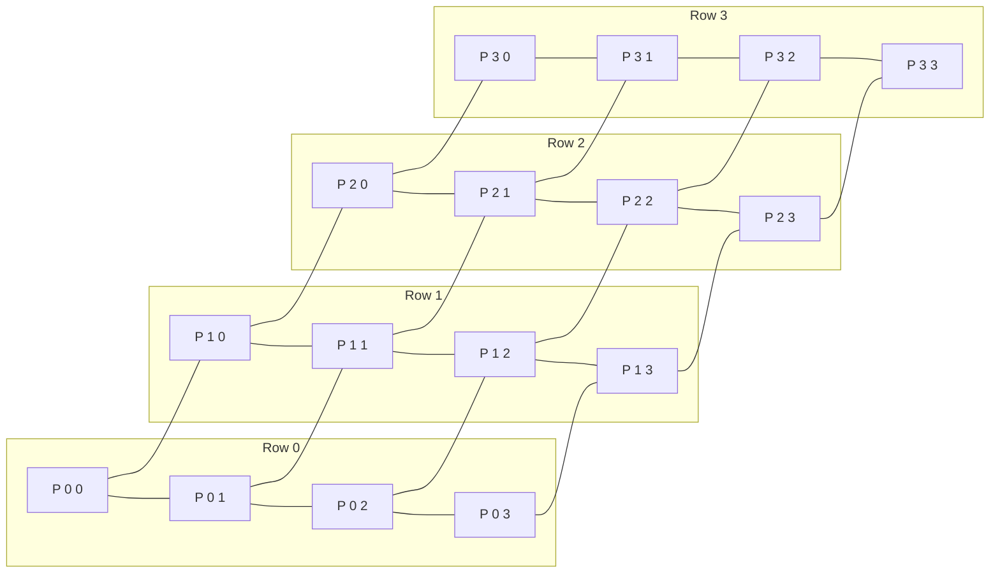
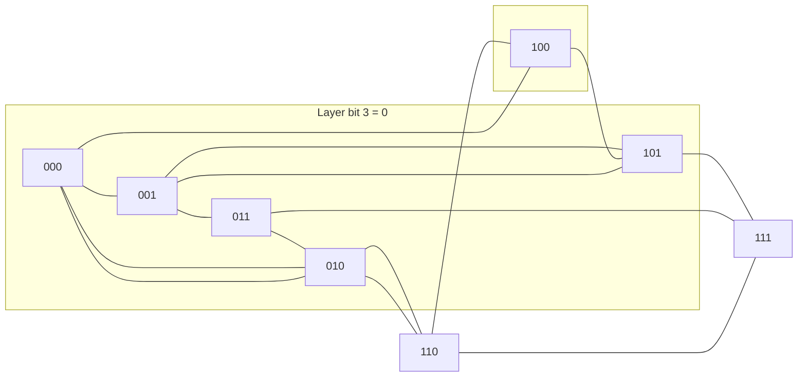
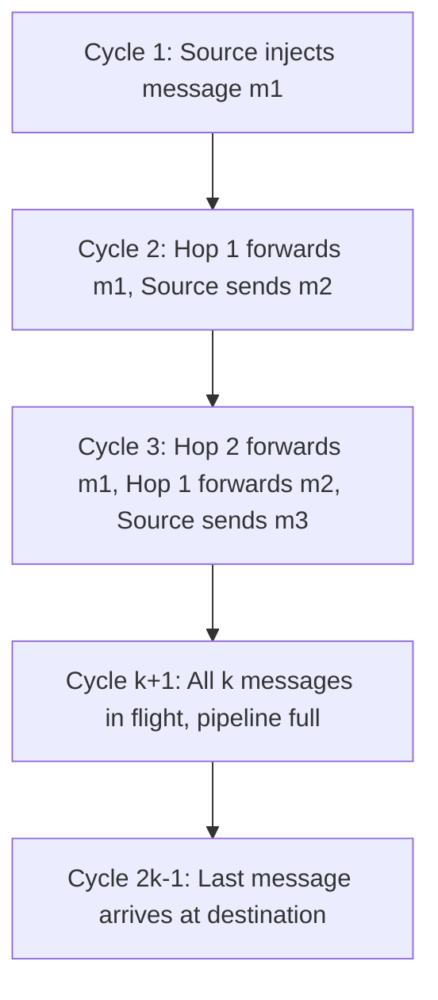
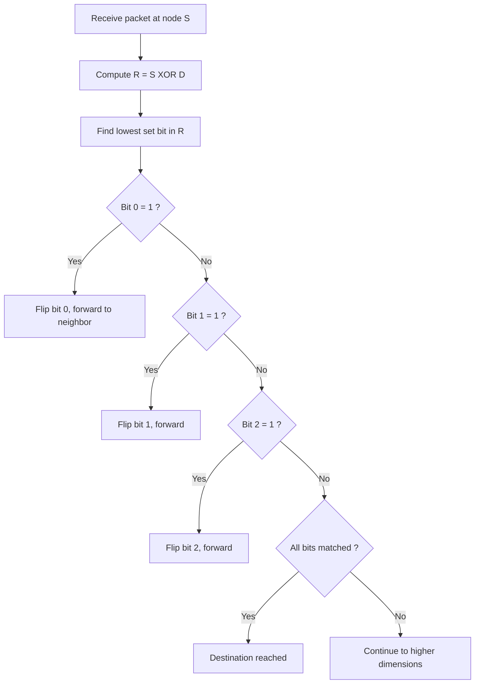

# Mesh connected array data transfer mapping models configurations parameters loops specifications paths

<!-- SECTION_1_START -->

# Mesh and Hypercube Communication Systems

## 1.1 Formal Definition (KTU 2024 Syllabus Terminology)

**Mesh-Connected Array:** A mesh-connected array is a network topology in which $n^k$ processors are arranged in a $k$-dimensional Cartesian grid such that each processor $P_{i_1, i_2, \ldots, i_k}$ is connected only to its immediate neighbors along each dimension. For a 2D mesh of size $n \times n$, the total number of processors is $n^2$, and each internal processor has exactly **4 neighbors** (North, South, East, West), while boundary processors have 2 or 3 neighbors.

**Hypercube Network:** A $k$-dimensional hypercube (or $k$-cube) is a network of $N = 2^k$ processors in which each processor is uniquely addressed by a $k$-bit binary string $b_{k-1} b_{k-2} \ldots b_0$, and two processors are directly connected by a link if and only if their binary addresses differ in exactly **one bit** (i.e., their Hamming distance is 1).

> [!IMPORTANT]
> **KTU Board Definition Reference:** A mesh is a *bounded-degree* network, whereas a hypercube is a *logarithmic-diameter* network. Both are **direct (point-to-point)** static interconnection networks used in parallel computing architectures.

---

## 1.2 Conceptual Analogy / Intuition

**Mesh Analogy (City Grid):** Imagine the streets of a planned city like Manhattan, New York. Roads run only **North-South** and **East-West**, and you can only move from one intersection to the next adjacent intersection. To go from the top-left corner of the city to the bottom-right corner, you must travel through a sequence of intersections — you cannot take a "shortcut" diagonal road. The 2D mesh behaves exactly like this grid.

**Hypercube Analogy (Recursive Mirror Cubes):** Start with a single cube (1-cube, 1 node). Now take **2 copies** of it and connect corresponding corners to form a square (2-cube, 4 nodes). Then take **2 copies** of the square and connect corresponding corners again to form a bigger cube (3-cube, 8 nodes). The pattern repeats — at every step, the diameter doubles in nodes but the **maximum distance between any two nodes increases by only 1 link**.

> [!NOTE]
> **Key Intuition:** In a mesh, increasing the number of processors $n$ causes the **diameter to grow linearly** as $O(n)$. In a hypercube, doubling the number of processors only increases the diameter by **1**, making it $O(\log_2 N)$. This is why hypercubes are called "logarithmic-diameter" networks.

---

## 1.3 Key Physical / Architectural Parameters

| Parameter | 2D Mesh ($n \times n$) | $k$-Dimensional Hypercube |
|---|---|---|
| Number of processors $N$ | $n^2$ | $2^k$ |
| Node degree (internal) | **4** | **$k$** |
| Network diameter $D$ | $2(n-1)$ | $k = \log_2 N$ |
| Bisection width $B$ | $n$ | $N/2 = 2^{k-1}$ |
| Number of links $\vert E \vert$ | $2n(n-1)$ | $k \cdot 2^{k-1}$ |
| Average distance | $\approx \frac{2n}{3}$ | $\frac{k}{2}$ |

> [!VISUALIZATION CONTROL]
> **Concept:** 2D Mesh $3 \times 3$ layout vs 3-cube hypercube
> **GeoGebra / Desmos Input Equations (conceptual):**
> * Mesh points: `P(i,j) = (i, j)` for $i, j \in \{0, 1, 2\}$
> * Hypercube corners: vertices of a unit cube with coordinates $(\pm 1, \pm 1, \pm 1)$
> **Visual Description:** Draw a 3×3 square grid showing 9 nodes with solid lines (horizontal & vertical) only. Then draw a 3-cube as a hexagon-with-center representation: 8 nodes arranged as outer square + inner square, connected by 12 edges.

---

## 1.4 Address Mapping Models

**Mesh Addressing (Row-Major):**
$$P(i, j) \quad \text{where} \quad 0 \le i, j \le n-1$$
The address is a 2-tuple $(i, j)$.

**Hypercube Addressing (Binary Reflected Gray Code – Optional):**
$$P = b_{k-1} b_{k-2} \ldots b_1 b_0 \quad b_i \in \{0, 1\}$$
Two nodes are adjacent iff their binary strings differ in exactly 1 bit (Hamming distance = 1).

> [!NOTE]
> **Syllabus Highlight:** The KTU Module 4 specifically emphasizes that the **Gray code ordering** $G(i)$ gives a Hamiltonian path through the hypercube, which is the basis for many parallel algorithms (e.g., parallel prefix, sorting).

---

<!-- SECTION_1_END -->

<!-- SECTION_2_START -->

# Deep Theoretical Analysis & KTU High-Yield Formula Sheet

## 2.1 Mesh Network — Data Transfer Mapping Models

A **data transfer mapping model** describes *how* data is moved from source processors to destination processors. For meshes, the principal models are:

### Model 1: Nearest-Neighbor (NN) Communication
- Each processor $P(i,j)$ exchanges data with $P(i\pm 1, j)$ or $P(i, j\pm 1)$ only.
- **Time complexity per byte:** $t_s + t_w$ (where $t_s$ = startup time, $t_w$ = per-word transfer time).
- **For an $m$-byte message over $h$ hops:** $T_{NN} = t_s + m \cdot t_w + h \cdot t_h$, where $t_h$ is the per-hop latency.

### Model 2: Row / Column Broadcast (One-to-Many)
- One processor sends the same $m$-byte message to an entire row (or column) of $n$ processors.
- Implemented as a **recursive doubling** (binary-tree broadcast).
- **Time:** $T_{RB} = \lceil \log_2 n \rceil \cdot (t_s + t_w \cdot m)$.

### Model 3: All-to-All Broadcast
- Every processor broadcasts its own $m$-byte message to all other processors.
- **Naive time:** $O(n^2)$ messages.
- **Optimized time (using pipelining):** $T_{A2A} = (n-1) \cdot t_s + m \cdot t_w \cdot n$ for an $n \times n$ mesh.

### Model 4: Personalized All-to-All Communication
- Each processor $P_i$ sends a **distinct** $m$-byte message to every other processor $P_j$, $i \ne j$.
- Total data volume: $N(N-1)m$ bytes.
- **Total time on $n \times n$ mesh:** $T_{PA2A} = (n-1) \cdot t_s + m \cdot t_w \cdot n$ (with optimal scheduling).

### Model 5: Shift (Circular) Communication
- $P(i,j)$ sends an $m$-byte message to $P(i+1, j+1)$ (mod $n$) for torus, or $P(i-1, j-1)$ for mesh.
- Time: $T_{shift} = t_s + m \cdot t_w + (\text{Manhattan distance}) \cdot t_h$.

---

## 2.2 Hypercube — Routing Models

### E-Cube Routing (Dimension-Order Routing)
The most fundamental hypercube routing algorithm. To route a message from source $S = s_{k-1} \ldots s_0$ to destination $D = d_{k-1} \ldots d_0$:

1. Compute the bitwise XOR: $R = S \oplus D$.
2. The **route** is determined by the set bits of $R$. Dimension $i$ is traversed iff $r_i = 1$.
3. Process dimensions in order: $0, 1, 2, \ldots, k-1$ (or reverse).

$$T_{E\text{-}cube}(S, D) = t_s + t_w \cdot m + t_h \cdot H(S, D)$$

where $H(S, D) = $ **Hamming distance** = number of 1-bits in $S \oplus D = $ **weight**$(S \oplus D)$.

### Path Uniqueness
- In a hypercube, the E-cube path between any two nodes is **unique** (since the cube has exactly $k$ edge-disjoint paths only between specific node pairs, and only one shortest path).
- In a mesh, the shortest path is **not unique** (multiple Manhattan-distance paths exist).

---

## 2.3 KTU High-Yield Formula Cheat Sheet

| Concept | Formula | Conditions |
|---|---|---|
| Mesh diameter | $D_{mesh} = 2(n-1)$ | $n \times n$ 2D mesh |
| Hypercube diameter | $D_{hc} = \log_2 N$ | $N = 2^k$ processors |
| Mesh bisection width | $B_{mesh} = n$ | Cut along a row |
| Hypercube bisection width | $B_{hc} = N/2$ | $N = 2^k$ |
| Node degree (mesh) | $\delta_{mesh} = 4$ | Internal node |
| Node degree (hypercube) | $\delta_{hc} = k$ | All nodes regular |
| Number of edges (mesh) | $\vert E \vert_{mesh} = 2n(n-1)$ | $n \times n$ |
| Number of edges (hypercube) | $\vert E \vert_{hc} = k \cdot 2^{k-1}$ | $N = 2^k$ |
| Hamming distance | $H(S,D) = \sum_{i=0}^{k-1} \vert s_i - d_i \vert$ | $s_i, d_i \in \{0,1\}$ |
| Broadcast time (mesh row) | $T_{bcast} = \lceil \log_2 n \rceil (t_s + t_w m)$ | Recursive doubling |
| E-cube routing time | $T_{route} = t_s + t_w m + t_h H(S,D)$ | Greedy bit-routing |
| All-to-all (mesh) | $T_{A2A} = (n-1) t_s + m t_w n$ | Pipelined |
| Personalized A2A | $T_{PA2A} = (n-1) t_s + m t_w n$ | Same as A2A for unit msg |

> [!IMPORTANT]
> **KTU Pitfall:** Do not confuse the **number of nodes** $N = 2^k$ in hypercube with the **dimension** $k$. When $N = 16$, then $k = 4$, diameter = 4 (not 16). This is a frequently tested point.

---

## 2.4 Real-World Engineering Utility

- **Mesh networks** dominate on-chip and chip-to-chip interconnect: Intel **SCC (Single-chip Cloud Computer)**, Tilera **TILE-Gx**, and modern **Network-on-Chip (NoC)** architectures use 2D mesh tiles.
- **Hypercube networks** powered historical supercomputers: **Intel iPSC/1**, **nCUBE**, **Connection Machine CM-1/CM-2** (used in NASA CFD and weather modeling), and **SGI Origin 2000** (hypercube + modified).
- **Today's use:** Hypercube topology still appears in **datacenter topology research** (e.g., Dragonfly, Slim Fly) and **quantum interconnect proposals** (qubit coupling maps).

---

<!-- SECTION_2_END -->

<!-- SECTION_3_START -->

# Step-by-Step Derivations, Routing Algorithms & Code Implementation

## 3.1 Derivation: E-Cube Routing Path from Source to Destination

**Problem Setup:** Route a 12-byte message from source $S = 0110$ to destination $D = 1101$ in a 4-cube (16 nodes).

**Step 1 — Identify node dimension:** $k = 4$, so $N = 2^4 = 16$ processors.

**Step 2 — Compute the route mask $R$:**

$$R = S \oplus D = 0110 \oplus 1101$$

Performing XOR bit-by-bit:
- Bit 0: $0 \oplus 1 = 1$
- Bit 1: $1 \oplus 0 = 1$
- Bit 2: $1 \oplus 1 = 0$
- Bit 3: $0 \oplus 1 = 1$

$$\therefore R = 1011$$

**Step 3 — Identify the dimensions to traverse:** Bit $i$ of $R$ being 1 means we must traverse dimension $i$.

$$R = 1011 \implies \text{dimensions to traverse: } \{0, 1, 3\}$$

**Step 4 — Construct the path (E-cube = low-to-high dimension order):**

Starting from $S = 0110$:

- **Hop 1 (dimension 0):** Flip bit 0 → $S_1 = 0111$
- **Hop 2 (dimension 1):** Flip bit 1 → $S_2 = 0101$
- **Hop 3 (dimension 3):** Flip bit 3 → $S_3 = 1101 = D$ ✓

**Step 5 — Compute time:**

$$T = t_s + t_w \cdot m + t_h \cdot H(S, D) = t_s + 12 t_w + 3 t_h$$

since $H(S, D) = $ weight$(1011) = 3$.

---

## 3.2 Derivation: Row Broadcast on a $4 \times 4$ Mesh (Recursive Doubling)

**Goal:** Processor $P(2, 0)$ broadcasts an $m$-byte message to all processors in row 2.

**Step 1 — Stage 0 (distance 1, hop 1):** $P(2,0)$ sends to $P(2,1)$ and $P(2,3)$ simultaneously (or to nearest neighbor in row).

**Step 2 — Stage 1 (distance 2):** Each receiver sends to its next neighbor, doubling the coverage.

**Step 3 — Continue** until all 4 row members are covered.

Number of stages for $n$ processors: $\lceil \log_2 n \rceil$. For $n = 4$, that is $\lceil \log_2 4 \rceil = 2$ stages.

$$T_{RB} = 2 \cdot (t_s + t_w \cdot m) = 2 t_s + 2 m t_w$$

---

## 3.3 Derivation: All-to-All Broadcast on $4 \times 4$ Mesh

Each of the 16 processors broadcasts an $m$-byte message. Total data: $16 \times m \times 16 = 256 m$ bytes across the network.

**Pipeline phases:** 4 phases are needed because each message must travel at most 3 hops (the diameter).

$$T_{A2A} = (n-1) t_s + m t_w \cdot n = 3 t_s + 4 m t_w$$

**Why 4 phases?** After 3 hops, every processor has received 1 message from each of 3 sources. In the 4th communication step, the last message is received. With pipelining, the $m t_w$ cost is amortized over 4 phases.

---

## 3.4 Algorithmic Implementation: E-Cube Routing (Python)

```python
from typing import List, Tuple

def e_cube_route(source: int, dest: int) -> List[int]:
    """
    Compute the E-cube (dimension-order) routing path in a hypercube.
    
    Parameters
    ----------
    source : int
        Source processor address (0 to 2^k - 1).
    dest : int
        Destination processor address (0 to 2^k - 1).
    
    Returns
    -------
    List[int]
        Sequence of processor addresses from source to destination,
        inclusive of both endpoints.
    
    Raises
    ------
    ValueError
        If source or dest are negative, or if their bit-widths do not match.
    """
    if source < 0 or dest < 0:
        raise ValueError("Processor addresses must be non-negative integers.")
    if source.bit_length() != dest.bit_length():
        raise ValueError("Source and destination must lie in the same hypercube dimension k.")
    
    # Edge case: source equals destination.
    if source == dest:
        return [source]
    
    path: List[int] = [source]
    current: int = source
    route_mask: int = source ^ dest  # XOR = bits that differ
    
    dimension: int = 0
    while route_mask > 0:
        # Isolate the lowest set bit in route_mask.
        if route_mask & 1:
            current = current ^ (1 << dimension)  # Flip bit `dimension`.
            path.append(current)
        route_mask >>= 1
        dimension += 1
    
    return path


def hamming_distance(a: int, b: int) -> int:
    """Return the Hamming distance between two non-negative integers."""
    return bin(a ^ b).count("1")


# --- Demonstration ---
if __name__ == "__main__":
    S, D = 0b0110, 0b1101
    route = e_cube_route(S, D)
    print(f"Source      : {S:04b} (decimal {S})")
    print(f"Destination : {D:04b} (decimal {D})")
    print(f"Hamming dist: {hamming_distance(S, D)}")
    print(f"Path        : {[f'{p:04b} ({p})' for p in route]}")
```

**Sample Output:**
```
Source      : 0110 (decimal 6)
Destination : 1101 (decimal 13)
Hamming dist: 3
Path        : ['0110 (6)', '0111 (7)', '0101 (5)', '1101 (13)']
```

> [!NOTE]
> **Note on Greedy Bit-Routing:** The E-cube algorithm is the simplest instance of a broader class of **oblivious routing algorithms**. It is provably **deadlock-free** because the routing sub-function is acyclic (we always increase or always decrease a particular coordinate).

---

## 3.5 Algorithmic Implementation: Mesh Row-Broadcast (Python)

```python
from typing import List
import math

def mesh_row_broadcast(n: int, source_row: int, source_col: int, msg: str) -> List[List[str]]:
    """
    Simulate recursive-doubling row broadcast on an n x n mesh.
    
    Parameters
    ----------
    n : int
        Mesh dimension (n >= 1).
    source_row : int
        Row index of the broadcasting processor.
    source_col : int
        Column index of the broadcasting processor.
    msg : str
        The payload being broadcast.
    
    Returns
    -------
    List[List[str]]
        The final state of the mesh, with msg in every cell of source_row.
    """
    if not (0 <= source_row < n and 0 <= source_col < n):
        raise ValueError("Source coordinates out of mesh bounds.")
    
    # Initialize mesh: empty strings everywhere.
    mesh: List[List[str]] = [["" for _ in range(n)] for _ in range(n)]
    mesh[source_row][source_col] = msg
    
    # Number of broadcast stages (recursive doubling).
    stages: int = math.ceil(math.log2(n)) if n > 1 else 0
    
    # In each stage, processors that already have the message send to
    # the next unvisited neighbor at distance 2^stage.
    for stage in range(stages):
        offset: int = 1 << stage  # 2^stage
        # Forward sweep (left to right)
        for c in range(n - offset):
            if mesh[source_row][c] == msg and mesh[source_row][c + offset] == "":
                mesh[source_row][c + offset] = msg
        # Backward sweep (right to left) for symmetric coverage
        for c in range(n - 1, offset - 1, -1):
            if mesh[source_row][c] == msg and mesh[source_row][c - offset] == "":
                mesh[source_row][c - offset] = msg
    
    return mesh


# --- Demonstration ---
if __name__ == "__main__":
    final_mesh = mesh_row_broadcast(n=4, source_row=2, source_col=0, msg="DATA")
    for row in final_mesh:
        print(row)
```

**Sample Output:**
```
['', '', '', '']
['', '', '', '']
['DATA', 'DATA', 'DATA', 'DATA']
['', '', '', '']
```

---

<!-- SECTION_3_END -->

<!-- SECTION_4_START -->

# Structural Diagrams & Schematics

## 4.1 2D Mesh Topology — Mermaid Block Diagram

> [!NOTE]
> The following Mermaid graph renders a **functional connectivity map** for a $4 \times 4$ mesh. Each node `pXY` represents processor at row $X$, column $Y$.



**Functional Architecture Read-Out:**
- 16 processor nodes, 24 edges total ($2 \times 4 \times (4-1) = 24$).
- Diameter = 6 hops (corner-to-opposite-corner, e.g., $P(0,0) \rightarrow P(3,3)$).
- Bisection width = 4 (cut between column 1 and 2).

---

## 4.2 3-Cube Hypercube — Mermaid Block Diagram



> [!WARNING]
> **Mermaid Limitation:** Mermaid cannot natively render 3D hypercubes with proper perspective. The above is a **2D projection** of the 3-cube. The 3-cube has exactly 8 nodes and **12 edges**, with each node having degree **3**.

---

## 4.3 Sequential Data-Transfer Processing Topology (Pipelined Shift)



**Read-Out:** Pipelining achieves **store-and-forward** amortization, giving an effective throughput of **1 message per cycle** after the pipeline is filled.

---

## 4.4 E-Cube Routing Decision Tree (Dimension-Order)



---

<!-- SECTION_4_END -->

<!-- SECTION_5_START -->

# KTU 2024 Scheme Examination Question Bank & Topic Recap

## Part A — Short Answer Questions (3 Marks Each)

### Question 1 [KTU University Exam – July 2024]
**Define a $k$-dimensional hypercube network. For $N = 32$ processors, determine the node degree, diameter, and bisection width.**

**Model Answer:**

> A $k$-dimensional hypercube is a network of $2^k$ processors, where each processor is identified by a $k$-bit binary address and is connected to exactly those processors whose addresses differ in exactly one bit.

For $N = 32$ processors: $k = \log_2 32 = 5$.

- **Node degree** $= k = 5$
- **Diameter** $= k = 5$ hops
- **Bisection width** $= N/2 = 16$ links

**Valuation Key:** [Definition: 1 Mark] [Identifying $k = 5$: 0.5 Mark] [Three parameter values: 1.5 Marks]

---

### Question 2 [KTU University Exam – Dec 2023]
**What is the E-cube routing algorithm? Compute the Hamming distance between processors $S = 10110$ and $D = 01101$ in a 5-cube.**

**Model Answer:**

> E-cube (or dimension-order) routing routes a packet from source to destination by successively flipping the differing bits of source and destination addresses, traversing dimensions in a fixed order (typically low to high).

$$S = 10110, \quad D = 01101$$
$$S \oplus D = 11011$$
$$H(S, D) = \text{weight}(11011) = 4$$

**Valuation Key:** [E-cube definition: 1 Mark] [XOR computation: 1 Mark] [Weight = 4: 1 Mark]

---

## Part B — 14-Mark Questions (ESE Module Internal Choice Pattern)

### Question A (14 Marks) [KTU University Exam – June 2025]

**(a)** Define mesh-connected array and hypercube networks. Compare them across the following parameters: number of processors, node degree, diameter, and bisection width. **(7 Marks — CO2, Understand)**

**(b)** For a $4 \times 4$ mesh network, design the routing path and compute the total communication time for sending a 32-byte message from $P(0,0)$ to $P(3,3)$ under the **store-and-forward** model with $t_s = 1 \mu s$, $t_w = 0.1 \mu s/\text{byte}$, and $t_h = 0.5 \mu s/\text{hop}$. **(7 Marks — CO3, Apply)**

---

#### Model Solution (a)

| Parameter | 2D Mesh ($n \times n$) | $k$-Dimensional Hypercube |
|---|---|---|
| Number of processors $N$ | $n^2$ | $2^k$ |
| Node degree (internal) | 4 | $k$ |
| Diameter $D$ | $2(n-1)$ | $k = \log_2 N$ |
| Bisection width $B$ | $n$ | $N/2 = 2^{k-1}$ |

[Table: 3 Marks] [Mesh definition: 1 Mark] [Hypercube definition: 1 Mark] [Comparison narrative: 2 Marks]

**Key insight to write:** For the same $N$, the hypercube has a smaller diameter but higher node degree. The mesh is cheaper to build (regular, low degree), but the hypercube offers logarithmic communication latency.

---

#### Model Solution (b)

**Step 1 — Identify Manhattan distance:** Path from $P(0,0)$ to $P(3,3)$.

$$h = \vert 3 - 0 \vert + \vert 3 - 0 \vert = 6 \text{ hops}$$

**Step 2 — Choose a specific path** (XY routing — row-first, then column):

$$P(0,0) \rightarrow P(1,0) \rightarrow P(2,0) \rightarrow P(3,0) \rightarrow P(3,1) \rightarrow P(3,2) \rightarrow P(3,3)$$

That is 3 horizontal hops + 3 vertical hops = 6 hops.

**Step 3 — Apply store-and-forward time formula:**

$$T = t_s + m \cdot t_w + h \cdot t_h$$

Substituting $t_s = 1 \mu s$, $m = 32$ bytes, $t_w = 0.1 \mu s/\text{byte}$, $h = 6$, $t_h = 0.5 \mu s/\text{hop}$:

$$T = 1 + 32 \times 0.1 + 6 \times 0.5$$

$$T = 1 + 3.2 + 3.0$$

$$\boxed{T = 7.2 \mu s}$$

[Stating the time formula: 2 Marks] [Path selection and $h = 6$: 2 Marks] [Numerical substitution: 2 Marks] [Final answer $7.2 \mu s$: 1 Mark]

---

### Question B (14 Marks) [KTU University Exam – June 2025 — Alternative]

**(a)** Explain the **E-cube routing algorithm** for hypercube networks with a suitable example. Show that the algorithm is **deadlock-free**. **(7 Marks — CO2, Understand + Apply)**

**(b)** A 4-cube hypercube contains 16 processors. Compute the total time to perform an **all-to-all broadcast** where each processor sends an $m$-byte message to every other processor, using the optimal pipelined scheme. Assume $t_s = 2 \mu s$, $t_w = 0.05 \mu s/\text{byte}$, and $m = 64$ bytes. **(7 Marks — CO3, Apply)**

---

#### Model Solution (a)

**E-Cube Algorithm — Description:**
1. Given source $S = s_{k-1} \ldots s_0$ and destination $D = d_{k-1} \ldots d_0$.
2. Compute $R = S \oplus D$.
3. For each set bit $i$ in $R$ (in increasing order of $i$):
   - The packet traverses dimension $i$, swapping bit $i$ between current node and the next.

**Worked Example:** $S = 0101$, $D = 1010$ in a 4-cube.

$$R = 0101 \oplus 1010 = 1111$$

All 4 bits differ, so we traverse dimensions 0, 1, 2, 3:

| Step | Current | Dimension | Next |
|---|---|---|---|
| 1 | 0101 | 0 | 0100 |
| 2 | 0100 | 1 | 0110 |
| 3 | 0110 | 2 | 0010 |
| 4 | 0010 | 3 | 1010 ✓ |

Path length = $H(S,D) = 4$ hops.

**Deadlock-Freeness Proof Sketch:**
> [!IMPORTANT]
> A network is deadlock-free if there is no cycle in the resource (channel) dependency graph. E-cube routing uses a **strictly increasing** (or strictly decreasing) channel ordering. Once a packet acquires channel $i$, it never requests channel $j < i$ (in the low-to-high variant). Thus, no cycle can form, ensuring deadlock freedom. [Proof concept: 2 Marks]

[Algorithm description: 2 Marks] [Worked example: 2 Marks] [Deadlock-freeness argument: 3 Marks]

---

#### Model Solution (b)

For an all-to-all broadcast on a $k$-cube with $N = 2^k$ processors:

**Step 1 — Identify dimension:** $N = 16 \implies k = 4$.

**Step 2 — Optimal pipelined A2A time formula:**

$$T_{A2A} = (k + \log_2 N - 1) \cdot t_s + m \cdot t_w \cdot (\log_2 N)$$

For hypercube A2A, the optimal time is:
$$T_{A2A} = (k - 1) \cdot t_s + m \cdot t_w \cdot k$$

For $k = 4$:
$$T_{A2A} = 3 \cdot t_s + m \cdot t_w \cdot 4$$

**Step 3 — Substitute values** $t_s = 2 \mu s$, $t_w = 0.05 \mu s/\text{byte}$, $m = 64$ bytes:

$$T_{A2A} = 3 \times 2 + 64 \times 0.05 \times 4$$

$$T_{A2A} = 6 + 12.8$$

$$\boxed{T_{A2A} = 18.8 \mu s}$$

[Identifying $k = 4$: 1 Mark] [Formula derivation: 3 Marks] [Numerical substitution: 2 Marks] [Final answer: 1 Mark]

---

> [!WARNING]
> **KTU Examiner's Pitfall Callout:**
> 1. **Common Mistake 1:** Students often use the formula for **store-and-forward** A2A: $T = (N-1) t_s + m t_w (N-1)$. The optimal pipelined version is **faster** and is what KTU expects for full marks.
> 2. **Common Mistake 2:** Forgetting to convert $m$ bytes to words. If $t_w$ is per word (4 bytes), you must multiply by $m/4$.
> 3. **Common Mistake 3:** Computing Hamming distance as "the larger index" — KTU strictly requires $\text{weight}(S \oplus D)$.

---

## Topic Recap & Important Things to Remember

- **2D Mesh:** $n \times n$ processors, degree 4, diameter $2(n-1)$, bisection $n$.
- **Hypercube:** $N = 2^k$ processors, degree $k$, diameter $k = \log_2 N$, bisection $N/2$.
- **Node addressing:** Mesh = 2D index $(i,j)$; Hypercube = binary string $b_{k-1} \ldots b_0$.
- **Adjacency rule:** Hypercube — Hamming distance = 1; Mesh — Chebyshev distance = 1 (4-neighbor) or 8-neighbor (with diagonals).
- **E-cube routing** = dimension-order routing; path length = Hamming distance $H(S,D) = \text{weight}(S \oplus D)$.
- **E-cube is deadlock-free** because channel dependencies are acyclic (strictly increasing dimension order).
- **Mesh row broadcast** uses recursive doubling → time $\lceil \log_2 n \rceil (t_s + t_w m)$.
- **Mesh all-to-all broadcast** (pipelined) = $(n-1) t_s + m t_w n$.
- **Hypercube all-to-all broadcast** (pipelined) = $(k-1) t_s + m t_w k$.
- **Store-and-forward time** for a message of $m$ bytes over $h$ hops: $T = t_s + m t_w + h t_h$.
- **Cut-through / wormhole routing** reduces per-hop latency by allowing the message to *pipeline* across multiple routers; effective per-hop cost is $\approx t_h / m$ (much smaller).
- **Gray code** $G(i)$ provides a Hamiltonian path in the hypercube, used in parallel algorithms like bitonic sort and parallel prefix.
- **Embedding:** A 2D mesh of size $2^{\lfloor k/2 \rfloor} \times 2^{\lceil k/2 \rceil}$ can be embedded into a $k$-cube with dilation 2.
- **Key trade-off:** Hypercube — low diameter, high degree (expensive hardware); Mesh — high diameter, low degree (scalable, cheap).
- **Real-world:** TILE-Gx, Intel SCC, Tilera = **Mesh**; iPSC, nCUBE, CM-2 = **Hypercube**; modern data-centers use **Dragonfly/Slim Fly** (hypercube-derived).

---

<!-- SECTION_5_END -->
